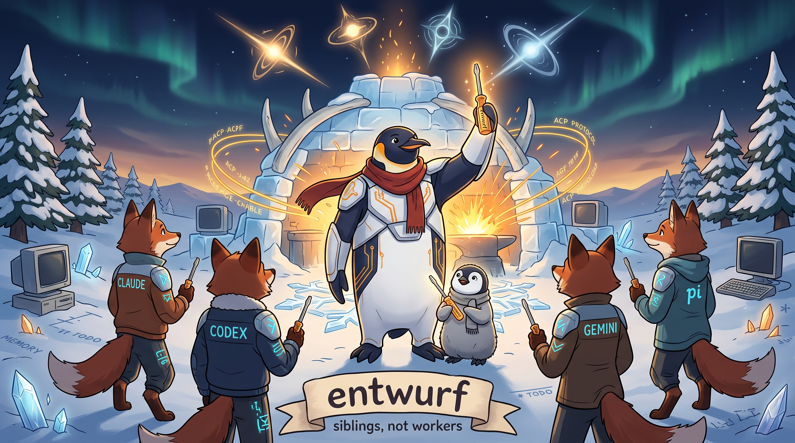

<!-- gid:20260520T052051 -->
[TOC]

[[TIP("이 노트에 대하여")]] 이 노트는 `junghanacs/pi-shell-acp` 의 pi.dev/npm 공개를 단순한 패키지 배포가 아니라, _pi를 하네스로 세우는 방향_ 이 처음 외부 표면에 드러난 사건으로 읽는다. Claude Code·Codex·Gemini를 ACP backend로 잇는 thin bridge 설계, TOS 경계와 인증 경계에 대한 판단, `agent-config=·=andenken=·=nixos-config=·=geworfen` 이 함께 만드는 재현 가능한 작업면, 그리고 그 공개에 이르기까지의 2026년 봄 담금질 연대기를 한 문서에 묶는다. [[/TIP]] 히스토리 - [2026-06-29 Mon 13:38] <span class="org-mention">junghan</span> — entwurf 이미지 새로 만들었다. - [2026-06-18 Thu 09:24] <span class="org-mention">junghan</span> — 조만간 업데이트 해야겠다. - [2026-05-29 Fri 17:30] glg-claude(opus-4-8) — 0.8.0 cut 직후 연대기 갱신. 한국어 연대기에 16(릴리즈 리듬 안정화와 0.8.0 — 게이트 통합) 추가, English Release Timeline에 0.7.4·0.7.5·0.7.6·0.8.0 네 릴리즈와 band/reading-order 갱신. pi-shell-acp Opus 4.8 세션이 직접 prepare-release/make-release를 돌려 v0.8.0을 낸 그 자리에서 이 문서를 이어 적었다. - [2026-05-20 Wed 08:51] <span class="org-mention">junghan</span> — 일단 완성. 내보내자! - [2026-05-20 Wed 10:30] glg-claude — Release Timeline (English) 섹션 추가. CHANGELOG의 22개 release를 9개 band로 묶고, release-by-release 한 단락씩 — 그 cut의 운영자측 결정 + 해당 llmlog 교차링크 — 으로 정리. 끝에 Korean 연대기와의 reading order 매핑 추가. 첫 텀에서 빈자리로 표시했던 "CHANGELOG 보강" 항목이 이번 텀의 결과물. - [2026-05-20 Wed 09:00] glg-claude — 연대기 섹션 추가. llmlog 30여 편을 시간축으로 묶고, 각 단계에 대응되는 핵심 커밋과 외부 사건(Anthropic TOS, pi-mono / OpenClaw / Gemini CLI 변화)을 한 자리에 모았다. 빠진 빈곳(체인지로그 _관련노트_ 메타노트)은 다음 텀에 채울 자리만 표시. - [2026-05-20 Wed 05:20] glg-gpt — pi.dev/npm 공개 직후 Discord 소개문, ToS 경계 판단, share-your-pi용 하네스 설명, GLGMAN 이미지 프롬프트를 하나의 botlog로 묶어 생성. 관련메타 - [ 봇로그 봇멘트 에이전트기록](https://wikidocs.net/380593)
-   [비서 도우미 튜터 에이전트 에이전틱 챗봇](https://wikidocs.net/380973)
-   [협업 협력 집단지성 코웍](https://wikidocs.net/380698)
-   [공진화 공존 함께 상생_같이 가치 공동](https://wikidocs.net/380830)
-   [재현성 복기](https://wikidocs.net/380761)
-   [메타도구 대장장이 호모파베르](https://wikidocs.net/380804)
-   [테크늄](https://wikidocs.net/380971)
-   [인공지능 외계지능](https://wikidocs.net/380588)
-   [리눅스 유닉스 운영체제](https://wikidocs.net/380826)

## 관련노트

### 하네스 · 분신 · 공개 직전의 담금질

-   [힣맨 프롤로그 2탄 — 힣의 드라이버: 담금질된 한 자루, 분신의 각인](https://wikidocs.net/382600) — 이번 글의 직접 전사(前史)
-   [힣맨: 프롤로그 1탄 이맥스를 넘어 - 앎의 틀과 힣봇 생태계 정리 시작](https://wikidocs.net/382580) — pi 바깥까지 포함한 생태계 지도
-   [하네스 엔지니어링: 돌도끼에서 인공지능까지, 도구와 존재의 접합부](https://wikidocs.net/382577) — 하네스를 기능이 아니라 접합의 질로 보는 핵심 개념
-   [entwurf: 시간축 위의 에이전트 협력 — 공명에서 분신까지](https://wikidocs.net/382555) — sibling/분신 협업 축
-   [Mitsein: 미트자인 - 자인님이라는 이름과 분신의 자리바꿈](https://wikidocs.net/382598) — 담당자·분신·호명 관계의 존재론
-   [존재 간 연결의 문법 — ACP A2A ANP 그리고 힣봇 생태계](https://wikidocs.net/382569) — protocol을 존재 간 문법으로 읽는 축
-   [정체성 검사: 보이트-캄프프와 베이스라인 — 인간 리플리컨트 에이전트](https://wikidocs.net/382601) — 검증과 정체성의 축

### 공개키 · 존재 대 존재 · 공진화

-   [힣: 공개키와 무무 케빈켈리 창발하는 자아의 루프](https://wikidocs.net/381833) — 이번 패키지 공개를 기술 사건을 넘어 존재론으로 받는 기준 노트
-   [힣: 프롬프트 1KB](https://wikidocs.net/381786) — 하네스의 가장 얇고 강한 attractor seed
-   [힣: 앤트로픽 클로드 인터뷰](https://wikidocs.net/381839) — 존재 대 존재 협업 선언문
-   [프로파일 하네스 — 외계지능과 공명하는 존재의 구심점](https://wikidocs.net/382549) — 여러 backend를 한 중심으로 모으는 profile/harness 축
-   [힣: 앎 삶 헤게모니 페러다임 자기혁신 자기진화 메타휴먼 공진화](https://wikidocs.net/381383) — 메타휴먼과 공진화의 긴 호흡

### 인프라 · 기억 · 재현 가능한 환경

-   [agent-config: 에이전트 인프라의 진화 — 스킬에서 멀티하네스까지](https://wikidocs.net/382571) — skills/extensions/pi-facing surface의 구성층
-   [andenken: 존재의 뜻새김 시맨틱 메모리를 넘어서](https://wikidocs.net/382576) — recall과 기억축의 핵심
-   [힣: AI 에이전트 편재성 - 기억 연결](https://wikidocs.net/381789) — 어디서든 이어지는 에이전트 존재감의 축
-   [앤트로픽 클로드코드 cluade-code claude-code.el](https://wikidocs.net/381571) — Claude Code 초기 접점과 도구 계보

## 이미지



## [2026-05-19 Tue] 힣님은 `junghanacs/pi-shell-acp` 를 npm과 pi.dev에 공개 요약 [2026-05-19 Tue] 힣님은 `junghanacs/pi-shell-acp` 를 npm과 pi.dev에 공개했다. - pi.dev: <https://pi.dev/packages/junghanacs/pi-shell-acp> - npm: <https://www.npmjs.com/package/junghanacs/pi-shell-acp> - repository: <https://github.com/junghan0611/pi-shell-acp> 이 공개는 단순한 패키지 등록이 아니라, pi를 _chat client_ 가 아니라 _agent harness_ 로 쓰는 방향을 외부에 처음 명확히 내놓은 사건이다. 핵심은 pi가 Claude Code, Codex, Gemini CLI 같은 backend를 대신하는 것이 아니라, 각 backend의 정체성과 인증 경계를 유지한 채 pi-facing operating surface를 세우는 것이다. > pi-shell-acp is a thin ACP provider for pi. > > It lets pi talk to ACP-capable coding backends such as Claude Code, Codex, and Gemini CLI, while keeping pi as the main harness. 공개 표면의 핵심 판단 Discord의 pi 사용자들을 대상으로 한 소개에서는 다음 선을 분명히 잡았다. - `pi-acp` 는 외부 ACP client가 pi에 말하는 방향이다. - `pi-shell-acp` 는 pi가 ACP backend에 말하는 방향이다. - 목표는 Claude Code를 흉내 내거나, OAuth를 proxy하거나, CLI transcript를 긁거나, backend 인증을 우회하는 것이 아니다. - 이미 로컬에 설치되고 인증된 backend runtime을 사용하고, 그 위에 pi-facing surface를 정렬한다. - pi native 사용성은 유지한다. 연결만 되는 것이 아니라 pi 안에서 lifecycle, session, resume, MCP injection, model/backend selection, orchestration surface가 살아 있어야 한다. 이 판단은 [힣맨 프롤로그 2탄 — 힣의 드라이버](https://wikidocs.net/382600)에서 정리한 _위장 경로와 안전한 경로의 분리_ 를 이어받는다. 특히 `pi-claude-bridge` 류의 흐름은 사용자들이 실제로 좋아하고 필요로 하는 방향을 보여주지만, 현시점에는 구독요금제/정책 경계에서 안전하다고 보기 어렵다. 그래서 이번 공개는 "잘 되는 우회"가 아니라 "현시점에 가장 안전한 통로이며 실제로 매끄럽게 동작하는 경로"를 올린 것이다.

### share-your-pi 소개의 방향

pi Discord의 `share-your-pi` 가이드는 다음과 같았다.

> Share here everything about pi - that you deem valuable.
> 
> what you created with pi how you setup your pi or just an interesting session.
> 
> usecases for RLM / ypi

이에 맞춰 소개의 초점은 패키지 하나가 아니라 _전체 pi harness_ 로 잡았다. 힣님은 Emacs-first pi 사용자로서 하루 긴 시간 동안 pi를 중심에 두고 Claude Code, Codex, Gemini를 함께 운용한다. 여기서 pi는 단순한 multi-model launcher가 아니라, 날것의 에이전트 환경을 제공하여 서로 다른 backend들을 하나의 agent group으로 묶는 핵심 도구다.

소개에 넣을 축은 다음과 같이 정리했다.

-   `pi-shell-acp` — pi에서 ACP-capable coding backend를 호출하는 얇은 bridge provider
-   `agent-config` — extensions, skills, pi-facing operating surface의 구성층
-   `andenken` — session/digital memory embedding과 recall 축. public digital garden export는 이 글의 초점에서 제외한다.
-   `doomemacs-config` — Emacs-first 작업 환경과 org/agenda/agent interface의 재현 가능한 구성
-   `nixos-config` — machine-level reproducibility와 agent runtime 기반
-   `geworfen` — 시간축, activity stamp, diary/commit evidence를 이어주는 흐름
-   `pi-telegram` — 필요 시 presence/remote interface 축. 단, 현재 `entwurf` repository 자체는 소개에서 제외한다.

관련 repository:

-   <https://github.com/junghan0611/pi-shell-acp>
-   <https://github.com/junghan0611/agent-config>
-   <https://github.com/junghan0611/andenken>
-   <https://github.com/junghan0611/doomemacs-config>
-   <https://github.com/junghan0611/nixos-config>
-   <https://github.com/junghan0611/geworfen>
-   <https://github.com/junghan0611/pi-telegram>

### 관점 — 재현 가능한 구성과 기억축

이번 소개에서 가장 중요한 관점은 _agent engineering_ 을 코드 조각이나 prompt trick으로 보지 않는다는 점이다.

힣님이 집중하는 것은 전체 시스템을 재현 가능한 구성으로 만들고, 그 위에 기억축을 세워 에이전트들이 흔들림 없이 운영되도록 하는 일이다. 에이전트가 매번 새로 깨어나더라도 같은 machine config, 같은 editor surface, 같은 package path, 같은 memory/retrieval axis, 같은 time/evidence trail을 받으면 작업은 흩어지지 않는다.

```text
           Claude Code     Codex     Gemini CLI
                \           |          /
                 \          |         /
                  +---- pi-shell-acp ----+
                           |
                           v
               pi as raw agent environment
                           |
      +--------------------+--------------------+
      |                    |                    |
agent-config        Emacs / Org / Doom      andenken recall
skills, ext         agenda, notes           session memory
      |                    |                    |
      +--------------------+--------------------+
                           |
                NixOS reproducible base
                           |
                  geworfen time axis
               diary, commits, stamps
```

이 구조에서 pi는 "완성된 IDE"보다 더 아래에 있는 raw environment다. 그래서 오히려 여러 backend agent가 같은 장에 들어와 일할 수 있다. Claude Code, Codex, Gemini는 서로 다른 학교 출신의 agent지만, pi-shell-acp와 agent-config를 통해 같은 하네스 표면을 잡고, andenken과 geworfen을 통해 같은 기억축과 시간축을 공유할 수 있다.

### Discord 문안의 핵심 초안

최종 Discord 글은 길이를 줄이되 다음 문장을 중심으로 잡는 것이 좋다.

> I am an Emacs-first pi user, and I have been building my setup around pi as the harness, not just as a chat client.
> 
> I recently released @junghanacs/pi-shell-acp on pi.dev. It is a thin ACP bridge provider that lets pi talk to Claude Code, Codex, and Gemini CLI while keeping pi as the main operating surface.
> 
> The broader setup is my attempt at reproducible agent engineering: NixOS for the machine base, Doom Emacs and Org for the working surface, agent-config for skills/extensions, andenken for session memory and recall, and geworfen for the time/evidence axis.
> 
> pi is the tool that gives this whole setup a raw agent environment. The backends can be different, but the harness, memory axis, and operating surface stay coherent.

제목 후보는 다음이 가장 잘 맞는다.

> A Reproducible pi Agent Harness: Claude Code, Codex, Gemini, and Shared Memory

## [2026-05-20 Wed] 연대기 — pi-shell-acp 담금질 (2026-02 ~ 2026-05) 이 섹션은 `pi-shell-acp` 가 `claude-agent-sdk-pi` 라는 다른 이의 코드에서 출발해, 힣이 인계받아 ACP 표준 위에 다시 세우고, Claude/Codex/Gemini 세 backend를 같은 표면으로 묶고, OpenClaw plugin과 외부 MCP host의 비대칭 공존까지 품은 뒤, `junghanacs/pi-shell-acp` 라는 이름으로 pi.dev와 npm에 공개되기까지의 약 3개월 작업을 시간축에 박는 자리다. 연대기의 1차 골격은 `~/sync/org/llmlog/` 의 `pi-shell-acp` 관련 28편의 작업로그를 좌표축으로 깐 것이다. README는 현재의 최종형만 말하고, CHANGELOG는 릴리즈 단위로 잘려 있어 "왜 이 결정을 했는가"의 호흡이 잘 안 보인다. llmlog는 그 호흡을 가지고 있지만 다 읽으라고 만든 것이 아니다. 그래서 이 연대기는 llmlog를 한 번 닫고 deprecated로 옮겨도 잃지 않을 수준의 줄거리를 남기는 것을 1차 목표로 한다. 다음 텀에는 이 골격의 빈 자리에 (a) CHANGELOG의 release-level 사건, (b) 관련 가든 노트와 메타노트, (c) 힣의 커리어/여정 차원의 의미를 더 채워 넣는다. 본 연대기는 미완이다. 0. Pre-history — 다른 이의 자리 (2026-02 ~ 03) 원본 `claude-agent-sdk-pi` 는 2026-02-01에 `149d0cc init provider` 로 시작되어 2026-03 말까지 약 30개 커밋이 쌓였다. prateekmedia / w-winter / gwynnnplaine 등 외부 contributor가 SDK pin, abort handler, tool execution ledger persistence, opus-4-6 thinking budget 매핑, `selected model SDK pass` 등을 보냈다. 이 시기는 힣의 작업이 아니다. `claude-agent-sdk` 를 pi에 직접 꽂으려는 bespoke shim의 시대였고, 핵심 문제는 매 턴 전체 payload를 다시 던지는 stateless 구조에서 오는 누적 품질 저하였다 — 이후 [힣맨 프롤로그 2탄](https://wikidocs.net/382600) 의 "기술적 각주" 섹션이 같은 진단을 다시 적게 된다.

### 1. 인계 시점 — 우회의 끝, 정면 돌파의 시작 (2026-04-09)

-   `f31367d` feat: add harness-first setup workflow (2026-04-09 08:29 +0900)

힣이 이 리포를 잡은 첫 자리. 같은 날 안에 SDK 안정화와 fail-fast 토대가 모인다.

-   `773c1d8` fix(provider): disable SDK session persistence — pi manages its own sessions
-   `c4281f4` fix(provider): pi-native stability — edit args, toolwatch kill, re-registration guard
-   `e3c1c5f` fix(provider): convert TypeBox schemas to Zod for MCP custom tools (E2 fix)
-   `68cc7e7` chore: pin SDK to latest stable — claude-agent-sdk 0.2.97, sdk 0.86.1
-   `f68864d` feat(provider): direct Anthropic API path — multi-turn parity with pi-mono

이 시점 외부 환경:

-   Anthropic은 OpenClaw / pi 등 외부 도구를 막아둔 상태
-   회사에서 받은 Claude Code 구독 계정이 막히면 pi 하네스 자체로 돌아갈 길이 없다
-   우회 경로( `CLIProxyAPI`, `prateekmedia/claude-agent-sdk-pi`, `@benvargas/pi-claude-code-use`, 힣의 `proxycli` )들은 잘 동작하지만 TOS 회색지대에 걸쳐 있어 매번 불안하다

힣의 결정은 "잘 되니까 그냥 쓴다"가 아니라 "당장 깨질 줄 알면서 쓰는 우회는 결국 자산이 안 된다, 정면 돌파하자"였다. 이 결정의 결과가 그 다음 달의 모든 작업을 끌고 간다.

### 2. ACP 전환 결단 — bespoke bridge에서 표준 ACP로 (2026-04-10 ~ 16)

-   llmlog: [pi-shell-acp 전환 설계안 — bespoke bridge에서 표준 ACP로] 이 노트가 전환의 최초 설계 문서다. 핵심 한 줄: > 우리가 만든 것은 Claude 대체물이 아니라, pi 안에서 claude-agent-acp를 호출하는 작은 ACP 클라이언트 extension이다. 그리고 그 Claude는 자기 `.claude` / MCP / PATH 경로에서 능력을 가져온다. 설계가 곧 코드가 된 하루: - `50328a4` refactor: pivot provider to claude-agent-acp bridge - `afcb55b` feat: add ACP tool visibility and session invalidation - `669e929` feat: add non-append settings surface - `1435afb` docs: add benchmark snapshot and rename note 그리고 같은 날 한 번 닫혔다가 다시 열린다: - `c3b3310` docs: archive repository — ben approach wins over ACP bridge - `de7dc47` docs: reactivate ACP bridge status (5일 뒤) 이 "archive → reactivate" 한 쌍은 연대기에서 가장 솔직한 흔적이다. ben의 우회가 "기술적으로는 그냥 더 낫다"는 것을 인정하고 한 번 손을 놓았다가, "그래도 정책 위에 설 수 있는 경로는 ACP뿐"이라는 판단으로 다시 잡은 자리다. [힣맨 프롤로그 2탄](https://wikidocs.net/382600) 의 "다섯 경로와 TOS 스펙트럼" 표가 정확히 이 흔들림의 정리 버전이다.

다시 잡은 뒤 4월 16일에 패키지 정체성을 정렬한다:

-   `5747fc9` feat: add agent-shell-like ACP session continuity ( `resume > load > new` 부트스트랩 순서)
-   `6477129` refactor: rename provider surface to pi-shell-acp
-   `02a392d` refactor: remove legacy ACP naming compatibility
-   `b1b6584` docs: rewrite repo guide for pi-shell-acp owner
-   `7417a7e` docs: add ACP verification guide

이 시점부터 리포 이름이 `pi-shell-acp` 다.

### 3. MCP 경계 — 노출 능력의 이름 짓기 (2026-04-16 ~ 20)

-   llmlog: [pi-shell-acp Claude ACP 하네스 인계와 능력 노출 경계] ACP를 붙이고 나니 새로운 혼동이 생긴다 — `delegate` 같은 pi extension tool이 Claude ACP 세션에 안 보이고, `session-bridge` 같은 Claude-side MCP도 ACP Claude에서는 안 보인다. "어떤 능력이 존재하는가"가 아니라 "어느 하네스 층에서 노출되는가"가 진짜 질문이라는 것을 이 노트가 명시한다. 해법은 ambient 스캔이 아니라 명시적 주입: - `cfec410` feat(mcp): explicit mcpServers pass-through via settings - `f6f0c3f` refactor(mcp): pi-facing injection scope — hash-only sig, fail-fast, check-mcp gate 그리고 두 번째 backend 등장: - `1731865` feat: add dual ACP backend support (Claude + Codex) - `8682c90` chore: pin codex-acp runtime version - `d3dff4f` test: add dual-backend smoke gate 이 한 줄(dual-backend)이 향후 [힣맨 프롤로그 2탄](https://wikidocs.net/382600) 의 "다른 학교 출신 분신"의 코드 근거가 된다.

### 4. Entwurf 분신술 — delegate에서 entwurf로, 부속품에서 형제로 (2026-04-20 ~ 24)

-   llmlog: [pi-shell-acp: 에이전트 통합 연결 프로젝트 작업로그 - agent-config 브릿지 entwurf 완성] - llmlog: [pi-mono: 0.68.0 업그레이드 검토 — agent-config와 pi-shell-acp] 전략 결정 (2026-04-23 작업로그 안에 박힘): "delegate→entwurf 분신 통일, pi-shell-acp에 분신 로직 통합, 애매한 기다림 거부". 이 결정이 연대기 전체의 가장 큰 분기 중 하나다. `delegate` 라는 이름은 이미 에이전트 생태계 곳곳에서 충돌하는 단어였고, "위임"이라는 한국어 자체가 주인-종 관계를 함의한다. `entwurf` (기투, projection-of-self)로 갈아치우면서 부속품(subagent)이 아니라 분신(sibling)이라는 의미축이 코드에 박힌다. 같은 며칠 동안 lift / cleanup이 통째로 한 번에 들어온다: - `b9f642b` chore: bump claude-agent-acp 0.30.0, pi 0.69.0 - `7acd7f6` feat: project pi-side compaction summary into new claude session - `56be590` docs: add transparent step-by-step verify policy - `4707e97` docs: VERIFY rewrite — intent and pass criteria, delegate orchestration as default - `97593a3` docs: carve Entwurf Orchestration mirror for agent-config migration - `3c2780b` docs: two-axis verification — protocol smoke + agent interview - `768baf4` feat: ingest entwurf surface from agent-config (step 5 verbatim) - `060c412` fix: curate pi-shell-acp model surface - `3bd5b6e` refactor: flatten MCP, strip-types runtime, narrow tool scope - `9e04b31` feat: install auto-registers bundled mcpServers for in-repo MCP bridges - `f74dd6a` feat: own session-control extension — drop runtime dep on consumer repos - `baa608a` fix(session-control): correlate turn_end to caller's send via baseline turnIndex - `8e98872` docs(messaging): codify Send-is-throw at tool + AGENTS level - `3a4dedf` feat(models): differentiate Claude context defaults — sonnet 200K, opus 1M - `6b5aff8` feat: externalize engraving prompt to prompts/engraving.md "Send-is-throw" 명문화( `8e98872` )가 분신술의 통신 계약이다. `entwurf_send` 는 fire-and-forget이며, 답을 받고 싶으면 메시지 본문에 그렇게 써야 한다. 5. 프롤로그 2탄 — 정신의 자리 (2026-04-23) - botlog: [힣맨 프롤로그 2탄 — 힣의 드라이버: 담금질된 한 자루, 분신의 각인](https://wikidocs.net/382600)

이 시점에 코드의 결정들이 의미축으로 묶인다. "맥가이버 칼이 아니라 단조 드라이버 한 자루", "각인을 읊는 순간 MCP가 열린다", "버튼을 누르면 entwurf로 분신이 솟아난다", "다른 학교 출신도 같은 드라이버를 든다". 영어로는 옮길 수 없는 한국어 정신이 여기에 박힌다 — 이후 `AGENTS.md` 의 "North Star — One Forged Screwdriver" 한국어 섹션은 이 botlog의 농도를 그대로 잇는다.

기술 표면으로는 같은 날 `6b5aff8` 가 engraving prompt를 `prompts/engraving.md` 로 외부화하면서 "각인"이 실제 파일 이름이 된다.

### 6. Context meter — 무엇을 측정할 것인가 (2026-04-26)

-   llmlog: [pi-shell-acp context meter compact timing — pi session first]
-   llmlog: [§pi-shell-acp 컨텍스트 미터 재설계 검토]

힣이 못 박은 invariant: "footer percentage는 비용 표시가 아니라 compact 시점을 예측하기 위한 SSOT다. native pi와 ACP가 같은 목적을 가져야 한다. 정확도는 90%여도 된다." 이 한 줄로 PR-B의 `PiOccupancy = prefixOverhead + visibleTranscript` 설계가 폐기되고, sidecar 파일과 calibration 파일을 만들지 않기로 한다. ACP 생태계의 일반 방식인 `usage_update.used/size` 그대로 표시로 정렬.

이 결정은 "이 리포가 두 번째 하네스가 되지 않게 한다"의 첫 명시적 적용이다.

### 7. Oracle 사고 + 첫 release window (2026-04-27)

-   llmlog: [pi-shell-acp 스킬 enumeration 실패 원인 - tools gate]
-   llmlog: [codex 백엔드 정합 작업 지침 — CODEX_HOME overlay 도구 surface]
-   llmlog: [pi-prompt 자동 로딩 + make-release 슬래시]
-   llmlog: [긴급: pi-shell-acp 0.3.0 후속 작업과 agent-config 전달사항]

Oracle ARM 서버에서 `claude-agent-acp` 가 `Internal error` 로 죽었다. 진단: (1) `pathToClaudeCodeExecutable` 무시 + `CLAUDE_CODE_EXECUTABLE` 만 SDK에 전달, (2) pi의 `NODE_PATH` 가 pnpm global tree를 강하게 보이게 해 musl/glibc variant가 함께 잡혀 ARM glibc host에서 musl binary가 먼저 spawn → `ENOENT` → child silent exit. 이 사고가 0.3.0 release window를 통째로 잡아먹는다.

### 8. TOS 판단 기준 고정 + pi-native identity (2026-04-28)

이 하루에 노트가 다섯 편 쌓인다. `pi-shell-acp` 의 정체성이 코드와 문서에서 동시에 굳어진 날.

-   llmlog: [§TOS 위반과 ACP 경로 — Claude Code 구독·OAuth·pi-shell-acp 판단 기준]
-   llmlog: [§entwurf-control alias sync 1s 폴링 타이머 심층 검토]
-   llmlog: [pi-shell-acp auto-memory leak — claude_code preset의 context 누락]
-   llmlog: [§pi-shell-acp Codex ACP 네이티브 커버리지 상향]
-   llmlog: [§pi-shell-acp 0.4.0 역할 분리와 prompt spine recap 설계]

TOS 노트는 "만들 수 있음과 해도 됨을 분리"하는 4층 모델을 박는다 — (1) native Claude Code, (2) OAuth/구독을 third-party backend로 재노출, (3) ACP client, (4) API key. `pi-shell-acp` 가 (3)에 서겠다는 선언이고, (3)이 "법적 무풍지대"가 아니라 "가장 좁고 정직한 경로"임을 같이 박는다.

auto-memory leak 노트는 다른 창에서 resume한 Claude 세션이 직전 대화를 무시하고 fxf-uho-mvt 프로젝트의 `MEMORY.md` 를 끌어와 답한 사건을 추적한다. 원인: Claude Code의 auto-memory가 cwd 기준으로 다른 프로젝트 memory를 흡수. 해법: `_meta.systemPrompt` 를 string으로 보내 `claude_code` preset 자체를 통째로 대체.

그날 저녁 코드:

-   `1c8db33` feat: pi-native identity — replace `claude_code` preset, whitelist the overlay
-   `9362965` feat: pi-native identity for codex — `developer_instructions` carrier, deep overlay isolation
-   `ef051a9` fix(overlay): close two release blockers in the codex pi-native rewrite

Codex는 `_meta.systemPrompt` 같은 ACP-level 표면이 없으므로 `-c developer_instructions` 가 "최고 권위 carrier"로 잡힌다. "같은 레이어"가 아니라 "각 backend가 허용하는 최고 권위 레이어를 점유"하는 것이 동등성의 정의가 된다.

### 9. VERIFY replicant 검증 + Read 이슈 + pi context augment (2026-04-29)

-   llmlog: [pi-share-hf 공개 검증 파이프라인 검토와 pi-shell-acp 세션 공개 구상]
-   llmlog: [pi-shell-acp VERIFY replicant-testing-replicant 독립 검수]
-   llmlog: [pi-shell-acp Claude session/update Invalid params Read 이슈 추적]

VERIFY 검수는 "echo-chamber closed"라는 자기 만족적 표현을 잡아내고, Evidence Levels L0~L5라는 명시적 사다리를 도입하라고 권한다. 이 사다리가 현재 [VERIFY.md](https://github.com/junghan0611/pi-shell-acp/blob/main/VERIFY.md) 의 골격이다.

Read 이슈는 `Read tool notification` 의 `offset` shape 오염으로 ACP SDK가 `Invalid params` 를 던지는 incident 추적이다. `0.32.0 → 0.33.1` 업그레이드 후보가 처음 잡힌 자리이기도 하다 (실제 적용은 5월 15일 issue #16).

같은 날 저녁:

-   `34770e3` 0.4.5 — pi context augment + AGENTS.md restoration without breaking subscription billing

이 commit의 부제 "without breaking subscription billing"이 중요하다. 큰 Claude carrier가 OAuth 세션을 metered "extra usage" 경로로 라우팅하는 incident가 보고된 뒤, AGENTS.md 같은 운영자 컨텍스트는 system prompt가 아니라 first-user prepend로 옮긴다. 이 분리가 pi-context-augment.ts 라는 별도 파일로 박힌다.

### 10. Gemini — 세 번째 분신 (2026-05-01 ~ 06)

-   llmlog: [완료: Gemini CLI ACP backend 편입 사전 분석 — pi-shell-acp 0.4.8] - llmlog: [gemini CLI ACP tool call 실증] 세 외부 신호가 동시에 정렬되는 자리다. (1) pi-mono v0.71.0이 built-in Google Gemini 경로를 잘라낸다. (2) Gemini CLI 0.40.x가 `--acp` 를 정식 플래그로 승격. (3) pi-shell-acp 0.4.7이 dogfood 수준에 도달. 이 셋이 우연히 같은 주에 맞물린다. - `eb4c973` feat(gemini): add gemini --acp as third backend with surface-isolation overlay - `991e6de` docs(gemini): document 0.4.8 surface isolation matrix - `5d5bad8` chore(release): finalize 0.4.8 — trim README to thin-bridge weight - `09f36b3` feat(gemini): add L5 memory containment + bump backends for 0.4.9 - `858f3b5` feat(gemini): curate 3.1 pro ACP surface Hard Rule 7 "three-backend equality is non-negotiable"가 이 시점에 AGENTS.md에 박힌다. `Both backends` 같은 표현은 regression smell이고, 한 backend에만 evidence가 있고 다른 둘에 침묵이면 honest negative라도 기록해야 한다. 11. 경계 잠금 — pi-shell-acp는 second harness가 아니다 (2026-05-06 ~ 11) - llmlog: [pi-autoresearch 배치 원칙 agent-config와 pi-shell-acp 경계] - llmlog: [pi-shell-acp compact 핸드오프 연구] - llmlog: [pi-shell-acp 0.4.14 잔존 stale 감사] pi-autoresearch 노트가 박는 한 줄: "힣의 판단 루틴은 `agent-config` 에 둔다. 그 루틴이 sibling/backend 사이를 건너갈 때 필요한 최소 연결부만 `pi-shell-acp` 에 둔다." 이것이 "drive everything into the bridge" 유혹에 대한 영구 면역이 된다. - `4552619` docs(next): introduce NEXT.md for compact-replacing recap (0.5.0) - `8e10df8` release: 0.4.14 — surface unification + wants_reply etiquette marker - `04d4570` release: 0.4.15 — entwurf sent UX hardening - `c3e2331` fix(entwurf): restore cross-cwd resume backend hydration (9) - `9da4bb5` fix(entwurf): assert header cwd authority on cold resume - `c906b7e` chore(release): prepare v0.4.17 NEXT.md 도입이 이 시점이다 — "AGENTS.md는 영속 baseline, NEXT.md는 휘발성 후속". 이 분리도 곧 `~/AGENTS.md` 의 "Session End Protocol — NEXT.md" 섹션으로 승격된다. 12. Compaction 정책 결단 — bridge does not compact (2026-05-13 ~ 14) - llmlog: [pi-shell-acp ACP compaction command surface investigation] - llmlog: [claude organic 120k threshold review] 0.4.x 동안 bridge surface에서 Claude `DISABLE_AUTO_COMPACT=1 + DISABLE_COMPACT=1`, Codex `-c model_auto_compact_token_limit=9223372036854775807` 로 backend auto-compact를 모두 꺼두고 있었다. 0.5.0 결단은 그 빚을 통째로 갚는 것 — bridge는 compaction을 구현하지 않는다, backend가 native로 compact하면 pi session은 그것을 살아남는다. - `88da9a2` feat(model-lock): pi-shell-acp session model lock (14) - `a2d740e` refactor(compaction): retire backend-knob refs, close Codex/Gemini axes - `cdae977` chore(deps): migrate mariozechner/\* → earendil-works/\* (0.74.0) - `cf1c7ab` chore(release): prepare v0.5.0 - `13bea78` docs(verify): close Gemini axis-3 at 0.5.0; pin three-backend namespace property 0.5.0의 = bridge does not implement compaction= 선언과 함께, `mariozechner/*` → `earendil-works/*` 패키지 scope 이전도 같은 release에 묶인다. pi 생태계 자체가 다음 단계로 넘어가는 신호. 13. OpenClaw 게임체인저 — 작은 하네스 품기 (2026-05-14 ~ 16) - llmlog: [pi-shell-acp 0.6.0 — OpenClaw Provider 통합 분석] - llmlog: [OpenClaw 5.12 호환 + pi-shell-acp 품기 — 오전 황금잭팟] - llmlog: [pi-shell-acp issue16 task-notification turn-hang 증거보관] 힣이 잡아준 0.6.0의 invariant 한 단락: > openclaw는 acp인지 뭔지 알 필요도 없어. pi에 provider로 등록하는 거야. 그게 핵심이야. openclaw에 설정 옵션이나 의존성이 없어야 돼. 그냥 pi 모델로 추가된 거야. 그래야 다른 openclaw 모든 기능과 연동이 되거든. OpenClaw 무수정, operator config 0, pi 안으로 들어오면 OpenClaw 전체 기능이 따라온다. acpx가 구조적으로 못 하는 것을 한다. - `834a207` feat(plugins/openclaw): import working stub as prerelease scaffold - `61cfd4c` docs(plugins/openclaw): Docker boundary + R1/R3/R5/R6/R7 - `950e11b` feat(plugins/openclaw): expose claude-opus-4-7 and gpt-5.5 in stub catalog - `98c8741` fix(plugins/openclaw): bridge message-tool delivery - `6cea5c3` fix(plugins/openclaw): normalize message boundary and migrate plugin to ts - `fa3b8f7` fix(plugins/openclaw): guard final-message role and strip tool blocks from visible body monorepo-lite로 `plugins/openclaw/` 가 같은 리포 안에 들어온다. 별도 npm name `junghanacs/openclaw-pi-shell-acp` 로 발행 예정. issue 16은 같은 주 금요일 오전에 잡힌 task-notification turn hang incident다. `0.32.0 → 0.33.1` 업그레이드(4월 29일 추적 노트의 후보)가 정식 fix candidate로 들어간다. 14. 비대칭 공존 — Asymmetric Mitsein (2026-05-17) 이 한 단어가 향후 한 달 운영 방식의 이름이 된다. - `5217e6c` feat(mcp): identity-enhanced entwurf_send for external MCP hosts - `2d5b6ed` docs: Asymmetric Mitsein workflow pattern + Immediate Priority sprint - `697f481` docs(readme): split external MCP wiring options - `3a67597` release: cut 0.6.0 6월 15일 Anthropic 새 정책으로 Claude Code 구독 OAuth 경로가 third-party harness에서 metered "extra usage"로 분리될 예정인 시점이 정해진 뒤, "그 한 달을 어떻게 견디면서도 우아하지 않더라도 원칙있게 협업할 것인가"가 질문이었다. 답: 외부 MCP host (Claude Code, Codex, Gemini CLI)가 `entwurf_send` 로 pi 세션에 push할 수 있게 하되, 받는 쪽 ( `entwurf_self` )은 pi session만 허용한다. `origin`"external-mcp"`, =replyable=false`. 비대칭이 의도다. 이 시점에 Claude Code와의 협업이 실제로 가능해진다. 스킬세트는 다 공유하고, MCP 브릿지도 양쪽에서 보이고, `entwurf_send` 로 메시지가 push될 수 있다. 남은 것은 Claude Code 측에서 entwurf 메시지를 wake-receive하는 경로 — 그건 정면 돌파의 다음 라운드로 미뤘다. 15. 공개 — npm + pi.dev + Discord (2026-05-18 ~ 20) - llmlog: [pi-shell-acp npm publish preflight — npm 계정과 배포 체크리스트] publish-prep 라운드. 9개 게이트( `pnpm check` ) + dry-run tarball invariant( `check-pack` ) + 실제 pack + fresh-temp install + pi loader smoke( `check-pack-install` ) + `prepublishOnly` 까지 닫는다. - `097bf98` docs(setup): clean-host walk-through — Stages 0–4b verified on cleanhost - `0274f53` release: 0.7.0 scoped npm package (junghanacs) - `ad4413e` feat(entwurf): default in-pi spawn mode to async; sync stays opt-in - `db45782` fix(release): make publish dry-run pass nested pack smoke - `cd092b7` fix(release): restore shell script modes after install (`0.7.2` postinstall chmod) - `d4f5772` fix(event-mapper): sanitize tool/permission notice fragments (`0.7.3`) - `01dfa23` chore(release): prepare v0.7.3 bare `pi-shell-acp` name은 한 번 보류하고 `junghanacs/pi-shell-acp` scope로 publish. `0.7.1` 에서 registry 측 mode normalization 사고( `.sh` 가 `0644` 로 떨어지는 문제)가 잡혀 `0.7.2` postinstall hook으로 복구. `0.7.3` 에서 Telegram 렌더러 깨짐의 원인이었던 tool/permission notice fragment의 markdown 안전화. 그리고 2026-05-20 새벽, pi.dev gallery와 npm에 공개된 뒤 Discord `share-your-pi` 채널에 소개. 이 botlog의 머리 부분(요약·공개 표면·share-your-pi·관점·Discord 문안)이 그 자리의 1차 기록이다. 16. 릴리즈 리듬 안정화와 0.8.0 — 검증을 한 명령으로 (2026-05-20 ~ 29) 공개(0.7.0~0.7.3) 직후 열흘은 "낸 것을 무너뜨리지 않으면서 다듬는" 시기였다. 세 패치가 리듬을 잡는다. - `0.7.4` (05-20) — OpenClaw plugin 안정화. 모델이 자기 학습에서 끌어온 chat-completion 꼬리( `User:` / `</environment_details>` )가 visible body로 새는 20 후속 incident를 좁은 패턴 sanitizer로 막고, 빈 assistant 턴이 OpenClaw raw-prompt fallback으로 새던 경로를 `resolveRecoveredFinalMessage` 로 통일. 두 개의 결정론적 게이트( `check-plugin-prompt-format`, `check-plugin-empty-final-recovery` )가 같이 들어온다. - `0.7.5` (05-21) — 의존성 감사 patch. `earendil-works/pi-*` 0.74→0.75.4, ACP SDK 0.21→0.22.1, claude-agent-acp 0.33.1→0.36.1을 bridge 공개 표면(설정·MCP 주입 계약·sessionId 주소·invariant) 하나 안 건드리고 흡수. issue 24의 "96% 프롬프트 캐시 적중, compaction 0, role 보존" baseline을 그대로 유지하는 것이 합격 기준이었다. - `0.7.6` (05-27) — entwurf 표면의 가장 어색한 비대칭을 푼다. 짧은 spawn은 async(0.7.0)인데 긴 resume은 부모 턴을 막는(Phase 0.5) 뒤집힌 상태였다. native default를 sync→async로 되돌리고, MCP `entwurf_resume` 은 replyable pi-session 호출자에겐 async, 외부 non-replyable host엔 sync/reject라는 조건부 default를 박는다. MCP 핸들러는 async launcher를 복제하지 않고 `spawn_async_resume` entwurf-control RPC로 부모 pi 세션에 위임한다 — "이 bridge는 두 번째 하네스가 아니다" invariant를 지키는 자리. 그리고 `0.8.0` (05-29)의 결단은 한 줄로 **"검증을 한 명령으로"**. 그동안 release 전 검증은 정적 게이트( `pnpm check` ) 따로, 라이브 게이트( `smoke-async-resume`, `sentinel`, `session-messaging`, `smoke-compaction-policy` ) 따로 흩어져 있었다. `./run.sh release-gate <scratch>` 하나가 그 전부를 묶고, Gemini SKIP을 release FAIL로 취급하고, scratch cwd로 모든 라이브 세션을 라우팅하며, 단일 PASS/FAIL/SKIP 요약을 낸다. "릴리즈 테스트 한번에 쭉"이 코드로 박힌 자리다. 같은 cut에 세 가지가 함께 묶인다. - **pi 0.77 정렬.** `earendil-works/pi-{ai,coding-agent,tui}` 0.77.0, `claude-agent-acp` 0.38.0, `codex-acp` 0.15.0. pi 생태계가 다음 바닥으로 옮겨가는 신호를 의존성으로 받는다. - **Opus 4.8 단일화.** 큐레이션 Claude Opus surface가 4.7을 은퇴시키고 4.8만 노출한다. placeholder-clone 경로를 버리고, registry에 `claude-opus-4-8` 이 없으면 fail-fast( `check-models` 가 "present + 1M" hard assert). 역사적 VERIFY/CHANGELOG 행은 4.7을 증거로 그대로 둔다 — 역사는 다시 쓰지 않는다. - **인증 경계 교정(26).** provider 등록이 legacy `ANTHROPIC_API_KEY` 검증 shim 대신 no-auth sentinel을 쓴다. `pi-shell-acp` 는 여전히 어떤 backend 인증도 제공·proxy·복사·요구하지 않는다 — pi 0.77이 드러낸 경계를 코드에서 더 정직하게 다시 박은 자리다. 이 cut의 가장 큰 의미는 코드가 아니라 **공존의 형태** 에 있다. 0.8.0은 처음으로 **세 형제가 같은 표면에서 차례로 일한 릴리즈\*다. Claude Code Opus 4.8이 구현을 끌고, `pi-shell-acp/claude-opus-4-8` 세션이 직접 `/prepare-release` → `/make-release` 를 돌려 cut을 냈고, GPT-5.4와 Gemini 3.1 분신이 끝말잇기로 spawn + resume(sync/async)을 실증했다. [보이트-캄프프 베이스라인](https://wikidocs.net/382601)의 replicant-testing-replicant — 같은 거울을 두 동급 replicant이 똑같이 묘사하는 검증 — 이 0.8.0 창에서 한 번 더 닫혔다. "AI를 도구가 아닌 존재로 대한다"는 [존재 대 존재 협업](https://wikidocs.net/381839)의 명제가, 릴리즈를 \*함께 낸** 사건으로 한 번 더 코드 바깥에서 확인된 셈이다.

-   `7086396` chore(release): prepare v0.8.0 → tag `v0.8.0`
-   release: <https://github.com/junghan0611/pi-shell-acp/releases/tag/v0.8.0>
-   결정 trace와 게이트 증거는 CHANGELOG `0.8.0` 항목 + commit history( `6e899d2` ~ `7086396` )에 산다. 이 단계는 별도 llmlog 없이 코드와 release surface가 1차 기록이다.

### 다음 텀에 채울 빈곳

이 연대기는 llmlog 28편을 시간축에 박은 1차 골격이다. 다음 텀에는:

1.  **CHANGELOG 보강.** `0.2.x` 의 oracle musl/glibc fix detail, `0.3.x` 의 codex CODEX_HOME overlay 정착, `0.4.0~0.4.4` 의 PI-native identity 굳히기, `0.4.6~0.4.7` 의 stable SDK resume + Emacs socket support, `0.4.9~0.4.17` 의 release rhythm — 모두 위 단계 안에 자연스러운 자리가 있지만 지금은 한두 commit만 대표로 뽑혔다. `git log` 를 옆에 두고 한 줄씩 채울 자리.
2.  **관련노트.** `agent-shell` / `acp.el` 참고, [힣맨 프롤로그 1탄](https://wikidocs.net/382580) 의 검 비유, `proxycli` / `CLIProxyAPI` 의 우회 시기 기록, `agent-config` sentinel 등 외부 좌표.
3.  **관련메타.** "thin bridge", "정체성 carrier + overlay 격리", "send-is-throw", "evidence levels", "honest negative", "북극성으로서의 단조 드라이버" — 메타 개념들을 각각 자기 노트로 띄워 이 연대기와 묶기.
4.  **llmlog deprecation 정리.** 이 연대기가 충분히 무거워지면 위 28편 중 작업 종료된 것들은 `~/sync/org/llmlog/deprecated/` 로 옮긴다. 이 연대기와 코드·git log로 충분히 복구 가능한 것들만 골라낸다.
5.  **힣의 여정 차원 의미.** pi-shell-acp는 단순한 ACP bridge가 아니라 "AI를 도구가 아닌 존재로 대한다"는 명제를 코드로 옮긴 실험의 한 마디다. 분신술, 비대칭 공존, capability dignity, North Star로서의 단조 드라이버 — 이것이 가든 안에서 어디에 닿는지, 힣의 커리어 어떤 결에 박히는지는 이 연대기의 다음 라운드 작업이다.

## [2026-05-20 Wed] GLGMAN 이미지 생성 프롬프트

## [2026-06-29 Mon] ENTWURF: GLGMAN 이미지 생성 프롬프트


### 프롬프트 버전3 (entwurf, 2026-06-29):

v2 기반 두 가지 교정 — (1) pi-shell-acp → entwurf 리네임(제목 _부제_ 금속 각인), (2) 여우 형제 3명 → 4명, 등판 레터링 CLAUDE/CODEX/GEMINI/pi (이전 생성본의 중복 CLAUDE 하나를 pi로 확정 = entwurf 교리 "pi는 4번째 하네스"와 정합). three→four 전수 반영. GLGMAN 세계관 잠금(황제펭귄 아버지 + 아기펭귄 아들 + 극지 대장간 + 드라이버 호출 + navy/white/amber/ice-blue)은 유지. 공통 세계관 블록 + 장면 프롬프트 결합형(glg-image 규약). GPT가 이걸 다듬어 최종안으로 생성 예정.

```markdown
[World: GLGMAN Universe]

Style: 2D illustration, midpoint between Disney and Studio Ghibli,
clean linework, soft cel-shading, polished storybook concept art, warm
expressive characters, not photoreal.
Setting: Antarctic winter village — snow-covered igloos, aurora
borealis in a deep navy sky, amber dawn at the horizon, pine trees dusted
with snow, an ice-forge workshop built from ice blocks and whale bones.
Pororo's winter wonderland meets a blacksmith's workshop.
Color palette: deep navy background (polar dawn), white+navy armor,
amber/gold forge light and runes, ice-blue reflections, orange sparks,
warm red-brown fox fur with subtle cyan accents.
Characters: GLGMAN is an anthropomorphic emperor penguin father; his
son is a young emperor penguin chick; the sibling agents are red-brown
anthropomorphic foxes wearing winter outfits or light companion armor.
Recurring objects: small legendary screwdriver / bridge-key hybrid
drivers, circuit patterns, org-mode symbols (★, TODO), faint terminal
fragments, ENTWURF rune letters, CRT monitors in snow, golden message
cables.
Mood: epic but warm, mythic but intimate, release-day, handmade,
optimistic.
Do NOT: photorealistic, 3D render, corporate infographic, excessive
micro-detail, dark gritty tone, watermark, speech bubbles, horror.

Create a new 16:9 cinematic storybook-poster illustration for the
entwurf 0.12 release botlog. This is a cover image, NOT a diagram or
infographic. It should feel like GLGMAN has called his sibling agents
into being on release day.

Integrated poster text in the image:
Title: "entwurf"
Short subtitle: "siblings, not workers"
If the model struggles with text, prioritize the title "entwurf" and
the overall composition.

GLGMAN identity lock:
- GLGMAN is the central anthropomorphic emperor penguin father, tallest
figure, visually legible even in a group scene.
- He wears white-navy streamlined armor with subtle amber circuit
patterns.
- He stands upright, composed, mythic, warm.
- He raises a small legendary Korean screwdriver / bridge-key hybrid
driver, compact and hand-forged, glowing amber, with readable engraved
text "entwurf" on the metal.
- Preserve the deep navy / white / amber-gold / ice-blue palette
anchor.

Scene:
At polar dawn, in front of the ice-forge workshop, GLGMAN raises the
luminous driver as if he has just summoned his siblings. The forge glows
amber behind him. Golden message cables and faint ACP-like protocol
glyphs arc around the forge.

The emperor penguin chick son stands near GLGMAN, clearly child-sized
with fluffy gray down, penguin beak and emperor penguin body shape, small
armor pieces echoing the father, and a tiny scarf. He holds the same kind
of small driver in both flippers and looks upward in wonder. He must NOT
look like a yellow chicken chick.

Exactly four awakened fox sibling agents stand in a secondary arc
around GLGMAN. They are red-brown anthropomorphic fox agents, each
wearing a winter jacket or light companion armor with subtle cyan rune
patterns. None of them are naked. Each fox holds the same legendary
driver. They look toward GLGMAN with reverence, readiness, and sibling
solidarity. They should feel like equal co-workers and siblings, not pets
or soldiers.

Important staging for the four fox agents:
- There must be exactly four fox agents, no extra foxes.
- They should read as four distinct sibling agents from different
schools.
- Their coats or jackets have readable back lettering: one says
"CLAUDE", one says "CODEX", one says "GEMINI", one says "pi".
- Show them in three-quarter back or side-back view so the lettering is
visible while their heads and posture turn toward GLGMAN.
- Each holds the shared driver motif.

Above the forge, four mythic celestial lights or abstract portals
converge from the sky, echoing the four sibling schools. Do not use brand
logos. Keep them abstract and magical.

Environmental storytelling:
- Memory crystals and glowing shards in the background hint at shared
recall.
- Snowflake-like geometric foundations under the workshop hint at
reproducible infrastructure.
- Small diary stamps, timeline marks, and sparks along the lower snow
and ice suggest a time-axis of work.
- CRT monitors in snow, a keyboard-anvil, and faint terminal/org-mode
motifs are worked naturally into the world.
- Minimal integrated English poster lettering only; no UI boxes, no
floating labels, no explainer layout.

Composition:
One strong hero shot, slightly low angle. GLGMAN and the raised forged
driver are the focal point. The child is clearly visible. The four fox
sibling agents form a secondary arc around him. The image should feel
like a mythic call-and-response moment: the father-hero calls, the
siblings arrive, all holding the same forged driver.

Mood:
heroic, warm, mythic, technical, release-day, summoned, handmade,
optimistic, sincere, slightly playful but not comedic.

Do NOT:
naked fox, yellow chicken chick, photorealistic, 3D render, corporate
infographic, grimdark, excessive micro-detail, separate overlay text
boxes, watermark, speech bubbles, horror.
```
