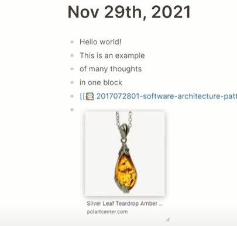

<!-- gid:20220310T000000 -->
<!-- provenance:source:start -->
[[TIP("원본·최신본")]]
이 페이지는 한국어 검색과 읽기를 위한 WikiDocs 미러입니다. [원본·최신본은 가든](https://notes.junghanacs.com/journal/20220310T000000/)에 있습니다. 최신 수정 내용·백링크·태그·히스토리·댓글·출처 정보는 원본 가든에서 확인하세요.

- 작성: `2022-03-10T00:00:00+09:00`
- 최근 수정: `2025-02-15T00:00:00+09:00`
[[/TIP]]
<!-- provenance:source:end -->

## [2024-12-04 Wed 13:30] 2022년 Logseq로 작성한 저널 [로그시크 가져오기](https://wikidocs.net/380481)

2022년 초에 작성 한 저널 파일이 있다. 별 내용 없다. 그 전에도 저널 비슷한 파일을 여러 툴과 서비스로 작성했었는데 로컬에 텍스트로 가지고 있는 노트는 없다. 찾아 보고 싶지도 않다. 이런 저런 시행착오의 연속이며 대단한 것들이라고 부르는 모든 녀석들을 거쳐가는 시간이기도 했다. 지나고 보면 가장 간단한 방법만 남는다. Logseq는 많은 부분을 이맥스 조직모드 컨셉을 가져왔다. 시간관리 로그포멧도 동일하다.

## 2022-03-10

-   Hello world!
-   This is an example #in-box
-   of many thoughts
-   in one block

### A Primer on Memory Consistency Cache Coherence.pdf

### Screenshot Test



### do this thing

```text
:LOGBOOK:
CLOCK: [2022-03-10 Thu 17:10:02]
CLOCK: [2022-03-10 Thu 17:10:21]--[2022-03-10 Thu 17:10:22] => 00:00:01
CLOCK: [2022-03-10 Thu 17:10:30]--[2022-03-10 Thu 17:10:31] => 00:00:01
CLOCK: [2022-03-14 Mon 01:11:54]--[2022-03-14 Mon 01:11:56] => 00:00:02
:END:
```

### another thing

```text
:LOGBOOK:
CLOCK: [2022-03-14 Mon 01:12:12]--[2022-03-14 Mon 01:12:13] => 00:00:01
:END:
```

### "I love cleaning up messes I didn't make. So I bacame a Mom." #quotes

id:: 622a62a5-3747-4f89-aa2a-9a643e09f9f3
