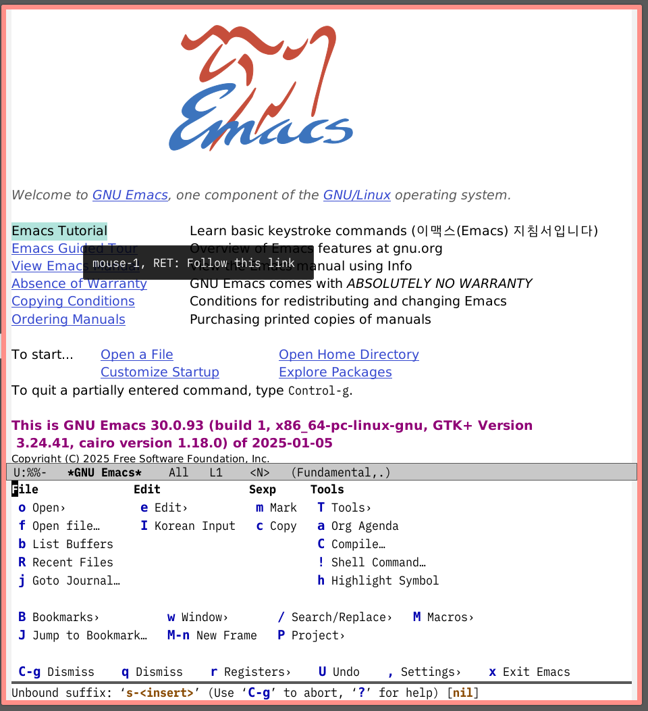

<!-- gid:20250106T000000 -->
주별로 진행하는게 편하다.

## 2025-01-06 월

> (excellent_advice_for_living.t2t)
>
> An honest friend is someone who wants nothing at all from you.
>
> 정직한 친구는 다음과 같은 사람입니다. 당신에게서 아무것도 원하지 않는 사람입니다.

-   [] \영감 - [ ] \원씽 - [ ] \가족 - [ ] \요약 - [ ] \오늘만든노트 - [최성만 벤야민 동학 모더니즘 (2025-01-06)](https://notes.junghanacs.com/bib/20250106T160433/)

### 07:08 시작 - 약복용 하루 시작

### 10:00 아버지 조경기능사 시험접수 온라인

### 11:30 복지피부과 온생명

### 14:51 칠보 작업 좋다

### 17:47 ews 설정 및 스타터 적용

[2025-01-06 Mon 15:41] [닷파일: 이맥스 스타터키트 dotdoom ews starter](https://notes.junghanacs.com/notes/20240915T235008/)

생각난 김에 윈도우즈 연결한 김에 그리 해본다. 아주 심플하게 수정 안하고 쓰는게 가장 좋은 그림이다. 단 이블은 넣는다. 잘 된다.

#### junghan0611/ccmenu

(Han [2025] 2025) - Han, Jung - ccmenu from Charles Choi Emacs configuration files - 온전한앎 (장회익 2022) <https://youtu.be/j2CF5jVYoVg?si=N--ysTaG5ndwBT6N> <span class="org-todo done DONE">DONE</span> [최성만 벤야민 천도교](https://notes.junghanacs.com/bib/20250106T160433/)

### <span class="org-todo done DONE">DONE</span> ews-starter ccmenu casual 스크린샷

[2025-01-06 Mon 17:55] 간단하면서도 인터페이스는 쉽다  2025-01-07 화 > (excellent_advice_for_living.t2t) > > When you are stuck, sleep on it. Give your subconscious an assignment while you sleep. You’ll have an answer in the morning. > > 막히면 잠을 자세요. 잠자는 동안 잠재의식에게 과제를 부여하세요. 아침에 답변을 받으실 수 있습니다. - [ ] \영감 - [ ] \원씽 - [ ] \가족 - [ ] \요약 - [ ] \오늘만든노트 04:56 시작 05:11 약먹고 (데이비드 브룩스 2024) 전자책 빌려서 보는중 브룩스 흥미진인간 17:08 컨디션 따듯하니 다행 진지하게 작업하기 쉽지 않구나. 달려야 불이 붙는데 장소만 오가고 이리저리 신경쓰지 바쁘니. 20:53 집에서 책으로 잠 - 이제 혼자 시간 [LLM: 젠틀몬스터 안경 광학 원리](https://notes.junghanacs.com/notes/20250107T050708/) 안경 바꿈

### #백링크

-   [LLM: 젠틀몬스터 안경 광학 원리](https://notes.junghanacs.com/notes/20250107T050708/)

### <span class="org-todo todo TODO">TODO</span> lazygit 윈도우즈 - scoop 최고

[2025-01-07 Tue 14:55] ```shell
scoop install lazygit
``` <span class="org-todo todo TODO">TODO</span> [2024-01-15 Mon 17:00] 지적생산기술 - 책쓰기의 기록 ;; 20240115T120802\__ideafirstbook_agile_betatester_pkm_dendron.org 책을 써야겠다는 생각. 그리고 아이디어. 지적생산기술 책을 보다보니, - 3주 1장 공개 -&gt; 애자일 개발 기법 적용 -&gt; 대략 구성과 목차가 필요 - '텍스트 마스터' : 삶 경영 실행 기술     ```text
    온라인 공개 + 위키 북스 -- 베타 테스터가 필요
    ``` - 모든 것은 하나로. - 지식 생산 + AI 도구 + 자신 - 중심에는 Emacs 실전 활용팁이 있으니까. Python 은 개인 툴. Lisp 는 개발 툴. 2025-01-08 수 12:06 테스트 주간 저널 org-journal weekly 변경 할 이유 [2025-01-08 Wed 11:37] sqrt weekly 활용 쉬운 방법 수정 적게 12:46 테스트 이렇게 넣는다. <span class="org-todo done DONT">DONT</span> 방과후과정관련 서류 구직등록확인증 출력 더 쉽게. 간단하게 하려는 것 뿐 [2025-01-08 Wed 13:09] 두번째산 저자의 고백 [2025-01-08 Wed 14:33] <span class="org-todo todo TODO">TODO</span> 지피텔 - 도구를 다루는 LLM 시대 [2025-01-08 Wed 14:40] (karthink 2024b) > At some point folks realized that instead of training LLMs to do every task, it’s easier to train them to delegate actions to specialized tools. > > 어느 순간 사람들은 LLMs에게 모든 작업을 수행하도록 훈련시키는 대신, 전문적인 도구에게 작업을 위임하도록 훈련시키는 것이 더 쉽다는 것을 깨달았습니다. 이 말은 도구를 잘 쓰는 LLM 을 만드는 것의 유용함을 논한다. 전용 키보드를 사용하라. 손 아프다. <span class="org-todo done DONT">DONT</span> 삼성 노트북 백라이트 문제 2025-01-09 Thu 11:27 준오헤어 고급 헤어컷 완료 후 커피 숖 대기하며 끄적 <span class="org-todo done DONE">DONE</span> [톰하트만 ADHD 농경사회의 사냥꾼](https://notes.junghanacs.com/bib/20250109T114221/)

### <span class="org-todo done DONE">DONE</span> 브레인워시

### <span class="org-todo todo TODO">TODO</span> 지식그래프 활용

[2025-01-09 Thu 11:32] 지식그래프 이맥스 왜 지식그래프를 다루려는가. 넓게 보면 기업을 위한 지식 관리로 가는 것. 그래야 개인지식관리 이야기를 이어 갈 것 아닌가. 그러니 지식그래프를 다루는 곳들과 보유 기술을 맞춰라. 특히 활용 사례와 더불어서 어떤 오픈소스 프로젝트에 깊히 이해를 하면 좋겠다. [(2023) Building Knowledge Graphs - 지식그래프](https://notes.junghanacs.com/bib/20240725T061009/)

## 2025-01-10 Fri

### 07:03 좋아

### 지식그래프 활용법 활용 사례 어디에서

[2025-01-10 Fri 08:48]

### lizqwerscott/mcp.el

(scott [2025] 2025)

-   scott, Lizqwer

### Introducing the Model Context Protocol (mcp)

-   (Anthropic 2024)
-   Anthropic
-   The Model Context Protocol (MCP) is an open standard for connecting AI assistants to the systems where data lives, including content repositories, business tools, and development environments. Its aim is to help frontier models produce better, more relevant responses.

[2025-01-10 Fri 10:18]

### Fringe Matters: Finding the Right Difference

(karthink 2024a)

-   karthink
-   Continuing my avocation of writing to increasingly niche audiences, today we have a matter at the intersection of several small Venn bubbles: the group of Emacs users who code in Emacs, who use Git (or version control) everywhere, who work using offshoot or feature branches, while using the diff-hl package to visually track changes in their buffers. As minutiae go, this one is quite minute, a real fringe matter.
-   Fringe Matters

\*\*민우티어(minutiae)\*\*는 어떤 것의 매우 작은 detalles 또는 중요하지 않은 세부사항을 의미합니다. 예를 들어, 계약의 민우티어 또는 일상생활의 민우티어와 같이 사용됩니다[

### 이맥스가이드 한글판은 어떤가?

[2025-01-10 Fri 11:06]

### 조직저널

[2025-01-10 Fri 11:13]

org-journal-next-entry

### 데일리

[2025-01-10 Fri 11:35]

### xenodium/chatgpt-shell

(xenodium [2023] 2025)

-   xenodium
-   A multi-llm Emacs shell (ChatGPT, Claude, Gemini, Kagi, Ollama, Perplexity) + editing integrations

**Prompt**
