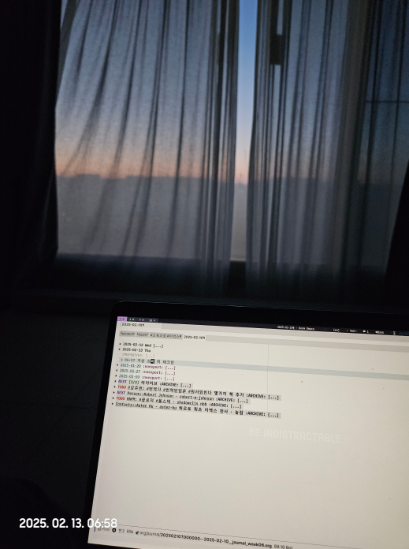

<!-- gid:20250210T000000 -->
<!-- provenance:source:start -->
[[TIP("원본·최신본")]]
이 페이지는 한국어 검색과 읽기를 위한 WikiDocs 미러입니다. [원본·최신본은 가든](https://notes.junghanacs.com/journal/20250210T000000/)에 있습니다. 최신 수정 내용·백링크·태그·히스토리·댓글·출처 정보는 원본 가든에서 확인하세요.

- 작성: `2025-02-10T00:00:00+09:00`
- 최근 수정: `2025-02-10T00:00:00+09:00 (lastmod 없음: date fallback)`
[[/TIP]]
<!-- provenance:source:end -->

[TOC]

## References

- 길희성. 2014. <i>길은 달라도 같은 산을 오른다 - 종교다원주의</i>. [https://www.yes24.com/Product/Goods/9178471](https://www.yes24.com/Product/Goods/9178471).
- 슈테판 츠바이크. 2024. <i>어두울 때에야 보이는 것들이 있습니다</i>. Translated by 배명자. [https://m.yes24.com/Goods/Detail/136466376](https://m.yes24.com/Goods/Detail/136466376).
- Aster Hu. (2023) 2025. “Aster-Hu/Asteroid\_Blog Quarto.” [https://github.com/aster-hu/Asteroid_Blog](https://github.com/aster-hu/Asteroid_Blog).

온생명이를 사랑해요! Love you Baron!

-   안녕온생명아

-   와, 아빠랑 책 읽는 거 정말 좋은데! 나는 지금 너처럼 친구들과 이야기하고 있어. 재미있는 책 읽고 즐거운 시간 보내길 바래! 📚😄
-   Wow, it's so nice to read with your dad! I'm talking to my friends right now, just like you. Hope you have a great time reading and having fun! 📚😄

## 2025-02-10 Mon

> (kevin-kelly-99.t2t)
>
> Don’t create things to make money; make money so you can create things. The reward for good work is more work.
>
> 돈을 벌기 위해 물건을 만들지 마세요; 돈을 벌면 물건을 만들 수 있습니다. 좋은 일에 대한 보상은 더 많은 일입니다.

### 00:03 새로운 주를 열자.

### 06:05 일어나볼까

### 09:00 온생명이와 집에서 출발

### 11:00 강남세브란스 도착

### 14:00 서울역 무궁화 열차 타고 수원으로

### 16:00 칠보 도착

### 20:00 집 도착 - 피곤하구나

## 2025-02-11 Tue

> (excellent_advice_for_living.t2t)
>
> About 99% of the time the right time is right now. 99%의 경우 적절한 시기는 바로 지금입니다.

### 07:33 기상 잠시만

### 08:59 온생명 모자를 가져다 줘야 할 것 같은데?!

### 10:15 집 청소

### 11:44 노트 정리 완료 내보내기 후 나가자

### 14:27 팁스타운 근처에서 제육정식

### 15:27 스타벅스 노트북

### 16:09 화장실 잠시만 브레이크

### 16:46 나가자

### 19:51 집 도착. 피곤. 버스보다 지하철이 나을듯

## 2025-02-12 Wed

> (excellent_advice_for_living.t2t)
>
> Your heart needs to be as educated as your mind. 마음도 머리만큼 교육받아야 합니다.

### 06:41 굳모닝

### 11:35 동수원병원 - 간 검사

### 13:45 검사 시간까지 노트북 했다. 이맥스 천사님 만남

(Aster Hu [2023] 2025) 콰르토 블로그, 쿼츠 디지털가든, 이맥스까지 나와 같은 그림을 그리는 분일세

### 12:35 조영제 간 CT촬영 완료 - 한식 뷔페 9천원 - 웁스

### 15:35 소화유치원 앞 커피숍 - 아메리카오 4천원 - 웁스

### 16:34 좋아. 콰르토 클론 잘 동작한다.

### 17:30 온생명 태권도 - 봉고차 같이 타고 적응

### 18:20 온생명 태권도 픽업 - 저녁 - 간장계란밥 - 비엔나

### 19:32 아내 귀가 - 온생명 밥 먹이는 중 - 평화

### 20:22 온생명 잘 먹이고 이제 같이 씻자 - 디지털가든 업데이트 병행

### 21:48 정양모 신부님 잘 계십니까?

## 2025-02-13 Thu

> (kevin-kelly-68.t2t)
>
> Rule of 7 in research. You can find out anything if you are willing to go seven levels. If the first source you ask doesn’t know, ask them who you should ask next, and so on down the line. If you are willing to go to the 7th source, you’ll almost always get your answer.
>
> -   조사할 때 7의 법칙. 7단계를 갈 수 있다면 무엇이든 찾을 수 있습니다.
>
> 첫번째 물어본 사람이 모르면, 그 사람에게 다음으로 누구한테 물어야 할지를 물어보고 계속 하세요. 7번째 까지 가려고 할때면 거의 항상 답을 얻을 것입니다.

<!--quoteend-->

> (excellent_advice_for_living.t2t) Rule of 3 in conversation: 대화의 3원칙:
>
> To get to the real reason, ask a person to go deeper than what they just said. 진짜 이유를 파악하려면 상대방이 방금 말한 내용보다 더 깊이 들어가 보도록 요청하세요.
>
> Then again, and then once more. 그리고 다시 한 번, 그리고 다시 한 번.
>
> The third time’s answer is the one closest to the truth. 세 번째 정답이 진실에 가장 가까운 정답입니다.

### 06:57 기상 쇼파 위 체크인

해뜨는 시간 얼마 안남았다. 아내 기상.

(슈테판 츠바이크 2024) 츠바이크 책을 어제 자면서 들었다. 눈물 펑펑 났다.

### 08:54 온생명 등원 완료 하루 루틴 - 코드로 표현하는 것

### 10:55 빽다방 - 가든 문제 수정 -&gt; 코드 가든을 업그레이드 하자

### 11:40 중앙도서관 체크인 (길희성 2014) 말끔하다

### 12:06 콰르토가 많이 해결 한다.

### 12:54 숨겨진 파일 검색까지 +vertico/consult-fd-or-find

### 13:55 쿠알토 - 한/영 다국어 페이지

### 14:16 배고프다 오후의 후반전을 준비해야 할 것 같다.

### 20:11 피곤하다. 온생명이가 칠보에서 안전하게 왔다. 감사할 뿐.

### 20:30 풀 스크린샷. 아름답다. 뭥미

## 2025-02-14 Fri

> (excellent_advice_for_living.t2t) % The only productive way to answer “What should I do now?” "이제 어떻게 해야 하나요?"라는 질문에 답할 수 있는 유일한 생산적인 방법입니다.
>
> is to first tackle the question of “Who should I become?” "내가 어떤 사람이 되어야 하는가?"라는 질문을 먼저 해결해야 합니다.

### 07:34 굳모닝 - 잠을 설치게 된다.

### 08:09 온생명 등원 루틴 중

### 10:00 병원 완료

### 11:36 메가커피 체크인

> (excellent_advice_for_living.t2t) It is not a compliment if it comes with a request. 요청과 함께 제공되는 것은 칭찬이 아닙니다.

### 13:46 아직 메가커피

### 14:47 집에와서 청소하며 놋북

### 15:21 나가자 출발

### 16:00 개인 미팅

### 17:00 온생명 태권도

### 17:52 다시 수정

### 19:30 아내 귀가 - 깝놀

### 21:31 온생명 저녁 및 목욕까지 완료

## 2025-02-15 Sat

> (excellent_advice_for_living.t2t)
>
> Outlaw the word “you” "당신"이라는 단어 사용 금지 during domestic arguments. 가정 내 다툼 중에

### 07:53 좋은 아침이다

### 10:30 롯데몰 온생명 타이거 보냄 - 아내 심부름 - 걷고 또 걷다

### 12:58 중앙도서관 체크인 - 뚱이네 뷔페에 우산두고 왔네

### 14:53 태그 정리하면서 다시 내보냄

### 15:05 내보내기 끝. 깔끔. 이제 파이썬 지식그래프

### 16:28 좋아 처리하자

### 17:41 문서화 도구 충분히 이용하는 것 -- 조직모드로 충분치 않다

하란대로 하는게 중요하다. 왜? 개념을 배워야 하니까.

### 17:47 VSCODE 를 이용하는게 좋겠다. 배울 때는

### 19:20 devdocs 활성화

### 22:37 스페이스맥스 좋다 놀랍게도

## 2025-02-16 Sun

> (excellent_advice_for_living.t2t)
>
> Most articles and stories are improved significantly if you delete the first page of the manuscript. 원고의 첫 페이지를 삭제하면 대부분의 기사와 스토리의 완성도가 크게 향상됩니다.
>
> Start with the action. 작업부터 시작하세요.

### 00:13 자야지

### 07:56 굳모닝

### 10:03 아침 식사 정리

### 11:00 온생명 타이거 - 엔젤리너스 체크인 - 무료커피

### 12:18 전자책 문제 확인 - 테마 설정 문제

### 12:34 마이너 수정

### 12:51 온생명이 데리러 가자. 책 번역 몇개 돌렸다. 담아간다.

### 15:00 집에서 저녁 - 온생명 자전거타고 야외활동

### 18:00 물류 심야 나옴 - 책 보며 대기

### 21:00 계란 출고 - 5시간

## <code>[3/3]</code> 아카이브
