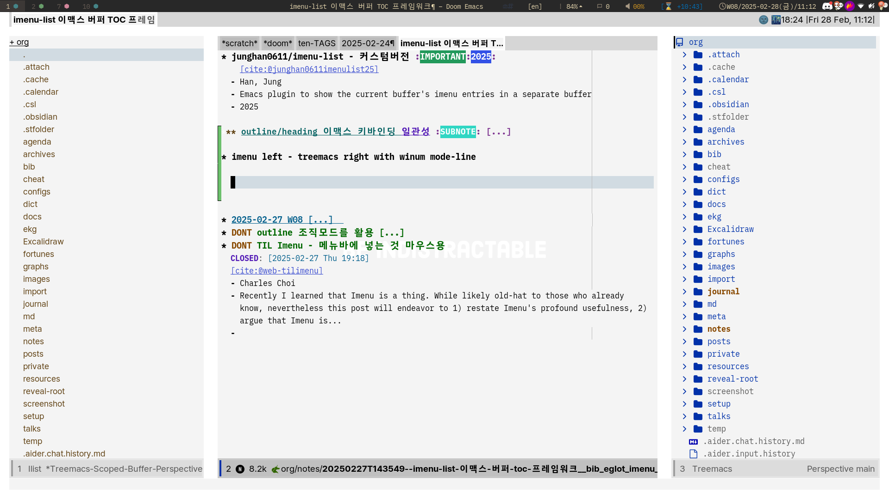

<!-- gid:20250224T000000 -->
[TOC]

## References

  조지프 니덤. 1900–1995. “조지프 니덤 Joseph Needham 박물학 과학사회학 중국학자.” In <i>위키백과, 우리 모두의 백과사전</i>. [https://ko.wikipedia.org/w/index.php?title=%EC%A1%B0%EC%A7%80%ED%94%84_%EB%8B%88%EB%8D%A4&#38;oldid=37284621](https://ko.wikipedia.org/w/index.php?title=%EC%A1%B0%EC%A7%80%ED%94%84_%EB%8B%88%EB%8D%A4&oldid=37284621).

## 2025-02-24 Mon

### 03:30 일하고 돌아와서 삼각김밥 2개 먹고 잔다.

### 09:00 아내 출근 - 늦잠

### 10:20 온생명 등원

### 11:48 스타필드 수원 - 피곤해서 버스타고 여길 왔다.

### 12:27 3층에 자리 잡았다. 서스킨드 책 4권이 모두 다 있구만!

### 13:31 내보내기

### 14:20 배고파서 가야겠다.

### 14:30 한식뷔페 8000원

### 15:29 스타필드 복귀

### 15:56 브레인워시 - 피곤하다

### 17:16 디노트 시퀀스

앞 뒤 관계

### 17:42 칠보로?!

### 22:30 잔다. 오랜만에 쿨쿨

## 2025-02-25 Tue

> 우리가 반복적으로 행하는 것이 우리 자신이다. 그렇다면 탁월함은 행동이 아닌 습관인 것이다. — 아리스토텔레스

### 05:22 기상 - 노트북 들고 나가는게?!

### 07:21 아내 기상

### 09:00 온생명 기상

### 10:23 소화유치원 재학생 오리엔테이션

### 12:03 온생명이와 집도착 - 고르곤졸라 피자

### 12:46 온생명이와 영화 치킨런

### 15:47 칠보 도착

### 18:43 아직 칠보 - 저녁식사

### 19:25 집 도착 - 피곤하다 하는 바 없이

### 21:36 무인까페

## 2025-02-26 Wed

> (excellent_advice_for_living.t2t)
>
> Work to become, not to acquire. 획득하는 것이 아니라 되기 위해 노력하세요.

### 08:37 모닝

### 11:00 이제 다 된다. 그렇다면 어려울 게 없다 - 학습목표

### 11:41 시끄럽다

### 13:26 온생명이와 식사중

### 16:06 온생명 타이거 -&gt; 엔젤리너스 체크인

### 17:01 한시간 남음

### 19:13 집 치킨

### 22:00 아내 귀가 - 온생명 목욕 - 집정리 - 불꺼진 거실에 홀로 놋북

식기세척기, 세탁 건조기가 돌고 있다. 물걸레 로봇은 충전중이다. 이 작은 소리들만 남아 있다. 아. 방에서는 아이와 엄마가 도란도란.

열시구나. 우후. 나가서 뭔가 일 벌이긴 늦은 시간. 아랫배가 묵직한게 어디 나갔다간 화장실 찾아 고생만 할지 모른다. 가봐야 무인까페. 화장실을 기대할 곳은 아니다.

자기 전 약은 조금 전에 먹었다. 지금 자면 5시 경에 일어난다면 수면점수 90점 예상. 츠바이크의 발자크 평전을 들으며 엔젤리너스에서 놋북을 했었다.

[발자크 1799-1850 프랑스 소설가](https://wikidocs.net/382295) 그래 만들었구나.

## 2025-02-27 Thu

> (kevin-kelly-99.t2t) You are only as young as the last time you changed your mind. 당신은 마지막으로 당신의 마음을 바꿨을 때 만큼 젊습니다.

### 03:12 사슴벌레가 꿈속으로 전화해서 깼다.

### 06:03 기상 - 오 발자크여!

### 08:48 온생명 - 기상

### 10:54 imenu-list 매우 중요하다 - treemacs 연동 완료

### 13:00 버스 타고 - 칠보 - 온생명 다이소 5000원

### 14:27 어반까페 - 아메리카노 3800원

### 14:56 imenu-list 포크

### 15:23 헤딩 레벨 이동의 핵심을 건들였다 - 메타로 통일하라!

[outline/heading 이맥스 키바인딩 일관성](https://wikidocs.net/381561)

### 17:00 온생명 축구클럽 체험

### 18:00 뚱이네뷔페 5000원

### 19:00 중앙도서관 - 발자크여!

### 20:20 간만의 도서관 자유통행 시간 아닌가

### 21:05 피곤하구만

### 22:27 무인까페 - 배고프다

### 22:53 조지프 니덤 Joseph Needham 박물학 과학사회학 - 폴리매스

-   (조지프 니덤 1900–1995)
-   조지프 니덤(Joseph Terence Montgomery Needham, CH, FRS, 1900년 12월 9일 \textasciitilde{} 1995년 3월 24일)은 영국의 박물학, 과학사회학 학자이다. 케임브리지 대학교 교수를 지냈으며, 저서 《중국의 과학과 문명》은 비교철학과 중국학에서 중요한 저서로 여겨진다. 중국이 어떻게 과학기술에서 서구에 뒤지게 되었는가를 규명하는 데 초점을 맞추고 있다. 중국에서는 한자명(漢子名)인 李约瑟 (Lǐ Yuēsè, 이약슬)로 불린다.
-   1900

### 23:14 집 과자 콜라 냠냠

## 2025-02-28 Fri

### 06:23 기상 몽테뉴 즐거움 amusement

### 08:10 왜 일어나지 않는가

### 09:40 온생명 재학생 오리엔테이션 등원

### 10:00 성당 미사 - 고요

### 10:30 성당 까페 - 40분 활용

### 11:09 좋아. 깔끔해.

### 12:10 온생명 점심 준비

### 12:39 아내는 화상 수업 - 온생명이와 밥

### 13:43 조나단리브 잊지마라. 유튜브 영상으로 본다면

[조나단리브 jonathanreeve 전산언어학](https://wikidocs.net/382251)

### 16:16 칠보 부모님댁

### 18:00 지옥 아수라장 - 연민의 마음으로

### 19:00 쿠팡 물류 센터 - 독서의 장

## 2025-03-01 Sat

### 03:51 집 도착. 자자

### 08:00 기상

### 11:00 가족사진 - 셀프 촬영장

### 15:50 하진이네 북한산 사기막 야영장 체크인 [가족여행](https://wikidocs.net/380623)

### 20:33 야영장 주차장 전기차 - 춥지 않음에 감사

### 20:40 아놔 자야겠다 졸려서

### 23:00 숙소

## 2025-03-02 Sun

> (excellent_advice_for_living.t2t)
>
> The best way to learn anything is to try to teach what you know. 무엇이든 배우는 가장 좋은 방법은 아는 것을 가르치는 것입니다.

### 02:39 자다 깨서 차에 옴

### 07:18 기상 - 차안 영혼의 행복

### 08:33 문서 코드 통합 재현성의 완성 - 이맥스

전자책 번역본 원서 조직모드 파일 주피터노트 변환

코드 - 문서 하나로 있다.

### 09:09 일어날 때 되었으니 가보자 - 레이아웃 주피터-조직모드 내보내기

### 10:33 스타벅스 더북한산 -- [아스키아쿠아리움 asciiquarium](https://wikidocs.net/381496)

### 15:29 야영장 숙소 도착

### 16:16 저녁 준비 - 오랜 대화

### 20:48 숙소 하루의 마무리

## 아카이브 <code>[19/19]</code>

### [denote/denote-sequence 디노트 시퀀스 노트 관계](https://wikidocs.net/381554)

### [바벨: 조직모드 리터레이트 : 최고인가 - 조직모드 콰르토 주피터](https://wikidocs.net/381553)

### 소화유치원 오리엔테이션

### [울프럼 플레이어 엔진 설치 활용법 - 메스메티카](https://wikidocs.net/381535)

### [파이썬 생태계](https://wikidocs.net/381527)

### 수학의 위로 : 점과 선으로 헤아려본 상실의 조각들

### sicpjs

### [outline/heading 이맥스 키바인딩 일관성](https://wikidocs.net/381561)

### 문서 번역

### 데이터과학 파이썬 - 프로젝트?! 그냥 일단 읽어보는게 좋겠다.

### [강주헌: 번역가 번역방법론 원서읽힌다](https://wikidocs.net/382043) 몇가지 책 추가

### [Person::Robert Johnson - robert-m-johnson](https://wikidocs.net/380486)

### [왜 아무도 읽지 않는 블로그를 운영하는가?](https://wikidocs.net/381520)

### EmacsConf 2024: Emacs 30 Highlights - Philip Kaludercic

### [imenu-list left - treemacs right with winum mode-line](https://wikidocs.net/381562)

[2025-02-28 Fri 11:13]

#### 스크린샷

### [제미나이](https://wikidocs.net/380805)

### 스크린샷 - 학습모드 아름다움

## 최근노트 - 2월20일 ~

### temp

-   [LLM: 발자크 Balzac and his potential connection of ADHD. (2025-02-27)](https://wikidocs.net/381559)
-   [학습 목표 - 질문 방향 목차 (2025-02-26)](https://wikidocs.net/381558)
-   [LLM: 이맥스 swiper와 consult-line을 비교 (2025-02-23)](https://wikidocs.net/381551)

### notes

-   [imenu-list left - treemacs right with winum mode-line (2025-02-28)](https://wikidocs.net/381562)
-   [imenu/outline/heading 헤딩 레벨 키바인딩의 핵심 - Alt 통일 (2025-02-27)](https://wikidocs.net/381561)
-   [imenu-list 이맥스 버퍼 TOC 프레임워크 (2025-02-27)](https://wikidocs.net/381560)
-   [LLM: PESM 증후군 - 생각 (2025-02-25)](https://wikidocs.net/381557)
-   [LLM: 몬테소리 교육 (2025-02-25)](https://wikidocs.net/381556)
-   [LLM: Warning (emacs): Org version mismatch. (2025-02-24)](https://wikidocs.net/381555)
-   [denote/denote-sequence 디노트 시퀀스 노트 관계 (2025-02-24)](https://wikidocs.net/381554)
-   [바벨: 조직모드 리터레이트 : 최고인가 - 조직모드 콰르토 주피터 (2025-02-24)](https://wikidocs.net/381553)
-   [ox-quarto quarto-mode 이맥스 조직모드 for 콰르토 (2025-02-24)](https://wikidocs.net/381552)
-   [텍스트 힙스터 - 이맥스 한국 커뮤니티 (2025-02-23)](https://wikidocs.net/381550)
-   [LLM: 로고 이미지 생성 (2025-02-23)](https://wikidocs.net/381549)
-   [주피터 파이썬 - 리눅스 qtconsole (2025-02-22)](https://wikidocs.net/381548)
-   [emacs-jupyter/jupyter 파이썬 코드블록 레플 버퍼 보내기 (2025-02-21)](https://wikidocs.net/381547)
-   [지도: 지식 학문 철학 (2025-02-21)](https://wikidocs.net/381546)
-   [LLM: Executablebooks vs. Quarto (2025-02-21)](https://wikidocs.net/381545)
-   [이맥시안 한국 이맥스 사용자 (2025-02-20)](https://wikidocs.net/381544)

### bib

-   [발자크 1799-1850 프랑스 소설가 (2025-02-26)](https://wikidocs.net/382295)
-   [채사장 지대넓얕 (2025-02-25)](https://wikidocs.net/382294)
-   [최정담 디멘 교양수학 수학 스토리텔러 (2025-02-25)](https://wikidocs.net/382293)
-   [몽테뉴 수상록(1580) (2025-02-25)](https://wikidocs.net/382292)
-   [앙드레지드 좁은문(1909) (2025-02-25)](https://wikidocs.net/382291)
-   [다이앤태브너 최고의 교실 - 서밋스쿨 맞춤형교육 - 미래 빌게이츠 (2025-02-24)](https://wikidocs.net/382290)
-   [숀캐럴 이론물리학자 (2025-02-24)](https://wikidocs.net/382289)
-   [배수아 소설가 번역가 - 로베르트발저 산책자 막스피카르트 말과언어 (2025-02-22)](https://wikidocs.net/382288)
-   [johndenero 파이썬 SICP 과정 (2025-02-21)](https://wikidocs.net/382287)
-   [헤르만헤세 구도자 작가 싯다르타 데미안 유리알 유희 - Glass Bead Game (2025-02-21)](https://wikidocs.net/382286)
-   [HowardAbrams 구루 리터레이트 이맥스 - hamacs (2025-02-20)](https://wikidocs.net/382285)

### meta

-   [제미나이 (2025-02-28)](https://wikidocs.net/380805)
-   [메타도구 (2025-02-24)](https://wikidocs.net/380804)
-   [바벨 (2025-02-24)](https://wikidocs.net/380803)
