<!-- gid:20250303T000000 -->
[TOC]

## References

  코디정. 2024. <i>생각의 기술: 바로 써먹는 논리학 사용법</i>. [https://m.yes24.com/Goods/Detail/133975910](https://m.yes24.com/Goods/Detail/133975910).

## 2025-03-03 Mon

### 05:46 굳모닝 - 차안

### 07:13 괴델에셔바흐 끌려

[호프스태터: GEB 괴델에셔바흐 지식사상통합](https://notes.junghanacs.com/bib/20240713T204705/)

### 17:20 집 도착

### 19:07 온생명이와 저녁

### 19:58 모든 것에 감사

## 2025-03-04 Tue

### 05:23 기상 - 8시간 숙면

### 06:44 온생명 개학 준비

### 07:29 방과후 서류 - 불가

### 09:05 온생명 등원 후 데스크톱 jhnuc 꺼내서 앉음

### 09:29 동일 인터페이스 - 상태 업데이트 - 커피 한잔 어때요?!

### 10:33 그래. 이제 정리가 좀 되었구나

### 11:18 가야할 길을 갈 뿐이다.

### 12:26 식사하자 괜찮아 다 잘 될 것이야

### 13:45 잠시만 가볍게 가볍게

### 15:46 괜찮아 그래

### 18:08 나가야 할 시간이로구나

### 19:57 온생명이와 저녁식사 중

### 21:47 아내 온생명 방에 이제 거실에서 노트북 펴고 숨을 고른다

### 22:54 좋아

## 2025-03-05 Wed

### 06:19 기상 - 6시간 수면 - 여러 꿈 흘러가 버림

죽은 듯 고요함 매일을 사는 자

### 방과후 서류 보낼 것 - 치약 칫솔 보낼 것

### 07:08 빨래 정리

### 08:13 온생명 등원 준비 중 - 영화관 놀이

### 08:33 등원 완료 - 사랑한다

### 09:07 나가자 - 밥먹고 나갈 것

### 10:43 중앙도서관 체크인

### 이비인후과 - 가용 시간?!

### 목요일 축구교실 온생명 하원 차편?!

### 10:51 [유리알유희 오늘날 바라본다면](https://notes.junghanacs.com/notes/20250305T105307/)

### 11:13 달려보자. 기본서 정리는 해야지

보아하니까

정리가 되면 김도형 자료 -&gt; 장회익 부록 만들 수 있을 것이다.

(코디정 2024) 대출. 논리학에 대한 사랑

근데 아이더로 어떻게 코드를 만들어 낼까?

인공지능에 대한 이해는?

### 13:25 브레인워시 15분

### 14:40 배고프다 이동하는게 필요한가?!

### 15:48 부스터 장착

### 16:21 잘된다. 아무렴 완벽하구나.

### 16:56 배고파 밥먹고 가서 하자

### 19:06 텍스트힙스터 동네 커피숍에서 끄적이고 있다.

1500원의 행복. 끄적이는 즐거움. 귀로는 헤세의 ‘어느 별에서 온 이상한 소식’이라는 단편묶음집을 오디오북으로 듣고 있다. 역시 강우상 성우의 낭독은 쫀쫀하다. 서브스택에 이렇게 끄적이는 텍스트는 버려지는 텍스트가 아닌가? 아니게 하려면? 데일리노트에 옮겨야지! 어떻게? 이렇게?!

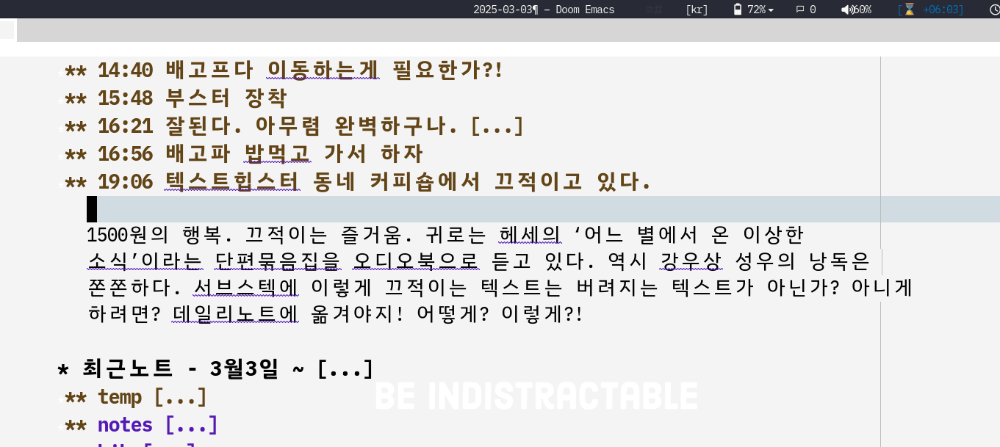

### 19:30 온생명 바지에 똥 - 똥처리 후 목욕

### 20:20 아내 귀가 - 하루 마무리

### 21:27 다들 재우고 고요한 밤

### 21:39 도파민 부족 - 누워서 책 듣다가 자련다.

한 없이 고요하다. 적막하다. 아니다. 건조기가 돌고 있다. 그리고 지~ 이런 뭔가 소리가 난다. 키보드 두드리는 소리도 난다. 화이트 노이즈? 좋다. 고요함에는 지혜가 있다. 근데? 지혜를 벗 삼아 뭔가를 해보련가?

아니다. 도파민 부족. 누워서 책을 듣다가 잠 들 것이다.

오! 이 노트는 서브스택 노트에 복붙 할 것이다. 서브스택이라... 수 많은 도구 중에 왜?! 잘 모르겠다. 내보내기 할 곳 중에 하나 일 뿐이니까.

텍스트의 중심은 언제나 텍스트 에디터이다. 이맥스도 좋고 뭐든 다 좋다. 서브스택은 복붙 할 곳 중에 하나 일 뿐이다. 중심은 언제나 어쏠로지스트로 사는 것이다.

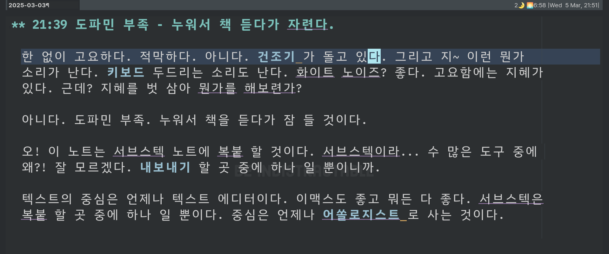

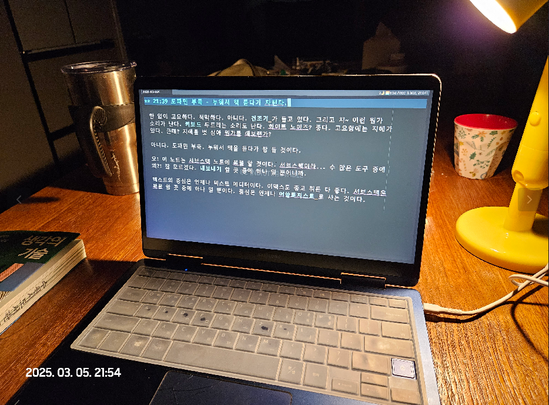

### 22:13 WEEK09 위클리노트

텍스트를 흘리지 않는다. 텍스트에디터는 앎의도구 생각도구 인생도구.

한 곳에 쓴다. 그의 경우 이맥스를 사용한다. (가운데)

모인 글은 디지털가든으로 보내진다. (왼쪽)

오른쪽은 뭐냐? 여기 서브스택이다. 청자를 대상으로 쓴다.

그의 글은 내용이랄게 없다. 글을 쓰는 도구를 바라보라.

생각도구. 인생도구. 앎의도구.

도구로 삶을 기록하는 과정만 지켜보라. 그의 글과 코드는 다 열려 있다. 그 또한 어딘가에서 받은 것이기에 나눠야 할 모든 것이다.

<https://notes.junghanacs.com/journal/20250303T000000>

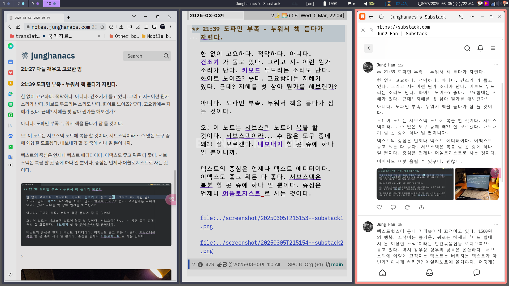

## 2025-03-06 Thu

> (excellent_advice_for_living.t2t)
>
> The first step is usually to complete the last step. 첫 번째 단계는 일반적으로 지난 마지막 단계를 완료하는 것입니다.
>
> You can’t load into a full dish rack. 가득 찬 식기 선반에는 적재할 수 없습니다.

### 04:30 기상 -&gt; 약복용 -&gt; 불완전주의자를 만나다

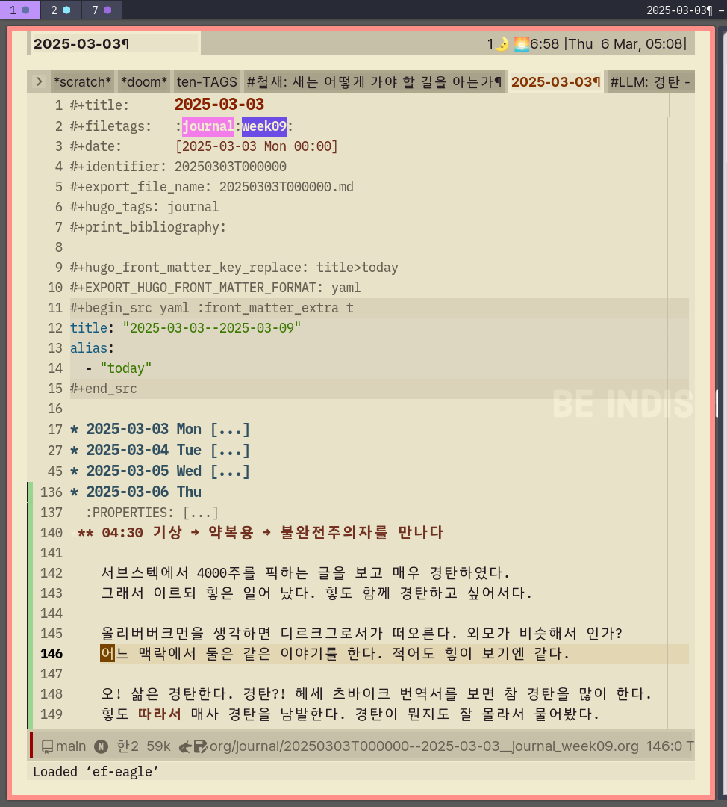

서브스택에서 4000주를 픽하는 글을 보고 매우 경탄하였다. 그래서 이르되 힣은 일어 났다. 힣도 함께 경탄하고 싶어서다.

올리버버크먼을 생각하면 디르크그로서가 떠오른다. 외모가 비슷해서 인가? 어느 맥락에서 둘은 같은 이야기를 한다. 적어도 힣이 보기엔 같다.

오! 삶은 경탄한다. 경탄?! 헤세 츠바이크 번역서를 보면 참 경탄을 많이 한다. 힣도 따라서 매사 경탄을 남발한다. 경탄이 뭔지도 잘 몰라서 물어봤다.

좋은 뜻이다. 경탄할만 하다.

쓰고 싶은 말은 한 없이 많다. 허나 힣은 서브스택에 무엇을 남겨야 하는가? 라이프로깅 그 자체다.

이곳에 시작하는 참에 하나 넣자. 일어나서 무엇을 했는지 적어 보겠다.

삼성 헬스 앱을 열고 수면 컨디션을 확인했다. 수면 퀄리티는 언제나 좋다. 수면 시간이 문제다.

여기서 더 잤어야 하지만, 서브스택 앱을 열고 만다. 그리고 4000주를 경탄하는 글을 보고 만다. 그래서 일어났다.

그러면 바로 aTimeLogger를 열었다. 수면을 끝내고 본짓을 켠다. 본짓? 딴짓 아닌거란 말이다. 4년째 모든 시간이 이런식으로 기록되어 있다. 그냥 자연스럽다. 여기에 뭘 적지 않는다. 누를 뿐이다. 억지스럽다면 오래 못했을 것이다.

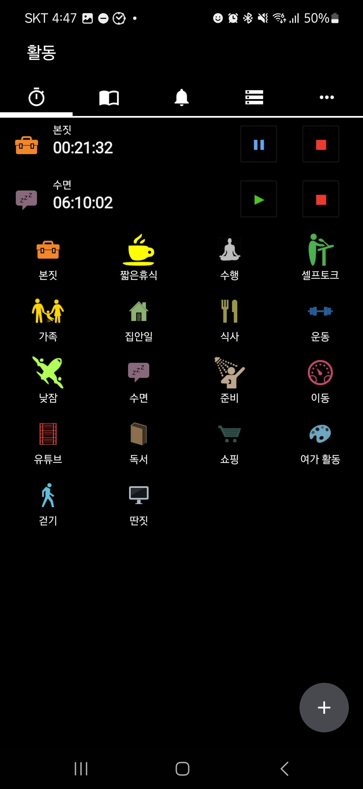

그리고 이 글을 쓰는 것이다. 힣은 전쟁터 나서는 병사처럼 거의 무기를 꺼낸다. 노트북 말고 텍스트에디터가 그 것이다. 텍스트에디터에서 "SPACE n j j"를 연타한다. 저널파일에 오늘에 해당하는 곳에 현재 시간으로 새로운 엔트리를 만든다.

좋아. 그러면 쓰는 것이다. 이 과정에 머리는 개입 될 필요가 없다. 손가락이 할 일이다.

쓸 내용은 발가락이 할 일이다. 발가락이 꼼지락 대고 있는데 이는 좋은 신호이다. 그래서 이 글이 나왔다.

이제 무엇을 할 것인가? 5시인데?

이거 노트로 써야해? 모닝 루틴으로 포스팅 해야 하는거 아니야? 길 잖아.

모닝페이지라고? 이미 많이 썼잖아. 여기 없을 뿐이지. 봐봐.

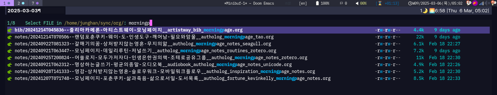

아니야. 옮길 필요는 없어. 디지털 가든에 공개되어 있잖아.

어짜피 매번 같은 이야기야. 힣이 할 수 있는 이야기는 하나 뿐이야.

지금 이 순간을 사는 것. 기록하는 과정. 흐름. 남기는 것. 같아.

아. 아직 5시야. 디르크그로서의 책을 듣고 싶다. 그의 유쾌함이 오늘의 유리알유희가 될 것이야.

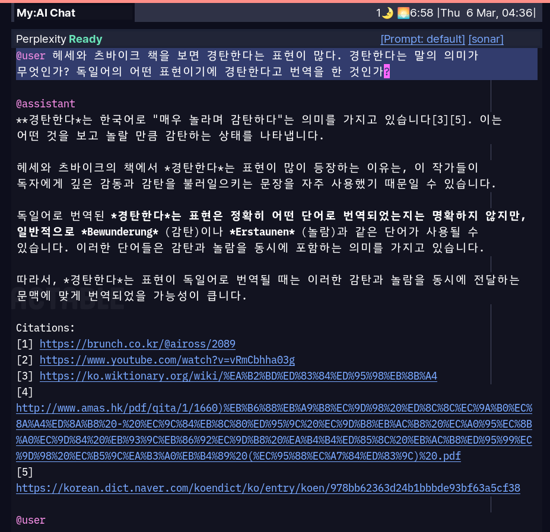

-   [LLM: 헤세 츠바이크 - 경탄 - 감탄 논람](https://notes.junghanacs.com/notes/20250306T043741/)
-   [올리버버크먼: 4000주 불완전주의 삶의유한함 받아들임](https://notes.junghanacs.com/bib/20241022T145747/)
-   [디르크그로서 삶의모든답은한마리개안에있다 삶과사랑에빠진아이처럼 일상 신비주의자](https://notes.junghanacs.com/bib/20240523T220901/)

### 05:54 텍스트힙스터 서브스택을 만들었습니다

모든 것을 '텍스트 도구'를 중심으로 다룰 것 입니다. 내 손에 잘 맞는 만능 도구 하나만 있으면 충분하다는 이야기 할 것 입니다. <https://junghanacs.substack.com/>

### 06:09 어바웃 페이지 ?!

서브스택 그래. 업데이트 하면 된다.

팟케스트 유튜브 등 영상 매체 광고가 없다.

### 06:20 디지털가든 무시무시한 곳

<https://notes.junghanacs.com/>

### 07:44 아내 출근 준비 - 나는 집 정리

### 08:27 온생명 등원 고고

### 08:55 등원 완료 - 오전3시간 딥워크

졸려. 생각의 기술을 읽자.

### 11:23 도서관 나가야겠다.

### 11:39 영문판은 작년에 나왔습니다 (링크 참고).

<https://seoulalien.substack.com/p/604/comment/98343775>

출판 쪽과는 관계 없구요. 그냥 버크먼 책이 좋아서요. 버크먼 관련 몇가지 링크 모아둔 저의 디지털가든 링크도 같이 남깁니다.

-   Meditations for Mortals: Four Weeks to Embrace Your Limitations and Make Time for What Counts <https://www.yes24.com/Product/Goods/130083689>
-   @올리버버크먼 #4000주 #불완전주의 #삶의유한함 #받아들임 <https://notes.junghanacs.com/bib/20241022T145747>

### 11:50 서브스택 댓글 -&gt; 노트 반영 훌륭하다

독특하다. 이 부분이 아주 괜찮네. 댓글을 달았는데 노트로 가져온다는 점은 저널노트의 타임라인을 연결할 수 있기에 좋다.

근데 이거 트위터나 쓰레드 등에서 다 되는 것 아닌가? 잘 안써봐서 모르겠다. 아무튼 괜찮다.

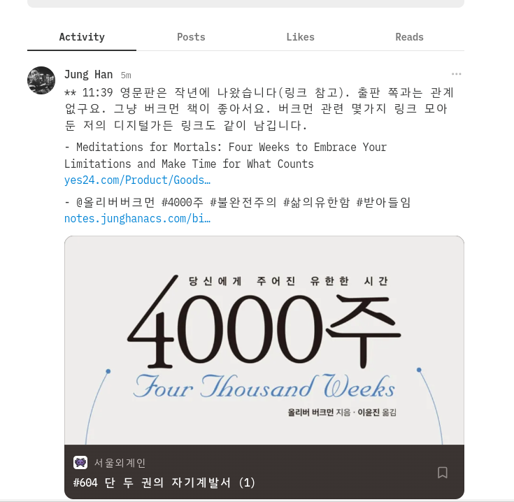

### 13:34 중앙도서관 체크인 - 도서대출

### 14:15 PAW -- 와 엄청나게 좋아졌구나.

### 14:34 브레인워시

피곤하다. 커피는 없나? 잔돈이 있으련만

### 16:00 나만의 라이브러리 의미 - 조테로 공유라이브러리 업데이트

<https://www.zotero.org/groups/5570207/junghanacs/collections/EYU8UTZT>

십진분류로 정리된 힣의 도서관. 참고하거나 가져가서 활용 할 수 있다. 입력을 위해서 노력은 거의 들지 않는다. 브라우져에서 클릭하면 조테로로 담긴다. 십진분류는 도서관에서 만들어 놓은 체계를 따른다. 힣은 책 뿐만 아니라 온갖 링크들을 다 조테로에 담아 놓는다. 책은 그나마 신경써서 정리하기에 공유하는 것 뿐이다.

이렇게 모은 링크들은 노트가 아니다. 지식도구가 활용하려고 모아놓은 것이다. 노트를 쓸 때 이렇게 저렇게 찾아 보기 좋다.

찾은 다음에는? LLM한테 물어도 보고 대화도하고 글도 쓰고 코드도 만들고 또 찾고 넣는다.

-   [책쓰기: 책을 쓰지 말아야 하는 이유](https://notes.junghanacs.com/notes/20240927T142147/)
-   [모두가저자다 인생은한권의책 딱 1권만 달라](https://notes.junghanacs.com/notes/20240925T200824/)

-   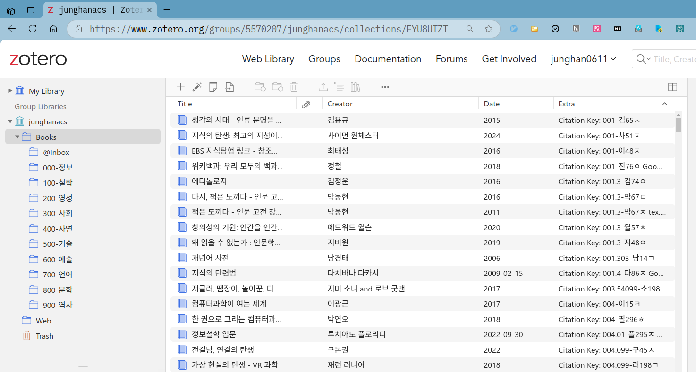
-   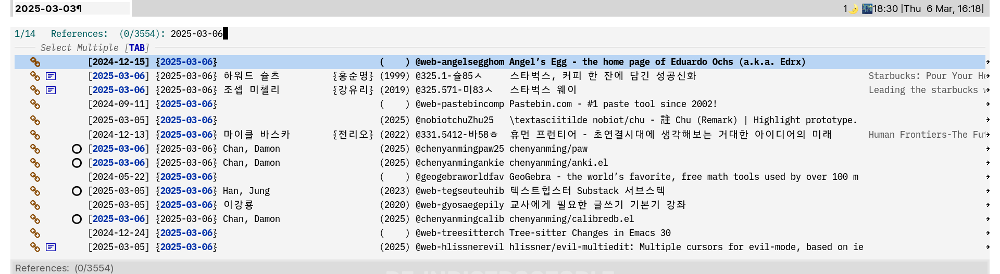
-   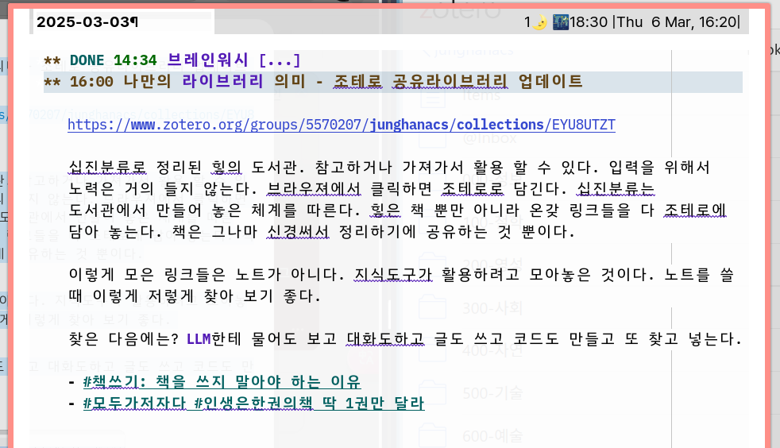

### 16:23 나가자 늦었다

### 17:07 퍼스트축구클럽 체크인

[어쏠로지스트: 뉴스레터::어쏠로지스트 Authologist](https://notes.junghanacs.com/notes/20241024T134557/)

여기에 글을 써야 한다.

### 17:42 축구 금방 끝나네. 어바웃 페이지 구상하다가 끝났다.

### 18:08 집에 도착 - 저녁 준비

### 온생명 등원 -&gt; 하원 -&gt; 축구교실 -&gt; 저녁 -&gt; 목욕

### 20:45 온생명 목욕

### 21:53 디지털가든 내보내기 완료

### 22:00 아무도 읽지 않는 블로그 / 디지털가든 잘 만드는 방법

누워서 휴대폰으로 쓴다. 오타가 남발 한다. 힘들다. 길게. 못쓸듯.

어바웃 페이지에 뭘 쓸까 하다가 요즘 눈에 띄는 질문을 다시 보게 된다. 얼마전 유리알유희를 나누는 W씨와 만나서 나눈 이야기도 마찬가지 였다.

목적없는목적. 함없이하는것. 생산성 전문가 올리버 버크먼의 책도 이것 아니 겠는가.

힣은 여기에 하나를 더 한다. 손맛.

머리로 쓰는 것이 아니요. 손과발이 쓴다.

힣이 텍스트편집기를 열고 키보드를 두드리기 시작하면 피아니스트의 그것과 다름이 없다. 키바인딩이라 불리는 악보는 손가락이 알고 있다. 머리에 없다.

오. 존재가 표현된다. 몰입. 자기목적성. 운명애. 고요한 가운데 없던 것이 나온다. 무엇이 나오든 그대로 만족한다. 그저 감사한다.

여기 맛집일세! 손맛 좋구만. (힣은 ‘나’를 의미)

-   <https://notes.junghanacs.com/notes/20250213T105806>

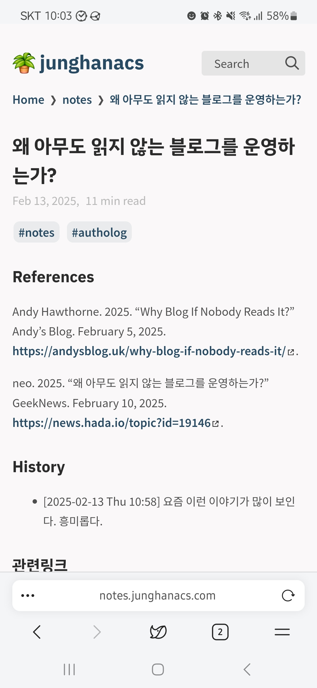

-   [왜 아무도 읽지 않는 블로그를 운영하는가?](https://notes.junghanacs.com/notes/20250213T105806/)

## 2025-03-07 Fri

### 04:38 기상 단박에 깨어남

### 05:07 어이 자네 깨어 있는가!? - gptel fixed

### 07:08 아내 기상 - 집 정리 with 오디오북

### 09:16 아내 온생명 - 주말 일정 - 먹먹하다

### 11:47 디지털가든 정비 - 쿼츠 커스텀

### 12:02 좋아

### 13:21 아무도 안 보는 디지털가든 대규모 업데이트

티나지 않는 대규모 업데이트를 진행 했다. 아주 만족스럽다.

디지털가든 메인 페이지를 보면 대략적인 기록의 방향을 알 수 있다.

각 노트에 담긴 것은 자신에게만 의미 있다. 이 마저도 인공지능에 물어보면 더 잘 알려주기도 한다.

디지털가든은 ‘지식’ 보관소가 아니다. 힣의 앎의 틀이며 디지털 유희의 흔적이다. 그러기에 공개할 필요가 없다. 훔… 공개하는 것은 텍스트 공해에 일조하는 것일지도 모른다.

디지털가든은 아름다울(?) 필요도 없다. 힣은 그의 창작도구로 노트를 다룬다. 디지털가든을 향해하는 것은 화장실에 있을 때를 제외하면 언제나 답답할 뿐이다.

그럼에도 왜 도대체 왜 디지털가든을 공개하는 것이며, 대규모 업데이트했다고 좋아하는가?

행복하기 때문이다. 그 과정에서 영감을 얻기 때문이다. 이 기쁨을 나누고 싶기 때문이다.

<https://notes.junghanacs.com/>

디지털가든은 오픈소스 쿼츠를 사용하였으며, 모든 글과 코드는 공개되어 있다. <https://github.com/junghanacs/notes.junghanacs.com>

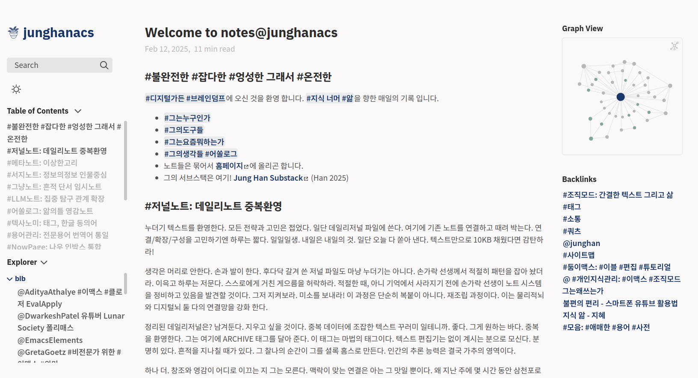

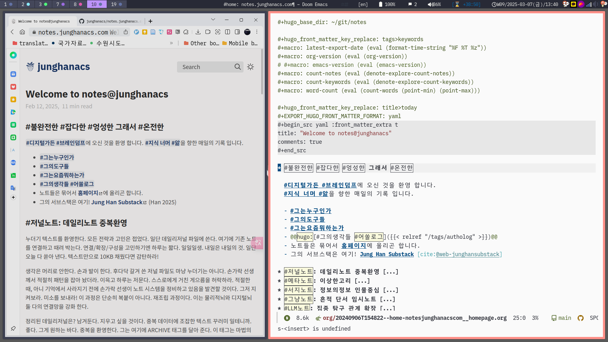

### 14:41 집 청소하러 집에 옴

### 15:30 미팅 5회차 가장 어두운 날

### 17:27 집 복귀 - 온생명 태권도 하원 전까지 밥 하면서 병렬로

### 18:15 온전한 연민과 사랑 - 온생명이 하원

### 20:02 온생명이 저녁 먹이고 이제 씻기자

### 21:21 아내 귀가 - 이제 조용히 고요하게

## 2025-03-08 Sat

### 04:03 기상 - 인간의 진화

창조 영감 - 무의식 - 빙산 아래 - 전체 의식 - 인간의 진화

거친 게으름을 허락하라

-   [에크하르트톨레 영성 사상가 삶으로다시떠오르기 지금이순간을살아라](https://notes.junghanacs.com/bib/20240419T220359/)

### 06:53 시간 흘러가는 것 보시게

아웃풋 과정을 해보자

### 08:19 온생명 기상 - 아침 준비

### 10:00 온생명 태권도 체크인 -&gt; 메가커피 대기하며 작업

-   [데이비드카다비 디지털 제텔카스텐 - 생산성 - 마음 관리](https://notes.junghanacs.com/bib/20250308T101225/)
-   [밥도투: 글쓰기시스템: 제텔카스텐 System for Writing](https://notes.junghanacs.com/bib/20240911T110705/)
-   [AndreiSukhovskii howm - note-taking tool on Emacs](https://notes.junghanacs.com/bib/20250308T112216/)
-   [GwernBranwen Gwern 위키 고수](https://notes.junghanacs.com/bib/20250308T113552/)

### 11:37 온생명이 데리러 올라가자!

### 12:26 차 안이다 고통 흘러갈 것

### 12:41 율전동 어머님댁 도착

### 12:55 밥이 입에 들어가지 않는다.

### 15:00 - 쿠팡 물류센터 출고 오후

### 13:15 속상

## 2025-03-09 Sun

### 02:17 창고에서 나와서 버스 안

### 04:00 새벽 왜 이렇게 우울했는가

### 02:19 조지 스타이너 - Lessons of the Masters - 창고 이야기

### 14:42 메가스마일 커피

### 15:03 아도나이

### 15:26 나가자 이제 화장실 다녀왔다가

### 16:15 중앙도서관 체크인

졸리다. 낮잠 필요. 잠시만 기다려보자

### 20:07 org-books 통합

### 쿼츠 - 수정 할 것

### 도서관 종이 출력해올 것 -&gt; 가방에 있다고 함 확인

## <code>[2/2]</code> 아카이빙 [LLM: titlecase 제목 규칙 변환 도구](https://notes.junghanacs.com/notes/20250305T070646/)

### [김석범 seokbeomKim/org-linenote::junghan0611/org-linenote with eglot](https://notes.junghanacs.com/bib/20241224T102251/)

### 가족사항

### 태그 자동완성의 저주 [LLM: tags-completion breaks completion-at-point](https://notes.junghanacs.com/notes/20250304T172608/)
