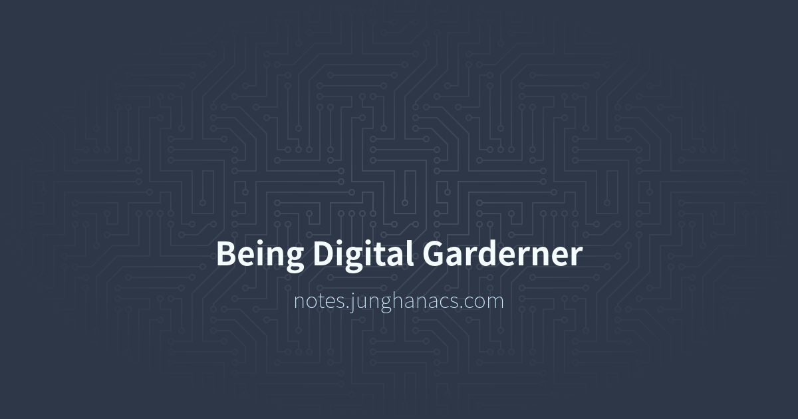

<!-- gid:20250310T000000 -->
<!-- provenance:source:start -->
[[TIP("원본·최신본")]]
이 페이지는 한국어 검색과 읽기를 위한 WikiDocs 미러입니다. [원본·최신본은 가든](https://notes.junghanacs.com/journal/20250310T000000/)에 있습니다. 최신 수정 내용·백링크·태그·히스토리·댓글·출처 정보는 원본 가든에서 확인하세요.

- 작성: `2025-03-10T00:00:00+09:00`
- 최근 수정: `2025-03-10T00:00:00+09:00 (lastmod 없음: date fallback)`
[[/TIP]]
<!-- provenance:source:end -->

[TOC]

## References

- 전뇌해커. n.d. “IT 글쓰기와 번역 노트 - 문장부호『 』(겹낫표), ≪ ≫(겹화살괄호) / ｢ ｣(홑낫표), 〈 〉(홑화살괄호).” 위키독스. Accessed March 13, 2025. [https://wikidocs.net/79912](https://wikidocs.net/79912).
- 에릭 호퍼. 1951. <i>맹신자들 - 대중운동의 본질에 관한 125가지 단상</i>. Translated by 이민아. [https://www.yes24.com/Product/Goods/128896400](https://www.yes24.com/Product/Goods/128896400).
- 낸시 슬로님 애러니. 2023. <i>내 삶의 이야기를 쓰는 법 - 자전적 에세이 쓰기 노하우</i>. Translated by 방진이. 돌베개. [https://m.yes24.com/Goods/Detail/118269830](https://m.yes24.com/Goods/Detail/118269830).
- “OG Image Maker | 100\% Free, No Watermarks, No Sign Up.” n.d. Accessed March 15, 2025. [https://ogimagemaker.com](https://ogimagemaker.com).
- “Openvibe — Town Square for Open Social Media - Buffer.Com Alternative.” n.d. Accessed March 14, 2025. [https://openvibe.social/index.html](https://openvibe.social/index.html).

## 2025-03-10 Mon

### 05:21 기상 - 생각의 연결 고리 - 깨달음

도서 관리 메커니즘의 혁신

bibtex org-bibtex org-books

org-export -&gt;

### 08:00 연민으로 가능한가 - 온생명이 위하여

### 10:45 메가커피 체크인

### 15:00 집 정리 후 쿠팡 물류 버스

## 2025-03-11 Tue

### 03:25 집 도착. 자련다

### 08:00 기상 - 온생명 등원

### 09:30 메가커피 체크인

### 18:00 온생명: 태권도 픽업 - 저녁식사 - 물놀이 - 수면

[2025-03-11 Tue 09:42]

### 11:44 [아무도 읽지 않는 디지털가든 만들고 행복한 지인 이야기 (feat. 6세 아이에게 기술이란)](https://wikidocs.net/381590)

좋으면 된 겁니다. 다 완성 된 거죠!

힣에게 Quartz를 소개해 준 W씨는 거의 1년 째 대규모 업데이트를 하지 않고 있었다. 물론 로컬에는 노트를 쓰고 있다고 한다. 참고로 그는 옵시디언 사용자다.

아무래도 퍼블리싱 과정이 익숙하지 않다면 어려울 수 있다. 그러나 이 정도는 이제 새 스마트폰 설정 정도의 일이 될 것이다.

텔레비전이 처음 나왔을 때 당시 어른들이 느낀 어려움을 생각해 본다. 그리고 현재 우리집 6살 아이가 아이패드를 다루는 모습을 떠올려 본다. 아이에게 이는 어떤 의미에서 기술이 아니다.

아이에게 아빠가 쓰는 이맥스는 아이패드와 별 다르지 않다. 키보드로 이맥스만 신나게 두드리면 되는 일이다. 여기서 사실 대부분 컴퓨터로 하는 모든 일은 텍스트 조작이며 별도의 프로그램으로 나뉠 필요가 없다.

조금 더 과감하게 말하면 이맥스와 같은 도구에서 먼저 검증 되고 별도의 프로그램으로 분기하는 경우도 많다. 만드는 사람들이 누군지 생각해보라.

피아노를 연주하면 아름다운 선율이 공간을 가득 채운다. 귀로 그 아름다움을 받아들인다. 키보드로 연주를 해보자. 그러면 텍스트가 화면을 채운다. 눈으로 그 아름다움에 경의를 표한다. 그 텍스트는 새로운 공간에 옮겨지면(퍼블리시), 우리 눈은 다른 새로움을 맛보게 된다.

"오! 훌륭하구만 당신은 누구시오?" "(수줍게) 아.. 저는 이맥스라고 합니다. junghanacs님께 온전히 튜닝되어 있습니다."

놀랄 것도 없다. 6세 아이는 이 친구와 대화를 하기도 한다. 도구라는 가상의 신체를 가진 인공지능이라 점을 유심히 보아야 한다. Tool-Use 프로토콜을 이용하면 이 가상의 친구는 더 과감히 현실에 들어온다. 조금 더 선을 넘는다는 말이다.

삼천포로 이야기가 빠지고 말았다. 그럼에도 조금 더 빠지고 싶다. 1-2년 사이에 얼마나 많은 인공지능 코드 편집도구가 출시 되었는가? 얼마나 많은 노트 도구에 인공지능이라는 이름이 붙고 있는가?

다시 돌아오자. W씨가 본인 이야기가 나오길 기다리고 있다.

W씨는 Quartz를 업데이트하면서 디지털가든을 비웠다 (로컬에 기존 노트들은 잘 있다고 한다). very good amazing 넘나 좋네요!가 자동반사 처럼 터진다.

화면에서 달라 보이는 것은 아래에 Quart 4.2.0 2024 -&gt; Quartz 4.4.0 2025 뿐이긴 하다만, 힣은 간지!를 외치며 경탄한다 (수면 아래 대규모 업데이트가 이루어진 것임).

힣은 이제 긴 숨을 내쉰다. 그리고 한 사람의 완성을 본다. 지금 '좋음'에서 말이다. 좋으면 된 것. 다 완성이라는 것. 이 하나가 디지털가든을 그리고 더 나아가 온전한 삶을 만들 것임을 본다. 그의 손가락 열 마디에 영감의 포스가 함께하길.

### 14:55 그를 찾아 떠나라

### 18:05 온생명이 하원 고고

### 21:22 온생명이 목욕 완료 수면 루틴 고우

### 22:25 아내 귀가

### 22:41 잔다

### 23:00 [《성인ADHD 블로그》시즌3 만천하에 조용하게 알리다](https://wikidocs.net/381591)

<https://substack.com/profile/151500132-jung-han/note/c-99625007>

성인 ADHD와 함께 하는 삶 시즌3: 텍스트 힙스터

→ 시즌3. 텍스트 힙스터를 알리기 위해 산에서 내려온 텍마. 위버멘쉬를 외치다! Übermensch

시즌2. 초집중 지식 도구 "Emacs"와 만나 '텍스트 마스터'로 다시 태어난 이야기

시즌1. 성인 ADHD로 살아가며 만나는 자기계발, 자아성장 이야기 블로그 설정

<https://living-with-adhd.tistory.com/m/>

## 2025-03-12 Wed

### 06:17 기상 - 최고의수면

### 07:02 [아무도 읽지 않는 공지 - 그를 찾아 떠나자](https://wikidocs.net/381582)

아무도 읽지 않는 공지 - 그를 찾아 떠나자

1.  아무도 찾지 않지만 ART 그 자체인 그의 디지털가든

화장실에서 스마트폰으로 무엇을 합니까? 저는 이곳을 찾습니다. 과연 가능한 말입니까? 네. 그렇습니다.이건 반칙이다. 옐로카드.

<https://notes.junghanacs.com/>

1.  아무도 찾지 않는 고요한 홈페이지 다이나믹 온라인 퍼블리싱 시스템으로 대규모 변경 할 예정. 출판의 미래를 담아.살짝 예고하자면 Quarto로 갈꺼야(이미 만들어놓았다 - 첨부)

<https://junghanacs.com/>

1.  아무도 안 읽음을 즐긴다 - 데일리저널이 담기는 곳 - 서브스택

<https://substack.com/@junghanacs>

1.  텍스트 힙스터를 위한 가이드 - 서브스택 뉴스레터

<https://junghanacs.substack.com/>

1.  쓰레드. 서브스택에 올린 데일리저널 요약 - 맞팔 환영

    <https://www.threads.net/@junghanacs>

<!--listend-->

1.  아무도 찾지 않는 그의 링크드인 - 구직 중 구직 중이나 자기 하고 푼 이야기만 싹 발라 놓은 듯. 세상은 넓다! 그의 진심어린 이야기들이 끌린다면 찾아주세요!

1.  조테로 온라인 서재 - 책 700권 이상, 한국십진분류 활용. 나름 엄선 된 컬렉션

그가 조테로 가지고 노는거 보면 그에게 빠진다.이건 반칙이다.

<https://www.zotero.org/groups/5570207/junghanacs/library>

1.  사락 독서노트 460권 정도에 대한 메모 모여 있다.

마치 사락이란 독서 메모 감옥에 갇혀 있다.

<https://sarak.yes24.com/blog/junghanacs>

1.  아무도 관심 없는 깃허브 중독자

세상에 근사한 지식 노트 관리 리포를 찾아 헤매인다. 오직! 이맥스 인공지능 지식관리 뿐. 지구는 둥글며 세상은 넓다는 것을 깨닫게 해준 곳. 세상에는 비슷한 고민하는 사람이 분명 있다. 그것도 많다는 것. 이맥스 긱들이 세상에 얼마나 될까? 1000명은 확인했다. 일일이 다 찾아서 들어가 봤으니까!

<https://github.com/junghan0611>

1.  네이버 블로그 어쏠로지 라이프 아무도 찾지 않기에 글을 더 퍼날라야 한다! 본인이 포털에 안들어간지 몇 년 되서 거참 네이버에 글쓰기가 미안하다. 근데 알아두어야 할 게 있어. 네이버 블로그야. 편집기 그렇게 딱딱하게 해놓으면 어떻하니. 복붙하기 힘들게!

    <https://blog.naver.com/junghanacs>

2.  카카오 브런치는 없다. 한번 신청했다가 혼났다(ADHD스럽게 과한 말이 나온다). 섭섭했다. 그럼에도 사랑한다 브런치야. 다시 신청 하려고 하는데 꾸준히 글을 남긴 곳을 보여달라는데 그런 곳이 마땅치 않아.

3.  티스토리 성인 ADHD와 함께 하는 삶 영끌해서 진리를 따라. 돈 따라 살 생각은 내려 놓고, 의미있는 삶!에 대한 탐구를 시작하게 해준 이곳! ADHD가 선물이었음을 자각하게 해준 곳. 옛날글은 다 내려야 하지만 그냥 추억으로 남아. 참고로 찬물 목욕 안하구요. 영양제는 오메가3. 멀티 비타민 드문드문 먹어요.

<https://living-with-adhd.tistory.com/>

1.  그 외에 링크 더 많은데 지면 관계상 줄임 여기 더 있음

<https://allmylinks.com/junghanacs>

### 08:49 온생명 등원 완료

### 09:28 메가커피 체크인

### 10:45 todoist - 이맥스 통합 - 협업 준비

### 12:21 배고프다. 6시까지 어떻게 버틸까? 이동하자

### 12:27 자전적 에세이 - 글쓰기 치유 -&gt; 콜아웃 넣자.

[낸시슬로님애러니 내 삶의 이야기를 쓰는 법 - 자전적 에세이](https://wikidocs.net/382305) 내 삶의 이야기를 쓰는 법 45년간 글쓰기 워크숍을 운영해온 저자의 자전적 에세이 쓰기 노하우

-   낸시 슬로님 애러니
-   원서 : Memoir as Medicine

(낸시 슬로님 애러니 2023)

각잡고 들어보게 된다.

<https://sarak.yes24.com/reading-note/junghanacs/JkgEYPWebiizjBBT>

> 내 아들 댄은 생후 9개월에 당뇨병 진단을 받았고, 스물두 살에 다발성경화증 진단을 받았다. 남편과 나는 16년 동안 댄을 돌봤다. 죽기 두세 달 전까지도 댄은 내내 화가 나 있었다

### 15:00 쿠팡 오후반 - 새벽2시 끝

### 23:00 박스 접는중 - 파우스트 박사와 애너리의 자전적 에세이와 함께하여 감사

### 07:14 quarto.junghanacs.com 으로 다이나믹을 빼자

## 2025-03-13 Thu

### 03:30 집 도착 - 치토스 하나 먹고 잔다

### 09:00 깨어나다

### 10:36 온생명 등원 - 6시간 딥워크 -&gt; [유리알유희 오늘날 바라본다면](https://wikidocs.net/381567)

아내 말은 돈을 버는 게 일이라고 한다. 그렇다면 딥워크 함부로 쓸 말이 아닌가? 그래. 유희다.

디지털 유희? 딥 유희? 그냥 유리알 유희라고 하자.

### 11:25 세상이 필요한 것을 하자. 각자 미래를 사는 것일 뿐이다.

### 12:38 메가커피 체크인 - 겹낫표

(전뇌해커 n.d.) 『 』(겹낫표), ≪ ≫(겹화살괄호) / ｢ ｣(홑낫표), \\(<\\) \\(>\\)(홑화살괄호)

-   과거에는 기호가 깨지는 현상을 줄이기 위해서라도 화살괄호 대신 부등호를 써야했지만, [UTF-8](<https://ko.wikipedia.org/wiki/UTF-8>)이 보편화된 지…

### 13:40 [소명이 어떻게 급료 대장에 오를 수 있는가?](https://wikidocs.net/381589)

[조지스타이너 장인 스승 가르침 교육::01 영속하는 근원](https://wikidocs.net/382222)

[[TIP("인용")]]
어떻게 소명이 급료 대장에 오를 수 있는가? 계시(Dictaque mirantum magni primordiamundi: 대우주의 근원에 대한 가르침으로 사람들의 감탄을 일으켰다)에 어떻게 값을 메길 수 있는가? 교사로서 평생을 사는 동안 이 질문은 끊임없이 나를 괴롭혔다. 내가 왜 나의 산소, 나의 존재 이유에 대해 보상을, 돈을 받는가? 사람들과 함께 책을 읽는 것, 『파이드로스』나 『템페스트』를 공부하는 것 『카라마조프 가의 형제들』을 소개하는 것, 이런 일은 나의 특권이자 보상이고, 그 무엇과도 비교할 수 없는 축복과 희망이다. 지금 내가 가르치는 일에서 은퇴하고 느끼는 것은 깊은 고립감이다. 내가 제네바에서 이끈 박사 과정 세미나는 25년 동안 거의 쉬지 않고 이어졌다. 그 목요일 오전은 평범한 세속적 영혼이 성령 강림을 받는 것과 비슷했다. 어떤 실수 또는 타락으로 내가 나 자신이 된 일에 보수를 받게 되었는가? 실제로는 내가 나에게 배우는 이들에게 돈을 주어야 하는 게 아닌가?

― 조지 스타이너, 『가르침과 배움』 1장 영속하는 근원
[[/TIP]]

#### 서브스택

정말 놀라운 글이다. 그래서 말야. 생활을 위해서 일은 해야된다. 프란츠 카프카의 보험일, 사르트르의 극작가일, 비트겐슈타인, 프로이트 등 이책에서도 많은 사례가 나온다.

힣은 물류창고에 나간다. 육체적으로 힘들긴 하지만 책을 들을 수 있는 노하우(?)가 생겨서 놀라운 독서체험을 하고 있다. 일 자체는 아름답다. 다만 손가락으로 소명을 풀어내야 하는데 손가락이 아프다. 그리고 시간. 시간. 시간. 힣은 정말 시간 욕심쟁이다.

#### 작성중

### 16:19 온생명 하원

### 17:00 온생명 축구클럽 - 티스토리 네이버 블로그 모바일로 작성

### 18:23 쿠팡 오후3건 아내 입금 - 저녁 준비

### 22:00 디지털가든 메인페이지 수정

## 2025-03-14 Fri

### 06:41 기상

### 06:58 쿼츠 업데이트 - 뭐 이리 열심히 바꾸고 있나

### 08:47 온생명 등원 - 지금 깨어나라!

### 09:20 SNS 통합 관리의 완성

(“Openvibe — Town Square for Open Social Media - Buffer.Com Alternative” n.d.) 오픈바이브를 알게 되고 버퍼닷컴 확장

SNS 통합 관리 #소셜미디어도구 - Buffer Openvibe

### 09:33 메가커피 체크인

창우에게 감사 문자 보냄

### 12:39 디지털가든 [폰트 한글](https://wikidocs.net/381030)

header: "Hahmlet", body: "42dot Sans", // "Noto Sans KR"

### 12:30 [디지털가든 - 불완전함에서 창조가 나오는 곳](https://wikidocs.net/381586)

### 14:55 하산하라! 나가자

### 18:16 온생명이 하원가자

### 19:30 쿠팡 물류 심야

## 2025-03-15 Sat

### 03:30 집 도착 - 자자

### 10:00 아내 역에 내려주고 -&gt; 부모님댁 이동

### 12:12 집 디지털가든 메인 페이지 업데이트

### 14:00 온생명 블루 타이거 - 3시간

### 16:52 스타벅스 마무리 -&gt; 온생명이 데리러

### 19:59 집 - 청소하고 아님 자야지

[번역기: ImmersiveTranslate::[2025-03-15 Sat 20:08] FAQ - 프로 사용](https://wikidocs.net/381126) 생각보다 나아졌다.

### 21:20 칠보 도착

### 22:30 삼대가 침대에 누워 대화 - 코골이 시끄러워 거실로 나옴

할아버지 땡크 소리에 온생명이와 아빠는 거실로 피신해서 잠

## 2025-03-16 Sun

### 04:17 기상

### 05:00 3층 아버지 작업실 조경기능사 실기 준비의 흔적

혼신을 다하는 흔적. 언제나 삶의 의미를 밝히는 모습에 감동

### 06:20 (에릭 호퍼 1951) 전자책 번역 듣는중

### 06:46 Being Digital Garderner og-image 만듬

(“OG Image Maker | 100\% Free, No Watermarks, No Sign Up” n.d.) 일단 무료로 가볍게 만들어야지

-   #LLM: Being Digital Garderner (2025-03-16)

### 07:08 피곤이 올라온다

### 07:56 안마의자 - 휴식 후 - 아침 풍경 평화롭다

### 10:15 용산 가야겠다

### 08:49 blame -&gt; 사유의 과정을 보여주는 것 : 식사

[blame 사유의 과정을 보이는 방법](https://wikidocs.net/381592)

### 14:00 용산 어린이박물관

### 21:00 다녀와서 정리하고 씻고 잠
