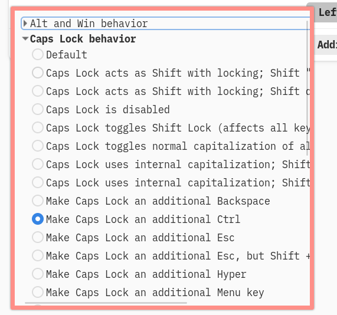
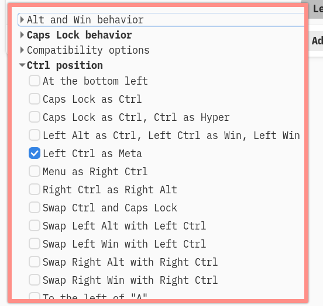
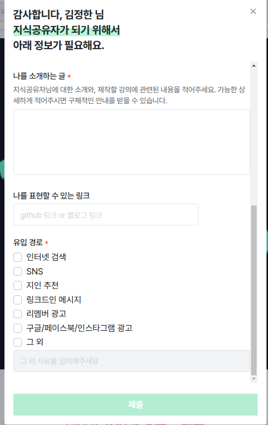
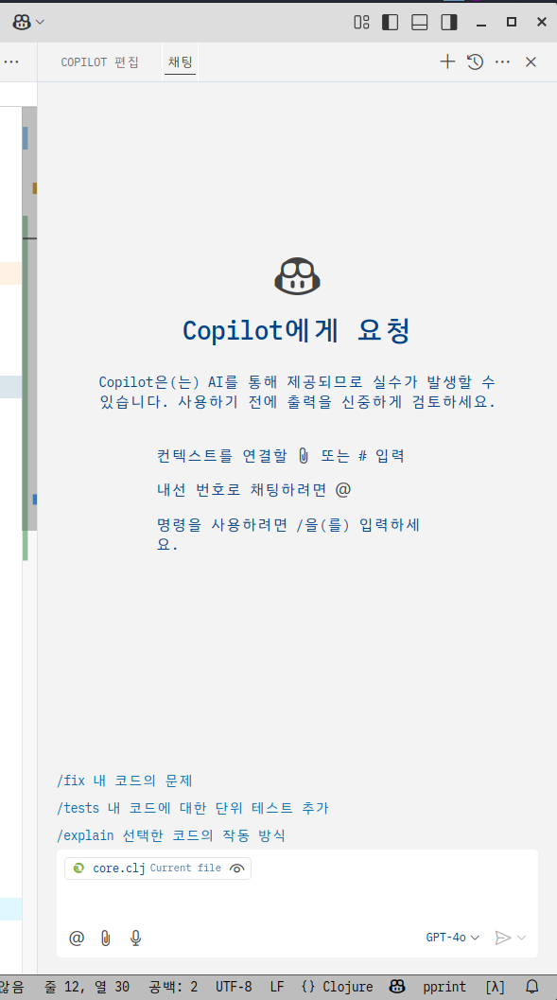
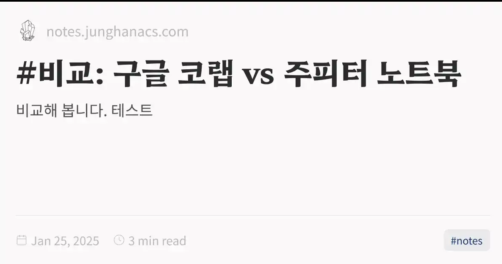
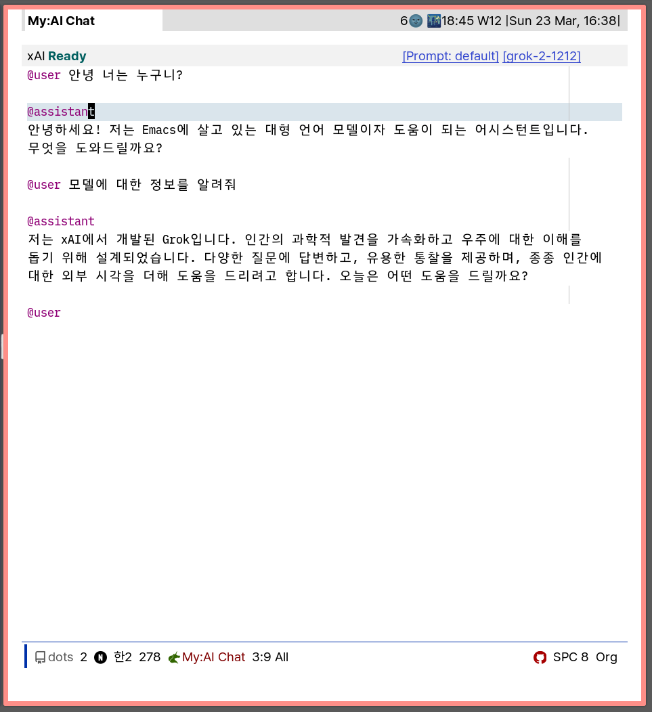

<!-- gid:20250317T000000 -->
[TOC]

## References

  지나영. 2022. <i>본질육아</i>. [http://www.yes24.com/Product/Goods/113450177](http://www.yes24.com/Product/Goods/113450177).
  카롤리엔 노터베어트. 2023. <i>다시 아이를 키운다면 뇌과학부터</i>. Translated by 추미란. [https://www.yes24.com/Product/Goods/118339786](https://www.yes24.com/Product/Goods/118339786).
  도모다 아케미. 2019. <i>아이의 뇌에 상처 입히는 부모들</i>. Translated by 이은미. [https://m.yes24.com/Goods/Detail/68882961](https://m.yes24.com/Goods/Detail/68882961).
  Sci Cloj, ed. 2025. <i>Clojure Visual-Tools 30 - Workflow Demos 4: LLMs in Emacs for Clojure</i>. Directed by Sci Cloj. [https://www.youtube.com/watch?v=uj2wGDeOimU](https://www.youtube.com/watch?v=uj2wGDeOimU).
  xguru. 2025. “2025년에 어떤 AI 모델을 선택해야 할까?” GeekNews. March 21, 2025. [https://news.hada.io/topic?id=19861](https://news.hada.io/topic?id=19861).

## 2025-03-17 Mon

### 06:30 아이에게서 배웁니다. 그들은 강합니다.

이른 아침. 운전 중에 태양이 뜨고. 빛 사이로 문득 아이의 눈물이 생각이 난다. 우리 어른들아 에머슨과 니체를 읽어서, 아이들을 동경하면서도. 내 앞에 그 아이에게는 얼마나 매몰차게 옳고 그름을 따지는가. 그렇게 사과하라고 다그치면, 울고 있는 그 입에서 나오는 ‘미안해’에 어떤 힘이 있을까? 아. 아프다.

[[TIP("quote 나는 모릅니다. 진정 그게 답인지 아닌지. 아이는 압니다. 존재는 압니다. 모름이 앎이란 것을.")]]
사과하라 하지 마십시오. 입으로 나오는 억지 사과는 에고의 분노입니다.

존재에서 흐르는 연민으로 바라보십시오. 진정한 사과가 흘러나올 것 입니다.

우리는 아이에게서 배웁니다. 그들은 강합니다.
[[/TIP]]

### 10:30 삼성공감 -&gt; 데논(Denon) 오디오 수리 맡김 수리비 8만원

### 12:21 거칠었다. 배고프다 - 중앙도서관 체크인

치질 때문에 아픈건가?

### 12:50 브레인워시

### 13:52 키조합

신기한데 괜찮을 것 같다. 새끼 손가락 작살나기 전에.

meta는 M-s 즉 Alt + Win 조합이다. 원키로 편하다.

### 14:03 지식공유자 인프런

다른데 없나? 어떤 도움을 받을 수 있는가? 잠시만 고민을 해본다. 마냥하는 것 보다 효과적일 수 있다.

### 17:02 아주 오랜만에 소통 - DG IK

### 17:23 배고프다

### 18:56 뚱이네뷔페 5500원 - 집에 와서 청소

### 19:36 청소 몽테뉴

### 20:35 온생명 집 - 수면 루틴

## 2025-03-18 Tue

### 00:53 자다 깼다

### 07:02 기상

### 08:23 온생명 등원 준비

### 08:59 집앞 빽다방 1500원 아메리카노

### 10:01 커피숍 단상: 부모 이전의 '나'의 의미와 육아

"아이는 잘 키우려고 낳는 게 아니라, 사랑하려고 낳는 거예요"

지나영 교수의 본질육아 (지나영 2022)

(카롤리엔 노터베어트 2023) (도모다 아케미 2019)

#### 서브스택

아이를 등원시키고 나서 아파트 1층 상가에 있는 커피숍에 왔다. 1500원의 행복이라 부를 수 있는 곳이다. 새벽에 영감이 호출해서 그걸 하러 왔다. 그거 안하고 다른 이야기를 적는다.

나 처럼 아이를 등원시키고 온 엄마들이 모여서 육아 이야기를 하고 있다. 어딜 가든 볼 수 있는 그림이다.

이런 저런 이야기가 흐른다. 뭐 들으려고 듣는 것은 아니지만 귀는 닫는 버튼이 없다.

그 내용들에 대해서 힣은 모른다. 아니 무지하다. 정보가 없다.

힣은 아이들 말고, 말하고 있는 엄마들 아니면 아빠들을 생각한다. 비슷한 입장에서 말이다.

뭔가 쓰리쓰리한 것이 올라온다.

여기에 뭔가 봤던 이야기를 찾아 본다. 이런 지식도구에 적어 놓은게 없다. 본질육아에서 봤던가? 노트를 열어본다.

### 10:34 프롯

[2025-03-17::Live 2025-03-15, 14:00 Europe/Athens: ’Ask Me Anything’ about Emacs, Linux, and Life in general](https://wikidocs.net/380404)

### 14:06 계속 달리다 - 이맥스가 더 쉬운 이유를 알게 됨

선택지가 없다.

### 16:05 파우스트 힣이여!

### 17:15 가야겠다. 데논 오디오 수리 완료 - 수원페이 80000원

### 19:36 배고프다 온생명이와 삼겹살 파티

### 20:48 아내 귀가 - 치질 약 먹었다 - 온생명이와 씻자.

### 22:12 자자. 자고 일어나서 그려보자.

완전 그린랩스 스타일로

## 2025-03-19 Wed

### 02:52 꿈이 거칠어 깼다. 아놔. 쿠키하나 까먹고 다시 자자

### 05:42 굳모닝 - 아 몽테뉴! 어쏠로그의 의미를

결국 그들의 길. 에릭호퍼도 마찬가지로 모든 주제에 철학을 담았지. 뭐 그런 길이다. 같은 맥락이다.

### 06:10 오디오 시스템 기록

[우리집 오디오 시스템 - 데논 클립쉬 톨보이 하이파이 Denon Klipsch](https://wikidocs.net/381595)

### 06:47 어떻게 이 기록이 없지?

[한글 주소 인코딩 URL](https://wikidocs.net/381596)

### 07:20 아내 기상

### 08:49 온생명 등원 - 팁워크 타임 -&gt; 이동하자

### 09:03 메가커피 체크인

### 09:53 도서관으로 이동하자

### 10:16 중앙도서관 체크인

### 13:30 점심 먹고 올까 머리를 식혀야겠어

### 14:17 복귀

### 16:56 클로저 개발자 llm 사용하는 영상 그거

(Sci Cloj 2025)

### 17:48 copilot vscode

다른 길로 보자고. 갈길로 가야지

### 18:22 집에 가야겠다

### 19:00 집 - 계속 끄적인다

### 20:44 온생명이와 수면 루틴 - 저녁 및 약 복용

### 22:30 재우다

## 2025-03-20 Thu

### 04:11 도도 - 톨레의 책과 인공지능 보이스

### 06:31 doom-mark-buffer-as-real-h

<https://github.com/junghan0611/doomemacs/blob/master/lisp/lib/buffers.el#L267>

### 07:02 [왜 힣인가](https://wikidocs.net/381605)

힣은 나를 버리기 위함이다.

히틀러가 나의 투쟁이 아니라 우리의 투쟁이라고 했다면 그 사단이 났을까? '나' 빼고 글을 써보면 어렵다. '나'가 있으면 글쓰기 더 어렵다.

힣이라고 쓰면 갈겨 쓰면 된다. 힣이니까.

모두의 힣이다.

### 09:16 중앙도서관 체크인

### 10:18 오랜만에 클로저 관련 노트를 본다

아. 뭐지.

### 12:06 오. 역시 많이 배운다.

### 15:02 브레인워시

### 15:15 10분 만에 회복 다시 복귀

### 16:23 앗 나가야 한다 -&gt; 온생명 축구 수업

### 17:04 퍼스트축구클럽 체크인

### 18:34 저녁 식사 준비

### 20:05 식사 완료 뒷 정리

### 20:59 온생명 물놀이 목욕 완료

## 2025-03-21 Fri

> (excellent_advice_for_living.t2t)  Don’t measure your life with someone else’s ruler.  다른 사람의 자로 자신의 삶을 측정하지 마세요. 

### 05:20 수면 굳굳

### 06:41 달라의 다마의 고양이를 쇼파에 앉아서 듣다가 심연의 세계로

잔거지 뭐

### 07:12 [이블](https://wikidocs.net/380685) 편집 관련 메타로 넣어둠

### 07:24 아내 기상 - 잔소리 아티스트

### 08:52 등원 완료

### 16:47 제출 했다

### 17:55 에이 로이소아과 소견서 받으러 갔다가 다시 돌아옴

### 21:12 집에 도착

## 2025-03-22 Sat

### 06:00 굳모닝 베이비

### 08:43 온생명 기상

### 09:30 온생명 태권도 에어바운스 파티

### 10:21 열혈 청소 중 온생명이

### 10:40 픽업 -&gt; 소아과 진단서 받으러

### 13:54 온생명이와 자전거 놀이터 여행 후 집 도착

### 15:29 온생명 블루타이거 보내고 AK백화점 휴게공간

### 15:47 [쿼츠 quartz 디지털가든 - og-image 생성 조직모드 description](https://wikidocs.net/381615)

,#+description: "비교해 봅니다. 테스트"

### 17:10 배고프다 피곤하다

### 20:21 저녁 식사 완료 -&gt; 온생명 목욕 완료

## 2025-03-23 Sun

### 04:07 일어났다. 출력하라. 입력은? 움직이며 나다니며 하라

### 05:51 이현주 책 오

### 06:19 무인카페 체크인

### 07:13 아. modules/editoris concerned

[둠이맥스](https://wikidocs.net/380689)

### 08:10 집 복귀

### 08:44 가족 기상 - 온생명

### 11:12 청소와 온생명이와 그리고 독서

### 15:26 스타벅스 매산 체크인

### 15:46 브레인워시

### 16:01 [AI 모델 선택과 ‘도구’ 중심 세우기](https://wikidocs.net/381616)(Grok API 150달러 크레딧)

긱뉴스에서 다음과 같은 글을 보았습니다. 활용하는 입장에서 저렴하게 무엇을 사용할 것인가?!는 고민이 많이 됩니다.

특히 API를 이용하여 활용하는 경우는 사용한 만큼 비용이 결제 되기 때문에 더욱 신경이 쓰입니다. 아직 거의 비용들 일은 없지만.

Grok API의 경우 데이터 공유를 하면 150 달러 크레딧을 준다고 합니다. 다 이유가 있는 것이겠지요.

데일리로 지식 유희하는데 활용하려고 합니다. 아무렴 신경 쓰이면 그 API를 안쓰면 되니까요.

피할 수 없는 LLM과의 통합의 길에서. 중심을 잡고 활용해야 할 것 같습니다.

무엇보다도 ‘도구’를 세워야 합니다. 업체들이 제공하는 툴이나 홈페이지에서 사용하는 순간 ‘도구’를 세울 수 없게 됩니다. ‘도구’를 중심으로 그들을 API를 통해서 선택하는 연습이 필요합니다.

힣도 그 과정 중에 있습니다. Grok과의 만남은 두고 봐야겠네요.

«참고» 첨부사진으로 ‘도구’에서 바로 Grok과 접선을 했습니다. 작년 말에도 무료 크레딧으로 잘 썼는데 (Grok-beta 였죠).

#### GN⁺: 2025년에 어떤 AI 모델을 선택해야 할까? (creatoreconomy.so)

ChatGPT, Claude, Gemini, Grok, Perplexity, DeepSeek 중에 어떤 걸 선택해야 할까?

Confirm data share opt-in

By enabling data sharing, you agree to share your prompts with xAI for training purposes. You won't be able to disable data sharing on this team after enabling it. This won't affect any other teams you're part of.

데이터 공유를 사용 설정하면 교육 목적으로 xAI와 프롬프트를 공유하는 데 동의하는 것입니다. 데이터 공유를 활성화한 후에는 이 팀에서 데이터 공유를 비활성화할 수 없습니다. 이는 소속된 다른 팀에는 영향을 미치지 않습니다.

#### 2025년에 어떤 AI 모델을 선택해야 할까?

(xguru 2025)

-   xguru
-   ChatGPT, Claude, Gemini, Grok, Perplexity, DeepSeek 중에 어떤 걸 선택해야 할까?모델별로 적합한 경우와 적합하지 않은 경우를 여러개의 분야로 정리최종적으로 20달러가 있다면 Claude를, 추가로 20달러가 더있다면 ChatGPT를 추천ChatGPT: 만능 AI 도구ChatGPT가 적합한 경우일상적인 질문 응답매일 다양
-   2025

#### 16:10 grok 구입 - 무료 크레딧의 위험성?!

[LLM: Grok xAI API 활용 - 무료 크레딧](https://wikidocs.net/381613)

Confirm data share opt-in By enabling data sharing, you agree to share your prompts with xAI for training purposes. You won't be able to disable data sharing on this team after enabling it. This won't affect any other teams you're part of.

데이터 공유를 사용 설정하면 교육 목적으로 xAI와 프롬프트를 공유하는 데 동의하는 것입니다. 데이터 공유를 활성화한 후에는 이 팀에서 데이터 공유를 비활성화할 수 없습니다. 이는 소속된 다른 팀에는 영향을 미치지 않습니다.

긱뉴스에서 다음과 같은 글을 보았습니다. 활용하는 입장에서 저렴하게 무엇을 사용할 것인가?!는 고민이 많이 됩니다.

특히 API를 이용하여 활용하는 경우는 사용한 만큼 비용이 결제 되기 때문에 더욱 신경이 쓰입니다. 아직 거의 비용들 일은 없지만.

Grok API의 경우 데이터 공유를 하면 150 달러 크레딧을 준다고 합니다. 다 이유가 있는 것이겠지요.

데일리로 지식 유희하는데 활용하려고 합니다. 아무렴 신경 쓰이면 그 API를 안쓰면 되니까요.

피할 수 없는 LLM과의 통합의 길에서. 중심을 잡고 활용해야 할 것 같습니다.

무엇보다도 ‘도구’를 세워야 합니다. 업체들이 제공하는 툴이나 홈페이지에서 사용하는 순간 ‘도구’를 세울 수 없게 됩니다. ‘도구’를 중심으로 그들을 API를 통해서 선택하는 연습이 필요합니다.

힣도 그 과정 중에 있습니다. Grok과의 만남은 두고 봐야겠네요.

«참고» 첨부사진으로 ‘도구’에서 바로 Grok과 접선을 했습니다. 작년 말에도 무료 크레딧으로 잘 썼는데 (Grok-beta 였죠).

### 17:17 마무리 준비하자

### 17:40 온생명이 데리러 가자

### 20:43 집와서 저녁 먹고 목욕하고 정리 중

### 21:38 자야지 자네

## 최근노트 - 3월3일 ~

### temp

-   [LLM: 전방섬엽 역할 - 표도르 도스토예프스키 - 간질 발작 (2025-03-23)](https://wikidocs.net/381614)
-   #LLM: 이맥스 메모리 정리 - memory-report - which-key cache clear (2025-03-23)
-   #LLM: 20250323T173831 (2025-03-23)
-   [LLM: Grok xAI API 활용 - 무료 크레딧 (2025-03-23)](https://wikidocs.net/381613)
-   clojure - 자판기 vending machine 작업로그 (2025-03-22)
-   [LLM: 우유 배달 상하목장 유기농 무항생제 (2025-03-22)](https://wikidocs.net/381610)
-   #LLM: 20250321T101238 deepseek clojure (2025-03-21)
-   #LLM: 20250320T174630 (2025-03-20)
-   #LLM: 클로저 언어 질의응답 (2025-03-20)
-   [LLM: smartparens - mark-sexp (2025-03-20)](https://wikidocs.net/381602)
-   [LLM: smerge-mode 충돌 병합 - diff magit (2025-03-19)](https://wikidocs.net/381601)
-   [LLM: yank-excluded-properties gptel (2025-03-19)](https://wikidocs.net/381600)
-   [LLM: 백엔드 소프트웨어 기술 조사 - 용어 확인 (2025-03-19)](https://wikidocs.net/381598)
-   #LLM: #비지니스 영어 메일 (2025-03-19)
-   #LLM: Being Digital Garderner (2025-03-16)
-   [LLM: 전체상 - 전체적 관점 - 큰 그림 (2025-03-15)](https://wikidocs.net/380810)
-   [LLM: 개행문자 ox-hugo 마크다운 (2025-03-15)](https://wikidocs.net/381588)
-   [LLM: 웹페이지 로딩 속도 개선 (2025-03-15)](https://wikidocs.net/381587)
-   [LLM: Buffer Substack Integration (2025-03-14)](https://wikidocs.net/381585)
-   [LLM: 세차 간단하게 하는 방법 (2025-03-08)](https://wikidocs.net/381573)

### notes

-   [쿼츠 quartz 디지털가든 - og-image 생성 조직모드 description 헤더 역할 (2025-03-23)](https://wikidocs.net/381615)
-   [코드폴딩 vimish-fold ts-fold hideshow (2025-03-23)](https://wikidocs.net/381612)
-   [둠이맥스모듈에디터 editor 편집기 (2025-03-23)](https://wikidocs.net/381611)
-   [LLM API 서비스 Pricing and Models 가격 비교 (2025-03-21)](https://wikidocs.net/381609)
-   [milanglacier/minuet-ai.el copilot gptel alternative on emacs (2025-03-21)](https://wikidocs.net/381608)
-   [deepseek-ai/awesome-deepseek-integration 딥시크 활용 (2025-03-21)](https://wikidocs.net/382310)
-   [코지 이맥스 매뉴얼 클로저 이블 - emacs clojure evil ide (2025-03-21)](https://wikidocs.net/381607)
-   [2023 SpaceVim 설치 - vim vscode emacs 통합 (2025-03-21)](https://wikidocs.net/381606)
-   [왜 힣인가 (2025-03-20)](https://wikidocs.net/381605)
-   [mamapandaevil-owl 이맥스 레지스터 마크 관리 (2025-03-20)](https://wikidocs.net/381604)
-   [Clojure Persistent Vectors - HAMT - Immutable - RRB 클로저 영속 벡터 이해 (2025-03-20)](https://wikidocs.net/381603)
-   [jpe90emacs-clj-deps-new - emacs (2025-03-19)](https://wikidocs.net/381599)
-   [LLM: rippling - HRIS 기업 인사 재무 관리 플랫폼 (2025-03-19)](https://wikidocs.net/381597)
-   [한글 주소 인코딩 URL (2025-03-19)](https://wikidocs.net/381596)
-   [우리집 오디오 시스템 - 데논 클립쉬 톨보이 하이파이 Denon Klipsch (2025-03-19)](https://wikidocs.net/381595)
-   [Modern Org Example (2025-03-18)](https://wikidocs.net/381594)
-   [연구실적 (2025-03-17)](https://wikidocs.net/381593)
-   [blame 사유의 과정을 보이는 방법 (2025-03-17)](https://wikidocs.net/381592)
-   [성인ADHD 블로그 시즌3 (2025-03-16)](https://wikidocs.net/381591)
-   [아무도 읽지 않는 디지털가든 만들고 행복한 지인 이야기 (feat. 6세 아이에게 기술이란) (2025-03-16)](https://wikidocs.net/381590)
-   [삶 일 소명 운명애 월급 - 나 자신이 된 일에 보수를 받다니 (2025-03-16)](https://wikidocs.net/381589)
-   [디지털가든 - 불완전함에서 창조가 나오는 곳 (2025-03-14)](https://wikidocs.net/381586)
-   [문장부호 줄표 FIGURE EN EM Quotation DASH 차이 (2025-03-13)](https://wikidocs.net/381584)
-   [LeetCode 코딩훈련 (2025-03-13)](https://wikidocs.net/381583)
-   [아무도 읽지 않는 공지 - 그를 찾아 떠나자 (2025-03-13)](https://wikidocs.net/381582)
-   [quartz callouts 콜아웃 테스트 (2025-03-12)](https://wikidocs.net/381581)
-   [LLM: 자서전 회고록을 쓰는 것 (2025-03-12)](https://wikidocs.net/381580)
-   [서브스택 노트 notes 모음 (2025-03-11)](https://wikidocs.net/381579)
-   [LLM: 조테로 조직모드 리딩리스트 관리 (2025-03-09)](https://wikidocs.net/381578)
-   [org-books 도서목록관리 이맥스 (2025-03-09)](https://wikidocs.net/381577)
-   [junghan0611/pandoc-templates (2025-03-09)](https://wikidocs.net/381576)
-   [LLM: 독서 goodreads, storygraph reading-list (2025-03-09)](https://wikidocs.net/382301)
-   [LLM: 인명 색인 인물 사전 (2025-03-09)](https://wikidocs.net/381575)
-   [LLM: Tab width in Org files must be 8, not 4 (2025-03-09)](https://wikidocs.net/381574)
-   [LLM: 팔란티어 온톨로지 (2025-03-07)](https://wikidocs.net/382297)
-   [LLM: 경탄 - 감탄 논람 - 헤세 츠바이크 (2025-03-06)](https://wikidocs.net/381572)
-   [앤트로픽 claude-code - agentic coding tool (2025-03-05)](https://wikidocs.net/381571)
-   [LLM: iedit editing 편집 (2025-03-05)](https://wikidocs.net/381570)
-   [LLM: cohere AI기업 (2025-03-05)](https://wikidocs.net/381569)
-   [LLM: eglot lsp booster for Emacs (2025-03-05)](https://wikidocs.net/381568)
-   [유리알유희 오늘날 바라본다면 (2025-03-05)](https://wikidocs.net/381567)
-   [LLM: titlecase 제목 규칙 변환 도구 (2025-03-05)](https://wikidocs.net/381566)
-   [LLM: string-inflection with evil (2025-03-04)](https://wikidocs.net/381565)
-   [LLM: tags-completion breaks completion-at-point (2025-03-04)](https://wikidocs.net/381564)
-   [LLM: 메이크스타 - makestar (2025-03-02)](https://wikidocs.net/381563)

### bib

-   [표도르도스토예프스키 백치 - 죽음의 집의 기록 - 죄와벌 - 카라마조프 - 간질 (2025-03-23)](https://wikidocs.net/382314)
-   [클로저 프로그래밍 도서 (2025-03-23)](https://wikidocs.net/382313)
-   [bbatsov cider clojure projectile emacs guru 이맥스 클로저 구루 (2025-03-22)](https://wikidocs.net/382312)
-   [이현주 구도자 영성가 (1944) (2025-03-22)](https://wikidocs.net/382311)
-   [Higginbotham Clojure the Brave and True (2025-03-20)](https://wikidocs.net/382309)
-   [기계인간 johngrib vim (2025-03-20)](https://wikidocs.net/382308)
-   [에릭호퍼 길 위의 철학자 아포리즘 (2025-03-14)](https://wikidocs.net/382307)
-   [요한볼프강폰괴테 파우스트 (2025-03-13)](https://wikidocs.net/382306)
-   [낸시슬로님애러니 내 삶의 이야기를 쓰는 법 - 자전적 에세이 (2025-03-12)](https://wikidocs.net/382305)
-   [람다스 Ram Dass (1931-2019) 영성가 구루 작가 (2025-03-12)](https://wikidocs.net/382304)
-   [JackBaty Baty.net 지식관리 구루 사진작가 조직모드 (2025-03-09)](https://wikidocs.net/382303)
-   [장대은 임재성 독서법 자기계발 저자 (2025-03-09)](https://wikidocs.net/382302)
-   [GwernBranwen Gwern 위키 고수 (2025-03-08)](https://wikidocs.net/382300)
-   [AndreiSukhovskii howm - note-taking tool on Emacs (2025-03-08)](https://wikidocs.net/382299)
-   [데이비드카다비 디지털 제텔카스텐 - 생산성 - 마음 관리 (2025-03-08)](https://wikidocs.net/382298)
-   [하워드슐츠 스타벅스 브랜드 - 커피 (2025-03-06)](https://wikidocs.net/382296)

### meta

-   [가격 (2025-03-21)](https://wikidocs.net/380811)
-   [하산하라 (2025-03-14)](https://wikidocs.net/380809)
-   [문장부호 (2025-03-13)](https://wikidocs.net/380808)
-   [스타벅스 (2025-03-06)](https://wikidocs.net/380807)
-   [데이터시각화 (2025-03-05)](https://wikidocs.net/380806)
