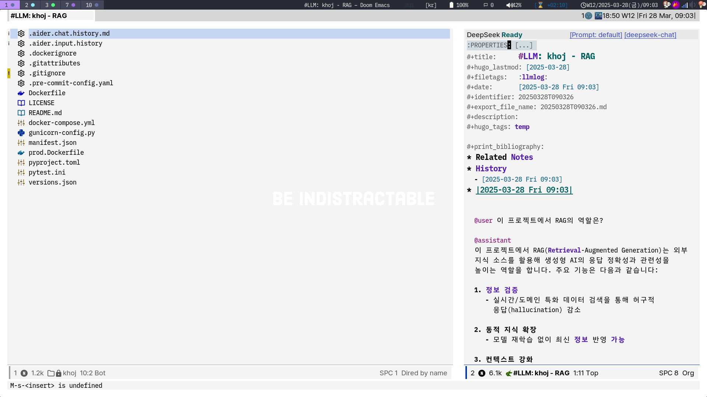
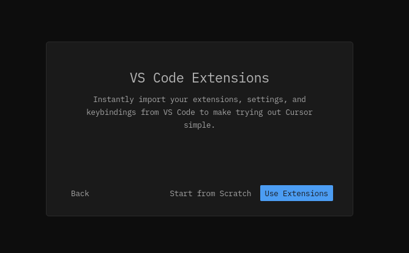
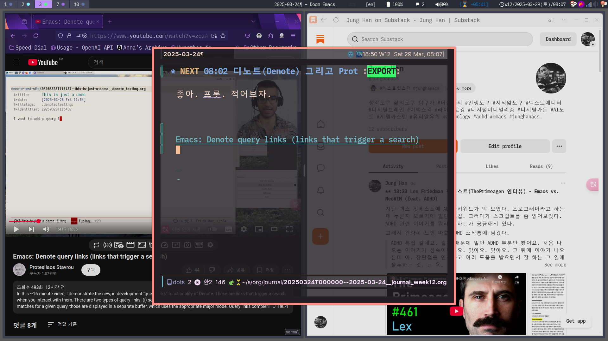
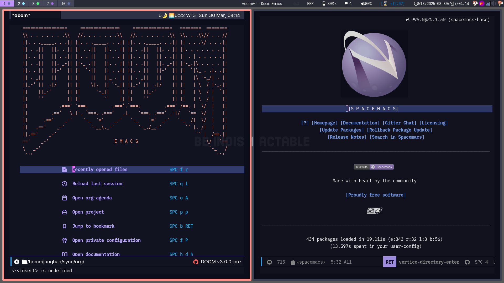

<!-- gid:20250324T000000 -->
<!-- provenance:source:start -->
[[TIP("원본·최신본")]]
이 페이지는 한국어 검색과 읽기를 위한 WikiDocs 미러입니다. [원본·최신본은 가든](https://notes.junghanacs.com/journal/20250324T000000/)에 있습니다. 최신 수정 내용·백링크·태그·히스토리·댓글·출처 정보는 원본 가든에서 확인하세요.

- 작성: `2025-03-24T00:00:00+09:00`
- 최근 수정: `2025-03-24T00:00:00+09:00 (lastmod 없음: date fallback)`
[[/TIP]]
<!-- provenance:source:end -->

[TOC]

## References

<style>.csl-entry{text-indent: -1.5em; margin-left: 1.5em;}</style>
- “그대들은 어떻게 살 것인가 \#애니메이션.” 2024. In <i>위키백과, 우리 모두의 백과사전</i>. [https://ko.wikipedia.org/w/index.php?title=그대들은_어떻게_살_것인가&#38;oldid=37829417](https://ko.wikipedia.org/w/index.php?title=그대들은_어떻게_살_것인가&oldid=37829417).
- Han, Jung. (2025) 2025. “Junghan0611/Dotemacs.” [https://github.com/junghan0611/dotemacs](https://github.com/junghan0611/dotemacs).
- Jason Walsh. 2025. “Jwalsh/Hy-Algorithms: Algorithms and Data Structures Implemented in Hy, a Lisp Dialect for Python.” [https://github.com/jwalsh/hy-algorithms/tree/main](https://github.com/jwalsh/hy-algorithms/tree/main).
- “Learn Anything.” n.d. Accessed September 12, 2024. [https://learn-anything.xyz/](https://learn-anything.xyz/).
- “Learn-Anything/Books: Awesome Books.” n.d. Accessed March 27, 2025. [https://github.com/learn-anything/books](https://github.com/learn-anything/books).
- “Learn-Anything/Learn-Anything.” (2016) 2024. Learn Anything. [https://github.com/learn-anything/learn-anything](https://github.com/learn-anything/learn-anything).
- MatthewZMD. 2025. “MatthewZMD/Aidermacs: Emacs AI Pair Programming Solution.” [https://github.com/MatthewZMD/aidermacs](https://github.com/MatthewZMD/aidermacs).
- neo. 2025. “Hacker News 유명도 기준 최고의 개인 블로그들.” GeekNews. March 26, 2025. [https://news.hada.io/topic?id=19972](https://news.hada.io/topic?id=19972).
- susam. 2025. “Indieweb은 대중화될 필요가 없다.” GeekNews. March 22, 2025. [https://news.hada.io/topic?id=19889](https://news.hada.io/topic?id=19889).
- Zeng, Matthew. (2025) 2025. “MatthewZMD/Emigo Spiritual Successor of Aidermacs.” [https://github.com/MatthewZMD/emigo](https://github.com/MatthewZMD/emigo).

## 2025-03-24 Mon

-   [디르크그로서 삶과사랑에빠진아이처럼 일상 신비주의자](https://wikidocs.net/381950)
-   [나오미배런 읽기 쓰기의 미래 - 언어학자](https://wikidocs.net/382316)
-   [맥스베넷 지능의 기원 - 우리의 뇌 그리고 AI를 만든 다섯 번의 혁신](https://wikidocs.net/382315)
-   (susam 2025)

### 03:16 깨다. 공이요 연탄재

### 06:51 기상

### 09:16 온생명이 등원

### 10:51 우체국 빠른등기 - 택배 의류 처리 : 아내

반값택배 불가. 5kg 이상이라.

### 13:01 온생명 픽업

### 14:00 아주대 청소년의학과 알레르기 -&gt; 롯데몰 영화관 -&gt; 부모님 댁 이동

### 18:14 칠보 식사 중

### 19:54 집도착 자자

### 21:02 완전 피곤 잔다

### 23:37 잠시 깼다 왜지?

## 2025-03-25 Tue

### 01:38 또 깼다

### 05:20 일어나라 반만년의 대한민국!

### 07:01 백치여!

### 07:33 아내 출근 직전 만담

### 08:57 온생명 기상

### 10:00 중앙도서관 체크인

### 12:01 아주 귀찮은 문제 해결 - 둠이맥스

[LLM: Warning (emacs): Org version mismatch.](https://wikidocs.net/381555) 실마리를 잡았는데, 건들지 말라는 것. 기본에서 건드니까 발생하는 문제라는 것

### 13:34 좋아. 책을 만나는 것 말이야.

### 14:24 프로그래머 창의성 관련 책들이 많다

### 14:28 배고프지만 쭉 달리기로

### 16:01 긴급 브레인워시

### 16:33 좋아 - 뭐가?

### 18:49 드디어 식사

## 2025-03-26 Wed

### 02:48 깨어나 독서 - 꿈

### 06:18 기상

### 08:52 온생명 - 등원 루틴 - 업데이트

### 10:30 중앙도서관 체크인

### 12:10 배고프다 영양 보급

### 13:33 [Lex Friedman 팟케스트(ThePrimeagen 인터뷰) - Emacs vs. NeoVIM (feat. ADHD)](https://wikidocs.net/381620)

### 14:12 [POSSE 블로깅 전략 - 디지털가든 - 인디웹 - 공유](https://wikidocs.net/381617)

이것을 잊지마라

### 15:25 브레인워시 긴급 -&gt; 완료

### 15:48 신기한 깃헙

### 17:02 [jira 프로젝트 관리 협업 - 이맥스](https://wikidocs.net/381623) 이것이 눈에 들어왔다

### 18:00 체크아웃 - 뚱이네뷔페 5500원 두 그릇 -&gt; 온생명 자전거 끌고 집으로

### 19:00 집에 와서 렉스 인터뷰 들으며 작업

### 19:43 온생명 할아버지 차 타고 오는 중

### 20:46 온생명이와 이 닦고 자자 - 오디오북 듣다가 잘 예정

### 22:33 아내 왔구나 거실로 이동 자자

## 2025-03-27 Thu

### 01:09 톨래 선생님

### 05:50 기상

### 07:06 비가 오는 구나

### 08:15 온생명이랑 스펀지밥 보는 중

### 09:29 중앙도서관 체크인

### 10:40 와 링크 폭탄이다

-   기술 블로그 모음
-   대규모 언어 모델 책

### 10:53 해커스뉴스 유명한 블로그 그리고

이들의 구독 시스템과 글 분류

#### Hacker News 유명도 기준 최고의 개인 블로그들

(neo 2025)

-   neo
-   Hacker News에서 인기 있는 개인 블로그를 순위별로 나열한 목록으로, 각 블로그의 저자, 주제 및 총 점수를 표시다양한 기술 및 비즈니스 주제를 다루며, 독립 저널리스트부터 기술 분석가에 이르기까지 다양한 배경의 저자들이 포함Hacker News 인기 개인 블로그 순위paulgraham.com총 점수: 96,443저자: Paul Graham소개: Y
-   2025

### 12:00 클로저 코틀린 - 자바가상머신 - 그리고 풀스택

[2025-03-27 Thu 10:55]

[LLM: JVM 자바가상머신 - 코틀린 클로저](https://wikidocs.net/381624) [코틀린](https://wikidocs.net/380812)과 클로저 자바 가상머신의 미래에 대한 생각

### 11:18 버그픽스 필요 - vertico childframe

[LLM: marginalia vertico-multiform - sort-modified - emacs](https://wikidocs.net/381626)

### 13:04 [defrecord - 클로저 하이랭 조직모드 이맥스 LLM](https://wikidocs.net/382328)

놀라운 조직이라.

### 13:29 링크 줍줍이의 하루 - 이걸 노트로 만들려다가?!

다들 어떻게 하는가? 궁금하네

### 14:53 배고프다 - 이후 일정을 잡아보자

### 15:19 나가자

### 16:18 뚱이네뷔페 5500원 식사 -&gt; 유치원 컴퓨터 봐줌

### 17:00 퍼스트축구클럽

### 18:29 집 도착

### 19:24 온생명이와 저녁 먹는 중

### 19:53 씻자 온생명아

### 21:16 온생명이와 오디오북 재우자

### 22:24 짦은 만남에서도 깊은 나눔

오늘 이 사람의 인생을 짧은 만남에서 나눴었다.

-   [이부영 칼융 분석심리학 자아 자기실현 무의식](https://wikidocs.net/382205)
-   [비욘나티코 내가틀릴수도있습니다 숲속 현자 인생수업 루게릭병](https://wikidocs.net/382166)

## 2025-03-28 Fri

-   [이맥스 팝업 레이아웃 창관리](https://wikidocs.net/381171)

### 02:13 갑자기 깨서 작업 중

### 05:56 일어날까? 그로킹하라

### 07:25 임백준님 책 다시 들으며 마인드업

### 08:20 코드베이스를 배우며 수정하는 방법 - grok API

파이썬?!

### 09:03 khoj RAG - 파이썬 베이스코드 분석

[khoj-ai: personal AI second brain](https://wikidocs.net/381528) 

### 11:12 선경도서관 체크인

### 그대들은 어떻게 살 것인가 #애니메이션

(“그대들은 어떻게 살 것인가 \#애니메이션” 2024)

-

-

-   《그대들은 어떻게 살 것인가》(일본어: 君たちはどう生きるか 기미타치와 도 이키루카[\*])는 2023년 일본의 애니메이션 영화이다. 미야자키 하야오가 감독을 맡고 스튜디오 지브리에서 제작하였다. 2013년 영화 《바람이 분다》 이후 미야자키 하야오 감독의 10년만의 복귀작이다. 요시노 겐자부로의 소설 《그대들, 어떻게 살 것인가》로부터 작품의 제목을 따 왔지만, 원작을 직접적으로 각색한 것은 아니며, 이 소설이 주인공에게 큰 의미를 가진다는 형식으로 연관짓고 있다. 장르 자체는 모험 판타지로 소개되고 있다. 제96회 아카데미상 장편 애니메이션상 수상작이다.
-   2024

### Learn Anything - 무엇이든 배울 수 있는 뭔가다

[2025-03-28 Fri 02:19] (“Learn Anything” n.d.)

2024-09-12 이때 찾은것인데 또 만나네

#### learn-anything/books: Awesome Books

(“Learn-Anything/Books: Awesome Books” n.d.)

-

-

-

-

#### learn-anything/learn-anything

(“Learn-Anything/Learn-Anything” [2016] 2024)

-

-

-   Organize world's knowledge, explore connections and curate learning paths
-   2024

### 11:45 일단 무식하게 한 권은 좀 보자 지루해도

### 13:10 리스프로 통일하는 것 - 전체 프로그래밍 언어

클로저 하이랭 하나로 하위 인프라는 동일하게 가능하다. 하이랭 하나만 테스트 잘 될 것이다.

### 13:31 속쓰리다 부글부글  [나오미배런 (1946-) 읽기 쓰기의 미래 - 언어학자](https://wikidocs.net/382316) 리딩

### 15:15 뚱이네 5500원 식사 - 집 왔다. 컨디션.

### 16:31 [aider 페어프로그래밍 이맥스](https://wikidocs.net/381524) 개선하는 방법

(MatthewZMD 2025) 이녀석 탑재

### 17:47 [Cursor - The AI Code Editor](https://wikidocs.net/382334) 알아야 넘는다.

### 17:54 헉 온생명이 픽업 나가자

### 19:06 다이소 갔다가 집 도착. 저녁 준비. 간단히 먹고 재우자.

### 20:32 이제 씻기자

### 21:25 커서 초기화 방법

vscode 가져오지 말고 그냥 스크래치에서 해

```shell
rm -Rf ~/.cursor
rm -Rf ~/.config/Cursor
```



### 21:38 코디움에서 만든 녀석이 윈드서프구나

### 21:52 아내 온생명 자는 듯 - 자고 일어나는 게 어떠냐

## 2025-03-29 Sat

### 01:21 확 깨서 컴퓨터 중

[피터스콧-모건 나는 사이보그가 되기로 했다 - 루게릭 - 로봇공학](https://wikidocs.net/382336)

### 02:02 디노트

Emacs: Denote query links (links that trigger a search)

### 02:08 따라가라 아이더맥스

### 06:31 기상 놀라운 수면

### 07:42 놀라운 책 줍줍

### 07:55 그가 책에게 책이란? 책을 읽는 방식 - 리딩리스트

무의식 완료 없음 끌리는 대로

### 08:02 디노트(Denote) 그리고 Prot

오. 프롯! 디노트에 무슨 새로운 기능을 선보이는 것인가?

디노트(Denote)는 이맥스의 노트관리패키지 이름이다. 영상에 나오는 프롯이 시작했다. 제텔카스텐과 유사한 노트 관리 체계이다. 이러한 노트 관리의 핵심은 연결이다. 마치 뇌의 신경망을 구현하는 것 같다. 연결에는 익숙한 위키타입의 바로가기(링크) 뿐만 아니라 흔적(태그, 용어, 인용 등)을 남기는 것도 있다. ‘무의식’에 문을 두드리기 위해서는 흔적을 남기는 게 더 중요한 것 같다.

아무튼, 이런. 아내와 아이가 일어났다. 글을 쓸 시간이 없다. 5분 안에 핵심을 남기겠다.

이맥스 세계에는 세상의 모든 노트테이킹 기법의 구현체가 있는듯하다. 그 중에서 디노트는 파일이름체계만으로 모든 연결을 이루어 낸다. 고로 어떤 데이터베이스도 필요가 없다. 놀랍도록 단순하다. 힣은 이맥스에서 이런 저런 노트 관리 방법을 거쳐서 여기에 정착했다.

하나 더. 인공지능을 필두로 엄청난 지식 시스템의 변화 속에서 너무 많은 정보가 혼재한다. 흔들릴 필요가 없다. 그 도구와 커뮤니티를 신뢰하면 그 안에서 하나의 시스템을 만들 수 있다.

프롯은 모든 것을 공개한다. 소명이자 운명인 것처럼 그냥 다 공개한다. 그는 실제로 철학자이기도 하다. 아. 아내가 왔다. 이 정도로 정리가 되나?

아. 하나 만 더. 스크린샷 설명해야지.

스크린샷1 : 무적철인람보트가 떠오른다. 힣이 사랑하는 타일창관리는 화장실 타일조각처럼 창을 관리한다. 마우스가 필요가 없다. 가운에 투명하게 오묘한 텍스트 창은 무엇인가? 힣의 도구다. 아침에는 타크초코 아니겠는가? 왜 가운데 홀로 떠(플로팅)되어 있는가? 이건 꺼내 쓰는 맥가이버 칼이 아닌가?

스크린샷2 : 프롯의 다른 영상 소개. 시간이 없다. 아이도 나왔다. 프롯의 이전 영상의 스샷을 담는다. 찾을 것도 없다. 프롯은 지중해. 그리스. 작은섬. 산골에 아틀라스라는 멍멍이랑 산다. 그는 삶이 곧 철학이며 (실제로 철학전공이다) 오픈소스, 이맥스는 그가 삶에 보내는 존경과 감사의 표현이다.

갈무리는 다음에. 그래서 힣은 무슨 말을 하고 싶은가?

삶의철학. 지의 철학이다. 알려줄 것은 없다. 말할 것도 없다. 그것은 각자 몫이다. 단 ‘도구’를 소개해주고 싶을 뿐이다. 손과 발이 춤추도록. 존재가 드러나도록. 온유한 마음에서 연민이 나오며 어쩌다 창조도 나오니 삶은 언제나 여여하다는 것.

이만 안녕. 아이와 스펀지밥을 보며 아침 준비.

<https://www.youtube.com/watch?v=zqzAFj50MhE>

Emacs: Denote query links (links that trigger a search)

#### 스크린샷



### 08:43 아내 기상 온생명 아침

### 09:49 cursor quartz 수정중

### Hugo tags and category

<https://www.perplexity.ai/search/hugo-eseo-tag-categoryga-dareu-bGEnxhEzQl2t8P_EvPmhOA>

#### 주요 차이점

1.  **범위와 특성**
    -   카테고리: 보다 넓은 주제나 분야를 나타냅니다. 웹사이트의 주요 섹션이나 "책의 장"과 같은 역할을 합니다[6].
    -   태그: 더 구체적이고 세부적인 주제나 키워드를 나타냅니다. 콘텐츠의 특정 측면을 설명하는 데 사용됩니다[6].
2.  **구조**
    -   카테고리: 일반적으로 계층적 구조를 가질 수 있습니다.
    -   태그: 주로 비계층적이며, 더 자유롭게 사용됩니다.
3.  **사용 방식**
    -   카테고리: 포스트당 하나 또는 소수의 카테고리만 할당하는 것이 일반적입니다.
    -   태그: 하나의 포스트에 여러 개의 태그를 자유롭게 할당할 수 있습니다[1].

#### 구현 측면

Hugo에서는 태그와 카테고리를 기술적으로 동일하게 취급합니다[4]. 둘 다 taxonomy로 구현되며, 콘텐츠 파일의 front matter에서 정의됩니다[2][5]. 예를 들어:

```yaml
---
title: "블로그 포스트"
categories: ["웹 개발"]
tags: ["Hugo", "정적 사이트", "블로그"]
---
```

#### 커스터마이징

태그와 카테고리에 대해 서로 다른 레이아웃을 적용하고 싶다면, 다음과 같이 별도의 템플릿 파일을 만들 수 있습니다[8]:

-   `/layouts/categories/terms.html`
-   `/layouts/tags/terms.html`

이렇게 하면 태그와 카테고리 페이지에 대해 서로 다른 디자인과 기능을 구현할 수 있습니다.

결론적으로, Hugo에서 태그와 카테고리의 주요 차이점은 그들의 사용 목적과 방식에 있으며, 기술적인 구현은 거의 동일합니다. 웹사이트의 구조와 콘텐츠 조직에 맞게 적절히 활용하는 것이 중요합니다.

Citations: [1] <https://hugo-in-action.foofun.cn/docs/part1/chapter4/4/> [2] <https://staticmania.com/blog/hugo-taxonomy> [3] <https://www.jessicahuynh.info/blog/2020/06/hugo-taxonomies/> [4] <https://smhk.net/note/2018/03/hugo-tag-and-category-pages/> [5] <https://www.jakewiesler.com/blog/hugo-taxonomies> [6] <https://stackoverflow.com/questions/70149736/hugo-difference-between-tags-and-categories> [7] <https://discourse.gohugo.io/t/adding-tags-and-categories-to-blog-post/27020> [8] <https://discourse.gohugo.io/t/different-layout-for-tag-and-category-pages/34699> [9] <https://discourse.gohugo.io/t/i-dont-want-tags-and-categories/12091> [10] <https://discourse.gohugo.io/t/listing-tags-in-posts-of-specific-category/22391> [11] <https://www.youtube.com/watch?v=pCPCQgqC8RA> [12] <https://discourse.gohugo.io/t/whats-the-concept-of-the-categories-taxonomy/6486> [13] <https://discourse.gohugo.io/t/how-to-add-tag-and-category/3202> [14] <https://ox-hugo.scripter.co/doc/tags-and-categories/> [15] <https://discourse.gohugo.io/t/using-content-type-to-categorise-list-of-posts/7950> [16] <https://gohugo.io/content-management/taxonomies/> [17] <https://discourse.gohugo.io/t/hugo-isnt-making-different-pages-for-categories-and-tags/23786> [18] <https://aioseo.com/the-difference-between-tags-and-categories/>

---

Perplexity로부터의 답변: pplx.ai/share

### 09:58 \*\* quartz 코드베이스에 taxonomy 분류로 category를 추가하려고해.

요청아이디: 8432adc5-15f0-4e6e-8895-69021c1baa1f

Ran tool Quartz 프로젝트에서 taxonomy 관련 파일을 찾아봅시다. 먼저 quartz 디렉토리 내부를 살펴보겠습니다.

Ran tool Quartz 프로젝트에서 taxonomy나 카테고리 관련 기능을 찾기 위해 더 깊이 살펴보겠습니다. 플러그인 디렉토리를 확인해보겠습니다.

Ran tool transformers 디렉토리를 살펴보겠습니다. 여기에 taxonomy나 카테고리 관련 기능이 있을 수 있습니다.

Ran tool `frontmatter.ts` 파일이 taxonomy 관련 기능을 다룰 가능성이 있습니다. 확인해보겠습니다.

Read file: quartz/plugins/transformers/frontmatter.ts 이제 프로젝트 구성 파일인 quartz.config.ts 파일을 확인해보겠습니다.

Read file: quartz.config.ts 이제 태그 관련 컴포넌트를 살펴봅시다. 태그와 카테고리는 유사한 기능을 수행하므로 이 부분을 확인하는 것이 도움이 될 것입니다.

Ran tool 태그 페이지 구현을 확인해보겠습니다.

Read file: /home/junghan/git/notes/quartz/plugins/emitters/tagPage.tsx 이제 TagContent 컴포넌트를 살펴봅시다.

Ran tool TagContent 컴포넌트 내용을 확인해보겠습니다.

Read file: /home/junghan/git/notes/quartz/components/pages/TagContent.tsx Quartz 프로젝트에 카테고리를 추가하기 위해 어떤 부분을 수정해야 하는지 파악했습니다. 태그와 유사한 방식으로 카테고리 기능을 구현할 수 있습니다. 아래와 같은 단계로 진행하겠습니다:

1.  frontmatter.ts에 카테고리 관련 코드 추가
2.  카테고리 페이지 컴포넌트 만들기 (TagPage와 유사하게)
3.  quartz.config.ts에 카테고리 페이지 플러그인 추가

먼저 frontmatter.ts를 수정하여 카테고리 필드를 추가하겠습니다:

```typescript:quartz/plugins/transformers/frontmatter.ts
// ... existing code ...
const tags = coerceToArray(coalesceAliases(data, ["tags", "tag"]))
if (tags) data.tags = [...new Set(tags.map((tag: string) => slugTag(tag)))]

const categories = coerceToArray(coalesceAliases(data, ["categories", "category"]))
if (categories) data.categories = [...new Set(categories.map((category: string) => slugTag(category)))]

const aliases = coerceToArray(coalesceAliases(data, ["aliases", "alias"]))
// ... existing code ...

// ... existing code ...
declare module "vfile" {
  interface DataMap {
    aliases: FullSlug[]
    frontmatter: { [key: string]: unknown } & {
      title: string
    } & Partial<{
        tags: string[]
        categories: string[]
        aliases: string[]
        modified: string
        created: string
        published: string
        description: string
        socialDescription: string
        publish: boolean | string
        draft: boolean | string
        lang: string
        enableToc: string
        cssclasses: string[]
        socialImage: string
        comments: boolean | string
      }>
  }
}
// ... existing code ...
```

이제 CategoryPage.tsx 파일을 만들겠습니다. TagPage.tsx를 복사하고 수정하여 카테고리 페이지를 만들겠습니다.

Read file: /home/junghan/git/notes/quartz/plugins/emitters/tagPage.tsx 이제 CategoryContent.tsx 파일을 만들겠습니다:

Read file: /home/junghan/git/notes/quartz/components/pages/TagContent.tsx 이제 CategoryContent.tsx 파일을 생성하겠습니다:

\`\`\`typescript jsx:/home/junghan/git/notes/quartz/components/pages/CategoryContent.tsx import { QuartzComponent, QuartzComponentConstructor, QuartzComponentProps } from "../types" import style from "../styles/listPage.scss" import { PageList, SortFn } from "../PageList" import { FullSlug, getAllSegmentPrefixes, resolveRelative, simplifySlug } from "../../util/path" import { QuartzPluginData } from "../../plugins/vfile" import { Root } from "hast" import { htmlToJsx } from "../../util/jsx" import { i18n } from "../../i18n" import { ComponentChildren } from "preact" import { concatenateResources } from "../../util/resources"

interface CategoryContentOptions { sort?: SortFn numPages: number }

const defaultOptions: CategoryContentOptions = { numPages: 10, }

export default ((opts?: Partial) =&gt; { const options: CategoryContentOptions = { ...defaultOptions, ...opts }

const CategoryContent: QuartzComponent = (props: QuartzComponentProps) =&gt; { const { tree, fileData, allFiles, cfg } = props const slug = fileData.slug

```text
if (!(slug?.startsWith("categories/") || slug === "categories")) {
  throw new Error(`Component "CategoryContent" tried to render a non-category page: ${slug}`)
}

const category = simplifySlug(slug.slice("categories/".length) as FullSlug)
const allPagesWithCategory = (category: string) =>
  allFiles.filter((file) =>
    (file.frontmatter?.categories ?? []).flatMap(getAllSegmentPrefixes).includes(category),
  )

const content = (
  (tree as Root).children.length === 0
    ? fileData.description
    : htmlToJsx(fileData.filePath!, tree)
) as ComponentChildren
const cssClasses: string[] = fileData.frontmatter?.cssclasses ?? []
const classes = cssClasses.join(" ")
if (category === "/") {
  const categories = [
    ...new Set(
      allFiles.flatMap((data) => data.frontmatter?.categories ?? []).flatMap(getAllSegmentPrefixes),
    ),
  ].sort((a, b) => a.localeCompare(b))
  const categoryItemMap: Map<string, QuartzPluginData[]> = new Map()
  for (const category of categories) {
    categoryItemMap.set(category, allPagesWithCategory(category))
  }
  return (
    <div class="popover-hint">
      <article class={classes}>
        <p>{content}</p>
      </article>
      <p>{i18n(cfg.locale).pages.tagContent.totalTags({ count: categories.length })}</p>
      <div>
        {categories.map((category) => {
          const pages = categoryItemMap.get(category)!
          const listProps = {
            ...props,
            allFiles: pages,
          }

          const contentPage = allFiles.filter((file) => file.slug === `categories/${category}`).at(0)

          const root = contentPage?.htmlAst
          const content =
            !root || root?.children.length === 0
              ? contentPage?.description
              : htmlToJsx(contentPage.filePath!, root)

          const categoryListingPage = `/categories/${category}` as FullSlug
          const href = resolveRelative(fileData.slug!, categoryListingPage)

          return (
            <div>
              <h2>
                <a class="internal category-link" href={href}>
                  {category}
                </a>
              </h2>
              {content && <p>{content}</p>}
              <div class="page-listing">
                <p>
                  {i18n(cfg.locale).pages.tagContent.itemsUnderTag({ count: pages.length })}
                  {pages.length > options.numPages && (
                    <>
                      {" "}
                      <span>
                        {i18n(cfg.locale).pages.tagContent.showingFirst({
                          count: options.numPages,
                        })}
                      </span>
                    </>
                  )}
                </p>
                <PageList limit={options.numPages} {...listProps} sort={options?.sort} />
              </div>
            </div>
          )
        })}
      </div>
    </div>
  )
} else {
  const pages = allPagesWithCategory(category)
  const listProps = {
    ...props,
    allFiles: pages,
  }

  return (
    <div class={classes}>
      <article class="popover-hint">{content}</article>
      <div class="page-listing">
        <p>{i18n(cfg.locale).pages.tagContent.itemsUnderTag({ count: pages.length })}</p>
        <div>
          <PageList {...listProps} sort={options?.sort} />
        </div>
      </div>
    </div>
  )
}
```

}

CategoryContent.css = concatenateResources(style, PageList.css) return CategoryContent }) satisfies QuartzComponentConstructor

````text
이제 categoryPage.tsx 파일을 생성하겠습니다:

```typescript jsx:/home/junghan/git/notes/quartz/plugins/emitters/categoryPage.tsx
import { QuartzEmitterPlugin } from "../types"
import { QuartzComponentProps } from "../../components/types"
import HeaderConstructor from "../../components/Header"
import BodyConstructor from "../../components/Body"
import { pageResources, renderPage } from "../../components/renderPage"
import { ProcessedContent, QuartzPluginData, defaultProcessedContent } from "../vfile"
import { FullPageLayout } from "../../cfg"
import { FullSlug, getAllSegmentPrefixes, joinSegments, pathToRoot } from "../../util/path"
import { defaultListPageLayout, sharedPageComponents } from "../../../quartz.layout"
import { CategoryContent } from "../../components"
import { write } from "./helpers"
import { i18n, TRANSLATIONS } from "../../i18n"
import { BuildCtx } from "../../util/ctx"
import { StaticResources } from "../../util/resources"

interface CategoryPageOptions extends FullPageLayout {
  sort?: (f1: QuartzPluginData, f2: QuartzPluginData) => number
}

function computeCategoryInfo(
  allFiles: QuartzPluginData[],
  content: ProcessedContent[],
  locale: keyof typeof TRANSLATIONS,
): [Set<string>, Record<string, ProcessedContent>] {
  const categories: Set<string> = new Set(
    allFiles.flatMap((data) => data.frontmatter?.categories ?? []).flatMap(getAllSegmentPrefixes),
  )

  // add base category
  categories.add("index")

  const categoryDescriptions: Record<string, ProcessedContent> = Object.fromEntries(
    [...categories].map((category) => {
      const title =
        category === "index"
          ? i18n(locale).pages.tagContent.tagIndex.replace("Tags", "Categories")
          : `${i18n(locale).pages.tagContent.tag.replace("Tag", "Category")}: ${category}`
      return [
        category,
        defaultProcessedContent({
          slug: joinSegments("categories", category) as FullSlug,
          frontmatter: { title, categories: [] },
        }),
      ]
    }),
  )

  // Update with actual content if available
  for (const [tree, file] of content) {
    const slug = file.data.slug!
    if (slug.startsWith("categories/")) {
      const category = slug.slice("categories/".length)
      if (categories.has(category)) {
        categoryDescriptions[category] = [tree, file]
        if (file.data.frontmatter?.title === category) {
          file.data.frontmatter.title = `${i18n(locale).pages.tagContent.tag.replace("Tag", "Category")}: ${category}`
        }
      }
    }
  }

  return [categories, categoryDescriptions]
}

async function processCategoryPage(
  ctx: BuildCtx,
  category: string,
  categoryContent: ProcessedContent,
  allFiles: QuartzPluginData[],
  opts: FullPageLayout,
  resources: StaticResources,
) {
  const slug = joinSegments("categories", category) as FullSlug
  const [tree, file] = categoryContent
  const cfg = ctx.cfg.configuration
  const externalResources = pageResources(pathToRoot(slug), resources)
  const componentData: QuartzComponentProps = {
    ctx,
    fileData: file.data,
    externalResources,
    cfg,
    children: [],
    tree,
    allFiles,
  }

  const content = renderPage(cfg, slug, componentData, opts, externalResources)
  return write({
    ctx,
    content,
    slug: file.data.slug!,
    ext: ".html",
  })
}

export const CategoryPage: QuartzEmitterPlugin<Partial<CategoryPageOptions>> = (userOpts) => {
  const opts: FullPageLayout = {
    ...sharedPageComponents,
    ...defaultListPageLayout,
    pageBody: CategoryContent({ sort: userOpts?.sort }),
    ...userOpts,
  }

  const { head: Head, header, beforeBody, pageBody, afterBody, left, right, footer: Footer } = opts
  const Header = HeaderConstructor()
  const Body = BodyConstructor()

  return {
    name: "CategoryPage",
    getQuartzComponents() {
      return [
        Head,
        Header,
        Body,
        ...header,
        ...beforeBody,
        pageBody,
        ...afterBody,
        ...left,
        ...right,
        Footer,
      ]
    },
    async *emit(ctx, content, resources) {
      const allFiles = content.map((c) => c[1].data)
      const cfg = ctx.cfg.configuration
      const [categories, categoryDescriptions] = computeCategoryInfo(allFiles, content, cfg.locale)

      for (const category of categories) {
        yield processCategoryPage(ctx, category, categoryDescriptions[category], allFiles, opts, resources)
      }
    },
    async *partialEmit(ctx, content, resources, changeEvents) {
      const allFiles = content.map((c) => c[1].data)
      const cfg = ctx.cfg.configuration

      // Find all categories that need to be updated based on changed files
      const affectedCategories: Set<string> = new Set()
      for (const changeEvent of changeEvents) {
        if (!changeEvent.file) continue
        const slug = changeEvent.file.data.slug!

        // If it's a category page itself that changed
        if (slug.startsWith("categories/")) {
          const category = slug.slice("categories/".length)
          affectedCategories.add(category)
        }

        // If a file with categories changed, we need to update those category pages
        const fileCategories = changeEvent.file.data.frontmatter?.categories ?? []
        fileCategories.flatMap(getAllSegmentPrefixes).forEach((category) => affectedCategories.add(category))

        // Always update the index category page if any file changes
        affectedCategories.add("index")
      }

      // If there are affected categories, rebuild their pages
      if (affectedCategories.size > 0) {
        // We still need to compute all categories because category pages show all categories
        const [_categories, categoryDescriptions] = computeCategoryInfo(allFiles, content, cfg.locale)

        for (const category of affectedCategories) {
          if (categoryDescriptions[category]) {
            yield processCategoryPage(ctx, category, categoryDescriptions[category], allFiles, opts, resources)
          }
        }
      }
    },
  }
}
````

components/index.ts 파일을 수정하여 CategoryContent를 추가해야 합니다:

Ran tool

Read file: /home/junghan/git/notes/quartz/components/index.ts 이제 CategoryContent를 components/index.ts에 추가합시다:

````typescript:/home/junghan/git/notes/quartz/components/index.ts
import Content from "./pages/Content"
import TagContent from "./pages/TagContent"
import CategoryContent from "./pages/CategoryContent"
import FolderContent from "./pages/FolderContent"
// ... existing code ...

export {
  ArticleTitle,
  Content,
  TagContent,
  CategoryContent,
  FolderContent,
  // ... existing code ...
}
````

마지막으로 quartz.config.ts 파일에 CategoryPage 플러그인을 추가해야 합니다:

````typescript:quartz.config.ts
// ... existing code ...
    emitters: [
      Plugin.AliasRedirects(),
      Plugin.ComponentResources(),
      Plugin.ContentPage(),
      Plugin.FolderPage(),
      Plugin.TagPage(),
      Plugin.CategoryPage(),
      Plugin.ContentIndex({
        enableSiteMap: true,
        enableRSS: true,
      }),
      // ... existing code ...
````

plugins/index.ts 파일에 CategoryPage를 추가해야 합니다:

Read file: /home/junghan/git/notes/quartz/plugins/index.ts 이제 plugins/emitters/index.ts 파일을 확인하고 CategoryPage를 추가해야 합니다:

Read file: /home/junghan/git/notes/quartz/plugins/emitters/index.ts CategoryPage를 plugins/emitters/index.ts에 추가합니다:

````typescript:/home/junghan/git/notes/quartz/plugins/emitters/index.ts
export { ContentPage } from "./contentPage"
export { TagPage } from "./tagPage"
export { CategoryPage } from "./categoryPage"
export { FolderPage } from "./folderPage"
// ... existing code ...
````

quartz.config.ts의 generateSocialImages 에러를 해결합니다:

Ran tool

Read file: /home/junghan/git/notes/quartz/cfg.ts GlobalConfiguration에 generateSocialImages 필드가 없습니다. 해당 부분을 수정해야 합니다:

````typescript:quartz.config.ts
// ... existing code ...
    ignorePatterns: ["private", "temp", "templates", ".obsidian"],
    defaultDateType: "created",
    // 주석 처리하여 삭제하지 않고 에러를 해결합니다
    // generateSocialImages: false,
    theme: {
      // ... existing code ...
````

훌륭합니다! 이제 모든 필요한 파일을 생성하고 수정했습니다. 마지막으로 정리해 보겠습니다:

1.  frontmatter.ts에 categories 필드를 추가했습니다.
2.  CategoryContent.tsx 컴포넌트를 생성했습니다.
3.  CategoryPage.tsx emitter를 생성했습니다.
4.  components/index.ts 파일에 CategoryContent를 등록했습니다.
5.  plugins/emitters/index.ts 파일에 CategoryPage를 등록했습니다.
6.  quartz.config.ts 파일에 CategoryPage 플러그인을 추가했습니다.

이제 마크다운 파일의 frontmatter에 다음과 같이 카테고리를 추가할 수 있습니다:

````markdown
---
title: 문서 제목
categories: [카테고리1, 카테고리2]
---

문서 내용...
````

또한 categories 디렉토리를 생성하여 개별 카테고리에 대한 설명 페이지를 추가할 수도 있습니다:

````sh
mkdir -p content/categories
````

### 10:20 아내 등장

### 11:10 동네 빽다방 체크인 3시간 딥워크

아이더맥스로 가자.

### 13:51 집에가자 - RAG 실패 - hy 이상해

### 15:00 온생명 타이거 영어까페 - 자전거 타고 데리고 옴 3시간 딥워크

### 17:23 conda 쓸거야.

[파이썬: 활용법: 미니콘다::콘다에서 필요한 패키지 설치](https://wikidocs.net/381253) 설치해줘

### 17:31 pip install hy 편하게

````text
➜ pip3 install --user hy
Collecting hy
  Using cached hy-1.0.0-py3-none-any.whl
Collecting funcparserlib~=1.0 (from hy)
  Using cached funcparserlib-1.0.1-py2.py3-none-any.whl.metadata (7.1 kB)
Using cached funcparserlib-1.0.1-py2.py3-none-any.whl (17 kB)
Installing collected packages: funcparserlib, hy
Successfully installed funcparserlib-1.0.1 hy-1.0.0
(base) ~ via  v20.14.0 via 🐍 v3.12.9 on ☁️  gtgkjh@gmail.com
➜ whereis pip3
pip3: /usr/bin/pip3 /home/junghan/miniconda3/bin/pip3 /home/junghan/.local/bin/pip3 /usr/share/man/man1/pip3.1.gz
(base) ~ via  v20.14.0 via 🐍 v3.12.9 on ☁️  gtgkjh@gmail.com

````

#### conda install hy 안된다.

````text
➜ conda install hy
Retrieving notices: done
Channels:
 - conda-forge
 - defaults
Platform: linux-64
Collecting package metadata (repodata.json): done
Solving environment: failed

LibMambaUnsatisfiableError: Encountered problems while solving:
  - package hy-0.19.0-py38h32f6830_0 requires python >=3.8,<3.9.0a0, but none of the providers can be installed

Could not solve for environment specs
The following packages are incompatible
├─ hy =* * is installable with the potential options
│  ├─ hy 0.12.1 would require
│  │  └─ python =2.7 *, which can be installed;
│  ├─ hy 0.12.1 would require
│  │  └─ python =3.5 *, which can be installed;
│  ├─ hy 0.12.1 would require
│  │  └─ python =3.6 *, which can be installed;
│  ├─ hy [0.18.0|0.19.0|0.20.0] would require
│  │  └─ python >=3.6,<3.7.0a0 *, which can be installed;
│  ├─ hy [0.18.0|0.19.0|0.20.0] would require
│  │  └─ python >=3.7,<3.8.0a0 *, which can be installed;
│  ├─ hy [0.19.0|0.20.0] would require
│  │  └─ python >=3.8,<3.9.0a0 *, which can be installed;
│  └─ hy [0.19.0|0.20.0] would require
│     └─ python >=3.9,<3.10.0a0 *, which can be installed;
└─ pin on python 3.12.* =* * is not installable because it requires
   └─ python =3.12 *, which conflicts with any installable versions previously reported.

Pins seem to be involved in the conflict. Currently pinned specs:
 - python=3.12

````

[LLM: hyrule 설치 하이랭 플러그인](https://wikidocs.net/381638) 아무튼 설치해서 했다.

### 17:39 온생명이 픽업 -&gt; 자전거 태워서 함께 걸어 집으로

### 19:12 집에서 아내 온생명이와 저녁 식사

### 21:16 평화로운 저녁 마무리 -&gt; 영어글도 올리자. 번거롭지 않은 수준에서

### 21:31 py2hy - 이거 확인해라

[LLM: 파이썬 모듈 설치 전역 활용법](https://wikidocs.net/381639) 이걸 준비했다.

````python
print("Hello, World!")
````

이렇게 된다.

````text
~/git/clone/py2hy master ?1 via 🐍 v3.12.9 on ☁️  gtgkjh@gmail.com
➜ python -m py2hy hello.py
(print "Hello, World!")
~/git/clone/py2hy master ?1 via 🐍 v3.12.9 on ☁️  gtgkjh@gmail.com
````

### 21:43 잔다. 정말. 쫀쫀하게 하루 보냈다.

## 2025-03-30 Sun

### 03:15 굳모닝? 어허. 이른가 - 칸미고? 이미고?

### 03:26 스테이튠 이거 글감이다 이미고

(Zeng [2025] 2025) 역시 대단하구만

-   <https://github.com/MatthewZMD/aidermacs/discussions/98>

#### jwalsh/hy-algorithms: Algorithms and data structures implemented in Hy, a Lisp dialect for Python

(Jason Walsh 2025)

이게 뭐야!!

### 04:56 열이 올라온다

### 05:19 잠시 쉬자

### junghan0611/dotemacs - README

(Han [2025] 2025)

-

-   Han, Jung
-   dotemacs - doomemacs / spacemacs
-   2025



### 08:46 API 재발급

### 10:36 아침 식사

### 10:55 온생명

### 11:43 온생명이 아내 쇼핑 - 이천 롯데아울렛

### 18:24 집 도착

### 21:49 아 고된하루. 자자. 근데 1주일 정리하려면 엄청 할게 많을듯
