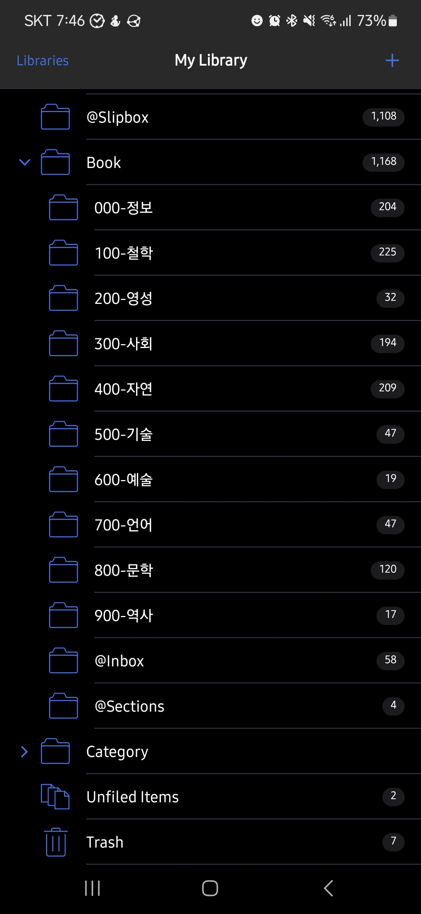
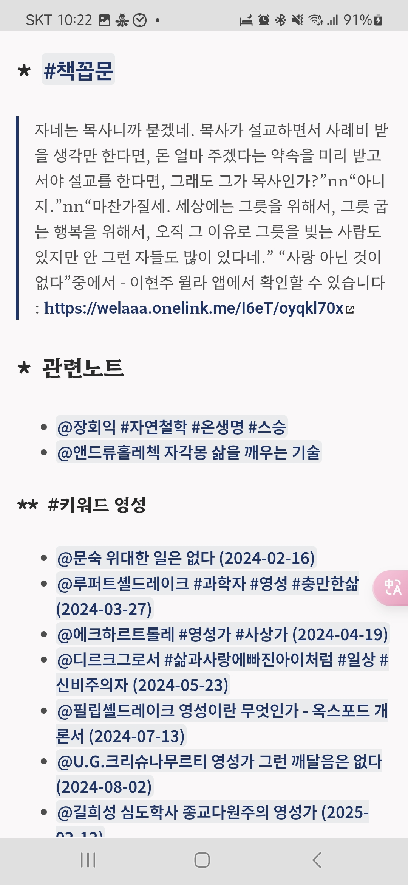

<!-- gid:20250331T000000 -->
[TOC]

## References

<style>.csl-entry{text-indent: -1.5em; margin-left: 1.5em;}</style>
- 마이클 싱어. 2014. <i>상처받지 않는 영혼: 내면의 자유를 위한 놓아보내기 연습</i>. Translated by 이균형. 서울: 라이팅하우스. [https://www.yes24.com/Product/Goods/12981014](https://www.yes24.com/Product/Goods/12981014).
- 조지 오웰. 2010. <i>나는 왜 쓰는가 - 에세이</i>. Translated by 이한중. 한겨레출판. [https://m.yes24.com/goods/detail/4212338](https://m.yes24.com/goods/detail/4212338).
- ———. 2012. <i>파리와 런던 거리의 성자들</i>. Translated by 자운영. [https://m.yes24.com/goods/detail/7253625](https://m.yes24.com/goods/detail/7253625).
- ———. 2020. <i>1984</i>. Translated by 이정서. [https://www.yes24.com/Product/Goods/94489066](https://www.yes24.com/Product/Goods/94489066).
- 마사 누스바움. 2020. <i>타인에 대한 연민 : 혐오의 시대를 우아하게 건너는 방법</i>. Translated by 임현경. RHK. [https://m.yes24.com/goods/detail/92453192](https://m.yes24.com/goods/detail/92453192).
- “사락 독서모임 텍스트힙스터.” n.d. Accessed April 6, 2025. [https://sarak.yes24.com/book-club/arLDLp5b0nJDFh70](https://sarak.yes24.com/book-club/arLDLp5b0nJDFh70).
- benma. (2013) 2025. “Benma/Visual-Regexp-Steroids.El.” [https://github.com/benma/visual-regexp-steroids.el](https://github.com/benma/visual-regexp-steroids.el).
- Heyns, Emiliano. (2018) 2025. “Retorquere/Zotero-Deb 조테로 설치 우분투.” [https://github.com/retorquere/zotero-deb](https://github.com/retorquere/zotero-deb).
- “Zotero Packages for Ubuntu Debian-based Systems - 조테로 설치 패키지.” n.d. Accessed April 4, 2025. [https://zotero.retorque.re/file/apt-package-archive/index.html](https://zotero.retorque.re/file/apt-package-archive/index.html).

## 2025-03-31 Mon

### 03:00 기상 - 깨끗한 위건부두에 산다

[조지오웰 카탈로니아찬가 르포문학](https://wikidocs.net/382168)

모든 노트에 휴고카테고리와 휴고시리즈를 만들라

[펠리너헤르만스 프로그래머의 뇌 - 프로그래머가 알아야 할 인지과학의 모든 것](https://wikidocs.net/382320)

### 06:29 그렇게 간다. 새로운 이야기를 만나

### 07:12 아내 기상 - `나다아민`

[나다아민 NadaAmin 메타프로그래밍 인공지능 프로그래밍언어](https://wikidocs.net/382341)

### 09:10 중앙도서관 체크인

### 09:24 디레드 파일 검색 멋지게 하는 방법

까먹었다. 그러니까 디레드로 범위를 좁혀가면서 검색

[이맥스: 디레드 파일 병합](https://wikidocs.net/381241)

이렇게 편집을?

-   [일괄편집: 검색 여러개 파일들을 한 번에 변경하는 방법 (2023-07-10)](https://wikidocs.net/381084)
-   [일괄편집 rg-menu 텍스트 파일 검색 변경 (2023-09-07)](https://wikidocs.net/381119)
-   [정규표현식: 텍스트 검색 변경 - 이블 (2024-09-15)](https://wikidocs.net/381311)
-   [LLM: 이맥스 캐주얼 프로젝타일 검색 (2024-12-22)](https://wikidocs.net/381462)
-   [LLM: 이맥스 퍼지 검색 affe fzf (2024-12-26)](https://wikidocs.net/381475)
-   [LLM: xref 정의 참조 검색 이맥스 (2025-01-24)](https://wikidocs.net/381492)

### 11:05 뚱이네뷔페 5500원 -&gt; 집

### 14:26 복통 - 쓰러져 1984 (조지 오웰 2020)

### 14:37 태그 카테고리 이슈 - 단계 - 시그니처

-   plugin/transformer

[규칙: 태그 카테고리](https://wikidocs.net/381143)

### 태그 구조

### 19:07 복통 - 쉬고 싶다

### 21:09 온생명이 재우고 아내 오고 이제 자자

## 2025-04-01 Tue

-   [ ] 태그 카테고리
-   [ ] 시그니처 단계 노트
-   [ ] 카테고리 추가 모든 파일

### 07:08 회복

### 08:49 온생명 등원

### 12:41 내보내자

### 12:55 너드 [외르크치틀라우 너드 뇌과학](https://wikidocs.net/382343)

### 15:11 리스프로 모든 언어를 통합하는 길

### 16:00 브레인워시 - (조지 오웰 2010)

### 17:53 온생명이 데리러 가자 저녁 먹이고!

### 19:08 식사하자

### 20:30 1984 3부 - 온생명이 저녁 식사하며

### 21:49 자자

## 2025-04-02 Wed

### 03:57 두통 깨다 그냥 더 자

### 07:18 기상

### 07:57 온생명이와 아침

### 08:58 등원 후 거실 체크인

[모리스헐리히 멀티프로세서 프로그래밍](https://wikidocs.net/382345)

### 15:00 휴식 - 멍하니 독서

6시간만에 일어난다. 뭐라? 뭐했노? 몰러. 조테로에 뭐 넣고 노트 끄적였는데? 봐봐. 코드도 뭐 하고.

조지오웰에 푹 빠졌다. 위건 부두 1장을 아내에게 꼭 읽으라고 하고 싶다. 으악. 어디서 오디오북을 줍줍하지? 찾다보면 못들을 책은 없다. (조지 오웰 2012) 이 책을 듣는다. 이건 구하지 어렵더라.

### 16:00 계속 가자. 갈 길 멀다. 사실. 그렇다.

### 19:18 온생명 귀가 중 - 마중가자

### 21:31 조지오웰 (조지 오웰 2012) 와. 이건 뭐. 아름답다.

### 22:29 라면 끓여 먹음 - 아내 귀가

## 2025-04-03 Thu

### 04:30 무인까페 체크인

그냥 오웰이다. 오웰의 처절한 이야기를 듣는중. 하하.

### 05:34 이제 딥워크 모드 활성화 되었구나

### 06:35 집 다시 옴 온생명 기상

### 08:29 온생명 등원 가자 허헉!

### 09:17 일단 업데이트 하고 미팅 준비하자

### 15:00 기술 면접 끝

### 16:28 온생명이 데리러 가자

### 17:51 미스터사탄과 발자크 그리고 조지 Oh Well!

미스터사탄 아 이 위대한 또라이여! 사탄을 생각하면

우리 또 위대한 발자크 선생님을 떠올리지 않을 수 없다.

수도복은 그의 유니폼이 아니던가.

사실 힣도 유니폼을 입고 있다. 놀랍게도 수도복과 유사하다.

거의 맨날 같은 옷만 입고 있다. 힣은 참고로 상당히 청결하다.

청결의 기준을 생각해 보자. 조지 오웰의 위건 부두로 가는 길을 한번 읽고 힣을 바라보자면 그렇다는 말이다(?)

아. Oh Well!

그의 책들에서는 아주 지독한 냄새가 난다. 사람 냄새 말이다.

발자크 냄새도 난다. 아름답다.

[junghan 정한 모음](https://wikidocs.net/381069)

### 21:17 온생명이와 목욕 끝 이제 자자

### 21:21 인텔리제이 코틀린

### 23:44 ./ ㄹㄴ

## 2025-04-04 Fri

### 02:06 자다가 깻어.

### 05:27 기상 - 상처받지 않는 영혼을 들으며

(마이클 싱어 2014)

### 05:31 코틀린 투어


### 05:42 이맥스 [온보드 투어](https://wikidocs.net/380828)

### 07:25 온생명이 아침 - 스폰지밥

[스티븐힐런버그 스폰지밥 애니메이션 해양학자 루게릭병](https://wikidocs.net/382350)

### 랜덤노트

[셀프트레킹 메멕스 Quantified-self](https://wikidocs.net/381116)

### 14:53 인텔리제이

### 18:00 결과 메일이 안온다. 금요일인데 와주었으면 좋으련만

### 19:14 온생명 저녁식사

## 2025-04-05 Sat

### 04:25 기상 - tool for thoughts 외치다.

일어나면서 터져나온 말.

### 05:22 조용한 행복 - 독서

-   [이현주 구도자 영성가 (1944)](https://wikidocs.net/382311)
-   [엘링카게 남극 탐험가 산책 침묵 조용한 행복](https://wikidocs.net/382051)
-   [에이브러햄플렉스너 쓸모없는 지식의 쓸모 - 세상을 바꾼 과학자들의 순수학문 예찬](https://wikidocs.net/382354)

### 07:49 놀라운 삶 - [조테로](https://wikidocs.net/380563) 다시 제대로 설치

[조테로 버전7 제대로 설치](https://wikidocs.net/381667)

우분투 패키지로 정식버전 설치한 줄 알았는데... 베타버전을 쓰고 있었다.

> 이에 대한 링크 준비됬지? <br /> 네네 선생님<br />

다음과 같다. 이렇게 쓰라.

(“Zotero Packages for Ubuntu Debian-based Systems - 조테로 설치 패키지” n.d.)

(Heyns [2018] 2025) Heyns, Emiliano 2025

Packaged versions of Zotero and Juris-M for Debian-based systems

### 08:47 정리하고 칠보로 가자

### 15:00 타이거

### 15:22 온생명 타이거 체크인 -&gt; 스타벅스

### 16:35 책 정리 중

### 17:27 마무리 하자 데리러 가야한다 [JetBrains IntelliJ 인텔리제이 개발도구](https://wikidocs.net/382359)

### 17:38 자각몽 - 무의식 - 칼융 - 창조 - 영감 창의

[앤드류홀레첵 자각몽 삶을 깨우는 기술](https://wikidocs.net/382358)

### 19:30 가족 - 이마트 쇼핑 및 저녁 식사

### 21:26 집 도착

### 21:57 자자

### [조테로 공유클](https://wikidocs.net/381668)럽 - 공유라이브러리 활용하는 방법]]

[2025-04-04 Fri 15:03] <https://www.zotero.org/groups>

그룹 가입 및 서지 추가 코멘트 작성 내보내기 하여 본인의 에디터에 추가하는 방법

## 2025-04-06 Sun

### 02:50 기상

### 04:02 평범하여 아름답다 온전한 삶

[마리나반주일렌 평범하여 찬란한 삶을 향한 찬사 - 완벽하지 않아 완전한 온전한 삶에 대하여](https://wikidocs.net/382360)

### 04:23 visual regex

#### benma/visual-regexp-steroids.el

(benma [2013] 2025)

benma Extends visual-regexp to support other regexp engines 2025

### 06:52 삶이 어찌 아름답지 않는가 고통에서 오는 것 마저도

### 07:28 먼저 관련 메타노트에 넣고 나서 거기서 옮기는 것?

### 07:31 [책을 조테로에 담는 이유?! 제목 저자 요약](https://wikidocs.net/381665)

특히 제목

제목에 나오는 단어들이 주는 그림 말이다. 연민? 그래 글에는 썼지만 딱 노트는 없다. 연민 어디서 이야기를 하더라 책? 그래 그 책 한번 보자 제목

오 그래. 연민. 비폭력 대화도 연민으로 담았다만

(마사 누스바움 2020)

### 조테로 사이타 첨부파일 연결

### 08:41 [사락 독서 모임 개설](https://wikidocs.net/381666)

[독서 사락 굳리드 스토리그래프 리딩리스트 커뮤니티](https://wikidocs.net/382301)

(“사락 독서모임 텍스트힙스터” n.d.)

[Jung Han on Substack: "사락 독서모임 개설 연습. 천원 할인 받으려다 개설. 지식의 시대에서 앎의 시대로.-](https://substack.com/@junghanacs/note/c-106345434)

사락 독서모임 개설 연습. 천원 할인 받으려다 개설.

지식의 시대에서 앎의 시대로. 책과 살기. 텍스트힙스터 라이프. 독서에 목표는 없다. 완독도 없다. 설명도 필요 없다. 그건 AI한테 물어보라. 삶에 책이 뭍어나는 것. 여전히 무식함 알아차리면서 은은히 가득찬 것. 가끔은 앎이 지혜로 터져나올 때가 있을지도. 아닐지도. 여여하게 사는 것. 아무도 찾지 않는 독서 모임으로 남는 것.

그저 널뛰기하듯 책과 만난다. 그리고 읽은 바를 남긴다. 흔적은 또 다른 책을 부른다. 그렇게 책으로 사는 것.

디지털 가드너가 되어가는 것.



### 11:04 엣지브라우저 문제 발생 - 크롬 웨이렌드 입력기 GTK IM 모듈

```text
.desktop
zettlr.desktop
zotero.desktop
zulip.desktop
(base) /usr/share/applications🔒 on ☁️  gtgkjh@gmail.com
➜ vi org.kde.kdeconnect.sms.desktop
(base) /usr/share/applications🔒 on ☁️  gtgkjh@gmail.com
➜ vi microsoft-edge.desktop
(base) /usr/share/applications🔒 on ☁️  gtgkjh@gmail.com
➜ microsoft-edge-stable

(msedge:651506): Gtk-WARNING **: 11:02:09.414: No IM module matching GTK_IM_MODULE=kime found
(base) /usr/share/applications🔒 on ☁️  gtgkjh@gmail.com

➜ gio-querymodules /usr/lib/x86_64-linux-gnu/gtk-4.0/4.0.0/immodules/
sudo /usr/lib/x86_64-linux-gnu/libgtk-3-0t64/gtk-query-immodules-3.0 --update-cache
```

### 13:46 율전 부모님 댁에서

### 14:18 visual-regexp - 아니야?! 정규식

#### benma/visual-regexp-steroids.el

(benma [2013] 2025)

benma Extends visual-regexp to support other regexp engines 2025

### 15:41 칼리브레 업데이트 버전8 - [전자책: calibre 도서관리도구](https://wikidocs.net/381357)

### 16:16 저녁 준비 모드

### 18:19 김정한 멋지다 긱스

### 20:00 집

### 22:00 [숙면을 위한 책. 저자. 이현주 구도자 영성가 1944](https://wikidocs.net/381663)~

잘거야. 거친하루. 로베르트 발저의 책을 들으며 집 뒷정리하고 방바닥에 누웠다. 후후. 발저 책은 산책할 때 좋아.

자려고 누워서 듣기에 좋은 책은 참 많아. 힣은 요즘에 이현주 할아버지 책 듣는데 오호 아주 놀라워. 사물과 대화, 자기와 대화, 꿈속 대화, 님과 대화 등 다 대화다.

아. 놀랍다. 다 같은 이야기다. 근데 다 같은 이야기. 하나 오직 하나 일체유심조. 따오 tao 아니겠는가. 따봉이다.

아 자야되는데. 연탄제 뭐시기 안도현 시인의 시 유명한거 말이다. 연탄재 발로 차지마라 뭐라뭐라. 좋은 시다. 여기에 이현주 할아버지는 연탄재에게 인터뷰를 직접하신다. 아무렴. 대락 이런 느낌인데 워딩은 다를텐데 멋대로 힣이 지껄이자면…

여기에 대해 연탄재는 말한다. 의미 붙이지마러. 내가 뭘? 난 누굴 위해 타지 않아. 탐이 곧 나일 뿐이야. 어디 갈 곳도 따라할 것도 없어. 너대로 온전해.

아. 느낌 안나. 우리 할배 대화 다시 들음시 자야겠다. 이게 자면서 훌러덩 듣다보니 없는 이야길지도 몰러. 그냥 할배맘이 힣에게 물들어지는 것 뿐이여.

끝으로 하나 복붙한거 있는데. 이거보면 오 스승님은 달라. 자기 삶 소명 받드는 어찌 구할 머니가 들어갈수 있겠나. 이건 누차 어쏠로지에서도 떠든 주제여.

[[TIP("인용")]]
자네는 목사니까 묻겠네. 목사가 설교하면서 사례비 받을 생각만 한다면, 돈 얼마 주겠다는 약속을 미리 받고서야 설교를 한다면, 그래도 그가 목사인가?”nn“아니지.”nn“마찬가질세. 세상에는 그릇을 위해서, 그릇 굽는 행복을 위해서, 오직 그 이유로 그릇을 빚는 사람도 있지만 안 그런 자들도 많이 있다네.” “사랑 아닌 것이 없다”중에서 - 이현주 ― 저자명, 『책』
[[/TIP]]

이현주 할아버지 저서들 모음

나 자신이 되는일에 돈을 받다니 말이 되는가?

아하. 자각몽 책 번역하신것도 흥미로워. 아. 이런 주제는 아직 힣은 잘 몰러. 공부해야될 것 같아서. 공부하기 싫거든. 아무튼 흥미로워.

[이현주 구도자 영성가 (1944)](https://wikidocs.net/382311) [삶 일 소명 운명애 월급 - 나 자신이 된 일에 보수를 받다니](https://wikidocs.net/381589) [앤드류홀레첵 자각몽 삶을 깨우는 기술](https://wikidocs.net/382358)

[[TIP("인용")]]
느 시인이, 연탄재 함부로 밟지 말라고,

너는 언제 남을 위해서 온몸을 불태워 본 적 있느냐고,

그랬다기에

하루는 연탄재한테 물어보았지.

남을 위해서 온몸을 불태운 소감이 어떻더냐고.

연탄재가 말하더군.

남을 위해서?

그게 무슨 말이지?

우리들 자연自然에는 ‘남’이 없거니와

‘위해서’는 더욱 없는 물건이라네.

-   이현주, 『공(空)』
[[/TIP]]

#### 스크린샷




