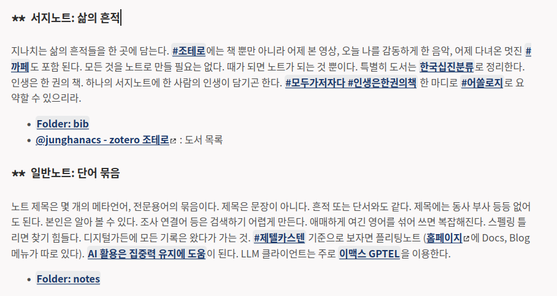
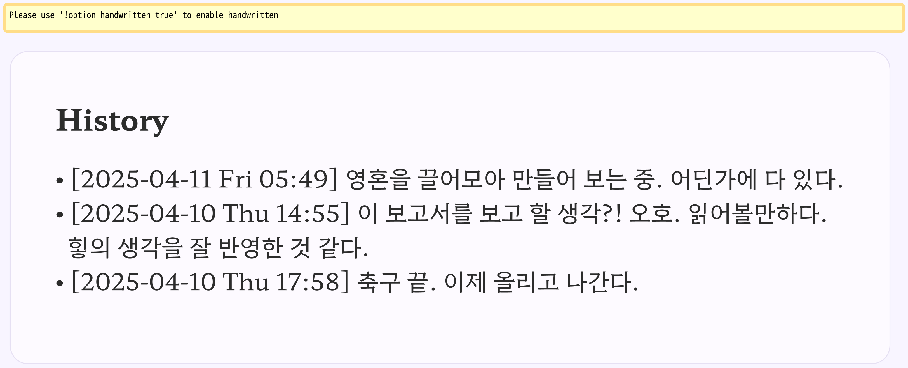

<!-- gid:20250407T000000 -->
[TOC]

## References

<style>.csl-entry{text-indent: -1.5em; margin-left: 1.5em;}</style>
  이기상. 2004. <i>이 땅에서 우리말로 철학하기 - 살림지식총서</i>. 살림. [https://www.yes24.com/product/goods/392605](https://www.yes24.com/product/goods/392605).
  류영모. 2025. <i>다석일지</i>. Translated by 정양모. [https://m.yes24.com/goods/detail/143642860](https://m.yes24.com/goods/detail/143642860).
  페르난두 페소아. 2014. <i>불안의 서</i>. Translated by 배수아. 봄날의책. [https://m.yes24.com/goods/detail/12591797](https://m.yes24.com/goods/detail/12591797).
  케빈 켈리. 2010. <i>기술의 충격: 테크놀로지와 함께 진화하는 우리의 미래</i>. Penguin Books. [https://www.yes24.com/Product/Goods/5200412](https://www.yes24.com/Product/Goods/5200412).
  “디지털 가든과 지식 관리의 혁신: 김정한의 접근법 분석.” n.d. Perplexity AI. Accessed April 10, 2025. [https://www.perplexity.ai/page/dijiteol-gadeungwa-jisig-gwanr-phEyrzfrRM2M8NQpqDIRxA](https://www.perplexity.ai/page/dijiteol-gadeungwa-jisig-gwanr-phEyrzfrRM2M8NQpqDIRxA).
  우리사상연구소, and 이기상. 2007. <i>우리말 철학사전 1 과학 인간 존재</i>. 지식산업사. [https://www.yes24.com/product/goods/210137](https://www.yes24.com/product/goods/210137).
  “Chromium Ozone/Wayland: The Last Mile Stretch.” 2025. nickdiego.dev. February 19, 2025. [http://nickdiego.dev/blog/chromium-ozone-wayland-the-last-mile-stretch/](http://nickdiego.dev/blog/chromium-ozone-wayland-the-last-mile-stretch/).
  이기상, ed. 2018. <i>이기상의 문화철학 - 다석의 생명사상 (9-1) - Youtube</i>. Directed by 이기상. [https://www.youtube.com/watch?v=xmtJC3VTJmU&#38;pp=ygUQ7J206riw7IOBIOuLpOyEnQ%3D%3D](https://www.youtube.com/watch?v=xmtJC3VTJmU&pp=ygUQ7J206riw7IOBIOuLpOyEnQ%3D%3D).
  Han, Jung. (2025) 2025. “Junghan0611/Emacs-Lisp-Elements.” [https://github.com/junghan0611/emacs-lisp-elements](https://github.com/junghan0611/emacs-lisp-elements).
  Hyatt, Andrew. (2025) 2025. “Ahyatt/Semext.” [https://github.com/ahyatt/semext](https://github.com/ahyatt/semext).
  Lee, Hao-Ping (Hank), Advait Sarkar, Lev Tankelevitch, Ian Drosos, Sean Rintel, Richard Banks, and Nicholas Wilson. 2025. “The Impact of Generative Ai on Critical Thinking: Self-Reported Reductions in Cognitive Effort and Confidence Effects from a Survey of Knowledge Workers.” [https://www.microsoft.com/en-us/research/publication/the-impact-of-generative-ai-on-critical-thinking-self-reported-reductions-in-cognitive-effort-and-confidence-effects-from-a-survey-of-knowledge-workers/](https://www.microsoft.com/en-us/research/publication/the-impact-of-generative-ai-on-critical-thinking-self-reported-reductions-in-cognitive-effort-and-confidence-effects-from-a-survey-of-knowledge-workers/).
  Martin Stemplinger. 2025. “Native Graphical Emacs on Android.” January 5, 2025. [https://mstempl.netlify.app/post/emacs-on-android/](https://mstempl.netlify.app/post/emacs-on-android/).
  Stavrou, Protesilaos. 2025. “Emacs Lisp Elements.” Protesilaos Stavrou. April 13, 2025. [https://protesilaos.com/emacs/emacs-lisp-elements](https://protesilaos.com/emacs/emacs-lisp-elements).
  ———. (2025) 2025. “Protesilaos/Emacs-Lisp-Elements.” [https://github.com/protesilaos/emacs-lisp-elements](https://github.com/protesilaos/emacs-lisp-elements).
  Tveito, Lars. (2015) 2025. “Larstvei/Focus Dim the Font Color of Text in Surrounding Paragraphs Emacs.” [https://github.com/larstvei/Focus](https://github.com/larstvei/Focus).
  “Vibe Coding Doesn’t Jibe - C’est La Z.” n.d. Accessed April 10, 2025. [https://cestlaz.zamansky.net/posts/vibe-coding/](https://cestlaz.zamansky.net/posts/vibe-coding/).
  xguru. 2025. “생성형 Ai가 비판적 사고에 미치는 영향.” GeekNews. April 9, 2025. [https://news.hada.io/topic?id=20218](https://news.hada.io/topic?id=20218).
  yibie. (2025a) 2025. “Yibie/Org-Headline-Card.” [https://github.com/yibie/org-headline-card](https://github.com/yibie/org-headline-card).
  ———. (2025b) 2025. “Yibie/Copy-as-Org-Mode-Chrome Webextension.” [https://github.com/yibie/Copy-as-org-mode-chrome](https://github.com/yibie/Copy-as-org-mode-chrome).
  クエン酸. (2021) 2025. “Kuanyui/Copy-as-Org-Mode Firefox Webextension.” [https://github.com/kuanyui/copy-as-org-mode](https://github.com/kuanyui/copy-as-org-mode).

## 2025-04-07 Mon

-   [브라우저: qutebrowser](https://wikidocs.net/381355)
-   [emacs-eafemacs-application-framework 이맥스 애플리케이션 프레임워크 활용법](https://wikidocs.net/381656)

### 02:44 잠시 깸

### 06:38 기상 \*\* 07:58 온생명 기상

### 11:30 Sway 테스트 -&gt; 잘 된다.

### 12:25 오후 프로그램 준비 \*\* 14:02 eaf 필요할듯

### 18:04 둠으로 한방에 되다니 아름답다. - EAF 프레임워크

[emacs-eaf 이맥스 애플리케이션 프레임워크 설치 및 활용법](https://wikidocs.net/381656) 이렇게 깔끔하다니

### 21:20 온생명 목욕 후 수면 루틴

### 22:48 자고 일어나자. 휴우

## 2025-04-08 Tue

let me know notetaking packages on emacs such as org-roam, denote, org-node and more.

### 06:00 굳모닝

### 07:50 온생명이랑 아침 - 스폰지밥과 함께

### 08:58 등원 후 거실에 앉아서 기술의 충격을 들으며 고요 점멸

(케빈 켈리 2010) 다시 들어도 놀라운 이야기

### 09:21 듀얼 모니터 워크플로우 검토

듀얼 모니터를 사용해본다. 노트북에 모니터를 연결 했다. 이렇게 안쓴지 오래 되었지만 메인에 이맥스를 피닝한 상태에서 보조 디스플레이로 서포트하는 것도 좋을 것 이다. 하되 함이 없이 한다는 것. 한번 테스트해보는 것.

-   [집중력: 듀얼 모니터가 필요한가](https://wikidocs.net/381038)

### 09:35 용어사전에 추가

### 09:50 노트 정리 및 발굴 작업 부탁해

개별 노트가 내용이 많다. 더 쪼개야 할 것 같다. 특히 예전에 옮기면서 합쳐놓은 노트들은 나눠야 한다. 이걸 언제하지? 되는 대로 해야지. 어쏠로그 발굴 위주로 하면 된다. 변하지 않는 것들 말이야.

### 10:14 키바인딩 챙겨라 - 조테로

-   meta shift j/k - org-shiftmetadown / up
-   [타일링윈도우매니저](https://wikidocs.net/380553) 편집 중

### 12:19 취업전선 낙방 - 뭐라도 먹자

thank you for letting me know.

취업 전선에서 낙방하고 말았다. 백엔드 엔지니어 멋진 타이틀이다. 서류, 과제, 기술 면접까지 갔다는 것에 만족한다.

토이 프로젝트를 만들어야겠다. 여기에 백엔드가 들어가는 그림을 그려서 말이다. [라이팅허브 쓰기통](https://wikidocs.net/380662)에서 확장해야지.

잠시만, 너무 아름답다.

[사전](https://wikidocs.net/380663) 말이다.

(Tveito [2015] 2025)

### 14:26 놀랍게도 듀얼 모니터 못쓰겠다.

### 15:21 고고 달리자

### 18:15 온생명이 데리러 가자

### Chromium Ozone/Wayland: The Last Mile Stretch

(“Chromium Ozone/Wayland: The Last Mile Stretch” 2025)

-   [LLM: i3wm sway wayland 리눅스 이맥스 make-frame scratchpad](https://wikidocs.net/381655)

### 18:57 집도착

### 20:44 밥 먹였다. 자자.

## 2025-04-09 Wed

### 06:30 기상

### 07:13 불안의서 이는 또 누군가!!

(페르난두 페소아 2014)

포르투갈의 국민작가로 추앙받는 페르난두 페소아가 쓴 {\\(<\\)}불안의 서{\\(>\\)}. 짧으면 원고지 2\textasciitilde 3매, 길면 20매 분량인 에세이 480여 편이 실려 있다. 어둠, 모호함, 실패, 곤경, 침묵 등을 자신의 헤테로님 베르나르두 소아레스를 통해 노래하고 있다. 소설가 배수아의 완역본.

### 07:31 카테고리 - 십진분류는 카테고리이며 도서관 카테고리 분류 말이다

### 07:40 LLM 질문: 할 때는 기존 노트 안 찾아봐도 된다. 버리거나 연결하거나 합치거나 하면 되니까

당시에 없으면 없는거야. 그 순간에

### 09:19 온생명 이제 기상 - 도보 등원

### 09:44 링크 아이디가 왜 안들어가지?

내부링크 - internal link 처리 뒤에 아이디 말이다. 이 용어를 뭐라고하더라.

<http://localhost:1231/notes/20241202T145837#abcde>

<http://localhost:1231/notes/20241202T145837/#h2b733eb9-2ede-4f19-86e0-6ecca5247418>

[조직모드: 하이퍼링크 커스텀링크 내부링크 hyper custom internal link](https://wikidocs.net/381223)

/home/junghan/sync/markdown/notes.junghanacs.com/quartz/plugins/transformers/links.ts

```text

## 복사 붙여넣기 {#h-2b733eb9-2ede-4f19-86e0-6ecca5247418}
03 Getting-started::3.9.3 텍스트 복사 및 붙여넣기

```

### 09:26 kill-ring-save -- evil-scroll

```text
evil-scroll-line-up is an interactive and natively compiled function
defined in evil-commands.el.

Signature
(evil-scroll-line-up COUNT)

Documentation
Scroll the window COUNT lines upwards.

Key Bindings
evil-motion-state-map C-y
```

### 09:52 이미지 링크 깨진 것

[디지털가든 - 이미지 링크 복구](https://wikidocs.net/381672) 여기에 넣어

```text

/home/junghan/org/notes/20240705_143701_screenshot.png
[404] /home/junghan/sync/org/notes/20240314_173302_screenshot.png
[404] /home/junghan/sync/org/notes/20240314_173302_screenshot.png
[200] /notes/20240613T064804
[200] /notes/20231209T075807
[404] /home/junghan/org/notes/20231011_143926_screenshot.png
[404] /home/junghan/org/notes/20231011_144308_screenshot.png
[404] /home/junghan/org/notes/20231011_150527_screenshot.png
[404] /home/junghan/org/notes/20231023_112517_screenshot.png
[404] /home/junghan/org/notes/20231022_092503_screenshot.png
[404] /home/junghan/org/notes/20231023_110000_screenshot.png
[404] /home/junghan/org/notes/20240906_062832_screenshot.png
[200] /notes/20230608T125600

```

### 조테로 - citar templates

[2025-04-09 Wed 13:17]

```elisp

(setq lem-citar-note  "${author-or-editor} (${year}): ${title}\n\n- Tags :: \n- PDF :: [[${file}][PDF Link]]\n\n\n#+BEGIN_SRC emacs-lisp :exports none\n(insert \"#+BEGIN_SRC bibtex\")\n(newline)\n(citar--insert-bibtex \"${=key=}\")\n(insert \"#+END_SRC\")\n#+END_SRC\n")
  ;; add beref entry for bookends
  (setq citar-additional-fields '("doi" "url"))
  (setq citar-templates
        `((main . " ${=key= id:15} ${title:48}")
          (suffix . "${author editor:30}  ${=type=:12}  ${=beref=:12} ${tags keywords:*}")
          (preview . "${author editor} (${year issued date}) ${title}, ${journal journaltitle publisher container-title collection-title}.\n")
          (note . ,lem-citar-note)))
```

### 13:28 아 배고파 먹을 것 없다 치우자

### 15:00 집 청소 -&gt; 쿠팡 물류 창고

### 19:00 그녀의 책

### 22:00 헤세 - 황야의 이리

## 2025-04-10 Thu

### 03:20 귀가

### 08:09 기상 온생명 등원 준비

### 08:25 not gptel use llmclient is better?!

-   [지피텔](https://wikidocs.net/380825)

### 10:28 citar 동적블록 - 흔적 업데이트

특히 메타노트는 흔적을 세밀하게 줍줍하는 것

동적 블록 - citar - regexp - list - date -

### 전체상 - 어디까지인가? 임바크

[2025-04-10 Thu 10:29]

힣의 전체상은 무엇인가? 어디까지 인가? 매맥스이며 정보집합체 지금 스샷을 뜨는 것

-   수면 정보, 시간 활용
-   조테로 서지 정보
-   노트
-   시간
-   장소
-   관계
-   분류
-   순서
-   관련단어

한 점을 보았을 때 거기서 embark로 다 찾아 볼 수 있는 것. 데이터베이스 필요 없고 LLM 도 필요 없다. 일단 할 수 있는 것이 있는데 그 다다다음에 서포트가 필요한 것. 헛소리 말고. 직접 기록한 정보를 기반으로 판단을 내릴 수 있어야 한다.

### 10:38 모음은 필요 없다.

메타가 자기를 참조하니까 그게 다 모음이다. 자기를 설명하는 것이므로 모음은 별도로 필요가 없다. 여러개가 키워드가 엮여 있다면 그건 그 키워드에게 가라.

### 10:44 디지털가든 노트를 내보내기 할 서비스

[박응용 위키독스](https://wikidocs.net/382239)

위키독스가 좋을 것 같다. 싹 관계 없이 내보내는 것. 관계 중심이 아니라 그냥 컨텐츠 중심으로 말이다.

공식 사이트에 데이터를 내보내야한다. 그래야 검색 엔진에서 잘 활용 된다. 그렇다면 전체 데이터를 확다 내보내는 방법은?

### 11:07 논문도 생각한다면말이다

### 11:13 바이브코딩에 대한 참고 링크

#### Vibe coding doesn’t jibe - C’est la Z

(“Vibe Coding Doesn’t Jibe - C’est La Z” n.d.)

##### Summary

Karpathy가 제안한 "Vibe Coding"은 AI를 활용하여 코딩하는 방식으로, 프롬프트를 반복 수정하며 AI가 생성하는 코드를 수용하는 것을 의미합니다. 단순한 프로토타입이나 주말 프로젝트에는 유용하지만, 복잡한 응용 프로그램이나 중요한 시스템에는 위험할 수 있습니다.

장점은 개발 속도 향상 및 코딩 경험 부족자의 접근성 향상이지만, 문제점으로는:

-   1 코드에 대한 이해 없이 사용 가능, 코드 검토 어려움

-   2 복잡하고 중요한 시스템에 적용 시 치명적 오류 가능성. (금융, 의료 시스템 등)

-   3 기존 솔루션 변형에는 능하지만, 완전히 새로운 것을 구현하는 데는 어려움

교육적인 측면에서, Vibe Coding은 코딩 경험이 없는 학생들에게 코딩에 대한 접근성을 높일 수 있지만, 실제 코딩 능력 향상에는 기여하지 못하며 문제 해결 능력과 세부적인 이해를 기르는 데는 제한적입니다 (“Guitar Hero 가 아닌 기타 연주를 배우는 것”과 같음).

결론적으로, Vibe Coding은 빠른 프로토타이핑에는 유용하지만, 전문적인 소프트웨어 개발 및 교육에는 적합하지 않을 수 있습니다.

### 12:00 토큰

```text
Tokens: 7.8k sent, 783 received. Cost: 0.02달러 message, 0.02달러 session.

consult-gh.el
Add file to the chat? (Y)es/(N)o/(D)on't ask again [Yes]: y                                 Your estimated chat context of 141,515 tokens exceeds the 131,072 token limit for
xai/grok-2-latest!
To reduce the chat context:
- Use /drop to remove unneeded files from the chat
- Use /clear to clear the chat history
- Break your code into smaller files
It's probably safe to try and send the request, most providers won't charge if the context
limit is exceeded.
Try to proceed anyway? (Y)es/(N)o [Yes]:
```

### 14:53 브레인워시 두통

### 15:58 우유 미숫가루 먹음 - 하원 준비

### [LLM 힣의 접근법 분석: 디지털가든 지식 관리의 혁신](https://wikidocs.net/381670)

(“디지털 가든과 지식 관리의 혁신: 김정한의 접근법 분석” n.d.) 디지털 가든(Digital Garden)은 단순한 정보 저장소를 넘어 지식의 생태계를 구축하는 개념으로 진화해왔다. 김정한(Junghanacs)은 이러한 디지털 가든을 개인의 지식 관리 시스템(PKMS)으로 활용하며, 불완전성과 과정 중심의 사고를 강조하는 독특한 철학을 발전시켰다....

-   [2025-04-10 Thu 14:55] 이 보고서를 보고 할 생각?!

### 브라우저 조직모드 복사 붙여넣기 양식 - 플러그인

[2025-04-10 Thu 14:58]

왜 몰랐지? 필요했는데 다행이다.

#### yibie/Copy-as-org-mode-chrome WebExtension

(yibie [2025b] 2025) yibie 2025

This WebExtension is a Chrome version of Copy as Org-Mode.

#### kuanyui/copy-as-org-mode firefox WebExtension

(クエン酸 [2021] 2025) クエン酸 2025

A Firefox Add-on (WebExtension) to copy selected web page into Org-mode formatted text!

### 17:15 온생명 퍼스트축구클럽

### 17:57 축구 끝났다. 퍼블리시 하고 나가자.

### 20:32 온생명이와 저녁 먹는 중 이제 씻자

## 2025-04-11 Fri

### 04:54 굳모닝 베이비 - 회복했다.

[[TIP("수면루틴이 얼마나 중요한가. 일찍자고 일찍 일어나는 착한 인간은 어린이만 해당하지 않는다. 모닝페이지가 별 것인가. 모닝이 있어야 모닝페이지가 있을 것 아닌가. 일찍 자야 모닝이 있다.")]]
[[/TIP]]

### 05:43 독창성? 각자 다 가진 것 - 유기적 묶음으로 하나의 노트

나 자신을 드러내는 것. 다 각자 그런대로 독창적임.

[LLM 힣의 접근법 분석: 디지털가든 지식관리 철학](https://wikidocs.net/381670)

업데이트는 이 노트에 하는게 아니라. 이것 주변에 노트들이 업데이트가 된다. 결국 그렇다.

볼까? 1시간 이내에 수정 된 노트들은 다음과 같다.



조금. 보자. 아하. 용어의 끈들과 공진화에 마음에 닿았구나.

아 잘했다. 이제 해가 뜬다. 햇님 만나러 쇼파로 가자. 케케 책을 들을까?

케케라고? [케빈켈리 기술의충격 테크늄 포춘쿠키 구루 와이어드](https://wikidocs.net/381886) 말이다.

### 06:06 왜 신체화 합일 되는 것인가? 왜냐고? - 하이데거

[[TIP("인용")]]
도구 선택 기준에서 그는 "숙달의 리듬"을 강조한다 . 대장장이의 망치처럼 도구가 신체의 연장선이 되어야 진정한 창작이 가능하다는 믿음이다. 이는 하이데거의 "준비성(ready-to-hand)" 개념과 맥을 같이하며, 기술과 인간의 경계를 흐리는 실천적 철학을 보여준다
[[/TIP]]

손가락에 발가락에 리듬이 없다면 흥이 나지 않는다면 신나지 않는다면 그저 눈만 멀뚱 뜨고 생각한다고 믿고 있다면 잠을 자고 있는 있는 것이다. 생각은 손가락이 하고 발가락이 한다. 위대한 성현들이 왜 산책에 그렇게 깊은 찬탄을 보내는가!

놀랍게도 힣은 손가락에 리듬이 없다면 금새 전원이 꺼진듯. 스스륵 잠이 든다. 두통과 복통. 만성 변비. 짜증. 불안. 온갖 감정이 올라온다. 감정은 본디 부정적인 것이다. 기대마저도 걱정에서 오는 감정인 것을 우리는 알고 있다.

-   하이데거 철학 보강은 다음 노트에서: [이기상 우리말 철학사전 알음앓이 학문 하이데거](https://wikidocs.net/382373)

### 06:35 텍스트 에디터 브라우저 품다 - 옴니

[[TIP("노트")]]
[2025-04-11 Fri 06:47] 쓰는 것과 보이는 것에 일관성. 그리고 텍스트 도구가 품어내는 것. 밖을 벗어날 필요가 없다는 것. 그 것은 자유.
[[/TIP]]

-   [이맥스 조직모드 EAF 그래픽브라우저 EWW 텍스트브라우저](https://wikidocs.net/381671)

### 07:00 아내 기상 - 집 정리, 07:49 온생명이와, 08:53 온생명기상

### 09:47 우리말 철학

(우리사상연구소 and 이기상 2007) [한글 한국어](https://wikidocs.net/380544)

### 10:56 앎이 만날 때 - 이게 무엇인가 알고리즘인가 아닌가 그 어딘가에 앎

[[TIP("애매하게 느껴진다. 그렇다. 알고리즘인듯 아닌듯 거기가 앎일 것이다. 확 나뉠 수가 없는 것이다.")]]
언제나 1강이다. 지금 하고 싶은 이야기를 할 뿐이다. 준비란 어렵다. 전체 앎은 낱낱은 부끄러울 장난들이다. 전체를 보아야 아름답다.
[[/TIP]]

### 11:06 pgtk d-bus error

### 12:01 조테로 플러그인 전문가 한 사람

[windingwind 조테로 플러그인 장인](https://wikidocs.net/382374)

### 12:25 잠시만 - 쉬어가자 - 꼬르륵 소리 - 생의 외침

(류영모 2025)

[[TIP("노트")]]
다석일지를 넣었다. 잠시만 배에서 꼬르륵 소리가 시끄럽다. 뭐라도 먹는가?! 무엇을?!

먹고 왔다. 어제 남은 밥. 쪼금. 먹었는데... 여전히 시끄럽다. 오! 좋아. 가벼운 몸과 맘. 먹긴 먹었으니 아프진 않을 것이다. 그럼 됬다.
[[/TIP]]

### 14:09 두시. 실제적인 작업을 더 하자.

구직말이다.

### 15:05 오픈라우터:  [OpenRouter 오픈라우터 통합 인터페이스](https://wikidocs.net/382376)

### 18:11 왜 옴니 검색이 멀티가 안되나

### 18:18 온생명 하원 나가자, 19:05 온생명이와 식사, 20:05 밥먹고 뒷정리하자

### 20:47 비폭력 회색돌 유지하자.

다시 욕받이의 삶이 시작되었다. 그럼에도 회색돌이다

### 21:45 우리말 철학 - 하이데거

(이기상 2004) 얇은데 묵직한 책이다. 놀랍다.

### 23:00 이기상 선생님의 다석 강의로 잠이 들다

(이기상 2018)

-   이기상의 문화철학 - 다석의 생명사상 (9-1) - YouTube 2018

다석의 생명사상 .이기상 교수님의 철학적 근원인 '존재와 시간'을 바탕으로 현대 시대정신의 흐름과 이 시대를 살아가는 사람들이 알아야 할 '존재'와 '나'의 문제를 생각해 본다.

[2025-04-12 Sat 04:51]

## 2025-04-12 Sat

### 04:46 기상 - 모닝페이지 - 영감 - 꿈 극단 - 다석 - #검색의층위흔적

꿈 극단 다석 검색의층위흔적 고통 왜여기 말이너무많아 에릭호퍼 아포리즘 너무예뻐

[[TIP("노트")]]
꿈을 꾸는가? 응? 요즘? 응.
[[/TIP]]

[이기상 우리말 철학사전 알음앓이 학문 하이데거](https://wikidocs.net/382373) 앎의 깊이 말이다.

### 15:00 쿠팡 물류창고 - 오후반

[[TIP("주의")]]
빡시겠군. 아놔.
[[/TIP]]

### 생성형 AI가 비판적 사고에 미치는 영향 The Impact of Generative AI on Critical Thinking

(xguru 2025)

-   생성형 AI(Generative AI, 이하 GenAI)가 지식 노동자들의 **비판적 사고 능력\*과 \*인지적 노력** 에 어떤 영향을 미치는지를 조사한 설문 기반의 연구 논문
-   총 319명의 지식 노동자를 대상으로 GenAI를 업무에 활용한 **936개의 실제 사례** 를 수집함
-   핵심 연구 질문:
    -   **RQ1** : GenAI 사용 중 언제, 어떻게 비판적 사고가 발현되는가?
    -   **RQ2** : GenAI가 비판적 사고의 인지적 노력을 어떻게 변화시키는가?

#### 핵심 발견 요약

-   **높은 GenAI 신뢰** 는 비판적 사고 감소와 관련됨
-   **자기 효능감(자신감)** 은 비판적 사고 증가와 연관
-   **GenAI 사용 시 비판적 사고 노력은 감소** 한다고 응답한 비율이 전체 과제의 약 60% 이상
-   비판적 사고의 형태는 **정보 검증, 응답 통합, 과업 조율** 등으로 변화함
-   GenAI는 **작업 실행(task execution)** 에서 **결과 검토(oversight)** 로 사용자의 인지적 노력을 전환시킴

#### 비판적 사고 정의 및 이론적 배경

-   \*\* 비판적 사고란?
    -   Bloom의 인지적 분류 체계(Bloom’s Taxonomy)를 기준으로 비판적 사고를 6가지 활동으로 정의
        -   **지식** : 정보 기억
        -   **이해** : 개념 조직화, 요약
        -   **적용** : 문제 해결
        -   **분석** : 정보 분해, 비교, 근거 찾기
        -   **종합** : 아이디어 결합, 새로운 의미 생성
        -   **평가** : 기준에 따른 판단 및 질 평가
-   \*\* 선행 연구와의 차별성
    -   기존 연구는 교육 중심이거나 창의성, 기억력 등의 단편적 요소에 집중
    -   본 연구는 실제 지식 노동 환경에서의 **비판적 사고 실행(enaction)** 을 조사함

#### RQ1: 언제, 어떻게 비판적 사고가 발생하는가?

-   \*\* 실행 맥락
    -   비판적 사고는 주로 **작업 품질 확보 목적** 으로 발생
    -   GenAI 사용 중 비판적 사고가 주로 발현되는 단계:
        1.  **목표 및 질의 형성** : 명확한 목표 수립, 프롬프트 최적화
        2.  **응답 검토** :

        3.  객관적 기준 검증 (예: 코드 오류 여부)
        4.  주관적 기준 검토 (논리성, 현실성, 맥락 적합성 등)
        5.  정보 출처 검토 및 외부 자료 교차 확인

        6.  **응답 통합** :

        7.  필요한 정보만 선별하여 반영
        8.  스타일 및 톤 수정, 개인화
-   \*\* 실행 동기 vs 억제 요인
    -   비판적 사고 촉진 요인
        -   작업 품질 개선 (e.g., 뻔한 텍스트 수정, 도메인 지식 반영)
        -   잠재적 부정 결과 방지 (e.g., 코드 오류, 법적 위험)
        -   장기적 **역량 개발** 을 위한 학습 동기
    -   비판적 사고 억제 요인
        -   **중요하지 않은 과업** 이라고 판단 (예: SNS 글 작성)
        -   GenAI에 대한 **과도한 신뢰**
        -   사용자 스스로의 **능력 부족 인식** (e.g., 법률적 문장 판단 불가)
        -   시간 부족, **업무 목표와의 불일치**

#### RQ2: GenAI는 비판적 사고의 인지적 노력에 어떤 영향을 미치는가?

-   \*\* 응답 경향
    -   6가지 인지 활동 모두에서 **GenAI 사용 시 인지적 노력 감소** 로 응답한 비율이 매우 높음
        -   **지식 회상** : 72%가 “노력 감소”
        -   **이해** : 79%
        -   **적용** : 69%
        -   **분석** : 72%
        -   **종합** : 76%
        -   **평가** : 55%
-   \*\* 노력 감소의 해석
    1.  GenAI가 **지원자 역할** 로 인식됨 (기존과 유사한 사고를 하되 수월해짐)
    2.  GenAI에 **사고를 위임** 함 (일부는 사실상 비판적 사고 수행하지 않음)
    3.  단순히 **인지적 노력 전체** 가 감소한 것을 비판적 사고 노력 감소로 혼동함

#### GenAI 도구 설계 고려사항

-   사용자 **자신감** 을 높여야 비판적 사고도 증가함
-   반대로 GenAI에 대한 **과도한 신뢰** 는 비판적 사고를 저해함
-   GenAI를 “자동응답기”로 보지 않고, “검토 및 조율 파트너”로 인식하게 하는 **디자인 유도** 필요
-   사용자에게 **프롬프트 수정보다 응답 평가 능력** 이 더 중요하다는 점을 강조해야 함

#### 결론

-   GenAI는 지식 노동의 효율성을 높이지만, **비판적 사고 감소의 리스크** 를 동반함
-   비판적 사고를 **습관화하고 유지할 수 있는 도구 설계** 가 중요함
-   GenAI의 효과적 활용을 위해, 사용자 훈련과 피드백 루프(data flywheel)를 포함한 전반적인 UX 고려가 필요함

#### The Impact of Generative AI on Critical Thinking: Self-Reported Reductions in Cognitive Effort and Confidence Effects From a Survey of Knowledge Workers The Impact of Generative AI on Critical Thinking

(Lee et al. 2025) Lee, Hao-Ping (Hank) and Sarkar, Advait and Tankelevitch, Lev and Drosos, Ian and Rintel, Sean and Banks, Richard and Wilson, Nicholas 2025

The rise of Generative AI (GenAI) in knowledge workflows raises questions about its impact on critical thinking skills and practices. We survey 319 knowledge workers to investigate 1) when and how they perceive the enaction of critical thinking when using GenAI, and 2) when and why GenAI affects their effort to do so. Participants shared 936 first-hand examples of using GenAI in work tasks. Quantitatively, when considering both task- and user-specific factors, a user’s task-specific self-confidence and confidence in GenAI are predictive of whether critical thinking is enacted and the effort of doing so in GenAI-assisted tasks. Specifically, higher confidence in GenAI is associated with less critical thinking, while higher self-confidence is associated with more critical thinking. Qualitatively, GenAI shifts the nature of critical thinking toward information verification, response integration, and task stewardship. Our insights reveal new design challenges and opportunities for developing GenAI tools for knowledge work.

### 11:50 온생명 타이거 맡기고 집 - 아버지와 통화

목, 금 부모님 댁에서 온생명이랑 밥먹어라. 먹이는게 문제라면

### 12:00 버퍼 - 책꼽문 공유 및 아카이빙 방법

원소스를 잘 가지고 있으려면 해외에 문장 담는 서비스도 있었는데 위키피디아에 어록 담는 것도 있다. 그건 그거고 로컬에 담는 것. 층위를 쌓아가며 연결 하는 법

### 12:06 og-images - org-headline-card

option handwritten true

#### yibie/org-headline-card

(yibie [2025a] 2025) yibie 2025

Convert Org-mode headlines and their contents into beautiful visual cards.



### 12:12 청소하자!!

## 2025-04-13 Sun

-   [박환배 물리학과 수리물리 양자역학 전자기학](https://wikidocs.net/382378)
-   [스콧영 울트라러닝 - 학습의 재발견 - 더 빠르게 배우는 사람들의 비밀](https://wikidocs.net/382257)

어제 이 책을 들었는데 왜 별 도움이 안되는 책이라고 생각하는가? 너무 비어있다.

### 14:57 드디서 노트북을 켜다 돌아오다 -&gt; 안드로이드 이맥스 설치하자!

### ahyatt/semext

(Hyatt [2025] 2025) Hyatt, Andrew 2025

Semantic versions of existing Emacs functionality

### 안드로이드 Native graphical Emacs on Android

(Martin Stemplinger 2025) Martin Stemplinger 2025

As part of Emacs 30 Emacs will run natively on Android. I had already used Emacs in terminal on Termux but a native graphical app seemed better and I decided to try it. It took me a bit of time to understand the explanations and get it to work. The following are my notes on how I did it. Maybe it’s useful for someone else as well.

-   [피터프리보스 EWS 이맥스 prevos](https://wikidocs.net/381861)
-   [MS윈도우즈 이맥스](https://wikidocs.net/381130)

### 매뉴얼 Emacs Lisp Elements

(Stavrou 2025) Stavrou, Protesilaos 2025

This book, written by Protesilaos Stavrou, also known as ‘Prot’, provides a big picture view of the Emacs Lisp programming language.

#### junghan0611/emacs-lisp-elements

(Han [2025] 2025) Han, Jung 2025 A book that provides a big picture view of the Emacs Lisp programming language.

#### protesilaos/emacs-lisp-elements

(Stavrou [2025] 2025) Stavrou, Protesilaos 2025

### 16:27 좀 자고 가야할 것 같지 않나?

### 18:29 메가커피 체크인

하이데거 앓이 - 기존 지식과 어떻게 연결 될 수 가 있는가?

-   [마르틴하이데거 Martin Heidegger 1889-1976 존재 시간 철학자](https://wikidocs.net/382379)
-   [철학 개념 비교 : 존재 방식 세인 다자인 상보성 - 하이데거 톨레 켄윌버](https://wikidocs.net/381437)

### 19:30 쿠팡 물류창고 19:27 버스 탑승
