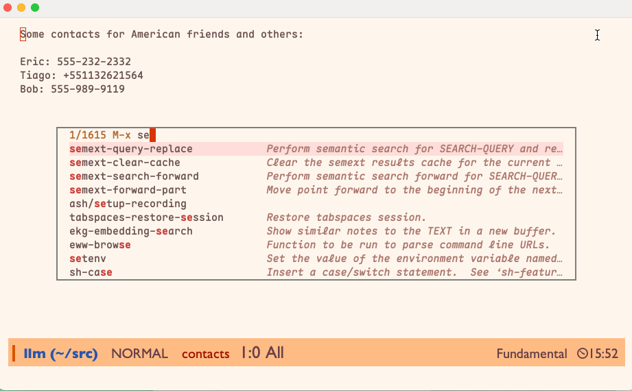
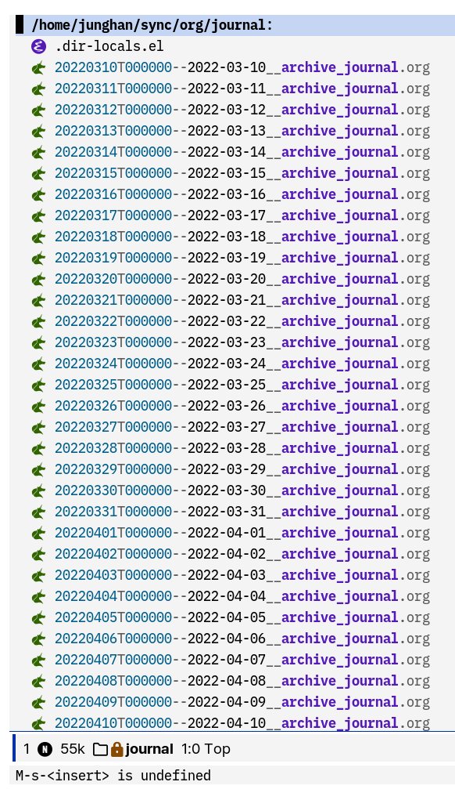
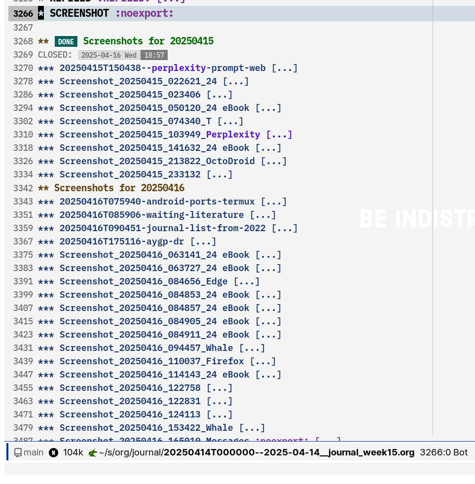

<!-- gid:20250414T000000 -->
<!-- provenance:source:start -->
[[TIP("원본·최신본")]]
이 페이지는 한국어 검색과 읽기를 위한 WikiDocs 미러입니다. [원본·최신본은 가든](https://notes.junghanacs.com/journal/20250414T000000/)에 있습니다. 최신 수정 내용·백링크·태그·히스토리·댓글·출처 정보는 원본 가든에서 확인하세요.

- 작성: `2025-04-14T00:00:00+09:00`
- 최근 수정: `2025-04-14T00:00:00+09:00 (lastmod 없음: date fallback)`
[[/TIP]]
<!-- provenance:source:end -->

[TOC]

## References

<style>.csl-entry{text-indent: -1.5em; margin-left: 1.5em;}</style>
- 이기상. 2002. <i>철학노트</i>. [https://www.yes24.com/product/goods/278214](https://www.yes24.com/product/goods/278214).
- 에크하르트 톨레. 2004. <i>고요함의 지혜</i>. Translated by 진우기. 김영사. [https://www.yes24.com/Product/Goods/1436615](https://www.yes24.com/Product/Goods/1436615).
- Blais, Joshua. 2025. “Emacs for Everything.” March 13, 2025. [https://joshblais.com/posts/emacs-for-everything/](https://joshblais.com/posts/emacs-for-everything/).
- Dib, Firas. n.d. “Regex101: Build, Test, and Debug Regex.” regex101. Accessed April 18, 2025. [https://regex101.com/](https://regex101.com/).
- Han, Jung. (2025) 2025. “Junghan0611/Bookiez.El.” [https://github.com/junghan0611/bookiez.el](https://github.com/junghan0611/bookiez.el).

## 2025-04-14 Mon

-   [joaomgcd TaskerNet 태그커넷 공개 공유 태스트 프로젝트](https://wikidocs.net/382382)
-   [오픈알렉스 OpenAlex - 연구 개방형 카탈로그 문헌 검색](https://wikidocs.net/381681)

### 03:30 귀가 수면

### 08:30 기상 - 온생명 등원

### 10:30 아빠 예수 11:30 뚱이네뷔페 5500원

### 12:00 집 복귀 - 피곤

### 12:43 브레인워시 - 14:01 그래 좋아.

### 16:43 denote refile 함수 만듬

### 18:35 좋아 18:57 밥먹자 20:36 온생명 도착 수면 루틴

## 2025-04-15 Tue

### 07:21 간신히 기상 08:57 등원완료

### <span class="org-todo todo TODO">TODO</span> 웹 브라우저 검색에 대한 이야기

### <span class="org-todo todo TODO">TODO</span> 09:45 TOC 지우기만 하면 된다 태그 내보내기 - 스타일링은 따라하기

이게 toc에 들어가서 예쁘지 않다. 쿼츠에서 지워야 할 것.

#LLM: toc scss quartz 수정

```text
### 07:21 ddd <span class="tag"><span class="ABC">ABC</span></span> {#07-21-ddd}
```

### <span class="org-todo todo TODO">TODO</span> 데모 - 예쁘게 - 포스프레임

예쁘게 하려고 다들 신경쓰지? 일단 확 예뽀야 된다. 그리고 이미지는 아니다. 움직여야 된다. 그래야 예쁘다.



[2025-04-15 Tue 10:02]

### 10:57 org-timestamp embark to find citar

아니야. 그냥 타이핑해.

### <span class="org-todo done DONE">DONE</span> 11:39 노트 분류 방법

### 15:58 브레인워시

### 16:18 풀스택

-   [LLM: 클로저 풀스택 ring reitit malli uix reagent](https://wikidocs.net/381512)

### 17:18 벌써 시간이 이렇게 되다니

### 18:05 헉 나갈 시간 18:15 나가자

### <span class="org-todo done DONE">DONE</span> #조직모드 공백문자 라틴 한글 사이

### 19:09 온생명이 밥 먹이자 20:28 씻기자 22:12 아내 온생명 재움 나도?!

### 23:08 모티머 애들러에게 푹 빠져서

[모티머애들러 평생공부 가이드 - 브리태니커 폴리매스](https://wikidocs.net/382386)

## 2025-04-16 Wed

### 07:14 불교를 철학하다 - 이진경 - 인용문의 도

[이진경 철학자 굴뚝청소부 수학 불교](https://wikidocs.net/382390)

### 07:49 온생명이와 아침 - 아 안드로이드 이맥스

-   [MartinStemplinger 이맥스 네이티브 안드로이드](https://wikidocs.net/382389)

### 08:50 등원완료

### <span class="org-todo todo TODO">TODO</span> 09:14 저널 기록 목적 없는 시작

노트로 만들어줘

-   [2025-04-16 Wed 09:07] 추가하자. 목적 없이 쌓는 것. 뭘 기대하고 했다면 절대 안함.

[2022-03-10](https://wikidocs.net/380374)은 공개가 되어 있을 것이다. 나머지는 뭐. 저널에 기록 된 내용들은 어딘가로 스며든다. 놓치더라도 언젠가 스며든다. 그렇게 된다. 가끔 텍스트 전체 검색을 해보면 알게 된다.

아. 근데 그 이전에는 저널기록을 안했는가? 이래 저래 기록은 했다. 드문드문. 체계 없이 그냥 흘러갔다. 워드프레스에도 있고, 말도 마라. [힣 개인지식관리 역사::그의 디지털 지식 관리 역사](https://wikidocs.net/381206)에서 조금 다루었는데 쓰다가 말았다.



### 10:00 병원 -&gt; 11:30 뚱이네 뷔페 5500원

### 12:54 중앙도서관 체크인 13:30 잠시만 장경식 선생님이 있지

-   [장경식 브리태니커 백과사전](https://wikidocs.net/382391)

### 14:23 지식 너무 깊다 -&gt; 14:31 아이스아메리카노 들이 붙고 싶다 가자!

### 14:35 코드 - 이맥스 가이드 고민 좀 더 해보자

### 16:04 3시간 주어져 있다

### <span class="org-todo todo TODO">TODO</span> 리파일 아카이빙 아름다움

-   [데일리루틴 조직모드: 리파일 아카이브](https://wikidocs.net/381678)

### <span class="org-todo todo TODO">TODO</span> 18:17 아놔 하이랭 얼마전에 보던 것 완전 다 까먹었다. 놀랍다.

그래. 정말 흔적도 모르게 잊었다. 뭐지? 다행히 기록이 있다. 다음으로 가보자. 여기서 다시하자. [2025-03-24::2025-03-29 Sat](https://wikidocs.net/380405)

### <span class="org-todo done DONE">DONE</span> 18:34 오 한국 이맥스 유저분

### 18:52 나가야지!! 쿠팡물류 심야숏

## 2025-04-17 Thu

-   교육 관련 링크 확인
-   리스프 통합 하이랭

### 04:00 집도착. 도서산책 잠이 든다

### <span class="org-todo todo TODO">TODO</span> 10:00 알고리즘 앎의틀 왜

구도자. 영성. 돈오점수.

### 11:21 hugo - org-hugo-link-desc-insert-type

[[TIP("노트")]]
org-hugo-link-desc-insert-type is a customizable variable defined in ox-hugo.el.

Value t

Original Value nil

Toggle Set Customize

Documentation Insert the element type in link descriptions for numbered elements.

String representing the type is inserted for these Org elements if they are numbered (i.e. both "#+name" and "#+caption" are specified for them):

-   src-block : "Code Snippet"
-   table: "Table"
-   figure: "Figure".
[[/TIP]]

### <span class="org-todo done DONT">DONT</span> 11:28 쿼츠 이미지 위키링크 끝

아. 간단하고 아름답다.

### 12:47 스크린샷 이미지는 적절히 필요하다

[LLM: Git LFS(Large File Storage) 사용방법 및 장점](https://wikidocs.net/381408)

이미지가 싹 사라지다니

### 14:29 quartz showcase - 참고 할 것 -&gt; 나가야함 - 하이랭 확인

### <span class="org-todo done DONE">DONE</span> 15:38 #공임나라 #엔진오일 교체하러 옴 - 계속 작업중 45000원

-   뉴스에서 자극적인 것들만 이야기하고 있다. 아름답지 않다.
-   엔진오일은 별도 사전 구입 27000원 대략 - 쿠팡 디젤 많이 팔리는 것으로 함.

### 16:44 온생명 축구가자 17:56 축구 끝날 때 되었다. 디지털가든 업데이트 하자!

### <span class="org-todo todo TODO">TODO</span> 길 없는 길 이야기

[2025-04-17 Thu 19:00]

### 18:59 온생명이와 저녁 먹자. 준비 시작!

### 21:28 온생명이 씻기고 잠자리 보냄

## 2025-04-18 Fri

### 04:17 기상 - 잘 잤다 - 누가? '나'

[[TIP("노트")]]
잘 잤다는 것을 아는 자가 누구냐. 거실 탁자에 앉아서 두드린다. 한 없이 적막하다. 노트북 펜소리가 시끄러울 정도. 앗뜨거워 노트북. 된장. 고추장. 아무렴 고요하다. 전날 창고 다녀오느라 피곤했는데 어제 일찍 자니 아주 풍성하다.

얼마나 잘잤냐고? 그래. 스크린샷 찍어라. 찍! 이 정도면 풍성한 잠이다.

무엇을 할 것인가? 이 아름다운 시간에. 무슨 책을 들으며 두드릴 것인가? 이 시간은 선물이니 소란스럽게 무엇을 할 필요 없다. 오바한다고 되는 시간도 아니다.

\#앎의틀 잠시만.

메타노트에 있는 영어 '태그'는 내보내는게 좋겠지? 왜? 그 태그로 들어가면 노트들이 연결되어 있으니까. 그래 맞아.
[[/TIP]]

### <span class="org-todo todo TODO">TODO</span> 아침에 어딘가 무어라 쓴거!?

### 12:19 철학노트 6장 앎 강하다 - 앓음알이

(이기상 2002)

### 13:23 공백

-   [조직모드: 공백문자 - 라틴 한글 유니코드](https://wikidocs.net/381683)
-   [한글 조직모드: 휴고 내보내기 공백문자 제거 방법](https://wikidocs.net/381319)

### 16:59 오 거의 된 것 같다

### 18:21 앗 온생명이 데리러가자!

### 19:14 밥준비하자!

### 22:23 조사와 전쟁

### 22:34 퍼플링크?

### <span class="org-todo todo TODO">TODO</span> 23:30 글올린것 - 가져오시게

[2025-04-19 Sat 05:02]

## 2025-04-19 Sat

### 04:24 기상 - 이런 거의 90퍼센트 동기화가 되는 사람이구만

(Blais 2025)

### <span class="org-todo todo TODO">TODO</span> Emacs for Everything 이맥스로 모든 것을 - RSS 워크플로우?!

(Blais 2025) Blais, Joshua 2025

The Blog of Joshua Blais

### 05:02 생산성? 그냥 하루를 가져가시게

### <span class="org-todo done DONE">DONE</span> 07:10 청소해놔 이게 영감의 답이야. 가정의 평화 말이야.

(에크하르트 톨레 2004) (Dib n.d.)

(Han [2025] 2025)

### 07:41 앎 - 세계 속의 한국 - 힣의 앎의틀 소명

하이테크 너드. 한글. 한국 철학. 기술. 글. 이게 왜 앎으로 왔는가

### 11:34 온생명 타이커 보내고 스타벅스 체크인

### <span class="org-todo todo TODO">TODO</span> 22:35 온생명이 데리고 친구모임 다녀옴 - 오늘 폰으로 노트 쓴 것들 담을 것!

## 2025-04-20 Sun

### 05:46 굳모닝

[[TIP("노트")]]
으악. 친구들은 이제 잔다네. 힣은 이제 일어났다. 허하다 삶이란. 나도 그래왔지만. 좋고 나쁨도 없지만. 아무렴. 좋다. 삶의 앎의 방식. [호모오티오수스: 심심 한가 권태 현대인](https://wikidocs.net/381414)

힣은 약하다. 루틴에 따라서 살아야 한다. 건강의 일이다.<br /> 힣은 강하다. 약함을 알기에 그렇다.<br />
[[/TIP]]

### <span class="org-todo todo TODO">TODO</span> 07:54 polymath 글쓴거 옮겨줘

### 08:38 함수 수정 개선

### 08:51 번역 SNS 포스팅 - 서브스택에는 영어를 기본으로 할 것

#LLM: SNS 영어 번역 영작 포스팅 댓글 답글

[[TIP("노트")]]
**한글 원문 (유희 포함):** 시간을 정복한 사나이를 아십니까? 이름은 알렉산드르 알렉산비치 류비셰프. 짧게 류비님. 지식관리 Geek에게는 제텔카스텐으로 유명한 루만님이 익숙하겠지만, 나는 사실 류비님께 사사를 받았습니다? 그의 무자비한 시간기록과 투철한 Geek정신. 존경합니다♡. 지금은 바야흐로 멀티모달의 시대 아닙니까. 저는 루만의 제텔카스텐도 사랑합니다. 이건 검색해도 안 나오는 이야기입니다만, 류비는 ADHD가 아니었을까...

**영어 번역 (English Translation):** Do you know the man who conquered time? His name is Aleksandr Aleksandrovich Lyubishchev, or simply Lyubi. While knowledge management geeks might be familiar with Luhmann, famous for his Zettelkasten, I actually learned from Lyubi. His ruthless time-tracking and hardcore geek spirit? Total respect♡. Isn’t this the era of multi modality?! I also love Luhmann’s Zettelkasten. This isn’t something you’ll find online, but... could Lyubishchev have had ADHD?

_한글 댓글:_ 오우! 감사합니다. 개인지식관리는 모국어가 필수죠. 제 디지털 가든 글은 대부분 한글로 쓰여 있어요. '모국어'를 중심으로 언어의 계층화에 관심이 많습니다. 저에게 영어는 메타언어예요. 그래도 우리 모두의 관심사는 크게 다르지 않다고 생각해요. '동양' 관점에서 지식관리의 맥락을 전달하는 데 도움이 되길 바랍니다. 한글이 친절하지 않아 번역이 어려울까 봐 앞으로 포스팅에 영어도 함께 넣을게요. 감사합니다. 앞으로도 당신의 글 감사히 읽겠습니다!

_영어 번역 (English Translation):_ Wow! Thank you. Personal knowledge management inevitably relies on one’s native language. Most of my digital garden posts are in Korean. I’m very interested in the hierarchy of languages centered around the 'mother tongue.' For me, English is a meta-language. Still, I believe our interests aren’t that different. I hope to share the context of knowledge management from an 'Eastern' perspective. Since my Korean might not be translation-friendly, I’ll include English in my posts from now on. Thank you, and I look forward to reading your posts too!

I first came across the term 'Polymath' a few years ago. How much this late encounter has awakened in me! I’ve been raking through universal tools and learning tools, after all. Becoming a polymath can’t be the goal. It’s about breaking the framework of knowledge, where majors and fields are all one. A single, indivisible whole.

폴리매스란 단어 자체를 몇년 전에 처음 알게 되었다. 늦게 만난 이 단어가 얼마나 많은 것을 일깨워주는지. 보편도구 학습도구에 대한 갈퀴질을 해오고 있으니 말이다. 폴리매스가 되는 것은 목표 일수 없다. 다만 앎의틀을 깨어가는데 전공도 분야도 다 하나 라는 것이다. 나눌 수 없는 전체로써 하나.
[[/TIP]]

### 09:12 온생명이 등장 밥줘!!

### 13:42 회색돌 훈련

### 14:17 성공

### 15:25 온생명 타이거 -&gt; 스타벅스 체크인

### 15:35 [프로피디아 - 브리태니커 백과사전](https://wikidocs.net/380838) 와우 겟!

### 17:43 올라가기 전에 문득 아이들을 보며

각자 나름대로의 집안 분위기가 있다. 어느 집은 아빠가 너무 무서워서 말도 못하는 집도 있고, 그 반대도 있다. 아무렴 아이들은 눈치보기 바쁘다.

[랄프왈도에머슨 자기신뢰](https://wikidocs.net/381857)가 떠오른다. 왜 이렇게 옳은 어른들이 많은가? 무엇을 아는가? 모를일이다.

## REFILED

### <span class="org-todo done DONE">DONE</span> Emacs Writing Studio - YouTube

### <span class="org-todo done DONE">DONE</span> siyuan-note/siyuan WYSIWYG pkm

### <span class="org-todo done DONE">DONE</span> Ginqi7/Leetcode-Emacs: An Emacs Plugin To Write Leetcode Programs

### <span class="org-todo done DONE">DONE</span> mina86/auto-dim-other-buffers.el

### <span class="org-todo done DONE">DONE</span> Lindydancer/el2markdown

### <span class="org-todo done DONE">DONE</span> mgalgs/make-readme-markdown: Convert elisp file header comments to markdown text, suitable for a github README.md file

### <span class="org-todo done DONT">DONT</span> Ginqi7/Html2org: Convert Html To Org Mode Format

### <span class="org-todo done DONE">DONE</span> Daydiff/Yt-Playlist-Export

### <span class="org-todo done DONE">DONE</span> Aygp-Dr/Functional-Data-Structures: Purely Functional Data Structures Implemented In Scheme And Hy, Based On Chris Okasaki’S Book

### <span class="org-todo done DONE">DONE</span> Cursor (AI IDE)는 어떻게 동작하는가 ide 풍년 도구 위치

### <span class="org-todo done DONE">DONE</span> 조직모드에서 왜 filestags가 알파벳 순으로 정렬이 되는 것인가? 설정을 변경하는 방법을 찾아줘

## SCREENSHOT

-   [2025-04-17 Thu 12:42] 아니다. 작게해서 올리는게 맞다.
-   [2025-04-16 Wed 19:05] 데일리 저널에 하루 기록한 스크린샷을 모두 긁어오게 했다. 지저분해서 디지털가든에 올릴 필요는 없겠다.



왜 이미지 파일명에 공백이 있지? 공백을 채워야겠네. 수정 필요 -&gt; 수정함

### Screenshots for 20250414

#### 20250414T164842-joaomgcd-taskernet

![[../images/20250414T164842-joaomgcd-taskernet.png|320]]

#### Screenshot_20250414_021441_24_eBook

![[../images/Screenshot_20250414_021441_24_eBook.jpg|320]]

#### Screenshot_20250414_021858_24_eBook

![[../images/Screenshot_20250414_021858_24_eBook.jpg|320]]

#### Screenshot_20250414_022149_24_eBook

![[../images/Screenshot_20250414_022149_24_eBook.jpg|320]]

#### Screenshot_20250414_033145

![[../images/Screenshot_20250414_033145.jpg|320]]

#### Screenshot_20250414_033513

![[../images/Screenshot_20250414_033513.jpg|320]]

#### Screenshot_20250414_085518_24_eBook

![[../images/Screenshot_20250414_085518_24_eBook.jpg|320]]

### Screenshots for 20250415

#### 20250415T150438--perplexity-prompt-web

![[../images/20250415T150438--perplexity-prompt-web.png|320]]

#### Screenshot_20250415_022621_24_

![[../images/Screenshot_20250415_022621_24_.jpg|320]]

#### Screenshot_20250415_023406

![[../images/Screenshot_20250415_023406.jpg|320]]

#### Screenshot_20250415_050120_24_eBook

![[../images/Screenshot_20250415_050120_24_eBook.jpg|320]]

#### Screenshot_20250415_103949_Perplexity

![[../images/Screenshot_20250415_103949_Perplexity.jpg|320]]

#### Screenshot_20250415_141632_24_eBook

![[../images/Screenshot_20250415_141632_24_eBook.jpg|320]]

#### Screenshot_20250415_213822_OctoDroid

![[../images/Screenshot_20250415_213822_OctoDroid.jpg|320]]

#### Screenshot_20250415_233132

![[../images/Screenshot_20250415_233132.jpg|320]]

### Screenshots for 20250416

#### 20250416T075940-android-ports-termux

![[../images/20250416T075940-android-ports-termux.png|320]]

#### 20250416T085906-waiting-literature

![[../images/20250416T085906-waiting-literature.png|320]]

#### 20250416T090451-journal-list-from-2022

![[../images/20250416T090451-journal-list-from-2022.png|320]]

#### 20250416T175116-aygp-dr

![[../images/20250416T175116-aygp-dr.png|320]]

#### 20250416T190226-screenshot-all

![[../images/20250416T190226-screenshot-all.png|320]]

#### Screenshot_20250416_063141_24_eBook

![[../images/Screenshot_20250416_063141_24_eBook.jpg|320]]

#### Screenshot_20250416_063727_24_eBook

![[../images/Screenshot_20250416_063727_24_eBook.jpg|320]]

#### Screenshot_20250416_084656_Edge

![[../images/Screenshot_20250416_084656_Edge.jpg|320]]

#### Screenshot_20250416_084853_24_eBook

![[../images/Screenshot_20250416_084853_24_eBook.jpg|320]]

#### Screenshot_20250416_084857_24_eBook

![[../images/Screenshot_20250416_084857_24_eBook.jpg|320]]

#### Screenshot_20250416_084905_24_eBook

![[../images/Screenshot_20250416_084905_24_eBook.jpg|320]]

#### Screenshot_20250416_084911_24_eBook

![[../images/Screenshot_20250416_084911_24_eBook.jpg|320]]

#### Screenshot_20250416_094457_Whale

![[../images/Screenshot_20250416_094457_Whale.jpg|320]]

#### Screenshot_20250416_110037_Firefox

![[../images/Screenshot_20250416_110037_Firefox.jpg|320]]

#### Screenshot_20250416_114143_24_eBook

![[../images/Screenshot_20250416_114143_24_eBook.jpg|320]]

#### Screenshot_20250416_122758

![[../images/Screenshot_20250416_122758.jpg|320]]

#### Screenshot_20250416_122831

![[../images/Screenshot_20250416_122831.jpg|320]]

#### Screenshot_20250416_124113

![[../images/Screenshot_20250416_124113.jpg|320]]

#### Screenshot_20250416_153422_Whale

![[../images/Screenshot_20250416_153422_Whale.jpg|320]]

#### Screenshot_20250416_204456_24_eBook

![[../images/Screenshot_20250416_204456_24_eBook.jpg|320]]

### Screenshots for 20250417

#### Screenshot_20250417_030449

![[../images/Screenshot_20250417_030449.jpg|320]]

#### Screenshot_20250417_034045

![[../images/Screenshot_20250417_034045.jpg|320]]

#### Screenshot_20250417_034709

![[../images/Screenshot_20250417_034709.jpg|320]]

#### Screenshot_20250417_034853

![[../images/Screenshot_20250417_034853.jpg|320]]

#### Screenshot_20250417_034921

![[../images/Screenshot_20250417_034921.jpg|320]]

#### Screenshot_20250417_035007

![[../images/Screenshot_20250417_035007.jpg|320]]

#### Screenshot_20250417_035148

![[../images/Screenshot_20250417_035148.jpg|320]]

#### Screenshot_20250417_195605_24_eBook

![[../images/Screenshot_20250417_195605_24_eBook.jpg|320]]

#### Screenshot_20250417_200529_24_eBook

![[../images/Screenshot_20250417_200529_24_eBook.jpg|320]]

#### Screenshot_20250417_204433_Perplexity

![[../images/Screenshot_20250417_204433_Perplexity.jpg|320]]

### Screenshots for 20250418

#### 20250418T171027-grok3-api-model-new

![[../images/20250418T171027-grok3-api-model-new.png|320]]

#### 20250418T180921-rebuilder-test

![[../images/20250418T180921-rebuilder-test.png|320]]

#### Screenshot_20250418_043054_Samsung_Health

![[../images/Screenshot_20250418_043054_Samsung_Health.jpg|320]]

#### Screenshot_20250418_084722_GitHub

![[../images/Screenshot_20250418_084722_GitHub.jpg|320]]

#### Screenshot_20250418_084834_GitHub

![[../images/Screenshot_20250418_084834_GitHub.jpg|320]]

### Screenshots for 20250419

#### 20250419T043323-elfeed-open

![[../images/20250419T043323-elfeed-open.png|320]]

#### 20250419T043437-elfeed-summary

![[../images/20250419T043437-elfeed-summary.png|320]]

#### Screenshot_20250419_040452_Samsung_Health

![[../images/Screenshot_20250419_040452_Samsung_Health.jpg|320]]

#### Screenshot_20250419_050506_aTimeLogger

![[../images/Screenshot_20250419_050506_aTimeLogger.jpg|320]]

#### Screenshot_20250419_050641_Firefox

![[../images/Screenshot_20250419_050641_Firefox.jpg|320]]

#### Screenshot_20250419_084948_Edge

![[../images/Screenshot_20250419_084948_Edge.jpg|320]]

#### Screenshot_20250419_085033_Edge

![[../images/Screenshot_20250419_085033_Edge.jpg|320]]

#### Screenshot_20250419_085716

![[../images/Screenshot_20250419_085716.jpg|320]]

#### Screenshot_20250419_125417_Edge

![[../images/Screenshot_20250419_125417_Edge.jpg|320]]

#### Screenshot_20250419_125435_Edge

![[../images/Screenshot_20250419_125435_Edge.jpg|320]]

#### Screenshot_20250419_125511_Edge

![[../images/Screenshot_20250419_125511_Edge.jpg|320]]

#### Screenshot_20250419_125738_Edge

![[../images/Screenshot_20250419_125738_Edge.jpg|320]]

#### Screenshot_20250419_131458_aTimeLogger

![[../images/Screenshot_20250419_131458_aTimeLogger.jpg|320]]

#### Screenshot_20250419_172547_Whale

![[../images/Screenshot_20250419_172547_Whale.jpg|320]]

#### Screenshot_20250419_172826_Whale

![[../images/Screenshot_20250419_172826_Whale.jpg|320]]

#### Screenshot_20250419_174508_Whale

![[../images/Screenshot_20250419_174508_Whale.jpg|320]]

#### kyoboebook_20250419-115957

![[../images/kyoboebook_20250419-115957.png|320]]

### Screenshots for 20250420

#### Screenshot_20250420_060354_Whale

![[../images/Screenshot_20250420_060354_Whale.jpg|320]]

#### Screenshot_20250420_060714_Whale

![[../images/Screenshot_20250420_060714_Whale.jpg|320]]

#### Screenshot_20250420_060725_Whale

![[../images/Screenshot_20250420_060725_Whale.jpg|320]]

#### Screenshot_20250420_060840_Whale

![[../images/Screenshot_20250420_060840_Whale.jpg|320]]

#### Screenshot_20250420_061222_Whale

![[../images/Screenshot_20250420_061222_Whale.jpg|320]]

#### Screenshot_20250420_074205_24_eBook

![[../images/Screenshot_20250420_074205_24_eBook.jpg|320]]

#### Screenshot_20250420_092244_Whale

![[../images/Screenshot_20250420_092244_Whale.jpg|320]]

#### Screenshot_20250420_094954_24_eBook

![[../images/Screenshot_20250420_094954_24_eBook.jpg|320]]

#### Screenshot_20250420_104301_24_eBook

![[../images/Screenshot_20250420_104301_24_eBook.jpg|320]]

#### Screenshot_20250420_104305_24_eBook

![[../images/Screenshot_20250420_104305_24_eBook.jpg|320]]

#### Screenshot_20250420_125817_ReadEra_Premium

![[../images/Screenshot_20250420_125817_ReadEra_Premium.jpg|320]]

#### Screenshot_20250420_125930_ReadEra_Premium

![[../images/Screenshot_20250420_125930_ReadEra_Premium.jpg|320]]

#### Screenshot_20250420_140215_Substack

![[../images/Screenshot_20250420_140215_Substack.jpg|320]]

#### Screenshot_20250420_140243_Substack

![[../images/Screenshot_20250420_140243_Substack.jpg|320]]

#### Screenshot_20250420_151738_Edge

![[../images/Screenshot_20250420_151738_Edge.jpg|320]]
