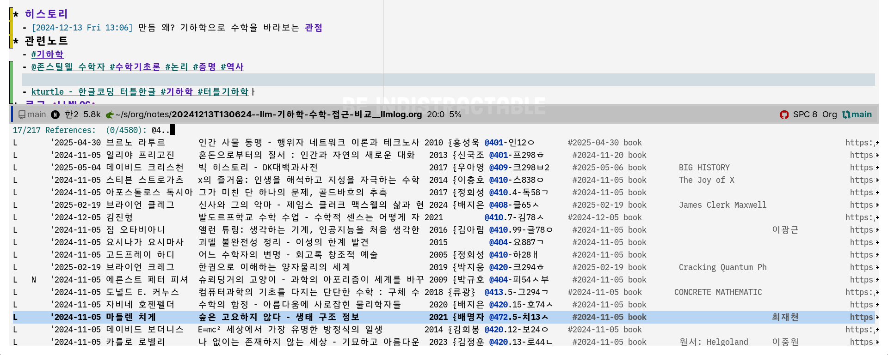

<!-- gid:20250519T000000 -->
<!-- provenance:source:start -->
[[TIP("원본·최신본")]]
이 페이지는 한국어 검색과 읽기를 위한 WikiDocs 미러입니다. [원본·최신본은 가든](https://notes.junghanacs.com/journal/20250519T000000/)에 있습니다. 최신 수정 내용·백링크·태그·히스토리·댓글·출처 정보는 원본 가든에서 확인하세요.

- 작성: `2025-05-19T00:00:00+09:00`
- 최근 수정: `2025-05-19T00:00:00+09:00 (lastmod 없음: date fallback)`
[[/TIP]]
<!-- provenance:source:end -->

[TOC]

Table of Contents

- [2025-05-19 Mon](#2025-05-19-mon)
- [2025-05-20 Tue](#2025-05-20-tue)
- [2025-05-21 Wed](#2025-05-21-wed)
- [2025-05-22 Thu](#2025-05-22-thu)
- [2025-05-23 Fri](#2025-05-23-fri)
- [2025-05-24 Sat](#2025-05-24-sat)
- [2025-05-25 Sun](#2025-05-25-sun)
- [NEWNOTES](#newnotes)
- [REFILED](#refiled)
- [SCREENSHOT](#screenshot)
- [CITATIONS](#citations)
- [PREVIOUS](#previous)

<!--endtoc-->

[[TIP("인용")]]
우리가 반복적으로 행하는 것이 우리 자신이다. 그렇다면 탁월함은 행동이 아닌 습관인 것이다. — 아리스토텔레스
[[/TIP]]

## 2025-05-19 Mon

### 04:30 깨어나다! 전체 다시 내보내기 중

### 07:56 한 주를 시작하며

### DONE 10:43 그럼에도 불구하고 - 학교 폭력의 기억 - 힘의 역학 관계 그리고 '미디어'

[2025-05-19 Mon 12:34]

힘들었다. 가끔 꿈에 나오는 기억. 아이들을 괴롭히는 녀석에 대한 분노랄까. 나한테 하는 짓은 아니기에 괜찮다?! 아니다. 계속 괴로웠다. 문제는 한 번이 아니라는 것. 계속 괴롭힌다는 것이다. 힘의 역학 관계가 굳어지면 벗어나기 어렵다. 학생 때의 문제가 아니다. 꼬리가 꼬리를 무는 것과 같이 이러한 힘의 관계가 연결되어 있다. 이런 저런 이유로 스스로를 합리화 할 것이기에 자신은 언제나 정당하다. 나 또한 자유로울까? 아니다.

할 수 있는 일은 오늘을 새롭게 사는 것이다. 폭력하지 말라는게 아니다(그렇게 간단한 일인가?) 하지 말라는 생각은 오히려 하라는 이유를 만들어 낸다. 아니라고? 내 생각은 내 것이 아니다. 생각을 제어할 수 있는가?(노노, 유발하라리가 명상하게 된 이유) 그러기에 그나마 할 수 있는 무언가는 SNS와 미디어의 폭력의 이야기에서 거리를 두는 것이다. 그 대신 자연에 바라보는 것, 또는 고전에서 만날 수 있는 것으로 채우는 것이다. 때론 멍하니 게으름을 허락하는 것이다. 삶이 주는 질문에 가까이 다가가는 것이다. 의도적인 노력이 가능하련가? 그냥 방향성을 그리해보자는 것 정도이다. 살살 달래가면서 가야하지 않겠는가? 어렵다.

그렇다. 불완전한 자신을 받아들이라! 이제 불완전한 끄적임을 시작하는 것이 제일이다. 터치 말고 키보드로 두더지 잡기를 하듯이 손가락의 춤을 허락하는 것이다. 말은 언제나 쉽다. 이런 글만으로 도움이 될 누군가는 이 글이 사실 필요 없는 사람일 것이다. 이딴 글 쓸 시간이 있어!?라는 말을 들어도 크게 이상할 것도 아니다. 하지만 이것이 전부다. 이맥스 디지털가든 뭐 그것은 그냥 가다보면 만날 수도 있는 것들일 뿐이다. 꼭 필요하며 집착할 것은 없다. 삶은 언제나 여여할 뿐이다.

### 12:15 임베디드 엣지AI 등 기술 트렌드 - 미래

[LLM: 임베디드 도서 분석 - 엣지AI](https://wikidocs.net/382443)

### 12:44 아무도 찾지 않는 바위섬

이 노래가 생각이 난다

### 13:09 콰이어트 - 어제 중고서점에서 다시 만남

몇년전에 제목에 끌렸는데 잊고 있다가 중고서점에서 봤다. 사지 않았지만 노트는 만들어 놓아야 할 것 같다. 여기서 의미하는 바가 있다. 영어 단어 몇개 얻음.

[수전케인 콰이어트 - 시끄러운 세상에서 조용히 세상을 움직이는 힘](https://wikidocs.net/382444)

### 13:21 '산책' 지혜 구하는 마음으로

### 22:21 휴우 하루를 정리한다. 괜찮다.

### TODO 분노하는 사람들을 상대하는 법

(라이언 마틴 2024) 라이언 마틴 신동숙 2024

"저 사람은 왜 저렇게 화를 내는 걸까?" 무조건 피하는 것만이 답은 아니다. 가정이나 일터 또는 온라인에서 화난 사람들을 만났을 때 어떻게 대처해야 할까? 이 책에서는 다른 사람에 대한 분노를 어떻게 다루어야 하는지를 보여준다.

## 2025-05-20 Tue

[junghan 기본 이력서 - 온라인](https://wikidocs.net/381108)

### 03:48 잠시 일어 났다.

### 04:00 나는나 - 류시화

### 07:03 기상

(마이클 싱어 2023) 삶이 당신보다 더 잘안다.

### 07:56 기하학 연결 고리를 다룬 노트를 어쏠로그로 올림 여기에 추가

[힣 수학: 기하학 접근 - 거북이 로고 (스틸웰 펜로즈 페퍼트 민코프스키)](https://wikidocs.net/381428)

### DONE 08:00 흔적찾기 - 단서 저자명 십진분류 활용

[LLM: 자료탐색 - 카테고리 십진분류 - 중복 계층 의미](https://wikidocs.net/381662)

로저펜로즈가 생각안나서 대략 수학, 과학 주변 책들로 찾음. 흔적의 계층. 브레인 연결 강화. 과정에서 노트 간 연결 고리 획득

### 08:58 디지털가든 업데이트 - 온생명 등원 고고

### 15:06 브레인워시

### 15:44 이단몰릭 [이단몰릭 듀얼브레인 코인텔리전스 - 공동지능 인공지능과 함께 일하고 살아가는 법 - 생존 가이드](https://wikidocs.net/382127)

### 18:21 온생명 태권도 데리러 가자 -&gt; 놀이터

### 19:10 저녁 식사 - 울트라 하드코어 - 정지우 작가님 인스타 댓글

[정지우 돈 말고 무엇을 갖고 있는가 - 나라는세계 - 분노사회](https://wikidocs.net/382441)

작가님의 이상을 구현할 지식도구가 필요하지 않습니까? 바로 여기에 있습니다.

### 20:37 온생명이와 씻자 목욕 - 오! 이력서 열람 1건 - 좋아 좋아! 대답 없는 너

### 21:25 아내 귀가 - 이제 수면 루틴 - 샥티가 온전체를 휩쓴다

### DONT 일본보다 뒤처진 한국 AI 정책, 따라잡을 방법은? 토요토론 19회

[2025-05-20 Tue 20:38] (박태웅, 정준희, and 이해민 2025)

### DONE AI가 인간의 창의 프로세스의 본질에 대한 질문 - 지성과 영성

-   [2025-05-22 Thu 11:07] 시간 이야기가 결국 하이데거 존재와 시간을 떠올리게 한다.
-   [2025-05-20 Tue 19:10] 지성 영성 합일이라는 키워드

지성과 영성의 합일. 영성은 지성의 뿌리. 하되 함이 없이. 에고를 넘어 모두를 위한 것에서 다시 지성이 싹이 튼다.

#### 지성

-   인간의 유한성의 자각! 그래봐야 하루는 24시간! - '노력' 세이브 하는 것
-   불완전하기에 시행착오의 반복 프로세스 - 강화 연결 프로세스
-   화안내고 답변을 계속해주는 그대
-   인공지능의 활용은 결국 불완전한 시행착오의 노력을 세이브해주는 것
-   계왕권 몇 배로 쓸 것인가? LLM의 능력, 프롬프트 그리고 인간의 지식 베이스 활용 능력

#### 영성

한편으로 단박의 깨우침의 측면을 바라보아야 한다. 머리로 하는 것이 아닌 측면의 것. 머리로 노자의 도덕경을 말할 수 있는가? 인류의 스승들의 가르침은 머리로 닿을 수 있는 것이 아니다. 영성으로의 초대가 없이 지성이 꽃을 피울 수 있는가? 어렵다. 개인이 할 수 있는 것을 넘어서 전체가 드러남

## 2025-05-21 Wed

### 06:43 기상

### DONE 09:08 서류합격! 프로스린트 생각나네! 리스크에 투자하십시오!

친구말로는 프랑스 삼류소설에서나 봄직한 스토리텔링이라는 극찬을 들은 바 이력서가 통하는 곳이 있다. 프랑스 소설을 읽을 것 같지 않은 친구이기에 아마 애둘러 부정의 표현을 한 것이리라. 그럼에도 힣은 [발자크](https://wikidocs.net/382295)를 떠올리며 이거야!라고 탄성을 지른다.

큰 기대 없이 나가본다. 좋은점은 오프라인이라는 것이다. 같은 공간에서 같은 공기를 주고 받으며 악수를 하면 하나의 목적을 가지고 뚫고 나아가는 공감대를 이룰 수 있다. 무엇이냐? 울트라 하드코어 말이다. 좋은 의미로서 말이다.

아무렴 될 일은 된다. 사실 엄청 많이 써냈다. 어딘가는 되리라. 살려주십사하는 태도는 글로는 재미있으나 만남에서는 역하다.

문득 떠오른다. 힣은 그 자체로 리스크다. 리스크를 감내한다면? 뭐 없다. 무엇도 없다. 불완전함의 자각이다. 될일은 된다. 하되 함이 없이 그저 그 안에 완전히 녹아드는 것이다. 결과는 우리의 것이 아니다. 과정에서 다 이루었으므로 더 바랄 것 없다.

특히 국내에서 인공지능을 다루는 회사는 이러한 마인드로 해야 할 것 같다. 매우 어려운 상황이다. 다른 나라 비교 분석은 좋다 필요하다. 하지만 그게 동력이 될 수 없다. 인터널 브랜딩을 전사적으로 하려면 ...

잠시. 이제 나가야 한다. 짧게 마쳐야 한다. 전사적으로 하려면 전사를 모시라. 힣이 바로 그다.

[프로스린트](https://wikidocs.net/381500)

### 10:33 [AI반도체](https://wikidocs.net/380979) 국내 경쟁력은?

### 11:10 오! 고고씽!! 퀄리티 있는 곳에 서류 됬다.

인적성 시험은 뭐지!

### 14:10 뚱이네 5000원 점심 후 복귀 -&gt; 브레인워시

매우 덥다. 땀바가지로 돌아와서 기절

### 15:55 차분하게

### 17:49 cc를 잡아야지 요게 기본이 될 것 같구나 오마이갓

### 19:49 뭘해도 잘 안되는구만

### 20:39 온생명 도착 - 재우자

### DONE 23:12 사슴벌레 생명 그리고 안녕!

[2025-05-21 Wed 23:38]

[2025-02-24](https://wikidocs.net/380400) 이후 사슴벌레는 기억 속에 잊혔다. 아니 이럴수가... 화분 속에서 잠을 자고 있던 사슴이가 다시 나와서 벽을 기어 오르고 있었다. 어디를 가려는 것 일까? 그간 누구도 신경쓰지 않고 있었으나 사슴이는 다 알고 있었으리라. 다가가서 녀석의 등딱지를 쓰다듬었다. 역시 녀석은 얼음땡을 하듯이 순간 굳어 있다. 그래. 삶이야.

힣은 녀석을 꺼내서 컵에 담고 엘리베이터를 타고 밖으로 나갔다. 아파트 단지 안에 그럴싸하게 조성된 자연으로 녀석을 놓아주었다. 녀석을 내려놓고 등딱지를 다시 쓰다듬었다. 녀석의 생명을 내가 이 집구석에서 쥐락펴락하는게 말이 되는가! 나는 그럴 자격이 없다. 갈 곳으로 가거라! 사진을 찍어둘까 하였지만 (이런 일에는 찍는게 당연한 나였지만) 그러지 않았다. 녀석과 내가 다시 만나서 헤어짐까지 생명으로 다가가길 원했다. 덧칠하지 않음으로 말이다.

모르겠다. 녀석은 1년 가까이 이 집에서 있었던 것 같다. 이게 말이 되는가? 검색해본다면 뭐 별일도 아닌 것일지도 모른다. 검색해서 아는 것이 진짜 아는 것일까? 그냥 때론 마법이며 기적이라고 말하는게 더 앎에 가까울지 모른다. 온생명이 나에게 말을 건넨 것일지도 모른다.

마치 빅터프랭클의 죽음의 수용소에서의 한 장면이 떠오른다. 죽음을 앞둔 소녀가 창 밖의 나무를 바라보며 생명이 말하고 있다고 하는 것 처럼 말이다. "내가 여기 있어. 나는 영원한 생명이야"라고 했던가? 빅터프랭클은 처음에는 죽음을 앞둔 소녀가 정신착란증세를 겪고 있으려니 생각했다고 한다. 그러나 그는 이내 알아차렸다. 그리고 책 전체를 통해서 하나를 말하고 있다. 그 하나 말이다.

힣은 취업 준비와 상관 없는 이 끄적임을 하며 눈물까지 뚝뚝 흘리고 있다. 근데 이 글이 취업과 정말 상관이 없는지 어찌 알겠는가? 모를 일이다. 그러기에 아는 일이다. 삶으로 가는 길이다.

이 글 바로 전에 '지원 동기'라는 짧은 메모를 남기고 있었다. #LLM: 운명vs. 사명이라는 노트를 만들어서 LLM과 운명과 사명 그 어딘가에서 글을 캐고 있었다. 정말도 지원 동기가 있었다. 왜 내가 방구석에서 이 끄적임을 하고 있었던가? 마이너리티 리포트를 가지고 사용자 경험을 떠들던 이야기 그리고 카림 라시드 협업 사이니지, 대형 터치 테이블 기구 제작 때문에 애먹던 이야기가 생각이 났다. 도대체 나의 삶에서 쓸모 있음직한게 얼마나 있던가? 지식 도구를 떠드는 글과 코드 전체는 과함의 극치 아닌가?

쓸모 없음의 쓸모가 될지 모르는 일이다. 아니 그렇게 되고 있는 것 같다. 의도하지 않았음에도 말이다. 그렇다면 마이클 싱어의 책 제목으로 이어진다. "상처 받지 않는 영혼", "삶이 당신보다 더 잘 안다", "될 일은 된다: 내맡기기의 삶"

아무튼 사슴벌레야 안녕!

## 2025-05-22 Thu

### 05:23 기상 - 죽었다 인났냐

냉동장치에 반세기 들어갔다가 나온듯. 폐가 정상의 32% 작동. 손가락 발가락을 지압해서 몸을 깨우자. 키보드를 두드리는 것이 지압인가. 효과가 있다. 헛소리 입력은 효과가 있다. 더 자라.

(U. G. 크리슈나무르티 1985) 역시 반복 청취. 수면 자극 치유 책. 4장만 다시 듣기.

### 07:30 손노트 작성

쇼파에 앉아서 메모장에 끄적인 것

-   왜 나를 통과시켰는가?
-   리스크를 감내하는 것! 모르는 일을 하기에 '학습자'가 필요하다.
-   엣지AI - 에지AI 용어 통일하라!
-   페르소나 - 아이, 노인, 고통 중에 있는 자에게 필요한 것
-   이맥스 - 리스프 폴그레이엄 - 백년 후 프로그래밍 - 추상화
-   AI 유니콘 투자 성장 - 사회 담론 특별함을 담아라 - 사회비용, 교육, 취약계층
-   찍어낼 수 있는 것 - 대체 가능한 것 - 찍어내듯 하는 답변 - 모르는 이야기를 해줘
-   이기상 - 하이데거 둘다 신학을 뿌리에 둠 - 존재에게 시간은 "선물"
-   최봉영 - 있음과 때 - 한글은 글이 아니라 말에서 왔다.
-   하이데거 - 독일의 일상 언어의 철학 -&gt; 모국어의 중요성
-   1979년 두 스승의 입학년도

### 09:26 온생명 이제 기상 등원 고고

쓰레기 버리러 나간 김에 사슴이를 찾아보았으나 이미 떠난 뒤였다.

### 10:50 늦잠꾸러기 녀석과 도보 등원 후 복귀 - 덥다

사슴벌레 만난 이야기 해줌. 왜 보내줬냐며.... 사슴이가 아이를 많이 낳는 모습을 보고 싶었다며... 밖에 나갔으니 그리 될기다.

### 10:58 존재와 시간 - '우리말 철학' - 한 생을 바친다는 것

(마르틴 하이데거 2025) 이기상 선생님 새번역판. 앞서 인공지능이 인간에게 질문하고 있다는 글에서 시간과 유한함을 이야기했는데 존재와 시간과 연결 된다. 우리말의 그릇으로는 못담을 것이 없다. 한 생을 바쳐서 그 질문에 다가가고 그 다음 사람이 또 다가가고 이런 순환의 인간사.

-   [최봉영 한국말 말차림법 묻다풀 한국인 삶과 철학](https://wikidocs.net/382449) 한 생을 바치는 분의 예인가
-   [마르틴하이데거 MartinHeidegger 1889 존재 시간 철학자](https://wikidocs.net/382379) 하이데거 어록 좀 가져와봐요. 힣이 따라 하게요

### DONE 11:33 아. 앱스타인 책과 최근 근황을 검색한 기록 확인

#### DONE 아만다 리플리와 『무엇이 이 나라 학생들을 똑똑하게 만드는가』를 소개해줘

#### DONE 데이비드 엡스타인과 그의 저서 소개

### 12:44 RSS 테스트 - 요약 블록을 처리해줘

[쿼츠 quartz 디지털가든 - og-image 생성 조직모드 description 헤더 역할](https://wikidocs.net/381615)

### 13:18 배고프다 한번 리프레시하고 가자 - 브레인워시

### 17:20 온생명 - 퍼스트축구클럽 - 노트북

[데이비드봄: 물리학자 접힌질서 양자물리 창조적대화](https://wikidocs.net/382175)

### 20:00 온생명이와 밥먹으면서 사락독서 모임 공지 글 작성 후 올림

### 21:00 온생명 물놀이 자자

## 2025-05-23 Fri

### DONE 04:22 기상: 억지로 하지 않음에서 시작 된다 - 게임 회상

[2025-05-23 Fri 04:57]

말도 못하게 재미가 없어보이는 그것을 필요하다는 것만으로 주입하려고 한다면 이거 참 고문이 아닐 수 없다. 필요? 누가? 무엇을 안다고 필요를 말할 수 있지?

유발하라리 21세기 조언에서 아이들에게 해주고 싶은 말로 조심스레 말한다. 어른들도 뭣도 모르니 마냥 따라가지 말라는 말을 남겼다. 아! 요즘 애들은 4가지가 없다고 써놓은 기원전 아시리아 똥뚜깐에 써있는 이야기 아니다. 이제 어른들도 아니 누구도 진짜 뭐가 어찌 될지 모른다는 말이다. (유발의 21세기 조언 후반부에 교육 의미 명상 파트를 보라) - [유발하라리: 사피엔스 넥서스 호모데우스 명상가 YUVAL HARARI](https://wikidocs.net/382054)

나에게 게임이란? 일종의 고문일까? 으악... 학창시절에도 게임을 즐긴적이 없다. 지루하다. 잘하지도 못해서 그런듯. 학창시절 당시 우리집은 스타 1:1 게임방이었다. 공유기도 없던 시절에 랜선을 용산가서 사와서 방과방 사이를 다이렉트로 연결을 해놨다. 스타크레프트, 레인보우식스 뭐 이런것 대결하러 아이들이 엄청 드나들었다. 당시 게임은 안하고 시스템 관리자를 했군. 그때 좀 더 전문적으로 해서 이맥스를 만났다면 어떻게 되었을까? 중졸에 대학도 못갔을 것이다. 아무렴 그 시절은 오와열로 줄세우고 따라가기 바쁜 시대였다. 그게 사회에 더 적합하였으리라. 그럼에도 그때 알짜 리눅스(가물가물)를 설치하면서 어딘가에서 EMACS라는 단어를 보았으리라.

한편 내동생은 게임을 그때도 지금도 여전히 매우 과한 게이머다. 플레이어를 넘어서 게임과 교육 업계의 전문가이기도 하다. 또한 조용하지만 꾸준한 유튜버이기도 하다. 바야흐로 새 시대의 롤모델이기도 하다. 좋아하는 일 하면서 사는 사람이 얼마나 있는가? 하물며 게임이라니!! 동생도 시작에는 그저 게임 플레이어였다. 불완전을 너머 학생이 하기에 부적합해 보이는 무언가로 시작한 것이다.

그 시절로 돌아가자면... 학창시절에 동생에게 스타 배틀넷을 부탁하곤 했다. 야자(야간자율학습) 끝나고 한판 승부 말이다. 언제나 이겼다. 그래서 나는 말이다. 하지 않는 고수 였다. 물론 리플레이는 분석했다. 그 정도는 할 수 있었다. 그 시간에 뭐 했지? 공부했나? 아니다. 공부 계획을 세우고 있었을 것이다. 실패에 이르는 그 무한 계획의 바퀴에서 헛돌고 있었다는 말이다. 그게 지식도구를 떠드는 고독한 힣의 배경이 되었음은 이미 그는 누구인가를 보면 알수 있다. - [그는누구인가](https://wikidocs.net/381392)

온갖 필요하다는 말도 스스로를 고문하는 사람들이 얼마나 많은가? 경쟁의 틈바구니로 자신과 가족을 물아 넣는 것 말이다. 물론 효과가 있었다. 지금까지의 세계에서는 말이다. - [김누리 경쟁교육 야만 - 교육혁명](https://wikidocs.net/382024)

앞으로 아니 이미 와있는 세계는 울트라 하드코어로 자기를 갈아 넣을 재미의 끝판왕의 길을 선택하지 않는다면 그냥 기본소득으로 생을 연명해야 할지 모른다. 강요하기 보다 그냥 불완전함을 받아들이고 오늘 끌려나오는 영감님의 흐름을 맡기고 한가닥 실을 연결하기만 해보라. 하다 보면 하루 종일 그 이야기만 떠드는 자신을 만날지 모른다.

새 시대의 문법은 억지로 하지 않음에서 시작 된다. 그러기엔 이리해도 저리해도 생은 너무 짧다. 생명의 끄나풀이 덜렁 덜렁 떨어질 날이 얼마 남지 않았다. 아니 당장 내일 떨어져도 전혀 이상하지 않은 것이 우리네 삶이다. 주저 하지 말자. 그러니 강요하지 말라. 너도 모르니 나도 모른다.

### 05:38 잠시만 어제 사락에 글 써놓은 것 - 업데이트

[힣: 사락 독서 모임 - 책과 삶](https://wikidocs.net/381666)

### 06:13 아내 기상 출근 시퀀스

### 10:00 온생명 등원 후 고요한 키보드

### DONE 11:26 데이비드 봄 - 창의성에 대하여 : 질서 구조 조화 총체성 - 용어 정의

[[TIP("인용")]]
-   질서 order
-   구조 structure
-   조화 harmony
-   총체성 totality

To understand what this means, however, we must first go into what is signified by the terms "order," "structure," "harmony," and "totality." —Bohm, David, "On Creativity"
[[/TIP]]

### 12:36 코드셀 - 파이썬 패키지 좋은데

[astoff code-cells.el: Emacs utilities for code split into cells, including Jupyter notebooks](https://wikidocs.net/381720)

### DONE 13:52 트리시터 둠이맥스

### DONE 14:12 #산업단지 간만에 C형제와 통화 - 용인 원산면 하이테크

[2025-05-23 Fri 15:11]

-   용인 원산면 하이테크 현장에 반도체 대규모 시설이 들어와 바쁘다는데 그렇다면 이 현장은 #산업단지를 노트를 만들때가 되었다는 것이다!
-   평택 고덕 반도체 단지는 중단되었다고 한다.
-   [도시첨단산업단지 - 판교테크노벨리](https://wikidocs.net/380982)

### 16:19 브레인워시 - 과열

### 17:06 유지니아 챙 - 카테고리 이론

(유지니아 쳉 2015)

### DONE 17:51 새로운 두 권을 만남. 버크먼이 추천한 책이라면 기대된다.

#### DONE 인텔리전스 랩: 지식 개념어

#### DONE 최적화라는 환상 : 최고의 효율, 최선의 선택은 과연 이 세상에 존재하는가

### 17:54 온생명이 태권도 하원 18:25 나가자

### DONE 17:57 인적성 시험 볼 것 : 윈도우즈 피시가 없는데?!

-   [2025-05-24 Sat 12:52] 어제 완료했다. 결과는 안보이네?!

### 19:19 온생명 저녁 식사 - 21:00 목욕 후 재우자

### 22:00 AI 역검

## 2025-05-24 Sat

### 05:09 기상

### 09:09 여전히

### 12:50 토요일 이제 고요한 시간

하나만 왜

### 13:06 언론 저널리즘

[언론저널리즘뉴스](https://wikidocs.net/380621)

### 18:00 세면대 정말 안뚫리는구나. 삶과 같은가

### DONE 19:00 #스레드 AI반도체 흥해라! 이맥스 안드로이드 지식도구 미래

저녁 준비하면서 프리퀄식으로 하나 썼다.

[[TIP("노트")]]
폴그레이엄의 해커와화가 책 뒷부분에 100년 뒤 프로그래밍에 대한 이야기가 생각 납니다. 그는 LISP 애호가기에 추상화로 인한 성능 이슈는 문제가 되지 않을거라는 의견이였죠. 제가 GUI 이맥스를 안드로이드에서 써보니 당연 데스크톱과 다를게 없기에 놀랍습니다. 제 손안에 지식베이스의 모든 것을 풀 기능으로 들고 다닐 수 있잖아요. 그러기에 온디바이스AI가 더욱 기대가 됩니다. AI반도체 흥해라!
[[/TIP]]

### 23:01 어이고 잘시간! 안드로이드 트리시터 역시 잘 된다.

python, cpp 개발 환경만 트리시터로 검증 했다. LSP 그대로 동작한다. 아주 가벼운 선택이 아닐 수 없다. 그것도 둠이맥스 아닌가?! 아직 메인 브랜치는 아니지만 우리끼리 아는 사이 아닌가!

## 2025-05-25 Sun

[[TIP("인용")]]
To quiet a crowd or a drunk, just whisper. 군중이나 취객을 조용히 시키려면 속삭이세요.
[[/TIP]]

### 04:13 굳모닝 -&gt; 05:00 제대로 일어나서 독서

### 08:00 카카오톡 - 오픈프로필 - 오픈채팅

[junghanacs 카카오톡 오픈프로필 오픈채팅 - 힣/대장장이/인생도구](https://wikidocs.net/381726)

프로필 만들었다. 번거롭지만 그래도 편하네.

### DONE 힣/SW대장장이/인생도구 on Openprofile

### 10:43 재미있네

### DONE 11:43 홀로 전념할 시간이 주어졌다 - 헬렌켈러 그리고 감금증후군 호스피스 텅빈 고요

[2025-05-25 Sun 11:44]

(데이비드 봄 2021)을 읽다가 헬렌 켈러 이야기가 나온다.

문득 헬렌켈러 자서전 (헬렌 켈러 2009)을 읽을 준비가 되었음을 느꼈다. 얼마전까지만 해도 엄두가 안나는 책이었다. 물론 읽는 것은 아니다. 듣는 것이다. 눈을 감고 들으면 더 많은 이야기가 흘러 들어옴을 느낀다.

한 없이 고요한 거실에서 주섬 주섬 노트북을 켜고 컴퓨터 앞에서 키보드를 두드리며 헬렌 켈러 이야기를 들었다. 아 한 번이라도 전체를 전체로 바라 볼 수 있다면... 눈으로 보는 것이 아니요. 삶 전체로 볼 수 있다면... 들리는 것은 고요한 바탕이 있기에 그 안에 소리가 머무르는 것. 고요는 소리가 없음이 아니라. 있다. 들림이 있다. 있음이 들린다. 슬퍼서도 아니고 즐거워서도 아님에도 눈물이 흐른다.

켈러의 이야기와 바로 연결 되는 삶은 잠수종과 나비 (장 도미니크 보비 2015) 그리고 비르바우머의 뇌과학 책이다 (닐스 비르바우머 and 외르크 치틀라우 2018). 비르마우머의 책 뒤에 나오는 감금증후군과 대화하는 이야기는 과연 놀랍다. '텅 빈 기쁨'이랄까. 삶은 두려워 할 것이 없다는 것. 죽음을 두려워하는 것이 아니요. 과정에서의 고통이 두려운 것이 아닌가? 그렇다면 삶은 행복한가? 아니다. 고통 중에 있지 않는가. 정작 죽음의 고통이 올 때에는 '뇌'가 알아서 마치 절전모드로 전환하고 '텅빈 상태'로 옮긴다. 깊은 명상에 들어가있는 뇌파가 나온다. 아마 기쁨이리라. 이 책의 (임창환 2024) 맨 앞에 나오는 이야기도 감금증후군으로 시작한다.

고통은 어떠한가? (김여환 2021) 다행히 이 책에서 아프면 아픈만큼 모르핀을 넣어주니 너무 걱정말라는 이야기가 나온다. 아무렴 두려워 말라! 말은 쉽지만 뭐 그렇다는 말이다. 왜 죽음으로 이야기가 흘러왔지?

아하! 보이지 않고 들르지 않는다는 것. 그것을 감금증후군으로 연결이 되었구나. 그래. 헬렌켈러 이야기를 다 듣지 않았지만 말이다. 뇌의 신경가소성으로 퉁칠 수 있는 이야기는 아니지만 그녀는 본다. 보고 있다. 방식이 다를 뿐이다. 더 깊게 본다. 온전히 본다. 진실을 본다.

그러기에 아름답지 않을 수가 없다. 말이 그렇다는 것이다. 말로 못할게 무엇인가? 힣에게도 죽음이 오고 있다. 어른을 꿈꾸던 때에서 이제 누군가의 남편이며 아빠 아닌가? 남은 삶은 선물이라면 무엇을 할 것인가?

(폴 칼라니티 2016) 아이를 남기고 떠나는 부모의 이야기 말이다. 지금 어딘가에 있으며 어제도 내일도 있을 일이다. 나의 일이 아니란 법이 있는가? 아빠의 임종 앞에서 이제 말을 배웠음직한 아이가 아빠 가지 마세요!하며 울부짖음이 기억 난다. 나에게도 일어나지 않으리라고 어떻게 장담 할 수 있는가? 그렇다면 무엇을 할 것인가? 오늘은 온전히 살아야 하지 않겠는가?

과연 그러면 무엇을 할 것인가? 대단한 것을 해야하는가? 아니. 아무것도 할 것이 없다. 있는 그대로 사는 그대로. 다시 켈러의 이야기를 들으며 긳의 세계로 돌아가자.

-   [헬렌켈러 자서전 - 사흘만 볼 수 있다면](https://wikidocs.net/382456)
-   [닐스비르바우머 머리를 비우는 뇌과학 : 텅 빈 기쁨](https://wikidocs.net/381879)

### 12:38 어이고 노트 정비하고 본 게임을 하자

### DONE 13:09 IB 교육 - 관련 도서 추가 및 애들러

### DONE 13:22 브런치 다시 신청

### 15:31 나가자 마음이 거칠다

### 17:01 보지 못하는 것

### TODO 17:04 새로 알게 된 서비스 - 유사 서비스 - 통칭 무엇이라고 할까?

#### Flowith - Your AI Creation Workspace, with Knowledge

(“Flowith - Your Ai Creation Workspace, with Knowledge” n.d.)

Surpassing traditional chat-based tools, Flowith streamlines tasks on a multi-thread interface powered by a most advanced agent framework. The intuitive canvas and smart framework boost productivity, helping users stay in the flow.

#### <https://flowith.io/> 뭐하는 사이트인가 https

(“https://flowith.io/ 뭐하는 사이트인가” n.d.)

영문 요약: "What is the website <https://flowith.io/> for?" flowith.io는 차세대 AI 기반 생산성 및 협업 플랫폼(Next-generation AI productivity \\&amp; collaboration platform)입니다....

### 19:58 오 가족 도착 이제 작업 중단

## NEWNOTES

-   [최근노트 모음](https://wikidocs.net/381627)

-   #카카오 브런치 스토리 작가 - 연재하기 (2025-05-25)
-   termux 에서 c++ 헤더파일 (2025-05-24)
-   #LLM: 정규식 라인의시작 이맥스 (2025-05-24)
-   #LLM: GMO 유전자 변형 식품 재배 (2025-05-24)
-   #LLM: 창의적 vs. 창발적 사고 의미 (2025-05-23)
-   #LLM: 운명 vs. 사명 (2025-05-21)
-   [LLM: 이맥스 ccls clangd 개발환경 (2025-05-21)](https://wikidocs.net/382447)
-   [LLM: 임베디드 리눅스 도서 분석 - 엣지AI 욕토 커널 (2025-05-19)](https://wikidocs.net/382443)
-   [junghanacs 카카오톡 오픈프로필 오픈채팅 - 힣/대장장이/인생도구 (2025-05-25)](https://wikidocs.net/381726)
-   [lorniu go-translate 이맥스 번역 패키지 (2025-05-25)](https://wikidocs.net/381725)
-   [구글 문서 번역 - 판독 (2025-05-25)](https://wikidocs.net/381724)
-   [이맥스 내장 트리시터 지원 - 둠이맥스 (2025-05-23)](https://wikidocs.net/381723)
-   [어색한 용어 단어 (2025-05-23)](https://wikidocs.net/381722)
-   [산업단지: 도시첨단산업단지 - 판교테크노벨리 (2025-05-23)](https://wikidocs.net/381721)
-   [astoff code-cells.el: Emacs utilities for code split into cells, including Jupyter notebooks (2025-05-23)](https://wikidocs.net/381720)
-   [성균관대 분산컴퓨팅연구실 (2025-05-22)](https://wikidocs.net/381719)
-   [수원시 (2025-05-23)](https://wikidocs.net/380983)
-   [산업단지공단 (2025-05-23)](https://wikidocs.net/380982)
-   [데이비드 (2025-05-22)](https://wikidocs.net/380981)
-   [추억기억회상 (2025-05-21)](https://wikidocs.net/380980)
-   [AI반도체 (2025-05-21)](https://wikidocs.net/380979)
-   [ITS지능형튜터링시스템 (2025-05-20)](https://wikidocs.net/381718)
-   [집단지성 (2025-05-20)](https://wikidocs.net/380978)
-   [헬렌켈러 자서전 - 사흘만 볼 수 있다면 (2025-05-25)](https://wikidocs.net/382456)
-   [코코크럼 수학자 최적화라는 환상 삶의철학 (2025-05-24)](https://wikidocs.net/382455)
-   [조니톰슨 철학 지능 연구소 지식 개념어 사전 (2025-05-24)](https://wikidocs.net/382454)
-   [BartoszMilewski 프로그래머 카테고리이론 (2025-05-23)](https://wikidocs.net/382453)
-   [브라이언크리스천 컴퓨터과학 인지과학 - 알고리즘 인공지능 윤리 (2025-05-23)](https://wikidocs.net/382452)
-   [아만다리플리 저널리스트 교육 문제 (2025-05-23)](https://wikidocs.net/382451)
-   [류시화 (1958) 번역가 시인 명상가 (2025-05-22)](https://wikidocs.net/382450)
-   [최봉영 한국말 말차림법 묻다풀 한국인 삶과 철학 (2025-05-22)](https://wikidocs.net/382449)
-   [다니엘시투나야케 제니플런켓 엣지AI (2025-05-22)](https://wikidocs.net/382448)
-   [민코프스키 수학자 4차원 시공간 (2025-05-20)](https://wikidocs.net/382446)
-   [브라이언클레그 책을 쓰는 과학자들 - 위대한 과학책의 역사 (2025-05-20)](https://wikidocs.net/382445)
-   [수전케인 콰이어트 - 시끄러운 세상에서 조용히 세상을 움직이는 힘 (2025-05-19)](https://wikidocs.net/382444)

## REFILED

### DONE 노먼 볼로그 Norman Borlaug, 1914 미국의 농학자 식물병리학자

### DONE 헬렌 켈러 자서전 - 사흘만 볼 수 있다면

### DONE [사락 독서모임] 크레마클럽 영감오는대로 책나들이 떠나는 길

### DONE 콰이어트 - 시끄러운 세상에서 조용히 세상을 움직이는 힘

### DONE 인간적 AI를 위하여 - AI에 윤리를 심기 위한 철학과 공학의 거대한 도전

## SCREENSHOT

### Screenshots for 20250519

비공개.

#### Screenshot_20250519_141149

#### Screenshot_20250519_142601_Whale

#### Screenshot_20250519_142909_Firefox

#### Screenshot_20250519_201557_Whale

#### Screenshot_20250519_212716

#### DONE 범진전자 수원

### Screenshots for 20250520

#### 20250520T072016-science-historica

#### 20250520T072938-단서-십진분류-흔적찾기

![[../images/20250520T072938-단서-십진분류-흔적찾기.png|320]]

#### Screenshot_20250520_132638_Firefox

![[../images/Screenshot_20250520_132638_Firefox.jpg|320]]

### Screenshots for 20250521

#### DONE 아만다 리플리 Screenshot_20250521_213828_Firefox

#### DONE Screenshot_20250521_213912_Firefox

### Screenshots for 20250522

#### DONE Screenshot_20250522_070807_Firefox

#### DONE Screenshot_20250522_100903_Edge

![[../images/Screenshot_20250522_100903_Edge.jpg|320]]

### Screenshots for 20250523

#### Screenshot_20250523_043442_Samsung_Health

![[../images/Screenshot_20250523_043442_Samsung_Health.jpg|320]]

#### Screenshot_20250523_074025_Perplexity 기업 문화

![[../images/Screenshot_20250523_074025_Perplexity.jpg|320]]

#### Screenshot_20250523_081419 데이비드 봄

![[../images/Screenshot_20250523_081419.jpg|320]]

### Screenshots for 20250524

#### Screenshot_20250524_071015_Samsung_Health

![[../images/Screenshot_20250524_071015_Samsung_Health.jpg|320]]

#### Screenshot_20250524_194612_Threads

![[../images/Screenshot_20250524_194612_Threads.jpg|320]]

#### DONE Screenshot_20250524_230517 안드로이드 트리시터 cpp

![[../images/Screenshot_20250524_230517.jpg|320]]

### Screenshots for 20250525

#### Screenshot_20250525_064249_Samsung_Health

![[../images/Screenshot_20250525_064249_Samsung_Health.jpg|320]]

#### Screenshot_20250525_101620_KakaoTalk - 신박하다

![[../images/Screenshot_20250525_101620_KakaoTalk.jpg|320]]

## CITATIONS

Slipbox에 있는 것들만. 일부.

### [검색어: urldate = {2025-05-19}]

-   Obsidian을 버리고 직접 만든 경험 (Slipbox) (neo 2025)

### [검색어: urldate = {2025-05-20}]

-   일본보다 뒤처진 한국 AI 정책, 따라잡을 방법은? 토요토론 19회 (Slipbox) (박태웅, 정준희, and 이해민 2025)
-   Emacs in the age of AI (Slipbox) (Vivek Haldar n.d.)

<!--listend-->

-   오베르의 집들(Houses at Auvers) by 빈센트 반 고흐 via DailyArt mobile app (Slipbox) (DailyArt n.d.)
-   SKT 민관합동 조사단, 침해사고 2차 조사결과 발표 (Slipbox) (xguru 2025a)

### [검색어: urldate = {2025-05-21}]

-   catchorg/Catch2 (Slipbox) (“Catchorg/Catch2” [2010] 2025)

<!--listend-->

-   직행 - 전국민 채용 정보 플랫폼 (Slipbox) (“직행 - 전국민 채용 정보 플랫폼” n.d.)
-   존재와 시간 새 판을 내며 - 있음과 때 (Slipbox) (이기상 n.d.)
-   모빌린트 Mobilint, Inc. | We Bring Intelligence Everywhere (Slipbox) (“모빌린트 Mobilint, Inc. | We Bring Intelligence Everywhere” n.d.)

<!--listend-->

-   SW스타랩: UX시스템 소프트웨어 연구실 (Slipbox) (엄영익 n.d.)

### [검색어: urldate = {2025-05-22}]

-   hailo-ai/meta-hailo-soc (Slipbox) (“Hailo-Ai/Meta-Hailo-Soc” [2023] 2025)
-   mobilint/regulus-npu-demo (Slipbox) (“Mobilint/Regulus-Npu-Demo” [2025] 2025)
-   FuriosaAI’s Software Stack — FuriosaAI Developer Center 2025.2.0 documentation (Slipbox) (“Furiosaai’s Software Stack — Furiosaai Developer Center 2025.2.0 Documentation” n.d.)
-   Live Search - Guides | xAI Docs (Slipbox) (“Live Search - Guides | Xai Docs” n.d.)

### [검색어: urldate = {2025-05-23}]

-   IoT 엣지에서의 인텔리전스 - AWS IoT Greengrass - AWS (Slipbox) (“Iot 엣지에서의 인텔리전스 - Aws Iot Greengrass - Aws” n.d.)
-   잡다 - 역량검사만으로 취업되는 매칭 플랫폼 (Slipbox) (잡다 n.d.)
-   Miyagi - 유튜브 영상으로 온라인 대화형 학습 과정 만들기 (Slipbox) (xguru 2025b)

<!--listend-->

-   OMRON Korea - 최형두 회사 (Slipbox) (“Omron Korea - 최형두 회사” n.d.)
-   산업단지 Industrial park (Slipbox) (“산업단지 Industrial Park” 2025)

### [검색어: urldate = {2025-05-24}]

-   모티머 애들러의 교육철학이 바칼로레아 IB 교육의 미친 영향은? 이 둘 사이의 유사점은 (Slipbox) (“모티머 애들러의 교육철학이 바칼로레아 Ib 교육의 미친 영향은? 이 둘 사이의 유사점은” n.d.)
-   힣/SW대장장이/인생도구 on Openprofile (Slipbox) (junghanacs n.d.)
-   Journalism 언론 저널리즘 (Slipbox) (“Journalism 언론 저널리즘” 2025)
-   노먼 볼로그 Norman Borlaug, 1914 미국의 농학자 식물병리학자 (Slipbox) (“노먼 볼로그 Norman Borlaug, 1914 미국의 농학자 식물병리학자” 2025)
-   유전자 변형 생물 genetically modified organism, GMO (Slipbox) (“유전자 변형 생물 Genetically Modified Organism, GMO” 2025)

### [검색어: urldate = {2025-05-25}]

-   lorniu/go-translate (Slipbox) (lorniu [2020] 2025)
-   redguardtoo/mastering-emacs-in-one-year-guide: Be great at emacs in one year (Slipbox) (“Redguardtoo/Mastering-Emacs-in-One-Year-Guide: Be Great at Emacs in One Year” n.d.)
-   Flowith - Your AI Creation Workspace, with Knowledge (Slipbox) (“Flowith - Your Ai Creation Workspace, with Knowledge” n.d.)
-   GitHub의 번역 및 개발 주기 - 포크 및 끌어오기 모델 (Slipbox) (“GitHub의 번역 및 개발 주기 - 포크 및 끌어오기 모델” 2021)
-   <https://flowith.io/> (Slipbox) (“https://flowith.io/ 뭐하는 사이트인가” n.d.)

## BIBLIOGRAPHY

- 잡다. n.d. “잡다 - 역량검사만으로 취업되는 매칭 플랫폼.” Accessed May 23, 2025. [https://www.jobda.im](https://www.jobda.im).
- 김여환. 2021. <i>천 번의 죽음이 내게 알려준 것들 - 호스피스 의사 병동 모르핀</i>. 윌라: 포레스트북스. [https://www.yes24.com/product/goods/105483292](https://www.yes24.com/product/goods/105483292).
- 임창환. 2024. <i>뉴럴 링크 - 뇌-컴퓨터 인터페이스</i>. [https://m.yes24.com/goods/detail/124422723](https://m.yes24.com/goods/detail/124422723).
- 이기상. n.d. “존재와 시간 새 판을 내며 - 있음과 때.” Accessed May 21, 2025. [https://blog.naver.com/saiculture/223866059461](https://blog.naver.com/saiculture/223866059461).
- 엄영익. n.d. “Sw스타랩: Ux시스템 소프트웨어 연구실.” SW스타랩. Accessed May 21, 2025. [http://swstarlab.kr/page/page02_02.php?c=lab31](http://swstarlab.kr/page/page02_02.php?c=lab31).
- 유지니아 쳉. 2015. <i>수학을 요리하다 \#카테고리이론</i>. Translated by 이화란. [https://www.yes24.com/Product/Goods/24351115](https://www.yes24.com/Product/Goods/24351115).
- 데이비드 봄. 2021. <i>봄의 창의성 - 창조성 상호 동질성 상상력 접힌 질서</i>. Translated by 김정래. [https://www.yes24.com/Product/Goods/96054017](https://www.yes24.com/Product/Goods/96054017).
- 마이클 싱어. 2023. <i>삶이 당신보다 더 잘 안다: 숲속 현자의 내맡김 수업</i>. Translated by 이균형. 고양: 라이팅하우스. [https://www.yes24.com/Product/Goods/123146766](https://www.yes24.com/Product/Goods/123146766).
- 라이언 마틴. 2024. <i>분노하는 사람들을 상대하는 법</i>. Translated by 신동숙. [https://m.yes24.com/goods/detail/124488553](https://m.yes24.com/goods/detail/124488553).
- 마르틴 하이데거. 2025. <i>존재와 시간</i>. Translated by 이기상. 까치글방. [https://www.yes24.com/Product/Goods/146124013](https://www.yes24.com/Product/Goods/146124013).
- 헬렌 켈러. 2009. <i>헬렌 켈러 자서전 - 사흘만 볼 수 있다면</i>. Translated by 김명신. 문예출판사. [https://www.yes24.com/product/goods/3302882](https://www.yes24.com/product/goods/3302882).
- 폴 칼라니티. 2016. <i>숨결이 바람 될 때 - 젊은 의사의 마지막 순간</i>. Translated by 이종인. [https://www.yes24.com/Product/Goods/30555650](https://www.yes24.com/Product/Goods/30555650).
- 장 도미니크 보비. 2015. <i>잠수종과 나비</i>. [http://www.yes24.com/Product/Goods/20310773](http://www.yes24.com/Product/Goods/20310773).
- “직행 - 전국민 채용 정보 플랫폼.” n.d. Accessed May 21, 2025. [https://zighang.com](https://zighang.com).
- 닐스 비르바우머, and 외르크 치틀라우. 2018. <i>머리를 비우는 뇌과학</i>. [https://www.yes24.com/Product/Goods/67217345](https://www.yes24.com/Product/Goods/67217345).
- 박태웅, 정준희, and 이해민, eds. 2025. <i>일본보다 뒤처진 한국 Ai 정책, 따라잡을 방법은? 토요토론 19회</i>. Directed by 박태웅, 정준희, and 이해민. [https://www.youtube.com/watch?v=XNyd5PUYugA](https://www.youtube.com/watch?v=XNyd5PUYugA).
- “Catchorg/Catch2.” (2010) 2025. Catch Org. [https://github.com/catchorg/Catch2](https://github.com/catchorg/Catch2).
- DailyArt. n.d. “오베르의 집들(Houses at Auvers) by 빈센트 반 고흐 via Dailyart Mobile App.” Accessed May 20, 2025. [https://www.getdailyart.com/ko/25187/bin-teu-ban-goheu/o-reuui-jipdeul-houses-at-auvers](https://www.getdailyart.com/ko/25187/bin-teu-ban-goheu/o-reuui-jipdeul-houses-at-auvers).
- “Flowith - Your Ai Creation Workspace, with Knowledge.” n.d. Accessed May 25, 2025. [https://try.flowith.io/](https://try.flowith.io/).
- “Furiosaai’s Software Stack — Furiosaai Developer Center 2025.2.0 Documentation.” n.d. Accessed May 22, 2025. [https://developer.furiosa.ai/latest/en/overview/software_stack.html?utm_source=perplexity](https://developer.furiosa.ai/latest/en/overview/software_stack.html?utm_source=perplexity).
- “유전자 변형 생물 Genetically Modified Organism, GMO.” 2025. In <i>위키백과, 우리 모두의 백과사전</i>. [https://ko.wikipedia.org/w/index.php?title=%EC%9C%A0%EC%A0%84%EC%9E%90_%EB%B3%80%ED%98%95_%EC%83%9D%EB%AC%BC&#38;oldid=39121399](https://ko.wikipedia.org/w/index.php?title=%EC%9C%A0%EC%A0%84%EC%9E%90_%EB%B3%80%ED%98%95_%EC%83%9D%EB%AC%BC&oldid=39121399).
- “GitHub의 번역 및 개발 주기 - 포크 및 끌어오기 모델.” 2021. Zenn. March 29, 2021. [https://zenn.dev/estra/articles/translate-with-gitandgithub](https://zenn.dev/estra/articles/translate-with-gitandgithub).
- “Hailo-Ai/Meta-Hailo-Soc.” (2023) 2025. Hailo. [https://github.com/hailo-ai/meta-hailo-soc](https://github.com/hailo-ai/meta-hailo-soc).
- “https://flowith.io/ 뭐하는 사이트인가.” n.d. Accessed May 25, 2025. [https://www.perplexity.ai/search/https-flowith-io-mweohaneun-sa-aDBsASiMRi6E6qtqroMhQw](https://www.perplexity.ai/search/https-flowith-io-mweohaneun-sa-aDBsASiMRi6E6qtqroMhQw).
- “모티머 애들러의 교육철학이 바칼로레아 Ib 교육의 미친 영향은? 이 둘 사이의 유사점은.” n.d. Accessed May 24, 2025. [https://www.perplexity.ai/search/motimeo-aedeulreoyi-gyoyugceol-OLNg9qAXTO.zMsDxeZlVAQ](https://www.perplexity.ai/search/motimeo-aedeulreoyi-gyoyugceol-OLNg9qAXTO.zMsDxeZlVAQ).
- “산업단지 Industrial Park.” 2025. In <i>위키백과, 우리 모두의 백과사전</i>. [https://ko.wikipedia.org/w/index.php?title=%EC%82%B0%EC%97%85%EB%8B%A8%EC%A7%80&#38;oldid=39236227](https://ko.wikipedia.org/w/index.php?title=%EC%82%B0%EC%97%85%EB%8B%A8%EC%A7%80&oldid=39236227).
- “Iot 엣지에서의 인텔리전스 - Aws Iot Greengrass - Aws.” n.d. Accessed May 23, 2025. [https://aws.amazon.com/ko/greengrass/](https://aws.amazon.com/ko/greengrass/).
- “Journalism 언론 저널리즘.” 2025. In <i>Wikipedia</i>. [https://en.wikipedia.org/w/index.php?title=Journalism&#38;oldid=1289046002](https://en.wikipedia.org/w/index.php?title=Journalism&oldid=1289046002).
- junghanacs. n.d. “힣/Sw대장장이/인생도구 on Openprofile.” Accessed May 24, 2025. [https://open.kakao.com/me/junghanacs](https://open.kakao.com/me/junghanacs).
- “Live Search - Guides | Xai Docs.” n.d. Accessed May 22, 2025. [https://docs.x.ai/docs/guides/live-search](https://docs.x.ai/docs/guides/live-search).
- lorniu. (2020) 2025. “Lorniu/Go-Translate.” [https://github.com/lorniu/go-translate](https://github.com/lorniu/go-translate).
- “모빌린트 Mobilint, Inc. | We Bring Intelligence Everywhere.” n.d. Mobilint. Accessed May 21, 2025. [https://www.mobilint.com](https://www.mobilint.com).
- “Mobilint/Regulus-Npu-Demo.” (2025) 2025. Mobilint, Inc. [https://github.com/mobilint/regulus-npu-demo](https://github.com/mobilint/regulus-npu-demo).
- neo. 2025. “Obsidian을 버리고 직접 만든 경험.” May 19, 2025. [https://news.hada.io/topic?id=20980](https://news.hada.io/topic?id=20980).
- “노먼 볼로그 Norman Borlaug, 1914 미국의 농학자 식물병리학자.” 2025. In <i>위키백과, 우리 모두의 백과사전</i>. [https://ko.wikipedia.org/w/index.php?title=%EB%85%B8%EB%A8%BC_%EB%B3%BC%EB%A1%9C%EA%B7%B8&#38;oldid=39569795](https://ko.wikipedia.org/w/index.php?title=%EB%85%B8%EB%A8%BC_%EB%B3%BC%EB%A1%9C%EA%B7%B8&oldid=39569795).
- “Omron Korea - 최형두 회사.” n.d. Accessed May 23, 2025. [https://www.omron.com/kr/ko/](https://www.omron.com/kr/ko/).
- “Redguardtoo/Mastering-Emacs-in-One-Year-Guide: Be Great at Emacs in One Year.” n.d. Accessed May 25, 2025. [https://github.com/redguardtoo/mastering-emacs-in-one-year-guide](https://github.com/redguardtoo/mastering-emacs-in-one-year-guide).
- U. G. 크리슈나무르티. 1985. <i>그런 깨달음은 없다</i>. [https://www.yes24.com/Product/Goods/33139186](https://www.yes24.com/Product/Goods/33139186).
- Vivek Haldar. n.d. “Emacs in the Age of Ai.” Accessed May 20, 2025. [https://vivekhaldar.com/articles/emacs-in-the-age-of-ai/](https://vivekhaldar.com/articles/emacs-in-the-age-of-ai/).
- xguru. 2025a. “Skt 민관합동 조사단, 침해사고 2차 조사결과 발표.” May 19, 2025. [https://news.hada.io/topic?id=20991](https://news.hada.io/topic?id=20991).
- ———. 2025b. “Miyagi - 유튜브 영상으로 온라인 대화형 학습 과정 만들기.” May 20, 2025. [https://news.hada.io/topic?id=21009](https://news.hada.io/topic?id=21009).

## PREVIOUS

-   [2025-05-12](https://wikidocs.net/380414)
