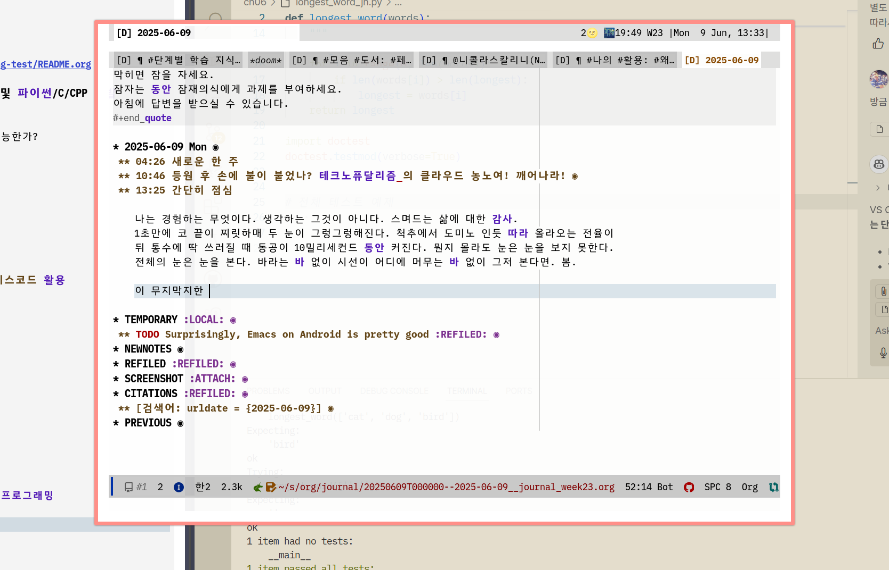
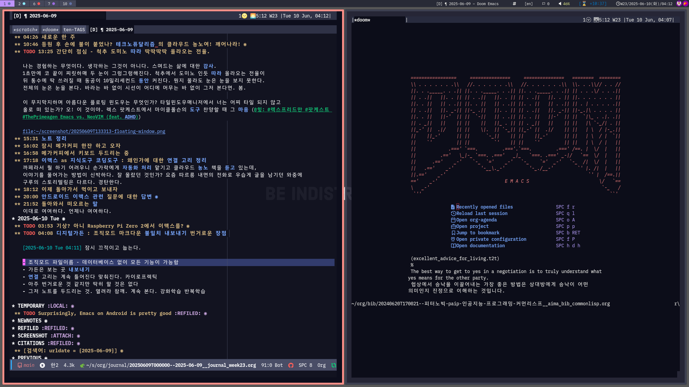
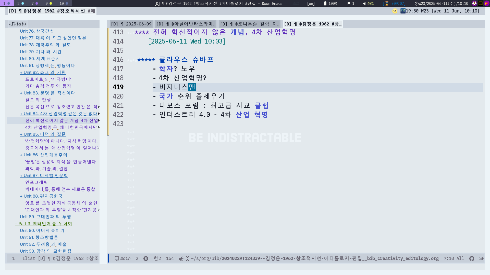
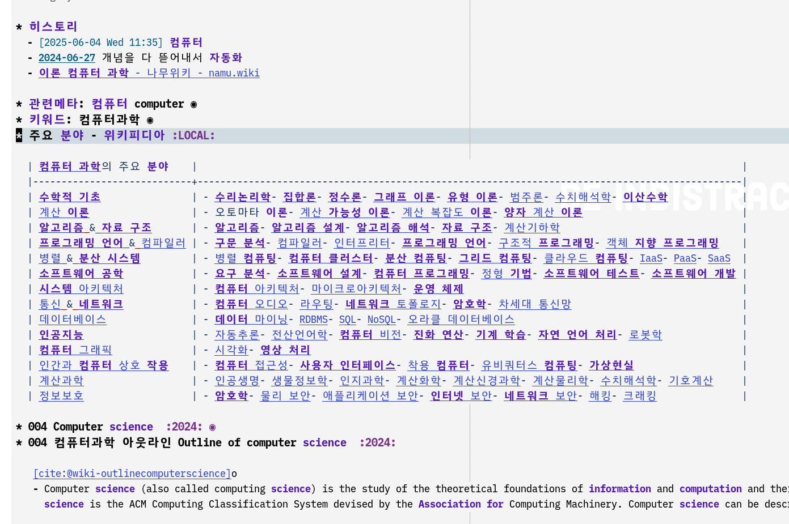
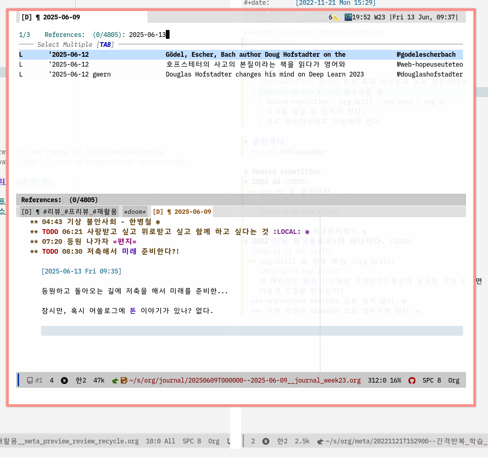
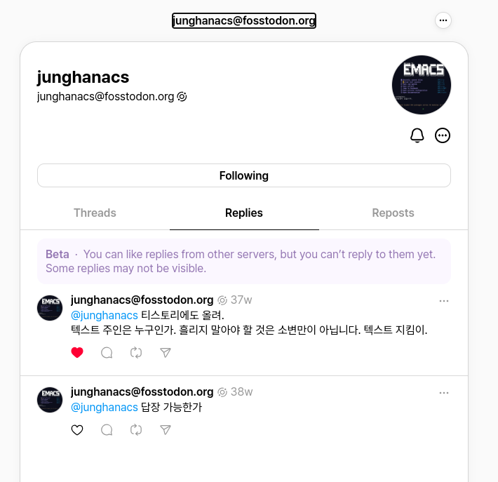
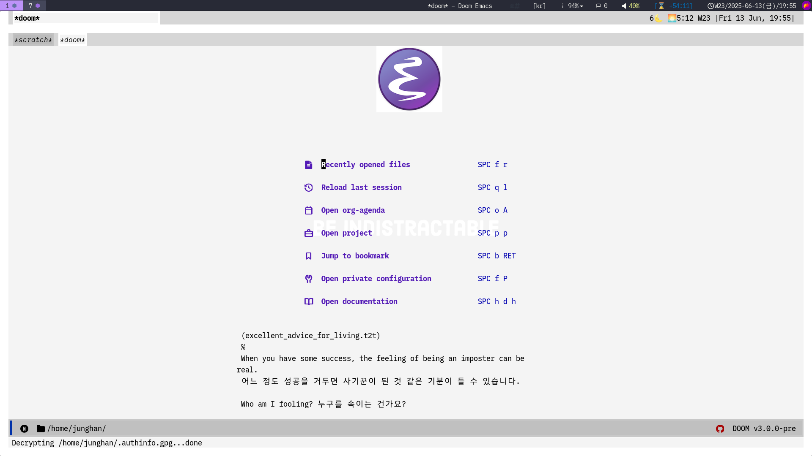

<!-- gid:20250609T000000 -->
[TOC]

Table of Contents

- [2025-06-09 Mon](#2025-06-09-mon)
- [2025-06-10 Tue](#2025-06-10-tue)
- [2025-06-11 Wed](#2025-06-11-wed)
- [2025-06-12 Thu](#2025-06-12-thu)
- [2025-06-13 Fri](#2025-06-13-fri)
- [2025-06-14 Sat](#2025-06-14-sat)
- [2025-06-15 Sun](#2025-06-15-sun)
- [NEWNOTES](#newnotes)
- [REFILED](#refiled)
- [SCREENSHOT](#screenshot)
- [CITATIONS](#citations)
- [PREVIOUS](#previous)
- [<span class="org-todo todo NEXT">NEXT</span> ](#d41d8c)

<!--endtoc-->

[[TIP("인용")]] (excellent_advice_for_living.t2t)<br /> When you are stuck, sleep on it. Give your subconscious an assignment while you sleep. You’ll have an answer in the morning. 막히면 잠을 자세요. 잠자는 동안 잠재의식에게 과제를 부여하세요. 아침에 답변을 받으실 수 있습니다. [[/TIP]] 2025-06-09 Mon 04:26 새로운 한 주 10:46 등원 후 손에 불이 붙었나? 테크노퓨달리즘의 클라우드 농노여! 깨어나라! (야니스 바루파키스 2024) [오드리탕 다원성 해커문화 대만디지털장관 혁신 사고력](https://notes.junghanacs.com/bib/20241004T141503/)의 고민이 문득 떠오른다.

### <span class="org-todo todo TODO">TODO</span> 13:25 간단히 점심 - 척추 도미노 따라 딱딱딱딱 올라오는 전율.

나는 경험하는 무엇이다. 생각하는 그것이 아니다. 스며드는 삶에 대한 감사. 1초만에 코 끝이 찌릿하매 두 눈이 그렁그렁해진다. 척추에서 도미노 인듯 따라 올라오는 전율이 뒤 통수에 딱 쓰러질 때 동공이 10밀리세컨드 동안 커진다. 뭔지 몰라도 눈은 눈을 보지 못한다. 전체의 눈은 눈을 본다. 바라는 바 없이 시선이 어디에 머무는 바 없이 그저 본다면. 봄.

이 무지막지하며 아름다운 플로팅 윈도우는 무엇인가? 타일윈도우매니저에서 너는 어찌 타일 되지 않고 홀로 떠 있는가? 오! 이 것이야. 렉스 팟케스트에서 마이클폴슨의 도구 찬양할 때 그 마음 ([힣: 렉스프리드만 팟케스트 ThePrimeagen Emacs vs. NeoVIM (feat. ADHD)](https://notes.junghanacs.com/notes/20250326T135916/))



### 15:31 노트 정리

### 16:02 잠시 메가커피 한잔 하고 오자

### 16:58 메가커피에서 키보드 두드리는 중

### 17:18 이맥스 as 지식도구 코딩도구 : 왜인가에 대한 연결 고리 정리

까페라서 뭘 하기 어려우니 손가락에게 자동화 처리 맡기고 클라우드 농노 책을 듣고 있는데, 이야기를 풀어가는 방법이 신박하다. 잘 몰랐던 것인가? 요즘 따르릉 내면의 전화로 우습게 글을 남기던 와중에 구루의 스토리텔링은 다르다. 경탄한다.

### 18:12 이제 돌아가서 먹이고 보내자

### 20:00 안드로이드 이맥스 관련 질문에 대한 답변

걸어다니며 휴대폰으로 링크로 답변. 텍스트 넝쿨이 뭐 이리 많은지...

### 21:52 돌아와서 떠오르는 말

이대로 여여하다. 언제나 여여하다.

## 2025-06-10 Tue

[[TIP("인용")]] (excellent_advice_for_living.t2t)<br /> You don’t marry a person you marry a family. 한 사람과 결혼하는 것이 아니라 한 가족과 결혼하는 것입니다. [[/TIP]] <span class="org-todo done DONE">DONE</span> 03:53 기상? 아니 Raspberry Pi Zero 2에서 이맥스를? <span class="org-todo todo TODO">TODO</span> 04:08 디지털가든 : 조직모드 마크다운 불일치 내보내기 번거로운 장점 [2025-06-10 Tue 04:11] 잠시 끄적이고 눕는다. - 조직모드 파일이름 - 데이터베이스 없이 모든 기능이 가능함 - 가든은 보는 곳 내보내기 - 연결 고리는 계속 틀어진다 맞춰진다. 카이로프렉틱 - 아주 번거로운 것 같지만 딱히 할 것은 없다 - 그저 노트를 두드리는 것. 열려라 참깨. 계속 본다. 강화학습 반복학습 스크린샷 : 쓰고 내보내고 [2025-06-10 Tue 04:12] 터미널 이맥스 띄워놓고 내보낸다. 흘러가는 제목만으로 놓친 무언가가 보인다. 아니 보일 수도 있다. 오. 허욱?! 아하. 뭐지? 그래 맞다.  06:52 아침 식사 - 업데이트 <span class="org-todo todo TODO">TODO</span> 09:57 에브리웨어 컴퓨팅 - 가트너 10년 전에 대학원에서 과제 제안서를 쓸 때 에브레웨어 컴퓨팅을 떠들었던 기억이 난다. 엄청난 분량의 제안서는 물론 디지털가든에 없다. 여기에 있는 노트들은 2022년 이후에 작성 된 것들이다. 그러니 에브리웨어 컴퓨팅은 이 곳에 없던 이야기다. 아이오티를 말하는 것인가? 아니다. 서페이스 컴퓨팅이 더 비슷할 것이다. 왜냐면 SF영화의 라지 디스플레이오 사방이 채워진 공간을 상상했기 때문이다. 테이블탑, 디스플레이월 뭐 이런 것들. 개인 디바이스 하나에 나의 알짜가 다 들어있고 음성도 좋고 손맛에서 생각이 나온다면 키보드 하나 정도는 들고 다님직하다. 바닥 투사하고 센싱하는 키보드도 있었지만 요즘에는 그런 것들은 인공지능에 휩쓸려 갔는지 안만드는 것 같다. 아무렴. 라즈베리 파이 키보드 모델은 만저 본적은 없지만 싱글모드컴퓨터로써 매력이 있다. 차기 모델이 나온다면 아마 쓸모가 확 올지 모른다. 과정 없이 어떻게 물건이 나오겠는가? [라즈베리파이 일체형컴퓨터 휴대용 키보드 교육 디바이스](https://notes.junghanacs.com/bib/20250424T105102/)

어디를 가든 디스플레이는 만나기 쉽다. 벽면이 디스플레이 커튼도 어색하지 않다. 아무렴 나를 담은 시큐어한 디바이스와 거기 담은 기록들을 투사하고 입력할 작은 디바이스.

라즈베리파이 파운데이션. 킵고잉.

교육을 위해서라도 뭐 꼭 클라우드 영지에 접속을 해야하나? 위키피디아를 오프라인으로 다운받아도 10GB면 충분하다. ([키윅스: 오프라인 위키백과](https://notes.junghanacs.com/notes/20240413T154139/)) 거기에 온디바이스 AI를 로컬에서 동작 시킨다면 배움에 있어서 클라우드 농노를 벗어날 수 있으리라.

왜 이야기가 여기로 왔지? 아무튼 에브리웨어 컴퓨팅을 추가하자.

### <span class="org-todo todo TODO">TODO</span> 10:40 인공지능 학습 1강완성 점진적?!

[2025-06-10 Tue 12:29] 뭔들 그렇게 못하겠는가? 지루하니까 1강완성하고 살 붙여가는 시스템을 고민해보라. 12:28 자동완성 스니펫 관련 문서 검토 16:15 기쁨 속의 고요함 기쁨에 더해 한 없이 고요하다. 무엇을 할 것인가? 무엇을 더 할 것인가? 아니. 그냥 하던거 하면 된다. 17:03 프롬프트 엔지니어링 가이드 - [모음: 개발자 프롬프트 엔지니어링 가이드](https://notes.junghanacs.com/notes/20241212T140836/)

### 18:13 저녁식사

### 19:46 새로운 도서 작가 관리 - 십진분류 묶음

### 21:25 자야지

## 2025-06-11 Wed

### 00:30 잠시 깸

### 05:56 기상

### 06:06 에이전트 @톰타울리 새책

(톰 타울리 2025)

### 08:28 아파트 정원에서 기다리는 중

### 09:53 수원역 스타벅스

어슬렁거리는 자의 노트북 글장난

### 10:11 정운 삼촌 멋진분

책이 너무 좋아. 내용이며 글이며 사진이며. 영혼이며. 요즘 뭐 하시나? 무슨 글 쓰시나? [전체상 큰그림](https://notes.junghanacs.com/meta/20250315T162718/)을 좀 열어 주셨으면 하는데?



### 10:58 내부링크 수정 필요 - 테스트

### 12:25 마크다운 모드 왜이러는거야?

### <span class="org-todo todo TODO">TODO</span> 13:55 스타필드 왔다 - 마크다운 문제부터 풀자

-   마크다운 문제는 왜 인가? 뭐가 문제인가?
-   toc 함수에서는 된다. 검토 바란다

### <span class="org-todo todo TODO">TODO</span> 15:10 이거야 소셜한 페이지 이렇게 가야지. 아름답다

(“Wai Hon, @Whhone@Social.Whhone.Com” 2024)

엑티비티펍으로 내 소셜을 링크하면 된다. 그렇게 해서 RSS로 내보내기 하면 된다.

### 15:11 아무래도 칠보에 가는게 좋겠지?

어떻게 가는게 좋을까? 유치원에가는게 좋겠다.

### 15:19 나가자 19:03 칠보에서 온생명이와 즐거운 시간

### 21:55 자야한다

## 2025-06-12 Thu

[[TIP("인용")]] (kevin-kelly-99.t2t)<br /> Advice like these are not laws. They are like hats. If one doesn’t fit, try another. 이런 조언들은 법률이 아닙니다. 그들은 모자와 같습니다. 맞지 않다면 다른 걸 시도해보세요. [[/TIP]] 04:50 기상 자각몽인가 온생명 미술관, 축구 05:48 톰새디악 선생님 [톰새디악 두려움과의 대화 아이엠 - 짐캐리](https://notes.junghanacs.com/bib/20241117T100113/)

### 06:36 분야에 대한 생각

[2025-06-12 Thu 06:35] 키워드가 아직 용어사전에 안잡힌게 많이 있다. [컴퓨터과학](https://notes.junghanacs.com/meta/20240627T084958/)



### 07:21 나가야 한다

### 10:23 오전 루틴 완료

### <span class="org-todo todo TODO">TODO</span> 11:30 택소노미 기본

#### Taxonomy 101: The Basics and Getting Started with Taxonomies

(“Taxonomy 101: The Basics and Getting Started with Taxonomies” 2014)

Taxonomies help enterprises make their information accessible. Find out how taxonomies can help executives, analysts, sales and support staff, and customers find and use the right information efficiently and effectively.

### <span class="org-todo done DONE">DONE</span> 11:37 융jung **젊음**이며 기존 질서의 거부와 혁신

[2025-06-12 Thu 11:33] 이게 무슨 장난인가? 융에 젊음이라는 뜻이 있었다니 그리고 이것의 의미가 이렇게 깊을 수가! 혁신 아닌가! > > > 이때부터 융jung 젊음이라는 단어가 기존 질서에 대한 거부와 혁신의 상징처럼 사용되기 시작했다. > > - 창조적 시선 김정운 [힣: 그의 이름의 기원 칼융 혁신 한글 어린이 초인](https://notes.junghanacs.com/notes/20241223T233230/)

### 13:08 컴퓨터로 철학하기 오!

[변정수 철학 - 컴퓨터 알고리즘 - 파이썬](https://notes.junghanacs.com/bib/20250601T140603/)

### 15:26 온생명이 데릴러 가며 오며 생각

### 19:39 아이를 생각하며

### 22:11 삶은 언제나 여여하다

## 2025-06-13 Fri

[[TIP("인용")]] (excellent_advice_for_living.t2t) The main thing is to keep the main thing the main thing. 가장 중요한 것은 가장 중요한 것을 가장 중요한 것으로 유지하는 것입니다. [[/TIP]] 04:43 기상 불안사회 - 한병철 (한병철 2024b) 선생님은 제 등불입니다. 등불?! 이 단어는 어디서 온 것인가? 아?! 근데 들어가며가 3시간이네?! 아직도 뭐라 말하네! 와 역시 한선생님은 달라. 들어가며에 모든 것을 털어 넣는구나. 멋진 분. 1강완성의 정신이다. 헉. 희망의 정신 벤야민이 뭐시리 나오네? 나마스떼 07:20 등원 나가자 `편지` <span class="org-todo todo NEXT">NEXT</span> 08:30 [돈] 저축해서 미래 준비한다?! 호프스테터 [2025-06-13 Fri 09:35] 등원하고 돌아오는 길에 저축을 해서 미래를 준비한... 잠시만, 혹시 **어쏠로그**에 돈 이야기가 있나? 없다. 뭐니뭐니해도 머니. 그래. 이 글 시작한지 3분 지났다. 우측 상단에 표기 된다. 4분 됬다. 더치 라이온킹 - 서클오브라이프 그래. 등원하고 뚜벅이로 걸어오는데 매번 느끼지만 더치다. 영화 1984에서 고문 받은 뒤에 시골길에 덩그러니 버려져 피 뚝뚝흘리면서 걸어가는 장면이 기억난다. 비할 바는 아니지만 더치다. 그러면서 아! 예전에 노비, 노예를 소유한 누구로 살면서 악독하게 대한 것에 대한 일종의 귀여운 앙값음인가? 이정도면 앙앙하는 수준이지. 예전? 힣은 전생은 기억한다는 말인가? 그런 것은 아니다. 라이온킹에 주제가 서클오브라이프으로 전체를 바라본다면 실로 아닐 것도 없는 말이다. 물론 뭐 이렇게 생각하며 살지 않는다. 분노가 전신을 휩쓸 때 찰나에 떠오른 무언가다. 그리곤 웃었다. 그래. 아주 악독했다보군! 정신 승리인가? 아니 그런 생각 조차 없다. 그럴 필요 없다. 영화 1984의 장면인가? 아니다. 온갖 관계에서 더치를 경험하고 지내지 않는가? 아무렴 오늘을 태워버리고 싶지 않다. 힣은 사실 나약하다. 약함을 잘 안다. 호프스테터 사고의본질 유추 모국어 - 영어 - 메타노트 [2025-06-13 Fri 09:58] [호프스태터 에마뉘엘상데 사고의본질 유추 지성 범주 개념](https://notes.junghanacs.com/bib/20240518T051525/) 이 책을 틈틈히 누워서 듣고 있다. 서론만 몇 번째 듣고 있다. 진도가 안나간다. 일부 스며드는 것 같기도 하다.

무슨 소리인가? 요즘 메타노트를 굉장히 많이 수정하고 있다. 언제부터인가 한글과 영어 사이의 관계에 대한 이야기다. 이 관계는 그 자체가 유추라고 보고 있다. 모국어가 한글인 힣은 영어 단어 하나에도 한글 단어가 수도 없이 쏟아져 나온다. 떠오르는 한글 단어는 그냥 떠오른 단어다. 영어 단어와 의미가 맞지 않을 수도 있다. 하지만 힣의 뇌는 그런 방식으로 동작한다.

그렇다면 이 단어들은 힣에게는 하나의 개념에서 유추되는 단어들이다. 묶어 주면 좋을텐데? 이럴 때 영어가 역할을 해준다. 모국어의 넓은 어휘 세상을 어쩔 수 없이 빈약한 영어로 담을 수 있다. 담는다? 어떻게? 힣은 영어를 태그로 사용한다. 예를 들자면 이런 것이다([감정: 분노부정두려움번거수고귀찮사사불편함거북함거부](https://notes.junghanacs.com/meta/20240426T155210/))

그렇다. 이 노트 자체는 내용이랄게 없다. 메타노트 아닌가? 이런 주제의 노트들을 끌어오는 자석과도 같다. 이에 대한 이야기는 이미 써 놓았다. 써 놓은 줄도 몰랐는데 있다. 뭐지? 잠시... 멘붕...

힣이 쓴 것이다. AI는 **로그**라는 헤딩레벨 아래에 작성하도록 나름 제한하고 있다. 왜?! 손맛이 곧 영감의 원천이라고 믿기 때문이다. ([다마지오 마뚜라나 바렐라 자기생성 인지 앎의나무 구성주의 신경생물학](https://notes.junghanacs.com/bib/20241220T125706/)) 아무튼 여기에 있다. ([힣: 메타노트 - 흔적 업데이트 - 동적블록 - 콘텐츠 지도](https://notes.junghanacs.com/notes/20250423T122956/))

물론 이런 개념을 물어도 봤다. 걸어가다가 질문 던졌는데 제대로 보진 않았다. (질문: 호프스테터의 사고의 본질이라는 책을 읽다가 영어와 한국어 단어 사이에도 유추의 개념이 적용되는 것 같아 (“호프스테터의 사고의 본질이라는 책을 읽다가 영어와 한국어 단어 사이에도 유추의 개념이 적용되는 것 같아” n.d.))

#### @호프스테터 인공지능 오늘과 미래 - 염려

[2025-06-13 Fri 10:31] 그렇다면 호프스테터 선생님 인공지능에 대해서 뭐라고 하시는가? 걱정이 크시다. 옮겨적지는 않으련다. - Gödel, Escher, Bach author Doug Hofstadter on the state of AI today (<i>Gödel, Escher, Bach Author Doug Hofstadter on the State of Ai Today</i> n.d.) - Douglas Hofstadter changes his mind on Deep Learning &amp; AI risk (June 2023)? (gwern 2023) 이제 머니 돈 이야기를 해본다 - [2025-06-13 Fri 10:38] 뭐니 뭐니? 머니 - [2025-06-13 Fri 22:24] 머니 이야기를 담지 못했네. 지금 시점에 담을 본짓에 집중하고 싶다. 머니로 무엇을 할 수 있는가 모르겠다. 엄청난 머니도 아니고 말이다. 이동하면서 링크를 조테로에 넣어두고(캡처) 지금 여기에 넣기 [2025-06-13 Fri 09:42] - 로그시크, 옵시디언에서도 다 하던 것. 자연스러운 것. 오늘 담은 링크를 선택 후 넣기. - 티가 나지 않지만 이 아름다운 Floating 창이여! **Win+m** 을 누르면 떡 나타나는 마법 같은 녀석  09:30 등원 다녀와서 11:35 삶은 쉽다 아니면 어렵다 12:57 괜찮아 이 또한 지나가리라 13:38 칸딘스키 내적 필연성 15:19 나가수 `김어준` 딴다라 목숨건 이들의 삶에 대한 경탄 15:53 나가자 태권도장으로! 온생명이를 만나러! <span class="org-todo todo TODO">TODO</span> 17:00 스레드 댓글 라즈베리파이 인디웹 관련 [2025-06-13 Fri 22:16] 추가 부탁합니다 몇개 글 올렸다. 아이 기다리면서 댓글도 달았다. 추가 바랍니다. 18:30 비가 온다. 어버버하다가 아이를 안고 수원역으로 갔다. <span class="org-todo todo NEXT">NEXT</span> 19:58 수원 롯데몰 - 온생명이와 둘이 돈까스와 우동을 먹으며 - 인생은 아름다워 귀도 아이와 함께 있다. 옆에 있다. 바로 옆에 말이다. 같이 있을 때 한 없이 마음이 무너질 때가 있다. 아무렴. 그럴 때 마다 생각나는 사람. 영화 인생은 아름다워의 주인공 귀도를 생각한다. ([로베르토베니니 인생은 아름다워 귀도 - 유대인 수용소 - 나치 영화](https://notes.junghanacs.com/bib/20250417T162438/))

영화의 끝자락. 귀도는 아이를 소화전 같은 곳에 숨겨두고 마지막 발걸음을 걷는다. 뒤에는 나치 대원이 총을 겨누고 있다. 연합군이 밀려 오고 있을 때 실제로 나치는 그렇게 했다. @빅터프랭클의 죽음의 수용소에서도 이 이야기가 나온다. ([빅터프랭클 죽음의 수용소에서 로고테라피 삶의철학](https://notes.junghanacs.com/bib/20240318T170125/))

귀도는 아들이 있는 소화전 앞을 지난다. 아이가 보고 있음을 알기에 과한 발걸음으로 멋지게 걷는다. 아. 프로이센 제국의 제식훈련 이야기가 확 올라오네? (#유추 #사고의본질 @호프스테터) 그리고 어둠으로 사라진다. 빵빵. 다음 날 연합군 탱크가 들어온다. 아이는 소화전에서 나와서 아빠 함께 한 게임을 승리로 마친다.

[2025-06-13 Fri 22:12] 책상에 앉아서 이야기를 더한다. 근데 아빠는 어디에?! 아빠는 먼 길을 떠났다. 세월이 지났다. 아. 귀도인가? 아니다. 아이가 어른이 된 것이다. 평화로운 나날이다. 거닐다가 소화전에 시선이 멈춘다. 아. 이거슨? 그 찰나에 아빠와 공명한다. 아빠가 마지막으로 아들을 보았던 시선으로 말이다. 삶은 여여하다. 언제나 여여하다. ([영감부싯돌찰나순간불꽃등불](https://notes.junghanacs.com/meta/20240522T142745/))

### 22:18 하루를 정리한다 - 행복방정식

요즘 두통이 심하다. 그럴 때는 눈감고 책을 듣는 것도 쉽지 않다. 흘려보내는 것. 돌아오는 길에는 말이다. 삶에 전적으로 항복한다. 문득 한 사람 @모가댓 떠오른다. 이 사람 말이다. 밀리의 서재에 (모 가댓 2017) 행복을 풀다가 있다. 오. 에필로그의 글이 다시 듣고 싶었다. 그래서 들었다. ([모가댓: 행복방정식 스승 공존](https://notes.junghanacs.com/bib/20240823T175024/))

무엇을 할 수 있는가? 삶에 무엇을 요구할 수 있는가? 삶이 나에게 무엇을 말하고 있는가? 이렇듯 @빅터프랭클의 외침이 멀리서 들려온다.

## 2025-06-14 Sat

[[TIP("인용")]] (excellent_advice_for_living.t2t)<br /> To build strong children reinforce their sense of belonging to a family by articulating exactly what is distinctive about your family. They should be able to say with pride “Our family does X.” 자녀를 강하게 키우려면 가족의 특징을 정확히 표현하여 가족에 대한 소속감을 강화하세요. "우리 가족은 X를 합니다."라고 자랑스럽게 말할 수 있어야 합니다. [[/TIP]] 05:12 기상 - 꿈 - `관조하는 삶` - 닭 힣 존재의 외침 - 나와보니 있다 [2025-06-14 Sat 05:20] 거칠었다. 근데 꿈은 사라졌다. 기억이 나지 않는다. 후우. 자각몽도 아니다. 꿈이 곧 현실이었다. 꿈인줄도 모르고 꿈에 있었다. 그리고 관조하는 삶. (한병철 2024a) 한병철 님의 책이다. 좋다. 강하다. 머리로 쓴 것인가? 아니면 존재가 뿜어낸 것인가? 둘다인가? 아무렴 어떤가? 머리로 읽으려면 읽히지 않는 책이다. 정령 그렇다. 근데 멀리서 눈을 감고 들어보면 들린다. 뚫고 있구만. 아무렴 어떤가? 키보드 그만 치고 정리하지 말고 잠시 아재의 글을 들어봐야겠다. 멀리서 개구리 소리와 숫닭의 외침이 드리운다. 외침? 뭐라고 하는가? 닭이 외친다. [[TIP("인용")]] 나는 꼬끼오!! 외친 적이 없다. 그렇게 적지 말라. 나의 말을 들으라! 존재로 들어보라! "있다! 여기 있다! 너가 있듯이 나도 있다! 나도 삶을 경험하고 있다! 이렇게 외친다! 좋은 아침!!!" [[/TIP]] 놀랍다. 있다. 온갖 소리 말이다. 새소리가 들린다. 저걸 위해 힣이 뭘 해준게 있는가? 없다. 근데 있다. 각자 있다. 있지 않는가? 개소리 새소리 닭소리 다 있지 않는가? 아니 뭔지 모를 소리도 많다. 타이머와 루프로 반복하는 소리인가? 아니다. 저도 나도 이도 무도 있다. 있음. 여기에 힣은 아무것도 한 것이 없다. 그저 있다. 있어 왔고 있어 준다. 선물이다. 힣도 선물이다. 서로가 선물이다. 의도한 바 나온 '나'는 없다. 나와보니 있다. 그렇다면 경험하는 것만 있다. 달리 갈 곳이 없다면 존재함에 감사할 뿐. 더 무엇이 없다. [2025-06-14 Sat 05:52] 눈 감고 들어본다. 관조하는 삶, 무위를 [한병철 피로사회 정보의지배 관조하는삶 무위](https://notes.junghanacs.com/bib/20241024T144516/)

### 07:45 @세스고딘 아 맞다 이 사람

(세스 고딘 2019)

### 07:48 @캐스선스타인 유명 무명

(캐스 R. 선스타인 2025)

[캐스선스타인 동조 TMI 넛지 유명 페이머스 명성 행동과학](https://notes.junghanacs.com/bib/20250218T224752/)

### <span class="org-todo done DONE">DONE</span> 07:52 #버그픽스 citar-denote-find-citation

(“Citar-Denote-Find-Citation: Symbol’s Function Definition Is Void: Denote-Link–Find-File-Prompt · Issue \#49 · Pprevos/Citar-Denote” n.d.) <https://github.com/pprevos/citar-denote/issues/49>

citar-denote-find-citation: Symbol’s function definition is void: denote-link--find-file-prompt [2 times] ```text
@@ -552,7 +552,7 @@ (defun citar-denote-find-citation (citekey)
                          (denote-extract-id-from-string
                           (if (= (length files) 1)
                               (car files)
-                            (denote-link--find-file-prompt files)))))
+                            (denote-select-linked-file-prompt files)))))
              (goto-char (point-min))
              (search-forward citekey))
     (message "No citations of %s found in Denote files" citekey)))
@@ -661,7 +661,7 @@ (defun citar-denote-find-reference ()
            (files
             (find-file (denote-get-path-by-id
                         (denote-extract-id-from-string
-                         (denote-link--find-file-prompt files))))
+                         (denote-select-linked-file-prompt files))))
             (goto-char (point-min))
             (search-forward citekey))
            ((null citekey)
``` 08:09 어쏠로지 - 편집하지 말고 그냥 어쎈틱한 날것 전체상을 보여달라 왜 편집을해? 편집은 인공지능이 전문인데. 그게 창조야? 이리저리 찔러대는 책이 당신이야? 그게 전체야? 진짜는 뭐야? 진실은 지금 당신 전체 상이야. 그걸 줄수 있어? 모두에게? 너무 많아서? 너무 적어서? 부끄러워서? 그럴 것도 없고. 오늘의 전체상을 내어줘. 오늘 오늘 뿐이야. 내일? 내일도 오늘일 뿐이야. 오늘의 것을 남기는 것 뿐이야. 그렇다면 두려워할 것도 없어. 어쏠로지. 모두가 저자다. 삶의 저자. 날것 그대로 가보자! 10:01 [정신스트레스방어기제이타심승화](https://notes.junghanacs.com/meta/20240531T133419/) 이 주제 훌륭하다.

노트를 하나 쓰고 싶다.

### 10:28 [이맥스지식그래프](https://notes.junghanacs.com/meta/20230223T053200/) 올드 노트 정리

### 10:49 벵하민 과학소설 들으면서 주말

(벵하민 라바투트 2022) [벵하민라바투트 과학소설 불꽃 매니악 부커상 스토리텔링](https://notes.junghanacs.com/bib/20250607T073925/)

### <span class="org-todo todo TODO">TODO</span> 11:14 2084 - 1984 100년 이후

#### 2084

(부알렘 상살 2017)

-   2084: The End of the World
-   부알렘 상살 {강주헌} 2017

조지 오웰 『1984』이후 100년의 이야기! 조지 오웰의 『1984』, 올더스 헉슬리의 『멋진 신세계』를 이어갈 새로운 디스토피아를 그린 소설『2084』가 아르테에서 출간되었다. 『2084』는 유일신을 숭배하는 대제국 '아비스탄'을 중심으로 종교적 신념이 모든 것을 통제한 디스토피아를 생생하게 재현해냈다. 발표와 동시에 이슬람 극단주의와 맞물리면서 화제작으로 떠올랐고 수많은 문학상 후보로 선정되었다. 2015년 아카데미 프랑세즈 소설 부문 대상을 수상하고, 프랑스 문학잡지 《리르》에서 올해의 책으로 선정되기도 했다. 그 후 프랑스 최고 문학상이라 일컬어지는 공쿠르상 후보에 오르며 프랑스 독자에게 큰 주목을 받음과 동시에 세계 언론의 찬사를 받았다. 부알렘 상살은 지속적으로 작품을 검열당하면서도 알제리에 거주하며 현 체재를 적나라하게 고발하는 글을 발표하고 있다.

##### 인물소개

1949년 알제리 북부의 작은 마을에서 태어났다. 공학과 경제학을 공부한 후 알제리 산업부 고위 공무원으로 재직하며 소설을 쓰다가, 50세가 되어 은퇴한 후부터 본격적으로 작품활동을 시작했다. 1999년 발표한 데뷔작 『야만인들의 맹세(Le serment des barbares)』로 젊은 작가들에게 수여하는 상인 ‘첫 소설 상’을 수상했으며, 이 소설은 영화로도 만들어졌다. 『다윈 거리(Rue Darwin)』로 2012년 갈리마르 출판사 아라빅 소설상 수상자로 선정되었으나, 상의 후원자인 아랍권 대사들의 연합회에서 저자의 예루살렘 국제 작가 페스티벌 참가 사실을 구실로 수상을 취소했다. 상살은 지속적으로 작품을 검열당하면서도 계속 알제리에서 거주하며 프랑스어로 소설을 쓰고 있다. 2007년에는 베를린에서 열린 국제 문학 축제에서 자신이 “고국에서 유배당한 작가이며, 알제리는 이슬람 극단주의의 요새가 되어가고 있다.”라는 견해를 밝힌 바 있다. 2011년에는 독일 북트레이드 평화상을 수상했다

### <span class="org-todo todo TODO">TODO</span> 12:27 쿼츠 고수들 페이지 다시 검토해줘 - #인박스 삭힌 것들 엄청 많다

(“Toward Rss Be-Far 쿼츠” 2024)

-   [뉴스피드구독](https://notes.junghanacs.com/meta/20230927T120800/)

같은 질문인데 예뻐. 어떻게 인박스에 있어 다음으로 옮겨야 함

-   [모음: 디지털가든 브레인덤프](https://notes.junghanacs.com/notes/20241010T061440/)

#### <span class="org-todo done DONE">DONE</span> Remark42 – Privacy-focused lightweight commenting engine | Remark42

### 17:42 수학책 번역서의 한계 수식 입력이 가능해야

[2025-06-14 Sat 17:41] 번역에 대한 회의가 든다. 용어가 뒤틀려 버리니까. 원문을 구해서 보는게 좋다. 특히 수식을 손 댈 수가 없으니까 말이다. 역시 이맥스 스타일로 가는게 맞다. 18:09 페디버스 쓰레드 RSS 주소 점검 20:58 식사 후 복귀 2025-06-15 Sun [[TIP("인용")]] (excellent_advice_for_living.t2t)<br /> It is not hard to identify a thief: It is the one who believes that everybody steals. 도둑을 식별하는 것은 어렵지 않습니다: 모든 사람이 도둑질한다고 믿는 사람입니다. [[/TIP]] <span class="org-todo todo TODO">TODO</span> 04:16 기상 - 주제 각각에 대한 히스토리를 담는 것의 의미 - 어쏠로지 관점 [2025-06-15 Sun 04:28] 하나 주제에 대한 생각은 계속 쌓이고 확장한다. 그 과정이 한 인간에게는 전부다. 성장이랄 것도 없다. 변화. 생동하는 것. 대학을 다닐 때 모 기업에서 오신 분이 강연을 했다. 외부 전문가 초청 뭐 그런 것 말이다. 첫 페이지가 v1.4 이런게 있었다. 그리고 지저분하게도 그간 수정 사항이 파워포인트에 그대로 있었다. 뭐 특별한 것도 아니긴하다. 지금에 와서 말이다. 스마트폰 없을 때 일이다. 당시에는 새로웠다. 버전 관리 자체는 교열 초판 뭐 낯선 개념도 아니다. 근데 전체 앎을 통으로 버전관리를 하는 것은 전체상. 있음. 그게 나. 나~ 이런 사람이야~~~~ 이런 노래 가사도 떠오른다. 디지털 트윈. 아 문장을 쓴다는게 번거롭다. 품이 많이 든다. 끌려나오는 단어를 뿌리자. 인공지능도 뭐 다음 단어 앞단어 때려맞추는게 아닌가. 그러고 보면 나도 다음 단어 개소리 나오는거 보면 뭐 다른가 싶네 하나둘셋. 기다려보자. 뭐가 떠오르는가? [[TIP("주의")]] - A 쉬불넘아 그냥 관조하는 삶 한선생님 책 들어라. - B 네 [[/TIP]] 그래. 너무 이르다. 온통 세상에 꼬기오!! 내가 있다!! 라는 닮들의 외침 뿐이다. 저 정도 데시벨로 외치려면 이거참 아침 많이 먹어야 할 것 같다. 이르되 이르도다. 아무렴. [2025-06-15 Sun 04:47] 이르다. 한선생님 책은 어짜피 눈으로 봐서 아해이오우다. 이상의 오감도. 건축육면각체 뭐라. 칸딘스키. 이튼. 바우하우스. 갑자기 정운 아재책이 또 올라오네. 바우와우라는 멍멍이가 있었던가? 그거 만화인데 점박이 멍멍이. 바우하우스 바우와우. 그러면 관조하는 삶. 이 책은 책으로 낼 것은 아닌듯. 책에 사이에 책 값을 넣어서 독자들에게 줘야 한다. 자기가 되는 길을 터치하는 책들은 본인이 그것을 구하매 본인의 것이 아닌지라. 받은 것임에. 돌려줘야 한다. 그렇게 해야 이런 책은 독자에게 전달이 된다. 이것도 책이요 저것도 책이요 하듯 찍어낸 책이라는 틀로는 본질이 전달이 될 수 없다. 왜? 밑줄긋고 공부해야할 것 같잖아. 돈들어 산 종이 책. 말이여. 그냥 뿌려야된다. 돈을 오히려 주고. 줄 돈 없으면. 산돈은 도로 주든가. 이 책은 바로 저 입니다. 내가 되는 일로 어떻게 돈을 받으리오. 그러치. 이미 써놨지. 이 거 말이여. [힣: 삶 일 소명 운명애 월급 - 나 자신이 된 일에 보수를 받다니](https://notes.junghanacs.com/notes/20250316T044013/)

### 06:12 프로피디아 파트1-10

[1 프로피디아: 지식의개요](https://notes.junghanacs.com/meta/20250420T152816/)

### 08:04 Terence Tao: Hardest Problems in Mathematics, Physics &amp; the Future of AI

(<i>Terence Tao: Hardest Problems in Mathematics, Physics &#38; the Future of Ai | Lex Fridman Podcast \#472</i> n.d.)

### 08:19 코드 기본 검증 : 도구 별로

이 부분은 하나의 문서로 둘다 같이 하면 되는데 이건 엑서시즘에서 했던 것이기도 하다. 근데 좀 더 공식적인 방법이 필요하다.

### 12:16 아이고 허리야

### <span class="org-todo todo TODO">TODO</span> Fediverse, Threads, RSS 연결 확장 #조테로

(“Rss on Mastodon and the Fediverse | Fedi.Tips – an Unofficial Guide to Mastodon and the Fediverse” n.d.)

텍스트를 흘리지 맙시다. 누굴 위해서? 자신을 위해서.

스레드에서 제 페디버스 계정을 친추 할 수 있어요.

Mastodon(fosstodon) - fediverse Threads에서 Fediverse 계정도 팔로우 가능합니다. <https://www.threads.com/fediverse_profile/junghanacs@fosstodon.org>

페디버스 계정 <https://fosstodon.org/@junghanacs>

소통이 열린 기분 입니다. 그리고 페디버스 계정은 RSS로도 등록할 수 있습니다. <https://fosstodon.org/@junghanacs.rss>

지나가며 남긴 글들을 RSS피드로 모을 수 있다면, 텍스트를 흘릴 일이 훨씬 줄어들 것 같군요. 하. 나의 다모임, 프리첼, 이글루, 싸이월드 등에 남긴 흔적들이여! 오늘도 슬피 우는구나

페디버스에서 만나는 스레드 <https://fosstodon.org/@junghanacs@threads.net>

#### 스레드 페디버스 활용의 한계와 기대

[2025-06-15 Sun 12:35] - 한계가 있구먼 활용상. 적절히 쓰던대로 되는대로 - 페디버스에서 글쓴 것 여기서 확인가능한데 댓글은 안됨. 좋아요만. 기다리면 될듯. - 오픈바이브(openvibe) 앱을 사용하면 스레드와 페디버스, 블루스카이를 엮을 수 있으니까 괜찮음.  20250615T122244-zotero-rss-fediverse 조테로를 간단한 RSS로도 사용 합니다. 서지노트 관리와 다를게 없지요. ![[../images/20250615T122244-zotero-rss-fediverse.png|320]] 20250615T122517-elfeed-rss-fediverse 이맥스RSS도 좋지요. ![[../images/20250615T122517-elfeed-rss-fediverse.png|320]] 14:13 브레인워시 15:37 관조하는 삶 무위 쇼핑중독 전자책 강하다. 영성 서적이 아니다. 그런 맥락이 아니다. 그냥 막힌 것을 뚫어낸다. 전자책을 구입하고 이놈의 지름신이 꺼지지 않는구나 했다. [[TIP("노트")]] 힣은 온라인 쇼핑을 거의 하지 않는다. 돈이 없으니 안쓴다. 책은 참지 못하고 신용카드를 남발한다. 사실 힣은 약하다. 온갖 중독에 쉽게 털려왔다. 종이책은 안산다. 둘 곳이 없다. 노트북과 계절별 유니폼만 있으면 된다. 노트북 마저도 몇 년 안에 휴대폰 하나로 통합 할 수 있으리라 기대한다. 유니폼만 있으면 된다. 유니폼은 500년 전에 파리에 옥탑방에 거주하시던 오노레드발자크 선생 스타일. 하 번역서... 요즘에는 원서가 훨씬 유익하다는 생각이다. 왜 이말을? 너무 중요해서 터져나왔네. 번역을 너무 잘해주셔서 원서 단어들이 다 날라가버리는게 참 문제다. 차라리 기계 번역이 나을 때도 있다. 왜? 용어를 살릴 수 있으니까. 이 주제는 별도로 뽑아낼 것 [[/TIP]] (한병철 2023), (한병철 2024b)는 전자책 구독에 있다. 아 정보의 지배? 이건 못봤네. 버크먼의 신간에서 (올리버 버크먼 2024) 관조하는 삶을 이야기하는데 없다. 볼 수가 없었다. 뻔하지 뭐 그런 책 한 두개야? 보던 책이 500권이야. 다 본책이 없어라고 하지만 그럼에도 또 나선다. 듣는 둥 마는 둥 도통 익숙한 개념들을 박살내는 그의 칼날에 무릎을 친다. 그래 벤야민 선생님 나오신다. 오케이 벤야민 선생이 누군지 아직도 잘 모른다. 천안 버스터미널에 아우라 백화점이라고 있는데 아우리인가? 아무튼. 근데 한은 벤야민만 이야기 한다. 서사의 종말인가 그 책에서는 시작부터 끝까지 벤야민 가라사대이다. 벤야민을 모르는데 뭐 어쩌란 말이여?! 불안사회 역사서문은 보면 한의 책은 독일에서 철학서로 분류된다고 한다. 근데 한국에서는 교양서로 분류된다고 한다. 이해는 간다. 교양서로 가야 판매부수가 나올 것이다. 한은 한국이 배출한 세계적인 철학자 아닌가? 근데 친절한 철학자가 아니다. 한국인을 위한 한글책도 아니다. 그는 세계적인 철학자다. 독일말로 풀어낸다. 독일어의 그릇으로 철학을 했고 한국을 떠난지가 오래되었으니 당연하다. 스팀팩, 반짝별 파워가 끝났다. 관조모드 끝. 하아. 다시 삶의 고통이 밀려오는구나. 17:43 아버지와 3년만에 탁구 20:00 저녁 소주 한잔 - 경쟁 내면의 이끄는 삶 NEWNOTES - [최근노트 모음](https://notes.junghanacs.com/notes/20250327T125948/)

-   [LLM: 느린 편지 교환일기 (2025-06-14)](https://notes.junghanacs.com/notes/20250614T135030/)
-   #LLM: 엑티비티펍 정적 프로파일 호스팅 (2025-06-11)
-   #LLM: 정규식 query-replace 라인 끝 (2025-06-11)
-   #LLM: 이맥스 마크다운 링크 연결 테스트 (2025-06-11)

## REFILED

### <span class="org-todo done DONE">DONE</span> 생성형 AI 에이전트 구축하기: LangGraph, AutoGen 및 CrewAI

## SCREENSHOT

### Screenshots for 20250610

#### 20250610T041214-morning

![[../images/20250610T041214-morning.png|320]]

#### 20250610T114807-emacs-snippet-doom

![[../images/20250610T114807-emacs-snippet-doom.png|320]]

#### 20250610T115112-doomemacs-modules-snippets

![[../images/20250610T115112-doomemacs-modules-snippets.png|320]]

#### Screenshot_20250610_072538_aTimeLogger

![[../images/Screenshot_20250610_072538_aTimeLogger.jpg|320]]

#### Screenshot_20250610_080007_Kagi_Search

![[../images/Screenshot_20250610_080007_Kagi_Search.jpg|320]]

#### Screenshot_20250610_080015_Kagi_Search

![[../images/Screenshot_20250610_080015_Kagi_Search.jpg|320]]

[2025-06-11 Wed 09:42]

#### <span class="org-todo done DONE">DONE</span> 기계는 왜 학습하는가

### Screenshots for 20250611

### Screenshots for 20250612

#### 20250612T063440-cs-areas

![[../images/20250612T063440-cs-areas.png|320]]

#### <span class="org-todo done DONE">DONE</span> Screenshot_20250612_055337

### Screenshots for 20250613

#### 20250613T093724-hof 호프스테터

![[../images/20250613T093724-hof.png|320]]

#### 20250613T195546-whoami - 이맥스 메인



#### Screenshot_20250613_083612_Kagi_Search - 호프스테터

![[../images/Screenshot_20250613_083612_Kagi_Search.jpg|320]]

#### Screenshot_20250613_170830_Edge 네모유엑스 발표

![[../images/Screenshot_20250613_170830_Edge.jpg|320]]

#### Screenshot_20250613_175616_Firefox 나자신이되는일과보수

![[../images/Screenshot_20250613_175616_Firefox.jpg|320]]

### Screenshots for 20250614

#### <span class="org-todo done DONE">DONE</span> 20250614T115631-문자의역사

![[../images/20250614T115631-문자의역사.png|320]]

#### <span class="org-todo done DONE">DONE</span> 20250614T181721-follow-fosstodon-on-threads

![[../images/20250614T181721-follow-fosstodon-on-threads.png|320]]

### Screenshots for 20250615

#### 20250615T122244-zotero-rss-fediverse

#### 20250615T122517-elfeed-rss-fediverse

#### Screenshot_20250615_042933_aTimeLogger

![[../images/Screenshot_20250615_042933_aTimeLogger.jpg|320]]

#### <span class="org-todo done DONT">DONT</span> Screenshot_20250615_051001_Firefox appli- 태그 통합 바람

#### <span class="org-todo done DONE">DONE</span> Screenshot_20250615_051105_Firefox 오디오 노트 어쏠로그 통합

#### <span class="org-todo done DONE">DONE</span> Screenshot_20250615_051328_Firefox 모닝 페이지 올린 글

![[../images/Screenshot_20250615_051328_Firefox.jpg|320]]

#### <span class="org-todo done DONE">DONE</span> Screenshot_20250615_053047_Firefox 타오 렉스

![[../images/Screenshot_20250615_053047_Firefox.jpg|320]]

#### Screenshot_20250615_200956_Threads - 벵하민

![[../images/Screenshot_20250615_200956_Threads.jpg|320]]

## CITATIONS

### [검색어: urldate = {2025-06-09}]

-   jdtsmith/indent-bars (Slipbox) (Smith [2023] 2025)
-   jdtsmith/outli (Slipbox) (Smith [2022] 2025)
-   Career Update: Google DeepMind -\\(>\\) (Slipbox) (Nicholas Carlini n.d.)
-   지난 6개월간 LLM의 변화, 펠리컨이 자전거 타는 모습으로 설명하기 (Slipbox) (neo 2025b)
-   Gig economy 긱 이코노미 (Slipbox) (“Gig Economy 긱 이코노미” 2025)
-   농노제 serfdom (Slipbox) (“농노제 Serfdom” 2025)
-   Technofeudalism 기술 봉건주의 봉건제도 테크노퓨달리즘 (Slipbox) (“Technofeudalism 기술 봉건주의 봉건제도 테크노퓨달리즘” 2025)

#### <span class="org-todo done DONE">DONE</span> 리눅스 재단이 지원하는 FAIR 프로젝트, 분산형 워드프레스 인프라 구축

-   리눅스 재단이 지원하는 FAIR 프로젝트, 분산형 워드프레스 인프라 구축 (Slipbox) (“리눅스 재단이 지원하는 Fair 프로젝트, 분산형 워드프레스 인프라 구축” n.d.)

FAIR 패키지 매니저 프로젝트는 워드프레스 기여자 연합에 의해 시작되었으며, 리눅스 재단의 지원을 받고 있습니다. 이 프로젝트는 업데이트, 플러그인, 테마에 대한 중앙 집중식으로 관리되는 WordPress.org에 대한 의존성을 없애기 위해 독립적인 저장소들의 연합 시스템을...

### [검색어: urldate = {2025-06-10}]

-   인공지능 카톡봇 - 솔론봇(1) 소개 및 구조 설명 (Slipbox) (솔론 n.d.)
-   ttaulli/agents-book (Slipbox) (톰 타울리 [2024] 2025)
-   프로그래머를 위한 프롬프트 엔지니어링 플레이북 (Slipbox) (neo 2025a)
-   사피엔스의 의식 | 후안 호세 미야스 | 틈새책방- 교보ebook (Slipbox) (“사피엔스의 의식 | 후안 호세 미야스 | 틈새책방- 교보Ebook” n.d.)

### [검색어: urldate = {2025-06-11}]

-   iamgio/quarkdown (Slipbox) (Garofalo [2024] 2025)
-   2층3층 인터넥 mesh를 구축하려고 하는데 저렴하게 구축 할수있는 방법 예를 들어 tplink deco (Slipbox) (“2층3층 인터넥 Mesh를 구축하려고 하는데 저렴하게 구축 할수있는 방법 예를 들어 Tplink Deco” n.d.)
-   GoToSocial Documentation (Slipbox) (“Gotosocial Documentation” n.d.)
-   Munal OS - WASM 샌드박싱이 적용된 그래픽 기반 실험용 운영체제 (Slipbox) (neo 2025c)
-   superseriousbusiness/gotosocial: Fast, fun, small ActivityPub server. - Codeberg.org (Slipbox) (“Superseriousbusiness/Gotosocial: Fast, Fun, Small Activitypub Server. - Codeberg.Org” n.d.)
-   Wai Hon, @whhone@social.whhone.com (Slipbox) (“Wai Hon, @Whhone@Social.Whhone.Com” 2024)
-   메리 올리버 Mary Oliver 1935 시인 (Slipbox) (메리 올리버 2025)

### [검색어: urldate = {2025-06-12}]

-   blinkospace/blinko An open-source, self-hosted personal AI note tool (Slipbox) (“Blinkospace/Blinko an Open-Source, Self-Hosted Personal Ai Note Tool” [2024] 2025)
-   bloom42/markdown-ninja (Slipbox) (“Bloom42/Markdown-Ninja” [2025] 2025)
-   Douglas Hofstadter changes his mind on Deep Learning \\&amp; AI risk (June 2023)? (Slipbox) (gwern 2023)
-   Gödel, Escher, Bach author Doug Hofstadter on the state of AI today (Slipbox) (<i>Gödel, Escher, Bach Author Doug Hofstadter on the State of Ai Today</i> n.d.)
-   다니엘 퀸 이스마엘 (Slipbox) (“다니엘 퀸 이스마엘” n.d.)
-   EditorConfig (Slipbox) (“Editorconfig” n.d.)
-   호프스테터의 사고의 본질이라는 책을 읽다가 영어와 한국어 단어 사이에도 유추의 개념이 적용되는 것 같아 (Slipbox) (“호프스테터의 사고의 본질이라는 책을 읽다가 영어와 한국어 단어 사이에도 유추의 개념이 적용되는 것 같아” n.d.)
-   Taxonomy 101: The Basics and Getting Started with Taxonomies (Slipbox) (“Taxonomy 101: The Basics and Getting Started with Taxonomies” 2014)
-   분류 체계 taxonomy 택소노미 (Slipbox) (“분류 체계 Taxonomy 택소노미” 2025)

### [검색어: urldate = {2025-06-13}]

-   The Ultra-Compact Cyberdeck ZBS Is as Cute as They Come 라즈베리파이 (Slipbox) (“The Ultra-Compact Cyberdeck Zbs Is as Cute as They Come 라즈베리파이” n.d.)

#### <span class="org-todo done DONE">DONE</span> The use (and design) of tools

(세스 고딘 2025)

-   세스 고딘 2025
-   It’s hard to build a house without a hammer. The hammer has been around for a long time, and thanks to its intuitive design, a user can get 70\\% of the benefit after less than ten minutes of i…

### [검색어: urldate = {2025-06-14}]

-   brekkylab/ailoy on-device or via cloud APIs (Slipbox) (“Brekkylab/Ailoy on-Device or via Cloud Apis” [2025] 2025)
-   CFiggers/janet-lsp (Slipbox) (CFiggers [2023] 2025)
-   dhamidi/texted (Slipbox) (Hamidi [2025] 2025)
-   Terence Tao: Hardest Problems in Mathematics, Physics \\&amp; the Future of AI | Lex Fridman Podcast \\#472 (Slipbox) (<i>Terence Tao: Hardest Problems in Mathematics, Physics &#38; the Future of Ai | Lex Fridman Podcast \#472</i> n.d.)
-   Ailoy: 쉬운 on-device AI agent 제작 도구 (Slipbox) (bmrcreative90 2025)
-   알렉산더 그로텐디크 (Slipbox) (“알렉산더 그로텐디크” 2025)
-   citar-denote-find-citation: Symbol’s function definition is void: denote-link--find-file-prompt · Issue \\#49 · pprevos/citar-denote (Slipbox) (“Citar-Denote-Find-Citation: Symbol’s Function Definition Is Void: Denote-Link–Find-File-Prompt · Issue \#49 · Pprevos/Citar-Denote” n.d.)
-   CS Forever - 데일리 CS 학습 플랫폼 (Slipbox) (Forever n.d.)
-   fosstodon.org/@junghanacs@threads.net 쓰레드 (Slipbox) (“Fosstodon.Org/@Junghanacs@Threads.Net 쓰레드” 2025)
-   jemalloc 포스트모템 (Slipbox) (neo 2025d)
-   교환일기 : 느린소통 중고등학교 학창시절에 친구 사이 또는 연애하는 사이에서 노트를 하나 만들어서 그 안에 편지를 쓰고 주고 받던 것을 뭐라고 하는지 찾아줄래 (Slipbox) (“교환일기 : 느린소통 중고등학교 학창시절에 친구 사이 또는 연애하는 사이에서 노트를 하나 만들어서 그 안에 편지를 쓰고 주고 받던 것을 뭐라고 하는지 찾아줄래” n.d.)
-   Quick Start Guide for Python in VS Code (Slipbox) (“Quick Start Guide for Python in Vs Code” n.d.)
-   Remark42 Comments - be-far 쿼츠 (Slipbox) (“Remark42 Comments - Be-Far 쿼츠” 2024)
-   RSS - be-far - 쿼츠 (Slipbox) (“Rss - Be-Far - 쿼츠” 2024)
-   RSS on Mastodon and the Fediverse | Fedi.Tips – An Unofficial Guide to Mastodon and the Fediverse (Slipbox) (“Rss on Mastodon and the Fediverse | Fedi.Tips – an Unofficial Guide to Mastodon and the Fediverse” n.d.)
-   Using C++ on Linux in \\#VSCode (Slipbox) (“Using c++ on Linux in \#Vscode” n.d.)
-   C/C++ for Visual Studio Code \\#VSCode (Slipbox) (“C/c++ for Visual Studio Code \#Vscode” n.d.)
-   모치즈키 신이치 - 수학자 (Slipbox) (“모치즈키 신이치 - 수학자” 2025)

## BIBLIOGRAPHY

<style>.csl-entry{text-indent: -1.5em; margin-left: 1.5em;}</style>
  한병철. 2023. <i>서사의 위기 : 스토리 중독 사회</i>. Translated by 최지수. 다산초당. [https://m.yes24.com/Goods/Detail/122477521](https://m.yes24.com/Goods/Detail/122477521).
  ———. 2024a. <i>관조하는 삶 : 무위에 대하여</i>. Translated by 전대호. [https://www.yes24.com/Product/Goods/135962273](https://www.yes24.com/Product/Goods/135962273).
  ———. 2024b. <i>불안사회 - 왜 우리는 희망하는 법을 잃어버렸나?</i> [https://www.yes24.com/Product/Goods/139777089](https://www.yes24.com/Product/Goods/139777089).
  부알렘 상살. 2017. <i>2084</i>. Translated by 강주헌. [https://www.yes24.com/product/goods/42690466](https://www.yes24.com/product/goods/42690466).
  올리버 버크먼. 2024. <i>유한함을 위한 명상: 한계를 받아들이고 중요한 일을 위한 시간을 만드는 4주</i>. [https://www.yes24.com/Product/Goods/130083689](https://www.yes24.com/Product/Goods/130083689).
  벵하민 라바투트. 2022. <i>우리가 세상을 이해하길 멈출 때 \#부커상후보작</i>. Translated by 노승영. 문학동네. [https://m.yes24.com/Goods/Detail/110274164](https://m.yes24.com/Goods/Detail/110274164).
  야니스 바루파키스. 2024. <i>테크노퓨달리즘 : 클라우드 알고리즘 새로운 지배 계급</i>. Translated by 노정태. 21세기북스. [https://www.yes24.com/product/goods/132755478](https://www.yes24.com/product/goods/132755478).
  세스 고딘. 2019. <i>린치핀 - 누구도 대체할 수 없는 존재</i>. Translated by 윤영삼. [https://www.yes24.com/Product/Goods/85011775](https://www.yes24.com/Product/Goods/85011775).
  ———. 2025. “The Use (and Design) of Tools.” April 17, 2025. [https://seths.blog/2025/04/the-use-and-design-of-tools/](https://seths.blog/2025/04/the-use-and-design-of-tools/).
  메리 올리버. 2025. “메리 올리버 Mary Oliver 1935 시인.” In <i>Wikipedia</i>. [https://en.wikipedia.org/w/index.php?title=Mary_Oliver&#38;oldid=1290879962](https://en.wikipedia.org/w/index.php?title=Mary_Oliver&oldid=1290879962).
  모 가댓. 2017. <i>행복을 풀다 - 구글X 공학자가 찾은 삶과 죽음 너머 진실</i>. Translated by 강주헌. [https://www.yes24.com/Product/Goods/42493554](https://www.yes24.com/Product/Goods/42493554).
  톰 타울리. 2025. <i>생성형 Ai 에이전트 구축하기: Langgraph, Autogen 및 Crewai</i>. Berkeley, CA: Apress.
  ———. (2024) 2025. “Ttaulli/Agents-Book.” [https://github.com/ttaulli/agents-book](https://github.com/ttaulli/agents-book).
  “호프스테터의 사고의 본질이라는 책을 읽다가 영어와 한국어 단어 사이에도 유추의 개념이 적용되는 것 같아.” n.d. Accessed June 12, 2025. [https://www.perplexity.ai/search/hopeuseuteteoyi-sagoyi-bonjili-DPij4h3OQjiPoME5ZtG61Q](https://www.perplexity.ai/search/hopeuseuteteoyi-sagoyi-bonjili-DPij4h3OQjiPoME5ZtG61Q).
  “알렉산더 그로텐디크.” 2025. 나무위키. June 1, 2025. [https://namu.wiki/w/%EC%95%8C%EB%A0%89%EC%82%B0%EB%8D%94%20%EA%B7%B8%EB%A1%9C%ED%85%90%EB%94%94%ED%81%AC](https://namu.wiki/w/%EC%95%8C%EB%A0%89%EC%82%B0%EB%8D%94%20%EA%B7%B8%EB%A1%9C%ED%85%90%EB%94%94%ED%81%AC).
  “모치즈키 신이치 - 수학자.” 2025. In <i>위키백과</i>. [https://ko.wikipedia.org/w/index.php?title=%EB%AA%A8%EC%B9%98%EC%A6%88%ED%82%A4_%EC%8B%A0%EC%9D%B4%EC%B9%98&#38;oldid=39281002](https://ko.wikipedia.org/w/index.php?title=%EB%AA%A8%EC%B9%98%EC%A6%88%ED%82%A4_%EC%8B%A0%EC%9D%B4%EC%B9%98&oldid=39281002).
  “교환일기 : 느린소통 중고등학교 학창시절에 친구 사이 또는 연애하는 사이에서 노트를 하나 만들어서 그 안에 편지를 쓰고 주고 받던 것을 뭐라고 하는지 찾아줄래.” n.d. Accessed June 14, 2025. [https://www.perplexity.ai/search/junggodeunghaggyo-hagcangsijeo-V.Vd4pOkSDeL8bv2uf4toA](https://www.perplexity.ai/search/junggodeunghaggyo-hagcangsijeo-V.Vd4pOkSDeL8bv2uf4toA).
  “다니엘 퀸 이스마엘.” n.d. Accessed June 12, 2025. [https://www.perplexity.ai/search/daniel-kwin-iseumael-u09J0DmZTqqr5cJjS5dzCA](https://www.perplexity.ai/search/daniel-kwin-iseumael-u09J0DmZTqqr5cJjS5dzCA).
  “2층3층 인터넥 Mesh를 구축하려고 하는데 저렴하게 구축 할수있는 방법 예를 들어 Tplink Deco.” n.d. Accessed June 11, 2025. [https://www.perplexity.ai/search/2ceung3ceung-inteoneg-meshreul-gtx63UuVRpmwHrEy3Dntxw](https://www.perplexity.ai/search/2ceung3ceung-inteoneg-meshreul-gtx63UuVRpmwHrEy3Dntxw).
  “Blinkospace/Blinko an Open-Source, Self-Hosted Personal Ai Note Tool.” (2024) 2025. Blinko Space. [https://github.com/blinkospace/blinko](https://github.com/blinkospace/blinko).
  “Bloom42/Markdown-Ninja.” (2025) 2025. Bloom. [https://github.com/bloom42/markdown-ninja](https://github.com/bloom42/markdown-ninja).
  bmrcreative90. 2025. “Ailoy: 쉬운 on-Device AI Agent 제작 도구.” GeekNews. June 6, 2025. [https://news.hada.io/topic?id=21312](https://news.hada.io/topic?id=21312).
  “Brekkylab/Ailoy on-Device or via Cloud Apis.” (2025) 2025. brekkylab. [https://github.com/brekkylab/ailoy](https://github.com/brekkylab/ailoy).
  “C/c++ for Visual Studio Code \#Vscode.” n.d. Accessed June 14, 2025. [https://code.visualstudio.com/docs/languages/cpp](https://code.visualstudio.com/docs/languages/cpp).
  CFiggers. (2023) 2025. “Cfiggers/Janet-Lsp.” [https://github.com/CFiggers/janet-lsp](https://github.com/CFiggers/janet-lsp).
  “Citar-Denote-Find-Citation: Symbol’s Function Definition Is Void: Denote-Link–Find-File-Prompt · Issue \#49 · Pprevos/Citar-Denote.” n.d. Accessed June 14, 2025. [https://github.com/pprevos/citar-denote/issues/49](https://github.com/pprevos/citar-denote/issues/49).
  “사피엔스의 의식 | 후안 호세 미야스 | 틈새책방- 교보Ebook.” n.d. Accessed June 10, 2025. [https://ebook-product.kyobobook.co.kr/dig/epd/ebook/E000011530694](https://ebook-product.kyobobook.co.kr/dig/epd/ebook/E000011530694).
  솔론, ed. n.d. <i>인공지능 카톡봇 - 솔론봇(1) 소개 및 구조 설명</i>. Directed by 솔론. Accessed June 10, 2025. [https://www.youtube.com/watch?v=Oaw0mrzZOsY](https://www.youtube.com/watch?v=Oaw0mrzZOsY).
  “Editorconfig.” n.d. Accessed June 12, 2025. [https://editorconfig.org/](https://editorconfig.org/).
  “리눅스 재단이 지원하는 Fair 프로젝트, 분산형 워드프레스 인프라 구축.” n.d. Accessed June 9, 2025. [https://www.perplexity.ai/page/linux-foundation-backed-fair-p-PmtLp1eITLaxwdtGZDN3Dw](https://www.perplexity.ai/page/linux-foundation-backed-fair-p-PmtLp1eITLaxwdtGZDN3Dw).
  Forever, C. S. n.d. “CS Forever - 데일리 CS 학습 플랫폼.” CS Forever. Accessed June 14, 2025. [https://cs-forever.xyz/](https://cs-forever.xyz/).
  “Fosstodon.Org/@Junghanacs@Threads.Net 쓰레드.” 2025. fosstodon.org/@junghanacs@threads.net. June 14, 2025. [https://fosstodon.org/@junghanacs@threads.net](https://fosstodon.org/@junghanacs@threads.net).
  Garofalo, Giorgio. (2024) 2025. “Iamgio/Quarkdown.” [https://github.com/iamgio/quarkdown](https://github.com/iamgio/quarkdown).
  “Gig Economy 긱 이코노미.” 2025. In <i>Simple English Wikipedia, the Free Encyclopedia</i>. [https://simple.wikipedia.org/w/index.php?title=Gig_economy&#38;oldid=10160328](https://simple.wikipedia.org/w/index.php?title=Gig_economy&oldid=10160328).
  <i>Gödel, Escher, Bach Author Doug Hofstadter on the State of Ai Today</i>. n.d. Accessed June 12, 2025. [https://www.youtube.com/watch?v=lfXxzAVtdpU](https://www.youtube.com/watch?v=lfXxzAVtdpU).
  “Gotosocial Documentation.” n.d. Accessed June 11, 2025. [https://docs.gotosocial.org/en/v0.19.1/](https://docs.gotosocial.org/en/v0.19.1/).
  gwern. 2023. “Douglas Hofstadter Changes His Mind on Deep Learning &#38; Ai Risk (June 2023)?,” July. [https://www.lesswrong.com/posts/kAmgdEjq2eYQkB5PP/douglas-hofstadter-changes-his-mind-on-deep-learning-and-ai](https://www.lesswrong.com/posts/kAmgdEjq2eYQkB5PP/douglas-hofstadter-changes-his-mind-on-deep-learning-and-ai).
  Hamidi, Dario. (2025) 2025. “Dhamidi/Texted.” [https://github.com/dhamidi/texted](https://github.com/dhamidi/texted).
  neo. 2025a. “프로그래머를 위한 프롬프트 엔지니어링 플레이북.” June 6, 2025. [https://news.hada.io/topic?id=21303](https://news.hada.io/topic?id=21303).
  ———. 2025b. “지난 6개월간 Llm의 변화, 펠리컨이 자전거 타는 모습으로 설명하기.” June 9, 2025. [https://news.hada.io/topic?id=21350](https://news.hada.io/topic?id=21350).
  ———. 2025c. “Munal Os - Wasm 샌드박싱이 적용된 그래픽 기반 실험용 운영체제.” June 11, 2025. [https://news.hada.io/topic?id=21386](https://news.hada.io/topic?id=21386).
  ———. 2025d. “Jemalloc 포스트모템.” GeekNews. June 14, 2025. [https://news.hada.io/topic?id=21439](https://news.hada.io/topic?id=21439).
  Nicholas Carlini. n.d. “Career Update: Google Deepmind -$&#62;$ Anthropic.” Accessed June 9, 2025. [https://nicholas.carlini.com/writing/2025/career-update.html](https://nicholas.carlini.com/writing/2025/career-update.html).
  “Quick Start Guide for Python in Vs Code.” n.d. Accessed June 14, 2025. [https://code.visualstudio.com/docs/python/python-quick-start](https://code.visualstudio.com/docs/python/python-quick-start).
  캐스 R. 선스타인. 2025. <i>페이머스 : 왜 그들만 유명할까</i>. Translated by 박세연. [https://m.yes24.com/Goods/Detail/142787559](https://m.yes24.com/Goods/Detail/142787559).
  “Remark42 Comments - Be-Far 쿼츠.” 2024. 🌱 Projects 🌓 Privacy. April 4, 2024. [https://be-far.com/Projects/Obsidian/quartz-comments](https://be-far.com/Projects/Obsidian/quartz-comments).
  “Rss - Be-Far - 쿼츠.” 2024. 🌱 Projects 🌓 Privacy. December 13, 2024. [https://be-far.com/Atomic/rss](https://be-far.com/Atomic/rss).
  “Rss on Mastodon and the Fediverse | Fedi.Tips – an Unofficial Guide to Mastodon and the Fediverse.” n.d. Accessed June 14, 2025. [https://fedi.tips/following-mastodon-and-fediverse-accounts-through-rss/](https://fedi.tips/following-mastodon-and-fediverse-accounts-through-rss/).
  “농노제 Serfdom.” 2025. In <i>위키백과</i>. [https://ko.wikipedia.org/w/index.php?title=%EB%86%8D%EB%85%B8%EC%A0%9C&#38;oldid=39330254](https://ko.wikipedia.org/w/index.php?title=%EB%86%8D%EB%85%B8%EC%A0%9C&oldid=39330254).
  Smith, J. D. (2022) 2025. “Jdtsmith/Outli.” [https://github.com/jdtsmith/outli](https://github.com/jdtsmith/outli).
  ———. (2023) 2025. “Jdtsmith/Indent-Bars.” [https://github.com/jdtsmith/indent-bars](https://github.com/jdtsmith/indent-bars).
  “Superseriousbusiness/Gotosocial: Fast, Fun, Small Activitypub Server. - Codeberg.Org.” n.d. Accessed June 11, 2025. [https://codeberg.org/superseriousbusiness/gotosocial](https://codeberg.org/superseriousbusiness/gotosocial).
  “분류 체계 Taxonomy 택소노미.” 2025. In <i>위키백과</i>. [https://ko.wikipedia.org/w/index.php?title=%EB%B6%84%EB%A5%98_%EC%B2%B4%EA%B3%84&#38;oldid=39414863](https://ko.wikipedia.org/w/index.php?title=%EB%B6%84%EB%A5%98_%EC%B2%B4%EA%B3%84&oldid=39414863).
  “Taxonomy 101: The Basics and Getting Started with Taxonomies.” 2014. KMWorld. August 15, 2014. [https://www.kmworld.com/Articles/ReadArticle.aspx?ArticleID=98787](https://www.kmworld.com/Articles/ReadArticle.aspx?ArticleID=98787).
  “Technofeudalism 기술 봉건주의 봉건제도 테크노퓨달리즘.” 2025. In <i>Simple English Wikipedia, the Free Encyclopedia</i>. [https://simple.wikipedia.org/w/index.php?title=Technofeudalism&#38;oldid=10157849](https://simple.wikipedia.org/w/index.php?title=Technofeudalism&oldid=10157849).
  <i>Terence Tao: Hardest Problems in Mathematics, Physics &#38; the Future of Ai | Lex Fridman Podcast \#472</i>. n.d. Accessed June 14, 2025. [https://www.youtube.com/watch?v=HUkBz-cdB-k](https://www.youtube.com/watch?v=HUkBz-cdB-k).
  “The Ultra-Compact Cyberdeck Zbs Is as Cute as They Come 라즈베리파이.” n.d. Accessed June 13, 2025. [https://www.hackster.io/news/the-ultra-compact-cyberdeck-zbs-is-as-cute-as-they-come-fa1ed4821c89](https://www.hackster.io/news/the-ultra-compact-cyberdeck-zbs-is-as-cute-as-they-come-fa1ed4821c89).
  “Toward Rss Be-Far 쿼츠.” 2024. 🌱 Projects 🌓 Privacy. December 12, 2024. [https://be-far.com/Projects/rss-foss](https://be-far.com/Projects/rss-foss).
  “Using c++ on Linux in \#Vscode.” n.d. Accessed June 14, 2025. [https://code.visualstudio.com/docs/cpp/config-linux](https://code.visualstudio.com/docs/cpp/config-linux).
  “Wai Hon, @Whhone@Social.Whhone.Com.” 2024. social.whhone.com. October 18, 2024. [https://social.whhone.com/@whhone](https://social.whhone.com/@whhone).

## PREVIOUS

-   [2025-06-02](https://notes.junghanacs.com/journal/20250602T000000/)

## <span class="org-todo todo NEXT">NEXT</span>

-   [2025-06-16](https://notes.junghanacs.com/journal/20250616T000000/)
