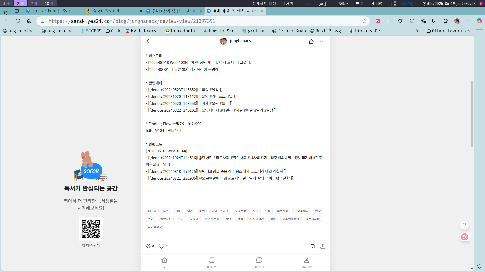

<!-- gid:20250616T000000 -->
[TOC]

Table of Contents

- [2025-06-16 Mon](#2025-06-16-mon)
- [2025-06-17 Tue](#2025-06-17-tue)
- [2025-06-18 Wed](#2025-06-18-wed)
- [2025-06-19 Thu](#2025-06-19-thu)
- [2025-06-20 Fri](#2025-06-20-fri)
- [2025-06-21 Sat](#2025-06-21-sat)
- [2025-06-22 Sun](#2025-06-22-sun)
- [NEWNOTES](#newnotes)
- [REFILED](#refiled)
- [SCREENSHOT](#screenshot)
- [CITATIONS](#citations)
- [PREVIOUS](#previous)

<!--endtoc-->

[[TIP("인용")]]
(kevin-kelly-68.t2t)<br />

Anything real begins with the fiction of what could be. Imagination is therefore the most potent force in the universe, and a skill you can get better at. It's the one skill in life that benefits from ignoring what everyone else knows.

현실은 있을법한 허구에서 시작합니다. 그러므로 상상력은 우주에서 가장 강력한 힘이며, 당신이 더 향상시킬수 있는 기술입니다. 그건 다른 사람들이 모두 다 아는 것을 무시함으로써 혜택을 얻는 유일한 기술 입니다.
[[/TIP]]

## 2025-06-16 Mon

[[TIP("인용")]]
(excellent_advice_for_living.t2t)<br />

Productivity is often a distraction. Don't aim for better ways to get through your tasks as quickly as possible. Instead aim for better tasks that you never want to stop doing.
[[/TIP]]

### 05:09 기상 - 어제의 세계 - 츠바이크 자서전

(슈테판 츠바이크 2014) 츠바이크

### 09:00 관조하는 삶 - 무위 - 그럼에도 불구하고

### 12:49 리딩리스트 추천도서를 적어 본다 - #개취도서

[Reading List](https://wikidocs.net/380565)

### 15:08 재런러니어

### 21:55 그럼에도 불구하고 - 니체의 말이였구나. 불안사회

## 2025-06-17 Tue

[[TIP("인용")]]
(excellent_advice_for_living.t2t)<br /> For a great payoff be especially curious about the things you are not interested in.

큰 성과를 얻으려면 특히 관심 없는 분야에 대해 호기심을 가져야 합니다.
[[/TIP]]

### 03:09 잠시 깨어나 메타노트 수정 - 몰입의즐거운 들으며

(미하이 칙센트미하이 1999) 아 이 책 좋아. 리딩리스트에 넣자

### 05:39 잠을 제대로 못자고 계속 책을 들었다

이건 백수나 할 수 있는 일이다. 그래 이번주까지 그리산다 이걸 통합해야 겠다. 바탕을 잡아야 한다.

-   [0=96 보편특수범용특이](https://wikidocs.net/380947)
-   [0=78 관계관련연관](https://wikidocs.net/380929)

### 09:12 부모님 똘이 산책 - 사건 발생 - 오직 모를 뿐이다

[2025-06-17 Tue 09:28] 멍멍 똘이 강아지 개

노트가 있는가? 동물? [0=2 동물생태생물](https://wikidocs.net/380854) 이런 부모님이

(디르크 그로서 and 프랑크 슐츠 2021) (마크 롤랜즈 2012)

-   [2025-06-17 Tue 11:35] [마크롤랜즈 늑대 달리기 SF영화 체화인지 현상학 삶의철학 동물 윤리](https://wikidocs.net/382188) 늑대 개가 스승이다.

### 09:46 합 합 합자로

### 11:10 메타노트 업데이트

### 12:37 네트워크과학

[알버트바라바시 네트워크과학 포뮬러 복잡계 물리학](https://wikidocs.net/381972)

### 13:48 @스티븐스트로가츠 - 비선형 동역학

[스티븐스트로가츠 비선형 동역학 카오스 미적분 에르베레닝 교양수학 릴리언리버 길위의 수학자](https://wikidocs.net/382161)

### 14:38 수식독해력

[다카미즈유이치 SF영화 우주 수식 도미시마유스케 수식독해력](https://wikidocs.net/382102)

### 16:28 데리러 가야겠다

### 22:19 온생명이를 칠보 와서 소고기 잘 먹임 이제 하루가 저무는구나

## 2025-06-18 Wed

[[TIP("인용")]]
(kevin-kelly-68.t2t)<br /> Don't say anything about someone in email you would not be comfortable saying to them directly, because eventually they will read it.

누군가에게 직접 말하는 게 불편한 내용은 이메일에서도 언급하지 마세요. 그 사람은 결국 그걸 읽게 될테니까요.
[[/TIP]]

### 04:49 기상 - 여가 다시 보기

애들러 사전 - 여가 - leisure, leisuring, 74, 127-28, 133-34

### 09:17 코스모폴리탄

### <span class="org-todo todo TODO">TODO</span> 여가 : 다시 바라보기

[2025-06-18 Wed 09:37]

-   [여가오락놀이](https://wikidocs.net/380577)

### 10:44 @나오미배런 @미하이칙센트미하이

[미하이칙센트미하이: 몰입 행복 삶의철학 자기목적성 운명애](https://wikidocs.net/382026) 저서에서 갑자기 배런이 뭐라카지 연결이 있던가 [나오미배런 1946 읽기 쓰기 미래 - 언어학자 리터러시](https://wikidocs.net/382316)

### 12:20 어쏠로지: 쏠로 고독 솔리토리 개념 추가

[2025-06-18 Wed 12:18]

[어쏠로지](https://wikidocs.net/380570)에 담아두려고 했던 것인데 문득 스크린샷 정리하다가 스크린샷에 딱 만남. 스냥 스크린샷. 설명도 없어. 뭐지? 아. 쏠로!!

어쏠로지에서 쏠로

솔로가 아니다. 쌍시옷. 쏠로다. 오! 쏠레미오.

고독한 난파선이여. 오 솔리토리 귀여운 고독이여. 고독은 기쁨이요. 몰입의 터요. 정원이요. 고통은 빛이요. 생명이요. 살아있음의 증거라.

### 13:01 브레인워시

### <span class="org-todo done DONE">DONE</span> 13:55 @에릭호퍼 영혼의연금술 아포리즘 1

> 
> 
> 1
> 
> There is most passions a shrinking away from ourselves. The passionate pursuer has the earmarks of a fugitive.
> 
> Passions usually have their roots in that which is blemished, crippled, incomplete and insecure whithin us. The passionate attitude is less a response to stimuli from without than an emanation of an inner dissatisfaction.

### 15:23 디지털가든 메인페이지 수정

### 17:25 온생명 하원 칠보 도착

### 21:30 아 피곤하다

## 2025-06-19 Thu

[[TIP("인용")]]
(excellent_advice_for_living.t2t)<br />

We are unconsciously distracted by seeing our reflection. You can alleviate a lot of the fatigue of teleconferencing all day if you turn off your self-view.

우리는 자신의 모습을 보면서 무의식적으로 주의가 산만해집니다. 셀프 뷰를 끄면 하루 종일 화상 회의로 인한 피로를 많이 줄일 수 있습니다.
[[/TIP]]

### 02:01 화장실 : 겁내지 말라 - 사랑아닌 것이 없다.

(이현주 2012)

### <span class="org-todo todo TODO">TODO</span> 키티 터미널 글 정리

[2025-06-19 Thu 02:12]

[kitty 키티 - 터미널 이맥스](https://wikidocs.net/381113)

오래전에 부터 정리한 것인데 어쏠로 올리는게 어떤가? 심각하게 해온 것 아닌가? 왜 해온 것인가? 그거야. 모르지. 쓸모가 있을 때를 기다린 것이 아닌가

터미널이 있고 거기에 키티가 있고 거기에 키티와 이맥스가 있고 키바인딩이 있고 임베디드도 있고 그러네

### <span class="org-todo todo TODO">TODO</span> 02:16 사람 목소리 그리고 TTS - 없이 듣기

[2025-06-19 Thu 02:16]

사람은 말한다. 감정과 판단이 있다. 정치 팟케스트를 들어보아라. 이쪽저쪽 판단이 있어 말한다. 좋다. 여기도 연민 저기도 분노다. 둘은 동전의 앞과 뒤 같다.

그러면 좋다. 당신은 연약하다. 그러면 없이 들으라. 차라리 성현이 남긴 말을 들어보아라. TTS로 들어라. 뭣도 없다. 그냥 이야기만 있다.

그 안에 살라. 삶은 돌고 돔이다. 시방. 돔이다. 그렇다면 무엇인가. 사랑이다. 돔인데 무엇이 남는가. 사랑이다. 그러면 선택을 해도 사랑이다. 사랑하는 선택이다. 기다리는 화살촉이다.

옳음 그름의 상태 없이 존재함이다. 오디오북 전자책 귀로 들어보아라.

힣이란 놈이 있다. 그놈도 그리 듣고 나서 사람에서 개가 되었다. 개? 무슨 개소리요?

(디르크 그로서 and 프랑크 슐츠 2021) 개는 스승이라. 한 마리 개로 다시 살라. 개의 '눈'을 보라. 개새끼의 눈을 보라. 그가 바로 '나'다.

힣 시끄럽다. 다시 자라. 컴터는 끄고 자라.

### 06:45 기상 : 자기목적성 운명애

### 08:42 식사 똘이 산책 - 설사

옆집 개에게 엉덩이를 물린 2013년 10월 생 똘이. 똘이는 아프다. 꼬리가 고장이 났다. 눈에는 슬픔이 있다.

### 09:44 연세 #정형외과 - 운명애

[2025-06-19 Thu 09:48] 운명애 - 병원 대기 시간 엄청 길듯. 아무렴 어떤가 운명애를 다시 들어본다.

사락 역시 좋아. 리뷰를 남기는데 태그를 잘 뽑아주네. 괜찮은 방법이다.



니체 운명애 - 다시 태어나도 이 삶을 살겠다

[니체](https://wikidocs.net/382130)

#### @미하이칙센트미하이: #몰입 #행복 #삶의철학 #자기목적성 #운명애

(“@미하이칙센트미하이: \#몰입 \#행복 \#삶의철학 \#자기목적성 \#운명애” n.d.)

사락 리뷰

### <span class="org-todo todo TODO">TODO</span> 10:02 §org-glossary 버그 - 내보내기 - css 수정

[2025-06-19 Thu 10:13] 수정 필요

-   ox-hugo, org-glossary에서 연동 - quartz에서는 처리가 제대로 안된다.
-   파일 당 용어사전 처리
-   전체 용어사전 처리
-   용어사전의 계층 : org-glossary, ten

### 10:22 아포리즘 - 고요 고통 있음 존재 폭팔하는 에너지 덩어리 텍스트 뭉치

-   [아포리즘 니체 에릭호퍼 고통 순간 무위 폭팔 어쏠리즘](https://wikidocs.net/381403)
-   [힣: 추천은 위험하다 - 흘려듣기](https://wikidocs.net/381746)

### <span class="org-todo todo TODO">TODO</span> 13:34 금곡동 스타벅스 - 늑대 2025 SS 아재 스타일 키트 : 카톡에서 옮겨줘

친구들 관심도 없는데 장황하게 카톡에 글을 써놨다.

### 13:59 이즘 주의 일원론 다원론 뭐 신토피콘

[0=63 이즘주의학파](https://wikidocs.net/380914)

### 15:50 @안드레이카파시 @유레카랩 - 신경과학

[안드레이카파시 유레카랩 AndrejKarpathy 인공지능 딥러닝 에듀테크](https://wikidocs.net/382484)

### 16:14 식사는? 이동하자 - 햄버거 2개사서 내것 아내것

### <span class="org-todo done DONE">DONE</span> 20:04 양자역학 얽힘

[양자역학얽힘](https://wikidocs.net/380599)

### 22:22 온생명 귀가 완료 이제 자자 오늘 감사합니다.

## 2025-06-20 Fri

[[TIP("인용")]]
(kevin-kelly-99.t2t)<br /> If something fails where you thought it would fail, that is not a failure.

실패할 것이라고 생각했던 부분에서 실패했다면, 실패가 아닙니다.
[[/TIP]]

### 03:36 딸국질 언제 떠나갈까 - 파니스 안젤리쿠스 - 생명의 양식

#### <span class="org-todo done DONE">DONE</span> Luciano Pavarotti - Montreal - 1978 - Panis Angelicus (César Franck) 파니스 안젤리쿠스 생명의양식 성가

(루치아노 파바로티 n.d.)

A Christmas Special with Luciano Pavarotti (1978) at Notre Dame Cathedral in Montréal, joined by a boys choir, Les Petits Chanteurs du Mont-Royal, and an adult choir, Les Disciples de Massenet conductor: Franz-Paul Decker

### 06:31 철학자와 늑대 - 마크 롤랜즈 선생 대단하네

[마크롤랜즈 늑대 달리기 SF영화 체화인지 현상학 삶의철학 동물 윤리](https://wikidocs.net/382188)

### 07:25 비가 온다 - 아침 먹자

### 11:03 노트 정리

### <span class="org-todo todo TODO">TODO</span> 12:48 §denote-explore 만져보자 - 장난 아니다

### 14:48 근데 내보내기는 그냥 다 하나 폴더로 넣는게 좋지 않을까?

하다보니까 옮기게 되는데... 아니야. 흔들지마.

### 16:46 태권도 하원

### 19:41 온생명이와 씻고 가자

### 21:38 돌아왔다

## 2025-06-21 Sat

[[TIP("인용")]]
(excellent_advice_for_living.t2t)<br />

Be more generous than necessary. No one on their deathbed has ever regretted giving too much away. There is no point to being the richest person in the cemetery.

필요 이상으로 관대하세요. 임종할 때 너무 많은 것을 기부한 것을 후회한 사람은 아무도 없습니다. 묘지에서 가장 부유한 사람이 되는 것은 아무런 의미가 없습니다
[[/TIP]]

### 00:57 잠시 깨어나. 관대 광대

관대함 관대

### <span class="org-todo todo TODO">TODO</span> 01:00 §citar-org-mode

how? citar-org-mode-directory 를 잡고 가야 한다. bib 폴더 내에 있는 것들만

```elisp

(require 'citar-org-mode)
(setq citar-org-mode-directory (concat org-directory "bib/"))
```

### <span class="org-todo done DONE">DONE</span> 03:09 루미 사랑안에 길을 잃다

### <span class="org-todo todo TODO">TODO</span> 03:21 십진분류 생각 신토피콘 프로피디아

[№800 문학](https://wikidocs.net/380984)

-   층위 검색 만든다
-   도서를 십진분류로 하다보니
-   묶어 내기에 좋지뭐
-   근데 신토피콘 프로피디아 엮어지니 중복인가요
-   아닐세 이리 저리 찔러 보는 길이 있는 것 뿐일세
-   간격반복학습이 별 것인가 아니면 무엇인가 알아 가는 길 흔적찾기 게임
-   근데 bib 인가 meta 인가 묶어 내는 것

### <span class="org-todo todo TODO">TODO</span> 03:25 아버지 휴대폰에 오디오북 @윌라 설치하다 - 어쏠로그

[2025-06-21 Sat 03:25] 이것은 어쏠로그

아버지 휴대폰에 오디오북 앱을 설치하다. 결제는 본인 카드!!!

갤럭시S25 3개월 무료 혜택 때문이 아니다. 눈이 침침한 그대에게 책을 말한다. 텔레비전 리모콘을 들고 있는 그대에게 책을 말한다. 권할 것도 없으나 때가 오면 되랄.

그리되어 시기가 되어 묻는다. 책 듣는 것에 대한 호기심의 빛이다. 내일이면 70대 누군가에 남편이며 아버지며 온생명이의 할아버지인 이 사람.

힣은 윌라를 선택했다. AI 성우보단 인간 성우가 좋으리. 인간성우는 윌라가 단단하지.

근데 할머니는? 가족 한명 추가 등록이 되니 카톡으로 링크 전달 해드렸다. 때가 되면 쓰시리. 때는 언제? 고도를 기다려.

아무튼 아버지 윌라앱을 열고 카테고리, 책 검색 등 몇가지 이야기를 하며 책 2권을 즐겨찾기 해드렸다.

(마이클 싱어 2014) 상처받지 않는 영혼. 아들의 450시간 인증 댓글을 보여드린다. 산책할 때 들었다고 전한다. 또 한권은 (빅터 프랭클 2020) 죽음의 수용소에서를 추가했다.

인기도서라는 낚시의 횡포 보다는 시작점도 중요하리라. 하아. 인기도서는 인기도서가 아니다. 인기도서라고 세우는 순간 인기도서가 아니게 된다. 인기 없는 도서라고 세우면? 그냥... 불온도서라고 하지 그래? 세우면 무너진다. 도미노다.

아무튼 왜 마이클 싱어와 빅터 프랭크의 책인가? 왜 하필? 순간 왜 그랬지? 모르... 아니!!! 안다!!! 둘다 인간 성우가 낭독한 책이며 거의 저자로 빙의한 듯 싶다. @김재정 선생은 윌라 독점인듯. 어디가서 만날 수 없다. 이 두 권의 책은 머리로 쓴 책이 아니다. 아버지가 들어보심 바로 아시리라. 더 말한다면 추천의 독에 빠진 것이리라. ([힣: 추천은 위험하다 - 흘려듣기](https://wikidocs.net/381746))

인간 성우 최다 최고는 @강우상 선생이 낭독한 것은 아니다만 어짜피 강 성우는 피할 수 없다. 이 분의 '빅터 프랭클' 회고를 들으면 깜짝 놀란다. (빅터 프랭클 2021) 놀라서 윌라 댓글에 혹시 빅터 프랭클 본인 이십니까라고 남겼던 기억이 난다. 댓글을 거의 달지 않는 힣이 이런 반응은 매우 유니크한 경우다.

[2025-06-21 Sat 03:54] 할말은 다 쓴 것 같다. 아니 더 나온다. 변기에 앉아서 조금만 더! 힘내! 외치는 맴으로!

근데 왜 어쏠로지 인가? 모든 부모님들께 무슨 선물이 필요이 좋을까? 고민한다면 이 보다 값진 선물은 별로 없으리라.

바삐 산 인생에서 이제 와서 종이책을 펼쳐보시긴 눈은 침침하며 읽기에 익숙치 않은 그대에게 눈은 쉬게 하며 명상 산책 기도 쉼 모든 것을 엮어내는 종합 선물 세트가 아닌가.

이 것은 선택함으로써 자극적인 다른 매체에서 거리를 두게 되며 (하루는 24시간), 그 안에 광고과 온갖 잡다한 후크에 농락당하며 기술봉건주의의 데이터 농노에서 자유인이자 야인이 된다.

뇌는 어떤가? 치매는 염려만으로 대응할 수 있는가? 치매 염려하는 것은 치매를 부르는 일이 아닌가. 치매가 오더라도 어찌 할 수 없어. 기억이 꿈처럼 흩어지더라도 오늘 루미의 시 한 구절을 듣겠어. 듣고 멈추고 그 안에서 쉬겠어.

[[TIP("important")]]
-   A: 지난 삶. 거침 없이 달려왔잖아. 승리했어. 나는 승리했다고. 오. 감사로다. 이것도 저것도 문제가 많다고? 남은 것도 없지 않냐고? 아니. 아니. 있다 있어. 내가 있어 여전히. 아직 경험하고 있잖아. 한 선생이 관조 뭐 시기 책. 그래그래. '관조'하는 삶으로 말이야. 아. 좋구나. 언제나 좋구나. 여여하도다.
-   B: 너 누구야? 할아버지로 빙의한 '힣' 이지? 맨날 떠드는 그 말이 여기도 있네!
-   A: 어... 10대 30대 60대 90대 어디로 가도 할 말은 이것 뿐이네. 허허. 오늘을 살아 냈다!! 아자!!
-   B: 크으으 힣... 다시 찾아오리...
-   A: 근데... 넌 누구냐?
-   B: 우리의 계약을 잊었느냐? (연기 속으로 사라졌다)
[[/TIP]]

### 03:30 르포르타주 조지오웰 들어보아라 - 위건부두

[2025-06-21 Sat 03:37]

1장을 들어보면 글에서 냄새가 난다. 탄광촌 하숙집 이야기. 2장을 들어보면 호흡곤란이 온다. 탄광촌 체험기. 조지오웰 키190.

조지오웰 이 사람. 진하다. 아주 진하다. 이 사람의 피에는 무엇이 담겨 있단 말인가? 어떻게 피가 진국일 수 있는가?

오줌 가득찬 오강에 엄지손가락이 담겨져 손이 쪼글쪼글하게 불어터진 그 손으로 손님들에게 빵을 잘라주면 언제나 그 더러운 손 말이다.

놀랍도다. 아무렴. 고통이 익숙하다고 괜찮겠지? 아니다. 그들은 겪고 있다. 알고있다. 이 지옥을. 떠났으리라.

아니. 있다. 다른 누구가 다른 상황에서.

어딘가에 쇠사들에 묶여 하루 종일 새우 손질을 하는 아이들이 세계 어딘가에 있다. 자기가 누군지도 이름도 모른다. 그냥 새우 1, 2. 왜 태어났는가? 어디에서? 아기 공장에서 생산되었네.

(조지 오웰 2010)

### 06:01 기상 - 괴테 융 이부영

(이부영 2020)

### bib 헤딩 검색

[2025-06-21 Sat 06:13]

-   모든 헤딩을 뽑아내서 가장 빠르게 검색하는 방법

### 07:45 일어나자 기운내자

### <span class="org-todo todo TODO">TODO</span> 08:01 다빈치맵 지식지도 지식놀이터 - 구루

### <span class="org-todo done DONE">DONE</span> 09:44 인문학 개념어 사전 1 2 3 - 대단한 작업

[김승환 인문학 개념어 사전 - 논리 사상 철학 역사 사회 자연 문학 예술 미학](https://wikidocs.net/382274)

### 10:00 업모닝 up morning 새로운 인사

### 11:41 뉴스레터 조테로

(Chua 2025)

[Blocked - reddit.com](https://www.reddit.com/r/emacs/comments/1l9y7de/showing_org_mode_link_at_point_in_echo_area/)ㅏ

### <span class="org-todo todo TODO">TODO</span> 조직모드 마우스 - 링크 이동

[2025-06-21 Sat 11:58]

마우스를 사용하지 않으나 이게 좀 뭔가 필요함직 하다.

```elisp

(setq org-mouse-1-follows-link nil mouse-1-click-in-non-selected-windows nil)

```

#### Mousing around in orgmode – Paul Jorgensen

(“Mousing around in Orgmode – Paul Jorgensen” 2025)

### 12:01 디레드 아이콘 미니멀

(“Emacs Dired with Ultra-Lightweight Visual Icons · Emacs@ Dyerdwelling” n.d.)

```emacs-lisp
;;;; Dired with ultra lightweight icons

;; 2025-06-21 disable nerd-icons-dired first
;; https://emacs.dyerdwelling.family/emacs/20250612223745-emacs--emacs-dired-with-ultra-lightweight-visual-icons/
(progn
  (defvar dired-icons-map
    '(("el" . "λ") ("rb" . "◆") ("js" . "○") ("ts" . "●") ("json" . "◎") ("md" . "■")
      ("txt" . "□") ("html" . "▲") ("css" . "▼") ("png" . "◉") ("jpg" . "◉")
      ("pdf" . "▣") ("zip" . "▢") ("py" . "∆") ("c" . "◇") ("sql" . "▦")
      ("mp3" . "♪") ("mp4" . "▶") ("exe" . "▪")))

  (defun dired-add-icons ()
    (when (derived-mode-p 'dired-mode)
      (let ((inhibit-read-only t))
        (save-excursion
          (goto-char (point-min))
          (while (and (not (eobp)) (< (line-number-at-pos) 200))
            (condition-case nil
                (let ((line (buffer-substring-no-properties (line-beginning-position) (line-end-position))))
                  (when (and (> (length line) 10)
                             (string-match "\\([rwxd-]\\10\\\\)" line)
                             (dired-move-to-filename t)
                             (not (looking-at "[▶◦λ◆○●◎■□▲▼◉▣▢◇∆▦♪▪] ")))
                    (let* ((is-dir (eq (aref line (match-beginning 1)) ?d))
                           (filename (and (string-match "\\([^ ]+\\)" line) (match-string 1 line)))
                           (icon (cond (is-dir "▶")
                                       ((and filename (string-match "\\.\\([^.]+\\)" filename))
                                        (or (cdr (assoc (downcase (match-string 1 filename)) dired-icons-map)) "◦"))
                                       (t "◦"))))
                      (insert icon " "))))
              (error nil))
            (forward-line))))))

  (add-hook 'dired-after-readin-hook 'dired-add-icons)
  )
```

### 12:41 점심 - 해신탕 소주

### 20:12 숨 쉬러 나가다 - 조지오웰 탐독 곤궁한 사나이

(조지 오웰 1938) [조지오웰 위건부두 카탈로니아찬가 르포르타주 동물농장 1984](https://wikidocs.net/382168) #LLM: #모음: 사나이 시리즈 - 성급한 곤궁한

## 2025-06-22 Sun

[[TIP("인용")]]
(kevin-kelly-99.t2t)<br />

History teaches us that in 100 years from now some of the assumptions you believed will turn out to be wrong. A good question to ask yourself today is "What might I be wrong about?"

역사는 지금부터 100년 후에는 우리가 믿었던 가정 중 일부가 틀린 것으로 판명될 수 있다는 것을 가르쳐 줍니다. 오늘 스스로에게 물어볼 수 있는 좋은 질문은 "내가 틀릴 수 있는 것은 무엇일까?"입니다.
[[/TIP]]

### 01:05 @켄윌버 강하다

[2025-06-22 Sun 01:53] 책 추가. 켄 윌버의 신을 듣는 중에 컴퓨터 켜버렸다.

(켄 윌버 2015) (켄 윌버 2022)

[켄윌버 무경계 모든것의역사 대극](https://wikidocs.net/382075)

### 07:48 아침 식사 완료 커피 한잔

아이스 헝겁으로 내린 드립 커피

### 09:00 똘이 칠보산 맨발 산책 @켄윌버

### 09:46 tmp -&gt; llmlog 폴더 변경

아 텍스트 검색에서 tmp 폴더를 제외하고 있었구만. 어쩐지!! 르상티망 일세!!

### <span class="org-todo todo TODO">TODO</span> 알폰소 공동체

[2025-06-22 Sun 09:57]

(알폰소 링기스 1994)

### <span class="org-todo todo TODO">TODO</span> Pastebin.com - #1 paste tool since 2002!

(“Pastebin.Com - \#1 Paste Tool since 2002!” n.d.)

-   [조직모드: 복사 및 붙여넣기 org-rich-yank kill-ring yank](https://wikidocs.net/381391)

### 11:05 딩뱃 유니코드 좋다

### 11:40 디노트 정렬 이슈

```elisp

;; Do not issue any extra prompts.  Always sort by the `title' file
;; name component and never do a reverse sort.
(setq denote-sort-dired-extra-prompts nil)
(setq denote-sort-dired-default-sort-component 'title)
(setq denote-sort-dired-default-reverse-sort nil)
```

### <span class="org-todo todo TODO">TODO</span> 12:22 최적 폰트를 찾아서 어썰로그

[힣: 최적 폰트 탐구 요구사항 터미널 콜아웃 웹 한글 가변폭 고정폭 유니코드 심볼 합자](https://wikidocs.net/381030)

### <span class="org-todo todo TODO">TODO</span> 이슈

[2025-06-22 Sun 12:23]

-   영어 태그 전체 뽑아내서 상위 개념 정리 - 용어사전 등록
-   서클 유니코트 영어만 소문자로 활용

### 14:28 어머니 버스터미널

### 15:45 수학 음악

(니키타 브라긴스키 2022)

### 16:55 잠시만 - 십진분류

-   [№800 문학](https://wikidocs.net/380984)

-   정보 000
-   100
-   200
-   300
-   400
-   500
-   600
-   

### 18:14 나가자

### 22:29 경탄. 삶에 감사. 자라.

삶에 무한한 신뢰. 근데 자라.

## NEWNOTES

-   [최근노트 모음](https://wikidocs.net/381627)

-   [힣: 추천은 위험하다 - 흘려듣기 (2025-06-19)](https://wikidocs.net/381746)
-   [junghan0611 denote-explore 디노트 확장 플러그인 일괄변경 통계 검색 시각화 도구 (2025-06-16)](https://wikidocs.net/381745)
-   #LLM: §guess-language toggle-comment-for-en-lines (2025-06-19)
-   [토머스쿤 과학혁명의구조 페러다임 (2025-06-20)](https://wikidocs.net/382485)
-   [안드레이카파시 유레카랩 AndrejKarpathy 인공지능 딥러닝 에듀테크 (2025-06-19)](https://wikidocs.net/382484)
-   [로맹롤랑 1866 평화 반전운동 문학 장크리스토프 베토벤 예술 정신 (2025-06-18)](https://wikidocs.net/382483)
-   [롤랑바르트 텍스트 즐거움 기호 신화 구조주의 작가의죽음 (2025-06-18)](https://wikidocs.net/382482)

## REFILED

### <span class="org-todo done DONE">DONE</span> 바실리 칸딘스키 1866 예술가 미술가 바우하우스

### <span class="org-todo done DONE">DONE</span> 예술에서의 정신적인 것에 대하여

### <span class="org-todo done DONE">DONE</span> TidyBook - Write and Share Your Knowledge

## SCREENSHOT

### Screenshots for 20250616

### Screenshots for 20250617

### Screenshots for 20250618

### Screenshots for 20250619

#### 20250619T095846-sarak-flow-review

![[../images/20250619T095846-sarak-flow-review.png|320]]

#### 20250619T135935-oneandmany

![[../images/20250619T135935-oneandmany.png|320]]

#### 20250619T154217-immersive-translator-with-prompt-fixed

![[../images/20250619T154217-immersive-translator-with-prompt-fixed.png|320]]

### Screenshots for 20250620

## CITATIONS

### [검색어: urldate = 2025-06-16]

-   C (programming language) (Slipbox) (“C (Programming Language)” 2025)
-   데니스 리치 Dennis Ritchie (Slipbox) (“데니스 리치 Dennis Ritchie” 2025)
-   재런 러니어 Jaron Lanier (Slipbox) (“재런 러니어 Jaron Lanier” 2025)
-   Jaron Lanier's Homepage (Slipbox) (재런 러니어 n.d.)

### [검색어: urldate = 2025-06-17]

-   Nvidia CEO, Anthropic 대표의 AI 일자리 위협 주장 비판 – (Slipbox) (xguru 2025b)
-   어린이 백혈병: 치명적인 암이 어떻게 치료 가능한 질병이 되었는가 (Slipbox) (neo 2025a)
-   데이비드 아텐버러 99세: '나는 이 이야기가 어떻게 끝나는지 보지 못할 것임' (Slipbox) (neo 2025b)
-   Realtime Linux가 오랜 논쟁 끝에 리눅스 커널에 공식 포함 (Slipbox) (neo 2024)
-   마이크로소프트, ThreadX(Azure RTOS) 오픈소스화 발표 (Slipbox) (xguru 2023)
-   microsoft/vscode-ai-toolkit (Slipbox) (“Microsoft/Vscode-Ai-Toolkit” [2023] 2025)
-   jwiegley/gptel-prompts (Slipbox) (Wiegley [2025] 2025)
-   GetHooky - 모든 스택을 지원하는 간단한 Git 훅 관리 툴 (Slipbox) (xguru 2025c)
-   edamagit - VSCode용 Magit 확장 (Slipbox) (xguru 2025a)

### [검색어: urldate = 2025-06-18]

-   루쉰 (Slipbox) (루쉰 2025)
-   로맹 롤랑 1866 (Slipbox) (로맹 롤랑 2025)

<!--listend-->

-   루미너리북스의 여정 – 루미너리북스 (Slipbox) (“루미너리북스의 여정 – 루미너리북스” n.d.)
-   루미너리북스(<https://luminarybooks.co.kr>) (Slipbox) (“루미너리북스(https://luminarybooks.co.kr) 회사에 대해서 알려줘” n.d.)
-   키티 터미널 kitty The fast, feature-rich, GPU based terminal emulator (Slipbox) (“키티 터미널 Kitty the Fast, Feature-Rich, Gpu Based Terminal Emulator” n.d.)

### [검색어: urldate = 2025-06-19]

-   Andrej Karpathy: Software Is Changing (Again) (Slipbox) (안드레이 카파시 2025b)
-   지금이 소프트웨어 개발을 배우기에 가장 좋은 시기일지도 모릅니다 (Slipbox) (neo 2025c)
-   Untitled (Slipbox) (xguru 2025d)
-   Andrej Karpathy (Slipbox) (안드레이 카파시 2025a)
-   Deep Dive into LLMs like ChatGPT - Introduction (Slipbox) (안드레이 카파시 n.d.-a)
-   Eureka Labs (Slipbox) (안드레이 카파시 n.d.-b)
-   텍스트로 받아보는 YouTube RSS (Slipbox) (windbug99 2025)
-   Luciano Pavarotti - Montreal - 1978 - Panis Angelicus (César Franck) 파니스 안젤리쿠스 생명의양식 성가 (Slipbox) (루치아노 파바로티 n.d.)

### [검색어: urldate = 2025-06-20]

-   『인문학 개념어 사전』, 인간의 존재론적 본질을 총체적으로 해석하다 (Slipbox) (김승환 2022)
-   다빈치!지식지도 (Slipbox) (“다빈치!지식지도” n.d.)

## PREVIOUS

-   [2025-06-09](https://wikidocs.net/380419)

## BIBLIOGRAPHY

<style>.csl-entry{text-indent: -1.5em; margin-left: 1.5em;}</style>
- 루쉰. 2025. “루쉰.” 나무위키. May 28, 2025. [https://namu.wiki/w/%EB%A3%A8%EC%89%B0](https://namu.wiki/w/%EB%A3%A8%EC%89%B0).
- 이현주. 2012. <i>사랑 아닌 것이 없다</i>. [https://www.yes24.com/product/goods/6498589](https://www.yes24.com/product/goods/6498589).
- 이부영. 2020. <i>괴테와 융 - 파우스트의 분석심리학적 이해</i>. 한길사. [https://www.yes24.com/product/goods/90925236](https://www.yes24.com/product/goods/90925236).
- 김승환. 2022. “『인문학 개념어 사전』, 인간의 존재론적 본질을 총체적으로 해석하다.” 대학지성 In&#38;Out. February 13, 2022. [http://www.unipress.co.kr/news/articleView.html?idxno=5500](http://www.unipress.co.kr/news/articleView.html?idxno=5500).
- 안드레이 카파시. 2025a. “Andrej Karpathy.” In <i>Wikipedia</i>. [https://en.wikipedia.org/w/index.php?title=Andrej_Karpathy&#38;oldid=1296269691](https://en.wikipedia.org/w/index.php?title=Andrej_Karpathy&oldid=1296269691).
- ———. n.d.-a. “Deep Dive into Llms like Chatgpt - Introduction.” Accessed June 19, 2025. [https://www.tidybook.app/book/9d597677-145c-4715-a3fe-9bde704165d7](https://www.tidybook.app/book/9d597677-145c-4715-a3fe-9bde704165d7).
- ———. n.d.-b. “Eureka Labs.” Accessed June 19, 2025. [https://eurekalabs.ai/?utm_source=perplexity](https://eurekalabs.ai/?utm_source=perplexity).
- 마이클 싱어. 2014. <i>상처받지 않는 영혼: 내면의 자유를 위한 놓아보내기 연습</i>. Translated by 이균형. 서울: 라이팅하우스. [https://www.yes24.com/Product/Goods/12981014](https://www.yes24.com/Product/Goods/12981014).
- 알폰소 링기스. 1994. <i>아무것도 공유하지 않은 자들의 공동체</i>. Translated by 김성균. [https://www.yes24.com/product/goods/8726508](https://www.yes24.com/product/goods/8726508).
- 슈테판 츠바이크. 2014. <i>어제의 세계 \#자서전</i>. Translated by 곽복록. [https://m.yes24.com/Goods/Detail/12056446](https://m.yes24.com/Goods/Detail/12056446).
- 니키타 브라긴스키. 2022. <i>수학이 사랑한 음악 - 고대부터 Ai 음악까지 음악사와 기술사의 교양서</i>. Translated by 박은지. [https://m.yes24.com/goods/detail/117390228](https://m.yes24.com/goods/detail/117390228).
- 미하이 칙센트미하이. 1999. <i>몰입의 즐거움</i>. Translated by 이희재. [https://www.yes24.com/Product/Goods/101506519](https://www.yes24.com/Product/Goods/101506519).
- 조지 오웰. 1938. <i>숨 쉬러 나가다</i>. Translated by 이한중. [https://www.yes24.com/product/goods/145996017](https://www.yes24.com/product/goods/145996017).
- ———. 2010. <i>위건 부두로 가는 길 : 르포르타주</i>. Translated by 이한중. 한겨레출판. [https://www.yes24.com/product/goods/117181295](https://www.yes24.com/product/goods/117181295).
- 로맹 롤랑. 2025. “로맹 롤랑 1866.” 나무위키. April 24, 2025. [https://namu.wiki/w/%EB%A1%9C%EB%A7%B9%20%EB%A1%A4%EB%9E%91](https://namu.wiki/w/%EB%A1%9C%EB%A7%B9%20%EB%A1%A4%EB%9E%91).
- 마크 롤랜즈. 2012. <i>철학자와 늑대</i>. Translated by 강수희. [https://www.yes24.com/Product/Goods/42658500](https://www.yes24.com/Product/Goods/42658500).
- 빅터 프랭클. 2020. <i>죽음의 수용소에서: 죽음조차 희망으로 승화시킨 인간 존엄성의 승리</i>. Translated by 이시형. 개정보급판. 파주: 청아출판사. [https://www.yes24.com/product/goods/90384709](https://www.yes24.com/product/goods/90384709).
- ———. 2021. <i>빅터 프랭클 - 어느 책에도 쓴 적 없는 삶에 대한 마지막 대답</i>. Translated by 박상미. [https://www.yes24.com/product/goods/105610947](https://www.yes24.com/product/goods/105610947).
- 재런 러니어. n.d. “Jaron Lanier’s Homepage.” Accessed June 16, 2025. [https://www.jaronlanier.com/](https://www.jaronlanier.com/).
- 켄 윌버. 2015. <i>켄 윌버의 신</i>. Translated by 김철수. [https://www.yes24.com/product/goods/24932722](https://www.yes24.com/product/goods/24932722).
- ———. 2022. <i>켄 윌버의 통합불교 - 영성의 미래</i>. Translated by 김철수. [https://www.yes24.com/product/goods/107893629](https://www.yes24.com/product/goods/107893629).
- “루미너리북스의 여정 – 루미너리북스.” n.d. Accessed June 18, 2025. [https://luminarybooks.co.kr](https://luminarybooks.co.kr).
- “다빈치!지식지도.” n.d. Accessed June 20, 2025. [http://davincimap.co.kr/index.jsp?tab=OC](http://davincimap.co.kr/index.jsp?tab=OC).
- “@미하이칙센트미하이: \#몰입 \#행복 \#삶의철학 \#자기목적성 \#운명애.” n.d. 사락. Accessed June 19, 2025. [https://sarak.yes24.com/blog/junghanacs/review-view/21397391](https://sarak.yes24.com/blog/junghanacs/review-view/21397391).
- 디르크 그로서, and 프랑크 슐츠. 2021. <i>우리가 알고 싶은 삶의 모든 답은 한 마리 개 안에 있다 : 젊은 철학도와 떠돌이 개 보바가 함께 한 14년</i>. Translated by 추미란. [https://www.yes24.com/Product/Goods/97665725](https://www.yes24.com/Product/Goods/97665725).
- Chua, Sacha. 2025. “2025-06-16 Emacs News,” June. [https://sachachua.com/blog/2025/06/2025-06-16-emacs-news/](https://sachachua.com/blog/2025/06/2025-06-16-emacs-news/).
- “C (Programming Language).” 2025. In <i>Wikipedia</i>. [https://en.wikipedia.org/w/index.php?title=C_(programming_language)&#38;oldid=1295520935](https://en.wikipedia.org/w/index.php?title=C_(programming_language)&oldid=1295520935).
- “데니스 리치 Dennis Ritchie.” 2025. In <i>위키백과, 우리 모두의 백과사전</i>. [https://ko.wikipedia.org/w/index.php?title=%EB%8D%B0%EB%8B%88%EC%8A%A4_%EB%A6%AC%EC%B9%98&#38;oldid=39877035](https://ko.wikipedia.org/w/index.php?title=%EB%8D%B0%EB%8B%88%EC%8A%A4_%EB%A6%AC%EC%B9%98&oldid=39877035).
- 루치아노 파바로티, ed. n.d. <i>Luciano Pavarotti - Montreal - 1978 - Panis Angelicus (César Franck) 파니스 안젤리쿠스 생명의양식 성가</i>. Directed by 루치아노 파바로티. Accessed June 19, 2025. [https://www.youtube.com/watch?v=o3EZoDr6kqM](https://www.youtube.com/watch?v=o3EZoDr6kqM).
- 안드레이 카파시, ed. 2025b. <i>Andrej Karpathy: Software Is Changing (Again)</i>. Directed by 안드레이 카파시. [https://www.youtube.com/watch?v=LCEmiRjPEtQ](https://www.youtube.com/watch?v=LCEmiRjPEtQ).
- “Emacs Dired with Ultra-Lightweight Visual Icons · Emacs@ Dyerdwelling.” n.d. Accessed June 21, 2025. [https://emacs.dyerdwelling.family/emacs/20250612223745-emacs--emacs-dired-with-ultra-lightweight-visual-icons/](https://emacs.dyerdwelling.family/emacs/20250612223745-emacs--emacs-dired-with-ultra-lightweight-visual-icons/).
- “루미너리북스(https://luminarybooks.co.kr) 회사에 대해서 알려줘.” n.d. Accessed June 18, 2025. [https://www.perplexity.ai/search/rumineoribugseu-https-luminary-_IoNJLw8RCqscy8TGSs__w](https://www.perplexity.ai/search/rumineoribugseu-https-luminary-_IoNJLw8RCqscy8TGSs__w).
- “재런 러니어 Jaron Lanier.” 2025. In <i>Wikipedia</i>. [https://en.wikipedia.org/w/index.php?title=Jaron_Lanier&#38;oldid=1294847569](https://en.wikipedia.org/w/index.php?title=Jaron_Lanier&oldid=1294847569).
- “키티 터미널 Kitty the Fast, Feature-Rich, Gpu Based Terminal Emulator.” n.d. kitty. Accessed June 18, 2025. [https://sw.kovidgoyal.net/kitty/](https://sw.kovidgoyal.net/kitty/).
- “Microsoft/Vscode-Ai-Toolkit.” (2023) 2025. Microsoft. [https://github.com/microsoft/vscode-ai-toolkit](https://github.com/microsoft/vscode-ai-toolkit).
- “Mousing around in Orgmode – Paul Jorgensen.” 2025. June 20, 2025. [https://plrj.org/2025/06/20/mousing-around-in-orgmode/](https://plrj.org/2025/06/20/mousing-around-in-orgmode/).
- neo. 2024. “Realtime Linux가 오랜 논쟁 끝에 리눅스 커널에 공식 포함.” GeekNews. September 20, 2024. [https://news.hada.io/topic?id=16860](https://news.hada.io/topic?id=16860).
- ———. 2025a. “어린이 백혈병: 치명적인 암이 어떻게 치료 가능한 질병이 되었는가.” GeekNews. June 16, 2025. [https://news.hada.io/topic?id=21485](https://news.hada.io/topic?id=21485).
- ———. 2025b. “데이비드 아텐버러 99세: ’나는 이 이야기가 어떻게 끝나는지 보지 못할 것임’.” GeekNews. June 16, 2025. [https://news.hada.io/topic?id=21486](https://news.hada.io/topic?id=21486).
- ———. 2025c. “지금이 소프트웨어 개발을 배우기에 가장 좋은 시기일지도 모릅니다.” GeekNews. June 19, 2025. [https://news.hada.io/topic?id=21525](https://news.hada.io/topic?id=21525).
- “Pastebin.Com - \#1 Paste Tool since 2002!” n.d. Paste Site. Pastebin.com. Accessed September 11, 2024. [https://pastebin.com/](https://pastebin.com/).
- Wiegley, John. (2025) 2025. “Jwiegley/Gptel-Prompts.” [https://github.com/jwiegley/gptel-prompts](https://github.com/jwiegley/gptel-prompts).
- windbug99. 2025. “텍스트로 받아보는 Youtube Rss.” June 18, 2025. [https://news.hada.io/topic?id=21519](https://news.hada.io/topic?id=21519).
- xguru. 2023. “마이크로소프트, ThreadX(Azure RTOS) 오픈소스화 발표.” GeekNews. November 30, 2023. [https://news.hada.io/topic?id=12090](https://news.hada.io/topic?id=12090).
- ———. 2025a. “Edamagit - Vscode용 Magit 확장.” June 16, 2025. [https://news.hada.io/topic?id=21463](https://news.hada.io/topic?id=21463).
- ———. 2025b. “Nvidia CEO, Anthropic 대표의 AI 일자리 위협 주장 비판 – ‘안전하다고.” GeekNews. June 16, 2025. [https://news.hada.io/topic?id=21462](https://news.hada.io/topic?id=21462).
- ———. 2025c. “Gethooky - 모든 스택을 지원하는 간단한 Git 훅 관리 툴.” June 17, 2025. [https://news.hada.io/topic?id=21490](https://news.hada.io/topic?id=21490).
- ———. 2025d. “‘AI 시대의 소프트웨어’ - Andrej Karpathy의 YC AI 스쿨 강연 영상.” GeekNews. June 19, 2025. [https://news.hada.io/topic?id=21534](https://news.hada.io/topic?id=21534).
