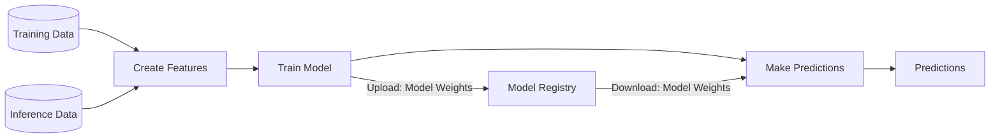

<!-- gid:20250630T000000 -->
[TOC]

Table of Contents

- [2025-06-30 Mon](#2025-06-30-mon)
- [2025-07-01 Tue](#2025-07-01-tue)
- [2025-07-02 Wed](#2025-07-02-wed)
- [2025-07-03 Thu](#2025-07-03-thu)
- [2025-07-04 Fri](#2025-07-04-fri)
- [2025-07-05 Sat](#2025-07-05-sat)
- [2025-07-06 Sun](#2025-07-06-sun)
- [NEWNOTES](#newnotes)
- [REFILED](#refiled)
- [CITATIONS](#citations)
- [PREVIOUS](#previous)

<!--endtoc-->

[[TIP("인용")]] (excellent_advice_for_living.t2t)<br /> Expand your mind by thinking with your feet on a walk or with your hand in a notebook. Think outside your brain. 산책하면서 발로 생각하거나 노트에 손을 대고 생각하며 마음을 확장하세요. 뇌 밖에서 생각하세요. [[/TIP]] 2025-06-30 Mon [[TIP("인용")]] (kevin-kelly-99.t2t)<br /> Compliment people behind their back. It’ll come back to you. 사람들 뒤에서 칭찬하세요. 그것이 결국 당신에게 돌아올 것입니다. [[/TIP]] 05:42 굳모닝 - 업위크 (마이클 싱어 2014) 책으로 열어내는 한 주 07:12 사무실 도착 (빅터 프랭클 2020) 프랭클의 책과 함께 08:31 브레이크 09:24 mermaid 설치 적극 활용 - [다이어그램 이맥스 조직모드: mermaid platuml d2](https://wikidocs.net/381177)

### 09:58 이제 온갖 다이어그램을 가져와서 그릴 수 있지



### 14:01 식사 복귀 후

### 14:39 복잡한 다이어그램

### 21:03 온생명 데려다주고 돌아옴

하루의 마무리 잠시만 메타라도 내보내자

### 21:45 메타 업데이트 자자

## 2025-07-01 Tue

[[TIP("인용")]] (kevin-kelly-99.t2t)<br /> The greatest breakthroughs are missed because they look like hard work. 가장 위대한 돌파구는 힘든 일처럼 보여서 놓치게 된다. [[/TIP]] 03:53 `중도` 도덕경 05:45 기상 준비 하고 나가자 07:15 출근 - 모닝 루틴 - [X] 오디오북 (마이클 싱어 2023) - [X] 커피 - [X] 손가락을 풀자 - [X] 숨겨진 버그 : 이미지 링크, 한글 스펠링 사전 연결 고리 <span class="org-todo todo TODO">TODO</span> 07:45 1장 칸트 철학과 현대 물리학 - jinx hunspell 수정 [2025-07-01 Tue 08:36] 훈스펠 enchant 연결 안되어 있네 <span class="org-todo done DONE">DONE</span> 08:35 첨부 파일 이미지 링크 수정 완료 08:46 브레이크 업모닝 고우! 14:18 그렇다면 코딩에 집중 <span class="org-todo todo TODO">TODO</span> 15:06 AMDGPU-TOP Umio-Yasuno/Amdgpu\\_top (Yasuno [2023] 2025) Yasuno, Umio 2025 Tool to display AMDGPU usage <span class="org-todo todo TODO">TODO</span> 17:00 aider openrouter ```text
# Change directory into your codebase
cd /to/your/project

# Or any other open router model
aider --model openrouter/<provider>/<model>

# List models available from OpenRouter
aider --list-models openrouter/
``` - openrouter/deepseek/deepseek-coder - openrouter/deepseek/deepseek-r1 <span class="org-todo done DONE">DONE</span> 17:31 thingsboard 대시보드 - 위젯 (thingsboard n.d.-e) (thingsboard n.d.-f) (thingsboard n.d.-a) 17:41 thingsboard - maven-install ```shell
mvn spring-boot:run

``` <span class="org-todo todo TODO">TODO</span> 18:05 씽스보드 프론트 백엔드 코드로 빌드 프론트 전체 코드를 기준으로 인공지능으로 커스텀 코드를 생성 이렇게 되면 인공지능으로 코드를 생성할 수 있다. 20:18 온생명 데리고 가자 2025-07-02 Wed [[TIP("인용")]] (excellent_advice_for_living.t2t)<br /> Be more generous than necessary. No one on their deathbed has ever regretted giving too much away. There is no point to being the richest person in the cemetery. 필요 이상으로 더 관대해지세요. 임종을 앞둔 사람이 너무 많이 나눠준 것을 후회한 적은 없습니다. 묘지에서 가장 부자가 되는 것은 아무 의미가 없습니다. [[/TIP]] 오늘의 목표 [2025-07-02 Wed 08:34] - [ ] ThingsBoard UI 코드 - 대시보드 위젯 에이전트 코딩 01:16 지속 가능한 지식 학습 방법 그럼에도 코드 에이전트 활용 집중 05:41 기상 - 증강형 코딩 - 켄트백 인공지능 끌어낼 수 있는 방법을 훈련하라. 이것이 3개월 수습의 개인적 목표다. 자유를 얻기 위해서는 자유를 줘야 한다. 줘야 얻는다. 지식을 쌓고 융합하는 방법은? 노트를 남기는 것 이상으로 흔적을 정리하는 방법에 대한 연구는 아무래도 폴게제텔 아닐까? 시퀀스를 연결하는 것에 대한 기대. 메타다. 그 일을 어떻게 메타인지의 차원에서 바라 볼 수 있는가? 그 일을 어떻게 표준화할 수 있는가? 그 일은 그 일이 아니다. ABD다. 사르트르의 ABC다. [사르트르 1905 존재와무 현상학 실존주의](https://notes.junghanacs.com/bib/20250702T055023/)

### 06:11 레버리지 마인드

샤워하면서 딱 왔다. 레버리지 책 서문에 나오는 영국 프로그래머 사례. 인도 아웃소싱. 회사 잘림. 그러나 저자는 높게 평가함 (롭 무어 2019)

### 06:16 업모닝 나가자

### 07:20 출근 - 레버리지 마인드 글 대기

### 08:49 모닝워시

### 12:20 다음 질문 좀 해줘

2=1=1=1 ¥: #AI #프론트엔드 #에이전틱 #프로토타이핑 #CICD #배치 #생성::|2025-07-02 Wed 11:21|

### 13:40 업런치 &lt;- 병원 이발 식사 복귀

레버리지 포인트 생각하라

### 18:07 퇴근

## 2025-07-03 Thu

[[TIP("인용")]] 우리가 반복적으로 행하는 것이 우리 자신이다. 그렇다면 탁월함은 행동이 아닌 습관인 것이다. — 아리스토텔레스 [[/TIP]] 05:24 기상 - 고요함의 지혜 - 몽테뉴 - 법정 05:33 에이전트 인 액션 (마이클 래넘 2025) [모음 도서: 개발자 페어 프로그래밍 코파일럿 프롬프트 에이전트](https://notes.junghanacs.com/bib/20240915T114009/)

### 05:48 나가자

### 07:20 출근 오래 걸렸다. K패스

### 08:42 구토

약 때문인가 구토가 올라온다. 얼마나 인간은 약한가. 구토가 올라오는데 무슨 일을 할 수 있는가? 갈 때까지 기다려야 한다. 진정이 될 때까지 기다려야 한다. 할 수 있는 것은 들숨 날숨 정도가 아니겠는가. 키보드 두드리는 것도 힘들다. 아니다. 이건. 기다리자.

### <span class="org-todo todo TODO">TODO</span> 08:49 디파이 설치

[LangGenius Dify.ai 에이전틱 AI 개발 플랫폼 - 지식베이스 클러스터](https://notes.junghanacs.com/notes/20250625T110347/)

#### 도커 설치 모든 노드에 도커 설치

[2025-07-03 Thu 08:55] [리눅스 도커 설치](https://notes.junghanacs.com/notes/20241111T152209/)

### 15:22 스토리지 서버 다시 설정

### 18:21 네트워크 연결까지 확인 퇴근하자

### 20:21 온생명 집에 고고

### 09:30 자자 피곤하다

## 2025-07-04 Fri

### 01:40 자각몽 꿈 현실 어딘가 아픈 삶의 이야기가 영화처럼 얽히다

### 01:49 내보내기 모두

-   [월간 아카이브: 202506..T\*](https://notes.junghanacs.com/journal/20250601T000001/) 특히 챙겨
-   [모음 월간 최근노트](https://notes.junghanacs.com/notes/20250327T125948/) 7월로 변경

### 02:27 오픈라우터 - 모델 정리 지피텔

[2025-07-04 Fri 02:29] 지피텔 오픈라우터 모델을 몇개 지정 및 관련 정보 추가 [이맥스: 지피텔 활용법](https://notes.junghanacs.com/notes/20240830T161957/)

```elisp
(defconst gptel--openrouter-models
  '(
     ;; May 28th update to the original DeepSeek R1 Performance on par with OpenAI o1, but open-sourced and with fully open reasoning tokens. It's 671B parameters in size, with 37B active in an inference pass.
    (deepsek/deepseek-r1-0528 ;; 2025-07-04
     :capabilities (tool reasoning)
     :context-window 128
     :input-cost 0.50
     :output-cost 2.15)

    ;; DeepSeek V3, a 685B-parameter, mixture-of-experts model, is the latest iteration of the flagship chat model family from the DeepSeek team.
    (deepseek/deepseek-chat-v3-0324
     :capabilities (tool)
     :context-window 163
     :input-cost 0.28
     :output-cost 0.88)

    ;; https://openrouter.ai/google/gemini-2.5-pro
    (google/gemini-2.5-pro
     :capabilities (media tool-use cache)
     :mime-types ("image/jpeg" "image/png" "image/gif" "image/webp" "application/pdf")
     :context-window 1048
     :input-cost 1.25
     :output-cost 10)

;; GPT-4o mini Search Preview is a specialized model for web search in Chat Completions. It is trained to understand and execute web search queries.
    (openai/gpt-4o-mini-search-preview
     :description "Cheap model for fast tasks; cheaper & more capable than GPT-3.5 Turbo"
     :capabilities (media tool-use json url)
     :mime-types ("image/jpeg" "image/png" "image/gif" "image/webp")
     :context-window 128
     :input-cost 0.15
     :output-cost 0.6
     )
    ;; https://openrouter.ai/anthropic/claude-sonnet-4
    (anthropic/claude-sonnet-4
     :description "Hybrid model capable of standard thinking and extended thinking modes"
     :capabilities (media tool-use cache)
     :mime-types ("image/jpeg" "image/png" "image/gif" "image/webp" "application/pdf")
     :context-window 200
     :input-cost 3
     :output-cost 15
     :cutoff-date "2025-05")

    (anthropic/claude-opus-4
     :description "Hybrid model capable of standard thinking and extended thinking modes"
     :capabilities (media tool-use cache)
     :mime-types ("image/jpeg" "image/png" "image/gif" "image/webp" "application/pdf")
     :context-window 200
     :input-cost 15
     :output-cost 75
     :cutoff-date "2025-05"))
```

### 02:38 다시 자자 - 멀리서 목탁 소리가 들린다 용화사에서 스님?

아직 일어날 시간 아닐텐데. 스님 3시에 일어나시든가. 저도 삶의 목탁 탁탁

### 04:59 기상

### 06:01 기상2 나가야지

### 07:37 출근 아 묶을 것들은 묶어야 한다.

마깃도 묶어야 한다.

### 08:35 터미널 xfce4-terminal

이것도 괜찮지. x11에서

### 10:14 리눅스 mp3 플레이어 설치

[음악: 리눅스 플레이어 mp3 rhythmbox 리듬박스](https://wikidocs.net/381764)

### <span class="org-todo done DONE">DONE</span> 10:51 스위치에 시리얼로 붙여서 컨트롤러 10G 활성화

10G 활성화 불가 된장

### <span class="org-todo done DONE">DONE</span> 16:28 보안키 만들기

#LLM: AI 서버 클러스터 - 보안키 배포 관리

### <span class="org-todo todo TODO">TODO</span> 17:37 스위치 컨트롤러 연결 방법

#### <span class="org-todo todo TODO">TODO</span> NEXTU 8x10G SFP L3 Fiber Switch 컨트롤러 연결 방법과 Mtu 9000 설정

(“NEXTU 8x10G SFP L3 Fiber Switch 컨트롤러 연결 방법과 Mtu 9000 설정” n.d.)

1.  How do I connect a controller to a \`\`NEXTU 8-Port 10 G SFP+ L3 Fiber Switch (model 3208SFPL3-10G)'' and set the MTU to 9000? 콘솔 포트 사용 - 스위치 전면의 RJ-45...

### <span class="org-todo done DONE">DONE</span> 데스크톱 XFCE4 VNC XRDP 연결

[2025-07-04 Fri 17:48] [Xfce4 Desktop 설치 우분투 서버 22.04 - 리모트 Vnc Xrdp 연결](https://wikidocs.net/381765)

### 18:06 나가자

### 19:58 집 온생명이 데려다주자

### 20:57 평일 마무리. 자고 내일 다시 나가자

### 21:25 회사생활 2주차 힣 손가락 내맡김

[2025-07-04 Fri 20:42] [[TIP("주의")]] 손가락을 내맡겼다고 떠느는 힣은 회사 생활 2주. 살다살다 이런 존중을 받아 본적이 있었는가? 작은 AI 클러스터를 만들고 있다. 사실 하는 짓이라곤 이맥스라는 텍스트 편집기에서 줄창 타이핑을 하고 놀고 있는 것 뿐이다. 돈 안벌때도 하던 일이며 물류창고 다녀와서도 하던 일이다. 언제나 하던 그 일이다. 손가락을 무언가에 내맡겼기에 어디로 갈지 모른다. 내가 있으려거든 그건 허물어질 것이다. 더 가지려거든 더 사라질 것이다. 사라지려거든 남을 것이다. 놀라운 인연 속에 그저 감사할 뿐이다. 비가 오려거든 비를 맞으리라. 이 비가 마지막 비기에 빗방울을 경험하리라. 오직 바라는 것이 있다면 오늘 살아있음 음 음 음 음 음 음... [[/TIP]] 손가락을 내맡겼다고 떠느는 힣은 회사 생활 2주. (“스레드 회사 생활 2주 힣” n.d.) 회사생활 2주차 AI 유희자 (“회사생활 2주차 AI 유희자” 2025) Screenshot_20250705_212640_Threads 손가락 내맡김 힣 라이프 22:10 자작시 눈물 [2025-07-04 Fri 22:10] [[TIP("버그")]] 눈물 슬퍼서 아파서 화나서 억울해서 눈물이 난다. 근데 고마워서 감격해서 기뻐서 행복해서도 눈물이 난다. 눈에 뭐가 들어가도 눈물이 난다. 눈물이 한방울 두방울 나오면 흘러서 얼굴을 따라 주르륵 흐른다. 가만히 눈물을 따라가 보면 방울이 미끄럼틀을 타고 내린다. 좋아서 슬퍼서 그 뒤에 두고 눈물이 되어 흘러본다. 아 간지럽고 누워있자니 귀로 쏙 들어가버린다. 아놔. 눈물. 흐르는 것이. 이거시 아이고. 아이고. 눈물을 앎이련가. 존재함을 드러냄이련가. 나있음. 더 할게 없음에. 이 순간 선풍기 바람소리. 부우이웅이웅 그리고 무의 소리 있음의 소리뿐. [[/TIP]] 눈물 - 스레드 (“자작시 눈물 스레드” n.d.) ‎Gemini 해석 - 눈물: 감정, 존재, 그리고 고요함 (“‎Gemini - 눈물: 감정, 존재, 그리고 고요함” n.d.) 내맘 잘아는구먼 [[TIP("노트")]] 이 시는 **'눈물'**이라는 보편적인 현상을 통해 인간의 다양한 감정과 존재에 대한 깊은 사유를 담고 있습니다. 시인이 눈물을 어떻게 바라보고 있는지 단계적으로 살펴보겠습니다. - 눈물의 다양한 의미 시의 첫 부분에서 시인은 눈물이 나는 여러 상황을 나열하며 눈물이 단순히 슬픔이나 고통에서만 비롯되는 것이 아님을 보여줍니다. "슬퍼서 아파서 화나서 억울해서" 나는 눈물뿐만 아니라, "고마워서 감격해서 기뻐서 행복해서" 나는 눈물도 함께 언급하여 눈물이 인간의 복합적인 감정을 표현하는 수단임을 드러냅니다. 심지어 "눈에 뭐가 들어가도 눈물이 난다"는 구절은 물리적인 자극에 의한 눈물까지 포괄하며, 눈물이라는 현상 자체의 폭넓은 스펙트럼을 제시합니다. - 눈물의 흐름과 시각적 이미지 이어지는 부분에서는 눈물이 흐르는 모습에 대한 시각적인 묘사가 두드러집니다. "한방울 두방울 나오면 흘러서 얼굴을 따라 주르륵 흐른다"는 표현은 눈물의 물리적인 흐름을 생생하게 전달합니다. 특히 "가만히 눈물을 따라가 보면 방울이 미끄럼틀을 타고 내린다"는 비유는 눈물이 얼굴을 타고 내려오는 모습을 아이들의 미끄럼틀처럼 순수하고 동적인 이미지로 표현하여, 눈물이 지닌 단순한 액체 이상의 의미를 부여합니다. - 눈물을 통한 존재의 자각 시의 후반부에서는 눈물이 감정을 넘어선 존재론적인 의미로 확장됩니다. "좋아서 슬퍼서 그 뒤에 두고 눈물이 되어 흘러본다"는 구절은 감정의 근원을 넘어선 눈물 자체의 존재성을 이야기합니다. 눈물이 귀로 들어간다는 익살스러운 표현 뒤에는 "눈물을 앎이련가. 존재함을 드러냄이련가. 나있음. 더 할게 없음에."라는 깊은 질문이 이어집니다. 이는 눈물이 단순히 흘러내리는 액체가 아니라, 자신의 존재를 확인하고 드러내는 방식이 될 수 있음을 시사합니다. 더 이상 아무것도 할 수 없는 '더 할게 없음에'의 상태에서 눈물은 오히려 '나있음'을 증명하는 역설적인 매개가 됩니다. - 고요한 마무리 마지막 구절인 "이 순간 선풍기 바람소리. 부우이웅이웅 그리고 무의 소리 있음의 소리뿐."은 시적 화자가 눈물과 자신의 존재에 대한 깊은 사유를 마친 후 찾아오는 고요하고 명상적인 순간을 보여줍니다. 시끄러운 감정의 소용돌이를 넘어, 선풍기 소리나 '무(無)의 소리', 즉 존재의 본질적인 소리만이 남은 상태는 모든 번뇌를 초월한 평온함을 암시합니다. 결론적으로 이 시는 눈물이라는 흔한 현상을 통해 인간의 복합적인 감정, 그리고 더 나아가 존재의 의미를 탐구하며 삶의 다양한 면모와 존재의 깊이를 성찰하게 하는 시라고 할 수 있습니다. [[/TIP]] Screenshot_20250705_222356_Threads 자작시 눈물 2025-07-05 Sat 02:48 자각몽 2번 2시간 간격 늑대 아내 06:28 기상 나가자 07:55 출근 - 산학연 과제 논문에 대한 생각 문득 [정부 대학 교수 과제 연계 산학연](https://wikidocs.net/381006)

### 08:38 펌웨어 업데이트

### 11:15 다이소 2곳 하이마트를 돌아 USB 이더넷 사옴

### 14:49 이제 네트워크 정리 - 아직 보안키 생성

### <span class="org-todo todo TODO">TODO</span> 15:02 VNC 만들어 놓을 것

### 18:06 퇴근하자

### <span class="org-todo todo TODO">TODO</span> 라즈베리파이 하모니카

[2025-07-05 Sat 18:14] HamoniKR for Raspberry Pi 5 하모니카 라즈베리파이 (“HamoniKR for Raspberry Pi 5 하모니카 라즈베리파이” 2024) 라즈베리파이5에서 사용하실 수 있는 하모니카 ARM 버전입니다. Balena-Io/Etcher: Flash OS Images to SD Cards USB Drives, Safely and Easily 라즈베리파이 하모니카 (“Balena-Io/Etcher: Flash OS Images to SD Cards &38; USB Drives, Safely and Easily 라즈베리파이 하모니카” n.d.) 2025-07-06 Sun 07:56 아침 식사 빅터프랭클 언제나 프랭클 (빅터 프랭클 2020) 13:13 컨디션 회복하라 16:17 컴퓨터 두드리는 일도 건강해야 한다 머리 아프니 건들고 싶지도 않다. 그냥 누워서 책만 듣는다. 17:34 이더패드 - 실시간 공동 편집 etherpad ; 오픈소스 온라인 공동 편집 - 이맥스 연동 [실시간공동편집: 조테로 오메가티 지식통합](https://wikidocs.net/381379)

## NEWNOTES

-   [최근노트 모음](https://wikidocs.net/381627)

-   [정부 대학 교수 과제 연계 산학연 (2025-07-05)](https://wikidocs.net/381006)
-   #업무#프로젝트 (2025-07-05)
-   #Thingsboard 크로스플랫폼 모바일 개발 flutter 프롬프트 (2025-07-05)
-   #네트워크 #보안키 #배포 AI 사내 서버 클러스터 - 보안키 배포 관리 - 배스천 호스트 Bastion Host - 내부망 (2025-07-04)
-   #미니PC NUC (2025-07-04)
-   #LLM: 임베디드 DDOS 보안성 시뮬레이션 홈카메라 (2025-07-03)
-   #업무 #AI활용 #플랫폼 (2025-07-01)
-   #업무 #AI활용 #임베디드 (2025-07-01)
-   #업무 #AI활용 #프론트엔드 (2025-07-01)
-   #업무#AI활용 (2025-07-01)
-   #업무 (2025-07-01)
-   ¥: #오픈API: kmak 제공 및 보안 정책 - 국내 협력사 (2025-07-01)
-   [네트워크 리눅스: 무선랜 간단 설정 netplan (2025-07-05)](https://wikidocs.net/381766)
-   [Xfce4 Desktop 설치 우분투 서버 22.04 - 리모트 Vnc Xrdp 연결 (2025-07-05)](https://wikidocs.net/381765)
-   [음악: 리눅스 플레이어 mp3 rhythmbox 리듬박스 (2025-07-04)](https://wikidocs.net/381764)
-   [cheat (2025-07-04)](https://wikidocs.net/381763)
-   [클러스터: 캐시 bcache RAID 스토리지 gpustack dify (2025-07-03)](https://wikidocs.net/381762)
-   [분산처리프레임워크: Ray (2025-07-03)](https://wikidocs.net/381761)
-   [GPUStack AI 클러스터 GPU 관리자 오픈소스 (2025-07-03)](https://wikidocs.net/381760)
-   [네트워크: 10GbE 100GbE 이더넷 인피니밴드 - 클러스터 리눅스 (2025-07-02)](https://wikidocs.net/381759)
-   [이맥스통합개발환경크로스플랫폼: 다트 플러터 (2025-07-02)](https://wikidocs.net/381757)
-   [모음: 인공지능 스타트업 회사 (2025-06-30)](https://wikidocs.net/381756)
-   [플랫폼: IoT 아이오티 개념 키워드 확장 (2025-06-30)](https://wikidocs.net/381755)
-   [시스템 플랫폼 생태계 관계 확장 개념 (2025-06-30)](https://wikidocs.net/381754)
-   [재현성 파이썬 생태계 도구 pyenv poetry poethepoet (2025-06-30)](https://wikidocs.net/381753)
-   [조직모드 마우스 입문자 인터페이스 (2025-06-30)](https://wikidocs.net/381752)
-   [데스크톱환경gnome kde xfce x11 (2025-07-04)](https://wikidocs.net/381005)
-   [스토리지저장장치RAID 캐시 (2025-07-03)](https://wikidocs.net/381004)
-   [크로스플랫폼 (2025-07-02)](https://wikidocs.net/381003)
-   #LLM: 이맥스 시리얼 포트 접속 연동 ¤minicom (2025-07-04)
-   #LLM: pytorch 파이썬 (2025-07-03)
-   #LLM: NVIDIA 리눅스 드라이버 설치 관련 (2025-07-03)
-   [LLM: 프론트엔드 컴포넌트 라이브러리 thingsboard react angular (2025-07-02)](https://wikidocs.net/381758)
-   #LLM: 날짜 요일 대소문자 Downcase customid (2025-07-02)
-   #LLM: Thingsboard 백엔드 프론트엔드 ui-ngx 빌드 로그인 테스트 (2025-07-01)
-   #LLM: 깃허브 프로 플러스 고급 요금제 비교 Pro Plus (2025-07-01)
-   #LLM: thingsboard ui widget dashboard build (2025-07-01)
-   #LLM: AMD 라이젠 노트북 리눅스 #ROCm (2025-07-01)
-   #LLM: ¤Ollama 라이젠 노트북 모델 (2025-07-01)
-   @OKFN: 오픈 열린 지식 재단 (2025-07-01)
-   #LLM: git £index.lock 문제 (2025-06-30)
-   #LLM: embark-file-map with consult-org-heading (2025-06-30)
-   [롭무어 레버리지 자본주의 속에 숨겨진 부의 비밀 (2025-07-02)](https://wikidocs.net/382494)
-   [사르트르 1905 존재와무 현상학 실존주의 (2025-07-02)](https://wikidocs.net/382493)
-   [IoT 플랫폼: Thingsboard 대시보드 풀스택 오픈소스 (2025-07-01)](https://wikidocs.net/382492)
-   [Ollama ollama localai 로컬LLM 실행도구 (2025-07-01)](https://wikidocs.net/382491)
-   [OpenHomeFoundation 지속 가능한 스마트홈 오픈소스 생태계 (2025-07-01)](https://wikidocs.net/382490)
-   [알폰소링기스 아무것도 공유하지 않은 자들의 공동체 (2025-06-30)](https://wikidocs.net/382489)

## REFILED

## CITATIONS

### [검색어: urldate = {2025-06-30}]

-   Pyenv/Pyenv (Slipbox) (“Pyenv/Pyenv” [2012] 2025)
-   증강형 코딩: 바이브를 넘어서 (Slipbox) (spilist2 2025)

<!--listend-->

-   Mlabonne/Blog: <https://mlabonne.github.io/blog/> (Slipbox) (“Mlabonne/Blog: https://mlabonne.github.io/blog/” n.d.)
-   Mlabonne - Overview (Slipbox) (“Mlabonne - Overview” n.d.)
-   Poe the Poet Documentation (Slipbox) (“Poe the Poet Documentation” n.d.)

### [검색어: urldate = {2025-07-01}]

-   S-Kostyaev/Ellama (Slipbox) (Kostyaev [2023] 2025)
-   Snowy-0wl/Piper-Mode (Slipbox) (snowy- 0wl [2025] 2025)
-   Umio-Yasuno (Slipbox) (Yasuno [2023] 2025)
-   AI Assistance Widget (Slipbox) (thingsboard n.d.-a)
-   Angular: Web Development Framework (Slipbox) (“Angular: Web Development Framework” n.d.)
-   Building from Sources (Slipbox) (thingsboard n.d.-b)
-   🏡 Home (Slipbox) (“🏡 Home Open WebUI” n.d.)
-   Ollama (Slipbox) (“Ollama” n.d.)
-   Open Home Foundation (Slipbox) (“Open Home Foundation” n.d.)
-   Quick Start Installation Guide --- ROCm (Slipbox) (“Quick Start Installation Guide –- ROCm Installation (Linux)” n.d.)
-   ReadmeX (Slipbox) (“\#ReadmeX - Thingsboard/Thingsboard - 코드분석” n.d.)
-   Ubuntu Native Installation --- ROCm (Slipbox) (“Ubuntu Native Installation –- ROCm Installation (Linux)” n.d.)
-   Widgets Development Guide (Slipbox) (thingsboard n.d.-e)
-   Working with IoT (Slipbox) (thingsboard n.d.-f)

### [검색어: urldate = {2025-07-02}]

-   Cxbxmxcx/GPT-Agents (Slipbox) (Lanham [2023] 2025)
-   GLips (Slipbox) (Lipsman [2025] 2025)
-   Gpustack/Gpustack (Slipbox) (“Gpustack/Gpustack” [2024] 2025)
-   피그마를 HTML (Slipbox) (bamchi n.d.)
-   Canonical/Ubuntu-Flutter-Plugins: A (Slipbox) (“Canonical/Ubuntu-Flutter-Plugins: A Collection of Flutter Plugins and Packages for Ubuntu Applications.” n.d.)
-   Claude Code로 (Slipbox) (bamchi 2025)
-   Get the Dart SDK (Slipbox) (“Get the Dart SDK - Android Ide \#다트 \#안드로이드 \#개발” n.d.)
-   GitHub Copilot (Slipbox) (“GitHub Copilot” n.d.-a)
-   GitHub Copilot (Slipbox) (“GitHub Copilot” n.d.-b)

<!--listend-->

-   Installing ThingsBoard (Slipbox) (thingsboard n.d.-c)
-   LM Studio (Slipbox) (“LM Studio 0.3.15: RTX 50-Series GPUs and Improved Tool Use in the API” n.d.)
-   LM Studio (Slipbox) (“LM Studio - Discover, Download, and Run Local LLMs” n.d.)
-   New Conversation \\(\cdot\\) (Slipbox) (“New Conversation · GitHub Copilot Spaces · 모바일 크로스플랫폼 AI 에이전트 개발 방안” n.d.)
-   Post-Installation Steps 도커 리눅스 우분투 설치 필수 스텝 (Slipbox) (“Post-Installation Steps 도커 리눅스 우분투 설치 필수 스텝” 15AD)
-   Start Building Flutter Android (Slipbox) (“Start Building Flutter Android Apps on Linux \#플러터 안드로이드 리눅스 개발환경 설치 공식” n.d.)
-   Thingsboard/Flutter\\_thingsboard\\_app: ThingsBoard Mobile Application (Slipbox) (“Thingsboard/Flutter\_Thingsboard\_App: ThingsBoard Mobile Application” n.d.)
-   \\#깃허브 \\#코파일럿 \\#프롬프트 \\#플러터 \\#개발 ThingsBoard Flutter (Slipbox) (“\#깃허브 \#코파일럿 \#프롬프트 \#플러터 \#개발 ThingsBoard Flutter App Structure Overview · GitHub Copilot” n.d.)
-   Vibecoding은 개발자의 전문성을 없애는 것이 아니라, 전문성이 필요한 영역을 바꾼다 (Slipbox) (ashbyash 2025)
-   What Is ThingsBoard IoT Gateway (Slipbox) (thingsboard n.d.-d)
-   Yaru - Ubuntu Flutter Sample \\#우분투 플러터 샘플 (Slipbox) (“Yaru - Ubuntu Flutter Sample \#우분투 플러터 샘플” n.d.)

### [검색어: urldate = {2025-07-03}]

-   Ray-Project/Ray 분산처리프레임워크 GPUStack AI (Slipbox) (“Ray-Project/Ray 분산처리프레임워크 GPUStack AI 컴퓨팅” [2016] 2025)
-   Dify Integrate Local Models (Slipbox) (Dify n.d.)
-   Index of /Compute/Cuda/Repos/Ubuntu2204/X86\\_64 - Nvidia Linux Deb Repos Apt (Slipbox) (“Index of /Compute/Cuda/Repos/Ubuntu2204/X86\_64 - Nvidia Linux Deb Repos Apt” n.d.)
-   GPUStack DIFY (Slipbox) (“GPUStack DIFY 리눅스 스토리지 스택 설치 방법 - 캐시 RAID10” n.d.)
-   Online Installation (Slipbox) (“Online Installation - GPUStack” n.d.)
-   RTX (Slipbox) (“RTX 5080를 지원하는 Pytorch 스택이 언제 가능할 것인가” n.d.)
-   Thingsboard Pe Edition Source Code 소스코드 백엔드 빌드 프론트엔드 (Slipbox) (“Thingsboard Pe Edition Source Code 소스코드 백엔드 빌드 프론트엔드” n.d.)

### [검색어: urldate = {2025-07-04}]

-   10년 넘게 쓴 AWS를 (Slipbox) (bamchi 2024)
-   중국어처럼 쓰여진 영어 (1999) (Slipbox) (neo 2024)
-   Mlxup - Mellanox Update (Slipbox) (“Mlxup - Mellanox Update and Query Utility - ConnectX-3” n.d.)
-   NEXTU 8x10G SFP L3 Fiber Switch (Slipbox) (“NEXTU 8x10G SFP L3 Fiber Switch 컨트롤러 연결 방법과 Mtu 9000 설정” n.d.)
-   NEXTU 넥스트유 스하판 L3 8포트10G SFP+ 이더넷 스위치 3208SFPL3-10G (Slipbox) (대흥정보기술 n.d.)
-   NVIDIA Firmware Tools (Slipbox) (“NVIDIA Firmware Tools (MFT) - ConnectX-3” n.d.)

### [검색어: urldate = {2025-07-05}]

-   10G SFP+DAC 지빅 일체형 1M 케이블 NEXT-SFP10G-DAC01 (Slipbox) (넥스트유샵 n.d.)
-   Balena-Io/Etcher: Flash OS (Slipbox) (“Balena-Io/Etcher: Flash OS Images to SD Cards &#38; USB Drives, Safely and Easily 라즈베리파이 하모니카” n.d.)
-   BIOSTAR B850MT-E PRO \\#메인보드 mainboard (Slipbox) (“BIOSTAR B850MT-E pro \#메인보드 Mainboard” n.d.)
-   Firmware Support (Slipbox) (“Firmware Support and Downloads - Identifying Adapter Cards ConnectX-3” n.d.)
-   HamoniKR (Slipbox) (“HamoniKR for Raspberry Pi 5 하모니카 라즈베리파이” 2024)
-   Nvidia-Mellanox ConnectX-3 Networking Adapter (Slipbox) (“Nvidia-Mellanox ConnectX-3 Networking Adapter/Device Linux Firmware - 2.42.5032” n.d.)
-   Prometheus - Monitoring (Slipbox) (“Prometheus - Monitoring System &#38; Time Series Database” n.d.)

### [검색어: urldate = {2025-07-06}]

## BIBLIOGRAPHY

<style>.csl-entry{text-indent: -1.5em; margin-left: 1.5em;}</style>
  넥스트유샵. n.d. “10G SFP+DAC 지빅 일체형 1M 케이블 next-SFP10G-DAC01.” 넥스트유샵. Accessed July 5, 2025. [https://nextu.kr/product/10g-sfpdac-지빅-일체형-1m-케이블-next-sfp10g-dac01/503/](https://nextu.kr/product/10g-sfpdac-지빅-일체형-1m-케이블-next-sfp10g-dac01/503/).
  대흥정보기술. n.d. “NEXTU 넥스트유 스하판 L3 8포트10G SFP+ 이더넷 스위치 3208SFPL3-10G.” 대흥정보기술(주). Accessed July 4, 2025. [https://rftown.com/product/nextu-넥스트유-스하판-l3-8포트10g-sfp-이더넷-스위치-3208sfpl3-10g/14939/](https://rftown.com/product/nextu-넥스트유-스하판-l3-8포트10g-sfp-이더넷-스위치-3208sfpl3-10g/14939/).
  마이클 싱어. 2014. <i>상처받지 않는 영혼: 내면의 자유를 위한 놓아보내기 연습</i>. Translated by 이균형. 서울: 라이팅하우스. [https://www.yes24.com/Product/Goods/12981014](https://www.yes24.com/Product/Goods/12981014).
  ———. 2023. <i>삶이 당신보다 더 잘 안다: 숲속 현자의 내맡김 수업</i>. Translated by 이균형. 고양: 라이팅하우스. [https://www.yes24.com/Product/Goods/123146766](https://www.yes24.com/Product/Goods/123146766).
  마이클 래넘. 2025. <i>AI 에이전트 인 액션</i>. Translated by 류광. [https://m.yes24.com/goods/detail/148412805](https://m.yes24.com/goods/detail/148412805).
  빅터 프랭클. 2020. <i>죽음의 수용소에서: 죽음조차 희망으로 승화시킨 인간 존엄성의 승리</i>. Translated by 이시형. 개정보급판. 파주: 청아출판사. [https://www.yes24.com/product/goods/90384709](https://www.yes24.com/product/goods/90384709).
  롭 무어. 2019. <i>레버리지 자본주의 속에 숨겨진 부의 비밀</i>. [http://www.yes24.com/Product/Goods/74208134](http://www.yes24.com/Product/Goods/74208134).
  “자작시 눈물 스레드.” n.d. Accessed July 6, 2025. [https://www.threads.com/@junghanacs/post/DLukSinz8-0](https://www.threads.com/@junghanacs/post/DLukSinz8-0).
  0wl, snowy-. (2025) 2025. “Snowy-0wl/Piper-Mode.” [https://github.com/snowy-0wl/piper-mode](https://github.com/snowy-0wl/piper-mode).
  “스레드 회사 생활 2주 힣.” n.d. Accessed July 6, 2025. [https://www.threads.com/@junghanacs/post/DLucACrzGKB](https://www.threads.com/@junghanacs/post/DLucACrzGKB).
  “회사생활 2주차 AI 유희자.” 2025. 성인 ADHD와 함께 하는 삶 》 시즌3: 텍스트 힙스터. July 5, 2025. [https://living-with-adhd.tistory.com/268](https://living-with-adhd.tistory.com/268).
  “Angular: Web Development Framework.” n.d. Accessed July 1, 2025. [https://angular.dev/](https://angular.dev/).
  ashbyash. 2025. “Vibecoding은 개발자의 전문성을 없애는 것이 아니라, 전문성이 필요한 영역을 바꾼다.” June 30, 2025. [https://news.hada.io/topic?id=21746](https://news.hada.io/topic?id=21746).
  “Balena-Io/Etcher: Flash OS Images to SD Cards &#38; USB Drives, Safely and Easily 라즈베리파이 하모니카.” n.d. Accessed July 5, 2025. [https://github.com/balena-io/etcher](https://github.com/balena-io/etcher).
  bamchi. 2024. “10년 넘게 쓴 AWS를 탈출하게 된 계기와 대안.” June 4, 2024. [https://news.hada.io/topic?id=15172](https://news.hada.io/topic?id=15172).
  ———. 2025. “Claude Code로 17시간만에 Acticrawl.Com 완성: AI 협업의 새로운 가능성.” June 29, 2025. [https://news.hada.io/topic?id=21721](https://news.hada.io/topic?id=21721).
  ———, ed. n.d. <i>피그마를 HTML, CSS로 1분만에 코딩하기! Figma-Context-MCP</i>. Directed by bamchi. Accessed July 2, 2025. [https://www.youtube.com/watch?v=bR69IWIxCAk](https://www.youtube.com/watch?v=bR69IWIxCAk).
  “BIOSTAR B850MT-E pro \#메인보드 Mainboard.” n.d. Accessed July 5, 2025. [https://prod.danawa.com/info/?pcode=78102320](https://prod.danawa.com/info/?pcode=78102320).
  “Canonical/Ubuntu-Flutter-Plugins: A Collection of Flutter Plugins and Packages for Ubuntu Applications.” n.d. Accessed July 2, 2025. [https://github.com/canonical/ubuntu-flutter-plugins](https://github.com/canonical/ubuntu-flutter-plugins).
  Dify. n.d. “Dify Integrate Local Models with GPUStack.” Accessed July 3, 2025. [https://docs.dify.ai/en/development/models-integration/gpustack#integrate-local-models-deployed-by-gpustack](https://docs.dify.ai/en/development/models-integration/gpustack#integrate-local-models-deployed-by-gpustack).
  “Firmware Support and Downloads - Identifying Adapter Cards ConnectX-3.” n.d. NVIDIA. Accessed July 5, 2025. [https://network.nvidia.com/support/firmware/identification](https://network.nvidia.com/support/firmware/identification).
  “‎Gemini - 눈물: 감정, 존재, 그리고 고요함.” n.d. Accessed July 6, 2025. [https://gemini.google.com/share/66b7f1ca2ded](https://gemini.google.com/share/66b7f1ca2ded).
  “Get the Dart SDK - Android Ide \#다트 \#안드로이드 \#개발.” n.d. Accessed July 2, 2025. [https://dart.dev/get-dart/](https://dart.dev/get-dart/).
  “GitHub Copilot.” n.d.-a. GitHub. Accessed July 2, 2025. [https://github.com/copilot/spaces](https://github.com/copilot/spaces).
  “GitHub Copilot.” n.d.-b. GitHub. Accessed July 2, 2025. [https://github.com/copilot/spaces](https://github.com/copilot/spaces).
  “GPUStack DIFY 리눅스 스토리지 스택 설치 방법 - 캐시 RAID10.” n.d. Accessed July 3, 2025. [https://www.perplexity.ai/search/i-munseo-jogeone-majdorog-ubun-dKzP5tZfQLS.34rauO7fyg](https://www.perplexity.ai/search/i-munseo-jogeone-majdorog-ubun-dKzP5tZfQLS.34rauO7fyg).
  “Gpustack/Gpustack.” (2024) 2025. GPUStack. [https://github.com/gpustack/gpustack](https://github.com/gpustack/gpustack).
  “HamoniKR for Raspberry Pi 5 하모니카 라즈베리파이.” 2024. August 5, 2024. [https://docs.hamonikr.org/hamonikr-arm](https://docs.hamonikr.org/hamonikr-arm).
  “🏡 Home Open WebUI.” n.d. Accessed July 1, 2025. [https://openwebui.com/](https://openwebui.com/).
  “Index of /Compute/Cuda/Repos/Ubuntu2204/X86\_64 - Nvidia Linux Deb Repos Apt.” n.d. Accessed July 3, 2025. [https://developer.download.nvidia.com/compute/cuda/repos/ubuntu2204/x86_64/](https://developer.download.nvidia.com/compute/cuda/repos/ubuntu2204/x86_64/).
  Kostyaev, Sergey. (2023) 2025. “S-Kostyaev/Ellama.” [https://github.com/s-kostyaev/ellama](https://github.com/s-kostyaev/ellama).
  Lanham, Micheal. (2023) 2025. “Cxbxmxcx/GPT-Agents.” [https://github.com/cxbxmxcx/GPT-Agents](https://github.com/cxbxmxcx/GPT-Agents).
  Lipsman, Graham. (2025) 2025. “GLips/Figma-Context-MCP.” [https://github.com/GLips/Figma-Context-MCP](https://github.com/GLips/Figma-Context-MCP).
  “LM Studio 0.3.15: RTX 50-Series GPUs and Improved Tool Use in the API.” n.d. Accessed July 2, 2025. [https://lmstudio.ai/blog/lmstudio-v0.3.15](https://lmstudio.ai/blog/lmstudio-v0.3.15).
  “LM Studio - Discover, Download, and Run Local LLMs.” n.d. Accessed July 2, 2025. [https://lmstudio.ai](https://lmstudio.ai).
  “Mlabonne/Blog: https://mlabonne.github.io/blog/.” n.d. Accessed June 30, 2025. [https://github.com/mlabonne/blog/tree/master](https://github.com/mlabonne/blog/tree/master).
  “Mlabonne - Overview.” n.d. GitHub. Accessed June 30, 2025. [https://github.com/mlabonne](https://github.com/mlabonne).
  “Mlxup - Mellanox Update and Query Utility - ConnectX-3.” n.d. NVIDIA. Accessed July 4, 2025. [https://network.nvidia.com/support/firmware/mlxup-mft](https://network.nvidia.com/support/firmware/mlxup-mft).
  neo. 2024. “중국어처럼 쓰여진 영어 (1999).” June 4, 2024. [https://news.hada.io/topic?id=15173](https://news.hada.io/topic?id=15173).
  “New Conversation · GitHub Copilot Spaces · 모바일 크로스플랫폼 AI 에이전트 개발 방안.” n.d. Accessed July 2, 2025. [https://github.com/copilot/spaces/junghan0611/3](https://github.com/copilot/spaces/junghan0611/3).
  “NEXTU 8x10G SFP L3 Fiber Switch 컨트롤러 연결 방법과 Mtu 9000 설정.” n.d. Perplexity AI. Accessed July 4, 2025. [https://www.perplexity.ai/search/nextu-8x10g-sfp-l3-fiber-switc-nXJUIpwiS.SGO2YwbB3VvQ](https://www.perplexity.ai/search/nextu-8x10g-sfp-l3-fiber-switc-nXJUIpwiS.SGO2YwbB3VvQ).
  “NVIDIA Firmware Tools (MFT) - ConnectX-3.” n.d. NVIDIA. Accessed July 4, 2025. [https://network.nvidia.com/products/adapter-software/firmware-tools](https://network.nvidia.com/products/adapter-software/firmware-tools).
  “Nvidia-Mellanox ConnectX-3 Networking Adapter/Device Linux Firmware - 2.42.5032.” n.d. Accessed July 5, 2025. [https://datacentersupport.lenovo.com/gb/en/downloads/ds552433-mellanox-connectx-3-firmware-for-linux](https://datacentersupport.lenovo.com/gb/en/downloads/ds552433-mellanox-connectx-3-firmware-for-linux).
  “Ollama.” n.d. Accessed July 1, 2025. [https://ollama.com](https://ollama.com).
  “Online Installation - GPUStack.” n.d. Accessed July 3, 2025. [https://docs.gpustack.ai/latest/installation/nvidia-cuda/online-installation/#installation-script](https://docs.gpustack.ai/latest/installation/nvidia-cuda/online-installation/#installation-script).
  “Open Home Foundation.” n.d. Accessed July 1, 2025. [https://www.openhomefoundation.org/](https://www.openhomefoundation.org/).
  “Poe the Poet Documentation.” n.d. Poe the Poet. Accessed June 30, 2025. [https://poethepoet.natn.io/index.html](https://poethepoet.natn.io/index.html).
  “Post-Installation Steps 도커 리눅스 우분투 설치 필수 스텝.” 15AD. Docker Documentation. 15AD. [https://docs.docker.com/engine/install/linux-postinstall/](https://docs.docker.com/engine/install/linux-postinstall/).
  “Prometheus - Monitoring System &#38; Time Series Database.” n.d. Accessed July 5, 2025. [https://prometheus.io/](https://prometheus.io/).
  “Pyenv/Pyenv.” (2012) 2025. pyenv. [https://github.com/pyenv/pyenv](https://github.com/pyenv/pyenv).
  “Quick Start Installation Guide –- ROCm Installation (Linux).” n.d. Accessed July 1, 2025. [https://rocm.docs.amd.com/projects/install-on-linux/en/latest/install/quick-start.html](https://rocm.docs.amd.com/projects/install-on-linux/en/latest/install/quick-start.html).
  “Ray-Project/Ray 분산처리프레임워크 GPUStack AI 컴퓨팅.” (2016) 2025. ray-project. [https://github.com/ray-project/ray](https://github.com/ray-project/ray).
  “\#ReadmeX - Thingsboard/Thingsboard - 코드분석.” n.d. Accessed July 1, 2025. [https://readmex.com/en-US/thingsboard/thingsboard/page-10e52843e8-0106-459b-9811-d6d4edacbec8?utm_source=perplexity](https://readmex.com/en-US/thingsboard/thingsboard/page-10e52843e8-0106-459b-9811-d6d4edacbec8?utm_source=perplexity).
  “RTX 5080를 지원하는 Pytorch 스택이 언제 가능할 것인가.” n.d. Accessed July 3, 2025. [https://www.perplexity.ai/search/rtx-5080reul-jiweonhaneun-pyto-6OoJEwDTTOWHGBv9jwF3Lw](https://www.perplexity.ai/search/rtx-5080reul-jiweonhaneun-pyto-6OoJEwDTTOWHGBv9jwF3Lw).
  spilist2. 2025. “증강형 코딩: 바이브를 넘어서.” June 30, 2025. [https://news.hada.io/topic?id=21733](https://news.hada.io/topic?id=21733).
  “Start Building Flutter Android Apps on Linux \#플러터 안드로이드 리눅스 개발환경 설치 공식.” n.d. Accessed July 2, 2025. [https://docs.flutter.dev/get-started/install/linux/android](https://docs.flutter.dev/get-started/install/linux/android).
  thingsboard. n.d.-a. “AI Assistance Widget.” ThingsBoard. Accessed July 1, 2025. [https://thingsboard.io/docs/trendz/ai-assistance-widget/](https://thingsboard.io/docs/trendz/ai-assistance-widget/).
  ———. n.d.-b. “Building from Sources.” ThingsBoard. Accessed July 1, 2025. [https://thingsboard.io/docs/user-guide/install/building-from-source/](https://thingsboard.io/docs/user-guide/install/building-from-source/).
  ———. n.d.-c. “Installing ThingsBoard Using Docker (Linux or Mac OS) 공식 매뉴얼.” ThingsBoard. Accessed July 2, 2025. [https://thingsboard.io/docs/user-guide/install/docker/](https://thingsboard.io/docs/user-guide/install/docker/).
  ———. n.d.-d. “What Is ThingsBoard IoT Gateway?” ThingsBoard. Accessed July 2, 2025. [https://thingsboard.io/docs/iot-gateway/what-is-iot-gateway/](https://thingsboard.io/docs/iot-gateway/what-is-iot-gateway/).
  ———. n.d.-e. “Widgets Development Guide.” ThingsBoard. Accessed July 1, 2025. [https://thingsboard.io/docs/pe/user-guide/contribution/widgets-development/](https://thingsboard.io/docs/pe/user-guide/contribution/widgets-development/).
  ———. n.d.-f. “Working with IoT Dashboards.” ThingsBoard. Accessed July 1, 2025. [https://thingsboard.io/docs/pe/user-guide/dashboards/](https://thingsboard.io/docs/pe/user-guide/dashboards/).
  “\#깃허브 \#코파일럿 \#프롬프트 \#플러터 \#개발 ThingsBoard Flutter App Structure Overview · GitHub Copilot.” n.d. Accessed July 2, 2025. [https://github.com/copilot/c/52a300ee-9b8a-4ec0-bf6b-ba903f27a700](https://github.com/copilot/c/52a300ee-9b8a-4ec0-bf6b-ba903f27a700).
  “Thingsboard/Flutter\_Thingsboard\_App: ThingsBoard Mobile Application.” n.d. Accessed July 2, 2025. [https://github.com/thingsboard/flutter_thingsboard_app?tab=readme-ov-file](https://github.com/thingsboard/flutter_thingsboard_app?tab=readme-ov-file).
  “Thingsboard Pe Edition Source Code 소스코드 백엔드 빌드 프론트엔드.” n.d. Accessed July 3, 2025. [https://www.perplexity.ai/search/thingsboard-pe-edition-source-2Bh9L2hkTH.ortT3aohc9g](https://www.perplexity.ai/search/thingsboard-pe-edition-source-2Bh9L2hkTH.ortT3aohc9g).
  “Ubuntu Native Installation –- ROCm Installation (Linux).” n.d. Accessed July 1, 2025. [https://rocmdocs.amd.com/projects/install-on-linux/en/latest/install/install-methods/package-manager/package-manager-ubuntu.html](https://rocmdocs.amd.com/projects/install-on-linux/en/latest/install/install-methods/package-manager/package-manager-ubuntu.html).
  “Yaru - Ubuntu Flutter Sample \#우분투 플러터 샘플.” n.d. Accessed July 2, 2025. [https://ubuntu.github.io/yaru.dart/](https://ubuntu.github.io/yaru.dart/).
  Yasuno, Umio. (2023) 2025. “Umio-Yasuno/Amdgpu\_Top.” [https://github.com/Umio-Yasuno/amdgpu_top](https://github.com/Umio-Yasuno/amdgpu_top).

## PREVIOUS

-   [2025-06-23](https://wikidocs.net/380421)
