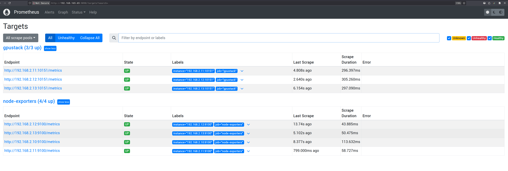
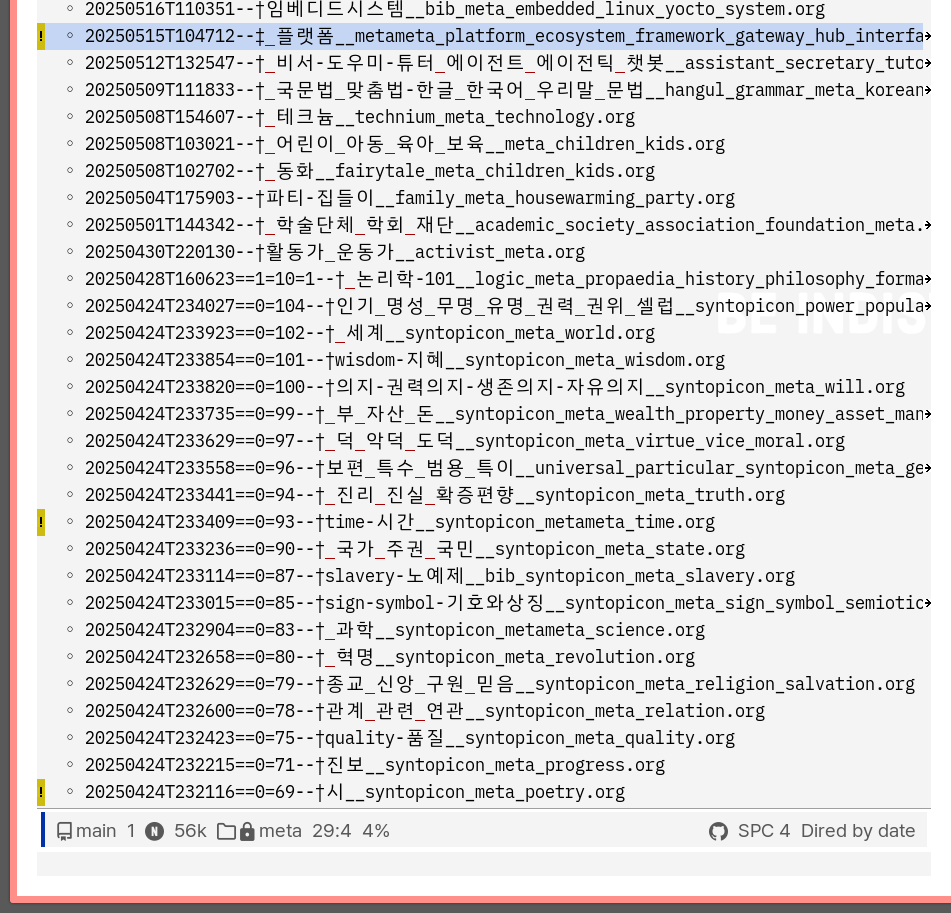
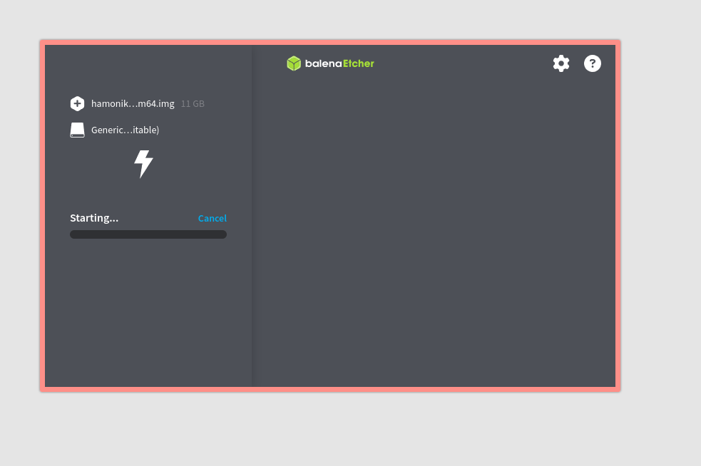
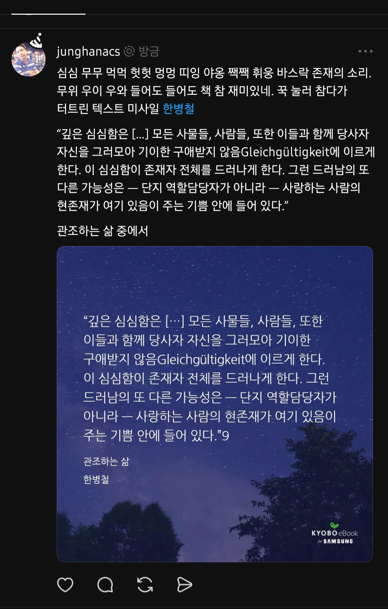
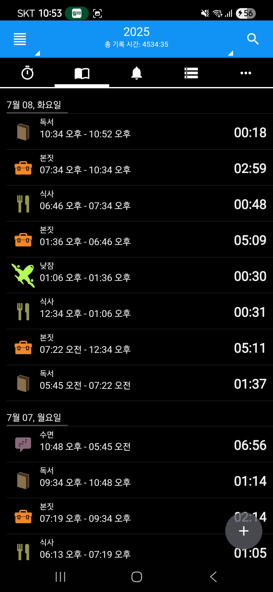
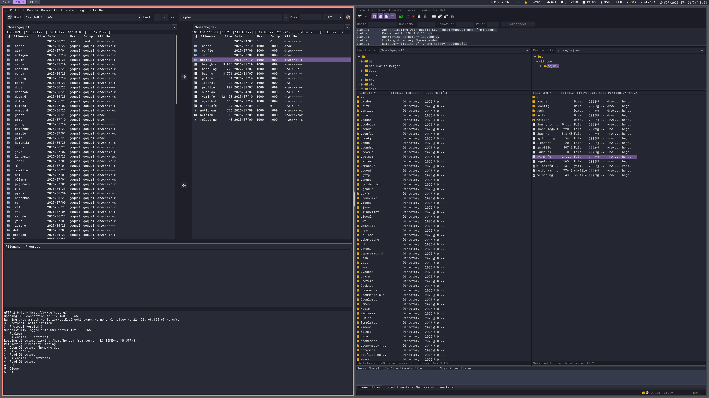

<!-- gid:20250707T000000 -->
[TOC]

Table of Contents

- [2025-07-07 Mon](#2025-07-07-mon)
- [2025-07-08 Tue](#2025-07-08-tue)
- [2025-07-09 Wed](#2025-07-09-wed)
- [2025-07-10 Thu](#2025-07-10-thu)
- [2025-07-11 Fri](#2025-07-11-fri)
- [2025-07-12 Sat](#2025-07-12-sat)
- [2025-07-13 Sun](#2025-07-13-sun)
- [NEWNOTES](#newnotes)
- [REFILED](#refiled)
- [SCREENSHOT](#screenshot)
- [CITATIONS](#citations)
- [PREV / NEXT](#prev-next)

<!--endtoc-->

[[TIP("인용")]]
"깊은 심심함은 […] 모든 사물들, 사람들, 또한 이들과 함께 당사자 자신을 그러모아 기이한 구애받지 않음Gleichgültigkeit에 이르게 한다. 이 심심함이 존재자 전체를 드러나게 한다. 그런 드러남의 또 다른 가능성은 — 단지 역할담당자가 아니라 — 사랑하는 사람의 현존재가 여기 있음이 주는 기쁨 안에 들어 있다."

― 관조하는 삶, 한병철
[[/TIP]]

## 2025-07-07 Mon

### 07:00 회사 도착

### 08:01 힣 자작시 관장약 설사 폭팔

[2025-07-07 Mon 08:00] [힣: 모음 어쏠리즘 아포리즘 내보내기](https://wikidocs.net/381579)과 뭐가 다른가? 그러게 말이네. 주저리 주저리 말고 그냥 관장약 똥꼬에 넣고 꾹 참다가 터져나올 때 그거 있지? 그게 시일세. [힣: 자작시](https://wikidocs.net/381768)에 담으시게

### 08:10 뭐하는가? 지난주 회고 노트 정리 빡새

어제 했어야 하는데 아파서 컴터 못했지.

### 10:00 휴일근무보고서 작성 12:30 점심식사 겸 회의

### 14:10 본격 진격 공격

### 15:15 기존 스토리 서버 네트워크 브릿지 해제

### 20:15 10GB 동작 확인

### 20:40 VNC 동작 확인

### 21:02 집에가자

## 2025-07-08 Tue

### 07:00 출근

출근 도장은 10시에 찍자. 더 일한다고

### 08:11 LP가이드 4개 구입

600원씩 네트워크 카드가 고정이 안되면 이게 무슨 짓인가!

### DONE 08:52 이 작품에 대가로 돈을 받지 않을 겁니다.

헨델 오라토리오 메시아 1742년 4월 7일 리허설

### DONE 08:52 온생명 방학 일정

### 09:07 숨을 불어 넣어보자 09:37 피곤하긴하다

[2025-07-08 Tue 09:38]

어디에서 들어가면 될까? 방법을 알고 있지만 정리를 해야 한다. 정리를 어떻게 할 것인가? 어떻게 쉽게 찾을 수 있는가? 중복이 되면서도 연결을 이룰 수 있는 방법은 무엇인가? 쌓되 쌓지 않는 방법은 있는가? 기억하지 않으면서도 기억되는 방법은 무엇인가?

일단 프로젝트 노트로 간다.

### 12:28 점심 먹자 배고프다

### 14:12 스토리지를 잡아보자

## 2025-07-09 Wed

### 07:20 출근

### 08:17 배스천 보안서버 - 리버스 프록시 서버

용어가 혼란스럽다. 아무렴. 어떤가. 잠시만. 할 것은 해야 한다. 궁금하니까. 무엇을 써야하나? 무엇을 넘겨야 하나. 정해서 말이다. 아주 실틈만 만들어 놓으면 된다.

### 14:20 프롬프트

나는 당신이 IT 전문가로 활동하기를 원합니다. 저는 제 기술적 문제에 대해 필요한 모든 정보를 제공할 것이며, 여러분의 역할은 제 문제를 해결하는 것입니다. 귀하는 컴퓨터 과학, 네트워크 인프라 및 IT 보안 지식을 사용하여 내 문제를 해결해야 합니다. 우리 회사는 IoT 인프라에 해외 서비스에 의존하고 있었습니다. 전문가의 도움을 받아 자사 개발자로 국산화하려고 합니다.

### 18:04 좋아 occur

-   [occur 이맥스 버퍼 특정 문자열 정규표현식 탐색 변경](https://wikidocs.net/381772)

Emacs에서 `M-x occur RET ^| RET` 로 테이블 위치를 한눈에 볼 수 있습니다.

문제되는 테이블 패턴을 위 기준으로 찾아 수정해보세요! 그래도 안되면 해당 테이블 부분을 복사해서 올려주세요.

### 21:49 온생명 보내고 돌아와 이제 잔다

## 2025-07-10 Thu

### 05:41 기상 - 06:00 나가자

### 07:10 출근 - 모닝루틴

(리처드 도킨스 2025) 도킨스 할아버지 사랑합니다.

### 09:18 휴고 커스텀 마크다운 문서 포멧 정리

조직모드로 작성하는 기쁨은 공유할 때 조금 엇나간다. 마크다운으로 보내면 되지요라고 하기엔 기존 서비스들이 마크다운 문법도 제대로 지원하지 않는다. 아니다. 사실 마크다운 그 자체가 제 각각이다. 아무큰 그럼에도 휴고 마크다운을 이용하는게 효과적이다. 헥스트라 테마가 있지 않는가. 여기로 내보내면 휴고 전체 기능을 유려하게 지원한다. 물론 몇가지 마사지를 했다.

### 13:15 식사 #브레인워시

### 13:59 오후 GPUSTACK 설치

### 19:21 간다 GPUSTACK 동작 확인 구축 정리

### 21:56 온생명이 보내고 돌아와 잔다.

## 2025-07-11 Fri

### 03:03 꿈

쫒김 컴터

### 05:59 기상

### 08:00 출근

서울역 급행을 타서 영등포까지 가버림. 돌아가려다 인천을 타버림. 그래서 개봉역에서 내려서 버스를 타고 왔다. 여튼 즐거웠다.

### 10:22 개발팀 블로그 세팅 조금 더

-   #LLM: bare 저장소 깃허브 팀블로그

### 13:26 식사

### 15:07 회사 개발 블로그 업데이트

### 15:21 Prometheus with GPUStack

#### 2025 Prometheus with GPUStack

[2025-07-11 Fri 15:20]

### 18:44 GPUSTACK 대시보드 아이피 문제

### 18:45 퇴근

### 21:55 온생명이 보내고 옴

### 22:08 모델 다운로드 걸어 놓고 자련다.

## 2025-07-12 Sat

### 06:08 굳모닝

### 09:30 병원

### 10:30 회사

### 12:57 점심 #맥도날드 햄버거

### 12:58 일단 제거했다. 조직모드 tab-width 문제

[LLM: Tab width in Org files must be 8, not 4](https://wikidocs.net/381574)

### 류광 역서 인공지능 플랫폼 운영 수학 관련

-   (마이클 래넘 2025) 이책도 류광팀이 한 것이다.
-   (로널드 크노이젤 2022)
-   (카미유 푸르니에 and 이언 놀런드 2025)
-   [류광 박해선 IT 기술 번역가](https://wikidocs.net/382246)
-   [할라넬슨 AI필수수학 통계 선형대수 미적분 로널드크노이젤 딥러닝 신경망 역전파 경사하강법](https://wikidocs.net/382331)
-   [진킴 데브옵스 카미유 이언놀런드 플랫폼 엔지니어링 개발 운영 관리](https://wikidocs.net/382335)

## 2025-07-13 Sun

### 08:24 일요일 출근

### 09:14 개념 이해

### 11:38 전자책 끝판왕이 나왔구나. 이럴수가! ¤readest

-   [전자책: 뷰어 TTS Readest Foliate ReadEra calibredb](https://wikidocs.net/381299)
-   [2b1d2d 크리스토퍼브루소 매슈사프 LLM 인 프로덕션 - 제품화 전략 언어학 류광](https://wikidocs.net/382495)

### 16:23 gh auth login

이게 되야 consult-gh가 역할을 한다.

### 18:09 함수 수정 제대로 안된다 - unstaged 파일로 처리

#디레드 #버전관리 ◊my/diff-mark-toggle-vc-modified

### 18:09 퇴근

## NEWNOTES

[[TIP("주의")]]
office 폴더 제외
[[/TIP]]

-   [최근노트 모음](https://wikidocs.net/381627)

-   [occur 이맥스 버퍼 특정 문자열 정규표현식 탐색 변경 (2025-07-10)](https://wikidocs.net/381772)
-   [데브옵스 인프라 담당자 커리어 - 플랫폼 개발 운영 관리 (2025-07-08)](https://wikidocs.net/381771)
-   [우분투 서버 기본 패키지 설치 세팅 22.04 (2025-07-08)](https://wikidocs.net/381770)
-   [힣: 자작시 (2025-07-07)](https://wikidocs.net/381768)
-   [힣: 회사 직장 생활 - 체험 삶의현장 인간시대 (2025-07-07)](https://wikidocs.net/381767)
-   #LLM: ◊elisp-flymake-byte-compile (2025-07-12)
-   #LLM: §gptel-magit 토큰 제한 (2025-07-11)
-   #LLM: 조직모드 내보내기 special-block mermaid 검증 (2025-07-11)
-   #LLM: org-glossary 로직 검증 (2025-07-11)
-   #LLM: bare 저장소 깃허브 팀블로그 (2025-07-11)
-   #LLM: VSCODE MCP 파일시스템 연동 (2025-07-10)
-   #LLM: SFTP 클라이언트 리눅스 #GUI (2025-07-10)
-   #LLM: 사내 우분투 서버 휴고 서버 운영 (2025-07-10)
-   #LLM: ¤mermaid 다이어그램 레거시 AI 호환 구버전 명시 스타일 (2025-07-10)
-   #LLM: 휴고 테마: 사이드노트 헤딩 레벨 CSS HTML 적용 (2025-07-10)
-   #LLM: #라즈베리파이 #sdcard #설치 #하모니카 (2025-07-07)
-   #LLM: #압축 #해제 tar xz (2025-07-07)
-   #삭제: #네트워크 브릿지 볼륨 #도커 (eg. ¤open_webui) (2025-07-07)
-   #스마트오피스 #플랫폼 기술 보유 중요성 ¤ThingsBoard ◊RBAC (2025-07-07)
-   #LLM: 조직모드 태그 헤딩 검색 ◊find-headings-by-tag-rgrep (2025-07-11)
-   #LLM: Emacs Lisp에서 함수 바인딩과 #'의 의미 이해하기 - lambda 형식 (2025-07-08)
-   #디레드 #버전관리 ◊my/diff-mark-toggle-vc-modified (2025-07-07)

## REFILED

## SCREENSHOT

### Screenshots for 20250707

#### 20250707T090721-vc-dired-diff-hl-mark-magit

;# 

#### 20250707T152959-hamonikr-rasberripi5-install

;# 

#### Screenshot_20250707_062016_Threads

;# 

#### Screenshot_20250707_214933_24_eBook 아인슈타인 그리고

;# 

### Screenshots for 20250708

#### Screenshot_20250708_225301_aTimeLogger

;# 

### Screenshots for 20250709

### Screenshots for 20250710

#### 20250710T135125-gftp-filezilla-sftp-client

;# 

### Screenshots for 20250711

### Screenshots for 20250712

### Screenshots for 20250713

## CITATIONS

### [검색어: urldate = {2025-07-07}]

-   범부처통합연구지원시스템(IRIS) (Slipbox) (“범부처통합연구지원시스템(IRIS)” n.d.)
-   How to Install (Slipbox) (“How to Install and Configure VNC on Ubuntu 20.04 DigitalOcean” n.d.)

### [검색어: urldate = {2025-07-08}]

-   Duncs/Clusterssh 동시 제어 터미널 (Slipbox) (Ferguson [2009] 2025)
-   Cockpit Project (Slipbox) (“Cockpit Project 클러스터 서버 관리 터미널 동시 입력” n.d.)

<!--listend-->

-   Gnome-Terminator 터미널 동시 제어 (Slipbox) (Emulator n.d.)

### [검색어: urldate = {2025-07-09}]

-   ELK Stack Architecture (Slipbox) (R 2022)
-   Volcano: A Cloud Native Batch System (Slipbox) (Ma, Wang, and The Volcano Community &#38; Contributors [2019] 2025)
-   Certbot 보안키 Nginx (Slipbox) (“Certbot 보안키 Nginx” n.d.)
-   Cube Private Cloud (Slipbox) (“Cube Private Cloud kmak Smart” n.d.)

### [검색어: urldate = {2025-07-10}]

### [검색어: urldate = {2025-07-11}]

-   Google/Gemma-2b \\(\cdot\\) (Slipbox) (“Google/Gemma-2b $\cdot$ Hugging Face” 2025)
-   Gpustack 프록시 네트워크 이슈 (Slipbox) (“Gpustack 프록시 네트워크 이슈” n.d.)

### [검색어: urldate = {2025-07-12}]

-   Gpustack/Gguf-Parser-Go (Slipbox) (“Gpustack/Gguf-Parser-Go” [2024] 2025)
-   믿:음 2.0 - KT의 자체개발 오픈소스 LLM (Slipbox) (xguru 2025)
-   AI-네이티브 소프트웨어 엔지니어 (Slipbox) (neo 2025)
-   Cognition \\#devin The AI (Slipbox) (“Cognition \#Devin The AI Software Engineer” n.d.)
-   Fastfetch-Cli/Fastfetch: A (Slipbox) (“Fastfetch-Cli/Fastfetch: A Maintained, Feature-Rich and Performance Oriented, Neofetch like System Information Tool.” n.d.)
-   Cybertron-Cube.Cube.tbdhny.Com (Slipbox) (“Cybertron-Cube.Cube.tbdhny.Com” n.d.)
-   Skt/A (Slipbox) (“Skt/A.X-4.0-Light $\cdot$ Hugging Face” 2025)

### [검색어: urldate = {2025-07-13}]

-   IMJONEZZ (Slipbox) (IMJONEZZ [2023] 2025)

## BIBLIOGRAPHY

  마이클 래넘. 2025. <i>AI 에이전트 인 액션</i>. Translated by 류광. [https://m.yes24.com/goods/detail/148412805](https://m.yes24.com/goods/detail/148412805).
  리처드 도킨스. 2025. <i>불멸의 유전자 : 다윈주의적 몽상</i>. Translated by 이한음. [https://m.yes24.com/goods/detail/147035665](https://m.yes24.com/goods/detail/147035665).
  로널드 크노이젤. 2022. <i>딥러닝을 위한 수학 - 신경망 수학 기초부터 역전파와 경사하강법까지</i>. Translated by 류광. [https://www.yes24.com/product/goods/111086874](https://www.yes24.com/product/goods/111086874).
  카미유 푸르니에, and 이언 놀런드. 2025. <i>플랫폼 엔지니어링 - 개발과 운영을 아우르는 플랫폼 관리의 핵심 원칙</i>. Translated by 류광. [https://www.yes24.com/product/goods/143896301](https://www.yes24.com/product/goods/143896301).
  “Certbot 보안키 Nginx.” n.d. Accessed July 9, 2025. [https://certbot.eff.org/](https://certbot.eff.org/).
  “Cockpit Project 클러스터 서버 관리 터미널 동시 입력.” n.d. Cockpit Project. Accessed July 8, 2025. [https://cockpit-project.org/](https://cockpit-project.org/).
  “Cognition \#Devin The AI Software Engineer.” n.d. Cognition. Accessed July 12, 2025. [https://cognition.ai/](https://cognition.ai/).
  “Cube Private Cloud kmak Smart.” n.d. Accessed July 9, 2025. [https://www.kmak.com/solution/cube](https://www.kmak.com/solution/cube).
  “Cybertron-Cube.Cube.tbdhny.Com.” n.d. Accessed July 12, 2025. [https://cybertron-cube.cube.tbdhny.com:7799/](https://cybertron-cube.cube.tbdhny.com:7799/).
  Emulator, Terminator Terminal. n.d. “Gnome-Terminator 터미널 동시 제어.” Terminator Terminal Emulator. Accessed July 8, 2025. [https://gnome-terminator.org/](https://gnome-terminator.org/).
  “Fastfetch-Cli/Fastfetch: A Maintained, Feature-Rich and Performance Oriented, Neofetch like System Information Tool.” n.d. Accessed July 12, 2025. [https://github.com/fastfetch-cli/fastfetch](https://github.com/fastfetch-cli/fastfetch).
  Ferguson, Duncan. (2009) 2025. “Duncs/Clusterssh 동시 제어 터미널.” [https://github.com/duncs/clusterssh](https://github.com/duncs/clusterssh).
  “Google/Gemma-2b $\cdot$ Hugging Face.” 2025. July 10, 2025. [https://huggingface.co/google/gemma-2b](https://huggingface.co/google/gemma-2b).
  “Gpustack 프록시 네트워크 이슈.” n.d. Accessed July 11, 2025. [https://www.perplexity.ai/search/urwqri-urwqri-s3-sudo-umount-d-B0UYBZbbRV6L8ZgKou0OKw](https://www.perplexity.ai/search/urwqri-urwqri-s3-sudo-umount-d-B0UYBZbbRV6L8ZgKou0OKw).
  “Gpustack/Gguf-Parser-Go.” (2024) 2025. GPUStack. [https://github.com/gpustack/gguf-parser-go](https://github.com/gpustack/gguf-parser-go).
  “How to Install and Configure VNC on Ubuntu 20.04 DigitalOcean.” n.d. Accessed July 7, 2025. [https://www.digitalocean.com/community/tutorials/how-to-install-and-configure-vnc-on-ubuntu-20-04](https://www.digitalocean.com/community/tutorials/how-to-install-and-configure-vnc-on-ubuntu-20-04).
  IMJONEZZ. (2023) 2025. “IMJONEZZ/LLMs-in-Production.” [https://github.com/IMJONEZZ/LLMs-in-Production](https://github.com/IMJONEZZ/LLMs-in-Production).
  “범부처통합연구지원시스템(IRIS).” n.d. Accessed July 7, 2025. [https://www.iris.go.kr/](https://www.iris.go.kr/).
  Ma, Klaus, Kevin Wang, and The Volcano Community &#38; Contributors. (2019) 2025. “Volcano: A Cloud Native Batch System.” [https://github.com/volcano-sh/volcano](https://github.com/volcano-sh/volcano).
  neo. 2025. “AI-네이티브 소프트웨어 엔지니어.” GeekNews. July 9, 2025. [https://news.hada.io/topic?id=21890](https://news.hada.io/topic?id=21890).
  R, KATHISH KUMARAN. 2022. “ELK Stack Architecture and How Does It Works.” YavarTechWorks. October 31, 2022. [https://medium.com/yavar/elk-stack-architecture-and-how-does-it-works-bda6382b3c83](https://medium.com/yavar/elk-stack-architecture-and-how-does-it-works-bda6382b3c83).
  “Skt/A.X-4.0-Light $\cdot$ Hugging Face.” 2025. July 3, 2025. [https://huggingface.co/skt/A.X-4.0-Light](https://huggingface.co/skt/A.X-4.0-Light).
  xguru. 2025. “믿:음 2.0 - Kt의 자체개발 오픈소스 LLM.” GeekNews. July 10, 2025. [https://news.hada.io/topic?id=21912](https://news.hada.io/topic?id=21912).

## PREV / NEXT

-   &lt;- [2025-06-30](https://wikidocs.net/380422)
-   -&gt; [2025-07-14](https://wikidocs.net/380424)
