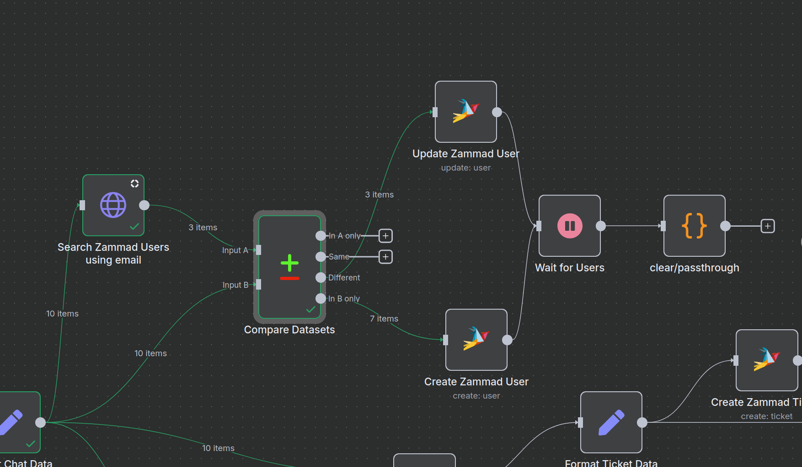
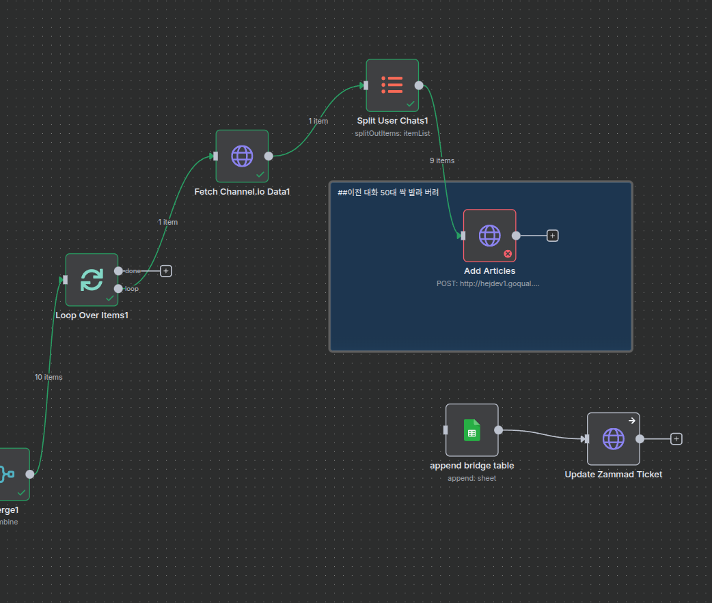

<!-- gid:20250825T000000 -->
<!-- provenance:source:start -->
[[TIP("원본·최신본")]]
이 페이지는 한국어 검색과 읽기를 위한 WikiDocs 미러입니다. [원본·최신본은 가든](https://notes.junghanacs.com/journal/20250825T000000/)에 있습니다. 최신 수정 내용·백링크·태그·히스토리·댓글·출처 정보는 원본 가든에서 확인하세요.

- 작성: `2025-08-25T00:00:00+09:00`
- 최근 수정: `2025-08-25T00:00:00+09:00 (lastmod 없음: date fallback)`
[[/TIP]]
<!-- provenance:source:end -->

[TOC]

## 2025-08-25 Mon

### 07:37 출근

그것은 그것이 아니다. 내가 이것이 아니다 저것도 아니다.

### 09:03 네티네티

### <span class="org-todo todo NEXT">NEXT</span> 14:59 중간점검 - 브릿지 테이블 N8N 데이터 관리 핵심 기술

-   [X] 데이터베이스 노코DB 수정 권한
-   [ ] 구글 시트 N8N 연동 검증 확인 - 오푸스 극한 활용 도움 안됨 그럼에도 프롬프트 엔지니어링 맥락에서 어디를 찍어서 줘야 할지 대화로 풀었다.

    만만한 작업이 아니다. 자동화의 한계. N8N 데이터 접근 패턴이 있다. 이름을 붙여보았으나 이 놈이 제대로 못한다. 나의 탓이다. 혈압을 올릴 필요가 없다. 개념으로 바라 봐야 한다. 데이터 흐름과 변환 그리고 제어 플로우 측면에서 바라 봐야 한다. 극한의 시나리오가 있다.

    여기서 브릿지 테이블을 만든다. 브릿지 테이블은 두 서비스의 정보를 교환하는 매핑 테이블이다. 들어오는 정보와 자마드가 생성한 정보를 매핑 시켜 주는 것이다. 그렇게 되면 제어 플로우는 N8N 이 가져갈 수 있다.

    데이터가 온다. 내가 아는 데이터는 자마드로 변환한다. 자마드가 원하는 데이터에 맞춰서 말이다. 모든 데이터가 필요한 것은 아니다. 줘봐야 못쓴다. 그리고 줄 필요도 없다. 자마드는 데이터 분석 플랫폼은 아니니까 동작에 필요한 데이터만 주면 된다. 거기 디비에 뭘 더 넣은 것도 의미가 없다. 옵션이다.

    왜 구글 시트인가? 모든 N8N 처리 시나리오의 기본이다. 느려도 상관 없다. 프로토타이핑에 가장 확실한 클라우드 서비스를 선택하라. 업데이트 시점은 모든 자마드 호출 및 리턴 시점이다. 정보를 시트에서 검색 후 필드 값을 수정한다.

### 18:26 퇴근각 - 남은 일



이 부분인데 업데이트 유저 생성 루틴 이부분

## 2025-08-26 Tue

### 07:26 지금 이 순간을 살아라

### 08:27 고요한 아우라 - 빛으로 분노를 녹일 수 있다면

[[TIP("노트")]]
오랜만에 큰 소리를 들으니 정신이 혼줄이 났다. 다리에 두드러기가 몇 주째 사라지지 않는다. 아니 더 심해진다. 약을 어제는 받아서 먹었다. 별 효과가 없는가? 고요할 수 있다면 고요함의 아우라 속에 머물 수 있다면 그 빛으로 분노에 가득찬 얼굴에 웃음을 줄 수 있다면

이것은 내것이 아닐게다. 나는 그런 힘이 없다. 빛이 없다. 빛은 하나에게서 온다. 그렇다면 거울이 되면 어떨까?
[[/TIP]]

### <span class="org-todo todo TODO">TODO</span> 08:49 클로드코드 템플릿 -&gt; 노트로 만들 것

템플릿 -&gt; 클로드코드

클로드

#### Claude Code Templates - Ready-to-use Configurations

(Davila n.d.)

Browse and install Claude Code configuration templates for different languages and frameworks. Includes 100+ agents, 159+ commands, 23+ MCPs, and 14+ templates.

<https://davila7.github.io/claude-code-templates/>

클론함. 좀 배워보고 싶다.

### 09:09 다시 진행 - 이맥스 나의 전부

### 18:30 내일 할 일

아티클을 다 추가해주는 루틴



## 2025-08-27 Wed

### 07:09 출근

### <span class="org-todo todo TODO">TODO</span> 07:29 wakatime 기록 시간 - 기록을 잘하면 그 자체가 말을 한다.

어제 시간 기록을 많이 해놨으니 그걸 가든에 통합해서 공유하는 것도 좋겠다. 모바일에서 시간 기록을 공유하는 것이다. 데이터베이스 준비 되어 있으니 말이다.

### <span class="org-todo todo NEXT">NEXT</span> 09:10 딥워크 오전 오후

-   [X] 아티클 만들어서 넣어주는 루틴
-   [ ] 동일하게 처리할 수 있다. 차이는 zammad 생성 또는 업데이트 차이 이다. lastupdated 값을 기준으로 추가 된 메시지를 업데이트? 아니다. 그건 알 수 없다. 똑같이 해야 한다. 루틴이 달라질 필요는 없다. 생성만 별도로 하고 업데이트 과정으로 다 해주면 된다. 루틴은 하나만 있으면 된다. 구글시트에 있는 정보를 기준으로 처리하면 된다. 담당자 배정 루틴이 이미 되어 있고, 다시 감정분석을 해서 대응이 제대로 되고 있지 않다면 추가 notify를 한다. 그래서 원하는 것은?!
-   [ ] 티켓 발행과 종료까지 대응 시간 및 만족도를 올리려는 전략이다.
-   [ ] notion에서 백과사전을 봇이 던진다. 이 백과사전 대응 전략도 분석 대상이다. 무엇을 던지고 있는가? 필요한가?
-   [ ] 슈퍼CS 담당자는 전체 처리 사이클을 관리한다. 그래서
-   [ ] ㅇㅇ

#### <span class="org-todo todo TODO">TODO</span> 구글시트 - 활용 - 필요한 것만 넣는다

-   동작
-   데이터로서 가치?

#### 운영: 핵심지표 개선

[2025-08-27 Wed 11:33]

-   소비자 대응시간 개선 -&gt; 만족도 증가
-   전체 요청 현황 데이터, 오래걸리는 문제 사전 대응
-   전체 운영에 대한 마스터 분석 보고 -&gt; Channel.io 에서 다 해주는 일 아닌가?

#### CS 대응 어떻게 되고 있는가?! 티켓 생성과 종료까지 사이클 관리

[2025-08-27 Wed 11:28]

-   허접한 봇 대응 제거 -&gt; 인간style 맞춤형 대응
-   제품 별 지식베이스 기반 마이크로 매니징
-   CS담당자 서포트봇 -&gt; private 노트로 정보 제공
-   고퀄 인프라와 연계된 요청 처리 자동화
-   CS 대응 과정에서 판매 영업 운영 전략 데이터 회수

#### CS 담당자 감성 고충 개선

[2025-08-27 Wed 11:39]

-   감정 단어 필터링 -&gt; 변환

### 16:46 일단 1차 버전 정리

### 18:22 퇴근하자

## 2025-08-28 Thu

### 07:33 출근 - 서울역 급행을 타고 영등포에서 회군하다

서울역 급행을 한번 낚였는데 또 낚이다. 영등포에서 다행히 인천을 타지 않고 병점행을 타고 다시 돌아오다. 후후

### 10:47 새로운 PC로 옮기려고 합니다.

그래야 원활하게 조테로 도커를 활용할 수 있겠지요?! 잠시만요! 서버로 옮겨야 데이터를 활용하지 않겠습니까? 아 그렇군요.

### <span class="org-todo todo TODO">TODO</span> 11:48 시스템 브릿지 의미 가치?!

여기에 대한 답을 만들어 낼 수 있어야 한다.

````markdown
  **English Translation of Question:** But Channel.io is a professional CS solution company with many features. What I did seems like replicating to Zammad. If Channel.io is used properly, is this meaningful work? While there's value in self-hosting and data utilization opportunities, Channel.io might ask "Aren't you just moving existing features to Zammad?" This makes me question the meaning of system bridging.

## 매우 날카로운 질문입니다 - 시스템 브리지의 진짜 의미

### 당신의 의문이 정당한 이유
• **Channel.io**: 이미 완성된 엔터프라이즈 CS 솔루션
• **기능 중복**: 티켓 관리, 분석, 보고서 등 Zammad와 겹치는 기능들
• **리소스 낭비 가능성**: 기존 완성된 기능을 다른 시스템으로 재구현

### 하지만 진짜 문제는...

#### Channel.io의 한계
• **데이터 소유권**: Channel.io 플랫폼에 종속된 데이터
• **커스터마이징 제약**: 사내 프로세스에 맞춘 유연한 수정 어려움
• **비용 구조**: 사용자 수 증가에 따른 급격한 비용 상승
• **통합 제약**: 다른 사내 시스템과의 깊은 통합 한계

#### 시스템 브리지가 의미있는 경우 vs 무의미한 경우


## 2025-08-29 Fri {#2025-08-29-fri}


### 07:53 출근 - 아바디!! {#07-53-출근-아바디}

-   [@정양모 성서학자 사제 예수 공부 다석학회]() 아바디!!


### 08:02 정양모 선생님의 다석일지 구매하다! {#08-02-정양모-선생님의-다석일지-구매하다}

[@류영모 다석 사상가 (1890-1981)]() 클로드에 100달러를 쓰면서 이 어찌 책 구입에 주저할 것인가? 이 책은 전자책으로 나올 일도 없어보인다. 아니 전자책으로 품을 수 없다.

연필로 가끔 끄적이고, 옮겨쓰고 그 정도 해보는게 어떠한가? 오호. 둘 곳은 없다. 사무실에 내 자리에 떡하니 세워 놓을 일이다. 세상에 집을 둘 곳 하나 있구나.

오! 사무실이여! 내 자리이여! 경탄하지 않을 수 없구나. 지금도 사무실 자리에서 끄적이는데 오자마자 에어콘을 켜고 커피 한잔을 내려서 다과와 함께 컴터를 하지 않는가?

근데 자네 회사에서 다석일기 구입하고 놀고 있는가?! 9시 부터 근무시작 입니다. 지금은 책도 보고 깃허브로 돌아다니고 글도 끄적이고 이맥스 닷파일도 업뎃하고 그러지요. 그럼 일하는 구만? 그것도 아니지요. 언제나 하던 건데 뭐 일이라고 생각할 것도 없지요.

그럼다면 뭐하자는 건가? 일하고 삶하고 나눌 것도 없습니다. 똑같은 텍스트 유희를 할 뿐이지요.

근데 왜 이걸 이렇게 장황하게 쓰는가? 자네 지금 다석일지 노트를 앞에 두고 말일세! 네 그렇네요. 다석일지 노트에 정보를 추가하려고 했지요. 그럼 이만.


### 09:25 모닝 작업 zammad 해결 {#09-25-모닝-작업-zammad-해결}

모든 작업이 성공적으로 완료되었습니다:

1.  번역 관리 문서 생성 완료

2.  OFFICIAL_TRANSLATION_GUIDE.md - 공식 번역 적용 방법 (인라인 번역 모드)
3.  ZAMMAD_TRANSLATION_DICTIONARY.md - 영한 번역 용어 사전 (체계적 용어 관리)
4.  CUSTOM_KOREAN_SETUP.md - 커스텀 한국어 설정 가이드
5.  ZAMMAD_KOREAN_TRANSLATION_GUIDE.md - 한국어 번역 파일 적용 가이드

6.  서비스 검증 완료 ✅

7.  ZAMMAD_SERVICE_VERIFICATION.md - 전체 서비스 상태 검증 결과

검증 결과:

-   ✅ 모든 컨테이너 정상 작동 (9개 Zammad + Traefik)
-   ✅ HTTPS 접속 정상 (HTTP/2 200 OK)
-   ✅ Traefik 라우팅 정상
-   ✅ WebSocket 실시간 통신 정상
-   ✅ PostgreSQL, Redis 정상 작동
-   ✅ CSRF 토큰 발급 정상

접속 정보:

-   웹: <https://zammad.192.168.165.141.nip.io>
-   번역 수정: Ctrl + Alt + T (인라인 번역 모드)

Zammad 서비스가 Traefik과 완벽하게 통합되어 정상 작동 중입니다. 번역은 웹 UI에서 직접 수정 가능합니다.


### 09:27 나가자 {#09-27-나가자}


### <span class="org-todo done DONE">DONE</span> 09:53 AI 스킬링?! 맞춤형 신진연구자 통합교육 {#09-53-ai-스킬링-맞춤형-신진연구자-통합교육}

-   supabase 작업을 진행하자! 아직 작업중


### 10:32 클로드 35달러 제약사항에 대해서 {#10-32-클로드-35달러-제약사항에-대해서}

서버에서 한시간전까지 달리다가 왔는데, 로컬에서 하니까 다시 초기화 되어 있다. 오호....


### <span class="org-todo todo TODO">TODO</span> 11:44 클로드 오푸스 4.1의 시스템 프롬프트를 읽어보라. {#11-44-클로드-오푸스-4-dot-1의-시스템-프롬프트를-읽어보라-dot}

@user 아래 클로드 시스템 프롬프트르 번역해줘.


### 14:04 점심 먹고 강의 듣는다 {#14-04-점심-먹고-강의-듣는다}

인공지능 업무 효율 증진을 위한 인공지능 활용 ?!


### 16:58 사무실 복귀 {#16-58-사무실-복귀}

supabase 하던거 하나 마무리하고 이맥스 모바일에 올리자.


### 18:45 퇴근해야된다. {#18-45-퇴근해야된다-dot}


### 19:10 퇴근한다. 다 활성화 했다. {#19-10-퇴근한다-dot-다-활성화-했다-dot}


### 22:57 자자 {#22-57-자자}


## 2025-08-30 Sat {#2025-08-30-sat}


### 06:44 출근 맥모닝 {#06-44-출근-맥모닝}


### 06:55 책 지름 - 구하려니 번거로워 그냥 전자책 샀다 {#06-55-책-지름-구하려니-번거로워-그냥-전자책-샀다}

포지션이 명확하니까. 조망 하고 싶었다. [@앤서니그레일링 지식의 최전선 - 고고학 경계 과학 역사 조망]()


### 07:22 방금 다석일지를 펴보다 {#07-22-방금-다석일지를-펴보다}

스레드에 다석일지 사진을 올리고 책을 후루룩 봤다. 이거슨 뭐 읽으란 책은 아니다. 아날로그 가든이다. 매일 알을 하나 씩 낳은 인간. 오직 하루의 이 삶 말일세!

-   #LLM: 아날로그 디지털 철학적 함의
-   [†#디지털가든#브레인덤프#아날로그가든]()


### 08:12 자마드 번역 관리 템플릿 연동 {#08-12-자마드-번역-관리-템플릿-연동}

이것저것을 다루어보았다. 역시 이맥스에서 질문하니까 마음이 편하다. 왜?! 버려질 텍스트가 없으니까. 아 그렇다면 내사랑 클로드는?! 된장! 클로드코드로 가자! 거기선 오푸스를 만날 수 있으니까!

#LLM: zendesk zammad 셀프호스팅 한국어 용어 팀장


### 10:14 앱스미스 대시보드 만드는 중 {#10-14-앱스미스-대시보드-만드는-중}


### 10:46 실제 만들어 진 것을 반영해보자. {#10-46-실제-만들어-진-것을-반영해보자-dot}

그 다음에는 url 매핑을 하면 된다. 아하. 하나 놓친게 있었는데 갑자기 생각이 안난다.

아. cert 다운로드 및 브라우저 추가해서 접속하게 하는 것을 넣어주면 된다. 파일 다운로그, 브라우저 (크롬 계열)에 넣고 사용. url은 이것하나 배포.


### 11:54 앱스미스 기본 버전 연동 {#11-54-앱스미스-기본-버전-연동}


### 13:29 이발 - 맥도날드 점심 완료 {#13-29-이발-맥도날드-점심-완료}


### 13:29 클로드 제한 - 언제 풀리지?! {#13-29-클로드-제한-언제-풀리지}


### 21:43 집에 가자 많이 했다 {#21-43-집에-가자-많이-했다}


## 2025-08-31 Sun {#2025-08-31-sun}


### 08:23 출근 {#08-23-출근}


### <span class="org-todo done DONE">DONE</span> 08:29 벤야민 고독한 글 - 남은 임시 메타 하나 할당하는 일 {#08-29-벤야민-고독한-글-남은-임시-메타-하나-할당하는-일}

그리고

커피 한잔 머

[임시 - 인공지능 개발 관련 키워드 대기]() 여기에 무엇을 넣어야 할까?

임시 메타가 남아있다. 물어보자.


### <span class="org-todo todo TODO">TODO</span> 터널로 사내 서버 외부 공유 {#터널로-사내-서버-외부-공유}

그리고 터널로 사내 서버를 외부로 공유한다. 그리고 cert가 있는 브라우저에서만 접속 가능하게 한다.

그러면 충분히 보안이 되지 않나? 한번 물어보자.


### <span class="org-todo todo TODO">TODO</span> 파일 .mcp.json {#파일-dot-mcp-dot-json}

자주쓰는 클로드코드 mcp.json 적어놓자. 프로젝트 별로

````json
 "nixos": {
      "command": "uvx",
      "args": ["mcp-nixos"]
    }
  }
````

### <span class="org-todo todo TODO">TODO</span> 도커 컴포즈 전문가를 위한 CLAUDE.md

장황한 글을 남겨줌

### <span class="org-todo todo TODO">TODO</span> 홈디렉토리 클로드.md - 노트 만들것

완성

#### Junghan0611/Claude-Config: Claude-Code Configuration at HOME

(“Junghan0611/Claude-Config: Claude-Code Configuration at Home” n.d.)

[2025-08-31 Sun 10:17]

### 16:39 TAILSCALE

@user nixos 서버의 tailesacle 포트를 9443으로 바꾸었는데 접속하려면?

@assistant `tailscaled=는 기본적으로 41641/udp를 사용하고, 관리 페이지(=tailscale serve=나 =tailscale funnel`)는 TCP 443이나 지정한 포트로 붙습니다.

만약 NixOS 서버에서 `tailscale serve` 설정을 9443 포트로 변경했다면, 클라이언트에서 접근은 단순히

````nil
https://<서버의-Tailscale-IP>:9443
````

로 접속하면 됩니다.

-   `<서버의-Tailscale-IP>=는 =tailscale ip -4` 혹은 =tailscale status=로 확인.
-   포트 포워딩이나 방화벽이 막혀 있지 않은지 확인 필요.

즉, 포트를 9443으로 바꿨다면 Tailscale 네트워크 내 다른 기기에서 해당 IP와 포트를 직접 지정해 접속하면 됩니다.

👉 혹시 질문은 _관리 페이지 접속\*인지, /실제 wireguard 통신 포트를 바꾼 것인지_ 정확히 알려주실 수 있나요?

@user

### 16:51 그래 나가자 접속 확인함

### 18:17 도착

### 19:57 잔다

## <span class="org-todo todo TODO">TODO</span> 쓰레드 가져오는 자동화 만들 것

[2025-08-21 Thu 07:58]

## <span class="org-todo todo TODO">TODO</span> N8N 후크 - 데이터 무결성 체크

-   [ ] 완료 후크 시에 데이터 무결성 트랜젝션 관리 방법?!
