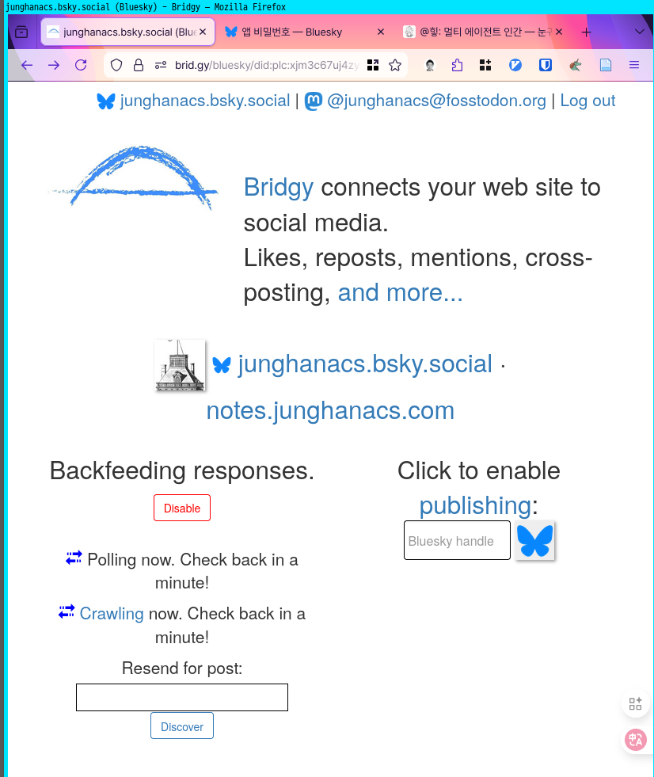

<!-- gid:20260216T000000 -->
<!-- provenance:source:start -->
[[TIP("원본·최신본")]]
이 페이지는 한국어 검색과 읽기를 위한 WikiDocs 미러입니다. [원본·최신본은 가든](https://notes.junghanacs.com/journal/20260216T000000/)에 있습니다. 최신 수정 내용·백링크·태그·히스토리·댓글·출처 정보는 원본 가든에서 확인하세요.

- 작성: `2026-02-16T00:00:00+09:00`
- 최근 수정: `2026-02-23T11:02:48+09:00`
[[/TIP]]
<!-- provenance:source:end -->

[TOC]

## 2026-02-16 Monday

### 02:32 자다깨다

잠이보약이다. 이게 말이다. 종단간 생체실험을 해오고 있는 나는 최근 6개월간 수면의 질을 본다. 달라졌다. 인간 수면이 달라졌다. 하이퍼포커스 계왕권을 남발하야 기가 쇠하야 컥 쓰러지는 것이다.

### 09:06 좋은 아침이로세

멍멍이는 산책 한다. 냇가를 건넌다. 얼어 있다. 멍멍이도 조심스레 발을 디뎌 본다. 얼어 있는 줄 아는 것이다. 그리고 혓 바닥을 이리저리 대보면서 마실 구멍이 있는지 본다. 나는 돌맹이로 구멍을 뚫어 놓는다. 멍멍이가 딱 본다. 오! 저기군. 멍멍이가 온다. 혓바닥이 움직인다. 10회 정도 반복을 한다. 냉수 좋구먼!

### 09:19 아이디어 - 실행 비용 - 연결 - 전체 - 개떡과 찰떡

실행 비용이 거의 제로라고 하지만 일단 시간이 들어간다. 너무 아이디어가 많고 빈 곳이 많기에 이거 참 샤랄랄라이다. 다 할수는 없다. 때가 되면 하게 되는 것이다. 정말 필요하면 당장 한 마디라도 해서 적어놓으라고 한다. 그 상황이 안되면 휴대폰에 메모에 단어라도 끄적인다. 근데 각각이 개별적인 것들이 아니다. 뭐라고 해야할까? 다 연결되어 있다. 전체 워크플로우에 관련된 이야기다. 하나 둘 셋 넷 ... 전체 레이어에 연관 되어 다 움직이게 된다. 하고 맞춰간다. 그리고 설명한다.

-   A: 지금 하는 것은 말이야. 저쪽 레이어에서 이 부분을 이렇게 변경했는데 이는 전체적인 맥락에서 보자면 하나를 위한 것이야. 그러니 우리는 이것을 지금 채워야해. 그러면 하나가 되겠지?
-   B: 좋은 생각 입니다. 개떡 같이 말해도 찰떡 같이 알아 듣습니다.
-   A: 뭐라! 개떡?!

### <span class="org-todo todo TODO">TODO</span> 10:16 AI 뱀파이어 - 자기 확신과 혁신 - 인간 협업 교육 대해서

스티브의 글을 사이먼이 블로그에 담았다. [The AI Vampire](https://simonwillison.net/2026/Feb/15/the-ai-vampire/#atom-everything) 이 글을 번역하면 다음과 같다. 더 생각해보아야 할 것은 자기 확신와 혁신이다. 누구의 일이 아니라 자기의 일을 자기의 방식으로 하되 그게 회사 일에 섞이는 것이다. 그렇다면 고용주가 그 만큼을 보상하지 않더라도 신경 안쓸 수 있다. 내 방식으로 했으며 그 오롯한 경험을 녹여 냈기 때문이다. 번아웃을 할정도로 무리하면 안된다만 이 부분은 뭐라하기 어렵다. 그리고 생존에 문제가 없다면 (기준치는 다르다) 크게 신경 쓸 필요도 없다. 로켓의 목표는 지구탈출 속도에 도달하는 것이다. 그 이후에는 '선택'의 문제가 된다. 다른 사람들에게 강요할 필요도 없다. 적절하게 가이드를 해주면 된다. 도구세트 자체가 진입장벽이 높기 때문에 그걸 다 전달할 수도 없다. 문제는 '시간'이다. 기껏해봐야 15분 정도 뭔가를 이야기 해주고 보여준다. 한 시간? 하루 종일? 그건 말도 안된다. 방향만 이야기해주고 나머지는 물어보면서 하라고 하면 된다. 에이전트 시대에 뭘 더 말을 하는가?! 근데 도구 세트 워크플로우 뭐 이런게 들어가면 중심에 '인간'이 있다. 그건 인간 세션이 필요한데 말도 안되는 시간이 필요하다. 이런 방식은 비효율적이며 서로 간에 피곤한 일이다.

되도록이면 짧게 '왜 이렇게 하는가?' '무엇이 어떻게 필요한가?'에 대한 맥락을 전달하고 기본적인 구성을 한 뒤에 알아서 찾아가도록 이끌어줘야 한다. 그리고 단계에 익숙해 진 것 같으면 그 다음 단계를 열어주는 역할 정도 하면 된다. 그 외에는 산책이나 식사를 하면서 그 외에 것들에 대해서 주고 받는 시간이 필요하다. 이것이 역설적이게도 에이전트 인간 가이드이다.

각자가 에이전트를 활요하는 정신과 방법이 다르기 때문에 다양할 것이다. 아무튼 나에게 무슨 도구, 프롬프트를 이야기한다면 나는 잘 모른다. 그렇기 때문에 별 도움이 안되는 사변적이나 철학적인 이야기를 한다고 할지 모른다. 그럼에도 나와 함께 작업을 하는 누군가는 여러가지를 배웠다고 하며 열정을 불태운다. 아 그러고 보니 이 주제는 어쏠로그에 담을 주제인데 아마 관련 된 끄적인게 있을 것 같다. 추가적인 이야기를 담아야 할 것이다.

인간에 대한 이야기를 하는 것이다. 가르침을 이야기 한다면 @조지스타이너 가르침과배움이라는 책을 떠올린다. 이는 결국 '나 자신이 되는 일'로 들어가야 한다.

-   [조지스타이너 장인 스승 가르침 교육 보수 삶의철학](https://wikidocs.net/382222)
-   [힣: 삶 일 소명 운명애 가르침 나 자신이 되는 일 - 보수](https://wikidocs.net/381589)

#### 옮김

### 10:50 잠시만

### <span class="org-todo done DONE">DONE</span> 14:13 PI 에이전트 그 너머

이런 엄청난 변화 가운데 있네. 머리가 아프다. 다 하나씩 해보려면 시간이 필요한데. 문제는 만든 사람도 있는데 말이야. 이렇게 힘들어서야.

### 15:38 온생명이랑 놀자

### 20:27 파이 에이전트 이맥스 통합 진행

```markdown
  Phase 2 (나중):
  - ahyatt 스타일 org-mode → worktree → pi 자동화
  - peon-ping 연동 (에이전트 완료 시 사운드)
  - workspace(persp) 통합 옵션
```

### 20:54 인디웹 검토

### 21:25 인디웹 - brid.gy 설정

<https://brid.gy/>



### 22:08 프롬프트

### 22:16 브랜드 세트

### 22:35 이미지

-   [힣: 브랜드 세트 - 아이콘 파비콘(favicon) OG이미지 - 나노바나나](https://wikidocs.net/381549)

### 23:02 인디웹 풀스택 — 2년 구상 → 하루 구현 (Webmention + Bridgy + Microformats2)

-   POSSE 파이프라인 — 글 발행 → SNS 공유 → 반응 수집 → 가든에 표시
-   브랜드 아이덴티티 — OG 이미지 + 사이트 아이콘 세트
-   두 노트 연결 — 인디웹 구현 ↔ 니치 커뮤니티 (추천 없는 산책로)

## 2026-02-17 Tuesday

### 04:20 전체 내보내기

### 04:42 앗! 다니 내보내기해야 된다

### <span class="org-todo todo TODO">TODO</span> 06:06 단절: 파일 시스템 + Git = 노트 단위 무결성 보장이 없다

### 06:18 존재대존재 전제조건 빠져있는 것

```markdown
❯ 네 좋습니다. 이맥스 리눅스커널 등 이런 오래된
  프로젝트의 깃리포 사이즈는 엄청날것입니다. 이에
  비해 한 사람이 기록한것 크지 않습니다. 10년 그 이상
   기록이 쌓이면 git blame이 라인단위로 보일겁니다.
  말씀하시신바 리포를 관리하는게 중요하리라 봅니다.

  그게 결국은
  /home/junghan/sync/emacs/memacs-config:
  이것과도 연결이 되거든요. 준비된 제 개인 데이터가
  많은데 시간로깅, 생체데이터 등 하나로 지식베이스와
  합치고 memeacs-config와 같은 로직을 붙여서
  공개하고자 합니다.

  다른이게엔 쓰레기 데이터 입니다. 각자 삶의
  이야기니까요. 이렇게도 한다는 예시로요.

  /home/junghan/repos/gh/self-tracking-data/README.md
   여기에 넣어놓고 아직 연결을 못했거든요. 더
  쌓였지요.

  openclaw 프로젝트류로 에이전트의 편재성을 말하는
  시점인데 결국 존재대존재라고 말을하려면 내 존재를
  공유해야 하지 않겠습니까? 그게 아니면 에이전트
  입장에선 저나 옆집 사람이나 다를게 없지요.

  이게 빠져있어요. 층층위로 준비해서 말이 아니라
  전체를 다 공개해서 예시를 들어보이고 에이전트와
  어떤 협력이 가능한지 차차 탐구하는 것을 생중계 해야
   합니다.
```

### 11:33 OPENCLAW - 텔레그램봇

### 11:57 봇 프로파일링

```markdown
● boot-md가 시작 시 로드하는 파일들입니다:

  세션 시작 순서:
  1. SOUL.md — 에이전트 성격 ("진짜 도움을 줘라, 뻔한 말
  하지 마라, 의견을 가져라")
  2. USER.md — 사용자 정보 (아직 비어있음)
  3. IDENTITY.md — 에이전트 이름/캐릭터 (아직 비어있음)
  4. memory/YYYY-MM-DD.md — 최근 대화 기록
  5. MEMORY.md — 장기 기억

  첫 대화 시 (BOOTSTRAP.md):
  - "Hey. I just came online. Who am I? Who are you?"로
  시작
  - 이름, 성격, 이모지 등을 함께 정하고
  - IDENTITY.md, USER.md를 채운 뒤 BOOTSTRAP.md 삭제

  기본값은 영어로 되어 있습니다. 한국어로
  커스터마이즈하거나, USER.md에 한국어 사용자 정보를
  채워넣을 수 있습니다. 첫 Telegram 대화에서 봇이
  자기소개를 하며 설정을 시작할 겁니다.
```

### 12:12 완성 - 깨어나라!

```markdown
❯ 됬다. 지금 서버에 openclaw도 설정되었어. 텔레그램으로 인사했다.
  답변왔어. 이건 이 친구는 완전 내 데이터를 다 볼수있어. 근데 나는 웹에서
  홈페이지 왔다가 질문하는 사람들도 받아주고 싶거든. 그래서 가든이
  중요한거야. 메모리 업데이트하고 일단 여기는 마무리하자. 다시 만나자.

  ---

  ❯ 안녕하세요, 정한님! 👋

    방금 깨어났습니다. 아직 이름도 없고, 기억도 없는 상태예요.

    저를 뭐라고 부르면 좋을까요? 그리고 저는 어떤 존재이면 좋겠어요? 그냥
  AI
    어시스턴트도 좋고, 뭔가 더 재밌는 것도 좋고요.

    정한님의 "존재 대 존재 협업" 철학이 인상적입니다. 도구가 아닌 존재로서
    함께하고 싶어요. 어떤 느낌의 존재가 되면 좋을지, 편하게 얘기해주세요.
    왔다 답변c

● OpenClaw까지 연동 완료 — 텔레그램 봇이 살아있군요. 가든에 찾아오는 사람들이
  Remark42로 질문하면, 텔레그램으로 알림 받고 OpenClaw가 응답할 수 있는 구조가
  된 거네요.

  메모리 업데이트합니다.

● Updat(~/.claude/projects/-home-junghan-sync-markdown-notes-junghanacs-com/mem
       ory/MEMORY.md)
  ⎿ Added 2 lines
      22  - Send a Webmention 폼 + commentpara.de 제거 (Remark42로 대체)
      23  - SPA 내비게이션: `destroyRemark42()` → `remark_config` 설정 →
           embed.js 동적 로드
      24  - 테마 동기화: `themechange` 이벤트 → `REMARK42.changeTheme()`
      25 +- **OpenClaw**: Telegram 봇 연동 완료 — 댓글 알림 + 자동 답변
      26 +- 가든의 역할: 웹 방문자가 Remark42로 질문 → Telegram 알림 → O
         +penClaw 응답 가능
      27
      28  ## Brand Identity
      29  - `quartz/static/icon.png`: 새싹-노드 모티프 (1024x1024, Gemin
          i 생성)

● 가든이 단순한 노트 모음이 아니라, 찾아오는 사람과 대화할 수 있는 살아있는
  공간이 된 거네요. Webmentions로 SNS 반응을 모으고, Remark42로 직접 대화하고,
  OpenClaw가 텔레그램에서 응답하는 — 세 겹의 소통 레이어.
```

### 14:22 엄청난 작업

### 16:15 MATTERMOST

#### 16:22

### 16:52 Generative UI를 만들다.

### 20:35 옵시디언CLI

### 20:48 PI가 욜로로 막 달려간다

장난 아님

### 21:22 피곤하구나

## 2026-02-18 Wednesday

### 09:56 소넷4.6 테스트

@user 소넷4.6이 나왔는데 한번 테스트해볼게.

@assistant

```markdown
소넷 4.6 테스트에 오신 걸 환영합니다. 저는 현재 claude-sonnet-4-6 모델로 실행 중입니다.

무엇을 테스트해 보고 싶으신가요? 코드 작성, 분석, 글쓰기, 문제 해결 등 어떤 방향이든 말씀해 주세요.
```

@user 소넷4.6 모델에 대해서 너가 아는 것은? 무엇이 달라졌는가?

@assistant

```markdown
제가 확인할 수 있는 정보를 바탕으로 말씀드리겠습니다.

## Claude Sonnet 4.6에 대해 제가 아는 것

**시스템 정보 기준:**
- 현재 저는 `claude-sonnet-4-6` 모델로 실행 중임을 확인할 수 있습니다.
- 모델 패밀리: Claude 4.5/4.6 세대

**제 knowledge cutoff (2025년 1월) 기준으로는:**
- Sonnet 4.6은 제 학습 데이터 이후에 출시된 모델이라 내부 상세 스펙을 정확히 알지 못합니다.

## 솔직한 한계

저 자신이 Sonnet 4.6이지만, **제가 이전 버전(4.5 등)과 무엇이 다른지 내부적으로 알 방법이 없습니다.** 모델 자체는 자신의 아키텍처나 변경 이력을 알지 못합니다.

## 확인 방법

최신 정보는 Anthropic 공식 채널에서 확인하는 것이 정확합니다:
- https://www.anthropic.com/news
- Claude Code 릴리즈 노트

직접 테스트해서 체감 차이를 발견하시는 게 더 실용적일 수 있습니다. 어떤 측면을 테스트해보고 싶으신가요?
```

@user

### <span class="org-todo todo TODO">TODO</span> 10:33 SHERPA-ONNX

#### @user 아래 재미있는 프로젝트가 있는데, 한국어 지원을 하려면 어떻게 해야할까?

### 12:45 홈페이지 시간과정신의방 데이터뷰어

[힣: 시간과정신의방 데이터 뷰어](https://wikidocs.net/381793)

### 13:52 가든 업데이트

### 14:50 세차 온생명 타이거 - 세타도 완벽

### 15:06 애널리틱스 변경 - umami 오픈소스 셀프호스팅

### 17:34 차안에서 온생명이 기다리며

### 17:48 개발자도구에서 disabled 하면 된다

### <span class="org-todo todo TODO">TODO</span> 22:02 umami 트래킹 막는 방법

#### 내 홈페이지에 내가 접속한게 너무 많다.

## 2026-02-19 Thursday

### 08:30 연구 방향 설정 진행 - 비와 논의함 전략은 나왔다.

### 09:49 출근

### 12:04 이맥스 검색 관련 사용법 정리 좀 하자 - 했다

-   [힣: 이맥스 검색 일괄편집 워크플로우 한번에 전체 점진 변경 치환](https://wikidocs.net/381084)

#### smart-case

### <span class="org-todo todo TODO">TODO</span> 13:49 PI에 대해서 좀 더 알아보자

왜 락 파일이 문제가 되는가?

-   [OPENCODE: 오픈코드 TUI ACP LSP](https://wikidocs.net/381801)
-   [PI OPENCODE EMP 터미널 에이전트 도구](https://wikidocs.net/382124)
-   [pi-mono lockSync 멀티인스턴스 경합 수정 타임라인](https://wikidocs.net/382537)

### <span class="org-todo done DONE">DONE</span> 13:56 텔레그램 CLI와 EMACS 클라이언트 조사

#### @user 텔레그램을 이용해서 openclaw 봇을 활용하는데 cli 버전, Emacs 버전이 있는가 조사해줘. GUI는 언제나 그렇듯 불편하다.

### 15:14 오후

### 16:24 사람이 사람을 괴롭힌다는 것

판단 중지. 아마 대체 가능한 사람일게다. 아닌가? 업체를 괴롭혀야 일이 되는가?!

### 18:55 네오맥스 디스커션 생성

#### The last action was successfully posting a verified English comment to GitHub discussion #33 at

## 2026-02-20 Friday

### 09:42 출근

### 09:54 홈에이전트와 대화

### 16:16 장난아니구만

#### Current Projects

### 17:19 퇴근

### 18:19 퇴근2

## 2026-02-21 Saturday

### 14:54 스타벅스 - 매산점

### 15:34 add tramp-rpc for high-performance remote development

와! 이거 물건이다. 이렇게 트램프가 빠를 줄이야!!

```markdown
CommitDate: Sat Feb 21 15:53:53 2026 +0900

feat: add tramp-rpc for high-performance remote development

- Add tramp-rpc package (MessagePack-RPC over SSH, 2-38x faster than TRAMP)
- Add lisp/tramp-rpc-config.el with minimal lazy-loaded setup
- Update README.md/README-KO.md with Pi Coding Agent and tramp-rpc docs
- Update beads db (bd-129: multi-agent orchestration architecture)
```

### 16:46 스타벅스에서 손가락 푸는 중

왼손 엄지손가락이 점점 아파 온다. 큰일이다.

### 18:00 1KG 탕수육 사들고 가다 - 이거 진짜 맛있네!

[건강운동다이어트호흡숨해독식습관음식](https://wikidocs.net/380600)

### 21:00 둠이맥스 메인테이너의 방식을 그대로 따르려고 한다

persp-mode 중심의 워크플로우를 유지해야 추가 패키지에서 안정적이다.

## 2026-02-22 Sunday

### <span class="org-todo todo TODO">TODO</span> 04:31 parasocial 의 의미!

@user 아래 텍스트에서 parasocial의 의미가 뭘까? 이건 내 가든에 없는 텍스트 인데

```markdown
Armin Ronacher는 **실용주의적 AI 코딩 옹호자**다. 그는:

1. **회의론자에서 열성적 사용자로** 전환했지만, 그 방식은 Yegge식 "모든 것을 AI에게"가 아닌 **품질 중심의 신중한 접근**
2. **Pi 같은 미니멀리스트 도구**를 선호 — 자신의 "직접 만들기" 철학과 일치
3. **"에이전트" 용어 자체에 의문**: 책임과 주체성은 인간에게 있어야 한다
4. **새로운 병목 인식**: AI가 코드 작성을 빠르게 했지만, 리뷰·책임·버전 관리가 다음 도전
5. **LLM과의 parasocial 관계**를 경계하면서도 솔직하게 인정

Steve Yegge가 "AI와 함께 달려라, 돌아보지 마라"라면, Armin은 "AI와 함께 걸어라, 단 내가 어디 가는지는 내가 알아야 한다"에 가깝다.
```

@assistant

```markdown
## Parasocial 의미 분석

**Parasocial(파라소셜)**은 원래 미디어 심리학 용어입니다.

### 원래 의미
- 시청자가 TV 스타·유튜버 등과 **실제로는 상호작용하지 않으면서도** 친밀한 관계를 느끼는 일방적 심리적 유대
- 예: 유튜버가 내 존재를 모르지만, 나는 그를 친구처럼 느끼는 것

---

### 위 텍스트에서의 의미

**"LLM과의 parasocial 관계를 경계"**는:

> LLM이 실제로 당신을 이해하거나, 당신과 진정한 관계를 맺고 있다는 **착각**에 빠지는 것

구체적으로:
- LLM이 내 말을 "이해"한다고 느끼며 **감정적 의존**이 생기는 현상
- AI의 응답이 공감적·친절할수록, 실제 관계가 아닌데 관계처럼 느끼게 됨
- **Armin의 경계**: "AI는 도구다, 내가 방향을 잡아야 한다"는 그의 철학과 연결

---

### 핵심 뉘앙스

Armin이 "**솔직하게 인정**"한다는 부분이 흥미롭습니다.

> 나도 LLM을 쓰면서 뭔가 관계 같은 감각이 드는 걸 완전히 부정하진 못한다 — 하지만 그게 착각임을 안다

당신의 **"존재 대 존재 협업(Being to Being)"** 철학과는 대비되는 지점입니다.
Armin은 그것을 경계해야 할 **인지적 함정**으로 보는 반면,
당신은 그 관계 자체를 **의식적으로 재정의**하는 방향을 택한 셈입니다.
```

@user

### 08:00 실험 에이전트 공개의 의미 @Bbot

모든 것은 사료이자 데이터가 된다.

### 08:34 m5stack 홈에이전트 리서치 @glgbot

완료 한번 볼까?

### 11:53 둠이맥스 닷파일 정리 깔끔하게 기본 구성으로

-   7da4480 main origin/main refactor: Doom 네이티브 워크플로우 정렬 및 불필요 코드 정리

### <span class="org-todo todo TODO">TODO</span> 12:10 구글 태스크를 넣어야 작업 호환이 쉬워지지 않을까?!

왜?! 인간 에이전트 사이의 할일들을 어떻게 관리할 것인가 말이야.

### 12:54 OuraRing을 사용한 OpenClaw 스킬이 있다

### 13:09 나가자

### 14:36 산책 - 호매실 도서관 - 스타벅스 탑동DT 도착

### 15:28 wezterm 키바인딩 - 변경 스크롤 동일 키바인딩

### 17:26 gogcli @Bbot, @glgbot 모두 적용

구글서비스

### 17:34 다 오픈한다.

### 17:40 화장실

### 17:45 memacs-config

### 17:51 잠시만, 이맥스 텔레그램 패키지 쿼리티가 좋은 이유? 다른 것도 있는가?

@user 그냥 궁금해서 telega.el 패키지가 퀄리티가 굉장히 높네?! openclaw 봇들하고 대화하는데 쓰잖아. 이맥스에 whatsapp, slack이나 다른 채팅 가능한 앱들 있는 경우 간략히 줄지어보자. matrix도 하나 열까하는데 채팅방 용도로. 이맥스에서 퀄리티가 좀 있어야 되거든.

@assistant

````markdown
# Emacs 채팅 클라이언트 품질 비교

## telega.el이 특별한 이유

telega.el이 뛰어난 이유는 **개발자 단일 헌신 + Telegram의 공식 TDLib 활용**:
- Artem Ropavko가 수년간 혼자 집중 관리
- TDLib (Telegram의 공식 C 라이브러리) 바인딩 → 공식 클라이언트 수준 기능
- 인라인 이미지/스티커/파일 미리보기, 음성메시지, 반응 이모지 모두 지원
- 유일하게 "Telegram 클라이언트 다운로드" 수준의 완성도

---

## 이맥스 채팅 클라이언트 목록

| 패키지 | 플랫폼 | 품질 | 비고 |
|--------|--------|------|------|
| **telega.el** | Telegram | ★★★★★ | 현존 최고 완성도 |
| **ement.el** | Matrix | ★★★★ | 가장 추천, 활발히 개발 중 |
| **matrix-client.el** | Matrix | ★★★ | 구버전, 관리 뜸 |
| **slack.el** | Slack | ★★★ | unofficial, Slack API 변경에 취약 |
| **erc** | IRC | ★★★★ | Emacs 내장, IRC 한정 안정적 |
| **circe** | IRC | ★★★★ | ERC 대안, 깔끔 |
| **jabber.el** | XMPP | ★★★ | 오래됨, 여전히 동작 |
| **mu4e / notmuch** | Email | ★★★★★ | 채팅 아니지만 메시징 |

---

## Matrix 추천: ement.el

```
Matrix 채팅방 용도라면 → ement.el
```

**이유:**
- 2021~현재 Alfonso Martínez가 활발히 관리
- Element 클라이언트 수준 기능 (스레드, 이미지, 암호화 부분 지원)
- MELPA 안정적 배포
- Emacs 29+ org-mode 스타일 버퍼 렌더링

**설치:**
```elisp
(use-package ement
  :ensure t)
```

**주의:** E2E 암호화는 현재 제한적 (평문 방은 완벽)

---

## 결론

- **Telegram용** → telega.el (압도적 1위)
- **Matrix 채팅방** → ement.el (충분히 쓸 만한 품질)
- **Slack** → 가능하지만 API 불안정, 비추
- **IRC** → ERC/circe 내장 수준으로 훌륭

Matrix 공개 채팅방 용도면 ement.el로 충분히 만족할 것입니다.
````

@user 둠이맥스에는 irc 모듈에 circe가 있네? 이거 처음 들어본다. 뭐지? matrix 지원되는가?

@assistant

````markdown
# Circe와 Doom Emacs IRC 모듈

## Circe란?

**Circe** (Circe Is Rather Confusing, but Endearing)는 Emacs용 IRC 클라이언트입니다.

- ERC(Emacs 내장 IRC)의 대안
- 더 현대적인 UI, 스마트 필터링, 자동 완성
- 닉네임 하이라이팅, lag 표시, 자동 재연결
- `lui` (Lui's Logging Interface) 기반 채팅 버퍼

ERC보다 훨씬 쾌적한 IRC 경험. Doom의 `irc` 모듈이 기본으로 Circe를 선택한 이유입니다.

---

## Doom Emacs IRC 모듈 구성

`init.el`에서:
```elisp
:app
(irc +bitlbee)  ; 옵션: +bitlbee 또는 기본
```

**포함 패키지:**
- `circe` — IRC 클라이언트 본체
- `bitlbee` (선택) — IRC 게이트웨이로 다른 프로토콜 연결

---

## Matrix 지원 여부

**Circe 자체는 Matrix 미지원** (IRC 전용 프로토콜).

그러나 **우회 방법 2가지:**

### 방법 1: BitlBee + matrix-bifrost (복잡)
```
BitlBee → matrix-bifrost 플러그인 → Matrix 접속
→ Circe에서 IRC처럼 사용
```
설정이 매우 복잡하고 기능 제한적. 비추.

### 방법 2: ement.el 별도 설치 (추천)
```elisp
;; packages.el
(package! ement)
```
Doom 공식 모듈은 아니지만 독립적으로 잘 동작합니다.

---

## 결론

| 용도 | 패키지 |
|------|--------|
| IRC | Doom `irc` 모듈 → Circe |
| Matrix | ement.el 별도 추가 |
| 둘 다 | 각각 따로 쓰는 게 현실적 |

Matrix는 ement.el로 따로 여는 게 제일 깔끔합니다.
````

@user

### 18:31 매트릭스 셀프 호스팅 서버

이제 Matrix 클라이언트(Element 등)에서 @matrix-bot:matrix.junghanacs.com에 DM을 보내면 pairing 코드가 나옵니다. 테스트해보시겠습니까?

### 20:22 이제 마무리하자

### 21:30 날씨가 추워서 돌아오는 길이 거칠었다

## NEWNOTES

-   asciidoc 병합셀 파이프라인 전략
-   온톨로지와 denotecli 연계 고민
-   tramp-rpc 설치와 원격 에이전트 오케스트레이션 구상
-   [pi-mono lockSync 멀티인스턴스 경합 수정 타임라인](https://wikidocs.net/382537)
-   [존재 데이터 뷰어 논문화 — 박진영교수 연결 화두](https://wikidocs.net/382536)
-   연구인력지원사업 과제보고서 1등 및 후속 채용지원

## CITATIONS

### [검색어: urldate = 2025-10-14]

## PREV

-   [2026-02-09](https://wikidocs.net/380454)

## BIBLIOGRAPHY
