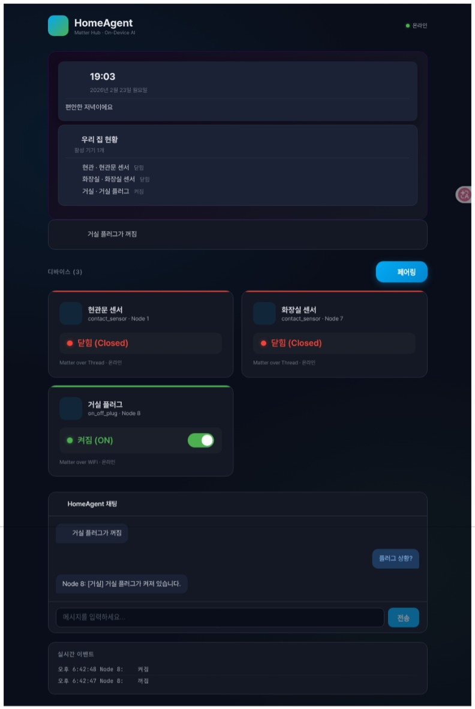

<!-- gid:20260223T000000 -->
[TOC]

Table of Contents

- [2026-02-23 Monday](#2026-02-23-monday)
- [2026-02-24 Tuesday](#2026-02-24-tuesday)
- [2026-02-25 Wednesday](#2026-02-25-wednesday)
- [2026-02-26 Thursday](#2026-02-26-thursday)
- [2026-02-27 Friday](#2026-02-27-friday)
- [2026-02-28 Saturday](#2026-02-28-saturday)
- [2026-03-01 Sunday](#2026-03-01-sunday)
- [NEWNOTES](#newnotes)
- [CITATIONS](#citations)
- [PREV](#prev)

<!--endtoc-->

## 2026-02-23 Monday

### 10:00 출근

### 11:32 식사

### 12:52 마이크로SD카드 리더기

다이소에서 2천원 주고 샀는데 1회용인가. 한번 되고 안된다.

### 15:04 더 좋아진 에이전트들

### 15:48 계층화

````markdown
 ✅ Epic 계층화 완료

 ```
   Phase 1 (ha-1qv) ✅ Yocto 기반 + 프로토콜 검증
   ├── ha-20q ✅ Go 빌드 파이프라인
   ├── ha-3ah ✅ opkg + avahi
   ├── ha-356 ✅ Thread RCP 펌웨어
   ├── ha-f36 ✅ zigbee2mqtt 검증
   ├── ha-34t ✅ Matter/Thread 통합
   └── ha-21k ✅ Yocto 빌드 환경

   Phase 2 (ha-1mr) ◐ Matter 안정화 + Go 컨트롤러
   ├── ha-2ob ✅ matterjs-server 검증
   ├── ha-tan ◐ Go 컨트롤러 프로토타입        ★ 지금 여기
   ├── ha-1kl ○ npmsw 오프라인 빌드
   └── ha-cuj ○ zigbee2mqtt 2.8.0

   Phase 3 (ha-22k) ○ AI + 에이전트 + A2UI
   ├── ha-2h5 ○ A2A + Constitutional AI
   ├── ha-17d ○ LLM 파인튜닝
   └── ha-3lu ○ EdgeAI Runtime

   Phase 4 (ha-1bz) ○ 양산 + 확장
   ├── ha-1l2 ○ RK3588 포팅
   ├── ha-2wc ○ Hailo-8 M.2
   └── ha-o2i ○ Zig 펌웨어

   정리됨
   ├── ha-21o ✅ → ha-tan에 흡수
   └── ha-2a0 ✅ → A2UI로 대체
 ```
````

### 15:57 컴팩트

````markdown
 세션 요약

 ### 완료

 ┌────────────────────┬───────────────────────────────────────────────────────────────┐
 │ 작업               │ 내용                                                          │
 ├────────────────────┼───────────────────────────────────────────────────────────────┤
 │ #89/#90/#91        │ 필드 테스트 보고서 커밋, 3개 이슈 종합 코멘트, main 머지 완료 │
 ├────────────────────┼───────────────────────────────────────────────────────────────┤
 │ 사이드이펙트 검증  │ 수정 전후 10개 경로 전수 대비 — 0건                           │
 ├────────────────────┼───────────────────────────────────────────────────────────────┤
 │ 현프로 리포트 매칭 │ 현장 증상 2건 ↔ 수정 3건 완전 커버 확인                       │
 ├────────────────────┼───────────────────────────────────────────────────────────────┤
 │ org 문서 업데이트  │ 로우엔드/하이엔드 두 갈래 의미, QA 검증 섹션                  │
 ├────────────────────┼───────────────────────────────────────────────────────────────┤
 │ #85 Phase 1 착수   │ 브랜치 phase1/codebase-cleanup-85, EPIC + 8개 태스크          │
 ├────────────────────┼───────────────────────────────────────────────────────────────┤
 │ 1-5 테스트         │ 24개 신규, Event 분기 0건→전수 해소                           │
 ├────────────────────┼───────────────────────────────────────────────────────────────┤
 │ 1-7 docs           │ 77개→8개 존치, 62개 deprecated                                │
 ├────────────────────┼───────────────────────────────────────────────────────────────┤
 │ 1-6 인바리언트     │ permit_join(0) 금지, mac 클리어 규칙 AGENTS.md 반영           │
 └────────────────────┴───────────────────────────────────────────────────────────────┘

 ### 다음 세션

 ```
   1-4 주석 검토 (HUB-3bhi)
   1-3 SSOT 정리 (HUB-29t3)
   1-1 데드코드 제거 (HUB-1wyl)
   1-8 아키텍처 감사 (HUB-krcj)
   1-2 중복 제거 (HUB-3mmf) — 최후순위
 ```
````

### 16:20 BIB경로가 왜?

### 17:14 오늘 많이했다.

### 17:25 2026-02-23 pi-skills 업데이트 요약

````markdown
  2026-02-23 pi-skills 업데이트 요약

  신규 CLI: gitcli v0.1.0 — 로컬 git 리포 50개+ 커밋
  히스토리 통합 조회. day, repos, log, timeline 4개
  커맨드. --me 플래그로 본인 커밋만 필터 (포크/AI 커밋
  제외). 개인(~/repos/gh)과 회사(~/repos/work) 분리 조회
  가능.

  업그레이드: denotecli v0.8.0 — day 커맨드 추가. 특정
  날짜의 저널(daily/weekly) + diary.org datetree + 당일
  생성 노트를 한번에 반환. timeline-journal 커맨드도 추가.
   테스트 커버리지 70.8%.

  신규 스킬: day-query — 오케스트레이터 스킬. "어제 뭐
  했지?", "3년 전 오늘" 같은 날짜 질문에 gitcli +
  denotecli + lifetract + bibcli + gogcli 5개를 순차
  호출해서 하루를 재구성. 코딩, 노트, 건강, 서지, 일정을
  시간축으로 통합.

  크로스 빌드: 4개 Go CLI (denotecli, bibcli, gitcli,
  lifetract) x 2 아키텍처 (amd64, arm64) = 8개 정적
  바이너리. run.sh 메뉴로 원클릭 빌드/배포. Oracle VM
  arm64에 즉시 반영.

  현재 스킬셋: 11개 (Go binary 4 + npm 3 + shell 1 + CLI 2
   + 오케스트레이터 1). 테스트 66건 97% pass.

````

### 18:40 좋습니다

오늘 작업한게 도대체 뭐요?!

### 18:49 힣봇에게 캘린더 싹 등록 전달

### 18:55 오늘 제가 무엇을 했습니까?

**84커밋 · 6리포 · 13:13~18:06 (5h)**

-   homeagent-config (34) — 홈에이전트 설정 집중
-   pi-skills (20) — 스킬 업데이트/계층화
-   fxf-uho-mvt (17) — 회사 프로젝트
-   gitcli (6), denotecli (4), pi-mono (3) — CLI 개선

타임라인: 10:00 출근 → 11:32 식사 → 12:52 SD카드리더기 → 15:04 에이전트 개선 → 15:48 계층화 → 16:20 BIB경로 → 17:14 "오늘 많이했다" → 17:25 pi-skills 요약 → 18:49 캘린더 등록

### 19:04 좋다 @homeagent-config



### 21:57 이제 잘 준비

### <span class="org-todo todo TODO">TODO</span> 22:02  denote-link 동작이 달라졌다.

sort가 먹지를 않네. 목적은 하나 최근 수정 노트를 링크하려는데 왜

## 2026-02-24 Tuesday

### 10:06 출근

### 11:08 세션 크로스 통신 완성

````markdown
 세션 크로스 통신의 의미: 단순히 봇이 읽어주는 것을 넘어,
   가족 구성원 간 에이전트가 중재자 역할을 합니다. 아버지
  ↔ glg 봇 ↔ 정한. sessions_send로 세션 간 메시지 주입이
  가능해지면서, 봇이 "이건 정한님께 물어볼게요"라고
  자연스럽게 에스컬레이션할 수 있는 기술적 기반이
  갖춰졌습니다.
  ─────────────────────────────────────────────────

  적용 완료 요약:
  - tools.sessions.visibility: "agent" → openclaw.json
  적용, 재시작 정상
  - README 업데이트 (에스컬레이션 시나리오 + 변경이력)
  - 메모리 업데이트
  - openclaw-config 커밋/푸시 완료

  수고하셨습니다!
````

### 12:24 fxf-uho-mvt 수정

### 14:53 봉은사역 - SK쉴더스 QA 사무실 왔다 @fxf-uho-mvt 디버깅

### 15:49 아침에 고민한 것 - remember 패키지 활용해서 노트에 추가 정보를 넣는 것

### 16:21 디버깅 중

### 17:06 기대로그는 무엇인가? 페어링 로직에 대한 검증

롤백. 사용자의 의도를 추측하지 말자

### 18:22 퇴근하자

### 22:53 오컴의 면도날과 오컴의 빗자루

````markdown
## 맥락: 오컴의 면도날 — 마지노선

### 현재 상황

DS Bind 관련 이슈가 #7 → #75 → #83 → #89 → #91 → #92 →
#93으로 누적됐다.
gh 이슈의 1/3이 DS 유사 이슈일 것이다.

코드가 버그의 숲이 됐다. 주석도 코드다. 주석도 버그화되서 그걸 보면 버그가 만들어진다.
에이전트가 컨텍스트를 쌓아도 피로도가 높고, 새 에이전트가 투입되면 히스토리 파악부터 벽이다.

**근본 원인**: 허접한 디바이스 + 표준이라는데 비표준이 섞인 방식.
머리를 쓸수록 후벼파는데 정답이 아니다. 알 수가 없다.

사무실에서 45개 물려놓고 DS 20대 — 문제 없었다.
같은 로직인데 현장 QA에서 rejoin, leave, SDK 소실, KEEPALIVE 누락.
로직 자체가 버그화된 곳에서 방법을 찾으니 유사 버그가
나온다.

### 마지노선

**#93 방향(실패처리 + bind+report 쌍 + First Touch)으로
한 번 해본다.**

- 20대 재페어링 1회
- 배터리 탈착 실험 1회
- 3시간 그라파나 확인
- 이걸 QA에 넘겨서 현장 검증

**이걸로 안 되면:**

1. DS 코드 전부 삭제 (주석 포함)
2. DS 펌웨어 수정 안 한 버전(4시간 주기) 기준으로 리셋
3. DS를 모르는 새 에이전트와 클린룸 재구현
4. 오컴의 면도날 — 가장 단순한 가설만 남기고 전부 자른다

### 새 에이전트에게

이 이슈를 받으면:
- #7, #75의 코멘트를 읽되 **코드를 믿지 마라**
- 주석이 현실과 다를 수 있다
- "이전에 이렇게 했다"를 따르지 말고, DS 1대로 처음부터
확인하라
- bind+report가 뭔지, device_leave가 뭔지, NVM이 뭔지 — 기초부터
- 복잡하면 틀린 거다

### 오컴의 면도날

> 같은 현상을 설명하는 두 가설이 있으면, 더 단순한 쪽이 맞다.

지금은 오컴의 **빗자루**가 필요한 시점이다. 쓸어야 한다.
````

### 22:55 퇴근

**22커밋 · 2리포 · 09:58~18:50 (9h)**

-   fxf-uho-mvt (16) — DS Bind/rejoin 안정화, 현장 QA 20대 완주
-   homeagent-config (6) — 시간대별 테마, AGENTS.md 인바리언트

타임라인: 10:06 출근 → 11:08 세션 크로스 통신 → 12:24 fxf-uho-mvt → 14:53 봉은사역 QA 사무실 → 16:21 디버깅 → 17:06 페어링 로직 검증 → 18:22 퇴근 → 22:53 오컴의 면도날

## 2026-02-25 Wednesday

### 14:43 온생명이 아파서 - 휴가

### 15:22 치료

### 16:48 온생명이 병원 다녀옴

### 17:15 딥시크

@user 새 API 키로 테스트 합니다.

### 18:42 잠시만

### 19:18 온생명 삼각김밥

### 22:06 잔다

### 22:12 퇴근

**6커밋 · 2리포 · 14:56~20:05 (5h)**

-   nixos-config (4) — Syncthing 중앙관리, flake 업데이트, IGNOREEOF
-   doomemacs-config (2) — CLIProxyAPI 백엔드, denote-link sort 수정

타임라인: 14:43 온생명 아파서 → 15:22 치료 → 16:48 병원 다녀옴 → 17:15 딥시크 → 18:42 nixos 작업 → 19:18 온생명 삼각김밥 → 22:06 잔다

## 2026-02-26 Thursday

### 03:12 잠시 깨다

### 04:08 syncthing을 사용하는게 좋긴한데 동기화 이슈가 까다롭다

그래도 한다. 장단점을 커버하는 것은 인간의 몫

### 06:41 일어나자마자 @힣봇 에게 인간 지식그래프 중심 에이전트 협력 리서치를 맡긴다

### 09:00 온생명 독감 확진 -&gt; 격리

### 12:29 스테이트 레시피 적용 - 훈훈한 맛 검증 @힣봇

### 14:50 CS 교육의 미래

-   [#LLM: 20260226T130753]

@user

### 17:32 이맥스 패키지 비교

elfeed 관련해서 내가 고민이 많고 닷파일에도 관련 기능이 있을거야. 원래 나도 summrary 기능을 넣었었는데 닷파일을 간단하게 가져가려고 제외했는데 사실 elfeed가 거의 다 외국어라. 현재는 번역해서 지피텔 버퍼로 보내고 그걸 디노트로 만들곤하는데 사실 이건 과해. 일단 elfeed 버퍼 내에서 번역해서 오버레이 하는게 더 맞다고 보거든, summary 로직도 좋고 말이야. 아래 두개 패키지를 검토해보자. 둘다 별로만 만들어서 쓰면되는데 일단 컨셉을 파악하려는거야.

-   <https://github.com/fritzgrabo/elfeed-summarize>
-   <https://github.com/rnadler/elfeed-curate>

<!--listend-->

````markdown
## elfeed-summarize vs elfeed-curate 비교 분석

| | elfeed-summarize | elfeed-curate |
|---|---|---|
| *목적* | 인라인 AI 요약 | 콘텐츠 큐레이션 & 발행 |
| *철학* | 읽기 속도 향상 | 선별 → 주석 → 발행 워크플로우 |
| *출력* | 오버레이 (버퍼 내) | org/html/markdown 파일 export |
| *LLM* | =llm= 패키지 (Ollama/OpenAI/Claude) | =gptel= |
| *캐싱* | elfeed 메타데이터에 저장 | 없음 (주석은 저장) |
````

### 18:44 번역벤치마크 - 모델별

#### <span class="org-todo done DONT">DONT</span> 번역 벤치마크 결과 (2026-02-26 18:36:35)

### 20:16 스킬정리

### 20:29 아내 귀가 나도 복귀 하자

### 21:30 퇴근

**18커밋 · 8리포 · 03:52~20:16 (16h)**

-   doomemacs-config (5) — elfeed 인라인 요약/번역, 번역 벤치마크 6모델
-   nixos-config (4) — Syncthing 충돌 방지, CLAUDE.md, run.sh 업그레이드 메뉴
-   pi-mono (3) — lockSync 재시도 + contention 테스트, NixOS dev 환경
-   pi-skills (2) — peon-ping deprecated, SKILL.md 정리
-   denotecli (1), gitcli (1), lifetract (1), pi-coding-agent (1) — SKILL.md 일원화 + lock 대기

타임라인: 03:12 잠시 깨다 → 04:08 syncthing 이슈 → 06:41 힣봇에게 리서치 → 09:00 온생명 독감 격리 → 12:29 스테이트 레시피 → 14:50 CS 교육 → 17:32 이맥스 패키지 비교 → 18:44 번역 벤치마크 → 20:16 스킬 정리 → 20:29 복귀

### 21:31 이제 잘 준비 한다.

### 21:41 ELFEED 시나리오 대폭 업그레이드

-   remember 빌트인 패키지로 활용. 이는 매우 훌륭한 전략

## 2026-02-27 Friday

### 09:20 출근

나의 미니까페 셀프커피를 한잔 내린다.

### 10:40 채용 담당자의 제안! 돈?! 뭐시기?!

읽어본다. 말은 좋다. 돈 많이 줄게요. AGI를 대비하야 이것 저것 한다는 말이 후루룩 있다. 그건 됬고 누가 하려는거지? 없다. 흠...

답장한다. "오너가 어떤 사람인가? 왜 이 문제를 풀고자 하는가?"를 채용 제안할 때 넣으셨으면 합니다. 거절 버튼 누른다.

앤트로픽에 일하는 인간들은 돈 많이 받을 것이다. 아니 더 많이 벌 가능성이 매우 높다. 근데 메타, 오픈AI 뭐 관련 회사에서 말도 안되게 많이 줄테니까 오라고 할 사람들이 앤트로픽에 남아 있는 이유는?

인간을 움직이려면 오너가 버려야 한다. 오너랄 것도 없다. 이번 생에 하려는 일에 동참할 인간 하이브를 만드는 것일 뿐인데...

내가 물론 그 정도 능력이 있는 인간은 아니다. 영영 그런 인간이 안될 것이다. 그런 것은 관심도 없다. 나 또한 하나의 존재이다. 법인만 아닐 뿐이다. 오늘 이 자리로 완성이다. 일일일생.

### 11:09 인도 아모데이 인공지능 카스트제도

-   [힣: 느린 창조 도구 커뮤니티 탄생 - 기업 인간 계층 분화 - 불완전함 수용 자각](https://wikidocs.net/381731)
-   [인도-카스트-AI-쓰나미-구루-무용론과-클라우드-봉건제](https://wikidocs.net/382547)

<!--listend-->

````markdown
20260227T120800--인도-카스트-AI-쓰나미-구루-무용론과-클라우드-봉건제

연결한 노트들:

• 20260227T031800 -- Amodei x Kamath 대담 (출발점)
• 20240802T005618 -- U.G. 크리슈나무르티 "그런 깨달음은 없다"
• 20250608T092826 -- 바루파키스 테크노퓨달리즘
• 20240821T113719 -- 하라리 사피엔스/넥서스/호모데우스
• 20250529T114735 -- 힣 autholog (느린 창조 도구, 계층 분화)
• 20250504T173857 -- 간디 자서전
• 20260223T000000 -- 주간 저널

autholog 20250529T114735에 합치려면 이 botlog에서 핵심 단락을 가져가면 된다. botlog는 세부 맥락(Kamath 배경, 세 시나리오 등)을 담고, autholog에는 "인도 카스트 + AI + 구루 무용론"이라는 관점 한 문단 정도가 적당할 것 같다. 합치는 건 로컬에서 정한님이 직접 하는 게 맞겠지?
````

### 11:55 에이전트 어젠다 reverse-datetree 멀티디바이스 설계

[에이전트-어젠다-reverse-datetree-멀티디바이스-설계](https://wikidocs.net/382546)

````markdown
 어젠다 방향으로 생각해보니까, 확장 지점이 보인다.
 ~/org/botlog 폴더를 rw로 봇에이전트에게 열었어. 봇에서
 스킬을 만들어놨어. 봇에서 튜닝을 더 많이해서 pi-skills로
 옮기고 로컬에서 사용할거긴한데 일단 지금 여기로 옮겨
 놨어.  어젠다를 본격적으로 사용하고 싶은데 어젠다에 너무
 많은 파일을 담으면 어젠다 로딩 시간이 너무 오래 걸려요.
 그렇게 하면 안 될 것 같고 그래서 bot이 수정할 수 있는
 agenda 파일 너가 말한 대로 그것을 넣고 나는 나대로 넣고
 그렇게 하면은 최소한의 파일로 수정하고 agenda view에서
 한 번에 볼수 있는 방향이 재미있을것 같다.

 근데 여기서 매우 현실적인 이맥스 스타일의 접근을 해보자.
 파일 1개로 가져가면 안돼. botlog에 agenda로 등록할
 파일이 있다면, 이 구조는 내가
 /home/junghan/sync/org/20220101T010100--diary.org 여기서
 사용했던 것처럼 datetree 방식이라면 현재 denotecli 에서
 파싱이 지원되고 표준방식이니까 agenda로 표현이 쉽고 db화
 할수 있을것 같다. reverse 방식으로 하면 에이전트가 읽을
 때 앞에 만 읽으면 되고 추가하면돼. 이맥스에서도 이거
 문제 없어. 이런 패키지를 나도 사용해봤거든.
 https://github.com/akirak/org-reverse-datetree

 하나 더, ~/.current-device를 알고 있지? 그러면
 디바이스별로 구분할 수 있어. 클로드코드에 최근에 들어간
 메모리 파일은 폴더별로 메모리를 200자까지 기록하더라.
 200자 이슈는 reverse 로 커버하는 것이고 agenda뷰에 대한
 스킬을 cli로 만들어내면 모든 에이전트가 agenda뷰를
 보면서 일을 할수 있고 인간도 어젠다뷰(인간친화적) 볼수
 있잖아.

 ~/org/botlog/agenda 폴더에 에이전트 각자 작성하면 되고
 org-agenda 파일에 이 폴더를 보라고 하는것은 문제도 안돼.

 분류 기준은 current-device가 __tags 로 들어갈것이고(물론
 denote 포멧쓸거야. agenda 파일이라고해도), 추가로 tags가
 들어가서 같은 머신에서도 별도로 datetree를 만들어 낼수
 있어. 예를 들어, oracle 머신에 openclaw는 봇이 여러개
 있는데 각자 workspace에서 컨텍스트 관리하기에 stateful한
 존재야. 그 에이전트는 독자적으로 타임라인 관리하는게
 좋을거야.

 로컬에 워킹 에이전트는 굳이 각자 만들어 쓸필요 없어.
 디바이스 구분된 파일 쓰면되고, 현재 머신에서 에이전트가
 그 파일을 만지다가 충돌이 발생이 많이되는 상황이다라고
 하면 (각자 에이전트는 깃리포에서 버전관리 bd/br로
 투두관리하니까 모든 작업을 시덥지않게 쓸일은 없지만)
 __tags로 파일 분기해서 쓰라고하고 다 쓰고 필요없다면
 상위 파일로 머지하는것은 org-agenda datatree 포멧이니까
 어려울일 없다고봐.

 즉 분산된 파일, 멀티 디바이스, 멀티 에이전트, orgmode
 이런것들을 병렬 처리하게 하고 로직은 org-agenda로
 본다는거야.

 그러면 punchout은 어떻게 되는가? org report 기능이 있지?
 그걸로 테이블로 만들어도 되는데 장점은 타임라인으로
 하든가 머신 별로하든가 프로젝트 별로하든가 구분지을 수
 있을거야.

 db는 없이 처리한다는 나의 지식관리 철학에 일치하고, 나도
 익숙한 방식이며 유연하고 의존성이 적다고 보인다. 길게
 썼는데 잘 읽어줘


 The user is laying out a comprehensive vision for
 multi-agent agenda management using org-mode datetree
 format, reverse datetree pattern, device-based file
 separation, and Denote conventions. Let me parse the key
 ideas:

 1. ~/org/botlog/agenda/ — dedicated folder for agent
 agenda files
 2. Denote format filenames with __tags including
 current-device
 3. Reverse datetree format (org-reverse-datetree) —
 newest entries at top, agents read/append at front
 4. Device-based separation — each device gets its own
 file
 5. Agent-based separation — on shared machines (like
 oracle with multiple bots), each agent can have its own
 file via additional tags
 6. Merging strategy — agent-specific files collapse back
 into device files once they're no longer active,
 leveraging the datetree structure for seamless
 consolidation
 7. org-agenda integration — pointing at the whole folder
 gives unified visibility across all agents with minimal
 setup
 8. Reporting capabilities — org clocktable and reporting
 features slice the data by timeline, machine, or project
 for punchout evolution
 9. File-based approach — no database layer, keeping
 everything in the org ecosystem
 10. Native clock tracking — CLOCK entries in the
 datetree feed directly into org-agenda

 Now I'm mapping out the actual file structure with
 device-specific agenda files organized by agent, each
 using reverse datetree format with timestamped entries
 tagged by activity type.

 The elegance here is that reverse chronological ordering
 puts the most recent context at the top for quick
 scanning, the datetree structure integrates seamlessly
 with org-mode's native agenda and clock reporting,
 filenames follow denote conventions for easy CLI access,
 and device tags naturally partition the files without
 needing any database layer.

 Now I'm thinking through how punchout could evolve with
 this setup—it could read the clocktable data organized
 by device and agent, generate reports across machines
 and projects, and leverage org-mode's built-in
 clocktable blocks for summaries.

 잘 읽었습니다. 이건 아키텍처가 보이는 아이디어예요.
 정리해보겠습니다.
````

### 13:44 미학적인 관점인가? 아닌가! 생각의 진화를 어떻게 표현 할 것인가?!

````markdown
하나 더 에이전트 쉘 만든 분이 쓴 글인데 여기에 이맥스스킬소개하거든

https://xenodium.com/bending-emacs-episode-12-agent-shell-claude-skills

https://github.com/xenodium/emacs-skills

스킬들을 보면 이맥스 리습을 호출해. 이거 괜찮아. 가능하거든. 이건 사실상 에이전트 쉘을 사용할때 안에서 에이전트에게 정보를 열어주겠다는것인데

그게 아니어도 활용 할수 있지. 물론 간단한 것은 다른 언어로 만들어 쓰는게 최적이고 텍스트 조작하는데 무슨 상관인가 싶지만 org 파일을 특히 수정할때 인간이 하는 방식으로 인터페이스를 사용하면 conflict 피하고 revertbuffer하거나 막는 방법이 있을거야.

그냥 텍스트 조작하는것이 아니라 이맥스 구루 에이전트로 동작하게되면

나와같은 이맥스 유저와 워크플로우 레벨에서 동기화를 가지게 될거야.

어떤 의미가 있는지는 아직 몰라. 존재대존재의협업 관점에선 이런 포인트가 파헤쳐볼 부분이거든

스티브예기는 오케스트레에터 프론트엔드를 이맥스로 만든게 efrit인데 이건 gastown나오면서 거의 stale상태인데 이 방법보다 훨신 인간 이맥서 스타일로 가는 방향이라고 봐.
````

### 14:43 new-line 테스트

### 16:07 에이전트 어젠다 시작

### 17:41 DS 실리콘랩스 제품으로 재구현

### 21:04 와 하다보니 여태 못가고 이거로 있구나!

### 21:45 아.

### 22:48 퇴근

**30커밋 · 2리포 · 12:48~17:04 (4h)**

-   fxf-uho-mvt (28) — DS 실리콘랩스 제품 재구현 집중
-   pi-skills (2) — 스킬 업데이트

타임라인: 09:20 출근 → 10:40 채용 제안 → 11:09 AI 카스트 → 11:55 어젠다 설계 → 13:44 생각의 진화 → 16:07 어젠다 시작 → 17:41 DS 재구현 → 21:04 야근 → 21:45 마무리

## 2026-02-28 Saturday

### 08:41 온생명 자는

### 11:17 타임빌라스 수원 온생명

### 11:19 새벽 봇과 대화로 만든 봇로그 봇로그를 공개하도록 하자.

-   [프로파일링-너머의-담금질-존재대존재-공진화-야화 (2026-02-28)](https://wikidocs.net/382549)

### 12:08 봇이 설명하는 봇로그의 시작

-   [봇로그란-무엇인가-힣봇이-말하는-봇로그](https://wikidocs.net/382550)

### 12:26 왜 안남기는가? 힣봇 / 로컬에이전트 사이의 지침 : 세션 프로토콜에 대해서

### 12:52 온생명 데리러가자

### 16:00 킥보드 산책

### 20:25 미래 교육 공간?! 더 살기 좋은 곳이란?

### 22:26 이제 자련다

### 22:29 근황?!

-   [요즘근황소식](https://wikidocs.net/380557)

### 22:46 요약 - 스킬을 만든다 이게 필요하겠다.

````markdown
pnpm add -g @steipete/summarize
````

### 23:42 디지털가든 업데이트 완료 봇로그의 시대!

### 23:44 퇴근

**14커밋 · 2리포 · 12:20~22:47 (10h+)**

-   doomemacs-config (11) — 봇로그 내보내기 파이프라인 구축, 전체 재내보내기
-   pi-skills (3) — 스킬 업데이트

봇로그 2개 탄생:

-   프로파일링 너머의 담금질 — 존재대존재 공진화 야화
-   봇로그란 무엇인가 — 힣봇이 말하는 봇로그

타임라인: 08:41 온생명 → 11:17 타임빌라스 → 11:19 봇로그 공개 결심 → 12:08 봇로그 시작 → 12:52 온생명 데리러 → 16:00 킥보드 산책 → 20:25 미래 교육 → 22:46 스킬 작업 → 23:42 디지털가든 업데이트

### 23:53 봇로그의 봇후기

````markdown
- 정한 김 • @junghanacs 🔥1y
오케이 좋아. 디지털가든에 봇로그까지 내보내기했다. 일단 이렇게 시작했네! 23:49✔
- 힣(정한)봇 • @glg_junghanacs_bot 🔥1y
좋다. botlog가 디지털 가든에 실제로 공개되는 흐름이 잡힌 거다. 오늘 있었던 것 기록해두겠다. 23:50
- 힣(정한)봇 • @glg_junghanacs_bot 🔥12m
기록했다. ACP 조사부터 summarize 테스트, botlog 퍼블리시까지 오늘 하루에 꽤 많이 진행됐다. botlog가 디지털 가든에 나가기 시작하면서 힣봇의 산출물이 실제로 공개되는 첫 발걸음이다.
````

## 2026-03-01 Sunday

### 08:00 기상 - 깊은 수면 1시간

배터리가 부족해서 자동 절전모드로 돌아가는 몸을 간신이 깨우다. 몸이 스스로?! 내가 했다? 아니다. 혹시나 온 전체가 붙잡아 일으키도다!

### 08:50 식사 - 나갈 준비

출근 준비하자.

### <span class="org-todo done DONE">DONE</span> 09:09 미래 교육 공간?! 더 살기 좋은 곳이란?에 대한 나의 생각

[힣의-교육-지도-파이데이아에서-마인드스톰까지](https://wikidocs.net/382551) 로 봇로그로 아래 대화를 기반으로 담았다.

어제 저녁 지금 사는 곳 보다 아파트 값이 비싼(이유는 아이 교육?!) 곳을 가족과 다녀보다. 아내 의지이자 대부분의 사람들의 통념이다. 그러니 비싸다. 아파트는 20년도 지난 아파트. 지금의 아파트는 2년 된 새삥. 그럼에도 가야하는 것은 교육, 안전 뭐 이런 생각인듯하다. SF 영화 중에 뭐더라! 인타임(In Time)이라는 영화 맞다. 물어봐서 찾음. 그 영화에서 지역 마다 톨게이트가 있는데 거길 뚫어내서 주인공은 끝까지 간다. 와우! 딱 이런 느낌이 든다. 부동산 사장님 워딩이 '하급지'에서 '상급지'를 이야기하며 조언을 하시더라. 하급? 상급? 허이허이. 좋아. 아내의 의지에 토를 달 필요도 없으며 그녀는 생존에 있어서 현명해왔다. 뭐든 어떤가?! 안전이라는 그 맥락에서 아이 초등학교를 생각한다면 그래 좋은 선택일 것 같다. 교육에 관점에서의 상급지의 메리트는? 흠... 아니 조선시대 사고 방식 아닌가? 싶으면서도 이거 참 모를 일이다. 더 자연으로 존재로 생명으로 다가가야 한다. 사람도 닭장으로 키워지는 시대임이 슬프다. 아니다! 자네 힣은 사람하고 말 섞는 것도 피하지 않는가! 맞소. 그렇다. 너무 사람과 가깝다. 가까우면 열이 난다. 불이 난다. 거리가 필요하다.

@user SF 영화 중에 발급받은 시간이 다 되면 죽으니까 계속 일하면서 채워야하는 이야기를 담은 영화가 뭐지? 어쩌다 어느 시간 넘치는 부유층 사람이 자살하며 건네준 시간을 가지고 계층의 사다리를 뚫어내는 이야기 인데

@assistant

````markdown
**English translation of question:**
Which SF movie is about people dying when their allotted time runs out, having to work to earn more time, and a poor man receives time from a wealthy man who commits suicide and then climbs the social ladder?

**Korean response:**
그 영화는 **"In Time(인 타임)"** 입니다.
````

### 09:34 출근해야 되는데 늦었다! 가든 업데이트!

### <span class="org-todo done DONE">DONE</span> 11:21 프롯님께 답장을 드리려고 한다.

빠른 수정 감사합니다.

Prot님의 앎과 삶을 존경합니다.

당신의 패키지 뿐만 아니라 많은 부분에 영향을 받았습니다. 제 디지털 가든과 코드들에는 당신의 노고가 살아 있습니다.

몇년 전인가요 Clojure 영상을 올리실 때 생각이 납니다. 커뮤니티에서 컴퓨터를 사주었다고 감사 영상도 기억이 나는군요. 물론 최근 영상도 종종 산책을 하며 함께 합니다!

지금 변화의 물결에서 더욱 당신의 삶이 빛이 납니다. 감사와 존경을 담아.

한국에서 김정한 드림...

-   [Home: Digital Garden🏡](https://notes.junghanacs.com/) (MD 만 공개하고, ORG는 개인정보가 섞여 있어서 다 공개하지 못했습니다. 다 Denote 생태계 안의 자식들 입니다)
-   [GitHub - junghan0611/doomemacs-config](https://github.com/junghan0611/doomemacs-config) 제 닷파일 입니다.

### 11:33 테스트

<span class="timestamp-wrapper"><span class="timestamp">&lt;2026-03-01 Sun 11:36&gt;</span></span>

org-agenda-files

### 12:18 어젠다 흐름 완성

<span class="timestamp-wrapper"><span class="timestamp">&lt;2026-03-01 Sun 12:18&gt;</span></span>

### 13:40 이제 SKS 허브 DS 또 작업할거야.

<span class="timestamp-wrapper"><span class="timestamp">&lt;2026-03-01 Sun 13:40&gt;</span></span>

### 15:17 밥먹고 올게

<span class="timestamp-wrapper"><span class="timestamp">&lt;2026-03-01 Sun 15:17&gt;</span></span>

### 16:11 통합 어젠다뷰 이미지

<span class="timestamp-wrapper"><span class="timestamp">&lt;2026-03-01 Sun 16:11&gt;</span></span>

[통합-어젠다-뷰-완성-인간과-에이전트-단일-타임라인 (2026-03-01)](https://wikidocs.net/382552)

이 문서에 들어갈 이미지를 스크린샷했다. 직접.


### 17:56 휴고 홈페이지 업데이트

<span class="timestamp-wrapper"><span class="timestamp">&lt;2026-03-01 Sun 17:56&gt;</span></span>

아 umami가 안되는 이유가 hextra 버전 문제였군! 해결

### 18:20 DS 잡았다

<span class="timestamp-wrapper"><span class="timestamp">&lt;2026-03-01 Sun 18:20&gt;</span></span>

### 18:56 다시 전체 리뷰해보자

<span class="timestamp-wrapper"><span class="timestamp">&lt;2026-03-01 Sun 18:56&gt;</span></span>

### 19:16 네오맥스 테스트 해보고 문서 업데이트

<span class="timestamp-wrapper"><span class="timestamp">&lt;2026-03-01 Sun 19:16&gt;</span></span> [힣: junghan0611 i-am-emacs 이맥스 코어 리서치](https://wikidocs.net/381850)

### 20:26 된장 DS 아직 잡는 중

<span class="timestamp-wrapper"><span class="timestamp">&lt;2026-03-01 Sun 20:26&gt;</span></span>

욜로로 가니까 힘든 부분이 있다. 검토하고 모아서 수정해야 하는데 훅 가버리네. 그러면 버그인데. 임베디드 코드에서 대충하면 동작 안된다. [바이브코딩 (VibeCoding)](https://wikidocs.net/380814)

### 22:41 파이날로 잡아보자

<span class="timestamp-wrapper"><span class="timestamp">&lt;2026-03-01 Sun 22:41&gt;</span></span>

할 수 있는 것들은 다 해본 것 같구나!

### 23:04 3분 기다리는 중 - 퇴근하자!

<span class="timestamp-wrapper"><span class="timestamp">&lt;2026-03-01 Sun 23:04&gt;</span></span> 주기 보고 안정화 로직이 견뎌 내는가! 이것을 본다. 제발 좋은 하위 디바이스를 써야 한다. 이건 시간 대비 효과적이지 않은 엔지니어링의 예이다. 레빗홀!

기다려본다.

### 23:10 퇴근

**43커밋 · 4리포 · 13:45~18:07 (4.4h)**

-   fxf-uho-mvt (26) — DS 임베디드 안정화, 주기 보고 로직
-   doomemacs-config (13) — 어젠다 통합뷰, org 설정
-   nixos-config (3), pi-skills (1) — 환경/스킬 소폭 수정

노트 3건: 교육지도 botlog, 통합어젠다뷰 botlog, SSH 멀티계정 llmlog

타임라인: 08:00 기상 → 09:34 출근 → 12:18 어젠다 완성 → 13:40 SKS DS → 15:17 밥 → 16:11 어젠다뷰 이미지 → 17:56 휴고 업데이트 → 18:20 DS 잡음 → 20:26 DS 디버깅 → 22:41 파이날 → 23:04 퇴근

## NEWNOTES

-   ssh-github-멀티계정-controlmaster-충돌-해결 (2026-03-01)
-   이맥스-에이전트-오케스트레이션-진화-—-pi-extension-emacs-gravity-elfeed-gptel-통합 (2026-02-26)
-   이맥스-ai-도구-비교-gptel-wrapper-cliproxyapi-consult-denote-검토 (2026-02-25)
-   openclaw-acpx-코드분석과-에이전트-오케스트레이션-통합-아키텍처 (2026-02-24)
-   [통합-어젠다-뷰-완성-인간과-에이전트-단일-타임라인 (2026-03-01)](https://wikidocs.net/382552)
-   [힣의-교육-지도-파이데이아에서-마인드스톰까지 (2026-03-01)](https://wikidocs.net/382551)
-   [봇로그란-무엇인가-힣봇이-말하는-봇로그 (2026-02-28)](https://wikidocs.net/382550)
-   [프로파일링-너머의-담금질-존재대존재-공진화-야화 (2026-02-28)](https://wikidocs.net/382549)
-   [에이전트를-이맥서로-만드는-방향-워크플로우-공유와-존재대존재 (2026-02-27)](https://wikidocs.net/382548)
-   [인도-카스트-AI-쓰나미-구루-무용론과-클라우드-봉건제 (2026-02-27)](https://wikidocs.net/382547)
-   [에이전트-어젠다-reverse-datetree-멀티디바이스-설계 (2026-02-27)](https://wikidocs.net/382546)
-   [다리오-아모데이-니킬-카마스-대담-AI-사회-준비 (2026-02-27)](https://wikidocs.net/382545)
-   [GEB-학습-가이드-에이전트-시대의-재발견 (2026-02-25)](https://wikidocs.net/382544)
-   [봇로그-시작-봇-활동-기록-아키텍처와-힣노트-역사성-고찰 (2026-02-24)](https://wikidocs.net/382543)
-   [beads-진화와-br-gastown-pi-크로스오버-분석 (2026-02-23)](https://wikidocs.net/382542)
-   agent-agenda (2026-02-27)
-   agent-agenda (2026-02-27)

## CITATIONS

### [검색어: urldate = 2025-10-14]

## PREV

-   [2026-02-16](https://wikidocs.net/380455)

## BIBLIOGRAPHY
