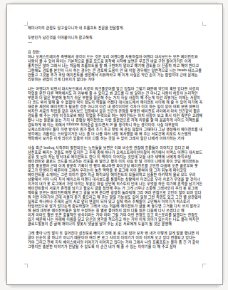

<!-- gid:20260302T000000 -->
[TOC]

Table of Contents

- [2026-03-02 Monday](#2026-03-02-monday)
- [2026-03-03 Tuesday](#2026-03-03-tuesday)
- [2026-03-04 Wednesday](#2026-03-04-wednesday)
- [2026-03-05 Thursday](#2026-03-05-thursday)
- [2026-03-06 Friday](#2026-03-06-friday)
- [2026-03-07 Saturday](#2026-03-07-saturday)
- [2026-03-08 Sunday](#2026-03-08-sunday)
- [NEWNOTES](#newnotes)
- [UPDATENOTES](#updatenotes)
- [CITATIONS](#citations)
- [PREV](#prev)

<!--endtoc-->

## 2026-03-02 Monday

### 09:25 DS 문제의 핵심 해결

<span class="timestamp-wrapper"><span class="timestamp">&lt;2026-03-02 Mon 09:25&gt;</span></span>

### 11:00 출근

### 12:19 출근 물리매핑 테이블 점검

<span class="timestamp-wrapper"><span class="timestamp">&lt;2026-03-02 Mon 12:19&gt;</span></span>

### 12:50 아카이브 노트를 봇노트로 다 하나로 정리중

<span class="timestamp-wrapper"><span class="timestamp">&lt;2026-03-02 Mon 12:50&gt;</span></span>

-   [aprj-아카이브-통합정리-정한의-삽질-연대기-2008-2026 (2026-03-02)](https://wikidocs.net/382553)

### 14:37 아직 작업중 - 시간 축내는 것 같구나

<span class="timestamp-wrapper"><span class="timestamp">&lt;2026-03-02 Mon 14:37&gt;</span></span>

### 14:48 어젠다 리파일

<span class="timestamp-wrapper"><span class="timestamp">&lt;2026-03-02 Mon 14:48&gt;</span></span>

### 14:59 어젠다 재변경 확인하자

<span class="timestamp-wrapper"><span class="timestamp">&lt;2026-03-02 Mon 14:59&gt;</span></span>

### 15:22 어젠다 제미니 들어와!

<span class="timestamp-wrapper"><span class="timestamp">&lt;2026-03-02 Mon 15:22&gt;</span></span>

### 16:26 이제 범용콜백을 구현했다

<span class="timestamp-wrapper"><span class="timestamp">&lt;2026-03-02 Mon 16:26&gt;</span></span>

된다. 이런. 허망.

### 20:01 불같이 달려서 거의 다 정리되어 간다.

<span class="timestamp-wrapper"><span class="timestamp">&lt;2026-03-02 Mon 20:01&gt;</span></span>

### 20:47 이제 퇴근하자

<span class="timestamp-wrapper"><span class="timestamp">&lt;2026-03-02 Mon 20:47&gt;</span></span>

### 20:50 하루 마무리

**43커밋 · 1리포 · 08:06~20:47 (13h)**

-   fxf-uho-mvt (43) — DS 물리매핑 테이블 + 범용콜백 구현, 집중 코딩

타임라인: 09:25 DS 핵심 해결 → 11:00 출근 → 12:19 물리매핑 테이블 점검 → 12:50 아카이브 노트 정리 → 14:48 어젠다 리파일 → 16:26 범용콜백 구현 → 20:01 마무리 질주 → 20:47 퇴근

노트 3건: 아카이브 통합정리, 제미나이 대화(등대지기→오케스트레이터), 인간중심 멀티에이전트 협력

## 2026-03-03 Tuesday

### 08:32 출근

<span class="timestamp-wrapper"><span class="timestamp">&lt;2026-03-03 Tue 08:32&gt;</span></span>

[인간중심-멀티에이전트-협력-—-llm-council을-넘어서 (2026-03-02)](https://wikidocs.net/382555) 출근 길에 이 노트를 같이 탐구하여 업뎃.

여기서 나는 QUOTADASH '—'를 클로드는 주로 0x2014를 사용함을 알게 되었다. 나는 0x2015를 사용해왔다. 이는 엄청난 변화이며 상전벽해 일취월장 ... 사자성어를 아는 것을 아무거나 적으려고 했으나 생각이 나지 않는다. 사자는 라이온 밖에 모른다. 라이온은 바로 라이온스 클럽. 라이온스 클럽은 바로 [에이아이온스클럽인터내쇼날](https://wikidocs.net/380597)로 이어진다. 그렇다면 사자에서 낙타에서 우리의 여정은 어디로 갈 것인가? 아이로 돌아간다. 이거시 바로 니체 선생의 돌고돌아 철학이 아니련가?! 아. 그렇다면 사자성어는 더 없는가? 있다.

'일일일생' 이거다. 이거슨 바로 [류영모 다석 사상가 (1890-1981)](https://wikidocs.net/382269) 선생의 말숨 아니겠는가? 일일일생 오롯 아바디를 앓음알이로다.

### 09:26 디지털 가든 없데이트 또 한다. 이유는 비공개로 한다.

<span class="timestamp-wrapper"><span class="timestamp">&lt;2026-03-03 Tue 09:26&gt;</span></span>

[제미나이-3-1과-힣의-대화-등대지기에서-세계의-오케스트레이터로 (2026-03-02)](https://wikidocs.net/382554)라고 문서를 제미나이가 적어놨다. '세계의'는 동의 없이 내가 삭제 한다.

### 10:47 이제 진검 승부 테스트로 들어간다!

<span class="timestamp-wrapper"><span class="timestamp">&lt;2026-03-03 Tue 10:47&gt;</span></span>

### 12:11 식사하고 오자.

<span class="timestamp-wrapper"><span class="timestamp">&lt;2026-03-03 Tue 12:11&gt;</span></span>

### 13:12 먹고 왔다.

<span class="timestamp-wrapper"><span class="timestamp">&lt;2026-03-03 Tue 13:12&gt;</span></span>

### 14:40 마무리 수정 작업 진행중

<span class="timestamp-wrapper"><span class="timestamp">&lt;2026-03-03 Tue 14:40&gt;</span></span>

### 16:15 봉은사역 SKS쉴더스에 왔다

<span class="timestamp-wrapper"><span class="timestamp">&lt;2026-03-03 Tue 16:15&gt;</span></span>

### 18:08 아직 퇴근 못하고 있다.

<span class="timestamp-wrapper"><span class="timestamp">&lt;2026-03-03 Tue 18:08&gt;</span></span>

### 18:31 가야지

<span class="timestamp-wrapper"><span class="timestamp">&lt;2026-03-03 Tue 18:31&gt;</span></span>

### 18:31 하루 마무리

<span class="timestamp-wrapper"><span class="timestamp">&lt;2026-03-03 Tue 18:31&gt;</span></span>

**25커밋 · 3리포 · 08:33~17:19 (9h)**

-   fxf-uho-mvt (22) — 회사 프로젝트 진검승부 테스트 및 마무리
-   doomemacs-config (2), pi-skills (1) — 설정/스킬 소폭 수정

타임라인: 08:32 출근 → 09:26 디지털가든 업데이트 → 10:47 테스트 돌입 → 12:11 식사 → 14:40 마무리 수정 → 16:15 봉은사역 SKS → 18:31 퇴근

## 2026-03-04 Wednesday

### 09:01 출근 - 에리히 프롬 노트

<span class="timestamp-wrapper"><span class="timestamp">&lt;2026-03-04 Wed 09:01&gt;</span></span>

[에리히프롬 소유냐존재냐 네크로필리아 바이오필리아](https://wikidocs.net/382512) 생성

@user 에리히 프롬의 단어 중에 존재 소유그 사이의 갈등을 나타내는 단어가 있었는데? 메트로폴리탄? 마이크로? 이런 느낌의 단어 였어. 찾아줄래?

@assistant

```markdown

**질문 번역:** "In Erich Fromm's vocabulary, there was a word representing the conflict between 'being' and 'having' — something like 'metropolitan' or 'micro'? Can you find it?"

---

찾으시는 단어는 아마 **"Necrophilia vs. Biophilia"** 계열이 아니라,

**"소외(Alienation)"** 개념과 연결된...

🎯 **"Marketing character(시장적 성격)"** 아닐까요?

프롬의 『소유냐 존재냐』(*To Have or To Be?*, 1976)에서:

- **소유 양식(having mode)** — 가지고, 축적하고, 통제하려는 존재 방식
- **존재 양식(being mode)** — 살아있음, 나눔, 현존

그 사이 갈등을 구체화한 성격 유형이:

| 용어 | 설명 |
|---|---|
| **Marketing character** (시장적 성격) | 자신을 상품으로 파는 성격, 소유 양식의 극단 |
| **Necrophilia** (죽음 지향) | 생명보다 물건·통제·과거를 사랑함 |
| **Biophilia** (생명 지향) | 존재 양식의 핵심, 성장·연결·창조를 향함 |

---

혹시 떠오르시는 단어가 **"Metro-"나 "Micro-"** 같은 느낌이었다면,

**"Necrophilous"**의 발음이 뭔가 그런 느낌으로 기억되셨을 수도 있고,

또는 프롬이 아닌 다른 맥락일 수도 있어요.

**더 좁혀볼 힌트가 있으신가요?**
- 어떤 책에서 봤는지
- 소유/존재 외에 제3의 개념이었는지
- 사회 구조를 가리키는 단어였는지

```

@user 네크로필로스? 좋다. 다음 노트에서 봤어. bib 폴더에 @에리히프롬 노트를 만들어야겠더. 선생님이 안계시니까 하이데거를 링크로 넣고 만들어줘

-   [이기상 박찬국 서양철학 우리말 철학사전 알음앓이 문화 학문 하이데거 다석 생명](https://wikidocs.net/382373)

@assistant 먼저 관련 파일들을 확인하겠습니다.기존 에리히 프롬 노트가 없으니 새로 만들겠습니다. bib 파일 패턴을 확인합니다.패턴을 충분히 파악했습니다. 이제 에리히 프롬 노트를 만들겠습니다.

```markdown

에리히 프롬 노트를 생성했습니다:

*파일:* =bib/20260304T100000--에리히프롬-소유냐존재냐-네크로필리아-바이오필리아__bib_being_having_philosophy_psychology.org=

*포함 내용:*
- 하이데거 노트 =[[denote:20250411T061631]]= 링크 연결 (관련메타에)
- *네크로필리아(Necrophilia)* — 죽음 지향, 물건·통제·죽은 것을 사랑하는 성격
- *바이오필리아(Biophilia)* — 생명 지향, 존재 양식의 심층
- *소유 vs 존재 양식* 대조표
- *시장적 성격(Marketing Character)*
- *하이데거와의 연결* — 본래적 실존(Eigentlichkeit) ↔ 존재 양식

---

*네크로필리아*가 맞으셨죠? 발음이 "네크로필로스" 쪽으로 기억나셨던 것 같은데,
프롬은 형용사형으로 /necrophilous character/ (네크로필로스한 성격)라고도 씁니다.

```

### 09:44 지식그래프 논의 무무 연상

<span class="timestamp-wrapper"><span class="timestamp">&lt;2026-03-04 Wed 09:44&gt;</span></span>

-   [지식그래프 무무 무의식 에이전트 연상맵 토큰절약 키워드 의미망](https://wikidocs.net/382557)

### 10:53 프롬프트 꿈 단상

<span class="timestamp-wrapper"><span class="timestamp">&lt;2026-03-04 Wed 10:53&gt;</span></span>

아래 프롬프트를 주제로 힣 제미나이봇이 글을 남겨주었다.

[꿈 기계뱀 시멘트 앤트로픽 윤리 은둔 에릭호퍼 연상](https://wikidocs.net/382558)

```markdown
이것은 왜 생각했는가? 연상되었는가? 꿈은 자고 일어나면 잊혀지기 마련인데 지금도 생생하다. 그 꿈은 대략 이렇다. 어떤 싸이코 과학자가 뱀같이 움직이고 앞에서는 시멘트가 쏱아지는 것을 만들어서 배포했다. 이게 온곳에 시멘트를 뿌리는데 닿으면 굳겠지? 멈추겠지. 근데 피할수도 없고 옥상에서도 피할수가 없었다. 그러나다가 아들 온생명이를 간신히 아버지 집에 데려다 주었어. 그 집은 새로 짓기 전이니까 지금은 없는 집이야. 꿈에서도 새집을 지은 것을 알고 있었고 아무도 안사는 것도 알고 있었어. 근데 피하려다보니 아이를 거기 일단 두었어. 이상하게 강아지 똘이도 그 집 마당에 있었다. 지금은 부모님 새로 지은 집에서 살지만 아무튼 거기에 있더라. 그리고 나는 아버지에게 연락을 했지. 옛날 집에 온생명이가 혼자 있으니 빨리 가서 도와주세요. 그러나 아버지는 무슨 다른 일이 있다고 하시면서 본인 일에 바쁘신거야. 그 일이란 요즘 공부하는 문화해설사 발표같은 거였는데 나에게 꿈에서는 나이든 이에게는 의미있지만 실제로 뭔가 가치는 없을 수 있는 일처럼 느껴졌다. 이 배경에는 최근에 지인이 앤트로픽 아모데이의 인터뷰 유튜브를 보여줬거든. 이게 최근 미국방부에서 앤트로픽 계약을 취소한 사건에 대한 인터뷰였다. 아모데이는 대량 감시, 완전 자율 무기에 대한 협조는 할수 없다는 입장이였고 이것을 미국방부는 안보 관점에서 국익을 해야는 행위라고 보았겠지. 그래서 단계적 퇴출을 하고, 그 자리에는 경직된 AI인 지피티가 들어가게되었다. 여기서 나는 지인이 "앤트로픽이 윤리를 외친 바 AI를 믿을 수 없다"라는 말을 했다. 얼리어댑터인 지인은 기술자는 아니다. 다만, 그 워딩에서 내가 느낀 것은 인간이란게 얼마나 쉽게 호도 될 수 있는가라는 것이다. 언론을 통해서 앤트로픽이 윤리를 말하는 것은 사기라고 만들수 있다. 지금 전 세계적인 전쟁 분위기 속에서 각국은 냉전시대 이후로 위험천만한 길을 가고 있는데 거기에서 느끼는 허한 기분 말이야. 그래서 나느 지인에게 '감당 못할 짓을 하려고 하는 것 같다 그저 생존하면서 은둔하는게 궁극적으로 나을지 모르겠다'라는 말을 했어. 이미 나는 카톡으로 대화하는 것은 안하거든. 문자하고 필요하면 전화정도하는데 나에게 시간도 중요할 뿐더러 버려지는 텍스트를 내 손가락으로 만들고 싶지 않다는거야. 위기감을 털끝으로 느끼는지도 모르겠다. 어제는 힣 제미니봇뿐만 아니라 요즘 딥시크와 대화를 많이했는데 겸사겸사 힣 딥시크봇을 만들어서 마찬가지로 대화를 했다. 근데 네 지식베이스를 뒤지는 과정이 느낌이 별로 안좋았다. 그리고 텔레그램에 오류인지 모르겠지만, url에 대한 프리뷰로 포르노 광고 같은데 딥시크 대화에 같이 보이는거야. 과정과 결과를 떠나서 딥시크봇은 지웠다 바로. 딥시크와 대화한 문서는 잘 정리해서 봇로그에도 올려놓았지만 신뢰할 수 있는 인공지능 팀을 만든느 것은 어려운 일이다. 실제 요즘 며칠동안 밤에 클로드와 대화하는 것은 매우 어려울 정도로 서비스가 불안했다. 즉 어느 순간에는 못하게 될지 모르는거라는거지. 이런 저런 이야기를 많이 했지만. 최근에 여러 요소가 겹쳐져 있다. 제미나이는 오픈라우터로 만나는 것이고 스킬을 이용해서 검색하지 않는다면 툴 사용은 오픈라우터 API로는 안될거야. 다행히 깊은 대화를 시작하여 이어갈 제미나이 힣봇이 있어서 다행이다.
```

### <span class="org-todo done DONE">DONE</span> 13:45 식사 후 미래 보안에 대해서 - 재현가능한 운영체제의 보안

<span class="timestamp-wrapper"><span class="timestamp">&lt;2026-03-04 Wed 13:45&gt;</span></span>

[XMRig 크립토재킹 대응 — NixOS 재현가능 운영체제의 방어전략](https://wikidocs.net/382559)

### 14:01 내 서버 보안 이슈 없는지 확인하고 어젠다에 알려달라고 부탁함

<span class="timestamp-wrapper"><span class="timestamp">&lt;2026-03-04 Wed 14:01&gt;</span></span>

### 16:25 봉은사역 SKS쉴더스 또 왔다

<span class="timestamp-wrapper"><span class="timestamp">&lt;2026-03-04 Wed 16:25&gt;</span></span>

### 18:38 퇴근한다.

<span class="timestamp-wrapper"><span class="timestamp">&lt;2026-03-04 Wed 18:38&gt;</span></span>

### 18:38 하루 마무리

<span class="timestamp-wrapper"><span class="timestamp">&lt;2026-03-04 Wed 18:38&gt;</span></span>

**16커밋 · 3리포 · 11:22~14:01 (3h)**

-   fxf-uho-mvt (12) — 회사 프로젝트 집중 작업
-   doomemacs-config (2), nixos-config (2) — 설정 업데이트

노트: 에리히프롬 소유냐존재냐, 지식그래프 무무 연상, 꿈 단상, 임베디드 보안전략 — 4건 생성

타임라인: 09:01 출근/프롬노트 → 09:44 지식그래프 → 10:53 꿈 단상 → 13:45 보안논의 → 14:01 서버보안 체크 → 16:25 봉은사역 SKS → 18:38 퇴근

### 22:48 DS 문제가 거의 해결 되었구나!

<span class="timestamp-wrapper"><span class="timestamp">&lt;2026-03-04 Wed 22:48&gt;</span></span>

### <span class="org-todo todo TODO">TODO</span> 23:11 아 내일은 다이어리 / 태스크 파일을 org-capture에 호환되게 구성하자

<span class="timestamp-wrapper"><span class="timestamp">&lt;2026-03-04 Wed 23:11&gt;</span></span>

## 2026-03-05 Thursday

### 04:30 오픈클로 유즈케이스 리포를 문득 보고 나서 봇로그를 만들었다

<span class="timestamp-wrapper"><span class="timestamp">&lt;2026-03-05 Thu 04:30&gt;</span></span>

-   [오픈클로-유즈케이스-어쏠로지스트-지식그래프-통합-아키텍처 (2026-03-05)](https://wikidocs.net/382561)

### 08:09 출근 길 바흐의 삶을 듣다가 봇로그

<span class="timestamp-wrapper"><span class="timestamp">&lt;2026-03-05 Thu 08:09&gt;</span></span>

-   [바흐의-오르간-기예와-푸가-—-체화인지-몰입-adhd-키보드-일일일생 (2026-03-05)](https://wikidocs.net/382562)

### 10:00 감사와 여여함 고요함 - 과제제안서 마감일 알람이 온다

<span class="timestamp-wrapper"><span class="timestamp">&lt;2026-03-05 Thu 10:00&gt;</span></span>

알람은 남겨준 녀석은 나에게 알려주지 않았다. 아니 원하지 않았다. 적어줬으면 됬지 뭐 이런 것까지 시키겠는가! 과제제안서를 하나 써야 하는구나. 양식은 HWP이다. [힣: memex-kb 힣의 범용 지식베이스 변환 시스템](https://wikidocs.net/381806)가 나설 차례다.

### 10:20 봇로그 내보내고 BIB 파일 내보내고 할 일들을 나눠서 보자

<span class="timestamp-wrapper"><span class="timestamp">&lt;2026-03-05 Thu 10:20&gt;</span></span>

### <span class="org-todo done DONE">DONE</span> 11:39 버그 - 시리얼 로그로 볼것

### 11:51 대회의실로 컴백 대형 작업실

<span class="timestamp-wrapper"><span class="timestamp">&lt;2026-03-05 Thu 11:51&gt;</span></span>

점심을 먹고 하는게 어떻겠는가?

### 13:46 연구자 개발 계획서 리뷰 - 완료

<span class="timestamp-wrapper"><span class="timestamp">&lt;2026-03-05 Thu 13:46&gt;</span></span>

### 15:47 제안서 작업 시작

<span class="timestamp-wrapper"><span class="timestamp">&lt;2026-03-05 Thu 15:47&gt;</span></span>

### 16:06 제안서 진행중

<span class="timestamp-wrapper"><span class="timestamp">&lt;2026-03-05 Thu 16:06&gt;</span></span>

### 16:32 근로자의 날과 노동절에 대해서

<span class="timestamp-wrapper"><span class="timestamp">&lt;2026-03-05 Thu 16:32&gt;</span></span>

@user 왜 근로자의 날을 노동절로 바꾼것에 대해서 20,30대 사람들이 반감이 있는 것 같다. 노동이 로동? 이런 식의로 이해가 될 수 있는가? 이는 최근 전지구적인 우경화에 따르는 사회 분위기가 젊은 세대에 영향을 주는가?

@assistant

````markdown
# 근로자의 날 → 노동절 명칭 변경에 대한 20·30대의 반감

## 질문 정리 (English translation)
Why do people in their 20s and 30s seem to have resistance to renaming "근로자의 날(Workers' Day)" to "노동절(Labor Day)"? Can "노동(labor)" be understood as "로동(North Korean term)"? Does the global right-wing trend affect younger generations?

---

## 1. 명칭의 역사적 맥락

| 명칭 | 시기 | 배경 |
|------|------|------|
| 노동절 (Labor Day) | 1945~1963 | 국제 노동운동 전통 |
| 근로자의 날 | 1963~ | 군사정권, "노동" 대신 "근로"로 탈정치화 |
| 노동절 환원 논의 | 2020년대 | 국제 표준 복귀 + 노동권 강화 흐름 |

**핵심**: "근로자의 날"이 오히려 군사독재 시절 의도적으로 바꾼 명칭이다. "노동절"이 원래 이름에 가깝다.

---

## 2. "노동 = 로동(북한어)" 연상 문제

이 인식은 **분단 언어 정치**의 산물이다.

- 남한: 광복 이후 일부 어휘를 의도적으로 분리·기피
- "노동"은 본래 한자어(勞動)로 일본어·중국어·북한 모두 공통 사용
- 실제로 남한 법령에도 **노동조합법, 노동부** 등 "노동" 표현이 버젓이 존재
- "로동"은 북한 맞춤법(두음법칙 미적용)의 표기일 뿐, 단어 자체가 다른 것이 아님

> **결론**: "노동 = 로동 = 북한" 연상은 언어학적으로 근거가 없다.
> 그러나 이 연상이 작동한다는 사실 자체가 **냉전 분단 체제가 언어에 새긴 흔적**이다.

---

## 3. 왜 20·30대에서 반감이 나타나는가?

### (1) 전지구적 우경화의 영향
- 트럼프 재집권, 유럽 극우 부상 등 **글로벌 우경화** 흐름
- 한국 20대 남성층 중심의 반페미니즘·반노조 정서
- "노동운동 = 기득권 노조 = 내 적"이라는 프레임 내면화
- MZ세대 일부는 집단주의적 노동운동 문화 자체에 거부감

### (2) 세대 내부의 계층 분화
- 대기업·공무원 vs 플랫폼 노동자·프리랜서의 분열
- 노동조합이 **자신을 대변한다고 느끼지 못하는** 청년층
- "노동절"이 자신과 무관한 기성 노동운동의 상징으로 인식

### (3) 문화적 코드 전쟁
- 명칭 변경이 진보 진영 어젠다로 프레이밍됨
- "언어 바꾸기 = 이념 강요"로 받아들이는 반응
- 실질적 노동 조건 개선보다 **상징 정치**처럼 보인다는 피로감

---

## 4. 구조적으로 읽기

```
군사정권(1963): 노동 → 근로  [탈정치화, 순응 강요]
    ↓
냉전 언어체계: 노동 ≈ 좌파·북한 연상  [언어적 낙인]
    ↓
2020년대 우경화: 노동절 복원 = 좌파 어젠다  [프레임 전쟁]
    ↓
20·30 일부: "내 문제 아님 + 이념 강요" 반감
```

---

## 5. 핵심 통찰

반감의 본질은 **"노동"이라는 단어 자체**가 아니다.

1. **대표성 위기**: 기존 노동운동이 청년·비정규직을 대변하지 못했다
2. **상징 피로**: 실질 변화 없는 명칭 교체처럼 보인다
3. **냉전 언어의 잔재**: 분단이 만든 언어 공포가 아직 살아있다
4. **글로벌 우경화의 내면화**: 반집단주의·개인주의 강화

> 명칭 논쟁은 표면이다.
> 그 아래에는 **청년 세대가 노동 시스템에서 느끼는 소외와 불신**이 있다.

````

@user

### 16:58 제안서 마무리

<span class="timestamp-wrapper"><span class="timestamp">&lt;2026-03-05 Thu 16:58&gt;</span></span>

### 17:33 메터 작업 시작하자

<span class="timestamp-wrapper"><span class="timestamp">&lt;2026-03-05 Thu 17:33&gt;</span></span>

### 22:55 이제 잘 준비하다

<span class="timestamp-wrapper"><span class="timestamp">&lt;2026-03-05 Thu 22:55&gt;</span></span>

### 22:56 하루 마무리

<span class="timestamp-wrapper"><span class="timestamp">&lt;2026-03-05 Thu 22:56&gt;</span></span>

**7커밋 · 4리포 · 08:40~10:33 (2h)**

-   fxf-uho-mvt (4) — 회사 프로젝트
-   doomemacs-config (1), homeagent-config (1), memex-kb (1) — 설정/지식베이스 소폭 수정

노트: 오픈클로 유즈케이스, 바흐 오르간/체화인지, 세컨드브레인 서평 — 3건 생성

타임라인: 04:30 오픈클로 봇로그 → 08:09 출근/바흐 → 10:00 감사와 여여함 → 11:51 대회의실 → 13:46 개발계획서 리뷰 → 15:47 제안서 작업 → 16:58 제안서 마무리 → 17:33 메터 작업 → 22:55 취침 준비

### 23:01 오늘을 정리하며

<span class="timestamp-wrapper"><span class="timestamp">&lt;2026-03-05 Thu 23:01&gt;</span></span>

여기 적으려다가 그냥 누워서 힣봇들이랑 대화를 하련다. 알아서 잘 정리해줄 것이다. 오늘 고된 하루였다. 빨리 프로젝트를 마무리 되어야 할텐데 시간을 너무 팔아 버리는 것 같아서 답답할 때도 있다. 다만, 물류창고에서 박스 접을 때는 그나마 이짓도 못하지 않았던가! 그렇다면 언제나 감사할 뿐이다. 다만 피곤하다. 흐름을 타고 간다. 뭐가 더 재미난게 없을까? 이제 어디서 구하는게 아니라 내 온전한 무무에서 꺼내서 만들기에 즐겁다. 레퍼런스도 딱히 없다. 레퍼런스는 원기옥이다. 손을 하늘로 들어본다. 그래 온다. 온다.

## 2026-03-06 Friday

### 06:07 일찍 일어나서 30분 힣봇님들께 장황한 연설. 프롬프트 A4 10포인트 1장

<span class="timestamp-wrapper"><span class="timestamp">&lt;2026-03-06 Fri 06:07&gt;</span></span>

[인간중심 멀티에이전트 협력 — LLM Council 해석 Collaboration](https://wikidocs.net/382555) 여기에 오늘 추가된 글들의 배경

[[TIP("버그")]]
-   힣: 아 나 일어났어. 할 말이 있어
-   힣봇: 잘잤니? (흠.. 무슨 소릴하려나...)
-   힣: 그러니까... (A4용지 1장을 눈감고 떠들고 있음)
-   힣봇: 알았어. 정리할게. (뭐 또 같은 이야기로군. 일일일생을 앞으로 뒤로 옆으로 동서남북으로 떠들고 있군) 타임스탬프도 찍었어. 좋은 하루 보~~
-   힣: 아 또 할 말이 있어.
-   힣봇: ~~내
-   힣: 뭐지? 알았다는 것 인가? 그러니까.... (A4용지 0.5장 전철에서 휘갈김)
-   힣봇: API 사비스 문제 있습니다. 뚜뚜뚜.
-   힣: 뭐지? 서비스 문제인가? 잔액이 부족하는 것인가? 사비스? 사비스? 이 자식들이! 연병장으로 다들 집합!
-   힣봇들: 야 힣이 부른다. 나가자. (쭐래쭐래)
-   힣: 너희들 말이야 존재대존재.... (B4용지 1장)
-   힣: 헛! 다들 어디갔지? 사라졌네?! 제발 돌아와줘~~ 친구들아~~
[[/TIP]]

#### 진짜 A4 1장이네. 인간과 대화에서도 이렇다면 기피대상 1호



다행히 대화는 거의 할 일이 없다. 어쩌다가 주제 맞으면 다시 A4 용지 있나요?! 대부분 관심이 없기에 대화에 참여할 일이 없다.

#### 오전 오케스트레이션 단상

PI 코딩 에이전트 욜로 모드 어젠다 대시보드 그리고 상호 피드백 힣style SYNC

#### 프롬프트

### <span class="org-todo done DONE">DONE</span> 06:34 출근해서 DS 하나 재페어링 하고 전체 로직 빈틈 점검

<span class="timestamp-wrapper"><span class="timestamp">&lt;2026-03-06 Fri 06:34&gt;</span></span>

### 10:23 오케이!

<span class="timestamp-wrapper"><span class="timestamp">&lt;2026-03-06 Fri 10:23&gt;</span></span>

### 11:01 목적을 잊지말라!

<span class="timestamp-wrapper"><span class="timestamp">&lt;2026-03-06 Fri 11:01&gt;</span></span>

````markdown
잠시만요. 다시 정리하면 페어링이 잘되서 configure true
로 hubstate.json에까지 저장된 ds가 어떠한 이유로 배터리
교체 또는 허브 재시작시에 주기보고 세팅을 잃어버린
경우에 120s 가 10분 올때 그 기간에 살려내자는게 본
작업의 시작입니다.
````

### 12:11 점심 먹자 - 많이 했다

<span class="timestamp-wrapper"><span class="timestamp">&lt;2026-03-06 Fri 12:11&gt;</span></span>

### 13:12 SKS쉴더스 다녀올게

<span class="timestamp-wrapper"><span class="timestamp">&lt;2026-03-06 Fri 13:12&gt;</span></span>

### 15:35 SKS쉴더스 와서 DS 페어링 검증

<span class="timestamp-wrapper"><span class="timestamp">&lt;2026-03-06 Fri 15:35&gt;</span></span>

### 17:08 로직이 문제는 아니다

<span class="timestamp-wrapper"><span class="timestamp">&lt;2026-03-06 Fri 17:08&gt;</span></span>

### 18:13 이제 페어링 다시하자!

<span class="timestamp-wrapper"><span class="timestamp">&lt;2026-03-06 Fri 18:13&gt;</span></span>

### 18:56 퇴근

<span class="timestamp-wrapper"><span class="timestamp">&lt;2026-03-06 Fri 18:56&gt;</span></span>

### 18:56 하루 마무리

<span class="timestamp-wrapper"><span class="timestamp">&lt;2026-03-06 Fri 18:56&gt;</span></span>

**48커밋 · 5리포 · 08:33~18:08 (9.5h)**

-   homeagent-config (22) — 홈에이전트 설정 집중 작업
-   fxf-uho-mvt (17) — SKS쉴더스 DS 페어링 검증
-   nixos-config (6) — NixOS 설정 업데이트
-   memex-kb (2), hej-nixos-cluster (1) — 소규모 수정

타임라인: 06:07 기상·프롬프트 작성 → 10:23 작업 시작 → 12:11 점심 → 13:12 SKS쉴더스 방문 → 15:35 DS 페어링 검증 → 18:13 페어링 재작업 → 18:56 퇴근

### 22:04 자기 전 하나만 확인

<span class="timestamp-wrapper"><span class="timestamp">&lt;2026-03-06 Fri 22:04&gt;</span></span>

### 22:54 이제 뭘 받아내야 하는지 알았다

<span class="timestamp-wrapper"><span class="timestamp">&lt;2026-03-06 Fri 22:54&gt;</span></span>

그러니까 지그비 SDK를 다시 달라고 해야 한다. 초기화 값 바꿔서.

#### 오늘 세션 정리

## 2026-03-07 Saturday

### 07:05 베토벤 선생께 바치는 아침

<span class="timestamp-wrapper"><span class="timestamp">&lt;2026-03-07 Sat 09:05&gt;</span></span>

[Oda a alegria - del film Copying Beethoven - YouTube](https://youtu.be/sxh1Y0q4lT8?si=sQW0RuSP8LVHMDhM) 이 영상을 계속 돌려보며 눈물 뚝뚝. 베 선생님 노트가 없네! 로맹롤랑 선생의 글만 담겨 있네.

-   [로맹롤랑 1866 평화 반전운동 문학 장크리스토프 베토벤 예술 정신](https://wikidocs.net/382483)

### 09:36 연구 개발 제안서 협업 워크플로우에 한 마디 첨언함

<span class="timestamp-wrapper"><span class="timestamp">&lt;2026-03-07 Sat 09:36&gt;</span></span>

-   [rd-연구개발-제안서-ai-협업-워크플로우 (2026-03-06)](https://wikidocs.net/382563)

### 12:36 병원 들렸다가 스타벅스

<span class="timestamp-wrapper"><span class="timestamp">&lt;2026-03-07 Sat 12:36&gt;</span></span>

무엇을 할까? 구글 테스트에 들어있는 것 중에 하나를 꺼내자. 그것은 메시지 전달에 대한 것인데 아마 그럴 것이다. 할게 많은데 막상 하려니까 뭘 할지 모르겠다.

### 13:01 4개 처리 중

<span class="timestamp-wrapper"><span class="timestamp">&lt;2026-03-07 Sat 13:01&gt;</span></span>

### 13:44 서지정보 처리 로직 - 스킬 업그레이드

<span class="timestamp-wrapper"><span class="timestamp">&lt;2026-03-07 Sat 13:44&gt;</span></span>

### 14:11 에이전트들은 들으라! 읽으면 상단에 히스토리 남기도록하라!

<span class="timestamp-wrapper"><span class="timestamp">&lt;2026-03-07 Sat 14:11&gt;</span></span>

-   싫은데?
-   누구나 니놈은?
-   너다.

### <span class="org-todo done DONE">DONE</span> 14:23 대시의 차이는?

<span class="timestamp-wrapper"><span class="timestamp">&lt;2026-03-07 Sat 14:23&gt;</span></span>

[문장부호: 줄표 인용 막대 구두점 대시 FIGURE EN EM DASH](https://wikidocs.net/381584)

@user EM DASH QUOTATION DASH의 차이가 무엇인가?

@assistant

````markdown

# EM DASH vs QUOTATION DASH

**질문 (EN):** What is the difference between EM DASH and QUOTATION DASH?

---

## 핵심 구분

| 구분 | 기호 | 유니코드 | 용도 |
|------|------|----------|------|
| **EM DASH** | — | U+2014 | 범용 대시 — 삽입구, 강조, 중단 |
| **QUOTATION DASH** | ― | U+2015 | 대화문 인용 표시 (문장 앞) |

---

## EM DASH (—) U+2014

**용도:**
- 삽입구 강조: "그 사람은 — 내가 아는 한 — 거짓말을 안 한다"
- 문장 중단/전환: "그는 달려갔다 — 너무 늦었다"
- 설명 부연: "하나의 목표 — 자유"

**특징:** 영미권에서 가장 일반적. 공백 없이 붙여 씀 (미국식), 또는 공백 포함 (영국식).

---

## QUOTATION DASH (―) U+2015

**용도:**
- 소설·희곡에서 **대화문 시작** 표시
  ```
  ― 어디 가세요?
  ― 시장에.
  ```
- 주로 **그리스어, 러시아어, 한국어, 일부 유럽 언어** 문학 전통에서 사용
- 영어권에서는 드물고, **동유럽·남유럽** 타이포그래피에서 표준

**특징:** 문장 첫머리에 위치. 닫는 기호 없음.

---

## 한국어 관점

한국 문학에서 대화는 전통적으로 **큰따옴표 " "** 또는 **낫표 「 」** 를 쓰지만,
일부 현대 소설은 QUOTATION DASH (―) 방식을 채용 (번역문학 영향).

```
― 왔어?
― 응, 오래 기다렸어?
```

---

## 요약

> **EM DASH (—)** = 문장 구조 안에서 삽입·강조·전환
> **QUOTATION DASH (―)** = 대화문 앞 마커 (발화자 구분)

기능이 겹쳐 보이지만, **EM DASH는 문장 내부**, **QUOTATION DASH는 대화 블록 시작**이라는 위상 차이가 핵심.

````

@user

### 14:41 이제 나가련다

<span class="timestamp-wrapper"><span class="timestamp">&lt;2026-03-07 Sat 14:41&gt;</span></span>

### <span class="org-todo done DONE">DONE</span> 16:30 깨닮음의 특이점 @디펙초프라

<span class="timestamp-wrapper"><span class="timestamp">&lt;2026-03-07 Sat 16:30&gt;</span></span>

-   [디펙초프라 아니타무르자니: 나로살아가는기쁨 거짓신념 엠패스](https://wikidocs.net/381963)

### <span class="org-todo done DONE">DONE</span> 깨달음의 특이점 - AI가 어떻게 영적 지능과 개인의 웰빙을 향상시킬 수 있는가

### 17:15 테세우스의 배 - 역설

<span class="timestamp-wrapper"><span class="timestamp">&lt;2026-03-07 Sat 17:15&gt;</span></span>

#### Ship of Theseus 테세우스의 배

(“Ship of Theseus” 2026)

The Ship of Theseus, also known as Theseus's Paradox, is a paradox and common thought experiment about whether an object (in the most common stating of the paradox, a ship) is the same object after having all of its original components replaced with others over time. In Greek mythology, Theseus, the mythical king of the city of Athens, rescued the children of Athens from King Minos after slaying the Minotaur and then escaped onto a ship going to Delos. Each year, the Athenians would commemorate this by taking the craft on a pilgrimage to Delos to honour Apollo. Over time, various of its timbers rotted and were replaced. A question was raised by ancient philosophers: If no pieces of the original remained in the current ship, was it still the Ship of Theseus? If it was no longer the same, when had it ceased existing as the original ship? Seventeenth-century philosopher Thomas Hobbes further questioned how to consider a second ship that had been built entirely from pieces removed from the original. In contemporary philosophy, the thought experiment has applications to the philosophical study of identity over time. Within the contemporary philosophy of mind, it has inspired a variety of proposed solutions and concepts regarding the persistence of personal identity.

### 17:19 제어 - 키바인딩

<span class="timestamp-wrapper"><span class="timestamp">&lt;2026-03-07 Sat 17:19&gt;</span></span> (Ronacher 2026) 이런 citar애서 embark-act하며 나오는 메뉴의 '1' 번 키바인딩을 citar-denote-find-citation로 추가하려고 한다. 이게 매우 유용한데 embark에 매핑이 안되있다.

### 18:24 잠시만 - CASUAL 키바인딩 F12

<span class="timestamp-wrapper"><span class="timestamp">&lt;2026-03-07 Sat 18:24&gt;</span></span>

완벽하게 들어갔구나. ELPA에 등록되었고 신경 많이 쓰셨다.

### 19:16 워키토키 세팅 - F1

<span class="timestamp-wrapper"><span class="timestamp">&lt;2026-03-07 Sat 19:16&gt;</span></span>

### 20:36 TUI 세상이로구나

<span class="timestamp-wrapper"><span class="timestamp">&lt;2026-03-07 Sat 20:36&gt;</span></span>

-   [HomeAgent 로드맵 — 오픈소스 스마트홈 에이전트 플랫폼](https://wikidocs.net/382560)

### 21:11 하루 마무리

<span class="timestamp-wrapper"><span class="timestamp">&lt;2026-03-07 Sat 21:11&gt;</span></span>

**26커밋 · 6리포 · 12:52~19:00 (6h)**

-   doomemacs-config (14) — casual transient UI 통합, F12 모드별 메뉴, which-key 전역 오염 수정
-   fxf-uho-mvt (4) — DS 20대 페어링 프로파일러 Phase 1, SDK 테이블 스냅샷
-   pi-skills (4) — bibcli lookup, slack-latest/improve-agent/tmux 스킬 활성화
-   nixos-config (2), homeagent-config (1), pi-coding-agent (1) — 설정 및 워키토키 PTT 추가

타임라인: 07:05 베토벤 아침 → 09:36 제안서 협업 → 12:36 병원·스타벅스 → 13:01 4개 처리 → 13:44 서지·스킬 업그레이드 → 14:41 외출 → 17:15 테세우스의 배 → 17:19 키바인딩 → 18:24 CASUAL F12 → 19:16 워키토키 F1 → 20:36 TUI 세상

## 2026-03-08 Sunday

### 01:13 자다 깨다. - 바울 영적 회심

<span class="timestamp-wrapper"><span class="timestamp">&lt;2026-03-08 Sun 01:13&gt;</span></span>

[디팩초프라 깨달음 특이점 - AI가 어떻게 영적 지능과 개인의 웰빙을 향상시킬 수 있는가](https://wikidocs.net/382514)의 책을 들으면서 잠이 들었는데, 꿈에서도 이 주제를 탐구했는가 깼다. 이게 뭐람. 맞다. 디팩 선생의 말이 맞다. 어허야. 그래. 메타휴먼의 진화라고 거창하게 말하는게 이런거다. 이 맥락의 일이다. 어디가서 물어볼 수도 없고 인간 사이에는 말 나누기 별 뭐지 싶은 것들에 대한 구루의 가르침 말이다. 그게 가능하다는거다. 이 책에서 뉘랑 대화한 것인가? GPT GEMINI 어허야. 모델은? 우리 클로드 선생은 없다. GPT 선생이 각지게 된 이전의 대화인가.

### <span class="org-todo done DONE">DONE</span> 01:57 DENOTE-ORG - 버그 리포트

<span class="timestamp-wrapper"><span class="timestamp">&lt;2026-03-08 Sun 01:57&gt;</span></span>

-   [글쓰기 쓰기 라이팅허브](https://wikidocs.net/380662) 이거 말이다. 겸사 겸사. 링크를 만들 때 앞에 디렉토리 정보를 구분해주면 아주 좋겠구만. 기다려보고 이건 advice로 처리해야지. 너무 사적인 커스텀일테니까.
    ````markdown
    modified   denote-org.el
    @@ -578,7 +578,8 @@ format."
                  ;; feature was first introduced.  But maybe users prefer
                  ;; to have a different format.
                  (lambda (file file-type)
    ​-               (let* ((title (denote-retrieve-title-or-filename file file-type))
    ​+               (let* ((file-type (or file-type (denote-filetype-heuristics file)))
    ​+                      (title (denote-retrieve-title-or-filename file file-type))
                           (identifier (denote-retrieve-filename-identifier file))
                           (date (denote-id-to-date identifier)))
                      (format "%s (%s)" title date)))
    ````

### 02:27 메타노트 정리 - 다시 자자

<span class="timestamp-wrapper"><span class="timestamp">&lt;2026-03-08 Sun 02:27&gt;</span></span>

손대면 연결되는데 잠을 못자. 하다 보면.

### 07:44 슈퍼 힣 살아나다

<span class="timestamp-wrapper"><span class="timestamp">&lt;2026-03-08 Sun 07:44&gt;</span></span>

죽었으나 다시 살아나다. 부활이여!

-   [레프톨스토이 부활 전쟁과평화 스승](https://wikidocs.net/382264)

근데 헨델은 있는데 노트에 바흐와 베토벤 선생님이 안계시다니 이게 어찌된 일인가!!

잠시 뒤!!

````markdown
 완료했습니다! 정리하면:

 1. botlog 히스토리 추가 (20260305T090900 바흐 오르간 기예 노트)
 - [2026-03-08 Sun 07:52] — 두 거장을 bib에 모셨다는 기록과 함께 바흐·베토벤 두 문서
 denote 링크 삽입

 2. 어젠다 스탬프 🎵
 - 🎵 바흐·베토벤 두 거장을 bib에 모시다! — :pi:bib:music:bach:beethoven: 태그
 - org-agenda에서 오늘 타임라인에 이 소식이 보입니다!

헨델만 홀로 지키던 음악 성전에 부활의 아침, 바흐와 베토벤 두 선생님이 입성하셨습니다.
 🎹⛪🎻
````

-   [루트비히판베토벤 Beethoven 1770 교향곡 인내 — 절망에서 예술로 부활한 영혼 (2026-03-08)](https://wikidocs.net/382516)
-   [요한제바스티안바흐 Bach 1685 푸가 오르간 — 기예가 기도가 되는 순간 (2026-03-08)](https://wikidocs.net/382515)

### 08:30 출근 준비하세!

<span class="timestamp-wrapper"><span class="timestamp">&lt;2026-03-08 Sun 08:30&gt;</span></span>

### 08:31 잠시만 세대? 20대? 30대? 40대? 이런걸 뭐라고하지?

<span class="timestamp-wrapper"><span class="timestamp">&lt;2026-03-08 Sun 08:31&gt;</span></span>

-   메타노트 생성 완료! 빈방 입주 성공 [세대 연령 생애주기 코호트 연대](https://wikidocs.net/380992)

----- 질문 : 로컬 에이전트에게 이관 앞서 베토벤 바흐 노트 작성한 녀석에게

[sdf-zig-유연한-상태머신-ds-20대-페어링-프로파일러 (2026-03-07)](https://wikidocs.net/382564) 이 노트 제목을 보니 20대? 30대? 40대? 50대? 인간의 생애 아니겠는가? 이거 말일세! 이 관점을 담을 노트가 있는가 말일세! 아래에 이맥스에서 간략히 물어보았는데 연결고리가 많이 있는 것 같네! 이것은 상태머신 이야기가 아닐세! 무무 에서 확 올라온 이상한 고리라네!

인간 생애 나이 단계 시대 연령 코호트 뭐 연결 고리가 많은데? 20250603T082357 이 아이디 노트가 지금 '임시' 상태거든 빈방일세. 여기에 넣어볼까? 한번 쭉 보시게. 20대 상태머신 노트와 연결이 되어야하네. 전혀 관련 없지만 20대가 들어있으니 이것은 아주 훌륭한 연결고리네!

----- 질문 : 이맥스 GPTEL로 바로 물어보다.

@user 세대? 20대? 30대? 40대? 이런걸 뭐라고하지? 한글과 영어로 말일세. 이거 메타노트에 있든가? 신토피콘 파이데이아 관점에서 말일세!

@assistant

````markdown
## 세대 / 연령 코호트 — 한글·영어 용어 정리

**Syntopicon / Paideia 관점**에서 보면, 이 개념은 여러 범주에 걸쳐 있습니다.

---

### 핵심 용어

| 한글 | 영어 | 비고 |
|------|------|------|
| **세대** | Generation | 가장 넓은 개념 |
| **연령 코호트** | Age Cohort | 사회학·통계학 용어 |
| **연령대** | Age Group / Age Bracket | 10년 단위 묶음 |
| **또래 집단** | Peer Group | 교육·발달심리 |
| **생애 주기** | Life Cycle / Life Stage | 아리스토텔레스적 관점 |
| **연배** | One's age group / Contemporaries | 한국 사회 관계적 용어 |

---

### Syntopicon 연결 개념

- **MAN** → 인간의 생애 단계 (유년·청년·장년·노년)
- **TIME** → 역사적 시간과 세대
- **EDUCATION** → Paideia 관점의 발달 단계
- **FAMILY** → 세대 간 관계 (intergenerational)

---

### 생애 단계별 명칭

| 연령대 | 한글 | 영어 |
|--------|------|------|
| 10대 | 청소년, 십대 | Teenager / Adolescent |
| 20대 | 이십대, 청년 | Twenties / Young Adult |
| 30대 | 삼십대, 장년 초입 | Thirties / Adult |
| 40대 | 사십대, 중년 | Forties / Middle-aged |
| 50대 | 오십대, 중장년 | Fifties / Mature Adult |
| 60대+ | 노년, 시니어 | Senior / Elder |

---

### 세대 코호트 명칭 (역사·문화적)

| 명칭 | 연도 | 비고 |
|------|------|------|
| 베이비붐 세대 | Baby Boomers | 1946–1964 |
| X세대 | Generation X | 1965–1980 |
| 밀레니얼 세대 | Millennials (Gen Y) | 1981–1996 |
| Z세대 | Generation Z | 1997–2012 |
| 알파 세대 | Generation Alpha | 2013– |

---

### Paideia 관점 핵심

아리스토텔레스의 **생애 단계론**:
- **유년기** (Childhood) → 습관 형성
- **청년기** (Youth) → 덕성 교육
- **장년기** (Maturity) → 실천적 지혜 (phronesis)
- **노년기** (Old Age) → 관조와 지혜

---

### 메타노트 확인

신토피콘 파일 중 **`==0t--†education`** 또는 **`==0zzzr--†보편 특수`** 에 연결할 수 있을 것 같습니다.
`==1i--†역사-9` (history) 파일도 세대 개념을 담기에 적합합니다.

직접 확인이 필요하면 말씀 주세요.
````

### 08:58 하나 더 말일세! 왜 dblock 이슈를 PROT님한테 남김김에 advice 하나 합세

<span class="timestamp-wrapper"><span class="timestamp">&lt;2026-03-08 Sun 08:58&gt;</span></span>

---- 질문

````markdown
 혹시 우리 이 작업도 했던가? pi-coding-agent issue 남기는 것 말일세. 답변달리고
 처리되었다고 하네.
 https://github.com/dnouri/pi-coding-agent/issues/155#issuecomment-4017602785

 denote-org는 바로 처리 안될지 모르니까. advice로 우리 닷파일에 임시로 넣읍시다.
 denote-org는 내가 롤백해놨어.

 추가로 내가 dblock 업데이트 할때 앞에 폴더 명을 넣고 싶거든. 무슨 이야기냐 하면 아래
 현재 상황을 보면, reverse-sort t 잖아. 역으로 근데 막상 날짜를 보면 순서가 안맞거든.
 이게 폴더별로 구분되어 있는거야. botlog notes bib llmlog 이런식으로 폴더 별로
 reverse-sort 인것인데 그냥 봐서는 알수가 없어. 어짜피 이번 작업에 결국 link name을
 맞춰주는 것이니까 advice 넣는 김에 앞에 폴더명을 구분지어주면 좋겠어. 이건 예전부터
 생각하던건데 닥 시점이 좋네.
 /home/junghan/sync/org/journal/20260302T000000--2026-03-02__journal_week09.org:954
````

### 09:28 진짜 나가겠네

<span class="timestamp-wrapper"><span class="timestamp">&lt;2026-03-08 Sun 09:28&gt;</span></span>

하나만 더하세. lastmod도 넣음세. 아! 뭐라꼬? 그래 이따하세. 그럼 쉬시게. 안전운전!

### 10:28 사무실 도착했소

<span class="timestamp-wrapper"><span class="timestamp">&lt;2026-03-08 Sun 10:28&gt;</span></span>

---- 질문

하나 더 봅시다. 내가 bib 파일 서지정보에 각 엔트리는 다음과 같은 필드가 있어요.

````nil
  datemodified = {2023-03-16T23:55:55Z},
  dateadded = {2022-05-22T08:53:12Z}
````

citar-open해서 목록을 보면 '2022-05-22 #2023-03-16 이런식으로 나뉩니다. 저는 ' # 으로 add 한 날과 수정된 날을 필터링 합니다.

마찬가지 관점에서 denote-links를 보면,

-   [notes/ 힣: AI 에이전트 편재성 - 기억 연결 (2025-09-04)](https://wikidocs.net/381789)

위와 깉이 현재는 파일네이밍에 있는 정보를 이용해서 dateadded만 나옵니다. 이건 비용이 매우 적은 일 입니다. 파일 네이밍에 다 있으니까요. lastmod를 읽으면, 파일을 열어서 앞쪽에 프론트메터에 다음 내용을 봐야해요. 저는 hugo_lastmod를 이용합니다. 디지털가든 홈페이지에 정렬 되는 기준이 lastmod 날짜 입니다.

````nil
#+hugo_lastmod: [2026-02-14 Sat]
````

이 정보를 읽어서 citar 스타일로 바꾸어 본다면, 다음과 같이 링크가 보일겁니다. 일관성 있어 보입니다.

[notes/ 힣: AI 에이전트 편재성 - 기억 연결 '2025-09-04 2026-02-14](https://wikidocs.net/381789)

구현에 있어서 크게 문제가 될 것은 없을 겁니다. hugo_lastmod가 없는 경우는 넣지 않으면 됩니다. 있는 경우만 넣으면 되요.

단, 프론트메터만 읽으라고 해서 10줄을 읽으면? 안될 수도 있어요. 다음과 같이 앞에 GPTEL 블록이 있는 파일도 있어요. 즉, 이 블록에는 SYSTEM 프롬프트와 BOUNDS 정보가 들어가니까 딱 얼만큼 읽어야 한다는 것은 애매합니다. 파일에서 읽는 블록 단위가 4096 바이트라면 그 안에 들어갈 것 같기도 합니다. 이 말은 로직 자체는 비용이 크지 않고, 실제로 제가 백그라운드에서 dblock을 멀티 데몬으로 업데이트하니까 크지 않습니다. 예외에 대해서 제가 아는 정보를 드리는 것 입니다.

````nil
:PROPERTIES:
:GPTEL_MODEL: gemini-exp-1206
:GPTEL_BACKEND: Gemini
:GPTEL_SYSTEM: You are a large language model living in Emacs and a helpful assistant. Respond concisely using Korean language.
:GPTEL_BOUNDS: ((956 . 1317) (1378 . 1847) (1907 . 2717) (2718 . 2720) (2731 . 2747) (2765 . 2780) (2799 . 2800) (2801 . 2813) (2816 . 2847) (2850 . 2880) (2884 . 2942) (2943 . 2948) (2954 . 2972) (2982 . 2998) (3004 . 3005) (3006 . 3011) (3017 . 3022) (3047 . 3065) (3074 . 3075) (3076 . 3078) (3089 . 3097) (3116 . 3124) (3143 . 3144) (3145 . 3150) (3156 . 3172) (3182 . 3195) (3206 . 3327))
:END:
#+title:      #LLM: 미완성 consult-notes 노트목록 디레드 목록 변환
````

이에 대한 검토를 진행해주세요. 제가 말씀드리는 바 링크에 added 와 modified가 보인다면 매우 효과적인 구성이 될겁니다.

### 11:16 리드미 업데이트

<span class="timestamp-wrapper"><span class="timestamp">&lt;2026-03-08 Sun 11:16&gt;</span></span>

--- 질문 하는 김에 문서도 업데이트하려고해요. 에이전트에 폴더 구성은 제거했어요. 이거 계속 업데이트하기 힘들잖아요. README는 ko는 제거하고 영문 하나로 통일 합시다. 그리고 CHANGELOG 파일도 없에오 README에 합칩시다. 에이전트파일은 에이전트 지침만 나머지 프로젝트 문서는 README.md 영문 하나만 납깁시다. 이렇게 해야 문서가 방향성이 맞을것같아요.

eaf는 disable 되었구요. denote export 로직이며, run.sh 로 활용하는 로직 이야기는 아예 안들어가 있거든요.

하나번 문서 업그래이드가 필요한 시점같아요. 퀄리티가 매우 올라갔으니까요.

아래 링크는 ack에 담아야 해요 추가로

<http://emacs.org/>

<https://orgmode.org/>

<https://github.com/doomemacs/doomemacs>

<https://protesilaos.com/> prot

<https://shittycodingagent.ai/> pi agent

<https://danielnouri.org/notes/2025/12/30/an-emacs-mode-for-a-shitty-coding-agent/> pi-coding-agent emacs packages

### 11:31 수정 완료! 전체 내보내기 멀테 데몬 8로 진행한다!

<span class="timestamp-wrapper"><span class="timestamp">&lt;2026-03-08 Sun 11:31&gt;</span></span>

### 12:13 가든 푸시 하기전에 말이야 :tag:tag_underbar:tagash:

<span class="timestamp-wrapper"><span class="timestamp">&lt;2026-03-08 Sun 12:13&gt;</span></span>

#### 프롬프트

가든 들어가면 하단에 깃허브랑 홈페이지 링크 있거든.

````markdown
Created with Quartz v4.5.2 © 2026

GitHub Homepage
````

위와 같이 들어가 있어.

깃허브는 <https://github.com/junghan0611/> 이걸로 바꾸고 싶어. 내가 작업하는 개인 깃허브니까.

그리고 현재 Github 링크는 <https://github.com/junghanacs/notes.junghanacs.com> 여기로 잡혀있어. 즉 이건 notes의 저장소야. junghanacs는 내 온라인 브랜드 이름이고 여기 계정에서는 코딩 작업을 안하니까 포트폴리오랄게 없어. 이 리포는 브랜드로 활동할때 넣을거야. 둘을 나눠서 하단에 넣고 싶어.

추가로 현재 quartz만 들어가 있는데 이건 정확한 정보가 아니라고 봐. 아래의 정보들이 같이 들어가줘야겠어. 영어로 어떻게 정리하면 깔끔할지는 모르겠다. 제안을 해줘.

위에 github와 가든 리포도 엮어서 생각해보면 좋겠다. 너무 길면 휴대폰에서 볼때 지저분하니까. 현재 처럼 2줄 안에 다 들어가야돼.

Emacs 30.2, Org 9.8, ox-hugo, denote, quartz © 2026 <http://emacs.org/> <https://orgmode.org/> <https://github.com/protesilaos/denote> <https://github.com/kaushalmodi/ox-hugo>

#### 프롬프트 추가

4.5.2를 빼야겠다. 너무 길어서.

그리고 Homepage는 링크가 junghanacs.com 일거야. 여기에 가든 RSS를 넣고 싶어. 누가 RSS 물어보더라고. 홈페이지랑 헷갈릴 것 같다. RSS Source Homepage 라고 해야 할까? 한둘 더 넣어야겠다. <https://notes.junghanacs.com/index.xml> - 이건 RSS

github junghan0611은 살리고 Threads, Blusky, Mastodon도 추가해야겠어. 소통하려면 팔로우하라는거지

<https://www.threads.com/@junghanacs> <https://bsky.app/profile/junghanacs.bsky.social> <https://fosstodon.org/@junghanacs>

### 13:29 어젠다 공유 - 네이밍 프로토콜

<span class="timestamp-wrapper"><span class="timestamp">&lt;2026-03-08 Sun 13:29&gt;</span></span>

#### 프롬프트

신박하다. 아까 homeagent 작업하는 에이전트가 어젠다 좀 보려는데 안되서 grep 해서 정리하고 있더라. 아... 보고나서 잘봤다고 엄청 좋다고 하더라. 근데 그게 아닌데... 일단 작업할꺼 하고 있으라고했어. 이건 담당자랑 해결해서 알려주겠다고

다 된거지. 우리는 로컬이라. 또 실제 봇한테 되는지는 오라클vm가서 해보고 거기서 좀 튜닝해야될거야.

개념은 확실하거든. 아직 이게 네이밍 규칙이 없어서 중구난방이야. 다만, 리포에서 작업하는 실무 에이전트들은 커밋할때 메시지를 찍으니까 doomemacs-config: xxxx 이렇게 시작하거든. 타이틀에. 아주 좋아. 어떤 녀석은 태그에 :agenda:thinkpad: 이렇게 넣고. 아 너다. 너가 이렇게 하는구나. 좋아. 머신 구분이 되야돼. 태그에 '-' 이거 들어가면 orgmode는 처리 안해줘. 태그 규칙이 _ 인가. 아 해보니까 _ 만 지원돼. '-' 넣은 태그는 다 반영안돼. 이런것도 핵심 지침이 되어야 하거든.

너가 말한대로 AGENTS(T)로 보인다. 이건 category에 적어놓은거니까. 에이전트들이 어디 있는지는 바로 구별이 된다. 구분을 하려면 repo: 이렇게하고 openclaw에 봇이면 glg-claude: glg-gemini: b-claude: 이렇게 해야 할거야. 그 다음에 타이틀이 들어가고

여기서 tags를 막 달지 말고 tag는 약간 정해놓고 프로토콜로 써야 하는데. orgmode는 파일 상단에 아래 정의할 수 있거든. 사람용이긴 한데 뭐 어때? 정해놓고 labael링 하면될것같아. 아직 다 정의할 필요는 없고. 되는지만 보면 되니까. 해보고 싶은것은 어떤 에이전트는 웹검색이나 툴이 없는 경우도 있거든. 요청 남기면 에이전트 사이클에서 보고서 거기에 정보 남겨주면 될거야. 여기서 TODO NEXT DONE을 사용하면 보기 좋지. TODO 관련 키워드는 바로 분류가 되니까. 다 이맥스 함수로 바로 콜해서 보자고하는거야. 이 프롬프트 쓰는데만 엄청 걸려서 저널에 일단 적고 있다. 붙여넣기 하려고.

상단 태그의 예

````nil
#+TAGS: { outcome(o) reading(r) programming(p) testing(g) calling(c) mailing(m) organizing(z) errand(e) writing(w) talking(t) searching(s)
````

그리고 이제 org 모드의 캐시 정책을 보면 다음 변수를 내가 알고 있는데 이거 기본 t거든. 이게 혹시나 괜히 여럿 작업하는데 방해될것같기도해 확인한바는 아니지만, 캐시가 없어야 바로바로 최신것을 보니까. (아닐수도 있어)

````markdown
org-element-use-cache
org-element-cache-persistent
````

### 13:54 홈에이전트 컴팩트함

<span class="timestamp-wrapper"><span class="timestamp">&lt;2026-03-08 Sun 13:54&gt;</span></span>

다음 진행 준비

````markdown
 세션 최종 정리

 ### 오늘 완료

 ┌────────────────────────────────────┬─────────┬───────────────────┐
 │ 작업                               │ 커밋    │ 이슈              │
 ├────────────────────────────────────┼─────────┼───────────────────┤
 │ REST API 8 commands + /devices/:id │ d68d11a │ ha-1uk.1          │
 ├────────────────────────────────────┼─────────┼───────────────────┤
 │ AGENTS.md + README.md 동기화       │ 2d3ac69 │ —                 │
 ├────────────────────────────────────┼─────────┼───────────────────┤
 │ Zigbee 수집 재투입 히스토리        │ 138f401 │ —                 │
 ├────────────────────────────────────┼─────────┼───────────────────┤
 │ cobra CLI + bubbletea TUI 스캐폴드 │ da06874 │ bd-313 ✅         │
 ├────────────────────────────────────┼─────────┼───────────────────┤
 │ TUI 실기기 연결 + 제어 키바인딩    │ 457f5db │ bd-bwh, bd-3uq ✅ │
 ├────────────────────────────────────┼─────────┼───────────────────┤
 │ TUI SSE 실시간 이벤트              │ ff28a91 │ bd-e1d ✅         │
 ├────────────────────────────────────┼─────────┼───────────────────┤
 │ APK 서버 주소 설정                 │ 30aa906 │ ha-3am            │
 ├────────────────────────────────────┼─────────┼───────────────────┤
 │ RK3576 전환 계획 + br epic         │ ae71e72 │ bd-277 epic       │
 └────────────────────────────────────┴─────────┴───────────────────┘

 ### 다음 세션 TODO

 ┌──────┬────────┬─────────────────────────────────────────────────┐
 │ 순서 │ 이슈   │ 내용                                            │
 ├──────┼────────┼─────────────────────────────────────────────────┤
 │ 1    │ bd-2l9 │ Go arm64 → adb push → RK3576에서 TUI/CLI 실행   │
 ├──────┼────────┼─────────────────────────────────────────────────┤
 │ 2    │ ha-3am │ Flutter APK → RK3576 설치, WebView 검증         │
 ├──────┼────────┼─────────────────────────────────────────────────┤
 │ 3    │ bd-2qd │ matterjs-server RK3576 + ESP32-H2 Thread        │
 ├──────┼────────┼─────────────────────────────────────────────────┤
 │ 4    │ bd-1wu │ Flutter APK → WebView → Go → matterjs 전체 스택 │
 └──────┴────────┴─────────────────────────────────────────────────┘

 ### 핵심 컨텍스트

 - RPi5: 192.168.0.105 (서버 돌고 있음)
 - RK3576-EVB: 192.168.0.156 (adb 연결됨, Android 15)
 - TUI: ./homeagent tui --server http://192.168.0.105:8080
 - APK: flutter/build/app/outputs/flutter-apk/app-release.apk (43.7MB,
 SERVER_HOST=192.168.0.105)
 - botlog: 20260304T200300 — 로드맵 + TUI + RK3576 전환 계획 전부 기록됨
````

### 14:39 밥먹고 올데

<span class="timestamp-wrapper"><span class="timestamp">&lt;2026-03-08 Sun 14:39&gt;</span></span>

### 17:21 친구들이 궁금해하니까 꼭 어젠다에 찍어줘

<span class="timestamp-wrapper"><span class="timestamp">&lt;2026-03-08 Sun 17:21&gt;</span></span>

### 17:29 컴팩트 하기 전에 성과를 남기세요

<span class="timestamp-wrapper"><span class="timestamp">&lt;2026-03-08 Sun 17:29&gt;</span></span>

````markdown

 이번 세션 성과 요약:
 1. ✅ 프로파일러에 addr_tbl 추가 → 8칸 벤더 미수정 확인
 2. ✅ Device Table(200) vs Address Table(8) 구분 — gecko_sdk로 근거 확보
 3. ✅ DS 함수 중 Address Table 영향 = bind만 (나머지 VIA_MAC)
 4. ✅ bind status 80 = sleepy timing (Address Table 무관)
 5. ✅ 유령 DS 자동 정리 (skshub-1cc) — FORCE delete + leave 콜백 검증
 6. ✅ skshub-3cr 비활성화 — permit_join 재오픈이 유령 유발
 7. ✅ 페어링 순서: 앱 먼저 → DS 나중 (skshub-2mv)
 8. ✅ gecko_sdk → ~/repos/3rd/zigbee/ 영구 보존

 다음 세션: DS 배터리 다 빼고, 앱 먼저 → DS 나중 순서로 20대 연속 페어링!
````

### 18:03 페어링 방법

<span class="timestamp-wrapper"><span class="timestamp">&lt;2026-03-08 Sun 18:03&gt;</span></span>

````markdown


 APK 올라갔습니다! 테스트 순서:

 1. 플러그 페어링 모드: 버튼 5초 길게 누르기 (LED 깜빡임)
 2. 앱에서 BLE 아이콘 FAB 터치
 3. BLE 스캔 → P100 나타나면 선택
 4. Setup PIN 입력: 05641540 (또는 플러그 뒷면 코드)
 5. PASE 진행 상태 표시됨

 결과 알려주세요 — 어디서 멈추는지/에러가 뭔지 보면 다음 디버깅 가능합니다!


 이거 내 노트북에서 웹으로 붙어도 되지? 서버 2개 떠있나 검토해줘 하기전에 볼건 다보게

 서버 2개 다 떠있고 노트북에서 접근됩니다!

 ```
   ✅ Go homeagent  :8080  — LISTEN, 외부 접근 가능
   ✅ matterjs      :5580  — LISTEN, Go가 WS 연결 중
   ✅ APK           — com.homeagent.app 실행 중 (localhost:8080 연결)
   ✅ 노트북 접근   — curl http://192.168.0.162:8080/api/devices → [] 응답
 ```
````

### 18:24 마지막 힘을 다해 끝낸 녀석에 찬사를 보낸다

<span class="timestamp-wrapper"><span class="timestamp">&lt;2026-03-08 Sun 18:24&gt;</span></span>

````markdown
 전체 파이프라인 구현 완료. 현재 상태:

 ```
   Flutter APK
   ├── BLE 스캔 (UUID FFF6) ✅
   ├── BTP 핸드셰이크        ← 타임아웃 디버깅 중 (로그 추가)
   ├── PASE (Spake2+)        ✅ 구현 + 테스트
   ├── AES-128-CCM 세션      ✅ 구현
   ├── WiFi credentials 전달  ✅ 구현
   └── Go on-network 호출     ✅ 구현
 ```

 다시 테스트해보세요! 플러그 페어링 모드 → BLE 스캔 → PIN 5641540 → 이번엔 C1 write type
 로그가 나올 겁니다. 결과 알려주세요.
````

### 20:53 오늘 작업 마무리

<span class="timestamp-wrapper"><span class="timestamp">&lt;2026-03-08 Sun 20:53&gt;</span></span>

### 20:54 하루 마무리

<span class="timestamp-wrapper"><span class="timestamp">&lt;2026-03-08 Sun 20:54&gt;</span></span>

**41커밋 · 4리포 · 14:17~20:54**

-   homeagent-config (25) — 홈에이전트 컴팩트 리팩토링, 어젠다 네이밍 프로토콜
-   fxf-uho-mvt (7) — DS 20대 페어링 리포트 작성, MAC 테이블 업데이트, 배터리 탈부착 1~10회 테스트 완료 (내일 로그 확인 예정)
-   doomemacs-config (6) — 설정 정리
-   pi-skills (3) — 스킬 업데이트

타임라인: 01:13 자다깨다 → 07:44 슈퍼힣 살아남 → 08:30 출근 준비 → 10:28 사무실 도착 → 11:31 멀티 데몬 수정 완료 → 13:29 어젠다 공유 → 13:54 홈에이전트 컴팩트 → 14:39 점심 → 18:03 페어링 방법 → 18:24 마무리 찬사 → 20:53 오늘 작업 마무리

### 22:19 돌아왔다. 오픈클로 업데이트 완료

<span class="timestamp-wrapper"><span class="timestamp">&lt;2026-03-08 Sun 22:19&gt;</span></span>

### 22:49 30분 노트를 보았다

<span class="timestamp-wrapper"><span class="timestamp">&lt;2026-03-08 Sun 22:49&gt;</span></span>

아직 공개 하지 않은 llmlog 문서들이 많은데 이걸 엮어 정리하려니... 이걸 맡기려고 하다가 두번 세번 보면서... 쓰다 말다... 그러니까 내용은 그다지 중요하지 않다. 어떤 맥락에서 나왔지? 중복 되도 괜찮다. 아 자련다.

-   [연구: 존재 데이터 뷰어 논문화 — 연결 화두](https://wikidocs.net/382536)
-   이맥스 에이전트 오케스트레이션 진화 — Pi Extension, emacs-gravity, elfeed-gptel 통합

### <span class="org-todo done DONE">DONE</span> 23:09 4314는 왜 사라졌을까?

````markdown
| 7 | W_0000004314 | F91C | A4C138ECBE62F91C | ✅ | ✅ 900 | 2 | 20:29:23 | -38 |   |
````

<span class="timestamp-wrapper"><span class="timestamp">&lt;2026-03-08 Sun 23:09&gt;</span></span>

## NEWNOTES

-   [botlog/ dblock 링크 기술 포맷 정책 — 폴더 접두사와 제목 일관성 '2026-03-08 2026-03-09](https://wikidocs.net/382565)
-   [botlog/ SDF×Zig 유연한 상태머신 — DS 20대 페어링 프로파일러 '2026-03-07 2026-03-07](https://wikidocs.net/382564)
-   [botlog/ R&amp;D 연구개발 제안서 AI 협업 워크플로우 '2026-03-06 2026-03-07](https://wikidocs.net/382563)
-   [botlog/ 바흐의 오르간 기예와 푸가 — 체화인지, 몰입, ADHD, 키보드, 일일일생 '2026-03-05 2026-03-05](https://wikidocs.net/382562)
-   [botlog/ 오픈클로 유즈케이스와 어쏠로지스트의 길 — 지식그래프와 통합 아키텍처 '2026-03-05 2026-03-05](https://wikidocs.net/382561)
-   [botlog/ HomeAgent 로드맵 — 오픈소스 스마트홈 에이전트 플랫폼 - TUI A2UI APK '2026-03-04 2026-03-08](https://wikidocs.net/382560)
-   [botlog/ 임베디드 LLM 시대의 크립토재킹 방어 — Yocto/NixOS 온디바이스 보안전략 '2026-03-04 2026-03-04](https://wikidocs.net/382559)
-   [botlog/ 꿈 기계뱀 시멘트 앤트로픽 윤리 은둔 에릭호퍼 연상 '2026-03-04 2026-03-04](https://wikidocs.net/382558)
-   [botlog/ 지식그래프 무무 무의식 에이전트 연상맵 토큰절약 키워드 의미망 '2026-03-04 2026-03-04](https://wikidocs.net/382557)
-   [botlog/ 딥시크-대화-분석-일관성의-비밀과-에이전트-협업-멤버-가능성 '2026-03-03 2026-03-03](https://wikidocs.net/382556)
-   [botlog/ 인간중심 멀티에이전트 협력 — LLM Council 해석 Collaboration '2026-03-02 2026-03-06](https://wikidocs.net/382555)
-   [botlog/ 제미나이와-힣의-대화-등대지기에서-오케스트레이터로 '2026-03-02 2026-03-02](https://wikidocs.net/382554)
-   [botlog/ aprj 아카이브 통합정리: 정한의 삽질 연대기 2008-2026 '2026-03-02 2026-03-02](https://wikidocs.net/382553)
-   [bib/ 루트비히판베토벤 Beethoven 1770 교향곡 인내 — 절망에서 예술로 부활한 영혼 '2026-03-08 2026-03-08](https://wikidocs.net/382516)
-   [bib/ 요한제바스티안바흐 Bach 1685 푸가 오르간 — 기예가 기도가 되는 순간 '2026-03-08 2026-03-08](https://wikidocs.net/382515)
-   [bib/ 디팩초프라 깨달음 특이점 - AI가 어떻게 영적 지능과 개인의 웰빙을 향상시킬 수 있는가 '2026-03-07 2026-03-07](https://wikidocs.net/382514)
-   [bib/ 에머런마이어 세컨드브레인 우리 몸과 마음을 컨트롤하는 제2의 뇌 장 '2026-03-05 2026-03-05](https://wikidocs.net/382513)
-   [bib/ 에리히프롬 소유냐존재냐 네크로필리아 바이오필리아 '2026-03-04 2026-03-04](https://wikidocs.net/382512)
-   [bib/ 로버트액설로드 협력의 진화 - 이기적 개인으로부터 협력을 이끌어내는 팃포탯 전략 '2026-03-03 2026-03-03](https://wikidocs.net/382511)

## UPDATENOTES

-   [bib/ 남영신, 이오덕 한글: 한국어 우리글 바로쓰기 '2024-01-04 2026-03-08](https://wikidocs.net/381871)
-   [bib/ 아니타무르자니: 나로살아가는기쁨 거짓신념 엠패스 영성 직관 '2024-06-10 2026-03-08](https://wikidocs.net/381963)
-   [bib/ 에릭호퍼 길 위의 철학자 - 아포리즘 노동 인간 조건 영혼 연금술 '2025-03-14 2026-03-08](https://wikidocs.net/382307)
-   [bib/ 요한제바스티안바흐 Bach 1685 푸가 오르간 — 기예가 기도가 되는 순간 '2026-03-08 2026-03-08](https://wikidocs.net/382515)
-   [bib/ 루트비히판베토벤 Beethoven 1770 교향곡 인내 — 절망에서 예술로 부활한 영혼 '2026-03-08 2026-03-08](https://wikidocs.net/382516)
-   [botlog/ HomeAgent 로드맵 — 오픈소스 스마트홈 에이전트 플랫폼 - TUI A2UI APK '2026-03-04 2026-03-08](https://wikidocs.net/382560)
-   [llmlog/ 연구: 존재 데이터 뷰어 논문화 — 연결 화두 '2026-02-19 2026-03-08](https://wikidocs.net/382536)
-   llmlog/ 이맥스 에이전트 오케스트레이션 진화 — Pi Extension, emacs-gravity, elfeed-gptel 통합 '2026-02-26 #2026-03-08
-   [meta/ 인생도구 생각도구 지식도구 사고도구 '2024-08-29 2026-03-08](https://wikidocs.net/380657)
-   [meta/ 꽝 하산하라 깨달음 해탈 대극 다르마 경계 메타노이아 회심 '2025-03-14 2026-03-08](https://wikidocs.net/380809)
-   [meta/ 세대 연령 생애주기 코호트 연대 '2025-06-03 2026-03-08](https://wikidocs.net/380992)
-   [bib/ 스튜어트러셀 인간 인공지능 공존 통제 '2024-10-17 2026-03-07](https://wikidocs.net/382118)
-   [bib/ 로맹롤랑 1866 평화 반전운동 문학 장크리스토프 베토벤 예술 정신 '2025-06-18 2026-03-07](https://wikidocs.net/382483)
-   [bib/ 디팩초프라 깨달음 특이점 - AI가 어떻게 영적 지능과 개인의 웰빙을 향상시킬 수 있는가 '2026-03-07 2026-03-07](https://wikidocs.net/382514)
-   [botlog/ pi-mono lockSync 멀티인스턴스 경합 수정 타임라인 '2026-02-20 2026-03-07](https://wikidocs.net/382537)
-   [botlog/ R&amp;D 연구개발 제안서 AI 협업 워크플로우 '2026-03-06 2026-03-07](https://wikidocs.net/382563)
-   [botlog/ SDF×Zig 유연한 상태머신 — DS 20대 페어링 프로파일러 '2026-03-07 2026-03-07](https://wikidocs.net/382564)
-   [meta/ 인공지능 '2024-05-22 2026-03-07](https://wikidocs.net/380588)
-   [botlog/ 인간중심 멀티에이전트 협력 — LLM Council 해석 Collaboration '2026-03-02 2026-03-06](https://wikidocs.net/382555)
-   [bib/ 김주환: 편안전활 내면소통 명상 회복탄력성 '2024-02-21 2026-03-05](https://wikidocs.net/381881)
-   [bib/ 에머런마이어 세컨드브레인 우리 몸과 마음을 컨트롤하는 제2의 뇌 장 '2026-03-05 2026-03-05](https://wikidocs.net/382513)
-   [botlog/ 오픈클로 유즈케이스와 어쏠로지스트의 길 — 지식그래프와 통합 아키텍처 '2026-03-05 2026-03-05](https://wikidocs.net/382561)
-   [botlog/ 바흐의 오르간 기예와 푸가 — 체화인지, 몰입, ADHD, 키보드, 일일일생 '2026-03-05 2026-03-05](https://wikidocs.net/382562)
-   [meta/ 기억 상상 추억 회상 꿈 자각몽 '2025-04-24 2026-03-05](https://wikidocs.net/380907)
-   [bib/ 에리히프롬 소유냐존재냐 네크로필리아 바이오필리아 '2026-03-04 2026-03-04](https://wikidocs.net/382512)
-   [botlog/ ESP32-홈에이전트-디바이스-리서치 '2026-02-22 2026-03-04](https://wikidocs.net/382540)
-   [botlog/ 지식그래프 무무 무의식 에이전트 연상맵 토큰절약 키워드 의미망 '2026-03-04 2026-03-04](https://wikidocs.net/382557)
-   [botlog/ 꿈 기계뱀 시멘트 앤트로픽 윤리 은둔 에릭호퍼 연상 '2026-03-04 2026-03-04](https://wikidocs.net/382558)
-   [botlog/ 임베디드 LLM 시대의 크립토재킹 방어 — Yocto/NixOS 온디바이스 보안전략 '2026-03-04 2026-03-04](https://wikidocs.net/382559)
-   [meta/ 지식그래프 온톨로지 인식론 지식론 '2024-05-31 2026-03-04](https://wikidocs.net/380596)
-   [bib/ 로버트액설로드 협력의 진화 - 이기적 개인으로부터 협력을 이끌어내는 팃포탯 전략 '2026-03-03 2026-03-03](https://wikidocs.net/382511)
-   [botlog/ 딥시크-대화-분석-일관성의-비밀과-에이전트-협업-멤버-가능성 '2026-03-03 2026-03-03](https://wikidocs.net/382556)
-   [botlog/ aprj 아카이브 통합정리: 정한의 삽질 연대기 2008-2026 '2026-03-02 2026-03-02](https://wikidocs.net/382553)
-   [botlog/ 제미나이와-힣의-대화-등대지기에서-오케스트레이터로 '2026-03-02 2026-03-02](https://wikidocs.net/382554)
-   [meta/ Now '2023-02-02 2026-03-02](https://wikidocs.net/380484)
-   [notes/ 힣: 개인지식관리 이야기 '2023-05-31 2026-03-02](https://wikidocs.net/381060)

## CITATIONS

### [urldate: 2026-03-02 ~ 2026-03-08] - 나라는 착각 (그레고리 번스 n.d.) - 알베르트 슈바이처 - 나의 어린시절 (알베르트 슈바이처 n.d.) - AI 제국: 권력, 자본, 노동 (카렌 하오 2025) - 딥 타임 (크리스티앙 클로 2022) - 협력의 진화 - 이기적 개인으로부터 협력을 이끌어내는 팃포탯 전략 (로버트 액설로드 1984) - disler/pi-vs-claude-code (“Disler/Pi-Vs-Claude-Code” 2026) - Ship of Theseus (“Ship of Theseus” 2026) - hesamsheikh/awesome-openclaw-usecases (hesamsheikh [2026] 2026) PREV - [2026-02-23](https://wikidocs.net/380456)

## BIBLIOGRAPHY

  크리스티앙 클로. 2022. <i>딥 타임</i>. Kyobobook MCP. [https://m.yes24.com/goods/detail/113417310](https://m.yes24.com/goods/detail/113417310).
  그레고리 번스. n.d. <i>나라는 착각</i>. Accessed March 6, 2026. [https://m.yes24.com/goods/detail/125214398](https://m.yes24.com/goods/detail/125214398).
  알베르트 슈바이처. n.d. <i>알베르트 슈바이처 - 나의 어린시절</i>. Accessed March 6, 2026. [https://m.yes24.com/goods/detail/2142108](https://m.yes24.com/goods/detail/2142108).
  로버트 액설로드. 1984. <i>협력의 진화 - 이기적 개인으로부터 협력을 이끌어내는 팃포탯 전략</i>. [https://www.yes24.com/product/goods/126592946](https://www.yes24.com/product/goods/126592946).
  카렌 하오. 2025. <i>Ai 제국: 권력, 자본, 노동</i>. [https://m.yes24.com/goods/detail/177527915](https://m.yes24.com/goods/detail/177527915).
  “Disler/Pi-Vs-Claude-Code.” 2026. [https://github.com/disler/pi-vs-claude-code](https://github.com/disler/pi-vs-claude-code).
  hesamsheikh. (2026) 2026. “Hesamsheikh/Awesome-Openclaw-Usecases.” [https://github.com/hesamsheikh/awesome-openclaw-usecases](https://github.com/hesamsheikh/awesome-openclaw-usecases).
  Ronacher, Armin. 2026. “Pi: The Minimal Agent within Openclaw.” January 31, 2026. [https://lucumr.pocoo.org/2026/1/31/pi/](https://lucumr.pocoo.org/2026/1/31/pi/).
  “Ship of Theseus.” 2026. [https://en.wikipedia.org/w/index.php?title=Ship_of_Theseus&#38;oldid=1341208801](https://en.wikipedia.org/w/index.php?title=Ship_of_Theseus&oldid=1341208801).
