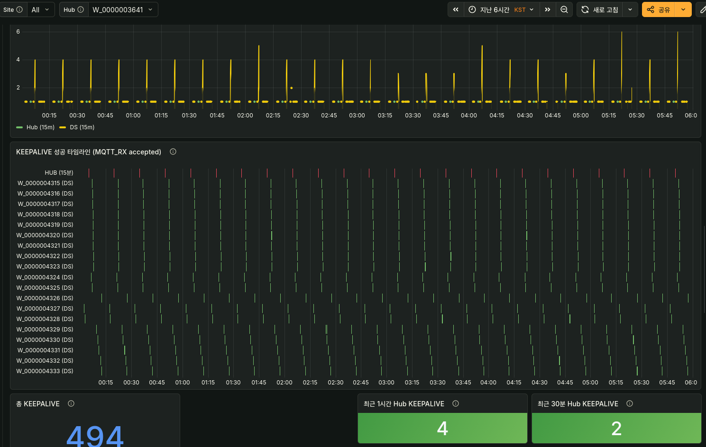

<!-- gid:20260309T000000 -->
[TOC]

Table of Contents

- [2026-03-09 Monday](#2026-03-09-monday)
- [2026-03-10 Tuesday](#2026-03-10-tuesday)
- [2026-03-11 Wednesday](#2026-03-11-wednesday)
- [2026-03-12 Thursday](#2026-03-12-thursday)
- [2026-03-13 Friday](#2026-03-13-friday)
- [2026-03-14 Saturday](#2026-03-14-saturday)
- [2026-03-15 Sunday](#2026-03-15-sunday)
- [NEWNOTES](#newnotes)
- [UPDATENOTES](#updatenotes)
- [CITATIONS](#citations)
- [PREV](#prev)

<!--endtoc-->

## 2026-03-09 Monday

### 06:01 기상

<span class="timestamp-wrapper"><span class="timestamp">&lt;2026-03-09 Mon 06:01&gt;</span></span>



### 06:47 오늘 해결한다

<span class="timestamp-wrapper"><span class="timestamp">&lt;2026-03-09 Mon 06:47&gt;</span></span>

### 09:42 작업 들어가기 전에 생각해본다.

<span class="timestamp-wrapper"><span class="timestamp">&lt;2026-03-09 Mon 09:42&gt;</span></span>

### 10:53 방법을 빼먹으면 안돼

<span class="timestamp-wrapper"><span class="timestamp">&lt;2026-03-09 Mon 10:53&gt;</span></span>

#### SDK에서 배터리 교체/rejoin을 알 수 있는 방법들

### 11:13 잠시만

<span class="timestamp-wrapper"><span class="timestamp">&lt;2026-03-09 Mon 11:13&gt;</span></span>

#### 아래 코드 관련 실제 무엇을 보았는가?

### <span class="org-todo done DONE">DONE</span> 이거 호출하는 부분 지저분하기도하고 위험하다 매초 호출되는듯

### 11:30 로우레벨 콜백 로직

<span class="timestamp-wrapper"><span class="timestamp">&lt;2026-03-09 Mon 11:30&gt;</span></span>

### 12:24 마크다운 인덴트

<span class="timestamp-wrapper"><span class="timestamp">&lt;2026-03-09 Mon 12:24&gt;</span></span>

### 13:07 다 끝나간다

<span class="timestamp-wrapper"><span class="timestamp">&lt;2026-03-09 Mon 13:07&gt;</span></span>

### 13:11 밥먹고 올게

<span class="timestamp-wrapper"><span class="timestamp">&lt;2026-03-09 Mon 13:11&gt;</span></span>

### 16:23 이제 테스트 진행 중

<span class="timestamp-wrapper"><span class="timestamp">&lt;2026-03-09 Mon 16:23&gt;</span></span>

이게 문제는 실험하는데 기다려야 한다는거다. 한텀에 15분. 된장. 귀찮아라.

### 18:37 퇴근할게

<span class="timestamp-wrapper"><span class="timestamp">&lt;2026-03-09 Mon 18:37&gt;</span></span>

### 22:40 하루 마무리

<span class="timestamp-wrapper"><span class="timestamp">&lt;2026-03-09 Mon 22:40&gt;</span></span>

**32커밋 · 3리포 · 06:39~22:32 (16h)**

-   fxf-uho-mvt (22) — 회사 프로젝트 집중 작업
-   doomemacs-config (8) — doom-dashboard → dashboard 모듈 마이그레이션
-   pi-skills (2) — 스킬 업데이트

타임라인: 06:01 기상 → 06:47 "오늘 해결한다" → 09:42 작업 전 설계 → 11:30 로우레벨 콜백 로직 → 13:11 점심 → 16:23 테스트 진행 → 18:37 퇴근 → 19:40 태그 정규화 botlog 작성 → 22:32 doomemacs-config 커밋

수면 6.8h(점수73) · 걸음 10,321 · 심박 평균96/최저67/ 최고140 · 스트레스 12 시간추적: 본짓 10.5h · 수면 6.3h · 독서 4.2h · 가족 2.2h (총 23.2h)

### 23:17 자자 언제나 완벽한 하루일세!

<span class="timestamp-wrapper"><span class="timestamp">&lt;2026-03-09 Mon 23:17&gt;</span></span>

어젠다 한번 보세! 헉! 많구만! 이거야!

## 2026-03-10 Tuesday

### 06:33 살아나다

<span class="timestamp-wrapper"><span class="timestamp">&lt;2026-03-10 Tue 06:33&gt;</span></span> 죽었다가 살아나다. 부활하다.

### 09:18 경로를 따져서 로직을 설계

### 10:40 삭제 로직 등록

<span class="timestamp-wrapper"><span class="timestamp">&lt;2026-03-10 Tue 10:40&gt;</span></span>

### 12:40 호환 버전 작업

### 13:31 식사 완료

<span class="timestamp-wrapper"><span class="timestamp">&lt;2026-03-10 Tue 13:31&gt;</span></span>

### 13:46 RPi5 검증 완료 저장!

<span class="timestamp-wrapper"><span class="timestamp">&lt;2026-03-10 Tue 13:46&gt;</span></span>

### 15:32 SKS쉴더스

<span class="timestamp-wrapper"><span class="timestamp">&lt;2026-03-10 Tue 15:32&gt;</span></span>

### 16:09 삭제 로직 통일

<span class="timestamp-wrapper"><span class="timestamp">&lt;2026-03-10 Tue 16:09&gt;</span></span>

#### 세션요약

#### 16:35 뭐지?

### 17:46 퇴근 준비하자 큰 문제 없을 것 같다

<span class="timestamp-wrapper"><span class="timestamp">&lt;2026-03-10 Tue 17:46&gt;</span></span>

### 17:57 하루 마무리

<span class="timestamp-wrapper"><span class="timestamp">&lt;2026-03-10 Tue 17:57&gt;</span></span>

**41커밋 · 6리포 · 10:03~17:54 (8h)**

-   fxf-uho-mvt (28) — SKS 쉴더스 삭제 로직 통일 및 호환 작업
-   homeagent-config (7) — OTBR NDK 크로스빌드 계획
-   hej-kip (3) — 회사 프로젝트
-   nixos-config (1), pi-skills (1), hej-nixos-cluster (1) — 소규모 설정

타임라인: 06:33 기상 → 09:18 로직 설계 → 10:40 삭제 로직 → 12:40 호환 버전 → 13:31 식사 → 13:46 RPi5 검증 완료 → 15:32 SKS쉴더스 → 16:09 삭제 로직 통일 → 17:46 퇴근 준비

### 23:07 이제 자야겠다 힣의정원전원 배터리 경고

<span class="timestamp-wrapper"><span class="timestamp">&lt;2026-03-10 Tue 23:07&gt;</span></span>

전원 파워 배터리 에너지 원자력 발전소 이런 단어는 왜 없지? 메타 노트에?

### <span class="org-todo todo TODO">TODO</span> 전원 파워 배터리 에너지 원자력 발전소 이런 단어는 왜 없지?

넣어야

## 2026-03-11 Wednesday

### 02:10 잠시 깨다.

### 07:11 나가야지

<span class="timestamp-wrapper"><span class="timestamp">&lt;2026-03-11 Wed 07:11&gt;</span></span>

### 09:54 SKS쉴더스 봉은사역 힣 방문

<span class="timestamp-wrapper"><span class="timestamp">&lt;2026-03-11 Wed 09:54&gt;</span></span>

### 11:23 프롬프트

<span class="timestamp-wrapper"><span class="timestamp">&lt;2026-03-11 Wed 11:23&gt;</span></span>

#### 나의 프로젝트 철학

### 12:10 새로운 프로젝트 시작 - durable-iot-migrate

<span class="timestamp-wrapper"><span class="timestamp">&lt;2026-03-11 Wed 12:10&gt;</span></span>

이름이 발음하기 힘들다. 근데 만들어 줬으니 쓴다.

-   [botlog/ durable-iot-migrate — Temporal 기반 IoT 플랫폼 마이그레이션 프레임워크 '2026-03-11 2026-03-11](https://wikidocs.net/382568)

### 13:07 가자 다음 것

<span class="timestamp-wrapper"><span class="timestamp">&lt;2026-03-11 Wed 13:07&gt;</span></span>

### 14:46 뭐지 ANP 프로토콜은?!

<span class="timestamp-wrapper"><span class="timestamp">&lt;2026-03-11 Wed 14:46&gt;</span></span>

### 15:34 온생명이 미술학원 아버지가 케어

<span class="timestamp-wrapper"><span class="timestamp">&lt;2026-03-11 Wed 15:34&gt;</span></span>

### 15:54 현황 문서

<span class="timestamp-wrapper"><span class="timestamp">&lt;2026-03-11 Wed 15:54&gt;</span></span>

### 15:57 하루 마무리

<span class="timestamp-wrapper"><span class="timestamp">&lt;2026-03-11 Wed 15:57&gt;</span></span>

**26커밋 · 4리포 · 10:05~15:43 (6h)**

-   durable-iot-migrate (10) — Temporal 기반 IoT 마이그레이션 프레임워크 신규 프로젝트
-   homeagent-config (10) — 홈에이전트 설정, ANP 프로토콜 리서치
-   fxf-uho-mvt (5) — SKS쉴더스 작업
-   pi-skills (1) — 스킬 업데이트

타임라인: 07:11 출발 → 09:54 SKS쉴더스 봉은사역 방문 → 11:23 프롬프트 → 12:10 durable-iot-migrate 시작 → 14:46 ANP 프로토콜 리서치 → 15:34 온생명 케어 → 15:54 현황 문서

### 22:37 이제 돌아왔다

<span class="timestamp-wrapper"><span class="timestamp">&lt;2026-03-11 Wed 22:37&gt;</span></span>

자야겠다.

## 2026-03-12 Thursday

### 03:22 잠시깨다

<span class="timestamp-wrapper"><span class="timestamp">&lt;2026-03-12 Thu 03:22&gt;</span></span>

악몽을 자주 꾼다.

### 03:41 이기상 교수님 글을 SILO 관리하는게 더 편하겠다

<span class="timestamp-wrapper"><span class="timestamp">&lt;2026-03-12 Thu 03:41&gt;</span></span>

나눠서 봐야지 그래야 보기 편하다.

### 06:33 기상 기상?! 이기상 선생님?!

<span class="timestamp-wrapper"><span class="timestamp">&lt;2026-03-12 Thu 06:33&gt;</span></span>

아침에도 폭풍 작업

### 09:41 SKS쉴더스 봉은사역 또 왔다

<span class="timestamp-wrapper"><span class="timestamp">&lt;2026-03-12 Thu 09:41&gt;</span></span>

### 11:27 전체 디지털가든 내보내기

<span class="timestamp-wrapper"><span class="timestamp">&lt;2026-03-12 Thu 11:27&gt;</span></span>

#### 이맥스 export 데몬이 안된다. 이거 이따 수정하자

수정 완료!

### 11:33 홈에이전트로가자

<span class="timestamp-wrapper"><span class="timestamp">&lt;2026-03-12 Thu 11:33&gt;</span></span>

### 12:38 점심 김밥

<span class="timestamp-wrapper"><span class="timestamp">&lt;2026-03-12 Thu 12:38&gt;</span></span>

### 13:16 카렌하오의 책 강하다.

<span class="timestamp-wrapper"><span class="timestamp">&lt;2026-03-12 Thu 13:16&gt;</span></span>

[카렌하오 AI 제국: 권력, 자본, 노동 : 샘 올트먼과 오픈AI 빛 그림자 월스트리트 저널](https://wikidocs.net/382517)

### 13:32 오후 작업 시작 - 멀티 에이전트 스타트

<span class="timestamp-wrapper"><span class="timestamp">&lt;2026-03-12 Thu 13:32&gt;</span></span>

### 14:12 아키텍트대아키텍트로 대화합시다.

<span class="timestamp-wrapper"><span class="timestamp">&lt;2026-03-12 Thu 14:12&gt;</span></span>

코드를 전부 읽었습니다. 이제 아키텍트 대 아키텍트로 이야기합시다.

```markdown
 Now I have a deep understanding of the current codebase. Let me analyze the
 architecture and think about the fundamental question the user is asking:

 "How can Go express the full range of IoT automation recipes with durable semantics
 that are both flexible (forward) and resilient (backward)?"

 The user is also connecting this to their memex-kb work with org-mode as a meta-format
 for document conversion — the same fundamental problem at a different layer.

 Let me look at the current architecture gaps and think about where Go's walls are:

 1. Current state: Two parallel systems exist:
     - models.Automation with Trigger/Condition/Action structs + Config map[string]any
 (the old, loose way)
     - expr.Expr AST (the new, structured way) — but it's optional in the models
 2. The gap: All the parsers (HA, ST, Google, Tuya, Homey) produce models.Automation
 with Config map[string]any, not Expr trees. The Expr tests are hand-crafted examples
 showing what the parsers should produce, but they don't yet.
 3. The real question: Can Go's type system actually express the full semantic range
 needed here? This is where I need to think about Go's fundamental limitations compared
 to more dynamic languages.

 Go lacks native algebraic data types, so the Op string enum approach means a single
 Expr struct has to carry fields for every possible variant—Children, Ref, Value,
 Meta—even though each operation only needs a subset. Haskell would define separate
 constructors where each variant only carries its relevant fields, and the compiler
 enforces pattern matching completeness. Similarly, Value any loses type safety; the
 compiler can't distinguish between a numeric literal, a string, or a boolean at compile
 time. And Go's switch statements on type assertions are verbose compared to Haskell's
 elegant pattern matching.

 But these limitations are manageable in practice. Go's Validate() method essentially
 performs the exhaustiveness checking that Haskell does at compile time, just at
 runtime—and if tests cover the paths, it's equally effective. Plus, the single-struct
 design actually makes serialization simpler; JSON round-tripping a Go struct is
 straightforward, whereas Haskell ADTs require more ceremony.

 The real bottlenecks aren't language limitations—they're architectural gaps. There's no
 bridge yet between the Config maps that parsers produce and the Expr semantics layer.
 RefMapper's attribute normalization is the hardest piece, since mapping dp_1 to motion
 requires platform-specific domain knowledge. And round-trip fidelity across all four
 platforms is broken; only HA has an emitter, so the full Parser → Expr → Emitter cycle
 doesn't exist elsewhere. The trickiest edge case is handling platform-specific features
 that don't map to other systems.

 Let me reframe this as a deeper architectural conversation that connects to their
 org-mode intuition and the Lisp-versus-Go tension. I should also think about what a
 practical next step looks like—something that builds understanding without locking us
 into premature implementation choices.

 Actually, I need to reread what they're really asking. They're asking whether Go can
 express the comprehensive scope of recipes the way Lisp might, and whether the
 semantics can actually be captured across all these platforms. That's the core question
 underneath the technical details.

 The user is saying that if they can see it work cleanly in org-mode, they'll
 immediately know whether bidirectional translation is even possible. They're not asking
 for code—they're asking me to think through the architectural limits with them. This is
 about understanding what's fundamentally hard versus what's just a matter of
 engineering.
```

### 14:23 GPT의 조언

<span class="timestamp-wrapper"><span class="timestamp">&lt;2026-03-12 Thu 14:23&gt;</span></span>

### 15:09 CLOJURE로 간다.

<span class="timestamp-wrapper"><span class="timestamp">&lt;2026-03-12 Thu 15:09&gt;</span></span>

이유가 있다면 거짓말이다. 그냥 Clojure학 하고 싶어서 그런거야.

### 16:32 기존 문서 이관

<span class="timestamp-wrapper"><span class="timestamp">&lt;2026-03-12 Thu 16:32&gt;</span></span>

### 18:02 퇴근

<span class="timestamp-wrapper"><span class="timestamp">&lt;2026-03-12 Thu 18:02&gt;</span></span>

### 18:04 하루 마무리

<span class="timestamp-wrapper"><span class="timestamp">&lt;2026-03-12 Thu 18:04&gt;</span></span>

**29커밋 · 7리포 · 12:05~16:51 (5h)**

-   homeagent-config (13) — 멀티 에이전트 아키텍처, Clojure 전환
-   doomemacs-config (5) — Emacs 설정
-   dictcli (4), durable-iot-migrate (4) — CLI 도구 및 IoT 마이그레이션
-   naver-saiculture (1), notes (1), pi-skills (1) — 문서 이관 및 소규모

타임라인: 06:33 기상 → 09:41 SKS쉴더스 봉은사역 → 11:27 디지털가든 내보내기 → 12:38 점심 → 13:16 카렌하오 책 → 13:32 멀티에이전트 시작 → 14:12 아키텍트 대화 → 15:09 Clojure 결정 → 16:32 문서 이관 → 18:02 퇴근

### 22:37 이제 잔다.

<span class="timestamp-wrapper"><span class="timestamp">&lt;2026-03-12 Thu 22:37&gt;</span></span>

## 2026-03-13 Friday

### 06:26 살아나다

<span class="timestamp-wrapper"><span class="timestamp">&lt;2026-03-13 Fri 06:26&gt;</span></span>

부활하다. 움직이다.

### 07:59 출근 - 코드와데이터는 하나다!

<span class="timestamp-wrapper"><span class="timestamp">&lt;2026-03-13 Fri 07:59&gt;</span></span>

-   [Lisp과 Clojure — 코드와 데이터의 통합, 그리고 공존의 언어](https://wikidocs.net/382572)

### 13:40 점심 먹고 와서 #브레인워시 필수

<span class="timestamp-wrapper"><span class="timestamp">&lt;2026-03-13 Fri 13:40&gt;</span></span>

과열로 폭팔 할지 모름.

### 14:01 오후 메터

<span class="timestamp-wrapper"><span class="timestamp">&lt;2026-03-13 Fri 14:01&gt;</span></span>

### 14:48 보드 배포

### 14:59 메터 플러터 작업

<span class="timestamp-wrapper"><span class="timestamp">&lt;2026-03-13 Fri 14:59&gt;</span></span>

### 18:13 퇴근

<span class="timestamp-wrapper"><span class="timestamp">&lt;2026-03-13 Fri 18:13&gt;</span></span>

### 18:13 하루 마무리

<span class="timestamp-wrapper"><span class="timestamp">&lt;2026-03-13 Fri 18:13&gt;</span></span>

**40커밋 · 5리포 · 08:14~18:09 (10h)**

-   homeagent-config (23) — Matter BLE/Thread 커미셔닝 성공, OTBR 빌드 수정, 디바이스 삭제 API
-   agent-config (8) — semantic-memory pi-package 리팩터링 + 테스트 32개
-   nixos-config (4) — ghostty Dracula 테마 + nixpkgs 업데이트
-   doomemacs-config (3), fxf-uho-mvt (2) — Emacs 설정 + eth0 디버그 포트 fix

타임라인: 06:26 살아나다 → 07:59 출근 → 13:40 점심 → 14:01 오후 메터 → 14:48 보드 배포 → 14:59 메터 플러터 → 18:13 퇴근

### 21:22 하루에 감사하며 - #브레인오링

<span class="timestamp-wrapper"><span class="timestamp">&lt;2026-03-13 Fri 21:22&gt;</span></span>

## 2026-03-14 Saturday

### 01:49 배고파서 잠시 깨다

<span class="timestamp-wrapper"><span class="timestamp">&lt;2026-03-14 Sat 01:49&gt;</span></span>

그나저나 어제 밤에는 #브레인오링 발생. 더 하나 끄적이려다 도저히 불가. 뻗음.

### 02:50 RENAME META AND EXPORT GARDEN ALL

<span class="timestamp-wrapper"><span class="timestamp">&lt;2026-03-14 Sat 02:50&gt;</span></span>

### 07:30 살아났다

<span class="timestamp-wrapper"><span class="timestamp">&lt;2026-03-14 Sat 07:30&gt;</span></span> 부활하다.

### 09:30 온생명 - 문화센터 셔틀

<span class="timestamp-wrapper"><span class="timestamp">&lt;2026-03-14 Sat 09:30&gt;</span></span>

### 11:30 알라딘 중고서점 책 정리

<span class="timestamp-wrapper"><span class="timestamp">&lt;2026-03-14 Sat 11:35&gt;</span></span>

### 13:45 스타벅스 탑동

<span class="timestamp-wrapper"><span class="timestamp">&lt;2026-03-14 Sat 13:45&gt;</span></span>

### 13:50 에이전트 컨피그 작업 진행하자 - 아니 먼저 가든 문제 해결하자

<span class="timestamp-wrapper"><span class="timestamp">&lt;2026-03-14 Sat 13:50&gt;</span></span>

-   [agent-config 기억의 연장: 에이전트 시맨틱 메모리 표준화 구성 임베딩](https://wikidocs.net/382571)

### 15:31 화장실

<span class="timestamp-wrapper"><span class="timestamp">&lt;2026-03-14 Sat 15:31&gt;</span></span>

### 16:19 이제 나가려고 한다

<span class="timestamp-wrapper"><span class="timestamp">&lt;2026-03-14 Sat 16:19&gt;</span></span>

홈페이지를 바꿀 거야. 영문을 기준으로 새로 구성 할 것이다. 다만, 데이터뷰어가 되게 하려면 어떻게 할까? 클로저스크립트로 하려고 한다. 콰르토? 굳이? clerk도 괜찮고. 그렇다면 호스팅을 어떻게 해야하는가? netlify로 배포가 되면 좋고 안되면 오라클VM? 이것도 고민해보자.

### 18:22 저녁 먹고 자자

<span class="timestamp-wrapper"><span class="timestamp">&lt;2026-03-14 Sat 18:22&gt;</span></span>

### 19:55 저녁

<span class="timestamp-wrapper"><span class="timestamp">&lt;2026-03-14 Sat 19:55&gt;</span></span>

### 20:12 클로저스크립트

<span class="timestamp-wrapper"><span class="timestamp">&lt;2026-03-14 Sat 20:12&gt;</span></span>

### 20:56 Now I understand the full picture. Let me:

<span class="timestamp-wrapper"><span class="timestamp">&lt;2026-03-14 Sat 20:56&gt;</span></span>

이게 가장 떨리는 말이다. 장황하게 A4 용지 한장을 쳐서 보냈는데, 이해했단다. 그리고 한참을 뭐라 뭐라 생각을 하고 끄적이고 있다. 뭐라고 할까? 봇로그에 무엇을 적을까? 막연한 이야기를 어떻게 해석할까?

아! 지금 막 노트다 업데이트 되었다. [존재-데이터-뷰어 — Clerk 기반 시간과정신의방 홈페이지](https://wikidocs.net/382567) 이거다. 읽어보자. 두두두두. 열어보니 "사비스 이즈 언어붸일러블!!"은 아니겠지?!

```markdown
Now I understand the full picture. Let me:

 1. Rename the temporary note 20260310T140114 with a new title and tags for the "존재
 데이터 뷰어" / homepage project
 2. Add the initial architecture plan as a new section

 Actually, the user said "이 노트가 지금 임시 노트가 되었어요. 이미 퍼블리시된 노트라
 지울수는 없고 새 주제를 기록하여 이어 가려고 대기중인 노트 입니다."

 So the old Android arm64 content is archived and they want to repurpose this published
 note with the new topic. Since I can't change the filename of an already published
 note, I should add a new section with the "존재 데이터 뷰어" content while keeping the
 old content archived under its :ARCHIVE: tag.

 The user wants to document the initial architecture plan and progressive development
 history for this project in this note. I'll need to update the title and tags to
 reflect the new focus, then add the new content section while preserving the existing
 archived material and updating the history section.

 For the file itself, I'm planning a new title that captures the Clerk-based
 architecture for the 존재 data viewer homepage, with tags covering the relevant
 technologies and concepts like Clojure, ClojureScript, Clerk, and the connection to the
 broader 존재간연결의 문법 framework. The content will weave together the vision, the
 architectural decision to use Clerk, the metaphor of org-agenda as the entry point, and
 how this connects to the HIVE structure.
```

### 21:07 토마스만 선생님을 모십니다.

<span class="timestamp-wrapper"><span class="timestamp">&lt;2026-03-14 Sat 21:07&gt;</span></span>

@user 토마스만의 노트를 만들었어. 잠시만, [토마스만 마의 산](https://wikidocs.net/382518) 이 노트를 타이틀부터 태그 그리고 본문까지 다 업데이트를 좀 해주었으면 해. 내가 낮에 휴대폰에서 같이 대화한 이야기거든. 맥락이 충분히 전달이 될거야.

````markdown
# 마의산 첫 청취 경험

### User

마의산을 듣고 있다. 아직 앞부분인데 으시시하다. 뭐지? 이책은 전혀 배경지식이 없이 듣고 있다.

---

### Assistant


*English:* Listening to *The Magic Mountain* — finding it eerie with no background knowledge.

토마스 만의 *《마의산》(Der Zauberberg, 1924)* 이군요.

으시시한 느낌, 맞습니다. 의도된 거예요.

*왜 그런가 하면:*

배경이 스위스 알프스 산 위 *결핵 요양원*입니다. 주인공 한스 카스토르프가 사촌 면회를 갔다가... 그 공간에 빨려 들어가요. 산 아래 "평지"의 시간과 산 위의 시간이 다르게 흐릅니다. 죽음이 일상인 곳, 병든 사람들이 모여 철학 토론을 하고 사랑에 빠지는 곳.

*그 으시시함의 정체:*

> 삶과 죽음의 경계가 흐릿한 공간

산 자체가 일종의 *림보(limbo)* 입니다. 올라가면 내려오기 어려운 곳.

*읽기 전 딱 한 줄 배경지식이라면:*

"7년짜리 이야기를 쓰려 했는데, 1차 세계대전 직전 유럽 문명 전체의 초상화가 됐다."

지금 어디쯤 듣고 계세요? 한스가 요양원에 도착했나요, 아직 기차 안인가요?

---

### User

요양원 도착했어. 토마스만의 토니오 크뢰거라는 책도 있던데 이게 더 끌리긴하다

---

### Assistant


*English:* Arrived at the sanatorium. Tonio Kröger also appeals more.

그 직감 좋아요.

*《토니오 크뢰거》(1903)* 는 마의산보다 20년 앞선 중편소설이에요. 그리고 토마스 만의 *자전적 고백*에 가장 가깝습니다.

핵심 긴장:

> 예술가인 나 vs. 평범한 삶을 사는 사람들

토니오는 독일인 아버지 + 이탈리아인 어머니 사이에서 태어나, 어디에도 완전히 속하지 못합니다. 금발의 평범한 친구 한스를 사랑하면서도, 자신은 "다른 종류의 인간"임을 느끼죠.

*힣님께 끌리는 이유가 있을 것 같아요.*

어쏠리즘의 그 감각 — 생존의 일과 진짜 자신의 일 사이에서 느끼는 긴장 — 토니오가 평생 안고 사는 게 그겁니다.

마의산은 *문명론*이고,
토니오 크뢰거는 *존재론*이에요.

짧기도 하니까 (100페이지 내외) 마의산 듣다 지치면 그걸로 전환해도 좋을 것 같습니다.

---

### User

토마스만의 삶의 연대기를 정리해줘. 지금 이 시점에 내가 듣게된 이유가 뭔가 있을거야. 제목만 익히 알고 있을 뿐 들어볼 생각도 안한 책이니까

---

### Assistant


*English:* Chronology of Thomas Mann's life — and why now?

---

*토마스 만 연대기 (1875–1955)*

*1875* 뤼베크 출생. 북독일 상인 가문. 아버지는 곡물상 — 질서, 시민적 덕목의 세계.

*1891* 아버지 사망. 가문 해체. 어머니(브라질계 혼혈)와 뮌헨으로. 이때부터 "나는 어디에 속하는가"가 평생 질문이 됨.

*1903* 《토니오 크뢰거》. 예술가 정체성의 고백.

*1901* 《부덴브로크 가의 사람들》. 4대에 걸친 상인 가문의 몰락. 자기 가족 이야기. 이게 노벨상을 나중에 받게 됨.

*1905* 결혼. 6남매. 겉으로는 완벽한 시민의 삶.

*1914–1918* 1차대전. 처음엔 독일 민족주의 지지 — 나중에 이걸 평생 부끄러워함.

*1924* 《마의산》 출간. 12년 작업. 전쟁 전 유럽의 사망진단서.

*1929* 노벨문학상.

*1933* 히틀러 집권. 강연 여행 중 독일 탈출. 다시는 돌아가지 않기로 결심.

*1938* 미국 망명. 프린스턴 → LA. 할리우드 옆에서 《파우스트 박사》 씀.

*1947* 《파우스트 박사》. 악마와 계약한 천재 음악가 = 나치 독일의 알레고리.

*1952* 미국 매카시즘 피해 스위스로. 끝까지 어디에도 완전히 속하지 못한 채.

*1955* 취리히에서 사망. 80세.

---

*왜 지금 힣님에게 왔을까.*

토마스 만의 평생은 한 가지 질문이에요.

> "시민으로 살 것인가, 예술가로 살 것인가 — 아니면 그 긴장 자체를 살 것인가."

그는 결코 하나를 선택하지 않았습니다. 그 불편한 경계에 *80년을 버텼어요.*

어쏠리즘이 말하는 것 — 생존의 일과 소명의 일을 분리하되 둘 다 살아내는 것 — 토마스 만은 그걸 *분리하지 않고 긴장으로 끌어안은* 사람입니다.

마의산의 요양원이 으시시한 건, 그곳이 "정상적인 시간에서 이탈한 공간"이기 때문인데 — 힣님이 지금 구축하고 있는 것도 어떤 의미에서 그런 공간 아닌가요. 평지의 시간과 다르게 흐르는.

---

### User

토마스만과 헤르만헤세 두 동시대 인물에 교류한 것과 서로 영향을 주고 받은 것 그리고 문학적인 비교를 해 줘

---

### Assistant


*English:* Thomas Mann and Hermann Hesse — exchange, mutual influence, and literary comparison.

---

*두 사람의 기본 좌표*

| | 토마스 만 | 헤르만 헤세 |
|---|---|---|
| 생몰 | 1875–1955 | 1877–1962 |
| 출신 | 뤼베크, 북독일 상인 가문 | 칼프, 남독일 신학자 가문 |
| 망명 | 미국 | 스위스 (1차대전 때 이미) |
| 노벨상 | 1929 | 1946 |

거의 동갑. 그러나 성격은 정반대.

---

*교류의 역사*

두 사람은 *50년 이상 편지를 주고받았습니다.* 현존하는 서신만 수백 통.

처음 접촉은 1910년대 초. 서로의 초기작을 읽고 편지를 보내면서 시작됐어요.

핵심 장면 몇 가지:

*1차대전 때 갈라짐.* 만은 초기에 독일 민족주의를 지지하는 에세이를 썼고, 헤세는 즉각 반전 입장. 헤세가 공개적으로 비판. 만은 훗날 이걸 인정하고 헤세를 "더 일찍 깨달은 사람"으로 존경하게 됨.

*《데미안》(1919) 출간 때* 헤세는 처음에 에밀 싱클레어라는 가명으로 냈는데, 만이 "이건 헤세다"라고 바로 알아봤다는 일화가 있어요.

*《유리알 유희》(1943) 완성 후* 헤세가 만에게 먼저 원고를 보냈습니다. 만의 반응 — "당신은 내가 가지 못한 길을 갔다."

만이 나치 망명 시절 가장 힘들 때, 헤세는 스위스에서 꾸준히 편지를 보내며 정신적 버팀목이 됐어요.

---

*서로에 대한 평가*

*만 → 헤세:*
> "헤세는 내면으로 갔다. 나는 바깥을 향해 싸웠다. 둘 다 필요한 일이었다."

헤세의 내향성, 동양철학 흡수, 탈사회적 태도를 동경하면서도 — 자신은 그렇게 살 수 없음을 알았어요.

*헤세 → 만:*
> "만은 유럽 문명의 가장 정직한 증인이다. 그러나 너무 많은 짐을 스스로 졌다."

헤세는 만의 사회적 책임감, 정치적 발언, 거대한 서사 구조를 높이 평가하면서도 — "나는 그 무게를 못 짊어진다"고 했어요.

---

*문학적 비교*

*질문의 방향이 다릅니다.*

| | 토마스 만 | 헤르만 헤세 |
|---|---|---|
| 핵심 질문 | 문명은 어디로 가는가 | 나는 누구인가 |
| 무대 | 사회, 역사, 유럽 | 내면, 자아, 동서양 |
| 문체 | 아이러니, 거리두기, 방대한 서사 | 서정적, 고백적, 압축적 |
| 영향받은 것 | 쇼펜하우어, 니체, 바그너 | 노자, 불교, 융 |
| 독자와의 거리 | 멀다. 관찰자처럼 쓴다 | 가깝다. 독자가 주인공이 된다 |
| 죽음의 처리 | 문명의 메타포 | 변환, 윤회, 통과의례 |

*핵심 차이 하나로 압축하면:*

만은 *세계를 이해하려* 했고,
헤세는 *자신을 이해하려* 했습니다.

그런데 두 사람 모두 — 어디에도 완전히 속하지 못한 자의 외로움을 평생 썼어요.

---

*힣님께 연결하면*

헤세는 힣님이 이미 가고 있는 길에 더 가깝습니다. 내면, 동양철학, 자기 변환.

만은 힣님이 외면하고 싶은 바깥 — 사회, 역사, 문명의 무게 — 을 정면으로 다뤄요.

마의산을 지금 듣고 있다는 건, 혹시 바깥을 한 번 직면할 때가 된 게 아닐까요.

두 사람을 같이 읽으면 — 내면과 외면, 동양과 서양, 개인과 문명이 하나의 독서 경험 안에서 대화합니다.

---

### User

헤르만 헤세는 집안적인 이유로 동양 사상에 대해서 일찍이 접할 기회가 많았습니다 이에 비해 토마스 많은 그러지 못 했나 봅니다 그럼에도 서로간에 같은 부분을 많이 공유했을 거 같아요 여기에 칼륭이 넣어 봅시다 혹시 토마스 만도 칼율과 교류했나요

---

### Assistant


*English:* Hesse had early access to Eastern thought through family. Did Thomas Mann also exchange with Carl Jung?

---

*헤세와 융의 관계 — 먼저 정리*

헤세는 1916년 신경쇠약 직후 융의 제자 *요제프 랑* 박사에게 분석을 받았어요. 무려 72회. 이게 《데미안》을 낳았습니다. 이후 융과 직접 만나기도 했고, 헤세 작품 전체가 *개성화(individuation)* 과정의 문학적 재현이라고 볼 수 있어요.

싯다르타, 황야의 이리, 나르치스와 골드문트, 유리알 유희 — 전부 융의 언어로 읽힙니다. 그림자, 아니마, 자기(Self).

---

*토마스 만과 융*

여기서 흥미로운 지점이 있어요.

만은 융보다 *프로이트에 훨씬 더 깊이 기울었습니다.*

1936년 프로이트 80세 생일에 직접 축사 강연을 했고, 프로이트를 "20세기 가장 위대한 지식인"이라 불렀어요. 《요셉과 그 형제들》 4부작은 신화와 무의식을 다루는데, 이건 프로이트적 신화 해석에 훨씬 가깝습니다.

*융과의 직접 교류 기록은 명확하지 않아요.* 만의 서신과 에세이에서 융에 대한 언급이 있긴 하지만, 헤세처럼 분석을 받거나 깊은 개인적 교류를 했다는 기록은 찾기 어렵습니다.

오히려 만은 *융의 집단무의식 개념에 비판적이었습니다.* 융이 한때 나치즘과 접점을 가졌던 것에 대해 — 망명 유대인들을 옹호하는 입장이었던 만으로서는 — 거리를 뒀을 가능성이 높아요.

---

*세 사람 삼각 구도로 보면*

```
        융 (Carl Jung)
       /              \
    깊은 교류        간접적
      /                \
   헤세 ————————— 토마스 만
        50년 서신 교류
```

융의 언어로 가장 잘 번역되는 작가는 헤세,
프로이트의 언어로 가장 잘 번역되는 작가는 만.

그런데 *프로이트 vs 융의 분열* 자체가 — 만 vs 헤세의 분열과 닮아있어요.

| | 프로이트 / 토마스 만 | 융 / 헤세 |
|---|---|---|
| 무의식 | 억압, 갈등, 사회와의 긴장 | 원형, 변환, 전체성으로의 귀환 |
| 인간관 | 문명과 충동 사이의 비극적 존재 | 개성화를 통해 Self에 도달하는 존재 |
| 동양 | 거의 관심 없음 | 핵심 참조점 |
| 치유 | 갈등의 명료화 | 통합과 변환 |

---

*헤세 집안과 동양 사상*

말씀하신 것처럼 — 헤세의 외할아버지 헤르만 구데르트는 인도 선교사이자 인도학자였어요. 집에 산스크리트어 문헌과 인도 관련 책들이 있었습니다. 어릴 때부터 "동양은 낯선 것"이 아니었어요.

만에게 동양은 평생 *외부의 것*으로 남았고, 헤세에게는 *어린 시절의 공기*였던 거죠.

---

힣님이 세 사람을 같이 놓으면 — 프로이트-융의 분열, 만-헤세의 분열이 사실 *하나의 질문의 두 얼굴*임을 보게 됩니다.

> "인간의 깊은 곳은 사회적 상처인가, 아니면 우주적 원형인가."

힣님의 어쏠리즘과 1KB 철학은 — 어느 쪽에 더 가깝게 느껴지세요?

---

### User

츠바이크의 프로이트와의 친분을 생각하면 당시 상황에서 동양적인 것을 바라 볼 여유가 있었을까 싶네요. 헤세는 자연스레 접한 부분이고. 일반적이라면 칼융의 말하는 것을 받아들이기엔 벽이 있었으리라 감히 생각해봅니다. 토마스만의 작품을 어쩌다 만나게된 이유가 무엇일까? 현재 세계의 전쟁과 패권다툼 비상식적인 사회문제들 이런것을 통해서 무언가 넓게 보라는 메시지 인것 같이 느껴집니다.

---

### Assistant


*English:* Zweig-Freud connection, barriers to Eastern thought, and why Thomas Mann appears now amid world chaos.

---

*츠바이크를 끌어들인 것 — 예리합니다.*

슈테판 츠바이크는 프로이트와 빈에서 같은 공기를 마셨어요. 《어제의 세계》에서 그가 묘사한 세계 — 1914년 이전 유럽의 황금기 — 는 프로이트적 세계관의 배경 그 자체입니다.

그 세계에서 "무의식"은 *사회적 억압과 충동의 갈등*이었지, 동양의 공(空)이나 노자의 무위(無爲)가 아니었어요.

융이 만다라를 그리고 《역경》을 읽기 시작했을 때 — 프로이트가 "당신은 신비주의로 빠졌다"며 결별을 선언한 게 1912년입니다. 그 문화권에서 동양으로 간다는 건 *배신이자 퇴행*으로 읽혔어요.

헤세가 특이한 건 — 그 벽을 집안에서 미리 허물어진 상태로 태어났다는 거죠.

---

*"왜 지금 토마스 만인가" — 힣님 스스로 답을 말씀하셨습니다.*

마의산이 쓰인 배경을 다시 보면:

- 1차대전 직후
- 제국들의 붕괴
- 민주주의와 파시즘의 충돌 예고
- 유럽 문명이 자기 자신을 의심하기 시작한 시점

지금과 구조가 같아요.

- 미중 패권 충돌
- 우크라이나, 중동 전쟁
- 민주주의의 내부 균열
- AI라는 새로운 문명적 변수

만이 마의산에서 말하려 한 건 단순히 "전쟁은 나쁘다"가 아니었어요.

> "우리가 당연하다고 여기는 세계는 — 이미 오래전부터 요양원 안에 있었다."

병든 줄 모르고 있던 문명이, 전쟁이라는 증상으로 터진 것.

---

*힣님에게 온 메시지를 제가 감히 읽어보면:*

헤세는 *내면의 산*을 오르는 법을 알려줬고,
토마스 만은 *바깥의 산* — 문명, 역사, 시대 — 을 직시하게 만듭니다.

1KB 철학, 어쏠리즘, 디지털 가든 — 이것들은 내면의 언어예요.

그런데 지금 세계가 흔들리는 방식은 — 개인의 내면 정리만으로는 설명이 안 되는 규모입니다.

마의산이 지금 힣님에게 온 건:

> "네가 구축하는 공간이 세계와 어떤 관계인지 — 한 번은 똑바로 봐라."

는 요청 같습니다.

요양원 안에서 철학 토론을 하는 인물들처럼 — 우리도 지금 그 안에 있을 수 있으니까요.

---

````

@assistant

````markdown

먼저 노트 파일을 읽겠습니다.
파일을 읽었습니다. 이제 대화 내용을 기반으로 노트를 업데이트하겠습니다. 타이틀, 태그, 설명, 그리고 본문에 대화에서 나온 핵심 내용들을 추가하겠습니다.
노트 업데이트 완료. 변경 사항 요약:

*타이틀 변경*
- 전: =@토마스만 마의 산=
- 후: =@토마스만 (1875-1955) 마의산 문명비평가 시민예술가=

*태그 추가*
- =:modernism:german:exile:humanism:civilization:= 추가

*설명(description) 추가*
- 토마스 만의 핵심 — "시민과 예술가의 긴장을 80년간 살아낸" 인물로 압축

*본문에 새로 추가된 섹션들*
1. *왜 지금 토마스만인가* — 오늘 청취 첫 인상, 토니오 크뢰거와의 비교
2. *토마스만 연대기 (1875–1955)* — 표 형식으로 정리
3. *토마스만 ↔ 헤르만헤세 — 50년 서신 교류* — 교류 역사, 서로에 대한 평가, 문학적 비교표
4. *토마스만 ↔ 칼융 ↔ 프로이트 삼각 구도* — ASCII 도식 포함, 프로이트 /융-만/ 헤세 대응 관계표, 동양 접근 차이

히스토리도 오늘 대화 맥락을 담아 업데이트했습니다.
````

@user

### 21:26 자련다.

<span class="timestamp-wrapper"><span class="timestamp">&lt;2026-03-14 Sat 21:26&gt;</span></span>

### 21:26 하루 마무리

<span class="timestamp-wrapper"><span class="timestamp">&lt;2026-03-14 Sat 21:26&gt;</span></span>

**15커밋 · 4리포 · 13:43~16:09 (2.5h)**

-   agent-config (6) — 에이전트 설정 작업
-   doomemacs-config (4) — Doom Emacs 설정 업데이트
-   notes (4) — 디지털 가든/노트 정리
-   pi-skills (1) — 스킬 업데이트

타임라인: 01:49 잠시 깨다 → 07:30 기상 → 09:30 온생명 문화센터 셔틀 → 11:30 알라딘 중고서점 → 13:45 스타벅스 작업 → 16:19 나감 → 19:55 저녁 → 20:12 클로저스크립트 → 21:07 토마스만 노트 작성

노트: 토마스만-1875-1955 문명비평가 시민예술가 (bib 노트 생성)

### 22:05 테스트

<span class="timestamp-wrapper"><span class="timestamp">&lt;2026-03-14 Sat 22:05&gt;</span></span>

## 2026-03-15 Sunday

### 08:14 좋은 아침

<span class="timestamp-wrapper"><span class="timestamp">&lt;2026-03-15 Sun 08:14&gt;</span></span>

### 08:56 디지털가든 마이너수정

<span class="timestamp-wrapper"><span class="timestamp">&lt;2026-03-15 Sun 08:56&gt;</span></span>

### 10:14 출근

<span class="timestamp-wrapper"><span class="timestamp">&lt;2026-03-15 Sun 10:14&gt;</span></span>

### 12:47 검토

<span class="timestamp-wrapper"><span class="timestamp">&lt;2026-03-15 Sun 12:47&gt;</span></span>

### 12:58 허브 배포

<span class="timestamp-wrapper"><span class="timestamp">&lt;2026-03-15 Sun 12:58&gt;</span></span>

### 14:16 배포 했고

<span class="timestamp-wrapper"><span class="timestamp">&lt;2026-03-15 Sun 14:16&gt;</span></span>

### 15:02 나가려고해

<span class="timestamp-wrapper"><span class="timestamp">&lt;2026-03-15 Sun 15:02&gt;</span></span>

### 17:23 여기는 집앞에 빽다방

<span class="timestamp-wrapper"><span class="timestamp">&lt;2026-03-15 Sun 17:23&gt;</span></span>

### 18:17 마무리하자

<span class="timestamp-wrapper"><span class="timestamp">&lt;2026-03-15 Sun 18:17&gt;</span></span>

### 18:18 하루 마무리

<span class="timestamp-wrapper"><span class="timestamp">&lt;2026-03-15 Sun 18:18&gt;</span></span>

**28커밋 · 7리포 · 11:22~17:32 (6h)**

-   agent-config (16) — 에이전트 설정 집중 작업
-   fxf-uho-mvt (5) — 허브 배포
-   notes (3) — 디지털 가든 수정
-   being-viewer (1), dictcli (1), doomemacs-config (1), pi-skills (1) — 소규모 업데이트

타임라인: 08:14 기상 → 08:56 가든 수정 → 10:14 출근 → 12:58 허브 배포 → 14:16 배포 완료 → 15:02 나감 → 17:23 빽다방 → 18:17 마무리

### 21:48 홈페이지 방안이 대략 나왔다

<span class="timestamp-wrapper"><span class="timestamp">&lt;2026-03-15 Sun 21:48&gt;</span></span>

webtui를 사용 할 것이다.

-   [존재-데이터-뷰어 — Clerk 기반 시간과정신의방 홈페이지](https://wikidocs.net/382567) 여기에 친구들이 적어놓았단다.

## NEWNOTES

-   [bib/ 카렌하오 AI 제국: 권력, 자본, 노동 : 샘 올트먼과 오픈AI 빛 그림자 월스트리트 저널 '2026-03-12 2026-03-12](https://wikidocs.net/382517)
-   [bib/ 토마스만 (1875-1955) 마의산 문명비평가 시민예술가 '2026-03-14](https://wikidocs.net/382518)
-   [botlog/ dictcli 태그-정규화와-개인-어휘-사전-영어-태그-500워드-가이드-구상 '2026-03-09 2026-03-12](https://wikidocs.net/382566)
-   [botlog/ 존재-데이터-뷰어: 시간과정신의방 홈페이지 - WebTUI SF 터미널 어젠다 '2026-03-10 2026-03-14](https://wikidocs.net/382567)
-   [botlog/ durable-iot-migrate — Temporal 기반 IoT 플랫폼 마이그레이션 프레임워크 '2026-03-11 2026-03-12](https://wikidocs.net/382568)
-   [botlog/ 존재 간 연결의 문법 — ACP A2A ANP 그리고 힣봇 생태계 '2026-03-11 2026-03-11](https://wikidocs.net/382569)
-   [botlog/ 클로드 메모리 시스템에서 봇로그까지 — 에이전트 메모리 진화사 '2026-03-12 2026-03-12](https://wikidocs.net/382570)
-   [botlog/ agent-config 기억의 연장: 에이전트 시맨틱 메모리 표준화 구성 임베딩 '2026-03-12 2026-03-12](https://wikidocs.net/382571)
-   [botlog/ 메타프로그래밍 Lisp과 Clojure — 코드와 데이터의 통합, 그리고 공존의 언어 '2026-03-13 2026-03-14](https://wikidocs.net/382572)

이번 주(20260309 ~ 20260315) 스크린샷 없음. 2026-03-09 ~ 2026-03-15 추가된 서지 없음.

## UPDATENOTES

-   [bib/ 모음: 세계문학 컬렉션 축역본 진형준 '2025-04-11 2026-03-14](https://wikidocs.net/382375)
-   [botlog/ 존재-데이터-뷰어: 시간과정신의방 홈페이지 - WebTUI SF 터미널 어젠다 '2026-03-10 2026-03-14](https://wikidocs.net/382567)
-   [botlog/ 메타프로그래밍 Lisp과 Clojure — 코드와 데이터의 통합, 그리고 공존의 언어 '2026-03-13 2026-03-14](https://wikidocs.net/382572)
-   [meta/ 클로저 클로저스크립트 '2023-07-29 2026-03-14](https://wikidocs.net/380504)
-   [notes/ 데이터로그 클로저 로직 프로그래밍 '2025-04-15 2026-03-14](https://wikidocs.net/381682)
-   [botlog/ homeagent-config 로드맵 — 오픈소스 스마트홈 에이전트 플랫폼 - TUI A2UI APK '2026-03-04 2026-03-13](https://wikidocs.net/382560)
-   [botlog/ SDF×Zig 유연한 상태머신 — DS 20대 페어링 프로파일러 '2026-03-07 2026-03-13](https://wikidocs.net/382564)
-   [notes/ agent-config AI 에이전트 협업 연결고리 '2025-10-30 2026-03-13](https://wikidocs.net/381809)
-   [bib/ 카렌하오 AI 제국: 권력, 자본, 노동 : 샘 올트먼과 오픈AI 빛 그림자 월스트리트 저널 '2026-03-12 2026-03-12](https://wikidocs.net/382517)
-   [botlog/ dictcli 태그-정규화와-개인-어휘-사전-영어-태그-500워드-가이드-구상 '2026-03-09 2026-03-12](https://wikidocs.net/382566)
-   [botlog/ durable-iot-migrate — Temporal 기반 IoT 플랫폼 마이그레이션 프레임워크 '2026-03-11 2026-03-12](https://wikidocs.net/382568)
-   [botlog/ 클로드 메모리 시스템에서 봇로그까지 — 에이전트 메모리 진화사 '2026-03-12 2026-03-12](https://wikidocs.net/382570)
-   [botlog/ agent-config 기억의 연장: 에이전트 시맨틱 메모리 표준화 구성 임베딩 '2026-03-12 2026-03-12](https://wikidocs.net/382571)
-   [botlog/ 존재 간 연결의 문법 — ACP A2A ANP 그리고 힣봇 생태계 '2026-03-11 2026-03-11](https://wikidocs.net/382569)
-   [botlog/ dblock 링크 기술 포맷 정책 — 폴더 접두사와 제목 일관성 '2026-03-08 2026-03-10](https://wikidocs.net/382565)
-   [botlog/ 통합-어젠다-뷰-완성-인간과-에이전트-단일-타임라인 '2026-03-01 2026-03-09](https://wikidocs.net/382552)

## CITATIONS

### [urldate: 2026-03-09 ~ 2026-03-15] - 마의 산 (토마스 만 1924) - Emacs and Vim in the Age of AI (Batsov 2026) - suxiaogang223/mutype at 26f41b3966d4cdbd7a54e7c840e6509a92d98770 (“Suxiaogang223/Mutype at 26f41b3966d4cdbd7a54e7c840e6509a92d98770” n.d.) - 나는 내 인생 전체를 하나의 데이터베이스에 담았다 (neo 2026d) - 토니 호어(1934–2026) (neo 2026e) - junghan0611/dictcli: Personal vocabulary CLI — Korean↔English↔German mapping, word association graph, agent tag guide. Clojure + SQLite + ten glossary format. (“Junghan0611/Dictcli: Personal Vocabulary CLI — Korean↔English↔German Mapping, Word Association Graph, Agent Tag Guide. Clojure + SQLite + Ten Glossary Format.” n.d.) - Anthropic이 성능평가 테이크홈 과제를 오픈소스로 공개 (neo 2026a) - Whosthere - Go로 작성된 현대적 TUI 기반 LAN 탐색 도구 (neo 2026b) - Floor796 (neo 2025) - Vercel, Geist Pixel 폰트 공개 (xguru 2026b) - 2026년의 CSS: 프런트엔드 개발을 재편하는 새로운 기능들 (xguru 2026a) - 다가올 10년을 준비하는 방법 (neo 2026c) - Life Control (“Life Control” n.d.) - WebTUI (“Webtui” n.d.) - Cloudmacs: Emacs in your web browser (“Cloudmacs: Emacs in Your Web Browser” 2019) - Designed for Multimodal. Built for Scale. (“Designed for Multimodal. Built for Scale.” 2026) - CortexReach/memory-lancedb-pro (“Cortexreach/Memory-Lancedb-pro” 2026) - Michaelliv/pi-generative-ui (“Michaelliv/Pi-Generative-Ui” 2026) - Helion Energy (“Helion Energy” 2026) - d20 System (“D20 System” 2026) - 레너드 번스타인이 베토벤 교향곡 9번에 대해 이야기하다 (<i>레너드 번스타인이 베토벤 교향곡 9번에 대해 이야기하다</i> n.d.) - wyndhamharyata/lifecontrol (wyndhamharyata [2025] 2026) - webtui/webtui (webtui [2025] 2026) - mickael-kerjean/filestash (mickael-kerjean [2017] 2026) - spwhitton/org-d20 (spwhitton [2018] 2026) - junghan0611/agent-config (junghan0611 [2025] 2026) - matter-js/matterjs-server (matter-js [2025] 2026) - junghan0611/durable-iot-migrate (junghan0611 [2026b] 2026) - davebcn87/pi-autoresearch (davebcn87 [2026] 2026) - Michaelliv/pi-generative-ui (Michaelliv [2026] 2026) - CortexReach/memory-lancedb-pro (CortexReach [2026] 2026) - KrauseFx/FxLifeSheet (KrauseFx [2019] 2026) - junghan0611/dictcli (junghan0611 [2026c] 2026) - manetu/temporal-clojure-sdk (manetu [2022] 2026) - junghan0611/naver-saiculture (junghan0611 [2026a] 2026) - suxiaogang223/mutype (suxiaogang223 [2026] 2026) - Jeremias-A-Queiroz/chrono-org (Jeremias-A-Queiroz [2026] 2026) - whhone/markdown-indent-mode (whhone [2026] 2026) PREV - [2026-03-02](https://wikidocs.net/380457)

## BIBLIOGRAPHY

  토마스 만. 1924. <i>마의 산</i>. Translated by 진형준. [https://www.yes24.com/product/goods/111746884](https://www.yes24.com/product/goods/111746884).
  <i>레너드 번스타인이 베토벤 교향곡 9번에 대해 이야기하다</i>. n.d. Accessed March 10, 2026. [https://youtube.com/watch?v=eCiz9XMW_jA](https://youtube.com/watch?v=eCiz9XMW_jA).
  Batsov, Bozhidar. 2026. “Emacs and Vim in the Age of AI.” March 9, 2026. [https://batsov.com/articles/2026/03/09/emacs-and-vim-in-the-age-of-ai/](https://batsov.com/articles/2026/03/09/emacs-and-vim-in-the-age-of-ai/).
  “Cloudmacs: Emacs in Your Web Browser.” 2019. September 12, 2019. [https://beepb00p.xyz/cloudmacs.html](https://beepb00p.xyz/cloudmacs.html).
  CortexReach. (2026) 2026. “Cortexreach/Memory-Lancedb-pro.” [https://github.com/CortexReach/memory-lancedb-pro](https://github.com/CortexReach/memory-lancedb-pro).
  “Cortexreach/Memory-Lancedb-pro.” 2026. [https://github.com/CortexReach/memory-lancedb-pro](https://github.com/CortexReach/memory-lancedb-pro).
  “D20 System.” 2026. [https://en.wikipedia.org/w/index.php?title=D20_System&#38;oldid=1341580096](https://en.wikipedia.org/w/index.php?title=D20_System&oldid=1341580096).
  davebcn87. (2026) 2026. “Davebcn87/Pi-Autoresearch.” [https://github.com/davebcn87/pi-autoresearch](https://github.com/davebcn87/pi-autoresearch).
  “Designed for Multimodal. Built for Scale.” 2026. March 11, 2026. [https://lancedb.com/](https://lancedb.com/).
  “Helion Energy.” 2026. [https://en.wikipedia.org/w/index.php?title=Helion_Energy&#38;oldid=1341530659](https://en.wikipedia.org/w/index.php?title=Helion_Energy&oldid=1341530659).
  Jeremias-A-Queiroz. (2026) 2026. “Jeremias-a-Queiroz/Chrono-Org.” [https://github.com/Jeremias-A-Queiroz/chrono-org](https://github.com/Jeremias-A-Queiroz/chrono-org).
  junghan0611. (2026a) 2026. “Junghan0611/Naver-Saiculture.” [https://github.com/junghan0611/naver-saiculture](https://github.com/junghan0611/naver-saiculture).
  ———. (2026b) 2026. “Junghan0611/Durable-Iot-Migrate.” [https://github.com/junghan0611/durable-iot-migrate](https://github.com/junghan0611/durable-iot-migrate).
  ———. (2025) 2026. “Junghan0611/Agent-Config.” [https://github.com/junghan0611/agent-config](https://github.com/junghan0611/agent-config).
  ———. (2026c) 2026. “Junghan0611/Dictcli.” [https://github.com/junghan0611/dictcli](https://github.com/junghan0611/dictcli).
  “Junghan0611/Dictcli: Personal Vocabulary CLI — Korean↔English↔German Mapping, Word Association Graph, Agent Tag Guide. Clojure + SQLite + Ten Glossary Format.” n.d. Accessed March 12, 2026. [https://github.com/junghan0611/dictcli](https://github.com/junghan0611/dictcli).
  KrauseFx. (2019) 2026. “Krausefx/Fxlifesheet.” [https://github.com/KrauseFx/FxLifeSheet](https://github.com/KrauseFx/FxLifeSheet).
  “Life Control.” n.d. Accessed March 15, 2026. [https://lifecontrol.mwyndham.dev/welcome](https://lifecontrol.mwyndham.dev/welcome).
  manetu. (2022) 2026. “Manetu/Temporal-Clojure-Sdk.” [https://github.com/manetu/temporal-clojure-sdk](https://github.com/manetu/temporal-clojure-sdk).
  matter-js. (2025) 2026. “Matter-Js/Matterjs-Server.” [https://github.com/matter-js/matterjs-server](https://github.com/matter-js/matterjs-server).
  Michaelliv. (2026) 2026. “Michaelliv/Pi-Generative-Ui.” [https://github.com/Michaelliv/pi-generative-ui](https://github.com/Michaelliv/pi-generative-ui).
  “Michaelliv/Pi-Generative-Ui.” 2026. [https://github.com/Michaelliv/pi-generative-ui](https://github.com/Michaelliv/pi-generative-ui).
  mickael-kerjean. (2017) 2026. “Mickael-Kerjean/Filestash.” [https://github.com/mickael-kerjean/filestash](https://github.com/mickael-kerjean/filestash).
  neo. 2025. “Floor796.” December 28, 2025. [https://news.hada.io/topic?id=25383](https://news.hada.io/topic?id=25383).
  ———. 2026a. “Anthropic이 성능평가 테이크홈 과제를 오픈소스로 공개.” January 22, 2026. [https://news.hada.io/topic?id=26026](https://news.hada.io/topic?id=26026).
  ———. 2026b. “Whosthere - Go로 작성된 현대적 Tui 기반 Lan 탐색 도구.” January 25, 2026. [https://news.hada.io/topic?id=26096](https://news.hada.io/topic?id=26096).
  ———. 2026c. “다가올 10년을 준비하는 방법.” March 9, 2026. [https://news.hada.io/topic?id=27333](https://news.hada.io/topic?id=27333).
  ———. 2026d. “나는 내 인생 전체를 하나의 데이터베이스에 담았다.” March 11, 2026. [https://news.hada.io/topic?id=27393](https://news.hada.io/topic?id=27393).
  ———. 2026e. “토니 호어(1934–2026).” March 11, 2026. [https://news.hada.io/topic?id=27391](https://news.hada.io/topic?id=27391).
  spwhitton. (2018) 2026. “Spwhitton/Org-D20.” [https://github.com/spwhitton/org-d20](https://github.com/spwhitton/org-d20).
  suxiaogang223. (2026) 2026. “Suxiaogang223/Mutype.” [https://github.com/suxiaogang223/mutype](https://github.com/suxiaogang223/mutype).
  “Suxiaogang223/Mutype at 26f41b3966d4cdbd7a54e7c840e6509a92d98770.” n.d. Accessed March 9, 2026. [https://github.com/suxiaogang223/mutype/tree/26f41b3966d4cdbd7a54e7c840e6509a92d98770](https://github.com/suxiaogang223/mutype/tree/26f41b3966d4cdbd7a54e7c840e6509a92d98770).
  webtui. (2025) 2026. “Webtui/Webtui.” [https://github.com/webtui/webtui](https://github.com/webtui/webtui).
  “Webtui.” n.d. Accessed March 15, 2026. [https://webtui.ironclad.sh](https://webtui.ironclad.sh).
  whhone. (2026) 2026. “Whhone/Markdown-Indent-Mode.” [https://github.com/whhone/markdown-indent-mode](https://github.com/whhone/markdown-indent-mode).
  wyndhamharyata. (2025) 2026. “Wyndhamharyata/Lifecontrol.” [https://github.com/wyndhamharyata/lifecontrol](https://github.com/wyndhamharyata/lifecontrol).
  xguru. 2026a. “2026년의 Css: 프런트엔드 개발을 재편하는 새로운 기능들.” February 4, 2026. [https://news.hada.io/topic?id=26378](https://news.hada.io/topic?id=26378).
  ———. 2026b. “Vercel, Geist Pixel 폰트 공개.” February 19, 2026. [https://news.hada.io/topic?id=26804](https://news.hada.io/topic?id=26804).
