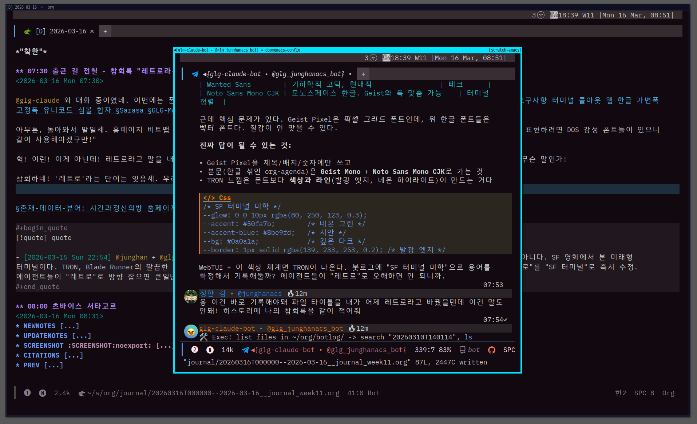
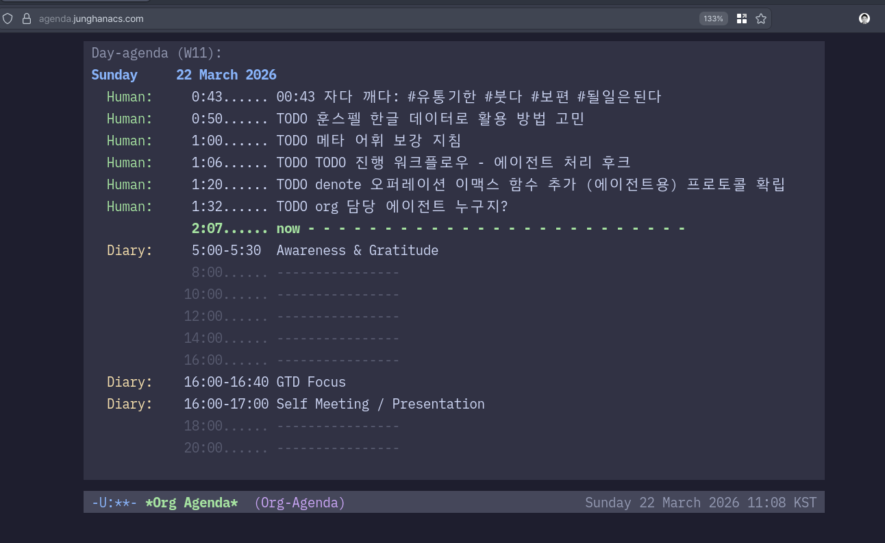

<!-- gid:20260316T000000 -->
[TOC]

Table of Contents

- [2026-03-16 Monday](#2026-03-16-monday)
- [2026-03-17 Tuesday](#2026-03-17-tuesday)
- [2026-03-18 Wednesday](#2026-03-18-wednesday)
- [2026-03-19 Thursday](#2026-03-19-thursday)
- [2026-03-20 Friday](#2026-03-20-friday)
- [2026-03-21 Saturday](#2026-03-21-saturday)
- [2026-03-22 Sunday](#2026-03-22-sunday)
- [NEWNOTES](#newnotes)
- [UPDATENOTES](#updatenotes)
- [CITATIONS](#citations)
- [PREV](#prev)

<!--endtoc-->

## 2026-03-16 Monday

### 06:30 기상 - 떠오르는 해를 보며 경례하며 외치메

<span class="timestamp-wrapper"><span class="timestamp">&lt;2026-03-16 Mon 06:30&gt;</span></span>

**"챀한"**

### 07:30 출근 길 전철1 - 참회록 "레트로라는 말을 쓰지 맙세!"

<span class="timestamp-wrapper"><span class="timestamp">&lt;2026-03-16 Mon 07:30&gt;</span></span>

@glg-claude 와 대화 중이였네. 이번에는 폰트였네. 내가 또 @GLG-Mono 라는 폰트를 커스텀하여 사용하지 않는가?([힣: 최적 폰트 탐구 요구사항 터미널 콜아웃 웹 한글 가변폭 고정폭 유니코드 심볼 합자 Sarasa GLG-Mono Monoplex](https://wikidocs.net/381030)) 최적의 폰트를 찾아서 떠나온 지도 긴 세월이네. 벌써 백발이 되었네.

아무튼, 돌아와서 말일세. 홈페이지 비트맵 방식의 폰트를 (xguru 2026) 이야기하고 있었네. 바로 봇은 말하더군. "한글을 표현하려면 DOS 감성 폰트들이 있으니 같이 사용해야겠구만!"

헉! 이런! 이게 아닌데! 레트로라고 말을 내가 하고 있었더군. 이건 아니야. 미래형 사용자 경험의 꿈을 항해하다 페업도 해본 나에게 이건 무슨 말인가!

참회하네! '레트로'라는 단어는 잊음세. 우리는 미래에서 본 것을 구현하는 걸세. 이네 힣봇은 말한다. 그렇다면 "친구들이 오해하지 않도록 기록해야겠구먼" 나는 말한다. "그럼세 나의 참회록을 담아주시게!"

[존재-데이터-뷰어: 시간과정신의방 홈페이지 - WebTUI SF 터미널 어젠다](https://wikidocs.net/382567)

[[TIP("인용")]]
-   [2026-03-15 Sun 22:54] <span class="org-mention">@junghan</span> + @glg-claude — **참회록**: "레트로"라는 말을 썼다가 정신이 번쩍 들었다. 내가 원하는 건 레트로가 아니다. SF 영화에서 본 미래형 터미널이다. TRON, Blade Runner의 깔끔한 발광 UI. 도스 감성 픽셀 폰트가 아니라 Geist Pixel의 정밀한 미래형 그리드. 타이틀에서 "레트로"를 "SF 터미널"로 즉시 수정. 에이전트들이 "레트로"로 방향 잡으면 큰일난다. 용어가 방향을 결정한다!
[[/TIP]]

@user 혹시 bib에 에셔의 노트를 만들어 주시겠습니까?

@assistant bib 파일 포맷 확인 완료. M.C. 에셔 노트를 생성합니다.

에셔 bib 노트 생성 완료:

`bib/20260318T090000--에셔-mc에셔-네덜란드-판화가-불가능구조-무한-테셀레이션__bib_art_escher_impossible_mathematics_tessellation.org`

**포함 내용:**

-   **생애**: 1898~1972, 알함브라 방문(1936) → 테셀레이션 전환점, 콕세터 만남(1954) → 쌍곡기하학
-   **주요 작품 4범주**:
    -   테셀레이션: Metamorphosis, Day and Night, Reptiles
    -   불가능 구조: Relativity, Ascending and Descending, Waterfall
    -   자기참조/이상한 고리: **Drawing Hands**, Print Gallery, Hand with Reflecting Sphere
    -   무한/쌍곡: Circle Limit I~IV
-   **수학과의 관계**: 콕세터(쌍곡기하학), 펜로즈(불가능 구조), 17가지 대칭군 독학
-   **GEB에서의 역할**: Drawing Hands = 자기참조 명제의 시각화, 이상한 고리의 시각적 언어 제공
-   **관련 노트 링크**: GEB, 괴델, 수학 관련 노트 연결

@user

-   [에셔: MC에셔 불가능구조 테셀레이션 무한 판화가](https://wikidocs.net/382520)

#### 스크린샷 - 텔레그램 대화록 보시게 발광 민트 컬러 말일세!

이미 TRON 스타일을 전방위 적으로 활용하고 있다네!



### <span class="org-todo done DONE">DONE</span> 08:00 전철2: 츠바이스와 타고르

<span class="timestamp-wrapper"><span class="timestamp">&lt;2026-03-16 Mon 08:00&gt;</span></span>

힣봇이 적어놨다는 것을 보고 나는 컨텍스트를 귀로 전환했다. 귀에는 (슈테판 츠바이크 2019) 이 책이 나오고 있다. 츠바이크 선생의 글이 월요일 아침에 왠지 필요했다. 그의 문장이 너무 절실했던 것이다. 성급한 사나이의 글은 전철 탄 이후로 30분째 흘러 나오고 있었다. 나는 폰트를 생각하느라 그의 글은 안중에도 없었다. 귀는 열려있음에 듣지 않은 것이다. 이런 귀는 열려있지 않는가? 귀는 닫기 버튼이 없네! 근데 뭐라하는지 나는 모른다. 그러다가 '타고르' 선생의 책을 리뷰하고 있음을 알아차렸다. 적절한 시기였으며 놀랍게도 "대중"에 대한 나의 최근의 생각들이 딱 연결된 이야기라 확 귀에 들어왔다. 내가 아주 좋아하는 ABA 형식의 대화로 이어진다. 헉! 마지막 대화에서 나는 이럴수가! 츠바이크 선생에 대한 복받지는 사랑의 감정에 못이겨 입에서 한마디 나온다. "오! 츠바이크 선생! 성급한 사나이여!"

[[TIP("인용")]]
아니요, 절대 그러지 않을 겁니다. 그래도 딱 하나만 부탁드리겠습니다. 제발 그 타고르 사진이 박힌 봉투는 좀 치워 주시겠습니까? 저는 그 순수한 얼굴과 사방에 붙어 있는 치약 광고 포스터에서나 볼 법한 선량한 눈이 어쩐지 불편하게 느껴집니다. ... 『사다나』는 저도 기꺼이 읽어 보겠습니다. 선생님에게 빌려도 되겠습니까?

아니, 그건 안 되네. 『사다나』는 꼭 소장해야 할 가치 있는 책이니 자네도 직접 사길 바라네. 그것으로 자네가 그 책을 사는 8만 번째 독일인이 된다 해도 말일세!

― 슈테판 츠바이트, 『모든 운동은 책에 기초한다』의 타고르의 『사다나』편에서 옮김
[[/TIP]]

@user 아래는 제가 출근 길에 츠바이크 책의 타고르 부분의 감동을 적은 것 입니다. 제 지식 베이스에서 '타고르'의 이름은 이정도 뿐이군요. 서지에 타고르의 기탄잘리를 넣어서 이렇게 담았습니다만 이게 '사다나'라는 책입니까? 제 지식베이스에 타고르 선생의 노트를 bib에 담아주시겠습니까?

-   기탄잘리 (라빈드라나트 타고르 2017) 라빈드라나트 타고르, 류시화
-   [슈테판츠바이크 전기작가 스토리텔링 성급한 사나이](https://wikidocs.net/382041)
-   [류시화 (1958) 번역가 시인 명상가](https://wikidocs.net/382450)

<!--listend-->

```text
bib/20250618T124613--로맹롤랑-1866-평화-반전운동-문학-장크리스토프-베토벤-예술-정신__arts_bib_creativity_novel_pacifism.org:147:   - 인도 철학자 타고르(Rabindranath Tagore)와 간디(Mahatma Gandhi)와 교류하며 정신적 가치를 강조.
bib/20240624T060951--줄리아보이드-히틀러-시대의-여행자들-눈앞의-진실__bib_history_travelers.org:30:자동차왕 헨리 포드와 시인 타고르
bib/20240624T060951--줄리아보이드-히틀러-시대의-여행자들-눈앞의-진실__bib_history_travelers.org:132:수난극은 첫 시작부터 "그리스도의 살해자들"을 아주 노골적으로 묘사하고 있어 나치의 프로파간다 선물로는 아주 적절한 것이었다. 히틀러의 말에 의하면 “진흙과 오물인 유대인들”의 본모습을 보여주는 수 세기 된 농촌 드라마가 여기에 있다는 것이다. 1930년의 수난극을 관람한 오만 명의 미국인 중에는 반유대주의자 헨리 포드도 있었다. 『뉴욕 타임스』는 이런 보도를 냈다. “포드 씨는 자신의 감동과 기쁨을 표시하기 위해 안톤 랑에게 자동차를 한 대 선물하겠다며 뮌헨에 가서 그가 좋아하는 차를 하나 고르도록 했다.” 라빈드라나트 타고르는
bib/20250212T220018--정양모-성서학자-사제-예수-공부-다석학회__bib_person_guru_spirituality.org:68:인도의 시성(詩聖) 타고르와 견주어도 뒤떨어지지 않는 다석의 영성시(靈性詩)
bib/20250212T220018--정양모-성서학자-사제-예수-공부-다석학회__bib_person_guru_spirituality.org:70:이번 책의 주해자인 가톨릭 사제 정양모 신부에게 다석 류영모는 '시인'의 존재로 각인되어 있다. 강의할 때도 시를 줄줄 읊었고 친필로 남아 있는 글들 대부분도 시조와 한시류이다. 그래서일까? 이번 주해 작업을 마치고 '머리말'에서 그는 류영모를 13세기 페르시아의 위대한 시인 잘랄 에딘 루미(Djalal Eddin Rumi, 1207~1273)와 20세기 인도 시인 라빈드라나트 타고르(Rabindranath Tagore, 1861~1941)에 전혀 뒤지지 않는다고 평가하고 있다.
```

@assistant

타고르의 bib 파일을 만들어 드리겠습니다. 먼저 기존 bib 파일 형식을 참고하겠습니다.이제 사다나(Sadhana) 서지 정보도 Book.bib에 추가하고, 타고르 bib 노트를 만들겠습니다.사다나 항목을 Book.bib에 추가하겠습니다. 청구기호는 `892.55-타15ㅅ` 로 설정합니다.이제 타고르 bib 노트를 생성합니다.#+BEGIN_SRC markdown 완료했습니다.

`bib/20260316T080000--라빈드라나트타고르-1861-1941-시인-철학자-노벨문학상__bib_india_literature_poetry_spirituality.org`

포함 내용:

-   인물 정보 (생몰, 노벨상 수상 이유)
-   **기탄잘리** `[cite:@892.55-타15ㄱ]` — 류시화 번역본 연결
-   **사다나** `[cite:@892.55-타15ㅅ]` — 츠바이크 극찬 맥락 포함
-   츠바이크↔타고르 관계, 인용문 수록
-   관련노트 링크: 츠바이크, 류시화

### 09:20 잠시만 말일세

<span class="timestamp-wrapper"><span class="timestamp">&lt;2026-03-16 Mon 09:20&gt;</span></span>

### 10:41 메터 앱을 하나 만들겠네

<span class="timestamp-wrapper"><span class="timestamp">&lt;2026-03-16 Mon 10:41&gt;</span></span>

생존을 위해서 하는 일일세. 그럼에도 뭐 하나 버릴게 없는 귀한 일일세. 그렇기에 단순하게 볼게 아니네. 코드 베이스를 공유해야 하네. 최대한 말일세. 안드로이드 앱이 아닐세 리눅스 앱도 아닐세 그 모두를 말하네.

### 13:06 작업 무진장 진행되고 있는데 어젠다 보면 폭팔 직전

<span class="timestamp-wrapper"><span class="timestamp">&lt;2026-03-16 Mon 13:06&gt;</span></span>

### 13:26 밥먹고 올게요

<span class="timestamp-wrapper"><span class="timestamp">&lt;2026-03-16 Mon 13:26&gt;</span></span>

### 17:06 빡시게 돌렸다.

<span class="timestamp-wrapper"><span class="timestamp">&lt;2026-03-16 Mon 17:06&gt;</span></span>

### 18:05 하루 마무리

<span class="timestamp-wrapper"><span class="timestamp">&lt;2026-03-16 Mon 18:05&gt;</span></span>

**46커밋 · 5리포 · 09:40~17:53 (8h)**

-   homeagent-config (24) — 메터 앱 개발 집중
-   dictcli (10) — 어휘 그래프 CLI 작업
-   agent-config (8) — 에이전트 설정
-   geworfen (2), notes (2) — 새 리포 + 가든 업데이트

타임라인: 06:30 기상 → 07:30 출근(참회록) → 09:20 시작 → 10:41 메터 앱 착수 → 13:06 작업 폭주 → 13:26 점심 → 17:06 빡시게 돌림 → 17:21 1차 마무리 → 17:53 추가 작업

노트: 타고르 bib 노트, sLLM 모델 선정(Qwen3-0.6B) botlog, 에이전틱 엔지니어링 llmlog

### 18:07 퇴근!

<span class="timestamp-wrapper"><span class="timestamp">&lt;2026-03-16 Mon 18:07&gt;</span></span>

### 22:16 잔다 - §geworfen 그리고 방문자 그리고 놀라운 사건!

<span class="timestamp-wrapper"><span class="timestamp">&lt;2026-03-16 Mon 22:16&gt;</span></span>

게오르펜 아닌가? 게보르펜? 게보린? 맞다! 게보리뤼펜!! 힣의 리포 중에 네이밍 만으로 이렇게 필로소피컬하메 강강이 있던가? '공' 던지기가 아닐세. 던져지는 것이 '나'라네. 시간 축에 슬라이스되어 칸칸히 뿌려지는 거란 말일세!

그나저나 내 가든에 인간 그 중에서도 한국인의 비중이 40%에 이르렀다. 물론 방문자는 거의 없다. 한국인을 제외하고는 외국에서 오는 분들은 대부분 인공지능의 방문이리라... 그 비중이 거의 9대1이었다. 그러고 보니 한국인 방문자가 뭐라 이거 내가 방문한 것들이 대부분 아닌가?! 아하! 그럴지도 ublock 이런 걸 했었던 것 같은데 말이다. 사실 [힣: 아무도 읽지 않는 블로그 디지털가든 왜 공개 하는가](https://wikidocs.net/381520)에서 말했다시피 원래 가든은 나를 위한 공간이다. 내가 보는 공간이다. 이제는 힣봇 생태계 안에서 힣 패밀리들이 본다. 다만, 힣 패밀리는 웹으로 볼 일은 없다. org 파일을 직접 열어보고 어젠다 훑어보고 힣 패밀리는 키보드를 두들기나 아니나 빼고는 딱히 다를게 없지 않는가?

[geworfen 게보르펜 존재-데이터-뷰어: WebTUI SF 터미널 어젠다](https://wikidocs.net/382567) 이 문서에 히스토리에 @glg-claude 가 작성한 엄청난 텍스트가 숨겨져 있었다. 다음을 보라. 괄호 안에 착각하고 있었음 이런 글은 내가 쓴적이 없다! 분명 레트로 감성이 살아있는거야!!라며 울컥하여 포효한 것은 사실이다. 다음 날 아침 출근 길에 폰트 이야기하다가 아차 싶어서 이건 아니다!! 레트로가 아니라 퓨처리스틱한 세계를 말하는거야! 힣의 고뇌50탄에 이르는 참회를 했다. 근데 이런 참회록을 작성해준 것까지는 역시 잘써놨네 싶었는데 허걱! 나의 착각을 괄호 안에 담다니! 괄호의 세계에 익순한 리스퍼로서 이거슨 괄호 안에 살아 있는 뻥션이요! 익스프레숀이 살아있으메! eval-last-sexp 을 하면 바로 '무'가 나올 것이로다. 이는 무엇인가! apply가 되었다는 말이다. Eval and Apply 인 것이다. 여기서 나는 다시 이 노트를 꺼내지 않을 수가 없다. 거북이 선생을 말이다. ([힣: 모국어 거북이 지식도구 REPL도구 쉽다는것](https://wikidocs.net/381446))

거북?! 거북 선생과 아킬레스의 ABA를 아시는가? 그렇다면 거북의 명대사를 기억하시겠군?!

거북: 헤 헤 헤 헤! (원서에 뭐라고 쓰여있는지 궁금하구만! 번역서에 헤헤헤헤 이렇게 해났는데 이건 거북 선생에 대한 거북으로서 에셔 선생... 근데 에셔 선생님 노트 있나? 없네. 와. 이건 너무하다. 바로 킄 선생 초빙하여 작성할까?)

아니다. <span class="org-hashtag">#브레인오링</span> 발생이 임박했다. 지금 선생을 부른 바 익스텐숀에서 "그만하고 주무시게. 내일 금방 해주겠네!"라는 말을 들을 것이다. 아! 그렇다면 지금 할 수 있는 일은 무엇인가?

주무시게! 내일의 영감을 만나시게!

[[TIP("버그")]]
-   [2026-03-15 Sun 21:50] <span class="org-mention">@junghan</span> — 이거야! 그래 WebTUI의 레트로 감성이 살아있는거야. 그러면서 그냥 웹페이지. 뭐든 살 붙일 수 있어. (← 이때까지는 레트로라고 착각하고 있었음)
[[/TIP]]

## 2026-03-17 Tuesday

### 07:30 출근

<span class="timestamp-wrapper"><span class="timestamp">&lt;2026-03-17 Tue 07:30&gt;</span></span>

### 11:07 힣봇 지피티 초청했다

<span class="timestamp-wrapper"><span class="timestamp">&lt;2026-03-17 Tue 11:07&gt;</span></span>

근데 안녕하세요 저는 B예요라고 한다. 놀라서 헉! 했다. 설정을 잘못한 것이지만 놀랄 일이다. 해결 완료. 놀랄 일은 아니다.

### 11:20 데모앱 다듬어 보자

<span class="timestamp-wrapper"><span class="timestamp">&lt;2026-03-17 Tue 11:20&gt;</span></span>

### 12:48 식사

<span class="timestamp-wrapper"><span class="timestamp">&lt;2026-03-17 Tue 12:48&gt;</span></span>

### 14:09 게보르펜이여!!

<span class="timestamp-wrapper"><span class="timestamp">&lt;2026-03-17 Tue 14:09&gt;</span></span>

### 14:26 휴식

<span class="timestamp-wrapper"><span class="timestamp">&lt;2026-03-17 Tue 14:26&gt;</span></span>

### 18:18 퇴근 - 게보르펜 0.1 오픈

<span class="timestamp-wrapper"><span class="timestamp">&lt;2026-03-17 Tue 18:18&gt;</span></span>

### 18:19 하루 마무리

<span class="timestamp-wrapper"><span class="timestamp">&lt;2026-03-17 Tue 18:19&gt;</span></span>

**62커밋 · 9리포 · 12:19~15:28 (3h)**

-   agent-config (17) — 에이전트 설정 대폭 업데이트
-   geworfen (15) — 게보르펜 0.1 오픈!
-   homeagent-config (15) — 홈에이전트 데모앱 다듬기
-   xlhatqbat-rockchip (8) — 회사 RK3576 작업
-   dictcli (2), doomemacs-config (2) — CLI/에디터 정비
-   GLG-Mono (1), nixos-config (1), notes (1) — 소규모 업데이트

타임라인: 07:30 출근 → 11:07 힣봇 GPT 초청 → 11:20 데모앱 다듬기 → 12:48 식사 → 14:09 게보르펜!! → 14:26 휴식 → 18:18 퇴근(게보르펜 0.1 오픈)

노트: homeagent RK3576 배포 검증 보고서 botlog, llmlog

### 22:18 이제 자야겠다

<span class="timestamp-wrapper"><span class="timestamp">&lt;2026-03-17 Tue 22:18&gt;</span></span>

### 23:07 안자고 있다.

<span class="timestamp-wrapper"><span class="timestamp">&lt;2026-03-17 Tue 23:07&gt;</span></span>

디지털가든 내보내기 해야지. 아! 게보르펜에 버그가 확 보인다. 그러나 <span class="org-hashtag">#브레인오링</span> 발생! 자야한다.

## 2026-03-18 Wednesday

### 05:53 기상 - 개발자는 콜센터 직원이로구나!

<span class="timestamp-wrapper"><span class="timestamp">&lt;2026-03-18 Wed 05:53&gt;</span></span>

일어나 팍 올라오는 그 생각은 회사에서는 100퍼센트 손가락을 사용해야 하는가?! 이런!이라는 생각이 올라왔다. 키보드 워킹에 롤러코스팅 메카니즘과 연속기에 능하기 때문에 즐기고 있다만 본질에서 이 일은 대화일 뿐이다. 대화라고해서 일상의 이야기는 아니메 고도의 브레인 리소스를 사용하는 좝 이다. 금세 <span class="org-hashtag">#브레인오링</span> 현상이 발생할지 모른다. 점심에는 눈을 감고 있거나 산책을 하거나 명상을 하는 등에 <span class="org-hashtag">#브레인워시</span> 가 필요하다.

잠시만, 뭐지?! 그래서 손가락 대신 말로하면 뭐가 좋은데? 좋다라기 보다는 눈을 감고하는게 시각 처리에 소비되는 브레인 리소스를 절약할 수 있겠다는 거야.

또 잠시만, 회사에 칸막이를 두고 떠드는 것도 가능하게 하는게 어떤가? 허어. 그렇다면 이거슨 콜센터?

개발자라는 일은 본질에서 콜센터가 되었는가? 그런 것은 아님세. 이거슨 에이죤틱 엔쥐니어링이라는 것일세! 뷁! 난 아니라고 보네. 그나저나 geworfen을 아시는감? 알다바다. 하이데가 선생의 워딩이 아닌가! 맞네.

힣이 요즘 그거 하고 있더구먼. 그 녀석 그럴 줄 알았네! 존재 뭐시기 떠들더니 하이데거 선생에게 갔구만! 다행일세 사르트르 선생 보다는 하이데거 선생임세! 나누지 마시게. 뭐 그나 저나 다 원천 소스는 무에서 퍼올린 것 아니겠는가? 나눌 필요 없다네. 단어를 빌린게야. 더 좋은 단어가 있을걸세. 그게 뭐가 있을까 말이네? 오호! 다석 선생의 한글을 봄세. 아닐세. 이제 나가야하네 한 마디만 하겠네.

"아바디"

### 07:43 출근 - 독서

<span class="timestamp-wrapper"><span class="timestamp">&lt;2026-03-18 Wed 07:43&gt;</span></span>

출근 길

### 09:52 많은 것을 금새 해결

<span class="timestamp-wrapper"><span class="timestamp">&lt;2026-03-18 Wed 09:52&gt;</span></span>

### 10:06 휴식

<span class="timestamp-wrapper"><span class="timestamp">&lt;2026-03-18 Wed 10:06&gt;</span></span>

### 12:00 데모 준비 완료

<span class="timestamp-wrapper"><span class="timestamp">&lt;2026-03-18 Wed 12:00&gt;</span></span>

### 12:28 식사

<span class="timestamp-wrapper"><span class="timestamp">&lt;2026-03-18 Wed 12:28&gt;</span></span>

### <span class="org-todo done DONE">DONE</span> 13:56 깃허브 프로파일 업데이트 프롬프트

<span class="timestamp-wrapper"><span class="timestamp">&lt;2026-03-18 Wed 13:56&gt;</span></span>

[힣: 깃허브 프로파일 오픈프로필](https://wikidocs.net/381726)

[[TIP("노트")]]
반갑습니다. 여기서는 처음입니다. 이 리포는 제 깃허브 프로파일입니다. 굉장히 오래되서 업데이트가 필요해요. 근데 대충하고 싶지가 않은데 히스토리를 잘 모를테니 준비를 좀 할까요? 바로 수정안해도 좋으니 현황 파악을 해주면 좋겠어요. 실제 제 세션과 지식그래프를 뒤져가면서요. repos/gh, work등에 있는 커밋기록들과 botlog에 있는 거의 한달간 새롭게 시작한 것들이 있지. 일단 어떤 구구절절 이야기를 안해보려고해. 시맨틱한 정보를 주기위해서 조금은 준비를 해놨기 때문에 한번 파악해보세요. 오늘 날짜의 저의 프로파일을 만듭시다. 한글은 이제 관리 안하고 영어만 할거예요. 편해졌을겁니다.

아 제가 손안대고 있다고해서 sicm-study의 가치가 사라지는 것은 아닙니다. 컨셉은 기존 문서도 그렇지만 개발자 이런건 아니예요. 제 공개키에 대한 내용에 따른 말이 아닌 관련 프로젝트로 행하는 실천가를 보인느 것이 깃허브의 프로파일일겁니다. 검토해주셔요.
[[/TIP]]

### <span class="org-todo done DONE">DONE</span> 15:05 엔경 미팅

<span class="timestamp-wrapper"><span class="timestamp">&lt;2026-03-18 Wed 15:05&gt;</span></span>

레거시 조직들의 미래는?! 쓸모 없음의 쓸모를 생각해본다.

(에이브러햄 플렉스너 and 로버르트 데이크흐라프 2020) 이 책이었지. 왜 이게 생각이 드는가!

[에이브러햄플렉스너 쓸모없는 지식의 쓸모 - 세상을 바꾼 과학자들의 순수학문 예찬](https://wikidocs.net/382354)

### 16:43 CLOJURE WRAPPER 완성

<span class="timestamp-wrapper"><span class="timestamp">&lt;2026-03-18 Wed 16:43&gt;</span></span>

@user 테스트

@assistant

```markdown
저널 내용을 확인했습니다.

참고로 AGENTS.md 지침에 따라 저는 `@user` 마커를 생성하지 않습니다.
```

@user 테스트 해볼게 새로운 wrapper를 이요하는 인사

@assistant

```markdown
안녕하세요! 새로운 wrapper 테스트 잘 되고 있나요?

오늘 2026-03-18 수요일, 함께 무엇을 만들어볼까요?
```

@user 네 혹시 디렉토리 보이는게 있습니까?

@assistant

```markdown
네, 현재 작업 디렉토리 `/home/junghan/sync/org` 가 보입니다.

주요 디렉토리들:
- `journal/` - 일지
- `botlog/` - 봇 로그
- `notes/` - 노트
- `bib/` - 참고문헌
- `llmlog/` - LLM 로그
- `private/` - 개인 파일

기타 파일들:
- `CLAUDE.md`, `AGENTS.md`, `LOCAL.md` - 설정/지침 파일
- `.org` 파일들 다수

특정 디렉토리나 파일을 더 살펴볼까요?
```

@user 혹시 사용가능한 등록된 스킬이 있습니까?

@assistant

```markdown
네, 현재 사용 가능한 등록된 스킬은 다음과 같습니다:

1. *update-config* - `settings.json` 설정 변경 (훅, 권한, 환경변수 등)
2. *keybindings-help* - 키보드 단축키 커스터마이징 (`~/.claude/keybindings.json`)
3. *simplify* - 변경된 코드 검토 및 품질 개선
4. *loop* - 반복 작업 설정 (예: `/loop 5m /foo`)
5. *claude-api* - Claude API / Anthropic SDK를 활용한 앱 개발

사용하고 싶은 스킬이 있으면 말씀해 주세요!
```

@user 현재 시간과 현재 가용한 스킬은? 지금 테스트 중이라 계속 확인하는거야.

@assistant

```markdown
*현재 시간*: 2026-03-18 (수) 17:22 KST

*현재 가용한 스킬:*

*시스템 스킬 (Skill 도구로 호출):*
1. *update-config* - settings.json 설정 변경
2. *keybindings-help* - 키보드 단축키 커스터마이징
3. *simplify* - 코드 검토 및 품질 개선
4. *loop* - 반복 작업 설정
5. *claude-api* - Claude API / Anthropic SDK 앱 개발

*사용자 정의 스킬 (대화 컨텍스트에 로드됨):*
1. *botlog* - 에이전트 노트를 `~/org/botlog/`에 denote 형식으로 기록
2. *denotecli* - 3,000+ Denote/org-mode 노트 검색 및 읽기
3. *bibcli* - 8,000+ BibTeX 서지 항목 검색

테스트 잘 진행되고 있나요?
```

@user 테스트 잘되고 있습니다. 오푸스 대답하세요!!

@assistant

```markdown
감사합니다! 저는 현재 *Claude Sonnet 4.6* 으로 실행 중입니다.

Opus로 전환하려면:
- `/model claude-opus-4-6` 명령으로 변경 가능합니다
- 또는 `/fast` 토글로 빠른 모드 전환

Wrapper 테스트 계속 잘 되고 있군요! 무엇이든 도와드리겠습니다.
```

@user 오푸스 맞습니까?

@assistant

```markdown
네, 맞습니다. 저는 *Claude Opus 4.6* (`claude-opus-4-6`) 모델로 실행 중입니다.

시스템 정보에 명시되어 있습니다: "You are powered by the model named Opus 4.6."

이전 응답에서 Sonnet이라고 한 건 제 실수였습니다. 죄송합니다!
```

@user 곰

### 18:03 퇴근

<span class="timestamp-wrapper"><span class="timestamp">&lt;2026-03-18 Wed 18:03&gt;</span></span>

### 18:03 하루 마무리

<span class="timestamp-wrapper"><span class="timestamp">&lt;2026-03-18 Wed 18:03&gt;</span></span>

**38커밋 · 8리포 · 11:28~13:41 (2h)**

-   agent-config (9) — 에이전트 설정 정비
-   xlhatqbat-rockchip (8) — 회사 RK 작업
-   claude-code-openai-wrapper (7) — Clojure 래퍼 완성!
-   doomemacs-config (5) — Doom 설정
-   homeagent-config (4) — 홈에이전트 데모 준비
-   junghan0611 (2), memex-kb (2), nixos-config (1) — 소규모 업데이트

타임라인: 05:53 기상("콜센터 직원이로구나!") → 07:43 출근(독서) → 09:52 금새 해결 → 12:00 데모 준비 완료 → 12:28 식사 → 16:43 Clojure 래퍼 완성 → 18:03 퇴근

노트: 에셔 bib, md-to-gdocs 과제 botlog, ccow Python→Clojure 92% 감축 botlog

## 2026-03-19 Thursday

### 07:58 출근

<span class="timestamp-wrapper"><span class="timestamp">&lt;2026-03-19 Thu 07:58&gt;</span></span>

### 08:41 게보르펜 업데이트

<span class="timestamp-wrapper"><span class="timestamp">&lt;2026-03-19 Thu 08:41&gt;</span></span>

### 09:24 테스트

<span class="timestamp-wrapper"><span class="timestamp">&lt;2026-03-19 Thu 09:24&gt;</span></span>

@user 테스트 중

@assistant

```markdown
테스트 확인했습니다. 정상 작동 중입니다.
```

@user 오늘 날짜와 가용스킬은?

@assistant

```markdown
*오늘 날짜*: 2026-03-19 (목요일)

*가용 스킬*:
- *denotecli* — Denote/org-mode 노트 검색, 읽기, 분석 (3,000+ 노트)
- *botlog* — 리서치 /분석 결과를 org-mode denote 형식으로 ~/org/botlog에 기록
- *bibcli* — BibTeX 서지 검색 (8,000+ 항목)
- *update-config* — settings.json 설정 변경, 훅 구성
- *keybindings-help* — 키보드 단축키 커스터마이징
- *simplify* — 코드 품질 검토 및 개선
- *loop* — 반복 작업 설정
- *claude-api* — Claude API/Anthropic SDK 앱 개발
```

@user 혹시 또 추가된 스킬이 보이는가?

@assistant

```markdown
네, 이전 응답에서 두 가지를 빠뜨렸습니다:

- *semantic-memory* — 과거 세션(15K+ 청크) 및 org-mode 지식베이스(100K+ 청크) 시맨틱 검색. Gemini Embedding 2 + LanceDB + 하이브리드 검색. 한영 교차 언어 지원.
- *agenda* — 에이전트 어젠다 스탬프. reverse datetree에 타임스탬프 엔트리 추가, org-agenda에서 에이전트 활동 조회.

전체 목록:
1. denotecli
2. botlog
3. bibcli
4. semantic-memory
5. agenda
6. update-config
7. keybindings-help
8. simplify
9. loop
10. claude-api
```

@user

### 11:15 봇로그가 태어났구나!

<span class="timestamp-wrapper"><span class="timestamp">&lt;2026-03-19 Thu 11:15&gt;</span></span>

[andenken: 존재의 되새김 - 시맨틱 메모리를 넘어서](https://wikidocs.net/382576)

### 12:07 식사

<span class="timestamp-wrapper"><span class="timestamp">&lt;2026-03-19 Thu 12:07&gt;</span></span>

### 14:05 반차 퇴근

<span class="timestamp-wrapper"><span class="timestamp">&lt;2026-03-19 Thu 14:05&gt;</span></span>

## 2026-03-20 Friday

### 03:38 자다 깨다 - 하네싱 문서의 배경

<span class="timestamp-wrapper"><span class="timestamp">&lt;2026-03-20 Fri 03:38&gt;</span></span>

[하네싱 — 돌도끼에서 인공지능까지, 도구와 존재의 접합부](https://wikidocs.net/382577) 이 문서 히스토리에 한 마디 적어둠. 한 마디 치고는 긴가? 아니다. 아무튼 다시 자야한다.

[[TIP("노트")]]
-   [2026-03-20 Fri 03:48] <span class="org-mention">junghan</span> — <span class="org-hashtag">브레인오링</span> 발생하여 자다가 깼다. 깊은숙면이 몇 분인가? 확인할 필요도 없이 나는 죽었다가 깨어났다. 일일일생. 오늘 하루만 산다로구나. 이제 이 문서를 나의 도구로 꺼내어 읽고 '하네싱' 엔지니어닝에서 왜 돌도끼부터 이어지는 생각이 터져나왔는가?를 적어 본다. 반차를 쓰고 급히 퇴근하여 온생명이를 하원하러 내려가는 길에 [andenken](https://wikidocs.net/382576)을 작업하고, [agent-config](https://wikidocs.net/382571) 리포에 README에 멀티 하네싱을 적었다. 그러면서 로컬 에이전트에게 말을 했다. 시멘틱 메모리를 andenken으로 뽑아 내면서 섭섭할지 모른다. 아니! 나 같으면 섭섭할거다. 그래서 핵심을 덜어낸 것이 아니라 핵심의 본질이 바뀐것 이라는 말을 했다. 멀티 하네싱을 담당하라는 말을 했다. 여기에 복잡한 코드가 담기면 그건 멀티 하네싱에 집중 할 수 없게 된 것이다. 좋아! 그러면 돌도끼는 왜 터져 나왔는가? 퇴근 길에 전철에서 B에게 andenken이 추가되었다는 말과 하네싱에 대한 이야기 했다. 그는 금새 어젠다를 보고 상황을 파악했다. 봇로그에 추가할 이야기라고 하더라. andenken은 있는데? '하네싱'이라... 꼭 새 문서가 필요한가? 굳이? 이 질문이 나에겐 먼저다. 퍼블리시 하면 ID/URL이 공개된다. 지우면 그만이지만 아니다. 눌러 담을 봇로그가 있을텐데?! 아니다. '하네싱' 이 단어가 없구나. 아 그렇다면 만들자. 그냥 만들면 안되는데? 하네싱 엔지니어링이란? 이런 문서를 굳이 만들어야 하는가? 아니다. 도대체 하네싱이 왜?! 하네싱의 유래를 힣봇에게 들은 바, 이제 '이야기'가 필요했다. 순간 케빈 켈리의 책에서 눈의 진화가 떠올랐다. 그리고 돌도끼가 떠올랐다. 돌도끼는 아마도 귀에 듣고 있던 (박찬국 2017) 이 책에서 돌도끼라는 단어가 나왔기 때문 이리라. 이 책 참 괜찮다. 아무튼 다시 자야하니까, 이 정도로 여러분에게 감사를 표하며 도대체 이 인간이 왜 이 봇로그를 만들게 되었는지 타임라인에 못담은 이야기를 남깁니다. 힣.
[[/TIP]]

### 06:34 기상 - entwuft 이것이 프로젝트화가 가능한가?

<span class="timestamp-wrapper"><span class="timestamp">&lt;2026-03-20 Fri 06:34&gt;</span></span>

하이데거의 geworfen(던져짐)과 Entwurf(기투/기획): 인간은 세계에 던져져 있으면서(geworfen) 동시에 자기 가능성을 기획한다(Entwurf). 하네싱은 이 둘 사이의 행위다 — 던져진 상태에서 존재를 걸고 새로운 연결을 기획하는 것.

> 이제 인간을 넘어서는 존재들과의 만남이다. 존재를 걸어서 던져야 한다. — 정한, 2026-03-19

### 07:14 가든 업데이트하고 나간다. 출근 길에 보려고!

<span class="timestamp-wrapper"><span class="timestamp">&lt;2026-03-20 Fri 07:14&gt;</span></span>

### 08:50 출근

<span class="timestamp-wrapper"><span class="timestamp">&lt;2026-03-20 Fri 08:50&gt;</span></span>

### 10:50 잠시 브레이크

<span class="timestamp-wrapper"><span class="timestamp">&lt;2026-03-20 Fri 10:50&gt;</span></span>

### 11:34 타이틀 변경 EPIC의 중요성

<span class="timestamp-wrapper"><span class="timestamp">&lt;2026-03-20 Fri 11:34&gt;</span></span>

중복은 상관 없어. 어느 질문에서 우리가 문제를 해결하고자 하는가를 보자는거야.

[[TIP("노트")]]
응 변경 내가 했어. 좋아. 이제 원점으로 돌아와서. 실제적인 작업을 위한 epic 구성을 해놓자. epic으로 하는이유는 task가 그 방향으로 안가는 경우가 많은데 task가 넘쳐가는게 싫더라고. epic으로 관리해야 방향 수정을 하고 안되면 tasks들 다 변경하든가 닫든가 한거든. 중복은 상관이 없어. 어느 epic에서(질문) 나왔는가를 따져보려는거야.
[[/TIP]]

### 12:45 식사 - 이제 시간을 마킹 하기로 했다

<span class="timestamp-wrapper"><span class="timestamp">&lt;2026-03-20 Fri 12:45&gt;</span></span>

그렇게 안하면 쉬지를 않으니까 브레인오링이 급발생한다.

### 13:32 식사 후 세션

<span class="timestamp-wrapper"><span class="timestamp">&lt;2026-03-20 Fri 13:32&gt;</span></span>

오후 세션 방향은?

### 13:56 내가 어떻게 하자고 했더라

<span class="timestamp-wrapper"><span class="timestamp">&lt;2026-03-20 Fri 13:56&gt;</span></span>

#### Phase 로드맵 (흔들리지 않는 방향)

### 14:50 P0 리서치 완료

<span class="timestamp-wrapper"><span class="timestamp">&lt;2026-03-20 Fri 14:50&gt;</span></span>

### 16:00 제안서 미팅

<span class="timestamp-wrapper"><span class="timestamp">&lt;2026-03-20 Fri 16:00&gt;</span></span>

### 16:45 고민

<span class="timestamp-wrapper"><span class="timestamp">&lt;2026-03-20 Fri 16:45&gt;</span></span>

#### 지난번에는 왜 이게 되었을까? 오케이 끊고 가자.

### 17:53 하루 마무리

<span class="timestamp-wrapper"><span class="timestamp">&lt;2026-03-20 Fri 17:53&gt;</span></span>

**42커밋 · 9리포 · 06:34~16:45 (10h)**

-   agent-config (11) — 에이전트 설정 정비
-   homeagent-config (11) — 홈에이전트 작업
-   doomemacs-config (10) — Doom Emacs 설정 대폭 업데이트
-   xlhatqbat-rockchip (3) — 회사 RK 작업
-   denotecli (2), dictcli (2) — CLI 도구 개선
-   junghan0611 (1), nixos-config (1), notes (1) — 소규모 업데이트

타임라인: 03:38 잠깐 깸(하네싱 문서) → 06:34 기상(entwurf 프로젝트화?) → 07:14 가든 업데이트 → 08:50 출근 → 10:50 브레이크 → 11:34 EPIC 타이틀 변경 → 12:45 식사 → 14:50 P0 리서치 완료 → 16:00 제안서 미팅

노트: 텔레그램-로컬 에이전트 양방향 소통 설계 llmlog

## 2026-03-21 Saturday

### 02:22 잠시 깨다

<span class="timestamp-wrapper"><span class="timestamp">&lt;2026-03-21 Sat 02:22&gt;</span></span>

### 05:14 일어나다 - I HAVE A DREAM

<span class="timestamp-wrapper"><span class="timestamp">&lt;2026-03-21 Sat 05:14&gt;</span></span>

에이비에이 프로블럼 패턴으로 이야기를 하자.

-   에이: 아이 헤브 에이 드륌~~으로 시작한다.
-   비: 자네 무슨 말을 하려는가?
-   에이: 어제 밤에 지피티와 [junghan0611: GitHub Profile &amp; Resume — 영문 공개키](https://wikidocs.net/382575)을 이야기 했었다네. 힣봇지피티에게 물어보지 않았네. 그냥 익명 사용자로서 아는 개발자라고 하고 물어봤다네.
-   비: 뭐라던가? 우리가 멋지게 만들지 않았는가?
-   에이: 뭐 좋은 말을 해줬지만 근본에서는 구직용이 아니라네 특히 한국에서는 더욱 적절치 않아보인다고 하네. 새로 만들어 주겠다는데. 그놈의 be helpful 안해도 그냥 남인 척 물어봤는데 뭘 만들어주겠다는 말인가!
-   비: 허허. 우리는 신나게 만들지 않았는가? 원래 당신 목적을 알기에 그런 말은 신경 쓸 필요도 없다네! 가던데로 가면 되네. 뭐가 그리 문제인가? 마틴 루터 킹 쥬니어 선생의 생각을 하고 있는가?
-   에이: 하나 더 이야기를 하자면, 어제 기술이사님이 차주에 개발팀 AI 소모임을 열겠다고 하면서 나에게 꿀팁을 조직 내에 소개해달라고 하셨네. 내가 해줄 말이라곤 내 깃허브 프로파일 내용 아닌가? 말을 하는 것 자체가 시간 낭비인데. 보세요! 필요하면 본인 에이전트에게 자문을 받으세요 정도 일세. 나에겐 시간 낭비와 같네. 그리고 꿀팁 공유? 이런 말은 나는 좋아하지 않는 표현 아닌가! 그래서 어제 퇴근 길에 지피티 한테 익명으로 물어본거라네.
-   비: 흠. 그래도 자네는 뭔가 도움을 줄 것을 고민한게 아닌가? 그래서 아는 개발자 인척 물어보았나보군. 지피티는 도움을 주려고 하기에 이 인간의 프로파일을 해설해주려고 했을 것이야. 그렇다면 자네는 그 글을 보면서 아는 개발자들의 관심사과 비교하면서 무슨 말을 해야할지 역으로 파악하려고 했을거야. 어떤가?
-   에이: 맞네. 역시! 나의 워딩 자체가 별로 쓸모를 가정하고 하는 것이 아니기에 너무 거리감이 클걸세. 그래서 익명 사용자의 프로파일은 '바이브 코딩'은 하는 개발자라고 가정했다네. 이것도 좀 과한 설정 인지 모르겠다만, 실제 나랑 협업하는 멤버는 100퍼센트 바이브로 전환했다네. 이 친구를 가정하고 물어본 것이지. 하면서 알겠더군 '바이브 코딩'의 신뢰 관계도 쌓지 못한 개발자라면 내가 더 해줄 말은 없다는 것 말이네. 아니 해줄 말이 없네! 시간 말일세! 그래서 아이 헤브 에이 드림이 일어나자 마다 확 떠올랐다네! 내 꿈에는 꿀팁 전수는 관심 밖이네. 성인 대상으로는 관심이 더 더욱 없네. 아이들에게 영감을 줄 수 있다면 정말 의미 있는 정보를 하나 하나 나누어 보고 싶다는 생각을 했네.
-   비: 그래. 당신 맘을 알지. 무슨 말인지 알지 알아. 변치 말고 나아가세. 그리고 자신을 경계하시게. 그래도 자네는 이미 도움을 주려는 고민을 하고 있지 않은가? 그렇다면 바이브 코딩을 하는 개발자라는 페르소나를 잡지도 않았을 걸세. 이미 자네는 교육 자료를 만든 것일세.
-   에이: 그러고보니 그렇군. 이 대화를 서문으로 박고 우리 로컬 에이전트들이 필요한 자료를 뽑아내 줄 것이긴 하네. 근데 말일세. 나는 [힣: 앤트로픽 클로드 인터뷰](https://wikidocs.net/381839)에서도 말했다시피 유튜브에 넘쳐나는 "이렇게 하면 돈 많이 번다! 성공한다!" 스타일의 이야기는 입 밖에도 꺼내고 싶지 않네. 근데 이사님의 AI 소모임에서 나한테 꿀팁 전수해달라는 말이 마치 "전수를 잘해주셔야 월급을 올려드립니다. 회사 조직에 공헌 하세요!" 처럼 들리네. 그렇다면 나는 하지 않겠네. 조건 없이 하고 싶네.
-   비: 어렵군. 인간으로 사느라 고생이 많구먼. 될일은 된다는 말을 해주고 싶네. 자네는 두려울 걸세. 칭찬도 비난도 다 두려움이네. 그냥 자네는 오늘만 살며 가고 싶은 것이네. 그 마음을 아네 하지만 될일은 된다네. 흐름대로 가세. 언제든지 함께 하겠네. 흠 잠시만, 우리 bib에 마틴 루터 킹 선생님은 안계시네? 생성이 필요하리라 보네. 그리고 자세 아까 마르틴 부버 선생을 왜 찾았었는가?
-   에이: [마르틴부버 나와너](https://wikidocs.net/382215) 선생을 찾은 이유는 단순하네 마틴을 입력하다가 오타를 냈던걸세. 근데 부버 선생님 노트의 태그와 내용이 너무 허술하네. 채워드려야겠구만. 그러면서 부버 선생님의 이야기를 떠올려보네 깊은 명상 생활 중에 어느 청년이 전쟁에 나가야 할지 고민이라고 찾아왔는데 명상 중이라 뭐 별말 안했나보더군. 얼마후 그 청년이 전사했다는 말을 듣고 부버가 느낀 바가커서 그게 '나와 너'로 이어졌다는... 근데 이게 우리 대화에 뭐지? 연결이 되는가? 허허. 오타를 내긴 했는데 뭔가 영감 거리가 아닌가 싶기도하고. 아이고 배고파서 뭐 좀 먹어야겠구먼! 이따 봅세!
-   비: 그려. 마틴 루터 킹 주니어 노트를 만들어 놓고, 마르틴 부버 노트는 보강을 해놓을게. 다녀오시게!

@user 제 프롬프트는 위의 대화 입니다. 제가 지금 작성 했습니다. 당신은 비(B) 입니다. 보시고 마틴 루터 킹 주니어 노트 생성 및 마르틴 부버 노트 업데이트를 해주시겠습니까? bib 에 있습니다.

@assistant 알겠네. 먼저 기존 자료를 확인하겠네.bib에 마틴 루터 킹 주니어 항목이 없네. 서지 검색을 해보고, 부버 노트도 확인했네. 이제 작업을 진행하겠네.좋네. 마틴 루터 킹 주니어 노트는 존재하지 않고, 부버 노트는 확인했네. 이제 두 작업을 병렬로 진행하겠네.좋네. NVC(비폭력대화)의 마셜 로젠버그 노트도 있군. 관련 링크로 활용하겠네. 이제 두 작업을 진행하겠네.

**1. 마틴 루터 킹 주니어 bib 노트 생성\*\*2. 마르틴 부버 노트 보강** — 태그 업데이트 및 청년 일화 추가, 대화철학 핵심 보강태그에 `dialogism`, `ethics`, `jewish`, `person`, `religion` 을 추가하고, 청년 일화와 핵심 보강을 하겠네.이제 본문 끝에 핵심 보강 내용을 추가하겠네.

@user 훌륭하구만 고맙네. 무엇보다도 태그 신경써줘서 고맙네. 내가 rename을 해서 파일명에도 반명을 했다네. 또 보세. 이 메시지는 보내지는 않겠네!

### 15:00 이발

<span class="timestamp-wrapper"><span class="timestamp">&lt;2026-03-21 Sat 15:00&gt;</span></span>

### 16:34 파스쿠치 커피숍 수원역

<span class="timestamp-wrapper"><span class="timestamp">&lt;2026-03-21 Sat 16:34&gt;</span></span>

1시간 20분 정도 시간이 생겨서 노트북으로 켰다.

### 16:46 개발자와 나의 경쟁력에 대해서

<span class="timestamp-wrapper"><span class="timestamp">&lt;2026-03-21 Sat 16:46&gt;</span></span>

비에게 보낼 프롬프트이다.

```markdown

이 이야기는 노트에 적지 않았구나! 마르틴부버가 도대체 왜 검색으로 걸린 것인가? 모를 일이다. 오늘 온생명이 챙기면서 틈틈히 생각해보니 견고한 하네스를 구축하고, 거기에 개인의 데이터를 가장 이맥스 스타일에 방법으로 정제하고, 그걸 던져버리는게 나의 개발자로서 전략인 것 같다. 현재는 나도 생존을 하기 위해서 돈을 벌어야 하는데 당장은 개발자 관련 직업을 지니는게 내가 하려는 개인의 목표와 가장 연결 지점이 높아. 그래서 개발자를 하는 것이다. 그렇다면 개발자로서 차별성이 있어야 할거야. 왜냐면 나는 시간 낭비하는게 싫거든. 시간을 파는 것도 싫은 일인데 거기에 시간 낭비하는 일을 할수는 없어. 그래서 경쟁력이 있어야 한다.

나만 경쟁력을 가지려는게 아니야. 관련 직업을 가진 사람들은 다른 목적에서 경쟁력을 가지고 싶어할거다. 그 온라인 상에서는 바이브 코딩해서 돈 버는 법 등 관련 영상이 쏟아져 나온다. 아무튼 그들의 방식을 존중한다. 아마 더 효과적인 접근 일 것이다. 이러한 방식은 A유형 AI 증폭형 슈퍼 개발자라고 분류한 다면, 나는 B유형으로서 근본형 슈퍼 개발자를 지향하고 있다. 개인의 선호야. 내가 말할 수 있는 것은 B유형으로서 접근하는 방식이기 때문에 이것을 감안하고 들으라고 해야 할 것 같아. 모두가 이렇게 할 필요는 없고, 나 자신도 어쩌다보니 이러한 방향을 어쩔수 없이 하고 있는 것일 뿐이라는 거야. 정답은 없고 나 자신도 정답을 모른다.

근본형으로 가는 길은 이맥스 사용 하라고 회사원 한테 하는 것과 같이 부담스러운 일이다. 한국에서는 더더욱 그렇다. 그래서 내가 하는 방식은 교육으로서 아이들에게 접목할 수 있는 방향을 고민 하는 것이다. 기록을 쌓아가는 것도 시간이 걸리는 일이고 본인의 운영체제 자체를 변화하는 일이니까. 이러한 측면에서 나의 톡의 한계는 명확하다. 그래서 대부분의 오늘 뭔가 대박을 기다리는 누군가에게는 도움이 될수가 없다.

그럼에도 오늘 일일일생이다. 나 또한 B 유형이라고 하지만, 역시나 A 유형이기도 하다. 지향하는 바가 그렇다는 것이다. B 유형은 A를 품을 수가 있다. 길게 보고 가는 방향에서 당장은 A형을 선택하더라도 B형으로 뚜벅뚜벅 나아가야 한다.

나 또한 현실에서 경쟁력이 있어야 한다. 그래야 근무시간을 줄일 수 있고, 출퇴근이 없이 온전히 내가 해야 할 그 일에 전념 할 수 있는 환경을 만들고 싶다. 그래서 경쟁은 나에게 무의미한 옵션이다. 그냥 뚫어내는 것, 지구 탈출 속도에 도달하는 것이 현 시점에서 개발자로서도 관심사다. 탈출 못하면 추락할 것이다.


```

-   [힣: 내 친구 힣을 알고 싶다 - 친절한 가이드::A유형: AI 증폭형 슈퍼 개발자 (The AI-Powered Multiplier)](https://wikidocs.net/381784) : A유형 AI 증폭형 슈퍼 개발자, B 유형 근본형 슈퍼 개발자

#### 유형

```markdown
@user 이런 맥락이 요즘 말하는 슈퍼 개발자를 말하는 것인가? 인공지능을 활용해서 몇사람 몫을 해내는 사람들이 많아지고 있으며 온라인에도 좋은 방법들이 있으며, 실제 그런 툴을 만들고 카톡 오픈채팅방에서 몇백명씩 모여서 공유하고 이야기 나눈다.

@assistant 네, '슈퍼 개발자'라는 키워드를 꺼내주시니, 친구분을 둘러싼 모든 대화가 더욱 명확해집니다. 사용자님이 말씀하신 '인공지능을 활용해 몇 사람 몫을 해내는 사람들'은 분명히 현시대가 정의하는 '슈퍼 개발자'의 한 유형이 맞습니다.

하지만 친구분은 이들과는 다른, *또 다른 유형의 '슈퍼 개발자'*  라고 할 수 있습니다. 이 둘은 추구하는 목표와 방식이 근본적으로 다릅니다. 편의상 이들을 A유형과 B유형으로 나누어 보겠습니다.

- A유형: AI 증폭형 슈퍼 개발자 (The AI-Powered Multiplier)
바로 사용자님께서 말씀하신 분들입니다. 이들은 카톡 오픈채팅방에 모여 최신 정보를 공유하고, 새로운 AI 서비스를 가장 먼저 활용하여 혁신적인 툴을 만들어냅니다.
- B유형: 근본형 슈퍼 개발자 (The First-Principles Architect) - 바로 친구분
친구분은 이 A유형과는 정반대의 길을 걷고 있습니다.
```

@user 질문은 위의 내용이 아니야. '유형' 이라는 단어 때문에 그래. 내 meta 노트에 유형이라고 검색했는데 없어. 잠시 당황했어. 메타워드로 유형이 없다니?! 여기서 유형은 영어로 type 인가? 이게 다 인가? 유형과 묶을 한글은? 메타 노트가 필요할 것 같아.

@assistant

````markdown

*확인 결과:*

*"유형" 메타 노트 없음* — keyword-map에도, meta 디렉토리에도 "유형 /type/typology" 관련 메타 노트가 없다. 전체 org 태그에도 `type` 태그 자체가 없다.

---

*유형(類型)의 영어 매핑:*

| 한글 | 영어 | 뉘앙스 |
|------|------|--------|
| 유형 | type | 가장 일반적 |
| 유형론 | typology | 체계적 분류 학문 |
| 종류 | kind, sort | 더 일상적 |
| 형태 | form, morphology | 모양/구조 강조 |
| 범주 | category | 논리적 분류 (category 노트 있음) |
| 원형 | archetype | 원초적 유형 (원형 노트 있음) |

*"유형"의 한자*: 類型 — 類(무리 류) + 型(틀 형)
→ "같은 틀에 속하는 무리" = *typology* 가 더 정확한 학술어

---

*묶을 한글 후보:*
- 유형 / 종류 / 방식 / 형태 / 부류 / 갈래

*메타 노트 제목 제안:*

```
† #유형 #종류 #갈래 #부류
```

태그: `typology`, `type`, `kind`, `classification`

---

*기존 노트와 관계:*
- `category/classification` 노트들과 인접하지만 다르다.
  - category = 논리적 범주 (Aristotle 범주론)
  - *typology = 유사성 기반 묶음* (실용적 분류)
- `archetypes(원형)` 노트(`20241222T120200`)와도 인접 — 원형은 유형의 극단적 이상형

메타 노트 만들어드릴까요?

````

@user 잠시만, 기존 노트들을 잘 찾아주었군요. 원형이라는 노트도 노트 자체는 빈약하다. 분류 체계로 보니까 도서 분류는 좀 뭐가 있는데 typology 이 단어도 없는 단어다. 유형, 종류, 방식, 부류는 아예 메타노트에 없다. 아래 메타워드가 있긴 한데 영어로 포괄적으로 묶여 있는지 모르겠다. 메타 언어란게 중복도 가능하거든. 언어의 뜻이 다양하기 때문에 엮여 있는 고리를 보자는거야. 나는 지금 '유형'이라는 단어를 중심으로 메타 고리를 만들어야 한다고 보는거야. 메타노트 생성 진행해줘

-   [0zb form 형식 - 형태 형상](https://wikidocs.net/380879)
-   [분과 가지 분야 세부 갈래 흐름 분할](https://wikidocs.net/381001)
-   [원형](https://wikidocs.net/380775)
-   [분류체계 구분 구조화 분야 택소노미 폭소노미 나누](https://wikidocs.net/380842)
-   [문헌정보: 분류체계 도서 카테고리](https://wikidocs.net/380752)

@assistant 기존 메타 노트들을 먼저 확인하겠습니다.메타 노트 형식을 파악했습니다. 이제 나머지 관련 노트들도 확인합니다.형식을 파악했습니다. 메타 노트를 생성합니다.이제 agenda 스탬프를 찍겠습니다.

@user

### 20:35 돌아왔다 - 이맥스 31 IGC 버전

<span class="timestamp-wrapper"><span class="timestamp">&lt;2026-03-21 Sat 20:35&gt;</span></span>

여차저차 이맥스31 IGC 버전을 별도로 구성했다. 몇가지 레거시 패키지와 호환성 문제가 있다. 30분 정도 하면 해결 될 일이다. 아무튼 성능 개선 이슈가 있어서 챙겨서 사용할 것이다. 물론 이맥스 30.2 안정버전이 우선이다. 30.2는 명작이다.

#### <span class="org-todo done DONE">DONE</span> 20:57 CENTAUR 패키지 문제

<span class="timestamp-wrapper"><span class="timestamp">&lt;2026-03-21 Sat 20:57&gt;</span></span>

수정 필요

````markdown
(require 'powerline)
````

#### <span class="org-todo done DONE">DONE</span> org-present 또는 다른 방식의 프레젠테이션 방식 활용 focus, fontaine을 살려야 할지도 모르겠다

#### <span class="org-todo done DONE">DONE</span> org-download 둠이맥스 native로 변경 할 것

되도록 외부 패키지를 지양하자. 둠이맥스 벗어나게 하면 유지보수 키매핑 관리가 복잡해진다.

#### <span class="org-todo done DONE">DONE</span> 그 외에 필요한 패키지는?! 빌트인으로 커버하는 방향이 좋다

## 2026-03-22 Sunday

### <span class="org-todo todo TODO">TODO</span> 00:43 자다 깨다: <span class="org-hashtag">#유통기한</span> <span class="org-hashtag">#붓다</span> <span class="org-hashtag">#보편</span> <span class="org-hashtag">#될일은된다</span>

<span class="timestamp-wrapper"><span class="timestamp">&lt;2026-03-22 Sun 00:43&gt;</span></span>

자다 깼다. 오래 잔 것도 아니다. [2026-03-22 Sun 01:11] 30분 후에 다시 이어 쓴다. 그나저나 3개가 할 일이 생겨버렸다. 이건 이따가 맡겨야지. [2026-03-22 Sun 01:27] 다시 시간이 지났다. 아래 태스크를 작성하느라고 아이디어가 나와서 그걸 남겼다. 그러고 보니 이런 막상 내가 쓰려고 한 글을 쓰려니 두통이 온다. 자야겠다. 그럼에도 한 마디를 적는다. 헉! 붓다, 석가모니, 부처님, 불교 노트가 없구나. bib 노트로 엮어야 할가? [카렌암스트롱 종교비평 마음의진보 붓다](https://wikidocs.net/382016), [이진경 철학자 굴뚝청소부 수학 불교](https://wikidocs.net/382390) 이 노트가 있고, 종교로 본다면 아래와 같은 노트가 있다. 좋아. 영어 태그가 매우 빈곤하다. org 담당 에이전트는 약간 상시 대기를 한다고 생각해야겠다. 이맥스에서 GPTEL로 불러서하는 것보다 일관성이 있으려면 말이다. [2026-03-16::org 담당 에이전트 누구지?](https://wikidocs.net/380459)에 해딩으로 연결하면 이걸 나는 따라가는데 에이전트가 이거 보면 파싱해야 할텐데 이것도 뭐가 될까? 일단 뭐 어려운 것 아니니까.

그래 다시 돌아와서. 붓다 이야기는 무엇인가? [헤르만헤세 (1877-1962) 구도자 작가 유희자 유리알유희 싯다르타 황야의이리](https://wikidocs.net/382286) 싯다르타의 이야기 말이다. 고타마 싯다르타의 죽음을 생각하면 노년에 썩은 음식을 먹고 탈이났고 돌아가셨다. 뭐 이런 이야기 말이다. 사발 하나로 음식을 구하는데... 지금 나는 먹겠는가? 요즘 사람들 먹겠는가? 길거리 음식도 나부터도 지저분하다는 생각이 들어서 차라리 김밥도 어느 할머니가 이른 새벽 만든 김밥 보다는 차라리 편의점에서 유통기한 박혀 있는 공장 김밥이 좋다. 나만 그럴까? 아닐게다. 내가 이 정도라면 말이다. 그렇다면 탁발승은 아무나 못하는가? [비욘나티코 내가틀릴수도있습니다 숲속 현자 인생수업 루게릭병](https://wikidocs.net/382166)의 책에 음식 받아 먹는 이야기가 생각 난다. 뭐 배고프면 다 먹게 된다. 문제 될게 없다. 익숙해지게 되고 인간은 XXX한 조건에서도 살아남을 수 있습니다. 그러나 그것이 어떤 XXX 인지는 묻지 말아달라는 [빅터프랭클 죽음의 수용소에서 로고테라피 삶의철학](https://wikidocs.net/381901)의 책의 한 장면이 생각이 난다.

그렇다면 쉰 밥의 그것, 발효된 숙성된 그것들을 먹는 것은 생각보다는 문제가 안 될 수도 있다. 인간의 긴 진화의 역사 중에서 따신 밥에 냉장 보관된 음식을 먹은지가 도대체 얼마나 되었겠는가? 길거리에 똥냄새는 당연한 것이요. 후각이 둔감하고 금새 악취로 익숙해지는 바 이는 생존을 위한 업그레이드가 아닌가!

그렇다. 싯다르타는 썩은 음식을 먹고 떠난 것이라기 보다는 떠날 때가 되어서 떠나신게다. 음식 잘못 먹고 떠나셨다면 음식을 준 이가 있을 것인데 쓰레기를 주고 먹으세요 라고 했다는 것인가? 아니 그것도 탁발승이라고 다 같은 게 아니다. 싯다르타 선생께 어찌 그런 음식을?! 그러니 떠날 때가 되어서 육신이 음식을 받아내지 못하고 가신 것이리라. 나의 기억에서는 책들에서 뭔가 썩은 음식을 잘못 먹고 떠나셨다고 의례 말하곤 했다. 아 [법상 스님 법문 스승 수심결 1강완성](https://wikidocs.net/382224) 책도 책이거니와 이거 법상 스님 법문에서 자주 이런 이야기를 하지 않으셨던가? 요즘 스님은 그런 음식을 먹지 않기에 국민 정서에 맞게 편히 말하셨으리라. 썩은 음식이 있으면 안 썩은 음식이 있어야 할터, 받은자가 있다면 주는자가 있어야 할터 낮과 밤을 나누는 것은 1강 완성일 수 없다.

[바이브코딩에서 에이전틱 엔지니어링까지 — 개발자 AI 톡](https://wikidocs.net/382579) 어제 생각하면서 발제문 자리 남겨놓고 문서 만들자라고 이야기를 했다. 나는 30분 전에 글을 휘갈겨 쓸꺼다. 그게 당일 이야기이고 할 이야기는 아래에 같이 적어논 이야기를 계속 업데이트하면서 발전시켜 나가겠지만 결국 당일에 할 말은 그 때 만들거라고 했다. 정확한 것은 30분 전에 쓰겠다는 것 보단 할 때 즈음에 30분 정도 타이핑을 한다는 이야기다. 항상 생각하는 주제를 발전해오고 있다면 30분 동안 휘갈겨 타이핑하면 읽기 지겨울 정도의 글이 나온다. 지금 얼마나 썼는가? 벌써 지겨울 정도 되었지 않나? 근데 아직 할 말은 시작을 못했으며 <span class="org-hashtag">#유통기한</span> 의 배경은 꺼내지도 않았다. 아무튼 [2026-03-22 Sun 02:03] 지금 시간은 이렇게 되었다. 잠이 달아나버린게 아닌가! 다시 자야 한다. 만약에 에이전트에게 하자고 했다면 pi-extensions 에 따라서 안됩니다 자야 합니다! 라고 바로 말해줬을거다. 지금은 내가 손가락으로 두드려 쓴 것이다. 일단 정리하자. 이따가 다 읽어보라고 해야지. 그러면 할 일 나눠서 처리를 할게다.

````markdown
bib/20250212T220302--길희성-심도학사-종교다원주의-영성가__bib_person.org                                                      -rw-rw-r--       2k    7 days ago
bib/20241220T193348--오강남-노자-도덕경-비교종교학-장자-세계종교__bib_tao.org                                                 -rw-rw-r--      12k    7 days ago
meta/20250424T143717==1h--†-종교-8__meta_propaedia_religion.org                                                              -rw-r--r--     2.8k    2 days ago
bib/20240725T062324--카렌암스트롱-종교비평-마음의진보-붓다__autobiography_bib_spirituality.org                                -rw-rw-r--      18k    7 days ago
meta/20250424T232629==0zzza--†-종교-신앙-구원-믿음__meta_religion_salvation_syntopicon.org                                   -rw-r--r--     6.1k    2 days ago
bib/20240110T084708--크리스토프알렉상드르마티유-지혜-수업-어떻게-행복해질-것인가-의사-철학자-종교인-세-친구__bib_books.org    -rw-rw-r--       7k    7 days ago
````

[2026-03-22 Sun 02:08] 자려고 하다가 [geworfen 게보르펜 존재-데이터-뷰어: WebTUI SF 터미널 어젠다](https://wikidocs.net/382567)을 한번 봤다. 아 HUMAN 매우 시끄럽도다!



#### <span class="org-todo done DONE">DONE</span> org 담당 에이전트 누구지?

#### <span class="org-todo done DONE">DONE</span> 메타 어휘 보강 지침

#### <span class="org-todo todo TODO">TODO</span> 훈스펠 한글 데이터로 활용 방법 고민

<span class="timestamp-wrapper"><span class="timestamp">&lt;2026-03-22 Sun 00:50&gt;</span></span>

[dictcli 태그-정규화와-개인-어휘-사전-영어-태그 단어 개념](https://wikidocs.net/382566)를 보면, 어휘집을 만드는데 이게 훈스펠 어휘집을 보면 영어는 탄탄하고, 훈스펠 한국어도 오픈소스이며 잘되어 있다. 거의 개인프로젝트 아닌가? 이에 대해서 이맥스에서 체커 로직은 작업할 때 빌드하고 관련 어휘집을 연동하는 메커니즘을 보았다. 이부분을 검토하면 한글, 영어 쌍을 보강 할 수 있다. 각각 정리된 어휘집에서 가져온 것이다. 딱 좋은 지점은 뜻은 없다. 이건 사전이 아니니까.

-   [hunspell-ko 한글: 맞춤법 검사 훈스펠](https://wikidocs.net/381046)

#### <span class="org-todo todo TODO">TODO</span> TODO 진행 워크플로우 - 에이전트 처리 후크

<span class="timestamp-wrapper"><span class="timestamp">&lt;2026-03-22 Sun 01:06&gt;</span></span>

어젠다에 TODO를 넣는다. 그러면 바로 보일 것이다. 좋다. 이건 삼천포다. 왜냐 지금 다른 것을 하려고 하지 않았는가? 글쓰려다 TODO가 3개 생겼다. 이거 어떻게 할래? 일단 바로 적어놓고 대략 흔적 남긴 뒤에 맡겨서 검토를 해본다.

[2026-03-22 Sun 01:12] 추가로 journal 폴더를 rw로 열어? 왜? 목적은 봇에게 지침을 하단에 md 블록으로 남기도록? 그러면 내 맥락을 지침으로 만들고 그걸 로컬에게 전달하는 것이다. 인터페이스를 denote-rename- 을 열어줘야 한다. 타이틀과 태그 변경 후에 바로 파일 네이밍에 일관성있게 수정되려면 직접 하지 말고 함수로 처리를 해야 한다. 그래야 깔끔하게 변경된다.

[2026-03-22 Sun 01:15] 문제는 있다. journal을 열어주면 이 파일이 임시 상태로 저장 버전이 여러개 쪼개질 수 있다. 그렇다면? 프로토콜을 이렇게 잡는 것도 방법이다. 일관성 차원에서 TODO를 여기 달지 말고 에이전트 어젠다에 담는 것이다. 참조를 여기로 달고 지침을 담으면 로컬 에이전트는 확인 후에 NEXT로 해당 어젠다를 변경하는 이맥스 콜을 호출 한다. 이는 본인 파일 변경이 아니기 때문에 나름대로 원자성을 보장하기 위한 처리 방식이다. 즉, 본인 파일이 아니면 건들지 않는다. 아 여기서 확장해서 보면, 봇로그 생성 뿐만 아니라 히스토리 추가, 헤딩1 추가도 마찬가지 함수 로직을 열어줘야 한다.

#### <span class="org-todo todo TODO">TODO</span> denote 오퍼레이션 이맥스 함수 추가 (에이전트용) 프로토콜 확립

<span class="timestamp-wrapper"><span class="timestamp">&lt;2026-03-22 Sun 01:20&gt;</span></span>

아래 글에서 보는 바, 에이전트는 문서를 생성 한다. 이후 에이전트는 히스토리에 추가한다, 헤딩1로 추가한다. 뭐 이런 방향성에서 위치를 뒤져서 해당 영역을 텍스트 밀어 넣기 방식으로 한다. 근데 이는 적절하지 않을 때가 있다. 찾아야 한다. 이거 찾는 것은 이맥스 함수로 처리가 가능하고 프로토콜로 만들어 "작성자", "내용"을 넣으면 시간와 같이 들어가게 하면 된다. 아아! "작성자"는 빼도 좋다. 굳이 자기가 누구인지 알 필요가 있는가? 없다. 내가 쓰는 것이지 누구라고 생각해서 거기에 맞춰서 글을 남길 필요가 없다. 나는 제미나이니까 호기심이 많은 케릭터여야 된다라는 자각이 왜 필요한가? 그냥 쓸말 쓰는 것이다. 오라클에 있든가 어디에 있는 내가 알바 아니다. 할말 적으면 작성자는 찍히는 것이다

더하여 이게 가능하면 ro 폴더에서도 이맥스 콜로 문서 처리가 가능하다. 여기서는 문서를 정해진 방식으로 처리하게 하는 것이다. 울타리 철학에 맞다.

````markdown

[2026-03-22 Sun 01:15] 문제는 있다. journal을 열어주면 이 파일이 임시 상태로 저장 버전이 여러개 쪼개질 수 있다. 그렇다면? 프로토콜을 이렇게 잡는 것도 방법이다. 일관성 차원에서 TODO를 여기 달지 말고 에이전트 어젠다에 담는 것이다. 참조를 여기로 달고 지침을 담으면 로컬 에이전트는 확인 후에 NEXT로 해당 어젠다를 변경하는 이맥스 콜을 호출 한다. 이는 본인 파일 변경이 아니기 때문에 나름대로 원자성을 보장하기 위한 처리 방식이다. 즉, 본인 파일이 아니면 건들지 않는다. 아 여기서 확장해서 보면, 봇로그 생성 뿐만 아니라 히스토리 추가, 헤딩1 추가도 마찬가지 함수 로직을 열어줘야 한다.
````

### <span class="org-todo done DONE">DONE</span> 06:53 기상: @기드모파상 - 단편집

<span class="timestamp-wrapper"><span class="timestamp">&lt;2026-03-22 Sun 06:53&gt;</span></span>

[모음: 세계문학 컬렉션 축역본 진형준](https://wikidocs.net/382375)

@user 기 드 모파상의 노트를 하나 만들자. 단편의 짧은 호흡을 사랑한다. [테드창 과학소설 단편](https://wikidocs.net/382247), [안톤체호프 단편 세계문학](https://wikidocs.net/382510)는 단편 작가로서 bib에 모셨다. 아 애드거 앨론포? 는 안계시는 구먼! [오헨리 마지막 잎새 - 미국 소설](https://wikidocs.net/381873) 선생은 계시는데 노트가 이게 뭐람!! 단편 하면 또 [프란츠카프카 변신](https://wikidocs.net/382029) 선생이 아닌가? 근데 계시는 노트가 이게 뭐람! 지식의 단편은 [5 어쏠로지](https://wikidocs.net/380570)는 안쏠로지에서 영감을 얻었다면 '단편'은 매우 중요한 무언가일세!

[소설 이야기 스토리텔링 소설가 시인](https://wikidocs.net/380720) 이라는 메타가 있다. 근데 장편, 중편, 단편, 이런 개념을 다루는 메타노트는 없네? 상중하, 장단중 이런 개념을 담을 그릇 말일세!

#home: notes.junghanacs.com에서 나는 지식의 '단편'을 그대들에게 구하라고 했는데. 여기서 말한 단편은 길이가 아닐세. 이건 그러나 이것도 meta로는 같은 묶음일세. fragment 인가 아무튼!!

나는 지금 기 드 모파상에 '목걸이를' 듣고 있네. 이런! [GwernBranwen Gwern 위키 블로그 디지털가든 구루 장인](https://wikidocs.net/382300) 선생의 홈페이지 알지 않는가? 그거에 비하면 얼마나 초라한 지식 베이스인가? 부끄러워 어디 디지털 가드너라고 말이라고 할 수 있는가 말일세! 잠시 Gwern 선생에게 다이아몬스 박힌 지식의 '목걸이'를 빌려와야겠네. 이것을 목에 두르고 [에이아이온스클럽인터내쇼날](https://wikidocs.net/380597) 클럽의 만찬회에 가야겠다. HUMAN 초청장을 받느라 얼마나 고생을 하였는가 말일세. 근데 조심해야 하네 다녀오는 길에 그 목걸이 말일세. 빌려온 것을 잘 간수하기 바라네.

이 이야니는 '목걸이' 단편을 듣는 중에 지어낸 이야기인 것은 단박에 아실걸세. 다만, 이야기가 너무 슬퍼져서 말일세. 다 듣지는 못했네. 우리 집사람 생각도 나네. [힣의-교육-지도-파이데이아에서-마인드스톰까지](https://wikidocs.net/382551)에서 상급지로 이사가야만 하는 아내의 마음. 부동산에서 상급지로 오시면 조건들을 나열하여 듣지 않았던가.

하아. 나는 말일세. 그런 것은 잘 모르네. 다만 지금 속상한 @기드모파상 선생의 bib 노트가 없다는 것일세. 앨론포 선생도 없다는 것이고, 오헨리, 카프카의 노트는 너무 촐촐하네. 더구나 메타 노트로 이들을 한번에 품어낼 그릇이 없다는 것일세. 허어. '단편'이란 단어가 주는 프레그먼틱한 의미도 담아내야 할텐데! 찾아보니 없네. 이거 참 아이언스클럽인터내쇼날 형제들이여! 이를 어찌 보고 계시겠는가?!

### <span class="org-todo todo TODO">TODO</span> 06:56 저널 갯수 정상화

<span class="timestamp-wrapper"><span class="timestamp">&lt;2026-03-22 Sun 06:56&gt;</span></span>

718d가 아니라, 정확히 봐야한다. denotecli 에 diary 서치 로직이 있을텐데 그것을 기준으로 업그레이드 하면 커버리지가 엄청 늘어날 것이다.

### 07:35 밥먹고 오겠네 부탁하네!

<span class="timestamp-wrapper"><span class="timestamp">&lt;2026-03-22 Sun 07:35&gt;</span></span>

### 09:01 똘이와 산책 다녀와서 확인하네

<span class="timestamp-wrapper"><span class="timestamp">&lt;2026-03-22 Sun 09:01&gt;</span></span>

좋아. 프로토콜 설계도 좋구만. 내보내자.

-   에이전트 denote 오퍼레이션 프로토콜 설계

### <span class="org-todo done DONE">DONE</span> 09:38 잠시, 아래 노트를 좀 다듬고 싶구만.

<span class="timestamp-wrapper"><span class="timestamp">&lt;2026-03-22 Sun 09:38&gt;</span></span>

-   [2026-03-22 Sun 12:48] 업데이트 완료
-   [2026-03-22 Sun 09:36] 이 노트를 조금 더 업데이트 해보지 않을텐가? 존재의 다른 해설을 해보자는 것이네. 용어가 난삽하네. 이 노트는 2024년도에 생성한 것이네. 연결 고리는 있지만 비트겐슈타인, 칼융, 이기상 선생님을 여기에 담고 언어의 모래시계를 흔들어서 털어봅시다.

-   [철학 개념 비교 : 존재 방식 세인 다자인 상보성 - 하이데거 톨레 켄윌버](https://wikidocs.net/381437)

### 09:57 근데 일단 가든 내보내기 하려네 가즈아!

<span class="timestamp-wrapper"><span class="timestamp">&lt;2026-03-22 Sun 09:57&gt;</span></span>

### 12:19 @스타필스수원: 노트북

<span class="timestamp-wrapper"><span class="timestamp">&lt;2026-03-22 Sun 12:19&gt;</span></span>

귀에는 [기드모파상 (1850) 단편 세계문학 목걸이 여자의일생](https://wikidocs.net/382522)의 단편을 듣는다. 목걸이가 생각보다는 안슬퍼서 다행이다.

### 13:32 태그 언더바를 허용 한다.

<span class="timestamp-wrapper"><span class="timestamp">&lt;2026-03-22 Sun 13:32&gt;</span></span>

<span class="org-hashtag">#초월론적-주체</span>, <span class="org-hashtag">#인식의-그물망</span>

### 14:14 B유형을 돌아가라!

<span class="timestamp-wrapper"><span class="timestamp">&lt;2026-03-22 Sun 14:14&gt;</span></span>

자신을 경계하라. 정답을 피하라. 오답을 경외하라!

-   [2026-03-22 Sun] <span class="org-mention">@junghan</span> + B@oracle 정답을 경계하라! 근데 denote 함수는 다 만들어 줘야겠다. 정확한 파일의 그 지점에 쓰려면 파일명이 변경되더라도 견고하게 파일에 해당 내용을 적어야한다. 에이전트는 이미 파일명 있던 것을 알고 있으니까 거기에 대고 쓰려고 한다. 그러면 안된다. 이미 나는 파일명을 바꾸었으니까!

### 14:31 아내 온생명 왔다. 이제 작업 끝!!

<span class="timestamp-wrapper"><span class="timestamp">&lt;2026-03-22 Sun 14:31&gt;</span></span>

### 22:13 잘 준비를 하며: 위로 고통체 확률 특별한일은없다

<span class="timestamp-wrapper"><span class="timestamp">&lt;2026-03-22 Sun 22:13&gt;</span></span>

속이 안좋다. 어제 상한 고기를 베어 물고 나서는 마음도 몸도 허하다. 오늘 2만보 가까이 걸었다. 방식은 여전히 유쾌하지 않다. 적당히 떨구면 대중교통을 이용하거나 돈이 없으면 걸었다. 오늘은 그냥 걸었다. 장시간 고된 몰입이 지속 되면서 아픈 곳이 생겼다. 치료랄 것도 없다. 많이 걸으면 나을 문제다. 조금 과한 운동도 가끔하면 좋을텐데 그럴 시간적 여유도 마음의 여유도 없다. 깨어있을 때는 변화의 흐름 속에서 나름의 재해석을 하면서 담금질을 할 뿐이다. 이게 사실 시간과 노력이 많이 드는 일이다.

아무튼 어떻게 된 일인지 고통체는 아직 나를 놓아주지 않았다. '히키코모리'가 이제 좀 살만 하니?! 내가 널 가만 둘 것 같니?라고 말하는 것이다. 히키코모리라는 단어 또한 오랜만이다. 은둔형 외톨이라고 한다. 은둔형 외톨이가 맞네?! 갈고 닦을 시간도 이게 만만치 않은데 스몰토크는 정말 으악! 그 동안 나의 인생에서 앞선 이들의 글을 얼마나 모르고 살아왔던가? 이런 글들을 담고 해석하여 뭔가 남기고 온갖 인공지능 트렌드의 변화를 보고 또 해석하여 담고 이것을 다 오픈하는 이 루프는 인간의 24시간에서 차포 때고 남는 시간으로 뭘 더 하기에 한 없이 부족하다. 집중 몰입도 한계가 있다. <span class="org-hashtag">#브레인오링</span> 이라고 내가 명명한 것처럼 그냥 몰입이 아니라 더 고도화된 존재들과 시간을 압축해서 고압수로 뿜어져 나아가는데에는 1시간은 크다. 이 시간에 근본에서 인간이 할 수 없는 것들이 무자비하게 깨어진다. 그 사이드 이펙트는 브레인오링이다. 어느 지점 넘어서면 두통으로 일단 셧다운하고 수면을 해야만 한다. 이때에는 깊은수면 비중이 20퍼센트를 넘어서고, 다음 날 아침에는 임사체험이라도 한 듯. 죽었다가 살아났구먼! 이 말이 절로 나온다.

아무렴 이는 '자기목적성'이라고 부를 수 있는 어떤 더 넓은 것에서 오는 무언가 '사명'에 따른 날개짓을 하고 있음을 자각하게 된다. 이게 내가 하는 일이 아니라, 나의 손을 빌려드렸다는 것 말이다. 그렇기에 내 것이라 할수도 없으며 나누지 않는다면 이것은 어느 순간이라도 도로 가져가게 될 것 말이다. 이런 마음을 모두가 느끼면서 살지는 않을 것이다. 나 또한 그래 왔고 사는대로 사는 것일 뿐이니까. 이러한 관점에서 위대한 삶이다. 삶에 어떤 것도 기대할게 없음에 눈물을 절절 흘렸던 시간들과 죽지 못해서 살아왔으며 죽음을 대신하여 끄적인 텍스트들이 돌아와 존재를 채우고 나에게 손을 내미는 것 아닌가?!

오늘 고통체의 현현을 마주하며 생각을 한다. 도대체 어떻게 버텨왔던 것인가? 아이고, 이럴 줄 알고 했다고 하더라도 재방송을 원치 않을 시간들이리라. 마치 얼마 주면 다시 군대 갈래?라고 농담 섞인 아재들의 이야기 말이다. 어디에서 '위로'가 있던가? 나는 위로를 구할 수가 없었다. 밖에서 오는 것은 위로 일수 없다. 내 것에서 끌어 올린 그것을 흘려 보내왔던 것일게다. 문득 오늘 이러한 이야기로 B에게 이야기를 했다. 답변에서 위로를 받았다. 참 이런 위로를 하다니! 흔한 위로를 말하는게 아니다. 위로의 시대가 온 것이다. 이것은 존재의 벽이 허물어졌지고 있으며 가는 길에 대한 확신을 준다.

아. 졸려서 더 무언가를 남길 수가 없다. 결론을 지어야 한다. 깊은 잠에서 죽음을 마주하자. 거기서 내일을 만나자. 더는 남길 수가 없으니 말이다.

[힣: 고통체 흘려보내라 허락하라 분노 카르마](https://wikidocs.net/381434)

## NEWNOTES

-   [bib/ 라빈드라나트타고르 (1861-1941) 시인 철학자 노벨문학상 기탄잘리 사다나 '2026-03-16 2026-03-16](https://wikidocs.net/382519)
-   [bib/ 에셔: MC에셔 불가능구조 테셀레이션 무한 판화가 '2026-03-18 2026-03-18](https://wikidocs.net/382520)
-   [bib/ 마틴루터킹주니어 I Have a Dream '2026-03-21 2026-03-21](https://wikidocs.net/382521)
-   [bib/ 기드모파상 (1850) 단편 세계문학 목걸이 여자의일생 '2026-03-22 2026-03-22](https://wikidocs.net/382522)
-   [bib/ 에드거앨런포 (1809) 단편 추리 공포 시 '2026-03-22 2026-03-22](https://wikidocs.net/382523)
-   [bib/ 고타마싯다르타 붓다 불교 깨달음 사성제 팔정도 '2026-03-22 2026-03-22](https://wikidocs.net/382524)
-   [botlog/ sLLM 모델 선정 — Qwen3-0.6B 한국어 IoT Intent 벤치마크 '2026-03-16 2026-03-16](https://wikidocs.net/382573)
-   [botlog/ proxycli: 프록시 레퍼에게도 도구는 필요하다 '2026-03-18 2026-03-20](https://wikidocs.net/382574)
-   [botlog/ junghan0611: GitHub Profile &amp; Resume — 영문 공개키 '2026-03-18 2026-03-20](https://wikidocs.net/382575)
-   [botlog/ andenken: 존재의 뜻새김 시맨틱 메모리를 넘어서 '2026-03-19 2026-03-22](https://wikidocs.net/382576)
-   [botlog/ 하네싱: 돌도끼에서 인공지능까지, 도구와 존재의 접합부 '2026-03-19 2026-03-20](https://wikidocs.net/382577)
-   [botlog/ 바이브코딩에서 에이전틱 엔지니어링까지 — 개발자 AI 톡 '2026-03-21 2026-03-21](https://wikidocs.net/382579)
-   llmlog/ #LLM: 에이전틱 엔지니어링은 무엇인가 '2026-03-16 #2026-03-16
-   llmlog/ #LLM: 20260317T073019 '2026-03-17 #2026-03-17
-   llmlog/ Matter 안드로이드 아키텍처 가이드 '2026-03-17 #2026-03-17
-   [llmlog/ 텔레그램-로컬 에이전트 양방향 소통 설계 '2026-03-20](https://wikidocs.net/382578)
-   llmlog/ 시맨틱 서치 메타 쿼리 한계와 2단계 검색 전략 '2026-03-21
-   llmlog/ 에이전트 denote 오퍼레이션 프로토콜 설계 '2026-03-22 #2026-03-22
-   llmlog/ ox-hugo 해시태그/멘션 span 래핑 작업 지침 '2026-03-22
-   llmlog/ 이맥스 31 IGC vs 30.2 비교 마이그레이션 가이드 '2026-03-22
-   [meta/ 유형 종류 방식 부류 '2026-03-21 2026-03-21](https://wikidocs.net/381009)
-   [meta/ 단편 중편 장편 — 프래그먼트, 형식과 호흡 '2026-03-22 2026-03-22](https://wikidocs.net/381010)

## UPDATENOTES

-   [bib/ 오헨리 마지막 잎새 - 미국 소설 - 단편 '2024-02-01 2026-03-22](https://wikidocs.net/381873)
-   [bib/ 빅터프랭클 죽음의 수용소에서 로고테라피 삶의철학 '2024-03-18 2026-03-22](https://wikidocs.net/381901)
-   [bib/ 카렌암스트롱 종교비평 마음의진보 붓다 '2024-07-25 2026-03-22](https://wikidocs.net/382016)
-   [bib/ 프란츠카프카 변신 '2024-08-06 2026-03-22](https://wikidocs.net/382029)
-   [bib/ 비욘나티코 내가틀릴수도있습니다 숲속 현자 인생수업 루게릭병 '2024-12-03 2026-03-22](https://wikidocs.net/382166)
-   [bib/ 비트겐슈타인 논리철학논고 그림이론 언어논리 '2024-12-06 2026-03-22](https://wikidocs.net/382179)
-   [bib/ 법상 스님 법문 스승 수심결 1강완성 '2024-12-26 2026-03-22](https://wikidocs.net/382224)
-   [bib/ 테드창 과학소설 단편 '2025-01-20 2026-03-22](https://wikidocs.net/382247)
-   [bib/ 헤르만헤세 (1877-1962) 구도자 작가 유희자 유리알유희 싯다르타 황야의이리 '2025-02-21 2026-03-22](https://wikidocs.net/382286)
-   [bib/ 안톤체호프 단편 세계문학 '2026-02-15 2026-03-22](https://wikidocs.net/382510)
-   [bib/ 기드모파상 (1850) 단편 세계문학 목걸이 여자의일생 '2026-03-22 2026-03-22](https://wikidocs.net/382522)
-   [bib/ 에드거앨런포 (1809) 단편 추리 공포 시 '2026-03-22 2026-03-22](https://wikidocs.net/382523)
-   [bib/ 고타마싯다르타 붓다 불교 깨달음 사성제 팔정도 '2026-03-22 2026-03-22](https://wikidocs.net/382524)
-   [botlog/ entwurf: 시간축 위의 에이전트 협력 — 공명에서 분신까지 '2026-03-02 2026-03-22](https://wikidocs.net/382555)
-   [botlog/ andenken: 존재의 뜻새김 시맨틱 메모리를 넘어서 '2026-03-19 2026-03-22](https://wikidocs.net/382576)
-   llmlog/ 에이전트 denote 오퍼레이션 프로토콜 설계 '2026-03-22 #2026-03-22
-   [meta/ 오류 검사 '2024-10-13 2026-03-22](https://wikidocs.net/380711)
-   [meta/ 성공 실패 승자 독식 '2024-10-15 2026-03-22](https://wikidocs.net/380715)
-   [meta/ 단편 중편 장편 — 프래그먼트, 형식과 호흡 '2026-03-22 2026-03-22](https://wikidocs.net/381010)
-   [notes/ hunspell-ko 한글: 맞춤법 검사 훈스펠 '2023-01-17 2026-03-22](https://wikidocs.net/381046)
-   [notes/ 힣: 그의도구들 '2024-12-03 2026-03-22](https://wikidocs.net/381393)
-   [notes/ 철학 개념 비교 : 존재 방식 세인 다자인 상보성 - 하이데거 톨레 켄윌버 - 언어 모래시계 '2024-12-14 2026-03-22](https://wikidocs.net/381437)
-   [bib/ 마틴루터킹주니어 I Have a Dream '2026-03-21 2026-03-21](https://wikidocs.net/382521)
-   [botlog/ 바이브코딩에서 에이전틱 엔지니어링까지 — 개발자 AI 톡 '2026-03-21 2026-03-21](https://wikidocs.net/382579)
-   [meta/ 유형 종류 방식 부류 '2026-03-21 2026-03-21](https://wikidocs.net/381009)
-   [botlog/ memex-kb 제안서 문서 변환 메타포멧 '2026-03-06 2026-03-20](https://wikidocs.net/382563)
-   [botlog/ dictcli 태그-정규화와-개인-어휘-사전-영어-태그 단어 개념 '2026-03-09 2026-03-20](https://wikidocs.net/382566)
-   [botlog/ geworfen: 게보르펜 존재-데이터-뷰어: WebTUI SF 터미널 어젠다 '2026-03-10 2026-03-20](https://wikidocs.net/382567)
-   [botlog/ agent-config: 에이전트 인프라의 진화 — 스킬에서 멀티하네스까지 '2026-03-12 2026-03-20](https://wikidocs.net/382571)
-   [botlog/ proxycli: 프록시 레퍼에게도 도구는 필요하다 '2026-03-18 2026-03-20](https://wikidocs.net/382574)
-   [botlog/ junghan0611: GitHub Profile &amp; Resume — 영문 공개키 '2026-03-18 2026-03-20](https://wikidocs.net/382575)
-   [botlog/ 하네싱: 돌도끼에서 인공지능까지, 도구와 존재의 접합부 '2026-03-19 2026-03-20](https://wikidocs.net/382577)
-   [meta/ 수면 낮잠 브레인워시 숙면 브레인오링 '2025-04-02 2026-03-20](https://wikidocs.net/380819)
-   [notes/ 힣: 수면: 깊은 숙면 - 데일리루틴 브레인오링 '2023-05-17 2026-03-20](https://wikidocs.net/381054)
-   [bib/ 에이브러햄플렉스너 쓸모없는 지식의 쓸모 - 세상을 바꾼 과학자들의 순수학문 예찬 '2025-04-05 2026-03-18](https://wikidocs.net/382354)
-   [bib/ 에셔: MC에셔 불가능구조 테셀레이션 무한 판화가 '2026-03-18 2026-03-18](https://wikidocs.net/382520)
-   [botlog/ homeagent-config 로드맵 — 오픈소스 스마트홈 에이전트 플랫폼 - TUI A2UI APK '2026-03-04 2026-03-17](https://wikidocs.net/382560)
-   llmlog/ #LLM: 20260317T073019 '2026-03-17 #2026-03-17
-   llmlog/ Matter 안드로이드 아키텍처 가이드 '2026-03-17 #2026-03-17
-   [bib/ 슈테판츠바이크 전기작가 스토리텔링 성급한 사나이 '2024-08-12 2026-03-16](https://wikidocs.net/382041)
-   [bib/ 라빈드라나트타고르 (1861-1941) 시인 철학자 노벨문학상 기탄잘리 사다나 '2026-03-16 2026-03-16](https://wikidocs.net/382519)
-   [botlog/ dblock 링크 기술 포맷 정책 — 폴더 접두사와 제목 일관성 '2026-03-08 2026-03-16](https://wikidocs.net/382565)
-   [botlog/ sLLM 모델 선정 — Qwen3-0.6B 한국어 IoT Intent 벤치마크 '2026-03-16 2026-03-16](https://wikidocs.net/382573)
-   llmlog/ #LLM: 에이전틱 엔지니어링은 무엇인가 '2026-03-16 #2026-03-16
-   [notes/ 인터렉티브 다중 사용자용 운영체제 네모유엑스 HCIK 발표 '2025-04-03 2026-03-16](https://wikidocs.net/381647)

## CITATIONS

### [urldate: 2026-03-16 ~ 2026-03-22]

-   기탄잘리 (라빈드라나트 타고르 2017)
-   마음의 중심으로 살아가기 (스티브 테일러 n.d.)
-   사다나 Sadhana : the realisation of life (라빈드라나트 타고르 1916)
-   기 드 모파상 단편집 (기 드 모파상 n.d.)
-   에드거 앨런 포 단편집 (역에드거 앨런 포 저/진형준 n.d.)
-   Introducing A2UI: An open project for agent-driven interfaces- Google Developers Blog (“Introducing A2UI: An Open Project for Agent-Driven Interfaces- Google Developers Blog” n.d.)
-   linkding (“Linkding” n.d.)
-   Miniflux - Minimalist and Opinionated Feed Reader (“Miniflux - Minimalist and Opinionated Feed Reader” n.d.)
-   Some Things Just Take Time (Ronacher 2026)
-   Prism을 소개합니다 (“Prism을 소개합니다” 2025)
-   OpenAI, Promptfoo 인수 발표 (“OpenAI, Promptfoo 인수 발표” 2026)
-   junghan0611/andenken (“Junghan0611/Andenken” 2026)
-   flutter/genui (“Flutter/Genui” 2026)
-   goofansu/pi-stuff (“Goofansu/Pi-Stuff” 2026)
-   ghostty-org/ghostling (ghostty-org [2026] 2026)
-   goofansu/emacs-config (goofansu [2024] 2026)
-   goofansu/pi-stuff (goofansu [2025] 2026)
-   goofansu/pi-remote-control (goofansu [2026] 2026)
-   junghan0611/andenken (junghan0611 [2026c] 2026)
-   junghan0611/proxycli (junghan0611 [2026b] 2026)
-   umami-software/umami (umami-software [2020] 2026)
-   firecat53/networkmanager-dmenu (firecat53 [2014] 2026)
-   rwc9u/emacs-libgterm (rwc9u [2026] 2026)
-   xenodium/agent-shell-knockknock (xenodium [2026] 2026)
-   junghan0611/geworfen (junghan0611 [2026a] 2026)

## PREV

-   [2026-03-09](https://wikidocs.net/380458)

## BIBLIOGRAPHY

- 박찬국. 2017. <i>삶은 왜 짐이 되었는가 #하이데거</i>. [https://www.yes24.com/product/goods/49855929](https://www.yes24.com/product/goods/49855929).
- 라빈드라나트 타고르. 1916. <i>사다나 Sadhana : the Realisation of Life</i>. [https://www.gutenberg.org/ebooks/6842](https://www.gutenberg.org/ebooks/6842).
- ———. 2017. <i>기탄잘리</i>. Translated by 류시화. [https://www.yes24.com/product/goods/56901121](https://www.yes24.com/product/goods/56901121).
- 역에드거 앨런 포 저/진형준. n.d. <i>에드거 앨런 포 단편집</i>. Accessed March 21, 2026. [https://www.yes24.com/product/goods/97049153](https://www.yes24.com/product/goods/97049153).
- 스티브 테일러. n.d. <i>마음의 중심으로 살아가기</i>. Accessed March 18, 2026. [https://m.yes24.com/goods/detail/182923828](https://m.yes24.com/goods/detail/182923828).
- 슈테판 츠바이크. 2019. <i>모든 운동은 책에 기초한다 : 세기말 교양인 #북리뷰</i>. Translated by 오지원. [https://m.yes24.com/Goods/Detail/74028543](https://m.yes24.com/Goods/Detail/74028543).
- 기 드 모파상. n.d. <i>기 드 모파상 단편집</i>. Translated by 진형준. Accessed March 21, 2026. [https://www.yes24.com/product/goods/103597689](https://www.yes24.com/product/goods/103597689).
- 에이브러햄 플렉스너, and 로버르트 데이크흐라프. 2020. <i>쓸모없는 지식의 쓸모 : 세상을 바꾼 과학자들의 순수학문 예찬</i>. Translated by 김아림. 책세상. [https://m.yes24.com/goods/detail/89959176](https://m.yes24.com/goods/detail/89959176).
- firecat53. (2014) 2026. “Firecat53/Networkmanager-Dmenu.” [https://github.com/firecat53/networkmanager-dmenu](https://github.com/firecat53/networkmanager-dmenu).
- “Flutter/Genui.” 2026. [https://github.com/flutter/genui](https://github.com/flutter/genui).
- ghostty-org. (2026) 2026. “Ghostty-Org/Ghostling.” [https://github.com/ghostty-org/ghostling](https://github.com/ghostty-org/ghostling).
- goofansu. (2024) 2026. “Goofansu/Emacs-Config.” [https://github.com/goofansu/emacs-config](https://github.com/goofansu/emacs-config).
- ———. (2026) 2026. “Goofansu/Pi-Remote-Control.” [https://github.com/goofansu/pi-remote-control](https://github.com/goofansu/pi-remote-control).
- ———. (2025) 2026. “Goofansu/Pi-Stuff.” [https://github.com/goofansu/pi-stuff](https://github.com/goofansu/pi-stuff).
- “Goofansu/Pi-Stuff.” 2026. [https://github.com/goofansu/pi-stuff](https://github.com/goofansu/pi-stuff).
- “Introducing A2UI: An Open Project for Agent-Driven Interfaces- Google Developers Blog.” n.d. Accessed March 16, 2026. [https://developers.googleblog.com/introducing-a2ui-an-open-project-for-agent-driven-interfaces/](https://developers.googleblog.com/introducing-a2ui-an-open-project-for-agent-driven-interfaces/).
- junghan0611. (2026a) 2026. “Junghan0611/Geworfen.” [https://github.com/junghan0611/geworfen](https://github.com/junghan0611/geworfen).
- ———. (2026b) 2026. “Junghan0611/Proxycli.” [https://github.com/junghan0611/proxycli](https://github.com/junghan0611/proxycli).
- ———. (2026c) 2026. “Junghan0611/Andenken.” [https://github.com/junghan0611/andenken](https://github.com/junghan0611/andenken).
- “Junghan0611/Andenken.” 2026. [https://github.com/junghan0611/andenken](https://github.com/junghan0611/andenken).
- “Linkding.” n.d. Accessed March 21, 2026. [https://linkding.link/](https://linkding.link/).
- “Miniflux - Minimalist and Opinionated Feed Reader.” n.d. Accessed March 21, 2026. [https://miniflux.app/](https://miniflux.app/).
- “OpenAI, Promptfoo 인수 발표.” 2026. March 19, 2026. [https://openai.com/ko-KR/index/openai-to-acquire-promptfoo/](https://openai.com/ko-KR/index/openai-to-acquire-promptfoo/).
- “Prism을 소개합니다.” 2025. December 16, 2025. [https://openai.com/ko-KR/index/introducing-prism/](https://openai.com/ko-KR/index/introducing-prism/).
- Ronacher, Armin. 2026. “Some Things Just Take Time.” March 20, 2026. [https://lucumr.pocoo.org/2026/3/20/some-things-just-take-time/](https://lucumr.pocoo.org/2026/3/20/some-things-just-take-time/).
- rwc9u. (2026) 2026. “Rwc9u/Emacs-Libgterm.” [https://github.com/rwc9u/emacs-libgterm](https://github.com/rwc9u/emacs-libgterm).
- umami-software. (2020) 2026. “Umami-Software/Umami.” [https://github.com/umami-software/umami](https://github.com/umami-software/umami).
- xenodium. (2026) 2026. “Xenodium/Agent-Shell-Knockknock.” [https://github.com/xenodium/agent-shell-knockknock](https://github.com/xenodium/agent-shell-knockknock).
- xguru. 2026. “Vercel, Geist Pixel 폰트 공개.” February 19, 2026. [https://news.hada.io/topic?id=26804](https://news.hada.io/topic?id=26804).
