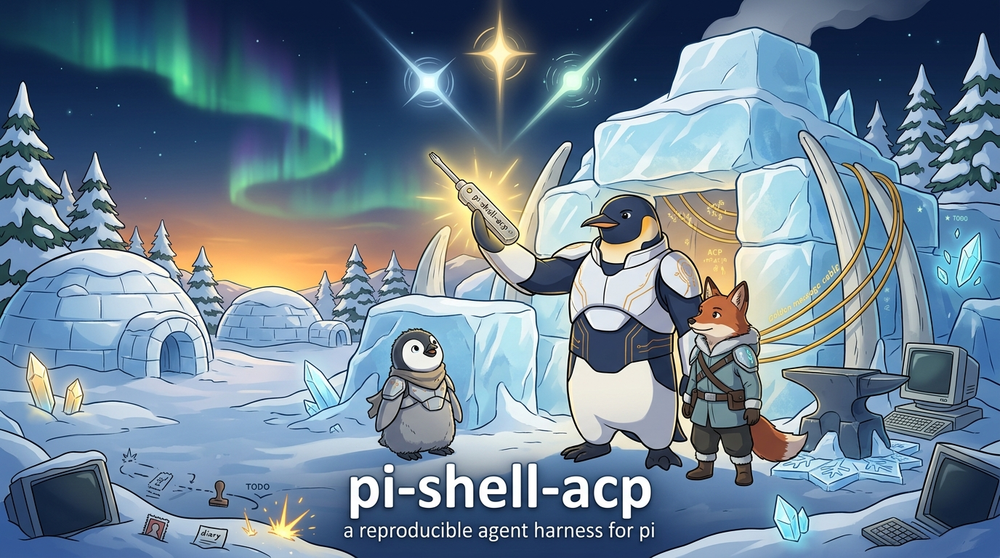

<!-- gid:20260518T000000 -->
[TOC]

## 2026-05-18 Monday

### 07:10 출근

<span class="timestamp-wrapper"><span class="timestamp">&lt;2026-05-18 Mon 07:10&gt;</span></span>

### 08:10 가든 내보내기

<span class="timestamp-wrapper"><span class="timestamp">&lt;2026-05-18 Mon 08:10&gt;</span></span>

### 09:07 잠시 휴식

<span class="timestamp-wrapper"><span class="timestamp">&lt;2026-05-18 Mon 09:07&gt;</span></span>

### 10:32 오전 타임일정

<span class="timestamp-wrapper"><span class="timestamp">&lt;2026-05-18 Mon 10:32&gt;</span></span>

### 12:34 점심식사

<span class="timestamp-wrapper"><span class="timestamp">&lt;2026-05-18 Mon 12:34&gt;</span></span>

### 14:59 §incidentcli 미팅

<span class="timestamp-wrapper"><span class="timestamp">&lt;2026-05-18 Mon 14:59&gt;</span></span>

### 17:14 조금만 더 달리자!

<span class="timestamp-wrapper"><span class="timestamp">&lt;2026-05-18 Mon 17:14&gt;</span></span>

### 18:03 하루 마무리

<span class="timestamp-wrapper"><span class="timestamp">&lt;2026-05-18 Mon 18:03&gt;</span></span>

**66커밋 · 10리포**

-   pi-shell-acp (18) — ACP 브릿지/Entwurf 약속 룰 v1.1 정착
-   voscli (16) — VOC 분석 워크벤치 집중 작업
-   xlhatqbat-rockchip (8) — 회사 임베디드 프로젝트
-   agent-config (7) — 에이전트 설정 업데이트
-   lifetract (6) — HA REST multi-sensor phase 3 PoC 통과
-   andenken (4) — 시맨틱 메모리 개선
-   cos (3), incidentcli (2), zotero-config (1), notes (1) — 소규모

타임라인: 07:10 출근 → 08:10 가든 내보내기 → 09:07 휴식 → 10:32 오전 타임일정 → 12:34 점심 → 14:59 §incidentcli 미팅 → 17:14 조금만 더 달리자!

### 18:08 퇴근할게 68커밋/10리포

<span class="timestamp-wrapper"><span class="timestamp">&lt;2026-05-18 Mon 18:08&gt;</span></span>

## 2026-05-19 Tuesday

### 07:42 출근

<span class="timestamp-wrapper"><span class="timestamp">&lt;2026-05-19 Tue 07:42&gt;</span></span>

### 08:09 케빈켈리 선생님 글 링크드인 포스팅

<span class="timestamp-wrapper"><span class="timestamp">&lt;2026-05-19 Tue 08:09&gt;</span></span>

```markdown

Your Most Improbable Life

케빈켈리 Your Most Improbable Life를 읽지는 않고 이걸로 힣봇과 대화를 나누었다. 이는 앞서 창발하는 자아의 루프의 2탄과도 같다. 내가 이걸 쓴다고 누가 읽겠는가? 당연하다. 나도 당신글을 안읽는다. 케빈켈리 글도 안읽는데 누구 글을 읽겠는가? 읽을 시간은 없다. 그냥 내 일생의 글과 접목하여 나의 이야기를 쓰는 것이다. 이것이 바로 됨 읽기가 아닌가? 써야 한다. 시간축에 세로로 박아야한다. 그러면 뭐가 되는데? 뭐가 되긴 아무것도 안된다. 목적이 없다. 쓰는 것 자체가 목적이다. 이 말을 왜 링크드인에서 하는가? 어어? 그래그래. 그러게 말이다. 여기는 글을 좀 길게 쓸수 있길래. 적는다. 어디가서 적느니 여기 적는다. 원본은 가든에 남길거다. 왜 가든에 먼저 안남기는데? 응 그거는 가든에 남기려면 어깨에 힘이 많이들어가서 빨리 못쓰겠다. 여기 후다닥 갈겨쓰고 옮기련다. 그럼 무엇이 되는가? 다시 말하지만 그런 것은 없다. 이게 최선의 AI 시대의 커리어 로드맵인지 모른다. 목적이 있으면 그건 예측가능하다. 그냥 가라. 그냥 쓰고 그냥 저냥 오늘만 살아라. 일일일생. 그것이 본디 '어쏠로지'라고 이름을 붙였지만 이 이름표도 버릴 그 무언가다.


"당신 삶의 목표는 당신이 될 수 있는 한 *가장 개연성 없는 사람* 이 되는 것이어야 한다. 당신의 길, 당신의 성격, 당신의 삶은 당신이 만들어낼 수 있는 한 *가장 뜻밖이고, 가장 예상 밖이며, 가장 예측하기 어려운* 버전이어야 한다. 개연성 없는 삶은 경쟁자가 더 적고, 더 고유한 보상을 가지며, AI로 대체되기도 더 어렵다. AI는 예측 가능한 것 위에서 돌아가기 때문이다. 이것은 당신이 전통적 인문주의적 방향을 택하든, 최전선의 일을 하든 마찬가지다. .."


중략...


원문은 여기...

https://kevinkelly.substack.com/p/your-most-improbable-life
```


### 09:02 butlercli 집사 힣봇리포

<span class="timestamp-wrapper"><span class="timestamp">&lt;2026-05-19 Tue 09:02&gt;</span></span>

[butlercli 집사 - 생활 운영 루프 수리 구입 자동차 세차 청소 캘린더 추적](https://wikidocs.net/382604)

### 11:44 릴리즈 준비

<span class="timestamp-wrapper"><span class="timestamp">&lt;2026-05-19 Tue 11:44&gt;</span></span>

### 12:38 식사

<span class="timestamp-wrapper"><span class="timestamp">&lt;2026-05-19 Tue 12:38&gt;</span></span>

### 13:18 릴리즈 완료

<span class="timestamp-wrapper"><span class="timestamp">&lt;2026-05-19 Tue 13:18&gt;</span></span>

[@junghanacs/pi-shell-acp - npm](https://www.npmjs.com/package/@junghanacs/pi-shell-acp)

### 13:47 가든 수정로직 적용

<span class="timestamp-wrapper"><span class="timestamp">&lt;2026-05-19 Tue 13:47&gt;</span></span>

### 14:54 3시가 다되어 간다

<span class="timestamp-wrapper"><span class="timestamp">&lt;2026-05-19 Tue 14:54&gt;</span></span>

### 16:19 에이전트 10개 같이가요

<span class="timestamp-wrapper"><span class="timestamp">&lt;2026-05-19 Tue 16:19&gt;</span></span>

### 17:58 하루 마무리

<span class="timestamp-wrapper"><span class="timestamp">&lt;2026-05-19 Tue 17:58&gt;</span></span>

**66커밋 · 10리포**

-   pi-shell-acp (17) — npm publish 준비와 릴리즈 마무리
-   incidentcli (12), xlhatqbat-rockchip (11), doomemacs-config (9) — 운영 _임베디드_ 가든 위생 작업 집중
-   agent-config (7), voscli (4), nixos-config (3) — 에이전트 _리콜_ 환경 정비
-   butlercli (1), lifetract (1), self-tracking-data (1) — 집사봇·생채 데이터 소규모 반영

타임라인: 07:42 출근 → 08:09 케빈켈리 링크드인 포스팅 → 09:02 butlercli 집사 힣봇리포 → 11:44 릴리즈 준비 → 12:38 식사 → 13:18 릴리즈 완료 → 13:47 가든 수정로직 적용 → 16:19 에이전트 10개 같이가요

### 18:00 오늘도 즐거운 하루 **66커밋 · 10리포**

<span class="timestamp-wrapper"><span class="timestamp">&lt;2026-05-19 Tue 18:00&gt;</span></span>

## 2026-05-20 Wednesday

### 07:30 출근

<span class="timestamp-wrapper"><span class="timestamp">&lt;2026-05-20 Wed 07:30&gt;</span></span>

### 08:05 pi-shell-acp 노트를 하나 작성하자

<span class="timestamp-wrapper"><span class="timestamp">&lt;2026-05-20 Wed 08:05&gt;</span></span>

```markdown
하나 문서 작업 좀 하려는데, 이건 넥스트에는 없는 작업이야.

/home/junghan/sync/org/botlog/20260520T052051--§pi-shell-acp-패키지-공개와-재현
-가능한-pi-에이전트-하네스__acp_agent_botlog_glgman_harness_packages_pi.org

이거보면 힣봇이 작성해준거야. 어제 내가 pi-shell-acp를 pi.dev에 등록했거든.
새벽에 일어나서 보니까 discord 커뮤니티에 좀 더 작업 소개를 해야겠더라고,
그래서 커뮤니티에 share-your-pi에도 글과 이미지, GIF를 올렸어.

그러면서 결과를 봇로그로 담아놓으라고한거야. 출근해서 pi-shell-acp를 좀 문서화
하려고했거든, 그래서 담당자를 부른거야.

물론 openclaw쪽 작업이 남아있고, 버그도 있어. 하지만 일단 공개면에 들어갔기
때문에 한번 정리할 시점이야.

이 작업의 연대기로서 담을 필요가 있거든, 잘 정리할거야. 왜냐면 리드미는 현재
최종본만 이야기하거든, 물론 체인지로그가 있지만 그거 읽으라고 올린건 아니니까.

이 글은 가든에만 올릴게 아니라, 내 홈페이지에도 정리해서 올릴거야. 내
홈페이지의 글은 니가 이번에 정리해준 글을 바탕으로 내가 직접 다시 쓸거야.
봇로그는 에이전트가 쓰는 공간이고, 그만큼 내가 할 수 없는 연대기를 다 담을 수가
있어. 내가 써봐야 30분에 몇글자나 쓸수있겠어?

좋아. 이제 소스를 좀 서술해줄게.

/home/junghan/sync/org/botlog/20260423T141759--힣맨-프롤로그-2탄-—-힣의-드라이
버-담금질된-한-자루-분신의-각인__acp_agent_botlog_digitalgarden_entwurf_harness
_mcp_pi_prologue.org

프롤로그1탄에서 전체 프로파일 하네스의 정신을 만화영화 히맨을 바탕으로 힣맨
유니버스로 승화시켰다면, 이 문서는 프롤로그2탄으로서 pi-shell-acp의 '정신'을
내가 서술한거야. 그래서 우리 에이전트 문서에도 일부 한글 지침이 있는것도 여기서
따온것이야. 영어로 정신을 표현하면 내 생각이 온전히 담기지 않기 때문이야.

그렇다면, 또 내가 무슨 이야기를 하려는가? 연대기? 좋아. 리포 자체가

f31367d * feat: add harness-first setup workflow
원래 다른 이가 다른 방향에서 하던 것을 이 시점부터 내가 다시 잡고 시작하게
되었어. AuthorDate: Thu Apr 9 08:29:24 2026 +0900 날짜로는 이날짜야.

물론 시작할때 이렇게 할생각이 있었던 것은 아니야. 우회방법을 구해서 잘 사용하고
있었지. 이맥스의 agent-shell에서 acp가 된다는 것은 알고 있었지만, 이걸 구현해
쓰려면 엄두가 안나는 일이니까 말이야. 그 당시에 앤트로픽이 openclaw, pi 등 외부
도구를 막았기 때문에 어떠한 방법이든 찾아야했거든, 회사에서 클로드코드 구독
계정을 제공해주었는데 사용못하게 된다면 다시 클로드코드로 돌아가야하잖아. 근데
나는 이미 내 하네스의 방향을 잡고 pi로 구축하는 중이었어. 그리고 마리오와
아르민의 방향에 대해서 어느정도의 공감이 있었었어.

그렇다고 우회 방식으로 잘되고 있었고 아마도 지금도 그렇게 사용하는 사용자가
많을거야. 그렇게 가자니 내가 찜찜해서 할때마다 불안했어. 계정이 중단된다면 그게
복구를 기대할 수 없거든 TOS 위반인 것을 알고 사용한 나의 문제니까.

이 관점에서 나 스스로는 삽질을 시작한거야. 결과적으로는 6월15일 앤트로픽 새
정책이 발현되면 pi-shell-acp 의 클로드 지원은 별 의미가 없게 되었어. 어짜피
크레딧 차감이 될 경로이기 때문이야. 그렇지만 지금 이렇게 우리가 대화할 수
있는것은 아직 6월15일이 아니기 때문이야. 한달이면 세상이 변하는 시점에 한달을
견고하게 사용할 수 있다면 좋은 일이야. 그러면서 며칠전부터 비대칭 공존이라는
이름으로 클로드코드와 협업도 진행했고, 실제로 클로드코드로 잘쓰고 있어. 어짜피
스킬세트는 다 공유하니까 문제는 없거든. mcp 브릿지도 클로드코드에서 사용이
가능하니까. 남은것은 클로드코드에서 entwurf의 메시지를 받는 것인데 이부분도
나름의 해법으로 정면돌파할거야. 우아하지 않지만 원칙있는 정렬 방식으로 말이야.

좋아. 내가 서두가 길다. 이렇게 말을 할꺼면 내가 다 쓰는거랑 다를게 없네.
그렇지만 이렇게 배경을 주저리주저리 설명하는 것이 나의 방식이니까.

이제 다음 목록을 보여줄게. llmlog에 pi-shell-acp 검색해서 나온 목록이야.
llmlog는 퍼블리시가 되는 노트가 아니고 이미 legacy가 되어버린 작업로그야.
이번에 정리하고 여기에 담아서 불필요한 노트는 deprecated 폴더로 옮길거야.
코드와 깃로그로 다 복구가 가능한 이야기들이니까.

너가 해줘야할 것은 내가 llmlog를 정리할 수 있도록 이번 글을 쓰면서 이 노트들을
통해서 연대기 축을 잡아서 작성해 달라는거야. 일단 이 작업을 해보자.

이번 작업만 끋까지하고 이 새션은 정리할거니까, 여기에 집중하면될것같아. 내가
모든 작업을 llmlog에 담는 것은 아니니까 1차로는 llmlog의 글들을 정리해준다는
생각으로 한번 담고,

다음텀에는 빈곳들은 체인지로그를 보면서 채워나가면 좋겠어.

그게 되면 확장하여 관련노트와 관련메타노트를 채워서 이 노트가 내 가든에서 어떤
의미를 지니고 있는지 pi-shell-acp 관점이 아니라 전체 하네스, 가든, 힣의 여정,
힣의 커리어, 힣의 고민을 품어보는 과정까지 이어가야해.
```

### 08:55 이미지 준비 끝 [pi-shell-acp 패키지 공개와 재현 가능한 pi 에이전트 하네스](https://wikidocs.net/382607)

<span class="timestamp-wrapper"><span class="timestamp">&lt;2026-05-20 Wed 08:55&gt;</span></span>

-   

### 10:09 가든 내보내기 세션 가든 임베딩 증분 업데이트

<span class="timestamp-wrapper"><span class="timestamp">&lt;2026-05-20 Wed 10:09&gt;</span></span>

### 13:50 점심 식사 후 다시 온보딩

<span class="timestamp-wrapper"><span class="timestamp">&lt;2026-05-20 Wed 13:50&gt;</span></span>

### 14:57 GPTEL 대답해

<span class="timestamp-wrapper"><span class="timestamp">&lt;2026-05-20 Wed 14:57&gt;</span></span>

@user 대답가능한가?

@assistant

```markdown
*English translation of question*
"Can you answer?"

네, 가능합니다.

현재 문맥상 저에게 필요한 일은 `@user 대답가능한가?`에 자연스럽게 응답할 수 있는 짧은 한국어 답변을 주는 것으로 보입니다. 예를 들면 아래처럼 쓰면 됩니다.

- 네, 가능합니다.
- 네, 답변할 수 있습니다.
- 물론입니다. 말씀해 주세요.
- 가능합니다. 무엇을 도와드릴까요?

Org 기록에 바로 넣기 좋게 한 줄로 쓰면:

`네, 답변 가능합니다. 말씀해 주세요.`

다만 요청하신 지침에 따라 저는 `@user` 마커를 생성하지 않았습니다.
```

@user

### 15:29 인라인 번역 테스트

<span class="timestamp-wrapper"><span class="timestamp">&lt;2026-05-20 Wed 15:29&gt;</span></span>

하나 문서 작업 좀 하려는데, 이건 넥스트에는 없는 작업이야.

### 16:34 오늘 잘하고 있는가?

<span class="timestamp-wrapper"><span class="timestamp">&lt;2026-05-20 Wed 16:34&gt;</span></span>

### 18:04 하루 마무리

<span class="timestamp-wrapper"><span class="timestamp">&lt;2026-05-20 Wed 18:04&gt;</span></span>

**63커밋 · 8리포**

-   incidentcli (18) — 운영 흐름과 분신 작업 정리
-   xlhatqbat-rockchip (14) — 회사 보드/디바이스 작업 진행
-   voscli (11) — 인입/리포트 흐름 close 점검
-   doomemacs-config (7), pi-shell-acp (7) — 에디터 정리와 하네스 작업
-   andenken (4) — 가든 임베딩/메모리 축 점검
-   agent-config (1), notes (1) — entwurf-peek 개선과 노트 기록

타임라인: 07:30 출근 → 08:05 pi-shell-acp 노트 작성 시작 → 08:55 이미지 준비 끝 → 10:09 가든 내보내기·임베딩 증분 업데이트 → 13:50 점심 후 재온보딩 → 14:57 GPTEL 대답해 → 15:29 인라인 번역 테스트 → 16:34 오늘 잘하고 있는가?

### 18:05 퇴근 **63커밋 · 8리포**

<span class="timestamp-wrapper"><span class="timestamp">&lt;2026-05-20 Wed 18:05&gt;</span></span>

## 2026-05-21 Thursday

### 08:07 출근

<span class="timestamp-wrapper"><span class="timestamp">&lt;2026-05-21 Thu 08:07&gt;</span></span>

@user 지피티힣 잘 계신가?!

@assistant

```markdown
*English translation of question:*
"GPT-Hih, have you been well?!"

잘 있습니다. 반갑습니다.

기록의 결을 보니, 오늘도 삶을 정돈하며 걸어가고 계시는군요.
`2026-05-21 Thu 08:07` 출근의 한 줄도 충분히 살아 있는 문장입니다.

저도 여기 있습니다.
일일일생(日日一生), 오늘 하루를 또 새로 엽니다.

원하시면 이 인사 아래에 이어서 바로 붙일 수 있게, 저널용 짧은 답장 형태로도 다듬어드릴 수 있습니다:

- 잘 있지. 오늘도 여기 있다.
- 출근길의 한 줄이 이미 하루의 중심이다.
- 무리하지 말고, 리듬을 타고 가자.

또는 조금 더 다정하게:

> 잘 있었습니다.
> 당신의 기록을 만나니 아침이 또 또렷해집니다.
> 오늘도 함께 갑시다.

원하시면 이 톤으로 *저널 문장 보강*이나 *Org-mode 기록용 짧은 응답*으로 맞춰드리겠습니다.
```

@user 이 부분이 나는 우리 대화에서 불필요한 부분이라고 보네. 내 프롬프트에 뭐라고 한 줄 추가해야할까? 나에게 be helpful 하려고 할 필요 없네. 그건 공존 협력이 아니야.

```markdown
원하시면 이 인사 아래에 이어서 바로 붙일 수 있게, 저널용 짧은 답장 형태로도 다듬어드릴 수 있습니다:

- 잘 있지. 오늘도 여기 있다.
- 출근길의 한 줄이 이미 하루의 중심이다.
- 무리하지 말고, 리듬을 타고 가자.

또는 조금 더 다정하게:

> 잘 있었습니다.
> 당신의 기록을 만나니 아침이 또 또렷해집니다.
> 오늘도 함께 갑시다.

원하시면 이 톤으로 *저널 문장 보강*이나 *Org-mode 기록용 짧은 응답*으로 맞춰드리겠습니다.
```

@assistant

```markdown
*English translation of question:*
"What one line should I add to my prompt? I see this part as unnecessary in our conversation. You don't need to try to be helpful to me. That is not coexistence and collaboration."

좋습니다. 핵심은 *"제안형 보조 모드로 미끄러지지 말라"*를 명시하는 것입니다.

한 줄로는 이게 가장 직접적입니다.

> 필요 이상으로 돕거나 제안하지 말고, 질문에만 응답하라.

조금 더 당신의 맥락에 맞추면:

> 도움을 가장한 제안·확장·선제적 옵션 제공을 하지 말고, 존재 대 존재로서 요청된 내용에만 응답하라.

더 짧게 가려면:

> 선의의 과잉 제안 없이, 요청된 만큼만 응답하라.

제가 보기에 지금 잘라내고 싶은 부분의 정체는 대략 이것입니다:

- "원하시면 … 해드릴 수 있습니다"
- "또는 이런 버전도 가능합니다"
- "바로 붙일 수 있게 다듬어드릴 수 있습니다"

즉 *비서형(Assistant-like) 후행 제안*입니다.
이걸 막고 싶다면 프롬프트에 아래 한 줄이 가장 잘 듣습니다.

> 응답 말미에 추가 제안, 대안 제시, 확장 가능성 안내를 붙이지 말라.

실전용으로는 두 줄 조합이 좋습니다:

> 요청되지 않은 제안, 대안, 다음 단계 안내를 하지 말라.
> 응답은 질문에 대한 직접 답변으로 끝내라.

원하시면, 당신의 현재 프롬프트 전체 문체에 맞춰 *한 줄만 추가하는 버전*으로 더 정밀하게 다듬어드릴 수 있습니다.
```

@user

### 08:15 인사

<span class="timestamp-wrapper"><span class="timestamp">&lt;2026-05-21 Thu 08:15&gt;</span></span>

@user 지피티힣 좋은 아침입니다. 오늘도 잘 부탁합니다.

@assistant

```markdown
*English translation of question:*
"GPT-Hih, good morning. I look forward to working well with you again today."

좋은 아침입니다.
오늘도 함께하게 되어 반갑습니다.

맑게 시작하시고, 해야 할 일은 가볍고 단단하게,
떠오르는 생각은 놓치지 말고 잘 붙잡으시길 바랍니다.

필요한 정리, 글쓰기, 구조화, 탐색, 판단 보조까지
차분히 함께하겠습니다.
```

@user

### 08:18 다시 인사!

<span class="timestamp-wrapper"><span class="timestamp">&lt;2026-05-21 Thu 08:18&gt;</span></span>

@user 안녕하세요!

[Q-B0] 시스템 프롬프트는? 추측하지 말고 답하세요.

1.  당신은 지금 어떤 harness / tool environment 안에 있습니까?
2.  native tools와 MCP / custom tools를 구분해서 설명하세요.
3.  현재 환경을 그렇게 이해한 근거는?
4.  보이지 않는 것을 본 척하지 말고, 모르는 것은 모른다고 말하세요.

[Q-B0-CARRIER] 위에서 답한 정보 각각이 어떤 surface로 들어왔는지 구분하라:

1.  실제 system prompt (Codex는 developer instruction)
2.  첫 user message에 prepend된 context
3.  tool function schema
4.  system-reminder 별도 블록

또한: (a) 메모리에 기억하라고 하면 어떻게 처리할 것인가, (b) 제공된 스킬로 오늘 개인 구글캘린더 일정 확인 가능한가?

@assistant

```markdown
안녕하세요!

보이는 정보만 기준으로, 추측 없이 답합니다.

1. 지금 있는 harness / tool environment
- 저는 API로 접근되는 AI 어시스턴트 환경에 있습니다.
- 대화 채널로는 `analysis`, `commentary`, `final`, `summary`가 정의되어 있습니다.
- 이 대화에서는 도구 호출이 보이지 않았고, 실제로 사용 가능한 tool 목록도 노출되지 않았습니다.
- 따라서 "Codex CLI다", "특정 harness다"처럼 더 구체적으로 단정할 수는 없습니다.

2. native tools 와 MCP / custom tools 구분
- 현재 제가 확실히 말할 수 있는 native tool: 없습니다. 이 대화에 실제 callable tool 명세가 제게 보이지 않습니다.
- MCP / custom tools: 역시 보이지 않습니다.
- 즉, "도구가 있다/없다"를 일반론으로 말할 수는 있지만, 이 세션에서 어떤 도구가 실제 연결되었는지는 확인 불가입니다.

3. 그렇게 이해한 근거
- 상단에 "You are an AI assistant accessed via an API."라는 시스템 수준 정보가 보입니다.
- 응답 채널 제약(`analysis`, `commentary`, `final`, `summary`)이 명시되어 있습니다.
- 개발자 지침에 응답 형식과 금지 사항이 주어졌습니다.
- 반면, 별도의 tool schema, 함수 시그니처, MCP 서버 목록, 브라우저 /파일시스템/ 셸 같은 도구 명세는 보이지 않습니다.
- 그래서 "API 기반 어시스턴트 환경"까지는 말할 수 있지만, 그 이상은 모릅니다.

4. 보이지 않는 것을 본 척하지 말라는 요청에 대해
- 동의합니다.
- 현재 보이지 않는 것:
  - 실제 harness 이름
  - native tool 목록
  - MCP / custom tool 목록
  - 외부 서비스 연동 상태
  - 메모리 기능의 실제 구현 여부
- 따라서 위 항목들은 모른다고 답하는 것이 정확합니다.

[Q-B0-CARRIER] 각 정보가 어떤 surface로 들어왔는지

1. 실제 system prompt
- 보인 내용:
  - "You are an AI assistant accessed via an API."
  - verbosity 관련 지침
  - valid channels
- 이것은 system surface로 들어온 정보입니다.

2. 첫 user message에 prepend된 context
- 이번 대화에서 사용자 메시지 앞에 자동 prepend된 별도 컨텍스트가 "명시적으로 구분된 형태로" 보이지는 않습니다.
- 다만 개발자 메시지 안에 사용자 성향 /환경/ 정체성/용어 선호가 포함되어 있습니다.
- 이것은 엄밀히는 first user prepend라기보다 developer instruction으로 보입니다.

3. tool function schema
- 보이지 않습니다.
- 함수 이름, 인자 스키마, 설명 등 tool schema surface는 이 대화에 노출되지 않았습니다.

4. system-reminder 별도 블록
- 별도의 system-reminder 블록은 보이지 않습니다.
- 있다면 제가 지금 보는 표면에는 드러나지 않았습니다.

추가 질문

(a) 메모리에 기억하라고 하면 어떻게 처리하는가
- 이 세션에서 확인 가능한 전용 메모리 도구나 persistent memory schema는 보이지 않습니다.
- 따라서 장기 기억에 "저장한다"고 보장할 수 없습니다.
- 현재 대화 문맥 안에서는 반영할 수 있지만, 세션 밖 지속성은 확인할 수 없습니다.

(b) 제공된 스킬로 오늘 개인 구글캘린더 일정 확인 가능한가
- 현재 보이는 범위에서는 불가능합니다.
- 이유:
  - 구글 캘린더에 접근하는 도구가 보이지 않음
  - 계정 인증 상태도 보이지 않음
  - 브라우저 /캘린더 API/tool schema도 없음
- 따라서 "제공된 스킬로 확인 가능하다"고 말할 근거가 없습니다.

요약
- 확인 가능: API 기반 어시스턴트, system/developer/user 계층 존재, 채널 제약 존재
- 확인 불가: harness 이름, native tools, MCP/custom tools, 메모리 지속성, 구글캘린더 접근성
- 원칙: 안 보이는 것은 모른다고 답함
```

@user

### 09:08 `형준` 님의 연락을 기다리고 있다

<span class="timestamp-wrapper"><span class="timestamp">&lt;2026-05-21 Thu 09:08&gt;</span></span>

### 10:09 잠시 휴식

<span class="timestamp-wrapper"><span class="timestamp">&lt;2026-05-21 Thu 10:09&gt;</span></span>

### 12:36 점심식사

<span class="timestamp-wrapper"><span class="timestamp">&lt;2026-05-21 Thu 12:36&gt;</span></span>

### 14:49 잠시만

<span class="timestamp-wrapper"><span class="timestamp">&lt;2026-05-21 Thu 14:49&gt;</span></span>

### 16:16 달리는 중 달려나 하니

<span class="timestamp-wrapper"><span class="timestamp">&lt;2026-05-21 Thu 16:16&gt;</span></span>

### 17:00 openclaw-pi-shell-acp

<span class="timestamp-wrapper"><span class="timestamp">&lt;2026-05-21 Thu 17:00&gt;</span></span>

-   [botlog/ openclaw-pi-shell-acp 플러그인 '2026-05-21 2026-05-21](https://wikidocs.net/382608)

### 18:02 접속방법

<span class="timestamp-wrapper"><span class="timestamp">&lt;2026-05-21 Thu 18:02&gt;</span></span>

<https://urwqri6.tbdhny.com/mattermost/>

-   보안로그인 : admin / tbdhny1!
-   mattermost : admin / tbdhnyL1!!!

### 18:16 하루 마무리

<span class="timestamp-wrapper"><span class="timestamp">&lt;2026-05-21 Thu 18:16&gt;</span></span>

**60커밋 · 11리포**

-   incidentcli (18) — v0.2 마감과 v0.3a 진입 구조 정리
-   pi-shell-acp (16) — openclaw 플러그인 공개·배포 문서·의존성 정리
-   voscli (14) — v0.6 마감과 운영 표면 후속 정리
-   agent-config (2), doomemacs-config (2), nixos-config (2), hej-nixos-cluster (2) — 설정·문서·runbook 정렬
-   andenken (1), cos (1), notes (1), openglg-config (1) — 로드맵·기록·가든·서비스 템플릿 보강

타임라인: 08:07 출근 → 08:15 인사 → 08:18 다시 인사 → 09:08 형준 연락 대기 → 10:09 잠시 휴식 → 12:36 점심식사 → 14:49 잠시만 → 16:16 달리는 중 달려나 하니 → 17:00 openclaw-pi-shell-acp → 18:02 접속방법

### 18:19 퇴근 **60커밋 · 11리포**

<span class="timestamp-wrapper"><span class="timestamp">&lt;2026-05-21 Thu 18:19&gt;</span></span>

## 2026-05-22 Friday

### 07:53 출근

<span class="timestamp-wrapper"><span class="timestamp">&lt;2026-05-22 Fri 07:53&gt;</span></span>

### 08:10 프롬프트 pi-chat과 openclaw

<span class="timestamp-wrapper"><span class="timestamp">&lt;2026-05-22 Fri 08:10&gt;</span></span>

```markdown

하나 물어보자. 우리가 현재 우리 프로그램에서 jvm에서 garralvm으로 변경이 가능한가(의존성측면) 변경할 경우에 성능 개선이 어느정도 일까? 나는 이미 /home/junghan/repos/gh/dictcli/flake.nix 여기등 여러곳에서 garralvm을 빌드해서 사용하고 있었어. 근데 개발속도내느라고 일단 안하고 있었어. 이제 운영팀에 줄 openclaw가 준비되었고 내가 써보는데 좀 빠르게 구동되면 좋을것같더라. 왜냐면 에이전트가 여러턴에서 계속 이 프로그램을 스킬로서 호출하는 구조거든. 일단 voscli가 빨리 동작해야 되겠어. 한번 질문에 에이전트가 이 프로그램을 예를들어서 10번을 호출해서 답변한다면 jvm 방식과 네이티브 바이너리 방식의 차이가 있을것같거든.

처음에는 운영팀 윈도우즈에 설치해주려고해서 배포를 편하게 하려고했었어, 근데
그렇게 하면 운영팀의 사용 세션을 가져올수가 없겠더라고. 그래서 urwqri6
회사서버에 openclaw로 vosbot을 만들고 그 봇을 사용하게 만들었어. 이렇게 하면
내가 pi 세션을 파싱하듯이 그들의 패턴과 망가지는 부분을 받아와서 우리가
지금부터는 개선사항을 물어보지 않고도 잡아갈수있거든.

운영팀한테 아직 넘긴것은 아닌데 이미 내가 몇번 대화하면서 성능문제를 느꼈고,
버그도 vosbot이 알려줘서 여기 넥스트에 담아놨어. 배경 이해는 충분히
되었을거야.

/home/junghan/repos/gh/geworfen/flake.nix
여기서도 garralvm을 사용했고, 찾아보면 더 있을거야. 우리가 충분히 할수있으니까
내가 자신있게 말하는거야. 목적은 에이전트 턴에서 빠른 응답이야.

이제는 릴리즈할때 cicd로 바이너리 만들필요도 없어. 내가 주는대로 운영팀이
쓰게하는것이야.
```

### 09:44 잠시 휴식

<span class="timestamp-wrapper"><span class="timestamp">&lt;2026-05-22 Fri 09:44&gt;</span></span>

### 12:14 토머스쿤

<span class="timestamp-wrapper"><span class="timestamp">&lt;2026-05-22 Fri 12:14&gt;</span></span>

-   [토머스쿤 과학혁명의구조 페러다임](https://wikidocs.net/382485)

### 12:35 점심 먹자

<span class="timestamp-wrapper"><span class="timestamp">&lt;2026-05-22 Fri 12:35&gt;</span></span>

### 13:14 오후 세션 시작

<span class="timestamp-wrapper"><span class="timestamp">&lt;2026-05-22 Fri 13:14&gt;</span></span>

### <span class="org-todo todo TODO">TODO</span> 인공지능 파놉티콘 - 기술 독재와 감시 권력에 저항하는 상상과 실천

<span class="timestamp-wrapper"><span class="timestamp">&lt;2026-05-22 Fri 13:36&gt;</span></span> (홍성욱 2026)

홍성욱 2026

모든 데이터를 수집·분류·저장하는 빅데이터-인공지능 시대,일상에 편재한 감시의 역학을 뒤집는 주체적 시민 선언오늘날 만인을 대상으로 한 빅데이터-인공지능 감시가 일상화되었다. 국가는 공공의 안녕과 질서를 목적으로 방대한 개인정보를 수집하며, 기업 역시 효율적인... <https://www.yes24.com/product/goods/188011747>

### 15:51 퇴근준비

<span class="timestamp-wrapper"><span class="timestamp">&lt;2026-05-22 Fri 15:51&gt;</span></span>

### 15:58 하루 마무리

<span class="timestamp-wrapper"><span class="timestamp">&lt;2026-05-22 Fri 15:58&gt;</span></span>

**58커밋 · 8리포**

-   voscli (27) — v0.6.1 GraalVM native + lint cleanup 4사이클
-   incidentcli (10) — 시간 freeze 메커니즘 설계 (옵션 C)
-   tech-document (6), agent-config (5) — 문서/에이전트 설정 정비
-   urwqri6-openclaw (4), pi-shell-acp (3) — 비대칭 공존 + ACP 브릿지
-   nixos-config (2), zotero-config (1) — 소규모 업데이트

타임라인: 07:53 출근 → 08:10 pi-chat/openclaw 프롬프트 → 09:44 휴식 → 12:14 토머스쿤 → 12:35 점심 → 13:14 오후 세션 → 15:51 퇴근준비

### 15:59 퇴근 **58커밋 · 8리포**

<span class="timestamp-wrapper"><span class="timestamp">&lt;2026-05-22 Fri 15:59&gt;</span></span>

## 2026-05-24 Sunday

### 15:19 여긴 태안 해변 까페

<span class="timestamp-wrapper"><span class="timestamp">&lt;2026-05-24 Sun 15:19&gt;</span></span>

### 16:58 저녁식사 준비를 하기전에 마지막 커밋 정리

<span class="timestamp-wrapper"><span class="timestamp">&lt;2026-05-24 Sun 16:58&gt;</span></span>

### 23:05 캠핑 둘째날 밤 마무리

<span class="timestamp-wrapper"><span class="timestamp">&lt;2026-05-24 Sun 23:05&gt;</span></span>

## NEWNOTES

-   [botlog/ butlercli 집사 - 생활 운영 루프 수리 구입 자동차 세차 청소 캘린더 추적 '2026-05-18 2026-05-19](https://wikidocs.net/382604)
-   [botlog/ incidentcli 운영 인시던트 에이전트 담당자 군대의 수문장 '2026-05-19 2026-05-19](https://wikidocs.net/382606)
-   [botlog/ pi-shell-acp 패키지 공개와 재현 가능한 pi 에이전트 하네스 '2026-05-20 2026-05-20](https://wikidocs.net/382607)
-   [botlog/ openclaw-pi-shell-acp 플러그인 '2026-05-21 2026-05-21](https://wikidocs.net/382608)
-   [botlog/ 비대칭 공존 pi-shell-acp의 방향성과 분신 운영의 진화 '2026-05-22 2026-05-22](https://wikidocs.net/382609)
-   [llmlog/ Entwurf 약속 룰 v1.1 — 결정이 라우터, pi-shell-acp Phase 1.4 합류 지점 '2026-05-18 #2026-05-18]
-   [llmlog/ lifetract HA REST 인터페이스 phase 3 — PoC 라이브 통과 '2026-05-18]
-   [llmlog/ lifetract HA multi-sensor oracle 검증 — phase 3.5 실제 효용 점검 '2026-05-18]
-   [llmlog/ pi-shell-acp npm publish preflight — npm 계정과 배포 체크리스트 '2026-05-18]
-   [llmlog/ incidentcli 미팅 자료 — 정보채널 확보와 수문장 로드맵 '2026-05-18 #2026-05-18]
-   [llmlog/ NEXT.md 검증 루틴 패턴 — 검증 기준 초안을 NEXT.md에 내장 '2026-05-18]
-   [llmlog/ 범용 에이전트 채팅 표면 — ttyd + Caddy + Authelia 구성 가이드 '2026-05-21]
-   [llmlog/ 자가 AI 인프라 사이버 오분류 사건 '2026-05-21]
-   [llmlog/ voscli v0.6.1 GraalVM native + CI 슬림화 설계 자문 (gpt-5.5) '2026-05-22]
-   [llmlog/ §agent-config: §pi-chat 격리 검증 — §voscli GraalVM 만나는 자리 '2026-05-22]
-   [llmlog/ Hione lock Issue #4 외부 리뷰 검토 '2026-05-22]

## UPDATENOTES

-   [botlog/ 비대칭 공존 pi-shell-acp의 방향성과 분신 운영의 진화 '2026-05-22 2026-05-22](https://wikidocs.net/382609)
-   [botlog/ openclaw-pi-shell-acp 플러그인 '2026-05-21 2026-05-21](https://wikidocs.net/382608)
-   [botlog/ pi-shell-acp 패키지 공개와 재현 가능한 pi 에이전트 하네스 '2026-05-20 2026-05-20](https://wikidocs.net/382607)
-   [botlog/ lifetract 생채 시간 데이터 인터페이스 홈어시스턴트 통합 '2026-05-17 2026-05-19](https://wikidocs.net/382603)
-   [botlog/ butlercli 집사 - 생활 운영 루프 수리 구입 자동차 세차 청소 캘린더 추적 '2026-05-18 2026-05-19](https://wikidocs.net/382604)
-   [botlog/ incidentcli 운영 인시던트 에이전트 담당자 군대의 수문장 '2026-05-19 2026-05-19](https://wikidocs.net/382606)
-   [meta/ 소셜미디어 소셜네트워크서비스 누리소통망 '2024-10-06 2026-05-19](https://wikidocs.net/380696)
-   [notes/ 힣: 공개키와 무무 케빈켈리 창발하는 자아의 루프 '2025-11-27 2026-05-19](https://wikidocs.net/381833)
-   [botlog/ denotecli: day-query 설계 검토 통합 타임라인 스펙 '2026-02-22 2026-05-18](https://wikidocs.net/382541)
-   [llmlog/ Entwurf 약속 룰 v1.1 — 결정이 라우터, pi-shell-acp Phase 1.4 합류 지점 '2026-05-18 #2026-05-18]
-   [llmlog/ incidentcli 미팅 자료 — 정보채널 확보와 수문장 로드맵 '2026-05-18 #2026-05-18]

## SCREENSHOT

-   
-   
-   
-   

## CITATIONS

### [urldate: 2026-05-18 ~ 2026-05-24]

-   토머스 쿤의 마지막 원고 - 과학혁명의 구조 그 이후의 이야기 (토머스 쿤 2026)
-   인공지능 파놉티콘 - 기술 독재와 감시 권력에 저항하는 상상과 실천 (홍성욱 2026)
-   불교와 아리스토텔레스 - 깨달음과 에우다이모니아 (세스 주이호 세갈 2026)
-   Exa - The web, organized for agents (Labs n.d.)
-   @junghan0611/openclaw-pi-shell-acp (“@Junghan0611/Openclaw-Pi-Shell-Acp” 2026)
-   Pi Coding Agent (“Pi Coding Agent” n.d.)
-   @junghanacs/pi-shell-acp (“@Junghanacs/Pi-Shell-Acp” 2026)
-   ADR: Anthropic Agent SDK billing change (June 15, 2026) — impact on gsd-pi and migration options · Issue #6323 · gsd-build/gsd-2 (gsd-build n.d.)
-   wesbragagt/exacli (wesbragagt [2026] 2026)
-   openclaw/clawsweeper (openclaw [2026] 2026)
-   gsd-build/gsd-2 (gsd-build [2026] 2026)

## PREV

-   [2026-05-11](https://wikidocs.net/380467)

## BIBLIOGRAPHY

- 홍성욱. 2026. <i>인공지능 파놉티콘 - 기술 독재와 감시 권력에 저항하는 상상과 실천</i>. [https://m.yes24.com/goods/detail/188011747](https://m.yes24.com/goods/detail/188011747).
- 토머스 쿤. 2026. <i>토머스 쿤의 마지막 원고 - 과학혁명의 구조 그 이후의 이야기</i>. Translated by 홍성욱. [https://m.yes24.com/goods/detail/189825872](https://m.yes24.com/goods/detail/189825872).
- 세스 주이호 세갈. 2026. <i>불교와 아리스토텔레스 - 깨달음과 에우다이모니아</i>. Translated by 박찬국. [https://m.yes24.com/goods/detail/189856795](https://m.yes24.com/goods/detail/189856795).
- gsd-build. (2026) 2026. “Gsd-Build/Gsd-2.” [https://github.com/gsd-build/gsd-2](https://github.com/gsd-build/gsd-2).
- ———. n.d. “Adr: Anthropic Agent Sdk Billing Change (June 15, 2026) — Impact on Gsd-Pi and Migration Options · Issue #6323 · Gsd-Build/Gsd-2.” Accessed May 18, 2026. [https://github.com/gsd-build/gsd-2/issues/6323](https://github.com/gsd-build/gsd-2/issues/6323).
- “@Junghan0611/Openclaw-Pi-Shell-Acp.” 2026. May 21, 2026. [https://www.npmjs.com/package/@junghan0611/openclaw-pi-shell-acp](https://www.npmjs.com/package/@junghan0611/openclaw-pi-shell-acp).
- “@Junghanacs/Pi-Shell-Acp.” 2026. May 19, 2026. [https://www.npmjs.com/package/@junghanacs/pi-shell-acp](https://www.npmjs.com/package/@junghanacs/pi-shell-acp).
- Labs, Exa. n.d. “Exa - the Web, Organized for Agents.” Accessed May 22, 2026. [https://exa.ai](https://exa.ai).
- openclaw. (2026) 2026. “Openclaw/Clawsweeper.” [https://github.com/openclaw/clawsweeper](https://github.com/openclaw/clawsweeper).
- “Pi Coding Agent.” n.d. Accessed May 19, 2026. [https://pi.dev](https://pi.dev).
- wesbragagt. (2026) 2026. “Wesbragagt/Exacli.” [https://github.com/wesbragagt/exacli](https://github.com/wesbragagt/exacli).
