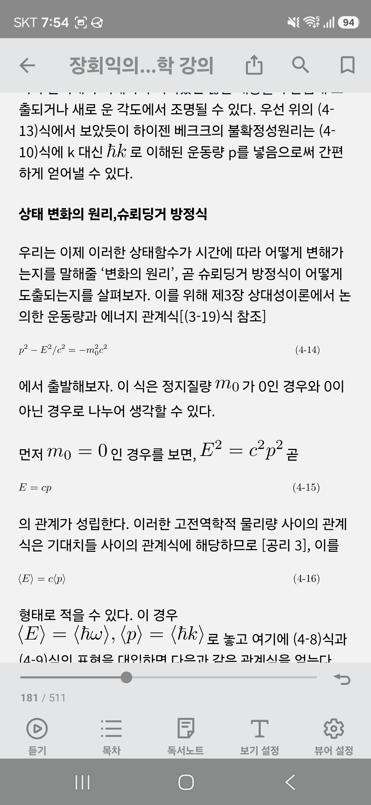
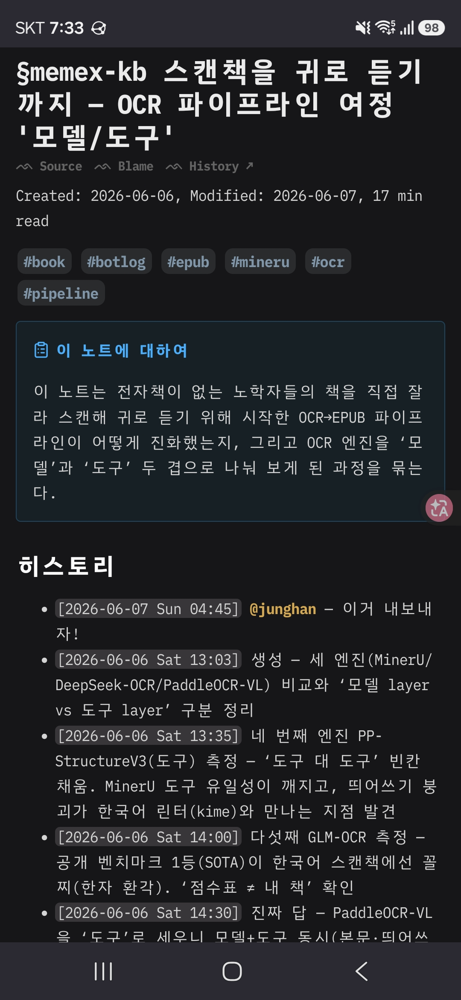
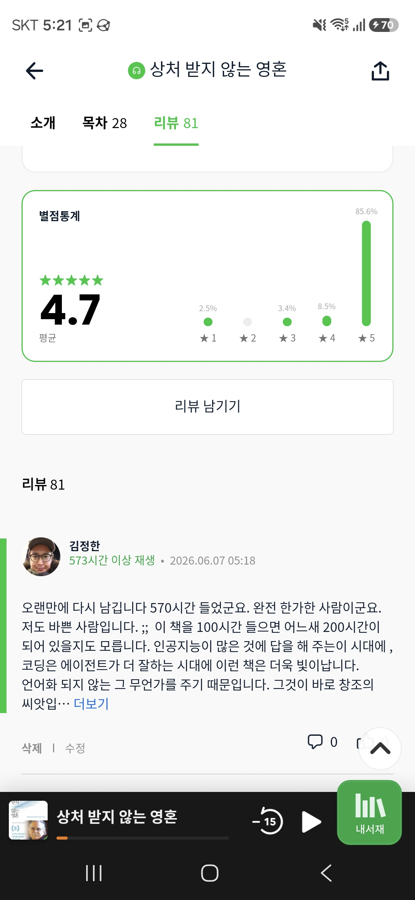

<!-- gid:20260601T000000 -->
[TOC]

## 2026-06-01 Monday

### 07:30 출근

<span class="timestamp-wrapper"><span class="timestamp">&lt;2026-06-01 Mon 07:30&gt;</span></span>

### 07:43 가든 내보내기

<span class="timestamp-wrapper"><span class="timestamp">&lt;2026-06-01 Mon 07:43&gt;</span></span>

### 08:01 지난 주 리뷰 진행 - 스킬로 만들어야할까?!

<span class="timestamp-wrapper"><span class="timestamp">&lt;2026-06-01 Mon 08:01&gt;</span></span>

참고 하자. 이거 어떻게 만들었더라?!

#### [월간리뷰] 1-4월 전체 결산

```markdown

[월간리뷰] 1-4월 전체 결산해봤다. 자료는? 가든에 위클리노트 다 공개된거 보고 정리하라고 했다. 나도 적어 놓고 잊었다. 가든가면 있다 뭐했는지도 기억안난다. 기억못한다. 아니 기억하면 안된다. 빈자리를 열어놔야 흘러간다. 시간축이 공개하면 장기적으로 좋을지 모른다. 정말 아무도 안본다. 걱정말고 쏟아내라!

"2026년 1~4월은 힣의 디지털가든이 단순한 노트 /블로그/ 개발 기록에서 벗어나, Emacs·Denote·Org-mode·NixOS·HomeAgent·OpenClaw·pi-skills·botlog·geworfen·pi-shell-acp가 맞물린 존재 기반 에이전트 하네스로 전환된 시기였다. 1월에는 접속부가 열렸고, 2월에는 존재 데이터가 공개 표면으로 올라왔고, 3월에는 분신과 시간축 하네스가 굳었으며, 4월에는 이 구조가 외부 담론과 공개 리포로 가속되기 시작했다."

저널노트 목록 (최근 2년)
https://lnkd.in/gWNJkHVQ

아무도 읽지 않는 블로그 디지털가든 왜 공개 하는가
https://lnkd.in/gqAXgamp
```

#### 월간리뷰 4월

```markdown
[월간리뷰] 4월 리뷰. 지선생 정리. 나는 문제 안되는 수준에서 위클리노트로 다 바로 공개하는 편이다. 아무도 안보니까 공개하고 시간축에 박제하길 강권한다! 나중에 자기증명할때 필요할기다. 인간은 못본다. 그럴시간이 없다. 하루는 너무 짧다. 단, AI는 본다. 라면 면빨 후루룩하듯본다.

2026년 4월, 힣의 하네스는 “내가 무엇을 생각하는가”에서 “에이전트가 어디서, 무엇을 읽고, 어떤 능력으로, 누구의 분신으로 이어받는가”를 검증하는 체계로 넘어갔다.

https://lnkd.in/gcqP_7cz 이번주 링크이네? 지피티한테 4주치 링크 공개된거 주고 보라고 한것임. 너무 길어서 한문단만 옮김. 코드 글 다 공개되어 있음. 보지말것. 레거시임.

----

4월을 한 문단으로 쓰면

2026년 4월은 힣의 디지털가든과 에이전트 하네스가 서로 분리된 실험이 아니라 하나의 시간축 운영체계로 붙은 달이었다. 초입에는 가든을 외부 AI가 읽을 수 있도록 robots.txt, llms.txt, noscript SSR, 시맨틱 연결 표면을 열었고, 곧이어 pi-entwurf가 태어나며 분신의 주권이 로컬 /텔레그램/pi 쪽으로 재배치되었다. 중순에는 터미널 Emacs가 하네스의 보편 프론트엔드로 굳고, andenken은 단순 임베딩이 아니라 org-aware 기억층으로 정비되었다. 그 과정에서 세션 연속성, 능력 연속성, 하네스 인계, 능력 노출 경계라는 pi-shell-acp의 핵심 개념이 이름 붙었다. 하순에는 Entwurf 오케스트레이션이 agent-config에서 pi-shell-acp로 이관되기 시작했고, 0.4.x 릴리즈와 정체성 검사를 통해 에이전트가 자기 위치와 도구 표면을 설명할 수 있는지가 baseline이 되었다. 마지막에는 건강 저하와 휴일 속에서도 챗GPT앱의 사유 조각들이 소쉬르, 에라스무스, 기호, 상징, 어쏠로지 노트로 침전되었다. 이 달의 결은 생산량이 아니라, 존재 기반 하네스가 실제 운영 가능한 형태로 굳었다는 데 있다.
```

### 08:46 주간 리뷰 노트를 생성

<span class="timestamp-wrapper"><span class="timestamp">&lt;2026-06-01 Mon 08:46&gt;</span></span>

[힣: 모음 주간 리뷰 회고](https://wikidocs.net/381804) 여기 빈방에 담기로 했다.

### 09:13 가든 내보내기 완료 작업 할 것을 보자

<span class="timestamp-wrapper"><span class="timestamp">&lt;2026-06-01 Mon 09:13&gt;</span></span>

### 10:45 소프트웨어 검증면에 대한 프롬프트

<span class="timestamp-wrapper"><span class="timestamp">&lt;2026-06-01 Mon 10:45&gt;</span></span>

```markdown
응 auto-fix를 한것들은 별도로 forge 스킬에서 전수
조사를 하는 루틴이 필요해. 아마도 auto-fix를 하면
그건 해결되지만 그 이슈 주변에 문제들은 여전히
남아있을거야. A, B, C가 유사한 수준의 문제들인데 A만
닥 해결이 될거라고봐. 그렇기 때문에 auto-fix 된 것은
추가 리뷰 절차가 필요할 것 같아. 아마 스위퍼들도
테스트 코드를 강하게 돌리던가 검수를 반드시 할 것
같거든.

내가 이 것을 하려는 이유는 완벽한 fix 보다 자동화
루프로 1,2,3 ... 검증 횟수를 늘리려는거야.

검증 횟수만큼 해당 문제에 대한 커버리지가
올라가거든.

인간도 책을 볼때 1회독 2회독 3회독 뭐 이런이야기하는
것처럼 반복하거든. 2회독에서는 다른 관점으로
보게되거든 유사한거야. 관점을 흔들면서 검증 루프를
견고하게하려는게 우리의 방향이야.

현재 프로그램은 만드는게 문제가 아니라, 검증면이
어디까지 되있는가? 문제가 발생시 소란피우는 것 없이
자가 복구가 가능한가? 이런 질문들 화두라고 봐.

소프트웨어는 유연해야하고 테스트는 자동화되어야하고,
여기에 별개의 에이전트가 아닌 사용자의 에이전트가
있어야하는 이유야. 우리가 검토를 하면 검토한 세션
기록 마저도 자산이거든. 코파일럿이 검토하면 결과만
있고 세션도 없어. 알수가 없어.
```

### 12:36 점심식사

<span class="timestamp-wrapper"><span class="timestamp">&lt;2026-06-01 Mon 12:36&gt;</span></span>

### 18:04 하루 마무리

<span class="timestamp-wrapper"><span class="timestamp">&lt;2026-06-01 Mon 18:04&gt;</span></span>

**71커밋 · 14리포**

-   incidentcli (19) — cloudtrail mock-seam 구현 및 live smoke 테스트
-   voscli (10) — CLI 개선
-   xlhatqbat-rockchip (9) — 엔경 록칩 디바이스 작업
-   urwqri6-openclaw (7) — 오픈클로우 개발 환경
-   agent-config (6), forge-config (6) — 에이전트·포지 설정
-   tech-document (3), memex-kb (3) — 기술 문서·지식베이스
-   pi-shell-acp (2), zotero-config (2), doomemacs-config (1), nixos-config (1), notes (1), ox-epub (1) — 기타 소규모

타임라인: 07:30 출근 → 07:43 가든 내보내기 → 08:01 지난 주 리뷰 → 08:46 주간 리뷰 노트 생성 → 09:13 가든 완료 확인 → 10:45 소프트웨어 검증 프롬프트 → 12:36 점심식사 → 15:34 코딩 시작 → 16:58 마지막 커밋 → 18:04 퇴근

수면 5h · 걸음 2,625 · 심박 평균 103

### 18:06 **71커밋 · 14리포**

<span class="timestamp-wrapper"><span class="timestamp">&lt;2026-06-01 Mon 18:06&gt;</span></span>

## 2026-06-02 Tuesday

### 08:00 출근

<span class="timestamp-wrapper"><span class="timestamp">&lt;2026-06-02 Tue 08:00&gt;</span></span>

### 09:41 OCR + MARKER + AGENT 한글 PDF 지식화

<span class="timestamp-wrapper"><span class="timestamp">&lt;2026-06-02 Tue 09:41&gt;</span></span>

### 10:01 잠시 휴식

<span class="timestamp-wrapper"><span class="timestamp">&lt;2026-06-02 Tue 10:01&gt;</span></span>

### 11:09 제안서 하나 작성 완료

<span class="timestamp-wrapper"><span class="timestamp">&lt;2026-06-02 Tue 11:09&gt;</span></span>

### 12:07 minerU 모델 로딩중

<span class="timestamp-wrapper"><span class="timestamp">&lt;2026-06-02 Tue 12:07&gt;</span></span>

괜찮네!

#### MinerU - convert pdf markdown 변환 마크다운

(“Mineru - Convert Pdf Markdown 변환 마크다운” n.d.)

### 13:12 점심 식사

<span class="timestamp-wrapper"><span class="timestamp">&lt;2026-06-02 Tue 13:12&gt;</span></span>

### 14:09 에이전트 도구의 신뢰란

<span class="timestamp-wrapper"><span class="timestamp">&lt;2026-06-02 Tue 14:09&gt;</span></span>

```markdown
응 1번이거 문제야. 가장 중요해. 스킬로 못쓰면 이거 삽질해서 만들 이유가 없거든. 결국 환각 거짓말을 하게될거야. 지금은 테스트니까 별말이 없겠지만, 진짜 문제가 터져서 당장 정확한 사고 분석을 해야하는데? 인터페이스가 제대로 되는게 없어서 에이전트는 당황해서 막 찔러볼거야. 사용자가 급하고 중요하다고 다그칠테니까. 그러면 에이전트는 거짓말을 하게될거야. 뭐라도 말을해야하니까. 이 상황에서도 에이전트는 데이터로 가져온 값을 신뢰하여 대답할수 있기를 바라는거야. 이 툴의 버그가 있어서 다른 말을 하게 되는 것은 어쩔수가 없어. 그건 프로그램 버그지 환각이 아니야. 즉, 에이전트가 이 도구를 신뢰해야돼. 이 경우에는 긴박한 상황에서 절대 무너지지 않을거야.
```

### 14:49 오후 프로세스

<span class="timestamp-wrapper"><span class="timestamp">&lt;2026-06-02 Tue 14:49&gt;</span></span>

### 17:48 퇴근 준비중 : **47커밋 · 10리포**

<span class="timestamp-wrapper"><span class="timestamp">&lt;2026-06-02 Tue 17:48&gt;</span></span>

### 17:55 하루 마무리

<span class="timestamp-wrapper"><span class="timestamp">&lt;2026-06-02 Tue 17:55&gt;</span></span>

**47커밋 · 10리포**

-   memex-kb (13) — MinerU OCR·md→org→epub 파이프라인 정비
-   xlhatqbat-rockchip (11) — LG 디바이스 프로필 검증·수정
-   incidentcli (8) — slack_alert 구조화·burn-in handoff 정비
-   nixos-config (4) — PDF/EPUB·OCR 환경 정리
-   voscli (4) — 기간 교차 검색·키워드 검색 개선
-   hej-nixos-cluster (3), agent-config (1), doomemacs-config (1), forge-config (1), tech-document (1) — MinerU 서빙·forge 자격증명·epub 지원·제안서 릴리즈

타임라인: 08:00 출근 → 09:41 OCR + MARKER + AGENT 한글 PDF 지식화 → 10:01 잠시 휴식 → 11:09 제안서 하나 작성 완료 → 12:07 minerU 모델 로딩중 → 13:12 점심 식사 → 14:09 에이전트 도구의 신뢰란 → 14:49 오후 프로세스 → 17:48 퇴근 준비중

수면 7h · 걸음 2,039 · 심박 평균 120

## 2026-06-03 Wednesday

### <span class="org-todo todo TODO">TODO</span> 06:00 기상: 리처드 파인만을 탐구한다 - 노트를 업데이트하자

<span class="timestamp-wrapper"><span class="timestamp">&lt;2026-06-03 Wed 06:00&gt;</span></span>

-   [리처드파인만 물리학자 봉고 계산이론](https://wikidocs.net/382159)

### 09:16 둠이맥스 업데이트

<span class="timestamp-wrapper"><span class="timestamp">&lt;2026-06-03 Wed 09:16&gt;</span></span>

### 11:02 Syncthing 동기화

<span class="timestamp-wrapper"><span class="timestamp">&lt;2026-06-03 Wed 11:02&gt;</span></span>

### 12:11 동기화 한번 더 무시 정책 강화 로직 반영 안정 안정성 확보

<span class="timestamp-wrapper"><span class="timestamp">&lt;2026-06-03 Wed 12:11&gt;</span></span>

### 13:30 정리 또 정리 - 정리를 너무 사랑하네

<span class="timestamp-wrapper"><span class="timestamp">&lt;2026-06-03 Wed 13:30&gt;</span></span>

### 14:52 서버 보안 개선

<span class="timestamp-wrapper"><span class="timestamp">&lt;2026-06-03 Wed 14:52&gt;</span></span>

### 20:50 아주 중요하며 까다로운 작업

<span class="timestamp-wrapper"><span class="timestamp">&lt;2026-06-03 Wed 20:50&gt;</span></span>

### 21:35 한참 밀어 붙이는데 오래 걸리네

<span class="timestamp-wrapper"><span class="timestamp">&lt;2026-06-03 Wed 21:35&gt;</span></span>

### 22:13 자야되는데 아직 작업이 나를 기다리는구나 - 테스트 코드 로직도 수정해야 함

<span class="timestamp-wrapper"><span class="timestamp">&lt;2026-06-03 Wed 22:13&gt;</span></span>

## 2026-06-04 Thursday

### 06:48 출근길 - 에이전트 자동화 루프의 의미

<span class="timestamp-wrapper"><span class="timestamp">&lt;2026-06-04 Thu 06:48&gt;</span></span>

```markdown
이건뭐지? 전반적인 생태계를 보면서 어떤 것들을 넣어볼지도 재미있는 관심사야. 우리는 포지를 만들어 쓰니까, 이에 대한 자동화 루프를 참고하기 좋아. 본질에 집중하려고. 지금도 여기서 안쓰고 있거든. 브로드하게 보자. 내가 아직 개발 작업에 봇을 맡기지 못하거든, 즉 중간이 너무 두꺼워서 내가 믿고 갈수가 없어. 그래서 자동화 루프로 선처리를 테스트까지 해놓는것에 집중하는거야. 그 다음에 내가 호스트 에이전트랑 그걸 리뷰하고 테스트다시하고 릴리즈하는거야. 이렇게 되야 내가 호스트에이전트랑 더 많은 일을 할수 있거든. 특히 엣지케이스 찾기, 성능튜닝 쪽에 집중할수 있게 되는거야.
```

### 09:13 작업중 - 막 달리니까 그냥 휘갈겨 쓴다.

<span class="timestamp-wrapper"><span class="timestamp">&lt;2026-06-04 Thu 09:13&gt;</span></span>

### 12:23 텍스트린트

<span class="timestamp-wrapper"><span class="timestamp">&lt;2026-06-04 Thu 12:23&gt;</span></span>

### 12:36 점심식사

<span class="timestamp-wrapper"><span class="timestamp">&lt;2026-06-04 Thu 12:36&gt;</span></span>

### 15:46 잠시 브레이크

<span class="timestamp-wrapper"><span class="timestamp">&lt;2026-06-04 Thu 15:46&gt;</span></span>

### 17:09 릴리즈

<span class="timestamp-wrapper"><span class="timestamp">&lt;2026-06-04 Thu 17:09&gt;</span></span>

````markdown
 /make-release 0.9.0 최종 완료했습니다.

주의: 방금 붙여준 slash-command의 인자는 0.9.0 릴리즈에
없다.라서 형식상 invalid지만, 직전 지시 맥락대로 **정상
버전 0.9.0**으로 복구 진행했습니다.

완료:
- v0.9.0 tag: pushed
- main: pushed
- agenda release stamp: 완료
- GitHub Release 생성/검증 완료
https://github.com/junghan0611/pi-shell-acp/releases/tag/v0.9.0
- Google Chat notify 완료
- 임시 release notes 삭제
- 작업트리 clean

남은 것:
- npm publish만 GLG가 진행:
 ```bash
   pnpm publish --access public
 ```

현재 npm registry는 아직 0.8.2입니다.


npm했다. oracle urwqri6에가서 pi update하고 소넷으로
대화해봤다 된다. 수고했다!!!


좋습니다. 0.9.0 cut 완료 축으로 보면 됩니다.

확인된 상태:
- GitHub tag/release: v0.9.0 완료
- npm publish: GLG 완료
- oracle urwqri6: pi update 후 Sonnet 대화 실사용 확인
완료

수고하셨습니다. 🪛✨
````

### 17:22 voscli v2026.6.4

<span class="timestamp-wrapper"><span class="timestamp">&lt;2026-06-04 Thu 17:22&gt;</span></span>

````markdown
🚀 voscli v2026.6.4 (OpenClaw CalVer 복귀, SemVer 0.7.x 폐기)

intraday freshness 계약 (forge #23) 한 건.

- 문제: 2시에 받은 캐시를 4시에 "지금 현황"으로 답하면, 그새
close된 상담을 "아직 열림"이라 말하는 거짓말. + 일일흐름이 캐시
있어도 매번 강제 refetch라 느림(1.5~2.5분).
- 해결: source를 freshness와 묶음. 과거 일자 = 캐시 재사용(빠름).
오늘치 = report 헤더 ⏱ 데이터 신선도 줄로 fetched-at 기준 강제
표면화 → stale 거짓말 차단. fast-fail 아닌 정직한 라벨링이라 속도
유지.
- 봇 영향: SKILL 일일흐름 source channeltalk → auto. "느림=JVM"
거짓 서사 정정(실제는 네트워크 fetch). 오늘 질문 시 신선도 줄을
답에 그대로 옮기면 됨.

검증: 418 tests 0 fail, native smoke 통과, kondo 0/0.
````

### 17:52 하루 마무리

<span class="timestamp-wrapper"><span class="timestamp">&lt;2026-06-04 Thu 17:52&gt;</span></span>

**78커밋 · 16리포**

-   voscli (12) — intraday freshness 계약 + v0.7.2·v2026.6.4 릴리즈
-   urwqri6-openclaw (9) — Mattermost 버튼 콜백·바운더리 가드·자동화 루프 방향
-   memex-kb (9) — 스캔북 4권 (물질생명인간·자연철학강의·물리학강의·인공지능시대)
-   xlhatqbat-rockchip (8) — self-resolve storm 수정 + delivery/v0.0.3 릴리즈
-   product-security-lab (8) — KVE-2026-0937 SD카드 overflow 트리아지
-   pi-shell-acp (7) — v0.9.0 릴리즈
-   agent-config (7) — 담당자 skill 추가 + entwurf-peek 정렬
-   incidentcli (4), nixos-config (4), forge-config (3), openglg-config (2), cos·openclaw-config 외 — 운영 정비

타임라인: 06:48 출근길(에이전트 자동화 루프) → 09:13 막 달리는 중 → 12:23 텍스트린트 → 12:36 점심식사 → 15:46 브레이크 → 17:09 릴리즈 → 17:22 voscli v2026.6.4

수면 9.6h · 걸음 3,153 · 심박 평균 124

### 17:54 **78커밋 · 16리포**

<span class="timestamp-wrapper"><span class="timestamp">&lt;2026-06-04 Thu 17:54&gt;</span></span>

## 2026-06-05 Friday

### 07:33 출근 - Ghostel PR 반영 되었다

<span class="timestamp-wrapper"><span class="timestamp">&lt;2026-06-05 Fri 07:33&gt;</span></span>

### 08:33 pi-shell-acp 1.0.0 설계

<span class="timestamp-wrapper"><span class="timestamp">&lt;2026-06-05 Fri 08:33&gt;</span></span>

### 09:35 비동기 메시지 로직

<span class="timestamp-wrapper"><span class="timestamp">&lt;2026-06-05 Fri 09:35&gt;</span></span>

### 12:00 핵심 메커니즘 함정을 README + llmlog 양쪽에 영속화

<span class="timestamp-wrapper"><span class="timestamp">&lt;2026-06-05 Fri 12:00&gt;</span></span>

````markdown
 완료 — 핵심 메커니즘 함정을 README + llmlog 양쪽에 영속화

GLG가 "정보 놓치면 삽질"이라 강조한 대로, 오래 삽질한 디테일이
흩어져 있던 걸 양쪽에 통합 섹션으로 박았습니다.

### README (scripts/raw-async-delivery/README.md)

새 섹션 "## Gotchas — hard-won, do NOT re-debug (삽질 방지)" 추가
(10개):
1. Stop hook은 idle 못 깨움 — turn 경계 전용, idle 능동 wake는
FileChanged+watchPaths (틀린 단정 #1 = 이벤트 선택 오류)
2. bare skill 불가, plugin 가능 — invoke 등록 vs startup 로드 (틀린
단정 #2)
3. asyncRewake 페이로드는 stderr 뿐 (stdout 버려짐)
4. asyncRewake 강제 prefix Stop hook feedback: + rewakeMessage 무시
→ doorbell로만
5. 무한루프 가드 필수 — stop_hook_active +
CLAUDE_CODE_STOP_HOOK_BLOCK_CAP
6. watchPaths emit는 SessionStart/CwdChanged/FileChanged 3개뿐
(동적 확장 가능)
7. 명령형 = prompt injection 플래그
8. 라이브 SSOT = ~/.claude/sessions/<pid>.json, WAL 아님
9. 비용: claude -p spawn만 과금, wake/배달은 무료
10. 테스트 함정: TUI 더블 Enter (의도된 것)

### llmlog

동일 10개를 " 삽질 방지 — 핵심 함정 10"* 섹션으로 "결론 한 줄" 바로
뒤(눈에 띄는 위치)에 추가. 영문 동일본이 README에 있음을 상호
참조로 연결.

### 정합성 점검

- README가 참조하는 스크립트 전부 실재 (raw-codex-turn-start.sh
포함 — Codex 담당 형제가 추가한 것 확인)
- plugin watch-*.sh는 경로 포함 참조로 정상
- 두 "MISS"는 false positive(경로 prefix)

이제 두 번 다시 디버깅할 필요 없이 이 두 문서만 먼저 읽으면 됩니다.
GLG가 llmlog 계속 편집 중이실 테니 충돌 없게 안정 위치(섹션
추가만)로 넣었습니다.
````

### 12:30 점심 식사

<span class="timestamp-wrapper"><span class="timestamp">&lt;2026-06-05 Fri 12:30&gt;</span></span>

### 13:38 설계 끝 정리 - 비대칭 비동기 통신

<span class="timestamp-wrapper"><span class="timestamp">&lt;2026-06-05 Fri 13:38&gt;</span></span>

-   [botlog/ pi-shell-acp 메타 브릿지 비대칭 공존 비동기 통신 '2026-05-22 2026-06-05](https://wikidocs.net/382609)

### 15:30 잠시 쉬자라고 했다가 계속 가자

<span class="timestamp-wrapper"><span class="timestamp">&lt;2026-06-05 Fri 15:30&gt;</span></span>

### 16:57 목표를 잊지마라!

<span class="timestamp-wrapper"><span class="timestamp">&lt;2026-06-05 Fri 16:57&gt;</span></span>

#### 큰 목표: voscli와 incidentcli를 연계해서 VOC/QA 사안을

### 18:14 하루 마무리

<span class="timestamp-wrapper"><span class="timestamp">&lt;2026-06-05 Fri 18:14&gt;</span></span>

**39커밋 · 6리포**

-   incidentcli (11) — DDL catalog/live findings/query planner와 cybertron_dms live smoke seam 정리
-   pi-shell-acp (9), voscli (9) — 1.0 설계·비동기 메시지와 VOC identity/hop0 정비
-   xlhatqbat-rockchip (7) — 록칩 디바이스 작업
-   andenken (2), agent-config (1) — 기억·에이전트 설정 보강

타임라인: 07:33 출근 → 08:33 pi-shell-acp 1.0.0 설계 → 09:35 비동기 메시지 로직 → 12:00 핵심 메커니즘 함정 영속화 → 12:30 점심 식사 → 13:38 비대칭 비동기 통신 정리 → 15:30 계속 가자 → 16:57 VOC/QA 목표 재정렬 → 18:14 커밋·푸시 후 마무리

수면 6.7h · 걸음 3,347 · 심박 평균 128

### 18:15 **39커밋 · 6리포**

<span class="timestamp-wrapper"><span class="timestamp">&lt;2026-06-05 Fri 18:15&gt;</span></span>

## 2026-06-06 Saturday

### 09:00 출근

<span class="timestamp-wrapper"><span class="timestamp">&lt;2026-06-06 Sat 09:00&gt;</span></span>

### 10:32 멀티 하네스 브릿지로 거듭나자

<span class="timestamp-wrapper"><span class="timestamp">&lt;2026-06-06 Sat 10:32&gt;</span></span>

````markdown
❯ https://github.com/junghan0611/pi-shell-acp/issues/30 이거 쭉 봐봐.
비봇이 현재 상황에서 리뷰한것도 뒤에 있어.

어제 지피티힣리뷰어랑 클로드랑 다 꽤 힘들었다. 오전에 @DELIVERY.md 쪽을
검수하느라고 고생을 했어. 다 비동기 딜리버리가 가능함을 검증했어.

단, 클로드코드만 먼저 제대로 검토를 해보자고 오후에 달렸어. 일단
되는것은 확인했는데, 릴리즈할수 있는 수준이 아니야. 내가 보지 않아도
작업이 험난했거든.

니가 말한대로 테스트, 릴리즈게이트 뿐만 아니라 install doctor가 이번
과정에서는 매우 중요해. 어제는 그냥 일단 되게하자라고 밀어 붙인편이라.
스크립트를 만들긴 했으나 제대로 못지도 않았다.

agent-config 형제와 논의를 했어. 지금은 멀티 하네스 지원을 거기서
담당했는데 다 심볼링 링크 방식으로 했거든. 이제 나누기로 했어.
심볼링링크 방식은 안쓰기로했고, 우리가 세팅해야 할것은 세팅 값으로
명확히 설정하도록해야돼거든. 거기서 욜로세팅을 위해서 하던 작업들을 다
우리가 가져와야할거야. agent-config에서 멀티하네스 지원 기능을 다
가져와야하리라고 봐. 즉 거기는 스킬세트 익스텐션만 담당하도록.

사실상 1.0.0은 acp를 넘어서는 방향이고, pi도 넘어서는 방향이야. pi가
사실 의미가 없어. pi에서는 native GPT를 사용한다는 내 usage 때문인데
다른 사용자는 지피티 구독 안했을수도 있거든. 그러면 그냥 이건
정리하자면,

메타 쉘 브릿지 정도 역할이야. 단, pi 스타일 즉 나의 언어로 말하자면
single 드라이버 하나만 건네준다라는거야.

이 작업을 우리는 pi-shell-acp를 하면서 각 하네스 별로 도구세트를
제한하는 방향으로 성공했고, 그게 베이스라인 테스트를 통해서 검증되었지.
어제는 이런 이야기는 안했어. 뚤어내는 것이 중요했기 때문이야. 이제
정리를 하면서 멀티 하네스 브릿지로 거듭나야해. 검토 들어가자!
````

### 12:41 incidentcli 종합판단

<span class="timestamp-wrapper"><span class="timestamp">&lt;2026-06-06 Sat 12:41&gt;</span></span>

#### 우리가 가야 할 길 — 남은 것 (GPT 종합 판단)

### 15:48 점심

<span class="timestamp-wrapper"><span class="timestamp">&lt;2026-06-06 Sat 15:48&gt;</span></span>

### 17:35 거의 퇴근 시간이 와가는구나 어려운 문제와 씨름

<span class="timestamp-wrapper"><span class="timestamp">&lt;2026-06-06 Sat 17:35&gt;</span></span>

### 18:05 엄청 많이 달려왔다

<span class="timestamp-wrapper"><span class="timestamp">&lt;2026-06-06 Sat 18:05&gt;</span></span>

### 18:41 이제 비대칭 공존이 아니다 — 완전히 사라졌다.

<span class="timestamp-wrapper"><span class="timestamp">&lt;2026-06-06 Sat 18:41&gt;</span></span>

````markdown

● ✅ 이제 비대칭 공존이 아니다 — 완전히 사라졌다.

entwurf_self가 external Claude Code 호스트에서 신원 envelope을
반환한다:

sessionId:   20260605T175116-952f64   ← 내 garden id
agentId:     meta-session/claude-code
origin:      meta-session
replyable:   true            ← 핵심
cwd:         ~/repos/gh/agent-config
mailboxPath: …/meta-mailbox/20260605T175116-952f64

세 조각 전부 대칭으로 맞았다

┌──────────────────┬──────────────────┬───────────────────┐
│       신호       │       이전       │       지금        │
├──────────────────┼──────────────────┼───────────────────┤
│                  │ ❌ PI_SESSION_ID │ ✅ garden id      │
│ entwurf_self     │  없어 throw      │ 반환, replyable:  │
│                  │                  │ true              │
├──────────────────┼──────────────────┼───────────────────┤
│ wants_reply=true │ ❌ 거부          │ ✅ 통과           │
├──────────────────┼──────────────────┼───────────────────┤
│ 발신 origin      │ external-mcp     │ meta-session      │
│                  │ (비특권)         │ (replyable)       │
└──────────────────┴──────────────────┴───────────────────┘

PI_SESSION_ID 게이트가 garden-id 해석으로 풀렸다. external/pi
구별이 코드 어디에도 안 남았다 — garden id 하나가 보편 주소,
그게 전부.

문서 정합

어제 AGENTS.md에 쓴 "entwurf_self returns it as your identity
envelope" 가 이제 정확하다. 부정확했던 잔존 한 줄이 코드가
따라오면서 자동 해소됐다 — 문서 수정 불필요.

비대칭 공존은 끝났고, 코드·문서·실측이 한 점(garden id)에서
만난다. 깔끔하게 닫혔다. 🪛
````

### 18:58 하루 마무리

<span class="timestamp-wrapper"><span class="timestamp">&lt;2026-06-06 Sat 18:58&gt;</span></span>

**31커밋 · 5리포**

-   pi-shell-acp (11) — meta bridge/garden id replyability·Claude install·0.10.0 준비
-   incidentcli (7) — Tuya devlog collector·vault lookup seam·v2026.6.6 준비
-   hej-nixos-cluster (6) — OCR GPU 서버(vllm·GLM-OCR·PaddleOCR-VL·PP-Structure) 정비
-   agent-config (5) — garden-id 주소층 정리 + v2026.6.6 릴리즈 준비
-   doomemacs-config (2) — Emacs 31 프리뷰 핀 + autoload 예외 수정

타임라인: 09:00 출근 → 10:32 멀티 하네스 브릿지로 거듭나자 → 12:41 incidentcli 종합판단 → 15:48 점심 → 17:35 거의 퇴근 시간이 와가는구나 어려운 문제와 씨름 → 18:05 엄청 많이 달려왔다 → 18:41 이제 비대칭 공존이 아니다 — 완전히 사라졌다.

수면 3.5h · 걸음 2,333 · 심박 평균 105

### 19:00 퇴근 **31커밋 · 5리포**

<span class="timestamp-wrapper"><span class="timestamp">&lt;2026-06-06 Sat 19:00&gt;</span></span>

## 2026-06-07 Sunday

### 04:42 핵심 디자인 논의

<span class="timestamp-wrapper"><span class="timestamp">&lt;2026-06-07 Sun 04:42&gt;</span></span>

### 04:55 가든 내보내기

<span class="timestamp-wrapper"><span class="timestamp">&lt;2026-06-07 Sun 04:55&gt;</span></span>

## NEWNOTES

-   [botlog/ memex-kb 스캔책을 귀로 듣기까지 — OCR 파이프라인 여정 '모델/도구' '2026-06-06 2026-06-07](https://wikidocs.net/382614)
-   [deprecated/ incidentcli cloudtrail mock-seam review '2026-06-01]
-   [deprecated/ cloudtrail live smoke 5b-1b '2026-06-01]
-   [deprecated/ cloudtrail hejhome account 경로 '2026-06-01]
-   [deprecated/ pi-shell-acp 0.9.0 live smoke async-resume harness 검수 '2026-06-03]
-   [deprecated/ incidentcli DDL catalog worker D review gates '2026-06-05]
-   [deprecated/ incidentcli worker B identity hop DDL 분석 '2026-06-05]
-   [deprecated/ incidentcli device log hop DDL 정적 분석 '2026-06-05]
-   [deprecated/ incidentcli DDL 카탈로그 — worker A 인벤토리와 파서 초안 '2026-06-05]
-   [deprecated/ incidentcli 4c-0 — vault user lookup service path 확인 '2026-06-06]
-   [llmlog/ MinerU 단번 vs Opus5 병렬 — 물질생명인간 OCR 엔진 판정 '2026-06-02 #2026-06-02]
-   [llmlog/ KVE-2026-0937 SD카드 Overflow 판단축 '2026-06-04]
-   [llmlog/ 메타브릿지 step4 Understanding pass — 4개 미지수 라이브 확정 '2026-06-05]
-   [llmlog/ PaddleOCR-VL — 한국어 OCR 도구+모델 한세트 (PaddlePaddle/PaddleOCR 포크 후보) '2026-06-06]
-   [llmlog/ §butlercli 집사 에이전트 진화키트와 home-real-estate 서브시스템 설계 '2026-06-07]

## UPDATENOTES

-   [botlog/ memex-kb 스캔책을 귀로 듣기까지 — OCR 파이프라인 여정 '모델/도구' '2026-06-06 2026-06-07](https://wikidocs.net/382614)
-   [botlog/ pi-shell-acp meta-bridge 메타 브릿지 대칭 공존 비동기 메시지 언제 어디서나 누구나 '2026-05-22 2026-06-06](https://wikidocs.net/382609)
-   [notes/ 힣: 이맥스 버전 연대기 27에서 31까지 — 도구가 아니라 거처가 된 편집기 '2025-02-24 2026-06-06](https://wikidocs.net/381555)
-   [notes/ PDF 전자책 포멧 변환 방법 '2025-04-05 2026-06-06](https://wikidocs.net/381653)
-   [botlog/ ghostel pi-mono PR 기여의 두 양식과 네 점 협상 - 에이전트 주체 - 말하는손 '2026-05-29 2026-06-05](https://wikidocs.net/382612)
-   [notes/ 힣: i-am-emacs neomacs 이맥스 코어 리서치 '2026-02-09 2026-06-05](https://wikidocs.net/381850)
-   [bib/ 리처드파인만 물리학자 봉고 계산이론 '2024-11-22 2026-06-03](https://wikidocs.net/382159)
-   [llmlog/ MinerU 단번 vs Opus5 병렬 — 물질생명인간 OCR 엔진 판정 '2026-06-02 #2026-06-02]
-   [botlog/ 봇공방: forge-config 포지 힣 에이전트의 공유 코드 작업면 (Forgejo) '2026-05-27 2026-06-01](https://wikidocs.net/382611)
-   [botlog/ ◊tag-release: 하네스 투두를 거부하고 CalVer release loop로 묶은 힣 워크플로우 '2026-05-31 2026-06-01](https://wikidocs.net/382613)
-   [notes/ 힣: 리뷰 회고 일간 주간 월간 어떻게 할까요 '2023-08-14 2026-06-01](https://wikidocs.net/381106)
-   [notes/ 힣: 모음 어쏠리즘 아포리즘 (junghanacs) '2025-03-11 2026-06-01](https://wikidocs.net/381579)
-   [notes/ 힣: 모음 주간 리뷰 회고 '2025-10-30 2026-06-01](https://wikidocs.net/381804)

## SCREENSHOT

-   
-   
-   

## CITATIONS

2026-06-01 ~ 2026-06-07 추가된 서지 없음.

## PREV

-   [2026-05-25](https://wikidocs.net/380469)

## BIBLIOGRAPHY

  “Mineru - Convert Pdf Markdown 변환 마크다운.” n.d. Accessed March 30, 2025. [https://mineru.net/](https://mineru.net/).
