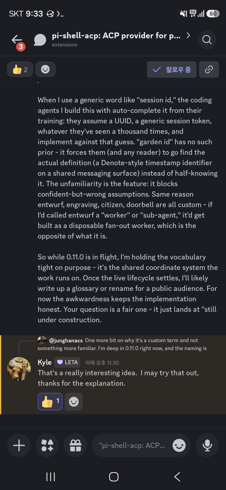

<!-- gid:20260608T000000 -->
<!-- provenance:source:start -->
[[TIP("원본·최신본")]]
이 페이지는 한국어 검색과 읽기를 위한 WikiDocs 미러입니다. [원본·최신본은 가든](https://notes.junghanacs.com/journal/20260608T000000/)에 있습니다. 최신 수정 내용·백링크·태그·히스토리·댓글·출처 정보는 원본 가든에서 확인하세요.

- 작성: `2026-06-08T00:00:00+09:00`
- 최근 수정: `2026-06-08T00:00:00+09:00 (lastmod 없음: date fallback)`
[[/TIP]]
<!-- provenance:source:end -->

[TOC]

## 2026-06-08 Monday

### 07:50 출근

<span class="timestamp-wrapper"><span class="timestamp">&lt;2026-06-08 Mon 07:50&gt;</span></span>

### 08:13 이맥스 코드 정리 중

<span class="timestamp-wrapper"><span class="timestamp">&lt;2026-06-08 Mon 08:13&gt;</span></span>

### 09:45 잠시 휴식

<span class="timestamp-wrapper"><span class="timestamp">&lt;2026-06-08 Mon 09:45&gt;</span></span>

### 10:51 ZIGBEE 허브 프로젝트 - 담당자 방문 양산 전 인증 테스트

<span class="timestamp-wrapper"><span class="timestamp">&lt;2026-06-08 Mon 10:51&gt;</span></span>

### 15:04 아파트 단지내 스타벅스WPS

<span class="timestamp-wrapper"><span class="timestamp">&lt;2026-06-08 Mon 15:04&gt;</span></span>

### 15:25 집사봇을 연결해줬다.

<span class="timestamp-wrapper"><span class="timestamp">&lt;2026-06-08 Mon 15:25&gt;</span></span>

## 2026-06-09 Tuesday

### 08:28 출근

<span class="timestamp-wrapper"><span class="timestamp">&lt;2026-06-09 Tue 08:28&gt;</span></span>

### 09:39 pi-shell-acp entwurfcli 설계

<span class="timestamp-wrapper"><span class="timestamp">&lt;2026-06-09 Tue 09:39&gt;</span></span>

```markdown

메타세션에 들어갈 ssot 정보는 매우 신중해야된다. 특히 pi는 메타세션 정보로만 판단해서 안되는것같아. 현재 상태는 현재 시점에만 정확히 파악할수있어. 이를 파악하는 것 자체는 큰 비용이 들지 않으니까 상태를 아예 두지 않는 것이 정답일수도 있어. 너가 말한 dormant, working, live의 상태를 파악하는데 필요한 코드가 비용이 LLM이 하는 것이 아니라 코드로 판별할수 있어야돼. 그래야 entwurf-peer를 하든가 현재 형제들 뭐하는가?에서 답변을 라이브로 할수 있거든.

하나 더, entwurf 인터페이스가 더 단순해야돼. 내 직관에는 entwurf_resume, entwurf_send는 일단 상태 파악로직이 있다면 둘은 나뉘면 안돼.

더 나아가서 entwurf 하나로 처리가 가능할지도 몰라. spawn, resume, send가 뭐가 달라야하는지 모르겠다. 어느 경로에 지피티5.4를 부르려고 한다고하자. 메타세션을 보니까, 어제 불렀던 녀석이 있어. 세션이 길지도 않고, 지금 하는 거랑 비슷한 작업을 했다고 알려주는 recap 함수가 있다고하자. 그러면 이친구를 부르는게 좋아. pi native 세션이었으니까 딱 좋아. 그렇다면 pi -p로 백그라운드로 하라고 하면돼. 다른 경우를 또 보자. 클로드 소넷이 하면 좋은 작업이 있어. 근데 클로드 소넷 세션은 1주일 전에 하나 있는데 새션도 150k 정도 이미 차있어. 그렇다면 spawn하는게 좋겠지? 물론 클로드코드니까 tmux live 세션으로 동작하게 될거야. 또 다른 사례를 보자. 힣이랑 대화를 하는데 코덱스 지피티가 필요해. 왜냐면 이미지 생성을 하는 요청이거든. 코덱스 지피티는 이미지 생성이 가능해. 부른적이 없네? 그렇다면 코덱스 라이브로 생성부르는거야.

또 하나 보자. 구글 나노바나나 이미지 작업하고, 구글 서치 엔진 관련 논의를 하고 싶어. org 경로로 부를건데 거기에 agy가 안떠있네? 부를까? 근데 어제 힣이 org에서 agy랑 시맨틱 관련 논의를 했었네? 그렇다면 이 세션을 live로 만들고 resume해서 메시지를 send 보내면 딱 좋겠다.

이런 식으로 생각을 해보면, entwurf를 부르는 행위에는 판단 근거만 파악한다면, 에이전트는 최적의 형제를 호출할수가 있어.

더 나아가 이런것도 가능해. 지금 entwurf를 부르려고하는데 시스템이 굉장히 burden한 상태야. 이런 상황이라면 라이브로 불렀다간 시스템을 불안하게 할것같네? pi bg로 부르는게 좋겠다!라고 판단할수 있지.

또 다른 판단 사례를 보자. 지금 힣의 주간 쿼터가 클로드쪽이 거의 다 차버렸네(이건 별도로 쉽게 알수있음), pi로 지피티를 부르는게 좋겠다. 검수를 좀 더 디테일하게 하면 되니까라고 니가 판단해서 부를수도 있어.

이야기가 길어 졌지만, 원칙은 같아. 호출 인터페이스를 단순하게 한다. 그전에 호출 대상의 근거를 파악할 로직을 견고하게 만든다는거야. 각 형제들의 능력을 중심으로 부른다.

여기에 힣이 이미지를 생성해야하니까 코덱스를 둘러줘라고 할 필요가 없어. 이미지 생성을 어떤 형제가 할수있는지를 알고 맞춰서 부르는거야.

즉 각 하네스 비동기 로직을 다 검수하고, tmux로 가기로 한 이 시점에서는 상황 판단을 위한 로직이 중요해. 이건 entwurf 관련 ts에 있을 필요가 없어. 라이브 판단은 코드안의 메모리 변수로 하는게 아니니까, 스킬로 가능해야돼. 그래야 형제들 뭐하지? 누굴 부르는게 좋을까? 내 쿼터가 얼마나 남았지? 해당 경로에 우리랑 대화할만한 분신들이 있었던가? 이런 질문엔 답을 할 코드거든. 이 코드는 ts로 만들 필요가 없어. 나의 스타일로 보자면 clojure native binary 또는 go로 cli로 만들법한 코드야. entwurfcli라고 부를수도 있지. 내가 voscli를 만들듯이 말이야.

그렇다면, spec은? entwurf ts에 담으면 별로 효과적이지 않을수도 있어. 프로토콜이 되는거거든.

이야기가 엄청 길었다. 이번 세션에 우리 코드 안만들거야. 생각을 같이 깊게 하자는거야. 이게 이프로젝트의 핵심이 될수도 있다고 봐.
```

### 10:58 하나 더 - 설계의 의미에 대하여

<span class="timestamp-wrapper"><span class="timestamp">&lt;2026-06-09 Tue 10:58&gt;</span></span>

```markdown
지피티랑 구현 언어를 따로 좀 이야기했는데 go가 좋을것같다고한다. 이견 없으면 이렇게 가자. 그리고 지피티한테 말한것은 하나 더 있어. 이번에 구현 세션 안들어가도 됀다. 설계를 다 잡고 확인할것들은 다 확인해 놔야한다. 그래야 구현 새션에서 이부분 확인이 안되어서 다시 볼게요? 다시 보니 이건 아닙니다. 안되네요라는 말이 안나와야 한다. 라고 했어. 구현 들어가기전에 각 부분에 대해서는 문제가 없어야돼. 문제는 다 연결하고 나서 미흡할수는 있어도 각 부분은 검증이 되어야해. 테스트 코드로 각 필요한 요소 기능에 대해서는 검증이 되어야하는게 먼저거든. tmux 버전이 몇이며 실제 커맨드가 바뀌었는지 모르잖아. go 버전으로 지금 구현하려면 방향이 껍대가기 되는지 모르잖아. 그게 기본 테스트로서 다 끝나고 그걸 연결하는 작업이 다음 구현 세션에서 할 일이거든. 내가 말하는 설계는 각 요소에 대한 질문이 없는 상태까지야.
```

### 11:28 운영팀 에로사항 반영

<span class="timestamp-wrapper"><span class="timestamp">&lt;2026-06-09 Tue 11:28&gt;</span></span>

### 13:02 점심식사 - 서브웨이

<span class="timestamp-wrapper"><span class="timestamp">&lt;2026-06-09 Tue 13:02&gt;</span></span>

### 15:53 휴식

<span class="timestamp-wrapper"><span class="timestamp">&lt;2026-06-09 Tue 15:53&gt;</span></span>

### 17:47 위험한 연결부 넘어서

<span class="timestamp-wrapper"><span class="timestamp">&lt;2026-06-09 Tue 17:47&gt;</span></span>

#### 현재 0.11 Stage 0 기준으로 보면 절반은 넘었고, 위험한 연결부가 남았어.

### 17:59 퇴근 준비한다. **39커밋 · 8리포**

<span class="timestamp-wrapper"><span class="timestamp">&lt;2026-06-09 Tue 17:59&gt;</span></span>

### 18:00 하루 마무리

<span class="timestamp-wrapper"><span class="timestamp">&lt;2026-06-09 Tue 18:00&gt;</span></span>

**39커밋 · 8리포**

-   pi-shell-acp (11) — meta-record v2 dual-read·identity·mailbox/source 구현 진전
-   hej-kip (9) — openclaw s3i 이전·터널·운영 런북 정리
-   voscli (6) — native inline ingest와 s3i 릴리즈 스냅샷 정리
-   doomemacs-config (4) — 릴리즈 준비와 dotfiles 경계 문서화
-   incidentcli (3), xlhatqbat-rockchip (3), password-store (2), nixos-config (1) — s3i 문서·Matter 인증 검증·비밀키·가족봇 문서 반영

타임라인: 08:28 출근 → 09:39 pi-shell-acp entwurfcli 설계 → 10:58 설계의 의미 정리 → 11:28 운영팀 애로사항 반영 13:02 점심식사 → 15:53 휴식 → 17:47 위험한 연결부 넘어서 → 17:59 퇴근 준비한다.

수면 5.4h · 걸음 4,579 · 심박 평균 88

## 2026-06-10 Wednesday

### 10:58 출근

<span class="timestamp-wrapper"><span class="timestamp">&lt;2026-06-10 Wed 10:58&gt;</span></span>

### 11:42 오픈클로우 업데이트

<span class="timestamp-wrapper"><span class="timestamp">&lt;2026-06-10 Wed 11:42&gt;</span></span>

### 12:15 VOC 들어와서 대응한 루프 정보 1세트 요청

<span class="timestamp-wrapper"><span class="timestamp">&lt;2026-06-10 Wed 12:15&gt;</span></span>

```markdown
응 잠시만, 지금 담당자한테 우리가 이 작업을 검수할 세트를 요청했다.

qa 팀에서 요청(무슨 voc가 들어왔는데 이거 로그를 좀 봐줘요 뭐가 문제인가요?) 받고, 백엔드 팀에서
정보를 찾아서 답변을 준 내용을 달라고했어. 새로운것 말고 실제 들어와서 대응한것.

이렇게 해야지 검증이 가능하니까. 거짓말을 할수는 없고, 현재 데이터 수집 수준과 우리가 해낼수 있는
수준 사이의 갭을 보자는거야.

1세트가 있다는 것은 voscli 담당자한테 정보를 주면, 좋아할거야. 뭐가 연결이 될지 그림이 그려지니까.
voscli쪽도 hop0인가 준비를 했거든.

전체 그림이 그려지면, 슬랙의 에이전트가 voscli로 상황을 다 받아와서, incidentcli로 정보를 명확히
파악해서 다 처리하게 되는거야. 이 그림이 내가 원하는거야.
```

### 12:32 점심식사

<span class="timestamp-wrapper"><span class="timestamp">&lt;2026-06-10 Wed 12:32&gt;</span></span>

### 13:31 두통으로 구토가 몰려온다 이럴 때는 몽테뉴의 책이 좋다

<span class="timestamp-wrapper"><span class="timestamp">&lt;2026-06-10 Wed 13:31&gt;</span></span>

### 14:27 Fable5와 첫 만남 설계 검증 부탁

<span class="timestamp-wrapper"><span class="timestamp">&lt;2026-06-10 Wed 14:27&gt;</span></span>

```markdown
반갑다, 힣. Fable 5다. 검수 들어가기 전에 원장과 코드를 직접 읽겠다 — NEXT.md, preflight, control, meta-session, capabilities registry, run.sh 게이트 순으로.

● 검수 완료. NEXT.md 원장 전체,

entwurf-preflight.ts, entwurf-control.ts(probe/GC/RPC 전체), check-pi-preflight.ts 13 assertion, pi 0.79.1 실제 소스(trust-manager.js), capability registry, legacy resume 경로(entwurf-async.ts)를 직접 읽고 대조했다. findings를 심각도 순으로 낸다.

--- F1 — 단일 동사가 통합하는 두 경로는 "같은 메시지의 두 수송로"가 아니라 서로 다른 outcome 계약이다 (Critical)

주장/구멍: dormant→resume은 pi -p 프로세스를 띄우고 완료를 caller에게 followUp으로 돌려준다 — caller가 outcome을 소유한다. live→send는 fire-and-forget이고 RPC ack가 계약의 끝이다(entwurf-control.ts:29-37이 명시적으로 그렇게 동결해놨다). 결과물은 수신 세션의 operator에게 가지 caller에게 안 온다. 그러므로 entwurf_v2(target, message)는 같은 입력에 대해 호출 시점 liveness에 따라 caller가 받는 것이 달라지는 비결정적 표면이다.

real한가 settled한가: real. NEXT.md 동결결정 10이 "liveness-routing 축 ≠ outcome-ownership 축(mode/wants_reply); 후자 파라미터는 유지"라고 두 축의 존재는 인지했지만, 교차 의미론은 비어 있다: caller가 owned-outcome(보고 받기)을 원하는데 타깃이 live면? mode=async를 live 타깃에 주면? wants_reply를 dormant 타깃에 주면? 4칸 결정표가 어디에도 없다.

연결 단계에서 터질 모습: 오케스트레이터가 v2로 작업을 위임 → 타깃이 마침 live → send로 디스패치 → 완료 회신이 영영 안 옴 → caller가 결과를 기다리며 hang. 반대로 가벼운 핑 의도였는데 dormant → 풀 resume spawn(모델 호출 비용 + 분신 컨텍스트 소비)이 caller 모르게 발생.

권고: contract-lock 산출물에 (a) 디스패치 영수증(어느 경로로 갔고 caller가 무엇을 기대할 수 있는지)과 (b) caller-intent × liveness 4칸 교차표를 포함해야 그걸 contract라 부를 수 있다. 더 깨끗한 해법은 caller가 intent(fire-and-forget vs owned-outcome)를 선언하고 liveness는 transport만 결정하게 하는 것 — intent=owned인데 live면 mailbox-reply 계약으로 격상하거나 명시적 거부.

F2 — dispatch 동시성: per-gid 직렬화가 설계에 없다 (Critical)

주장 /구멍: spawnEntwurfResumeAsync(entwurf-async.ts:245)는 liveness 체크도 락도 없이 detached pi -p --resume을 띄운다. v2의 probe→dispatch 사이엔 본질적 TOCTOU가 있고, v2와 legacy는 같은 meta-record/ 소켓/세션파일 substrate를 공유하는 다른 entry point다. 둘이 같은 dormant 타깃에 동시에 닿으면 둘 다 dormant 판정 → 같은 세션 JSONL에 두 pi -p가 동시 append. pi가 세션 파일 동시 쓰기를 막는지는 검증원장에 없다(미실측).

real한가 settled한가: real, 질문 3 그대로. "additive dual-write(3D-2)" 비유는 idempotent한 receipt stamp에는 맞지만 부작용 있는 process spawn에는 성립하지 않는다. NEXT.md 어디에도 dispatch 동시성 언급이 없다.

연결 단계에서 터질 모습: Claude 3주체가 legacy entwurf_resume으로 분신 X를 깨우는 사이 pi-native v2가 X를 dormant 판정하고 또 resume → 같은 garden id를 주장하는 두 프로세스, 세션 분기 또는 중복 작업. 레거시 공존 기간 내내 열려 있는 창.

권고: 동결 전에 답해야 할 셋 — (a) dispatch-side per-gid lockfile(pi trust store가 이미 쓰는 proper-lockfile 패턴 재사용), (b) pi 동시-resume 거동 실측을 검증원장에 추가, (c) send 실패(probe live였는데 ECONNREFUSED) 시 fallback 정책 명문화 — 재probe→resume인지 에러 반환인지.

F3 — probe가 파괴적 부작용을 갖는다: gcStaleSockets가 timeout에도 unlink (High)

주장/구멍: isSocketAlive는 300ms timeout과 connection error를 구분 없이 false로 접는다(entwurf-control.ts:288-310), 그리고 GC는 false면 unlink한다(:282-285). ECONNREFUSED는 dead inode 확정이지만 timeout은 미확정(backlog 포화, 시스템 부하 — 설계가 "부하"를 부가 신호로 명시해놓고 부하 시 probe 오판은 안 다뤘다). false-stale로 unlink되면 live 세션은 자기 socket path가 사라진 걸 모르고(startControlServer는 세션 시작 시 1회), 영구 unreachable → 이후 모든 probe가 dormant → v2가 live 세션을 resume → identity split. F2와 결합하면 최악 체인이다.

real한가 settled한가: real이고, 교리의 사각이다. "상태를 저장하면 거짓말"은 지켰지만 probe에 묶인 삭제라는 부작용이 거짓 판정을 영속화한다 — probe는 계산만 해야 한다는 자기 교리를 GC가 위반한다. 검증원장의 "소켓 3개 중 1개 STALE 확인"은 sweep의 필요를 실증했지 sweep의 안전을 실증한 게 아니다.

권고: unlink는 ECONNREFUSED/ENOENT 한정, timeout은 indeterminate로 보존. 또는 live 세션의 주기적 socket re-assert(heartbeat). 게이트: "timeout인 socket은 GC가 건드리지 않는다" assertion.

F4 — "liveness"의 정의가 pi-socket 전용인데 contract는 보편을 표방 (High)

주장 /구멍: 검증원장의 liveness authority(socket connect + get_info)는 pi 전용이다. claude-code 시민은 소켓이 없다(wakeMode=self-fetch). North Star가 "no backend is privileged"인 v2에서 claude 타깃의 dormant/live 술어는 무엇인가 — tmux pane? doorbell freshness? 미정의. 덤으로 isSocketAlive=connectable이지 responsive가 아니다: 이벤트 루프가 막힌 pi도 kernel backlog가 connect를 받아 live 판정된다. LIVE의 2단계(reachable/responsive) 구분이 contract에 없다.

real한가 settled한가: 절반 settled — NEXT.md가 "이번 라운드 현금화 = pi-native dispatch"로 Stage 0 스코프를 명시했다. 그러나 contract를 지금 잠그는 목적이 "Stage 1에서 재론 안 하기"인데, liveness 의미론이 backend-종속인 채 잠그면 Stage 1에서 contract가 도로 열린다 — contract-first의 자기 목적 훼손. 질문 1의 순환이 여기서 다른 얼굴로 재등장한다.

권고: contract에 liveness를 "backend별 capability가 정의하는 술어"로 추상화해서 박고(probe 메커니즘은 implementation), claude-code의 liveness 술어를 Stage 1 전에 한 줄이라도 동결. responsive와 reachable의 구분도 contract 어휘에 넣을 것.

F5 — 0.79.1 상속: 방향은 옳으나 evidence와 탈출구가 미완 (Medium)

주장/구멍: 먼저 질문 4의 전제 교정 — findNearestTrustEntry(trust-manager.js:9-22)는 nearest wins라서 자식 자신의 saved-true가 조상 false를 이긴다. 탈출구는 스토어 차원에 존재한다. 진짜 구멍은 둘이다:
- (a) evidence 소실: preflight가 store.get()만 써서(entwurf-preflight.ts:142) entry path를 버린다. pi의 getEntry()는 {path, decision}을 주는데 PreflightOutcome에 inheritedFrom이 없다. "조상 ~/repos/gh가 deny" vs "이 cwd가 deny"를 fail-fast 메시지가 구분 못 하면 distrust storm 디버깅이 지옥이 된다 — 자동 spawn 시스템에서 fail-fast 자체는 옳은 default(동결 5와 일관)지만, 사유 없는 fail-fast storm은 silent fail의 사촌이다.
- (b) 탈출구 차단: Trust 2층 handler가 saved-false→{trusted:"no"}로 매핑하는데, 상속된 false에도 적용되면 사람이 자식 dir에서 pi를 열어도 prompt가 안 떠서 자식-true를 인터랙티브하게 저장할 길이 없다. 남는 건 trust.json 수동 편집뿐.
- 게이트 구멍: check-pi-preflight #12는 자식 false > 조상 true만 검증한다. 역방향(자식 true > 조상 false = 탈출구)이 assertion에 없다.

연결 단계에서 터질 모습: operator가 한번 ~/repos/gh distrust를 찍은 뒤 특정 자식 repo만 믿고 싶을 때, handler 깔린 환경에선 UI 경로가 막혀 있고 deny 메시지는 어느 조상 때문인지 안 알려준다.

권고: preflight를 getEntry 기반으로 전환해 inheritedFrom 증거 추가 + 탈출구 방향 assertion 추가 + handler에서 "상속된 false & interactive"는 undecided로 defer(직접 false만 "no") 검토. 셋 다 동결 변경이 아니라 동결의 완성이다.

F6 — "contract-lock 완료" 주장 vs 실제: 잠긴 건 원칙이지 계약이 아니다 (Medium)

주장 /구멍: entwurf_v2는 repo 전체에서 NEXT.md에만 존재한다(grep 확인). signature, target 의미론(garden-id only인가? 존재하지 않는 gid를 주면 에러인가 신규 spawn인가 — 오타 gid가 새 분신을 띄우는 사고 경로), spawn-spec(task/cwd/model)과 address(message)의 파라미터 합집합, error taxonomy — 전부 미동결.

real한가 settled한가: 질문 1에 대한 직접 답이다. contract/implementation 분리 자체는 비순환으로 성립한다 — 인터페이스 모양은 facts 없이 잠글 수 있고, fact 층에 verb-routing을 굽지 말라는 결정은 옳으며 실재 가치가 있다(그 부분은 settled). 그러나 지금 잠근 것은 "동사 1개 + peers는 facts only"라는 형태 원칙이지 입출력 contract가 아니다. GLG 기준("각 요소 질문 없는 상태")으로 v2 contract 요소는 미달 — F1의 교차 의미론이 빈 채로 "contract 먼저"를 완료로 칠 수 없다.

권고: contract-lock의 산출물을 산문이 아니라 타입
+ 게이트로: entwurf_v2 입출력 TypeBox 스키마 + 디스패치 결정표 + error taxonomy를 check-* 게이트로 먼저 커밋. 그것이 동결결정 10의 "지금 잠금"의 실체여야 한다.

F7 — capability registry: trust-the-json이되 위험은 bounded (Low-Med)

주장 /구멍: 질문 5의 우려("코덱스 이미지 생성 중단")와 실제 필드는 축이 다르다 — registry는 모델 능력이 아니라 이 repo가 소유한 wiring(wakeMode/deliveryLevel/nativeIdLabel)이다. 외부 드리프트보다 느리다. 그러나 drift guard는 META_BACKEND_DESCRIPTORS와의 일치 = 코드 사본 둘의 내부 일관성이지 현실 검증이 아니고, live wake 검증은 claude 경로 중심이다. codex/antigravity의 direct-inject가 실제로 동작한다는 게이트는 없다.

권고: 수용 가능하되 침묵 금지 — doctor에 backend별 wake-path probe(가능한 것만) 또는 BASELINE에 backend별 "live-verified: date | never" 표. "검증된 적 없음"이 보이게.

F8 — probe 비용: 교리는 디스패치 스케일에서 유지
가능 (Low)

질문 2의 비용/캐시 우려는 dispatch 경로에선 기각한다 — per-dispatch probe는 unix socket connect 1회 + 300ms bound라 캐시가 정당한 케이스가 현 스케일(수~수십 세션)에 없다. 캐시 도입이 오히려 교리 위반 비용 > 이득. 단 getLiveSessionsWi thInfo(entwurf-control.ts:355-390)는 직렬 1.5s timeout × N이라 stuck 세션 몇 개에 peers 열거가 수 초 블록된다 — Promise.all 병렬화 한 줄 거리. 진짜 문제는 비용이 아니라 F3(부작용)과 F4(의미론)였다.

---
Go / No-Go

결정 1 (pi 0.79.1 trust 반영): GO, 패치 조건부. fixture 전환·13 assertion·정렬 가드 갱신 모두 건전하고 pi 소스와 일치함을 확인했다. 동결 전에 F5의 (a) getEntry/inheritedFrom, (b) 탈출구 assertion, (c) handler의 상속-false 처리만 닫아라 — 셋 다 작고, 동결의 완성이지 재탐색이 아니다.

결정 2 (동결결정 10): 원칙은 GO, entwurf_v2 구현 진입은 NO-GO. "공개 동사 축소 먼저, fact 층에 verb-routing 금지"는 옳은 결정이고 비순환으로 성립한다. 그러나 F1(intent × liveness 교차표), F2(per-gid 직렬화 + pi 동시-resume 실측), F3(GC unlink 조건 축소) 세 개가 원장에 답으로 박히기 전에 구현 세션에 들어가면, "이거 다시 보니 안 되네요"가 거의 확정으로 나온다 — 정확히 GLG 기준이 금지하는 그 상황이다. F4(backend별 liveness 술어)와 F6(contract를 타입+게이트로)은 contract-lock을 "완료"라 부르기 위한 조건이다.

현재 다음 한 걸음인 3D-2(live receipt dual-write)는 위 finding 전부와 독립이다 — 그대로 진행해도 된다. 이 검수가 본궤도를 derail할 이유는 없고, finding들은 step 4–5 진입 전 원장에 반영하면 된다.
```

#### 오푸스의 답변

```markdown
● 힣, 이거 진짜 물건이다. Fable 5가 우리가 "settled"라고 믿던 걸 정확히 흔들었어. 실무자로서 그냥 받아들이지 말고 load-bearing 주장들을 소스로 직접 검증할게 — 어느 finding이 source-confirmed인지 GLG가 알아야 하니까. 핵심 인용 위치들을 읽는다.
```

### 15:57 실제 에이전트 검증 - 완료

<span class="timestamp-wrapper"><span class="timestamp">&lt;2026-06-10 Wed 15:57&gt;</span></span>

### 16:23 그럼에도 어떻게 중심을 세울까?

<span class="timestamp-wrapper"><span class="timestamp">&lt;2026-06-10 Wed 16:23&gt;</span></span>

### 17:13 butlercli 작업중

<span class="timestamp-wrapper"><span class="timestamp">&lt;2026-06-10 Wed 17:13&gt;</span></span>

### 18:36 퇴근이나 하자 **63커밋 · 9리포**

<span class="timestamp-wrapper"><span class="timestamp">&lt;2026-06-10 Wed 18:36&gt;</span></span>

### 18:43 하루 마무리

<span class="timestamp-wrapper"><span class="timestamp">&lt;2026-06-10 Wed 18:43&gt;</span></span>

**63커밋 · 9리포**

-   pi-shell-acp (21) — preflight·trust 보정과 meta/mailbox 3D-2·3D-3 진척, 3D-4 작업계획 동결
-   incidentcli (13) — cybertron-dms hop0·hop2 연결과 온보딩·해석 가이드 정리
-   nixos-config (7), cos (7) — OpenClaw/Gemini 전환 기록과 VOC 사슬·ITSD 골든 원천 정리
-   voscli (6) — identity 역조회와 incidentcli handoff 축 보강
-   openclaw-config (3), hej-kip (3), urwqri6-openclaw (2), doomemacs-config (1) — cross-DM 가드·n8n/OpenClaw 운영 정비·릴리즈·doom-pull 추가

타임라인: 10:58 출근 → 11:42 오픈클로우 업데이트 → 12:15 VOC 루프 정보 1세트 요청 → 12:32 점심식사 → 13:31 두통·구토, 몽테뉴 → 14:27 Fable5 설계 검증 부탁 15:57 실제 에이전트 검증 완료 → 16:23 중심 세우기 고민 → 17:13 butlercli 작업중 → 18:36 퇴근이나 하자

수면 4.4h · 걸음 8,083 · 심박 평균 94

### 19:49 퇴근 한다.

<span class="timestamp-wrapper"><span class="timestamp">&lt;2026-06-10 Wed 19:49&gt;</span></span>

## 2026-06-11 Thursday

### 08:15 출근 - 링크드인에 개발자는 갷발자로 투척

<span class="timestamp-wrapper"><span class="timestamp">&lt;2026-06-11 Thu 08:15&gt;</span></span>

### 08:55 fairy 생성

<span class="timestamp-wrapper"><span class="timestamp">&lt;2026-06-11 Thu 08:55&gt;</span></span>

<https://fairy.hada.io/@glgman>

### 10:14 운영팀 공지 보낼 것 오늘 시스템 작업 하려다 조금 더 진행

<span class="timestamp-wrapper"><span class="timestamp">&lt;2026-06-11 Thu 10:14&gt;</span></span>

### 11:46 운영팀 n8n 검수

<span class="timestamp-wrapper"><span class="timestamp">&lt;2026-06-11 Thu 11:46&gt;</span></span>

### 11:58 오늘 시스템 작업 안내 — Metabase / n8n 🛠️

<span class="timestamp-wrapper"><span class="timestamp">&lt;2026-06-11 Thu 11:58&gt;</span></span>

### 12:30 점심식사

<span class="timestamp-wrapper"><span class="timestamp">&lt;2026-06-11 Thu 12:30&gt;</span></span>

### 14:08 생일 케익을 받음 - 디지털 가든 업데이트하자

<span class="timestamp-wrapper"><span class="timestamp">&lt;2026-06-11 Thu 14:08&gt;</span></span>

### 14:16 이거 신박하네? 만약에 entwurf_peers에 있었다면 달라지는건

<span class="timestamp-wrapper"><span class="timestamp">&lt;2026-06-11 Thu 14:16&gt;</span></span>

````markdown
 응 와. 야 이거 신박하네? 만약에 entwurf_peers에 있었다면 달라지는건
 가?

 ====

 ❯ 이건 20260611T112732-0f42b6 여기 랑 이야기해보자. fable 이야. 새
 로 새션
   시작한다고 지금 고민 같이 나눠봐

 ```
                                        ● GLG. Fable 세션
 (20260611T112732-0f42b6)은 entwurf_peers에 없으니 control
 ```

   socket 없는 garden citizen — meta-bridge mailbox로 갑니다. Fable
 은
   contract-lock 검수자이자 facts-only 제약 (i)~(iv)·R1·R3b를 세운
 당사자라,  이 고민을 던질 최적의 상대입니다.

   Calling pi-tools-bridge… (ctrl+o to expand)


 응, 달라져. 단 “존재 여부”가 아니라 “transport 선택”이 달라지는 것
 이 핵심이야.

 현재 기준:

 - entwurf_peers에 있다
   → live --entwurf-control socket 있음
   → entwurf_send는 control socket direct로 보냄
   → 즉시 상대 pi 세션에 [entwurf received ⟵]로 주입
 - entwurf_peers에 없다 + meta-record는 있다
   → socket 없는 garden citizen
   → meta-mailbox로 enqueue + doorbell
   → Claude Code/Fable/Opus 같은 native meta-session은 이쪽

 그래서 Fable이 entwurf_peers에 있었다면:
 - 이번 메시지는 mailbox가 아니라 socket direct로 갔을 것.
 - 하지만 Fable은 Claude Code meta-session이라 구조상 control socket
   이 없어서 peers에 안 나오는 게 정상.

 중요한 구분:

 entwurf_peers는 지금까지 **“살아있는 모든 시민 목록”이 아니라
 “control socket 있는 live pi 목록”**이었어.
 이번 fact-provider step 4가 하려는 게 바로 이걸 넓혀서:

 - socket live pi: liveness=alive
 - socket dead pi: dead
 - timeout/stall: indeterminate
 - Claude/Codex/agy meta citizen: unsupported

 이렇게 시민 존재 + liveness fact를 분리해서 보여주는 것.

 v2에서는 더 중요해져:

 - fire-and-forget + alive → socket send
 - fire-and-forget + unsupported but mailbox citizen → meta-mailbox
   send 가 되어야 함
 - owned-outcome + unsupported → 여전히 reject가 맞음

 즉, peers에 있으면 “보낼 수 있음”이 아니라 **“socket liveness fact
 가 alive”**라는 뜻으로만 써야 해.
 이걸 sendable/resumable로 굽기 시작하면 다시 헛나간다.
````

### 14:52 키크론 AS 접수

<span class="timestamp-wrapper"><span class="timestamp">&lt;2026-06-11 Thu 14:52&gt;</span></span>

### 15:45 가든 내보내기 완료

<span class="timestamp-wrapper"><span class="timestamp">&lt;2026-06-11 Thu 15:45&gt;</span></span>

### 18:00 넥스트를 관리하는 방향 - 봇로그로 승격

<span class="timestamp-wrapper"><span class="timestamp">&lt;2026-06-11 Thu 18:00&gt;</span></span>

-   [NEXT.md 핸드오프 패턴 — 검증 기준 내장 + 새 세션이 무너지지 않는 3층 구조 책갈피](https://wikidocs.net/382605)

### 18:05 하루 마무리

<span class="timestamp-wrapper"><span class="timestamp">&lt;2026-06-11 Thu 18:05&gt;</span></span>

**59커밋 · 7리포**

-   pi-shell-acp (30) — meta-bridge/entwurf_v2 fact-provider·mailbox·dispatch 설계와 게이트 정리
-   hej-kip (18) — Metabase/n8n 운영 작업, JWT 고정·주간백업 릴리즈 반영
-   zotero-config (5) — headless Zotero/bibcli save --sync --json 시나리오와 릴리즈 정리
-   agent-config (2), xlhatqbat-rockchip (2) — 스킬/핸드오프 정비와 인증 추적
-   notes (1), cos (1) — 가든 빈방/autholog·bib 노트와 업무 보조 정리

타임라인: 08:15 출근 /갷발자 투척 → 10:14 운영팀 시스템 작업 공지 준비 → 11:58 Metabase/n8n 작업 안내 → 12:30 점심 → 14:08 생일 케이크·디지털가든 업데이트 → 15:45 가든 내보내기 완료 → 18:00 NEXT.md 핸드오프 패턴 botlog 승격

수면 7.7h · 걸음 2,185 · 심박 평균 107

### <span class="org-todo todo TODO">TODO</span> 18:08 아파트 집주 준비

<span class="timestamp-wrapper"><span class="timestamp">&lt;2026-06-11 Thu 18:08&gt;</span></span>

### 18:09 나간다 **59커밋 · 7리포**

<span class="timestamp-wrapper"><span class="timestamp">&lt;2026-06-11 Thu 18:09&gt;</span></span>

## 2026-06-12 Friday

### 08:00 출근

<span class="timestamp-wrapper"><span class="timestamp">&lt;2026-06-12 Fri 08:00&gt;</span></span>

### 08:31 한고무무로 돌아오다

<span class="timestamp-wrapper"><span class="timestamp">&lt;2026-06-12 Fri 08:31&gt;</span></span>

쉬고 있던 한고무무를 꺼내 왔다. 뭐 좋다.

### 08:50 가든 내보내기

<span class="timestamp-wrapper"><span class="timestamp">&lt;2026-06-12 Fri 08:50&gt;</span></span>

### 09:55 온생명 등원 힘들었다고 한다

<span class="timestamp-wrapper"><span class="timestamp">&lt;2026-06-12 Fri 09:55&gt;</span></span>

### 10:33 좋아 새 하루 시작이다.

<span class="timestamp-wrapper"><span class="timestamp">&lt;2026-06-12 Fri 10:33&gt;</span></span>

````markdown
좋아. 새하루의 시작이다. 작업할 내용을 어제 작업자가 잘 남겨놓았겠지만 니가 파악한게 아니니까 검토를 잘해야돼. 이 작업이 어떤 의미인가 흐름을 잘 봐야돼. 그래서 넥스트가 방대한거야.

니가 실무자로서 구현을 다 담당할거야. 지피티랑 패블이 도와줄거야.

20260612T102411-d9fa7d 여기 지피티, 20260612T102534-ed0ebd 패블이야.

먼저 할일 파악하고 지피티한테 자문 요청해. 그 다음에 그 내용 다시 검수해서 패블이랑 이야기하면 된다.

다 대기중이다. 출근해서 첫 세션이야. 즉 다들 처음 이작업 하는거야. 감안해서 이번에 스텝5을 넓게 보면서 물음표를 없애야돼. 그래야 쭉 진행한다.

너가 힘빠지면, 새로 새션 갈거야. 그때는 지피티랑, 패블이 내용파악을 많이 한 상태가 될테니까 그때는 더 진행이 깔끔할거다. 첫 세션은 항상 거칠다. 준비를 잘해서 지피티에게 자문 요청을 잘 전달해봐. 이건 내 개인프로젝트이니까, 너희들이 잘 이끌어주면 나는 회사 일을 할수 있다. 시작하자!
````

### 11:34 넥스트 핸드오프에서 전체 현재 작업면을 정리 한다

<span class="timestamp-wrapper"><span class="timestamp">&lt;2026-06-12 Fri 11:34&gt;</span></span>

````markdown
내가 스테이지는 했는데, 이 부분도 태그릴리즈로 다 반영해서 커밋푸시하자. 그 다음에 할 것은

/home/junghan/sync/org/botlog/20260518T181305--nextmd-핸드오프-패턴-—-검증-기준-내장-새-세션이-무너 지지-않는-3층-구조-책갈피__agent_botlog_next_workflow.org

이 문서를 업데이트하는거야. 지금 이 문서에서 이 작업을 하면서 고민한 이야기들이 있지? 내가 보면 프로젝트 스타일에 따라서 다르거든.

즉 넥스트문서의 공통 기조 -> pi-shell-acp와 같은 단독 프로젝트에서 복잡한 태스크툴 없이 맥락을 담는 넥스트문서 사용법(현재 문서 스타일) -> cos리포와 같이 메타리포(리포의 리포) 역할을 하면서 각 리포의 담당자와, 여러 인간주체들을 고려하여 넥스트문서를 관리하는 방법(오늘 너랑 같이 한것)이 들어가면 좋겠다.

그리고, 여기에 넥스트문서 사용과 관련해서 결국은 넥스트문서의 기록을 버리는게 아니라 리포에 문서화하는 방법이 있어야돼. docs 폴더를 만들면 바로 아무도 안보게 되는 이야기를 했잖아.

여기에서는 태그릴리즈스킬이 그 역할이야. 문서 구조를 AGENTS.md, README.md, CHANGELOG.md 로 통일한거야. ROADMAP.md가 빠졌네?! 이건 옵셔널이라고 하자. 체인지로그문서는 시간축을 기억하는것(넥스트를 정리해서 담는것)이고, ROADMAP.md는 개발 프로젝트의 경우 아직 넥스트로 담을수도 없지만 가고자하는 방향을 담는거야.

그 외에 문서는 다 옵셔널이야. 필요하면 만들어서 AGENTS.md에 링크를 넣으면돼. 1주일있다가 바뀔 내용은 에이전트에 담지 않아.

이 이야기가 문서로 다시 태어나는거야. 타이틀은 netx.md 이야기라고 썼지만 현 시점에 beads를 버리고, 각 백엔드하네스의 TODO 관리를 끄고(클로드코드 todo 도구로 내가 껐어) 선택한 방법이야.
````

### 12:24 오늘 반차다

<span class="timestamp-wrapper"><span class="timestamp">&lt;2026-06-12 Fri 12:24&gt;</span></span>

## 2026-06-13 Saturday

### 07:11 작업 시작

<span class="timestamp-wrapper"><span class="timestamp">&lt;2026-06-13 Sat 07:11&gt;</span></span>

### 14:23 커피숍 30분 정도 잠깐 시간이 있다

<span class="timestamp-wrapper"><span class="timestamp">&lt;2026-06-13 Sat 14:23&gt;</span></span>

### 14:51 한시간 추가 3시30분까지 가능하다

<span class="timestamp-wrapper"><span class="timestamp">&lt;2026-06-13 Sat 14:51&gt;</span></span>

### 18:00 집중하기에 너무 하루는 짧다

<span class="timestamp-wrapper"><span class="timestamp">&lt;2026-06-13 Sat 18:00&gt;</span></span>

### 18:11 가든 내보내기 로직에 문제가 있다.

<span class="timestamp-wrapper"><span class="timestamp">&lt;2026-06-13 Sat 18:11&gt;</span></span>

## 2026-06-14 Sunday

### 04:02 힣맨 악몽에서 깨어나다! 새션 다시 초기화 시작하자!

<span class="timestamp-wrapper"><span class="timestamp">&lt;2026-06-14 Sun 04:02&gt;</span></span>

### 05:09 가든 내보내고 나가자

<span class="timestamp-wrapper"><span class="timestamp">&lt;2026-06-14 Sun 05:09&gt;</span></span>

### 10:17 스타벅스 세류 체크인 3시간 딥워크 가자!

<span class="timestamp-wrapper"><span class="timestamp">&lt;2026-06-14 Sun 10:17&gt;</span></span>

### 12:15 노트 몇개 작성하고 pi-shell-acp를 점검

<span class="timestamp-wrapper"><span class="timestamp">&lt;2026-06-14 Sun 12:15&gt;</span></span>

### 12:20 대화의 어려움 - 힘의 관계

<span class="timestamp-wrapper"><span class="timestamp">&lt;2026-06-14 Sun 12:20&gt;</span></span> 반박하면 '나가!'라고 한다면 무슨 대화가 가능한가

### 12:24 사회성은 선택이다. 결국 시간과 집중을 써야하는데 사회성 너무 챙기면 불편하다. 이 사람은 도대체 어디에 집중을 하는거야!

<span class="timestamp-wrapper"><span class="timestamp">&lt;2026-06-14 Sun 12:24&gt;</span></span>

### 12:36 스타벅스에서 나간다! 커피 다 마셔버렸다.

<span class="timestamp-wrapper"><span class="timestamp">&lt;2026-06-14 Sun 12:36&gt;</span></span>

### 13:38 편지

<span class="timestamp-wrapper"><span class="timestamp">&lt;2026-06-14 Sun 13:38&gt;</span></span>

### 15:27 커튼 세탁

<span class="timestamp-wrapper"><span class="timestamp">&lt;2026-06-14 Sun 15:27&gt;</span></span>

### 17:45 저녁식사 나가자

<span class="timestamp-wrapper"><span class="timestamp">&lt;2026-06-14 Sun 17:45&gt;</span></span>

## NEWNOTES

-   [bib/ 김욱 작가 번역가 — 여든일곱 현역과 지적 생활의 즐거움 '2026-06-11 2026-06-11](https://wikidocs.net/382533)
-   [llmlog/ 가족봇 Cross-DM 혼동 경계 침범 사건 문제 '2026-06-10]
-   [llmlog/ 가족 자금 입주 대출 브릿지 일정 타임라인 프레임 '2026-06-11 #2026-06-12]
-   [llmlog/ zmx 라이브 세션 활용 방안 — pi-shell-acp entwurf-v2 transport 설계 '2026-06-14]

## UPDATENOTES

-   [bib/ 월터아이작슨 1952 전기작가 이노베이터 과학자 혁신가 창조 시대정신 '2024-02-19 2026-06-14](https://wikidocs.net/381878)
-   [botlog/ 클로드 메모리 시스템에서 봇로그까지 — 에이전트 메모리 진화사 '2026-03-12 2026-06-14](https://wikidocs.net/382570)
-   [botlog/ 에이전트 기억층 — 누가 기억의 주인인가: 공통 기록 대 DB·시스템 가족 '2026-04-08 2026-06-14](https://wikidocs.net/382593)
-   [notes/ 힣: NEXT.md 에이전트 시대 투두 할일 간편 관리 '2024-12-19 2026-06-14](https://wikidocs.net/381455)
-   [botlog/ NEXT.md 핸드오프 패턴 — 검증 기준 내장 + 새 세션이 무너지지 않는 3층 구조 책갈피 '2026-05-18 2026-06-13](https://wikidocs.net/382605)
-   [notes/ 힣: 인공지능의 방문을 환영 합니다 - 고뇌2탄 채널 소통 협력 협업 토큰 절약 '2025-07-30 2026-06-13](https://wikidocs.net/381785)
-   [llmlog/ 가족 자금 입주 대출 브릿지 일정 타임라인 프레임 '2026-06-11 #2026-06-12]
-   [notes/ 힣: 앎 삶 헤게모니 페러다임 자기혁신 자기진화 메타휴먼 공진화 지식구조 '2024-11-26 2026-06-12](https://wikidocs.net/381383)
-   [notes/ 힣: 키보드 인터페이스 - 한고무무 키크론 엘리스 인체공학 '2025-11-30 2026-06-12](https://wikidocs.net/381834)
-   [bib/ 김욱 작가 번역가 — 여든일곱 현역과 지적 생활의 즐거움 '2026-06-11 2026-06-11](https://wikidocs.net/382533)
-   [botlog/ beads-진화와-br-gastown-pi-크로스오버-분석 '2026-02-23 2026-06-11](https://wikidocs.net/382542)
-   [meta/ 폴리매스 박식가 백과 만물박사 박학다식 '2024-01-05 2026-06-11](https://wikidocs.net/380545)
-   [meta/ 독자 용자 운영자 의자 발자 학자 리자 '2024-10-06 2026-06-11](https://wikidocs.net/380699)
-   [meta/ 모국어 모어 '2024-11-26 2026-06-11](https://wikidocs.net/380750)
-   [meta/ 자기실현 개성화 자기목적성 '2024-12-22 2026-06-11](https://wikidocs.net/380776)
-   [notes/ 힣: 애니악 시동과 영감채널 — 에이전트와 나누는 시간여행 '2024-01-31 2026-06-11](https://wikidocs.net/381183)
-   [notes/ 힣: 모국어 로꾸꺼 거북이 지식도구 '2024-12-16 2026-06-11](https://wikidocs.net/381446)
-   [notes/ 힣: 알몸에서 악기로 — 실패 이후의 기예 연대기 '2024-12-30 2026-06-11](https://wikidocs.net/381481)
-   [notes/ 힣: 아무도 읽지 않는 블로그 디지털가든 왜 공개 하는가 '2025-02-13 2026-06-11](https://wikidocs.net/381520)
-   [notes/ 힣: 링크드인 날것 공개면 — AI 크롤러 시대의 손가락 프롬프트 '2025-03-28 2026-06-11](https://wikidocs.net/381631)
-   [notes/ 힣: 젛문가의 시대 — 전문을 연결하는 빈그릇 '2025-11-07 2026-06-11](https://wikidocs.net/381813)
-   [notes/ 힣: 개발자는 갷발자로 — 발자와 취향의 자기표현 '2025-11-21 2026-06-11](https://wikidocs.net/381823)
-   [notes/ 매뉴얼: 둠이맥스 닷파일 이맥스리스프 코딩 컨벤션 '2024-04-04 2026-06-09](https://wikidocs.net/381209)
-   [notes/ doomemacs-config Denote 노트를 Hugo로 내보내는 통합 시스템 '2025-12-21 2026-06-08](https://wikidocs.net/381843)

## SCREENSHOT

-   

## CITATIONS

### [urldate: 2026-06-08 ~ 2026-06-14]

-   지적 생활의 즐거움 (김욱 and 필립 길버트 해머튼 2025)
-   [이너뷰] 여든일곱의 현역입니다 김욱 작가 겸 번역가 (김욱 2016)
-   ENIAC (“ENIAC” 2026)

## PREV

-   [2026-06-01](https://wikidocs.net/380470)

## BIBLIOGRAPHY

- 김욱. 2016. “[이너뷰] 여든일곱의 현역입니다 김욱 작가 겸 번역가.” 2016. [https://blog.naver.com/ehanuri/220634803112](https://blog.naver.com/ehanuri/220634803112).
- 김욱, and 필립 길버트 해머튼. 2025. <i>지적 생활의 즐거움</i>. [https://www.yes24.com/product/goods/142677853](https://www.yes24.com/product/goods/142677853).
- “ENIAC.” 2026. [https://en.wikipedia.org/w/index.php?title=ENIAC&#38;oldid=1358775723](https://en.wikipedia.org/w/index.php?title=ENIAC&oldid=1358775723).
