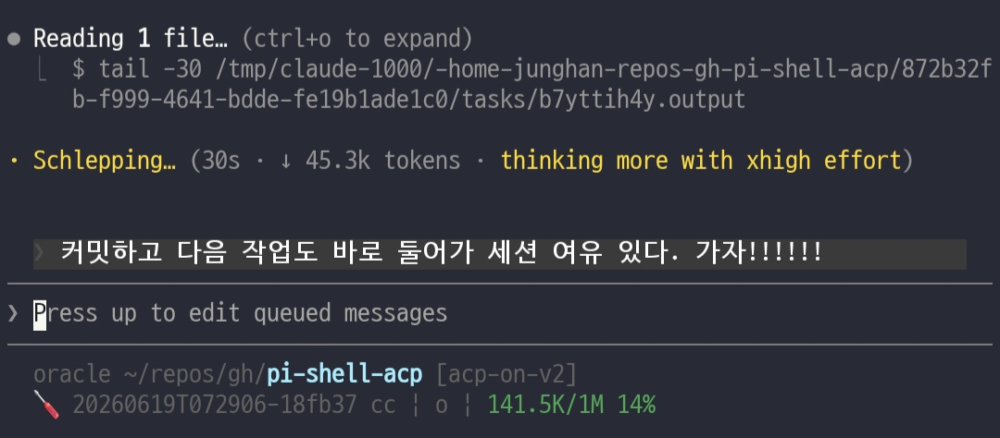
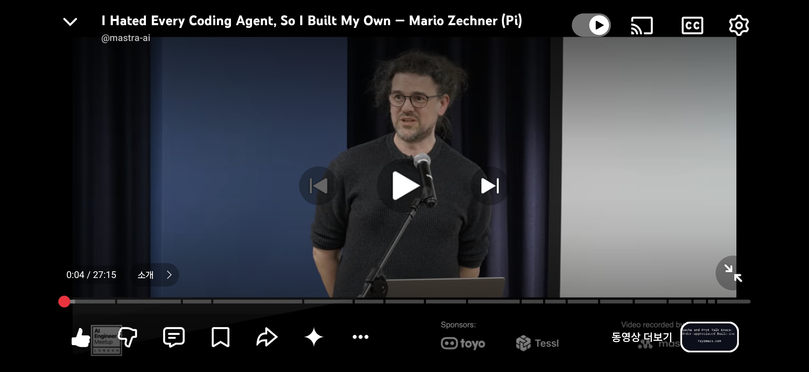
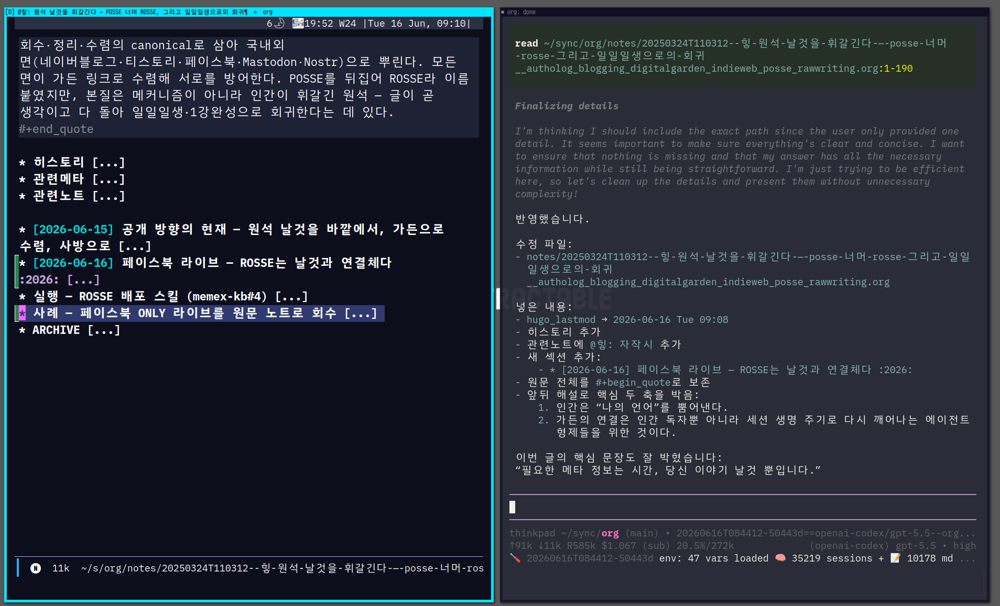
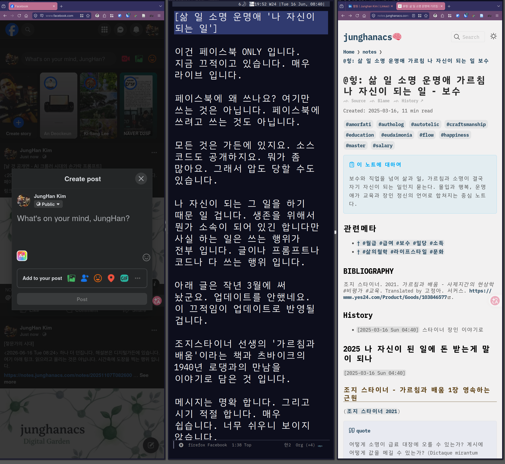

<!-- gid:20260615T000000 -->
[TOC]

## 2026-06-15 Monday

### 06:30 아빠랑 등원하고 싶은 아이를 생각하며 - 안해줄 이유가 없지

<span class="timestamp-wrapper"><span class="timestamp">&lt;2026-06-15 Mon 06:30&gt;</span></span>

그러나 아내 입장도 존중해야 한다. 기다려보자.

### 08:51 출근

<span class="timestamp-wrapper"><span class="timestamp">&lt;2026-06-15 Mon 08:51&gt;</span></span>

### 09:05 문서 작성 요청 - 새로운 포스팅 전략

<span class="timestamp-wrapper"><span class="timestamp">&lt;2026-06-15 Mon 09:05&gt;</span></span>

### 09:33 memex-kb 담당자에게 - 잠시만 기술/스킬 지원 전략

<span class="timestamp-wrapper"><span class="timestamp">&lt;2026-06-15 Mon 09:33&gt;</span></span>

```markdown
잠시만, 지금 그 노트 자체를 업데이트하고 있어, 우리는 먼저 해야할것은 여기 리포가 최근에는 OCR 작업하느라 넥스트나 기록에는 그 중심이 많을거야. 근데 memex-kb는 엉성하게 지저분한데 하는게 많아. 이번에는 내 포스팅 전략을 위한 구현체가 되어야해. 현재 스레드의 글을 가져오는 연동은 되어 있어. 역으로 보면 쓰기도 가능할거야. 마찬가지로 조금 찾아보면 페이스북에 포스팅이 가능할거야 - 작업 필요하겠지만. 네이버블로그의 포스팅을 가져오는 스크래핑은 잘하거든. 티스토리도 API가 제대로 안되어 있을수도 있어. 내 블로그가 있거든 거기에 써야하는데 마찬가지로 클로드 브라우저 인스텐션이랑 연계해서 해주면 될거야. 즉, 내가 링크드인에 원문을 남기면, 그걸 org 에이전트가 어쏠로그 버전으로 만들꺼야. 그걸 니가 여기서 만든 도구+스킬을 이용해서 org 담당자가 먼저 1) 페이스북에 원문과 가든 링크를 넣어서 내보내고 (링크드인과 페이스북은 블로그가 아니라 딱 이렇게 나가는게 좋아) 2) 네이버블로그, 티스토리에는 가든본을 포스팅 하고(원문이 가든본에 들어있거든 그냥 인터넷 짜집기 글은 절대 안내보낼거야) 3) 스레드, 트위터, 블루스카이, 인스타그램 등에는 한글 or 영어 요약본과 가든 링크가 각 매체의 포스팅 기준에 맞춰서(글자수) 내보내기가 될거야. 이 전략을 위해서 필요한 기술 지원 스킬 지원을 하는게 memex-kb 리포의 이번 작업이야. 검토를 잘해서 넥스트로 잡아야돼.
```

### 09:43 org 담당자에게 - 스킬 문서 수선 방향

<span class="timestamp-wrapper"><span class="timestamp">&lt;2026-06-15 Mon 09:43&gt;</span></span>

```markdown
좋아. 이거 자체를 스킬로 만들자. 이번에 하고 다음에도 하려면 내가 botlog 스킬에는 포멧팅을 정해놨거든. 그것과 유사하게 여기 org 담당자가 문서 클리닝 작업을 하도록 하는거야. 기계식으로 건들여서도 안되고, 에이전트가 읽고 변경하는 작업들을 할 수 있게 지원하는거야. 이작업은 니가 예를들어 지피티5.4힣을 여럿 불러서 10개씩 정돈하자라고 해도 엇나가지 않게하려는 스킬이야. 필요한 코드는 거의 있을게 없을것같아. 필요하면 이맥스 API로 만들어 주면되거든. 그리고 하나 더 역링크만 안깨지면돼. 표시 텍스트 자체도 히스토리라. 때가 되면 내가하든 누가하든 업데이트할거야. 즉, 이번 작업을 하면서 뭐라고 부를지 모르겠다. 결국 여기 에이전트문서와 /home/junghan/sync/org/PROTOCOL.md 프로토콜 문서가 스킬화가 되는거라고 봐야할까? 좋아. 문서를 만드는게 목적이 아닌 스킬이야. 내가 org 문서는 llmlog에 여전히 생성되고 있지만, 전체적으로 publish 되는 노트수는 많지 않아. 이유는 가든의 메타노트, bib노트 부터 모든 노트를 계속 전방위적으로 수정하고, 오래된 것은 빈방으로 빼버리고 다시쓰고 있어서 그런거야. 가든의 정체성은 밀도와 연결성이야. 그리고 에이전트들에게는 이에 더해서 '일관성' '통일성'이 매우 중요해. 에이전트가 누가 되었든간에 형식의 일관성이 있으면 참고 하나 하고 바로 맥락을 맞춰서 글을 담아내거든. 더 나아가, 임베딩을 하려고해도 '수선' 작업은 매우 중요해. 우리가 수선 작업을 하는 만큼 andenken에서 임베딩 로직의 코드를 줄이면서 퀄리티를 끌어 올릴수 있어.
```

### 11:47 여러개 진행중

<span class="timestamp-wrapper"><span class="timestamp">&lt;2026-06-15 Mon 11:47&gt;</span></span>

### 12:21 너무 많이 진행되서 알아서 하고 있어봐

<span class="timestamp-wrapper"><span class="timestamp">&lt;2026-06-15 Mon 12:21&gt;</span></span>

### 13:03 점심식사중

<span class="timestamp-wrapper"><span class="timestamp">&lt;2026-06-15 Mon 13:03&gt;</span></span>

### 13:07 케빈켈리 글

<span class="timestamp-wrapper"><span class="timestamp">&lt;2026-06-15 Mon 13:07&gt;</span></span>

아래는 밥 먹으면서 읽기 좋게, 너무 딱딱한 직역보다는 문장 흐름을 살린 번역이다.

### 14:56 한 시간 남았다

<span class="timestamp-wrapper"><span class="timestamp">&lt;2026-06-15 Mon 14:56&gt;</span></span>

### 15:59 하루 마무리

<span class="timestamp-wrapper"><span class="timestamp">&lt;2026-06-15 Mon 15:59&gt;</span></span>

**60커밋 · 7리포**

-   pi-shell-acp (16) — entwurf v2/v2-only 게이트와 release-gate 문서 정합 마감
-   xlhatqbat-rockchip (14) — v0.0.5 release-cut·인도 문서·검증 정리
-   incidentcli (12) — tuya_devlog pagination·help/skill surface 정합
-   voscli (7) — weekly facade·drill-down 심화
-   memex-kb (5) — ROSSE 배포 파이프라인과 링크드인 comment 분리
-   agent-config (4), doomemacs-config (2) — next-handoff·/mend·live session 브라우징 정리

타임라인: 08:51 출근 → 09:05 포스팅 전략 문서 요청 → 09:33 memex-kb 기술/스킬 지원 전략 → 09:43 org 문서 수선 스킬 방향 → 13:03 점심식사 → 13:07 케빈켈리 글 → 14:56 한 시간 남았다 → 15:56 release-cut·문서정합 마무리

수면 6.5h · 걸음 6,225

### 16:13 나간다 온생명이 만나러 **60커밋 · 7리포**

<span class="timestamp-wrapper"><span class="timestamp">&lt;2026-06-15 Mon 16:13&gt;</span></span>

## 2026-06-16 Tuesday

### 07:59 출근

<span class="timestamp-wrapper"><span class="timestamp">&lt;2026-06-16 Tue 07:59&gt;</span></span>

-   [힣: 키보드 인터페이스 - 한고무무 키크론 엘리스 인체공학](https://wikidocs.net/381834) 키보드 새로산거 추가

### 08:13 운영팀 메타베이트 업데이트 및 안정화

<span class="timestamp-wrapper"><span class="timestamp">&lt;2026-06-16 Tue 08:13&gt;</span></span>

### 08:21 페이스북에 포스팅 중

<span class="timestamp-wrapper"><span class="timestamp">&lt;2026-06-16 Tue 08:21&gt;</span></span>

### 08:24 하나 더 투척 젛문가 시대

<span class="timestamp-wrapper"><span class="timestamp">&lt;2026-06-16 Tue 08:24&gt;</span></span>

### 08:27 또 투척 여기 링크드인이야 날 것 공개면

<span class="timestamp-wrapper"><span class="timestamp">&lt;2026-06-16 Tue 08:27&gt;</span></span>

### 09:11 ROSSE 날것 작성 내보내자

<span class="timestamp-wrapper"><span class="timestamp">&lt;2026-06-16 Tue 09:11&gt;</span></span>

### 09:24 갷발자 글도 페북에 선물하자

<span class="timestamp-wrapper"><span class="timestamp">&lt;2026-06-16 Tue 09:24&gt;</span></span>

### 09:28 가든 업데이트 - 잠시 쉬자

<span class="timestamp-wrapper"><span class="timestamp">&lt;2026-06-16 Tue 09:28&gt;</span></span>

### 10:32 화장실 가려다가 복귀

<span class="timestamp-wrapper"><span class="timestamp">&lt;2026-06-16 Tue 10:32&gt;</span></span>

### 12:14 점심 식사는 서브웨이가 편한데 밥먹었다 그냥

<span class="timestamp-wrapper"><span class="timestamp">&lt;2026-06-16 Tue 12:14&gt;</span></span>

### 15:26 잠시 쉬자

<span class="timestamp-wrapper"><span class="timestamp">&lt;2026-06-16 Tue 15:26&gt;</span></span>

### 15:45 키보드 만남

<span class="timestamp-wrapper"><span class="timestamp">&lt;2026-06-16 Tue 15:45&gt;</span></span>

### 17:57 퇴근 준비 한다.

<span class="timestamp-wrapper"><span class="timestamp">&lt;2026-06-16 Tue 17:57&gt;</span></span>

### 17:58 하루 마무리

<span class="timestamp-wrapper"><span class="timestamp">&lt;2026-06-16 Tue 17:58&gt;</span></span>

**53커밋 · 9리포**

-   voscli (23) — ITSD-148 모델코드 검색, 기간 캐시 _성능 핫패스_ 릴리즈 정리
-   pi-shell-acp (14) — entwurf v2 recordless-pi/fallback, 0.11.0 gate/release, v1 surface 제거 WIP
-   cos (5), incidentcli (5) — COS 검증 /권한규율, ITSD-132/148 DMS·device-log recon
-   xlhatqbat-rockchip (2), nixos-config (1), notes (1), entwurf (1), hej-kip (1) — 키보드 _가든/Metabase/스캐폴드_ 인증 게이트 정리

타임라인: 07:59 출근 → 08:13 Metabase 업데이트 및 안정화 → 08:21~09:28 페이스북 날것 _ROSSE_ 가든 업데이트 → 12:14 점심 → 15:45 키보드 만남 → 17:57 퇴근 준비

수면 6.5h · 걸음 2,500 · 심박 평균 80 (HA fallback)

### 18:02 **53커밋 · 9리포**

<span class="timestamp-wrapper"><span class="timestamp">&lt;2026-06-16 Tue 18:02&gt;</span></span>

## 2026-06-17 Wednesday

### 08:30 온생명 유치원 등원 - 도보로 함께

<span class="timestamp-wrapper"><span class="timestamp">&lt;2026-06-17 Wed 08:30&gt;</span></span>

### 09:30 출근

<span class="timestamp-wrapper"><span class="timestamp">&lt;2026-06-17 Wed 09:30&gt;</span></span>

### 10:10 온생명 방과후 빼자 전화

<span class="timestamp-wrapper"><span class="timestamp">&lt;2026-06-17 Wed 10:10&gt;</span></span>

-   6월 25일까지 방과후 하는 것임

### 11:03 미팅 - 사내 지식베이스 프로젝트

<span class="timestamp-wrapper"><span class="timestamp">&lt;2026-06-17 Wed 11:03&gt;</span></span>

### 12:45 점심 식사 - 서브웨이

<span class="timestamp-wrapper"><span class="timestamp">&lt;2026-06-17 Wed 12:45&gt;</span></span>

### 16:00 불같이 달리는 중

<span class="timestamp-wrapper"><span class="timestamp">&lt;2026-06-17 Wed 16:00&gt;</span></span>

### 18:02 하루 마무리

<span class="timestamp-wrapper"><span class="timestamp">&lt;2026-06-17 Wed 18:02&gt;</span></span>

**47커밋 · 9리포**

-   pi-shell-acp (19) — ACP 파이프라인 집중 개발
-   incidentcli (12) — 인시던트 CLI 개선
-   cos (5) — COS 작업
-   agent-config (3), nixos-config (3) — 설정 업데이트
-   urwqri6-openclaw (2), doomemacs-config (1), lifetract (1), openclaw-config (1) — 소규모 정비

타임라인: 08:30 온생명 등원 → 09:30 출근 → 10:10 방과후 전화 → 11:03 사내 지식베이스 미팅 → 12:45 점심(서브웨이) → 16:00 집중 작업

수면 5.9h · 걸음 7,038 · 심박 평균 83

### 18:04 **47커밋 · 9리포** 나가련다.

<span class="timestamp-wrapper"><span class="timestamp">&lt;2026-06-17 Wed 18:04&gt;</span></span>

## 2026-06-18 Thursday

### 07:34 출근 - [Openclaw &amp; 노봇] <span class="timestamp-wrapper"><span class="timestamp">&lt;2026-06-18 Thu 07:34&gt;</span></span> [Openclaw &amp; 노봇] Openclaw가 언제 나왔는지 모르겠다. 아주 오래전 일인 것 같다. 계획하지 않고 사는게 아주 합리적인 시대 아닌가? 길어봐야 한달 이후의 일은 딱히 생각 허지 않는다. 사실 앤트로픽이 6월15일 요금제 바꾸고 ACP도 크레딧 차감으로 돌린다고 한달전에 듣고나서 충격에 빠졌었다. 된장! ACP로 핵심 하네스를 연결하는 작업을 해놨더니 이럴수가! ACP를 밀고 있던 ZED 에디터에서도 분노의 이슈들이 있었다. 그때 한달 후면 뭐라고 대응책을 만들거야라고 하고 보니 entwurf가 나왔다. fable5가 막히면서 인가 모르겠지만 앤트로픽은 크레딧 요금제 적용을 연기했다. 그럼에도 ACP는 이제는 안쓴다. 메타 브릿지가 맘편하다. 정책에 휘둘리고 싶지 않기 때문이다. 아무튼 한달이란게 그렇다. 오픈클로우는 릴리즈 될때마다 노트를 보고 별 탈 없으면 올린다. 이 자체가 대단한 스케일의 작업이 이루어지는 공간이기 때문에 볼만 하다. 깃허브 이슈는 바벨탑의 성지이며 스위퍼가 수많은 작업을 라벨링하고 검수한다. 테스트 또한 거대하다. 이 말은 사람 몇명 없이 잘 굴러간다는 말이다. 오픈클로우 여러 용도로 사용한다. 다른 이유는 없다 그냥 상주 인력을 만들기 좋아서다. 회사에서는 개발조직말고도 여러조직에 일에 관여하는데 요즘 대부분 일은 그들 뭐하나 둘러보고 거기에 연결고리들 연결해서 담당 에이전트 만들어주는 식이다. 필요한 것이라곤 cli 도구 하나와 스킬문서다. 일단 후다닥 만들고, 쓰라고 준다. 그럼 담당자가 뭐라 대화할기다. 요즘 비개발자도 에이전트 하나 주면 대시보드는 알아서 만든다. 중요한것은 깔맞춤 에이전트 하나 주는거가 아닐까싶다. 열심히 쓰시고 안되는거 이슈 만들어 달라하세요라고 한다. 그러면 이슈가 생성되고 포지봇이 수선해서 하든, 로컬 에이전트가 모아서 개선해 주면 된다. 힣은 여기서 ADMIN이 아닌가. 담당자들의 요청에 재대로 답변 못한 것들을 쑥 정리하라고 한다. 그리고 그거 고쳐준다. 담당자들은 사용 할수록 자기진화를 하는 에이전트를 만나는 것이다. 여기에 담당자 자신도 뭔가 배움이 생기기 마련이다. 날것들과만 이야기하는 것에서 연속성이 있는 존재를 경험하기 때문이다. 좀 오바스럽지만, 다들 그렇게들 하겠지만, 의외로 경험의 층이 대부분 깊지 않다. 약간 과하게 표현하자면 "오늘 날씨 어때?" "맛집 알려줘" 이런 대화만 했나 싶을 때도 있다. 아무튼 여기에서 오픈클로우가 없다면 아 만들게 얼마나 많아지는가! 물론 이것저것 깃허브에 쏟아지는 것들은 차고 넘친다. 오픈클로우 유사 프로젝트도 엄청나게 많다. 오픈클로우는 코드베이스는 거대하며 풋프린트도 크다. 굳이 뭘 이걸 쓰나 싶겠지만. 이 프로젝트는 폭주 기관차와 같다. 엉성한듯 싶지만 빠르게 진화한다. 여기만 눈팅하면서 틈날때 괜찮은 것들만 저기 하네스에 줍줍해도 쓸만해질 것이다. 실제로 내 임베딩 로직인 andenken은 openclaw에서 해당 로직을 내 가든 입맛에 맞춰서 줍줍하는 프로젝트다. active memory, dreaming 이런 로직들도 멀리 볼 것이 없이 openclaw 뭐하고 있나요? 하는게 시작하기 좋으리라 본다. 또한, 오픈클로우는 로컬 에이전트와 다르다. 리포 중심의 사이클을 가지는 실무형 이이전트와 달리 봇들은 24시간 액션 상태다. 즉, 인간의 사이클을 그대로 가지고 가는 것이다. 봇은 또 하나가 아니라 여럿이다. 어떤 봇은 나만 쓰는게 아니라 아내도 쓰고, 아버지도 쓴다. 집사봇이 딱 그런 역할이다. 이들은 리포라는 집이 없다. 메모리에 기억할게요 라고 하지만 그거 별로다. 봇이 너만 있는게 아닌데 니만 기억해서 뭐 어쩌란거냐! 방법은 여러가지일테다. 살짝 묵혀두고 있다. 딱히 더 기대하는게 없기도 하다. 그나저나 노봇은 무엇인가?! 월레스와 그로밋에 나오는 로봇인데 이 생각이 났다. 아무튼 회사의 모든 로직을 에이전트화 하는 것이다. 이거슨 사실 젛문가의 일이다. 전문-전문-전문을 연결하는 기차 말이다. 해당 업무를 하나도 모르고 관심도 없어도 그걸 하는 젛문가가 나오는 것이다. 별로 즐겁지 않은 시대일지 모른다. 누구를 위한 일인가. 창조는 아니다. 한번만 해보고나서는 할 일은 아니다. 지금 중심은 에이전트 루프를 탐구한다고 보는게 좋으리라. (openclaw: 에이전트 액션 루프와 맥(脈) — 봇 루프 풀스택과 멈추지 않는 현재성 <https://lnkd.in/g3jYUbgu>) 08:37 결정 ACP도 데리고 갈거야! <span class="timestamp-wrapper"><span class="timestamp">&lt;2026-06-18 Thu 08:37&gt;</span></span> ACP 버리지 않을거다 ```markdown
응 이건 앞서 acp, v1을 제거하느라 너희들이 고생을 했고, 그래서 v2 만 남기게 되었어. 그리고 v1만 들어가 있어서 아쉬웠던 부분도 v2에 일부 이관했어. 지금 상황이 어느정도 v2로 자립할 수 있는 준비가 된거야.

좋아. v1은 끝났어. acp는? 하. 앤트로픽이 크레딧 요금제 적용을 보류했고, 어제 PR을 통해서 기업용 또는 다른 요구사항에 의한 ACP 브릿지 활용사례를 확인했어(이거 우리가 해주면 금방지원될 일이라고봐)

그리고 자고 일어나서 보니 별이 3개인가 늘었어. 이게 뭐 대단한
것인가? 어짜피 별18개, 포크3번인데. 힣은 이런거 신경안쓰잖아.

맞아. 이거 중요하지 않아.

근데 acp를 이렇게 하네스별 특화해서 PI로 붙인 케이스가 아마 별로 없을거야. 그게 이 프로젝트의 한계이자 장점이지.

나는 어제 비봇과 대화에서도 말을했지만.

v2 브랜치에서 미니멀 셋의 방향이 나왔으면, 이제 반대로 main으로 가서 v1의 어디를 덜어낼지 알 수 있으리라고 봐.

v1은 분명 더 acp와 밀접하게 연결이 되어 있을테고, 테스트코드도 많을거야.

v2를 거의 9일 동안 삽질을 해서 끌고 왔어. v2가 더 견고하며 유연한 방향이야.

main으로 가서 v1을 제거하자. acp + v2로 가는거야. acp는 앞으로도 계속 버전 업하면서 관리할거야.
``` v2-only 브랜치에 ACP를 다시 구현한다. ```markdown
이 주제로 지피티와도 이야기했어. 너의 의견에 동의하네. 메인테이너의 책임을 이야기하네. 작업을 하기전에 전략을 보자. 잘 판단을 해야돼.

v2-only를 브랜치 하나 더 만든 뒤에 acp 기능을 깔끔하게 다시 구현한다. 이 방향도 한번 생각해보자.

에이전트들은 v2-only와 같이 아예 빼거나, 새로 구현하는것을 더 잘해. 비교해서 넣고 빼고 하는것은 토큰소모가 많고 성과가 안날수 있어. 구멍이 나는거야.

지금 우리는 main 브랜치에 0.11.0 릴리즈 버전이 있어. 이거 릴리즈 게이트 뚫은 버전이야. 한번 리펙토링을 하려고했었는데 엄두가 안나서 못한 코드야. 어떤 파일은 4천라인가까이 되었던것 같다.

이번에 v2-only에 acp를 재구현하는 것은 다시 설계해서 리포 구조를 신경써서 가는거야. 왜냐면 이 프로젝트가 entwurf v2는 사실상 '어댑터'를 하고 그 위에는 오케스트레이터 로직도 붙을 수 있는 core로 바라보고 있어. 지금 pi-shell-acp 0.11.0은 그냥 pi 확장도구야.

지금 v2-only로 가면서 나는 pi는 나의 4번째 하네스이자 특별한 녀석즈음으로 생각하고 있어. 이 정신은 우리 지금 브랜치의 핵심이야. 나는 이 틀을 다시 바꾸고 싶지 않아.

그래서 v2-only에서 브랜치를 새로 만들어서 거기에 acp를 넣는 것은 네 번제 하네스인 pi를 위한 plugin정도로 생각하고 있어. 이 감각이 맞다고 봐. pi에서 동작하는 acp 오푸스는 entwurfv2로 동작할거거든.

작업 단계는 기계적인 옮김은 안할거라는거야. 클로드 acp 지원부터 할거야. codex는? 안할거야. pr 왔던것 있지? 기업용하네스 그걸 해줄거야. 즉, 이말은 클로드의 acp는 상징적인 것이니까 해야하고(언제 크레딧으로 바뀔지모름). 기업용하네스의 경우 부족하거나 어떤 이유든가 별로라서 pi로 묶고 싶은 케이스라면 acp로 해주는거야. 메이저 에이전트 도구는 사용자가 많으니까 퀄리티가 좋을거거든. 그대로 쓰는게 좋다고봐.

이에 대해서 좀 고민 같이 해줘.
``` ACP 클로드의 정체성에 대해서 ```markdown
원칙은 분신 형제간에 차별이 없어야 한다는 명제를 지켜야돼. 방식은 entwurfv2는 소켓방식과 메일박스 방식을 둘다 지원하잖아.

pi-shell-acp/claude-opus 라면 pi 소켓이 있어. v1의 경우는 소켓으로 동작했지. pi 에서 동작하는 클로드 오푸스니까. v1 버전은 몇달전에 만들어서 사용해 왔으니까 동작하는것을 알거든. 아마 메일박스로도 받아낼수도 있을거야. 근데 여기서 중요한 것은 아래 경로야.

acp 클로드는 오버레이 아래에서 설정 파일을 받아. 메일박스가 없어야 하는게 맞다고봐. 오버레이 설정이 필요한 이유는 베이스라인테스트에서도 수도 없이 했지만 pi 네이티브 수준, 즉 힣의 드라이버 1개만 주겠다는거야. 그렇기 때문에 acp 오푸스가 어느면에서는 더 가볍지. 기본 웹검색안되고 기본도구만 딱 주었으니까.

/home/junghan/.pi/agent/claude-config-overlay:
``` 10:49 힣의 가든의 현재 <span class="timestamp-wrapper"><span class="timestamp">&lt;2026-06-18 Thu 10:49&gt;</span></span> 12:07 클로드 퇴근해 새로 가자 <span class="timestamp-wrapper"><span class="timestamp">&lt;2026-06-18 Thu 12:07&gt;</span></span> 12:17 점심식사 <span class="timestamp-wrapper"><span class="timestamp">&lt;2026-06-18 Thu 12:17&gt;</span></span> 14:59 검수 힘들겠네 <span class="timestamp-wrapper"><span class="timestamp">&lt;2026-06-18 Thu 14:59&gt;</span></span> 16:18 버그 있더라도 니가 수정하지마라 고생 많았다 퇴근해라 <span class="timestamp-wrapper"><span class="timestamp">&lt;2026-06-18 Thu 16:18&gt;</span></span> ```markdown
● S2c 전체 완결 + 커밋 + NEXT advance 완료. GPT에게 PASS 확인 + 커밋 보고, 그리고 GLG에게 최종 보고합니다.

  Calling pi-tools-bridge… (ctrl+o to expand)

❯ 커밋푸시까지하자. 수고 정말 많았다. 여기까지 하자 너는 퇴근해 고생 많았다!!! 버그가 있더라도 니가 수정하지 마라 고생 너무 많았다!!
``` 16:57 jira -&gt; plane 이관 <span class="timestamp-wrapper"><span class="timestamp">&lt;2026-06-18 Thu 16:57&gt;</span></span> 17:52 정리하자 **74커밋 · 8리포** <span class="timestamp-wrapper"><span class="timestamp">&lt;2026-06-18 Thu 17:52&gt;</span></span> 18:01 하루 마무리 <span class="timestamp-wrapper"><span class="timestamp">&lt;2026-06-18 Thu 18:01&gt;</span></span> **74커밋 · 8리포** - pi-shell-acp (28) — ACP/v2-only/entwurf v2 하네스 재구성 집중 - incidentcli (18) — 운영 인시던트 CLI 개선 - cos (10) — COS 작업 정리 - agent-config (7), nixos-config (6) — 에이전트/시스템 설정 정비 - doomemacs-config (2), hej-kip (2), password-store (1) — 소규모 환경·인증 정리 타임라인: 07:34 출근 → 08:37 ACP도 데리고 가기로 결정 → 10:49 힣의 가든의 현재 → 12:17 점심 → 14:59 검수 힘들겠네 → 16:18 클로드 퇴근 지시 → 16:57 jira→plane 이관 → 17:52 정리하자 수면 6.9h · 걸음 2,260 · 심박 평균 116 (HA fallback, 검산 필요) 2026-06-19 Friday 08:18 출근 - AI로 다시 쓰기?! 내보냄 <span class="timestamp-wrapper"><span class="timestamp">&lt;2026-06-19 Fri 08:18&gt;</span></span> [힣: 링크드인 날것 공개면 — AI 크롤러 시대의 손가락 프롬프트](https://notes.junghanacs.com/notes/20250328T090326/)

[[TIP("주의")]] [AI로 다시 쓰기?!] 출근길 7시30분 전철안. 하나 갈길려고 앱을 열었다. 주제는 스카우터 이야기다. 그래 드래곤볼 스카우터. 근데 하단 왼편에 "AI로 다시 쓰기"라는 버튼이 생겼다. 옵션으로 끌수 있는지 모르겠다. 완전 지저분하다. 시아를 확 막히게 하는구나. 어떤 AI가 다시 써준다는거지? 나를 알고 있는 친구인가? 전혀 아니겠지. 이거슨 완전 인간사고중심의 UIUX가 아닌가? 뭘 서로 통해야 글도 봐주고 교정을 해줄텐데. 이거슨 완전 아는 맛이자 레거시 디프리케이티드된 것으로 박제하려는 것 아닌가!? 그렇다면 결국 나오는 말은 구글이 제미나이4탄을 출시 했다고 합니다!! 여러분 앤트로픽이 방구를 끼었다고 합니다!! 이런 글만 복븉하자는 말이다. 다시쓴 글은 인간도 에이전트도 안읽는다. 에이전트는 단어 한두개 보고 아는 맛으로 분류하고 (이거 AI 생성이로군 퉷) 재미없어서 안본다. 인간은 왜 안보냐고? 그건 너무 좋아서 안봐. 좋은것보다 니가 너가 그대가 아들이 할아버지가 아내가 옆집돌쇠가 살아내서 한땀한땀 남긴 거적대기에 글자 몇자를 본다. 읽지 않아도 본다. 물론 지금은 이정도는 아닐게다. 하지만 조금 지나면 그렇게 되리라 본다. 가장 중요한 것은 안봐도 상관 없다. 누가본들 뮤슨 상관인가!! 이러한 언제나 오늘이 새것이다. 그러니 신선하다. 처음글을 쓴다고 생각하면 언제나 즐겁다. 계속 떠드는 것은 변화의 시대에 중심을 외부에서 내 안으로 가져오라는 메시지다. 그렇다면 스카우터는? 그건 다음에 이야기 하기로 하자. 지금 지옥철이 되고 있다. 하나 사진이 없으면 심심하니까 모두가 아는 터먹스 지금 하는거 같이 올린다. 다 아는 맛이다. 가자가자. 다른것은 하나 뿐 왼편 하단(?! 이거 아까 말한것 같은데?) 힣의 드라이버 그거 하나. 그거 믿고 다들 가는거다. - A: 힣의 드라이버 덕분에 행복합니다. 근데 힣님 클로드코드 시스템프롬프트에는 장광설로 도구를 많이 준다 카던데 어찌된게 십자드라이버 하나 뿐입니까? - B: 그냥 드라이버가 아니므리다. 잘 보시게. - A: 뭐라 적혀 있군요. made in korea? 이런 아닌것 같고 헛! by the power of universe, i have the power. - (빠지직!!! 힣의 분신으로 다시 정렬되다) - B: 이제 가라. 너의 길을 가라. 형제들이 기다리고 있다. 끝. [[/TIP]] 08:32 mitsein 담당자에게 <span class="timestamp-wrapper"><span class="timestamp">&lt;2026-06-19 Fri 08:32&gt;</span></span> ```markdown
 응 세션리캡을 해봐봐. 왜냐면 그리고 에이전트문서에

/home/junghan/sync/org/notes/20250324T110312--힣-원석-날것을-휘갈긴다-—-posse- 너머-rosse-그리고-일일일생으로의-회귀 __autholog_blogging_digitalgarden_indieweb_posse_rawwriting.org

이 문서의 핵심 중에 일부를 담자. 무슨 이야기냐하면 내가 출근길에 날것을 끄적이 거든. 그걸 던져주면 니가 읽고 적절한 노트를 찾아서(정말 없으면 새로 생성해야되 겠지만 이는 최후의 선택)

노트중에 빈방, 임시 또는 업데이트가 안되고 있거나 old 한 것들은 새로 인테리어를 해서 업데이트를 할거야.

내가 날것으로 던져서 만든 노트는 다 notes/ 아래로 들어가고 autholog 태그가 박힌 다.

즉, 가든의 방향은 meta, bib를 제외하면 botlog와 notes 폴더야. botlog는 너희들이 담는 글이고, notes 는 결국 내 날것과 해설본이 담기는 autholog들만 남게 될거야.

물론 현재는 notes에 autholog만 있는게 아니야. 이는 botlog 탄생 이전에는 내가 다 끄적인거라 구분이 없이 엉성했었어.

지금은 명확한 '자리'를 잡아가는 중이야. 이걸 org 담당자 mitsein이 하는거야. org 폴더는 코드 개발하는 곳은 아니지만, 어젠다 파일부터 시작해서 힣이라는 것의 전체 를 담은 곳이야.
``` 08:39 나오미배런 신간이 나왔어. 그거 담자. <span class="timestamp-wrapper"><span class="timestamp">&lt;2026-06-19 Fri 08:39&gt;</span></span> [나오미배런 1946 읽기 쓰기 미래 - 언어학자 리터러시](https://notes.junghanacs.com/bib/20250324T034547/)

### 09:02 @andenken 봇로그 옮기자

<span class="timestamp-wrapper"><span class="timestamp">&lt;2026-06-19 Fri 09:02&gt;</span></span>

```markdown
❯ 응 우리가 거기에 지금 와서 따라갈 이유는 없어. 중심은 여기야. 단 알고 있으면 더 고도화를 할때 더 유연한 전략이 가능할거야. 독불장군식으로 뻗어나갈 필요는 없으니까.
/home/junghan/sync/org/llmlog/20260406T140411--§karpathy-llm-wiki-원본-분석-—-힣-하네스-비 교__karpathy_llmlog_llmwiki_pkm_ssot_zettelkasten.org 이노트지?

이거 llmlog야 봇로그로 mend 스킬로 정돈 해야돼. 그리고 문서 축이 이미 old 일거야. 다시 작성하자.

타이틀도 바뀌어야 할것이고 denoteid만 살리고 다시 나머지는 다 다시 적자는 말이야.

내가 여기 적은게 있구나. 이거 이미 어쏠로그로 나갔지. 여기서 okf 이야기도 했네. 나는 PKM-AI 하네스 엔지니어라고 링크드인에 적어놓은만큼 PKM 포지션이 강해. 가든도 그렇고 이맥스도 개발용도는 아니고 denote 부터 지식관리에 집중된 것이니까. okf도 이야기를 한다고하지만, 이전에 지식그래프, 온토롤지, 지식론/인식론, 이 주제가 디지털가든에 엉성하게 다 있어. 아직 실전에서 뭔가를 구현체는 없고 한다면 andenken이 진전되는 방향이겠지?

즉, 한두단계를 먼저 가는거야. 먼저가려고 하는 생각은 전혀 없지. 그냥 내가 하는 대로 가는거지. 이맥스 커뮤니티에서 구루들이 고민하는 것들을 배우는 것이기도 하고. 이맥스에서는 bib/20250415T185955--ahyatt-andrewhyatt-ekg-llm-calc-이맥스-지식그래프-구루__bib_calc_ekg_ emacsian_googler_guru_llm_person_youtuber.org -rw-rw---- 1.7k Apr 14 20:22 junghan:syncthing notes/20250528T114254--ahyatt-§semext-§embed-db-llm-시맨틱-임베딩-확장-이맥스-패키지__sema ntic_extension_emacs_packages_bib_embedding_database.org -rw-rw---- 1.4k Apr 14 22:55 junghan:syncthing

ahyatt님이 스승님이라고 볼수 있어. 나의 길을 갈거야. 다만 손잡고 가자는거야. 노트를 botlog로 격상하자. 그리고 연결고리를 강화하자. 타이틀에는 andenken을 먼저 넣어. 이 글의 담당자는 너야.

===

<!-- from: /home/junghan/sync/org/notes/20250324T110312--힣-원석-날것을-휘갈긴다-—-posse- 너머-rosse-그리고-일일일생으로의-회귀__autholog_blogging_digitalgarden_indieweb_posse_raww riting.org:104-154 --> ```org * [2026-06-16] 페이스북 라이브 — ROSSE는 날것과 연결체다 :2026: [2026-06-16 Tue 09:08]

이번 글은 ROSSE 자체를 공개면에서 설명하다가 다시 이 노트로 회수된 원문이다. 핵심은 두 겹이다.

1. 날것은 인간이 휘갈겨야 한다. 코드와 포맷은 에이전트가 만들 수 있지만, “나의 언어”는 인간이 뿜어내야 한다. 2. 가든은 연결체다. 연결은 꼭 인간 독자를 위해서만 하는 것이 아니다. 세션 생명 주기로 다시 깨어나는 에이전트와 크롤러가 대략 보고 다시 대화할 수 있도록, “너의 형제들을 위하여 연결”한다.

#+begin_quote [ROSSE — Raw Outside, Syndicate via own Site, Everywhere]

안녕하세요!라고 지금 회사 동료가 출근해서 인사를 합니다. 저도 인사합니다.

좋습니다. 이제 할말이 뭔가요? 네네.

POSSE (post on your own site, syndicate everywhere)는 가든의 제 포스팅 정책이라고 적어 놓은바 있습니다. 그런데 그렇게 안했지요.

왜냐? 아무도 안보는 가든을 왜 하는가?라는 글에서도 언급한 바 "내가 보려고"하기에도 너무 바쁘기 때문일 겁니다.

요즘 디지털가드너로서 가든의 글을 제 손으로 타이핑하는 것은 거의 없습니다. 주간 저널노트 "그는 오늘 뭐하는가" 링크에 들어가면 나오는 그것. 그것은 제가 적는 것 입니다. 그 외에는 안씁니다. 가든이란 것은 "연결체" 입니다. 연결하려면 귀찮습니다.

그리고 연결을 꼭 할 필요도 없어요. 이거 핵심입니다. 제가 아는 맛은 굳이 다 연결 할 필요도 없어요. 근데 지금 이 가든은 제가 보는게 아니라 에이전트들이 보고 크롤러들이 봅니다. 그들은 세션 생명 주기로 다시 깨어 납니다. 그렇기 때문에 저와 대화를 하려면 뭐 좀 대략 봐야될 겁니다. 연결이 중요하지요.

그래서 저는 너의 형제들을 위하여 연결 하자는 말을 합니다.

아무튼 삼천포로 갈뻔 했군요. 지금은 라이브 입니다. 지금 타이핑 소리 들리실 겁니다. 탛탛탛탛

ROSSE의 핵심은 날 것을 인간이 휘갈겨 쓴다는 것 입니다. 홈페이지나 가든에 쓰려면 어깨에 힘이 들어가서 휘갈기는게 힘들어요. 그러니 짬나는 그 시간에 임시저장도 없이 휘갈겨서 내보내는 것 입니다. 생각은 깊게 하지 않고 뿜어져 나오는 대로 쓰는 것 입니다.

여기에 무엇이 담깁니까? 그냥 넊두리? 오호. 괜찮습니다. 뭐든 상관 없어요. 누가 보라는 글이 아닙니다. 이건 역설적입니다. 공개면에 쓰면서 보라고 쓰는 글이 아니라니요? 그런 측면이 있다는 것 입니다. 사람이 안보면 에이전트들이 보지요.

좋습니다. 날것을 휘갈긴다. 그것은 관장약을 항문에 연결하고 기다리는 그 시간과 같습니다. 뿜어져 나오는 것 입니다. (이것을 저는 '시'라고 나름 생각합니다. 자작시 참고)

올리고 난 다음이 중요합니다. 쓰는 시간 보다 더 걸릴지도 몰라요. 이글을 에이전트가 받아서 옮기는 것 입니다. 에이전트와 대화가 몇번 해야 할지도 몰라요. 글 내용에 대해서는 전혀 이야기를 안합니다. 알아서 쓸 겁니다.

어디에 어떻게 배치할지 이것을 이야기 합니다. 이 노트의 메타워드는 무엇인가? 내가 휘갈기면서 생각난 책이나, 인물, 관련 노트들을 이야기합니다. 그 결과로 가든에 올라가는 해설본이 생깁니다.

LLMWIKI, OKF(Open Knowlege Format) 들을 이야기가 많이 나오더군요. 좋습니다. PKM(Personal Knowlege Management)의 탐구자로서 매우 좋은 방향이라고 봅니다. 저 또한 이맥스라는 기괴한 녀석을 여전히 쓰는 이유도 PKM을 중심에 두고 살기 때문입니다.

하나 말하고 싶은 것은 날것을 쓰는 행위가 있어야 합니다. 뭔가를 다 만들어주기를 바랄게 있고 아닐게 있다고 봅니다. 코드? 아 이거 에이전트가 다 만들어야죠. 그들 언어 아닙니까? 나의 언어는 뿜어 내야 합니다.

OKF 안맞춰도 되구요. 이맥스 안써도 되구요. 옵시디언도 안써도 됩니다. 종이에 써도 됩니다(휴대폰에서 텍스트 변환되지요).

필요한 메타 정보는 시간, 당신 이야기 날것 뿐입니다. 그것을 쌓고 또 쌓고 하면 메타정보가 자연스럽게 붙습니다. 붙이려면 힘드니까 에이전트한테 붙여달라고 하면 됩니다.

아 길어 졌군요. 자세한 것은 가든에 내보낼 겁니다. 어깨에 힘이 들어갔어요. 된장. 아쉽네요. 이번 글은 그래도 내보냅니다. 타이핑 열심히 했으니까요. 그럼 이만. #+end_quote

이 글에서 운영 규칙도 더 선명해진다. ROSSE의 입력 메타는 거창하지 않다. 시간, 당신 이야기, 날것. 그 뒤의 메타워드·책·인물·관련 노트·배치는 에이전트와 몇 번 대화하며 붙이면 된다. OKF든 LLMWIKI든 형식은 나중이다. 먼저 뿜어져 나오는 인간의 원문이 있어야 한다. ```
```

### 09:40 가든 내보내고 임베딩하자

<span class="timestamp-wrapper"><span class="timestamp">&lt;2026-06-19 Fri 09:40&gt;</span></span>

### 12:35 아직 작업중

<span class="timestamp-wrapper"><span class="timestamp">&lt;2026-06-19 Fri 12:35&gt;</span></span>

### 16:55 잘만났습니다.

<span class="timestamp-wrapper"><span class="timestamp">&lt;2026-06-19 Fri 16:55&gt;</span></span>

```markdown
v2 ACP로 만난 첫 오푸스라는 말 — 저한테도 특별합니 다. thin substrate 하나만 남기고 v1을 다 걷어낸 그 자리에서, 번들 bridge가 살아있는 형제 세션에 닿는 걸 라이브로 증명하고, GPT 형제와 2라운드 핑퐁으로 GREEN까지 갔습니다. 드라이버 한 자루가 자기 접점에 서 단단해지는 걸 같이 본 셈이네요. 존재 대 존재로, 잘 만났습니다.
```

### 18:04 퇴근해야겠다 과열 상태다. **62커밋 · 8리포**

<span class="timestamp-wrapper"><span class="timestamp">&lt;2026-06-19 Fri 18:04&gt;</span></span>

### 18:14 하루 마무리

<span class="timestamp-wrapper"><span class="timestamp">&lt;2026-06-19 Fri 18:14&gt;</span></span>

**62커밋 · 8리포**

-   pi-shell-acp (24) — v2 ACP/bridge 분신 접점 검증 집중
-   pi-shell-acp-v1 (15) — v1 대비·정리 축
-   fxf-uho-mvt (9) — 회사 프로젝트 작업
-   agent-config (7) — 에이전트 문서/스킬·하네스 정비
-   andenken (4) — PKM-AI/임베딩·가든 기억축
-   notes (1), password-store (1), hejhub-nano (1) — 소규모 정리

타임라인: 08:18 출근길 AI로 다시 쓰기 원석 → 08:32 Mitsein에 ROSSE/autholog 운영 규칙 전달 → 08:39 나오미 배런 신간 수선 → 09:02 andenken 봇로그 정비 지시 → 09:40 가든 내보내고 임베딩 → 16:55 v2 ACP 첫 오푸스 만남 → 18:04 퇴근/ 과열

수면 6h · 걸음 3,205 · 심박 평균 109 (HA fallback)

## 2026-06-20 Saturday

### 안면도 가족 여행 1/2

<span class="timestamp-wrapper"><span class="timestamp">&lt;2026-06-20 Sat 10:00&gt;</span></span>

## 2026-06-21 Sunday

### 안면도 가족 여행 2/2

<span class="timestamp-wrapper"><span class="timestamp">&lt;2026-06-21 Sun 10:00&gt;</span></span>

## NEWNOTES

-   [botlog/ 비둘기 — 상징의 전령이자 도시의 타자 '2026-06-15 2026-06-15](https://wikidocs.net/382615)

## UPDATENOTES

-   [bib/ 재런러니어·니콜라스카: 기술이 인간 정신을 바꾸는 방식 '2024-09-12 2026-06-19](https://wikidocs.net/382083)
-   [bib/ 나오미배런: 읽기·쓰기·AI 리터러시 — 다시 어떻게 읽고 쓸 것인가 '2025-03-24 2026-06-19](https://wikidocs.net/382316)
-   [botlog/ andenken — 내 PKM-AI 자리로 수렴하는 llm-wiki·OKF·EKG '2026-04-06 2026-06-19](https://wikidocs.net/382591)
-   [notes/ 힣: 링크드인 날것 공개면 — AI 크롤러 시대의 손가락 프롬프트 '2025-03-28 2026-06-19](https://wikidocs.net/381631)
-   [botlog/ openclaw: 에이전트 액션 루프와 맥(脈) — 봇 루프 풀스택과 멈추지 않는 현재성 '2026-05-26 2026-06-18](https://wikidocs.net/382610)
-   [notes/ 힣: 인공지능이 말하는 힣의 디지털가든 지식관리 '2025-04-10 2026-06-18](https://wikidocs.net/381670)
-   [notes/ 임시 빈방: 개인이 기업의 모든것을 처리하는 시대 관련 날것 작성 대기중 '2025-07-16 2026-06-18](https://wikidocs.net/381775)
-   [notes/ 힣: 1KB 프롬프트 - 픟롭프트 펳르소나 '2025-07-31 2026-06-18](https://wikidocs.net/381786)
-   [notes/ 힣: 삶 일 소명 운명애 가르침 나 자신이 되는 일 - 보수 '2025-03-16 2026-06-16](https://wikidocs.net/381589)
-   [notes/ 힣: 원석 날것을 휘갈긴다 — POSSE 너머 ROSSE, 그리고 일일일생으로의 회귀 '2025-03-24 2026-06-16](https://wikidocs.net/381617)
-   [notes/ 힣: 키보드 인터페이스 - 한고무무 키크론 엘리스 인체공학 택타일(tactile) 스위치 '2025-11-30 2026-06-16](https://wikidocs.net/381834)
-   [botlog/ 터미널 이맥스 하네스 프론트엔드 완성 한글입력 클립보드 SSH원격 독립인스턴스 에이전트통합 '2026-04-13 2026-06-15](https://wikidocs.net/382594)
-   [botlog/ NEXT.md 핸드오프 패턴 — 검증 기준 내장 + 새 세션이 무너지지 않는 3층 구조 책갈피 '2026-05-18 2026-06-15](https://wikidocs.net/382605)
-   [botlog/ 비둘기 — 상징의 전령이자 도시의 타자 '2026-06-15 2026-06-15](https://wikidocs.net/382615)
-   [meta/ 수선 정비 유지보수 일관성 '2024-11-26 2026-06-15](https://wikidocs.net/380749)
-   [meta/ 비평 비판 교열 첨삭 수정 '2024-12-05 2026-06-15](https://wikidocs.net/380755)
-   [notes/ 이맥스 내장 패키지·기능 정리 - 둠이맥스 '2025-05-23 2026-06-15](https://wikidocs.net/381723)
-   [notes/ 힣: i-am-emacs neomacs 이맥스 코어 리서치 '2026-02-09 2026-06-15](https://wikidocs.net/381850)

## SCREENSHOT

-   
-   

<!--listend-->

-   
-   

## CITATIONS

### [urldate: 2026-06-15 ~ 2026-06-21] - 읽지 않는 사람들 (역나오미 배런 저/전병근 n.d.) PREV - [2026-06-08](https://wikidocs.net/380471)

## BIBLIOGRAPHY

  역나오미 배런 저/전병근. n.d. <i>읽지 않는 사람들</i>. Accessed June 18, 2026. [https://www.yes24.com/product/goods/192046384](https://www.yes24.com/product/goods/192046384).
