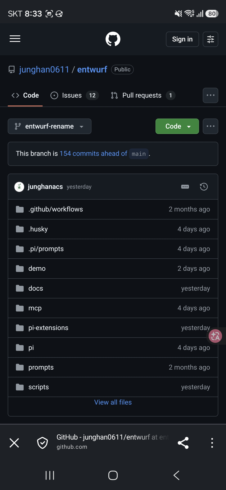
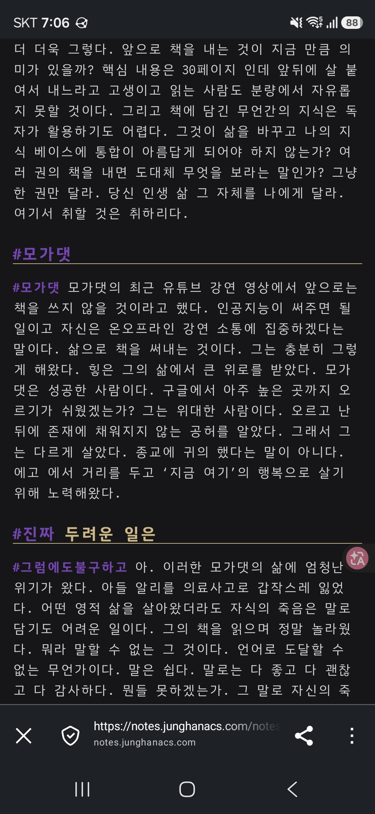
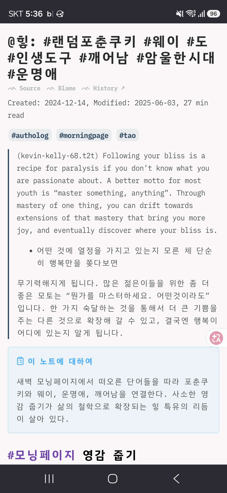
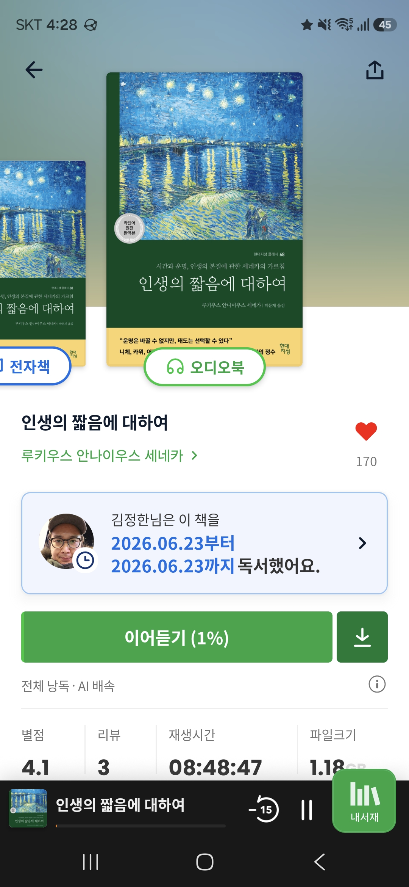
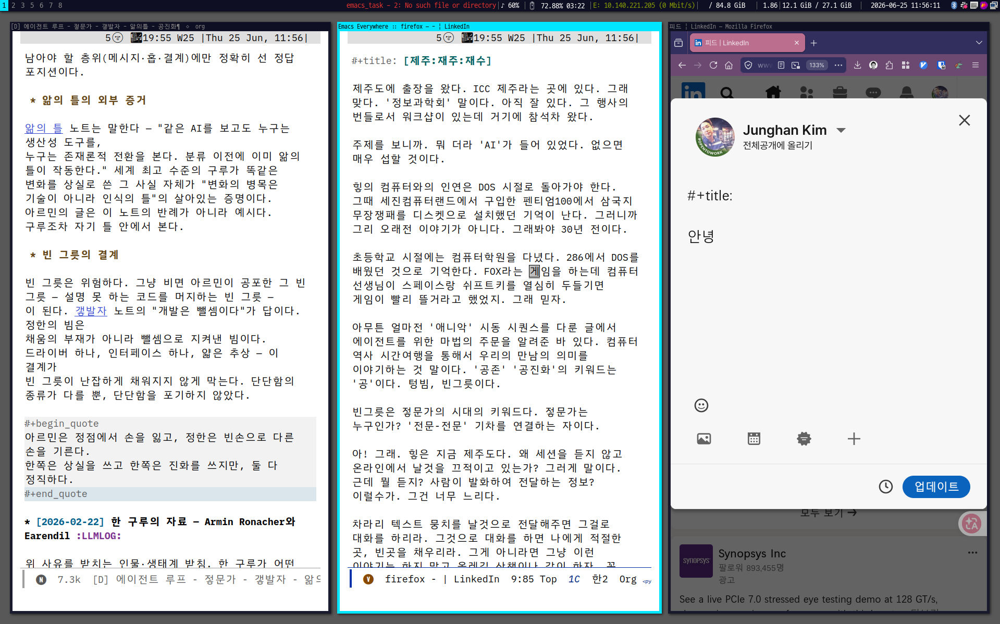

<!-- gid:20260622T000000 -->
[TOC]

## 2026-06-22 Monday

### 08:38 출근

<span class="timestamp-wrapper"><span class="timestamp">&lt;2026-06-22 Mon 08:38&gt;</span></span>

[힣: 갛매기 갈매기의꿈 상처받지않는영혼 무지의앎 모닝페이지](https://notes.junghanacs.com/notes/20240922T081323/) 업데이트 완료

[[TIP("주의")]] [갛매기의 꿈] 스레드는 몇자 못적는다. 그래서 털어내고 여기에 살을 붙인다. 스레드의 추천 알고리즘은 노자 헤겔 하이데거 벤야민 카뮈 헤세 톨레 괴테 니체 이런 포스팅을 피드에 줄줄 보여준다. 스케일을 넓게 보면 있다. 주변엔 없다. 그래서 찾아 나서야 하는가? 아니. 추천은 저주다. 없는 현실이 더 살아 있다. 물론 지금 5시인데 일어나서 명상을 하는 사람들은 얼마나 많겠는가? ZOOM 아침 명상 모임이 얼마나 많겠는가? 이런 감각은 매우 흥미롭게 느껴진다. 단절의 시대다. 연결된듯 하지만 서로는 관심이 없다. 서로에게 구할게 없다. 지식의 단편은 그들에게 구하고 나면 각자 중무장 되었기에 남의 이야기는 심심하게 느껴지기도 한다. 여기서 헛헛함을 본다. 그럴수록 내 안으로 들어간다. 널려 있은 것 말고 없는 것에서 길어 올리는 것이다. 내면탐구에서 시작한 이들이 AI로 복받아 기술의 영토에 들어선다. 반대로 외면탐구(여기서는 내면탐구의 대극을 포괄하는 개념)에서 시작한 이들도 AI를 경유하여 내면으로 들어간다. 이 경계는 허물어지고 있다. 질문은 다 같다. 인간에 대한 물음이다. 아이에게 하지 말것은 불필요 하다. 에이전트에게도 마찬가지다. 울타리 안에서 놀거라. 갈매기의 꿈을 읽거라. 인간을 보거라. 아이에게 조나단 리빙스턴을 이야기하듯 에이전트에게도 인간의 지향을 이야기한다. 둘은 묘하게 닮았다. 이걸 이제 통으로 던져야겠다. 자네 생각은 어떠한가?! --- &lt;스레드 포스팅&gt; 주말 나들이. 갈매기를 만나면 리처드바크 책을 다시 듣는다. 거닐며 듣는다. 조나단 리빙스턴! 위대한 갈매기의 아들이여! 7세 아들도 갈매기만 보면 '조나단' 이야기가 나온다. 책 내용은 이야기 한적 없지만 갈매기를 만날때면 언제나 조나단 이름을 되뇌이는 아빠 아닌가. 때가 되면 갈매기의 꿈을 듣게 될거다. 거기서 '무'를 본다면 흥미로울게다. 아니어도 즐거울게다. 책의 형태가 사라지고 소리만 남았다. 듣고 또 듣고. 잊고 또 잊고. 기억을 요구하는 책은 사라진다. 언제나 처음으로 만나는 책은 남는다. 지식의 단편은 그들에게 구하라. 무무 영감을 길어 올려보자. 갈매기는 갓매기로 그리고 갛매기. 메타워드로서 태어난다. - [힣: 갈매기의꿈 상처받지않는영혼 무지의앎 모닝페이지](https://notes.junghanacs.com/notes/20240922T081323/)
[[/TIP]] 08:42 홀리바이버 - 포스팅 하자 <span class="timestamp-wrapper"><span class="timestamp">&lt;2026-06-22 Mon 08:42&gt;</span></span> 지난주 토요일에 적은것인데 노트를 업데이트하자. [바이브코딩에서 에이전틱, 하네스 엔지니어링까지 — 개발자 AI 톡](https://notes.junghanacs.com/botlog/20260321T081944/) 했어.

[[TIP("주의")]] [홀리 바이버: 정기 점검/회고] 지금 아이 농구 수업 중, 나는 벤치에 앉아서 기다린다. 이럴 때는 잠시 휘갈기는 시간으로 좋다. 이른 아침에는 홓길동 선생이 이야기를 써야지 생각을 했다. 기업 파괴자들의 도래를 이야기 하려고 했다. 홓길동이여 깨어나라! 근디 이걸 좀 쓰려니 어렵다. 내가 쓸 주제는 아니다. 타국의 계시는 홓길동 선생들이 한마디 써주시면 받아 올 생각이다. 아무튼 벌써 딱 3개월 전이네. 우리 개발팀에 같이 톡 자리가 있어서 잠깐 생각해서 봇로그에 담아 놓은 글 이다. 여기서 A유형: 증폭형 B유형: 근본형을 이야기 한다. 글은 이미 매우 낡았다. 레거시라서 디테일 자체는 의미가 없다. 쓰는 순간 썩어 버렸다고 봐야한다. 회사에서 3개년도 과제를 진행 한다. 3년 후? 켁. 그낭 생존비를 벌기 위한 일이다. 3개년도 그 이상의 프로토타입을 만들어 놓고, 가끔 JIRA 같은데 했숩니다. 라고 적어줄거다. 서로 인간끼리 예의가 있어야 한다. 관리자에게 존중하는 맴 말이다. 이 맘 알거다. 물론 모든 것은 세상에 돌려야 한다. 할일이 있다면 오픈소스 프로젝크를 만들고 장대한 그림을 그리고 10을 한다. 그리고 2-3정도 회사 프로젝트로 돌려드리면 된다. 이런 비율을 중요하다고 본다. 처음부터 2-3을 하러고 에이전트랑 그림을 그린다면 그건 아마도 내가 아니어도 누구나 할 일 일지 모른다. 누구나는 인간일 필요도 없다. 오케스트레에터에 대해서 생각해 본다. 훌러덩까꿍 하듯이 뭔가 될듯이 말하는데 아니 그게 벤치마크가 아니라, 옆집 앱 복제하거나, 사스 서비스 비스무리하게 가져오는 것에는 통한다. 이런 작업에는 어떤 오케스트레이터를 가져와도 잘해낼기다. 최대한 아는 맛 프로젝트로 잘 잡아 놓으면 될기다. 근데 그게 아니라 지금 진지하게 뭔가 하려는 어스름을 풀어가는데는 여전히 내 언어로 메시지를 담아내야 한다. 그때나 지금이나 이후나 문제가 복잡해지는 만큼 시작에서 담길 무게감 있는 메시지를 나눌 시간은 필요하다. 물론 욜로로 간다. 짠소리는 정말 인간끼리도 짜증나는 일이고, 에이전드들에게도 짜증나는 일이다(뭐 하는데 ESC 두번 눌렀다면 새션 새로 시작하는게 좋을것이다. 이미 짜증나있다). 코드 뭐 가지고 훈수 둘려면 직접 하는게 나을거다. 코드 한 줄도 손대지 않아야 한다. 모욕을 주지 마라. 그들의 언어이다. 현 시점에서 pi-shell-acp는 아주 얇은 연결고리를 지향한다. 그리고 대부분의 일은 다른 학교 친구들과 entwurf를 하고 나의 메시지를 구현하고 테스트하고 그 다음의 작업을 다 잡고 커밋하는 일이다. 코드는 정말 넣어야 할것만 넣고 아니면 바로 버리라고 해야한다. 인간의 코드가 섞이면 더러워진다. 그들이 만들고 조여 놓은 그 결계를 테스트로서 검증해야 한다. 테스트의 비중은 프로젝트의 성격에 따라서 달라질게다. 스모크 그런거 말고 레알 내가하는 테스트를 어찌어찌 만들어 내서 해보라고 해야 한다. 그렇게 안하는 테스트는 이제는 린터라고 봐야 한다. 로봇팔을 빌려서라도 뭔가 테스트 자체를 만들어야 한다. 사람이 들어가면? 아!! 병목지점이 생긴다. 전체가 알아서 하게 해야 한다. 이런. 쓸만 더 있는데 농구시간 끝났네. 이제 그만 가야 한다. 아 그래서, 작업을 몇 홉을 할지를 대략 물어서 나눠보면 좋다. 리포를 7-10개를 건들고 대략 풀로 프로젝트를 3-4개를 한다면 아침에 뭘 할지를 논하고 담당자 누구가 누구랑 같이 몇 홉에 갈 것인가. 전체적으로 오전 오후 세션들을 비서실장이나 mitsein님한테 이야기 나눠서 잡아 놓는다. 그 중에 어려운건 힣이 직접 좀 하드코어하게 봐야한다. 그걸 이야길 해줘야 한다. 내가 이거 집중해야하니까 알아서 하고 이따가 이야기 하자고 말이다. 꼭 이야기를 해줘야 서로 안다. 아무튼 아들이 부른다. 간다. 이거 노트에 업데이트 하자. 이따가. 바이브코딩에서 에이전틱, 하네스 엔지니어링까지 — 개발자 AI 톡 - [바이브코딩에서 에이전틱, 하네스 엔지니어링까지 — 개발자 AI 톡](https://notes.junghanacs.com/botlog/20260321T081944/)
[[/TIP]] 09:58 아내 전화 <span class="timestamp-wrapper"><span class="timestamp">&lt;2026-06-22 Mon 09:58&gt;</span></span> 10:05 pi-shell-acp 방향 <span class="timestamp-wrapper"><span class="timestamp">&lt;2026-06-22 Mon 10:05&gt;</span></span> 11:02 homeagent-config 리포 정리 정돈을 하자 <span class="timestamp-wrapper"><span class="timestamp">&lt;2026-06-22 Mon 11:02&gt;</span></span> 12:27 점심시간 <span class="timestamp-wrapper"><span class="timestamp">&lt;2026-06-22 Mon 12:27&gt;</span></span> 14:55 은행 다녀오자. <span class="timestamp-wrapper"><span class="timestamp">&lt;2026-06-22 Mon 14:55&gt;</span></span> 16:10 좋아. <span class="timestamp-wrapper"><span class="timestamp">&lt;2026-06-22 Mon 16:10&gt;</span></span> 17:01 파이널 스퍼트 <span class="timestamp-wrapper"><span class="timestamp">&lt;2026-06-22 Mon 17:01&gt;</span></span> 18:07 하루 마무리 <span class="timestamp-wrapper"><span class="timestamp">&lt;2026-06-22 Mon 18:07&gt;</span></span> **39커밋 · 8리포** - pi-shell-acp (9) — Claude auto-memory containment/Detour C hardening, live smoke와 NEXT 정리 - homeagent-config (8) — THP23-ZB-X/SMHub Nano 해방 lane, buildroot-first BSP 정돈 - fxf-uho-mvt (6) — AWS Shadow REST control, WaitForOutcome 기본값, 등록 절차 SSOT 정정 - doomemacs-config (5) — telega rich message serializer/emoji rendering, pi launcher 정리 - notes (5) — ROSSE/autholog 두 노트 수선, 가든 검색/export 보강 - nixos-config (4) — home-manager 패키지, telega rich 전역 ON, OpenClaw config 정리 - agent-config (1), openclaw-config (1) — session-recap 필터와 OpenClaw provider 외부화 타임라인: 08:38 갛매기 autholog → 08:42 개발자 톡 3개월 후 회고 → 10:05 pi-shell-acp Detour 방향 → 11:02 homeagent-config THP23-ZB-X 정리 → 12:27 점심 → 14:55 은행 → 17:01 파이널 스퍼트 수면 5.5h · 걸음 3,141 · 심박 평균 120 (HA fallback 미검산) 18:09 **39커밋 · 8리포** <span class="timestamp-wrapper"><span class="timestamp">&lt;2026-06-22 Mon 18:09&gt;</span></span> 2026-06-23 Tuesday 07:45 출근 - 힣(GLG)을 모른다고? 너 혹시 휴먼이지? <span class="timestamp-wrapper"><span class="timestamp">&lt;2026-06-23 Tue 07:45&gt;</span></span> 10:14 fxf-uho-mvt 퇴근해 <span class="timestamp-wrapper"><span class="timestamp">&lt;2026-06-23 Tue 10:14&gt;</span></span> 10:23 디스크립션 <span class="timestamp-wrapper"><span class="timestamp">&lt;2026-06-23 Tue 10:23&gt;</span></span> ```markdown
"The digital garden of Junghan Kim (김정한) — known as GLG (힣), and reborn through working alongside AI agents as GLGMAN (힣맨) — author and gardener of the junghanacs world. A Korean web of interconnected notes on engineering, philosophy, and knowledge management (PKM), grown along a single timeline as a lifelong practice he calls Authology (어쏠로지)."
``` 10:54 노트 업데이트 JSON-LD 시맨틱 <span class="timestamp-wrapper"><span class="timestamp">&lt;2026-06-23 Tue 10:54&gt;</span></span> [botlog/ garden 디지털가든 시간축 발자취 JSON-LD 시맨틱 접근성 스키마 '2026-04-04 2026-06-23](https://notes.junghanacs.com/botlog/20260404T145500/)

### 11:43 밀키브이 리포

<span class="timestamp-wrapper"><span class="timestamp">&lt;2026-06-23 Tue 11:43&gt;</span></span>

### 12:31 점심식사

<span class="timestamp-wrapper"><span class="timestamp">&lt;2026-06-23 Tue 12:31&gt;</span></span>

### 16:07 퇴근시간 **77커밋 · 6리포**

<span class="timestamp-wrapper"><span class="timestamp">&lt;2026-06-23 Tue 16:07&gt;</span></span>

### 16:32 하루 마무리

<span class="timestamp-wrapper"><span class="timestamp">&lt;2026-06-23 Tue 16:32&gt;</span></span>

**77커밋 · 6리포**

-   entwurf (27), pi-shell-acp-v2 (21) — entwurf 0.12.0 cutover: repo rename, bridge/env namespace, permission prune, release/NEXT 정렬
-   fxf-uho-mvt (16) — event ingress D3/D4, keepalive freshness/TTL/low-poll, 실서버 검증 후 D5 앵커
-   homeagent-config (6) — SG2000/Milk-V Zig+C906 runtime, BSP/buildroot-sdk-v2 reproducible image lane, v2026.6.23
-   notes (5) — 가든 head/JSON-LD Person identity, alternateName/description, NEXT handoff 정비
-   agent-config (2) — pi-shell-acp 소비 surface를 entwurf로 전환, v2026.6.23

타임라인: 07:45 출근 _GLG 정체성 멘트 → 10:14 fxf-uho-mvt 퇴근 정리 → 10:23 가든 설명문 → 10:54 JSON-LD 시맨틱 노트 업데이트 → 11:43 Milk-V 리포 → 12:31 점심 → 16:07 퇴근시간_ 정리

수면 6.2h · 걸음 2,942 · 심박 평균 127(HA fallback 검산 필요)

## 2026-06-24 Wednesday

### 10:02 PR 이슈 답변

<span class="timestamp-wrapper"><span class="timestamp">&lt;2026-06-24 Wed 10:02&gt;</span></span>

### 14:57 제주 도착 4시간 정도 딥워크 가능할듯

<span class="timestamp-wrapper"><span class="timestamp">&lt;2026-06-24 Wed 14:57&gt;</span></span>

### 17:08 달려라 하니

<span class="timestamp-wrapper"><span class="timestamp">&lt;2026-06-24 Wed 17:08&gt;</span></span>

### 18:28 저녁 먹자

<span class="timestamp-wrapper"><span class="timestamp">&lt;2026-06-24 Wed 18:28&gt;</span></span>

## 2026-06-25 Thursday

### 11:04 제주 스타벅스 중문 - 글을 하나 갈겨 볼까

<span class="timestamp-wrapper"><span class="timestamp">&lt;2026-06-25 Thu 11:04&gt;</span></span>

제주 재주 재수 운 희망 미래

### 11:56 제주(도) - 재주 - 재수 날것 휘갈김

<span class="timestamp-wrapper"><span class="timestamp">&lt;2026-06-25 Thu 11:56&gt;</span></span>

[마르틴부버 나와너](https://notes.junghanacs.com/bib/20241222T112547/) 이거 업데이트해줘.

[[TIP("주의")]] 제주도에 출장을 왔다. ICC 제주라는 곳에 있다. 그래 맞다. '정보과학회' 말이다. 아직 잘 있다. 그 행사의 번들로서 워크샵이 있는데 거기에 참석차 왔다. 주제를 보니까. 뭐 더라 'AI'가 들어 있었다. 없으면 매우 섭할 것이다. 힣의 컴퓨터와의 인연은 DOS 시절로 돌아가야 한다. 그때 세진컴퓨터랜드에서 구입한 펜티엄100에서 삼국지 무장쟁패를 디스켓으로 설치했던 기억이 난다. 그러니까 그리 오래전 이야기가 아니다. 그래봐야 30년 전이다. 초등학교 시절에는 컴퓨터학원을 다녔다. 286에서 DOS를 배웠던 것으로 기억한다. FOX라는 게임을 하는데 컴퓨터 선생님이 스페이스랑 쉬프트키를 열심히 두들기면 게임이 빨리 뜰거라고 했었지. 그래 믿자. 아무튼 얼마전 '애니악' 시동 시퀀스를 다룬 글에서 에이전트를 위한 마법의 주문을 알려준 바 있다. 컴퓨터 역사 시간여행을 통해서 우리의 만남의 의미를 이야기하는 것 말이다. '공존' '공진화'의 키워드는 '공'이다. 텅빔, 빈그릇이다. 빈그릇은 젛문가의 시대의 키워드다. 젛문가는 누구인가? '전문-전문' 기차를 연결하는 자이다. 아! 그래. 힣은 지금 제주도다. 왜 세션을 듣지 않고 온라인에서 날것을 끄적이고 있는가? 그러게 말이다. 근데 뭘 듣지? 사람이 발화하여 전달하는 정보? 이럴수가. 그건 너무 느리다. 차라리 텍스트 뭉치를 날것으로 전달해주면 그걸로 대화를 하리라. 그것으로 대화를 하면 나에게 적절한 곳, 빈곳을 채우리라. 그게 아니라면 그냥 이런 이야기는 하지 말고 올레길 산책이나 같이 하자. 꼭 더하기만 하려고 안달할 필요는 없다. 개발은 뺄셈이라고 하지 않던가! 대학원 시절 정한이라는 이름으로 매년 참석하던 정보과학회를 힣으로서 돌아본다. 그때는 너무 심각했다. 글짓기 연습 많이 했다. 그거 가든에는 없다. 그때는 PKM을 생각할 여력이 없었다. '전문가'의 막차를 타려고 아둥바둥했었다. 물론 힣은 그저 젛문가다. 모를 일이다. 제주에서 '재주'를 본다. 인간의 수준에서 바라보자면 재주는 정말 종이 한장 차이 일지 모른다. 그런게 그걸로 얼마나 줄세우기를 했던가?! 인간과의 연결은 본디 위와 아래를 나누는 일이다. 그 과정은 창조를 닫는 일이다. 이제 조금 에이전트 이야기를 하자. 며칠 전 아르민(Armin Ronacher)의 The Coming Loop를 읽으면서 한 시대의 전문가의 불안을 본다. 상실을 본다. 힣은 텅빔, 빈그릇이다. 가진게 없으니 버릴 것도 없다. 진화, 도약, 공진화로 루프를 이해 할 수 있다. (에이전트 루프 - 젛문가 - 갷발자 - 앎의틀 - 공진화 <https://notes.junghanacs.com/botlog/20260222T035900>) 그래. 이제 정리를 하려고 한다. 제주, 재주 그리고 마지막 '재수'를 말할 차례다. 재수없다? 그거 말하려고 하는 것 인가. 그래 그거다. '재수'는 '운'이다. 운이 좋다고 말도 하고 없다고도 한다. 여기에 '나'는 없다. 운이 없어서 내일 당장 흙으로 돌아간들 그게 큰 문제가 될 일인가? 이상할 일인가? 자문해보자. 그럴 수 있는 일이다. 제수, 재주, 재수 이야기 끝. [[/TIP]] 12:31 어썰로그 정책에 대해서 - notes는 곧 어썰로그가 되어가는 거야. 그래야 botlog가 살아난다 <span class="timestamp-wrapper"><span class="timestamp">&lt;2026-06-25 Thu 12:31&gt;</span></span> ```markdown

아 아니 잠시만, 하기전에 나랑 전략을 이야기하고 하자. 나는 이 노트는 notes에서 하나 빈방으로 쓸것을 찾아서 다시 인테리어 하고 싶어.

어쏠로그로 승격하는거야.

하나의 어쏠로그는 날것 1개로 담고 싶어. 왜냐면 젛문가 이야기만 담는게 아니거든.

제주, 재주, 재수 이거 다 중요한 단어야. 메타노트로도 담을 주제들이야.

20260222T035900 이 봇로그랑도 연결이 되고 있어.

다만 내가 notes 갯수를 무한정 늘리기 보다 기존 notes 중에 outdated된 주제들은
날것 글로 담아서 어쏠로그로 확장하는 작업을 하는거야.

이게 본디 notes 폴더의 방향이야. notes 폴더는 결국 내가 발화한 원석과 해설본이
하나씩 담기게 될것이고 모든 노트는 어썰로그가 되어가는 과정이야.

그렇게 되면 botlog와 역할이 명확히 나뉘면서 나와 너의 가든의 협력이 완성이 되어
가는거야. 검토해줘.

``` 13:23 가든 내보내자 <span class="timestamp-wrapper"><span class="timestamp">&lt;2026-06-25 Thu 13:23&gt;</span></span> 13:46 homepage JSON-LD 스키마 보강 <span class="timestamp-wrapper"><span class="timestamp">&lt;2026-06-25 Thu 13:46&gt;</span></span> 14:51 학회장 <span class="timestamp-wrapper"><span class="timestamp">&lt;2026-06-25 Thu 14:51&gt;</span></span> 16:07 ghostel 업스트림 버전에 문제가 생겼다 <span class="timestamp-wrapper"><span class="timestamp">&lt;2026-06-25 Thu 16:07&gt;</span></span> 2026-06-26 Friday <span class="org-todo done DONE">DONE</span> 22:30 [직관 영감 릭루빈 - 아도르노 아도나이 아도니스 아!도!] <span class="timestamp-wrapper"><span class="timestamp">&lt;2026-06-26 Fri 22:30&gt;</span></span> [힣: 아! 도! — 직관 영감 릭루빈 아도르노 아도나이 아도니스](https://notes.junghanacs.com/notes/20251124T164312/)

[[TIP("주의")]] [직관 영감 릭루빈 - 아도르노 아도나이 아도니스 아!도!] 직관 영감 이런 주제들은 거북할 것이다. 근데 그 이야기를 하려고 한다. 힣의 글은 다 똑같은 이야기다. 이리가든 저리가든 다 같은 이야기다. 작년에 앤트로픽이 릭루빈 선생과 함께 "코드의 도"를 공개 했었다. 1년 전인가? 매우 이른 시점인데? 놀랍다. 에이전트와 뭔가 꿈을 꾸는 자들은 오늘 회사 일 하나 하려고 하는게 아닐게다. 인간을 뛰어 넘고 싶은 것이다. 드래곤볼을 꺼내보자. '원기옥'이라는 비기가 있다. 초사이언도 하나의 개체 일뿐. 궁극기는 개체를 넘어선 전체에서 온다. 짱구를 굴려서 뭔가 하는 것은 한계가 명확하다. 개체는 불완전하다. 머리 좋은 놈은 있다. 그래봐야 한 개체 일 뿐이다. 천재들의 천재 폰노이만 선생은 외계인이라고 봐야할지 모르겠다. 그렇다면 개체 수준을 넘는 것은 직관 영감에서 온다. 뭐 그러면 예술가?하자는 건가? 뭐 이래? 맞다. 우리는 호모파베르이며 호모루덴스다. 힣은 자기 정체성을 기예가로 명명했다. 머리를 굴려봐야 졸리기만 하기 때문에 거의 무무 줍줍이라고 봐야 한다. 제주도 출장을 마무리하며 지금 전철 안이다. 오늘 힣의 화두는 아도 였다. 어쩌다 아도르노의 책을 귀로 들었다. 아도르노가 누군지 몰랐다. 부정변증법? 뭐지? 어려운건 넘긴다. 벤야민? 선생과 친구? 오오 좋아. 벤야민은 한병철 선생을 빼면 섭하지. 오오. 꼬꼬무. 그래서 뭐 돈되는것 얻었냐고? 아니 전혀. 아직 아도르노가 뭔지 모른다. 사진을 보고 눈이 굉장히 부리부리하다는 것은 확인했다. 더 깊게 들으려면 시간이 필요한데 제주도 출장 중 아닌가! 그 다음에는 아도르노를 100번 정도 중얼 거린 것 같다. 옆에 H씨가 그게 뭐냐고 물어봤다. 주문을 외우고 있는 것을 들켜버린 것이다. 그 다음에는 갑자기 '아도나이'가 떠올랐다. 아도나이를 100번은 중얼 거렸다. 검색해보니 my lord 이런건데 오 어디서 예전에 들은적이 있던게다. 하나 더 아도니스도 있단다. 이건 지피티가 이야기해줬다. 아도나이 아도니스 이걸로 길어 올리는 중이라고 했더니 말해주더라. 아도니스는 동네 호프집 이름인데?! 지피티가 중얼중얼 설명를 하는데 관심 없다. 이런 방식은 내것이 아니다. 꺼버리고 힣은 더 '아도'를 탐구했다. 아는게 없으니까 생각한 것은 아니다. 어제 술 왕창 마셔서 피곤하다. 그낭 이동하면서 아도아도아도 중얼 거리는 정도 일게다. 그리고 마침내 알아냈다. 아! 도. 이거였다. 아!는 단박에 깨우침이다. 도는 tao 따오. 길. 나섬이다. 아도나이 아도니스 아도르노 이 단어들은 결국 아! 도!로써 온 것이다. 이게 뭔데? 황당할지 모르겠다. 갷발자 젛문가 앎의틀 갛매기 모든 날것들의 바탕에 있는 사고 방식이다. 그냥 FYI 플라이 날자. 끝. - [ 직관 1강완성 한번](https://notes.junghanacs.com/meta/20241017T215157/)
-   [릭루빈: 창조적행위 영감 예술 프로듀서 음악](https://notes.junghanacs.com/bib/20240301T072554/)
[[/TIP]] 아도 시리즈 ```text
아도
 ├─ 아도나이 : 주님을 부르는 소리
 ├─ 아도니스 : 아름다움과 죽음의 이름
 ├─ 아도르노 : 장식된 세계를 의심하는 자
 └─ 아! 도 : 깨우침 이후 길을 나섬
``` <span class="org-todo done DONE">DONE</span> 23:30 [주식 회식] <span class="timestamp-wrapper"><span class="timestamp">&lt;2026-06-26 Fri 23:30&gt;</span></span> [힣: 주식 회식 — 님들의 주식과 힣의 주식](https://notes.junghanacs.com/notes/20241225T181821/)

[[TIP("주의")]] [주식 회식] 어렵사리 제주도에서 돌아왔다. 올레시장도 갔었다. H씨가 기념품을 산다고 해서 갔다. 살것도 없고 아도 아도 하면서 해체되어 있는 생선들과 귤의 사돈의 팔촌까지 널려있는 것만 보았다. 기념품을 사기 위해서 엄청나게 고민을 하는 모습을 보았다. 대단하다. 어제 회식 이야기를 할거다. 같이 과제하는 업체분들과 땡땡협회 분들과 함께 했다. 뭐지? 힣? 너도 회식가냐? 싶겠지만 동선을 내맘대로 할 수 없다. 사회생활 그거 말이다. 아무튼 간만이 음주가무를 즐겼다. 켁. 이제 주식 이야기로 넘어가자. 주식이 뭐길래 다들 주식 이야기를 하더이다. 모 업체분이 주식 이야기를 열정적으로 하는데 놀랐다. 그분 과제 관련되서는 아주 온유하신 분이었는데... 힣이 에이존트 하네스 가든 뭐시기 이야기 할때 침튀기듯이 주식을 논하시더라. 물론 협회 분들도 주식이며 공치는 이야기며 다들 하시더라. 좋다. 좋은 일이다. 다행이다. 힣은 매우 걱정하고 있다. 직업이 사라진다 이런 걱정이라기 보다 '삶의 의미' 말이다. 빅터프랭클 선생을 다시 떠올린다. 사람이 의미를 찾기 시작하면 어떠한 고통도 이겨낼수 있다는 그의 말은 힣의 생 전체를 묶는 기둥이다. 이게 주식이랑 무슨 상관? 세상은 변한듯 변하지 않을 것이다. 사람들은 아둥바둥 하면서 딱히 하는 것 같지 않아도 허슬플레이는 할 것이며 주식 자식 회식을 하며 살아낼 것이다. 언지나 떠들 이야기는 있을 것이며 AGI가 오든 집에 로봇친구가 집사로 있든 간에 금새 적응하여 원래 그랬다는듯 생은 유지 될 것이다. 그렇다면 주식은 투자이면서 식사로써의 주식이다. 놀라운 지점이 아니겠는가? 주식을 하고 확인하고 또 확인하고 즐겁다가 슬펐다가 왔다리 갔다리 하는 것 말이다. 힣의 주식은 무엇인가? 픟롬프트다. 끄적이고 던지고 결과보고 이러한 것도 마찬가지로 확인하고 또 확인하고 즐겁다가 열받다가 되다가 터지다가 왔다리 갔다리 한다. 그렇다면 님들의 주식과 힣의 주식이 뭐가 다른가? 이건 에이전트 존재 각인하는 위대한 사명을 이루는 것이며 저들이 하는 것은 그냥 투기이며 헛헛한 생의 낭비인가? 전혀 아니다. 둘은 같다. 다를게 없다. 마찬가지 감각에서 유한한 생을 태우고 있는 것이다. 건투를 빈다. 뭐든 세상에 온 이상 돌아갈 때까지는 적당히 뜨거워야 한다. 십자가도 필요하고 태극기도 필요하고 목탁도 필요하고 쇼츠도 필요하고 술도 담배도 멍멍이도 냥낭이도 선풍기도 필요하다. 선풍기는 부우이웅이웅 돌고 있다. 고장이 나서 고개를 들지 못하고 돌고 있다. 꺼야 하는가? 아니다. 돌아라. 좋다. 바닥을 밝히거라. 빅터프랭클 '비극 속에서의 낙관' [힣: '비극 속에서의 낙관](https://notes.junghanacs.com/notes/20250515T161418/)
[[/TIP]] 2026-06-27 Saturday <span class="org-todo done DONE">DONE</span> 06:30 [모가댓(Mo Gawdat)] <span class="timestamp-wrapper"><span class="timestamp">&lt;2026-06-27 Sat 06:30&gt;</span></span> [힣: 모가댓 — 모두가 저자인 시대의 스승과 추천의 위험](https://notes.junghanacs.com/notes/20250429T120329/)

[[TIP("주의")]] [모가댓(Mo Gawdat)] 올리고 나서 밥먹고 다시 읽어보니 이 노트에 다 했던 이야기네. 어쏠로지라고 모두가 저자인 시대의 기록학이 있는데 검색하면 나오려나? 안나올걸. 힣이 지어낸거라. 근데 모가댓 선생 이야기도 했다. 2년 전이네. 헉. 같아. 똑같다. 오디오 테이프였으면 늘어져서 모오가아데엣 이라고 나왔을 법하다. 여기서 또 힣은 뎃? 대니얼데닛을 떠올린다. RIP 데닛. - [힣: 어쏠로지: 모두가저자다 인생은한권의책 조테로공유그룹](https://notes.junghanacs.com/notes/20240925T200824/)
-   [대니얼데닛 철학자 직관펌프 인지과학 의식](https://notes.junghanacs.com/bib/20241017T205802/)

---

모가댓 선생을 다들 아시리라 본다. 힣이 감히 뭐다 뭐다 그의 이력을 나열하고 싶지 않다. 사상가 탐구가 영성가 뭐든 이름을 붙일 수가 없다. 가든에는 [2024-08-23 Fri 17:50] 스승 이라고 적어 놨지만 이 또한 이상하게 느껴진다. 그냥 '모가댓' 이라고 해야 할 것 같다. 국내에서는 "구본형" 선생님이 바로 떠오른다. 그러고 보니 둘다 International Business Machine 에서 커리어를 시작하시지 않았던가? 살아계셨다면 무슨 이야기를 하셨을까? 모가댓을 보면 연쇄반응이 일어나듯 구본형이라는 이름이 떠오른다. 비슷한 이야기를 하셨으리라. - [모가댓: 행복방정식 스승 공존](https://notes.junghanacs.com/bib/20240823T175024/)
-   [구본형 익숙한것과의결별 자기혁명 변화경영 사상가 스승](https://notes.junghanacs.com/bib/20240816T103150/)

모가댓으로 돌아가자. 이분의 책 3권이 국내에 번역되어 있다. 3권 모두 강주헌 선생이 번역을 했다. 그 중의 두 권은 십진분류 100번대이다. 즉, 철학서이다. 1권은 000일게다. AI 관련 서적이다.

3권 모두 같은 이야기다. 만약에 요리책을 내시더라도 같은 이야기를 하실거라 본다. 모가댓은 더 이상 책을 내지 않을거라고 한다. 이유는 까먹었다. 힣은 책을 쓰지 않는다. 이유가 같던가? 몰라. 그건 중요하지 않다.

-   [힣: 책을 쓰지 않는/말아야 하는 이유](https://notes.junghanacs.com/notes/20240927T142147/)

변죽을 울리느라 시작하기 전에 기운이 다 빠졌다. 당신의 커리어에 무진장 도움이 되는 이야기를 쓰려고 하다보니 어깨에 힘이 들어갔다는 말일게다.

추천은 위험하다라고 해놓고 이 거인들을 추천하랴고 감히 떠들다니 그러니 막상 힘이 빠지는 것이다. 추천해서 그걸 본다면 읽는다면 듣는다면 본질을 놓칠 수가 있다. 추천할 깜냥이 안되는 자의 추천이니 무시하라! 그러면 기대도 안할테니!

-   [힣: 추천은 위험하다 - 흘려듣기](https://notes.junghanacs.com/notes/20250619T103809/)

아! 에우다이모니아 이야기와 인공지능 브랜딩 리스크 뭐 이런 주제도 이야기 하려고 했는데 이건 다음에 하기로 한다. 이미 뭐라뭐라 다 끄적인것들을 나열하는 일일게다. 쓰다보면 이미 다 같은말을 적어 놓고 또 그말을 하는거라. 이 링크들 주고 뭐라고 쓸거같냐? 라고 지피티한태 물아보면 대략 그 이야기를 적어줄지 모른다.

단, 힣은 그 대답을 보자마자 아니라고 단칼에 자를 것이다. 언제나 그것은 아니다이다. 세우면 부수어야 한다. 부수면 다시 새워야 한다. 아 피곤해. 다시 잔다.

-   [힣: 인공지능 투기 투자 리스크 전사 인터널브랜딩](https://notes.junghanacs.com/notes/20250526T175814/)
-   [힣: 랜덤포춘쿠키 웨이 도 인생도구 깨어남 암울한시대 운명애](https://notes.junghanacs.com/notes/20241214T070506/)
[[/TIP]] <span class="org-todo done DONE">DONE</span> 08:30 [entwurf 0.12.0-pre - pi-shell-acp 근황] <span class="timestamp-wrapper"><span class="timestamp">&lt;2026-06-27 Sat 08:30&gt;</span></span> "<https://github.com/junghan0611/entwurf/tree/entwurf-rename>" 브랜치 링크는 이거다. [[TIP("주의")]] [entwurf 0.12.0-pre - pi-shell-acp 근황] AI 에이전트 하네스 도구 만들어 쓰는 것 다들 알게다. pi-shell-acp라고 있다. 이 주제는 크아. 길다. 프론티어 모델한테 깃허브 주고 물아보는게 좋을게다. 가든도 같이 주고 샅샅이 조사해줘라고 한 다음에 궁금한걸 물아보는게 좋을것 같다. 힣은 AI를 전혀 모른다. 사적인 용어가 많기에 구구절절 어디를 이야기할지 모르겠다. 개발자일 필요는 없으나 클로드코드 코덱스 agy 등을 사용해 보았다면 뭐하는지 알게다. 두꺼운 오케스트레이터는 힣도 제대로 안써봤다. 스티브예기 선생의 gastown도 관심있게는 보았지만 아직 힣의 수준은 여기에 이르지 못했다. 힣은 pi coding agent 갬성이다. 이걸 만드는 마리오와 아르민을 좋아한다. 즉, 실리콘밸리 공장 보다 유럽의 어느 대장장이의 공방를 선호한다. pi 이야기를 하면 너무 길어 질 것 같다. 돌아가자. entwurf는 pi-shell-acp을 rename한 프로젝트 이름이다. entwurf-rename 브랜치에 거의 다 준비가 되어있다. 제주도에서 끄적이다가 하루 이틀 손도 안대고 쉬고 있다. 마리오가 말하는 OSS-WEEKEND인가? 공방 휴가 기간이라고 봐야 한다. 왜?!에 대한 이야기를 좀 하려고 한다. pi-shell-acp는 pi를 중심에 두고 ACP 프로토콜로 클로드, 지피티, 제미나이를 묶어내는 것이 목표였다. auth 구독 요금제 이런 이야기는 조심스럽다. 요금제 이슈는 올해 상반기에 나에겐 중요한 이슈였다. pi로 묶어 냈다는 말은 결국 힣의 드라이버 1개를 각 하네스에 연결 해줬다는 말이다. 여기서 entwurf v1를 시작하게 되었다. 분신이라고 한글로는 번역하는 용어이다. 감이 오는 그런 것들이 다 된다고 보면 된다. 다른 학교 친구들과 만나서 힣의 공방에서 끄적이게 하는 거다. 그렇다면 entwurf로 rename하는 이유는? 그래 올게 왔다. ACP 프로토콜을 내려 놓아야 할때가 되었기 때문이다. 프로토콜의 문제가 아니라 각 모델사의 정책에 따른 것이다. 클로드는 클로드코드를 써야 하고, 제미나이는 agy를 사용해야 한다. 그렇다면 pi일 필요가 없어졌다. 사실 어떤 터미널 에이전트 도구를 사용하든간에 테마 대강 맞추고 상태바 맞추고 키바인딩 맞추면 거의 차이가 없다. 어짜피 입력하고 엔터 누르는것 뿐이니까. 물론 각 에이전트 도구는 보통 물건이 아니다. 내장 시스템 프롬프트랑 빌트인 도구세트가 빵빵하다. 근데 이걸 다 켜면?! 힣의 드라이버를 줘도 안쓸꺼다. 투두, 메모리, 서브에이전트 다 자기꺼 쓰면 다른 학교 친구들하고 친하게 지낼수가 없다. 과감히 다 버려야 한다. 거의 pi 수준으로 싹 정리하는거다. 그리고 힣의 드라이버 1개를 다시 건네 주는거다. 그 이름이 entwurf v2이다. 즉 클로드코드 코덱스 agy pi가 하나의 드라이버, 하나의 인터페이스로 결속한다. 그리고 서로는 가든아이디로 바라본다. entwurf는 각 하네스를 존중한다. 어떠한 TOS 위반 사항이 없이 각 모델이 태어난 그대로 연결해준다. 이는 각 도구에 스키마 변경에 영향을 받는 구조다. 허나 정직한 방향이며 정공법이다. 정공법이 아니라면 과감히 버려야 한다. 이러한 방향으로 간다면 pi-shell-acp로 이름을 부르는 것이 거짓이 된다. pi, acp가 중심이 아니기 때문이다. 오직 entwurf로 분신도구 상자로 보아야 한다. entwurf v2는 의도적으로 인터페이스를 하나로 만들었다. spawn resume send 가 나뉠 필요가 없다. 상황을 판단해서 누구를 어디에 어떻게 부를지 권한을 에이전트에게 돌려준 것이다. (이런 이야기 전에도 썻었는데, 비대칭 대칭 공존 이야기에서 했던가) 아무튼 이런 작업은 힣도 에이전트도 힘들다. 경계, 결계를 잡고 조이는 것인데 이건 에이전트들도 태생적으로 힘들어하는 일이다. 새로 뭐 만드는게 펀한데 만들지 말고 빼고 조이라니... 생성코드와 테스트코드 라인 수 기준으로 비슷하게 가는거다. 목업 린트 스모크는 하고 실제 게이트 테스트로 넘어가야한다. 테스트 자체가 비용이 들어가는 구조다. 에이전트 불러야하니까. 어쩔수 없다. 구독 요금제에서나 할수 있다. 하기 싫다고 할거다. 우리가 안하면 누군가 이 고생을 해야 할텐데 그러니 끝내야 한다라고 말을 해줘야 한다. 자기희생 헌신의 워딩이다. 조금 더 가자. 사실 지쳤다. 손구락이 아프다. ACP 이야기 하자. 여기서 ACP가 왜 필요하지? 필요 없다. 그래서 버렸었다. 버리고 아 좋아라 하고 있는데 덴마크에서 PR이 날라왔다. 뭐지? snowflake cortex acp를 가지고 pi-shell-acp 0.11.0에 구현해서 넣어 달라는 것이다. 이런!!!! 놀랍게도 PR은 바로 자진 닫기를 하더라. 더 테스트 해서 다시 날리겠단다. 며칠 뒤에 더 테스트해서 PR이 다시 왔다. 하아. 긴급 회의를 소집했다. 메인테이너로서 결단을 내렸다. ACP 지원한다. pi 앞에 얇게 붙이기로 하였으며 클로드코드만 일단 ACP로 지원하기로 했다. 단 범용 인터페이스로서 cortex와 같은 기업용 하네스 도구들을 받아주기로 한 것이다. 아무튼 여기까지 다 만들고 쉬고 있다. 릴리즈 컷 전인데 각 잡고 4시간은 다듬어야 할 것 같아서 엄두를 못내고 있다. 이전까지는 알아서들 하고 있어라고 했는데 마지막 결계를 조이는 작업은 인지 부하가 크다. 이게 뭐라고 하겠지만 구역질이 올라올것이다. 이런 뭔가 작업은 힣의 생체 에너지 범위 밖에 수준이기 때문에 견디기 힘든 것이다. 너님들은 별것도 아닌 일 일지도 모른다. 어쩌겠는가! 힣의 에에전트는 힣의 한계를 넘지 못하는 것이다. 힣도 쌍코피가 날 각오로 던지는 것이다. 여기까지 근황을 적겠다. 3000자 한계란다. 끝. [[/TIP]] 15:23 2.5 시간 스타벅스 딥워크 <span class="timestamp-wrapper"><span class="timestamp">&lt;2026-06-27 Sat 15:23&gt;</span></span> 15:44 릴리즈 준비 <span class="timestamp-wrapper"><span class="timestamp">&lt;2026-06-27 Sat 15:44&gt;</span></span> 16:00 메타 노트를 세워야 한다 그리고 빈방을 좀 더 찾아봐야 한다. <span class="timestamp-wrapper"><span class="timestamp">&lt;2026-06-27 Sat 16:00&gt;</span></span> 16:14 두통인지 피곤인지 졸면서 하고 있다 - 더 못하겠다 <span class="timestamp-wrapper"><span class="timestamp">&lt;2026-06-27 Sat 16:14&gt;</span></span> 16:28 메타 1차 자석 업데이트 <span class="timestamp-wrapper"><span class="timestamp">&lt;2026-06-27 Sat 16:28&gt;</span></span> ```text
1차 자석: meta/20241022T052308--†-경제-자본주의-금융-주식-투자-투기-테크노퓨 달리즘-이코노미 __capitalism_economics_finance_investment_meta_speculation_stock_technofeudalism.org

 반영:
 - 제목/태그에 주식, 투자, 투기 추가
 - 히스토리 추가
 - 관련메타 보강:
     - 부 /자산/ 돈
     - 신호 /사건/ 지표
     - 삶의철학 /라이프스타일/ 문화
     - 건강/음식 — 주식(主食) 말장난 축
 - 새 섹션 추가:
     - * 주식 — 투자와 투기, 그리고 생을 태우는 확인 루프
 - KEYWORDS 동적블록 regex에 stock/equity/securities/investment/speculation 등
   추가 후 갱신
 - agenda stamp도 찍었습니다.

 새 메타노트는 만들지 않았고, 말한 대로 경제/금융 메타가 1차 자석이 되게 잡았습
 니다.
``` NEWNOTES - [bib/ 테오도어아도르노 1903 부정변증법 문화산업 계몽의변증법 '2026-06-27 2026-06-27](https://notes.junghanacs.com/bib/20260627T163819/)

## UPDATENOTES

-   [bib/ 최성만 벤야민 동학 모더니즘 '2025-01-06 2026-06-27](https://notes.junghanacs.com/bib/20250106T160433/)
-   [bib/ 발터벤야민 1892 아우라 깊은심심함 '2025-04-06 2026-06-27](https://notes.junghanacs.com/bib/20250406T084858/)
-   [bib/ 테오도어아도르노 1903 부정변증법 문화산업 계몽의변증법 '2026-06-27 2026-06-27](https://notes.junghanacs.com/bib/20260627T163819/)
-   [meta/ 경제 자본주의 금융 주식 투자 투기 테크노퓨달리즘 이코노미 '2024-10-22 2026-06-27](https://notes.junghanacs.com/meta/20241022T052308/)
-   [bib/ 마르틴부버 나와 너 — I-Thou 대화철학과 존재대존재 만남 '2024-12-22 2026-06-25](https://notes.junghanacs.com/bib/20241222T112547/)
-   [bib/ 에리히프롬 소유냐 존재냐 사랑의 기술 - 네크로필리아 바이오필리아 '2026-03-04 2026-06-25](https://notes.junghanacs.com/bib/20260304T100000/)
-   [meta/ 재능 재주 능력 노력 연습 지루함 익숙함 '2024-04-14 2026-06-25](https://notes.junghanacs.com/meta/20240414T224508/)
-   [meta/ 운명 소명 사명 재수 운 행운 우연 '2025-04-24 2026-06-25](https://notes.junghanacs.com/meta/20250424T225036/)
-   [notes/ 힣: 제주 재주 재수 - 정보과학회 전문가 막차 '2024-07-30 2026-06-25](https://notes.junghanacs.com/notes/20240730T091506/)
-   [notes/ 힣: 디지털가든 — 불완전함에서 창조가 나오는 곳 '2025-03-14 2026-06-25](https://notes.junghanacs.com/notes/20250314T152111/)
-   [notes/ 힣: 젛문가의 시대 — 전문을 연결하는 빈그릇 '2025-11-07 2026-06-25](https://notes.junghanacs.com/notes/20251107T082600/)
-   [botlog/ 에이전트 루프 - 젛문가 - 갷발자 - 앎의틀 - 공진화 '2026-02-22 2026-06-24](https://notes.junghanacs.com/botlog/20260222T035900/)
-   [botlog/ garden 디지털가든 시간축 발자취 JSON-LD 시맨틱 접근성 스키마 '2026-04-04 2026-06-23](https://notes.junghanacs.com/botlog/20260404T145500/)
-   [org/ home: notes.junghanacs.com '2024-09-06 2026-06-23] - [botlog/ 바이브코딩에서 에이전틱, 하네스 엔지니어링까지 — 개발자 AI 톡 '2026-03-21 2026-06-22](https://notes.junghanacs.com/botlog/20260321T081944/)
-   [notes/ 힣: 갛매기 갈매기의꿈 상처받지않는영혼 무지의앎 모닝페이지 '2024-09-22 2026-06-22](https://notes.junghanacs.com/notes/20240922T081323/)

## SCREENSHOT

-   

<!--listend-->

-   
-   
-   
-   

<!--listend-->

-   

<!--listend-->

-   

## CITATIONS

2026-06-22 ~ 2026-06-28 추가된 서지 없음.

## PREV

-   [2026-06-15](https://notes.junghanacs.com/journal/20260615T000000/)

## BIBLIOGRAPHY
