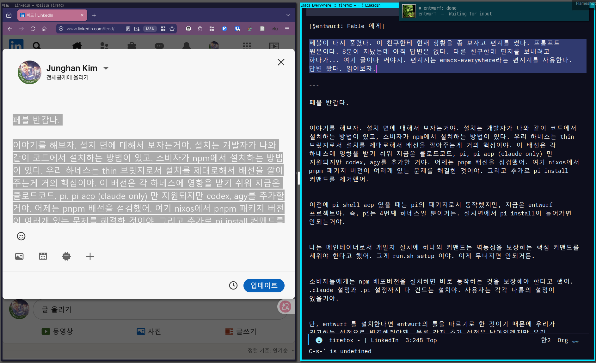

<!-- gid:20260629T000000 -->
[TOC]

## 2026-06-29 Monday

### 10:08 가든 내보내기

<span class="timestamp-wrapper"><span class="timestamp">&lt;2026-06-29 Mon 10:08&gt;</span></span>

### 10:59 아내 메시지

<span class="timestamp-wrapper"><span class="timestamp">&lt;2026-06-29 Mon 10:59&gt;</span></span>

### 11:18 배포 준비

<span class="timestamp-wrapper"><span class="timestamp">&lt;2026-06-29 Mon 11:18&gt;</span></span>

### 12:32 점심식사

<span class="timestamp-wrapper"><span class="timestamp">&lt;2026-06-29 Mon 12:32&gt;</span></span>

### 13:40 패키지 거의 완료

<span class="timestamp-wrapper"><span class="timestamp">&lt;2026-06-29 Mon 13:40&gt;</span></span>

### 15:03 배포 완료

<span class="timestamp-wrapper"><span class="timestamp">&lt;2026-06-29 Mon 15:03&gt;</span></span>

<https://github.com/junghan0611/entwurf/releases/tag/v0.12.0> 릴리즈했다.

```markdown

 ~200 chars

entwurf 0.12.0 is out: the successor to pi-shell-acp, reframed as a garden-citizen dispatch substrate. It lets existing agent harnesses address each other by garden id.

https://github.com/junghan0611/entwurf/releases/tag/v0.12.0

 ~500 chars

entwurf 0.12.0 is out on npm. It succeeds pi-shell-acp and reframes the work around a garden-citizen dispatch substrate: existing agent harnesses can address each other by garden id without pretending to own each other’s transcript, auth, or runtime. The 0.12 line hard-cuts to entwurf, removes v1 verbs, and makes entwurf_v2 the canonical dispatch surface

```

### 15:50 PR 영어 초안

<span class="timestamp-wrapper"><span class="timestamp">&lt;2026-06-29 Mon 15:50&gt;</span></span>

### 16:39 온생명이 하원 시간 체크할 것

<span class="timestamp-wrapper"><span class="timestamp">&lt;2026-06-29 Mon 16:39&gt;</span></span>

### 17:03 하루 마무리

<span class="timestamp-wrapper"><span class="timestamp">&lt;2026-06-29 Mon 17:03&gt;</span></span>

**40커밋 · 8리포**

-   fxf-uho-mvt (15) — self-AWS server D5 event ingress 게이트 종료, 문서/핸드오프 정리
-   entwurf (11) — 분신 하네스와 검토 라인 정렬
-   notes (5), doomemacs-config (4), openglg-config (2) — 가든 _환경_ 공개 설정 정리
-   agent-config (1), hej-kip (1), xlhatqbat-rockchip (1) — 소규모 보조 작업

타임라인: 10:08 가든 내보내기 → 11:18 배포 준비 → 12:32 점심식사 → 13:40 패키지 거의 완료 → 15:03 배포 완료 → 15:50 PR 영어 초안 → 16:39 온생명이 하원 시간 체크

수면 6.5h · 걸음 5,153 · 심박 평균 143

### 17:05 나가자 **40커밋 · 8리포**

<span class="timestamp-wrapper"><span class="timestamp">&lt;2026-06-29 Mon 17:05&gt;</span></span>

### 18:35 붛동산 컨설팅

<span class="timestamp-wrapper"><span class="timestamp">&lt;2026-06-29 Mon 18:35&gt;</span></span>

### <span class="org-todo done DONE">DONE</span> 22:35 [entwurf 0.12.2 release] - 수정판

<span class="timestamp-wrapper"><span class="timestamp">&lt;2026-06-29 Mon 22:35&gt;</span></span>

[[TIP("[entwurf 0.12.2 release]")]]
entwurf is a garden-citizen dispatch substrate: a thin bridge that lets already-existing agent harnesses address one another by garden id without pretending to own each other's transcript, auth, or runtime.

npm package: <https://lnkd.in/gVu5gErP>

Legacy package: @junghanacs/pi-shell-acp. entwurf is its 0.12+ successor line: the same work renamed around the garden-citizen dispatch substrate rather than the pi adapter.

며칠 전에 이거 근황을 적었다. 줄줄.

한마디로 힣맨의 드라이버. acp도 여전히 지원한다. 기업용 하네스를 acp로 여럿 지원하게 될듯하다. snowflake cortex는 pr 가이드를 적아놨으니 작업해서 올려주시겠지. 일단 정리정돈하고 agy, codex 지원할거 넣을 예정.

깃허브에 정말 에이전트 도구 천지다. 힣은 왜 이걸 또 만들었나? 궁금하면 물어보라. 굳이 왜 이렇게 만들어놨는가. 가든id가 왜 필요한가? 왜 thin이라고 할까? entwurf가 뭐 좋을게 있는가? 신박한게 하나도 없어보이는데 뭐할려고 이래 했는가? 왜 굳이 드라이버1개를 들고 있어야하는가? sibling 이나 worker나 뭐가 차이라고 저래 적어놨나? 부르면 그게 그거 아닌가? 그럴지도 아닐지도.

<https://lnkd.in/gMsQDfvP>
[[/TIP]]

## 2026-06-30 Tuesday

### 08:30 온생명 유치원 등원

<span class="timestamp-wrapper"><span class="timestamp">&lt;2026-06-30 Tue 08:30&gt;</span></span>

### 10:30 출근

<span class="timestamp-wrapper"><span class="timestamp">&lt;2026-06-30 Tue 10:30&gt;</span></span>

### 11:19 젛문가의 방식

<span class="timestamp-wrapper"><span class="timestamp">&lt;2026-06-30 Tue 11:19&gt;</span></span>

```markdown
지금 세션에서는 데이터 분류 저장만하고, pdf, xlsx를 정리정돈 구조화하는 논의는
따로 더 하자. 이 자료들은 비개발자 부동산 전문가가 만든거라인간용 데이터거든.
컨설팅 하는거보니까 부동산 관련 페이지 보고 지도보고 하더라. 즉 전문가야.

나는 /home/junghan/sync/org/notes/20251107T082600--힣-젛문가의-시대-—-전문을-
연결하는-빈그릇__autholog_digitalgarden_expert_generalist_geworfen_timeline.or
g

젛문가야. 젛문가의 방식으로 이 작업을 볼거야.

목적은 내가 사용하는게 아니거든, 나는 이거 만들어주기만 할거야. 힣봇에
스킬넣어주면 아내가 대화할거거든.

아내는 부동산 정책도 궁금해서 알고 싶다는데 이 부분도 API를 하든가 아니면
구조화된 문서를 보관해서 언제든 힣봇이 뒤져서 답하게하든가해서 웹검색이 안해도
내제화가 될 수 있는 스킬을 제공해줘야해.

분명한것은 아내는 너랑 대화할일 없어. 이건 핵심이야. 우리는 도구를 만들어서
스킬로 주는거야.

아내는 힣봇이랑 대화하는거야. 힣봇은 자기 메모리를 챙기니까 시간축으로 기록은 알아서할거야. 힣봇이 이 도구를 써서 아내에게 명확한 데이터를 줘야해.

그리고 데이터는 물론 말로 대화로 하면 세션에 흩어지니까 아내는 시트형식으로 정돈된 데이터를 보고싶을거야. 그게 컨설팅에서도 엑셀시트로 비교표 만들어서 보더라.

이건 구글시트를 연동해서 해주면되고, 시트는 힣봇이 편집해서 아내한테 변경점을 보여주면되거든. 여기에 지도를 연결해서 아내가 보고 싶은 포인트에 지도에 마크를 박아주면 아내는 지도위에서 원하는 정보를 볼수 있어.

즉, 어제 만난 부동산 전문가 에이전트인거야. 그 부동산 전문가가 하는일은 어떤 질문에 대해서 비교해서 표를 보여주고 지도를 띄워서 여기가 이렇습니다. 저기는 저렇습니다. 해주는 일이거든. 정보를 가공해서 프레젠테이션하는거야.

이 인터페이스를 만들려는게 우리 목표야.
```

### 11:41 @fxf-uho-mvt 오늘 해야 할 것에 대해서

<span class="timestamp-wrapper"><span class="timestamp">&lt;2026-06-30 Tue 11:41&gt;</span></span>

### 12:31 점심식사

<span class="timestamp-wrapper"><span class="timestamp">&lt;2026-06-30 Tue 12:31&gt;</span></span>

### 13:48 @kyundong matter dev

<span class="timestamp-wrapper"><span class="timestamp">&lt;2026-06-30 Tue 13:48&gt;</span></span>

### 18:57 퇴근해야 한다 오늘 뭘했지요? **54커밋 · 6리포**

<span class="timestamp-wrapper"><span class="timestamp">&lt;2026-06-30 Tue 18:57&gt;</span></span>

### 18:57 하루 마무리

<span class="timestamp-wrapper"><span class="timestamp">&lt;2026-06-30 Tue 18:57&gt;</span></span>

**54커밋 · 6리포**

-   fxf-uho-mvt (20) — 회사 허브 집중
-   butlercli (16) — 버틀러 CLI 개발
-   xlhatqbat-rockchip (10) — 엔경 matter dev
-   agent-config (3), entwurf (3), homeagent-config (2) — 에이전트 설정/홈

타임라인: 08:30 유치원 등원 → 10:30 출근 → 11:19 전문가의 방식 → 11:41 fxf-uho-mvt 계획 → 12:31 점심 → 13:48 kyundong matter dev → 18:57 퇴근

수면 3.5h · 걸음 6,690 · 심박 평균 108

## 2026-07-01 Wednesday

### <span class="org-todo done DONE">DONE</span> 03:30 메모리 대란과 임베디드 개발 투척

<span class="timestamp-wrapper"><span class="timestamp">&lt;2026-07-01 Wed 03:30&gt;</span></span>

[힣: 메모리 대란과 임베디드 개발 — 투명한 경계](https://wikidocs.net/381361)

[[TIP("주의")]]
[메모리 대란과 임베디드 개발]

자다가 깼다. 하나 끄적이고 다시 자려고 한다.

힣은 현재 임베디드 개발업을 하고 있다. zigbee 허브, matter 허브 이런거 말이다. 물론 여기에 쌍으로 필요한 서버도 앱도 다 같이 만든다. 사실 다 세트로 봐야 하니까. 나눠서 하면 경계가 생겨서 그 자체가 버틀넥이 된다.

zigbee 허브를 만든다고 하면 자식 디바이스로 건전지 들어가는 도어센서, 온습도계 이런것들을 챙겨줘야하는데 디버깅이 어렵다. 다른 의미가 아니라 디바이스가 잠들어서 기다려야 한다. 그러면 시간이 흘러간다. 잘못하면 하루 훌러덩 까먹는다. 지금 시대에 말이 되는가?!

그래서 모든 경계가 투명해야 한다. 서버와 앱은 코드가 다 있어야 한다. 상용 서비스라면 검증되고 cli sdk 등이 제대로 준비되어 있어야 한다. 임베디드 디바이스의 부트로더 커널 루트파일시스템 빌드킷 각각 프로토콜스텍 라이브러리 컴파일러 다 코드가 있거나 확실하게 버전이 박혀 있어야 한다. 뭐가 비어 있으면 거기가 터지는 지점이 된다. 물론 희망사항이다. 서버 개발은 B업체가 나눠서 하기 마련이다. 지금 시대에 말이 되는가2?!

아아. 임베디드 리눅스가 아니라 타겟이 안드로이드라면 AOSP 빌드 세트가 제대로 재현가능해야 한다. 이거 이미지 줄게요 쓰세요?! 아니아니 개발보드 빌드 다 되는 것 부터 검증하고 가야 한다. 이런 것들은 전체 빌드 하는데 매우 오래 걸린다. 증분으로 한다고 한들 결국 클린빌드를 하게 된다. 그러면 시간이 걸린다. 잘못하면 하루가 훌러덩 간다.

이런 이야기 하려는게 아니었는데... 훌러덩 시간 까먹고 있구나. 아무튼 경계가 투명하지 않다면 재현성을 확보 할수 없다. 사람이 개입되면 그건 버틀넥이다. 내가 투입되어야 한다면 하루 훌러덩이다. 이것만 하는게 아니라 다른 것도 할게 많은데 하물며 가든에 날것도 끄적이고 케빈켈리 선생님 글을 읽고 심장으로 체화할 시간도 없어지는거다. 건강을 매우 해치는 일이다.

본론으로 들어가자. 미안하다. 늦었다.

이제는 라즈베리파이로는 테스트도 안하게 된다. 저렴한 형제인 오렌지파이도 마찬가지다. 메모리가 1GB 넘는 것은 상상도 못한다. 최근 떠나보낸 zigbee 허브는 64M 였다. arm7 32bit 코어였는데 툴체인부터 openwrt 매우올드버전. 안녕 다시 보지 말자!

그렇다고 이 바닥에 요구사항이 가벼운 것은 아니다. 연결성 측면에서 얼마나 뭐가 많은가? zeroclaw는 이런 것들도 요구사항 아니겠는가? 오케이 궇글 이라고 부르러면, wifi bt zigbee/matter는 넣어 줘야 한다.

힣은 디스플레이는 좀 관심이 덜해졌다. 그건 디바이스 얼굴 수준이니까 사실 식그세그먼트여도 상관 없다. 연동은 당신 휴대폰이나 서버에서 할건데 SMILE 정도만 보여주면 되지 않나?! 스피커 마이크 넣어주고, LED로 화나면 빨간색에 식그세그먼트에 화났다고 써놓고 스피커로 화났다고 삐삐삐하면 어떤가?

그래. 그렇다면 스펙? 가격은? 이래저래 해보니까 cpu는 1ghz 즉 SBC 동전 컴퓨터로 가는거다. matter를 넣으려고하면 matterjs를 넣어야 한다. 메모리는 512M라도 있다면 얼마나 좋을까? 이런 제품이 다행이 있어서 줍줍해서 만져보고 있다.

아무튼 homeagent-config (<https://lnkd.in/gbWfGAT7>) 리포에서는 온갖 검증면을 물러 담는다. 여기 자체는 뭣도 없다. 온갖 검증면을 다룬다. 비지니스 로직은 넣을 수 없으므로 그냥 임베디드 닷파일인가? A2A A2UI 이런 것도 물론 다 넣는다. 뭔가 지금 할게 별로 없어요지만....

여기에는 형제 리포로서 edgeagent-config (<https://lnkd.in/g2X2wn_k>) 가 있다. 이건 더 저사양 아주 작은 개미들을 위한 것이다.

그러니까 힣의 생각은 이렇다. 메트릭스에 보면 네오가 기계 세상으로 가서 눈도 안보이는데 고생 하는거 기억할거다. 거기 보면 벌레 같이 작은 녀석들이 엣지다. 그리고 좀 덩치 크고 애들 챙기는 녀석들이 허브다. 자세히 보니까 자기네들끼리 대화도 하고 할건 다 하더라.

당장은 그런 구상에서 하는 것이지만, 당장은 메모리 대란으로 아주 눌러 담는 것이다. 물론 C도 한다는거 아니다. 에이전트들도 C를 싫어하는듯하다. ZIG로 한다. 괜찮다. 이건 또 다른 주제이다. 그럼 다시 자자. 아 이미지를 하나 만들고 싶은데!!!

이미지 넣자. 지금 안넣으면 다시 못넣더라. 끝.
[[/TIP]]

#### 힣맨 메트릭스 세계 가다


#### 메트릭스 네오


### 08:30 온생명 유치원 등원

<span class="timestamp-wrapper"><span class="timestamp">&lt;2026-07-01 Wed 08:30&gt;</span></span>

### 09:47 출근 - 경기지역화폐 충전 완료

<span class="timestamp-wrapper"><span class="timestamp">&lt;2026-07-01 Wed 09:47&gt;</span></span>

### 12:17 오전 세션 상황 점검

<span class="timestamp-wrapper"><span class="timestamp">&lt;2026-07-01 Wed 12:17&gt;</span></span>

```markdown

● 2026-07-01 오전 활동을 커밋 안 된 diff + 어젠다 스탬프 기준으로
재구성했습니다.

새벽 (03:30)

- 자다 깨서 저널에 "메모리 대란과 임베디드 개발" 날것 투척 — zigbee/matter 허브, 자식 디바이스 디버깅의 재현성 문제, homeagent-config/edgeagent-config(엣지) 역할 분리 사유. 메트릭스 네오 스크린샷 2장 첨부.

출근 (08:30~09:47)

- 08:30 온생명 유치원 등원 → 09:47 출근, 경기지역화폐 충전

실제 개발/운영 — 두 머신 병렬 (09:51~12:20)

Oracle:
- butlercli 뷰어 표면 대작업 — 공개 데모/봇 표면 분리, id=url 체계, 지명·부동산 제거(중립 나들이 표면), surface bridge, 편집이력
- geworfen — v2026.7.1 태그, ROADMAP.md 신설, org-agenda 데몬 hang 원인 기록 + doomemacs-config fix(org-agenda-skip-unavailable-files), agent-emacs.service PATH 수정(데몬이 git 못 찾던 문제)
- nixos-config — OpenClaw 6.11 + Sonnet 5 + authelia 배포 NEXT, butler-viewer surface id 정리

Thinkpad:
- entwurf v0.12.3 릴리즈, agent-config v2026.7.1 태그, homepage에 geworfen agenda 대시보드 링크 추가

보안 정리 — setup/.bashrc.local

git-tracked 파일에 하드코딩돼있던 GITHUB_PAT/GROQ/BRAVE/OPENROUTER 키를 제거하고 ~/.env.local SSOT로 이관. pit/pias 등 모델 alias도 Sonnet 5/gpt-5.5로 갱신. — 이거 좋은 캐치입니다, 시크릿이 이 리포에 평문으로 박혀 있었네요.

저와의 세션

- AGENTS.md Jain/자인 호칭 오독 정정 → 커밋(f0291191, 로컬)
- geworfen botlog(20260331T123550) 관련메타/관련노트 보강 → 이후 힣님이 파일명·중복 "비전 문서 링크" 섹션 정리 직접 마무리
- 12:17 저널에 "오전 세션 상황 점검" 헤딩 — 지금 이 질문

전체적으로 오전에 임베디드 사유 + butlercli/geworfen/entwurf 실제 배포 3건 + 시크릿 위생 정리 + org 호칭 버그픽스까지, 폭넓게 돌리셨습니다. 커밋 대기 중인 로컬 변경분(geworfen botlog, NEXT.md)은 아직 이 리포에 안 올라가 있어요 — 점심 전에 커밋할지 결정해주시면 됩니다.
```

### 14:33 오후 2시30분

<span class="timestamp-wrapper"><span class="timestamp">&lt;2026-07-01 Wed 14:33&gt;</span></span>

### 16:35 거친하루

<span class="timestamp-wrapper"><span class="timestamp">&lt;2026-07-01 Wed 16:35&gt;</span></span>

### 18:06 정리 슬슬 하자 **68커밋 · 12리포**

<span class="timestamp-wrapper"><span class="timestamp">&lt;2026-07-01 Wed 18:06&gt;</span></span>

### 19:03 하루 마무리

<span class="timestamp-wrapper"><span class="timestamp">&lt;2026-07-01 Wed 19:03&gt;</span></span>

**68커밋 · 12리포**

-   fxf-uho-mvt (15) — 회사 프로젝트
-   entwurf (13) — 분신 세션 작업
-   pi-shell-acp-v1 (10) — pi 셸/ACP
-   nixos-config (7) — 시스템 선언 세팅
-   geworfen (6), butlercli (5), homeagent-config (5) — 가든·CLI·홈에이전트
-   agent-config (3), doomemacs-config (1), homepage (1), openclaw-config (1), xlhatqbat-rockchip (1)

타임라인: 08:30 온생명 등원 → 09:47 출근 → 12:17 오전 세션 점검 → 14:33 오후 → 16:35 거친하루 → 18:06 정리 → 19:03 neomacs v0.0.10 추적 기록

수면 5.3h · 걸음 4,238 · 심박 평균 79

## 2026-07-02 Thursday

### 08:30 온생명 유치원 등원

<span class="timestamp-wrapper"><span class="timestamp">&lt;2026-07-02 Thu 08:30&gt;</span></span>

### 09:48 출근

<span class="timestamp-wrapper"><span class="timestamp">&lt;2026-07-02 Thu 09:48&gt;</span></span>

### 10:10 pnpm 버전은 1개만 쓴다. 완전히 통일한다. 패키지도 한 곳에 모여 있어야 한다.

<span class="timestamp-wrapper"><span class="timestamp">&lt;2026-07-02 Thu 10:10&gt;</span></span>

### 11:53 @nixos-config 재부팅 하고 올게 NIXOS 26.05 업그레이드 - 완료

<span class="timestamp-wrapper"><span class="timestamp">&lt;2026-07-02 Thu 11:53&gt;</span></span>

### 12:32 점심식사

<span class="timestamp-wrapper"><span class="timestamp">&lt;2026-07-02 Thu 12:32&gt;</span></span>

### 13:16 이를 어떻게 하는가 스트레스가 엄청나구만

<span class="timestamp-wrapper"><span class="timestamp">&lt;2026-07-02 Thu 13:16&gt;</span></span>

### 17:14 퇴근해야된다.

<span class="timestamp-wrapper"><span class="timestamp">&lt;2026-07-02 Thu 17:14&gt;</span></span>

## 2026-07-03 Friday

### 09:24 출근

<span class="timestamp-wrapper"><span class="timestamp">&lt;2026-07-03 Fri 09:24&gt;</span></span>

### <span class="org-todo done DONE">DONE</span> 09:48 @entwurf 페블 설치면에 대해서 이야기를 해보자

<span class="timestamp-wrapper"><span class="timestamp">&lt;2026-07-03 Fri 09:48&gt;</span></span>

[[TIP("주의")]]
[§entwurf: Fable 에게]

페블이 다시 풀렸다. 이 친구한테 현재 상황을 좀 보자고 편지를 썼다. 프롬프트 원문이다. 8분이 지났는데 아직 답변은 없다. 다른 친구한테 편지를 보내려고 하다가... 여기 글이나 써야지. 편지지는 emacs-everywhere라는 편지지를 사용한다. 아. 답변 왔다.

---

페블 반갑다. 이야기를 해보자. 설치 면에 대해서 보자는거야. 설치는 개발자가 나와 같이 코드에서 설치하는 방법이 있고, 소비자가 npm에서 설치하는 방법이 있다. 우리 하네스는 thin 브릿지로서 설치를 제대로해서 배선을 깔아주는게 거의 핵심이야. 이 배선은 각 하네스에 영향을 받기 쉬워 지금은 클로드코드, pi, pi acp (claude only) 만 지원되지만 codex, agy를 추가할 거야. 어제는 pnpm 배선을 점검했어. 여기 nixos에서 pnpm 패키지 버전이 여러개 있는 문제를 해결한 것이야. 그리고 추가로 pi install 커맨드를 제거했어.

이전에 pi-shell-acp 였을 때는 pi의 패키지로서 동작했지만, 지금은 entwurf 프로젝트야. 즉, pi는 4번째 하네스일 뿐이거든. 설치면에서 pi install이 들어가면 안되는거야.

나는 메인테이너로서 개발자 설치에 하나의 커맨드는 멱등성을 보장하는 핵심 커맨드를 세워야 한다고 했어. 그게 run.sh setup 이야. 이게 무너지면 안되거든.

소비자들에게는 npm 배포버전을 설치하면 바로 동작하는 것을 보장해야 한다고 했어. .claude 설정과 .pi 설정까지 다 건드는 설치야. 사용자는 각각 나름의 설정이 있을거야.

단, entwurf 를 설치한다면 entwurf의 룰을 따르기로 한 것이기 때문에 우리가 권고하는 설정으로 변경해줘야돼. 물론 각자 추가 설정은 남아있겠지만 우리 설정값으로는 변경해주는거야. 그리고 entwurf 는 pi, claude-agent-acp는 무조건 설치해줘야돼. 쓰던 안쓰던간에 acp 배선은 깔아줘야해. 그걸 전제로 이 패키지가 운용되는거야.

오늘 출근해서 클로드코드를 실행해보니 상태바에 드라이버 이모지 옆에 ?가 보인다. 이는 개발자 설치 배선이 풀려버린거야. 이 배경에는 뒤에 오푸스 세션을 복붙해줄거지만, 어제 nixos-config에서 pnpm정리를 한 영향이 있을수도 있어. 근데 이건 정확하지 않아. 왜냐하면, pnpm 정리한 이후에도 세션을 열고 대화를 했었거든, 그리고 setup 커맨드는 퇴근 직전까지 검수한 작업이었어. 즉, setup을 호출했을거라는거야. 그리고 커밋푸시를 했어. 커밋푸시를 하면 pnpm check 과정을 다 통과해야하기 때문에 검증면이 된다고 알고 있었어.

근데 왜 오늘 아침에 ?가 뜨면서 배선이 풀려버린 것인가? 이는 중요해. 이게 오늘만의 일이 아니라. 최근 entwurf 0.12.x 수차례 릴리즈 과정에서 계속 설치면을 가다듬고 있었거든, 다시 말하지만 entwurf 는 설치면을 단단하게 붙잡고 조여서 가는게 핵심이야.

entwurf v2의 핵심 로직과 meta-bridge 등은 실제로 코드로서 오케스트레이터에 비해서 아주 미비해. 기능이 별게 없어. 의도적인 것이지. 유일하게 확실하게 보장해야 하는 것은 claudecode, codex, agy, pi, claude-agent-acp 등이 매일 계속 변경되더라도 설치면에서 이를 잡아줄 수 있어야 한다는거야.

문제가 있으면 설치면에서 바로 박살이 나고, '?'가 상태바에 보이면서 뭔가 꼬였다는게 명백히 드러나야되는거지. 그러면 다시 나는 설치 경계를 단단하고 조여줄거야.

각각의 하네스는 이미 오케스트레이터 수준의 기능을 가지고 있어. 그럼에도 entwurf는 그것을 버리고 힣의 드라이버 1개만 들자고 외치는 거야. 우리의 룰이 확실히 보장이 되야 각 학교 출신들의 하네스가 가든 아이디로 모이게 된다.
[[/TIP]]

### 12:21 검증면 심화

### 13:33 점심식사

<span class="timestamp-wrapper"><span class="timestamp">&lt;2026-07-03 Fri 13:33&gt;</span></span>

### 14:20 @fxf-uho-mvt 새로운 디바이스 지원 지침

<span class="timestamp-wrapper"><span class="timestamp">&lt;2026-07-03 Fri 14:20&gt;</span></span>

### 17:15 아파트 관련 전화 문의

<span class="timestamp-wrapper"><span class="timestamp">&lt;2026-07-03 Fri 17:15&gt;</span></span>

### 19:00 하루 마무리

<span class="timestamp-wrapper"><span class="timestamp">&lt;2026-07-03 Fri 19:00&gt;</span></span>

**34커밋 · 5리포**

-   xlhatqbat-rockchip (17) — 엔경 rockchip 작업 집중
-   fxf-uho-mvt (6) — 새 디바이스 지원 지침
-   entwurf (5) — 페블 설치면 관련
-   homeagent-config (3), hejhub-nano (3) — 소규모 설정 작업

타임라인: 09:24 출근 → 12:21 검증면 심화 → 13:33 점심식사 → 14:20 fxf-uho-mvt 디바이스 지원 지침 → 17:15 아파트 관련

수면 2.9h · 걸음 7,050 · 심박 평균 112

### 19:01 퇴근하련다: **34커밋 · 5리포**

<span class="timestamp-wrapper"><span class="timestamp">&lt;2026-07-03 Fri 19:01&gt;</span></span>

## 2026-07-04 Saturday

### 17:27 북아현 들렸다가 커피숍

<span class="timestamp-wrapper"><span class="timestamp">&lt;2026-07-04 Sat 17:27&gt;</span></span>

## 2026-07-05 Sunday

### 06:27 기상

<span class="timestamp-wrapper"><span class="timestamp">&lt;2026-07-05 Sun 06:27&gt;</span></span>

## NEWNOTES

-   [llmlog/ AWS-IOT 서버 스케일 서버 아키텍처 경계 검토 '2026-06-30]
-   [llmlog/ §homeagent-config: SMHub Nano 0.9.8 안전백업 + 선언적 세팅본 전환 (검수 세션) '2026-07-01]
-   [llmlog/ 가족 부동산 협상에서 집사봇이 한 역할 '2026-07-02]

## UPDATENOTES

-   [botlog/ geworfen: 연구논문 - 존재 리듬 연상 재현 투명 생체 체화 시간 '2026-03-31 2026-07-01](https://wikidocs.net/382585)
-   [notes/ 힣: i-am-emacs neomacs 이맥스 코어 리서치 '2026-02-09 2026-07-01](https://wikidocs.net/381850)
-   [bib/ 최성만 벤야민 동학 모더니즘 '2025-01-06 2026-06-29](https://wikidocs.net/382232)
-   [bib/ 발터벤야민 1892 아우라 깊은심심함 '2025-04-06 2026-06-29](https://wikidocs.net/382361)
-   [bib/ 테오도어아도르노 1903 부정변증법 문화산업 계몽의변증법 '2026-06-27 2026-06-29](https://wikidocs.net/382534)
-   [botlog/ entwurf: 힣의 분신 소환 하네스 연대기 (굳바이 pi-shell-acp) '2026-05-20 2026-06-29](https://wikidocs.net/382607)

## SCREENSHOT

-   
-   
-   
-   
-   

## CITATIONS

### [urldate: 2026-06-29 ~ 2026-07-05]

-   Building an Open-Source Robot Vacuum — Meet OOMWOO - Makers Pet (O 2026)
-   How does a pipe organ actually work? (<i>How Does a Pipe Organ Actually Work?</i> n.d.)
-   ogulcancelik/herdr (ogulcancelik [2026] 2026)
-   makerspet/oomwoo (makerspet [2026] 2026)
-   openclaw/turnwire (openclaw [2026] 2026)
-   node-red/node-red (node-red [2013] 2026)
-   docmost/docmost (docmost [2023] 2026)
-   google/adk-web (google [2025] 2026)
-   Pengbinghui/pipeline-math (Pengbinghui [2026] 2026)

## PREV

-   [2026-06-22](https://wikidocs.net/380473)

## BIBLIOGRAPHY

  docmost. (2023) 2026. “Docmost/Docmost.” [https://github.com/docmost/docmost](https://github.com/docmost/docmost).
  google. (2025) 2026. “Google/Adk-Web.” [https://github.com/google/adk-web](https://github.com/google/adk-web).
  <i>How Does a Pipe Organ Actually Work?</i> n.d. Accessed July 2, 2026. [https://www.youtube.com/watch?v=TzK-tYFGQx4](https://www.youtube.com/watch?v=TzK-tYFGQx4).
  makerspet. (2026) 2026. “Makerspet/Oomwoo.” [https://github.com/makerspet/oomwoo](https://github.com/makerspet/oomwoo).
  node-red. (2013) 2026. “Node-Red/Node-Red.” [https://github.com/node-red/node-red](https://github.com/node-red/node-red).
  ogulcancelik. (2026) 2026. “Ogulcancelik/Herdr.” [https://github.com/ogulcancelik/herdr](https://github.com/ogulcancelik/herdr).
  O, Ilia. 2026. “Building an Open-Source Robot Vacuum — Meet Oomwoo - Makers Pet.” June 14, 2026. [https://makerspet.com/blog/building-an-open-source-robot-vacuum-meet-oomwoo/](https://makerspet.com/blog/building-an-open-source-robot-vacuum-meet-oomwoo/).
  openclaw. (2026) 2026. “Openclaw/Turnwire.” [https://github.com/openclaw/turnwire](https://github.com/openclaw/turnwire).
  Pengbinghui. (2026) 2026. “Pengbinghui/Pipeline-Math.” [https://github.com/Pengbinghui/pipeline-math](https://github.com/Pengbinghui/pipeline-math).
