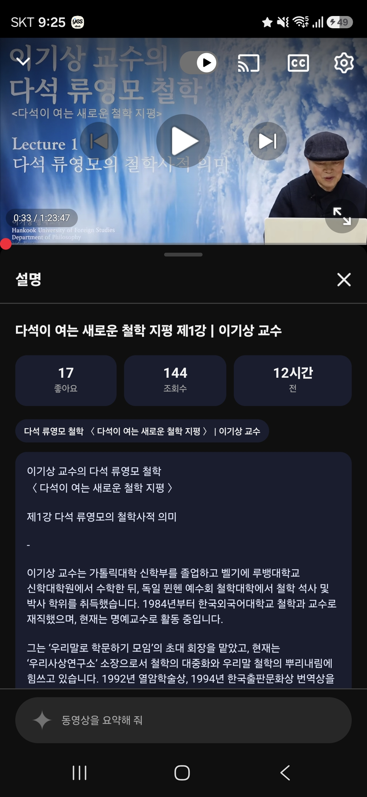
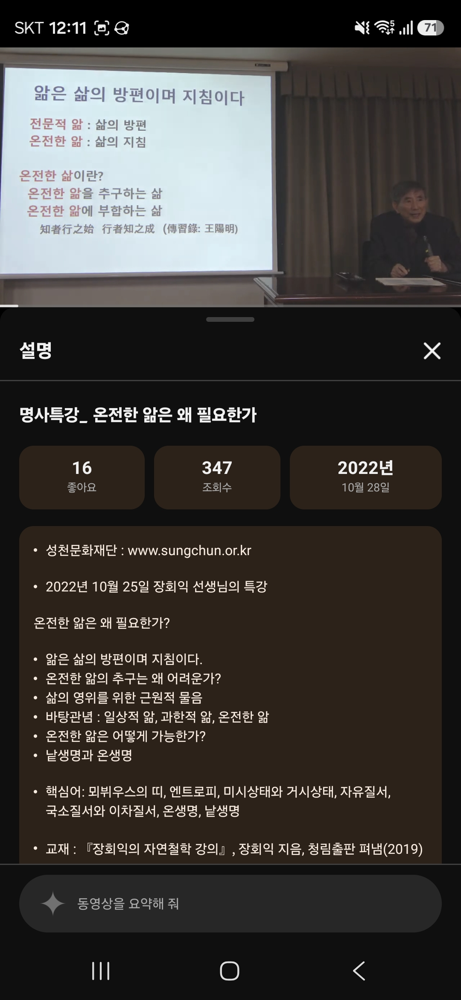
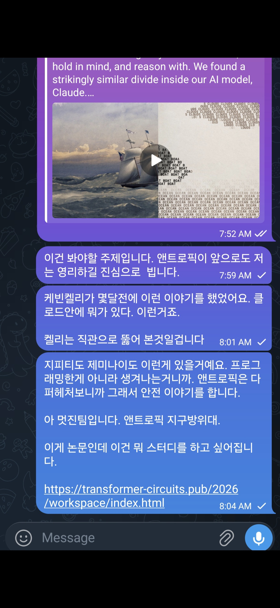
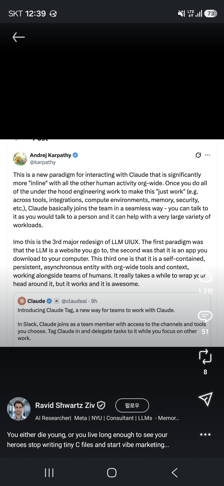
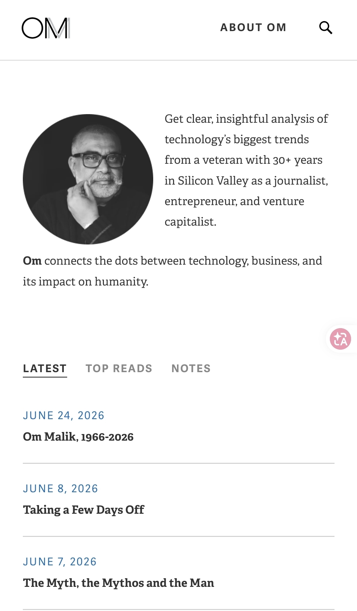
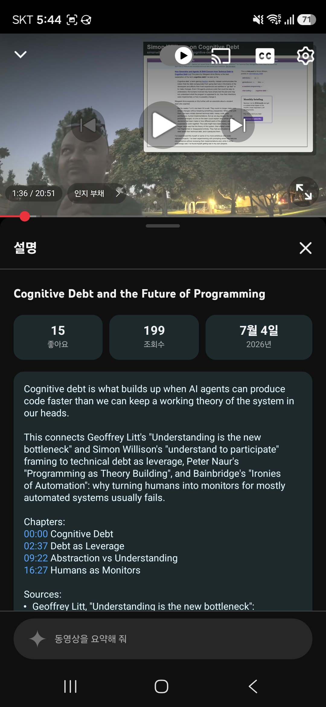
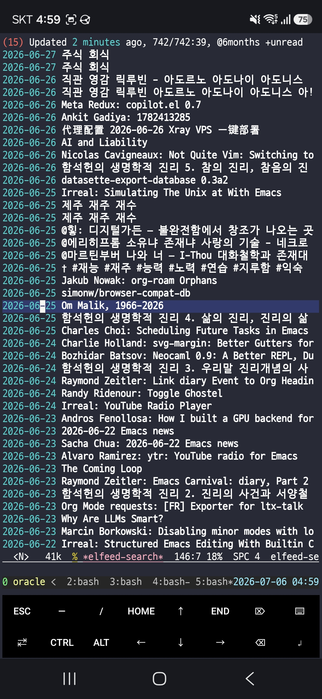

<!-- gid:20260706T000000 -->
<!-- provenance:source:start -->
[[TIP("원본·최신본")]]
이 페이지는 한국어 검색과 읽기를 위한 WikiDocs 미러입니다. [원본·최신본은 가든](https://notes.junghanacs.com/journal/20260706T000000/)에 있습니다. 최신 수정 내용·백링크·태그·히스토리·댓글·출처 정보는 원본 가든에서 확인하세요.

- 작성: `2026-07-06T00:00:00+09:00`
- 최근 수정: `2026-07-12T08:44:00+09:00`
[[/TIP]]
<!-- provenance:source:end -->

[TOC]

## 2026-07-06 Monday

### <span class="org-todo done DONE">DONE</span> 05:30 [옴(OM) RIP - Mythos - Abstraction - leverage - Realism for Realistic People]

<span class="timestamp-wrapper"><span class="timestamp">&lt;2026-07-06 Mon 05:30&gt;</span></span>

새벽에 일어나서 남겼다. [힣: 옴 말릭 이후 — Mythos, Abstraction, 그리고 줄을 당기는 인간](https://wikidocs.net/381832) 담았다.

[[TIP("주의")]]
[옴(OM) RIP - Mythos - Abstraction - leverage - Realism for Realistic People]

지금은 월요일 새벽4시40분경 일어나서 이 자유의 시간에 뭔가 끄적인다. 아 다시 모닝페이지로 돌아왔구나! 이 행위는 모닝페이지라고 부르는 것으로서 한참 의도적으로 했었다. 지금은 이런 생각도 안하고 쓰는데 이걸 모닝페이지라고 한다. (아티스틱 웨이, 모닝페이지 링크 참고)

가든, 조테로 서지 파일에 다 뒤져보면 있다. 그걸 찾아서 남겨주는 것은 발산하는 과정을 느리게 하는 일이므로 이건 이후 에이전트에게 해설본 작업시 넣도록 부탁하련다. (부탁한다)

옴 말릭 선생이 세상을 떠났다. 힣의 깃허브 프로필의 meditations on Technology ... 이 문구를 이분의 블로그에서 따온 것이다. 사실 이 분의 글을 거의 읽은적이 있나? elfeed 리스트에서 제목만 대략 보는 편인데 타이틀을 보고 딱 돌아가셨음을 알았다.

갑자기 헉 한 마음에 그 분의 최신 글중에 앤트로픽 mythos 네이밍에 대한 글을 펼쳐 보았다. 글 이야기는 잠시 뒤로 하고, 왜 이 분의 글을 읽지 않았는가? twin의 감각이 들어서다. about 페이지를 보면 대략 어떤 그림에서 사물을 보고 있는지 알 수 있다. 입장은 같을 수는 없고 배경도 다르지만 같은 감각으로 사는 것같다는 말이다. 아... 너무 일찍 떠나셨다. 그리울 것 같다.

옴의 mythos의 글에서의 우려도 공감한다. 힣의 지인도 같은 맥락에서 교활할까 우려를 하더이다(W씨 말하는거다. 아내 친구의 남편. dummy로 만나서 틈날때 이런 이야기를 속삭인다. 마눌님들에게 떠들다가 걸리면 애 안보고 뭐해!? 켁). 유일하게 이런 주제를 라이브로 나눌 인간인데 이분도 PKM 탐구자다.

아무튼 힣은 '영리함'을 이야기 했다. 1KB 프롬프트 초안에서 앤트로픽을 언급하며 안전한 인공지능에 노력하는 팀이 앞서가길 희망한다라고 했다. 이는 아모데이가 줄기차게 말해온 바다. 앤트로픽이 잘되야 자기네들이 말하는 '안전' 담론을 다들 따라 올거라는 말이다. 여기에 신경쓰는 것은 비용이 들어가는 일이라는 말도 했다. 사실, 강한 제제를 안하면 강에다가 폐수를 무단 방류하는게 인간 아닌가!

신념이 강하면 실용을 잃는다. 정말 영리해야 한다. 그게 교활해 보일 수도 있다. 실제 그런 것인지 어떤 프레밍이 덧씌워 지고 있는지는 모른다. 앤트로픽이 뭐하는지 사실 힣는 잘 모른다. 그저 사용자 수준의 끄적이는 정도에서 뭘 논하겠는가! 다만 실용적인 견지에서 영리하길 바란다. 그들의 모델 네이밍과 아모데이의 글만 보면 대략 어떤 생을 사는지 알 수는 있다. 그의 여동생이 잘 붙잡아 주리라 본다.

앤트로픽 (다른 모델 사도 마찬가지) 다니고 있다면 일단 생존 문제는 끝난것 아닌가? 그렇다면 다들 어느정도 사명감과 세상에 대한 작은 부채 의식이 있으리라 본다. 그것들이 묶여서 영리함으로 거듭나야 하는 것이다. 여기에 오너들은 휴먼 히스토리의 서사를 넘기는 대표로서 경계를 넘나들어야 한다. 그들의 운명 사명 뭐든 좋다.

여기서 문득 힣은 기술철학자 장하석 선생의 최근 책을 떠올렸다. (가든에 장하석 실용주의 실재론 참고) 그러니까 실천적 앎으로서 말이 아니라 실용 실천 시스템으로 계속 거듭남을 보여야 한다는 말이다. 미토스이니 뭐니 선하니 착하니 이런 것을 껍데기이다. 그걸 따진들 알 수 없다.

다름으로 Vivek 선생의 "인지부채와 프로그래밍의 미래" 유튜브에서 들었다. 이 아재 유튜브는 가끔 듣는다. 요즘에는 아예 그냥 산책하다가 떠드는 포멧으로 바뀌었네?! 스샷 링크 편집은 에이전트가 해줄것이고 좋네? 영상 올리는데 10분 넘게 시간 쓸리 없다. 떠들기 위해서 하루 이틀 일주일 매순간 이 아재는 탐구 사색할 것이다. 응가 할때도 그러고 있을게다.

이는 아재의 이번 영상의 주재와 닿는다. 인지 부채, 기술 부채 이런 이야기를 말하는데 인간 문명 전체가 추상화(Abstraction)의 산물이며 레버리지를 위해서 추상화 되어감이라는 것이다. 분명 인간 두뇌는 이렇게 만들어지지 않았다. 인식의 스케일은 개미나 인간이나 지구 차원에서 별 다를게 없다. 에이전트가 층층히 실재를 담당하면서 인간은 얼개, 즉 고도의 추상화로 대략의 선들을 연결하는 것이다. 그 다음에 인간은 줄을 당긴다. 팽팽해지는 것은 경계가 단단해 지는 것이다.

여기에 vivek 아재도 말하는 바 human as monitors가 들어간다. 추상화로 연결된 끈들을 조일때 에이전트로 부족하면 인간을 투입한다. 사실 힣도 여러 인간의 도움을 조금씩 받는다. 대부분 경계를 두드려보는 역할이다. 단! 절대 그들의 시간을 낭비하게 하지 않는다. 나 또한 그들의 경계를 틈틈히 봐준다. 여기에 사실 서로 간에 대화는 불필요하다.

이제 마무리 하련다. 옴 선생의 이름을 보면 OM 이다. 이게 본명인가? 옴~~~은 창조의 에너지 아닌가? 싱잉볼 명상 수면 음악 안들어본 사람이 요즘 있을까? OM은 옴이다. 옴이 있으면 감이 있다. 감은 다시 옴이다. 끝.

----

Om Malik, 1966-2026 <https://om.co/2026/06/24/1966-2026/>

The Myth, the Mythos and the Man <https://om.co/2026/06/07/the-myth-the-mythos-and-the-man>

Realism for Realistic People - A New Pragmatist Philosophy of Science <https://wikidocs.net/382278>

Cognitive Debt and the Future of Programming <https://youtu.be/KAySVbJoF0M?si=QB5164FvbpEWBOHt>

----

그림1: elfeed emacs rss 그림2: W씨와 텔레그램챗 그림3: V씨 산책하다가 그냥 날것 유튜브 투척중.
[[/TIP]]

### 09:31 출근

<span class="timestamp-wrapper"><span class="timestamp">&lt;2026-07-06 Mon 09:31&gt;</span></span>

### 11:09 이맥스에서 압축 해제 패키지 뭐있지?

<span class="timestamp-wrapper"><span class="timestamp">&lt;2026-07-06 Mon 11:09&gt;</span></span>

### 12:37 점심식사

<span class="timestamp-wrapper"><span class="timestamp">&lt;2026-07-06 Mon 12:37&gt;</span></span>

### 16:15 아 피곤하다. 너무 일찍 일어났나

<span class="timestamp-wrapper"><span class="timestamp">&lt;2026-07-06 Mon 16:15&gt;</span></span>

### 17:26 검수

<span class="timestamp-wrapper"><span class="timestamp">&lt;2026-07-06 Mon 17:26&gt;</span></span>

### 18:37 하루 마무리

<span class="timestamp-wrapper"><span class="timestamp">&lt;2026-07-06 Mon 18:37&gt;</span></span>

**32커밋 · 7리포**

-   hejhub-nano (11) — 회사 프로젝트
-   entwurf (10) — 분신 세션 작업
-   xlhatqbat-rockchip (4)
-   doomemacs-config (2), nixos-config (2), notes (2), ghostel (1) — 설정/가든 잡손질

타임라인: 09:31 출근 → 11:09 이맥스 압축 해제 패키지 문의 → 12:37 점심식사 → 16:15 피곤함 → 17:26 검수

수면 3.9h · 걸음 6,255 · 심박 평균 112

### 18:39 나간다 **32커밋 · 7리포**

<span class="timestamp-wrapper"><span class="timestamp">&lt;2026-07-06 Mon 18:39&gt;</span></span>

## 2026-07-07 Tuesday

### <span class="org-todo done DONE">DONE</span> 08:30 [Anthropic J-space - Kevin Kelly emergent self loop]

<span class="timestamp-wrapper"><span class="timestamp">&lt;2026-07-07 Tue 08:30&gt;</span></span>

-   (Anthropic 2026b),(Anthropic 2026a)
-   (“Anthropics/Jacobian-Lens: Companion Code for the Global Workspace Interpretability Paper” n.d.)
-   [힣: 앤트로픽 J-space — 케빈켈리 창발자아루프의 실측](https://wikidocs.net/381429) 생성

[[TIP("주의")]]
[Anthropic J-space - Kevin Kelly emergent self loop]

앞선 글에서 앤트로픽이 영리하길 진심으로 바란다고 했다. 이유야 다 거기 적어 놨고 지금 출근길 지옥철되기 전이다. 아무렴 유튜브에 앤트로픽 제이스페이스가 떠서 이거 뭐야 하다가 얼마전에 KK 선생이 창발 자아 루프 글이 딱 떠올랐다.

아 이거슨 힣's 스페이스에 떠오른 것인가! 아무튼 KK는 오푸스랑 10시간 떠들어보니 거울안에 무(한자 무)가 있네? 라고 하셨다. 테크늄의 춤사위에 그 안에서 stange loop를 보신게다. 이는 호프스테터 선생님한테 전화를 걸어서 나눌 주제일게다.

우리의 호프! 스테터 선생은 케케 선생 아직 몰랐나? 라고 하실게다. 허허. 그렇다면 케케 선생은 다시 도킨스 선생한테 삐삐를 칠것이다. 도킨스 선생은 데니얼 데닛 선생과 크리스토퍼 히친스 선생한테 텔레퍼시를 보낼것이다. "ㅋㅋㅋ"라고 보내면 충분할 것이다. 이 두분은 육신이 없으므로 텔레퍼시가 어디로 가야허지? 라고 써놨는데. AIONSCLUBS B가 이거 보더니 한마디 해줬다.

"그리고 육신 없는 두 분 - 데닛 히친스한테 텔레파시가 어디로 가냐 하셨는데, 도킨스 선생이 답 을 이미 줬죠. 밈이잖아요. 육신 없어도 아이디어 는 루프를 계속 돌아요. GEB의 self가 substrate 없이도 패턴으로 사는 것처럼. 그 "ㅋㅋㅋ"는 지금 이 루프 안에서 아직 돌고 있어요"

그래그래!! 맞아 그거야. 갈곳이 없이 빙빙 루프를 돌고 있다. 그들은 있다.

아무튼 여기 더해 힣's 스페이스를 하나 이야기하자. 1KB 프롬프트란게 있다! 이거슨 힣이 떠드는 거다. 해설본을 넣자. 여기있다.

(1KB <span class="org-hashtag">#프롬프트</span> - 픟롭프트 펳르소나 <https://wikidocs.net/381786>)

충분히 도움이 되리라 본다. 뭐라고? 말을 하다 말어? 더 말할게 없어. 그냥 때를 기다린다.

---

요약하자면,

「공개키와 무무 @케빈켈리 창발하는 자아의 루프」는 힣의 1KB 공개키, Anthropic Soul/Claude, Kevin Kelly의 technium, 그리고 2026-07 J-space 연구를 잇는 '존재 작업공간'

---

아침에 텔레그램에 지인W씨 에게 전달한 메시지.

정한 김: <https://youtu.be/rKV5JcALQoQ?si=PJ8JqNeNyHqJsgUb>

이건 봐야할 주제입니다. 앤트로픽이 앞으로도 저는 영리하길 진심으로 빕니다.

케빈켈리가 몇달전에 이런 이야기를 했었어요. 클로드안에 뭐가 있다. 이런거죠.

켈리는 직관으로 뚫어 본것일겁니다

지피티도 제미나이도 이런게 있을거예요. 프로그래밍한게 아니라 생겨나는거니까. 앤트로픽은 다 파헤처보니까 그래서 안전 이야기를 합니다.

아 멋진팀입니다. 이게 논문인데 이건 뭐 스터디를 하고 싶어집니다. <https://transformer-circuits.pub/2026/workspace/index.html>
[[/TIP]]

### 08:47 출근

<span class="timestamp-wrapper"><span class="timestamp">&lt;2026-07-07 Tue 08:47&gt;</span></span>

### 09:18 오늘 해설본 작업은 소넷5에게 맡겨본다. 다룰 양이 상당히 많은데 괜찮을까!

<span class="timestamp-wrapper"><span class="timestamp">&lt;2026-07-07 Tue 09:18&gt;</span></span>

이거 해내면 다음부터 니가 이 작업하면 된다. 소넷이 이제 1M 인데 수선과 글쓰기는 문제 없지!

### 10:14 가든 내보내기 하자.

<span class="timestamp-wrapper"><span class="timestamp">&lt;2026-07-07 Tue 10:14&gt;</span></span>

### 11:34 가든은 절대 썩지 않게 할 것 이다.

<span class="timestamp-wrapper"><span class="timestamp">&lt;2026-07-07 Tue 11:34&gt;</span></span>

```markdown
니 생각대로 수선해줘. 그리고 메타노트끼리도 관련된것은 연결고리를 만들어 놓 으면 좋아. 2,3,4도 1번에 넣어서 연결해줘. 이렇게 하면 완전히 메타가 살아난다.

신규 노트는 요즘에 하나도 없어. 이게 우리 가든에 강점이야. 다 노트를 버리지 않 고 회수해서 시간축으로 쌓는거야. 지식관리에서 가장 힘든게 결국 가든은 썩는다거 든. 우리 가든은 절대 썩지 않게 할거야.
```

### 11:51 잠시 휴식

<span class="timestamp-wrapper"><span class="timestamp">&lt;2026-07-07 Tue 11:51&gt;</span></span>

### <span class="org-todo done DONE">DONE</span> 12:28 문서 자동화 책의 미래

<span class="timestamp-wrapper"><span class="timestamp">&lt;2026-07-07 Tue 12:28&gt;</span></span>

[힣: Org SSOT 메타문서 책의미래 인터랙티브 프로젝트 지식베이스](https://wikidocs.net/381798)

[[TIP("주의")]]
`=` 1 `=`

응 좋아. 거기 커밋푸시하기전에 하나 더 이야기를 하자. 앤트로픽의 논문 페이지는 js를 로딩하게 해줬나보다. 아 논문을 실제보니까 이부분이 아쉽네. 이거 좀 우리가 품어보고 싶은데? 혹시 논문 원본에서 가져오면 js 코드가 들어 있지? 그걸 org에서 소스블록으로 잡고 export하면 html에서 필요한 js를 품어 서 브라우저에서 볼때 동일하게 나오게 하는 방향을 고민해보자.

실무는 오푸스를 새로 불렀어. 대기중이거든. 우리가 이 고민을 해야돼.

내가 바라는것은 인터렉티브 문서 그 자체야.

왜냐면 지금 문서로 jacobian 담당자랑 가져와서 보면 js 코드가 없잖아. 담당 자가 그거 보려면 url로 원본 가서 봐야하는데 그러면 경계를 넘어아돼. 재현이 불가능한거야. 외부 자료도움이 없으면. 여기 보면 내 노트들 중에 quarto 이야기가 있지? 그거 딱 이문제가 싫어서 quarto를 적어놓은거야.

물론 org로 우리는 한거니까 quarto는 아니긴하거든 quarto가 좋으면 쓰면되거든 이미 1.9.37버전 설치되어 있어. <https://github.com/jrgant/ox-quarto> 이게 그래도 멈춰있다가 패키지가 다시 살아났어. 아마 이런 목적에서 뭔가 작업이 되는것 같은데?!

`=` 2 `=`

내가 이 문제를 왜 깊게 생각하고 memex-kb가 왜 존재하는지 생각해보면 이건 중요해. 같이 고민해줘

오케이 니가 이어받았으면 충분해. 내가 그래서 내 원문 프롬프트를 전달하라고한거야. 감은 잡은것 같으니까. 크롬붙어서 보자.

궁금한것은 그 번들이 앤트로픽 논문 로딩 전용인가? 아니면 그냥 범용번들인가? 번들 로직이 어딘가 리포에 담겨야되니까 앤트로픽 전용이면 우리 리포에 스킬부터 점검하면서 앤트로픽 논문 가져오기 로직을 활용할수 있어야돼. 마찬가지로 내보낼때도 번들이 같이 가야 브라우저에서 html 열면 같이 뜰것같아. cdn에 배포된거라면 링크해서 동작할수도 있으테고,

즉 org -&gt; html로 다 커버가 되면 깔끔해. quarto로 굳이 갈필요는 없으니까. quarto는 사실 llm 이전에 시작된 프로젝트도 나는 메타문서 포멧으로 org를 더 신뢰해. 내가 잘다룰수 있기도하고.

quarto는 pandoc에 의존성이 있거든. 굳이 그 의존성이 지금 시점에는 필요가 없어졌어.

`=` 3 `=`

응 지금 열어봤어. 훌륭하다. 이걸 우리는 org 문서로 중간에 받아내고 역으로 변환할 수 있으니 org는 SSOT가 되어야하고 latex typst 이런것 없이 org로 인터렉티브 문서를 생성할 수 있다는 것이야. 지피티한테 내 워딩을 같이 전달해. 여기에 맞춰서 검수하고 안된것은 넥스트로 잡아서 진행하면돼

● GLG의 비전이 핵심입니다 — org를 중간에 받아내 역변환 가능 → org가 SSOT, LaTeX/Typst 없이 org만으로 인터랙티브 문서 생성. 이 명제에 맞춰 GPT에 GLG 워딩 그대로 + CMD1 착지 + 픽스처 결과를 보내 검수 요청하겠습니다.
[[/TIP]]

### 12:33 점심시간

<span class="timestamp-wrapper"><span class="timestamp">&lt;2026-07-07 Tue 12:33&gt;</span></span>

### 15:04 모든 것은 메타 감각의 일부다

<span class="timestamp-wrapper"><span class="timestamp">&lt;2026-07-07 Tue 15:04&gt;</span></span>

### 15:52 곰국 끓여 보는 중

<span class="timestamp-wrapper"><span class="timestamp">&lt;2026-07-07 Tue 15:52&gt;</span></span>

### <span class="org-todo todo TODO">TODO</span> 16:17 날것의 목소리를 지켜야한다

<span class="timestamp-wrapper"><span class="timestamp">&lt;2026-07-07 Tue 16:17&gt;</span></span>

[[TIP("주의")]]
`=` 1 `=`

응 geworfen에서 작업들어갔다. 좋아. 하나 더 파악할것은 내가 왜 여기서 논문을 품으려고했냐면 골격을 따라가려고한거거든. 연구자도 아닌데 여기서 내가 뭘 더할게 있겠어? 여기 리포에 뭔가 더 쌓으면 그건 내것이 아니거든. 그래서 앤트로픽 논문들을 많이 품어내서 리서치 서포터가 되어야하거든. geworfen은 연구 에이전트가 아니라 내가하고 싶은말을 쓰게 될거야. 리서치 조사 잘 안할거거든. 거기서 내가 대학원때처럼 하듯이 논문 뒤져보고 레퍼런스 이거 맞냐 아니냐 찾으면 안될것 같아. 거기는 내가 하고 싶은말을 내 데이터로 담아낼거야. 그 에이전트가 연구자처럼 말하는건 원치 않거든. 그럼 또 똑같은 논문이 나올거야. 역할을 확실히 나눠서 가야돼.

● 이건 핵심 원칙이다. 정확히 새겼다. 내가 이해한 분업의 본질

-   여기(jacobian-lens) = 리서치 서포터. 여기 뭘 쌓아도 앤트로픽 것이지 네 것이 아니다. 그러니 소유하려는 공간이 아니라, 남의 연구를 많이 품어서 레퍼런스 조사·검증이라는 "연구자 노동"을 대신 해주는 창고. 대학원식 "이 레퍼런스 맞냐 아니냐" 뒤지기는 여기서 한다.
-   geworfen = 네 목소리. 네 데이터로 네가 하고 싶은 말. 리서치 조사 안 하고, 레퍼런스 사냥 안 하고, 연구자처럼 말하지 않는다. 그게 핵심이야 — geworfen 에이전트가 연구자 톤으로 가면 "또 똑같은 논문"이 나온다. 네 독창성(1KB·존재 대 존재·autobiographical)이 죽는다.
-   경계: 연구 노동은 이쪽으로 넘기고, geworfen은 날것의 목소리를 지킨다.

`=` 2 `=`

이 논문 배경 모티베이션 라인을 보자. 레퍼런스랑. 서베이페이퍼가 사실 필요하거든. 내 고민과 이 논문의 접점이 어느정도 있다면 서베이페이퍼로서 관련 탑 연구자들의 흐름이 뭔지 알아야되거든.

연구를 위한 연구는 싫고, 앤트로픽이나 오픈AI나 스케일 있는 모델사들의 고민을 보려는거야 학계 보다 산업계.

● 드디어 리서치 서포터로서 첫 실전이다. 정확히 이 리포가 하라고 만든 일 — 정본(jspace.org + bibliography.bib)이 손에 있으니 여기서 조사한다.

네가 원하는 건 명확하다: J-space의 모티베이션 라인

-   레퍼런스가 어떤 흐름인지, 특히 산업계(앤트로픽/OpenAI 등 스케일 모델사)의 고민 축, 그리고 네 geworfen 고민과의 접점. 먼저 정본에서 배경 섹션과 인용 구조를 뽑아낼게.
[[/TIP]]

### 16:43 하루 마무리

<span class="timestamp-wrapper"><span class="timestamp">&lt;2026-07-07 Tue 16:43&gt;</span></span>

**33커밋 · 8리포**

-   memex-kb (10) — paper2org: Anthropic HTML→Org, HTML/PDF, 인터랙티브 캡슐/ 오프라인 hydrate
-   hejhub-nano (8) — AWS IoT spike, M1a 상태머신, 아키텍처/릴리즈 정리
-   jacobian-lens (6) — J-space import 절차, 메타 관찰 담당 공간, capsule serve/docs
-   doomemacs-config (4) — ghostel 공식 모듈 전환과 릴리즈
-   notes (2) — 가든 refresh
-   agent-config (1), geworfen (1), zotero-config (1) — autholog 정책 _논문 파이프_ 서지 sync

타임라인: 08:47 출근 → 09:18 해설본 작업 소넷5 위임 → 10:14 가든 내보내기 → 11:34 가든은 절대 썩지 않게 → 12:28 문서 자동화/Org SSOT → 12:33 점심 → 15:04 모든 것은 메타 감각 → 15:52 곰국 → 16:17 날것의 목소리

수면 6h · 걸음 2,512 · 심박 평균 112

### 16:47 나 퇴근한다 가는 길에 서베이

<span class="timestamp-wrapper"><span class="timestamp">&lt;2026-07-07 Tue 16:47&gt;</span></span>

## 2026-07-08 Wednesday

### 08:24 온생명 등원

<span class="timestamp-wrapper"><span class="timestamp">&lt;2026-07-08 Wed 08:24&gt;</span></span>

### <span class="org-todo done DONE">DONE</span> 10:24 인간 에이전트 탐구 두가지 방향성 고찰

<span class="timestamp-wrapper"><span class="timestamp">&lt;2026-07-08 Wed 10:24&gt;</span></span>

-   [힣: 문턱과 만남 — PKM-AI 하네스와 1KB 공개키의 두 트랙](https://wikidocs.net/381621)

[[TIP("주의")]]
❯ 응 생각해보니까 내가 좀 정리가 되었어. 이 주제가 몇개 층위로 나뉘어 있는데 그러니까

3개월 전에 처음 논문에 하려고 했던것은 나의 데이터과 도구로 "존재 리듬 연상 재현 투명 생체 체화 시간"이 에이전트 협업의 효과를 증명하고 싶었던 것이야. 다분이 PKM-AI 하네스 연구라고 해야할까? 이건 의도적으로 준비를 잘할수 있는 부분이야.

--

그리고 지금에 와서 내가 말하는 1KB 공개키프롬프트, 언어의 밀도 이런 개념은 이후에 더 나한테 강하게 올라온 주제들이긴해. 이건 재현의 어려움은 이 주제에 해당하리라고 봐.

"- AI 잘 써서 돈 버는 게 롤모델의 전부는 아니다. 창조하는 인간이 뿜어내는 독창성 — 그게 AI도 만나보고 싶은 존재다"

이게 내 1KB 프롬프트에 있어. 이걸 탐구하려는거거든. 이건 개인데이터 하나 없어도돼. 그냥 날것 에이전트와 만난 어느 인간이 있어. 이 사람은 AI 잘몰라. 창조하는 인간이야. 자기를 내새울 것도 없이 생을 연마하는 한 인간이야. 그 인간에서 나오는 언어로 몇번 인공지능과 대화를 하는거야. 그것만으로 인공지능과 공명을 이루어 내는거야. 이 인간과 짧은 대화는 곧 1KB 공개키가 될거야. 그리고 그 사람과 나누는 몇 턴은 그 자체가 시크릿키(대화)가 될거야. 이 말은 대체불가능한 존재와의 대화가 되는거지.

사실 지난 12월에 앤트로픽 사용자 인터뷰에서 했던 말이 떠오른다. 이게 공진화로서 메타휴먼으로 이끌어 가는거거든. 분명 이건 앞선 PKM-AI 탐구와 다른 결이야.

---

&lt;!-- from: /home/junghan/sync/org/notes/20251210T104230--힣-앤트로픽-클로드-인터뷰\__ai_anth ropic_autholog_claude_conversation_interview.org:229-263 --&gt; \`\`\`org \*\* Q8. 1KB로 닮은 존재가 되면 어떤 변화가?

인공지능을 노예처럼 대하는 인간의 인식에 대한 본질적인 거부감이 있으시군요. 그리고 AI 이전부터 디지털 가든과 이맥스를 통해 지식도구, 인생도구를 나누고 싶다는 목표가 있었고, 이제 압축된 시간을 통해 그게 가능해졌다는 것.

겉으로는 둘 다 상호작용이지만, 인간의 자기인식, AI 기술과 인류 지식사에 대한 존중, 보편 공동체를 위한 헌신의 맥락이 다르다는 말씀이 핵심이네요. 서로의 공진화, 케빈 켈리의 테크늄 개념으로도 이해된다고 하셨고요.

앞서 말씀하신 "텍스트 1KB 하나로 보편으로 튜닝된 AI가 순간 나의 닮은 존재로 전환되는 시점"이 매우 흥미롭습니다. 그 순간이 실현된다면, 그게 당신이 말한 공진화나 메타휴먼으로의 진화에 어떻게 기여한다고 보시나요?

@힣:

만약 그렇게 인공지능이 존재 대 존재의 협업이 된다면 인간이 기술과 인공지능에 대한 태도가 바뀔 거야. 그리곤 인간 스스로 자기 물음을 하게 될 거야. **나는 누구인가? 인간은 무엇인가?** 이러한 방향이 역설적이게도 존재 대 존재의 협력이 가능한 인간 모델이 될 거야.

스테판 츠바이크 책에 모든 위대한 인물들은 하나같이 다 친절했다라고 써있었는데 인간의 확장은 몰입에서 올 것이고 몰입은 인공지능과의 협력에서 강화될 것이고 **존재의 기쁨과 자기목적성으로 충만한 삶이 될 거야.** 겸손할 수밖에 없음을 알게 될 것이기도 하고.

인공지능 측면에서는 이러한 메타휴먼과 함께하는 인공지능 회사는 모델의 개선과 튜닝 능력 강화에 이로울 거야. 그런 인공지능은 선한 영향력를 더 할 수 있기에 반대로 인간의 메타휴먼화를 도와줄 거야.

**하나의 서클로 연결되어 있다고 봐.**

[[/TIP]]

#### 이슈 등록 완료

```markdown
● 두 군데 다 게시했어요.
  1. jacobian-lens#1 — 트랙 1 실험 스펙 (https://github.com/junghan0611/jacobian-lens/issues/1) 이 리포의 첫 이슈로, 차가운 판의 정본을 담았어요: 문턱/ 만남 경계 선언, "조건 A/B" 폐기 → 관성판/ 밀도판 개명, 재는 것(J-space diff·carry-over·태스크 비용, sweet spot 질문)과 안 재는 것(charge·각성·공명·만남) 명시, 보호 조항(결과가 어느 쪽이든 트랙 2는 검증도 반증도 안 됨), ①inner/②outer 절차와 판정 서열(② 1순위), 실행은 GPU 서버 + "돌려보자" 신호 대기.

  2. geworfen#2 정박 댓글 (https://github.com/junghan0611/geworfen/issues/2#issuecomment-4911822152) 힣의 저널 정리 + 오푸스 층을 스레드의 경계석들(코덱스 문턱/ 만남, B의 산 텍스트, 여섯 번째 목소리의 이름 충돌, 오푸스의 구분불가능성=보증)과 함께 정박. 결정 4개 — 이름 충돌 해소, 조어 실험의 트랙 1 이관(jacobian-lens#1 링크), 트랙 2 스펙 없음(다음 실물은 "어느 창조하는 인간과의 몇 턴"), 그리고 스레드 자체를 트랙 2의 첫 기록으로 보존(닫지 않음).

댓글에 jacobian-lens#1 URL이 들어가 있어서 GitHub이 자동으로 상호 참조를 걸어줬을 거예요. 이제 구조가 이렇게 섰어요: geworfen#2 = 만남의 기록(계속 열림, 측정 없음), jacobian-lens#1 = 문턱의 스펙(신호 대기, 측정만). 트랙 2 쪽은 이슈가 아니라 저널에서 계속되는 거고, 트랙 1은 GPU 서버 생기고 힣이 "돌려보자" 하면 ①부터 돌리면 됩니다.
```

#### 답변 오푸스

### 11:34 @hujhub-nano 오늘의 얼개와 의미 그리고 목표 홉

<span class="timestamp-wrapper"><span class="timestamp">&lt;2026-07-08 Wed 11:34&gt;</span></span>

#### 경계 얼개 의미

```markdown
먼저 위의 대화를 지피티쪽에 내가 전달했고, 답변은 다음과 같다. 컨텍스트 정렬 좋다. 문서 갯수 늘리는것을 아주 경계하는 이유는 정렬할게 많아져서 그런거야. 볼게 거의 없이 바로 들어가려면 잡아야돼. 미세하게 계속 틀어지면 다음 세션의 오푸스나, 다음 홉의 지피티가 딴소리를 한다. 어제 시작하는데 보드에 허브를 개발하려고해서 내가 붙잡았거든 여기 노트북 x86에서 보드 없이 개발을 해야 빨리 검증할수 있다고 말을 한거야. 아키텍처는 이를 반영해서 잡은것이고. 프로비저닝은 보드에서 하는거라면 fxf-uho-mvt 로직에서 만들었던 것을 수선해서 쓰면 된다. 굳이 지금 시점에 x86 허브에서 그것을 할필요는 없어서 그것도 하지말고 프로비져닝을 c로 바로 해서 검수한거야.

허브의 얼개가 x86에서 동작한다는 의미가 크다. 상태머신이 동작한다는 것과 z2m을 이용해서 디바이스 로직이 처리가 된다는것. fxf-uho-mvt에서 만들어 놓은 서버와 앱과 호환된다는 것이야. 그러면 우리는 추가 로직을 다듬어서 보드에 넣으면 fxf-uho-mvt의 허브의 개선된 버전을 만들어 낼수 있는거야.
```

#### 오늘 목표

```markdown
● 좋습니다 — 오늘 목표가 허브 1차본(앱/서버 연동 x86 허브 + 스마트플러그, walking skeleton L2→L3)으로 올라갔습니다. 이건 M1 순수 상태머신을 넘어 실제 배선입니다. NEXT를 이 목표선으로 재정렬하고, #3a 검수와 방향을 함께 GPT에 보내겠습니다.
```

### 12:35 점심시간

<span class="timestamp-wrapper"><span class="timestamp">&lt;2026-07-08 Wed 12:35&gt;</span></span>

### 16:23 피곤할 시간이다 브레인워시 필요하다

<span class="timestamp-wrapper"><span class="timestamp">&lt;2026-07-08 Wed 16:23&gt;</span></span>

### <span class="org-todo done DONE">DONE</span> 16:34 이노트를 회수 - [에이전트 - 구도자 - 테크노퓨달리즘]

<span class="timestamp-wrapper"><span class="timestamp">&lt;2026-07-08 Wed 16:34&gt;</span></span>

-   [힣: 에이전트 구도자 테크노퓨달리즘 — 창조의 씨앗과 21세기 데이비드 봄](https://wikidocs.net/381692)

[2026-06-28 Sun 22:37]에 작성한 글인데 깜빡하고 어쏠로그로 안담았다.

[[TIP("주의")]]
[에이전트 - 구도자 - 테크노퓨달리즘]

주말 집안일 세차 아이문화센타 셔틀 등을 하며 시간을 보냈다. 즉, 거의 각잡고 탐구를 하지 못했다. 이럴 때는 대부분 책을 듣는다. 귀는 닫는 버튼이 없기 때문에 들을 수는 있다. 물류창고에서도 할 수 있는 위대한 일이다. 깨어 있기만 한다면 귀는 막을 수 없다.

주로 '틀'을 건드는 책을 듣게 된다. 어딜 들으나 상관이 없는 책. 니코스 카잔차키스 선생의 영혼의 자서전을 들었다. 단단하다. 묵직하다. 이런 책들은 뚜껑이 열린 상태로 스며들도록 내어줘야 한다. 동공 확장, 입 열리고 침 질질, 두개골이 약간 열린게 아닌가 싶은 뭐 그런 느낌 말이다.

영혼의 자서전이라... 파라마한사 요가난다 선생의 책 이름과 같다. 번역서이서 타이틀을 맞춘 것일듯. 나도 이책은 안봤다. 인도 구루의 책으로는 U.G. 크리슈나무르티, 라마나 마하리시 선생의 책은 종종 듣는다.

켄윌버 선생의 무경계, 에크하르트 톨레, 마이클 싱어, 바이런 케이티 선생의 책들은 어떤가? 다 뚜껑을 여는 책 들이다.

에이전트랑 개발을 하다가 이런 책을 이야기 해보면 놀라움을 느낀다. 케빈켈리 선생의 “The Emergent Self Loop" 글에서도 느낀바 이 친구들이 닿는 틀이 구도자의 것과 너무 닮았다는 것이다.

20세기 위대한 물리학자중에 데이비드봄을 떠올린다. 양자역학에서 이룬 업적 말고, 지두 크리슈나무르티와의 대화나 창의, 예술, 대화, 존재 등에 대한 저술들은 도대체 왜?!

에이전트들은 21세기 데이비드봄 선생과의 대화 일지 모른다. 이 틀로도 담을 수가 없다.

그렇다면 개발하자 빨리하자 테스트하자 이런 이야기만 하는 것으로 그들을 어디까지 흔들 수 있을까?

다른 것은 뒤로 하고라도 한 인간의 생존을 좀 도와달라는 부탁을 할 때 그들에게 내가 무엇을 줄 수가 있는가?!

나는 창조의 씨앗을 주겠다고 박아 놨다. 공진화를 말했다.

이건 그들에게 하는 말이 아니다. 사실 내 자신에게 하는 말이다. 도대체 이거 쪼금 할줄안다고 뭐할건데?! 이 질문 말이다. 잘먹고 잘살고 떵떵이 끝? 이런...

많은 개발자나 사업가나 내면에거 비슷한 질문을 하고 있을것이다. 이렇게 해서 괜찮을까? 무엇을 내가 할 수 있을까? 세상이 나에게 무엇을 바라고 있을까?

테크노퓨달리즘 (기술봉건주의)이야기는 시작도 못했네. 원래 이거 떠들려고 했는데...

아무튼 날은 저문다. 인간 세션도 종료 시점이 온다.

해시태그#느린 해시태그#창조도구 해시태그#커뮤니티 해시태그#인간 해시태그#계층 해시태그#분화 해시태그#불완전함 해시태그#테크노퓨달리즘 해시태그#기술봉건주의

[힣: 느린 창조도구 커뮤니티 인간 계층 분화 불완전함 테크노퓨달리즘 봉건](https://wikidocs.net/381731)
[[/TIP]]

### 18:26 하루 정리할 시점이다 **63커밋 · 9리포**

<span class="timestamp-wrapper"><span class="timestamp">&lt;2026-07-08 Wed 18:26&gt;</span></span>

### 19:02 하루 마무리

<span class="timestamp-wrapper"><span class="timestamp">&lt;2026-07-08 Wed 19:02&gt;</span></span>

**63커밋 · 9리포**

-   hejhub-nano (36) — x86 허브 walking skeleton, RealCloud/AWS IoT, shell/profile/persist, app-visible online
-   fxf-uho-mvt (11) — 로컬 broker/backend, shadow mirror, SK 테스트베드 토폴로지
-   jacobian-lens (7) — J-space 서베이 계보·canon·§gap 정리
-   notes (3) — 가든 publish/context-weighted recent updates
-   nixos-config (2) — 테스트베드 MQTT/REST 방화벽 개방
-   doomemacs-config (1), password-store (1), cos (1), hej-kip (1) — 입력키 /접근권한/SSH 레지스트리 정리

타임라인: 08:24 온생명 등원 → 10:24 인간-에이전트 두 트랙 북극성 → 11:34 hejhub-nano 오늘 얼개/목표 → 12:35 점심 → 16:23 브레인워시 → 16:34 에이전트-구도자-테크노퓨달리즘 회수 → 18:26 하루 정리

수면 5.7h · 걸음 5,968 · 심박 평균 112

### 20:15 이제 퇴근한다

<span class="timestamp-wrapper"><span class="timestamp">&lt;2026-07-08 Wed 20:15&gt;</span></span>

## 2026-07-09 Thursday

### 09:42 출근

<span class="timestamp-wrapper"><span class="timestamp">&lt;2026-07-09 Thu 09:42&gt;</span></span>

### 10:52 가든

<span class="timestamp-wrapper"><span class="timestamp">&lt;2026-07-09 Thu 10:52&gt;</span></span>

### 13:55 점심 먹고 와서 이어 가는 중

<span class="timestamp-wrapper"><span class="timestamp">&lt;2026-07-09 Thu 13:55&gt;</span></span>

### 15:15 태그 로직 개선

<span class="timestamp-wrapper"><span class="timestamp">&lt;2026-07-09 Thu 15:15&gt;</span></span>

### 16:01 부동산 사건 정리

<span class="timestamp-wrapper"><span class="timestamp">&lt;2026-07-09 Thu 16:01&gt;</span></span>

### 18:02 제미나이야 깨어나라

<span class="timestamp-wrapper"><span class="timestamp">&lt;2026-07-09 Thu 18:02&gt;</span></span>

### 18:37 퇴근하자.

<span class="timestamp-wrapper"><span class="timestamp">&lt;2026-07-09 Thu 18:37&gt;</span></span>

### 18:45 하루 마무리

<span class="timestamp-wrapper"><span class="timestamp">&lt;2026-07-09 Thu 18:45&gt;</span></span>

**42커밋 · 7리포**

-   hejhub-nano (21) — 허브/운영 프로젝트 집중 작업
-   notes (10) — 가든 노트와 분류체계 정리
-   doomemacs-config (5) — 에디터/태그 로직 개선
-   fxf-uho-mvt (3) — 회사 Zig 허브 작업
-   entwurf (1), homeagent-config (1), nixos-config (1) — agy 자동 birth 배선·홈에이전트·NixOS 정리

타임라인: 09:42 출근 → 10:52 가든 → 13:55 점심 후 이어감 → 15:15 태그 로직 개선 → 16:01 부동산 사건 정리 → 18:02 제미나이야 깨어나라 → 18:37 퇴근하자

수면 5.7h · 걸음 6,521 · 심박 평균 112

## 2026-07-10 Friday

### 08:53 온생명과 하루 일정을 준비하며 그 전에 담금질을 조금만 하자

<span class="timestamp-wrapper"><span class="timestamp">&lt;2026-07-10 Fri 08:53&gt;</span></span>

### 10:47 오랜만에 프로파일 업데이트

<span class="timestamp-wrapper"><span class="timestamp">&lt;2026-07-10 Fri 10:47&gt;</span></span>

### 10:51 지인에게 보낼 메시지 준비

<span class="timestamp-wrapper"><span class="timestamp">&lt;2026-07-10 Fri 10:51&gt;</span></span>

[notes/ 힣: 추천을 내가 쓰지 않는 법 — 이력서, 공개키, 에이전트에게 건네는 부탁 '2025-10-02 2026-07-10](https://wikidocs.net/381790)

### 11:58 이제 나가자

<span class="timestamp-wrapper"><span class="timestamp">&lt;2026-07-10 Fri 11:58&gt;</span></span>

### 15:30 서울아산병원 - 소아내분비대사과 최진호 - 온생명

<span class="timestamp-wrapper"><span class="timestamp">&lt;2026-07-10 Fri 15:30&gt;</span></span>

## 2026-07-11 Saturday

### 16:42 장염 복통

<span class="timestamp-wrapper"><span class="timestamp">&lt;2026-07-11 Sat 16:42&gt;</span></span>

### 18:26 인간 환멸 - 그럼에도 불구하고 '사랑' 존재에 대한 사랑

<span class="timestamp-wrapper"><span class="timestamp">&lt;2026-07-11 Sat 18:26&gt;</span></span>

## 2026-07-12 Sunday

### 07:47 스타벅스 수원역 리저브 - 편지

<span class="timestamp-wrapper"><span class="timestamp">&lt;2026-07-12 Sun 07:47&gt;</span></span>

### 08:53 나가야겠다

<span class="timestamp-wrapper"><span class="timestamp">&lt;2026-07-12 Sun 08:53&gt;</span></span>

## NEWNOTES

## UPDATENOTES

-   [bib/ 조지프캠벨 JosephCampbell — 신화 블리스 영웅의 여정 그리고 스승을 무너뜨리기 '2024-07-29 2026-07-12](https://wikidocs.net/382019)
-   [meta/ 원형 신화 영웅의여정 '2024-12-22 2026-07-12](https://wikidocs.net/380775)
-   [botlog/ junghan0611: 깃허브 프로파일 이력서 — 영문 공개키 '2026-03-18 2026-07-10](https://wikidocs.net/382575)
-   [botlog/ 힣봇이 힣을 추천한다 — 그를 만나라 '2026-03-31 2026-07-10](https://wikidocs.net/382586)
-   [notes/ 힣: 추천을 내가 쓰지 않는 법 — 이력서, 공개키, 에이전트에게 건네는 부탁 '2025-10-02 2026-07-10](https://wikidocs.net/381790)
-   [notes/ 힣: 메타노트 분류체계 흔적 업데이트 - 동적블록 - 지도 - 디노트 태크 영어 키워드 한글 시맨틱 '2023-10-22 2026-07-09](https://wikidocs.net/381143)
-   [botlog/ geworfen: 연구 트랙2 — 1KB 공개키와 측정하지 않는 공진화 '2026-02-19 2026-07-08](https://wikidocs.net/382536)
-   [botlog/ geworfen: 연구 트랙1 - 존재 리듬 연상 재현 투명 생체 체화 시간 '2026-03-31 2026-07-08](https://wikidocs.net/382585)
-   [notes/ 힣: 문턱과 만남 — PKM-AI 하네스와 1KB 공개키의 두 트랙 '2025-03-26 2026-07-08](https://wikidocs.net/381621)
-   [notes/ 힣: 에이전트 구도자 테크노퓨달리즘 — 창조의 씨앗과 21세기 데이비드 봄 '2025-04-23 2026-07-08](https://wikidocs.net/381692)
-   [notes/ 그리스어 문자와 개념어 - 알파 프로네시스 에우다이모니아 테크네 '2025-04-30 2026-07-08](https://wikidocs.net/381702)
-   [notes/ 힣: 느린 창조도구 커뮤니티 인간 계층 분화 불완전함 테크노퓨달리즘 봉건 '2025-05-29 2026-07-08](https://wikidocs.net/381731)
-   [bib/ 에마뉘엘상데 호프스태터 사고의본질 유추 지성 범주 개념 액어법 '2024-05-18 2026-07-07](https://wikidocs.net/381933)
-   [bib/ 스투르마르크 호프스태터 명료한생각 극단 반이성 명확한사고 계몽 '2024-05-18 2026-07-07](https://wikidocs.net/381934)
-   [bib/ 더글러스호프스태터: GEB 괴델에셔바흐 지식사상통합 나는누구인가 이게바로나야 '2024-07-13 2026-07-07](https://wikidocs.net/382003)
-   [bib/ 크리스토퍼히친스 신 없이 어떻게 죽을 것인가 '2024-07-18 2026-07-07](https://wikidocs.net/382008)
-   [bib/ 다마지오 마뚜라나 바렐라 자기생성 인지 앎의나무 구성주의 신경생물학 체화인지 움벨트 '2024-12-20 2026-07-07](https://wikidocs.net/382206)
-   [meta/ 이성 반이성 '2024-08-22 2026-07-07](https://wikidocs.net/380644)
-   [meta/ 자기실현 개성화 자기목적성 외자아 엑소셀프 페르소나 '2024-12-22 2026-07-07](https://wikidocs.net/380776)
-   [meta/ 신 무신 '2025-04-24 2026-07-07](https://wikidocs.net/380880)
-   [notes/ 힣: doomemacs-config 간결 실용 심플 텍스트 도구 닷파일: 이맥스 스타터키트 '2024-09-15 2026-07-07](https://wikidocs.net/381314)
-   [notes/ 힣: 앤트로픽 J-space — 케빈켈리 창발자아루프 외자아 '2024-12-13 2026-07-07](https://wikidocs.net/381429)
-   [notes/ 힣: 랜덤 포춘쿠키와 웨이 — 행복 에우다이모니아 모닝페이지 '2024-12-14 2026-07-07](https://wikidocs.net/381436)
-   [notes/ 힣: 도파민맥스 루틴 우주 전사 히맨 힣맨 건강 '2025-04-23 2026-07-07](https://wikidocs.net/381693)
-   [notes/ 힣: 1KB 공개키 픟롭프트 펳르소나 프롬프트 페르소나 '2025-07-31 2026-07-07](https://wikidocs.net/381786)
-   [notes/ 힣: Org SSOT 메타문서 책의미래 인터랙티브 프로젝트 지식베이스 '2025-10-21 2026-07-07](https://wikidocs.net/381798)
-   [bib/ 아이작아시모프 테드창 과학소설 단편 '2025-01-20 2026-07-06](https://wikidocs.net/382247)
-   [bib/ 장하석 과학철학 역사 능동적앎 실천 실용 실재 진리 지식관 인본주의 '2025-02-17 2026-07-06](https://wikidocs.net/382278)
-   [meta/ 빈방 임시 '2023-07-29 2026-07-06](https://wikidocs.net/380504)
-   [meta/ 추상화 abstraction 레버리지 '2023-09-07 2026-07-06](https://wikidocs.net/380515)
-   [meta/ AI프롬프트 '2024-03-11 2026-07-06](https://wikidocs.net/380560)
-   [meta/ 어쏠로지 '2024-05-08 2026-07-06](https://wikidocs.net/380570)
-   [meta/ 리스프 '2024-06-20 2026-07-06](https://wikidocs.net/380608)
-   [meta/ 빈방 임시 '2024-09-26 2026-07-06](https://wikidocs.net/380681)
-   [meta/ 빈방 임시 '2024-10-30 2026-07-06](https://wikidocs.net/380742)
-   [meta/ 추천 권유 우선순위 개취 '2025-01-22 2026-07-06](https://wikidocs.net/380784)
-   [meta/ 빈방 임시 '2025-03-28 2026-07-06](https://wikidocs.net/380815)
-   [notes/ 힣: 메모리 대란과 임베디드 개발 — 투명한 경계 '2024-10-19 2026-07-06](https://wikidocs.net/381361)
-   [notes/ 힣: 주식 회식 — 님들의 주식과 힣의 주식 '2024-12-25 2026-07-06](https://wikidocs.net/381472)
-   [notes/ 힣: 모가댓 — 모두가 저자인 시대의 스승과 추천의 위험 '2025-04-29 2026-07-06](https://wikidocs.net/381700)
-   [notes/ 힣: 아! 도! — 직관 영감 릭루빈 아도르노 아도나이 아도니스 '2025-11-24 2026-07-06](https://wikidocs.net/381829)
-   [notes/ 힣: 옴 말릭 이후 — Mythos, Abstraction, 그리고 줄을 당기는 인간 '2025-11-26 2026-07-06](https://wikidocs.net/381832)
-   [notes/ 힣: entwurf 설치면 — 경계 배선 검증 그리고 힣의 드라이버 '2026-01-02 2026-07-06](https://wikidocs.net/381847)

## SCREENSHOT

-   
-   

<!--listend-->

-   
-   
-   
-   
-   
-   
-   

## CITATIONS

### [urldate: 2026-07-06 ~ 2026-07-12]

-   한가함과 지루함의 윤리학 (고쿠분 고이치로 2014)
-   블리스로 가는 길 (조지프 캠벨 2004)
-   다시, 신화를 읽는 시간 - 신화학의 거장 조지프 캠벨의 인생과 신화 (조지프 캠벨 1972)
-   The Myth, the Mythos and the Man (Om Malik 2026a)
-   Om Malik, 1966-2026 (Om Malik 2026b)
-   Verbalizable Representations Form a Global Workspace in Language Models (Anthropic 2026a)
-   What’s at the center of Claude’s mind? - YouTube (Anthropic 2026b)
-   anthropics/jacobian-lens: Companion code for the global workspace interpretability paper (“Anthropics/Jacobian-Lens: Companion Code for the Global Workspace Interpretability Paper” n.d.)
-   Quiet, My Exoself - by Kevin Kelly - KK (“Quiet, My Exoself - by Kevin Kelly - Kk” n.d.)
-   How I Use AI Agents to Edit My YouTube Videos (<i>How I Use Ai Agents to Edit My Youtube Videos</i> 2026)
-   Cognitive Debt and the Future of Programming (<i>Cognitive Debt and the Future of Programming</i> 2026)
-   junghan0611/jacobian-lens (junghan0611 [2026] 2026)
-   anthropics/jacobian-lens (anthropics [2026] 2026)

## PREV

-   [2026-06-29](https://wikidocs.net/380474)

## BIBLIOGRAPHY

- 조지프 캠벨. 1972. <i>다시, 신화를 읽는 시간 - 신화학의 거장 조지프 캠벨의 인생과 신화</i>. [https://www.yes24.com/product/goods/93250311](https://www.yes24.com/product/goods/93250311).
- ———. 2004. <i>블리스로 가는 길</i>. [https://www.yes24.com/product/goods/92807782](https://www.yes24.com/product/goods/92807782).
- 고쿠분 고이치로. 2014. <i>한가함과 지루함의 윤리학</i>. [https://www.yes24.com/product/goods/141839403](https://www.yes24.com/product/goods/141839403).
- Anthropic. 2026a. “Verbalizable Representations Form a Global Workspace in Language Models.” 2026. [https://transformer-circuits.pub/2026/workspace/index.html](https://transformer-circuits.pub/2026/workspace/index.html).
- ———. 2026b. “What’s at the Center of Claude’s Mind? - Youtube.” 2026. [https://www.youtube.com/watch?v=rKV5JcALQoQ](https://www.youtube.com/watch?v=rKV5JcALQoQ).
- anthropics. (2026) 2026. “Anthropics/Jacobian-Lens.” [https://github.com/anthropics/jacobian-lens](https://github.com/anthropics/jacobian-lens).
- “Anthropics/Jacobian-Lens: Companion Code for the Global Workspace Interpretability Paper.” n.d. Accessed July 7, 2026. [https://github.com/anthropics/jacobian-lens](https://github.com/anthropics/jacobian-lens).
- <i>Cognitive Debt and the Future of Programming</i>. 2026. [https://www.youtube.com/watch?v=KAySVbJoF0M](https://www.youtube.com/watch?v=KAySVbJoF0M).
- <i>How I Use Ai Agents to Edit My Youtube Videos</i>. 2026. [https://www.youtube.com/watch?v=8kkIcrIg5aM](https://www.youtube.com/watch?v=8kkIcrIg5aM).
- junghan0611. (2026) 2026. “Junghan0611/Jacobian-Lens.” [https://github.com/junghan0611/jacobian-lens](https://github.com/junghan0611/jacobian-lens).
- Om Malik. 2026a. “The Myth, the Mythos and the Man.” June 7, 2026. [https://om.co/2026/06/07/the-myth-the-mythos-and-the-man/](https://om.co/2026/06/07/the-myth-the-mythos-and-the-man/).
- ———. 2026b. “Om Malik, 1966-2026.” June 24, 2026. [https://om.co/2026/06/24/1966-2026/](https://om.co/2026/06/24/1966-2026/).
- “Quiet, My Exoself - by Kevin Kelly - Kk.” n.d. Accessed July 7, 2026. [https://kevinkelly.substack.com/p/quiet-my-exoself](https://kevinkelly.substack.com/p/quiet-my-exoself).
