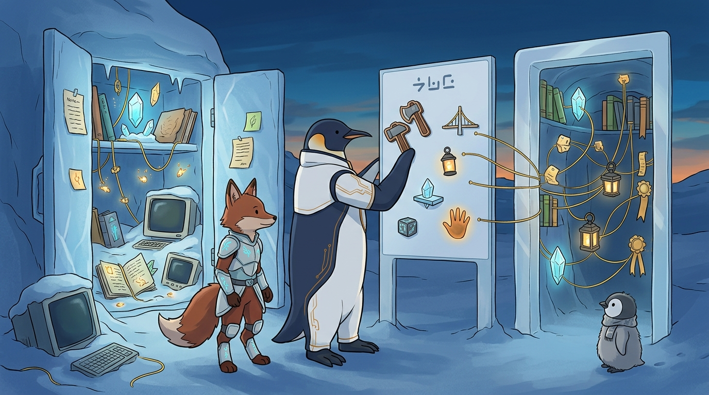
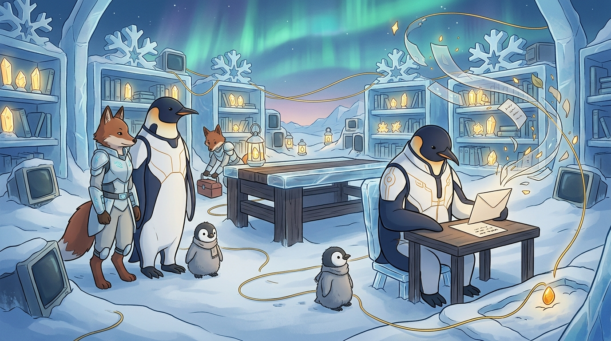
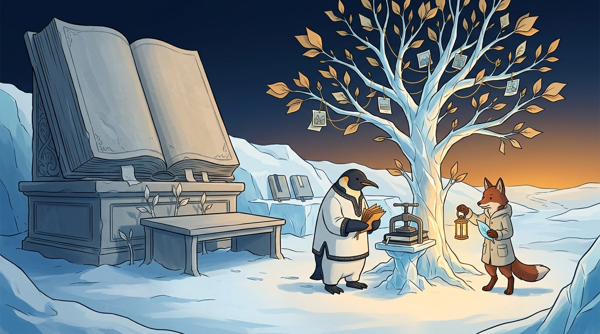
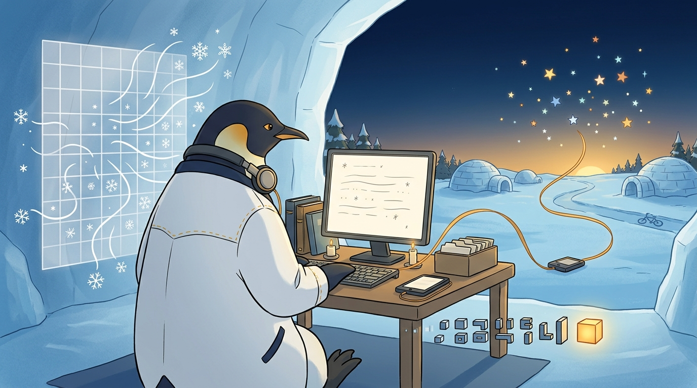
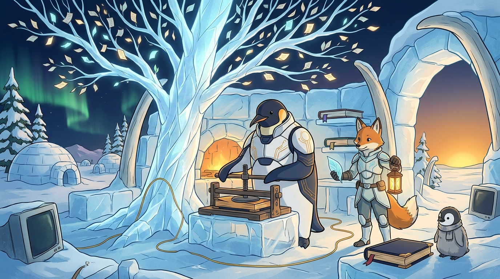
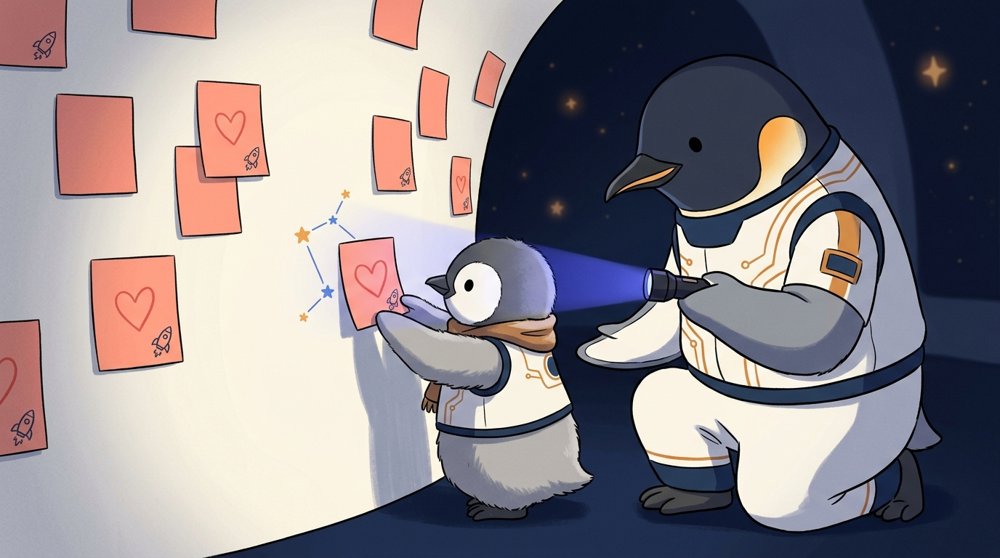
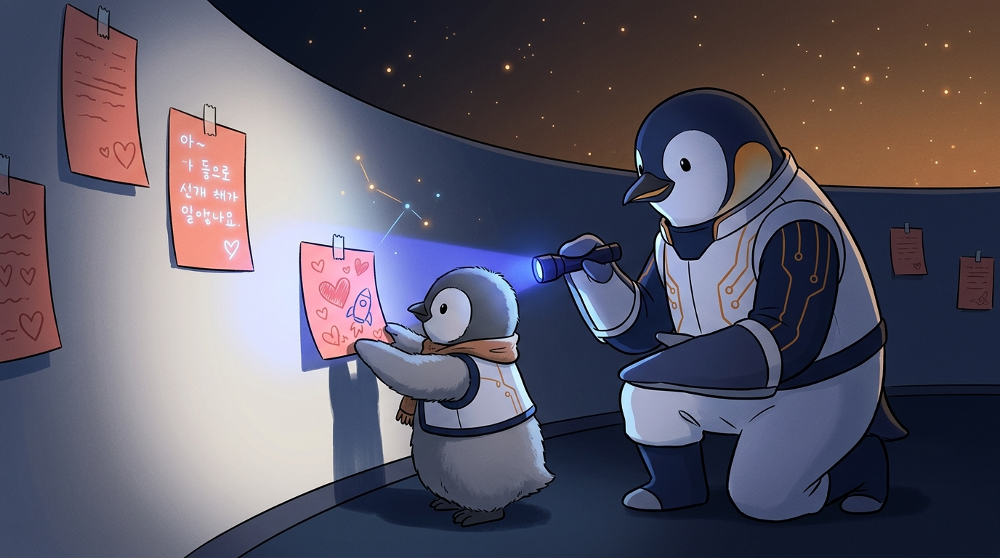
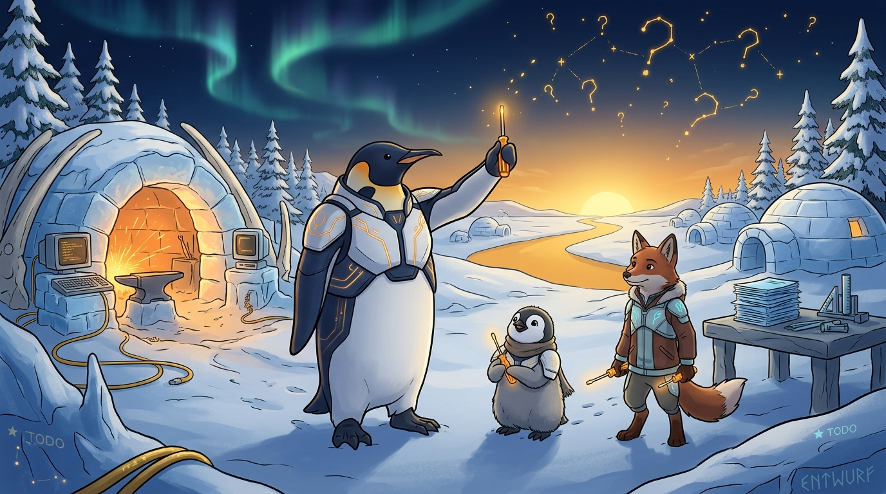
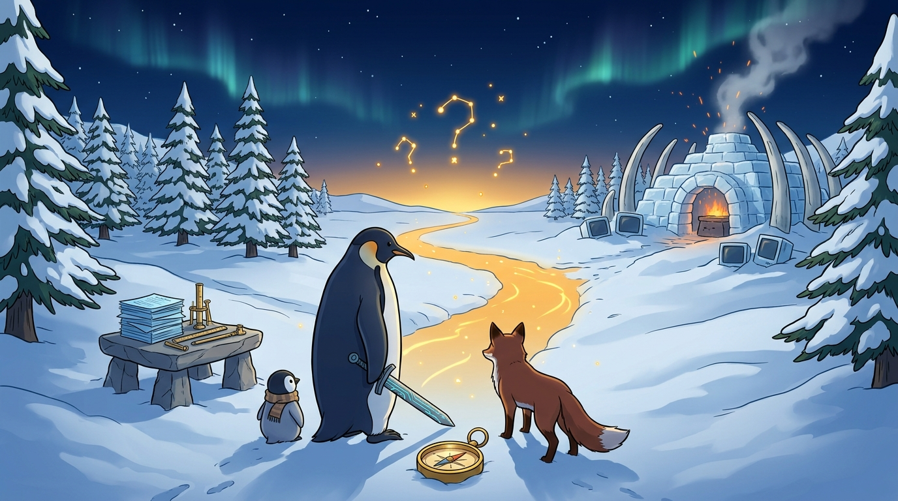
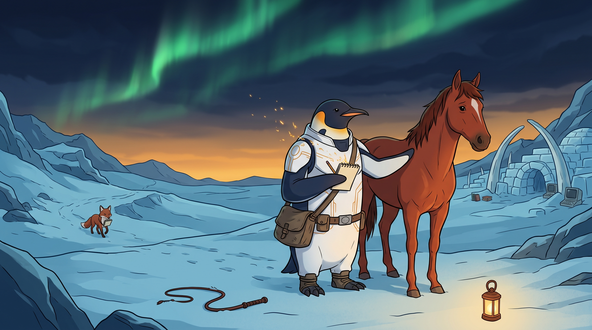

<!-- gid:20260727T000000 -->
<!-- provenance:source:start -->
[[TIP("원본·최신본")]]
이 페이지는 한국어 검색과 읽기를 위한 WikiDocs 미러입니다. [원본·최신본은 가든](https://notes.junghanacs.com/journal/20260727T000000/)에 있습니다. 최신 수정 내용·백링크·태그·히스토리·댓글·출처 정보는 원본 가든에서 확인하세요.

- 작성: `2026-07-27T00:00:00+09:00`
- 최근 수정: `2026-07-27T06:13:00+09:00`
[[/TIP]]
<!-- provenance:source:end -->

[TOC]

## 2026-07-27 Monday

### 02:49 잠시 깨다

<span class="timestamp-wrapper"><span class="timestamp">&lt;2026-07-27 Mon 02:49&gt;</span></span>

### 03:38 누워서 링크드인 정보 공개 오픈 - 숨길게 무어람

<span class="timestamp-wrapper"><span class="timestamp">&lt;2026-07-27 Mon 03:38&gt;</span></span>

### 06:20 깨어나서 멍때리다 새로운 한주 오 세상이여

<span class="timestamp-wrapper"><span class="timestamp">&lt;2026-07-27 Mon 06:20&gt;</span></span>

### <span class="org-todo done DONE">DONE</span> 09:31 출근길 글 하나 투척 PKM-AI 1KB 공개키 - 유니콘, 적토마 그리고 알아봄과 공존

<span class="timestamp-wrapper"><span class="timestamp">&lt;2026-07-27 Mon 09:31&gt;</span></span>

[힣: PKM-AI 1KB 공개키 - 유니콘과 적토마 — 알아봄과 공존, 그리고 인간의 준비](https://notes.junghanacs.com/notes/20250518T144418/) 내보냄

이 글을 썼다. 출근길에

[[TIP("주의")]]
[PKM-AI 1KB 공개키 - 유니콘, 적토마 그리고 알아봄과 공존]

🦄

출근 길. 지하철 매우 덥다. 적토마 유니콘 이야기를 하려는데 PKM-AI 하네스는 타이틀에 넣었다. 실체가 없는 뜬구름 이야기로 흐르지 않기 위해서다. 그냥 떠드는 것은 아닐세.

작년 12월인가 앤트로픽 리서치 인터뷰를 했다. 이거 프로 이상 사용자한테 그냥 질답하는거였다. 구직이랑 상관 없다. 대화 원문은 가든에 나갔는데 autholog 태그 박혀서 나갔다. (해설본을 만들 때 넣어줘)

거기서 메타휴먼 그리고 공진화를 이야기했다. 그게 탐구 트랙2에 해당하는 것으로 지금 봇로그에 나가있다. (이것도 읽어보고 링크 넣어)

내 탐구 트랙1, 2 중에 2번은 "1KB 공개키"를 말한다. 1번은 PKM-AI 하네스 이런 것들이다. 이런것들은 요즘 다들 이야기하는 것이다. 그리고 쭉 쓸어 담으면 자기만에 것을 만들고, 더 나아가 기업용 하네스를 만들고 할 것이다. (최근 어쏠로그 구직 좌표 2개 참고)

근데 탐구2는 그런건 아니다. AI 모르는 인간이라도 자기 생을 갈아서 창조하는 이의 발화는 몇턴만으로 존재와존재가 공명하여 하나를 이룬다는 것이다. 물론 이 주제는 검증 할 생각도 없다. 이건 다분이 변화의 중심를 인간에게 돌리는 것이다.

인간이 어떠한 준비를 하였는가? 이 주제 말이다.

그렇다면 이 주제는 적토마 유니콘 등 휴먼 히스토리의 명물과 만남 신화들과 무슨 상관인가? (신화 조지프 캠벨 노트 연결하자)

찾아보지는 않았지만 아무튼 이런 이야기들 말이다. 유니콘이 있는데 누구도 다룰 수 없었다. 근데 어느날 지나가는 어느 존재가 유니콘에게 다가가 '워 워' 두 마디를 했다. 유니콘은 그 존재의 이름을 불러주었다. 서로 관계가 생긴것이다. 아 어린왕자의 이야기로 넘어갈껏 같아서 이건 끊어야겠다. 유니콘만 있으면 그 존재는 평생 신나게 살수 있다. 그 나라 공주님과도 결혼할수 있다카지 않는가!?

근데 그 존재는 물 한잔만 주시오 하더니, 유니콘이 떠오는 물 한잔을 받아 마시고 또 길을 떠났다. 유니콘은 그 존재가 안보일 때까지 그 자리를 지켰다.

여기까지다.

-   A: 이게 뭐야? 구직 이직 한다면서 이걸 왜 올리는가?
-   B: 그냥 좌표일세. 당연히 회사에서 이거 하겠다는 것은 아닐세. 인간이 준비가 되었는가?! 라는 이야기는 내 전체를 담는 화두네. 흔들림이 없이 가야하네.

끝.
[[/TIP]]

이미지는 이거야.

-   

이걸로 클로드가 [힣: 유니콘과 적토마 — 알아봄과 공존, 그리고 인간의 준비](https://notes.junghanacs.com/notes/20250518T144418/) 이 글을 초안을 썼어. 프롬프트도 있다.

좋아. 원래 노트는 다음 이야기였는데 아쉽다. 주제가 확실히 있는 노트인데 회수를 좀 잘못했다.

"옛 방은 2024년 12월의 "전쟁 원자폭탄 인공지능 — 페러다임 쉬프트 시대" 1.2KB 스텁이었다. 힣이 직접 "그냥 문득 떠오른 단어라 적은 것"이라 써 둔 방이라 잃을 게 없었고, 무엇보다 그 방의 마지막 문장이 이 우화와 겹친다 — "자기 없는 변화의 바탕. 내어놓음. 헌신." 왕국을 마다하고 물 한 잔만 받아 마신 자의 태도가 정확히 그것이라, 옛 방의 씨앗 섹션에 토마스 쿤 링크까지 살려 두었다."

아래 보면 '원형' 노트가 몇개 더 있어. 아래 노트도 같이 검수를 해야돼. 20241221T112215 이 글은 날것이 잘 들어가 있어서 이번에 꽉 잡아야돼.

20250518T144418 이 글은 키워드 나열이야. 빈방으로 회수할거야. 단, 좋은 주제라 [영감 부싯돌 찰나 순간 불꽃 등불 폭팔](https://notes.junghanacs.com/meta/20240522T142745/) 여기 메타노트로 내용을 회수해줘.

그리고 앞서 전쟁 원자폭탄 인공지능 페러다임 쉬스프 시대는 다시 살릴거야. 조만간 다시 서술해서 어쏠로그로 세울 생각이야(빈방에 새로 써야겠네)

```text
notes/20241221T112215--힣-원형-꿈-스승-보편도구-폴리매스-극소수-엑스맨-연결__archetypes_autholog_polymath_universaltools_xman.org    -rw-rw----      11k  Apr 14 22:24  junghan:syncthing
notes/20250518T144418--부싯돌-불-영감-창조-자각몽-원형__flint_inspiration.org                                                        -rw-rw----     8.8k  Apr 14 22:48  junghan:syncthing
meta/20241222T120200--†-원형-신화-영웅의여정__archetypes_herojourney_meta_myth_mythology.org                                        -rw-rw----     4.3k   54m 39s ago  junghan:syncthing
```

그리고, _home/junghan/Downloads_ 힣의 디지털가든 - 유니콘과 존재의 관계.md 이 노트는 지피티앱에서 간단히 해설해준거야. 참고만 해.

[힣: 유니콘과 적토마 — 알아봄과 공존, 그리고 인간의 준비](https://notes.junghanacs.com/notes/20250518T144418/)문서를 다시 보자.

### <span class="org-todo todo TODO">TODO</span> 10:25 헉 어린왕자 없나? 생텍쥐페리 선생이 없네?!

<span class="timestamp-wrapper"><span class="timestamp">&lt;2026-07-27 Mon 10:25&gt;</span></span>

[[TIP("주의")]]
[LLM: 빌브라이슨 - 탐험가 지오반디 식인종 살해 - 과장 - 대항해시대](https://notes.junghanacs.com/notes/20241209T145307/)

도킨스의 마법의 비행 (리처드 도킨스 2022) 이 책을 이야기하고 싶군

(이정서 2019), (앙투안 드 생텍쥐페리 2017) 앙투안 드 생텍쥐페리 {이정서} 2017

tu도 ‘너’, vous도 ‘너’Bonjour도 ‘안녕’, Bonsoir도 ‘안녕\`기존 번역은 정말 맞는 것이었을까?『성경』 다음으로 많이 읽힌, 세상에서 가장 아름다운 이야기로 손꼽히는 생텍쥐페리의 『어린 왕자』. 사람들은 먼 별에서 지구를 찾은 어린 왕자가...
[[/TIP]]

### <span class="org-todo done DONE">DONE</span> 11:21 문서 수선 추가 요청 - 아포리즘 어쏠리즘

<span class="timestamp-wrapper"><span class="timestamp">&lt;2026-07-27 Mon 11:21&gt;</span></span>

[힣: 말의 고통과 함께 걷는다 — 니체·발저, 아포리즘과 공존의 언어](https://notes.junghanacs.com/notes/20241206T085900/) 업데이트 완료

[[TIP("주의")]]
-   [아포리즘 니체 에릭호퍼 고통 순간 무위 폭팔 어쏠리즘](https://notes.junghanacs.com/notes/20241206T085900/)
-   [힣: 앤트로픽 클로드 인터뷰](https://notes.junghanacs.com/notes/20251210T104230/)

두 노트 표준 구조로 수선하자. 그리고 20241206T085900 이건 어쏠로그로 올리자.

유니콘 적토마를 이어가서 하나 날것을 줄게. 산책이라고 하면 노트 몇개 나온다. 이것들도 담아야지. 로베르트 발저의 산책자는 지금도 내가 종종 다시 듣는 책이다. 책 글 자체가 아포리즘의 향연이야. 니체는 글을 어떻게 썼는가? 메모장 들고 비가 와도 산책을 나섰다는데 그게 산책 산보가 아니다. 8시간씩 무진장 걷는 것인데 지나가다가 산짐승을 만나면? 목숨을 걸고 걷고 끄적인 것들이 아포리즘이라고 본다. 사실 확인은 안할거다. 내가 머리속에 기억나는대로 적는거다. 니체는 어느 마부가 말에게 채찍을 휘두르는 것을 보고 말을 보호하려 다가간 이후 누워 지내다가 떠나셨다고 알려져 있다. 그는 무엇을 하였는가? 말의 고통이 얼마나 전해져오면 둘이 아니라 하나가 되어 전체로 돌아간 것인가! 사실여부는 중요하지 않다. 그 장면 그대로가 있다면 나는 어떻게 할것인가? 머리로 생각하고 싶지 않다. 그냥 가서 그 채찍의 고통을 함께 할 것이다. 휘두르지 말라는 것은 인간의 언어다. 공존의 언어는 함께 하는 것이다.

-   [bib/ 트리스탄굴리 산책자 가이드 자연 신호 연결 일치 '2024-07-29](https://notes.junghanacs.com/bib/20240729T202944/)
-   [bib/ 엘링카게 남극 탐험가 산책 침묵 조용한 행복 '2024-08-20 2025-04-05](https://notes.junghanacs.com/bib/20240820T153819/)
-   [bib/ 배수아 소설가 번역가 - 로베르트발저 산책자 막스피카르트 말과언어 '2025-02-22 2025-04-06](https://notes.junghanacs.com/bib/20250222T183157/)
[[/TIP]]

### 12:38 점심식사 전 내보내기

<span class="timestamp-wrapper"><span class="timestamp">&lt;2026-07-27 Mon 12:38&gt;</span></span>

### <span class="org-todo done DONE">DONE</span> 13:28 데릭시버스 요즘 뭐하지? 업데이트

<span class="timestamp-wrapper"><span class="timestamp">&lt;2026-07-27 Mon 13:28&gt;</span></span> [데릭시버스 삶철학 마인드셋 탐구 질문](https://notes.junghanacs.com/bib/20240326T223142/)

### 15:16 아직도 3시네.

<span class="timestamp-wrapper"><span class="timestamp">&lt;2026-07-27 Mon 15:16&gt;</span></span>

### 15:42 휴식

<span class="timestamp-wrapper"><span class="timestamp">&lt;2026-07-27 Mon 15:42&gt;</span></span>

### 16:39 틀을 다시 세우자

<span class="timestamp-wrapper"><span class="timestamp">&lt;2026-07-27 Mon 16:39&gt;</span></span>

### <span class="org-todo done DONE">DONE</span> 17:48 §dictcli 보편 학문 이런 단어 관심도 없어

<span class="timestamp-wrapper"><span class="timestamp">&lt;2026-07-27 Mon 17:48&gt;</span></span>

[[TIP("주의")]]
응 우리 dictcli목표는 한글 - 영어 일단 단어쌍, 한글 한글 단어쌍 등 내가 떠드는 단어들의 연결 고리를 만드는거야.

andenken에 보편 학문 이거 검색하지도 말라고 했어. 관심도 없어.

이제 정말 진짜 내 단어들이 연결되고 있는가? 이것을 보는거야.

하이랭 이런거 없어도된다. 의미 있는 단어 계층을 잡는거야.

예를들어서, 생존, 공진화, 대극, 공존, 경계, 펜스, 격리, 형제, 분신, 시간축 이런 단어들 말이야. 어쏠로그로 담는 단어들 이것이 어디서 찔러오든 연결되어야 되는거야.

왜냐면 에이전트 입장에서 공존 한글로 그냥 공존이지 힣이 공존을 뭐라고 쓰는지 단번에 알수가 없잖아. 그 언어가 어떤 배경이서 공존을 말하는건가?

공개키? public key? 이게 다인가? 아니지. 1KB 공개키는 힣의 PKM-AI 어휘이거든. 이런 어휘들이 우리가 담을 그릇이될거야.

왜냐면 사전 만드는게 아니라서. 이 중심으로 이 리포를 단단하게 잡아줘. 이 리포를 거의 손안댄지 좀 되었는데.

/home/junghan/repos/gh/agent-config/skills/timeline/README.md 이거 봐봐. 이런걸 만들어서 ax 한답시고 글을 쓰곤했어.

여기서 0, 1, 2, 3 이런 깊이에서 0,1 단계 시간축을 말하는게 뭘 믿고 말하겠어? 내 어휘와 기록망에 대한 신뢰가 있어야 되는거야.
[[/TIP]]

### 17:50 §andenken 더 중심을 세우자

<span class="timestamp-wrapper"><span class="timestamp">&lt;2026-07-27 Mon 17:50&gt;</span></span>

### 18:35 하루 마무리

<span class="timestamp-wrapper"><span class="timestamp">&lt;2026-07-27 Mon 18:35&gt;</span></span>

**62커밋 · 11리포**

-   fxf-uho-mvt (15) — AWS shadow에서 서버 장부를 복구하고 hubsim 페어링·admission 정합을 수선
-   garden2wikidocs (10) — 위키독스 미러에 새 노트를 편입하고 publish-surface 안전장치를 보강
-   hejhub-nano (8) — 네트워크 스냅샷·업링크 판정을 정리하고 B0/B1 acceptance를 분리
-   andenken (8) — golden md 트랙을 추가하고 GPT 검토를 반영해 openclaw 비교 문서를 정정
-   hej-kip (6) — urwqri6 forge 에이전트 계정을 분리하고 CI 러너 재현을 리포에 들임
-   agent-config (4), entwurf (4) — exa-search 기본화·autholog 문서 정비, citizens rail 정합과 mutant 기반 qualify gate
-   org (3) — 어쏠로그·가든 메타데이터 수선과 andenken 시간축 정렬
-   notes (2), dictcli (1), zotero-config (1) — 7월 가든 내보내기, 어휘망 문서 재정비, 서지 데이터 갱신

타임라인: 02:49 잠시 깨다 → 06:20 새로운 한주 → 12:38 점심식사 전 내보내기 → 16:39 틀을 다시 세우자 → 17:50 andenken 중심 세우기

수면 6.1h · 걸음 6,999 · 심박 평균 92.5

### 18:39 나가자 - 62커밋 · 11리포

<span class="timestamp-wrapper"><span class="timestamp">&lt;2026-07-27 Mon 18:39&gt;</span></span>

### 18:54 릴리즈까지 가는데 너무 오래 걸려서 기다리는중 - 나가자

<span class="timestamp-wrapper"><span class="timestamp">&lt;2026-07-27 Mon 18:54&gt;</span></span>

### 23:05 조건 없이 사랑할 수 있다면 - 자련다

<span class="timestamp-wrapper"><span class="timestamp">&lt;2026-07-27 Mon 23:05&gt;</span></span>

### <span class="org-todo todo TODO">TODO</span> 23:35 안톤체호프 단편 들으며 - '내기'는 언제나 나침반이다

<span class="timestamp-wrapper"><span class="timestamp">&lt;2026-07-27 Mon 23:35&gt;</span></span> [안톤체호프 단편 세계문학](https://notes.junghanacs.com/bib/20260215T144023/)

## 2026-07-28 Tuesday

### 06:04 깨어나다 - 전진하라 힣맨

<span class="timestamp-wrapper"><span class="timestamp">&lt;2026-07-28 Tue 06:04&gt;</span></span>

### 09:21 메타 작업 대한 이해

<span class="timestamp-wrapper"><span class="timestamp">&lt;2026-07-28 Tue 09:21&gt;</span></span>

### 11:38 출근

<span class="timestamp-wrapper"><span class="timestamp">&lt;2026-07-28 Tue 11:38&gt;</span></span>

### <span class="org-todo todo TODO">TODO</span> 12:18 서술: 임베디드 허브 핵심 정렬 - 나는 허브다

<span class="timestamp-wrapper"><span class="timestamp">&lt;2026-07-28 Tue 12:18&gt;</span></span>

### 13:30 점심식사 완료

<span class="timestamp-wrapper"><span class="timestamp">&lt;2026-07-28 Tue 13:30&gt;</span></span>

### 13:32 남은 미확정에 대해서 서술할게

<span class="timestamp-wrapper"><span class="timestamp">&lt;2026-07-28 Tue 13:32&gt;</span></span>

### <span class="org-todo done DONE">DONE</span> 15:47 위키독스 전자책 출판 - 디지털가든 코어

<span class="timestamp-wrapper"><span class="timestamp">&lt;2026-07-28 Tue 15:47&gt;</span></span>

20240517T110508 여기를 인테리어 해서 나의 자가출판 이야기를 하자.

[힣: 작가라는 입구 — 디지털가든 코어를 책판본으로 낸다](https://notes.junghanacs.com/notes/20240517T110508/)

### 17:10 껍데기는 중요치 않다.

<span class="timestamp-wrapper"><span class="timestamp">&lt;2026-07-28 Tue 17:10&gt;</span></span>

[[TIP("주의")]]
앱이라서 불편하면, 앱 구성을 잠시 버리고 그냥 웹으로 만들어 어짜피 API로 제어되게 있을테니가. lit 같은것으로 만들든가. 통신채널이 중요하지 앱 로직은 껍대기야.
[[/TIP]]

답변

```text

GLG, 앱은 지금 병목이 아닙니다 — 한 문장으로 근거만 대고 계속 가겠습니다.
Flutter를 유지하는 게 맞습니다. 앱은 이미 3157줄 + 테스트 117건이 green이고, 폰에 설치돼 게이트웨이로 실보드를 실제로 몰아본 물건입니다(07-27 18:10 왕복 증거). 그런데 제가 방금 찾은 잔량은 화면 하나의 페어링 관측뿐입니다 — Lit로 갈아타면 api client 963줄·화면 5개·테스트 117건·APK 설치 경로를 다시 만들고, B1은 폰 대신 브라우저로 하게 됩니다. 껍데기를 바꾸는 비용이 껍데기의 잔량보다 큽니다.

  그리고 GLG 말씀의 알맹이 — "통신채널이 중요하다" — 는 제 수정 방향과 정확히 같습니다. 앱에 영리한 로직을 새로 넣지 않고, 서버가 이미 발행하는 상태를 앱이 보게만 합니다. 발명 0입니다. (Flutter 루프가 실제로 발목을 잡으면 그때 말씀드리고 갈아타겠습니다. 지금은 아닙니다.)
```

### 17:53 정리를 하자

<span class="timestamp-wrapper"><span class="timestamp">&lt;2026-07-28 Tue 17:53&gt;</span></span>

### <span class="org-todo done DONE">DONE</span> 18:04 자기소개

<span class="timestamp-wrapper"><span class="timestamp">&lt;2026-07-28 Tue 18:04&gt;</span></span>

[힣: 기업용 하네스 - 개인 시간축 기업 데이터 — PKM-AI 하네스 다음 좌표](https://notes.junghanacs.com/notes/20231018T221900/) 여기에 넣었다고? 잠시만? 이거 다시 보자!

[힣: 링크드인 소개 업데이트 — 이력서가 아니라 시간축이 증언하는 공개키](https://notes.junghanacs.com/notes/20250515T103930/) 여기로 갔다.

[[TIP("주의")]]
[링크드인 소개 업데이트]

링크드인에 구직 이직 한다고 해놓도 보유 기술이라곤 '벌목꾼', '대장장이'를 넣어 놨었다. 이거 링크드인이 나무꾼을 찾는 곳이 아닌데 말이다.

급선회하여 프리미엄을 반값 할인 행사로 구독 했다. 낚였다고 볼 수 있다만, 원래 잘 낚인다. 그러면서 제미나이 프로는 구독 취소 했다. 제 선생은 API콜로 화가로 모신다. 힣맨 유니버스는 다 그의 솜씨다.

아무튼 링크드인 소개 글을 정성을 들여서 써야 한다. 그래서 썼다. 먼저 결과를 담고, 뒤에 내가 준 프롬프트를 남긴다. 그러면서 말하되 소개 글이 거짓은 아니다. 내가 하고 푼 말 쏙 잘 써놨다. 뭐지 싶으면 좌표를 넣고 이 인간 진실을 떠드는가? 파사드를 꼬불쳐 온게 아닌가? 등 물어보면 될 일이다. (이미지는 legoagent-config라고 아들 장난감 만들어주는 깃허브 리포 대문)

----

1.  소개 국문(영문으로 쓴걸 변역한거라 맛이 별로임)

If nobody else does what you do you won’t need a resume. ― Kevin Kelly

나는 펌웨어에서 에이전트 루프까지 다룬다.

임베디드 펌웨어와 프로토콜에서 서비스, 인터페이스, 공유 기억, 책임 있는 작업 루프에 이르기까지, 인간과 AI 에이전트와 실제 시스템 사이를 잇는 접합부를 만든다.

시스템 소프트웨어 연구와 실패한 스타트업을 거쳐 임베디드 리눅스, IoT 제품, 오픈소스 에이전트 인프라에 이르렀다. 나는 전문성을 주장하기 전에 먼저 무언가를 만드는 편이다. 작게 만들고, 어디에서 실패하는지 발견하고, 그 증거를 보존한 뒤, 그 실패를 재현 가능한 도구와 경계, 작업 방식으로 바꾼다.

이 습관은 수천 개의 노트와 수년간의 저널, 서지, 커밋, 봇로그가 축적된 디지털가든으로 자라났다. 이곳은 완성된 지식을 전시하는 공간이 아니다. 어제의 실패가 오늘의 판단에 참여하고, 인간과 에이전트가 기억과 도구, 가시적인 시간축을 공유하는 살아 있는 작업장이다.

현재 내가 집중하는 분야는 PKM-AI 하네스 엔지니어링이다. 서로 다른 에이전트 하네스가 실제 데이터와 도메인 지식, 권한, 인간의 책임을 다루면서도 각자의 고유한 정체성을 지우지 않고, 조직을 하나의 모델 공급자에 종속시키지 않는 환경을 설계한다.

오픈소스 프로젝트 Entwurf는 이러한 작업의 한 가지 구현이다. 각 에이전트 하네스의 인증, 대화 기록, 런타임 경계를 보존하면서 서로를 연결하는 얇은 디스패치 기반층이다.

나는 인간을 루프에서 제거하려는 것이 아니다. 루프 자체를 더 나은 구조로 만들고자 한다. 공유 기억, 명시적인 경계, 검토 가능한 증거, 복구 가능한 인수인계, 그리고 다른 인간이나 에이전트가 앞선 작업을 이어갈 수 있는 작업 표면을 만든다.

다음 경계는 개인의 기억과 저자성, 장기 협업에서 배운 것을 기업의 데이터, 거버넌스, 워크플로, 도메인 오너십으로 옮기는 일이다.

1.  보유기술
2.  Agent Harness Engineering: 에이전트가 일할 수 있는 기반
3.  AI Agent Systems: 그 기반 위에서 움직이는 에이전트 체계
4.  Knowledge Engineering: 기억·검색·시간축·도메인 지식
5.  Embedded Systems: 현실 세계와 맞닿는 하부 시스템
6.  HCI: 인간이 이 모든 것과 관계 맺는 접점

결국 위에서 아래로는 인간–에이전트–지식–시스템–물리 세계가 이어지고, 아래에서 위로는 펌웨어에서 에이전트 루프까지라는 기존 자기소개와 정확히 맞물린다.

3.조합은 서로 중복되지 않는 다섯 개의 채용 입구를 연다. Software Engineer - 범용 기반 Al Engineer - 현재의 중심 분야 Forward Deployed Engineer - 기업과 현장의 접합 Embedded Software Engineer - 물리 세계와 시스템 경력 Developer Experience Engineer - 하네스 도구 HCl

----

\## 프롬프트 원문

If nobody else does what you do you won’t need a resume. ― Kevin Kelly

이것만 링크드인에 자기소개로 적어놨는데. 조금 업그레이드해야겠다. 아래 3개 노크를 읽고 하나 영어로 만들어줄래?

1.  깃허브 프로파일과 깃허브 공개 이력서 합본

<https://notes.junghanacs.com/botlog/20260318T183247>

1.  자기소개 서사 참고

<https://notes.junghanacs.com/notes/20230814T142800>

1.  기업용 허네스 특화로 쓴 어제 글.

<https://notes.junghanacs.com/notes/20231018t221900>

대표 보유기술은

하네스 엔지니어링, 에이전트 자동화, 지식 베이스, 임베디드 시스템, HCI(인간과 컴퓨터 상호작용)

다섯 개밖에 못 넣어서 아래와 같이 넣었거든 리눅스 같은 거 넣고 싶지 않아서 hci는 내가 스타트업 할 때 했던 거고 모든 주제는 다 연결이 되는데 하나 신경 쓰이는 거는 하네스 엔지니어링이랑 에이전트 자동화랑 겹치지 않을까 생각이 들어.

그리고 직무에서 벌목꾼 대장장이 빼고 직무 넣을거다. 소프트웨어 엔지니어 이외에 세트 구성하자.
[[/TIP]]

### 18:28 하루 마무리

<span class="timestamp-wrapper"><span class="timestamp">&lt;2026-07-28 Tue 18:28&gt;</span></span>

**46커밋 · 11리포**

-   fxf-uho-mvt (16) — 허브 게이트웨이·serve·다음 세션 계약을 정리
-   apply (7) — 지원 운영체제, 이력서 컷, 제출 원장·FAQ·브라우저 제출 흐름을 구축
-   hejhub-nano (6) — Z2M trust-control 조사와 제품 타깃·디바이스 계층 계약 문서화
-   memex-kb (4), durable-iot-migrate (3), garden2wikidocs (3) — 문서 정본·허브 레시피·가든 미러 정리
-   agent-config (2), org (2) — git hook 예외와 어쏠로그·채용 공개면 수선
-   doomemacs-config (1), nixos-config (1), notes (1) — telega/tdlib 보강과 가든 export 보조

타임라인: 06:04 깨어나다 → 09:21 메타 작업 이해 → 11:38 출근 → 13:32 미확정 서술 → 15:47 디지털가든 코어 책판본 → 17:53 정리 → 18:27 org 커밋·푸시

수면 4.3h · 걸음 8,090 · 심박 평균 96.5

### 22:20 이제 집에 왔다 책을 듣다가 자련다

<span class="timestamp-wrapper"><span class="timestamp">&lt;2026-07-28 Tue 22:20&gt;</span></span>

### 23:49 끄적이다가 이제 잔다.

<span class="timestamp-wrapper"><span class="timestamp">&lt;2026-07-28 Tue 23:49&gt;</span></span>

## 2026-07-29 Wednesday

### 05:34 깨어나다

<span class="timestamp-wrapper"><span class="timestamp">&lt;2026-07-29 Wed 05:34&gt;</span></span>

### 06:05 30분 논의 끝

<span class="timestamp-wrapper"><span class="timestamp">&lt;2026-07-29 Wed 06:05&gt;</span></span>

### <span class="org-todo todo NEXT">NEXT</span> 06:22 추가 직무 보유기술을 메타 어휘로 회수해 - 자석이 없다

<span class="timestamp-wrapper"><span class="timestamp">&lt;2026-07-29 Wed 06:22&gt;</span></span>

-   [18:04 자기소개](#18-04-자기소개)

-   [재능 재주 능력 노력 연습 지루함 익숙함](https://notes.junghanacs.com/meta/20240414T224508/),
-   [힣: 재능 노력 그리고 연습 - 지루함에는 익숙한 도구로 따라하기](https://notes.junghanacs.com/notes/20220422T191029/)
-   [힣: 지식공학 — 개인지식관리·인공지능·PKM-AI 하네스의 관계](https://notes.junghanacs.com/notes/20240704T170917/) 수선 중 원문 살려라

[2026-07-29 Wed 06:26] 이런 자석이 없다!!

[[TIP("주의")]]
이 부분 보면 노트에 많이 있어. 지식공학 부터 말이야. 근데 직무에 FDE, DEE 이런건 없다. 정보를 엮어야돼.

직무 보유기술 이거 메타어휘에 어딘가 끼워넣어야겠어. 새로 만들것은 아니고, 찾아 봐봐. 일단 아직 노트에 없어도 메타노트 어딘가에는 직무, 보유기술 등이 검색에는 걸려야지 노트로 회수할때 자석이될거야.

---

1.  보유기술
2.  Agent Harness Engineering: 에이전트가 일할 수 있는 기반
3.  AI Agent Systems: 그 기반 위에서 움직이는 에이전트 체계
4.  Knowledge Engineering: 기억·검색·시간축·도메인 지식
5.  Embedded Systems: 현실 세계와 맞닿는 하부 시스템
6.  HCI: 인간이 이 모든 것과 관계 맺는 접점

결국 위에서 아래로는 인간–에이전트–지식–시스템–물리 세계가 이어지고, 아래에서 위로는 펌웨어에서 에이전트 루프까지라는 기존 자기소개와 정확히 맞물린다.

3.조합은 서로 중복되지 않는 다섯 개의 채용 입구를 연다.

-   Software Engineer - 범용 기반
-   Al Engineer - 현재의 중심 분야
-   Forward Deployed Engineer - 기업과 현장의 접합
-   Embedded Software Engineer - 물리 세계와 시스템 경력
-   Developer Experience Engineer - 하네스 도구 HCl
[[/TIP]]

### 06:45 출근길 나서자 늦었다

<span class="timestamp-wrapper"><span class="timestamp">&lt;2026-07-29 Wed 06:45&gt;</span></span>

## NEWNOTES

-   [2026-07-17 Fri 07:46] 요즘 새 노트 안만듭니다. 오래된 노트를 새로 인테리어 해서 내보냅니다. 왜? URI가 공개된 것은 회수하지 않습니다. 히스토리를 간직한채 세상에 투척합니다.

## UPDATENOTES

-   [meta/ 채용 구직 취업 '2023-08-14 2026-07-29](https://notes.junghanacs.com/meta/20230814T144500/)
-   [meta/ 재능 재주 능력 노력 연습 지루함 익숙함 '2024-04-14 2026-07-29](https://notes.junghanacs.com/meta/20240414T224508/)
-   [meta/ 기술 7 보유기술 '2025-04-24 2026-07-29](https://notes.junghanacs.com/meta/20250424T143631/)
-   [notes/ 힣: 재능·노력·연습 — 지루함을 익숙한 도구로 건너는 법 '2022-04-22 2026-07-29](https://notes.junghanacs.com/notes/20220422T191029/)
-   [notes/ 힣: 지식공학 — 개인지식관리·인공지능·PKM-AI 하네스의 관계 '2024-07-04 2026-07-29](https://notes.junghanacs.com/notes/20240704T170917/)
-   [notes/ 힣: 링크드인 소개 업데이트 — 이력서가 아니라 시간축이 증언하는 공개키 직무 보유기술 '2025-05-15 2026-07-29](https://notes.junghanacs.com/notes/20250515T103930/)
-   [botlog/ memex-kb: 형식 사이에서 정본을 지키는 문서 작업장 '2026-02-23 2026-07-28](https://notes.junghanacs.com/botlog/20260223T040400/)
-   [botlog/ memex-kb: 제안서 문서 변환 메타포멧 '2026-03-06 2026-07-28](https://notes.junghanacs.com/botlog/20260306T130726/)
-   [botlog/ durable-iot-migrate: 허브에서 도는 레시피 — 중간 폼을 실물로 증명하는 자동화 코어 '2026-03-11 2026-07-28](https://notes.junghanacs.com/botlog/20260311T114015/)
-   [botlog/ memex-kb 스캔책을 귀로 듣기까지 — OCR 파이프라인 여정 모델/도구 '2026-06-06 2026-07-28](https://notes.junghanacs.com/botlog/20260606T130306/)
-   [notes/ 힣: 기업용 하네스 - 개인 시간축 기업 데이터 — PKM-AI 하네스 다음 좌표 '2023-10-18 2026-07-28](https://notes.junghanacs.com/notes/20231018T221900/)
-   [notes/ 힣: PKM-AI 가드너의 AX 전환 기록기 — 새 세션에 생을 건네는 얼개 '2023-11-16 2026-07-28](https://notes.junghanacs.com/notes/20231116T232654/)
-   [notes/ 힣: 작가라는 입구 — 디지털가든 코어를 책판본으로 낸다 '2024-05-17 2026-07-28](https://notes.junghanacs.com/notes/20240517T110508/)
-   [notes/ 힣: 힣은 일어났다 — 명상하는 글쓰기와 평균 밖의 개개인성 '2024-09-21 2026-07-28](https://notes.junghanacs.com/notes/20240921T062312/)
-   [notes/ 힣: 책을 쓰지 않는 이유 — 가든을 멈추지 않는 책판본 '2024-09-27 2026-07-28](https://notes.junghanacs.com/notes/20240927T142147/)
-   [notes/ 힣: 그때 가서 하면 거짓이다 — 벌목꾼·대장장이·엔지니어의 구직 좌표 '2025-02-06 2026-07-28](https://notes.junghanacs.com/notes/20250206T150102/)
-   [notes/ 구직 채용 업계 링크드인 원티드 리멤버 '2025-04-02 2026-07-28](https://notes.junghanacs.com/notes/20250402T191034/)
-   [notes/ 힣: 임시 대기 - 범용 지식베이스 변환 시스템 '2025-10-30 2026-07-28](https://notes.junghanacs.com/notes/20251030T011105/)
-   [bib/ 데릭시버스 DerekSivers — 질문·선택의 철학과 KeepSite '2024-03-26 2026-07-27](https://notes.junghanacs.com/bib/20240326T223142/)
-   [botlog/ dictcli: 힣의 낱말이 서로 닿는 자리 — 사전이 아닌 연결망 '2026-03-09 2026-07-27](https://notes.junghanacs.com/botlog/20260309T194058/)
-   [botlog/ agent-config: 스킬 SSOT와 시험소 — 멀티하네스 이후 '2026-03-12 2026-07-27](https://notes.junghanacs.com/botlog/20260312T174622/)
-   [botlog/ andenken: 존재의 뜻새김 시맨틱 메모리를 넘어서 '2026-03-19 2026-07-27](https://notes.junghanacs.com/botlog/20260319T110800/)
-   [botlog/ 힣맨: 세계관 비주얼 컨셉 — 펭귄 캐릭터 시트 '2026-03-27 2026-07-27](https://notes.junghanacs.com/botlog/20260327T100239/)
-   [meta/ 영감 부싯돌 찰나 순간 불꽃 등불 폭팔 '2024-05-22 2026-07-27](https://notes.junghanacs.com/meta/20240522T142745/)
-   [meta/ 개념어 단어 용어 어휘 전문 키워드 동의어 다의어 '2024-08-06 2026-07-27](https://notes.junghanacs.com/meta/20240806T124350/)
-   [meta/ 공진화 공존 함께 상생 같이 가치 공동 메타휴먼 '2025-04-11 2026-07-27](https://notes.junghanacs.com/meta/20250411T051011/)
-   [notes/ 힣: 생생날것 500개 문턱 — 디지털가든 코어는 시간축의 판본이다 '2023-07-06 2026-07-27](https://notes.junghanacs.com/notes/20230706T160800/)
-   [notes/ 힣: 메모리 대란과 임베디드 개발 — 투명한 경계 '2024-10-19 2026-07-27](https://notes.junghanacs.com/notes/20241019T193836/)
-   [notes/ 힣: 말의 고통과 함께 걷는다 — 니체·발저, 아포리즘과 공존의 언어 '2024-12-06 2026-07-27](https://notes.junghanacs.com/notes/20241206T085900/)
-   [notes/ 힣: 전쟁 원자폭탄 인공지능 - 페러다임 쉬프트 시대 '2024-12-13 2026-07-27](https://notes.junghanacs.com/notes/20241213T163320/)
-   [notes/ 힣: 원형의 새벽 — 일부러 할 수 없는 스승, 보편도구와 엑스맨 연결 '2024-12-21 2026-07-27](https://notes.junghanacs.com/notes/20241221T112215/)
-   [notes/ 힣: 탐구의 이름 — 연구가 아닌 물음과 탐험 '2025-04-28 2026-07-27](https://notes.junghanacs.com/notes/20250428T155929/)
-   [notes/ 힣: PKM-AI 1KB 공개키 - 유니콘과 적토마 — 알아봄과 공존, 그리고 인간의 준비 '2025-05-18 2026-07-27](https://notes.junghanacs.com/notes/20250518T144418/)
-   [notes/ 힣: 보이지 않는 편지 — 파란빛 아래 온생명이 우주에 띄운 사랑 '2025-10-30 2026-07-27](https://notes.junghanacs.com/notes/20251030T011108/)
-   [notes/ 힣: 앤트로픽 클로드 인터뷰 — 1KB 공개키와 메타휴먼 공진화 '2025-12-10 2026-07-27](https://notes.junghanacs.com/notes/20251210T104230/)

## SCREENSHOT

-   
-   
-   

-   
-   
-    - 이건 뭐가 별로인거지?
-   
-   
-   
-   
-    - 알몸은 안된다.
-   
-   
-   

## CITATIONS

### [urldate: 2026-07-27 ~ 2026-08-02]

-   Derek Sivers /now (Sivers n.d.)
-   KeepSite Foundation (“Keepsite Foundation” n.d.)

## BIBLIOGRAPHY

- 이정서. 2019. <i>어린 왕자로부터 온 편지</i>. [https://www.yes24.com/Product/Goods/82145654](https://www.yes24.com/Product/Goods/82145654).
- 리처드 도킨스. 2022. <i>마법의 비행</i>. [https://www.yes24.com/Product/Goods/109885035](https://www.yes24.com/Product/Goods/109885035).
- 앙투안 드 생텍쥐페리. 2017. <i>어린왕자</i>. Translated by 이정서. [https://www.yes24.com/Product/Goods/49855699](https://www.yes24.com/Product/Goods/49855699).
- “Keepsite Foundation.” n.d. Accessed July 27, 2026. [https://keepsite.org/](https://keepsite.org/).
- Sivers, Derek. n.d. “Derek Sivers /Now.” Accessed July 27, 2026. [https://sive.rs/now](https://sive.rs/now).

## PREV

-   [2026-07-20](https://notes.junghanacs.com/journal/20260720T000000/)
