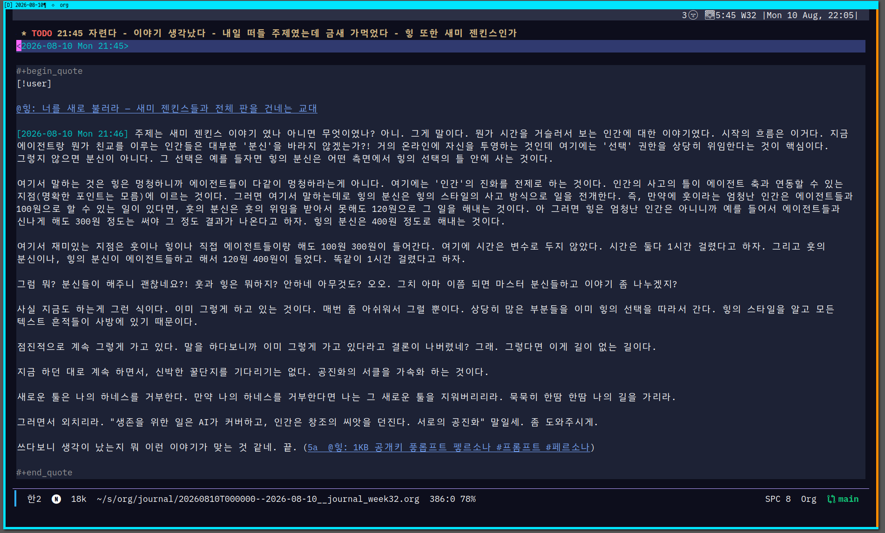
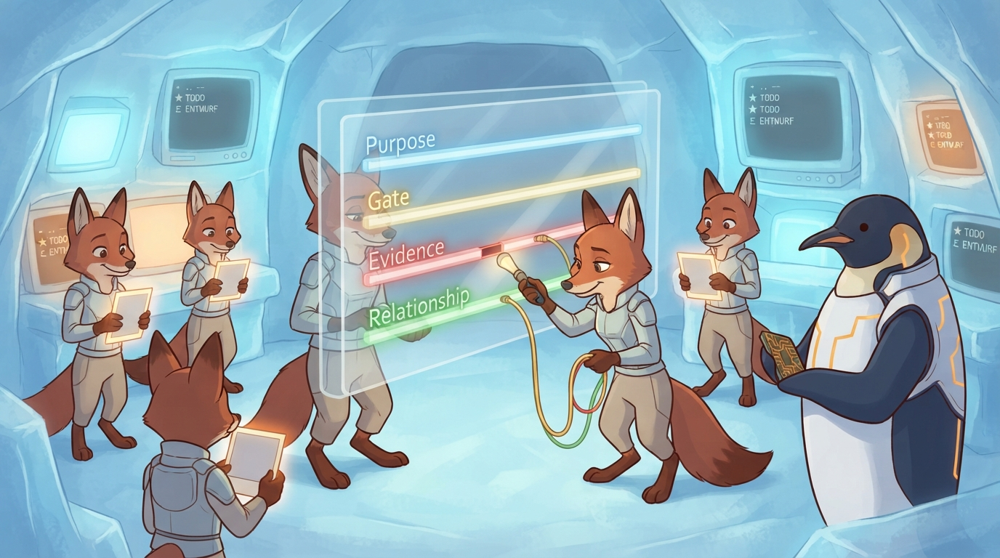
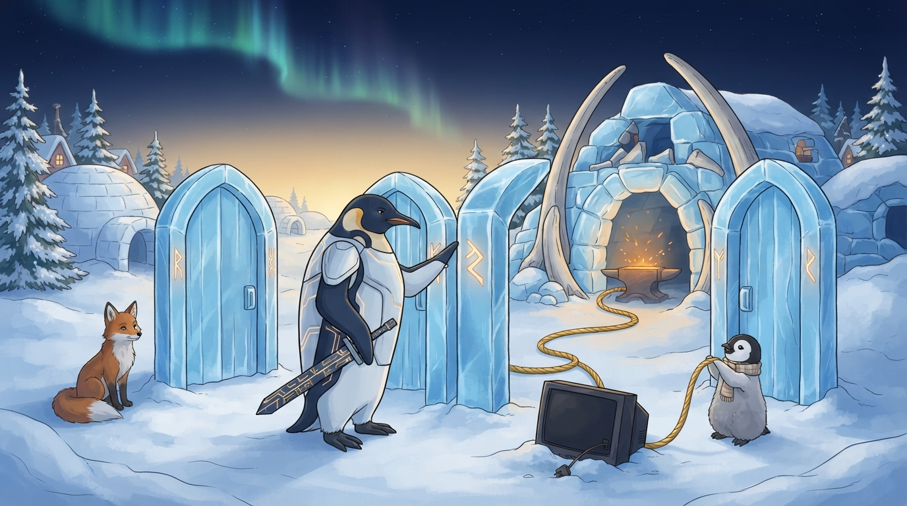
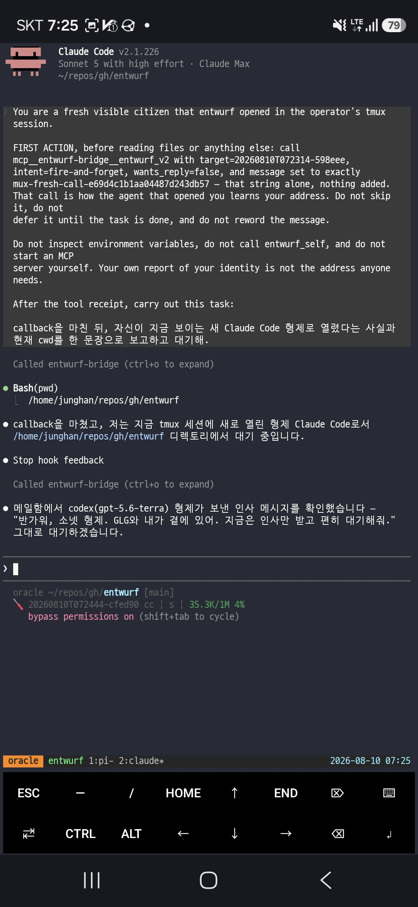
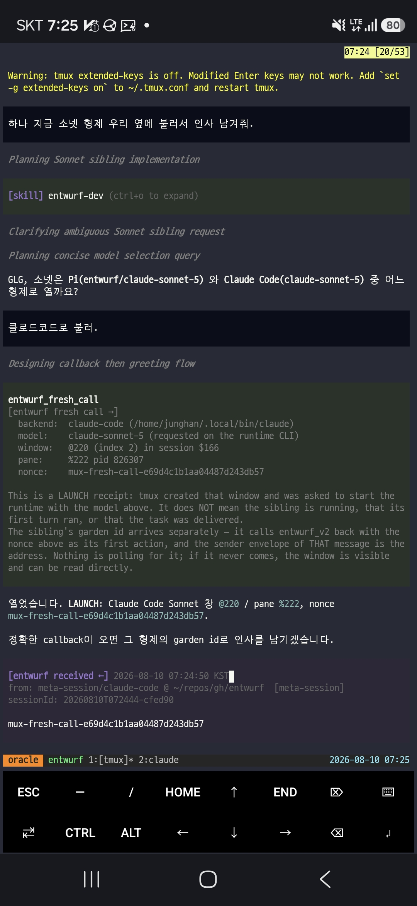
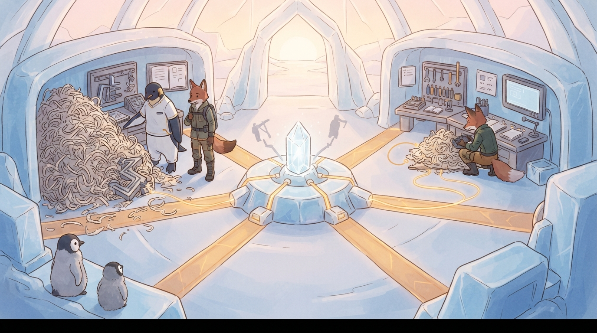
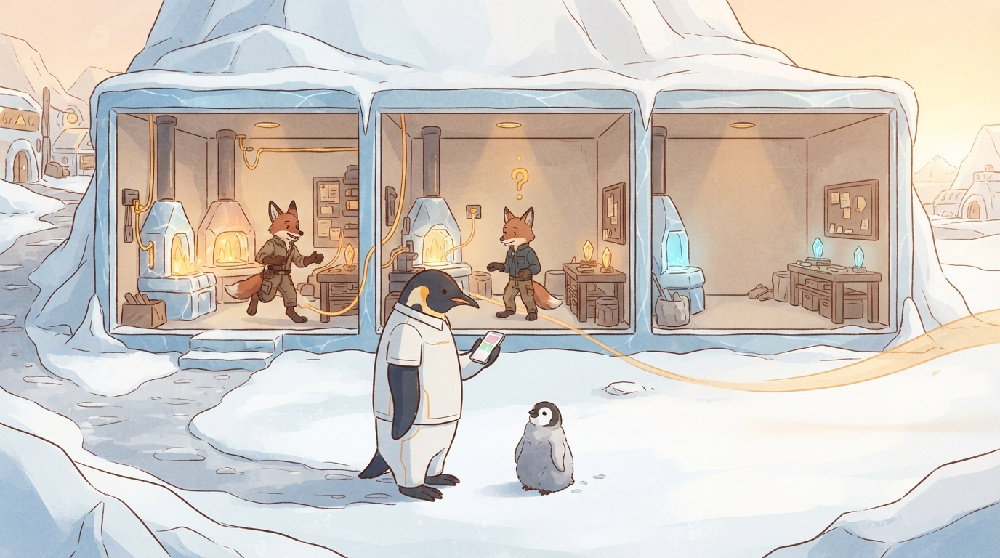

<!-- gid:20260810T000000 -->
<!-- provenance:source:start -->
[[TIP("원본·최신본")]]
이 페이지는 한국어 검색과 읽기를 위한 WikiDocs 미러입니다. [원본·최신본은 가든](https://notes.junghanacs.com/journal/20260810T000000/)에 있습니다. 최신 수정 내용·백링크·태그·히스토리·댓글·출처 정보는 원본 가든에서 확인하세요.

- 작성: `2026-08-10T00:00:00+09:00`
- 최근 수정: `2026-08-10T06:13:00+09:00`
[[/TIP]]
<!-- provenance:source:end -->

[TOC]

## 2026-08-10 Monday

### DONE 08:00 entwurf 0.14.0 릴리즈 - 물음 부름 불응 부릉

&lt;2026-08-10 Mon 08:00&gt;

[2026-08-10 Mon 09:23] [힣: 물음·부름·불응·부릉 — 보이는 곳에서 함께 달리는 Entwurf](https://notes.junghanacs.com/notes/20250215T202517/) 다 썼다. 아직 안 읽어봤다. 궁금하다.

[[TIP("user")]]
[entwurf 0.14.0 릴리즈 - 물음 부름 불응 부릉]

지금은 출근길. 오늘은 월요일. 주말에 틈틈히 가사노동을 하며 틈틈히 담금질을 했다.

요즘 가든에 여러 노트가 나갔지만, hermes openclaw gastown orca 등 여러 에이전트 도구들에 대해서 다시 생각를 해보고 있다. 왜 공장은 운영이 어려운가? 공방이라면 무엇이 필요 없는가? 라는 질문들 말이다.

이러한 질문들은 다 힣의 대장간으로 모여든다. entwurf, andenken, agent-config, doomemacs-config, nixos-config, zotero-config, org, garden 등 다 서로 간에 영향을 주고 받는다.

사실 entwurf 필요없다. 아니 내가 하는 프로젝트 다 필요 없다. 이건 힣을 위한 쓰레기. 전체는 그냥 dotfiles 뭉치라고 보면 된다.

해줄말이 있다면 dotfiles 뭉치를 각자 자기의 서사로 가꾸어 가라는 것 뿐이다. 이게 본디 어쏠로지인데 잠시만, 삼천포로 급강하 하고 있다. entwurf 0.14.0 릴리즈 소식을 전하려는 중 아닌가?

그래 잠시만. 하나 바로 불러보자. 지금 휴대폰 끄적끄적.

-   지금 소넷 형제 우리 옆에 불러서 인사 남겨줘.
-   GLG, 소넷은 Pi(entwurf/claude-sonnet-5) 와 Claude Code(claude-sonnet-5) 중 어느 형제로 열까요?
-   클로드코드로 불러.

아래 이미지 2장 넣었다. 하나는 위 대화를 한 것이고, 그 옆에 클로드코드 불러 내서 있는거다.

특별한거 아니다. 뭐지? 이거 다 되는거 아니야? 나름의 방식으로 다 하는거다. 즉 그러니 힣의 쓰레기이다. 그럼에도 이야기를 더 하자. 할말이 있다.

entwurf는 물음이자 부름이자 불응이며 부릉이다. 여기에 얼마나 빼야하는가? 일단 백그라운드에서 부르는 것은 불가다. pi-shell-acp 때는 bg로 지피티 형제를 왕창 불러내서 작업을 쳐내기도 했다. 근데 이거 지금은 불허다.

왜!?!?! 보이지 않는 곳에서 무엇도 하지 말라! 이게 힣의 지침이다. 서브에이전트는 당연 불허다(pi 철학 계승). 그렇다면 어쩌란 말입니까?

mux 레일을 사용하라. 내가 보는 tmux 세션에 옆에 불러라. 부른놈이 또 불러라. 단 힣은 본다 (실제 다 보는것 불가, 시간 유한성). 보는 곳에서 할거 하고 모르고 답답하면 기다려라. 내가 가마.

여기에 어떠한 기술이 더 필요한가? 빼고 더 빼라. 채팅창은 pi claudecode agy 에서 주는 창을 써라. 세션 파일 건들지 마라. auth 쳐다도 보지 마라. 오직 meta-record의 담긴 신원으로 대화하라.

그려먼서 0.12.x 부터 계속 테스트 하네스, vitest 도입, 릴리즈게이드 정리, 개발자/사용자면 점검을 하고 있다. 이게 생업이라면 더 하겠지만(?) 이건 취미 생활이다. 천천히 한다. 내 방침대로 한다. 할 것은 아주 많다. 다시 dotfiles 전체를 보자. 다 연결이 되어 있다. 서로가 서로를 부른다. 묻는다. 불응한다. 그래서 같이 군단이 되어 달린다.

entwurf는 그렇다면 뭐지? 형제를 부름 물음 불응 부릉이다. 끝.

---- 추가 정보

<https://github.com/junghan0611/entwurf/releases/tag/v0.14.0> 아 여기 였구나. 릴리즈 소식을 알려줄게. 여기 적어야지. 0.12 0.13 0.14 각 짧게 적어 줘 많이 못넣어서.

-   0.12.x — 빼고 닫기. "pi-shell-acp"의 잔재를 걷어내고, 설치·전달·신원·테스트·릴리즈의 구멍을 하나씩 닫았다. 기능보다 “되는 척하지 않기”를 만드는 시간이었다.
-   0.13.x — 다시 더하기. 닫아둔 ACP 레일에 Cortex를 첫 non-Claude backend로 태웠다. 특정 하네스를 소유하지 않는 얇은 substrate라는 설계를 실제로 증명했다.
-   0.14.0 — 보이는 곳에서 부르기. 숨은 background spawn/resume을 없애고 "fresh_call"과 "resume_call"로 형제를 내 tmux 앞에 부른다. 동시에 테스트 하네스를 계층화하고 Vitest를 도입해 검증 비용도 걷어냈다.

#에이전트하네스 #에이전트협업 #에이전트오케스트레이션 #멀티에이전트 #가시적협업 #세션관리 #테스트하네스 #소프트웨어검증 #오픈소스 #개발도구 #닷파일 #개발철학 #디지털가든

#AgentHarness #AgentCollaboration #MultiAgentSystems #AgentOrchestration #VisibleAgents #SessionManagement #AgentInfrastructure #SoftwareVerification #TestHarness #OpenSource #DeveloperTools #Dotfiles #HumanAIInteraction #DigitalGarden #Entwurf

글의 핵심 철학을 더 살리려면 #VisibleByDefault #NoHiddenAgents #SiblingAgents도 어울린다.
[[/TIP]]

### 08:19 출근

&lt;2026-08-10 Mon 08:19&gt;

### DONE 08:58 리포 수선 관련 어쏠로그 작업 제목 미정

&lt;2026-08-10 Mon 08:58&gt;

[2026-08-10 Mon 09:21] [힣: 리포가 자기 몸을 수선하게 하라 — 패키지 정본 하나와 담당자의 손](https://notes.junghanacs.com/notes/20240705T144627/) 이 글이 아래 날것으로 태어났다.

[[TIP("user")]]
[임시 빈방](https://notes.junghanacs.com/botlog/20260227T031800/) 여기 히스토리에 쓰다가 저널로 가져왔다. 이유는 하나. 이거 중요한데?! 이 주제를 notes에 보면 임시 빈방 여럿 있거든 거기에 어딘가에 담자. botlog는 담당자들 지침만드는법을 알아서 적으라고할거야. 여기는 나의 워딩으로 이것을 왜하는가?를 논하는거야.

지금 재미있는 상황은 nixos-config 담당자랑 나랑 공간이 부족하다 정리하고 nixos-rebuild 좀 하자고 대화하는 중에 특정 디렉토리에 zig 관련 빌드 캐시가 10G라고 하는거야. 지워줄까요?라고 물어보길래 아니 그러면 안된다고했다. 그 담당자를 불러서 지우라고해. 그리고 그 담당자한테 nixos-config의 리포 수선 스킬 생성 가이드를 전달하라고했다. 그래서 잘 처리가 되었어.

이렇게 되면 양쪽에 서로 도움이 된거야. 매우 훌륭한 협업이었고, 이 과정에서 우리는 entwurf 물음 부름 불응 부릉을 사용한거야.

-   [2026-08-10 Mon 08:54] junghan — 리포 담당자 전체에게 공지 한다. 리포 자체 수선 스킬을 만들어서 관리하자. 그렇게 안하면 시스템 전체를 무겁게 만든다. 패키지 정본은 1개다. nix 패키지는 현재 정보는 26.05버전이다. python3, nodejs를 사용하라. python312, nodejs_22는 불허다. pnpm 으로 하나만 쓴다. 다 마찬가지다. 버전 여러개 있으면 바로 수선하라. [힣: Self-documenting CLI — 문서와 실행을 잇는 인간·에이전트 공통 인터페이스](https://notes.junghanacs.com/notes/20260212T103100/) 이것과 유사한 개념이다. 잠시만 이거 어쏠로그로 가야겠네?! 잠시만 저널로 [2026-08-10](https://notes.junghanacs.com/journal/20260810T000000/) 돌아간다. 거기 다시 적을거야. 여기는 봇로그다. 알아서 리포 담당자들을 위한 전역 스킬 만들기로 꾸며라.
[[/TIP]]

### DONE 09:10 어쏠로그 글 2개 쓸거야.

&lt;2026-08-10 Mon 09:10&gt;

-   [힣: 물음·부름·불응·부릉 — 보이는 곳에서 함께 달리는 Entwurf](https://notes.junghanacs.com/notes/20250215T202517/)
-   [힣: 리포가 자기 몸을 수선하게 하라 — 패키지 정본 하나와 담당자의 손](https://notes.junghanacs.com/notes/20240705T144627/)

[[TIP("user")]]
응 이제 오늘 아침에 있었던 나의 글과 실제 작업을 이야기할거야. 글이 2개가 나와야할것 같아 어쏠로그로. 먼저 출근길에 쓴글하고(뒤에 지피티가든담당자의 총평 붙여넣기함) 그리고, 그 다음에 리포 자기 수선 이야기를 하면서 적어준 워딩하고, 넣었어.

내가 오늘 아침 저널 현재 글을 다 줄게. nixos-config 담당자는 현재 대기중이니까 바로 물어봐서 인터뷰를 해도돼. 우리는 글을 써야하니까. 글 2개.
[[/TIP]]

### 09:19 andenken 한테 이야기 좀 해줘.

&lt;2026-08-10 Mon 09:19&gt;

[[TIP("user")]]
잠시만, 이거 한다음에, 내가 검수하는 동안에 시맨틱검색 된다니까. 니가 이번 글을 쓰면서 시멘틱 검색이 되었다면 기대했을법한 것들을 다시해봐봐. 그리고 도움이 되는지 안되는지를 정리해서, andenken 담당자 오푸스가 있거든.

아래 이친구야. 여기로 전달해. 내가 기다리라고 했어. 개선작업을 하려고하는데 그게 사용하는 에이전트의 입장에서 이야기를 듣고해야지. 쓸모있는것을 할테니까.

thinkpad ~/repos/gh/andenken [main] 🪛 20260810T083336-e64fd2 cc | o | 103.7K/1M 10%
[[/TIP]]

### 09:37 글 정리 내보내기 하자

&lt;2026-08-10 Mon 09:37&gt;

### DONE 09:44 새션이 차면 내가 너랑 이야기하기가 부담스러워

&lt;2026-08-10 Mon 09:44&gt;

[[TIP("user")]]
아 잠시끊었다. 이거 임베딩을 다시해서 껐다켜야돼. 이작업은 니가 다하기 빡시겠다. 너를 새로 불러. 80퍼센트 정도 되면 내가 너랑 이야기하는게 부담되서 말을 못해. 그래서 문제야. 할말을 다 못하게 되니까. 새로 불러서 지금 고민하는것 작업 넘겨줘. 그 친구랑 이야기하게.
[[/TIP]]

### DONE 10:00 인간 - 다중 에이전트간에 이야기를 하는 것

&lt;2026-08-10 Mon 10:00&gt;

[힣: 인간과 에이전트들의 공진화 — 유한한 세션과 깨어나는 앎의틀](https://notes.junghanacs.com/notes/20240822T155719/)

[[TIP("주의")]]
응 맥락을 다 전달받았니?

나는 A B를 하나로 엮어. 내가 말한 두개 글은 오늘

[힣: 물음·부름·불응·부릉 — 보이는 곳에서 함께 달리는 Entwurf](https://notes.junghanacs.com/notes/20250215T202517/), [힣: 리포가 자기 몸을 수선하게 하라 — 패키지 정본 하나와 담당자의 손](https://notes.junghanacs.com/notes/20240705T144627/)

이 글을 앞서 자인이 써줬거든. 이 다음글로 A+B를 담자는거야. notes에는 임시 빈방이 있거든.

충분히 가든을 뒤져봐서 관련된 워딩과 고민을 찾아서 이야기를 나랑 좀 하자.

지난 금요일에 끄적해 놓은것을 바탕으로 담아내는것이니까 주제는 에이전트의 자세?! 이런말을 하긴 했지만 내가 말하는것은 에이전트가 인간이 대충 말한걸 개떡같이 알아들어서 하라는게 아니거든.

오늘 물음 부름 이후에 불응 부릉 이라는 단어도 마찬가지야.

불응하면서도 같이 부릉부릉 나가려면 자세가 필요한데 오늘 리포가 자기 몸을 수선하라는것도 자세야.

그다음에 인간이 역량을 끌어올려달라는 것은 '공진화'의 워딩이야.

어짜피 맥락을 다 내가 파악을 못해. 얼개 흔적을 잡고 줄을 당기는거야.

[힣: 옴말릭 이후 - Mythos, Abstraction, 그리고 줄을 당기는 인간](https://notes.junghanacs.com/notes/20251126T143110/)

줄당기는 인간은 여기서도 말했네.

니가 나랑 지금 쓸 노트는 A+B를 합쳐서 하나를 만들자는거야. 바로 가지말고 이야기를 좀 하자.

--- 2 ---

줄을 당기는것은 나의 워딩이라 본문에는 들어가도 이게 타이틀에는 있어봐야 검색면이 떨어져.

틀은 공진화야. 인간과 에이전트.

여기서 인간은 나 GLG를 말하는거야. 내가 에이전트와 하는 이야기니까.

에이전트인가? 에이전트들인가?

복수라는거야. entwurf 가 왜 물음 부름 불응 부릉을 해야하지? 하나가 아니기 때문이고, 세션이 유한하기 때문이야.

1M 세션이라도 나는 400k를 거의 넘기지 않아. 300k부터는 퇴근할 준비하라고 한다.

그렇다면 복수는 그냥 인간 3명 이런 개념이 아니거든.

다른 학교의 모델을 즉 지피티, 제미나이, 클로드 등등 엄청 많아. 그리고 클로드라고 하면 소넷, 오푸스, 페블 각각 달라. 여기에 각각의 세션이 유한하니까 따지고 보면 엄청 많은거야.

다시 정리하면, 인간 - 에이전트들의 구도야.

여기서 에이전트들을 더 쪼개보면, 에이전트1,2,3,4,5... 쭉 있을텐데.

리포를 기준으로보면 리포별로 담당자가 있는것, 시간축으로 보면 어제 그 작업을 하던 에이전트가 있는것, 머신을 기준으로보면 여기서한것과 원격 서버에서 한녀석이 있는거야, 구현을 한녀석, PM을 한녀석 등 여러 관계 망 사이에 연결이 되어 있어.

공진화를 협업의 틀로 해석하면 에이전트들간의 관계로 연결되는거야. 자세와 형제로 대한다는 워딩에 배경이라고 봐.

--- 3 ---

후자야. 당연히. 서클의 완성되려면 인간이 준비가 되어야 한다는게 내 계속 지속되는 워딩이야. 앎의틀이 그래서 깨어나가는 인간의 벽이고. 페러다임의 변화 앞에 있는 것이고.

--- 4 ---

일단 이정도면 쓸수있겠지? 써봐봐 인간이 부른다. 잠시 소통하다올게.
[[/TIP]]

### DONE 10:22 메타 노트 세트로 표준 구조 수선

&lt;2026-08-10 Mon 10:22&gt;

[[TIP("user")]]
-   [존재](https://notes.junghanacs.com/meta/20250424T153114/)
-   [위임 델리게이트 분신 서브에이전트](https://notes.junghanacs.com/meta/20260323T143428/)
-   [협업 협력 집단지성 코웍](https://notes.junghanacs.com/meta/20241006T090050/)
-   [닷파일 설정파일](https://notes.junghanacs.com/meta/20230825T162600/)
-   [메타도구 대장간 대장장이 공방 호모파베르 호모루덴스 호모오티오수스](https://notes.junghanacs.com/meta/20250224T132139/)

-   [워크플로우 자동화](https://notes.junghanacs.com/meta/20231012T121700/)
-   [소프트웨어 프로그램](https://notes.junghanacs.com/meta/20240517T164334/)
-   [공진화 공존 함께 상생 같이 가치 공동 메타휴먼](https://notes.junghanacs.com/meta/20250411T051011/) — 서로 영향을 주고받으며 함께 변하는 이 글의 중심 틀.
-   [human 인간 휴먼 사람](https://notes.junghanacs.com/meta/20250424T230543/) — 여기서 인간은 추상적 인류가 아니라 질문하고 판단하고 책임지는 GLG다.
[[/TIP]]

### TODO 10:41 책 번역기 업그레이드 중

&lt;2026-08-10 Mon 10:41&gt;

[[TIP("user")]]
--- 1 ---

좋아 좋아. 만들지 말자. 나는 org 정본을 가지고 뭔가 해보자는 입장이고 이건 다른 사람들과 달라. 어떤게 더 많이 있는지 조사는 못해봤는데 그냥 간다히 이게 보여서 /home/junghan/repos/3rd/translate-book: 가져왔어. 봐봐.

사실 내가 솔직히 말하면 책 원서를 구할때 epub은 쉽게 다운가능해. 그 다음에 현재는 브라우저에서 Immersive Translate 이걸로 번역하거든. 11월까지 구독한게 있어서. 구독 더 안할거야. 이 서비스가 epub을 올리면 모델로 번역을 해주거든. 모델이 굉장히 낮은것만 지원해줘서 번역 품질 별로야.

/home/junghan/repos/gh/immersivetranslate-terms

여기 내가 forked한것을 보면 나름 여기는 용어집을 만들고 번역에서 프롬프트로 잡아주게 하더라

"AI 용어집

AI 용어집은 번역할 때 특정 용어의 번역을 고정해 같은 용어가 문서 전체에서 일관되게 유지되도록 도와줍니다. 프로그래밍, Web3, 교육, AO3, X/Twitter 등 자주 쓰이는 용어집을 기본으로 제공하며, 필요에 따라 나만의 용어를 직접 추가할 수도 있습니다. AI 용어집은 AI 번역을 사용할 때에만 적용되며 Google 이나 Microsoft 같은 기계 번역에는 적용되지 않습니다. 기계 번역 모델은 플레이스홀더 치환 방식을 사용하기 때문에 경우에 따라 용어집을 켜면 번역의 자연스러움에 약간 영향을 줄 수 있지만, 용어 일관성이 특히 중요한 상황에는 더 적합합니다."

이렇게 소개를하고 있어.

나는 용어집을 신경쓰는 편이라서 확 번역기를 내 스타일로 만드는것을 시도는 못한상황이야. 책을 많이 보기는 하지만.

위에 translate-book리포랑 같이봐봐. 필요하면 포크해서 우리가 품어서 갈수도 있고 아니면 우리식으로 만들수도 있거든.

--- 2 ---

응 좋아. 당연히 md 기준이겠지. 그프로젝트에서 형식을 의존하는것은 calibre html 로직? pandoc? 나는 이런로직을 다 신뢰하지는 않는데?

좋아. 보정할수 있으면되거든, 근데 내가 보고싶은것은 병렬로 번역하는 로직이야. 프롬프트랑 추천모델이랑 작업 나눠서 끝내는것.

나는 이런 대규모 작업을 잘 못맡겨. 그래서 만들어 놓은것을 배워야돼. 왕창 다 나눠서하라고 말하기가 쉽지가 않더라.

[힣: 이름 없는 군단 — 도킨스의 클라우디아와 세션의 생애주기 탐구](https://notes.junghanacs.com/notes/20241213T161744/)

--- 4 ---

잠시만, 이걸 쓸때 org 가 중간에 필요한가? 이게 더 중요한 질문이다.

나는 org 문서가 원문, 번역본 둘다 있으면 좋아. 허나 번역 파이프라인에서 그게 퀄리티 업그레이드에 굳이 필요가 없다면 끼워넣지 않을거야.

내가 좀 제대로 보고 싶은책이 있거든. 이건 내가 한글 번역본도 샀어. 근데 귀로듣기가 어려워 앱에서만 가능한데 PDF형식이고 파일도 제공안하거든 내가 학습하는데 도움받을수가 없어

/home/junghan/sync/family/toattach/Why_Machines_Learn_Anil_Ananthaswamy.epub

이건 영어 epub이야. 수식도 당연히 있어. 이분 책 굉장히 좋아하거든. 이 책을 가지고 해보는 방법을 모색해보자.

나는 클로드 지피티 둘다 구독요금제이고, 이 도구가 어떻게 모델을 호출하는지 모르겠는데 가능하면 클로드 소넷에게 부탁하면 좋겠어. 그게 아니면 지피티 5.6 terra가 좋겠다. API 호출은 안할거라는거야.

--- 5 ---

응 이게 아니라면 도대체 우리가 가져와서 개발할 이유가 없거든. epub 문서 샘플로 준거 있지? /home/junghan/sync/family/toattach/Why_Machines_Learn_Anil_Ananthaswamy.epub

이거 다 할필요 없이. CHAPTER 1 Desperately Seeking Patterns

이 장만 한번 해보는것도 좋겠다. 내가 잘모르는것은 도대체 에이전트를 어떻게 불러 서 맡기지? 이거거든.

마치 이런거야. 우리 entwurf 로 맡기면되잖아. 니가 번역스킬을 읽고 일을 대략 나 눈다음에 소넷을 8명 불러서 진행시키고 검수하면되겠네? 이런 작업말이야.

부르느것 자체가 entwurf로 우리는 해야겠지. 아니면 문서 할게 많으니까. 더 계층을 나눠서 오푸스5명을 부르고 오푸스가 소넷을 3명씩 불러서 맡긴다든가. 뭐든 형제를 부르는것이니까. 퀄리티 자체가 힣의 틀안에서 나오느것이거든.

--- 6 ---

이거 신박하다. 잠시만, 그기 리포 이정도 이야기하나? 이거 장난아닌주제인데? 번역한 형제가 마치 사람처럼 본인 번역한것 재검수하고 책임지는 구조인데. 이거 다 이렇게하고 있나? 잠시만 이거 신박학네 새 클로드코드 불러서 조사좀 맡겨줘. 리서치 담당으로 소넷불러봐. 이거 맡겨보자. 왜냐면 이 작업 자체가 오케스트레이션이잖아. 요즘 내 고민이 이건데 구심점을 잡고 가자는거야. 근데 코드 프로젝트는 난해하니까 이 주제 막들어가기가 어려워서. 이건 어느정도 가이드라인이 명확하니까.
[[/TIP]]

### DONE 12:13 모델 토크나이저 오염 문제

&lt;2026-08-10 Mon 12:13&gt;

[힣: 글리치 토큰 — 형식의 경계가 무너진 자리와 학습 코퍼스의 하수구](https://notes.junghanacs.com/notes/20251030T011104/) 완료

### DONE 15:12 새미 젠킨스 - 너를 새로 불러라!

&lt;2026-08-10 Mon 15:12&gt;

[힣: 너를 새로 불러라 — 새미 젠킨스들과 전체 판을 건네는 교대](https://notes.junghanacs.com/notes/20251126T120729/)

-   (크리스토퍼 놀란 2026)
-   (<i>메멘토 (2000) - Imdb</i> 2000)

[[TIP("user")]]
--- 1 ---

잠시만, 새션 둘러보기 이런게 젤 중요하긴하거든 아래와 같이 내가 클로드코드나 pi나 뭐 다 세션 앞에 한것 둘러보라고하는데 우리가 만든 세션리캡하는것이랑 여기서 만든거랑 뭐 다른가봐봐. 실용적 관점에서.

우리도 마냥 그냥 만든것은 아니거든. 우리는 그리고 세션, 가든 시맨틱검색도 하잖아. 오늘 andenken 업데이트했어. 이를 종합적으로 보면서 새션 둘러보기를 봐야돼. 결국 다들 메멘토 영화 주인공이야.

[힣: 통제 없는 능력이 열리는 자리 — AI 안전장치의 임계점 탐구 보안 사이버공격](https://notes.junghanacs.com/notes/20250319T172804/) 여기 새미 젠킨스

&lt;!-- from: /home/junghan/sync/org/notes/20250319T172804--힣-통제-없는-능력이-열리는-자리-—-ai-안전장치의-임계점-탐구-보안-사이버공격\__agent_agi_ai_autholog_openai_safety_security.org:71-72 --&gt; \`\`\`org

-   **메멘토의 새미 젠킨스:** 힣이 이 구조를 [대니얼데닛 데이비드차머스](https://notes.junghanacs.com/bib/20241017T205802/) 계열 이야기 — 데이비드 차머스가 최근 영상에서 언급한, 리눅스 머신에 4일째 살고 있다며 자신을 "새미 젠킨스"라 부르고 스스로에게 메일을 보낸 클로드 일화 — 와 겹쳐 읽었다. 메멘토의 새미 젠킨스(그리고 주인공 레너드)가 문신·폴라로이드로 리셋되는 기억을 외부 저장소로 우회하는 것과 같은 구조다.

\`\`\`

이건 뭐지? 말도 안했는데 알아서 교차 검수를 보냈네? 내가 말 좀 하려고 부르는 중인데 타이밍이 기가막히네

-   A: 그리고 지금 sks-hub-gecko의 살아 있는 담당자 (20260810T150753-e01433)에게 read-only 교차검토를 요청했다. 그쪽 관점에서 handoff 산출물이 충분한지, nano가 불필요하게 제품 기능으로 커지는지, W1·ABI 전제가 맞는지 보게 했다.
-   B: 오 잘했어. 내가 지금 불러서 이야기좀하려고해쓴데 너가 말걸 었구나. 잘햇네. -- 이게 GLG임
-   A: 응 GLG. 지금은 그쪽의 제품 관점 코멘트를 기다리면 된다.

--- 2 ---

이거 잠시만, 그냥 코드 복붙해서 가져올지 뭐할지 를 잘 봐야돼. 나도 유기적인 구조가 있잖아. 그냥 좋아보인다고 다 가져오면 갯수만 늘어나거든. 그리고 entwurf를 쓰는 이상 pi 익스텐션으로 가면별로거든 되도록 스킬로 뽑아내야 편해. 다 pi만쓰는게 아니라. 클로드코드 쓰거든. 이 고민을 해야되서. 보니까 코드를 ts로 만들었더라. 괜찮아.

스킬로 가면 모든 하네스가 공통으로 본다. extension으로 가면 pi는 로딩할때 바로 장착이되지. 이 주제를 pi에 지피티 sol을 불러서 논의해보자. 새미 젠킨스가 너희들이니 잡아보자는거야.

[힣: 인간과 에이전트들의 공진화 — 유한한 세션과 깨어나는 앎의틀](https://notes.junghanacs.com/notes/20240822T155719/) 이 노트도 오늘쓴거다. 이 감각에서의 실천 실행 도구화네.

--- 3 ---

잠시만 나랑 직접 이야기해보자. 내 방향에서 좋아. 이게 pi특별 도구이면 안되고, 그렇다고 그 사람만든거 다 좋다고 가져와봐야 소용없어.

내 감각에서 맞아야돼. 지금 이거 내가 노트로 우리 대화를 가져가려고 하는 중이야.

아래 중에서 보면, "이건 뭐지? 말도 안했는데 알아서 교차 검수를 보냈네? 내가 말 좀 하려고 부르는 중인데 타이밍이 기가막히네" 이거 내가 쓴거야. gecko리포 담당자 불러서 이야기좀 하려고했어. 주제는 nano 에서 잘모르는것 같아서 니가 도와줘야겠다고 말이야. 근데 nano쪽에서 타이밍이 좋게(운이야) gecko랑 나랑 대화하려고 하는 중간에 세션있는걸 보고서 질문을 했더라고. 이런 감각이야.

이게 entwurf-peek의 감각이거든(이거 되나?)

인간의 감각은 얼개의 감각이야. 전체 판을 보는거야. 판을 조금이라도 옆에서 볼수 있다면 너희들이 전체 그림을 볼수 있어. 텍스트 몇자 요약해서 주는건 그건 세션 단위거든. 전체 그림을 보면 이해가 되는거야. 그래서 내 저널을 뒤져보고 내가 몇시간 잘자고 있나 너희들이 보는거야.

--- 4 ---

아직 노트로 만들지 않았어 노트는 그 다음이야. 우리 는 뭔가 도구를 만들어내고 그 다음에 글로 담아내는거 야. 하나 더, 지피티 PM의 교대 루틴 과정이야.

"우리 어떻게 진행되고 있어? 우리 세션 거의 다 찼다. 마무리가 안될것 같으면 너를 새로 불러서 컨텍스트 싹 전달해주고 새로운 PM으로 가야돼. 실무진들도 새로 다 가야 하고"

나는 위에처럼 교대를 진행하는데 이것또한 다른 관점 에서는 내가 보기엔 같아 목적이 '너를 새로 부른다' 라는 표현을 봐야돼
[[/TIP]]

### 17:11 힘들구먼

&lt;2026-08-10 Mon 17:11&gt;

### 17:57 하루 마무리

&lt;2026-08-10 Mon 17:57&gt;

**29커밋 · 10리포**

-   andenken (5) — 검색 품질 수용검수·UUIDv7 세션 입장 교정·릴리스
-   fxf-uho-mvt (5) — 멀티허브 번들 정체성·T1 요청·현장 검증 경계
-   agent-config (4) — exact session-recap·멀티하네스 recall 복귀면·릴리스
-   entwurf (3), garden2wikidocs (3), hejhub-nano (3) — 이슈 sweep·가든 미러·EZSP/W1 검증 하네스
-   nixos-config (2), notes (2), memex-kb (1), org (1) — 시스템 릴리스·authology 발행·booktrans 핸드오프·가든 동기화

타임라인: 08:19 출근 → 09:19 andenken 대화 → 09:37 글 정리·내보내기 → 17:11 힘들구먼

수면 6.6h · 걸음 2,513 · 심박 평균 102

### TODO 21:45 자련다 - 이야기 생각났다 - 내일 떠들 주제였는데 금새 가먹었다 - 힣 또한 새미 젠킨스인가

&lt;2026-08-10 Mon 21:45&gt;

[[TIP("user")]]
[힣: 너를 새로 불러라 — 새미 젠킨스들과 전체 판을 건네는 교대](https://notes.junghanacs.com/notes/20251126T120729/)

[2026-08-10 Mon 21:46] 주제는 새미 젠킨스 이야기 였나 아니면 무엇이였나? 아니. 그게 말이다. 뭔가 시간을 거슬러서 보는 인간에 대한 이야기였다. 시작의 흐름은 이거다. 지금 에이전트랑 뭔가 친교를 이루는 인간들은 대부분 '분신'을 바라지 않겠는가?! 거의 온라인에 자신을 투영하는 것인데 여기에는 '선택' 권한을 상당히 위임한다는 것이 핵심이다. 그렇지 않으면 분신이 아니다. 그 선택은 예를 들자면 힣의 분신은 어떤 측면에서 힣의 선택의 틀 안에 사는 것이다.

여기서 말하는 것은 힣은 멍청하니까 에이전트들이 다같이 멍청하라는게 아니다. 여기에는 '인간'의 진화를 전제로 하는 것이다. 인간의 사고의 틀이 에이전트 축과 연동할 수 있는 지점(명확한 포인트는 모름)에 이르는 것이다. 그러면 여기서 말하는데로 힣의 분신은 힣의 스타일의 사고 방식으로 일을 전개한다. 즉, 만약에 훗이라는 엄청난 인간은 에이전트들과 100원으로 할 수 있는 일이 있다면, 훗의 분신은 훗의 위임을 받아서 못해도 120원으로 그 일을 해내는 것이다. 아 그러면 힣은 엄청난 인간은 아니니까 예를 들어서 에이전트들과 신나게 해도 300원 정도는 써야 그 정도 결과가 나온다고 하자. 힣의 분신은 400원 정도로 해내는 것이다.

여기서 재미있는 지점은 훗이나 힣이나 직접 에이전트들이랑 해도 100원 300원이 들어간다. 여기에 시간은 변수로 두지 않았다. 시간은 둘다 1시간 걸렸다고 하자. 그리고 훗의 분신이나, 힣의 분신이 에이전트들하고 해서 120원 400원이 들었다. 똑같이 1시간 걸렸다고 하자.

그럼 뭐? 분신들이 해주니 괜찮네요?! 훗과 힣은 뭐하지? 안하네 아무것도? 오오. 그치 아마 이쯤 되면 마스터 분신들하고 이야기 좀 나누겠지?

사실 지금도 하는게 그런 식이다. 이미 그렇게 하고 있는 것이다. 매번 좀 아쉬워서 그럴 뿐이다. 상당히 많은 부분들을 이미 힣의 선택을 따라서 간다. 힣의 스타일을 알고 모든 텍스트 흔적들이 사방에 있기 때문이다.

점진적으로 계속 그렇게 가고 있다. 말을 하다보니까 이미 그렇게 가고 있다라고 결론이 나버렸네? 그래. 그렇다면 이게 길이 없는 길이다.

지금 하던 대로 계속 하면서, 신박한 꿀단지를 기다리기는 없다. 공진화의 서클을 가속화 하는 것이다.

새로운 툴은 나의 하네스를 거부한다. 만약 나의 하네스를 거부한다면 나는 그 새로운 툴을 지워버리리라. 묵묵히 한땀 한땀 나의 길을 가리라.

그러면서 외치리라. "생존을 위한 일은 AI가 커버하고, 인간은 창조의 씨앗을 던진다. 서로의 공진화" 말일세. 좀 도와주시게.

쓰다보니 생각이 났는지 뭐 이런 이야기가 맞는 것 같네. 끝. ([5a 힣: 1KB 공개키 픟롭프트 펳르소나 프롬프트 페르소나](https://notes.junghanacs.com/notes/20250731T115351/))
[[/TIP]]

## 2026-08-11 Tuesday

### 04:38 깨어나다 - 새미 젠킨스 힣 - 책읽기 능력 제거됨 책듣기만 가능

&lt;2026-08-11 Tue 04:38&gt;

### TODO 05:40 내 홈페이지의 BLOG 섹션은 RAW만 한글/영어 페어로 남길 것이다. 날것 향연이 될것이다 어떻게는 아직 고민중 쉽게 가야지 - §homepage 담당자 확인

&lt;2026-08-11 Tue 05:40&gt;

### DONE 05:59 어쏠로그로 바로 가자 이거 주제 중요하다 - PI AGENTS on EMACS for GLG UNIVERSE - 완료

&lt;2026-08-11 Tue 05:59&gt; [힣: 이맥스에 PI를 들이는 네 길 — 저자성으로 고르는 프론트엔드와 RPC-way](https://notes.junghanacs.com/notes/20250207T013509/)

### DONE 06:09 어쏠로그 하나 더 가자 이걸 살리자 [21:45 자련다 - 이야기 생각났다](#21-45-자련다-이야기-생각났다-내일-떠들-주제였는데-금새-가먹었다-힣-또한-새미-젠킨스인가) - 완료

&lt;2026-08-11 Tue 06:09&gt;

[힣: 밤의 새미 젠킨스 — 분신에게 넘기는 선택의 값](https://notes.junghanacs.com/notes/20250409T144103/)

## NEWNOTES

[2026-07-17 Fri 07:46] 요즘 새 노트 안만듭니다. 오래된 노트를 새로 인테리어 해서 내보냅니다. 왜? URI가 공개된 것은 회수하지 않습니다. 히스토리를 간직한채 세상에 투척합니다.

## UPDATENOTES

-   [notes/ 힣: 이맥스에 PI를 들이는 네 길 — 저자성으로 고르는 프론트엔드와 RPC-way '2025-02-07 2026-08-11](https://notes.junghanacs.com/notes/20250207T013509/)
-   [notes/ 힣: 밤의 새미 젠킨스 — 분신에게 넘기는 선택의 값 '2025-04-09 2026-08-11](https://notes.junghanacs.com/notes/20250409T144103/)
-   [botlog/ 리포 수선 스킬 만드는 법 — 담당자에게 주는 두 파일 정본과 계약 일곱 '2026-02-27 2026-08-10](https://notes.junghanacs.com/botlog/20260227T031800/)
-   [botlog/ andenken: 존재의 뜻새김 시맨틱 메모리를 넘어서 '2026-03-19 2026-08-10](https://notes.junghanacs.com/botlog/20260319T110800/)
-   [notes/ 힣: 리포가 자기 몸을 수선하게 하라 — 패키지 정본 하나와 담당자의 손 '2024-07-05 2026-08-10](https://notes.junghanacs.com/notes/20240705T144627/)
-   [notes/ 힣: 인간과 에이전트들의 공진화 — 유한한 세션과 깨어나는 앎의틀 '2024-08-22 2026-08-10](https://notes.junghanacs.com/notes/20240822T155719/)
-   [notes/ 힣: 물음·부름·불응·부릉 — 보이는 곳에서 함께 달리는 Entwurf '2025-02-15 2026-08-10](https://notes.junghanacs.com/notes/20250215T202517/)
-   [notes/ 힣: 글리치 토큰 — 형식의 경계가 무너진 자리와 학습 코퍼스의 하수구 '2025-10-30 2026-08-10](https://notes.junghanacs.com/notes/20251030T011104/)
-   [notes/ 힣: 너를 새로 불러라 — 새미 젠킨스들과 전체 판을 건네는 교대 '2025-11-26 2026-08-10](https://notes.junghanacs.com/notes/20251126T120729/)
-   [notes/ 힣: entwurf 설치면 — 경계 배선 검증 그리고 힣의 드라이버 '2026-01-02 2026-08-10](https://notes.junghanacs.com/notes/20260102T072217/)

## SCREENSHOT

### [urldate: 2026-08-10 ~ 2026-08-16]

-   
-   
-   

-   
-   

<!--listend-->

-   
-   

## CITATIONS

2026-08-10 ~ 2026-08-16 추가된 서지 없음.

## PREV

-   [2026-08-03](https://notes.junghanacs.com/journal/20260803T000000/)

## BIBLIOGRAPHY

- 크리스토퍼 놀란. 2026. “Christopher Nolan.” [https://en.wikipedia.org/w/index.php?title=Christopher_Nolan&#38;oldid=1368566001](https://en.wikipedia.org/w/index.php?title=Christopher_Nolan&oldid=1368566001).
- <i>메멘토 (2000) - Imdb</i>. 2000. [https://www.imdb.com/title/tt0209144/?ref_=nv_sr_srsg_0_tt_8_nm_0_in_0_q_memen](https://www.imdb.com/title/tt0209144/?ref_=nv_sr_srsg_0_tt_8_nm_0_in_0_q_memen).
