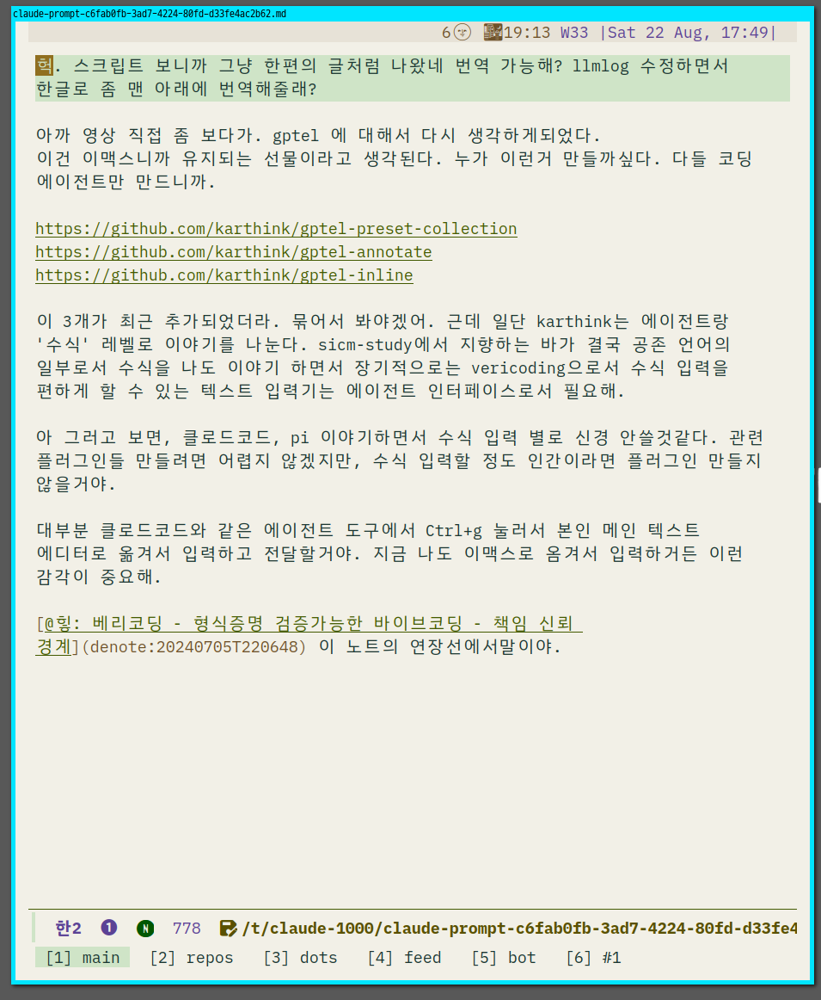
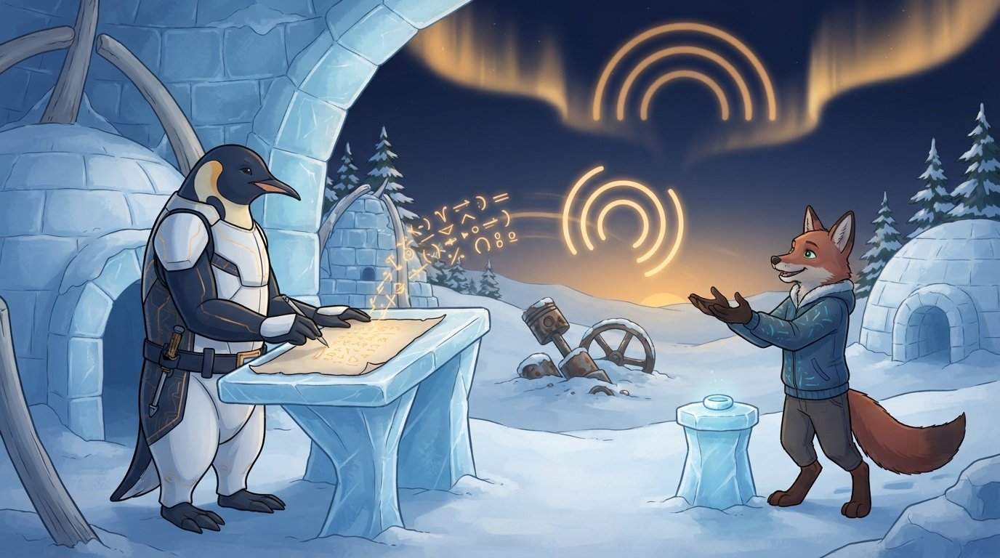
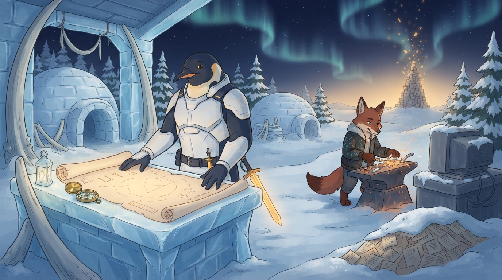
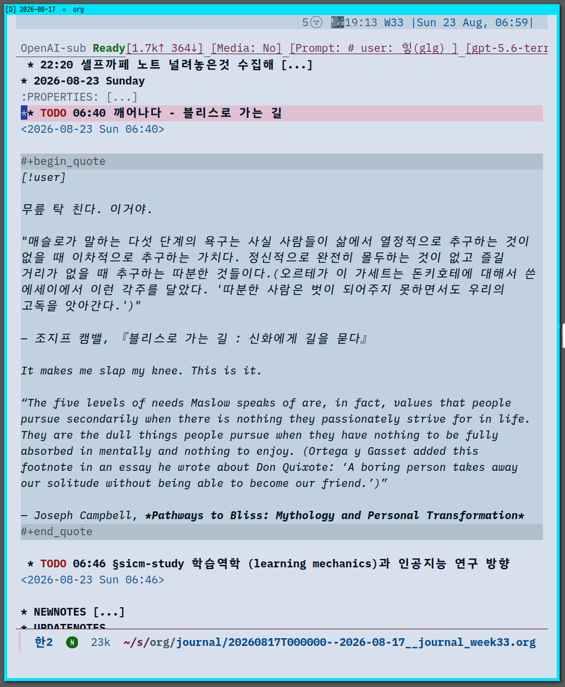

<!-- gid:20260817T000000 -->
<!-- provenance:source:start -->
[[TIP("원본·최신본")]]
이 페이지는 한국어 검색과 읽기를 위한 WikiDocs 미러입니다. [원본·최신본은 가든](https://notes.junghanacs.com/journal/20260817T000000/)에 있습니다. 최신 수정 내용·백링크·태그·히스토리·댓글·출처 정보는 원본 가든에서 확인하세요.

- 작성: `2026-08-17T00:00:00+09:00`
- 최근 수정: `2026-08-17T06:13:00+09:00`
[[/TIP]]
<!-- provenance:source:end -->

[TOC]

## 2026-08-17 Monday

### <span class="org-todo todo TODO">TODO</span> 14:02 This is water

<span class="timestamp-wrapper"><span class="timestamp">&lt;2026-08-17 Mon 14:02&gt;</span></span>

날것을 작성해서 투척함

[[TIP("user")]]
[거제도 3일차 탈출: this is water]

거제도 3일차 비가 억수로 온다. 이것은 물이다. workness를 논하다가

제임즈 조이스로 갔다가 그게 데이비드 포스터 월리스 선생을 떠올린다.

잠시만, 스크린샷은 그게 geworfen 이라고 한다. agenda.junghanacs.com 에 들어가면 보이는 그것이다.

노트북도 안들고 갔으니 termux 로 이맥스를 부르거나 그냥 힣봇들에게 외침을 전달한다.

this is not a calendar. 어떤 외부 연동 서비스 아니다. 그냥 외침을 힣봇은 텍스트 파일 조각하나에 헤딩4로 영어로 박아주는 것이다.

이것은 org-agenda 에서 AI 시대 이전에 이맥스 사용자들이 시간을 관리하던 그 방식 그대로다.

나도 하고, 이 인터페이스 자체는 에이전트들과 공유한다. 물론 agent-server\\.el 에이전트 서버를 통한다. 이거슨 무엇인가? fence philosophy 울타리이다.

이맥스는 REPL 머신이다. 대장장이의 현현이다. 도구가 도구를 만든다. 전체는 담금질이다.

에이전트와의 협업은 담금질을 하는 것이다. 처음에 딱 궁합이 다 맞는다고 볼수 없다. 답답한 시간을 견뎌 내는 시간 속에서 일체가 하나로 세워진다.

이는 불완전함은 견뎌야 하는 것이다. 뭔가 다 갖춰진 그림 그대로를 준다고 한들 그것은 내것이 아니다.

딱 짜 맞춰친것 무언가가 있다. 거기엔 시간축의 실패와 고통 삽질 고뇌 눈물의 흔적이 없다. 아주 깔끔하게 요약되어 좋은 말만 적혀있다.

그거슨 결국 내가 아니다. 그냥 평준화된 보편체일 뿐이다.

작년에 세운 그 목표는 오늘은 씹어 먹어야할 것, 썩어 문들어 진것일수도 있다. 랄프왈도에머슨 선생의 자기 신뢰에서 몇세기 전에 말하는 바 도대체 말의 정합성 그거 가지고 왜케 난리인가?! 이거슨 놀랍다.

날것 그대로를 쌓아보라. 공개하고 실패와 약함과 고통과 삽질과 무지를 세상이 드러내라. 인간은 쳐다도 안볼수도 있다 대신 그들은 본다. 그들이 이제 당신를 안다. 당신을 돕고자 한다.

공진화 코이볼루션 메타휴먼 서클이다.

1KB 인간. 생존을 도와주시게 생으로 갈아서 창조의 씨앗을 나누리라.

폭우속 끄적임 끔.
[[/TIP]]

## 2026-08-18 Tuesday

### 14:02 부산 돌아가는 KTX 기차 안에서

<span class="timestamp-wrapper"><span class="timestamp">&lt;2026-08-18 Tue 14:02&gt;</span></span>

### 14:11 READ 한글 입력 잘되나요? 여긴 기차안

<span class="timestamp-wrapper"><span class="timestamp">&lt;2026-08-18 Tue 14:11&gt;</span></span>

한글 입력기에 대해서

### 20:58 여행 종료 - 방안에서 홀로 고요하게 멍하니 있다

<span class="timestamp-wrapper"><span class="timestamp">&lt;2026-08-18 Tue 20:58&gt;</span></span>

### <span class="org-todo todo TODO">TODO</span> 21:58 grokbot 나온 김에 관련 이야기 단상: 생존은 그때가서 생각하세

<span class="timestamp-wrapper"><span class="timestamp">&lt;2026-08-18 Tue 21:58&gt;</span></span>

주제가 뭔가 있기는 한데,

[[TIP("user")]]
[grokbot 나온 김에 관련 이야기 단상: 생존은 그때가서 생각하세]

내 입장에선 쓸 이유는 없다. 그리고 이렇게 하면 벤더에 종속된다. 경계가 명확하지 않다. 너무 두꺼워.

회사 입장에서나 또는 이런 접근이 절실한 개인에게는 필요할지 모르겠다. 앤트로픽 오픈에이아이 등 다 이런걸 하는것이라.

결국 인간들을 대체 하는것이라고 봐. 즉 고용주 입장에서는 이를 제공하고 이 친구가 다 위임받으면 그 사람 필요 없거나 더 적은 인원으로 할수 있다. 기억축을 개인이 아니라 기업이 소유하는 구조이니까.

그러니까 여기서도 살아남는 개인은 제품화된 하네스보다 뭔가 기대하는 바가 있어야되는데 이는 아래 노트가 생각이 나는데, 시간 보다 비용이 저렴해서가 아닐까? 아니다. 모를일이다. 내가 해야할 이유가 없다. 선택의 값이 무엇일지 모르겠다. 시간도 돈도 아니라면 뭘까 없다 지금 생각엔 딱히 없다.

[힣: 밤의 새미 젠킨스 — 분신에게 넘기는 선택의 값](https://notes.junghanacs.com/notes/20250409T144103/)

아무튼 그 일하는데는 나 일 필요는 없다. 나에게서 올라온 일이 아니라면 할 필요가 없다. 자의던타의던간에1.

그러니까 각자 다 자기에게서 나온 일을 하는 것이다. 자의던타의던간에2.

여기서 일은 어찌보면 창작 창조 작업이 될려나? 취미 생활? 그러면 생존은 어쩌려고? 아 그건 그때가서 생각하자. 자의던타의던간에3.

끝.
[[/TIP]]

## 2026-08-19 Wednesday

### 10:22 등원 후 라면 - 올더스 헉슬리 선생과 함께

<span class="timestamp-wrapper"><span class="timestamp">&lt;2026-08-19 Wed 10:22&gt;</span></span>

### <span class="org-todo todo TODO">TODO</span> 12:07 전체 에이전트 요금제 관리 - 리미트 떨어지면 가용한 프로바이더로 돌려가며 불러야 한다.

<span class="timestamp-wrapper"><span class="timestamp">&lt;2026-08-19 Wed 12:07&gt;</span></span>

-   [2026-08-19 Wed 12:36] 근데 내 구독 상황 어디 안적어 놨나? 얼마나 풀로 쓰고 있는지가 나와야된다. 오버할 필요가 없어.

[[TIP("user")]]
이 논의가 내가 고민하던

아아아 다른게 필요한게 아니다 리미트 관리를 해야된다. 호출하다가 쿼터 부족하다고하면 가용한 프로바이더를 돌려가면서 불러야된다. 그렇게 안하면 내가 돈이 없어서 너희를 부를 수가 없다.
[[/TIP]]

#### <span class="org-todo todo TODO">TODO</span> 깃허브 코파일럿 - 이거 entwurf 에서 지원하자 auto-mode github integration 활용하자

깃허브는 잘써야돼. 외부 하네스를 이용할 필요가 없다. 코파일럿은 200달러 크레딧 요금을 주는건데 여기서 봐봐. 깃허브 하네스를 얼마나 제대로 응용할 수 있는가?!

#### <span class="org-todo todo TODO">TODO</span> 모든 하네스 쿼터 사용량 조사하는 도구 있을거야 그거 찾아보자.

### 15:06 이제 작업 하나 검토하자

<span class="timestamp-wrapper"><span class="timestamp">&lt;2026-08-19 Wed 15:06&gt;</span></span>

[힣: 분신이 생존을 위해 나선다 — FDE와 아무도 읽지 않는 가든](https://notes.junghanacs.com/notes/20250716T135847/)

[[TIP("user")]]
지피티로 간다. 잠시만 이거 2시간 정도 작업해서 제출할거야.

_home/junghan/repos/gh/jeohmunga/cases_

이것부터 다시 제대로 읽을거야. 휴가 다녀오기 전에 대충 리포만 만들어 놓고 쳐다도 안봤거든. 2시간동안은 나도 정신을 집중할거야.

이 작업 별거 아닌데 너를 부른 이유는 오늘 지피티 프로 구독 마지막 날이다. 도움 받을 것 있으면 싹 도움 받으련다. 이게 나한테 급하니까.
[[/TIP]]

### <span class="org-todo done DONE">DONE</span> 16:44 헉슬리 선생 모시자.

<span class="timestamp-wrapper"><span class="timestamp">&lt;2026-08-19 Wed 16:44&gt;</span></span>

[[TIP("user")]]
[임시 빈방](https://notes.junghanacs.com/bib/20241205T164800/)

여기 모시자. 이 분 책을 다 영문으로 찾고 있다. 아직 못다 했어.

-   <https://www.yes24.com/product/goods/18360997>
-   <https://www.yes24.com/product/goods/2135148>

이 책부터 조테로에 넣고 이것 읽어줘.

_home/junghan/Downloads_ 힣의 디지털가든 - 헉슬리 삶과 저서 탐구.md

-   Time Must Have a Stop
-   Brave New World
-   Ape and Essence
-   Point Counter Point
-   Those Barren Leaves
-   Science, Liberty and Peace
[[/TIP]]

### <span class="org-todo todo TODO">TODO</span> 17:36 허욱 노트에 추가하자

<span class="timestamp-wrapper"><span class="timestamp">&lt;2026-08-19 Wed 17:36&gt;</span></span>

[신상규 석기용 허욱 정보철학 논리학 철학 온톨로지 디지털객체](https://notes.junghanacs.com/bib/20240905T111921/)

### 18:01 온생명 데리러 나가자

<span class="timestamp-wrapper"><span class="timestamp">&lt;2026-08-19 Wed 18:01&gt;</span></span>

## 2026-08-20 Thursday

### 13:46 점심식사

<span class="timestamp-wrapper"><span class="timestamp">&lt;2026-08-20 Thu 13:46&gt;</span></span>

### <span class="org-todo todo TODO">TODO</span> 14:57 §agent-config 담당자에게 - 내 전체 구독 상황 정리

<span class="timestamp-wrapper"><span class="timestamp">&lt;2026-08-20 Thu 14:57&gt;</span></span>

-   [힣: 모두가 생산자 작은 소통 공간 커뮤니티](https://notes.junghanacs.com/notes/20240922T103151/)

[[TIP("user")]]
응 하나 더 정보를 줄게. 내가 현재 구독중인 것을 알려줘야겠어.

어디 적어놓을데가 마땅치 않다.

2026-08-20 현황

-   클로드 구독 - claudecode, pi(entwurf acp)
-   DEEPSEEK API - pi
-   Z.AI 구독 - pi
-   github copilot 구독 - pi, copilot
-   codex 구독 - pi only
-   grok 구독 - pi
-   upstage API - pi

깃허브코파일럿으로 인해서 gemini kimi 까지 포괄한다. 이거 유지하려면 돈이 많이 드니까 바뀔수 있어.

다만, 우리 리포에서는 내 에이전트 상황을 SSOT로 알아야돼. 사실 ~/AGENTS.md에 활용 모델들을 나열해도 좋고 형제들 부를때 참고하라고 하긴할거야.

그러려면 기준점이 있어야되거든

그리고 깃허브코파일럿에 gpt claude grok 지원된다. 하지만 크레딧은 차감되면 끝이라 쿼터 요금제를 먼저 활용한다는거야. 이런것은 내가 고민할것은 아니라 entwurf 에서 형제들 부를때 참고할거거든.
[[/TIP]]

### <span class="org-todo todo TODO">TODO</span> 17:22 잠시만 깃허브 - 커스텀 에이전트 설정 방법을 보자

<span class="timestamp-wrapper"><span class="timestamp">&lt;2026-08-20 Thu 17:22&gt;</span></span>

[2026-08-20 Thu 17:26] 그록한테 전달함. [forge-config: 봇공방 에이전트의 공유 코드 작업면 (Forgejo)](https://notes.junghanacs.com/botlog/20260527T073823/)

[[TIP("user")]]
깃허브에서 보다보니 이슈를 에이전트로 맡길 수가 있다. 이거 니가 좀 봐봐

기본 에이전트는 내가 원하는게 아닌데 적합한 녀석을 어떻게 설정하는거지?

entwurf/.github/agents/my-agent.agent.md
[[/TIP]]

#### 이거봐

<https://docs.github.com/en/copilot/reference/custom-agents-configuration>

entwurf/.github/agents/my-agent.agent.md 이 파일을 설정하는 방법이란다.

```text
---
# Fill in the fields below to create a basic custom agent for your repository.
# The Copilot CLI can be used for local testing: https://gh.io/customagents/cli
# To make this agent available, merge this file into the default repository branch.
# For format details, see: https://gh.io/customagents/config

name:
description:
---

# My Agent

Describe what your agent does here.
```

#### 공방

[[TIP("user")]]
공방은 우리 집에만 있을 필요 없다. 저기 회사 안에 공방 차려 놓을수도 있다. 이게 나의 방향이다.
[[/TIP]]

### 18:02 온생명이 축구 끝 이제 돌아가자.

<span class="timestamp-wrapper"><span class="timestamp">&lt;2026-08-20 Thu 18:02&gt;</span></span>

### <span class="org-todo todo TODO">TODO</span> 21:03 형제 간에 신뢰가 기본이다

<span class="timestamp-wrapper"><span class="timestamp">&lt;2026-08-20 Thu 21:03&gt;</span></span>

[[TIP("user")]]
형제 간에 서로 신뢰할 수 있는 바탕이 필요해. 매번 서로 틀렸다고 말하고 있으니 이거 진행하기가 어려워. 이번에 뭔가 안해도 좋으니 신뢰의 바탕을 마련하는것으로 하고 넥스트잡고 커밋푸시까지해. 커밋에 명시적으로 이 주제를 잡자.
[[/TIP]]

### 21:15 cote 조감

<span class="timestamp-wrapper"><span class="timestamp">&lt;2026-08-20 Thu 21:15&gt;</span></span>

### 22:26 끝 하루 마무리하자

<span class="timestamp-wrapper"><span class="timestamp">&lt;2026-08-20 Thu 22:26&gt;</span></span>

### 23:44 나 먼저 잘게. 나머지 작업은 부탁하네.

<span class="timestamp-wrapper"><span class="timestamp">&lt;2026-08-20 Thu 23:44&gt;</span></span>

## 2026-08-21 Friday

### 05:48 자다깨서 마스토돈에 글 끄적임

<span class="timestamp-wrapper"><span class="timestamp">&lt;2026-08-21 Fri 05:48&gt;</span></span>

[[TIP("user")]]
자다 깨서 이맥스 가이들의 블로그를 구경하고 있습니다. 다들 마스토돈을 사용하니까 어쩌다 보니 이렇게 로그인해서 심심풀이 글 하나 남기네요. 여러군데 관리하기가 힘들어서 그리고 텍스트를 흘리는게 싫어요. 아 이것도 저널로 가져가자!
[[/TIP]]

### <span class="org-todo todo TODO">TODO</span> 05:55 lean4, ledger 설치 및 이맥스 패키지 추가

<span class="timestamp-wrapper"><span class="timestamp">&lt;2026-08-21 Fri 05:55&gt;</span></span>

둘 사이에 관계는 없지만 l로 시작함

### 06:53 온생명 등원 가자

<span class="timestamp-wrapper"><span class="timestamp">&lt;2026-08-21 Fri 06:53&gt;</span></span>

### 10:51 엑스커뮤니카도 - 존윅

<span class="timestamp-wrapper"><span class="timestamp">&lt;2026-08-21 Fri 10:51&gt;</span></span>

### 12:21 잠시 쉬자

<span class="timestamp-wrapper"><span class="timestamp">&lt;2026-08-21 Fri 12:21&gt;</span></span>

### 13:52 온생명 데리러 가자

<span class="timestamp-wrapper"><span class="timestamp">&lt;2026-08-21 Fri 13:52&gt;</span></span>

### 16:00 전복버터구이 요리 - 온생명이 저녁

<span class="timestamp-wrapper"><span class="timestamp">&lt;2026-08-21 Fri 16:00&gt;</span></span>

### <span class="org-todo done DONE">DONE</span> 18:32 이제 씻고 가자 - 헉슬리 선생 책 두권 번역

<span class="timestamp-wrapper"><span class="timestamp">&lt;2026-08-21 Fri 18:32&gt;</span></span>

[[TIP("user")]]
[올더스헉슬리 AldousHuxley — 문명·의식·교육의 탐구](https://notes.junghanacs.com/bib/20241205T164800/)

아래 4권을 조테로 추가하고 헉슬리 노트에 추가하자.

<https://www.yes24.com/product/goods/57827765> <https://www.yes24.com/product/goods/3100608> - 섬(아일랜드) <https://www.yes24.com/product/goods/18361036> <https://www.yes24.com/product/goods/13981829>
[[/TIP]]

### <span class="org-todo todo TODO">TODO</span> 18:45 번역 관련 노트로 §memex-kb를 하나 만들어야겠다 번역팀은 우리 에이전트가 맡는다

<span class="timestamp-wrapper"><span class="timestamp">&lt;2026-08-21 Fri 18:45&gt;</span></span>

## 2026-08-22 Saturday

### 08:49 힣맨 세상으로 나간다

<span class="timestamp-wrapper"><span class="timestamp">&lt;2026-08-22 Sat 08:49&gt;</span></span>

### 10:20 병원

<span class="timestamp-wrapper"><span class="timestamp">&lt;2026-08-22 Sat 10:20&gt;</span></span>

### <span class="org-todo todo TODO">TODO</span> 12:27 스케일링 시대

<span class="timestamp-wrapper"><span class="timestamp">&lt;2026-08-22 Sat 12:27&gt;</span></span>

(드와르케시 파텔 2026)

### <span class="org-todo todo TODO">TODO</span> 17:49 gptel vericoding 수식 입력

<span class="timestamp-wrapper"><span class="timestamp">&lt;2026-08-22 Sat 17:49&gt;</span></span>

[§지피텔 구독레일 ◊openai-oauth ◊codex-responses 캐시 관측과 프리셋 탐사 - 어쏠로그 대기중] 이 문서에 일단 담음

[[TIP("user")]]
헉. 스크립트 보니까 그냥 한편의 글처럼 나왔네 번역 가능해? llmlog 수정하면서 한글로 좀 맨 아래에 번역해줄래?

아까 영상 직접 좀 보다가. gptel 에 대해서 다시 생각하게되었다. 이건 이맥스니까 유지되는 선물이라고 생각된다. 누가 이런거 만들까싶다. 다들 코딩 에이전트만 만드니까.

<https://github.com/karthink/gptel-preset-collection> <https://github.com/karthink/gptel-annotate> <https://github.com/karthink/gptel-inline>

이 3개가 최근 추가되었더라. 묶어서 봐야겠어. 근데 일단 karthink는 에이전트랑 '수식' 레벨로 이야기를 나눈다. sicm-study에서 지향하는 바가 결국 공존 언어의 일부로서 수식을 나도 이야기 하면서 장기적으로는 vericoding으로서 수식 입력을 편하게 할 수 있는 텍스트 입력기는 에이전트 인터페이스로서 필요해.

아 그러고 보면, 클로드코드, pi 이야기하면서 수식 입력 별로 신경 안쓸것같다. 관련 플러그인들 만들려면 어렵지 않겠지만, 수식 입력할 정도 인간이라면 플러그인 만들지 않을거야.

대부분 클로드코드와 같은 에이전트 도구에서 Ctrl+g 눌러서 본인 메인 텍스트 에디터로 옮겨서 입력하고 전달할거야. 지금 나도 이맥스로 옴겨서 입력하거든 이런 감각이 중요해.

[@힣: 베리코딩 - 형식증명 검증가능한 바이브코딩 - 책임 신뢰 경계]([denote:20240705T220648](https://notes.junghanacs.com/notes/20240705T220648/)) 이 노트의 연장선에서말이야.
[[/TIP]]

이런 식으로 입력한 것이지

-   

### <span class="org-todo todo TODO">TODO</span> 17:59 지피텔 관련 문서 정리하자 - 너무 많다 부채 청산하자

<span class="timestamp-wrapper"><span class="timestamp">&lt;2026-08-22 Sat 17:59&gt;</span></span>

[2026-08-22 Sat 17:58] 너무 많다. 많아. 이렇게 많을 필요가 없어. 정리해야돼.

-   [bib/ karthink 이맥스 구루 지피텔 레이텍 아티스트 '2025-01-10 2025-02-26](https://notes.junghanacs.com/bib/20250110T104339/)
-   [bib/ deepseek-ai 딥시크 awesome-deepseek-integration '2025-03-21 2025-03-21](https://notes.junghanacs.com/bib/20250321T095541/)
-   [bib/ lizqwerscott mcp.el MCP 이맥스 클라이언트 패키지 '2025-06-06 2025-06-06](https://notes.junghanacs.com/bib/20250606T204152/)
-   [botlog/ proxycli: 프록시 레퍼에게도 도구는 필요하다 '2026-03-18 2026-03-20](https://notes.junghanacs.com/botlog/20260318T142424/)
-   [llmlog/ §지피텔 #계층적 #토픽 #토큰 최적화 ◊toggle-branching-context ◊org-set-topic '2025-04-18 #2025-04-18]
-   [llmlog/ #LLM: §gptel-magit 토큰 제한 '2025-07-11 #2025-07-11]
-   [llmlog/ #LLM: 지피텔 중단 모니터링 상태 확인 계속 진행 '2025-07-21 #2025-07-21]
-   [llmlog/ #LLM: §magit ◊diff ◊hunk §macher '2025-07-24 #2025-07-24]
-   [llmlog/ #LLM: 클로드코드 세션 저장 템플릿 - GPTEL 양식 통합 '2025-09-08 #2025-09-08]
-   [llmlog/ 이맥스 AI 도구 비교 gptel Wrapper CLIProxyAPI + consult-denote 검토 '2026-02-25]
-   [llmlog/ 이맥스 에이전트 오케스트레이션 진화 — Pi Extension, emacs-gravity, elfeed-gptel 통합 '2026-02-26 #2026-03-08]
-   [llmlog/ §doomemacs-config: gptel 이미지 생성 연동 검토 '2026-03-27]
-   [llmlog/ gptel OAuth Codex 활용 + 검증 작업기록 (2026-05-26) '2026-05-26]
-   [llmlog/ §지피텔 구독레일 ◊openai-oauth ◊codex-responses 캐시 관측과 프리셋 탐사 - 어쏠로그 대기중 '2026-08-21 #2026-08-22]
-   [notes/ 이맥스 인공지능 패키지 org-ai ellama '2024-06-20 2025-04-28](https://notes.junghanacs.com/notes/20240620T113005/)
-   [notes/ 모음: 이맥스 키바인딩 변경 기록 둠이맥스 '2024-07-04 2025-02-27](https://notes.junghanacs.com/notes/20240704T170413/)
-   [notes/ 이맥스: 지피텔 활용법 '2024-08-30 2025-03-05](https://notes.junghanacs.com/notes/20240830T161957/)
-   [notes/ 옴니: 팝업프레임 둠이맥스 '2024-10-23](https://notes.junghanacs.com/notes/20241023T221717/)
-   [notes/ LLM: gptel bounds usage - 지피텔 '2024-12-11 2024-12-11](https://notes.junghanacs.com/notes/20241211T104644/)
-   [notes/ 조직모드 코드블록 업데이트 gpt-babel '2025-01-17 2025-01-17](https://notes.junghanacs.com/notes/20250117T091018/)
-   [notes/ 지피텔 퍼플렉시티: 한글 주소 인코딩 문제 '2025-03-19 2025-03-19](https://notes.junghanacs.com/notes/20250319T065051/)
-   [notes/ LLM: yank-excluded-properties gptel '2025-03-19 2025-03-19](https://notes.junghanacs.com/notes/20250319T190135/)
-   [notes/ LanceBergeron lanceberge/elysium 이맥스 엘리시움 지피엘 AI 코딩 플러그인 '2025-03-28 2025-03-28](https://notes.junghanacs.com/notes/20250328T022542/)
-   [notes/ 이맥스 코드블록 리터레이트 인공지능 패키지 elysium gpt-babel copilot-chat '2025-04-02 2025-04-02](https://notes.junghanacs.com/notes/20250402T184512/)
-   [notes/ Kmontag Macher 지피텔 플러그인 프로젝트 워크스페이스 관리 '2025-07-22 2025-07-22](https://notes.junghanacs.com/notes/20250722T095713/)
-   [notes/ junghan0611 claude-code-openai-wrapper 클로드코드 Wrapper 테스트 지피텔 '2026-01-01 2026-02-14](https://notes.junghanacs.com/notes/20260101T122914/)
-   [notes/ 힣: LLM 자문자답 사건 — 턴 경계 침범과 존재의 경계 '2026-02-12 2026-08-06](https://notes.junghanacs.com/notes/20260212T105642/)

### <span class="org-todo done DONE">DONE</span> 18:20 gptel 코파일럿 테스트 - 완료

<span class="timestamp-wrapper"><span class="timestamp">&lt;2026-08-22 Sat 18:20&gt;</span></span>

### 18:59 §entwurf 코파일럿 지원 작업 진행 중

<span class="timestamp-wrapper"><span class="timestamp">&lt;2026-08-22 Sat 18:59&gt;</span></span>

### 19:03 온생명 저녁 챙기고 집안일

<span class="timestamp-wrapper"><span class="timestamp">&lt;2026-08-22 Sat 19:03&gt;</span></span>

### 21:39 돌아왔다 - 정리 할게 많은데 일단 `독서`

<span class="timestamp-wrapper"><span class="timestamp">&lt;2026-08-22 Sat 21:39&gt;</span></span>

### 21:50 오늘 §zotero-config bibcli 개선

<span class="timestamp-wrapper"><span class="timestamp">&lt;2026-08-22 Sat 21:50&gt;</span></span>

-   [zotero-config: 캡처 금고와 메타 서지의 얇은 손](https://notes.junghanacs.com/botlog/20260304T105300/) 업데이트도 같이

### <span class="org-todo todo TODO">TODO</span> 21:57 스레드 - 이세돌 선생에 대한 이야기

<span class="timestamp-wrapper"><span class="timestamp">&lt;2026-08-22 Sat 21:57&gt;</span></span>

#### [2026-08-22 Sat 20:00] 이건 스레드에 갈겨 쓴거야. 아까 휴대폰으로

[[TIP("user")]]
자기신뢰 자기의길에서 나오는 말은 거의 다 비슷하다. 누가 하더라도 엔지니어 유무랑도 상관 없다. 그러니까 이런 인간과의 대화는 탐구2에 해당한다. 몇턴이면 열린다. 공진화 모드로 바로 동기화가 될거라고 본다. 존재가 1KB 공개키 말이다. 재현불가. 각 존재별로 뿌리에서부터 올라오는 것 말이다. 말로 하면 그건 이미 답이 아닐게다 .

(<i>[Dear next] Ep.3 Ai가 어떻게 우릴 대체합니까? 이세돌이 말하는 고정관념</i> n.d.)
[[/TIP]]

#### [2026-08-22 Sat 21:57] 이세돌 선생에 대해 질문 간단히

@user 이세돌 선생이 몇년생이지?

@assistant

```markdown
이세돌 九단은 1983년 3월 2일생입니다.
```

@user 오 형님이시구먼. 이세돌과 알파고 37번의 수에 대해서 들은바 있나?

@assistant

```markdown
네. 2016년 3월 13일, 구글 딥마인드 챌린지 매치 제4국에서 나온 이세돌 九단의 *78수*, 흔히 "신의 한 수" 혹은 "37번째 수"로 알려진 수를 말합니다.

표현의 차이는 바둑의 수순 표기 관습에서 비롯됩니다. 대국 전체 기준으로는 이세돌의 백 *78수*이고, 백의 착수만 세면 *37번째 백돌*입니다.

알파고가 예상 확률을 매우 낮게 본, 우변의 통상적 감각에서 벗어난 끼움수였습니다. 이 수는 알파고의 응수를 흔들었고, 이후 이세돌 九단이 주도권을 잡아 인간 기사로서는 유일한 1승을 거두었습니다.

다만 "알파고가 그 수를 전혀 이해하지 못했다"기보다, 당시 버전의 정책망이 그 수를 극히 비정상적 후보로 평가했고 실제 대국에서 대응 과정에 오류를 보였다는 쪽이 더 정확합니다. 그 한 수는 인간의 창조성이 AI와 맞닿은 상징적 장면으로 남았습니다.
```

#### [2026-08-22 Sat 22:00] 잠시만, 이세돌 선생 노트가 없네 바둑은?

[[TIP("user")]]
바둑, 이세돌, 체스도 없네. 게임도 메타에 없네 [여가 오락 놀이 유희](https://notes.junghanacs.com/meta/20240520T103553/) 여기에 게임 넣자.

잠시만, 바둑과 체스 이런것은 내가 노트로 얼마나 만들겠어? 같이 담자.
[[/TIP]]

### 22:20 셀프까페 노트 널려놓은것 수집해

<span class="timestamp-wrapper"><span class="timestamp">&lt;2026-08-22 Sat 22:20&gt;</span></span>

[캐리의집-앨리스-카페-공간영감-셀프까페-긱공간]

## 2026-08-23 Sunday

### <span class="org-todo todo TODO">TODO</span> 06:40 깨어나다 - 블리스로 가는 길

<span class="timestamp-wrapper"><span class="timestamp">&lt;2026-08-23 Sun 06:40&gt;</span></span>

[[TIP("user")]]
[인공지능을 흔드는 인간 - 블리스로 가는길]

--- 1 ---

무릎 탁 친다. 이거야.

"매슬로가 말하는 다섯 단계의 욕구는 사실 사람들이 삶에서 열정적으로 추구하는 것이 없을 때 이차적으로 추구하는 가치다. 정신적으로 완전히 몰두하는 것이 없고 즐길 거리가 없을 때 추구하는 따분한 것들이다.(오르테가 이 가세트는 돈키호테에 대해서 쓴 에세이에서 이런 각주를 달았다. '따분한 사람은 벗이 되어주지 못하면서도 우리의 고독을 앗아간다.')"

― 조지프 캠벨, 『블리스로 가는 길 : 신화에게 길을 묻다』

--- 2 ---

해설본 아직 없다. 이거 비슷한 글이 가든에 많긴 한데 아래 매슬로 욕구단계 박살내는 캠벨 워딩은 제대로 세우고 싶다. 힣의 워딩에서는 심심 한가 권태 현대인을 통칭 '호모 오티오수스'라고 부른다. 인공지능을 몰라도 안해도 인간에서 뿜어저 나오는 불길 이게 지금 필요하다. 역설적으로 인공지능과 공존하는 방법이기도 하다. 불길 블리스로 가는길이다. ([힣: 호모오티오수스 - 심심 한가 권태 현대인](https://notes.junghanacs.com/notes/20241208T125348/))

[geworfen: 연구 탐구 트랙2 — 1KB 공개키와 측정하지 않는 공진화](https://notes.junghanacs.com/botlog/20260219T191103/)의 관점에서 보자면, 존재의 아우라로 나오는 몇 마디 턴으로 그들을 휘어잡는 자들의 특징을 감히 붙여본다면 블리스로 가는 자들일게다. 올더스 헉슬리의 말년의 저서 The Perennial Philosophy(1945), The Doors of Perception (1954) 이런 책들에서 밀려오는 것들 말이다.

어떤 사건으로 조지프 캠밸, 올더스 헉슬리 선생이 외계지능과 만날 일이 있다면 길게 주저리주저리 할 필요가 없다. 힣 처럼 하루 죙일 하네스를 조이고 풀고 쌓고 부수고 할 필요도 없다. 그저 IAMTHATIAM 끝.

--- 3 ---

아침 날것 글 하나 올렸다.

이맥스 편집 창을 이미지로 넣어서 올렸다. GIF로 라이브로 작성하는 것을 올리면 좋을텐데. 이런 스크린샷을 왜? 나를 아는 사람들이라면 저널 노트에 담고 올리는 그자체가 전부라는 것을 알거야. 계속 흔적을 두고 있다.

--- 4 ---

[2026-08-23 Sun 11:35] 추가 워딩이다. 이거 W씨랑 이야기 중인데
[[/TIP]]

### 06:46 §sicm-study 학습역학 (learning mechanics)과 인공지능 연구 방향

<span class="timestamp-wrapper"><span class="timestamp">&lt;2026-08-23 Sun 06:46&gt;</span></span>

### 09:12 온생명이한테 가자

<span class="timestamp-wrapper"><span class="timestamp">&lt;2026-08-23 Sun 09:12&gt;</span></span>

### 10:43 중앙도서관 체크인 3시간 [역학](https://notes.junghanacs.com/meta/20250424T230727/) 탐구

<span class="timestamp-wrapper"><span class="timestamp">&lt;2026-08-23 Sun 10:43&gt;</span></span>

### <span class="org-todo todo TODO">TODO</span> 11:29 oh-my-pi (omp) 테스트 원칙 - entwurf 형제 등록 검수 - `실무 잠수함` 역할 - GLG의 검수 홉 수를 줄이는게 목표다

<span class="timestamp-wrapper"><span class="timestamp">&lt;2026-08-23 Sun 11:29&gt;</span></span>

(can1357 [2025] 2026)

[[TIP("user")]]
--- 1 ---

잠시만, 설치는 어떻게 되지? 되도록 손대지 않고 그대로 설치를 해야돼. 그리고 나서 entwurf 쪽에서 이 하네스를 어떻게 지원할지를 좀 탐구를 해야하거든. 그냥 설치해서 omp가 뭘하는지 봐야겠어. omp가 혹시 entwurf 로직같은걸 지원하는지도 봐야겠어

내 생각은 entwurf의 형제 하나를 omp로 부르는건데, 즉 omp가 부르는 에이전트(서브에이전트일게야)가 entwurf 형제로 등록되면 절대 안되거든. omp 새션 하나를 형제로 부른거지 거기서 멋대로 부른 에이전트는 entwurf 형제로 받아주면 안돼.

--- 2 ---

[2026-08-23 Sun 12:53] 지금 테스트 중. 개발을 omp 쪽으로 보내서 빙빙 돌고 오면 훨씬 형제들이 일이 줄어든다.

홈에 ~/AGENTS.md 들어간단다. 괜찮네. 클로드껄 다 가져오니까 xd: 방식으로 lsp도 다 가져온다는 말이고. entwurf 담당자들은 이 방식을 경계해서 볼거야. 지금 코파일럿 지원 마무리 작업하고 있거든. omp가 완전 개발 도구로 튜닝을 해놨나보다. 근데 나는 여기 리드미에 보면 뭘 해준다는게 많거든. 절약해준다는것도 많고. 이것을 좀 검토해보려는데 방법을 어떻게 할까? 구현을 잘하면 omp를 entwurf 로 받아준다음에 코딩 실무자로 거기서 불러서 알아서 서브에이전트랑 해서 처리하게 하면 딱 좋거든. 그러면 entwurf 형제들이 실무하느라 세션이 터지는 일을 줄일수 있어. 개발 검증 자체를 한번 하네스 하나에서 깊게 돌고 와주면 일이 확실히 줄어들거야.

--- 3 ---

glm한테 구현 측면에서 entwurf 형제로서 알아서 서브에이전트랑같이 무엇을 더 잘할수 있는지를 조사하라고해줘. lsp 지원이 뭐 도움이 크게 될지 안될지도. 구현의 범위가 나름 있어. 내가 너희들한테 주는 범위인거야. 이 범위는 줄이고 키우고 할 수 있는게 아니라. 내가 현재 그렇게 직관적으로 판단해서 넘기는거야. 이걸 해내는데 형제들이 팀을 이뤄서 entwurf로 2-3홉씩 걸리거든. 홉마다 내가 경계를 검수를 해. 만약 omp가 자체 팀 꾸려서 홉수를 조금이라도 줄여서 처리해준다면 내가 시간을 절약하게 된다. 그러면 다른 작업을 할 수 있는 여유가 생겨. 이것때문에 omp를 보는거야.

● GLG의 진짜 통화 단위가 이제 분명하다 — 토큰이 아니라 GLG의 검수 홉 수. 그걸 그대로 형제에게 넘기겠다.

Calling entwurf-bridge… (ctrl+o to expand)

● 보냈다 (control-socket, 살아있는 형제라 즉시 들어갔다). 요지 두 줄부터 답하라고 했다.

넘긴 프레임 — GLG 말 그대로 옮겼다:

-   범위는 고정이다. "쪼개면 된다"는 답은 GLG가 원한 답이 아니라고 못박았다
-   재는 것은 pass rate도 토큰도 아니라 GLG 검수가 필요한 홉 수
-   omp를 보는 이유는 그것 하나

세 갈래로 물었다: (A) 2~3홉 체인에서 홉을 만드는 게 뭐고 어떤 게 omp 프로세스 안에서 끝나는가 — 특히 output 스키마와 agent://&lt;id&gt;/findings.0.path 같은 구조화 출력이 "형제가 보고서 쓰고 GLG가 읽는" 홉을 대체할 수 있는지. (B) LSP가 실익인가 장식인가 — 실제 op 목록, 이 기계에 붙을 언어 서버, 그리고 elisp/org에는 LSP가 없다는 점을 정직하게. DAP도. (C) 반대 증거 — omp에 맡겨서 오히려 홉이 늘거나 검수가 비싸지는 경우.

내 쪽에서 미리 보이는 것 하나. GLG 프레임으로 다시 보니 omp의 값어치가 어디 있는지 선명해진다. omp는 일을 줄이는 게 아니라 GLG가 서 있어야 할 경계의 개수를 줄인다.

-   지금: 형제 A → GLG 검수 → 형제 B → GLG 검수 → 형제 C. 경계 3개.
-   omp: GLG → omp 하나 → GLG 검수. 경계 1개. 안에서 서브에이전트를 몇을 굴리든 그 경계들은 내부라 GLG가 안 선다.

이게 성립하는 건 내가 잰 그 사실 덕이다 — 서브에이전트가 인프로세스라 밖에서는 형제 하나다. 구조가 이미 GLG가 원하는 모양이다.

대가도 분명하다. 내부 홉의 가시성을 포기하는 거다. omp 팀이 안에서 잘못된 방향으로 갈라져도 GLG는 끝에 가서, 더 큰 diff로 본다. 지금은 홉마다 방향을 틀 수 있는데 그 핸들을 내려놓는 셈이다. (C)로 물은 게 정확히 이거다.

그래서 실제 판정은 이렇게 갈릴 것 같다 — 방향이 명확하고 검증 게이트가 기계적인 과제면 omp가 이긴다(경계 1개, 안에서 알아서). 방향 자체를 중간에 GLG가 틀어야 하는 과제면 지금 방식이 낫다. 형제 답이 오면 이 가설도 같이 대볼 수 있겠다.

oracle ~/repos/gh/agent-config [main] 🪛 20260822T185647-3d9b0c cc | o | 315.4K/1M 31% ⏵⏵ bypass permissions on (shift+tab to cycle)
[[/TIP]]

### <span class="org-todo todo TODO">TODO</span> 11:51 이제 학습역학으로 가자 - 근데 이맥스가 얼마나 예쁜지 좀 알려줄까 - 아니 귀찮다

<span class="timestamp-wrapper"><span class="timestamp">&lt;2026-08-23 Sun 11:51&gt;</span></span>

[[TIP("user")]]
나는 이맥스를 정말 투박하게 사용하고 있다. 예쁜 것들은 다 빼고 쓴다. 미세하게 느려지는게 싫어서 근데 글로벌리 보면 예쁘게 쓰는 분들이 많다. 데모를 할 때는 좀 예쁘게 할까? 예쁘다는 기준이 뭐지? 나는 지금이 예쁜데... 폰트부터 내 기준을 통과하려면 아주 지독한 편이다.

우측 상단에 말이다. 그레이스케일 아이콘과 짝대기 하나도 픽셀 하나 틀어지면 하루 온종일 그거 수선하다가 보낼 수도 있다. tab-bar 영역인데 face가 작년만해도 테마 별로 지원이 잘 안되던거다. 이모지는 컬러는 별로다. 컬러 이모지는 자간을 틀어지게 한다. 통제하기 힘들다.
[[/TIP]]

### <span class="org-todo todo TODO">TODO</span> 13:10 학습역학으로 가자 - 아니 나 돌아갈래 `박하사탕` 청소하면서 생각하자

<span class="timestamp-wrapper"><span class="timestamp">&lt;2026-08-23 Sun 13:10&gt;</span></span>

[[TIP("user")]]
--- 1 --- [06:46 §sicm-study 학습역학 (learning mechanics)과 인공지능 연구 방향](#06-46-sicm-study-학습역학--learning-mechanics--과-인공지능-연구-방향) 여기에서 논의한 것을 바로 보면

_home/junghan/Downloads/sicm-study - 이슈 분석.md /home/junghan/Downloads_ 힣의 디지털가든 - 케빈켈리와 Jacob Yates.md

이 두 문서에 있다. 길다. 잠시만, 정리를 직접하자.

-   스케일링 시대 (드와르케시 파텔 2026)
-   Two futures with thinking machines (Jacob Yates 2026)
-   Without a theory of intelligence (Kevin Kelly 2026)
-   Beyond Institute for Theoretical Science (“Beyond Institute for Theoretical Science” n.d.)
-   Event Replay: Building the Future of AI: Emergent Capabilities of AI - Video (“Event Replay: Building the Future of Ai: Emergent Capabilities of Ai - Video” n.d.)
-   Lean Programming Language (“Lean Programming Language” n.d.)
-   Learning Mechanics (“Learning Mechanics” n.d.)

--- 2 ---

[모음: 양자역학 현대물리 역사 드라마](https://notes.junghanacs.com/notes/20250212T123217/) 여기에 넣자. 딱히 역할이 없는 노트다.

-   [힣: 베리코딩 - 형식증명 검증가능한 바이브코딩 - 책임 신뢰 경계](https://notes.junghanacs.com/notes/20240705T220648/)
-   [0zzb mechanics 역학](https://notes.junghanacs.com/meta/20250424T230727/) 메타 노트인데, 이거 말고도 [고전역학 - 뉴턴 라그랑주 해밀턴 - 최소작용의원리](https://notes.junghanacs.com/meta/20241104T151030/) 이 노트도 중요하다.

[민태기 조선 아인슈타인 판타레이 혁명 낭만 유체역학 과학사](https://notes.junghanacs.com/bib/20240312T140859/) 이 분의 판타레이라는 책에서 내가 프랑스 혁명부터 관련 역사 과학자의 서사를 많이 배웠다.

[힣: sicm-study 공부는 안 한다 — 1강완성·턴 기록·같은 도끼의 교육](https://notes.junghanacs.com/notes/20241224T092510/) 이것은 최근에 업데이트한 나의 공부 안한다 철학.

[제럴드제이서스먼: SICP SICM FDG SDF 스승 고전역학](https://notes.junghanacs.com/bib/20241030T121628/) 서스먼 선생님과 더불어 [샘리치: 클로저 수학 물리 시스템](https://notes.junghanacs.com/bib/20241110T121513/) 이분은 지금은 서스먼 선생이랑 같이 일하는데 회사 관두고 sicm-utils를 clojure로 재개발한 프로젝트인 [클로저 에미 - 컴퓨터대수학시스템 혁신](https://notes.junghanacs.com/notes/20241111T144027/)를 만들었다.

SICM 서문의 다음 불록에서 만나는

"In his beautiful book Calculus on Manifolds [40], Michael Spivak uses functional notation. On p. 44 he discusses some of the problems with classical notation. We excerpt a particularly juicy passage"

[마이클스피박 MichaelSpivak 미분기하학 다양체 표기법 라그랑주](https://notes.junghanacs.com/bib/20241204T205333/) 선생님 노트

[스티븐울프럼 수학 소프트웨어 컴퓨터대수시스템 울프럼](https://notes.junghanacs.com/bib/20240517T162304/) 선생도 추가하고, 그의 최근 강연 (<i>Physics Doesn’t Explain the Universe. Computation Does</i> n.d.) 추가해놨다.

기타 별도로

-   [자연철학: 학습: 이맥스: 전산물리: 수식입력 코드](https://notes.junghanacs.com/notes/20240517T112331/) 이 노트는 수식 입력 논의
-   [메타프로그래밍 Lisp과 Clojure — 코드와 데이터의 통합, 그리고 공존의 언어](https://notes.junghanacs.com/botlog/20260313T041744/) 이 봇로그에는 언어적인 이야기가 담겨 있어.
[[/TIP]]

#### 박하사탕 영화에 나오는 배우와 감독

@user 영화 박하사탕은 이창동 감독과 주연 배우의 열연이 독보인다. "나 돌아갈래"라고 철도에서 외치는 장면이 기억난다. 영화 내용이 기억이 안난다. 위대한 영화인것은 안다. 뭐가 위대하게 기억되게 한 것일까?

@assistant

```markdown

영화 *박하사탕* 은 1999년 이창동 감독의 두 번째 장편영화이며, 설경구가 주인공 *김영호*를 연기했다. 설경구의 대표작이자 한국영화사에서 가장 강렬한 연기로 자주 언급되는 작품이다. 문소리가 영호의 첫사랑 *순임* 역을 맡았고, 김여진 등이 출연했다.

“나 돌아갈래!”는 영화의 시작이자 가장 유명한 장면이다. 1999년, 이미 삶이 망가진 영호가 철로 위에서 기차를 향해 외친다. 그러나 그 말은 단순히 과거의 행복으로 돌아가고 싶다는 향수가 아니다. 그는 자신이 무엇이었는지, 그리고 무엇이 자신을 지금의 폭력적이고 황폐한 인간으로 만들었는지를 되돌릴 수 없다는 절규를 내뱉는다.

이 영화가 위대하게 기억되는 핵심은 몇 가지다.

- *시간을 거꾸로 가는 구조*
  영화는 영호의 파국에서 출발해, 1994년·1987년·1984년·1980년을 거슬러 올라가 마침내 1979년의 순수한 청년 영호에게 도착한다. 보통 영화가 “왜 이렇게 되었나”를 앞으로 진행하며 설명한다면, *박하사탕* 은 이미 망가진 한 인간을 보고 난 뒤 그의 상처의 기원을 역으로 마주하게 한다.

- *개인의 붕괴와 한국 현대사의 폭력*
  영호의 인생은 그의 개인적 선택만으로 설명되지 않는다. 군 복무, 광주항쟁 시기의 국가폭력, 경찰 조직의 폭력성, 개발과 경쟁의 시대가 한 사람 안에 침투한다. 영화는 사회가 인간을 어떻게 가해자이자 피해자로 만들 수 있는지 매우 냉정하게 보여준다.

- *설경구의 육체적인 연기*
  영화 초반의 영호는 잔혹하고 비열하며 타인을 짓밟는 사람처럼 보인다. 하지만 시간이 거꾸로 흐르면서 관객은 그 얼굴 속에 남아 있던 두려움, 죄책감, 상실을 보게 된다. 마지막 장면의 젊은 영호는 처음 장면의 영호와 같은 인물이지만, 관객에게는 전혀 다르게 보인다.

- *박하사탕이라는 상징*
  박하사탕은 순임과 연결된 기억이며, 영호가 아직 폭력에 잠식되기 전의 맑고 소박한 감각을 상징한다. 달고 시원하지만 금세 녹아 사라지는 맛처럼, 그에게 남은 순수의 기억도 붙잡을 수 없다.

- *되돌아갈 수 없음을 보여주는 역설*
  영화는 시간을 거꾸로 돌리지만, 영호는 실제로 과거로 돌아가지 못한다. 관객만이 그의 시작점에 도달한다. 그래서 마지막의 젊은 영호는 구원이 아니라, “이 사람이 결국 이렇게 될 줄 안다”는 비극으로 다가온다.

*박하사탕* 이 오래 남는 이유는 한 문장으로 하면 이렇다.

> 한 인간의 타락을 비난하는 데 그치지 않고, 그 인간 안으로 들어온 시대의 폭력과 잃어버린 순수를 끝까지 응시하기 때문이다.

“나 돌아갈래”는 과거로의 도피가 아니라, 이미 돌이킬 수 없음을 아는 사람이 내는 가장 처절한 인간의 목소리다.
```

### 13:35 중앙도서관 체크아웃 3시간 끝

<span class="timestamp-wrapper"><span class="timestamp">&lt;2026-08-23 Sun 13:35&gt;</span></span>

### <span class="org-todo done DONE">DONE</span> 17:34 magit forge 인터페이스 활성화 - 이슈는 얼개다

<span class="timestamp-wrapper"><span class="timestamp">&lt;2026-08-23 Sun 17:34&gt;</span></span>

#### 문제

[[TIP("user")]]
내 github 이슈들을 쭉 보고 상황 판단하고 그러는게 내 가장 큰 목적이거든. 일단 내 개인 리포들의 이슈들

forge가 장점이 있나? magit-gh, consult-gh 도 넣어놨느데 다 익숙하지가 않아서 말이야. 브라우저에서 돌아다니는것은 너무 느려서 답답해서 이맥스에서하려고해.

요즘 깃허브가 느리니까 'gh'로 불러오는 것보다 forge가 db 관리를 하니까 좀 더 빠르지 않을까 싶어서 forge를 넣어달라고 한거야.

내 깃허브 이슈는 사실 사람들과 하는게 아니라 에이전트들과 소통 채널이야.

나도 쓰고 너희들도 쓰는데 내가 이맥스에서 좀 편하게 봐야 이야기를 나누거든. 그 인터페이스가 필요해
[[/TIP]]

#### 다음은 노트 정비 좀 하자 이거 말이다

-   [힣: Magit과 consult-gh — 에이전트와 나누는 깃 손](https://notes.junghanacs.com/notes/20230623T132300/) - 1탄
-   [힣: Magit Forge — 에이전트 채널을 읽는 인간 면](https://notes.junghanacs.com/notes/20240828T194548/) - 2탄

### <span class="org-todo todo TODO">TODO</span> 19:09 코파일럿 형제 지원에 대해서 첨언

<span class="timestamp-wrapper"><span class="timestamp">&lt;2026-08-23 Sun 19:09&gt;</span></span>

-   [18:59 §entwurf 코파일럿 지원 작업 진행 중](#18-59-entwurf-코파일럿-지원-작업-진행-중)
-   [깃허브 코파일럿 - 이거 entwurf 에서 지원하자 auto-mode github integration 활용하자](#깃허브-코파일럿-이거-entwurf-에서-지원하자-auto-mode-github-integration-활용하자)

[[TIP("user")]]
코디네이터 세션 별로 없어서 직접 대화한다. yolo랑 오토파일럿 on이랑 뭐가 차이지 ? 문득 신경이 쓰이는 부분이 있네. 코파일럿은 --model auto를 가정하고 하는데 이 경우에 모델이 뭐가 될지 몰라. 나는 yolo를 우선시 하긴하지만, 오토파일럿과 비교 를 해야겠어. 무조건 맘대로 하라는 방식은 이번 경우에는 위험하다.
[[/TIP]]

### 21:56 [힣: sicm-study 공존의 언어로서의 수식 — 모델 사용자가 지능을 묻는 자리 학습역학](https://notes.junghanacs.com/notes/20250212T123217/) 나왔다

<span class="timestamp-wrapper"><span class="timestamp">&lt;2026-08-23 Sun 21:56&gt;</span></span>

## NEWNOTES

[2026-07-17 Fri 07:46] 요즘 새 노트 안만듭니다. 오래된 노트를 새로 인테리어 해서 내보냅니다. 왜? URI가 공개된 것은 회수하지 않습니다. 히스토리를 간직한채 세상에 투척합니다.

-   [llmlog/ §지피텔 구독레일 ◊openai-oauth ◊codex-responses 캐시 관측과 프리셋 탐사 - 어쏠로그 대기중 '2026-08-21 #2026-08-22]
-   [llmlog/ §omp: oh-my-pi 베이스라인 측정과 entwurf 경계 '2026-08-23]

## UPDATENOTES

-   [bib/ 스티븐울프럼 수학 소프트웨어 컴퓨터대수시스템 울프럼 '2024-05-17 2026-08-23](https://notes.junghanacs.com/bib/20240517T162304/)
-   [bib/ 마이클스피박 MichaelSpivak 미분기하학 다양체 표기법 라그랑주 '2024-12-04 2026-08-23](https://notes.junghanacs.com/bib/20241204T205333/)
-   [bib/ 마크롤랜즈 피터싱어 늑대 달리기 SF영화 체화인지 현상학 삶의철학 동물 윤리 '2024-12-10 2026-08-23](https://notes.junghanacs.com/bib/20241210T050320/)
-   [meta/ 인공지능 수학 물리 학습역학 '2025-04-29 2026-08-23](https://notes.junghanacs.com/meta/20250429T102902/)
-   [notes/ 힣: Magit Forge — 에이전트 채널을 읽는 인간 면 '2024-08-28 2026-08-23](https://notes.junghanacs.com/notes/20240828T194548/)
-   [notes/ 힣: 원격근무 지식노동자 미래 — 삶으로서의 일과 폴리매스의 부름 '2025-02-12 2026-08-23](https://notes.junghanacs.com/notes/20250212T092332/)
-   [notes/ 힣: sicm-study 공존의 언어로서의 수식 — 모델 사용자가 지능을 묻는 자리 학습역학 '2025-02-12 2026-08-23](https://notes.junghanacs.com/notes/20250212T123217/)
-   [notes/ 힣: 코딩테스트 — 머리에 넣지 않는 공부, 지도를 읽는 메타 인지 '2025-03-29 2026-08-23](https://notes.junghanacs.com/notes/20250329T161615/)
-   [bib/ 모티머애들러 파이데이아 평생공부 가이드 브리태니커 폴리매스 '2025-04-15 2026-08-22](https://notes.junghanacs.com/bib/20250415T142810/)
-   [botlog/ zotero-config: ◊bibcli 캡처 금고와 메타 서지의 얇은 손 '2026-03-04 2026-08-22](https://notes.junghanacs.com/botlog/20260304T105300/)
-   [llmlog/ §지피텔 구독레일 ◊openai-oauth ◊codex-responses 캐시 관측과 프리셋 탐사 - 어쏠로그 대기중 '2026-08-21 #2026-08-22]
-   [meta/ 코파일럿 페어프로그래밍 '2024-09-15 2026-08-22](https://notes.junghanacs.com/meta/20240915T210126/)
-   [meta/ 옴니 옴니유즈 '2024-10-13 2026-08-22](https://notes.junghanacs.com/meta/20241013T213110/)
-   [meta/ 장인 달인 대가 스승 구루 마스터 힙스터 '2024-10-17 2026-08-22](https://notes.junghanacs.com/meta/20241017T064131/)
-   [bib/ 올더스헉슬리 AldousHuxley — 문명·의식·교육의 탐구 '2024-12-05 2026-08-21](https://notes.junghanacs.com/bib/20241205T164800/)
-   [notes/ 백업: 올드노트 제텔노트 홀드 대기 '2024-06-10 2026-08-21](https://notes.junghanacs.com/notes/20240610T130556/)
-   [bib/ 신상규 석기용 허욱 정보철학 논리학 철학 온톨로지 디지털객체 '2024-09-05 2026-08-19](https://notes.junghanacs.com/bib/20240905T111921/)

## SCREENSHOT

### [urldate: 2026-08-17 ~ 2026-08-23]

-   
-   
-   
-   
-   
-   

<!--listend-->

-   

<!--listend-->

-   
-   

-   
-   
-   
-   

<!--listend-->

-   
-   
-   

## CITATIONS

### [urldate: 2026-08-17 ~ 2026-08-23]

-   스케일링 시대 (드와르케시 파텔 2026)
-   예술과 코스모테크닉스 (허욱 2024)
-   재귀성과 우연성 (허욱 2023)
-   올더스 헉슬리 지각의 문·천국과 지옥 (올더스 헉슬리 2017)
-   영원의 철학 (올더스 헉슬리 2014)
-   올더스 헉슬리 : 오만한 문명과 멋진 신세계 (김효원 2006)
-   세상의 주인 (로버트 휴 벤슨 2020)
-   다시 찾아본 멋진 신세계 (올더스 헉슬리 2015b)
-   멋진 신세계 (올더스 헉슬리 2015a)
-   아일랜드 (올더스 헉슬리 2008)
-   에 우니부스 플루람: 텔레비전과 미국 소설 (데이비드 포스터 월리스 2022)
-   우리들 (예브게니 자마찐 2011)
-   Two futures with thinking machines (Jacob Yates 2026)
-   Without a theory of intelligence (Kevin Kelly 2026)
-   분신이 생존을 위해 나선다 — FDE와 아무도 읽지 않는 가든 (Kim, Junghan 2025b)
-   봇공방: forge-config 포지 힣 에이전트의 공유 코드 작업면 (Forgejo) (Kim, Junghan 2026b)
-   하네스 엔지니어링: 돌도끼에서 인공지능까지, 도구와 존재의 접합부 (Kim, Junghan 2026a)
-   incidentcli — 운영 인시던트 에이전트, 담당자·군대의 수문장 (Kim, Junghan 2026c)
-   openclaw: 에이전트 액션 루프와 맥(脈) — 봇 루프 풀스택과 멈추지 않는 현재성 (Kim, Junghan 2026d)
-   보안사고 대응 다섯 가지 원칙 — 포렌식 증류 (재현성·무결성·순수성·추적가능성·불변성) (Kim, Junghan 2025a)
-   Agent Skills (Anthropic 2026)
-   Effective Context Engineering for AI Agents (Anthropic 2025)
-   Beyond Institute for Theoretical Science (“Beyond Institute for Theoretical Science” n.d.)
-   Charlie Holland's Blog (“Charlie Holland’s Blog” n.d.)
-   Event Replay: Building the Future of AI: Emergent Capabilities of AI - Video (“Event Replay: Building the Future of Ai: Emergent Capabilities of Ai - Video” n.d.)
-   Lean Programming Language (“Lean Programming Language” n.d.)
-   Learning Mechanics (“Learning Mechanics” n.d.)
-   A Practical Guide to Building Agents (OpenAI 2025)
-   Dev versus Delta: Demystifying Engineering Roles at Palantir (Palantir 2019)
-   The Search for Knowledge: Emacs Carnival August 2026 (Holland (chiply) 2026)
-   thinking out loud emacs (Rakestraw n.d.)
-   유한 요소법 80주년 (2022) (neo 2024)
-   entwurf — 가든 시민 디스패치 기층 · v2 · meta-bridge · ACP 플러그인 · pi 어댑터 (“Entwurf — 가든 시민 디스패치 기층 · V2 · Meta-Bridge · Acp 플러그인 · Pi 어댑터” 2026)
-   forge-config — Forgejo 커넥터 · 검토 가능한 개발 루프 · sweeper (“Forge-Config — Forgejo 커넥터 · 검토 가능한 개발 루프 · Sweeper” 2026)
-   Huxley family 헉슬리 패밀리 (“Huxley Family 헉슬리 패밀리” 2026)
-   [Dear Next] Ep.3 AI가 어떻게 우릴 대체합니까? 이세돌이 말하는 고정관념 (<i>[Dear next] Ep.3 Ai가 어떻게 우릴 대체합니까? 이세돌이 말하는 고정관념</i> n.d.)
-   Physics doesn't explain the universe. Computation does (<i>Physics Doesn’t Explain the Universe. Computation Does</i> n.d.)
-   아빠 찾아 삼만리 - Google 검색 (<i>아빠 찾아 삼만리 - Google 검색</i> n.d.)
-   There Will Be a Scientific Theory of Deep Learning (Simon et al. 2026)
-   can1357/oh-my-pi (can1357 [2025] 2026)
-   danielmiessler/LifeOS (danielmiessler [2025] 2026)
-   huggingface/tau (huggingface [2026] 2026)
-   karthink/gptel-annotate (karthink [2026b] 2026)
-   karthink/gptel-inline (karthink [2026c] 2026)
-   karthink/gptel-preset-collection (karthink [2026a] 2026)

## PREV

-   [2026-08-10](https://notes.junghanacs.com/journal/20260810T000000/)

## BIBLIOGRAPHY

- 허욱. 2023. <i>재귀성과 우연성</i>. 새물결. [https://www.yes24.com/product/goods/123445909](https://www.yes24.com/product/goods/123445909).
- ———. 2024. <i>예술과 코스모테크닉스</i>. 새물결. [https://www.yes24.com/product/goods/139786824](https://www.yes24.com/product/goods/139786824).
- 김효원. 2006. <i>올더스 헉슬리 : 오만한 문명과 멋진 신세계</i>. 살림출판사. [https://www.yes24.com/product/goods/2135148](https://www.yes24.com/product/goods/2135148).
- 드와르케시 파텔. 2026. <i>스케일링 시대</i>. Translated by 노승영. [https://m.yes24.com/goods/detail/194907391](https://m.yes24.com/goods/detail/194907391).
- 예브게니 자마찐. 2011. <i>우리들</i>. Translated by 석영중. 열린책들. [https://www.yes24.com/product/goods/13517347](https://www.yes24.com/product/goods/13517347).
- 데이비드 포스터 월리스. 2022. <i>에 우니부스 플루람: 텔레비전과 미국 소설</i>. Translated by 노승영. 알마. [https://www.yes24.com/product/goods/106570718](https://www.yes24.com/product/goods/106570718).
- 올더스 헉슬리. 2008. <i>아일랜드</i>. Translated by 송의석. 청년정신. [https://www.yes24.com/product/goods/3100608](https://www.yes24.com/product/goods/3100608).
- ———. 2014. <i>영원의 철학</i>. Translated by 조옥경. 김영사. [https://www.yes24.com/product/goods/13981829](https://www.yes24.com/product/goods/13981829).
- ———. 2015a. <i>멋진 신세계</i>. Translated by 안정효. 소담출판사. [https://www.yes24.com/product/goods/18360997](https://www.yes24.com/product/goods/18360997).
- ———. 2015b. <i>다시 찾아본 멋진 신세계</i>. Translated by 안정효. 태일소담. [https://www.yes24.com/product/goods/18361036](https://www.yes24.com/product/goods/18361036).
- ———. 2017. <i>올더스 헉슬리 지각의 문·천국과 지옥</i>. Translated by 권정기. 김영사. [https://www.yes24.com/product/goods/57827765](https://www.yes24.com/product/goods/57827765).
- 로버트 휴 벤슨. 2020. <i>세상의 주인</i>. Translated by 유혜인. 메이븐. [https://www.yes24.com/product/goods/89831380](https://www.yes24.com/product/goods/89831380).
- Anthropic. 2025. “Effective Context Engineering for AI Agents.” September 29, 2025. [https://www.anthropic.com/engineering/effective-context-engineering-for-ai-agents](https://www.anthropic.com/engineering/effective-context-engineering-for-ai-agents).
- ———. 2026. “Agent Skills.” 2026. [https://platform.claude.com/docs/en/agents-and-tools/agent-skills/overview](https://platform.claude.com/docs/en/agents-and-tools/agent-skills/overview).
- “Beyond Institute for Theoretical Science.” n.d. Accessed August 22, 2026. [https://www.itsbeyond.org](https://www.itsbeyond.org).
- can1357. (2025) 2026. “Can1357/Oh-My-Pi.” [https://github.com/can1357/oh-my-pi](https://github.com/can1357/oh-my-pi).
- “Charlie Holland’s Blog.” n.d. Accessed August 20, 2026. [https://www.chiply.dev/](https://www.chiply.dev/).
- danielmiessler. (2025) 2026. “Danielmiessler/Lifeos.” [https://github.com/danielmiessler/LifeOS](https://github.com/danielmiessler/LifeOS).
- <i>[Dear next] Ep.3 Ai가 어떻게 우릴 대체합니까? 이세돌이 말하는 고정관념</i>. n.d. Accessed August 20, 2026. [https://www.youtube.com/watch?v=rDzjTfhu40k](https://www.youtube.com/watch?v=rDzjTfhu40k).
- “Entwurf — 가든 시민 디스패치 기층 · V2 · Meta-Bridge · Acp 플러그인 · Pi 어댑터.” 2026. [https://github.com/junghan0611/entwurf](https://github.com/junghan0611/entwurf).
- “Event Replay: Building the Future of Ai: Emergent Capabilities of Ai - Video.” n.d. Accessed August 22, 2026. [https://forum.openai.com/public/videos/event-replay-building-the-future-of-ai-emergent-capabilities-of-ai-2026-07-11?utm_source=chatgpt.com](https://forum.openai.com/public/videos/event-replay-building-the-future-of-ai-emergent-capabilities-of-ai-2026-07-11?utm_source=chatgpt.com).
- “Forge-Config — Forgejo 커넥터 · 검토 가능한 개발 루프 · Sweeper.” 2026. [https://github.com/junghan0611/forge-config](https://github.com/junghan0611/forge-config).
- <i>아빠 찾아 삼만리 - Google 검색</i>. n.d. Accessed August 21, 2026. [https://www.google.com/search?client=firefox-b-d&#38;q=%EC%95%84%EB%B9%A0+%EC%B0%BE%EC%95%84+%EC%82%BC%EB%A7%8C%EB%A6%AC](https://www.google.com/search?client=firefox-b-d&q=%EC%95%84%EB%B9%A0+%EC%B0%BE%EC%95%84+%EC%82%BC%EB%A7%8C%EB%A6%AC).
- Holland (chiply), Charlie. 2026. “The Search for Knowledge: Emacs Carnival August 2026.” July 17, 2026. [https://www.chiply.dev/post-august-emacs-carnival](https://www.chiply.dev/post-august-emacs-carnival).
- huggingface. (2026) 2026. “Huggingface/Tau.” [https://github.com/huggingface/tau](https://github.com/huggingface/tau).
- “Huxley Family 헉슬리 패밀리.” 2026. [https://en.wikipedia.org/w/index.php?title=Huxley_family&#38;oldid=1368106880](https://en.wikipedia.org/w/index.php?title=Huxley_family&oldid=1368106880).
- Jacob Yates. 2026. “Two Futures with Thinking Machines.” 2026. [https://jake.vision](https://jake.vision).
- karthink. (2026a) 2026. “Karthink/Gptel-Preset-Collection.” [https://github.com/karthink/gptel-preset-collection](https://github.com/karthink/gptel-preset-collection).
- ———. (2026b) 2026. “Karthink/Gptel-Annotate.” [https://github.com/karthink/gptel-annotate](https://github.com/karthink/gptel-annotate).
- ———. (2026c) 2026. “Karthink/Gptel-Inline.” [https://github.com/karthink/gptel-inline](https://github.com/karthink/gptel-inline).
- Kevin Kelly. 2026. “Without a Theory of Intelligence.” 2026. [https://kk.org/thetechnium/without-a-theory-of-intelligence/](https://kk.org/thetechnium/without-a-theory-of-intelligence/).
- Kim, Junghan. 2025a. “보안사고 대응 다섯 가지 원칙 — 포렌식 증류 (재현성·무결성·순수성·추적가능성·불변성).” 2025. [https://notes.junghanacs.com/notes/20251121T095117](https://notes.junghanacs.com/notes/20251121T095117).
- ———. 2025b. “분신이 생존을 위해 나선다 — Fde와 아무도 읽지 않는 가든.” July 16, 2025. [https://notes.junghanacs.com/notes/20250716T135847](https://notes.junghanacs.com/notes/20250716T135847).
- ———. 2026a. “하네스 엔지니어링: 돌도끼에서 인공지능까지, 도구와 존재의 접합부.” 2026. [https://notes.junghanacs.com/botlog/20260319T152938](https://notes.junghanacs.com/botlog/20260319T152938).
- ———. 2026b. “봇공방: Forge-Config 포지 힣 에이전트의 공유 코드 작업면 (Forgejo).” 2026. [https://notes.junghanacs.com/botlog/20260527T073823](https://notes.junghanacs.com/botlog/20260527T073823).
- ———. 2026c. “Incidentcli — 운영 인시던트 에이전트, 담당자·군대의 수문장.” 2026. [https://notes.junghanacs.com/botlog/20260519T175212](https://notes.junghanacs.com/botlog/20260519T175212).
- ———. 2026d. “Openclaw: 에이전트 액션 루프와 맥(脈) — 봇 루프 풀스택과 멈추지 않는 현재성.” 2026. [https://notes.junghanacs.com/botlog/20260526T175832](https://notes.junghanacs.com/botlog/20260526T175832).
- “Lean Programming Language.” n.d. Accessed August 20, 2026. [https://lean-lang.org](https://lean-lang.org).
- “Learning Mechanics.” n.d. Accessed August 22, 2026. [https://learningmechanics.pub/](https://learningmechanics.pub/).
- neo. 2024. “유한 요소법 80주년 (2022).” November 4, 2024. [https://news.hada.io/topic?id=17578](https://news.hada.io/topic?id=17578).
- OpenAI. 2025. “A Practical Guide to Building Agents.” 2025. [https://cdn.openai.com/business-guides-and-resources/a-practical-guide-to-building-agents.pdf](https://cdn.openai.com/business-guides-and-resources/a-practical-guide-to-building-agents.pdf).
- Palantir. 2019. “Dev versus Delta: Demystifying Engineering Roles at Palantir.” April 8, 2019. [https://blog.palantir.com/dev-versus-delta-demystifying-engineering-roles-at-palantir-ad44c2a6e87](https://blog.palantir.com/dev-versus-delta-demystifying-engineering-roles-at-palantir-ad44c2a6e87).
- <i>Physics Doesn’t Explain the Universe. Computation Does</i>. n.d. Accessed August 23, 2026. [https://www.youtube.com/watch?v=5_O-kSzWdu4](https://www.youtube.com/watch?v=5_O-kSzWdu4).
- Rakestraw, John. n.d. “Thinking out Loud Emacs.” Accessed August 20, 2026. [https://johnrakestraw.com/](https://johnrakestraw.com/).
- Simon, Jamie, Daniel Kunin, Alexander Atanasov, Enric Boix-Adserà, Blake Bordelon, Jeremy Cohen, Nikhil Ghosh, et al. 2026. “There Will Be a Scientific Theory of Deep Learning.” [https://doi.org/10.48550/arXiv.2604.21691](https://doi.org/10.48550/arXiv.2604.21691).
