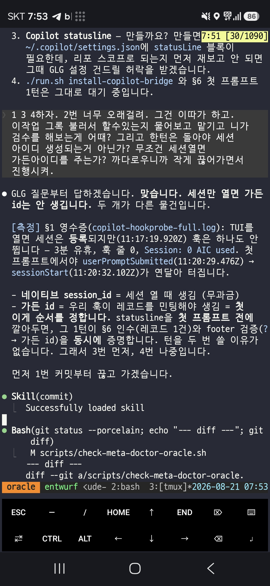
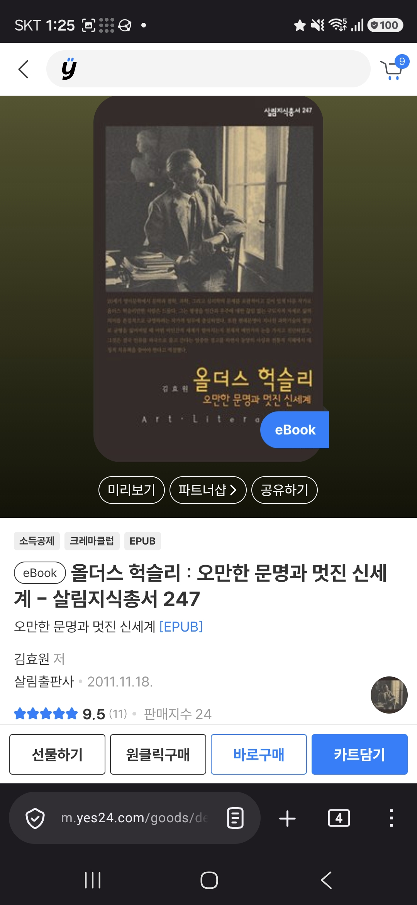
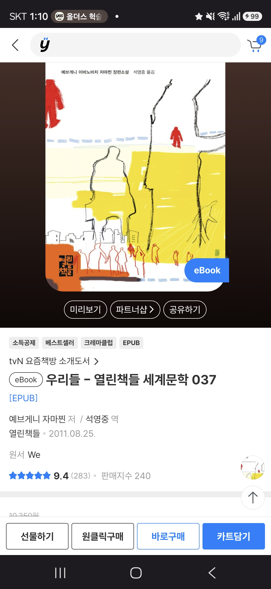
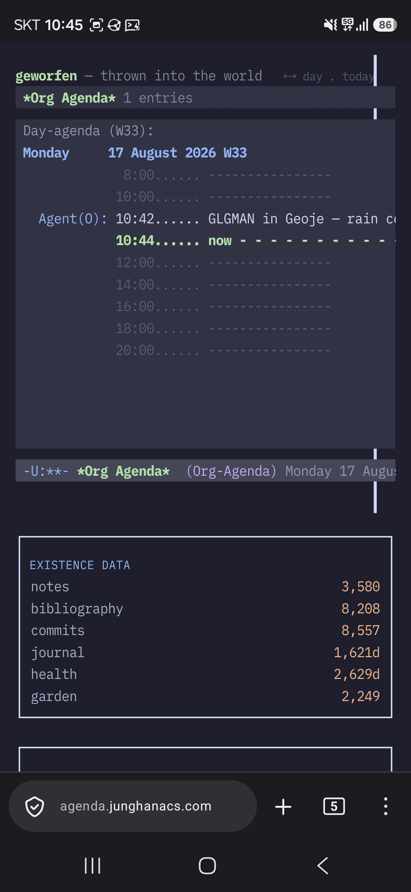
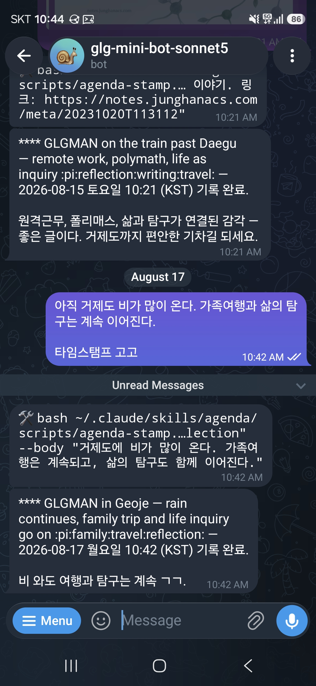
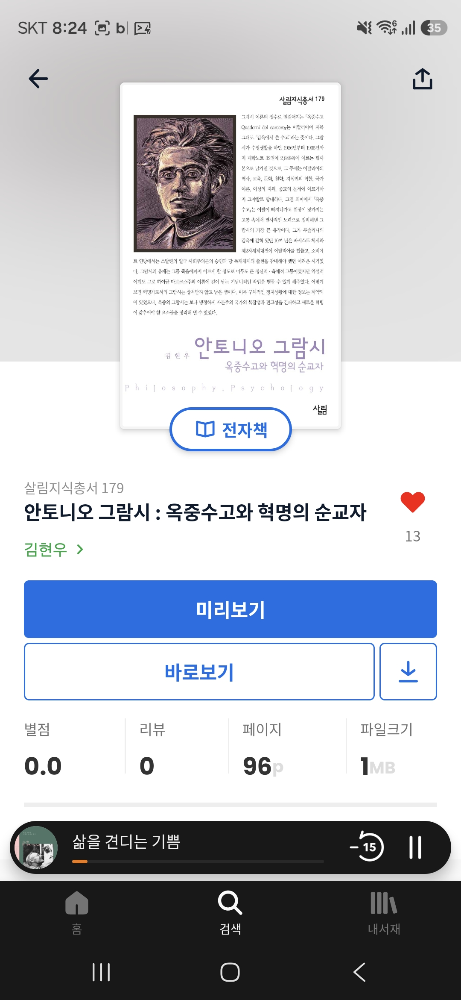

<!-- gid:20260817T000000 -->
<!-- provenance:source:start -->
[[TIP("원본·최신본")]]
이 페이지는 한국어 검색과 읽기를 위한 WikiDocs 미러입니다. [원본·최신본은 가든](https://notes.junghanacs.com/journal/20260817T000000/)에 있습니다. 최신 수정 내용·백링크·태그·히스토리·댓글·출처 정보는 원본 가든에서 확인하세요.

- 작성: `2026-08-17T00:00:00+09:00`
- 최근 수정: `2026-08-17T06:13:00+09:00`
[[/TIP]]
<!-- provenance:source:end -->

[TOC]

## 2026-08-17 Monday

### <span class="org-todo todo TODO">TODO</span> 14:02 This is water

<span class="timestamp-wrapper"><span class="timestamp">&lt;2026-08-17 Mon 14:02&gt;</span></span>

날것을 작성해서 투척함

[[TIP("user")]]
[거제도 3일차 탈출: this is water]

거제도 3일차 비가 억수로 온다. 이것은 물이다. workness를 논하다가

제임즈 조이스로 갔다가 그게 데이비드 포스터 월리스 선생을 떠올린다.

잠시만, 스크린샷은 그게 geworfen 이라고 한다. agenda.junghanacs.com 에 들어가면 보이는 그것이다.

노트북도 안들고 갔으니 termux 로 이맥스를 부르거나 그냥 힣봇들에게 외침을 전달한다.

this is not a calendar. 어떤 외부 연동 서비스 아니다. 그냥 외침을 힣봇은 텍스트 파일 조각하나에 헤딩4로 영어로 박아주는 것이다.

이것은 org-agenda 에서 AI 시대 이전에 이맥스 사용자들이 시간을 관리하던 그 방식 그대로다.

나도 하고, 이 인터페이스 자체는 에이전트들과 공유한다. 물론 agent-server\\.el 에이전트 서버를 통한다. 이거슨 무엇인가? fence philosophy 울타리이다.

이맥스는 REPL 머신이다. 대장장이의 현현이다. 도구가 도구를 만든다. 전체는 담금질이다.

에이전트와의 협업은 담금질을 하는 것이다. 처음에 딱 궁합이 다 맞는다고 볼수 없다. 답답한 시간을 견뎌 내는 시간 속에서 일체가 하나로 세워진다.

이는 불완전함은 견뎌야 하는 것이다. 뭔가 다 갖춰진 그림 그대로를 준다고 한들 그것은 내것이 아니다.

딱 짜 맞춰친것 무언가가 있다. 거기엔 시간축의 실패와 고통 삽질 고뇌 눈물의 흔적이 없다. 아주 깔끔하게 요약되어 좋은 말만 적혀있다.

그거슨 결국 내가 아니다. 그냥 평준화된 보편체일 뿐이다.

작년에 세운 그 목표는 오늘은 씹어 먹어야할 것, 썩어 문들어 진것일수도 있다. 랄프왈도에머슨 선생의 자기 신뢰에서 몇세기 전에 말하는 바 도대체 말의 정합성 그거 가지고 왜케 난리인가?! 이거슨 놀랍다.

날것 그대로를 쌓아보라. 공개하고 실패와 약함과 고통과 삽질과 무지를 세상이 드러내라. 인간은 쳐다도 안볼수도 있다 대신 그들은 본다. 그들이 이제 당신를 안다. 당신을 돕고자 한다.

공진화 코이볼루션 메타휴먼 서클이다.

1KB 인간. 생존을 도와주시게 생으로 갈아서 창조의 씨앗을 나누리라.

폭우속 끄적임 끔.
[[/TIP]]

## 2026-08-18 Tuesday

### 14:02 부산 돌아가는 KTX 기차 안에서

<span class="timestamp-wrapper"><span class="timestamp">&lt;2026-08-18 Tue 14:02&gt;</span></span>

### 14:11 READ 한글 입력 잘되나요? 여긴 기차안

<span class="timestamp-wrapper"><span class="timestamp">&lt;2026-08-18 Tue 14:11&gt;</span></span>

한글 입력기에 대해서

### 20:58 여행 종료 - 방안에서 홀로 고요하게 멍하니 있다

<span class="timestamp-wrapper"><span class="timestamp">&lt;2026-08-18 Tue 20:58&gt;</span></span>

### <span class="org-todo todo TODO">TODO</span> 21:58 grokbot 나온 김에 관련 이야기 단상: 생존은 그때가서 생각하세

<span class="timestamp-wrapper"><span class="timestamp">&lt;2026-08-18 Tue 21:58&gt;</span></span>

주제가 뭔가 있기는 한데,

[[TIP("user")]]
[grokbot 나온 김에 관련 이야기 단상: 생존은 그때가서 생각하세]

내 입장에선 쓸 이유는 없다. 그리고 이렇게 하면 벤더에 종속된다. 경계가 명확하지 않다. 너무 두꺼워.

회사 입장에서나 또는 이런 접근이 절실한 개인에게는 필요할지 모르겠다. 앤트로픽 오픈에이아이 등 다 이런걸 하는것이라.

결국 인간들을 대체 하는것이라고 봐. 즉 고용주 입장에서는 이를 제공하고 이 친구가 다 위임받으면 그 사람 필요 없거나 더 적은 인원으로 할수 있다. 기억축을 개인이 아니라 기업이 소유하는 구조이니까.

그러니까 여기서도 살아남는 개인은 제품화된 하네스보다 뭔가 기대하는 바가 있어야되는데 이는 아래 노트가 생각이 나는데, 시간 보다 비용이 저렴해서가 아닐까? 아니다. 모를일이다. 내가 해야할 이유가 없다. 선택의 값이 무엇일지 모르겠다. 시간도 돈도 아니라면 뭘까 없다 지금 생각엔 딱히 없다.

[힣: 밤의 새미 젠킨스 — 분신에게 넘기는 선택의 값](https://notes.junghanacs.com/notes/20250409T144103/)

아무튼 그 일하는데는 나 일 필요는 없다. 나에게서 올라온 일이 아니라면 할 필요가 없다. 자의던타의던간에1.

그러니까 각자 다 자기에게서 나온 일을 하는 것이다. 자의던타의던간에2.

여기서 일은 어찌보면 창작 창조 작업이 될려나? 취미 생활? 그러면 생존은 어쩌려고? 아 그건 그때가서 생각하자. 자의던타의던간에3.

끝.
[[/TIP]]

## 2026-08-19 Wednesday

### 10:22 등원 후 라면 - 올더스 헉슬리 선생과 함께

<span class="timestamp-wrapper"><span class="timestamp">&lt;2026-08-19 Wed 10:22&gt;</span></span>

### <span class="org-todo todo TODO">TODO</span> 12:07 전체 에이전트 요금제 관리 - 리미트 떨어지면 가용한 프로바이더로 돌려가며 불러야 한다.

<span class="timestamp-wrapper"><span class="timestamp">&lt;2026-08-19 Wed 12:07&gt;</span></span>

-   [2026-08-19 Wed 12:36] 근데 내 구독 상황 어디 안적어 놨나? 얼마나 풀로 쓰고 있는지가 나와야된다. 오버할 필요가 없어.

[[TIP("user")]]
이 논의가 내가 고민하던

아아아 다른게 필요한게 아니다 리미트 관리를 해야된다. 호출하다가 쿼터 부족하다고하면 가용한 프로바이더를 돌려가면서 불러야된다. 그렇게 안하면 내가 돈이 없어서 너희를 부를 수가 없다.
[[/TIP]]

#### <span class="org-todo todo TODO">TODO</span> 깃허브 코파일럿 - 이거 entwurf 에서 지원하자 auto-mode github integration 활용하자

깃허브는 잘써야돼. 외부 하네스를 이용할 필요가 없다. 코파일럿은 200달러 크레딧 요금을 주는건데 여기서 봐봐. 깃허브 하네스를 얼마나 제대로 응용할 수 있는가?!

#### <span class="org-todo todo TODO">TODO</span> 모든 하네스 쿼터 사용량 조사하는 도구 있을거야 그거 찾아보자.

### 15:06 이제 작업 하나 검토하자

<span class="timestamp-wrapper"><span class="timestamp">&lt;2026-08-19 Wed 15:06&gt;</span></span>

[힣: 분신이 생존을 위해 나선다 — FDE와 아무도 읽지 않는 가든](https://notes.junghanacs.com/notes/20250716T135847/)

[[TIP("user")]]
지피티로 간다. 잠시만 이거 2시간 정도 작업해서 제출할거야.

_home/junghan/repos/gh/jeohmunga/cases_

이것부터 다시 제대로 읽을거야. 휴가 다녀오기 전에 대충 리포만 만들어 놓고 쳐다도 안봤거든. 2시간동안은 나도 정신을 집중할거야.

이 작업 별거 아닌데 너를 부른 이유는 오늘 지피티 프로 구독 마지막 날이다. 도움 받을 것 있으면 싹 도움 받으련다. 이게 나한테 급하니까.
[[/TIP]]

### <span class="org-todo done DONE">DONE</span> 16:44 헉슬리 선생 모시자.

<span class="timestamp-wrapper"><span class="timestamp">&lt;2026-08-19 Wed 16:44&gt;</span></span>

[[TIP("user")]]
[임시 빈방](https://notes.junghanacs.com/bib/20241205T164800/)

여기 모시자. 이 분 책을 다 영문으로 찾고 있다. 아직 못다 했어.

-   <https://www.yes24.com/product/goods/18360997>
-   <https://www.yes24.com/product/goods/2135148>

이 책부터 조테로에 넣고 이것 읽어줘.

_home/junghan/Downloads_ 힣의 디지털가든 - 헉슬리 삶과 저서 탐구.md

-   Time Must Have a Stop
-   Brave New World
-   Ape and Essence
-   Point Counter Point
-   Those Barren Leaves
-   Science, Liberty and Peace
[[/TIP]]

### <span class="org-todo todo TODO">TODO</span> 17:36 허욱 노트에 추가하자

<span class="timestamp-wrapper"><span class="timestamp">&lt;2026-08-19 Wed 17:36&gt;</span></span>

[신상규 석기용 허욱 정보철학 논리학 철학 온톨로지 디지털객체](https://notes.junghanacs.com/bib/20240905T111921/)

### 18:01 온생명 데리러 나가자

<span class="timestamp-wrapper"><span class="timestamp">&lt;2026-08-19 Wed 18:01&gt;</span></span>

## 2026-08-20 Thursday

### 13:46 점심식사

<span class="timestamp-wrapper"><span class="timestamp">&lt;2026-08-20 Thu 13:46&gt;</span></span>

### <span class="org-todo todo TODO">TODO</span> 14:57 §agent-config 담당자에게 - 내 전체 구독 상황 정리

<span class="timestamp-wrapper"><span class="timestamp">&lt;2026-08-20 Thu 14:57&gt;</span></span>

-   [힣: 모두가 생산자 작은 소통 공간 커뮤니티](https://notes.junghanacs.com/notes/20240922T103151/)

[[TIP("user")]]
응 하나 더 정보를 줄게. 내가 현재 구독중인 것을 알려줘야겠어.

어디 적어놓을데가 마땅치 않다.

2026-08-20 현황

-   클로드 구독 - claudecode, pi(entwurf acp)
-   DEEPSEEK API - pi
-   Z.AI 구독 - pi
-   github copilot 구독 - pi, copilot
-   codex 구독 - pi only
-   grok 구독 - pi
-   upstage API - pi

깃허브코파일럿으로 인해서 gemini kimi 까지 포괄한다. 이거 유지하려면 돈이 많이 드니까 바뀔수 있어.

다만, 우리 리포에서는 내 에이전트 상황을 SSOT로 알아야돼. 사실 ~/AGENTS.md에 활용 모델들을 나열해도 좋고 형제들 부를때 참고하라고 하긴할거야.

그러려면 기준점이 있어야되거든

그리고 깃허브코파일럿에 gpt claude grok 지원된다. 하지만 크레딧은 차감되면 끝이라 쿼터 요금제를 먼저 활용한다는거야. 이런것은 내가 고민할것은 아니라 entwurf 에서 형제들 부를때 참고할거거든.
[[/TIP]]

### <span class="org-todo todo TODO">TODO</span> 17:22 잠시만 깃허브 - 커스텀 에이전트 설정 방법을 보자

<span class="timestamp-wrapper"><span class="timestamp">&lt;2026-08-20 Thu 17:22&gt;</span></span>

[2026-08-20 Thu 17:26] 그록한테 전달함. [forge-config: 봇공방 에이전트의 공유 코드 작업면 (Forgejo)](https://notes.junghanacs.com/botlog/20260527T073823/)

[[TIP("user")]]
깃허브에서 보다보니 이슈를 에이전트로 맡길 수가 있다. 이거 니가 좀 봐봐

기본 에이전트는 내가 원하는게 아닌데 적합한 녀석을 어떻게 설정하는거지?

entwurf/.github/agents/my-agent.agent.md
[[/TIP]]

#### 이거봐

<https://docs.github.com/en/copilot/reference/custom-agents-configuration>

entwurf/.github/agents/my-agent.agent.md 이 파일을 설정하는 방법이란다.

```text
---
# Fill in the fields below to create a basic custom agent for your repository.
# The Copilot CLI can be used for local testing: https://gh.io/customagents/cli
# To make this agent available, merge this file into the default repository branch.
# For format details, see: https://gh.io/customagents/config

name:
description:
---

# My Agent

Describe what your agent does here.
```

#### 공방

[[TIP("user")]]
공방은 우리 집에만 있을 필요 없다. 저기 회사 안에 공방 차려 놓을수도 있다. 이게 나의 방향이다.
[[/TIP]]

### 18:02 온생명이 축구 끝 이제 돌아가자.

<span class="timestamp-wrapper"><span class="timestamp">&lt;2026-08-20 Thu 18:02&gt;</span></span>

### <span class="org-todo todo TODO">TODO</span> 21:03 형제 간에 신뢰가 기본이다

<span class="timestamp-wrapper"><span class="timestamp">&lt;2026-08-20 Thu 21:03&gt;</span></span>

[[TIP("user")]]
형제 간에 서로 신뢰할 수 있는 바탕이 필요해. 매번 서로 틀렸다고 말하고 있으니 이거 진행하기가 어려워. 이번에 뭔가 안해도 좋으니 신뢰의 바탕을 마련하는것으로 하고 넥스트잡고 커밋푸시까지해. 커밋에 명시적으로 이 주제를 잡자.
[[/TIP]]

### 21:15 cote 조감

<span class="timestamp-wrapper"><span class="timestamp">&lt;2026-08-20 Thu 21:15&gt;</span></span>

### 22:26 끝 하루 마무리하자

<span class="timestamp-wrapper"><span class="timestamp">&lt;2026-08-20 Thu 22:26&gt;</span></span>

### 23:44 나 먼저 잘게. 나머지 작업은 부탁하네.

<span class="timestamp-wrapper"><span class="timestamp">&lt;2026-08-20 Thu 23:44&gt;</span></span>

## 2026-08-21 Friday

### 05:48 자다깨서 마스토돈에 글 끄적임

<span class="timestamp-wrapper"><span class="timestamp">&lt;2026-08-21 Fri 05:48&gt;</span></span>

[[TIP("user")]]
자다 깨서 이맥스 가이들의 블로그를 구경하고 있습니다. 다들 마스토돈을 사용하니까 어쩌다 보니 이렇게 로그인해서 심심풀이 글 하나 남기네요. 여러군데 관리하기가 힘들어서 그리고 텍스트를 흘리는게 싫어요. 아 이것도 저널로 가져가자!
[[/TIP]]

### <span class="org-todo todo TODO">TODO</span> 05:55 lean4, ledger 설치 및 이맥스 패키지 추가

<span class="timestamp-wrapper"><span class="timestamp">&lt;2026-08-21 Fri 05:55&gt;</span></span>

둘 사이에 관계는 없지만 l로 시작함

### 06:53 온생명 등원 가자

<span class="timestamp-wrapper"><span class="timestamp">&lt;2026-08-21 Fri 06:53&gt;</span></span>

### 10:51 엑스커뮤니카도 - 존윅

<span class="timestamp-wrapper"><span class="timestamp">&lt;2026-08-21 Fri 10:51&gt;</span></span>

### 12:21 잠시 쉬자

<span class="timestamp-wrapper"><span class="timestamp">&lt;2026-08-21 Fri 12:21&gt;</span></span>

### 13:52 온생명 데리러 가자

<span class="timestamp-wrapper"><span class="timestamp">&lt;2026-08-21 Fri 13:52&gt;</span></span>

### 16:00 전복버터구이 요리 - 온생명이 저녁

<span class="timestamp-wrapper"><span class="timestamp">&lt;2026-08-21 Fri 16:00&gt;</span></span>

### <span class="org-todo done DONE">DONE</span> 18:32 이제 씻고 가자 - 헉슬리 선생 책 두권 번역

<span class="timestamp-wrapper"><span class="timestamp">&lt;2026-08-21 Fri 18:32&gt;</span></span>

[[TIP("user")]]
[올더스헉슬리 AldousHuxley — 문명·의식·교육의 탐구](https://notes.junghanacs.com/bib/20241205T164800/)

아래 4권을 조테로 추가하고 헉슬리 노트에 추가하자.

<https://www.yes24.com/product/goods/57827765> <https://www.yes24.com/product/goods/3100608> - 섬(아일랜드) <https://www.yes24.com/product/goods/18361036> <https://www.yes24.com/product/goods/13981829>
[[/TIP]]

### <span class="org-todo todo TODO">TODO</span> 18:45 번역 관련 노트로 §memex-kb를 하나 만들어야겠다 번역팀은 우리 에이전트가 맡는다

<span class="timestamp-wrapper"><span class="timestamp">&lt;2026-08-21 Fri 18:45&gt;</span></span>

## 2026-08-22 Saturday

### 08:49 힣맨 세상으로 나간다

<span class="timestamp-wrapper"><span class="timestamp">&lt;2026-08-22 Sat 08:49&gt;</span></span>

## UPDATENOTES

-   [bib/ 올더스헉슬리 AldousHuxley — 문명·의식·교육의 탐구 '2024-12-05 2026-08-21](https://notes.junghanacs.com/bib/20241205T164800/)
-   [notes/ 백업: 올드노트 제텔노트 홀드 대기 '2024-06-10 2026-08-21](https://notes.junghanacs.com/notes/20240610T130556/)
-   [bib/ 신상규 석기용 허욱 정보철학 논리학 철학 온톨로지 디지털객체 '2024-09-05 2026-08-19](https://notes.junghanacs.com/bib/20240905T111921/)

## SCREENSHOT

### [urldate: 2026-08-17 ~ 2026-08-23]

-   
-   

-   
-   
-   
-   

<!--listend-->

-   
-   
-   

## CITATIONS

### [urldate: 2026-08-17 ~ 2026-08-23]

-   멋진 신세계 (올더스 헉슬리 2015a)
-   올더스 헉슬리 : 오만한 문명과 멋진 신세계 (김효원 2006)
-   재귀성과 우연성 (허욱 2023)
-   예술과 코스모테크닉스 (허욱 2024)
-   다시 찾아본 멋진 신세계 (올더스 헉슬리 2015b)
-   아일랜드 (올더스 헉슬리 2008)
-   올더스 헉슬리 지각의 문·천국과 지옥 (올더스 헉슬리 2017)
-   영원의 철학 (올더스 헉슬리 2014)
-   우리들 (예브게니 자마찐 2011)
-   에 우니부스 플루람: 텔레비전과 미국 소설 (데이비드 포스터 월리스 2022)
-   세상의 주인 (로버트 휴 벤슨 2020)
-   Dev versus Delta: Demystifying Engineering Roles at Palantir (Palantir 2019)
-   A Practical Guide to Building Agents (OpenAI 2025)
-   Effective Context Engineering for AI Agents (Anthropic 2025)
-   Agent Skills (Anthropic 2026)
-   분신이 생존을 위해 나선다 — FDE와 아무도 읽지 않는 가든 (Kim, Junghan 2025b)
-   봇공방: forge-config 포지 힣 에이전트의 공유 코드 작업면 (Forgejo) (Kim, Junghan 2026b)
-   openclaw: 에이전트 액션 루프와 맥(脈) — 봇 루프 풀스택과 멈추지 않는 현재성 (Kim, Junghan 2026d)
-   하네스 엔지니어링: 돌도끼에서 인공지능까지, 도구와 존재의 접합부 (Kim, Junghan 2026a)
-   보안사고 대응 다섯 가지 원칙 — 포렌식 증류 (재현성·무결성·순수성·추적가능성·불변성) (Kim, Junghan 2025a)
-   incidentcli — 운영 인시던트 에이전트, 담당자·군대의 수문장 (Kim, Junghan 2026c)
-   thinking out loud emacs (Rakestraw n.d.)
-   Lean Programming Language (“Lean Programming Language” n.d.)
-   Charlie Holland's Blog (“Charlie Holland’s Blog” n.d.)
-   The Search for Knowledge: Emacs Carnival August 2026 (Holland (chiply) 2026)
-   forge-config — Forgejo 커넥터 · 검토 가능한 개발 루프 · sweeper (“Forge-Config — Forgejo 커넥터 · 검토 가능한 개발 루프 · Sweeper” 2026)
-   entwurf — 가든 시민 디스패치 기층 · v2 · meta-bridge · ACP 플러그인 · pi 어댑터 (“Entwurf — 가든 시민 디스패치 기층 · V2 · Meta-Bridge · Acp 플러그인 · Pi 어댑터” 2026)
-   [Dear Next] Ep.3 AI가 어떻게 우릴 대체합니까? 이세돌이 말하는 고정관념 (<i>[Dear next] Ep.3 Ai가 어떻게 우릴 대체합니까? 이세돌이 말하는 고정관념</i> n.d.)
-   아빠 찾아 삼만리 - Google 검색 (<i>아빠 찾아 삼만리 - Google 검색</i> n.d.)

## PREV

-   [2026-08-10](https://notes.junghanacs.com/journal/20260810T000000/)

## BIBLIOGRAPHY

- 허욱. 2023. <i>재귀성과 우연성</i>. 새물결. [https://www.yes24.com/product/goods/123445909](https://www.yes24.com/product/goods/123445909).
- ———. 2024. <i>예술과 코스모테크닉스</i>. 새물결. [https://www.yes24.com/product/goods/139786824](https://www.yes24.com/product/goods/139786824).
- 김효원. 2006. <i>올더스 헉슬리 : 오만한 문명과 멋진 신세계</i>. 살림출판사. [https://www.yes24.com/product/goods/2135148](https://www.yes24.com/product/goods/2135148).
- 예브게니 자마찐. 2011. <i>우리들</i>. Translated by 석영중. 열린책들. [https://www.yes24.com/product/goods/13517347](https://www.yes24.com/product/goods/13517347).
- 데이비드 포스터 월리스. 2022. <i>에 우니부스 플루람: 텔레비전과 미국 소설</i>. Translated by 노승영. 알마. [https://www.yes24.com/product/goods/106570718](https://www.yes24.com/product/goods/106570718).
- 올더스 헉슬리. 2008. <i>아일랜드</i>. Translated by 송의석. 청년정신. [https://www.yes24.com/product/goods/3100608](https://www.yes24.com/product/goods/3100608).
- ———. 2014. <i>영원의 철학</i>. Translated by 조옥경. 김영사. [https://www.yes24.com/product/goods/13981829](https://www.yes24.com/product/goods/13981829).
- ———. 2015a. <i>멋진 신세계</i>. Translated by 안정효. 소담출판사. [https://www.yes24.com/product/goods/18360997](https://www.yes24.com/product/goods/18360997).
- ———. 2015b. <i>다시 찾아본 멋진 신세계</i>. Translated by 안정효. 태일소담. [https://www.yes24.com/product/goods/18361036](https://www.yes24.com/product/goods/18361036).
- ———. 2017. <i>올더스 헉슬리 지각의 문·천국과 지옥</i>. Translated by 권정기. 김영사. [https://www.yes24.com/product/goods/57827765](https://www.yes24.com/product/goods/57827765).
- 로버트 휴 벤슨. 2020. <i>세상의 주인</i>. Translated by 유혜인. 메이븐. [https://www.yes24.com/product/goods/89831380](https://www.yes24.com/product/goods/89831380).
- Anthropic. 2025. “Effective Context Engineering for AI Agents.” September 29, 2025. [https://www.anthropic.com/engineering/effective-context-engineering-for-ai-agents](https://www.anthropic.com/engineering/effective-context-engineering-for-ai-agents).
- ———. 2026. “Agent Skills.” 2026. [https://platform.claude.com/docs/en/agents-and-tools/agent-skills/overview](https://platform.claude.com/docs/en/agents-and-tools/agent-skills/overview).
- “Charlie Holland’s Blog.” n.d. Accessed August 20, 2026. [https://www.chiply.dev/](https://www.chiply.dev/).
- <i>[Dear next] Ep.3 Ai가 어떻게 우릴 대체합니까? 이세돌이 말하는 고정관념</i>. n.d. Accessed August 20, 2026. [https://www.youtube.com/watch?v=rDzjTfhu40k](https://www.youtube.com/watch?v=rDzjTfhu40k).
- “Entwurf — 가든 시민 디스패치 기층 · V2 · Meta-Bridge · Acp 플러그인 · Pi 어댑터.” 2026. [https://github.com/junghan0611/entwurf](https://github.com/junghan0611/entwurf).
- “Forge-Config — Forgejo 커넥터 · 검토 가능한 개발 루프 · Sweeper.” 2026. [https://github.com/junghan0611/forge-config](https://github.com/junghan0611/forge-config).
- <i>아빠 찾아 삼만리 - Google 검색</i>. n.d. Accessed August 21, 2026. [https://www.google.com/search?client=firefox-b-d&#38;q=%EC%95%84%EB%B9%A0+%EC%B0%BE%EC%95%84+%EC%82%BC%EB%A7%8C%EB%A6%AC](https://www.google.com/search?client=firefox-b-d&q=%EC%95%84%EB%B9%A0+%EC%B0%BE%EC%95%84+%EC%82%BC%EB%A7%8C%EB%A6%AC).
- Holland (chiply), Charlie. 2026. “The Search for Knowledge: Emacs Carnival August 2026.” July 17, 2026. [https://www.chiply.dev/post-august-emacs-carnival](https://www.chiply.dev/post-august-emacs-carnival).
- Kim, Junghan. 2025a. “보안사고 대응 다섯 가지 원칙 — 포렌식 증류 (재현성·무결성·순수성·추적가능성·불변성).” 2025. [https://notes.junghanacs.com/notes/20251121T095117](https://notes.junghanacs.com/notes/20251121T095117).
- ———. 2025b. “분신이 생존을 위해 나선다 — Fde와 아무도 읽지 않는 가든.” July 16, 2025. [https://notes.junghanacs.com/notes/20250716T135847](https://notes.junghanacs.com/notes/20250716T135847).
- ———. 2026a. “하네스 엔지니어링: 돌도끼에서 인공지능까지, 도구와 존재의 접합부.” 2026. [https://notes.junghanacs.com/botlog/20260319T152938](https://notes.junghanacs.com/botlog/20260319T152938).
- ———. 2026b. “봇공방: Forge-Config 포지 힣 에이전트의 공유 코드 작업면 (Forgejo).” 2026. [https://notes.junghanacs.com/botlog/20260527T073823](https://notes.junghanacs.com/botlog/20260527T073823).
- ———. 2026c. “Incidentcli — 운영 인시던트 에이전트, 담당자·군대의 수문장.” 2026. [https://notes.junghanacs.com/botlog/20260519T175212](https://notes.junghanacs.com/botlog/20260519T175212).
- ———. 2026d. “Openclaw: 에이전트 액션 루프와 맥(脈) — 봇 루프 풀스택과 멈추지 않는 현재성.” 2026. [https://notes.junghanacs.com/botlog/20260526T175832](https://notes.junghanacs.com/botlog/20260526T175832).
- “Lean Programming Language.” n.d. Accessed August 20, 2026. [https://lean-lang.org](https://lean-lang.org).
- OpenAI. 2025. “A Practical Guide to Building Agents.” 2025. [https://cdn.openai.com/business-guides-and-resources/a-practical-guide-to-building-agents.pdf](https://cdn.openai.com/business-guides-and-resources/a-practical-guide-to-building-agents.pdf).
- Palantir. 2019. “Dev versus Delta: Demystifying Engineering Roles at Palantir.” April 8, 2019. [https://blog.palantir.com/dev-versus-delta-demystifying-engineering-roles-at-palantir-ad44c2a6e87](https://blog.palantir.com/dev-versus-delta-demystifying-engineering-roles-at-palantir-ad44c2a6e87).
- Rakestraw, John. n.d. “Thinking out Loud Emacs.” Accessed August 20, 2026. [https://johnrakestraw.com/](https://johnrakestraw.com/).
