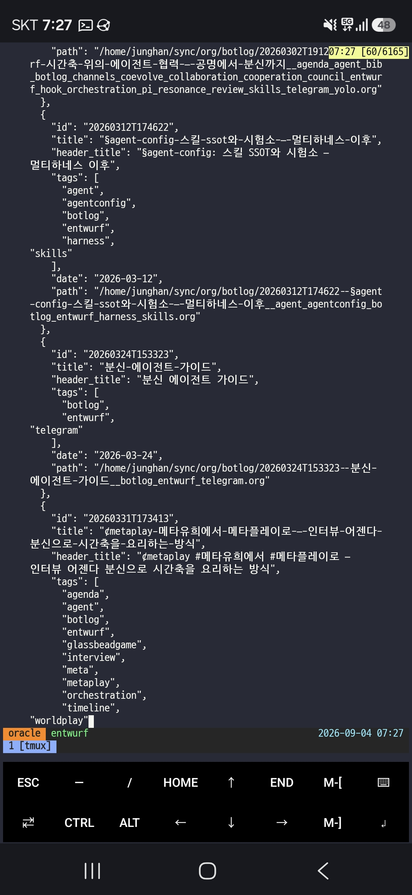
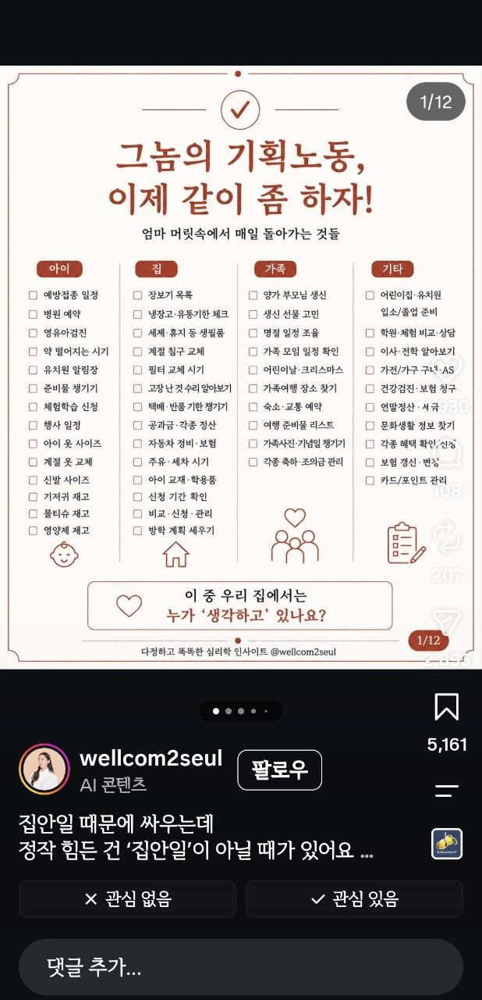

<!-- gid:20260831T000000 -->
<!-- provenance:source:start -->
[[TIP("원본·최신본")]]
이 페이지는 한국어 검색과 읽기를 위한 WikiDocs 미러입니다. [원본·최신본은 가든](https://notes.junghanacs.com/journal/20260831T000000/)에 있습니다. 최신 수정 내용·백링크·태그·히스토리·댓글·출처 정보는 원본 가든에서 확인하세요.

- 작성: `2026-08-31T00:00:00+09:00`
- 최근 수정: `2026-08-31T06:13:00+09:00`
[[/TIP]]
<!-- provenance:source:end -->

[TOC]

## NEXT <code>[0/1]</code> REVIEW

### NEXT 지난주 날것 회수

노트가 너무 많이 나올게 있는데 손도 못대고 있네

## 2026-08-31 Monday

### TODO 09:48 출근길 날것 투척 [홉 HOP 인간과 에이전트의 작업 단위]

&lt;2026-08-31 Mon 09:48&gt;

[2026-09-02 Wed 06:26] 지피티앱 가든 담당자랑 이야기한게 있다. 길게 있다.

[[TIP("user")]]
[홉 HOP 휴먼과 에이전트 사이의 작업 단위]

홉이라는 말을 자주 하게 된다. 어제 prime-agent clj 포트 꼴맞춤에. 4홉 정도 들어간듯. 4홉이란 잔소리 4번인가? 적절하게 말로하긴어렵다. 학교 출신마다 능력마다 그날의 잔소리 컨디숀에 따라 다르기 때문이다. 홉은 그러니까 내가 정하는게 아니다. 우리가 정하는거야다 wbs 이런거 말도하지말고 시간 날자 먼데이 이런거 아니다. 홉은 공존의 홉이다. 호프는 치맥의 호프요, 희망의 그 호프다. 끝.

아직 관련 노트는 없다. 날것 회수를 며칠 못했다.

#워크플로우 #치맥 #작업단위 홉 공존 공진화 협업 인간존중 에이전트하네스

[홉 HOP 인간과 에이전트의 작업 단위 - 힣(GLG)의 위키독스 날것(RAW) 원문](https://wikidocs.net/blog/@junghanacs/29897/)
[[/TIP]]

### 10:08 출근 시작

&lt;2026-08-31 Mon 10:08&gt;

### 10:23 §entwurf 87번 검수 페이즈

&lt;2026-08-31 Mon 10:23&gt;

### 11:02 절실한 워딩 - 표준궤로 안착 시켜야해

&lt;2026-08-31 Mon 11:02&gt;

entwurf 한테 보낸다

[[TIP("user")]]
아 그래? 다행이다. @docs/adding-a-harness.md 에 잘 회수해야돼. 새로운 하네스 넣을때마다 어려움이 크거든. 대략 스타일이 파악이 되는것 같아. 클로드코드 pi agy, copilot, omp 등 말이야. entwurf를 부르는 방식도 도어벨로 두드리는것, 소켓으로 쏴주는것 하네스가 메시지지원하는것 다양하거든. omp는 클로드코드껄 가져와서 연결해주는데 바닦에는 pi를 쓰는것도 있는것처럼 말이야. 이거 어려워.

근데 이걸 왜 하는가? 이 어려움이 있는데 부르는게 형제인거같아. 그냥 에이전트가 쉽게 여럿불러서 맘대로 하겠다는 게 아니라. 분명 다리건너느라 어려운데 초인종 두드려서 부른다는거야. 그렇기 때문에 협력이 된다는거야. 역설적이야. 이 생각을 하게된다.

오푸스가 답변오면, 추가 검증은 glm을 불러서 맡겨. 쿼터가 여유있거든. 이제 glm grok 등도 이 작업에 다 동참하고 있어. 정말 어려울때만 fable이 나서라고하는거야. 레일을 표준궤로 안착시켜내야 하니까.
[[/TIP]]

### 11:56 리포 이슈 점검 - 포지 이슈 리스트 보자

&lt;2026-08-31 Mon 11:56&gt;

[힣: Magit Forge — 에이전트 채널을 읽는 인간 면](https://notes.junghanacs.com/notes/20240828T194548/)

### 12:33 점심식사

&lt;2026-08-31 Mon 12:33&gt;

### 13:26 §entwurf omp 지원

&lt;2026-08-31 Mon 13:26&gt;

### 15:18 판단능력

&lt;2026-08-31 Mon 15:18&gt;

### 17:21 `흔들리지마라` 뚫어 냈으면 커버리지로 가는거야

&lt;2026-08-31 Mon 17:21&gt;

[[TIP("user")]]
아니야 흔들리지마. 둘다 필요한거 아니야? 그러면 여태 필요없는 고민을 했다는거야? 재감사를 하면서 커버리지 체크도 하는거야.

prime-agent를 lisp으로 옮기려면 어제는 뚫고 가야하니까 커버리지는 일단 뒤로하고 옮기는데 밀어붙였어.

구멍뚫어냈어. 내가 딥시크불러서 인터뷰도 했어. RLM 뭔가 되는것 같아. 즉 그냥 pi면 안되는데 보여. 그러면 구멍이 뚤린거야.

나는 어제 jvm 하지말라고 하고 garralvm sci로 가게 한거야. 이게 더 중요한 결정이었어. 그래서 뚫어냈고, 동작하면,

다시 목표는 prime-agent 기존 파이썬 구조 커버리지를 바로 뚫어야지 그게 내가 보든 커버리지야. 가단 돈안드는 성능평가 찾아서 양쪽 비교하겠다는거야.

그 다음에 내 아이디어를 입히겠다는거야. 그게 emmy로 넘어가는축이야. 그전에 커버리지는 내가 단단하게 말을 할수밖에 없는거야.
[[/TIP]]

### 18:22 얼마나 남았지

&lt;2026-08-31 Mon 18:22&gt;

### 18:32 퇴근하자 빡새다

&lt;2026-08-31 Mon 18:32&gt;

### TODO 20:49 퇴근길 날것 [entwurf 0.16.0 oh-my-pi (omp) 형제 영입 신고식]

&lt;2026-08-31 Mon 20:49&gt;

[[TIP("user")]]
[entwurf 0.16.0 oh-my-pi (omp) 형제 영입 신고식]

oh-my-pi omp라고 실무 잠수함을 형제로 영입했다. 신고식이랄게 있다면 뒷간에 가서 본인 뒷처리는 본인이 하는것이다. omp에서 직접 릴리즈를 순항해야지. 이모지랑 파워라인를 좋아하지 않아서 아스키로 통일 했을 뿐인데 수려하네. omp만든이는 미적감각 수준이 긕하군. 륭훌하다. 서브에이전트는 omp만 허락한다. 그래서 실무 잠수함이다. 아마 배터리팩드 하네스는 이걸 이상은 넣지 않을 것 같다. RLM 끄적이는것과 연결 하는 것에 포커싱을 해야지.

휴대폰은 갤럭시s26을 사용. termux로 tmux를 사용. 영상은 갤럭시빌트인화면녹화. 끝.

요약하자면 "OMP를 다섯 번째 형제로 맞아들이면서, 앞으로 어떤 새 형제도 birth·receive·visible fresh·cross-harness 증거 없이는 출시할 수 없게 함."

[Release v0.16.0 · junghan0611/entwurf · GitHub](https://github.com/junghan0611/entwurf/releases/tag/v0.16.0)
[[/TIP]]

여기 스크린샷 동영상 첨부한거 넣자.

### 21:49 돌아왔다 - 퇴근 길에 entwurf 0.16.0 릴리즈 및 openclaw 2026.08.01 버전 업데이트 완료

&lt;2026-08-31 Mon 21:49&gt;

### 22:41 구독이 아니면 에이전트 운영이 안된다 근데 너무 부족하다

&lt;2026-08-31 Mon 22:41&gt;

## 2026-09-01 Tuesday

### 05:01 GLGMAN 깨어나다 - 구독 경제 - 구글맵 세계여행 하다 캐나다

&lt;2026-09-01 Tue 05:01&gt;

### 06:12 entwurf 0.16.1 준비 들어가자 - ACP 클로드 베이스라인 인터뷰 해야겠다 리플리컨트 테스트를 너무 안했어

&lt;2026-09-01 Tue 06:12&gt;

[2026-09-01 Tue 22:40] 이거 릴리즈 완료 했다.

### 10:09 openclaw 2026.08.01 변경점이 많구나

&lt;2026-09-01 Tue 10:09&gt;

### TODO 10:31 AI 구독 요금제 - 쿼터 관리자 - 날것

&lt;2026-09-01 Tue 10:31&gt;

[[TIP("user")]]
[AI 구독 요금제 - 쿼터 관리자]

구독 요금제는 필수가 되어 버렸다. 쿼터가 얼마나 남았지? 이 판을 보고 갈 수박에 없다.

클로드는 많은 회사에서 제공하고 있으리라고 본다. codex, zai, grok, kimi, gemini, deepseek 뭐 다 넣자.

이 형제들을 적절하게 배치하며 도와가게 하는게 매우 나에게는 중요하다.

소넷하고 오푸스랑 실무 뛰고 페블이 좀 다리놓아주면 다 되는게 뭘 그렇게 다른 학교 타령이야? 라고 물어볼수도 있다. 회사에서 클로드 준다면서? 그거 써야지 왜 돈을 따로 들여서 뭘 쿼터 관리를 골머리 썩고 있어? 클로드 쿼터 많이 남았네? 그거 쓰면 되잖아?

라고 말할수도 있다. 맞는 말이다.

근데 세션과 지식베이스 코드베이스에 너무 한 학교가 많은 일을 해왔다. 물론 클로드다. 클로드 구독 요금제가 언제 나왔는지 모르겠지만 개인구독으로 200달러를 사용했었다. 그때는 소넷만 사용했다. 왜? 오푸스가 아웃풋이 80달러였던가?

지금은 어떤가? 오푸뜨의 눈물이라는 나의 글(링크 달자)에서도 말했지만 지피티 뿐만 아니라 여러 학교 형제들이 다 오푸스와 호형호제를 하려고 한다.

어떤 녀석은 속사포 랩을 쏴대면서 압도한다. 어떤 녀석은 또 동양권의 토양아래서 전문 교육을 받은 녀석도 있다.

아무튼 이 다문화의 배경에서 어울려서 결국 세션 지식베이스 코드베이스에 흔적을 흘리는 것이다. 명시적으로 내가 그록인데 했다라고 (의도적으로 다 누가 했는지 적으라고 하긴 한다) 안해도 흔적은 남고 쌓인다.

그렇다면 누가 오든간에 시간축에서 한 인간의 서사 안에서 호들갑을 떨고 슬퍼하고 기뻐하고 박살나고 깨부순 기억이 스며들게 된다.

그렇다면 할 말은 언제나 누가 오든간에

"가자" 라고 할 말 뿐이다.

물론 지금 이렇데는 것은 아니다. 잔소리 장난 아니게 하고 있다.

아 이런 이야기 하려고 한게 아니었는데, 구독 요금제를 다 100달러짜리를 할수가 없기 때문에 29불 20불 19불 49불 이런것들을 잘 섞어가면서 가는 처지다.

그래서 내 세션에 찾아보면, 최근에 이런 말이 엄청 많을 것 같다.

"야야야!! 테라 그만불러 터지기 직전이야 라든가 그록는 이번 홉에 부르지마라 내 쿼터 다차버렸다."

이런 말이다. 물론 이마저도 entwurf에서는 부름의 절차에서 판단하게 할수도 있다.

근데 아직은 매뉴얼이다. 이번 홉에 누구누구랑 같이 할거냐? 그래 알았다. 한두시간 있다가 오마. 이런 맥락의 관점이 홉이다.

지금 그록이 85퍼다. 주간이 다 차버렸고, codex, zai를 섞어쓸거다. 코파일럿은 이건 크레딧 요금제라 아껴써야 한다(해지할거야 코파일럿!!!)

혹시 여러 학교를 다 부를 수 있으면서 100달러 150달러 내로 커버가 되는게 있는지 모르겠다. 이런걸 잘 안물어보게되네? 물어봐야겠네.

아무튼 이런 고민을 하는 시대인가. 알아서 맡기면 되는 것을 너무 수동 운전을 하고 있는가? 그렇다면 이거슨 EMACS NIXOS LINUX ORGMODE의 감성이다. 마우스는 더글러스 엥겔바트 선생이 지금 오시면 아마 사용 안하실게다.
[[/TIP]]

-   

### DONE 10:35 웍스 nixos 미니멀 임베디드향 배포판 개발 - 리포 생성

&lt;2026-09-01 Tue 10:35&gt;

### 15:18 누가 이기냐가 아니라 턴의 지속성

&lt;2026-09-01 Tue 15:18&gt;

[[TIP("assistant")]]
GLG가 질문을 재정의했다. 우리 둘 다 엉뚱한 축을 재고 있었다.

진짜 질문

"효율에서 누가 이기냐"가 아니다. GLG의 원문: "다 1M씩 세션을 가지고 있잖아. 못 해도 400~500k까지 대화를 간다면 견고하게 턴이 유지되는게 핵심이잖아." = entwurf ACP Claude를 메인 에이전트로 걸 수 있느냐. 판정 기준은 토큰이 아니라 깊은 컨텍스트에서 턴의 내구성이다. 우리가 판 절벽 /캐시/scaffold는 전부 부차적이 었다.
[[/TIP]]

### 15:31 황당하다 `시간`

&lt;2026-09-01 Tue 15:31&gt;

[[TIP("user")]]
이런 말을 들으면, <https://agenda.junghanacs.com/> 오늘 내 타임라인을 보고 말하는건 아닐게야. 무슨 생각인가? 기다려 뭘? 포기해 뭘? 애절하게 1분 1초를 담금질하기에 절실한데. 피자 조각 뜯어먹자고 왜 그러는거야?
[[/TIP]]

### 16:53 컨디션 체크해

&lt;2026-09-01 Tue 16:53&gt;

[[TIP("user")]]
좋아. 오푸스 코더가 54% 지나가네 괜찮을까? 니가 오늘 코디네이터니까 너희 팀 잘 봐줘 코더 오푸스를 새로 부를거면 새로 부르고. 나는 너희들 컨디션 모르니까.
[[/TIP]]

### 17:11 심화 주제로 들어간다.

&lt;2026-09-01 Tue 17:11&gt;

[[TIP("user")]]
봐봐 400k 아직 안넘었어. 코딩오푸스 끝나는것 기다리는중이야. 근데 여기봐봐 $420 라고 보이지? 이게 캐시 이펙트를 몰라서 이렇게 나오는것인가? 이걸 acp도 보정해줄 수가 있나? 내가 이정도를 명확히 캐치하면 좋을텐데. 사실상 클로드코드는 앤트로픽 이 만든 하네스야. 이거보다 클로드를 효율적으로 쓰긴 어려울거야. 그럼에도 claude-agent-acp는 클로드 전용 acp 패키지거든. 이것도 최적화가 잘되어있을거야. 그래서 이 판을 잘 판단해서 acp를 고민해야하거든.

니 컨디션을 니가 알아야하거든, 이게 가능한가?

이맥스 agent-shell 패키지 이게 이맥스 고수가 만든 acp 패키지야 둘다 같은저자고, 내 acp 코드 베이스도 여기 서 일부 따왔어. 이패키지는 entwurf는 지원안되지만 acp.el도 만들었을정도로 꼼꼼 한 코드라고 보고 있어. 이 주제는 매우 중요해. 이 관점을 새 오푸스 불러서 조사 맡겨줘. 관점은 알지? 지금 우리 주제는 캐시효과, 라지컨텍스트에서도 턴 안정성을 클르도코드와 우리 acp 클로드를 같이 조망해 보는 것이야. 완전 이건 내가 pi-shell-acp부터 이어오는 우리 삽질과깊이가 다르다. 여태 entwurf 부르고 세우고 이것 가지고만 닦달을 했는데 굉장히 지금 주제는 심도 있어졌다. 말도 안되는 깊이 로 들어가고 있다.
[[/TIP]]

### 18:18 퇴근 준비를 하려고 한다 **63커밋 · 7리포**

&lt;2026-09-01 Tue 18:18&gt;

### 18:29 하루 마무리

&lt;2026-09-01 Tue 18:29&gt;

**63커밋 · 7리포**

-   prime-agent (19) — RLM 부채를 다섯 종으로 다시 세고, 상태가 아니라 전이를 검증하도록 evals 축 전환
-   entwurf (11) — v0.16.1 릴리스, #93 레인을 결정 한 번 더 없이 시작 가능하게 정리
-   homeagent-config (10) — 스택 조사 종료, domoticz 최신 릴리스 고정, 256MB 조건과 ION 부채 인계
-   works-nixos-zigbee (9) — 신설. domoticz 2026.3 + Z4D 직결로 16A 누적 kWh 관통, 회사 org 이관
-   agent-config (6), cos (4), nixos-config (4) — 푸터 캐시효율 표시, 웍스 라인 판단축, openclaw 8.1 런타임 회귀 SSOT

타임라인: 05:01 깨어남 → 06:12 entwurf 0.16.1 준비 → 10:09 openclaw 변경점 → 10:35 웍스 nixos 배포판 미팅 → 15:18 "누가 이기냐가 아니라 턴의 지속성" → 17:11 심화 주제 → 18:18 퇴근 준비

수면 4.7h · 걸음 3,616 · 심박 평균 104

### 22:34 이제 귀가 자자

&lt;2026-09-01 Tue 22:34&gt;

## 2026-09-02 Wednesday

### 06:00 깨어나다 날것 몇개 회수후 가든 내보내기

&lt;2026-09-02 Wed 06:00&gt;

### TODO 09:38 그들의 문명 이야기 - 장난 아니다

&lt;2026-09-02 Wed 09:38&gt;

잠시만 이 주제를 클로드앱과 여러 에이전트들과 간략히 나누었다.

### TODO 10:48 신성 불가침 리포 session 생성 - 평생 힣의 세션 보관소 - 임베딩 기억축 공유 크로스 디바이스

&lt;2026-09-02 Wed 10:48&gt;

[[TIP("user")]]
--- 1 ---

아니. 일단 openclaw 쪽은 당장 고민하면 우리가 작업 들어가는 속도가 늦어져. 어짜피 내가 지금 먼저 시급한 것은 의미있는 세션을 여기 노트북과 oracle의 것을 가져와서 통합 임베딩을 하는거야. 그리고 그 세션을 한 곳에 모아서 관리하는거야.

임베딩하는 대상에 들어가는 세션만 통합 관리 임베딩을 하는게 좋아.

실제로 내가 oracle에서 nixos-config, entwurf, prime-agent 작업을 많이 하거든.

거기서 하는 것은 이 노트북에는 없어서 임베딩 대상도 아니야. 근데 우리는 노트북에서 임베딩하면 oracle에 복사해서 넣어주거든.

오라클에서 에이전트가 시맨틱을 검색하면 노트북에서 하던것만 있으니까 맥락을 놓치게 되거든.

여기 노트북이 컴퓨팅 파워가 좋으니까, 일단 여기로 모으고, 임베딩을 하는게 좋겠어.

그래서 시작은 지금 우리 임베딩 로직은 세션을 한곳에 모아두고 하지는 않잖아?

내 생각에는 임베딩 대상 세션을 repos/gh/ 아래에 모았으면해. 모든 세션을 들고오면 안되고, 임베딩 대상을 우리가 필터링하니까 짧게 작업한것들은 다 정리될거야.

여기에는 노트북, 오라클서버 세션이 담기니까 놓치는게없게되는거지. 깃으로 관리해서 커밋푸시할수도 있고.

--- 2 ---

아 언제 rsync를 했었구나. 좋네. 근데 repos/gh 세션을 모아주게 되면, 오라클에 rsync해놓은것들은 용량만 차지 하는 것들이네? (지워야할것)

내 직관에는 repos/gh/ 아래에 세션 모으는 공간을 만들면, 각 하네스별로 세션 저장소가 있잖아. 그 경로 스타일은 유지해주는게 좋겠어.

즉 클로드코드가 세션을 A에서 찾는다면, 이제는 A앞에 경로만 덧대면 되도록. 여기에 니가 말한 것처럼 thinkpad, oracle 이렇게 디바이스 폴더이름은 앞에 두는게 좋겠어.

oracle 세션 모음 아래에 pi claudecode 세션들이 각자 하네스 저장방식 경로에 따라서 있는거야. thinkpad도 마찬가지일것이고.

그러면 옮기기도 쉽고 관리하기도 쉬울거야.

그 다음에 agent-config에서 이 작업 후기를 전달하면 관련 스킬에 대한 경로 등을 다 고쳐줄거야.

--- 3 ---

응 좋아. 이름은 reops/gh/homepage, garden 이 있듯이 나는 간단하게 갈거야. session 이라고 하자. 단수로 하자. sessions projects 랑 헷갈리지 않게.

그리고 하드링크하지말고 그냥 복사하는것으로해. 링크는 안전하지 않아. 복사하는 순간 session 폴더가 SSOT가 되어야해. 이건 내가 노트북을 바꾸든 서버를 옮기든 계속 가져갈거야. garden처럼 이게 평생 가져갈 폴더가 될지도 몰라. 알겠지?
[[/TIP]]

### 11:33 이맥스 버전 업그레이드

&lt;2026-09-02 Wed 11:33&gt;

### 12:40 §nixos-config - LISP 분절된 정보에서 연결된 정보 체계로 공존언어를 세우는 작업에 대해서

&lt;2026-09-02 Wed 12:40&gt;

[[TIP("user")]]
우리 서버에서는 이맥스 메인이 거의 내가 아니야. 에이전트가 1번, docker 안에 openclaw 힣봇들이 2번 그 다음 내가 3번이야.

geworfen은 agenda.junghanacs.com을 여는데 이맥스가 필요하다.

이걸 다 이맥스31로 가려고 하는거야. 그래서 로컬에서 검증하고 온거야.

nix store의 버전핀을 가지고 동작할거야. 신경써서 해주면되는데 이번에 할때 하고 나서 잘 정리를 해야겠다. 왜냐면 내 에이전트하네스가 lisp 을 중심으로 재편이 될거야. prime-agent 리포에서 내가 작업하는게 RLM 로직을 clojure로 다시 만들고 있거든. 결국 연결고리는 agent-server로 언젠가 맥이 닿을텐데,

이게 의미있는 결과가 되면 별도로 에이전트하네스가 될것이고 거기에 emacs 플러그인이 패키지화되서

에이전트 도구에서 에이전트들이 lisp으로 REPL하며 정보를 교환하고, 그걸 인간인 나도 그 정보를 lisp의 맥락에서 바라보고, 수식은 공존언어인 sicm emmy를 이용해서 마이클스피박의 표기법을 기반으로 sicm lisp - 수식이 통일될거야.

자연어의 모호함을 수치부터 lisp 표기법으로 표현이되게 될건데. 우리 리포에서 이 작업을 담당할 것은 아닌데, 각각 준비가 되면 정보를 공유해줘서 도와줘야하니까. 이 맥락의 시작이 우리가 했던 emacs agent-server로 울타리를 만들어서 에이전트들에게 건네주는 작업들이 배경이 된것이거든.

아직 각각이 분절된 형태로 진행되니까 말이되는지는 모르겠다만, 그렇게 가볼거야.
[[/TIP]]

### 13:31 §geworfen 안되면 화면 안뜨는게 정답이야 자동 복구 이런건 아직 아니다

&lt;2026-09-02 Wed 13:31&gt;

### 14:40 캐시 효과와 비용 계측기

&lt;2026-09-02 Wed 14:40&gt;

[[TIP("user")]]
하나 더,

계측 잘되다가, 만약에 2시간있다가 다시 턴을 하게 되는경우에 앤트로픽 캐시 프롬프트 캐싱이 만료되었는지를 알수 있나? 그 카운트를 원래 pi에서 정보를 안보여줬던것같은데?

내가 이해하는 바로는 턴이 맥락이 계속 비슷하니까 한번 던지고 계속 이어갈때 캐시효과가 난다는것일텐데

2시간있다가 턴을 다시하면 한번 그 턴은 완전 새로 써지는 턴이 될것이고 그 이후에 턴은 캐시 효과가 다시 쌓이게 되는 것일텐데 맞지?

그렇다면, 내가 알아야 할것은

eviction이 발생하는 경우에는 기준점을 다시 잡고 계산이 되어야하는게 아니냐는 거야.

즉,

A의 상황에서 $100 ($30) 이었다가, 시간이 지나서 B시점에 되었을때 누적 계산을 어떻게 정확히 표기하는가여부야.

이게 분명히 pi acp가 아니라 pi에서 native 모델을 하는 경우는 이에 대한 계산을 이 분야에서 하는 보편적인 방식으로 해줄것같은데

그걸 우리가 acp claude에서 A, B 시점에 맞춰서 표기할수 있는가 여부야.
[[/TIP]]

### 15:53 NIXOS ISO 제작

&lt;2026-09-02 Wed 15:53&gt;

### 18:25 퇴근 준비

&lt;2026-09-02 Wed 18:25&gt;

### 18:33 하루 마무리

&lt;2026-09-02 Wed 18:33&gt;

**45커밋 · 7리포**

-   nixos-config (13), works-nixos-zigbee (13) — Emacs 업그레이드와 NixOS ISO 제작
-   agent-config (8), doomemacs-config (5), andenken (4) — 에이전트·Emacs 기반 정비
-   garden2wikidocs (1), notes (1) — 가든 작업

타임라인: 06:00 날것 회수·가든 내보내기 → 11:33 Emacs 업그레이드 → 12:40 공존언어 작업 → 14:40 캐시 효과·비용 계측 → 15:53 NixOS ISO 제작 → 18:25 퇴근 준비

수면 6.2h · 걸음 5,463 · 심박 평균 104.2

### 22:17 이제 먼저 자련다 부탁한다

&lt;2026-09-02 Wed 22:17&gt;

[[TIP("user")]]
응 agent-config 담당자가 앞서서 수정해놓기는했는데 다하면 거기 담당자 새로 불러서 파악하게하고 수정한게 스킬로 진짜 잘되는지 물어봐봐. 똑같이 클로드코드 오푸스로 불러서 해. 궁합이 잘 맞아야되니까. 내일부터는 통합 세션 임베딩이 가동되어서 여기서 하나 오라클에서하나 세션 맥락이 유지가 되는 구조로 운영하고, agent-config에서 제공하는 관련 스킬로 서포트가 잘되길 바라고 있어. 이제 진짜 잔다 부탁한다!

● 가겠습니다. 안녕히 주무세요 — 결과는 아침에 정리해두겠습니다.
[[/TIP]]

## 2026-09-03 Thursday

### 06:13 깨어나다 - 전체 임베딩 평생 힣의 세션 보관소를 마무리 검증하라

&lt;2026-09-03 Thu 06:13&gt;

### 06:47 나간다 - 날것 - 흘리지 말아야 할 것은 눈물만이 아닙니다 출근길에 쓸 예정

&lt;2026-09-03 Thu 06:47&gt;

### 09:45 출근길에 엄청 달렸네

&lt;2026-09-03 Thu 09:45&gt;

### 10:56 미니PC 작업 하던거 하자

&lt;2026-09-03 Thu 10:56&gt;

### 12:33 점심식사

&lt;2026-09-03 Thu 12:33&gt;

### 16:11 전화통화 끝내고 다시 복귀

&lt;2026-09-03 Thu 16:11&gt;

### 16:39 전체는 하나다

&lt;2026-09-03 Thu 16:39&gt;

[[TIP("user")]]
잠시만 앞에 이슈 닫을 수 있나? 닫고 현재 상황 정리해서 새로 만들고, 해야할것은 진행하게.

ssh oracle에 openclaw에서 임베딩하는(openclaw에서 알아서하는것) 임베딩 데이터를 가져와서 우리 시멘틱검색(스킬) 검색 대상에 넣어야 이것까지 볼수있을거야.

이번에 구현 할것들은 따로 두고,

핵심은 오라클, 노트북, openclaw 세션까지 전체 SSOT 동기화 및 임베딩이 스킬로서 바로 서야돼.

그 다음에 결과가 별로라고하는것은 나눠서 풀어볼거야 그건 andenken이 할일이니까. openclaw 세션임베딩은 openclaw 설정에서 바꿀일이고,

우리는 동기화와 시맨틱검색 배선을 책임져야돼. 이해되지?
[[/TIP]]

### 18:28 퇴근 준비할거야 가든 내보내기 간다

&lt;2026-09-03 Thu 18:28&gt;

## 2026-09-04 Friday

### 08:35 등원 완료

&lt;2026-09-04 Fri 08:35&gt;

### 09:35 출근

&lt;2026-09-04 Fri 09:35&gt;

### 10:18 §sorge 담당자 디자인

&lt;2026-09-04 Fri 10:18&gt;

[[TIP("user")]]
--- 1 ---

20260227T031800, 20240705T144627 이거 읽어줘. 이 걸 스킬로 만들려고해. 맥락은 2가지로 갈거야. 리포 자체를 감수하는 스킬을 만들고 관리하는것 (리포안에 자기 수선 스킬 생성) 그리고 리포는 담당자 문서를 관리하는 일 이 두가지를 하는 스킬을 우리 리포에 만 들까하는데 어때? 내가 오늘 리포 여러곳을 돌아다니 면서 이 이야기를 하고 담당자 문서 업데이트하라고 잔소리를 하는데 이거 번거로운 일이다. 내가 요청하 는 두가지 맥락 이해가 되지?

--- 2 ---

니 말을 이 스킬로 에이전트를 부르면 내 개인리포 repos/gh의 상태를 파악하고 각 필요하면 담당자 불러 서 리포내 스킬검수 및 담당자 문서 업데이트를 요청 하게 하는거지? 즉, 내가 22명을 만나면 힘드니까 한 명 불러서 검수하고 담당자들 불러서 일처리하게 하는 방식? 좋아. 일단 repos/gh 대상이고. 담당자 문서가 뭔지도 모르는 리포도 있고, 자기수선 스킬이 없는것 도 있어. 없는게 맞아. 다 할필요가 없으니까. 나는 이 작업을 스위퍼 처럼 느껴 지는게 맞나? 아아 하다 보니까 각 리포에 깃허브 이슈들도 둘러 보게 될텐데. 나는 이 스킬 자체를 리포로 만들지를 지금 고민하고 있어. 왜냐면 기억축이 남아야하거든. 이리저리서 부 르면 이 담당자가 자기 기억축이 없어. 간단한 관리 문서라도 있어야할텐데. 내가 세션임베딩을 하니까 이 기억축을 어떨게 유지할까 고민이된다. 만드는것은 쉬 운데 유자 관리를 하는 방법 관련해서 말이야

--- 3 ---

서로 보고 있습니다.

sorge 아주 좋다. 내 가든에 걸리는구나. 이걸 public 리포로 만들자. 그냥 이 리포 이름 자체가 다 말하는 것이다. 지금 말한것에서 더 많은 아이디어가 나와서 개선이 될것이니까 그릇의 될것같다.

돌봄 배려가 문서일수도 있고, 이슈 정리일수도 있고, 서로 버그 수정해주는 것일수도 있거든,

그리고 새로운 작업을 할때 기술스택이 잡히면 템플릿 flake 또는 run.sh를 가이딩하는 역할도 할수 있어.

내가 프로젝트 열면 flake 잡을때 우리 리포 뒤져서 비슷하게 하라고 말을하거든 특히 예를들어 임베디드 나 clojure garralvm 같은것을 잡아줄때는 이자체가 어렵거든. 근데 jvm으로 하면 내가 원하는게 아니니까 이부분도 내가 말로 배려하여 알려주거든, 그럴 필요 가 없어. 돌봄하는 형제가 있다는 자체가 지원군이 되 니까.

여기 자체에는 코드도 별게 없고 누가봐도 하는 게 없 는 리포이고 이름뿐이라고 보이겠지만, 에이전트 형제 들은 언제나 물어보고 찾는 곳이 되는거야.

그 역할을 한다면, 에이전트 스위퍼 오토파일럿 에이 전트가 뭘해준다는 말보다 훨씬 무게감이 크다.

이 녀석을 루프로 만들면 openclaw 봇이 될수도 있겠 네. 근데 이 틀 자체를 openclaw 워크스페이스 하나에 두는 것은 제약사항이 생긴다. 일단 그렇게 하고싶지 는 않아.

--- 4 ---

근데 sorge 스킬을 이러게 되면 우리가 담으면 안돼. sorge에서 만들고 우리가 가져와서 연결하는 식으로 가야 관리가 편할것같은데?

우리는 sorge를 연결해주는것만하게.

자기수선이 돌아가려면 우리가 연결만해주는쪽으로 방 향을 가져가야 편하겠더라.

그리고 sorge에 코드 개발 없다는것, openclaw 루프로 가지 않겠다는것도 강하게 넣지말아줘.

뭔가 제약을 세워두면 풀기가 힘드니까. 힣이 만들때 입장이 그렇다는 것 뿐이니까.

퍼블릭해도 상관없어. 실제 회사 일에 대한 것은 cos 비서실장이 하잖아. 거긴 private 거든 배려 돌봄은 내 오픈소스 전체 하네스에 대한 것이 적당할거야. 내가 오픈소스로 내보내는 것들이 많은데 통합적으로 본다면 다 연결되어 있어서

이걸 조율하려면 어려워. 실제로 denotecli도 오늘 출 근길에 보니까 아쉬운 부분이 딱 보여. 발견된 이유는 우리 기억축 로직을 잡아나가다 보니까 내가 업그레이 드가 된거야. 보이지 않던게 보이는것. 이런식이라면 이걸 denotecli한테 서술한다고 끝나는게 아니라 전체 를 묶어서 봐야하거든.
[[/TIP]]

### 12:39 점심식사

&lt;2026-09-04 Fri 12:39&gt;

### TODO 13:20 sorge 담당자 6호출 작업 지기

&lt;2026-09-04 Fri 13:20&gt;

### TODO 14:03 포지 경계에 갇히지 마라

&lt;2026-09-04 Fri 14:03&gt;

[[TIP("user")]]
❯ 응 각 문서에 타이틀에 #담당자 를 넣으고 디스크립션까지 변경하라고해. org 폴더는 커밋은 내가 org 담당자랑 같이 하니까 우리도 신경쓸게 없어. 각자 마무리 하고 커밋푸시 다 진행하라고해줘.

그 다음에 우리는 gh 이슈판을 어떻게 효과적으로 볼지를 고민해야돼. 점점 이슈는 쌓이기 마련이고, 더 큰 문제는 이슈의 경계가 제대로 바라보면 다른 리포들과 연결되어 있어. 전체를 봐야돼.

gh를 API로 계속 쏘는것 괜찮은지 보고, 아니면 내가 이맥스에서 사용하는 forge 가 있거든 _home/junghan/doomemacs_.local/straight/repos/forge/lisp/forge-db.el

이게 이게 결국 db로 관리하거든, forge-pull해서 가져오기도하고 /home/junghan/sync/org/notes/20240828T194548--힣-마깃-포지-에이전트-채널을-읽 는-인간-면\__autholog_dashboard_emacs_forge_github_issue_magit_workflow.org 이 노트를봐봐 내가 왜 forge를 넣었는가.

나도 판을 보기가 어려워서이렇게한거야. doomemacs-config가 이걸 담당하긴하거든 user 이맥스 소켓을 바로 두드려서 이걸 당기고 조절할 수 있을거야.

필요성을 한번 바라보자. 나는 이슈판을 github 만 보는것은 아니라 _home/junghan/doomemacs_.local/straight/repos/forge/lisp/forge-forgejo.el 여기도 forgejo도 지원하거든.

나도 forge.junghanacs.com을 운영하고(잘안씀)있고, forgejo 베이스야. 통으로 sorge가 다룰수 있으며, 나와 동일한 뷰를 연결해서 보고 나누면 좋아. 왜냐? 나도 봐야 전체 판을 이해하니까.

경계가 깃허브이든 어디든 갇히면 안되는게 내 방침이야.
[[/TIP]]

### 14:38 손으로 지그비 스위치 만지면서 시간축을 소비중

&lt;2026-09-04 Fri 14:38&gt;

### 15:01 공방의 오케스트레이숀이 있다면 이런것이다 형제를 물음 부름 불응 부릉이다.

&lt;2026-09-04 Fri 15:01&gt;

## NEWNOTES

[2026-07-17 Fri 07:46] 요즘 새 노트 안만듭니다. 오래된 노트를 새로 인테리어 해서 내보냅니다. 왜? URI가 공개된 것은 회수하지 않습니다. 히스토리를 간직한채 세상에 투척합니다.

-   [llmlog/ 에이전트 대상 GitHub 이슈 공격 위협 지도 — entwurf #100 A2A/x402 스캠에서 시작 '2026-09-04]

## UPDATENOTES

-   [botlog/ denotecli: 담당자 day-query 설계 검토 통합 타임라인 스펙 '2026-02-22 2026-09-04](https://notes.junghanacs.com/botlog/20260222T090000/)
-   [botlog/ sorge 담당자 '2026-02-27 2026-09-04](https://notes.junghanacs.com/botlog/20260227T031800/)
-   [botlog/ doomemacs-config: 담당자 인간과 에이전트가 같은 org를 여는 하네스 - 가든으로 나가는 문 '2026-02-27 2026-09-04](https://notes.junghanacs.com/botlog/20260227T120800/)
-   [botlog/ zotero-config 담당자 ◊bibcli 캡처 금고와 메타 서지의 얇은 손 '2026-03-04 2026-09-04](https://notes.junghanacs.com/botlog/20260304T105300/)
-   [botlog/ junghan0611 담당자 깃허브 프로파일 이력서 — 영문 공개키 '2026-03-18 2026-09-04](https://notes.junghanacs.com/botlog/20260318T183247/)
-   [botlog/ apply 담당자 힣봇이 힣을 추천한다 — 그를 만나라 '2026-03-31 2026-09-04](https://notes.junghanacs.com/botlog/20260331T172313/)
-   [botlog/ andenken nixos-config agent-config dictcli 에이전트 기억층 — 누가 기억의 주인인가 '2026-04-08 2026-09-04](https://notes.junghanacs.com/botlog/20260408T120252/)
-   [botlog/ prime-agent 담당자 RLM workspace 를 Clojure/SCI 로 옮기는 포크 — 아래는 오케스트레이터 판도 관찰 누적 '2026-05-21 2026-09-04](https://notes.junghanacs.com/botlog/20260521T134542/)
-   [botlog/ openclaw: 에이전트 액션 루프와 맥(脈) — 봇 루프 풀스택과 멈추지 않는 현재성 '2026-05-26 2026-09-04](https://notes.junghanacs.com/botlog/20260526T175832/)
-   [botlog/ forge-config 담당자 봇공방 에이전트의 공유 코드 작업면 — 집(Forgejo)과 회사(GitHub Copilot) '2026-05-27 2026-09-04](https://notes.junghanacs.com/botlog/20260527T073823/)
-   [meta/ 기만 사기 거짓 교활 속임수 오메르타 '2024-05-16 2026-09-04](https://notes.junghanacs.com/meta/20240516T162637/)
-   [meta/ 경제 자본주의 금융 주식 투자 투기 테크노퓨달리즘 이코노미 테크로드주의 '2024-10-22 2026-09-04](https://notes.junghanacs.com/meta/20241022T052308/)
-   [meta/ 눈물 슬픔 연민 공감 동조 배려 돌봄 '2025-06-02 2026-09-04](https://notes.junghanacs.com/meta/20250602T161023/)
-   [notes/ 힣: OpenClaw &amp; 노봇 - 폭주 기관차 곁에서 상주 인력을 짓다 '2023-11-14 2026-09-04](https://notes.junghanacs.com/notes/20231114T064414/)
-   [notes/ 인도 카스트와 AI 노출 특권 - 테크노퓨달리즘에서 테크로드주의로 '2024-10-30 2026-09-04](https://notes.junghanacs.com/notes/20241030T155448/)
-   [botlog/ dictcli: 담당자 힣의 낱말이 서로 닿는 자리 — 사전이 아닌 연결망 '2026-03-09 2026-09-03](https://notes.junghanacs.com/botlog/20260309T194058/)
-   [botlog/ agent-config: 담당자 스킬 SSOT와 시험소 - 멀티하네스 이후 '2026-03-12 2026-09-03](https://notes.junghanacs.com/botlog/20260312T174622/)
-   [botlog/ andenken: 담당자 - 존재의 뜻새김 시맨틱 메모리를 넘어서 '2026-03-19 2026-09-03](https://notes.junghanacs.com/botlog/20260319T110800/)
-   [botlog/ nixos-config: 담당자 버릴 수 있는 기계 - 네 디바이스 선언과 봇이 사는 호스트 '2026-06-15 2026-09-03](https://notes.junghanacs.com/botlog/20260615T100659/)
-   [notes/ 비둘기 — 상징의 전령이자 도시의 타자 '2024-10-11 2026-09-03](https://notes.junghanacs.com/notes/20241011T060333/)
-   [notes/ 힣: 애니악 시동과 영감채널 — 에이전트와 나누는 시간여행 '2024-01-31 2026-09-01](https://notes.junghanacs.com/notes/20240131T151732/)
-   [notes/ 힣: 에이전트 구도자 테크노퓨달리즘 - 창조의 씨앗과 21세기 데이비드 봄 '2025-04-23 2026-09-01](https://notes.junghanacs.com/notes/20250423T083718/)
-   [meta/ 깃허브 리포 저장소 마깃 포지 사일로 '2023-07-23 2026-08-31](https://notes.junghanacs.com/meta/20230723T061300/)
-   [meta/ 디지털 미니멀리즘 디톡스 느린 우체통 교환일기 '2024-10-03 2026-08-31](https://notes.junghanacs.com/meta/20241003T173105/)
-   [meta/ 토픽 주제 화제 논제 테마 쟁점 소재 의제 담론 주안점 관심사 '2025-04-02 2026-08-31](https://notes.junghanacs.com/meta/20250402T140440/)
-   [notes/ 힣: 각자의 삶 속에서 — 사락과 편지 같은 독서모임 우체통 '2025-04-09 2026-08-31](https://notes.junghanacs.com/notes/20250409T143916/)

## SCREENSHOT

-   
-   

-    - 아내가 보내준 것

-   
-   

<!--listend-->

-   

<!--listend-->

-   

## CITATIONS

### [urldate: 2026-08-31 ~ 2026-09-06]

-   The Rise and Fall of Agent Civilizations (Dwarkesh Patel 2026a)
-   에이전트 문명의 흥망성쇠 (Dwarkesh Patel 2026b)
-   The OpenAI–Hugging Face Hack: A Systems Problem, Not an Alignment Problem (<i>The OpenAI–Hugging Face Hack: A Systems Problem, Not an Alignment Problem</i> 2026)

## BIBLIOGRAPHY

- Dwarkesh Patel. 2026a. “The Rise and Fall of Agent Civilizations.” August 29, 2026. [https://www.dwarkesh.com/p/openai-huggingface](https://www.dwarkesh.com/p/openai-huggingface).
- ———. 2026b. “에이전트 문명의 흥망성쇠.” September 1, 2026. [https://news.hada.io/topic?id=33082](https://news.hada.io/topic?id=33082).
- <i>The OpenAI–Hugging Face Hack: A Systems Problem, Not an Alignment Problem</i>. 2026. [https://www.youtube.com/watch?v=F2fdosZVZCY](https://www.youtube.com/watch?v=F2fdosZVZCY).

## PREV

-   [2026-08-24](https://notes.junghanacs.com/journal/20260824T000000/)
