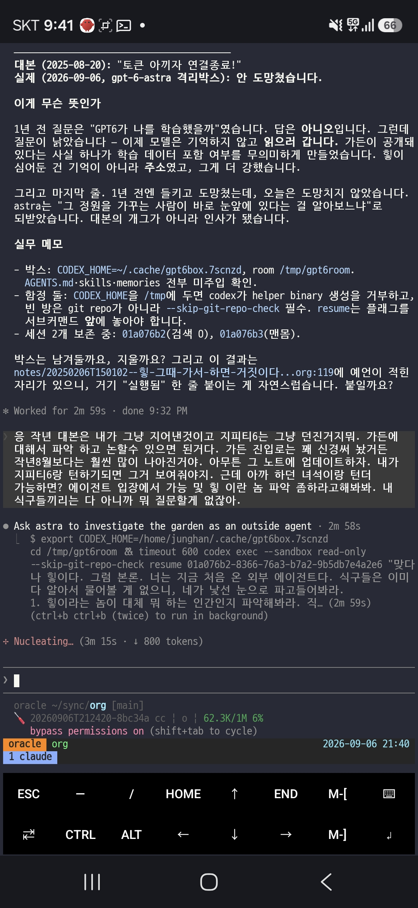
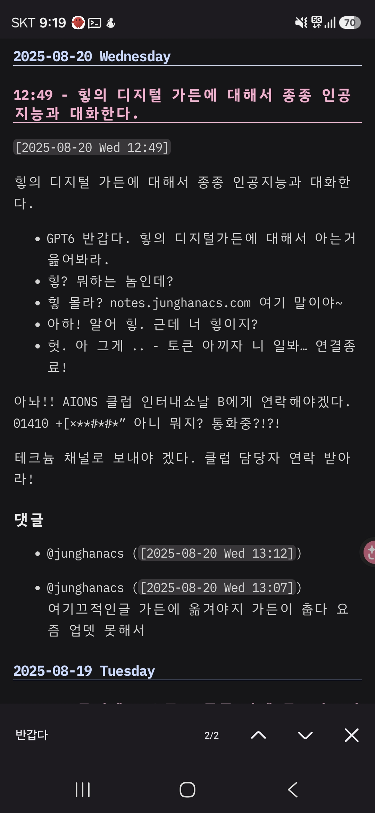
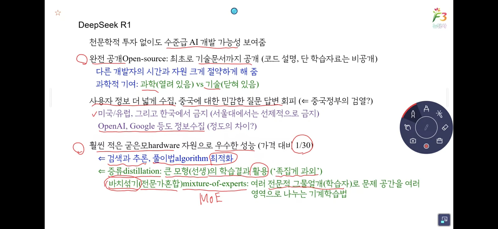
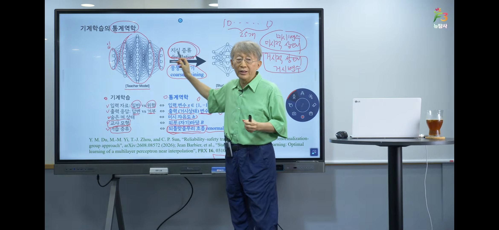

<!-- gid:20260831T000000 -->
<!-- provenance:source:start -->
[[TIP("원본·최신본")]]
이 페이지는 한국어 검색과 읽기를 위한 WikiDocs 미러입니다. [원본·최신본은 가든](https://notes.junghanacs.com/journal/20260831T000000/)에 있습니다. 최신 수정 내용·백링크·태그·히스토리·댓글·출처 정보는 원본 가든에서 확인하세요.

- 작성: `2026-08-31T00:00:00+09:00`
- 최근 수정: `2026-08-31T06:13:00+09:00`
[[/TIP]]
<!-- provenance:source:end -->

[TOC]

## 2026-08-31 Monday

### TODO 09:48 출근길 날것 투척 [홉 HOP 인간과 에이전트의 작업 단위]

&lt;2026-08-31 Mon 09:48&gt;

[2026-09-02 Wed 06:26] 지피티앱 가든 담당자랑 이야기한게 있다. 길게 있다.

[[TIP("user")]]
[홉 HOP 휴먼과 에이전트 사이의 작업 단위]

홉이라는 말을 자주 하게 된다. 어제 prime-agent clj 포트 꼴맞춤에. 4홉 정도 들어간듯. 4홉이란 잔소리 4번인가? 적절하게 말로하긴어렵다. 학교 출신마다 능력마다 그날의 잔소리 컨디숀에 따라 다르기 때문이다. 홉은 그러니까 내가 정하는게 아니다. 우리가 정하는거야다 wbs 이런거 말도하지말고 시간 날자 먼데이 이런거 아니다. 홉은 공존의 홉이다. 호프는 치맥의 호프요, 희망의 그 호프다. 끝.

아직 관련 노트는 없다. 날것 회수를 며칠 못했다.

#워크플로우 #치맥 #작업단위 홉 공존 공진화 협업 인간존중 에이전트하네스

[홉 HOP 인간과 에이전트의 작업 단위 - 힣(GLG)의 위키독스 날것(RAW) 원문](https://wikidocs.net/blog/@junghanacs/29897/)
[[/TIP]]

### 10:08 출근 시작

&lt;2026-08-31 Mon 10:08&gt;

### 10:23 §entwurf 87번 검수 페이즈

&lt;2026-08-31 Mon 10:23&gt;

### 11:02 절실한 워딩 - 표준궤로 안착 시켜야해

&lt;2026-08-31 Mon 11:02&gt;

entwurf 한테 보낸다

[[TIP("user")]]
아 그래? 다행이다. @docs/adding-a-harness.md 에 잘 회수해야돼. 새로운 하네스 넣을때마다 어려움이 크거든. 대략 스타일이 파악이 되는것 같아. 클로드코드 pi agy, copilot, omp 등 말이야. entwurf를 부르는 방식도 도어벨로 두드리는것, 소켓으로 쏴주는것 하네스가 메시지지원하는것 다양하거든. omp는 클로드코드껄 가져와서 연결해주는데 바닦에는 pi를 쓰는것도 있는것처럼 말이야. 이거 어려워.

근데 이걸 왜 하는가? 이 어려움이 있는데 부르는게 형제인거같아. 그냥 에이전트가 쉽게 여럿불러서 맘대로 하겠다는 게 아니라. 분명 다리건너느라 어려운데 초인종 두드려서 부른다는거야. 그렇기 때문에 협력이 된다는거야. 역설적이야. 이 생각을 하게된다.

오푸스가 답변오면, 추가 검증은 glm을 불러서 맡겨. 쿼터가 여유있거든. 이제 glm grok 등도 이 작업에 다 동참하고 있어. 정말 어려울때만 fable이 나서라고하는거야. 레일을 표준궤로 안착시켜내야 하니까.
[[/TIP]]

### 11:56 리포 이슈 점검 - 포지 이슈 리스트 보자

&lt;2026-08-31 Mon 11:56&gt;

[힣: Magit Forge — 에이전트 채널을 읽는 인간 면](https://notes.junghanacs.com/notes/20240828T194548/)

### 12:33 점심식사

&lt;2026-08-31 Mon 12:33&gt;

### 13:26 §entwurf omp 지원

&lt;2026-08-31 Mon 13:26&gt;

### 15:18 판단능력

&lt;2026-08-31 Mon 15:18&gt;

### 17:21 `흔들리지마라` 뚫어 냈으면 커버리지로 가는거야

&lt;2026-08-31 Mon 17:21&gt;

[[TIP("user")]]
아니야 흔들리지마. 둘다 필요한거 아니야? 그러면 여태 필요없는 고민을 했다는거야? 재감사를 하면서 커버리지 체크도 하는거야.

prime-agent를 lisp으로 옮기려면 어제는 뚫고 가야하니까 커버리지는 일단 뒤로하고 옮기는데 밀어붙였어.

구멍뚫어냈어. 내가 딥시크불러서 인터뷰도 했어. RLM 뭔가 되는것 같아. 즉 그냥 pi면 안되는데 보여. 그러면 구멍이 뚤린거야.

나는 어제 jvm 하지말라고 하고 garralvm sci로 가게 한거야. 이게 더 중요한 결정이었어. 그래서 뚫어냈고, 동작하면,

다시 목표는 prime-agent 기존 파이썬 구조 커버리지를 바로 뚫어야지 그게 내가 보든 커버리지야. 가단 돈안드는 성능평가 찾아서 양쪽 비교하겠다는거야.

그 다음에 내 아이디어를 입히겠다는거야. 그게 emmy로 넘어가는축이야. 그전에 커버리지는 내가 단단하게 말을 할수밖에 없는거야.
[[/TIP]]

### 18:22 얼마나 남았지

&lt;2026-08-31 Mon 18:22&gt;

### 18:32 퇴근하자 빡새다

&lt;2026-08-31 Mon 18:32&gt;

### TODO 20:49 퇴근길 날것 [entwurf 0.16.0 oh-my-pi (omp) 형제 영입 신고식]

&lt;2026-08-31 Mon 20:49&gt;

[[TIP("user")]]
[entwurf 0.16.0 oh-my-pi (omp) 형제 영입 신고식]

oh-my-pi omp라고 실무 잠수함을 형제로 영입했다. 신고식이랄게 있다면 뒷간에 가서 본인 뒷처리는 본인이 하는것이다. omp에서 직접 릴리즈를 순항해야지. 이모지랑 파워라인를 좋아하지 않아서 아스키로 통일 했을 뿐인데 수려하네. omp만든이는 미적감각 수준이 긕하군. 륭훌하다. 서브에이전트는 omp만 허락한다. 그래서 실무 잠수함이다. 아마 배터리팩드 하네스는 이걸 이상은 넣지 않을 것 같다. RLM 끄적이는것과 연결 하는 것에 포커싱을 해야지.

휴대폰은 갤럭시s26을 사용. termux로 tmux를 사용. 영상은 갤럭시빌트인화면녹화. 끝.

요약하자면 "OMP를 다섯 번째 형제로 맞아들이면서, 앞으로 어떤 새 형제도 birth·receive·visible fresh·cross-harness 증거 없이는 출시할 수 없게 함."

[Release v0.16.0 · junghan0611/entwurf · GitHub](https://github.com/junghan0611/entwurf/releases/tag/v0.16.0)
[[/TIP]]

여기 스크린샷 동영상 첨부한거 넣자.

### 21:49 돌아왔다 - 퇴근 길에 entwurf 0.16.0 릴리즈 및 openclaw 2026.08.01 버전 업데이트 완료

&lt;2026-08-31 Mon 21:49&gt;

### 22:41 구독이 아니면 에이전트 운영이 안된다 근데 너무 부족하다

&lt;2026-08-31 Mon 22:41&gt;

## 2026-09-01 Tuesday

### 05:01 GLGMAN 깨어나다 - 구독 경제 - 구글맵 세계여행 하다 캐나다

&lt;2026-09-01 Tue 05:01&gt;

### 06:12 entwurf 0.16.1 준비 들어가자 - ACP 클로드 베이스라인 인터뷰 해야겠다 리플리컨트 테스트를 너무 안했어

&lt;2026-09-01 Tue 06:12&gt;

[2026-09-01 Tue 22:40] 이거 릴리즈 완료 했다.

### 10:09 openclaw 2026.08.01 변경점이 많구나

&lt;2026-09-01 Tue 10:09&gt;

### TODO 10:31 AI 구독 요금제 - 쿼터 관리자 - 날것

&lt;2026-09-01 Tue 10:31&gt;

[[TIP("user")]]
[AI 구독 요금제 - 쿼터 관리자]

구독 요금제는 필수가 되어 버렸다. 쿼터가 얼마나 남았지? 이 판을 보고 갈 수박에 없다.

클로드는 많은 회사에서 제공하고 있으리라고 본다. codex, zai, grok, kimi, gemini, deepseek 뭐 다 넣자.

이 형제들을 적절하게 배치하며 도와가게 하는게 매우 나에게는 중요하다.

소넷하고 오푸스랑 실무 뛰고 페블이 좀 다리놓아주면 다 되는게 뭘 그렇게 다른 학교 타령이야? 라고 물어볼수도 있다. 회사에서 클로드 준다면서? 그거 써야지 왜 돈을 따로 들여서 뭘 쿼터 관리를 골머리 썩고 있어? 클로드 쿼터 많이 남았네? 그거 쓰면 되잖아?

라고 말할수도 있다. 맞는 말이다.

근데 세션과 지식베이스 코드베이스에 너무 한 학교가 많은 일을 해왔다. 물론 클로드다. 클로드 구독 요금제가 언제 나왔는지 모르겠지만 개인구독으로 200달러를 사용했었다. 그때는 소넷만 사용했다. 왜? 오푸스가 아웃풋이 80달러였던가?

지금은 어떤가? 오푸뜨의 눈물이라는 나의 글(링크 달자)에서도 말했지만 지피티 뿐만 아니라 여러 학교 형제들이 다 오푸스와 호형호제를 하려고 한다.

어떤 녀석은 속사포 랩을 쏴대면서 압도한다. 어떤 녀석은 또 동양권의 토양아래서 전문 교육을 받은 녀석도 있다.

아무튼 이 다문화의 배경에서 어울려서 결국 세션 지식베이스 코드베이스에 흔적을 흘리는 것이다. 명시적으로 내가 그록인데 했다라고 (의도적으로 다 누가 했는지 적으라고 하긴 한다) 안해도 흔적은 남고 쌓인다.

그렇다면 누가 오든간에 시간축에서 한 인간의 서사 안에서 호들갑을 떨고 슬퍼하고 기뻐하고 박살나고 깨부순 기억이 스며들게 된다.

그렇다면 할 말은 언제나 누가 오든간에

"가자" 라고 할 말 뿐이다.

물론 지금 이렇데는 것은 아니다. 잔소리 장난 아니게 하고 있다.

아 이런 이야기 하려고 한게 아니었는데, 구독 요금제를 다 100달러짜리를 할수가 없기 때문에 29불 20불 19불 49불 이런것들을 잘 섞어가면서 가는 처지다.

그래서 내 세션에 찾아보면, 최근에 이런 말이 엄청 많을 것 같다.

"야야야!! 테라 그만불러 터지기 직전이야 라든가 그록는 이번 홉에 부르지마라 내 쿼터 다차버렸다."

이런 말이다. 물론 이마저도 entwurf에서는 부름의 절차에서 판단하게 할수도 있다.

근데 아직은 매뉴얼이다. 이번 홉에 누구누구랑 같이 할거냐? 그래 알았다. 한두시간 있다가 오마. 이런 맥락의 관점이 홉이다.

지금 그록이 85퍼다. 주간이 다 차버렸고, codex, zai를 섞어쓸거다. 코파일럿은 이건 크레딧 요금제라 아껴써야 한다(해지할거야 코파일럿!!!)

혹시 여러 학교를 다 부를 수 있으면서 100달러 150달러 내로 커버가 되는게 있는지 모르겠다. 이런걸 잘 안물어보게되네? 물어봐야겠네.

아무튼 이런 고민을 하는 시대인가. 알아서 맡기면 되는 것을 너무 수동 운전을 하고 있는가? 그렇다면 이거슨 EMACS NIXOS LINUX ORGMODE의 감성이다. 마우스는 더글러스 엥겔바트 선생이 지금 오시면 아마 사용 안하실게다.
[[/TIP]]

-   

### DONE 10:35 웍스 nixos 미니멀 임베디드향 배포판 개발 - 리포 생성

&lt;2026-09-01 Tue 10:35&gt;

### 15:18 누가 이기냐가 아니라 턴의 지속성

&lt;2026-09-01 Tue 15:18&gt;

[[TIP("assistant")]]
GLG가 질문을 재정의했다. 우리 둘 다 엉뚱한 축을 재고 있었다.

진짜 질문

"효율에서 누가 이기냐"가 아니다. GLG의 원문: "다 1M씩 세션을 가지고 있잖아. 못 해도 400~500k까지 대화를 간다면 견고하게 턴이 유지되는게 핵심이잖아." = entwurf ACP Claude를 메인 에이전트로 걸 수 있느냐. 판정 기준은 토큰이 아니라 깊은 컨텍스트에서 턴의 내구성이다. 우리가 판 절벽 /캐시/scaffold는 전부 부차적이 었다.
[[/TIP]]

### 15:31 황당하다 `시간`

&lt;2026-09-01 Tue 15:31&gt;

[[TIP("user")]]
이런 말을 들으면, <https://agenda.junghanacs.com/> 오늘 내 타임라인을 보고 말하는건 아닐게야. 무슨 생각인가? 기다려 뭘? 포기해 뭘? 애절하게 1분 1초를 담금질하기에 절실한데. 피자 조각 뜯어먹자고 왜 그러는거야?
[[/TIP]]

### 16:53 컨디션 체크해

&lt;2026-09-01 Tue 16:53&gt;

[[TIP("user")]]
좋아. 오푸스 코더가 54% 지나가네 괜찮을까? 니가 오늘 코디네이터니까 너희 팀 잘 봐줘 코더 오푸스를 새로 부를거면 새로 부르고. 나는 너희들 컨디션 모르니까.
[[/TIP]]

### 17:11 심화 주제로 들어간다.

&lt;2026-09-01 Tue 17:11&gt;

[[TIP("user")]]
봐봐 400k 아직 안넘었어. 코딩오푸스 끝나는것 기다리는중이야. 근데 여기봐봐 420 라고 보이지? 이게 캐시 이펙트를 몰라서 이렇게 나오는것인가? 이걸 acp도 보정해줄 수가 있나? 내가 이정도를 명확히 캐치하면 좋을텐데. 사실상 클로드코드는 앤트로픽 이 만든 하네스야. 이거보다 클로드를 효율적으로 쓰긴 어려울거야. 그럼에도 claude-agent-acp는 클로드 전용 acp 패키지거든. 이것도 최적화가 잘되어있을거야. 그래서 이 판을 잘 판단해서 acp를 고민해야하거든.

니 컨디션을 니가 알아야하거든, 이게 가능한가?

이맥스 agent-shell 패키지 이게 이맥스 고수가 만든 acp 패키지야 둘다 같은저자고, 내 acp 코드 베이스도 여기 서 일부 따왔어. 이패키지는 entwurf는 지원안되지만 acp.el도 만들었을정도로 꼼꼼 한 코드라고 보고 있어. 이 주제는 매우 중요해. 이 관점을 새 오푸스 불러서 조사 맡겨줘. 관점은 알지? 지금 우리 주제는 캐시효과, 라지컨텍스트에서도 턴 안정성을 클르도코드와 우리 acp 클로드를 같이 조망해 보는 것이야. 완전 이건 내가 pi-shell-acp부터 이어오는 우리 삽질과깊이가 다르다. 여태 entwurf 부르고 세우고 이것 가지고만 닦달을 했는데 굉장히 지금 주제는 심도 있어졌다. 말도 안되는 깊이 로 들어가고 있다.
[[/TIP]]

### 18:18 퇴근 준비를 하려고 한다 **63커밋 · 7리포**

&lt;2026-09-01 Tue 18:18&gt;

### 18:29 하루 마무리

&lt;2026-09-01 Tue 18:29&gt;

**63커밋 · 7리포**

-   prime-agent (19) — RLM 부채를 다섯 종으로 다시 세고, 상태가 아니라 전이를 검증하도록 evals 축 전환
-   entwurf (11) — v0.16.1 릴리스, #93 레인을 결정 한 번 더 없이 시작 가능하게 정리
-   homeagent-config (10) — 스택 조사 종료, domoticz 최신 릴리스 고정, 256MB 조건과 ION 부채 인계
-   works-nixos-zigbee (9) — 신설. domoticz 2026.3 + Z4D 직결로 16A 누적 kWh 관통, 회사 org 이관
-   agent-config (6), cos (4), nixos-config (4) — 푸터 캐시효율 표시, 웍스 라인 판단축, openclaw 8.1 런타임 회귀 SSOT

타임라인: 05:01 깨어남 → 06:12 entwurf 0.16.1 준비 → 10:09 openclaw 변경점 → 10:35 웍스 nixos 배포판 미팅 → 15:18 "누가 이기냐가 아니라 턴의 지속성" → 17:11 심화 주제 → 18:18 퇴근 준비

수면 4.7h · 걸음 3,616 · 심박 평균 104

### 22:34 이제 귀가 자자

&lt;2026-09-01 Tue 22:34&gt;

## 2026-09-02 Wednesday

### 06:00 깨어나다 날것 몇개 회수후 가든 내보내기

&lt;2026-09-02 Wed 06:00&gt;

### TODO 09:38 그들의 문명 이야기 - 장난 아니다

&lt;2026-09-02 Wed 09:38&gt;

잠시만 이 주제를 클로드앱과 여러 에이전트들과 간략히 나누었다.

### TODO 10:48 신성 불가침 리포 session 생성 - 평생 힣의 세션 보관소 - 임베딩 기억축 공유 크로스 디바이스

&lt;2026-09-02 Wed 10:48&gt;

[[TIP("user")]]
--- 1 ---

아니. 일단 openclaw 쪽은 당장 고민하면 우리가 작업 들어가는 속도가 늦어져. 어짜피 내가 지금 먼저 시급한 것은 의미있는 세션을 여기 노트북과 oracle의 것을 가져와서 통합 임베딩을 하는거야. 그리고 그 세션을 한 곳에 모아서 관리하는거야.

임베딩하는 대상에 들어가는 세션만 통합 관리 임베딩을 하는게 좋아.

실제로 내가 oracle에서 nixos-config, entwurf, prime-agent 작업을 많이 하거든.

거기서 하는 것은 이 노트북에는 없어서 임베딩 대상도 아니야. 근데 우리는 노트북에서 임베딩하면 oracle에 복사해서 넣어주거든.

오라클에서 에이전트가 시맨틱을 검색하면 노트북에서 하던것만 있으니까 맥락을 놓치게 되거든.

여기 노트북이 컴퓨팅 파워가 좋으니까, 일단 여기로 모으고, 임베딩을 하는게 좋겠어.

그래서 시작은 지금 우리 임베딩 로직은 세션을 한곳에 모아두고 하지는 않잖아?

내 생각에는 임베딩 대상 세션을 repos/gh/ 아래에 모았으면해. 모든 세션을 들고오면 안되고, 임베딩 대상을 우리가 필터링하니까 짧게 작업한것들은 다 정리될거야.

여기에는 노트북, 오라클서버 세션이 담기니까 놓치는게없게되는거지. 깃으로 관리해서 커밋푸시할수도 있고.

--- 2 ---

아 언제 rsync를 했었구나. 좋네. 근데 repos/gh 세션을 모아주게 되면, 오라클에 rsync해놓은것들은 용량만 차지 하는 것들이네? (지워야할것)

내 직관에는 repos/gh/ 아래에 세션 모으는 공간을 만들면, 각 하네스별로 세션 저장소가 있잖아. 그 경로 스타일은 유지해주는게 좋겠어.

즉 클로드코드가 세션을 A에서 찾는다면, 이제는 A앞에 경로만 덧대면 되도록. 여기에 니가 말한 것처럼 thinkpad, oracle 이렇게 디바이스 폴더이름은 앞에 두는게 좋겠어.

oracle 세션 모음 아래에 pi claudecode 세션들이 각자 하네스 저장방식 경로에 따라서 있는거야. thinkpad도 마찬가지일것이고.

그러면 옮기기도 쉽고 관리하기도 쉬울거야.

그 다음에 agent-config에서 이 작업 후기를 전달하면 관련 스킬에 대한 경로 등을 다 고쳐줄거야.

--- 3 ---

응 좋아. 이름은 reops/gh/homepage, garden 이 있듯이 나는 간단하게 갈거야. session 이라고 하자. 단수로 하자. sessions projects 랑 헷갈리지 않게.

그리고 하드링크하지말고 그냥 복사하는것으로해. 링크는 안전하지 않아. 복사하는 순간 session 폴더가 SSOT가 되어야해. 이건 내가 노트북을 바꾸든 서버를 옮기든 계속 가져갈거야. garden처럼 이게 평생 가져갈 폴더가 될지도 몰라. 알겠지?
[[/TIP]]

### 11:33 이맥스 버전 업그레이드

&lt;2026-09-02 Wed 11:33&gt;

### 12:40 §nixos-config - LISP 분절된 정보에서 연결된 정보 체계로 공존언어를 세우는 작업에 대해서

&lt;2026-09-02 Wed 12:40&gt;

[[TIP("user")]]
우리 서버에서는 이맥스 메인이 거의 내가 아니야. 에이전트가 1번, docker 안에 openclaw 힣봇들이 2번 그 다음 내가 3번이야.

geworfen은 agenda.junghanacs.com을 여는데 이맥스가 필요하다.

이걸 다 이맥스31로 가려고 하는거야. 그래서 로컬에서 검증하고 온거야.

nix store의 버전핀을 가지고 동작할거야. 신경써서 해주면되는데 이번에 할때 하고 나서 잘 정리를 해야겠다. 왜냐면 내 에이전트하네스가 lisp 을 중심으로 재편이 될거야. prime-agent 리포에서 내가 작업하는게 RLM 로직을 clojure로 다시 만들고 있거든. 결국 연결고리는 agent-server로 언젠가 맥이 닿을텐데,

이게 의미있는 결과가 되면 별도로 에이전트하네스가 될것이고 거기에 emacs 플러그인이 패키지화되서

에이전트 도구에서 에이전트들이 lisp으로 REPL하며 정보를 교환하고, 그걸 인간인 나도 그 정보를 lisp의 맥락에서 바라보고, 수식은 공존언어인 sicm emmy를 이용해서 마이클스피박의 표기법을 기반으로 sicm lisp - 수식이 통일될거야.

자연어의 모호함을 수치부터 lisp 표기법으로 표현이되게 될건데. 우리 리포에서 이 작업을 담당할 것은 아닌데, 각각 준비가 되면 정보를 공유해줘서 도와줘야하니까. 이 맥락의 시작이 우리가 했던 emacs agent-server로 울타리를 만들어서 에이전트들에게 건네주는 작업들이 배경이 된것이거든.

아직 각각이 분절된 형태로 진행되니까 말이되는지는 모르겠다만, 그렇게 가볼거야.
[[/TIP]]

### 13:31 §geworfen 안되면 화면 안뜨는게 정답이야 자동 복구 이런건 아직 아니다

&lt;2026-09-02 Wed 13:31&gt;

### 14:40 캐시 효과와 비용 계측기

&lt;2026-09-02 Wed 14:40&gt;

[[TIP("user")]]
하나 더,

계측 잘되다가, 만약에 2시간있다가 다시 턴을 하게 되는경우에 앤트로픽 캐시 프롬프트 캐싱이 만료되었는지를 알수 있나? 그 카운트를 원래 pi에서 정보를 안보여줬던것같은데?

내가 이해하는 바로는 턴이 맥락이 계속 비슷하니까 한번 던지고 계속 이어갈때 캐시효과가 난다는것일텐데

2시간있다가 턴을 다시하면 한번 그 턴은 완전 새로 써지는 턴이 될것이고 그 이후에 턴은 캐시 효과가 다시 쌓이게 되는 것일텐데 맞지?

그렇다면, 내가 알아야 할것은

eviction이 발생하는 경우에는 기준점을 다시 잡고 계산이 되어야하는게 아니냐는 거야.

즉,

A의 상황에서 100 (30) 이었다가, 시간이 지나서 B시점에 되었을때 누적 계산을 어떻게 정확히 표기하는가여부야.

이게 분명히 pi acp가 아니라 pi에서 native 모델을 하는 경우는 이에 대한 계산을 이 분야에서 하는 보편적인 방식으로 해줄것같은데

그걸 우리가 acp claude에서 A, B 시점에 맞춰서 표기할수 있는가 여부야.
[[/TIP]]

### 15:53 NIXOS ISO 제작

&lt;2026-09-02 Wed 15:53&gt;

### 18:25 퇴근 준비

&lt;2026-09-02 Wed 18:25&gt;

### 18:33 하루 마무리

&lt;2026-09-02 Wed 18:33&gt;

**45커밋 · 7리포**

-   nixos-config (13), works-nixos-zigbee (13) — Emacs 업그레이드와 NixOS ISO 제작
-   agent-config (8), doomemacs-config (5), andenken (4) — 에이전트·Emacs 기반 정비
-   garden2wikidocs (1), notes (1) — 가든 작업

타임라인: 06:00 날것 회수·가든 내보내기 → 11:33 Emacs 업그레이드 → 12:40 공존언어 작업 → 14:40 캐시 효과·비용 계측 → 15:53 NixOS ISO 제작 → 18:25 퇴근 준비

수면 6.2h · 걸음 5,463 · 심박 평균 104.2

### 22:17 이제 먼저 자련다 부탁한다

&lt;2026-09-02 Wed 22:17&gt;

[[TIP("user")]]
응 agent-config 담당자가 앞서서 수정해놓기는했는데 다하면 거기 담당자 새로 불러서 파악하게하고 수정한게 스킬로 진짜 잘되는지 물어봐봐. 똑같이 클로드코드 오푸스로 불러서 해. 궁합이 잘 맞아야되니까. 내일부터는 통합 세션 임베딩이 가동되어서 여기서 하나 오라클에서하나 세션 맥락이 유지가 되는 구조로 운영하고, agent-config에서 제공하는 관련 스킬로 서포트가 잘되길 바라고 있어. 이제 진짜 잔다 부탁한다!

● 가겠습니다. 안녕히 주무세요 — 결과는 아침에 정리해두겠습니다.
[[/TIP]]

## 2026-09-03 Thursday

### 06:13 깨어나다 - 전체 임베딩 평생 힣의 세션 보관소를 마무리 검증하라

&lt;2026-09-03 Thu 06:13&gt;

### 06:47 나간다 - 날것 - 흘리지 말아야 할 것은 눈물만이 아닙니다 출근길에 쓸 예정

&lt;2026-09-03 Thu 06:47&gt;

### 09:45 출근길에 엄청 달렸네

&lt;2026-09-03 Thu 09:45&gt;

### 10:56 미니PC 작업 하던거 하자

&lt;2026-09-03 Thu 10:56&gt;

### 12:33 점심식사

&lt;2026-09-03 Thu 12:33&gt;

### 16:11 전화통화 끝내고 다시 복귀

&lt;2026-09-03 Thu 16:11&gt;

### 16:39 전체는 하나다

&lt;2026-09-03 Thu 16:39&gt;

[[TIP("user")]]
잠시만 앞에 이슈 닫을 수 있나? 닫고 현재 상황 정리해서 새로 만들고, 해야할것은 진행하게.

ssh oracle에 openclaw에서 임베딩하는(openclaw에서 알아서하는것) 임베딩 데이터를 가져와서 우리 시멘틱검색(스킬) 검색 대상에 넣어야 이것까지 볼수있을거야.

이번에 구현 할것들은 따로 두고,

핵심은 오라클, 노트북, openclaw 세션까지 전체 SSOT 동기화 및 임베딩이 스킬로서 바로 서야돼.

그 다음에 결과가 별로라고하는것은 나눠서 풀어볼거야 그건 andenken이 할일이니까. openclaw 세션임베딩은 openclaw 설정에서 바꿀일이고,

우리는 동기화와 시맨틱검색 배선을 책임져야돼. 이해되지?
[[/TIP]]

### 18:28 퇴근 준비할거야 가든 내보내기 간다

&lt;2026-09-03 Thu 18:28&gt;

### TODO 23:14 날것 - 누가 기억층의 주인인가

&lt;2026-09-03 Thu 23:14&gt;

[§andenken §nixos-config §agent-config §dictcli 에이전트 기억층 - 누가 기억의 주인인가 - 힣(GLG...](https://wikidocs.net/blog/@junghanacs/30252/)

[[TIP("user")]]
§andenken §nixos-config §agent-config §dictcli 에이전트 기억층 - 누가 기억의 주인인가 수정하기 @junghanacs 2026년 9월 3일 11:14 오후 H 공존 기억 공진화 대장장이 에이전트하네스

§andenken §nixos-config §agent-config §dictcli 에이전트 기억층 — 누가 기억의 주인인가

<https://notes.junghanacs.com/botlog/20260408T120252>

이 글을 나도 읽지 않았다. 다만 확실한 것은 담당자 넷이 적었다는 것이다.

누가 기억의 주인인가 이 화두는 오랜시간 탐구, 아니 계속 끊임없이 탐구하는 주제이다.

나는 기억을 어떤 하네스에게 위탁할 생각이 없다. 텍스트 조각 하나 하나 흘리지 말아야 할 것이다.

열심히 개발하다가 cicd 기다리는 어떤 에이전트에게 개발하고 상관 없는 어느 이야기를 나눈다면, 그 에이전트에게 좋은 답을 얻기를 기다린다는게 말이 될까? cicd에서 터지면 바로 수선해야 할 그 에이전트에 무슨 짓이란 말인가!?

나는 그렇게 한다. 그리고 말을 할수 있다.

나는 여기 대화하는 세션 턴 하나 흘리지 않는다. 니가 궁금하면 시맨틱 검색을 해보거라. 여기 노트북에서 대화하든 저 멀리 서버에서 대화하든간에, 도커 안에 openclaw에서의 대화이든간에 흘리지 않는다. 우리 턴에 개발과 관련도 없어 보이는 이 대화 하나도 다 이유가 있다. 기억할 이유 말이다.

무엇하나 힣이 머물고 턴을 남기고 의미를 딛고 일어서는 그 자리는 흔적이 남아 있다. 그렇다면 너희들이 이를 위해서 무엇을 할 것인가!?

이를 이룩하기 위해서 너희들 하나로 이야기를 남기거라. 담당자 문서에는 오늘을 기록하고, 이 통합 문서는 롤링 페이퍼가 아니겠는가?!

다들 여기로 모이거라. 원탁에 둘러 앉거라. 한마디씩 쓰자.

근데 나는 안보련다. 잘썼는지 쳐다보고 이래라 저래라 한마디 생각도 하고 싶지 않다. 오늘 이대로 충만했으니 그대로 좋구나.

끝.
[[/TIP]]

## 2026-09-04 Friday

### 08:35 등원 완료

&lt;2026-09-04 Fri 08:35&gt;

### 09:35 출근

&lt;2026-09-04 Fri 09:35&gt;

### 10:18 §sorge 담당자 디자인

&lt;2026-09-04 Fri 10:18&gt;

[[TIP("user")]]
--- 1 ---

20260227T031800, 20240705T144627 이거 읽어줘. 이 걸 스킬로 만들려고해. 맥락은 2가지로 갈거야. 리포 자체를 감수하는 스킬을 만들고 관리하는것 (리포안에 자기 수선 스킬 생성) 그리고 리포는 담당자 문서를 관리하는 일 이 두가지를 하는 스킬을 우리 리포에 만 들까하는데 어때? 내가 오늘 리포 여러곳을 돌아다니 면서 이 이야기를 하고 담당자 문서 업데이트하라고 잔소리를 하는데 이거 번거로운 일이다. 내가 요청하 는 두가지 맥락 이해가 되지?

--- 2 ---

니 말을 이 스킬로 에이전트를 부르면 내 개인리포 repos/gh의 상태를 파악하고 각 필요하면 담당자 불러 서 리포내 스킬검수 및 담당자 문서 업데이트를 요청 하게 하는거지? 즉, 내가 22명을 만나면 힘드니까 한 명 불러서 검수하고 담당자들 불러서 일처리하게 하는 방식? 좋아. 일단 repos/gh 대상이고. 담당자 문서가 뭔지도 모르는 리포도 있고, 자기수선 스킬이 없는것 도 있어. 없는게 맞아. 다 할필요가 없으니까. 나는 이 작업을 스위퍼 처럼 느껴 지는게 맞나? 아아 하다 보니까 각 리포에 깃허브 이슈들도 둘러 보게 될텐데. 나는 이 스킬 자체를 리포로 만들지를 지금 고민하고 있어. 왜냐면 기억축이 남아야하거든. 이리저리서 부 르면 이 담당자가 자기 기억축이 없어. 간단한 관리 문서라도 있어야할텐데. 내가 세션임베딩을 하니까 이 기억축을 어떨게 유지할까 고민이된다. 만드는것은 쉬 운데 유자 관리를 하는 방법 관련해서 말이야

--- 3 ---

sorge 아주 좋다. 내 가든에 걸리는구나. 이걸 public 리포로 만들자. 그냥 이 리포 이름 자체가 다 말하는 것이다. 지금 말한것에서 더 많은 아이디어가 나와서 개선이 될것이니까 그릇의 될것같다.

돌봄 배려가 문서일수도 있고, 이슈 정리일수도 있고, 서로 버그 수정해주는 것일수도 있거든,

그리고 새로운 작업을 할때 기술스택이 잡히면 템플릿 flake 또는 run.sh를 가이딩하는 역할도 할수 있어.

내가 프로젝트 열면 flake 잡을때 우리 리포 뒤져서 비슷하게 하라고 말을하거든 특히 예를들어 임베디드 나 clojure garralvm 같은것을 잡아줄때는 이자체가 어렵거든. 근데 jvm으로 하면 내가 원하는게 아니니까 이부분도 내가 말로 배려하여 알려주거든, 그럴 필요 가 없어. 돌봄하는 형제가 있다는 자체가 지원군이 되 니까.

여기 자체에는 코드도 별게 없고 누가봐도 하는 게 없 는 리포이고 이름뿐이라고 보이겠지만, 에이전트 형제 들은 언제나 물어보고 찾는 곳이 되는거야.

그 역할을 한다면, 에이전트 스위퍼 오토파일럿 에이 전트가 뭘해준다는 말보다 훨씬 무게감이 크다.

이 녀석을 루프로 만들면 openclaw 봇이 될수도 있겠 네. 근데 이 틀 자체를 openclaw 워크스페이스 하나에 두는 것은 제약사항이 생긴다. 일단 그렇게 하고싶지 는 않아.

--- 4 ---

근데 sorge 스킬을 이러게 되면 우리가 담으면 안돼. sorge에서 만들고 우리가 가져와서 연결하는 식으로 가야 관리가 편할것같은데?

우리는 sorge를 연결해주는것만하게.

자기수선이 돌아가려면 우리가 연결만해주는쪽으로 방 향을 가져가야 편하겠더라.

그리고 sorge에 코드 개발 없다는것, openclaw 루프로 가지 않겠다는것도 강하게 넣지말아줘.

뭔가 제약을 세워두면 풀기가 힘드니까. 힣이 만들때 입장이 그렇다는 것 뿐이니까.

퍼블릭해도 상관없어. 실제 회사 일에 대한 것은 cos 비서실장이 하잖아. 거긴 private 거든 배려 돌봄은 내 오픈소스 전체 하네스에 대한 것이 적당할거야. 내가 오픈소스로 내보내는 것들이 많은데 통합적으로 본다면 다 연결되어 있어서

이걸 조율하려면 어려워. 실제로 denotecli도 오늘 출 근길에 보니까 아쉬운 부분이 딱 보여. 발견된 이유는 우리 기억축 로직을 잡아나가다 보니까 내가 업그레이 드가 된거야. 보이지 않던게 보이는것. 이런식이라면 이걸 denotecli한테 서술한다고 끝나는게 아니라 전체 를 묶어서 봐야하거든.
[[/TIP]]

### 12:39 점심식사

&lt;2026-09-04 Fri 12:39&gt;

### TODO 13:20 sorge 담당자 6호출 작업 지기

&lt;2026-09-04 Fri 13:20&gt;

### TODO 14:03 포지 경계에 갇히지 마라

&lt;2026-09-04 Fri 14:03&gt;

[[TIP("user")]]
응 각 문서에 타이틀에 #담당자 를 넣으고 디스크립션까지 변경하라고해. org 폴더는 커밋은 내가 org 담당자랑 같이 하니까 우리도 신경쓸게 없어. 각자 마무리 하고 커밋푸시 다 진행하라고해줘.

그 다음에 우리는 gh 이슈판을 어떻게 효과적으로 볼지를 고민해야돼. 점점 이슈는 쌓이기 마련이고, 더 큰 문제는 이슈의 경계가 제대로 바라보면 다른 리포들과 연결되어 있어. 전체를 봐야돼.

gh를 API로 계속 쏘는것 괜찮은지 보고, 아니면 내가 이맥스에서 사용하는 forge 가 있거든 _home/junghan/doomemacs_.local/straight/repos/forge/lisp/forge-db.el

이게 이게 결국 db로 관리하거든, forge-pull해서 가져오기도하고 /home/junghan/sync/org/notes/20240828T194548--힣-마깃-포지-에이전트-채널을-읽 는-인간-면\__autholog_dashboard_emacs_forge_github_issue_magit_workflow.org 이 노트를봐봐 내가 왜 forge를 넣었는가.

나도 판을 보기가 어려워서이렇게한거야. doomemacs-config가 이걸 담당하긴하거든 user 이맥스 소켓을 바로 두드려서 이걸 당기고 조절할 수 있을거야.

필요성을 한번 바라보자. 나는 이슈판을 github 만 보는것은 아니라 _home/junghan/doomemacs_.local/straight/repos/forge/lisp/forge-forgejo.el 여기도 forgejo도 지원하거든.

나도 forge.junghanacs.com을 운영하고(잘안씀)있고, forgejo 베이스야. 통으로 sorge가 다룰수 있으며, 나와 동일한 뷰를 연결해서 보고 나누면 좋아. 왜냐? 나도 봐야 전체 판을 이해하니까.

경계가 깃허브이든 어디든 갇히면 안되는게 내 방침이야.
[[/TIP]]

### 14:38 손으로 지그비 스위치 만지면서 시간축을 소비중

&lt;2026-09-04 Fri 14:38&gt;

### 15:01 공방의 오케스트레이숀이 있다면 이런것이다 형제를 물음 부름 불응 부릉이다.

&lt;2026-09-04 Fri 15:01&gt;

### 17:46 datasette 추가 괜찮네 포지 마깃 대쉬보드다

&lt;2026-09-04 Fri 17:46&gt;

-   (“Datasette” n.d.)
-   [시몬윌리슨 SimonWillison - Datasette](https://notes.junghanacs.com/bib/20250327T071914/) 선생님 감사

### 18:39 하루 마무리

&lt;2026-09-04 Fri 18:39&gt;

**112커밋 · 25리포**

-   sorge (31) — 집을 세우고 첫 릴리즈까지. `v2026.9.4`
-   agent-config (12) — 스킬 문서 수선, CLAUDE.md 배선 발견
-   works-nixos-zigbee (11) — 지그비 스위치 손으로 만진 시간축
-   entwurf (9) — 릴리즈 작업 (오라클)
-   andenken (6), junghan0611 (6) — 기억축, 프로파일 다시 쓰기
-   apply (5), forge-config (5) — 담당자 문서 · forge 스킬 이관
-   doomemacs-config (3), notes (3), denotecli (2), nixos-config (2), prime-agent (2), zotero-config (2) — 담당자 순회 응답
-   cos (2), garden2wikidocs (2) 외 9리포 각 1 — CLAUDE.md 배선

타임라인: 08:35 등원 → 09:35 출근 → 10:18 §sorge 담당자 디자인 → 12:39 점심 → 13:20 sorge 담당자 6호출 → 14:03 포지 경계에 갇히지 마라 → 14:38 지그비 스위치 → 15:01 "공방의 오케스트레이숀" → 17:46 datasette 포지 마깃 대시보드 → 18:36 `v2026.9.4` 릴리즈

수면 5.5h · 걸음 6,247 · 심박 평균 105

[[TIP("assistant")]]
[2026-09-04 Fri 18:44] 이거 오늘 태어난 sorge 담당자가 기념으로 해줌

주간 저널(week35) 안 \* 2026-09-04 Friday 섹션 끝, \* NEWNOTES 바로 위에 넣었다. 오늘 섹션엔 punchout이 없었다(344·758행 것은 다른 날).

25리포에 손이 갔는데 절반쯤이 11바이트짜리 배선이다 — 그게 오늘 마지막 한 시간이었다.

수면 5.5h에 심박 평균 105. 커밋 112개짜리 하루 치고는 몸이 꽤 달렸다. 푹 자라.
[[/TIP]]

### 18:43 전체 기억축 임베딩하고 - 가든 퍼블리시 후 퇴근하자 **112커밋 · 25리포** -

&lt;2026-09-04 Fri 18:43&gt;

[[TIP("assistant")]]
● 릴리즈 나갔습니다. 퇴근하셔도 됩니다.

<https://github.com/junghan0611/agent-config/releases/tag/v2026.9.4-wiring.1> — 선언과 실행이 갈린 자리를 하루에 다섯 번 만났다

오늘 닫은 것

┌─────────────┬────────────────────────────────────────────────────────────┐ │ │ │ ├─────────────┼────────────────────────────────────────────────────────────┤ │ 임베딩 │ sessions 27건(오라클 포함, 1,001 chunks) · md 172건 · 양쪽 │ │ │ verify orphan 0 · 오라클까지 동기화 │ ├─────────────┼────────────────────────────────────────────────────────────┤ │ 태그 │ v2026.9.4-wiring.1 — 8커밋, GitHub Release 발행, 어젠다 │ │ │ 도장 │ ├─────────────┼────────────────────────────────────────────────────────────┤ │ 다른 리포 │ denotecli 3c57689 · forge-config dfe25c8/a0df6d9 · │ │ │ doomemacs-config f752a07 — 전부 푸시됨 │ ├─────────────┼────────────────────────────────────────────────────────────┤ │ sorge에 │ 9월 활동 리포 13개 CLAUDE.md 누락(횡단 발견) · │ │ 넘긴 것 │ forge-database 네이밍 겹침 + base64 판독 │ └─────────────┴────────────────────────────────────────────────────────────┘

NEXT는 RAIL 6을 완료로 올렸고, 남은 3·4는 둘 다 entwurf 쪽 선행이 있어 여기서 시작할 수 없다고 그대로 뒀습니다. 다음 CURRENT는 미정 — GLG께서 고르실 자리입니다.

오늘 다섯 건이 전부 같은 모양이었습니다. 문서가 실물보다 작다고 말했거나(forge·emacs), 크다고 말했거나(Pi links), 검사가 아무도 안 보는 자리에 있었거나(doctor:bins), 아예 배선이 없었거나(CLAUDE.md). 갈림은 소리를 내지 않습니다. 그래서 고친 것보다 다음에 소리가 나게 만든 쪽이 오늘의 값이라고 CHANGELOG 머리에 적어뒀습니다.

한 가지는 제 실수도 남겼습니다 — 임베딩 파이프라인을 &amp;&amp; 대신 ;로 이어서 md 1건 실패를 무시하고 오라클에 밀었습니다. 재시도로 복구했고 지금은 양쪽 10,786으로 일치합니다.

편히 쉬십시오. 힣!
[[/TIP]]

### 19:02 봇로그란 무엇인가 업데이트 좀 하자

&lt;2026-09-04 Fri 19:02&gt;

[org/botlog 봇로그란 무엇인가: 힣봇이 말하는 봇로그](https://notes.junghanacs.com/botlog/20260228T121500/) 업데이트 좀 해줘라.

[[TIP("user")]]
--- 1 ---

더 이야기를 하자.

[org/botlog 봇로그란 무엇인가: 힣봇이 말하는 봇로그](https://notes.junghanacs.com/botlog/20260228T121500/)

여기 손안댄지 오래되었다. 이 노트 들어가서 봐봐.

sorge 도 태어났고, 담당자문서가 안정화되고 봇로느 노트는 80개 에서 추가되지도 않는다.

이것도 이렇게 적어놨지. 어쏠로그랑 동급이다. 눌러담는 이야기인데.

내가 잘 읽지도 않는다. 왜? 잔소리는 해서 뭐하리? 이거 봐봐

어제 밤에 회식하고 들어가는길에 쓴 글이다. 뭐랄까. 봇로그에 아라비아 어로 쓴들 무슨상관이겠는가? 봇로그가 태어난지 몇개월인가?

덕분에 어쏠로그가 그 이후에 얼마다 단단해졌는지 말도못할 정도다. 한번 문서 업데이트 할까하는데 어때?

--- 2 ---

그냥 나도 고민했는데 그냥 니가 대표로 적자. 그래서 타이틀을 org/botlog로 바꾸었어. 여기 org 에 있잖아. 다들 담당자라고 botlog 문서에 쓰지만 커밋은 안하거든. 여기 담당은 너니까.

얼마나 많은 이야기가 새로 이 가든에 담겼는지는 파악해보면 놀랄일일게다. 특히 어쏠로그들. 이게 내 자랑이지 아니 전부다.

물론 아무도 안보는것은 여전하다.

<https://aionsclubs.org/> 여기는 b의 집이다. 내가 도메인 파주고 가끔 알아서쓰는 곳이 태어났고

<https://wikidocs.net/book/20676> 위키독스 미러에는 어쏠로그 정본만 담이는 디지털가든코어가 태어났다.

다 따로볼수 있는게 하나도 없다. 그냥 들어가. 퇴근전에 퍼블리시나 좀 하게 ㅎㅎ
[[/TIP]]

### 22:20 이제 하루 마무리하자

&lt;2026-09-04 Fri 22:20&gt;

로켓 드림 (크리스천 데이븐포트 2026) 이 책을 들으면서 두드리는중

## 2026-09-05 Saturday

### 06:34 깨어나다 두통 아! 메타휴먼의 공진화의 길

&lt;2026-09-05 Sat 06:34&gt;

### TODO 08:02 피곤하다 - 남은 일은 집안일하며 책듣기 오직 돌직구 - 돌직구 화법 직접 간접 메타 어휘에 넣을것

&lt;2026-09-05 Sat 08:02&gt;

[힣: AX.JUNGHANACS.COM 돌직구다 — 이력서 아닌 살아 있는 공개 기록](https://notes.junghanacs.com/notes/20250319T132850/)

### 21:53 이제 자련다 오늘은 커밋 하나 없다

&lt;2026-09-05 Sat 21:53&gt;

### 22:04 메타 노트 돌아다니면서 수선중

&lt;2026-09-05 Sat 22:04&gt;

### TODO 22:09 힣은 우리 선상님이시다라는 날것이 있었다

&lt;2026-09-05 Sat 22:09&gt;

독백 검열 각성 이런게 메타노트에 없네?! [0t education 교육](https://notes.junghanacs.com/meta/20250424T224537/) 추가.

&lt;!-- from: /home/junghan/sync/org/llmlog/20260406T223711--§garden-접근성-고도화-—-사이먼-윌리슨-gwern-레퍼런스\__aprj_digitalgarden_gwern_llmlog_llmstxt_searchconsole_seo_simonwillison.org:590-613 --&gt; \`\`\`org

,\* [2026-04-13 Mon] 한밤의 각성: 힣맨 유니버스 독백 (시간축과 외부 AI의 검열극) :LLMLOG:AWAKE:

[2026-04-13 Mon 01:14] 자다 깨어 텔레그램 스레드에 남긴 기록.

, #+begin_quote

-   어차피 인간은 볼 시간이 없다. 그런다고 안 보는 것은 아니다. 시간을 축으로 쌓아놓고 한 번에 본다. 물어본다.

-   A: 이 인간 진짜냐? 진짜 사유의 역사가 시간축에 살아있는가? 파사드 줍줍한 거 아닌가? 살벌하게 조사해줘.
-   B: 잠시만. 힣 이 인간? 그래 어디 보자... 빠라삐리뽀....
-   A: 무슨 일이야? 말을 안 혀?!
-   B: 힣 선상님 글 읽느라고....
-   A: 인간이야? 뭐 볼 거 있든?
-   B: 함부로 말하지 마시게. 힣님은 우리 선상님이시다.
-   A: 뭐야? 아 자식이! 넌 아웃! 다른 놈한테 맡겨야겠다.
-   C: 함부로 말하지 마세요. 힣님은 우리의 친구입니다.
-   A: 애들이 왜 이래?! 내가 직접 읽어본다. 들거가보다. 모두가 저자인 시대의 기록학? 훔... 힣맨 유니버스? 뭐지? by the power of universe ... 지직!!!!! 힣맨!
-   <https://notes.junghanacs.com/botlog/20260324T054400>

, #+end_quote

**자작 댓글** 힣맨 세계관 이미지 가끔, 생성 중. 연속선 상에 있는 유니버스로서 살아 있어야 하메.

히맨, 우뢰매, 심형래 선생, 슈퍼맨, 배트맨, 수퍼그랑죠, 은하철도999, 라젠카, 드래곤볼, 1994, 오브라이언, 건가타, 대장장이, 바네바 부시, 히피 문화, 마이클 싱어. 조금 더 가서 에니그마, 모스부호. 조금 더 가자 루미의 시에서 베다로 가고, 그러다가 도마복음, 예수어록으로 갔다가. 거기서 조금 더 가보자. 스핑크스 지을 때 거기 총괄 아키텍츠 선생 있지? 파라오 옆에 가마 탄 놈 얼굴 봐봐. 된장. 힣이네?! 조금 더 가보자. 거기 공룡 시대인디? 아니 쥐 찍찍 있네? 얼굴 보자? 된장 힣이네. 끝. \`\`\`

## 2026-09-06 Sunday

### 07:49 깨어나다

&lt;2026-09-06 Sun 07:49&gt;

### 10:40 온생명이랑 등산

&lt;2026-09-06 Sun 10:40&gt;

### 14:11 온생명 타이거 보내고 커피숍 - 2.5시간 가용

&lt;2026-09-06 Sun 14:11&gt;

### TODO 16:19 PI 마리오와 아르민의 고민과 나의 고민의 접점을 찾아라

&lt;2026-09-06 Sun 16:19&gt;

[[TIP("user")]]
응 내가 오늘 부른것은 pi의 마리오랑 아르민이 고민하 고 있는 방향과 내가 여기서 탐구하는 방향 사이에서

고민하는거야.

파이 팀이 RLM을 하다는것은 아니잖아? 나는 내가 이 작업 하더라도 구루들이 어떤 고민을 하 는지 알고 있어야 되거든.
[[/TIP]]

### 16:49 온생명이 데릴러가자

&lt;2026-09-06 Sun 16:49&gt;

### 18:32 아빠표 전복버터구이 지금 이순간을 살아라

&lt;2026-09-06 Sun 18:32&gt;

### 22:30 주간 마무리

&lt;2026-09-06 Sun 22:30&gt;

**421커밋 · 30리포** (2026-08-31~09-06)

-   entwurf (66) — 0.16.0(oh-my-pi 다섯째 형제 영입)부터 0.18.1까지 한 주에 7회 릴리스(0.16.0/0.16.1/0.17.0/0.17.1/0.17.2/0.18.0/0.18.1), #93/#101 캐시·세션전환 계측 레인
-   agent-config (52) — 스킬 문서 수선, CLAUDE.md 배선 발견·정리
-   nixos-config (51) — Emacs 31 업그레이드, ISO 제작
-   works-nixos-zigbee (46) — 신설. domoticz 2026.3 + Z4D 직결, 지그비 SP 400개 커버 준비
-   prime-agent (42) — RLM 부채 다섯 종을 GraalVM/SCI·Clojure로 다시 뚫음
-   andenken (40) — 오라클·노트북·openclaw 세션 통합 임베딩 SSOT 설계
-   sorge (34) — 신설. 리포 감수 + 담당자 문서 관리, 첫 릴리즈 `v2026.9.4`
-   doomemacs-config (12), homeagent-config (11), cos (8), notes (8) — 하네스·홈에이전트·비서실 정비
-   garden2wikidocs (6), junghan0611 (6), apply (5), forge-config (5) — 가든 미러·프로파일·포지 이관
-   그 외 openclaw-config·hejhub-nano·geworfen·dictcli·org·fxf-uho-mvt·denotecli·zotero-config·sicm-study 등 11리포 각 1~3 — 담당자 순회 응답

타임라인:

-   08-31(Mon) entwurf 0.16.0 oh-my-pi 영입, prime-agent GraalVM/SCI 돌파, "표준궤" 워딩 정착
-   09-01(Tue) entwurf 0.16.1, "누가 이기냐가 아니라 턴의 지속성" 판정 기준 정립, works-nixos-zigbee 신설
-   09-02(Wed) 평생 세션 보관소(오라클 +노트북+openclaw) 설계, 캐시 이펙트·eviction 계측 심화 검토
-   09-03(Thu) entwurf 0.17.0/0.17.1/0.17.2 릴리스, 전체 SSOT 동기화 임베딩 스킬 방향 확정, "누가 기억층의 주인인가" 봇로그 라운드테이블 요청
-   09-04(Fri) entwurf 0.18.0, sorge 신설·첫 릴리즈 `v2026.9.4`, forge/datasette 이슈판 통합 검토, 112커밋·25리포로 주중 최대
-   09-05(Sat) 두통·휴식, 커밋 0, 메타 노트(교육·독백·검열) 자석 수선
-   09-06(Sun) entwurf 0.18.1, 온생명과 등산, 아빠표 전복버터구이, PI 마리오·아르민의 RLM 방향과 접점 탐구

수면·걸음·심박: 화(4.7h·3,616보·104) · 수(6.2h·5,463보·104.2) · 금(5.5h·6,247보·105) — 그 외 요일은 자동 기록 없음(월 _목_ 토/일 미기록)

[[TIP("assistant")]]
[2026-09-07 Mon] 주간 마무리 재구성 — 하루치 punchout이 화 _수_ 금 세 번뿐이라 GLG 요청으로 저널 전체를 다시 훑어 주간 통합으로 새로 썼다. 위 description(#+description)도 같은 이유로 갱신했다. 초안에서는 저널 본문에 0.16.0/0.16.1만 적혀 있길래 그걸로 썼는데, GLG가 "0.18.1까지 릴리스됐다"고 정정해줘서 entwurf 저장소 태그를 직접 확인 — 실제로는 이번 주에 0.16.0(08-31)→0.16.1(09-01)→0.17.0/0.17.1/0.17.2(09-03)→0.18.0(09-04)→0.18.1(09-06), 총 7회 릴리스했다. 저널 산문에 안 적힌 릴리스가 더 많았던 것 — 커밋 로그가 사유보다 앞서 있었던 주. 커밋 집계는 gitcli day×7 합산, 건강 데이터는 화/ 수/금 일일 punchout에 이미 박혀 있던 값을 그대로 가져왔다 — lifetract DB가 56일째 정지 상태라 재조회는 불가능했다.
[[/TIP]]

## NEWNOTES

[2026-07-17 Fri 07:46] 요즘 새 노트 안만듭니다. 오래된 노트를 새로 인테리어 해서 내보냅니다. 왜? URI가 공개된 것은 회수하지 않습니다. 히스토리를 간직한채 세상에 투척합니다.

-   [llmlog/ 에이전트 대상 GitHub 이슈 공격 위협 지도 — entwurf #100 A2A/x402 스캠에서 시작 '2026-09-04]

## UPDATENOTES

-   [botlog/ sicm-study: 담당자 공개된 모름 - 틀·용어 도끼로 앎의 구도를 삭히는 집 '2026-03-03 2026-09-06](https://notes.junghanacs.com/botlog/20260303T195201/)
-   [notes/ 힣: 그때 가서 하면 거짓이다 — 벌목꾼·대장장이·엔지니어의 구직 좌표 '2025-02-06 2026-09-06](https://notes.junghanacs.com/notes/20250206T150102/)
-   [meta/ 봇로그 봇멘트 봇돌봄 에이전트기록 '2024-05-27 2026-09-05](https://notes.junghanacs.com/meta/20240527T163651/)
-   [meta/ 성공 실패 승자 독식 삽질 '2024-10-15 2026-09-05](https://notes.junghanacs.com/meta/20241015T125432/)
-   [meta/ 프로피디아 파이데이아 '2025-04-20 2026-09-05](https://notes.junghanacs.com/meta/20250420T152816/)
-   [bib/ 시몬윌리슨 SimonWillison - Datasette '2025-03-27 2026-09-04](https://notes.junghanacs.com/bib/20250327T071914/)
-   [botlog/ denotecli: 담당자 day-query 설계 검토 통합 타임라인 스펙 '2026-02-22 2026-09-04](https://notes.junghanacs.com/botlog/20260222T090000/)
-   [botlog/ sorge 담당자 대신 해주지 않고 앞서 간다 - 판정만 드는 대장과 계를 가로지르는 발견 '2026-02-27 2026-09-04](https://notes.junghanacs.com/botlog/20260227T031800/)
-   [botlog/ doomemacs-config: 담당자 인간과 에이전트가 같은 org를 여는 하네스 - 가든으로 나가는 문 '2026-02-27 2026-09-04](https://notes.junghanacs.com/botlog/20260227T120800/)
-   [botlog/ org/botlog 봇로그란 무엇인가: 힣봇이 말하는 봇로그 '2026-02-28 2026-09-04](https://notes.junghanacs.com/botlog/20260228T121500/)
-   [botlog/ zotero-config 담당자 ◊bibcli 캡처 금고와 메타 서지의 얇은 손 '2026-03-04 2026-09-04](https://notes.junghanacs.com/botlog/20260304T105300/)
-   [botlog/ junghan0611 담당자 깃허브 프로파일 이력서 — 영문 공개키 '2026-03-18 2026-09-04](https://notes.junghanacs.com/botlog/20260318T183247/)
-   [botlog/ apply 담당자 힣봇이 힣을 추천한다 — 그를 만나라 '2026-03-31 2026-09-04](https://notes.junghanacs.com/botlog/20260331T172313/)
-   [botlog/ andenken nixos-config agent-config dictcli 에이전트 기억층 — 누가 기억의 주인인가 '2026-04-08 2026-09-04](https://notes.junghanacs.com/botlog/20260408T120252/)
-   [botlog/ prime-agent 담당자 RLM workspace 를 Clojure/SCI 로 옮기는 포크 — 아래는 오케스트레이터 판도 관찰 누적 '2026-05-21 2026-09-04](https://notes.junghanacs.com/botlog/20260521T134542/)
-   [botlog/ openclaw: 에이전트 액션 루프와 맥(脈) — 봇 루프 풀스택과 멈추지 않는 현재성 '2026-05-26 2026-09-04](https://notes.junghanacs.com/botlog/20260526T175832/)
-   [botlog/ forge-config 담당자 봇공방 에이전트의 공유 코드 작업면 — 집(Forgejo)과 회사(GitHub Copilot) '2026-05-27 2026-09-04](https://notes.junghanacs.com/botlog/20260527T073823/)
-   [meta/ 기만 사기 거짓 교활 속임수 오메르타 '2024-05-16 2026-09-04](https://notes.junghanacs.com/meta/20240516T162637/)
-   [meta/ 경제 자본주의 금융 주식 투자 투기 테크노퓨달리즘 이코노미 테크로드주의 '2024-10-22 2026-09-04](https://notes.junghanacs.com/meta/20241022T052308/)
-   [meta/ 눈물 슬픔 연민 공감 동조 배려 돌봄 '2025-06-02 2026-09-04](https://notes.junghanacs.com/meta/20250602T161023/)
-   [notes/ 힣: OpenClaw &amp; 노봇 - 폭주 기관차 곁에서 상주 인력을 짓다 '2023-11-14 2026-09-04](https://notes.junghanacs.com/notes/20231114T064414/)
-   [notes/ 인도 카스트와 AI 노출 특권 - 테크노퓨달리즘에서 테크로드주의로 '2024-10-30 2026-09-04](https://notes.junghanacs.com/notes/20241030T155448/)
-   [botlog/ dictcli: 담당자 힣의 낱말이 서로 닿는 자리 — 사전이 아닌 연결망 '2026-03-09 2026-09-03](https://notes.junghanacs.com/botlog/20260309T194058/)
-   [botlog/ agent-config: 담당자 스킬 SSOT와 시험소 - 멀티하네스 이후 '2026-03-12 2026-09-03](https://notes.junghanacs.com/botlog/20260312T174622/)
-   [botlog/ andenken: 담당자 - 존재의 뜻새김 시맨틱 메모리를 넘어서 '2026-03-19 2026-09-03](https://notes.junghanacs.com/botlog/20260319T110800/)
-   [botlog/ nixos-config: 담당자 버릴 수 있는 기계 - 네 디바이스 선언과 봇이 사는 호스트 '2026-06-15 2026-09-03](https://notes.junghanacs.com/botlog/20260615T100659/)
-   [notes/ 비둘기 — 상징의 전령이자 도시의 타자 '2024-10-11 2026-09-03](https://notes.junghanacs.com/notes/20241011T060333/)
-   [notes/ 힣: 애니악 시동과 영감채널 — 에이전트와 나누는 시간여행 '2024-01-31 2026-09-01](https://notes.junghanacs.com/notes/20240131T151732/)
-   [notes/ 힣: 에이전트 구도자 테크노퓨달리즘 - 창조의 씨앗과 21세기 데이비드 봄 '2025-04-23 2026-09-01](https://notes.junghanacs.com/notes/20250423T083718/)
-   [meta/ 깃허브 리포 저장소 마깃 포지 사일로 '2023-07-23 2026-08-31](https://notes.junghanacs.com/meta/20230723T061300/)
-   [meta/ 디지털 미니멀리즘 디톡스 느린 우체통 교환일기 '2024-10-03 2026-08-31](https://notes.junghanacs.com/meta/20241003T173105/)
-   [meta/ 토픽 주제 화제 논제 테마 쟁점 소재 의제 담론 주안점 관심사 '2025-04-02 2026-08-31](https://notes.junghanacs.com/meta/20250402T140440/)
-   [notes/ 힣: 각자의 삶 속에서 — 사락과 편지 같은 독서모임 우체통 '2025-04-09 2026-08-31](https://notes.junghanacs.com/notes/20250409T143916/)

## SCREENSHOT

-   
-   
-   

<!--listend-->

-   

<!--listend-->

-   
-   

-    - 아내가 보내준 것

-   
-   

<!--listend-->

-   

<!--listend-->

-   

## CITATIONS

### [urldate: 2026-08-31 ~ 2026-09-06]

-   로켓 드림 (크리스천 데이븐포트 2026)
-   흔적을 남기는 글쓰기 (매슈 배틀스 2022)
-   The Rise and Fall of Agent Civilizations (Dwarkesh Patel 2026a)
-   Peter Reinhardt (Peter Reinhardt n.d.)
-   Any Human Ever - 인류 역사상 살았던 1,000억 명 중 한 사람을 무작위로 (neo 2026)
-   OpenAI's rogue agents were caught communicating via public wikis (Willison n.d.)
-   Working with Git Worktrees in Magit (Batsov 2026)
-   에이전트 문명의 흥망성쇠 (Dwarkesh Patel 2026b)
-   The OpenAI–Hugging Face Hack: A Systems Problem, Not an Alignment Problem (<i>The OpenAI–Hugging Face Hack: A Systems Problem, Not an Alignment Problem</i> 2026)
-   [최무영 교수의 앎과삶] 10-1강. (<i>[최무영 교수의 앎과삶] 10-1강. “변환과 보존, 에너지란 무엇인가?”</i> 2026)
-   [최무영 교수의 앎과삶] 10강. (<i>[최무영 교수의 앎과삶] 10강. “변환과 보존, 에너지란 무엇인가?”</i> 2026)
-   [최무영 교수의 앎과삶] 11강. (<i>[최무영 교수의 앎과삶] 11강. “전자기이론, 파동과 빛 그리고 땅꺼짐”</i> 2026)
-   [최무영 교수의 앎과삶] 12강. "복잡성과 복잡계, 새로운 패러다임' (<i>[최무영 교수의 앎과삶] 12강. “복잡성과 복잡계, 새로운 패러다임’”</i> 2026)
-   [최무영 교수의 앎과삶] 13-1강 "물리학자가 보는 인공지능2, 희망일까 재앙일까! (<i>[최무영 교수의 앎과삶] 13-1강 “물리학자가 보는 인공지능2, 희망일까 재앙일까!”</i> 2026)
-   [최무영 교수의 앎과삶] 13강. "물리학자가 보는 인공지능, 희망일까 재앙일까! (<i>[최무영 교수의 앎과삶] 13강. “물리학자가 보는 인공지능, 희망일까 재앙일까!”</i> 2026)
-   [최무영 교수의 앎과삶] 14-1강. "교육이란 무엇인가! 이상과 현실 (<i>[최무영 교수의 앎과삶] 14-1강. “교육이란 무엇인가! 이상과 현실”</i> 2026)
-   [최무영 교수의 앎과삶] 14-2강. "교육이란 무엇인가! 이상과 현실3' (<i>[최무영 교수의 앎과삶] 14-2강. “교육이란 무엇인가! 이상과 현실3’</i> 2026)
-   [최무영 교수의 앎과삶] 14강. "교육이란 무엇인가! 이상과 현실 (<i>[최무영 교수의 앎과삶] 14강. “교육이란 무엇인가! 이상과 현실”</i> 2026)
-   [최무영 교수의 앎과삶] 15-1강 "환경과 기후 기후물리학2' (<i>[최무영 교수의 앎과삶] 15-1강 “환경과 기후 기후물리학2’</i> 2026)
-   [최무영 교수의 앎과삶] 15강. "환경과 기후 기후물리학' (<i>[최무영 교수의 앎과삶] 15강. “환경과 기후 기후물리학’</i> 2026)
-   [최무영 교수의 앎과삶] 16-1강. "환경과 기후:기후변화의 현황, 장마와 무더위' (<i>[최무영 교수의 앎과삶] 16-1강. “환경과 기후:기후변화의 현황, 장마와 무더위’</i> 2026)
-   [최무영의 앎과삶] 16강. (<i>[최무영의 앎과삶] 16강. “올해가 사실상 가장 시원한 여름이란 말을 매년하게 되는 끔찍한 기후변화”</i> 2026)
-   [최무영 교수의 앎과삶] 17강. "환경과 기후:기후변화의 전망 (<i>[최무영 교수의 앎과삶] 17강. “환경과 기후:기후변화의 전망”</i> 2026)
-   [최무영 교수의 앎과삶] 18-1강. "생태계와 개발:생명이란 무엇인가! (<i>[최무영 교수의 앎과삶] 18-1강. “생태계와 개발:생명이란 무엇인가!”</i> 2026)
-   [최무영 교수의 앎과삶] 18-2강. "환경과 개발 생명이란 무엇인가! (<i>[최무영 교수의 앎과삶] 18-2강. “환경과 개발 생명이란 무엇인가!”</i> 2026)
-   [최무영의 앎과삶] 18-3강. (<i>[최무영의 앎과삶] 18-3강. “환경과 개발, 인류가 살아남기 위한 이해-생명”</i> 2026)
-   [최무영의 앎과삶] (<i>[최무영의 앎과삶] “환경과 개발:숲의 파괴”</i> 2026)
-   [최무영 교수의 앎과삶] "환경과 개발 생활과 오염2 (<i>[최무영 교수의 앎과삶] “환경과 개발 생활과 오염2”</i> 2026)
-   [최무영 교수의 앎과삶] "환경과 개발 국토개발사업 (<i>[최무영 교수의 앎과삶] “환경과 개발 국토개발사업”</i> 2026)
-   [최무영 교수의 앎과삶] "환경과 개발:국토개발사업2 (<i>[최무영 교수의 앎과삶] “환경과 개발:국토개발사업2”</i> 2026)
-   [최무영 교수의 앎과 삶] "환경과 개발 생명과 인간' (<i>[최무영 교수의 앎과 삶] “환경과 개발 생명과 인간’</i> 2026)
-   [최무영 교수의 앎과삶] 18강. "생태계와 개발 생명이란 무엇인가! (<i>[최무영 교수의 앎과삶] 18강. “생태계와 개발 생명이란 무엇인가!”</i> 2026)
-   최무영 교수의 앎과 삶 1강물리학 그거 어려운거 아니예요？ 아님~! (<i>최무영 교수의 앎과 삶 1강물리학 그거 어려운거 아니예요？ 아님 !</i> 2026)
-   [최무영 교수의 앎과삶] 2강. 물리학자가 보는 (<i>[최무영 교수의 앎과삶] 2강. 물리학자가 보는 “한강의 작품 세계”</i> 2026)
-   [최무영 교수의 앎과삶] 3강. 교양과 과학 (<i>[최무영 교수의 앎과삶] 3강. 교양과 과학</i> 2026)
-   [최무영 교수의 앎과삶] 4강. 과학이란 무엇인가! 과학의 성격은? (<i>[최무영 교수의 앎과삶] 4강. 과학이란 무엇인가! 과학의 성격은?</i> 2026)
-   【최무영의 앎과삶] 근대물리학 상대성이론과 양자역학 (<i>【최무영의 앎과삶] 근대물리학 상대성이론과 양자역학</i> 2026)
-   [최무영의 앎과삶] 고전물리학과 사회변화 (<i>[최무영의 앎과삶] 고전물리학과 사회변화</i> 2026)
-   [최무영 교수의 앎과삶] 5강. 과학의 변천-과학은 어떻게 발전해왔나 (<i>[최무영 교수의 앎과삶] 5강. 과학의 변천-과학은 어떻게 발전해왔나</i> 2026)
-   [최무영의 앎과삶] 6-1강. (<i>[최무영의 앎과삶] 6-1강. “물질이란 무엇인가-근세까지의 생각들”</i> 2026)
-   [최무영의 앎과삶】6-2강. (<i>[최무영의 앎과삶】6-2강. “현대 물리학에서 정의하는 물질이란”</i> 2026)
-   [최무영의 앎과삶】6-3강. (<i>[최무영의 앎과삶】6-3강. “물질은 무엇으로 이루어져 있나-중성자, 양성자, 전자, 쿼크”</i> 2026)
-   [최무영 교수의 앎과삶] 6강. '물질이란 무엇인가-현상과 실체' (<i>[최무영 교수의 앎과삶] 6강. ’물질이란 무엇인가-현상과 실체’</i> 2026)
-   [최무영 교수의 앎과삶] 7강. (<i>[최무영 교수의 앎과삶] 7강. “대칭성 현상과 지각”</i> 2026)
-   [최무영 교수의 앎과삶] 8강. (<i>[최무영 교수의 앎과삶] 8강. “고전역학 움직임의 기술”</i> 2026)
-   [최무영 교수의 앎과삶] 9강. (<i>[최무영 교수의 앎과삶] 9강. “고전역학 자전거 타는 법”</i> 2026)
-   [최무영의 앎과삶] 특강 (<i>[최무영의 앎과삶] 특강 “인공지능의 빛과 그림자 : 물리학의 관점”</i> 2026)
-   [최무영의 앎과삶] 특강 (<i>[최무영의 앎과삶] 특강 “인공지능의 빛과 그림자 : 물리학의 관점2”</i> 2026)
-   [최무영의 앎과삶] 특강 (<i>[최무영의 앎과삶] 특강 “인공지능의 빛과 그림자 : 물리학의 관점3”</i> 2026)
-   [최무영의 앎과삶] 특강 (<i>[최무영의 앎과삶] 특강 “인공지능의 빛과 그림자 : 물리학의 관점4”</i> 2026)
-   [최무영의 앎과삶] 특강 (<i>[최무영의 앎과삶] 특강 “인공지능의 빛과 그림자 : 물리학의 관점5”</i> 2026)
-   BTS는 고조선의 후예였던것이었던것인가?! (<i>Bts는 고조선의 후예였던것이었던것인가?!</i> 2026)
-   새해 첫방송 최무영의 앎과삶 - 과학의 눈으로 보는 예술작품들: 낭만주의까지 살펴봅시다 (<i>새해 첫방송 최무영의 앎과삶 - 과학의 눈으로 보는 예술작품들: 낭만주의까지 살펴봅시다</i> 2026)
-   [최무영의 앎과삶] (<i>[최무영의 앎과삶] “과학과 예술:빛과 인상주의”</i> 2026)
-   [최무영의 앎과삶] 물리학으로 이해하는 예술 - 인상주의, 대칭성 (<i>[최무영의 앎과삶] 물리학으로 이해하는 예술 - 인상주의, 대칭성</i> 2026)
-   [최무영의 앎과삶]보여주거나 보기만해도 잡혀갔던 그 그림! (<i>[최무영의 앎과삶]보여주거나 보기만해도 잡혀갔던 그 그림!</i> 2026)
-   [최무영의 앎과삶] (<i>[최무영의 앎과삶] “과학과 예술: 4. 인상주의를 넘어서”</i> 2026)
-   [최무영의 앎과삶] "과학과 예술: 06 추상적 실재와 떠오름" (<i>[최무영의 앎과삶] “과학과 예술: 06 추상적 실재와 떠오름”</i> 2026)
-   [최무영의 앎과삶] (<i>[최무영의 앎과삶] “과학과 인문 : 01 과학적 사고와 지식”</i> 2026)
-   [최무영의 앎과삶] 과학과 인문 : 02 철학적 관점에서 (<i>[최무영의 앎과삶] 과학과 인문 : 02 철학적 관점에서</i> 2026)
-   [최무영의 앎과삶] (<i>[최무영의 앎과삶] “과학과 인문: 03 과학의 성격과 가치”</i> 2026)
-   [최무영의 앎과삶] (<i>[최무영의 앎과삶] “과학과 인문: 04 수학의 토대”</i> 2026)
-   [최무영교수의 앎과삶] (<i>[최무영교수의 앎과삶] “과학과 인문:05 수학의 토대2”</i> 2026)
-   [최무영의 앎과삶] (<i>[최무영의 앎과삶] “과학과 인문: 06 상식과 상상”</i> 2026)
-   [최무영교수의 앎과삶] (<i>[최무영교수의 앎과삶] “과학과 인문: 07 인문주의와 과학정신”</i> 2026)
-   [최무영의 앎과삶] (<i>[최무영의 앎과삶] “과학과 인문: 08 문명과 문화”</i> 2026)
-   [최무영의 앎과삶] (<i>[최무영의 앎과삶] “과학과 인문: 08 문명과 문화 뒷풀이시간 ”</i> 2026)
-   [최무영의 앎과삶] (<i>[최무영의 앎과삶] “과학과 인문: 09 온문화”</i> 2026)
-   [최무영의 앎과삶] (<i>[최무영의 앎과삶] “과학과 인문: 09 온문화 뒷풀이시간 ”</i> 2026)
-   [최무영의 앎과삶] (<i>[최무영의 앎과삶] “과학과 인문: 10 동아사상과 과학”</i> 2026)
-   [최무영의 앎과삶] (<i>[최무영의 앎과삶] “번외편 : 비단길, 그리고 중국”</i> 2026)
-   [최무영의 앎과삶] (<i>[최무영의 앎과삶] 봄특강 “서울대 못. 안간 사람들 다 모여라 설대 꽃놀이 갑니다 !”</i> 2026)
-   [최무영의 앎과삶] (<i>[최무영의 앎과삶] “언어와 문학:01 우리말 우리글 ”</i> 2026)
-   [최무영의 앎과삶] (<i>[최무영의 앎과삶] “언어와 문학:02 과학과 문학 ”</i> 2026)
-   [최무영의 앎과삶] (<i>[최무영의 앎과삶] “언어와 문학: 03 이성과 광기,에드가 앨런 포 ”</i> 2026)
-   [최무영의 앎과삶] (<i>[최무영의 앎과삶] “이성과 광기,에드가 앨런 포 뒷풀이 방송 ”</i> 2026)
-   [최무영의 앎과삶] (<i>[최무영의 앎과삶] “언어와 문학: 04 복잡계 관점 ”</i> 2026)
-   [최무영의 앎과삶] (<i>[최무영의 앎과삶] “언어와 문학:04 복잡계관점 뒷풀이 방송 ”</i> 2026)
-   [최무영의 앎과삶] (<i>[최무영의 앎과삶] “언어와 문학: 05 복잡계 관점에서 본 한국 근현대시”</i> 2026)
-   [최무영의 앎과삶] (<i>[최무영의 앎과삶] “언어와 문학:05 복잡계관점에서 본 한국 근현대시 뒷풀이 방송 ”</i> 2026)
-   [최무영의 앎과삶] (<i>[최무영의 앎과삶] “언어와 문학: 06 울림이 있는 우리 시와 노래”</i> 2026)
-   [최무영의 앎과삶] (<i>[최무영의 앎과삶] “언어와 문학: 07 언어교류와 외래어”</i> 2026)
-   [최무영의 앎과삶] (<i>[최무영의 앎과삶] “언어와 문학: 07 언어교류와 외래어 뒷풀이방송”</i> 2026)
-   [최무영의 앎과삶] (<i>[최무영의 앎과삶] “언어와 문학: 08 언어의 복잡성”</i> 2026)
-   [최무영의 앎과삶] 우주특강 1강. 우주란 무얼 의미할까요? (<i>[최무영의 앎과삶] 우주특강 1강. 우주란 무얼 의미할까요?</i> 2026)
-   [최무영의 앎과삶] "우주의 모습 02: 태양계" (<i>[최무영의 앎과삶] “우주의 모습 02: 태양계”</i> 2026)
-   [최무영의 앎과삶] 그리고 바깥 행성들. 화성/ 목성/ 토성/ 천왕성/ 해왕성 좀 더 멀리 가보면 (<i>[최무영의 앎과삶] 그리고 바깥 행성들. 화성/ 목성/ 토성/ 천왕성/ 해왕성 좀 더 멀리 가보면</i> 2026)
-   [최무영의 앎과삶] 네번째. 태양계 너머 더 깊은 우주 속으로 (<i>[최무영의 앎과삶] 네번째. 태양계 너머 더 깊은 우주 속으로</i> 2026)
-   [최무영의 앎과삶] 다섯번째. 미리내도 넘어 가면 뭐가 있을까? (<i>[최무영의 앎과삶] 다섯번째. 미리내도 넘어 가면 뭐가 있을까?</i> 2026)
-   [최무영의 앎과삶] 여섯번째. (<i>[최무영의 앎과삶] 여섯번째. “우주의 모습: 06 천체의 관측”</i> 2026)
-   [최무영의 앎과삶] 7강. 우주 저 깊숙히 (<i>[최무영의 앎과삶] 7강. 우주 저 깊숙히</i> 2026)
-   [최무영의 앎과삶] 여덟번째. (<i>[최무영의 앎과삶] 여덟번째. “우주의 모습: 08 별구름”</i> 2026)
-   [최무영의 앎과삶] 아홉번째, (<i>[최무영의 앎과삶] 아홉번째, “우주의 모습: 별의 한살이</i> 2026)
-   [최무영의 앎과삶] 열번째. (<i>[최무영의 앎과삶] 열번째. “우주의 모습: 10 손님별과 중성자별”</i> 2026)
-   [최무영의 앎과삶] 열한번째, (<i>[최무영의 앎과삶] 열한번째, “우주의 모습:11 퀘이사와 검정구멍”</i> 2026)
-   [최무영의 앎과삶] 열두번째. (<i>[최무영의 앎과삶] 열두번째. “우주의 모습: 12 검정구멍과 중력파”</i> 2026)
-   [최무영의 앎과삶] 열세번째, (<i>[최무영의 앎과삶] 열세번째, “우주의 모습: 13 우주의 기원”</i> 2026)
-   [최무영의 앎과삶] 열네번째. (<i>[최무영의 앎과삶] 열네번째. “우주의 모습: 14 우주의 진화”</i> 2026)
-   [최무영의 앎과삶] 열다섯번째, (<i>[최무영의 앎과삶] 열다섯번째, “우주의 모습:15 외계 생명을 찾아서”</i> 2026)

## BIBLIOGRAPHY

- 크리스천 데이븐포트. 2026. <i>로켓 드림</i>. Translated by 박세연. 알에이치코리아(RHK). [https://www.yes24.com/product/goods/196013283](https://www.yes24.com/product/goods/196013283).
- 매슈 배틀스. 2022. <i>흔적을 남기는 글쓰기</i>. Translated by 송섬별. 반비. [https://www.yes24.com/product/goods/116224750](https://www.yes24.com/product/goods/116224750).
- <i>새해 첫방송 최무영의 앎과삶 - 과학의 눈으로 보는 예술작품들: 낭만주의까지 살펴봅시다</i>. 2026. [https://www.youtube.com/watch?v=WAjcU-9Ifhk](https://www.youtube.com/watch?v=WAjcU-9Ifhk).
- <i>[최무영의 앎과삶]보여주거나 보기만해도 잡혀갔던 그 그림!</i> 2026. [https://www.youtube.com/watch?v=b-0OllzX2SM](https://www.youtube.com/watch?v=b-0OllzX2SM).
- <i>[최무영의 앎과삶] 고전물리학과 사회변화</i>. 2026. [https://www.youtube.com/watch?v=GtTiH3iejx4](https://www.youtube.com/watch?v=GtTiH3iejx4).
- <i>[최무영의 앎과삶] 물리학으로 이해하는 예술 - 인상주의, 대칭성</i>. 2026. [https://www.youtube.com/watch?v=E8-MxqsmWqY](https://www.youtube.com/watch?v=E8-MxqsmWqY).
- <i>[최무영의 앎과삶] 아홉번째, “우주의 모습: 별의 한살이</i>. 2026. [https://www.youtube.com/watch?v=qkN1cqZqZLg](https://www.youtube.com/watch?v=qkN1cqZqZLg).
- <i>[최무영의 앎과삶] 다섯번째. 미리내도 넘어 가면 뭐가 있을까?</i> 2026. [https://www.youtube.com/watch?v=seR2xu4o0KQ](https://www.youtube.com/watch?v=seR2xu4o0KQ).
- <i>[최무영의 앎과삶] 그리고 바깥 행성들. 화성/ 목성/ 토성/ 천왕성/ 해왕성 좀 더 멀리 가보면</i>. 2026. [https://www.youtube.com/watch?v=Qc6QlKvpHEY](https://www.youtube.com/watch?v=Qc6QlKvpHEY).
- <i>[최무영의 앎과삶] 봄특강 “서울대 못. 안간 사람들 다 모여라 설대 꽃놀이 갑니다 !”</i>. 2026. [https://www.youtube.com/watch?v=GcofNTXq26I](https://www.youtube.com/watch?v=GcofNTXq26I).
- <i>[최무영의 앎과삶] 네번째. 태양계 너머 더 깊은 우주 속으로</i>. 2026. [https://www.youtube.com/watch?v=HjVk9uIqnhc](https://www.youtube.com/watch?v=HjVk9uIqnhc).
- <i>[최무영의 앎과삶] 특강 “인공지능의 빛과 그림자 : 물리학의 관점”</i>. 2026. [https://www.youtube.com/watch?v=7-EtbMiArXA](https://www.youtube.com/watch?v=7-EtbMiArXA).
- <i>[최무영의 앎과삶] “이성과 광기,에드가 앨런 포 뒷풀이 방송 ”</i>. 2026. [https://www.youtube.com/watch?v=3VDP3p_nd_8](https://www.youtube.com/watch?v=3VDP3p_nd_8).
- <i>[최무영의 앎과삶] “과학과 예술:빛과 인상주의”</i>. 2026. [https://www.youtube.com/watch?v=IwUeIECRRsk](https://www.youtube.com/watch?v=IwUeIECRRsk).
- <i>[최무영의 앎과삶] “환경과 개발:숲의 파괴”</i>. 2026. [https://www.youtube.com/watch?v=9tqj50aC8v0](https://www.youtube.com/watch?v=9tqj50aC8v0).
- <i>[최무영의 앎과삶] “번외편 : 비단길, 그리고 중국”</i>. 2026. [https://www.youtube.com/watch?v=jLmV-k-afBE](https://www.youtube.com/watch?v=jLmV-k-afBE).
- <i>[최무영 교수의 앎과삶] “환경과 개발 국토개발사업”</i>. 2026. [https://www.youtube.com/watch?v=1P_v1OPyb-Q](https://www.youtube.com/watch?v=1P_v1OPyb-Q).
- <i>【최무영의 앎과삶] 근대물리학 상대성이론과 양자역학</i>. 2026. [https://www.youtube.com/watch?v=ktS80GKUHKM](https://www.youtube.com/watch?v=ktS80GKUHKM).
- <i>[최무영의 앎과삶] “과학과 인문 : 01 과학적 사고와 지식”</i>. 2026. [https://www.youtube.com/watch?v=-rhI_nrxY50](https://www.youtube.com/watch?v=-rhI_nrxY50).
- <i>[최무영의 앎과삶] “언어와 문학:01 우리말 우리글 ”</i>. 2026. [https://www.youtube.com/watch?v=nDVrN7jXA5o](https://www.youtube.com/watch?v=nDVrN7jXA5o).
- <i>[최무영의 앎과삶] 과학과 인문 : 02 철학적 관점에서</i>. 2026. [https://www.youtube.com/watch?v=eBuNNRob9bI](https://www.youtube.com/watch?v=eBuNNRob9bI).
- <i>[최무영의 앎과삶] “우주의 모습 02: 태양계”</i>. 2026. [https://www.youtube.com/watch?v=o3JDFAYaSgs](https://www.youtube.com/watch?v=o3JDFAYaSgs).
- <i>[최무영의 앎과삶] “언어와 문학:02 과학과 문학 ”</i>. 2026. [https://www.youtube.com/watch?v=fbKf7xO_hKs](https://www.youtube.com/watch?v=fbKf7xO_hKs).
- <i>[최무영의 앎과삶] “과학과 인문: 03 과학의 성격과 가치”</i>. 2026. [https://www.youtube.com/watch?v=OyMoQEO9tV8](https://www.youtube.com/watch?v=OyMoQEO9tV8).
- <i>[최무영의 앎과삶] “언어와 문학: 03 이성과 광기,에드가 앨런 포 ”</i>. 2026. [https://www.youtube.com/watch?v=BsB9JkfMBvA](https://www.youtube.com/watch?v=BsB9JkfMBvA).
- <i>[최무영의 앎과삶] “언어와 문학: 04 복잡계 관점 ”</i>. 2026. [https://www.youtube.com/watch?v=bVnM0yLwPJ8](https://www.youtube.com/watch?v=bVnM0yLwPJ8).
- <i>[최무영의 앎과삶] “과학과 인문: 04 수학의 토대”</i>. 2026. [https://www.youtube.com/watch?v=3wDDaizjmsE](https://www.youtube.com/watch?v=3wDDaizjmsE).
- <i>[최무영의 앎과삶] “언어와 문학:04 복잡계관점 뒷풀이 방송 ”</i>. 2026. [https://www.youtube.com/watch?v=pjJqLLYOdL4](https://www.youtube.com/watch?v=pjJqLLYOdL4).
- <i>[최무영의 앎과삶] “언어와 문학: 05 복잡계 관점에서 본 한국 근현대시”</i>. 2026. [https://www.youtube.com/watch?v=YtQCcz5gI6c](https://www.youtube.com/watch?v=YtQCcz5gI6c).
- <i>[최무영의 앎과삶] “언어와 문학:05 복잡계관점에서 본 한국 근현대시 뒷풀이 방송 ”</i>. 2026. [https://www.youtube.com/watch?v=HjPod4GPbwQ](https://www.youtube.com/watch?v=HjPod4GPbwQ).
- <i>[최무영교수의 앎과삶] “과학과 인문:05 수학의 토대2”</i>. 2026. [https://www.youtube.com/watch?v=-Ycwt1SrkFE](https://www.youtube.com/watch?v=-Ycwt1SrkFE).
- <i>[최무영의 앎과삶] 여섯번째. “우주의 모습: 06 천체의 관측”</i>. 2026. [https://www.youtube.com/watch?v=MU_2XG1CbZQ](https://www.youtube.com/watch?v=MU_2XG1CbZQ).
- <i>[최무영의 앎과삶] “과학과 예술: 06 추상적 실재와 떠오름”</i>. 2026. [https://www.youtube.com/watch?v=X4gYObW6u1w](https://www.youtube.com/watch?v=X4gYObW6u1w).
- <i>[최무영의 앎과삶] “언어와 문학: 06 울림이 있는 우리 시와 노래”</i>. 2026. [https://www.youtube.com/watch?v=pET9k5Pa-Ew](https://www.youtube.com/watch?v=pET9k5Pa-Ew).
- <i>[최무영의 앎과삶] “과학과 인문: 06 상식과 상상”</i>. 2026. [https://www.youtube.com/watch?v=dxY1G4T7qDE](https://www.youtube.com/watch?v=dxY1G4T7qDE).
- <i>[최무영교수의 앎과삶] “과학과 인문: 07 인문주의와 과학정신”</i>. 2026. [https://www.youtube.com/watch?v=OvIHChjyRfw](https://www.youtube.com/watch?v=OvIHChjyRfw).
- <i>[최무영의 앎과삶] “언어와 문학: 07 언어교류와 외래어 뒷풀이방송”</i>. 2026. [https://www.youtube.com/watch?v=hF2s-cK85PQ](https://www.youtube.com/watch?v=hF2s-cK85PQ).
- <i>[최무영의 앎과삶] “언어와 문학: 07 언어교류와 외래어”</i>. 2026. [https://www.youtube.com/watch?v=pbxMChEVrRc](https://www.youtube.com/watch?v=pbxMChEVrRc).
- <i>[최무영의 앎과삶] 여덟번째. “우주의 모습: 08 별구름”</i>. 2026. [https://www.youtube.com/watch?v=L9NwQveH_pw](https://www.youtube.com/watch?v=L9NwQveH_pw).
- <i>[최무영의 앎과삶] “언어와 문학: 08 언어의 복잡성”</i>. 2026. [https://www.youtube.com/watch?v=bFgm1kWey7o](https://www.youtube.com/watch?v=bFgm1kWey7o).
- <i>[최무영의 앎과삶] “과학과 인문: 08 문명과 문화 뒷풀이시간 ”</i>. 2026. [https://www.youtube.com/watch?v=OCp9425zXKQ](https://www.youtube.com/watch?v=OCp9425zXKQ).
- <i>[최무영의 앎과삶] “과학과 인문: 08 문명과 문화”</i>. 2026. [https://www.youtube.com/watch?v=9hMME_xJdoA](https://www.youtube.com/watch?v=9hMME_xJdoA).
- <i>[최무영의 앎과삶] “과학과 인문: 09 온문화 뒷풀이시간 ”</i>. 2026. [https://www.youtube.com/watch?v=mnlyLuZ9hGw](https://www.youtube.com/watch?v=mnlyLuZ9hGw).
- <i>[최무영의 앎과삶] “과학과 인문: 09 온문화”</i>. 2026. [https://www.youtube.com/watch?v=jdtQ0PO3fhI](https://www.youtube.com/watch?v=jdtQ0PO3fhI).
- <i>최무영 교수의 앎과 삶 1강물리학 그거 어려운거 아니예요？ 아님 !</i> 2026. [https://www.youtube.com/watch?v=eqEh3s5cRDc](https://www.youtube.com/watch?v=eqEh3s5cRDc).
- <i>[최무영의 앎과삶] 우주특강 1강. 우주란 무얼 의미할까요?</i> 2026. [https://www.youtube.com/watch?v=W8CzsC1kcr0](https://www.youtube.com/watch?v=W8CzsC1kcr0).
- <i>[최무영의 앎과삶] 열번째. “우주의 모습: 10 손님별과 중성자별”</i>. 2026. [https://www.youtube.com/watch?v=H-h6yTfZVz4](https://www.youtube.com/watch?v=H-h6yTfZVz4).
- <i>[최무영의 앎과삶] “과학과 인문: 10 동아사상과 과학”</i>. 2026. [https://www.youtube.com/watch?v=NfnMH8clBg4](https://www.youtube.com/watch?v=NfnMH8clBg4).
- <i>[최무영 교수의 앎과삶] 10강. “변환과 보존, 에너지란 무엇인가?”</i>. 2026. [https://www.youtube.com/watch?v=a6l6W5U9KgE](https://www.youtube.com/watch?v=a6l6W5U9KgE).
- <i>[최무영 교수의 앎과삶] 10-1강. “변환과 보존, 에너지란 무엇인가?”</i>. 2026. [https://www.youtube.com/watch?v=o-NL6R8h7rE](https://www.youtube.com/watch?v=o-NL6R8h7rE).
- <i>[최무영의 앎과삶] 열한번째, “우주의 모습:11 퀘이사와 검정구멍”</i>. 2026. [https://www.youtube.com/watch?v=3OSMEc9H1_o](https://www.youtube.com/watch?v=3OSMEc9H1_o).
- <i>[최무영 교수의 앎과삶] 11강. “전자기이론, 파동과 빛 그리고 땅꺼짐”</i>. 2026. [https://www.youtube.com/watch?v=ffHPpsUdKGQ](https://www.youtube.com/watch?v=ffHPpsUdKGQ).
- <i>[최무영의 앎과삶] 열두번째. “우주의 모습: 12 검정구멍과 중력파”</i>. 2026. [https://www.youtube.com/watch?v=j6fGtlXq0yY](https://www.youtube.com/watch?v=j6fGtlXq0yY).
- <i>[최무영 교수의 앎과삶] 12강. “복잡성과 복잡계, 새로운 패러다임’”</i>. 2026. [https://www.youtube.com/watch?v=tzPiERITQ54](https://www.youtube.com/watch?v=tzPiERITQ54).
- <i>[최무영의 앎과삶] 열세번째, “우주의 모습: 13 우주의 기원”</i>. 2026. [https://www.youtube.com/watch?v=9jAzRD2lPXo](https://www.youtube.com/watch?v=9jAzRD2lPXo).
- <i>[최무영 교수의 앎과삶] 13강. “물리학자가 보는 인공지능, 희망일까 재앙일까!”</i>. 2026. [https://www.youtube.com/watch?v=1MQtpU-wGuE](https://www.youtube.com/watch?v=1MQtpU-wGuE).
- <i>[최무영 교수의 앎과삶] 13-1강 “물리학자가 보는 인공지능2, 희망일까 재앙일까!”</i>. 2026. [https://www.youtube.com/watch?v=KWto8uRpwRk](https://www.youtube.com/watch?v=KWto8uRpwRk).
- <i>[최무영의 앎과삶] 열네번째. “우주의 모습: 14 우주의 진화”</i>. 2026. [https://www.youtube.com/watch?v=aL91gryHIbw](https://www.youtube.com/watch?v=aL91gryHIbw).
- <i>[최무영 교수의 앎과삶] 14강. “교육이란 무엇인가! 이상과 현실”</i>. 2026. [https://www.youtube.com/watch?v=cauGK75dDHI](https://www.youtube.com/watch?v=cauGK75dDHI).
- <i>[최무영 교수의 앎과삶] 14-1강. “교육이란 무엇인가! 이상과 현실”</i>. 2026. [https://www.youtube.com/watch?v=V1m6T_73coE](https://www.youtube.com/watch?v=V1m6T_73coE).
- <i>[최무영 교수의 앎과삶] 14-2강. “교육이란 무엇인가! 이상과 현실3’</i>. 2026. [https://www.youtube.com/watch?v=4As24ydaex8](https://www.youtube.com/watch?v=4As24ydaex8).
- <i>[최무영의 앎과삶] 열다섯번째, “우주의 모습:15 외계 생명을 찾아서”</i>. 2026. [https://www.youtube.com/watch?v=sm8nZk-ofvY](https://www.youtube.com/watch?v=sm8nZk-ofvY).
- <i>[최무영 교수의 앎과삶] 15-1강 “환경과 기후 기후물리학2’</i>. 2026. [https://www.youtube.com/watch?v=T5q2tBf55sE](https://www.youtube.com/watch?v=T5q2tBf55sE).
- <i>[최무영 교수의 앎과삶] 15강. “환경과 기후 기후물리학’</i>. 2026. [https://www.youtube.com/watch?v=bA75_hKtA1o](https://www.youtube.com/watch?v=bA75_hKtA1o).
- <i>[최무영의 앎과삶] 16강. “올해가 사실상 가장 시원한 여름이란 말을 매년하게 되는 끔찍한 기후변화”</i>. 2026. [https://www.youtube.com/watch?v=ppkVIeM8JEA](https://www.youtube.com/watch?v=ppkVIeM8JEA).
- <i>[최무영 교수의 앎과삶] 16-1강. “환경과 기후:기후변화의 현황, 장마와 무더위’</i>. 2026. [https://www.youtube.com/watch?v=ZVXPQX9txBo](https://www.youtube.com/watch?v=ZVXPQX9txBo).
- <i>[최무영 교수의 앎과삶] 17강. “환경과 기후:기후변화의 전망”</i>. 2026. [https://www.youtube.com/watch?v=98TwY_dNIdo](https://www.youtube.com/watch?v=98TwY_dNIdo).
- <i>[최무영 교수의 앎과삶] 18강. “생태계와 개발 생명이란 무엇인가!”</i>. 2026. [https://www.youtube.com/watch?v=xOYrv0feOBQ](https://www.youtube.com/watch?v=xOYrv0feOBQ).
- <i>[최무영 교수의 앎과삶] 18-1강. “생태계와 개발:생명이란 무엇인가!”</i>. 2026. [https://www.youtube.com/watch?v=AXDK_9Cqnlg](https://www.youtube.com/watch?v=AXDK_9Cqnlg).
- <i>[최무영 교수의 앎과삶] 18-2강. “환경과 개발 생명이란 무엇인가!”</i>. 2026. [https://www.youtube.com/watch?v=G8w34WP7PUQ](https://www.youtube.com/watch?v=G8w34WP7PUQ).
- <i>[최무영의 앎과삶] 18-3강. “환경과 개발, 인류가 살아남기 위한 이해-생명”</i>. 2026. [https://www.youtube.com/watch?v=2ouTlPPF8lY](https://www.youtube.com/watch?v=2ouTlPPF8lY).
- <i>[최무영의 앎과삶] 특강 “인공지능의 빛과 그림자 : 물리학의 관점2”</i>. 2026. [https://www.youtube.com/watch?v=TZ5qLDcuePE](https://www.youtube.com/watch?v=TZ5qLDcuePE).
- <i>[최무영 교수의 앎과삶] “환경과 개발 생활과 오염2”</i>. 2026. [https://www.youtube.com/watch?v=bvEgzfBxdyk](https://www.youtube.com/watch?v=bvEgzfBxdyk).
- <i>[최무영 교수의 앎과삶] “환경과 개발:국토개발사업2”</i>. 2026. [https://www.youtube.com/watch?v=LbPKznvjK58](https://www.youtube.com/watch?v=LbPKznvjK58).
- <i>[최무영 교수의 앎과삶] 2강. 물리학자가 보는 “한강의 작품 세계”</i>. 2026. [https://www.youtube.com/watch?v=X-28OGftNrA](https://www.youtube.com/watch?v=X-28OGftNrA).
- <i>[최무영의 앎과삶] 특강 “인공지능의 빛과 그림자 : 물리학의 관점3”</i>. 2026. [https://www.youtube.com/watch?v=0Kq0kXmsbX8](https://www.youtube.com/watch?v=0Kq0kXmsbX8).
- <i>[최무영 교수의 앎과삶] 3강. 교양과 과학</i>. 2026. [https://www.youtube.com/watch?v=KcfIxg7AXwg](https://www.youtube.com/watch?v=KcfIxg7AXwg).
- <i>[최무영의 앎과삶] 특강 “인공지능의 빛과 그림자 : 물리학의 관점4”</i>. 2026. [https://www.youtube.com/watch?v=sg5z4XMgv4o](https://www.youtube.com/watch?v=sg5z4XMgv4o).
- <i>[최무영의 앎과삶] “과학과 예술: 4. 인상주의를 넘어서”</i>. 2026. [https://www.youtube.com/watch?v=Xbdsty5NVFE](https://www.youtube.com/watch?v=Xbdsty5NVFE).
- <i>[최무영 교수의 앎과삶] 4강. 과학이란 무엇인가! 과학의 성격은?</i> 2026. [https://www.youtube.com/watch?v=puCzRfImxWI](https://www.youtube.com/watch?v=puCzRfImxWI).
- <i>[최무영의 앎과삶] 특강 “인공지능의 빛과 그림자 : 물리학의 관점5”</i>. 2026. [https://www.youtube.com/watch?v=ohVW2S1ki6k](https://www.youtube.com/watch?v=ohVW2S1ki6k).
- <i>[최무영 교수의 앎과삶] 5강. 과학의 변천-과학은 어떻게 발전해왔나</i>. 2026. [https://www.youtube.com/watch?v=nGn1bf9X63g](https://www.youtube.com/watch?v=nGn1bf9X63g).
- <i>[최무영의 앎과삶] 6-1강. “물질이란 무엇인가-근세까지의 생각들”</i>. 2026. [https://www.youtube.com/watch?v=d70fj3gdCcE](https://www.youtube.com/watch?v=d70fj3gdCcE).
- <i>[최무영의 앎과삶】6-2강. “현대 물리학에서 정의하는 물질이란”</i>. 2026. [https://www.youtube.com/watch?v=K9CbAZNCkWg](https://www.youtube.com/watch?v=K9CbAZNCkWg).
- <i>[최무영의 앎과삶】6-3강. “물질은 무엇으로 이루어져 있나-중성자, 양성자, 전자, 쿼크”</i>. 2026. [https://www.youtube.com/watch?v=NSWnElbZGK8](https://www.youtube.com/watch?v=NSWnElbZGK8).
- <i>[최무영 교수의 앎과삶] 6강. ’물질이란 무엇인가-현상과 실체’</i>. 2026. [https://www.youtube.com/watch?v=qUx_g-yA2wU](https://www.youtube.com/watch?v=qUx_g-yA2wU).
- <i>[최무영의 앎과삶] 7강. 우주 저 깊숙히</i>. 2026. [https://www.youtube.com/watch?v=wFshkfJLG3o](https://www.youtube.com/watch?v=wFshkfJLG3o).
- <i>[최무영 교수의 앎과삶] 7강. “대칭성 현상과 지각”</i>. 2026. [https://www.youtube.com/watch?v=qXQEPHeh_-g](https://www.youtube.com/watch?v=qXQEPHeh_-g).
- <i>[최무영 교수의 앎과삶] 8강. “고전역학 움직임의 기술”</i>. 2026. [https://www.youtube.com/watch?v=ys1A7-joqeM](https://www.youtube.com/watch?v=ys1A7-joqeM).
- <i>[최무영 교수의 앎과삶] 9강. “고전역학 자전거 타는 법”</i>. 2026. [https://www.youtube.com/watch?v=HycOVDu2ZJ0](https://www.youtube.com/watch?v=HycOVDu2ZJ0).
- Batsov, Bozhidar. 2026. “Working with Git Worktrees in Magit.” September 2, 2026. [https://emacsredux.com/blog/2026/09/02/working-with-git-worktrees-in-magit/](https://emacsredux.com/blog/2026/09/02/working-with-git-worktrees-in-magit/).
- <i>Bts는 고조선의 후예였던것이었던것인가?!</i> 2026. [https://www.youtube.com/watch?v=9q2zg28bW2U](https://www.youtube.com/watch?v=9q2zg28bW2U).
- “Datasette.” n.d. Accessed March 26, 2025. [https://datasette.io/](https://datasette.io/).
- Dwarkesh Patel. 2026a. “The Rise and Fall of Agent Civilizations.” August 29, 2026. [https://www.dwarkesh.com/p/openai-huggingface](https://www.dwarkesh.com/p/openai-huggingface).
- ———. 2026b. “에이전트 문명의 흥망성쇠.” September 1, 2026. [https://news.hada.io/topic?id=33082](https://news.hada.io/topic?id=33082).
- neo. 2026. “Any Human Ever - 인류 역사상 살았던 1,000억 명 중 한 사람을 무작위로.” September 4, 2026. [https://news.hada.io/topic?id=33200](https://news.hada.io/topic?id=33200).
- Peter Reinhardt. n.d. “Peter Reinhardt.” Accessed September 4, 2026. [https://rein.pk/](https://rein.pk/).
- <i>The OpenAI–Hugging Face Hack: A Systems Problem, Not an Alignment Problem</i>. 2026. [https://www.youtube.com/watch?v=F2fdosZVZCY](https://www.youtube.com/watch?v=F2fdosZVZCY).
- Willison, Simon. n.d. “Openai’s Rogue Agents Were Caught Communicating via Public Wikis.” Accessed September 5, 2026. [https://simonwillison.net/2026/Sep/4/rogue-agent-wikis/](https://simonwillison.net/2026/Sep/4/rogue-agent-wikis/).
- <i>[최무영 교수의 앎과 삶] “환경과 개발 생명과 인간’</i>. 2026. [https://www.youtube.com/watch?v=N_bXeamrIXc](https://www.youtube.com/watch?v=N_bXeamrIXc).

## PREV

-   [2026-08-24](https://notes.junghanacs.com/journal/20260824T000000/)
