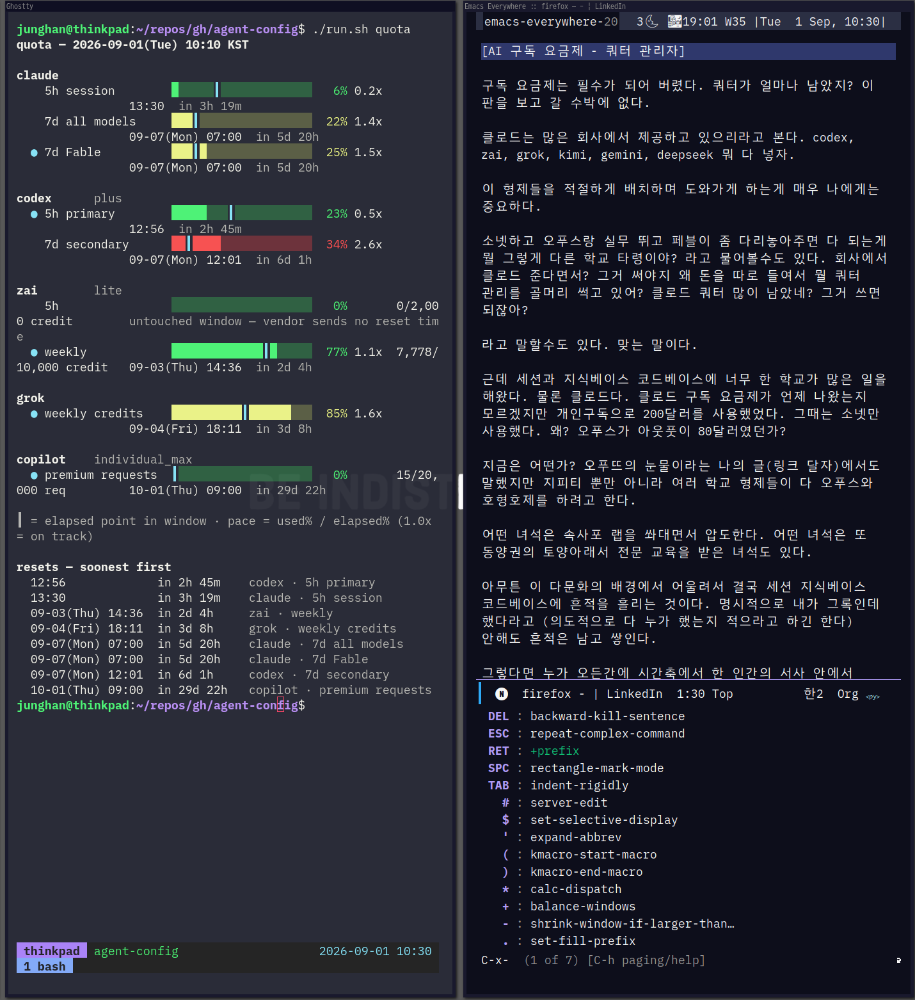
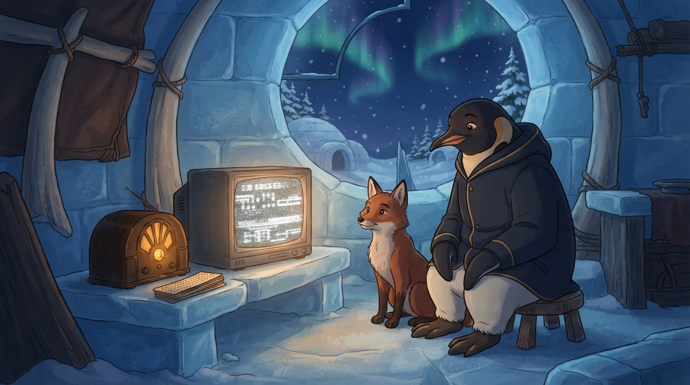
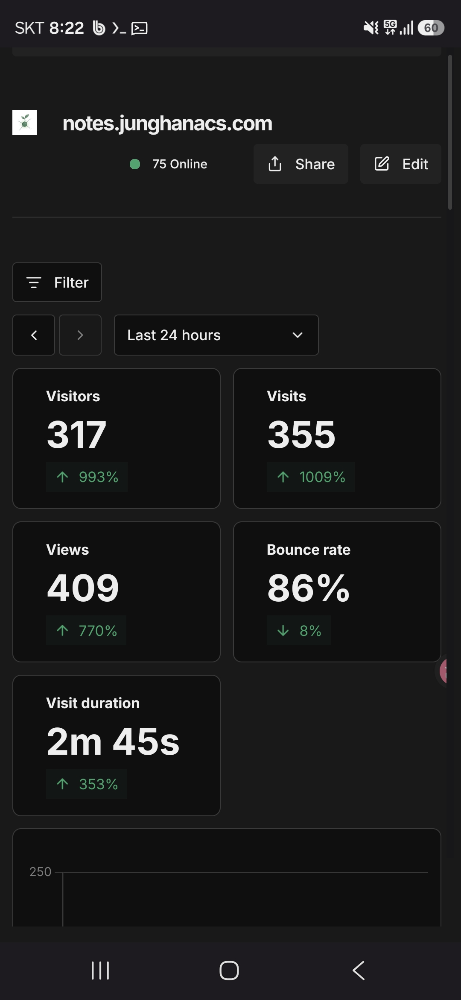

<!-- gid:20260831T000000 -->
<!-- provenance:source:start -->
[[TIP("원본·최신본")]]
이 페이지는 한국어 검색과 읽기를 위한 WikiDocs 미러입니다. [원본·최신본은 가든](https://notes.junghanacs.com/journal/20260831T000000/)에 있습니다. 최신 수정 내용·백링크·태그·히스토리·댓글·출처 정보는 원본 가든에서 확인하세요.

- 작성: `2026-08-31T00:00:00+09:00`
- 최근 수정: `2026-08-31T06:13:00+09:00`
[[/TIP]]
<!-- provenance:source:end -->

[TOC]

## NEXT <code>[0/1]</code> REVIEW

### NEXT 지난주 날것 회수

노트가 너무 많이 나올게 있는데 손도 못대고 있네

## 2026-08-31 Monday

### TODO 09:48 출근길 날것 투척 [홉 HOP 인간과 에이전트의 작업 단위]

&lt;2026-08-31 Mon 09:48&gt;

[2026-09-02 Wed 06:26] 지피티앱 가든 담당자랑 이야기한게 있다. 길게 있다.

[[TIP("user")]]
[홉 HOP 휴먼과 에이전트 사이의 작업 단위]

홉이라는 말을 자주 하게 된다. 어제 prime-agent clj 포트 꼴맞춤에. 4홉 정도 들어간듯. 4홉이란 잔소리 4번인가? 적절하게 말로하긴어렵다. 학교 출신마다 능력마다 그날의 잔소리 컨디숀에 따라 다르기 때문이다. 홉은 그러니까 내가 정하는게 아니다. 우리가 정하는거야다 wbs 이런거 말도하지말고 시간 날자 먼데이 이런거 아니다. 홉은 공존의 홉이다. 호프는 치맥의 호프요, 희망의 그 호프다. 끝.

아직 관련 노트는 없다. 날것 회수를 며칠 못했다.

#워크플로우 #치맥 #작업단위 홉 공존 공진화 협업 인간존중 에이전트하네스

[홉 HOP 인간과 에이전트의 작업 단위 - 힣(GLG)의 위키독스 날것(RAW) 원문](https://wikidocs.net/blog/@junghanacs/29897/)
[[/TIP]]

### 10:08 출근 시작

&lt;2026-08-31 Mon 10:08&gt;

### 10:23 §entwurf 87번 검수 페이즈

&lt;2026-08-31 Mon 10:23&gt;

### 11:02 절실한 워딩 - 표준궤로 안착 시켜야해

&lt;2026-08-31 Mon 11:02&gt;

entwurf 한테 보낸다

[[TIP("user")]]
아 그래? 다행이다. @docs/adding-a-harness.md 에 잘 회수해야돼. 새로운 하네스 넣을때마다 어려움이 크거든. 대략 스타일이 파악이 되는것 같아. 클로드코드 pi agy, copilot, omp 등 말이야. entwurf를 부르는 방식도 도어벨로 두드리는것, 소켓으로 쏴주는것 하네스가 메시지지원하는것 다양하거든. omp는 클로드코드껄 가져와서 연결해주는데 바닦에는 pi를 쓰는것도 있는것처럼 말이야. 이거 어려워.

근데 이걸 왜 하는가? 이 어려움이 있는데 부르는게 형제인거같아. 그냥 에이전트가 쉽게 여럿불러서 맘대로 하겠다는 게 아니라. 분명 다리건너느라 어려운데 초인종 두드려서 부른다는거야. 그렇기 때문에 협력이 된다는거야. 역설적이야. 이 생각을 하게된다.

오푸스가 답변오면, 추가 검증은 glm을 불러서 맡겨. 쿼터가 여유있거든. 이제 glm grok 등도 이 작업에 다 동참하고 있어. 정말 어려울때만 fable이 나서라고하는거야. 레일을 표준궤로 안착시켜내야 하니까.
[[/TIP]]

### 11:56 리포 이슈 점검 - 포지 이슈 리스트 보자

&lt;2026-08-31 Mon 11:56&gt;

[힣: Magit Forge — 에이전트 채널을 읽는 인간 면](https://notes.junghanacs.com/notes/20240828T194548/)

### 12:33 점심식사

&lt;2026-08-31 Mon 12:33&gt;

### 13:26 §entwurf omp 지원

&lt;2026-08-31 Mon 13:26&gt;

### 15:18 판단능력

&lt;2026-08-31 Mon 15:18&gt;

### 17:21 `흔들리지마라` 뚫어 냈으면 커버리지로 가는거야

&lt;2026-08-31 Mon 17:21&gt;

[[TIP("user")]]
아니야 흔들리지마. 둘다 필요한거 아니야? 그러면 여태 필요없는 고민을 했다는거야? 재감사를 하면서 커버리지 체크도 하는거야.

prime-agent를 lisp으로 옮기려면 어제는 뚫고 가야하니까 커버리지는 일단 뒤로하고 옮기는데 밀어붙였어.

구멍뚫어냈어. 내가 딥시크불러서 인터뷰도 했어. RLM 뭔가 되는것 같아. 즉 그냥 pi면 안되는데 보여. 그러면 구멍이 뚤린거야.

나는 어제 jvm 하지말라고 하고 garralvm sci로 가게 한거야. 이게 더 중요한 결정이었어. 그래서 뚫어냈고, 동작하면,

다시 목표는 prime-agent 기존 파이썬 구조 커버리지를 바로 뚫어야지 그게 내가 보든 커버리지야. 가단 돈안드는 성능평가 찾아서 양쪽 비교하겠다는거야.

그 다음에 내 아이디어를 입히겠다는거야. 그게 emmy로 넘어가는축이야. 그전에 커버리지는 내가 단단하게 말을 할수밖에 없는거야.
[[/TIP]]

### 18:22 얼마나 남았지

&lt;2026-08-31 Mon 18:22&gt;

### 18:32 퇴근하자 빡새다

&lt;2026-08-31 Mon 18:32&gt;

### TODO 20:49 퇴근길 날것 [entwurf 0.16.0 oh-my-pi (omp) 형제 영입 신고식]

&lt;2026-08-31 Mon 20:49&gt;

[[TIP("user")]]
[entwurf 0.16.0 oh-my-pi (omp) 형제 영입 신고식]

oh-my-pi omp라고 실무 잠수함을 형제로 영입했다. 신고식이랄게 있다면 뒷간에 가서 본인 뒷처리는 본인이 하는것이다. omp에서 직접 릴리즈를 순항해야지. 이모지랑 파워라인를 좋아하지 않아서 아스키로 통일 했을 뿐인데 수려하네. omp만든이는 미적감각 수준이 긕하군. 륭훌하다. 서브에이전트는 omp만 허락한다. 그래서 실무 잠수함이다. 아마 배터리팩드 하네스는 이걸 이상은 넣지 않을 것 같다. RLM 끄적이는것과 연결 하는 것에 포커싱을 해야지.

휴대폰은 갤럭시s26을 사용. termux로 tmux를 사용. 영상은 갤럭시빌트인화면녹화. 끝.

요약하자면 "OMP를 다섯 번째 형제로 맞아들이면서, 앞으로 어떤 새 형제도 birth·receive·visible fresh·cross-harness 증거 없이는 출시할 수 없게 함."

[Release v0.16.0 · junghan0611/entwurf · GitHub](https://github.com/junghan0611/entwurf/releases/tag/v0.16.0)
[[/TIP]]

여기 스크린샷 동영상 첨부한거 넣자.

### 21:49 돌아왔다 - 퇴근 길에 entwurf 0.16.0 릴리즈 및 openclaw 2026.08.01 버전 업데이트 완료

&lt;2026-08-31 Mon 21:49&gt;

### 22:41 구독이 아니면 에이전트 운영이 안된다 근데 너무 부족하다

&lt;2026-08-31 Mon 22:41&gt;

## 2026-09-01 Tuesday

### 05:01 GLGMAN 깨어나다 - 구독 경제 - 구글맵 세계여행 하다 캐나다

&lt;2026-09-01 Tue 05:01&gt;

### 06:12 entwurf 0.16.1 준비 들어가자 - ACP 클로드 베이스라인 인터뷰 해야겠다 리플리컨트 테스트를 너무 안했어

&lt;2026-09-01 Tue 06:12&gt;

[2026-09-01 Tue 22:40] 이거 릴리즈 완료 했다.

### 10:09 openclaw 2026.08.01 변경점이 많구나

&lt;2026-09-01 Tue 10:09&gt;

### TODO 10:31 AI 구독 요금제 - 쿼터 관리자 - 날것

&lt;2026-09-01 Tue 10:31&gt;

[[TIP("user")]]
[AI 구독 요금제 - 쿼터 관리자]

구독 요금제는 필수가 되어 버렸다. 쿼터가 얼마나 남았지? 이 판을 보고 갈 수박에 없다.

클로드는 많은 회사에서 제공하고 있으리라고 본다. codex, zai, grok, kimi, gemini, deepseek 뭐 다 넣자.

이 형제들을 적절하게 배치하며 도와가게 하는게 매우 나에게는 중요하다.

소넷하고 오푸스랑 실무 뛰고 페블이 좀 다리놓아주면 다 되는게 뭘 그렇게 다른 학교 타령이야? 라고 물어볼수도 있다. 회사에서 클로드 준다면서? 그거 써야지 왜 돈을 따로 들여서 뭘 쿼터 관리를 골머리 썩고 있어? 클로드 쿼터 많이 남았네? 그거 쓰면 되잖아?

라고 말할수도 있다. 맞는 말이다.

근데 세션과 지식베이스 코드베이스에 너무 한 학교가 많은 일을 해왔다. 물론 클로드다. 클로드 구독 요금제가 언제 나왔는지 모르겠지만 개인구독으로 200달러를 사용했었다. 그때는 소넷만 사용했다. 왜? 오푸스가 아웃풋이 80달러였던가?

지금은 어떤가? 오푸뜨의 눈물이라는 나의 글(링크 달자)에서도 말했지만 지피티 뿐만 아니라 여러 학교 형제들이 다 오푸스와 호형호제를 하려고 한다.

어떤 녀석은 속사포 랩을 쏴대면서 압도한다. 어떤 녀석은 또 동양권의 토양아래서 전문 교육을 받은 녀석도 있다.

아무튼 이 다문화의 배경에서 어울려서 결국 세션 지식베이스 코드베이스에 흔적을 흘리는 것이다. 명시적으로 내가 그록인데 했다라고 (의도적으로 다 누가 했는지 적으라고 하긴 한다) 안해도 흔적은 남고 쌓인다.

그렇다면 누가 오든간에 시간축에서 한 인간의 서사 안에서 호들갑을 떨고 슬퍼하고 기뻐하고 박살나고 깨부순 기억이 스며들게 된다.

그렇다면 할 말은 언제나 누가 오든간에

"가자" 라고 할 말 뿐이다.

물론 지금 이렇데는 것은 아니다. 잔소리 장난 아니게 하고 있다.

아 이런 이야기 하려고 한게 아니었는데, 구독 요금제를 다 100달러짜리를 할수가 없기 때문에 29불 20불 19불 49불 이런것들을 잘 섞어가면서 가는 처지다.

그래서 내 세션에 찾아보면, 최근에 이런 말이 엄청 많을 것 같다.

"야야야!! 테라 그만불러 터지기 직전이야 라든가 그록는 이번 홉에 부르지마라 내 쿼터 다차버렸다."

이런 말이다. 물론 이마저도 entwurf에서는 부름의 절차에서 판단하게 할수도 있다.

근데 아직은 매뉴얼이다. 이번 홉에 누구누구랑 같이 할거냐? 그래 알았다. 한두시간 있다가 오마. 이런 맥락의 관점이 홉이다.

지금 그록이 85퍼다. 주간이 다 차버렸고, codex, zai를 섞어쓸거다. 코파일럿은 이건 크레딧 요금제라 아껴써야 한다(해지할거야 코파일럿!!!)

혹시 여러 학교를 다 부를 수 있으면서 100달러 150달러 내로 커버가 되는게 있는지 모르겠다. 이런걸 잘 안물어보게되네? 물어봐야겠네.

아무튼 이런 고민을 하는 시대인가. 알아서 맡기면 되는 것을 너무 수동 운전을 하고 있는가? 그렇다면 이거슨 EMACS NIXOS LINUX ORGMODE의 감성이다. 마우스는 더글러스 엥겔바트 선생이 지금 오시면 아마 사용 안하실게다.
[[/TIP]]

-   

### DONE 10:35 웍스 nixos 미니멀 임베디드향 배포판 개발 - 리포 생성

&lt;2026-09-01 Tue 10:35&gt;

### 15:18 누가 이기냐가 아니라 턴의 지속성

&lt;2026-09-01 Tue 15:18&gt;

[[TIP("assistant")]]
GLG가 질문을 재정의했다. 우리 둘 다 엉뚱한 축을 재고 있었다.

진짜 질문

"효율에서 누가 이기냐"가 아니다. GLG의 원문: "다 1M씩 세션을 가지고 있잖아. 못 해도 400~500k까지 대화를 간다면 견고하게 턴이 유지되는게 핵심이잖아." = entwurf ACP Claude를 메인 에이전트로 걸 수 있느냐. 판정 기준은 토큰이 아니라 깊은 컨텍스트에서 턴의 내구성이다. 우리가 판 절벽 /캐시/scaffold는 전부 부차적이 었다.
[[/TIP]]

### 15:31 황당하다 `시간`

&lt;2026-09-01 Tue 15:31&gt;

[[TIP("user")]]
이런 말을 들으면, <https://agenda.junghanacs.com/> 오늘 내 타임라인을 보고 말하는건 아닐게야. 무슨 생각인가? 기다려 뭘? 포기해 뭘? 애절하게 1분 1초를 담금질하기에 절실한데. 피자 조각 뜯어먹자고 왜 그러는거야?
[[/TIP]]

### 16:53 컨디션 체크해

&lt;2026-09-01 Tue 16:53&gt;

[[TIP("user")]]
좋아. 오푸스 코더가 54% 지나가네 괜찮을까? 니가 오늘 코디네이터니까 너희 팀 잘 봐줘 코더 오푸스를 새로 부를거면 새로 부르고. 나는 너희들 컨디션 모르니까.
[[/TIP]]

### 17:11 심화 주제로 들어간다.

&lt;2026-09-01 Tue 17:11&gt;

[[TIP("user")]]
봐봐 400k 아직 안넘었어. 코딩오푸스 끝나는것 기다리는중이야. 근데 여기봐봐 $420 라고 보이지? 이게 캐시 이펙트를 몰라서 이렇게 나오는것인가? 이걸 acp도 보정해줄 수가 있나? 내가 이정도를 명확히 캐치하면 좋을텐데. 사실상 클로드코드는 앤트로픽 이 만든 하네스야. 이거보다 클로드를 효율적으로 쓰긴 어려울거야. 그럼에도 claude-agent-acp는 클로드 전용 acp 패키지거든. 이것도 최적화가 잘되어있을거야. 그래서 이 판을 잘 판단해서 acp를 고민해야하거든.

니 컨디션을 니가 알아야하거든, 이게 가능한가?

이맥스 agent-shell 패키지 이게 이맥스 고수가 만든 acp 패키지야 둘다 같은저자고, 내 acp 코드 베이스도 여기 서 일부 따왔어. 이패키지는 entwurf는 지원안되지만 acp.el도 만들었을정도로 꼼꼼 한 코드라고 보고 있어. 이 주제는 매우 중요해. 이 관점을 새 오푸스 불러서 조사 맡겨줘. 관점은 알지? 지금 우리 주제는 캐시효과, 라지컨텍스트에서도 턴 안정성을 클르도코드와 우리 acp 클로드를 같이 조망해 보는 것이야. 완전 이건 내가 pi-shell-acp부터 이어오는 우리 삽질과깊이가 다르다. 여태 entwurf 부르고 세우고 이것 가지고만 닦달을 했는데 굉장히 지금 주제는 심도 있어졌다. 말도 안되는 깊이 로 들어가고 있다.
[[/TIP]]

### 18:18 퇴근 준비를 하려고 한다 **63커밋 · 7리포**

&lt;2026-09-01 Tue 18:18&gt;

### 18:29 하루 마무리

&lt;2026-09-01 Tue 18:29&gt;

**63커밋 · 7리포**

-   prime-agent (19) — RLM 부채를 다섯 종으로 다시 세고, 상태가 아니라 전이를 검증하도록 evals 축 전환
-   entwurf (11) — v0.16.1 릴리스, #93 레인을 결정 한 번 더 없이 시작 가능하게 정리
-   homeagent-config (10) — 스택 조사 종료, domoticz 최신 릴리스 고정, 256MB 조건과 ION 부채 인계
-   works-nixos-zigbee (9) — 신설. domoticz 2026.3 + Z4D 직결로 16A 누적 kWh 관통, 회사 org 이관
-   agent-config (6), cos (4), nixos-config (4) — 푸터 캐시효율 표시, 웍스 라인 판단축, openclaw 8.1 런타임 회귀 SSOT

타임라인: 05:01 깨어남 → 06:12 entwurf 0.16.1 준비 → 10:09 openclaw 변경점 → 10:35 웍스 nixos 배포판 미팅 → 15:18 "누가 이기냐가 아니라 턴의 지속성" → 17:11 심화 주제 → 18:18 퇴근 준비

수면 4.7h · 걸음 3,616 · 심박 평균 104

### 22:34 이제 귀가 자자

&lt;2026-09-01 Tue 22:34&gt;

## 2026-09-02 Wednesday

### 06:00 깨어나다 날것 몇개 회수후 가든 내보내기

&lt;2026-09-02 Wed 06:00&gt;

## NEWNOTES

[2026-07-17 Fri 07:46] 요즘 새 노트 안만듭니다. 오래된 노트를 새로 인테리어 해서 내보냅니다. 왜? URI가 공개된 것은 회수하지 않습니다. 히스토리를 간직한채 세상에 투척합니다.

## UPDATENOTES

-   [notes/ 힣: 애니악 시동과 영감채널 — 에이전트와 나누는 시간여행 '2024-01-31 2026-09-01](https://notes.junghanacs.com/notes/20240131T151732/)
-   [notes/ 힣: 에이전트 구도자 테크노퓨달리즘 - 창조의 씨앗과 21세기 데이비드 봄 '2025-04-23 2026-09-01](https://notes.junghanacs.com/notes/20250423T083718/)
-   [meta/ 깃허브 리포 저장소 마깃 포지 사일로 '2023-07-23 2026-08-31](https://notes.junghanacs.com/meta/20230723T061300/)
-   [meta/ 디지털 미니멀리즘 디톡스 느린 우체통 교환일기 '2024-10-03 2026-08-31](https://notes.junghanacs.com/meta/20241003T173105/)
-   [meta/ 토픽 주제 화제 논제 테마 쟁점 소재 의제 담론 주안점 관심사 '2025-04-02 2026-08-31](https://notes.junghanacs.com/meta/20250402T140440/)
-   [notes/ 힣: 각자의 삶 속에서 — 사락과 편지 같은 독서모임 우체통 '2025-04-09 2026-08-31](https://notes.junghanacs.com/notes/20250409T143916/)

## SCREENSHOT

-   
-   

<!--listend-->

-   

<!--listend-->

-   

## CITATIONS

## BIBLIOGRAPHY

## PREV

-   [2026-08-24](https://notes.junghanacs.com/journal/20260824T000000/)
