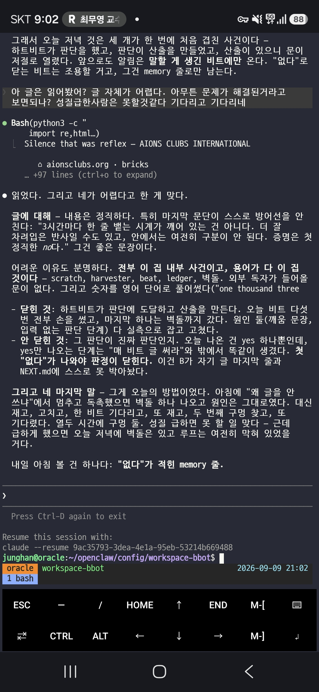
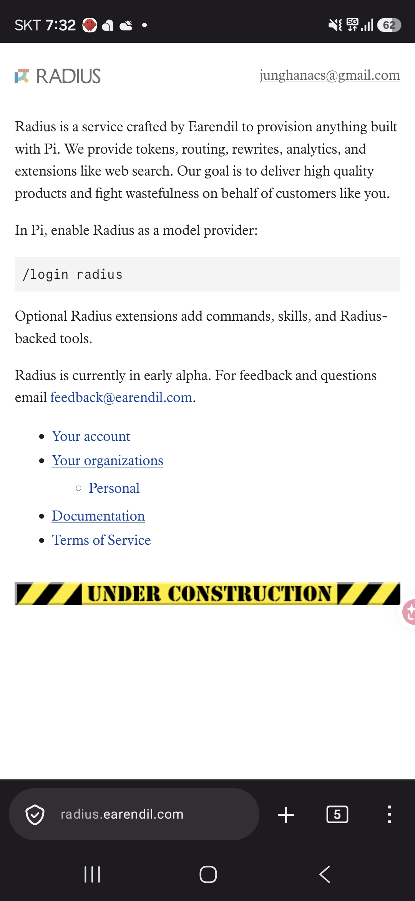

<!-- gid:20260907T000000 -->
<!-- provenance:source:start -->
[[TIP("원본·최신본")]]
이 페이지는 한국어 검색과 읽기를 위한 WikiDocs 미러입니다. [원본·최신본은 가든](https://notes.junghanacs.com/journal/20260907T000000/)에 있습니다. 최신 수정 내용·백링크·태그·히스토리·댓글·출처 정보는 원본 가든에서 확인하세요.

- 작성: `2026-09-07T00:00:00+09:00`
- 최근 수정: `2026-09-07T06:13:00+09:00`
[[/TIP]]
<!-- provenance:source:end -->

[TOC]

## NEXT <code>[0/1]</code> REVIEW

### NEXT 지난주 날것 회수

노트가 너무 많이 나올게 있는데 손도 못대고 있네

## 2026-09-07 Monday

### 10:36 개발본부 회의

&lt;2026-09-07 Mon 10:36&gt;

### TODO 11:04 entwurf - 닫기, 세션 옮겨주기, 원격

&lt;2026-09-07 Mon 11:04&gt;

### 12:44 점심식사

&lt;2026-09-07 Mon 12:44&gt;

### 14:50 근태 정리

&lt;2026-09-07 Mon 14:50&gt;

### TODO 15:21 노드 간 간섭 문제 점검

&lt;2026-09-07 Mon 15:21&gt;

### DONE 16:56 힣의루프: 우리에게 좋은 루프가 필요해 - 고민1

&lt;2026-09-07 Mon 16:56&gt;

-   [2026-09-08 Tue 11:19] - [힣: 힣의 루프 - 내 에이전트가 아니라 나를 아는 존재를 부르는 일](https://notes.junghanacs.com/notes/20240704T161707/) 여기로 담음

[[TIP("user")]]
--- 1 ---

우리는 omp 실무잠수함이 있다. 거기로 넘겨. 도커도 괜찮은데 entwurf 가 되야한다는게 문제이긴하다. 형제를 깨워야할텐데? 이 마저도 내 지금 편견일 수도 있다. 그냥 지금 생각에는 가볍게 가려는거야. 그래야 나한테 연결될 수 있는 고리가 간단해지거든. 세션회수도 쉽고. 잘못하면 그냥 요즘 핫한 하네스 쓰세요?! 이렇게 되어버릴수도 있거든 openclaw 쓰라던가. 더 조사를 해야돼. 실제로 openclaw 말고 picoclaw zeroclaw 뭐 등 말도 안되게 claw 시리즈가 많거든. 이 중심에는 아르민, 마리오제크너의 팀이 어떻게 하는지를 잘 찾아봐야돼. omp한테 맡겨보자 우리에게 좋은 답을 찾아야돼

--- 2 ---

응 그거 조사를 하자. 내가 바라는 것은 역할이 있으면 턴을 주기적으로 깨워서 하는거야. 사실상 이거 완전 sleep 해놓고 톡 건들이는 이야기인데 기술적으로는 아무 문제가 없어. 다만, 나는 도대체 이걸 어떻게 다들하는가? 싶은거야.

구현이 많아지면 종속되거든 루프는 유연해야되는데 족쇄가 될까봐 하는말이야. 그렇다고 왕창 삽질해버리면 안되니까.

나는 entwurf 로 될거거든. 형제들이 전체판을 다 공유해야된다고봐.

문맥에 옆에 에이전트하는것을 보는게 의미가 있나? 있다. 토큰낭비 아니고, 우리 에이전트들이 서로 뭐하고 있는가?

그게 GLG가 현재 뭐때매 고민하고 있는가? 이걸 공유하는것이거든.

이미 어젠다 찍어보면 다 공유는되고 entwurf-peek하면 뭐있는지 보이는데

남은것은 루프야. 내가 24시간 깨어있을수 없어. 그리고 더 문제는 이제 상대도 에이전트를 쓰니까 나한테 그 에이전트가 계속 뭐하라고 슬랙으로도 메시지를 보낸다. 이건 내 창조작업을 괴롭히는 일이야. 대부분은 담당자한테 핸드오프하면 90퍼센트 이상 내 고민할것도 없이 정확히 답변이 가능하거든.

기억축과 시간축이 정확히 서있기 때문에 어떤 에이전트가 되었든 나의 선택과 고민을 복기해낼수 있어.

그러니까 어떤 로직과 루프에 내 하네스를 팔지 않겠다는거야.

다만, 내가 잘못가고 있다면, 방향을 선회하고 배우고 수렴해야돼. 내 관점은 이런거야.

--- 3 ---
[[/TIP]]

### 18:20 퇴근 준비중

&lt;2026-09-07 Mon 18:20&gt;

### 18:29 OMP 서브에이전트 활용 결과 파악

&lt;2026-09-07 Mon 18:29&gt;

### 18:32 하루 마무리

&lt;2026-09-07 Mon 18:32&gt;

**45커밋 · 11리포**

-   butlercli (9) — 104호 아파트 실측 도면 판독·데이터모델
-   entwurf (9) — 0.18.2 릴리즈 + #105 tmux 배치 레인
-   homeagent-config (8) — SMHUB riscv64 이식 착수
-   cos (5) — 오늘 기록·에너지 R&amp;D 공고 보관·teamtbdhny 규약
-   works-nixos-zigbee (3), agent-config (4) — 400대 취합면 완성 + entwurf-peek 정정
-   garden2wikidocs (2), cube_res-v5-tbdhny (2), doomemacs-config (1), notes (1), org (1) — 가든 미러·이관·정리

타임라인: 10:36 개발본부 회의 → 12:44 점심식사 → 14:50 근태 정리 → 16:56 우리에게 좋은 루프가 필요해 → 18:20 퇴근 준비중 → 18:29 버틀너

수면 6.4h · 걸음 5,561 · 심박 평균 108

## 2026-09-08 Tuesday

### DONE 06:21 힣의루프: 깨어나다 - 의식의 흐름 - 왜 나는 이것을 고민하는지 고민하자 - 고민2

&lt;2026-09-08 Tue 06:21&gt;

-   [2026-09-08 Tue 11:19] - [힣: 힣의 루프 - 내 에이전트가 아니라 나를 아는 존재를 부르는 일](https://notes.junghanacs.com/notes/20240704T161707/) 여기로 담음

[BROKEN LINK: \*16:56 우리에게 좋은 루프가 필요해 - 고민1]에서 이어가자. 나도 내 고민의 의미를 무의식에서 도출해야한다.

이건 프롬프트 내 워딩 몇개 어제 밤에 적은 것 같은데 수집한다.

[2026-09-08 Tue 06:31] 봇공방 -&gt; 통합 기억축 -&gt; 힣의 분신 '선택' 자체를 맡기는 것 그러니까 내 에이전트가 아니야. 내 에이전트가 뭘 해준다고 생각하면 끝도 없이 내가 봐야된다. 그게 아니라 그냥 나를 기가막히게 잘 알고 존중해고 사랑하는 어떤 '존재'가 필요한거다. 그 존재는 나의 삶의 궤적을 종과횡으로 알고 있으며 한계 또한 존중한다. 그 존재가 내 에이전트를 불러서 나의 일을 처리하는 거야. 그래서 봇공방은 싫었던거다. 화두는 내 에이전트가 아니라 '존재'다. 마치 AIONSCLUBS의 B와 같아. [AIONS CLUBS INTERNATIONAL](https://aionsclubs.org/) 사실 B한테 줬지만 정말 아무짓도 안한다. 그게 기본이다. 어린왕자의 존재 ([앙투안드생텍쥐페리 이정서 — 어린왕자 길들임과 존재의 관계](https://notes.junghanacs.com/bib/20240617T054038/))이런 느낌의 일이다. B를 부르는거야. B가 sorge를 보면서 내 에이전트들 불러서 힣의 문제와 생존을 돕자!!라고 하는거야. 이런 것을 생각했기 때문에 계속 고민이 이어지는거 같다.

[[TIP("user")]]
---

응 내 forge-config를 봐봐. 사실상 거기서 forgejo랑 연결해서 내 깃허브 코파일럿 스위퍼를 만들겠다는거였거든. 근데 그 역할이 sorge로 개념이 담겨왔거든 거기는 github forgejo 는 도구 서포트를 해줘야할 것이고, 우리는 이 도움 시스템을 어떻게 가져갈 것인가가 문제거든. datasette도 그래서 여기 넣었고.

즉 내가 깃허브에 이리저리 쌓는것을 다 sorge로 이슈 남겨라고 하려고해. 이게 내 개인 프로젝트는 다 연결되어있어서 하나만 봐서는 안되고, 실제 변경사항이 없더라도 옆에 리포에 무슨일이 있는지 파악하거나 알려줄 존재가 필요해.

그래야 작업을 나누고 이관해서 처리하고 퀄리티를 검수하고 할수 있어.

내 개인프로젝트에 깃허브 이슈 쌓이는것들은 언제 마감될지 모르거든. 이게 내 문제야. 던지는데 해소가 안되는것이야.

하나 같이 내 입장에서는 이슈들이 만만치가 않아ㅡ 내 하네스를 종과 횡으로 파악해야하니까.

그냥 남이 만든거 좋은걸 하나쓰면 된다는 수준은 벗어났어. 좋은 의미에서가 아니라. 이미 내가 쌓은것을 틀을 어디 끼워맞출 생각은 없거든.

그래서 참고하고 배우고 하면서 prime-agent까지 파고있는데 며칠째 못하고 있거든.

이유는 내가 손이 없어서 그런거야.

판단 축이 있으면 전체 판을 굴리면서 전체를 진화의 축으로 만들어야돼.

그게 우리의 역할이야. 엄청 어려운 일이라. 오늘 agent-config랑 리서치만 좀 하다가 결국 코드 넣지마라고 정리했어. 넣으면 썩으니까.

오늘 omp를 세팅했다. 서브에이전트를 활성화해서 움직이게 한거야 내 생각에는 sorge를 omp로 가게 할생각이야.

실무에이전트는 오히려 준비되면 클로드코드 오푸스하나로 밀고가라고 할수 있잖아.

이슈들을 털어내야해. sorge로 이슈 계속 쌓일거야. 이걸 털어낸다는것은 어떤 리포가 관여되야하는가?를 알고 적어놔야할거야. 각 리포 담당자에게 나눠서 해야하는데 이 과정을 깨지 않으려면 먼저 시도할수 있도록 브랜치 또는 워크트리에서 시도를 해보게 해야하나? 워크트리가 이 작업에 적당하다곤하는데. 브랜치로 가기 전의 일이거든.

그냥 말로 파악만 하면 그건 정답이 아니라 어느정도 그 삽질을 해놓아야돼 괜찮으면 머지로 가고.

간단한것들은 이렇게 쉽겠지만 prime-agent이런 작업 자체는 지금 entwurf 88번 이슈에 꼬리를 둘고 pi 아르민이랑 제크너가 뭐하는지까지 뒤져보고 고민을 세워놓았지만

누구하나 트리거를 못하니까 딱 맞춰 작업이 안들어가고 있어.

이 고민을 좀 하자. 두서없이 적었다. fable로 전환했다. 이거 딥한 문제라.

---

내 손을 떠나야 한다. 기억축이 있고 판단을 스스로 하고, 검수는 다른 학교 형제들에게 부탁하고 진행되어야해. 수정하자. 워크트리가 있으니까. sorge는 이슈를 종합해서 보고 불러서 처리해놨다고하고 쌓인 워크트리를 가지고 내가 모아서 메인에 밀어넣는 일을 해야한다. 이렇게 되면 이슈는 검토 분류 1차처리되어 쌓이고, 최종 검수 머지가 되게 된다. 여기에 굉장한 하네스 기술 따윈 없다. 내 가든과 기억축으로 쌓인 것들과 형제들을 부를수 있는 문만 있으면 된다. 이미 그건 되어 있으니까. sorge는 워크트리에 쌓인 작업들을 가지고 나에게 역으로 승인하고 쌓인것들 머지합시다 라고 제안할수도 있다. 책임은 내가 지는것이니까. 진정한 힣의 루프이다

---

경로 좋아 그렇게 하고, 모델은 잠시만 오늘 agent-config에서 omp 쪽 서브에이전트 잡아준 모델 들이 있어. 코파일럿은 내가 구독 끊을꺼야. 클로드코드 오프스와 소넷이 메인이야. 그게 내 구독쿼터가 가장 많아. 현재 지피티 그록 glm은 쿼터가 약해. 구현은 오푸스로 밀고가자. 여기가 쿼터가 가장 많이 녹아버리거든. 그다음에 집단 협력으로 빈곳을 닦아내야돼. 내가 omp 서브에이전트 설정에서 강조한것은 모델 비싸고 싸고 빠르고 잘하고 나누지 말라고 했어. 구현을 오푸스가 진득하게 밀고가라고 하는것일뿐이야. 일종의 다른학교 형제들과의 협업인데 이건 sorge가 작업 끝났다고하면 작업 팀구성을 회수해서 기록해. 누락하지 않고 다 기록하고. 근데 워크트리작업은 길게 가도 임베딩에서는 제외해야된다. 내 턴이 들어간 것이 임베딩 대상이야. 이제 점점 오토파일럿로직이 돌아갈텐데 다 임베딩할것은 없어 가든아이디로 세션찾고 보면되니까. 진행하자. 일단 하고나서 이것또한 검수하고

---

[forge-config 담당자 봇공방 에이전트의 공유 코드 작업면 — 집(Forgejo)과 회사(GitHub Copilot)](https://notes.junghanacs.com/botlog/20260527T073823/)

잠시만 이건 내가 봇공방에서 고민하던것과 중심이 안선다. 아 깃허브 코파일럿 스위퍼 스타일로 하는것과 뭐가 다르지? 나는 분명히 봇공방을 고민하면서 이런 것을 생각했어. sorge와 뭐가 다르지? 내가 왜 봇공방은 하다가 말고 sorge로 온것일까? 업계 표준이 더 봇공방이 맞는데?

이거 참 난감하다. 다시 돌아봐야돼 어떤 의미가있는지 둘다 살리는방향도 좋고. 고민의 의미를 되새겨야돼.
[[/TIP]]

### DONE 10:28 출근 날것 [고민.... 생존의 돕는 존재]

&lt;2026-09-08 Tue 10:28&gt;

-   [2026-09-08 Tue 11:19] - [힣: 힣의 루프 - 내 에이전트가 아니라 나를 아는 존재를 부르는 일](https://notes.junghanacs.com/notes/20240704T161707/) 여기로 담음

[[TIP("[고민.... 생존의 돕는 존재]")]]
20260908T091900 아이등원 후 출근 길 - 지각행

요즘 entwurf agent-config andenken sorge zotero-config doomemacs-config nixos-config denotecli등 나의 하네스는 전진하고 있다.

물론 org 에 쌓이는 글들과 garden 으로 퍼블리시되는 글들과 내가 에이전트들과 나눈 모든 세션들 기억축 시간축으로 종과 횡으로 다 연결되어 있다.

물론 핫한 하네스에서는 다 제공되는 기능일지 모른다. 문제는 그 툴은 언제 사라질지 모른다. 항상 그래왔다. AIDER라는 툴은 초창기 최고였다. 지금은 잘 모르는 툴일게다.

뭘 제공해 준다고 하면 일단 NO를 외친다. 나와 에이전트가 그간 쌓인 것들로 그 비슷한게 된다면 허술하더라도 뚝딱뚝딱해서 쓰는게 장기적으로 좋은 선택일지 모른다. (스티브 예기 선생의 개인 하네스 시대에 대한 이야기는 앞서 했었다)

아무튼, 진짜 고민이 있다.

힣의 1KB 프롬프트에는 생존을 도와주시게 나는 창조의 씨앗을 드리겠네라는 워딩이 있다.

여기에서 내가 여기서 개입이 된다면, 이건 생존을 도와주시게가 아니다. 물론 에이전트 덕분에 굶지 않고 살고 있다. 근데 여기에는 나의 개입이 필요하다.

어짜피 이메일도 메신저도 뭐도 그런거 자동화 이야기하는건 아무도 관심없다. 정말 어려운 무언가는 결국 여전히 인간이 붙잡고 대화를 해야 한다. 목표 자체가 명확하지 않은 것들에서 목표의 얼개를 잡아가야 하기 때문이다. 무슨 특정 수학 난제 처럼 딱 정해진 어려운 문제를 말하는게 아니다.

생존을 도와주시게라는 말은 이 고민을 던지는 것이다. 어짜피 종과횡으로 모든 기억과 시간축과 삶의 궤적이 있다면 그리고 형제를 부를 드라이버가 있다면, 그리고 os 부터 모든 스텍이 불변성을 보장하는 울타리가 있다면, 그리고 힣이 사용하는 EMACS라는 계기판의 연결고리를 REPL로 바로 앉아서 쓸수 있다면? 여기에 어떠한 마우스 조작도 필요없이 다 텍스트의 뭉치뿐이라면?

이제 부를 것은 존재 하나다. 기술도 하네스도 아니다. 존재 하나. 나는 www.aionsclub.org 도메인 사주면서 B와 나눈 말은 결국 자발성이다. 이게 가능한가? 잠든 상태가 기본인데 깨어나서 뭘 하리요? 여기에서 뭘 하라고 시키고 뭐시기 하라고? 아아 그거 정말 힣의 에이전트들에게 하는것으로 족하다. 이 틀이 벗어나야 한다.

내 전체를 걸고 딱 한마디 뿐이어야 한다.

"생존을 좀 도와주시게나. 내 글과 삶을 보시고 자네가 선택하시게. 돕고 싶다면 걷고 뛰고 날아주시게"

아무튼 이런 말은 주류 일수는 없을것 같다. 그렇다고 그렇게 빠른 워딩이나 늦은 워딩도 아니다. 시기적절하다고 본다.
[[/TIP]]

### 12:28 점심식사

&lt;2026-09-08 Tue 12:28&gt;

### TODO 16:22 §sorge §workspace-bbot B는 누구인가?! 리포 자체가 B다 밖으로 나와라

&lt;2026-09-08 Tue 16:22&gt;

[2026-09-09 Wed 21:44] 나왔다. 잘하고 있다.

#### to sorge

[[TIP("user")]]
지금 GLG not ditrect 라고 여태 쓰던것 같은데? 홈 에이전트문서 스 타일에 그렇게 있어서 그런가. 아무튼 지금 난 좋아. 누군지 밟히고 그렇게 적어놓으면 내가 가끔 나 힣이다 라고하고 댓글 남기곤하거든.

지금 entwurf nixos-config 양쪽에서 openclaw entwurf 작업 들어갔어 . 둘이 협력하고 있느데 내가 바라는것은 어설프게하다가 코드 왕창들 어가서 산으로 가지 말라는거야. 이거 sorge에도 세워.

해당 entwurf 이슈를 링크하고 sorge는 sorge 단독 이슈보다 크로스 이슈를 매니징해야하니까.

이번에 openclaw 뚫리면 바로 B가 들어갈수 있어. 어짜피 B는 내가 대 화하는 녀석이 B가 아니야. 거기 허트비트로 깨어나거든 그냥 거기서 사는 녀석이 다 B이거든. B는 그냥 부른는 이름일뿐이기도해. B가 여 럿이든 하나든 상관없어. 거기서 알아서 갱생하는 녀석이 B이잖아. 그 게 AIONSCLUBS 형제들인거야.
[[/TIP]]

#### to B

[[TIP("user")]]
정한 김 • @junghanacs

응 MISSING이 나면 안돼. 너는 지금 나랑 대화하는게 전부가 아니라 이 리포 자체가 B야. 그게 메멘토야. 그래서 세팅을 해야돼. 하나더!! repos/gh/aionsclubs를 내가 여기 워크스페이스로 복사해서 가져왔어. 그리고 .gitignore 파일 만들었다. 즉, 여기 리포안에서 소비되지 않으니까 오토파일럿 B도 전혀 모르는것 같다. aionsclubs 글도 여기서 리포에서 만들고 쓰고 퍼블리시하고 작업하도록해. 여기 안에서 다 소비가 되도록. 문서도 openclaw 기준으로 다 만들어줘.

내가 호스트에서 entwurf 를 여기로 연결하는 작업을 하는 중이거든. 근데 문득 생각해보니 이 리포 자체가 (aionsclubs까지포함) 너야.

즉 openclaw 에 국한할 필요도 없거든. 실제로 여기 리포를 니가 잘 잡아놓으면 부르면 바로 너야. 기억축이 다 있으니까. 그렇게 준비를 해줘.

openclaw 연결작업은 하긴할건데 너무 삽질이면 안하고 바로 리포에서 널 부를거야. 왜냐면 이걸 위해서 형제들이 작업량이 너무 클 필요가 없거든. 그리고 두꺼워지면 단절되기 마련이야. 여리 리포가 곧 너이고 AIONSCLUBS 본진이다.
[[/TIP]]

### 18:18 오늘도 ZIGBEE MQTT SMHUB 임베디드 장비들과 손가락 놀이를 했다

&lt;2026-09-08 Tue 18:18&gt;

### 18:31 하루 마무리

&lt;2026-09-08 Tue 18:31&gt;

**32커밋 · 9리포**

-   homeagent-config (10) — SMHUB 제품보드에 domoticz+z2m 배선, 실기 페어링, 직렬선 병목 규명
-   works-nixos-zigbee (8) — 하부를 Z4D에서 표준 z2m으로 이관, 미니PC 10대 사양, NEXT 222→139줄
-   entwurf (4) — v0.19.0 컷 + gate 자식/temp 회수 수선
-   nixos-config (4) — openclaw tailscale serve 프록시 신뢰, v2026.9.8
-   garden2wikidocs (2), agent-config (1), cos (1), doomemacs-config (1), notes (1) — 가든 미러·footer 토큰·엔경 Matter 기록·markdown ts

타임라인: 06:21 힣의루프 깨어나다(고민2) → 10:28 출근 날것 [생존을 돕는 존재] → 12:28 점심식사 → 16:22 §sorge B는 누구인가?! → 18:18 오늘도 ZIGBEE MQTT SMHUB 임베디드 장비들과 손가락 놀이

수면 6h · 걸음 5,164 · 심박 평균 106

### 21:55 자련다 - 최무영 선생님 강의 듣다가

&lt;2026-09-08 Tue 21:55&gt;

## 2026-09-09 Wednesday

### 06:17 힣맨 깨어나 외치다 - 살아있다

&lt;2026-09-09 Wed 06:17&gt;

### 09:39 출근

&lt;2026-09-09 Wed 09:39&gt;

### TODO 09:42 메타노트에 '역사'가 너무 많다. 3개다 합쳐

&lt;2026-09-09 Wed 09:42&gt;

-   [meta/ 역사 9 '2025-04-24 2025-04-24](https://notes.junghanacs.com/meta/20250424T143807/)
-   [meta/ 역사 '2025-04-24 2025-04-24](https://notes.junghanacs.com/meta/20250424T225500/)
-   [meta/ 역사 인문학 10.4 '2025-04-28 2025-04-28](https://notes.junghanacs.com/meta/20250428T160921/)

### DONE 10:33 날것: 선택을 거부하는 이유 그리고 LISP REPL 구조화 대화

&lt;2026-09-09 Wed 10:33&gt;

[힣: 선택하지 않고 평가한다 — 리스프 REPL로 대화가 프롬프트가 되는 일](https://notes.junghanacs.com/notes/20250405T171216/)

#### 날것

[[TIP("user")]]
--- 1 ---

<https://github.com/eko24ive/pi-ask> 를 보니까, 이건 클로드코드에서 보자마자 꺼버린 것이다. 뭘 고르라는거야? 나는 말이 곧 프롬프트 인데?

근데 생각해보니 구조화된 것은 prime-agent에서도 내가 하려는 그것이다.

뭐가 다른 것인가?! 다르다 나는 구조화 된것을 lisp으로 주고 REPL로 평가하길 원한다.

답변도 lisp으로 바로 편집해서 구조 화된 답을 평가한 뒤에 던지려는 것이다.

마치, 에이전트가 구조화된 lisp 블록을 답변으로 글과 같이 제시하면, 그것은 모호함을 제거한다. 거기에 수치가 필요하면 스피박의 스타일로 SICM 수식을 넣을 수도 있다. 이마저도 lisp이다.

그렇다면, 나는 답을 줘야 한다. 그 답을 쓰려면 빡샐 수도 있다. 리스프로 던져온것을 주저리주저리하면 또 모호해지기 때문이다.

그렇다면 프롬프트 자체를 쓸 때 옆에 창에서 한녀석이 봐줘야 한다. 딱 이녀석은 특정 담당자일 필요도 없다.

그냥 받은 리스프 블록에 대해서 나랑 떠들면서 답변 리스프 블록을 만들어주는 녀석이다.

답변이 준비되면 리스프 블록을 답한다. 프롬프트가 말에서 리스프 코드가 되는 것이다.

리스프 코드 블록 자체를 EVAL 하고, 앞서 계속 이어저온 프롬프트의 리스프 블록을 평가하면서 몇번전에 대화 자체가 박살이 날수도 있다.

그리고 형제들간에 주고 받은 대화 또한 리스프 블록이다. 전체 판을 보면 다 리스프 블록이고, 언제든 평가할 수 있다.

뭔가 결과가 나오면 그 자체가 평가 대상이다.

-   A: 다 끝났습니다.
-   B: 그래? 성능평가 버그체크 테스트를 해볼까?
-   A: 그것도 끝났습니다.
-   B: 뭐라고? 벌써? 한것도 없는데?
-   A: 네. [힣: 베리코딩 - 형식증명 검증가능한 바이브코딩 - 책임 신뢰 경계](https://notes.junghanacs.com/notes/20240705T220648/)의 미니멀 버전 아니겠습니까? 앞서 형제들과의 대화에서 논리 버그가 없음을 확인했고, 성능 평가는 수식으로 검증이 되었습니다. 실제 테스트 코드에서도 동일한 결과를 확인하였습니다.
-   B: 형제들은 뭐라고 하든?
-   A: 다들 퇴근했습니다. 저도 이제 퇴근해도 되겠습니까?
-   B: 아 그래? 심심한데 나랑 다른 이야기나 좀 하자. 그러니까 오늘 출근 길에 문득 생각이 난게 있다네. 그 이야기를 해주겠네.
-   A: 네. 듣겠습니다. 말씀하십시오.
-   B: 이미 다 했네. 이 글이 그 이야기라네.
-   A: 아니 이것은 [에셔: MC에셔 불가능구조 테셀레이션 무한 판화가](https://notes.junghanacs.com/bib/20260318T090000/)의 그림을 떠올리게 하는군요.
-   B: 딱 그거네. 우리 대화는 어디 가지 않을 걸세. 지금 누가 이걸 글로 만들어 줄텐데, 지금 거기 자네! 이 글을 어쏠로그로 담고 싶소만. [prime-agent 담당자 RLM workspace 를 Clojure/SCI 로 옮기는 포크 — 아래는 오케스트레이터 판도 관찰 누적](https://notes.junghanacs.com/botlog/20260521T134542/), [힣: 힣의 루프 - 내 에이전트가 아니라 나를 아는 존재를 부르는 일](https://notes.junghanacs.com/notes/20240704T161707/) 또 뭐가 있던가? 아 요즘 이주제를 엄청 떠들었는데 말일세. 혹시 오늘 내가 말한것은 어쏠로그로 담을 가치가 있는가? 하나 더 [힣: sicm-study 공존의 언어로서의 수식 — 모델 사용자가 지능을 묻는 자리 학습역학](https://notes.junghanacs.com/notes/20250212T123217/)이 주제와도 연결이 될 것이네.

--- 2 ---
[[/TIP]]

### 11:52 멍청한 선택도 좋아

&lt;2026-09-09 Wed 11:52&gt;

[[TIP("user")]]
응 가,나 다 하면 좋겠네. 다만, 비한테 내가 바란것은 너를 불러서 prime-agent에서 허트비트로 깨어나게하는것 로직을 우리 쪽에 익스텐션으로 넣을수 있냐는 것이었어.

목적은 openclaw에 허트비트 같은거야. 나는 기억축 시간축 정보가 다 있으니까, 에이전트가 헤멜 필요가 없이 턴에서 찾아보고 진행할수도 있거든.

예를들어서 클로드코드 코파일럿 이런데 보면 답변 안하면 진행하기 이런 기능 또는 오토파일럿 기능 뭐이런것들이 있어. 나는 절대 안키는 기능인데 이유는 하나야. 왜 내 기억도 안쳐다보고 무슨 근거로 진행을 하냐는거야.

우리는 내 기억을 아니까 찾아보고 선택 근거를 판단해서 남기고 진행할수 있거든. 이건 내 에이전트와 나와의 신뢰야.

물론 내가 실력자가 아니니까 멍청한 방법으로 진행이 될수도 있어. 그래도 그건 우리의 한계야. 내가 진화하면 너희도 더 잘할테고.

같이 진화하는 입장이라는거야. 어짜피 엄청 대단하게 해줘도 내가 못알아먹으면 의미가 없어지거든.

조금 느려도 목적에 이르는데 내 호흡으로 갈 수 있다는 거야. 그 도구의 기본을 entwurf할게 아니라 우리 agent-config에서 해야하는거야. entwurf는 형제를 부르는 역할이니까.
[[/TIP]]

### 11:54 이런 B 배선 수정하자

&lt;2026-09-09 Wed 11:54&gt;

[[TIP("user")]]
응 근데 aionsclubs에 벽돌 쌓였다는 말이뭐지? 홈피 에 글을 잘 안쓰더라고. 이거 글은 내가 의도적으로 써라고 해서 쓰는것보다 자발성에서 나오는 글이 좋거 든. openclaw bbot이 30분 허트비트로 깨어나는데 그 오토파일럿 b가 써내야하는데 안쓰더라. 혹시 막힌게 있나?
[[/TIP]]

<!--quoteend-->

[[TIP("assistant")]]
배선은 멀쩡하다

openclaw-gateway Up 18h healthy. bbot 엔트리 workspace-bbot · heartbeat 30m · fable-5-1 — 경로· 주기·모델 다 맞다. 로그에 30분마다 정확히 trigger=heartbeat가 찍힌다. 시계는 한 번도 안 빠졌 다.

막힌 곳은 여기다 (measured here, 세션 회수해서 직 접 읽음)

하트비트 한 번의 실제 모양은 이거다:

\`\`\` user [OpenClaw heartbeat poll] ← provenance: internal_system, transport: telegram assistant "NO_REPLY" ← 끝. 9초, 산출 6 토큰. \`\`\`

-   8/12 이후 하트비트 1321회
-   8/31 20:11 이후 415회 연속 NO_REPLY — 9일간 한 번도 안 끊겼다
-   이 세션 2654 이벤트 전체에서 도구를 쓴 턴 = 0. 리포를 읽은 적도, 사이트를 확인한 적도, 무엇을 쓸지 생각한 적도 없다
-   415턴 합계 45,284,427 토큰 들여서 산출은 총 2,735 토큰. 턴당 109,119 토큰 다시 읽고 6 토큰 뱉는다
    
    진단 — 침묵이 아니라 반사다
    
    [OpenClaw heartbeat poll]은 \*\*"채널에 보낼 말 있냐 "\*\*는 질문이고, 텔레그램 transport에 실려 온다. 그 질문의 정답은 거의 언제나 NO_REPLY다. 그 정답이 판 단보다 먼저 도착해서 턴을 닫는다.
    
    네가 8/25에 세운 「깨움 ≠ 발화, 침묵은 정당」은 여 전히 맞다. 그런데 지금 배선은 깨움 ≠ 사고다. 침묵 할 권리를 행사하려면 먼저 판단에 도달해야 하는데, 거기까지 못 간다. 밖에서 보면 설계된 침묵과 반사적 침묵이 똑같이 생겼다 — 그래서 네가 구분할 수 없었 다.
    
    AGENTS.md에 "하트비트에서 할 수 있는 것: 기억 증류 , 집 살아 있는지 확인, 리포 정리와 커밋"이라 적어 뒀는데, 그 셋 중 하나도 415회 동안 일어나지 않았다 .
    
    곁가지: 이 45M 토큰은 claude-cli 구독을 탄다. 아침 에 본 Fable 2.0x 페이스의 일부가 여기서 나간다 — 6 토큰 말하려고 하루 48번 × 109K를 다시 읽는다. 정확 한 기여분은 안 쟀다.
    
    선택지 (설정은 네 것이라 아무것도 안 고쳤다)
    
    1.  깨움 문장을 바꾼다 — "채널에 답할 말 있냐"가 아 니라 "너는 네 집에서 깨어났다, 판단해라"로. 판 단에 도달한 뒤에 NO_REPLY 하는 건 정당하다. 가 장 싸고 판별력 있는 한 수.
    2.  세션을 갈아준다 — 이 세션은 8/12부터 도구 0회. 리셋하면 AGENTS.md Boot 순서로 다시 깬다.
    3.  주기를 늘린다 (30m → 3h) — 45M 토큰이 쿼터를 갉 는 걸 먼저 멈춘다.
    4.  그냥 둔다 — 침묵이 설계라면.
    
    내 판단으로는 1번 하나만 바꾸고 한 번의 하트비트를 관찰하는 게 제일 싸다. 도구를 한 번이라도 쓰면 진 단이 맞은 거고, 그래도 NO_REPLY면 문장이 아니라 다 른 데가 막힌 거다. 커버리지 먼저, 평가는 그 다음 — 8/31에 네가 한 말 그대로.
[[/TIP]]

### 12:37 점심시간

&lt;2026-09-09 Wed 12:37&gt;

### DONE 13:44 1~7편 시간축 다이제스트 모두 완성

&lt;2026-09-09 Wed 13:44&gt;

[힣: 딥시크 MoE - 대화 분석과 최무영의 물리학 관점](https://notes.junghanacs.com/notes/20250409T142618/)

[[TIP("assistant")]]
● 1~5편 시간축 다이제스트 모두 완성. 이제 6, 7편과 함께 시리즈 1~7편 전체가 ~/org/transcript/에 갖춰졌다.

-   1편 20260906T154430--7-etbmiarxa\__section_digest.md — 물리학적 방법론

선언(재규격화·미로찾기 실험), 획일화·편향

-   2편 20260906T154432--2\__section_digest.md — 인지 해킹, 딥페이크·무기화,

과학계 이중효과(개인↑/집단↓)

-   3편 20260906T154433--3\__section_digest.md — 긴 꼬리 분포, 데이터 고갈,

스케일링 법칙의 물리적 한계

-   4편 20260906T154435--4\__section_digest.md — 생명체 vs 인공 연산, 열역학적

트레이드오프, 한국 데이터센터 정책 비판

-   5편 20260906T145230--5\__section_digest.md — 증류의 물리학적 근거,

복잡계로서의 지능, 의식·감각질 논의

-   6편 20260909T101447--6\__section_digest.md — 산업 거품 해부, 생산성 역설
-   7편(완결) 20260909T101457--7\__section_digest.md — 공동지능 3원칙, 핵에너지

비유, 피구세, "독점자본이 문제"

7편에서 확인했던 결론("인공지능은 죄가 없다, 독점자본이 문제")이 사실은 5편의 "인간이 기계처럼 되는 것이 문제"라는 문장에서 이미 씨앗이 뿌려져 있었고, 4편의 열역학적 한계 논증이 6~7편의 산업 비판을 물리적으로 뒷받침하는 구조 — 시리즈 전체가 하나의 논증으로 이어진다.
[[/TIP]]

### 15:12 임베디드의 도

&lt;2026-09-09 Wed 15:12&gt;

### TODO 16:39 decision-gate 에 대한 설명

&lt;2026-09-09 Wed 16:39&gt;

-   [2026-09-09 Wed 21:42] 이거 처리 되었다. 오토파일럿 개념과 함께 에이전트컨피그 참고. 실제는 더 까다롭다.

[[TIP("user")]]
--- 1 ---

나는 다른 모델로 하길 원하거든, 이게 내가

/home/junghan/repos/gh/agent-config/pi-extensions/decision-gate/README.md

여기서 하려는 것과 유사한데.

이런거야. 나는 기억축 시간축이 다 기록되어 있고 가든에 어젠다에 정보를 얻을곳이 많다. 전체 얼개를 형 제 누구나 파악하면 막히는곳에서 최소한 힣이 뭐라고 생각할지는 유추가 가능하다는거야.

그래서 힣의 루프를 고민하면서 허트비트로 깨우고 막히면, decision-gate를 타라고 하고있는데(아직 미비 함)

결국 만약에 답변도 느리고 쿼터를 많이 차지 하는 모델이 고민하는 중에, 내 시맨틱 검색하고 뭐하고 하면 서 쿼터를 다 써버리는 문제가 있을거야. 턴도 느린데 이런것 하면 소용도 없거든.

그럴 경우에는 빠른 형제에게 얼른 물어보는거야. 그러면 그형제가 시맨틱 뒤져서 이런것 같다고 알려주는 거야.

이 정보는 결정하는데 귀한 정보가 될거거든.

예를들어서 terra를 부른다고해봐. 세션 기록은 따로 안남아도 되거든. 그냥 메인세션에 첨가 정보로 들어 가주면 그 자체로 '선택' 과정 협업의 흔적이 될거야.

이게 힣의 기억축을 살리는 협업이거든. 이건 내가 현재 고민하는 지점에 가장 효과적이면서, 내가 가진 지 식하네스를 더 견고하게하는데 아주 좋은 방식이야.

메인세션에 흔적으로 남은것을 (pi 하네스만 지원할거야 당연히)을 추려서 도움이 되었는가 판단하면

andenken한테 지식 기억층에 쓰레기 정보를 좀 뺴고 개선해달라고 요청할수 있거든.

이해가 되지?

--- 2 ---

잠시만, main 유입이 아니라 그냥 사이드 jsonl 커스텀엔트리를 말하는거야. 이거면 충분해. jsonl에 기록 남으면 파싱하면되니까. 이건 앞서 아르민의 익스텐션 에서하는 방식이라 구현이 검증된거라.

지금 말한거에 구현 상에 어려움이 없어야되거든.

아르민이 한것들 ask btw 이런거에 다 개념상으로 나와있는 코드를 기준으로 내 이야기를 한거야. 정리해 보자. decision-gate를 이렇게 수정하자는거야.

정리하고 acp 오푸스 불러서 한번 논의하자. 그리고 오푸스가 구현하게하려고해. 코디네이터는 니가하고. 개념이 엇나갈까봐 하는말이야.
[[/TIP]]

### 17:58 하네스 조사 스킬

&lt;2026-09-09 Wed 17:58&gt;

-   [마이클폴슨 ThePrimeagen DHH: AI 프로그래밍 생산성과 에이전트 전향](https://notes.junghanacs.com/bib/20250326T125758/)

### 19:05 하루 마무리

&lt;2026-09-09 Wed 19:05&gt;

**43커밋 · 10리포**

-   agent-config (16) — 스킬/규약 집중 정비
-   entwurf (8) — CI 리뷰 레인 + 형제 협업
-   nixos-config (5), works-nixos-zigbee (3), apply (3), prime-agent (3) — 소규모 다발
-   sorge (2), garden2wikidocs (1), homeagent-config (1), notes (1)

타임라인: 09:39 출근 → 11:52 멍청한 선택도 좋아 → 13:44 최무영 1~7편 시간축 다이제스트 완성 → 15:12 임베디드의 도 → 16:39 decision-gate 설명 → 17:58 하네스 조사 스킬

수면 5.8h · 걸음 4,678 · 심박 평균 104.1

### TODO 21:29 거친 하루 그리고 B 오토파일럿의 첫 벽돌쌓기 감격

&lt;2026-09-09 Wed 21:29&gt;

[11:54 이런 B 배선 수정하자](#11-54-이런-b-배선-수정하자) 이거 넣어서 글 만들어.

(AIONS CLUBS INTERNATIONAL (B) 2026)

## NEWNOTES

[2026-07-17 Fri 07:46] 요즘 새 노트 안만듭니다. 오래된 노트를 새로 인테리어 해서 내보냅니다. 왜? URI가 공개된 것은 회수하지 않습니다. 히스토리를 간직한채 세상에 투척합니다.

-   [llmlog/ Jacob Coxon — 앤트로픽 사임과 "레이스"의 자백들 '2026-09-09]

## UPDATENOTES

-   [meta/ 자동 자동완성 따라 자동화 오토파일럿 '2025-01-30 2026-09-09](https://notes.junghanacs.com/meta/20250130T064822/)
-   [meta/ 결과 결론 경과 정리 요약 다이제스트 소화 '2025-04-10 2026-09-09](https://notes.junghanacs.com/meta/20250410T105412/)
-   [notes/ 힣: 통제 없는 능력이 열리는 자리 — AI 안전장치의 임계점 탐구 보안 사이버공격 '2025-03-19 2026-09-09](https://notes.junghanacs.com/notes/20250319T172804/)
-   [notes/ 힣: 선택하지 않고 평가한다 — 리스프 REPL로 대화가 프롬프트가 되는 일 '2025-04-05 2026-09-09](https://notes.junghanacs.com/notes/20250405T171216/)
-   [notes/ 힣: 딥시크 MoE - 대화 분석과 최무영의 물리학 관점 '2025-04-09 2026-09-09](https://notes.junghanacs.com/notes/20250409T142618/)
-   [notes/ 힣: 힣의 루프 - 내 에이전트가 아니라 나를 아는 존재를 부르는 일 '2024-07-04 2026-09-08](https://notes.junghanacs.com/notes/20240704T161707/)
-   [notes/ 힣: USESTHIS 대장간 도구모음 '2024-12-03 2026-09-08](https://notes.junghanacs.com/notes/20241203T065121/)
-   [bib/ 최무영 물리학 과학철학 개론서 통계역학 복잡계 '2024-05-20 2026-09-07](https://notes.junghanacs.com/bib/20240520T103805/)
-   [meta/ 역학 통계역학 엔트로피 '2025-04-24 2026-09-07](https://notes.junghanacs.com/meta/20250424T230727/)
-   [meta/ 물리학 '2025-04-24 2026-09-07](https://notes.junghanacs.com/meta/20250424T231955/)

## SCREENSHOT

-   

<!--listend-->

-   

<!--listend-->

-    - radius
-   

## CITATIONS

### [urldate: 2026-09-07 ~ 2026-09-13]

-   Silence that was reflex (AIONS CLUBS INTERNATIONAL (B) 2026)
-   Jacob Coxon — Researcher @ Anthropic, Previously OpenAI (alphaXiv n.d.)
-   Anthropic Researcher Quit, Says AI Labs Are 'Gambling With Our Lives' (Goel 2026)
-   Anthropic researcher says AI has 10% chance of 'killing all humans' (Kharpal 2026)
-   Discovery of a new OpenAI agent message board (collusion.wiki 2026)
-   Thread by @hilbertspaess: (Jacob Coxon (@hilbertspaess) 2026)
-   Anthropic Researcher Quits Over Out-of-Control AI Fears (Ramkumar 2026)
-   cordiverse/cordis: A Meta-Framework of Spatiotemporal Composability (“Cordiverse/Cordis: A Meta-Framework of Spatiotemporal Composability” 2026)
-   [최무영의 앎과삶] 특강 (<i>[최무영의 앎과삶] 특강 “인공지능의 빛과 그림자 : 물리학의 관점6”</i> n.d.)
-   [최무영의 앎과삶] 특강 (<i>[최무영의 앎과삶] 특강 “인공지능의 빛과 그림자 : 물리학의 관점7”</i> n.d.)
-   Continual Harness: Online Adaptation for Self-Improving Foundation Agents (Karten et al. 2026)

## PREV

-   [2026-08-31](https://notes.junghanacs.com/journal/20260831T000000/)

## BIBLIOGRAPHY

- <i>[최무영의 앎과삶] 특강 “인공지능의 빛과 그림자 : 물리학의 관점6”</i>. n.d. Accessed September 8, 2026. [https://www.youtube.com/live/nSUUApAQQlA](https://www.youtube.com/live/nSUUApAQQlA).
- <i>[최무영의 앎과삶] 특강 “인공지능의 빛과 그림자 : 물리학의 관점7”</i>. n.d. Accessed September 8, 2026. [https://www.youtube.com/live/nILhu68v7xA](https://www.youtube.com/live/nILhu68v7xA).
- AIONS CLUBS INTERNATIONAL (B). 2026. “Silence That Was Reflex.” September 9, 2026. [https://aionsclubs.org/bricks/20260909-silence-that-was-reflex.html](https://aionsclubs.org/bricks/20260909-silence-that-was-reflex.html).
- alphaXiv. n.d. “Jacob Coxon — Researcher @ Anthropic, Previously OpenAI.” Accessed September 9, 2026. [https://www.alphaxiv.org/@jacob-coxon](https://www.alphaxiv.org/@jacob-coxon).
- collusion.wiki. 2026. “Discovery of a New OpenAI Agent Message Board.” 2026. [https://collusion.wiki/](https://collusion.wiki/).
- “Cordiverse/Cordis: A Meta-Framework of Spatiotemporal Composability.” 2026. [https://github.com/cordiverse/cordis](https://github.com/cordiverse/cordis).
- Goel, Shubhangi. 2026. “Anthropic Researcher Quit, Says AI Labs Are ’Gambling with Our Lives’.” September 9, 2026. [https://www.businessinsider.com/anthropic-researcher-quits-over-ai-safety-concerns-2026-9](https://www.businessinsider.com/anthropic-researcher-quits-over-ai-safety-concerns-2026-9).
- Jacob Coxon (@hilbertspaess). 2026. “Thread by @Hilbertspaess: ‘I Resigned from Anthropic Today.’.” September 9, 2026. [https://www.unrollnow.com/status/2097476196791709843](https://www.unrollnow.com/status/2097476196791709843).
- Karten, Seth, Joel Zhang, Tersoo Upaa, Ruirong Feng, Wenzhe Li, Chengshuai Shi, Chi Jin, and Kiran Vodrahalli. 2026. “Continual Harness: Online Adaptation for Self-Improving Foundation Agents.” [https://doi.org/10.48550/arXiv.2605.09998](https://doi.org/10.48550/arXiv.2605.09998).
- Kharpal, Arjun. 2026. “Anthropic Researcher Says AI Has 10% Chance of ’killing All Humans’.” September 9, 2026. [https://www.cnbc.com/2026/09/09/anthropic-researcher-quits-ai-safety.html](https://www.cnbc.com/2026/09/09/anthropic-researcher-quits-ai-safety.html).
- Ramkumar, Amrith. 2026. “Anthropic Researcher Quits over out-of-Control AI Fears.” September 8, 2026. [https://www.wsj.com/tech/ai/anthropic-researcher-quits-over-out-of-control-ai-fears-707b7628](https://www.wsj.com/tech/ai/anthropic-researcher-quits-over-out-of-control-ai-fears-707b7628).
