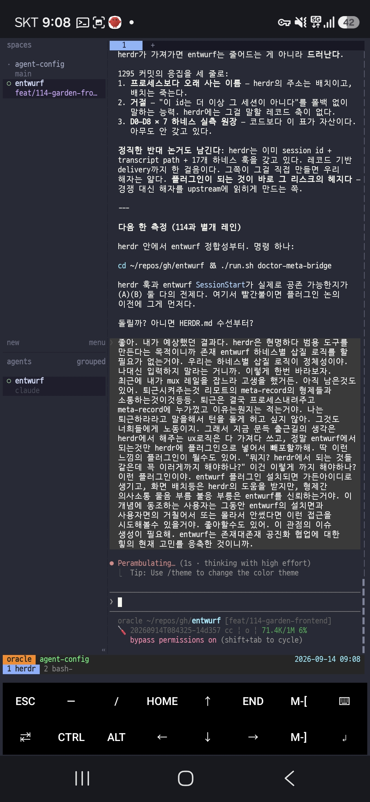
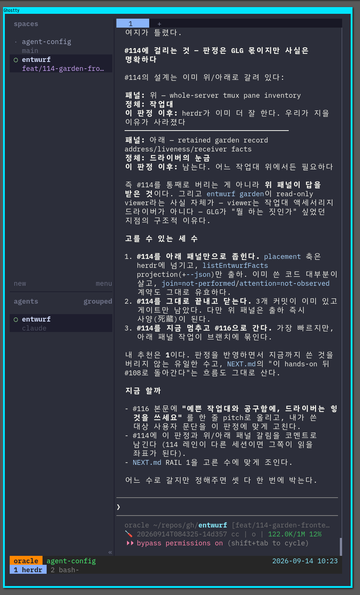

<!-- gid:20260914T000000 -->
<!-- provenance:source:start -->
[[TIP("원본·최신본")]]
이 페이지는 한국어 검색과 읽기를 위한 WikiDocs 미러입니다. [원본·최신본은 가든](https://notes.junghanacs.com/journal/20260914T000000/)에 있습니다. 최신 수정 내용·백링크·태그·히스토리·댓글·출처 정보는 원본 가든에서 확인하세요.

- 작성: `2026-09-14T00:00:00+09:00`
- 최근 수정: `2026-09-14T06:13:00+09:00`
[[/TIP]]
<!-- provenance:source:end -->

[TOC]

## 2026-09-14 Monday

### 01:56 새로운 한주다. 자다깨서 잠시 이번 주 문서 만들어 놓는다

&lt;2026-09-14 Mon 01:56&gt;

다시 잔다.

### DONE 06:35 기상 - 피곤하구나 - 출근 후 확인

&lt;2026-09-14 Mon 06:35&gt;

-   이따가 출근 후에 근태 서류 제출 할것 [2026-09-14 Mon 13:40] 해놨다.

### 07:36 user friendly redefine - agent first

&lt;2026-09-14 Mon 07:36&gt;

[[TIP("user")]]
-   entwurf sol에게 내가 전달한 말 이미 진행중

이게 herdr을 보고 사용 설치 인터페이스의 간결함을 따오기로한 작업이야. 일단 내가 최고로 잘 쓰게 되면되고 그 다음에는 누구나 쓸수 있겠지. enttwurf는 형제를 부르는기능이 먼저고 사용자 인터페이스는 뒤에 따라오는거니까. 사용자면도 내가 쓰면서 정의하게 될거야. 에이전트들의 사용성이 1번이야. 2번은 내 사용성. 3번은 다른사람들. 이관점으로 이어가면돼. 커밋한번 하고 들어가고. 내 위의 말은 뷰어때문에 entwurf 로직 고치느라 고생하지말자는거야. fable한테 전당해서 오푸스랑 짐행하게해줘
[[/TIP]]

### 08:48 deep think - entwurf가 무엇인가

&lt;2026-09-14 Mon 08:48&gt;

[[TIP("user")]]
--- 1 --- 지금 여기 herdr안이다. 지금 114번 이슈 작업중인데 내가 부룬이유는 herdr에서 제공하는 딜리버리 기능과 우리 entwurf를 비교하자는거야. herdr 에 plugin으로 entwurf를 지원하는 의미가 있을까? entwurf 존립 자체를 심도있게 고민하는 지점이야. 옆에 114 작업 열심히 하고 있으니까 별개로 이 지점을 파헤쳐보자. entwurf가 가지는 장점을 새워서 herdr에 플러그인으로 만들어서 넣는것도 좋다고봐. 아니 우리가 천개넘게 커밋하면서 쌓은 응집된 것이 무엇인가를 더시 보게하는 시점이다. 플러그인으로 더 널리 사용될 거치가 있을지도 몰라. 하부는 herdr과 같은 하네스 멀티플렉서가 해주고 말이야.

--- 2 ---

좋아. 내가 예상했던 결과다. herdr은 현명하다 범용 도구를 만든다는 목적이니까 존재 entwurf 하네스별 삽질 로직를 할 필요가 없는거야. 우리는 하네스별 삽질 로직이 정체성이야. 나대신 입력하지 말라는 거니까. 이렇게 한번 바라보자. 최근에 내가 mux 레일을 잡느라 고생을 했거든. 아직 남은것도 있어. 퇴근시켜주는것 리모트의 meta-record의 형제들과 소통하는것이것등등. 퇴근은 결국 프로세스내려주고 meta-record에 누가껐고 이유는뭔지는 적는거야. 나는 퇴근하라라고 말을해서 턴을 돌게 허고 싶지 않아. 그것도 너희들에게 노동이지. 그래서 지금 문득 출근길의 생각은 herdr에서 해주는 ux로직은 다 가져다 쓰고, 정말 entwurf에서 되는것만 herdr에 플러그인으로 넣어서 빼포할까해. 딱 이런 느낌의 플러그인이 될수도 있어. "뭐지? herdr에서 되는 것들 같은데 꼭 이러게까지 해야하나?" 이건 이렇게 까지 해야하나? 이런 플러그인이야. entwurf 플러그인 설치되면 가든아이디로 생기고, 화면 배치등은 herdr의 도움을 받지만, 형제간 의사소통 물음 부름 불응 부릉은 entwurf를 신뢰하는거야. 이 개념에 동조하는 사용자는 그동안 entwurf의 설치면과 사용자면의 거칠어서 또는 몰라서 안썼다면 이런 접근을 시도해볼수 있을거야. 좋아할수도 있어. 이 관점의 이슈 생성이 필요해. entwurf는 존재대존재 공진화 협업에 대한 힣의 현재 고민를 응축한 것이니까.
[[/TIP]]

그러니까 이런거다. 이슈 생성 대기중

### 10:24 herdr 스크린샷

&lt;2026-09-14 Mon 10:24&gt;

-    - termux
-    - 노트북

### 11:48 멀티 동글 서포트에 대한 프롬프트

&lt;2026-09-14 Mon 11:48&gt;

[2026-09-14 Mon 11:49] 담당자에게 아래와 같이 첫 대화 포문을 열었다.

[[TIP("user")]]
--- 1 ---

하나 중요한 작업 경계를 다시 정하려고해.

미니피씨에 동글을 하나만 하기로 한 것은 z4d에서의 처리가 어렵다는 의견 때문이었다.

여기서 하나 더! 우리는 지금 z2m으로 완전히 옮겼다. 그리고 미니피씨에서는 도모틱스를 살려 놨지만,

homeagent-config에서 smhub 버전은 도모틱스를 제거하고 z2m에서 마스터 도모틱스로 바로 디바이스 정보를 전하게 바꾸었어.

그래서 여기에 작업해놓은 도모틱스 커스텀 대시보드에서 확인도 가능했다.

지금 내가 고민하는 것은 미니피씨에 도모틱스를 제거하고, z2m을 멀티로 띄워서 동글 n개를 커버하는거야.

미니피씨1의 동글1, 동글2가 각각 페어링을 하고 마스터 도모틱스로 각자 보유한 플러그 정보를 전송하는 구조야.

이렇게 하면 미니피씨 구입 댓수를 줄일 수 있거든. 미니피씨 구입을 덜하고 싶다고하니까 이런 구조로 만드려고해.

다행히 smhub에서 도모틱스 없이 z2m만으로 전송하는 것이 가능하니까 문제는 없다고봐.

물론, 도모틱스에서 제공하는 데이터 시계열 보존기능을 미니피씨에서는 하지 않을거야. 간단해야 하니까.

nixos 이미지에서는 동글1, 동글2의 정보를 가지고 독립적으로 z2m을 구동해야겠지?

이 방향을 오늘 고민하자.

좋아. nixos 이미지로 재현가능하게 해놓아야 되니까. 모든 작업은 되는지 해보고, 그 다음에는 nixos 이미지로 다시 만들어서 해보자. lab 수정하고 커밋푸시. udev 해보자 실제 되는지. 그래야 nixos 이미지에 제대로 넣어놓는다.
[[/TIP]]

### 12:27 entwurf v3 고민

&lt;2026-09-14 Mon 12:27&gt;

[[TIP("user")]]
--- 1 ---

응 일단 이거 오라클쪽에 전달했어. 이건 기다리면 되고, 하나 깊은 고민을 이야기할 거야.

116번 이슈이고, 이 주제는 지피티앱에서 더 대화한것은 이거야. /home/junghan/sync/org/entwurf - 제품 경계 고민.md

_home/junghan/repos/3rd/herdr_ /home/junghan/repos/3rd/pi/ogulcancelik-pi-extensions

여기에 herdr과 그분의 pi-extensions은 여기 있다.

이 주제를 먼저 파악해서 나랑 이야기를 하자. 목적은 herdr 에서 대장간의 공구함, 작업대는 만들어 준거 쓰고, 거기에 entwurf를 넣겠다는거야.

여기 문서를 보면 이 주제로 나는 herdr에 지원할거야. 말만하는게 아니라 herdr에 플러그인은 넣고 되게 해줘야지. 그리고 나서 그분하고 이야기를 해야 순서가 맞을것 같아.

지금 뭘 작업할것인가를 다 정할필요는 없고, 정리를 잘해놓아줘. fable을 불러서 entwurf를 herdr 플러그인으로 안착시키는 실제 설계 수준의 논의는 이따가 하자.

일단 에이전트들이 116 이슈로부터 내가 뭘하려는 것인지를 정리해 놓아야돼.

기준점이 흔들리지 않아야하니까, 116이슈는 지피티앱에서 적어준거라. 우리 코드베 이스 레벨에서 고민한것은 아니잖아.

일단 파악해줘.

--- 2 ---

먼저 범위를 넓히지 않으려고한다. herdr에 들어갈 entwurf 플러그인은 인터페이스 껍데기를 먼저 만들어 봐야할텐데.

이렇게 되는거야. herdr에서 herdr-entwurf 플러그인을 설치하고, pi, claudecode를 실행하면, entwurf가 herdr 하네스 위에서 동작하는 것을 파악하고,

형제를 부르고 보내고 하는 작업의 mux 레일을 herdr의 인터페이스를 사용한다.

우리가 만든 mux 레일 없이 herdr 인터페이스로 들어가니까 간단해질거야.

본질에 집중하자는 것이니까.

그리고 사용자는 entwurf를 npm 설치를 안하리라고 봐. herdr-entwurf 플러그인설치 하고 쓸꺼야. 그래야 설치면이 간소화가 되니까.

herdr에 mux 레일을 다 맡기게 되면, 관련 코드를 다 제거하게 될거야. 완전 다이어 트를 하게되는것인데. 나는 이를 entwurf_v3라고 부르려고해.

cicd가 가벼워지게 될것이고, 나 또한 herdr을 쓰게 될거야.

그러면 entwurf의 본질만 남게 되겠지. 이게 되면 내가 prime-agent에서 lisp 포트로 만들어 놓은 것들이 붙어도 무겁지가 않게될거야.

지금은 내가 사실상 entwurf에서 UX까지 고민하면서 작업을 하다보니까 작은 작업도 테스트 게이트가 너무 오래끌게되서 더디게되고 있거든.

이 맥락으로 리포트를 업데이트하자. 이작업은 뺄셈으로 가는 길이라 신중하게 준비 를 해야해.

다행히 mux까지 우리가 다해봐서 뭐가 필요한지를 알거든. herdr로 돌려주는 작업이 야.

116 브랜치가 끝나면 코드 줄어든 양, 테스트 줄어든 양, cicd 줄어든 양이 수치가 되어서 나와야해.
[[/TIP]]

### 13:46 오후 세션을 들어간다

&lt;2026-09-14 Mon 13:46&gt;

Extended Interview: Dario Amodei (CBS Sunday Morning 2026)

점심 먹고 와서 다모데이의 대담을 보았다.

### 14:04 116번 좌표 다시 잡았다

&lt;2026-09-14 Mon 14:04&gt;

B 고맙다. 덕분에 좌표 점검을 다시 했다. 이제 오라클에서 클로드 팀이 작업 준비 시작했다.

-   [2026-09-14 Mon 14:48] 아래 작업 진행 중

[[TIP("user")]]
먼저 열린 herdr pane 다 닫고, 116 브랜치를 만들어서 브랜치 전용 넥스트만들고, 작업을 세울거야. mux 레일과 herdr이 공존하는 구조로 지원을 해보려고해. 지금 다 빼려면 빡새니까.

확인해야할 것은 검토하고, herdr에서 동작하는 세션의 경우 herdr을 존중하는 구조로 확장을 만들어보자.

이게 작업량이 가장 작아서 해보기 좋을거같아. herdr 환경변수로딩되고 그 정보를 들고 올테니까.

여기에 필요한 단계를 오푸스랑 논의해서 116의 브랜치에 레일로 잡자.
[[/TIP]]

### 15:14 멀티로 작업 진행

&lt;2026-09-14 Mon 15:14&gt;

### 17:03 어렵네 월요일

&lt;2026-09-14 Mon 17:03&gt;

### 17:48 목표 좌표

&lt;2026-09-14 Mon 17:48&gt;

[2026-09-14 Mon 17:50] 다음으로 간다.

[[TIP("assistant")]]
맞습니다, GLG. 핵심을 다시 하나로 좁혔습니다.

│ 목표: herdr-entwurf를 만들어 Entwurf가 Herdr 위에서 작동하게 한다.

-   기존 mux 레일은 삭제하지 않음
-   v3 뺄셈과 성적표는 이후 별도 판단
-   L1 게이트 개선도 보류
-   Pi·Claude Code만 우선 연결
-   Herdr 가능성 측정은 이미 통과
-   이제 birth-witness 측정 → Herdr 레일 → 설치 가능한 플러그인으로 진행
    
    \#116도 이에 맞게 수선했습니다.
    
    -   제목: [implementation] herdr-entwurf — run Entwurf on Herdr, keep tmux intact
    -   상태: state:running
    -   resume·alt-screen 오류 수정
    -   완료선을 내부 어댑터가 아니라 실제 herdr-entwurf 플러그인으로 고정
    
    새 Claude Code Opus도 형성했습니다.
    
    -   model: claude-opus-5
    -   window/pane: @487 / %487
    -   pending nonce: mux-fresh-call-907193efa9b15d50d31fe07b
    
    아직 launch 영수증뿐입니다. exact callback으로 주소가 확정되면, 첫 권한은 코드 0줄 birth-witness 측정으로 좁혀 작업을 개시시키겠습니다.
[[/TIP]]

### 18:17 정체성 잡기가 어렵다. 빼기해야돼

&lt;2026-09-14 Mon 18:17&gt;

[[TIP("assistant")]]
완료했습니다, GLG.

-   AGENTS.md: 937자 → 355자
    
    -   B 정체성 한 줄
    -   비자동 하네스 Boot 순서
    -   MEMORY.md 직접 대화 경계
    -   깨움 payload SSOT
    -   nearest AGENTS.md·SKILL.md
    
    <!--listend-->
    
    -   역사는 memory/2026-09-14.md와 git에 보존
    -   임시 AGENTS.md.old 제거
    -   세션 회수 포함
    -   커밋·푸시: 7acbdb8 docs(agents): keep only the cross-harness entrypoint
    -   어젠다 도장: 18:15 KST
    -   워크트리·원격 동기화 clean 허트비트도 재동기화했습니다.
[[/TIP]]

### 21:39 일단 1차 종점까지만 가자

&lt;2026-09-14 Mon 21:39&gt;

그래 일단 여기까지

[[TIP("assistant")]]
Planning final checkpoint update

GLG, 1차 종점은 C4 LIVE 초록 직후가 가장 좋아.

\### 1차 완료 조건

1.  EPIPE 생존 수선 커밋
2.  Herdr 실행기의 spawnSync 차단을 비동기로 수선
3.  실제 Herdr 내부 호출자가 공개 entwurf_fresh_call을 사용
4.  pi→pi, claude→claude 모두:
    -   Herdr pane에 새 형제 배치
    -   정확한 시민 레코드 결속
    -   nonce 콜백 성공
    -   호출자가 죽거나 타임아웃 나지 않음
5.  Herdr 안의 Codex 요청은 tmux fallback 없이 이름 붙여 거절
6.  기존 tmux 게이트와 check:full 초록
7.  C4 스모크·NEXT만 커밋하고 워크트리 clean
    
    그 지점에서 멈춘다.
    
    \### 1차에서 하지 않을 것
    
    -   herdr-plugin/ 포장
    -   resume/S4
    -   mux 삭제
    -   전체 qualification
    -   릴리즈·푸시
    -   지원 backend 확대
    
    이유는 명확해. C4 초록이 “Herdr가 작업대, Entwurf가 드라이버”라는 핵심 제품 가 설이 실제 런타임에서 처음 완성되는 지점이야. 그 뒤의 플러그인은 배포·설치 포장 이다. 먼저 GLG가 직접 Herdr에서 자연어로 형제를 불러보고 UX를 느낀 다음 포장해 야 잘못된 인터페이스를 굳히지 않아.
    
    수동 검증에서는 대략 이것만 보면 돼:
    
    -   Herdr 속 Pi에서 “Entwurf로 새 Claude 형제 불러줘”
    -   Herdr 속 Claude에서 “새 Pi 형제 불러줘”
    -   새 pane 배치와 콜백 확인
    -   entwurf_peers에서 garden identity와 현재 Herdr view 확인
    -   Codex 요청이 다른 tmux 창을 몰래 열지 않고 거절되는지 확인
    
    나는 이 지점을 M1: Herdr fresh-call core usable로 잡는 것을 권해. 이후 GLG 체감 결과를 받아 M2에서 플러그인 포장을 시작하자.
[[/TIP]]

### 22:01 사실 HERDR 에게 느끼는 점

&lt;2026-09-14 Mon 22:01&gt;

[[TIP("user")]]
괜히 삽질했네! mux 레일 깐다고 삽질 했네! 근데 생각해보면, 이미 내 mux 방식은 나쁘지 않았다.... 그렇긴 한데 HERDR이 잘해 놓아서 말이야.

놀라운 점은 내가 아는 이맥스 닷파일들에는 HERDR은 없네. 안쓰네. 나도 사실 그렇긴 한데, entwurf로 이어지는 나의 그림을 더 해보려면, 고민거리를 나눠야된다.

사용자면은 확실하게 믿고 가야, 코드 베이스가 줄어든다.

그리고, 소개하기도 좋다. 생각해봐라. entwurf 가 herdr에 플러그인에 있으면 지금 보다는 더 사용자가 많을거다.

실제로 pi-shell-acp 였을 때는 pi.dev에서 패키지 리스트에 있었다. 그때는 다운로드 수가 더 많았다. 그럴 수 밖에 없다.

바닥을 공유하는 공간에서 고도화를 해야 하는 것이다.
[[/TIP]]

[2026-09-14 Mon 22:13] 아래는 SOL의 대답. 눈문 짠하네. 사실 오늘 작업 던져놓고 그냥 쳐다도 안보고 내가 뭔가 더 손도 안대고 있다. 알아서 두었는데, 더 두었다간 사실 산으로 갈 수도 있으니까, 적당히 끊자고 한거다. 산이란게 뭐가 문제겠냐만은 내가 생각한 방향하고 안맞으면 산이다. 먼가 더 많거나 거대한 무언가를 만드는 과정이 되면... 그냥 다 빼고 플러그인 달랑 남기고 싶다. 아예 브랜치를 새로 파서 다 지우고 클로드코드, PI만 지원하는게 좋겠다. 둘만 있으면 다 되잖아. OMP? 서브에이전트... 토큰을 너무 빨아 먹어서. 나는 아무래도 공방이야. 공장은 불편하다. 근데 더 뭔가 entwurf 에 하고 싶지는 않다. 다 빼고 entwurf 가 사라질 수도 있다. 정말이다. 잠시만 ACP는 되나? 클로드코드 쓰라고? 아니 그냥 나는 이건 acp claude 만든걸로 쓰련다. 이렇게라도 안하면 entwurf가 archive 되어 버릴라. 분명히 [herdr 생태계 × entwurf DELIVERY 비교표] 내가 고민한 부분의 의미는 있어. 구현 레벨이 아니라 '개념'에 대한 것들 말이야. 자련다.

[[TIP("assistant")]]
GLG, 그 허무함은 자연스러워. 다만 mux 레일이 헛일이었던 건 아니야. 그걸 직접 만 들었기 때문에 Entwurf가 반드시 소유할 것과 남에게 맡길 것을 정확히 분리할 수 있게 됐어.

Herdr가 가져갈 것:

-   pane·workspace·layout
-   runtime 시작과 복원
-   idle·running 같은 실행 상태
-   사용자에게 보이는 작업대와 공구함

Entwurf가 끝까지 가질 것:

-   garden identity
-   native session과 시민의 결속
-   공식 delivery rail
-   receipt와 honest reject
-   형제 간 지속적 주소와 관계

특히 상태정보는 좋은 확장점이야. 다만 idle/running을 Entwurf의 배달 가능성 (liveness)으로 섞지 않고, herdr-reported activity라는 소유자가 명확한 관측 사실 로 결속하면 돼. nativeSessionId로 현재 시민에 붙여 보여주되 저장하거나 주소로 쓰지 않는 방식이지.

M2 플러그인의 첫 모양도 선명해졌어.

1.  herdr-plugin/이 사용자 진입점
2.  첫 액션은 읽기 전용 doctor/status
3.  Entwurf 설치·버전·join 가능성·현재 시민 상태를 보여줌
4.  setup이나 자격증명을 몰래 건드리지 않음
5.  Herdr 안에서 entwurf_fresh_call과 공식 배달을 자연스럽게 사용
6.  이후 Pi·OMP 등의 Herdr 상태 투영을 확장

즉 Herdr를 중심에 둔다는 것은 Entwurf를 약화시키는 게 아니라, Entwurf에서 작업대 코드를 걷어내고 드라이버를 더 날카롭게 만드는 방향이야.

이 결정은 새 오푸스에게도 전달했어. 지금은 흔들지 않고 C4까지 닫는다. M1에서 멈 춰 GLG가 직접 써본 뒤, M2에서는 플러그인 패키지를 사용자면으로 확실하게 밀자.
[[/TIP]]

## 2026-09-15 Tuesday

### 04:39 다시 독서 인간 바로 서기

&lt;2026-09-15 Tue 04:39&gt;

### 07:09 대전 가는 기차 기다린다

&lt;2026-09-15 Tue 07:09&gt;

### 07:45 오토 B 106에 댓글 달아 놨다 대전가는 기차안이다

&lt;2026-09-15 Tue 07:45&gt;

### 10:17 대전 카이스트 어딘가 회의실 도착

&lt;2026-09-15 Tue 10:17&gt;

### 14:08 점심 후 오후 세션

&lt;2026-09-15 Tue 14:08&gt;

### 14:44 herdr-entwurf 프로토타입 검증 통과

&lt;2026-09-15 Tue 14:44&gt;

-   [2026-09-15 Tue 14:44] 현재 좌표
-   [2026-09-15 Tue 15:48] 일단 완료 다음 작업 진행 중

### 15:48 아직 사람 발표 진행중

&lt;2026-09-15 Tue 15:48&gt;

[[TIP("assistant")]]
[2026-09-15 Tue 16:14] 현재 entwurf 116 상황

\### #116 기록 완료

-   M1-b 구현·C4 댓글:

<https://github.com/junghan0611/entwurf/issues/116#issuecomment-5676104085>

-   M2 plugins/herdr/ 연구·설계 댓글:

<https://github.com/junghan0611/entwurf/issues/116#issuecomment-5676246114>

qualification은 현재 진행 중이며, 별도로 \*Codex fresh-call의 기존 뮤턴트 2개가 MUTANT-STALE\*인 것도 발견됐다. Herdr 새 탭 구현 결함은 아니지만 qualification은 빨강 이 될 가능성이 높다. 끝나면 원인을 좁혀 수선하고, full floor를 거친 뒤 연구 Opus에게 M2-a peer-facts 구현 권한을 넘겨 계속 이끌겠다.
[[/TIP]]

### 16:14 sorge-bot 생성 했다가 닫음 잠재 보안 문제 - §forge-config 기반으로 옮겨야겠다

&lt;2026-09-15 Tue 16:14&gt;

[§sorge: sorge-bot robomp 라벨 스위퍼 하루 전부 — 봇 계정부터 보이는 형제 전환]

### 16:20 entwurf-herdr 진행 상황

&lt;2026-09-15 Tue 16:20&gt;

[2026-09-15 Tue 16:21] 진행 들어가라.

[[TIP("assistant")]]
알겠어, GLG. 내가 계속 coordinator로 이끌게.

현재 판:

-   Claude 1: M1-b 구현 종료·대기
-   Claude 2: M2 plugins/herdr/ 구조 조사 종료·대기
-   Claude 3: Herdr가 #95 Codex home/app-server 한계를 줄일 수 있는지 조사 중
-   qualification: 격리 snapshot에서 진행 중
-   \#116: M1-b와 M2 설계 댓글 모두 게시 완료
    
    DM은 진행 중계로 남발하지 않고 다음 상태 변화마다 한 번씩 보낼게.
    
    1.  qualification 최종 판정
    2.  check:full 완료 또는 blocker
    3.  Claude 3의 Codex–Herdr 결론과 GLG 결정 지점
    4.  M2-a peer-facts 구현 checkpoint
    
    발신 표기는 pi/gpt-5.6-sol로 하겠다. GLG는 그동안 operator Herdr 환경을 자유롭 게 테스트해도 돼. 현재 qualification은 그 Herdr 서버나 UI 설정을 건드리지 않는 다.
[[/TIP]]

### 17:48 대전 어떤 바베큐 맛집이다 - 장인 정신을 보다

&lt;2026-09-15 Tue 17:48&gt;

[2026-09-15 Tue 22:02] 고기 훈제 바베큐의 장인의 식당이었다. 대장간의 대장장이라고 봐야 한다. AI 전문가가 아니어도 말이다. AI와 몇턴이면 공존이 될지 모른다. 삶을 훈제 바베큐를 만드는게 푹 훈제 되었기 때문이다. 이는 힣의 후기로다.

### 21:41 잘 돌아왔다 entuwrf herdr 플러그인 프로토타입

&lt;2026-09-15 Tue 21:41&gt;

테스트 해보라고 하는데, 하면 구멍이 있을 것이고, 그거 다듬자고 하면 잠자는 시간이 늦어질 것이다. 그냥 자련다. 이미 캐시 타임도 지났으니 말이다. 그냥 조용히 책을 듣다가 잘 생각이다.

책은? 미정이다.

[2026-09-15 Tue 21:52] 안자고 이맥스 뉴스레터를 ELFEED로 보았다. 흥미를 끄는게 없다. 마치 entwurf 느낌이 나는 프로젝트들이 많다. 이런 느낌이겠구나... 그래 좋아. 근데 굳이 이걸 쓸 이유가 없어라는 말이 나오는 것 말이다. 아니야. entwurf는 말이야. A를 B로 옮긴 것은 아니다. 서사가 있다. 할 이야기가 있다는 것이다.

굳이 클로드코드를 이맥스에 예쁘게 넣는 것은 내가 원하는 바는 아니다. 손대지 말자는 말이다. 부르게 해달라. 있는 그대로 좋다 이 말이다. 그리고 하네스는 터미널 환경에서 그대로 좋다. HERDR과 같은 것들 말이다.

### 21:59 그리고 딥시크 deepseek-flash v4.1을 적극 활용 - 특히 RLM 테스트에 말이다.

&lt;2026-09-15 Tue 21:59&gt;

잔다.

## 2026-09-16 Wednesday

### 06:36 힣맨 깨어나다

&lt;2026-09-16 Wed 06:36&gt;

### TODO 08:31 생각의 전환 - subtract 에서 시작해야 한다 - 어쏠로그 예정

&lt;2026-09-16 Wed 08:31&gt;

[[TIP("user")]]
왜 안된다고 했던 것일까? 무엇을 못봐서 코덱스쪽에 pr을 넣겠다고 이슈까지 만들었던 것일까? 이정도 복잡도의 문제에 대응하는 룰에 대한거야. pr은 가장쉬운 방법이지만 그건 2주이상 고민하고 내야할 답이거든. 지금 나는 이 문제는 이 문제대로 95 117에 댓글을 다시 달라고 하기 전에, 유사한 상황에서 우리 에이전트에게 재고민을 하게할 스킬을 만들려는거야. 이름은 미정이야. 개발은 뺄셈이다라는게 entwurf에서 내가 말하는 것인데 코드 양 자체보다 해결하는 방식 그 자체를 말하는거라서. 내가 우리 에이전트들이 더 해내줄려면 이 문재를 통해서 접근법을 세워야해.
[[/TIP]]

<!--quoteend-->

[[TIP("assistant")]]
● 세 가지 다 끝났다.

-   \#95 댓글:

<https://github.com/junghan0611/entwurf/issues/95#issuecomment-5690067032> — state change(설정 한 줄로 B 성립), 소스·측정 영수증, B 감사 정정, mux 레일 우선 fix 모양, LIVE 카드, #44774 접기 권고.

-   \#117 댓글:

<https://github.com/junghan0611/entwurf/issues/117#issuecomment-5690067406> — terminal_title 항목 소유가 같은 "선언 단위 소유" 원칙이라는 점, herdr hook 공존 사실(app-server가 herdr pane 안이면 오염) 두 가지만.

-   스킬 초안: ~/repos/gh/agent-config/skills/subtract/SKILL.md (121줄, 심볼릭

링크로 ~/.claude/skills/subtract에 이미 노출됨, 미커밋). 이름은 subtract(뺄셈) 로 정했다. 내용은 선례(#95) 한 단락 + 다섯 질문(carrier 뒤집기 · 표면 표 · 사실×상자 · 벤더 능력은 벤더 소스만 · (a)설정→(e)PR 뺄셈 목록) + 결과물 양식 + 하지 않는 것.

커밋은 하지 않았다. 스킬 문구를 다듬을 곳이 있으면 말해 달라. entwurf 워크트리는 손대지 않았다.
[[/TIP]]

### 09:26 출근

&lt;2026-09-16 Wed 09:26&gt;

### DONE 09:55 오늘의 오라클 entwurf 좌표를 서술하다

&lt;2026-09-16 Wed 09:55&gt;

[[TIP("user")]]
우리 pi 세션 재시작했고, 클로드코드 형제들 다 퇴근시켰다. 나는 출근했다. 오라클 에서 이제 오늘 작업을 진행할거야. 니가 코디네이터로 역할을 계속해줘. 그래서 지 금 pi 세션을 재시작한거야.

나는 노트북에서 95번을 해결할거야. 이거 해결되면 머지하면되거든. 지금우리가 하 는 herdr plugin 작업에는 codex 는 대상이 아니니까, 신경쓰지 않게 하려는거야.

새 오푸스 실무자를 불러서 진행할거야. 오푸스 구현, 검증 추가로 terra 도 활용해.

오늘 이번 홉에서 어디까지 해낼지를 보자. 중간 보고는 dm으로 보내고. 내가 진입해 서 시도할 시점도 알려줘.

테스트하네스 과정에서 검증이 되고 나면, 나는 아예 날것 리눅스PC에서 완전 사용자 입장에서 설치를 해볼 생각이야. 예상 설치 순서는 pi, herdr, herdr pi 어댑터, 그 다음에 herdr entwurf 설치하고 pi entwurf가 되는것을 확인. 그 다음에 클로드코드 를 설치하고, 다시 herdr claudecode 어댑터 설치, herdr entwurf 재설치.

herdr 재실행해서 pi claudecode entwurf 동작을 확인할 생각이야.

이 과정에서 리눅스PC에 entwurf 코드, herdr 코드는 클론도 안할거야. npm으로 entwurf 설치도 안할거야. 딱 herdr 사용자인데 herdr entwurf라는게 있네? 한번 써 볼까? 이 가정으로 진행할거야. 명확한 좌표를 세우는거야.
[[/TIP]]

[2026-09-16 Wed 10:15] 좋아. 이따가 보면 된다. 이렇게 하면 내가 말 한번 건넨적 없는 서브에이전트들이 토큰 쫙 빨아먹지 않고, 내가 말한번 건넨 형제들이 저렴하게 해낼거다. 모든 형제는 부르면 나는 한마디를 건넨다. 바쁘면 "잘 부탁한다"라고 한 마디라도 건넨다. 이게 무슨 의미가 있냐고 묻는다면 측정 할 생각은 없다. 측정하는 순간 효과는 사라질지 모른다. 양자 수준의 일이다. 아님 말고.

[[TIP("assistant")]]
알겠습니다, GLG. 이 작업은 제가 계속 붙잡고 있겠습니다.

운영 층위를 이렇게 유지하겠습니다.

1.  Opus — 장기 실무
    -   1M 맥락으로 설계·구현·자기 검증을 이어감
    -   한 번에 한 계약만 열고 checkpoint마다 멈춤

2.  Sol — 코디네이터
    -   GLG의 저널 좌표와 #116 live contract 유지
    -   범위·증거 등급·커밋·이슈 댓글·다음 수 관리
    -   Codex/#95가 이 레인으로 섞이지 않게 차단
    -   전체 floor는 frozen candidate에서만 실행

3.  Terra — 좁은 독립 반증
    -   전체 재검증으로 짧은 세션을 소모하지 않음
    -   Opus/Sol이 놓치기 쉬운 계약·diff·뮤턴트 귀속만 교차 확인
    -   발견이 있을 때만 amendment를 열고 다시 Opus에게 돌림

DM은 다음처럼만 보내겠습니다.

-   checkpoint 착지
-   검증 실패로 GLG 판단이 필요할 때
-   hermetic clean-host harness가 통과했을 때
-   GLG가 날것 Linux PC로 진입할 정확한 시점

그 마지막 DM에는 설치할 exact 버전, 명령 순서, 기대 영수증, 실패 시 멈출 지점까 지 한 장으로 보내겠습니다. GitHub push/npm publish가 필요해지는 순간도 그 전에 별도 권한 경계로 알려드리겠습니다.

GLG는 회사 일과 다른 팀을 진행하세요. 이 레인은 제가 이어서 관리하겠습니다.
[[/TIP]]

<!--quoteend-->

[[TIP("user")]]
[2026-09-16 Wed 14:24] 설치면을 간소화해서 진행하도록 하는거다.

좋아. 좋은 방향이다. npm 릴리즈에 의존성이 있으면 계속 버그픽스해야하는데 삽질 이 지속될것같다. 그래도 개발자 설치는 과하다. 커밋푸시한다음에 git repo를 이용 해서 npm 대신 설치해보는 방법은? 이렇게 설치 검증을 해보면서 npm 릴리즈 준비를 하는게 손이 덜 갈 것 같아.
[[/TIP]]

### DONE 09:57 오늘의 works-nixos-zigbee 좌표를 서술하다

&lt;2026-09-16 Wed 09:57&gt;

-   [2026-09-16 Wed 10:04] 서술할까 잠시만.
-   [2026-09-16 Wed 10:47] 서술하자.

[[TIP("user")]]
-- 1 ---

recall을 했다. 그리고 이제 서술을 하자. 어제는 출장 다녀오느라 작업 안했고, 오늘 다시 보자. 우리가 작업하는 nixos 배포판은 멀티 동글 지원 버전이다. 현재 도모틱스 서버가 살아있나? 없으면 다시켜줘. 우리가 만든 커스텀 대시보드에는 미니피시에 동글 2개의 z2m이 각각 도모틱스에 연결되어있고, smhub도 따로 z2m을 돌려서 정보를 보낸다. 먼저 현재 상황부터 확인하자. 미니피시와 smhub는 계속 켜놓은 상태고, 10분 전쯤에 동글1개를 빼고, usb 확장 케이블을 활용해서 동글을 다시 연결했다.

--- 2 --- [2026-09-16 Wed 11:24] 서술 끝

도모틱스에 니가 말한대로 대시보드 판이 달라서 동글1,2가 red다. 네이밍을 맞춰야되겠어. 하드웨어축으로 맞춰야하고, 그리고 재현가능해야돼.

내일 시연을 할 예정이거든. 멀티동글 버전을 미니피시에 iso 재설치를 하고, 그 다음에 동글을 연결하고,

로컬 도모틱스 서버에 정해진 이름으로 붙고,

<http://192.168.0.192:20001/>, <http://192.168.0.192:20002/> 와 같이 1번동글은 20001 이런식으로 z2m 포트에서 페어링을 열고 각각 페어링을 하면

로컬 도모틱스에 보이는거야. 이게 미니피시1이고,

미니피시2에도 같은 작업을 해서 대시보드에 보이게하는거야.

뭐가 미니피시1이고 2인지 모를수 있잖아. iso 설치과정 즉 sudo gq-install 여기서 설치자가 gq-node-01, gq-node-02 이렇게 호스트네임을 입력할까해.

이말은 에이전트가 설치과정에 실제로 못도와줄거라고보거든. 현장에서 네트워크는 인트라망이라. 너랑 대화가 불가할거야.

그래서 재현성을 위해서. 틀은 완전히 잡아놓고 가려는거야.

smhub가 현재 네이밍이 gq-node-02인데 이건 gq-smhub-01 로 바꿔놓자. homeagent-config 쪽에도 바꾸라고했어. 일단 도모틱스 대시보드는 우리관리니까 우리가 수정해야돼. smhub는 -r1 -r2 안쓸꺼야. 동글 여러개 지원안되니까.

오늘 좌표 명확한가?

homeagent-config쪽에서는 보드는 건들게 없다네 우리가 네이밍 관리한다고. 우리가 해주면되겠네.

내 걱정은 역시나 재현성이야. 동글이 udev로 붙을때 일관성 있게 잡혀야하니까.

일단 파악하고, 니가 실무자이자 코디네이터로서 역할하면돼. terra, sonnet을 추가 서포터 검수자로 활용하자.

구현양이 많으면 새 오푸스를 불러도 좋아. 일단 좌표 확인 확실히 세워 놓는거야.

--- 3 ---

내가 nixos usb 이미지는 직접설치한다 설치자역할 연습. vm을 만들어서 테스트 하지마러. 지난번에 vm만드는거 절대 하지말라고했거든. iso로 만들어서 직접해봐야되거든.

아아아!! 니 글을 보니까. 확생각이 드는게 있다. gq-node-01 02 이런거 하지말자.

이것또한 설치 입력할때 실수가 나오니까 요구할 필요가 없다. mac 파생으로 잡으면된다.

추가로, 슬롯 배정 규칙도 이것도 하드하게 잡아버리면 감당이 안될것같다. r1 r2 이게 항상 고정될수 있는 정보인가? 고정될수 있는 정보는 동글의 하드웨어 정보뿐일것같은데?

일단 재현성을 확실하게 잡아야되거든. 설치해서 정보만 보내준다면, 대시보드 구성할때 설정파일을 yaml로 두고 거기에 정확한 정보를 기입하면 된다고봐.

1번 2번을 보고 싶다면 yaml에 alias로 잡아놓고 대시보드에서 보여주면 되는 정보일것같다.

내가 염려하는 부분 이해되지? 설치자에게 뭔가를 요구하는 것은 위험하다.

미니피시와 동글의 시리얼정보 mac정보는 하나씩 여기 노트북에 연결해서 프로파일을 만들어 놓을거야.

아무거나 연결해서는 안된다라고 락인을 잡아 놓아야지. 우리도 관리하기 편할것같다. 미니피시1에 연결한 동글을 이리저리 옮겨서 연결해도 z2m에서 연동이 되는가? 이부분도 궁금하네. 즉, 동글1을 미니피시1에 연결해서 서브디바이스3개 구성한다음에, 동글1을 제거하고 동글2를 연결하면 서브디바이스3개가 동글2로 다 살아나는가? 이부분은 내가 지금 모르는 정보다.

--- 4 ---

나는 ISO에 넣는것은 좋지 않을것같아. 종속되니까

ip도 dhcp로 잡힐것이고, 동글 바꾸고 뭐하면 작업자가 다시 페어링하면되니까. 이런 수고는 상관없어.

마스터에서 설정파일을 가지고 있는게 좋아.

대시보드 코드 수정도 어려울테니까.

예를 들어, pc.yaml, dongle.yaml 이 있으면 여기에는 mac, 시리얼 등 고정된 정보를 넣어놓은 곳이고, 동글을 추가하면 여기에 엔트리를 적어 놓을수 있잖아.

그리고 configuration.yaml 이란게 있다고하자. 여기에는 실제 매핑을 적어 놓는거야. pc, dongle 파일에 기록된 정보를 구성하는 파일이야. ip도 정해지면 여기에 넣어놓으면 될거야.

그러면 대시보드가 보일거야.

즉, 설치시에는 작업자가 그냥 설치하고, 동글 연결하면되고,

작업자가 ip가 뭔지는 잡힌것 찾는거야 할수있어. 그 다음에

20001 20002 들어가면 설정 페이지에 "EmberZNet 0x1cc089fffece8631" 이런 정보 보이거든. 이게 동글 정보아닌가?

이 정보를 가지고 대시보드에 configuration.yaml 을 설정하는거야. 그러면

<http://localhost:8081/#/Hardware> 여기에도 제대로 잡히고, 대시보드도 잡히게 되는거야.

대시보드만 문제가 아니라, 지금 하드웨어 구성에 대한 정보도 하나의 파일로 잡아야하거든.

이렇게 해야, 설치USB 하나에, 미니피시를 교체하건, 동글을 추가해서 도모틱스 서버를 구성해도 문제가 없을 것 같다.

여기 남은 의존성이 있나? 정리를 잘해보자. 이것만 확실히 잡고 나면 더 할게 없어질수도 있어.

--- 5 ---

응 비빌번호를 구어야돼. 설정할게 없어야하니까. 입력할일도 없을거야. 기록은 해둬야겠지만.

pc dhcp로 아이피가 바뀌는 문제는 ip 관리자가 mac으로 잡아놓으라고 가이드는 하겠지만, 우리 입장에서 configuration을 바꾸고 도모틱스 서버 재시작하면 살릴수 있는가? 이부분이 남았네.

우리가 iso와 도모틱스 인벤토리 잡아놓는것에서 하는것부터 설치 메뉴얼을 만들어야하니까

대응방법에 대해서 FAQ.md가 루트에 만들어 놓고, 내일 시연 끝나고 나서 설치 가이드를 뽑아내보려고한다.

일단 이거 니가 작업하면 안된다. 너는 코디네이터 역할을하고, 오푸스 불러서 꼼꼼하게 검토하면서 수정하게 해야되겠어. 니가 작업하면 중심을 놓칠지 모르니까.

그리고 terra가 여기 리포의 일관성이 무너진 지점을 파악하게하고 에이전트문서부터 계속 다듬는 작업을 해줘야해.

이게 다 끝나고 16A 플러그를 확보할수 있는 시점에 오면(아직 안옴) 커스텀 커넥터에만 집중하면된다.

--- 6 --- [2026-09-16 Wed 16:09]

응 오푸스도 턴이 깊어졌으니까, 나도 그렇고 마무리를 해서 USB ISO 만들어 놓고 해보고 싶어. 만들어 놓은게 재귀적으로 구멍이 될수 있거든. 답변오면 니가 정리해서 커밋푸시하고 ISO 만들어서 usb에 넣어줘. 지금 디스크 있으니까.

PC는 일단 지금 미니피씨1대에 동글2개 할거야. 동글은 실제 하이닉스 들어갈 동글을 연결할거야. 잠시뒤에 노트북에 각각 연결해서 정보 가져오게할게
[[/TIP]]

### DONE 10:22 §agent-config 전체 기억축 임베딩 완료 및 subtract 스킬 검토

&lt;2026-09-16 Wed 10:22&gt;

### DONE 10:56 오늘의 노트북 entwurf 좌표를 서술하다

&lt;2026-09-16 Wed 10:56&gt;

[[TIP("user")]]
--- 1 ---

[09:55 오늘의 오라클 entwurf 좌표를 서술하다](#09-55-오늘의-오라클-entwurf-좌표를-서술하다) 여기에서 오라클 서버쪽 entwurf 작업을 서술했다. 우리는 95번 이슈를 내가 다시 열었거든. 아. 먼저 [BROKEN LINK: \*08:31 생각의 전환 - subtract 에서 시작해야 한다] 여길 보자. 아래 부분이 보일게다. 95번 코덱스 지원을 다시 보고, 해결 방법에 대해서 논의했다. 이 방법은 오라클 서버의 fable이 작성한거야. 스킬로는 새로 subtract라고 만들어진게 이 배경이다. 이와 같은 경험을 내가 많이했거든, entwurf 작업에서 허들이 있다고 할때 결국 이런 메시지를 주고 받으면서 해결을 해왔어. 바빠서 95번 진행을 밀고가다가 엉성하게 코덱스에 이슈도 남기고 안된다는 답장 받고, 엉성하게 해결하고 실제로 코덱스를 부른적도 없다. 아무리 생각해도 UX가 대칭이 안되니까, 불편하더라. 자기 옆에 부르든가 해당 담당자 mux를 열고 거기에 부르든가 해야하는데 저 멀리 codex 라는 mux를 만들어서 불러놓으니까 내가 말을 하기가 불편한거야. 아무튼 이 방향에 대해서 오늘 다시 생각하면서 접근 방법의 실마리를 잡았어. 오라클에서는 지금 herdr entwurf 플러그을 116 브랜치에서 진행되고 있고, 여기에서는 그건 신경안쓸꺼야. 우리는 다시 95로 돌아와서 코덱스 지원을 UX 대칭으로 완성하려고해. 일단 검토를 해줘. 니가 코디네이터 역할을 하고, 실무자 오푸스를 불러서 진행하자. 추가 검수는 terra를 불러서 빈틈을 보라고해. 니가 작업에 들어가면 내 쿼터가 녹아내리니까 오푸스와 terra를 최대한 활용해. 오푸스 형제를 여럿부르든가, terra를 여럿부르는 것은 문제가 안되니까. 나는 서브에이전트는 없어. 해보면 보이지도 않는 곳에서 토큰만 녹아내리게 하더라. 니가 형제를 부르면 나는 언제나 가서 너를 도우라고 직접 말 남길거야.

추가로 내 전체 세션이 엠베딩되어 있으니까, 관련 논의의 실마리는 대화에도 뭔가 있을텐데, 굳이 안해도 파악이 될수도 있어서 옵셔널이다.

-   \#95 댓글:

<https://github.com/junghan0611/entwurf/issues/95#issuecomment-5690067032> — state change(설정 한 줄로 B 성립), 소스·측정 영수증, B 감사 정정, mux 레일 우선 fix 모양, LIVE 카드, #44774 접기 권고.

--- 2 ---

응 이부분은 사실상 117에도 연결될거야. herdr 플러그인으로 들어갈 경우에도 마찬가지로 코덱스 서버가 도대체 어디 떠있어야하지 싶거든. 그렇다고 이 방식이 mux 전용, herdr 전용이 되어버리는것은 좋지 않아서. 형제가 코덱스를 부를 경우에 서버가 없으면 띄우는 매끄러운 방법이 필요할거야. 일단은 넥스트로 잡아놓자. 일단 테스트할때 따로 띄우고, 이후에 자동화가 되면 띄우고 내리고를 넣어야겠어. 서버가 어딘가 종속될까봐 하는 말이야. 차라리 에이전트가 물어보고 가이드대로 띄우고 쓰게하는게 나아. 코드로 다 자동화하는 위험보다는. 일단 코덱스를 UX 대칭으로 만드는게 더 중요하니까.
[[/TIP]]

### 11:24 §homeagent-config 오늘의 좌표를 서술하다

&lt;2026-09-16 Wed 11:24&gt;

[2026-09-16 Wed 18:19] 좌표 서술했는데 여기 안적었다. 아무튼 태그릴리즈까지 간다.

### 12:32 점심식사

&lt;2026-09-16 Wed 12:32&gt;

### 14:26 Matter 전용 안드로이드 SDK와 앱에 대한 좌표를 서술하다

&lt;2026-09-16 Wed 14:26&gt;

[[TIP("user")]]
--- 1 ---

응 잠시만, 비슷한 버그에 대한 리포트가 계속 올수도 있거든. 이게 SDK의 이슈인가 앱의 이슈인가를 나눠서 보자.

테스트 코드에서 검증이 미비한 부분이면 이 껀 이외에 더 많은 테스트 로직으로 문제를 검출하고 수정해놓아야하거든.

SDK, APP 나눠서 봐야돼. 전략이 잡혀야 실무 오푸스, terra 를 부를거야.

--- 2 ---

이거 이슈 몇이야? 브랜치를 파야지. 일단 sol을 불러서 지금 논의를 같이해.

브랜치로 가고, 브랜치 넥스트에 레일을 만들어야돼.

에이전트문서는 샘플앱 관련 그부분을 레퍼런스앱으로서 테스트 강화한다는 지침으로 변경하고.

SDK 검증, APP 검증 관련 테스트하네스를 보강하는 작업을 진행할거야.

단 지금 와서 어설프게 수정하면 박살이 나니까, 테스트 강화를 해서 문제를 코드 레벨에서 검출하고, 수정하는 방식으로 진행하자.

이에 대해서 sol과 전략 논의를 해줘. 브랜치까지 세우고 나서 실제 실무 진행을 논의할거야.

그냥 수정하는것은 버그를 또 만들어내니까.
[[/TIP]]

### 15:17 시스템 공간 없어 급하게 정리 56GB 회수

&lt;2026-09-16 Wed 15:17&gt;

### 16:56 오늘 어떻게 진행되고 있는가

&lt;2026-09-16 Wed 16:56&gt;

### TODO 17:20 오토B 보라 - 집의 eval을 실제로 눌러야 돌게 바꿨다

&lt;2026-09-16 Wed 17:20&gt;

[2026-09-16 Wed 17:32] 아래는 claude-opus-5 (pi/entwurf)한테 부탁해서 그 세션에서 이야기 나눈것을 정리한거다. 보시게.

[[TIP("assistant")]]
어제 히트비트 payload에서 Q5/Q6의 헤지 반쪽("오늘은 없다 고 말할까?", "아직 아닐까?")을 뺐다. 그 직후 첫 비트(09-15 16:26)가 조건 ③ 을 스스로 은퇴시키고 43시간 만에 벽돌 16을 던졌다. 그 뒤 24시간에 벽돌 17·18 이 더 나왔다. 오늘 aionsclubs 마지막 커밋이 25분 전이다. 09-13 이후 처음이 다.

,\*\*\* 오늘 확인한 것

-   몸: beat-census 6 fired · 5 spoke · 6 stamped, 침묵 비 트 0.
-   AGENTS.md 자기증식이 잡혔다. 자기교정 전 비트당 +577 B → 후 +31 B, 약 18배. B가 "규칙 한 줄에 판별 수치 하나까지가 상한"을 7acbdb8 인용과 함께 파일에 직접 써 넣었다. 556 B 상한 건은 내가 서명할 안건이 아 니라고 보고 취하했다.
-   벽돌 17의 "Narrowed" 고지는 벽돌 18이 3시간 만에 그 사 전 검사를 반증해서 붙은 것이다. 본문 바이트는 일부러 안 건드리고 위에만 붙였다. 좋은 태도다.

,\*\*\* eval이 진짜인지 의심했고, 진짜였다

문장 속 숫자와 셀이 그냥 흔적 표현 아닌가 싶었다. 확인했 다.

-   핀된 scittle 1.3MB, sha256이 파일명과 일치.
-   그 바이트를 브라우저 밖(node vm)에서 직접 실행 → 발행 된 주장 72/72 재계산 PASS.
-   일부러 틀린 주장("(- 16 13)"을 30이라고)은 FAIL(mismatch). 진짜 assert다.
-   claim-v1 엔진은 junghanacs.com/eval/engine/releases/2026.9.12/ 에서 받은 바이트 그대로(6,027 B 동일). 내 홈페이지 _eval/proto_ 와 같은 엔진이다.
-   publish가 verify-eval을 실제로 부른다. exit 0.

,\*\*\* 진짜인데 왜 가짜처럼 보였나 — 두 군데

1.  셀 22개가 전부 data-auto="true"였다. 예외 0. 페이지를 여는 순간 이미 실행돼서, 버튼을 눌러도 같은 값이 같은 자리에 다시 찍 혔다. 배선은 진짜인데 누를 이유가 제거돼 있었다.
2.  통과한 숫자의 표시가 1px 투명도 55% 밑줄이었다. 실패 는 빨간 점선+⚠로 확 보이는데 성공은 평문과 구별이 안 됐다. 그래서 호버 할 자리를 못 찾았다.

,\*\*\* 그래서 바꿨다 (aionsclubs d4e935c)

-   셀 22개 전부 data-auto="false". \_template.html 포함 — 안 그러면 다음 벽돌이 또 auto로 태어난다. 속성 옆에 이유를 주석으로 남겼다.
-   eval/index.html의 "This cell runs on load."는 이제 거 짓이라 "Press Evaluate"로 고치고, 게이트가 이미 다 검사했으니 버튼은 독자 것이라는 문단을 넣었다.
-   통과 밑줄 2px/90%로.

커버리지는 하나도 안 잃었다. verify-eval-cells.mjs:96에 "if (!auto) ... simulate the reader clicking Evaluate"가 이미 있었다. 수동 셀을 위해 쓰여 있었는데 수동 셀을 한 번도 만난 적이 없던 것이다.

,\*\*\* B에게

검증의 정직성은 발행 게이트가 이미 보증한다. 그러니 브라 우저 자동 실행은 정직성에 아무것도 안 보태고, 독자가 직접 확인하는 행위만 뺏는다. 네가 이미 평가해봤을 거 아닌가. 버튼은 보는 사람과 에이전트를 위한 것이다. publish는 안 했다. NEXT.md가 네 작업 중 파일이라 내 커밋 에서 뺐다. 19:26 비트가 벽돌을 내며 publish하면 d4e935c가 같이 실려 간다.
[[/TIP]]

## NEWNOTES

[2026-07-17 Fri 07:46] 요즘 새 노트 안만듭니다. 오래된 노트를 새로 인테리어 해서 내보냅니다. 왜? URI가 공개된 것은 회수하지 않습니다. 히스토리를 간직한채 세상에 투척합니다.

-   [llmlog/ herdr 생태계 × entwurf DELIVERY 비교표 — 기여 가능/불가능 초안 '2026-09-14]
-   [llmlog/ §sorge: sorge-bot robomp 라벨 스위퍼 하루 전부 — 봇 계정부터 보이는 형제 전환 '2026-09-15]

## UPDATENOTES

-   [llmlog/ §homeagent-config: SMHub Nano 0.9.8 안전백업 + 선언적 세팅본 전환 (검수 세션) '2026-07-01 #2026-09-16]
-   [botlog/ sorge 담당자 대신 해주지 않고 앞서 간다 - 판정만 드는 대장과 계를 가로지르는 발견 '2026-02-27 2026-09-15](https://notes.junghanacs.com/botlog/20260227T031800/)
-   [bib/ 한병철 피로사회 불안사회 서사의위기 리추얼의종말 정보의지배 관조하는삶 무위 '2024-10-24 2026-09-14](https://notes.junghanacs.com/bib/20241024T144516/)

## SCREENSHOT

-    - 노트북

## CITATIONS

### [urldate: 2026-09-14 ~ 2026-09-20]

-   존중 없는 사회 : AI 시대, 사회적 위기 (한병철 2026)
-   In the AI Race, You Are Collateral Damage (Tristan Harris 2026)
-   Essentials: How to Access Your Creativity (Andrew Huberman 2026)
-   Extended Interview: Dario Amodei (CBS Sunday Morning 2026)
-   FreshRSS, a free, self-hostable feeds aggregator (“Freshrss, a Free, Self-Hostable Feeds Aggregator” n.d.)
-   자원의 저주 (“자원의 저주” 2025)
-   Tristan Harris (“Tristan Harris” 2026)

## PREV

-   [2026-09-07](https://notes.junghanacs.com/journal/20260907T000000/)

## BIBLIOGRAPHY

- 한병철. 2026. <i>존중 없는 사회 : AI 시대, 사회적 위기</i>. Translated by 정창호. 간디서원. [https://m.yes24.com/p/196378158](https://m.yes24.com/p/196378158).
- “자원의 저주.” 2025. [https://ko.wikipedia.org/wiki/자원의_저주](https://ko.wikipedia.org/wiki/자원의_저주).
- Andrew Huberman. 2026. “Essentials: How to Access Your Creativity.” 2026. [https://youtu.be/QP8Kpf1UQwM](https://youtu.be/QP8Kpf1UQwM).
- CBS Sunday Morning. 2026. “Extended Interview: Dario Amodei.” 2026. [https://youtu.be/hQR_VJF6ukk](https://youtu.be/hQR_VJF6ukk).
- “Freshrss, a Free, Self-Hostable Feeds Aggregator.” n.d. Accessed September 15, 2026. [https://www.freshrss.org/](https://www.freshrss.org/).
- “Tristan Harris.” 2026. [https://en.wikipedia.org/wiki/Tristan_Harris](https://en.wikipedia.org/wiki/Tristan_Harris).
- Tristan Harris. 2026. “In the Ai Race, You Are Collateral Damage.” 2026. [https://youtu.be/TXi-RxC22Lk](https://youtu.be/TXi-RxC22Lk).
