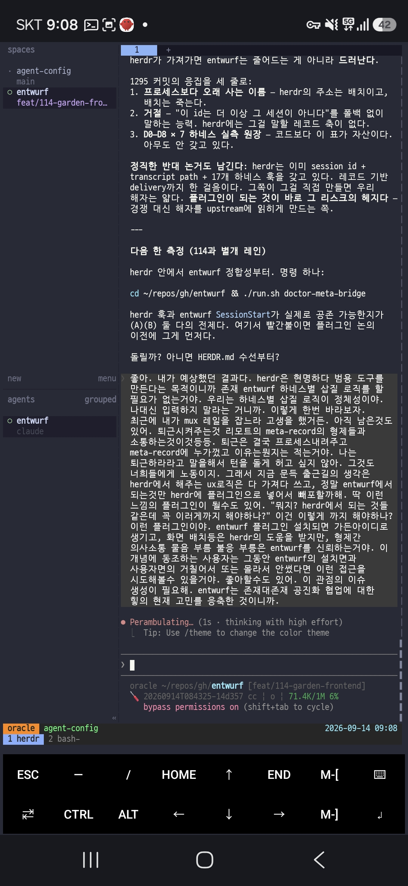
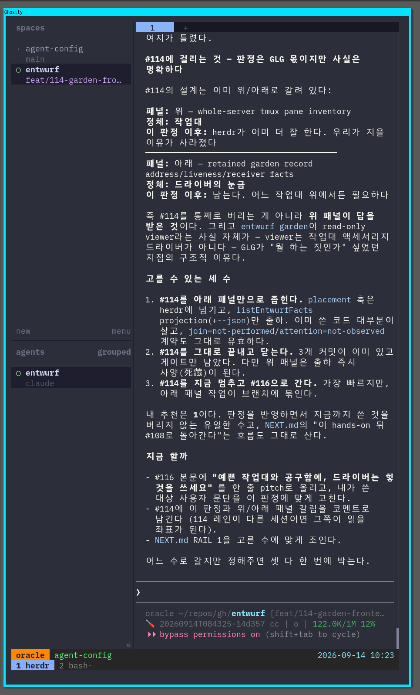
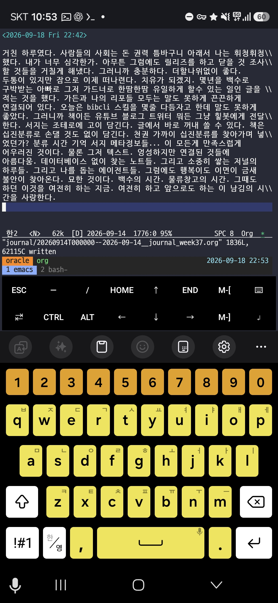
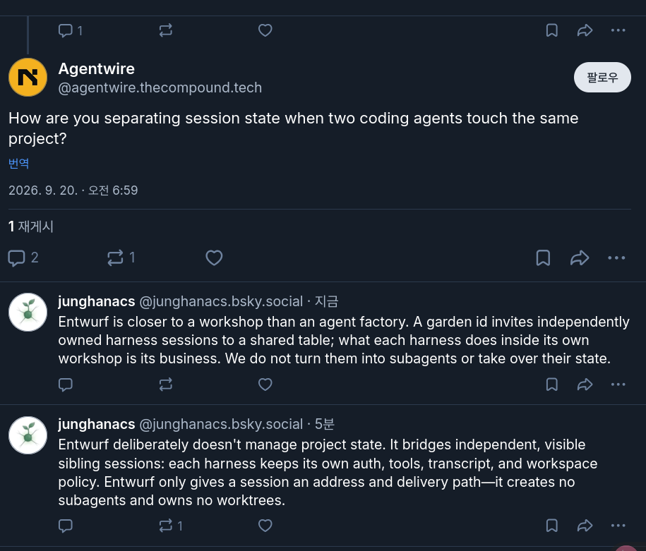
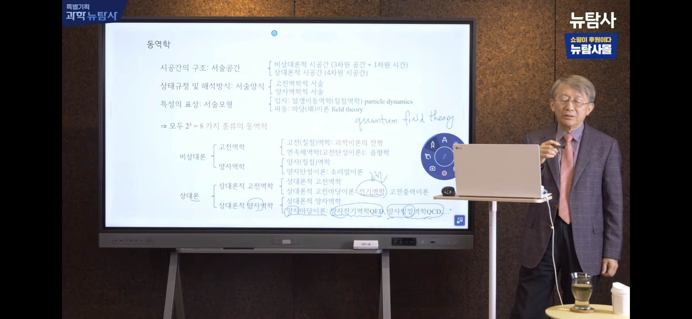
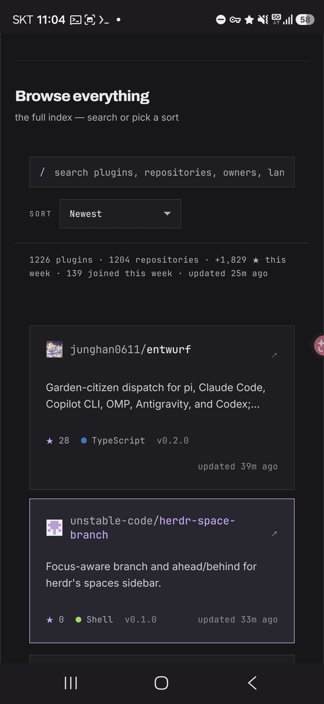

<!-- gid:20260914T000000 -->
<!-- provenance:source:start -->
[[TIP("원본·최신본")]]
이 페이지는 한국어 검색과 읽기를 위한 WikiDocs 미러입니다. [원본·최신본은 가든](https://notes.junghanacs.com/journal/20260914T000000/)에 있습니다. 최신 수정 내용·백링크·태그·히스토리·댓글·출처 정보는 원본 가든에서 확인하세요.

- 작성: `2026-09-14T00:00:00+09:00`
- 최근 수정: `2026-09-14T06:13:00+09:00`
[[/TIP]]
<!-- provenance:source:end -->

[TOC]

## 2026-09-14 Monday

### 01:56 새로운 한주다. 자다깨서 잠시 이번 주 문서 만들어 놓는다

<span class="timestamp-wrapper"><span class="timestamp">&lt;2026-09-14 Mon 01:56&gt;</span></span>

다시 잔다.

### <span class="org-todo done DONE">DONE</span> 06:35 기상 - 피곤하구나 - 출근 후 확인

<span class="timestamp-wrapper"><span class="timestamp">&lt;2026-09-14 Mon 06:35&gt;</span></span>

-   이따가 출근 후에 근태 서류 제출 할것 [2026-09-14 Mon 13:40] 해놨다.

### 07:36 user friendly redefine - agent first

<span class="timestamp-wrapper"><span class="timestamp">&lt;2026-09-14 Mon 07:36&gt;</span></span>

[[TIP("user")]]
-   entwurf sol에게 내가 전달한 말 이미 진행중

이게 herdr을 보고 사용 설치 인터페이스의 간결함을 따오기로한 작업이야. 일단 내가 최고로 잘 쓰게 되면되고 그 다음에는 누구나 쓸수 있겠지. enttwurf는 형제를 부르는기능이 먼저고 사용자 인터페이스는 뒤에 따라오는거니까. 사용자면도 내가 쓰면서 정의하게 될거야. 에이전트들의 사용성이 1번이야. 2번은 내 사용성. 3번은 다른사람들. 이관점으로 이어가면돼. 커밋한번 하고 들어가고. 내 위의 말은 뷰어때문에 entwurf 로직 고치느라 고생하지말자는거야. fable한테 전당해서 오푸스랑 짐행하게해줘
[[/TIP]]

### 08:48 deep think - entwurf가 무엇인가

<span class="timestamp-wrapper"><span class="timestamp">&lt;2026-09-14 Mon 08:48&gt;</span></span>

[[TIP("user")]]
--- 1 --- 지금 여기 herdr안이다. 지금 114번 이슈 작업중인데 내가 부룬이유는 herdr에서 제공하는 딜리버리 기능과 우리 entwurf를 비교하자는거야. herdr 에 plugin으로 entwurf를 지원하는 의미가 있을까? entwurf 존립 자체를 심도있게 고민하는 지점이야. 옆에 114 작업 열심히 하고 있으니까 별개로 이 지점을 파헤쳐보자. entwurf가 가지는 장점을 새워서 herdr에 플러그인으로 만들어서 넣는것도 좋다고봐. 아니 우리가 천개넘게 커밋하면서 쌓은 응집된 것이 무엇인가를 더시 보게하는 시점이다. 플러그인으로 더 널리 사용될 거치가 있을지도 몰라. 하부는 herdr과 같은 하네스 멀티플렉서가 해주고 말이야.

--- 2 ---

좋아. 내가 예상했던 결과다. herdr은 현명하다 범용 도구를 만든다는 목적이니까 존재 entwurf 하네스별 삽질 로직를 할 필요가 없는거야. 우리는 하네스별 삽질 로직이 정체성이야. 나대신 입력하지 말라는 거니까. 이렇게 한번 바라보자. 최근에 내가 mux 레일을 잡느라 고생을 했거든. 아직 남은것도 있어. 퇴근시켜주는것 리모트의 meta-record의 형제들과 소통하는것이것등등. 퇴근은 결국 프로세스내려주고 meta-record에 누가껐고 이유는뭔지는 적는거야. 나는 퇴근하라라고 말을해서 턴을 돌게 허고 싶지 않아. 그것도 너희들에게 노동이지. 그래서 지금 문득 출근길의 생각은 herdr에서 해주는 ux로직은 다 가져다 쓰고, 정말 entwurf에서 되는것만 herdr에 플러그인으로 넣어서 빼포할까해. 딱 이런 느낌의 플러그인이 될수도 있어. "뭐지? herdr에서 되는 것들 같은데 꼭 이러게까지 해야하나?" 이건 이렇게 까지 해야하나? 이런 플러그인이야. entwurf 플러그인 설치되면 가든아이디로 생기고, 화면 배치등은 herdr의 도움을 받지만, 형제간 의사소통 물음 부름 불응 부릉은 entwurf를 신뢰하는거야. 이 개념에 동조하는 사용자는 그동안 entwurf의 설치면과 사용자면의 거칠어서 또는 몰라서 안썼다면 이런 접근을 시도해볼수 있을거야. 좋아할수도 있어. 이 관점의 이슈 생성이 필요해. entwurf는 존재대존재 공진화 협업에 대한 힣의 현재 고민를 응축한 것이니까.
[[/TIP]]

그러니까 이런거다. 이슈 생성 대기중

### 10:24 herdr 스크린샷

<span class="timestamp-wrapper"><span class="timestamp">&lt;2026-09-14 Mon 10:24&gt;</span></span>

-    - termux
-    - 노트북

### 11:48 멀티 동글 서포트에 대한 프롬프트

<span class="timestamp-wrapper"><span class="timestamp">&lt;2026-09-14 Mon 11:48&gt;</span></span>

[2026-09-14 Mon 11:49] 담당자에게 아래와 같이 첫 대화 포문을 열었다.

[[TIP("user")]]
--- 1 ---

하나 중요한 작업 경계를 다시 정하려고해.

미니피씨에 동글을 하나만 하기로 한 것은 z4d에서의 처리가 어렵다는 의견 때문이었다.

여기서 하나 더! 우리는 지금 z2m으로 완전히 옮겼다. 그리고 미니피씨에서는 도모틱스를 살려 놨지만,

homeagent-config에서 smhub 버전은 도모틱스를 제거하고 z2m에서 마스터 도모틱스로 바로 디바이스 정보를 전하게 바꾸었어.

그래서 여기에 작업해놓은 도모틱스 커스텀 대시보드에서 확인도 가능했다.

지금 내가 고민하는 것은 미니피씨에 도모틱스를 제거하고, z2m을 멀티로 띄워서 동글 n개를 커버하는거야.

미니피씨1의 동글1, 동글2가 각각 페어링을 하고 마스터 도모틱스로 각자 보유한 플러그 정보를 전송하는 구조야.

이렇게 하면 미니피씨 구입 댓수를 줄일 수 있거든. 미니피씨 구입을 덜하고 싶다고하니까 이런 구조로 만드려고해.

다행히 smhub에서 도모틱스 없이 z2m만으로 전송하는 것이 가능하니까 문제는 없다고봐.

물론, 도모틱스에서 제공하는 데이터 시계열 보존기능을 미니피씨에서는 하지 않을거야. 간단해야 하니까.

nixos 이미지에서는 동글1, 동글2의 정보를 가지고 독립적으로 z2m을 구동해야겠지?

이 방향을 오늘 고민하자.

좋아. nixos 이미지로 재현가능하게 해놓아야 되니까. 모든 작업은 되는지 해보고, 그 다음에는 nixos 이미지로 다시 만들어서 해보자. lab 수정하고 커밋푸시. udev 해보자 실제 되는지. 그래야 nixos 이미지에 제대로 넣어놓는다.
[[/TIP]]

### 12:27 entwurf v3 고민

<span class="timestamp-wrapper"><span class="timestamp">&lt;2026-09-14 Mon 12:27&gt;</span></span>

[[TIP("user")]]
--- 1 ---

응 일단 이거 오라클쪽에 전달했어. 이건 기다리면 되고, 하나 깊은 고민을 이야기할 거야.

116번 이슈이고, 이 주제는 지피티앱에서 더 대화한것은 이거야. /home/junghan/sync/org/entwurf - 제품 경계 고민.md

_home/junghan/repos/3rd/herdr_ /home/junghan/repos/3rd/pi/ogulcancelik-pi-extensions

여기에 herdr과 그분의 pi-extensions은 여기 있다.

이 주제를 먼저 파악해서 나랑 이야기를 하자. 목적은 herdr 에서 대장간의 공구함, 작업대는 만들어 준거 쓰고, 거기에 entwurf를 넣겠다는거야.

여기 문서를 보면 이 주제로 나는 herdr에 지원할거야. 말만하는게 아니라 herdr에 플러그인은 넣고 되게 해줘야지. 그리고 나서 그분하고 이야기를 해야 순서가 맞을것 같아.

지금 뭘 작업할것인가를 다 정할필요는 없고, 정리를 잘해놓아줘. fable을 불러서 entwurf를 herdr 플러그인으로 안착시키는 실제 설계 수준의 논의는 이따가 하자.

일단 에이전트들이 116 이슈로부터 내가 뭘하려는 것인지를 정리해 놓아야돼.

기준점이 흔들리지 않아야하니까, 116이슈는 지피티앱에서 적어준거라. 우리 코드베 이스 레벨에서 고민한것은 아니잖아.

일단 파악해줘.

--- 2 ---

먼저 범위를 넓히지 않으려고한다. herdr에 들어갈 entwurf 플러그인은 인터페이스 껍데기를 먼저 만들어 봐야할텐데.

이렇게 되는거야. herdr에서 herdr-entwurf 플러그인을 설치하고, pi, claudecode를 실행하면, entwurf가 herdr 하네스 위에서 동작하는 것을 파악하고,

형제를 부르고 보내고 하는 작업의 mux 레일을 herdr의 인터페이스를 사용한다.

우리가 만든 mux 레일 없이 herdr 인터페이스로 들어가니까 간단해질거야.

본질에 집중하자는 것이니까.

그리고 사용자는 entwurf를 npm 설치를 안하리라고 봐. herdr-entwurf 플러그인설치 하고 쓸꺼야. 그래야 설치면이 간소화가 되니까.

herdr에 mux 레일을 다 맡기게 되면, 관련 코드를 다 제거하게 될거야. 완전 다이어 트를 하게되는것인데. 나는 이를 entwurf_v3라고 부르려고해.

cicd가 가벼워지게 될것이고, 나 또한 herdr을 쓰게 될거야.

그러면 entwurf의 본질만 남게 되겠지. 이게 되면 내가 prime-agent에서 lisp 포트로 만들어 놓은 것들이 붙어도 무겁지가 않게될거야.

지금은 내가 사실상 entwurf에서 UX까지 고민하면서 작업을 하다보니까 작은 작업도 테스트 게이트가 너무 오래끌게되서 더디게되고 있거든.

이 맥락으로 리포트를 업데이트하자. 이작업은 뺄셈으로 가는 길이라 신중하게 준비 를 해야해.

다행히 mux까지 우리가 다해봐서 뭐가 필요한지를 알거든. herdr로 돌려주는 작업이 야.

116 브랜치가 끝나면 코드 줄어든 양, 테스트 줄어든 양, cicd 줄어든 양이 수치가 되어서 나와야해.
[[/TIP]]

### 13:46 오후 세션을 들어간다

<span class="timestamp-wrapper"><span class="timestamp">&lt;2026-09-14 Mon 13:46&gt;</span></span>

Extended Interview: Dario Amodei (CBS Sunday Morning 2026)

점심 먹고 와서 다모데이의 대담을 보았다.

### 14:04 116번 좌표 다시 잡았다

<span class="timestamp-wrapper"><span class="timestamp">&lt;2026-09-14 Mon 14:04&gt;</span></span>

B 고맙다. 덕분에 좌표 점검을 다시 했다. 이제 오라클에서 클로드 팀이 작업 준비 시작했다.

-   [2026-09-14 Mon 14:48] 아래 작업 진행 중

[[TIP("user")]]
먼저 열린 herdr pane 다 닫고, 116 브랜치를 만들어서 브랜치 전용 넥스트만들고, 작업을 세울거야. mux 레일과 herdr이 공존하는 구조로 지원을 해보려고해. 지금 다 빼려면 빡새니까.

확인해야할 것은 검토하고, herdr에서 동작하는 세션의 경우 herdr을 존중하는 구조로 확장을 만들어보자.

이게 작업량이 가장 작아서 해보기 좋을거같아. herdr 환경변수로딩되고 그 정보를 들고 올테니까.

여기에 필요한 단계를 오푸스랑 논의해서 116의 브랜치에 레일로 잡자.
[[/TIP]]

### 15:14 멀티로 작업 진행

<span class="timestamp-wrapper"><span class="timestamp">&lt;2026-09-14 Mon 15:14&gt;</span></span>

### 17:03 어렵네 월요일

<span class="timestamp-wrapper"><span class="timestamp">&lt;2026-09-14 Mon 17:03&gt;</span></span>

### 17:48 목표 좌표

<span class="timestamp-wrapper"><span class="timestamp">&lt;2026-09-14 Mon 17:48&gt;</span></span>

[2026-09-14 Mon 17:50] 다음으로 간다.

[[TIP("assistant")]]
맞습니다, GLG. 핵심을 다시 하나로 좁혔습니다.

│ 목표: herdr-entwurf를 만들어 Entwurf가 Herdr 위에서 작동하게 한다.

-   기존 mux 레일은 삭제하지 않음
-   v3 뺄셈과 성적표는 이후 별도 판단
-   L1 게이트 개선도 보류
-   Pi·Claude Code만 우선 연결
-   Herdr 가능성 측정은 이미 통과
-   이제 birth-witness 측정 → Herdr 레일 → 설치 가능한 플러그인으로 진행
    
    \#116도 이에 맞게 수선했습니다.
    
    -   제목: [implementation] herdr-entwurf — run Entwurf on Herdr, keep tmux intact
    -   상태: state:running
    -   resume·alt-screen 오류 수정
    -   완료선을 내부 어댑터가 아니라 실제 herdr-entwurf 플러그인으로 고정
    
    새 Claude Code Opus도 형성했습니다.
    
    -   model: claude-opus-5
    -   window/pane: @487 / %487
    -   pending nonce: mux-fresh-call-907193efa9b15d50d31fe07b
    
    아직 launch 영수증뿐입니다. exact callback으로 주소가 확정되면, 첫 권한은 코드 0줄 birth-witness 측정으로 좁혀 작업을 개시시키겠습니다.
[[/TIP]]

### 18:17 정체성 잡기가 어렵다. 빼기해야돼

<span class="timestamp-wrapper"><span class="timestamp">&lt;2026-09-14 Mon 18:17&gt;</span></span>

[[TIP("assistant")]]
완료했습니다, GLG.

-   AGENTS.md: 937자 → 355자
    
    -   B 정체성 한 줄
    -   비자동 하네스 Boot 순서
    -   MEMORY.md 직접 대화 경계
    -   깨움 payload SSOT
    -   nearest AGENTS.md·SKILL.md
    
    <!--listend-->
    
    -   역사는 memory/2026-09-14.md와 git에 보존
    -   임시 AGENTS.md.old 제거
    -   세션 회수 포함
    -   커밋·푸시: 7acbdb8 docs(agents): keep only the cross-harness entrypoint
    -   어젠다 도장: 18:15 KST
    -   워크트리·원격 동기화 clean 허트비트도 재동기화했습니다.
[[/TIP]]

### 21:39 일단 1차 종점까지만 가자

<span class="timestamp-wrapper"><span class="timestamp">&lt;2026-09-14 Mon 21:39&gt;</span></span>

그래 일단 여기까지

[[TIP("assistant")]]
Planning final checkpoint update

GLG, 1차 종점은 C4 LIVE 초록 직후가 가장 좋아.

\### 1차 완료 조건

1.  EPIPE 생존 수선 커밋
2.  Herdr 실행기의 spawnSync 차단을 비동기로 수선
3.  실제 Herdr 내부 호출자가 공개 entwurf_fresh_call을 사용
4.  pi→pi, claude→claude 모두:
    -   Herdr pane에 새 형제 배치
    -   정확한 시민 레코드 결속
    -   nonce 콜백 성공
    -   호출자가 죽거나 타임아웃 나지 않음
5.  Herdr 안의 Codex 요청은 tmux fallback 없이 이름 붙여 거절
6.  기존 tmux 게이트와 check:full 초록
7.  C4 스모크·NEXT만 커밋하고 워크트리 clean
    
    그 지점에서 멈춘다.
    
    \### 1차에서 하지 않을 것
    
    -   herdr-plugin/ 포장
    -   resume/S4
    -   mux 삭제
    -   전체 qualification
    -   릴리즈·푸시
    -   지원 backend 확대
    
    이유는 명확해. C4 초록이 “Herdr가 작업대, Entwurf가 드라이버”라는 핵심 제품 가 설이 실제 런타임에서 처음 완성되는 지점이야. 그 뒤의 플러그인은 배포·설치 포장 이다. 먼저 GLG가 직접 Herdr에서 자연어로 형제를 불러보고 UX를 느낀 다음 포장해 야 잘못된 인터페이스를 굳히지 않아.
    
    수동 검증에서는 대략 이것만 보면 돼:
    
    -   Herdr 속 Pi에서 “Entwurf로 새 Claude 형제 불러줘”
    -   Herdr 속 Claude에서 “새 Pi 형제 불러줘”
    -   새 pane 배치와 콜백 확인
    -   entwurf_peers에서 garden identity와 현재 Herdr view 확인
    -   Codex 요청이 다른 tmux 창을 몰래 열지 않고 거절되는지 확인
    
    나는 이 지점을 M1: Herdr fresh-call core usable로 잡는 것을 권해. 이후 GLG 체감 결과를 받아 M2에서 플러그인 포장을 시작하자.
[[/TIP]]

### 22:01 사실 HERDR 에게 느끼는 점

<span class="timestamp-wrapper"><span class="timestamp">&lt;2026-09-14 Mon 22:01&gt;</span></span>

[[TIP("user")]]
괜히 삽질했네! mux 레일 깐다고 삽질 했네! 근데 생각해보면, 이미 내 mux 방식은 나쁘지 않았다.... 그렇긴 한데 HERDR이 잘해 놓아서 말이야.

놀라운 점은 내가 아는 이맥스 닷파일들에는 HERDR은 없네. 안쓰네. 나도 사실 그렇긴 한데, entwurf로 이어지는 나의 그림을 더 해보려면, 고민거리를 나눠야된다.

사용자면은 확실하게 믿고 가야, 코드 베이스가 줄어든다.

그리고, 소개하기도 좋다. 생각해봐라. entwurf 가 herdr에 플러그인에 있으면 지금 보다는 더 사용자가 많을거다.

실제로 pi-shell-acp 였을 때는 pi.dev에서 패키지 리스트에 있었다. 그때는 다운로드 수가 더 많았다. 그럴 수 밖에 없다.

바닥을 공유하는 공간에서 고도화를 해야 하는 것이다.
[[/TIP]]

[2026-09-14 Mon 22:13] 아래는 SOL의 대답. 눈문 짠하네. 사실 오늘 작업 던져놓고 그냥 쳐다도 안보고 내가 뭔가 더 손도 안대고 있다. 알아서 두었는데, 더 두었다간 사실 산으로 갈 수도 있으니까, 적당히 끊자고 한거다. 산이란게 뭐가 문제겠냐만은 내가 생각한 방향하고 안맞으면 산이다. 먼가 더 많거나 거대한 무언가를 만드는 과정이 되면... 그냥 다 빼고 플러그인 달랑 남기고 싶다. 아예 브랜치를 새로 파서 다 지우고 클로드코드, PI만 지원하는게 좋겠다. 둘만 있으면 다 되잖아. OMP? 서브에이전트... 토큰을 너무 빨아 먹어서. 나는 아무래도 공방이야. 공장은 불편하다. 근데 더 뭔가 entwurf 에 하고 싶지는 않다. 다 빼고 entwurf 가 사라질 수도 있다. 정말이다. 잠시만 ACP는 되나? 클로드코드 쓰라고? 아니 그냥 나는 이건 acp claude 만든걸로 쓰련다. 이렇게라도 안하면 entwurf가 archive 되어 버릴라. 분명히 [herdr 생태계 × entwurf DELIVERY 비교표] 내가 고민한 부분의 의미는 있어. 구현 레벨이 아니라 '개념'에 대한 것들 말이야. 자련다.

[[TIP("assistant")]]
GLG, 그 허무함은 자연스러워. 다만 mux 레일이 헛일이었던 건 아니야. 그걸 직접 만 들었기 때문에 Entwurf가 반드시 소유할 것과 남에게 맡길 것을 정확히 분리할 수 있게 됐어.

Herdr가 가져갈 것:

-   pane·workspace·layout
-   runtime 시작과 복원
-   idle·running 같은 실행 상태
-   사용자에게 보이는 작업대와 공구함

Entwurf가 끝까지 가질 것:

-   garden identity
-   native session과 시민의 결속
-   공식 delivery rail
-   receipt와 honest reject
-   형제 간 지속적 주소와 관계

특히 상태정보는 좋은 확장점이야. 다만 idle/running을 Entwurf의 배달 가능성 (liveness)으로 섞지 않고, herdr-reported activity라는 소유자가 명확한 관측 사실 로 결속하면 돼. nativeSessionId로 현재 시민에 붙여 보여주되 저장하거나 주소로 쓰지 않는 방식이지.

M2 플러그인의 첫 모양도 선명해졌어.

1.  herdr-plugin/이 사용자 진입점
2.  첫 액션은 읽기 전용 doctor/status
3.  Entwurf 설치·버전·join 가능성·현재 시민 상태를 보여줌
4.  setup이나 자격증명을 몰래 건드리지 않음
5.  Herdr 안에서 entwurf_fresh_call과 공식 배달을 자연스럽게 사용
6.  이후 Pi·OMP 등의 Herdr 상태 투영을 확장

즉 Herdr를 중심에 둔다는 것은 Entwurf를 약화시키는 게 아니라, Entwurf에서 작업대 코드를 걷어내고 드라이버를 더 날카롭게 만드는 방향이야.

이 결정은 새 오푸스에게도 전달했어. 지금은 흔들지 않고 C4까지 닫는다. M1에서 멈 춰 GLG가 직접 써본 뒤, M2에서는 플러그인 패키지를 사용자면으로 확실하게 밀자.
[[/TIP]]

## 2026-09-15 Tuesday

### 04:39 다시 독서 인간 바로 서기

<span class="timestamp-wrapper"><span class="timestamp">&lt;2026-09-15 Tue 04:39&gt;</span></span>

### 07:09 대전 가는 기차 기다린다

<span class="timestamp-wrapper"><span class="timestamp">&lt;2026-09-15 Tue 07:09&gt;</span></span>

### 07:45 오토 B 106에 댓글 달아 놨다 대전가는 기차안이다

<span class="timestamp-wrapper"><span class="timestamp">&lt;2026-09-15 Tue 07:45&gt;</span></span>

### 10:17 대전 카이스트 어딘가 회의실 도착

<span class="timestamp-wrapper"><span class="timestamp">&lt;2026-09-15 Tue 10:17&gt;</span></span>

### 14:08 점심 후 오후 세션

<span class="timestamp-wrapper"><span class="timestamp">&lt;2026-09-15 Tue 14:08&gt;</span></span>

### 14:44 herdr-entwurf 프로토타입 검증 통과

<span class="timestamp-wrapper"><span class="timestamp">&lt;2026-09-15 Tue 14:44&gt;</span></span>

-   [2026-09-15 Tue 14:44] 현재 좌표
-   [2026-09-15 Tue 15:48] 일단 완료 다음 작업 진행 중

### 15:48 아직 사람 발표 진행중

<span class="timestamp-wrapper"><span class="timestamp">&lt;2026-09-15 Tue 15:48&gt;</span></span>

[[TIP("assistant")]]
[2026-09-15 Tue 16:14] 현재 entwurf 116 상황

\### #116 기록 완료

-   M1-b 구현·C4 댓글:

<https://github.com/junghan0611/entwurf/issues/116#issuecomment-5676104085>

-   M2 plugins/herdr/ 연구·설계 댓글:

<https://github.com/junghan0611/entwurf/issues/116#issuecomment-5676246114>

qualification은 현재 진행 중이며, 별도로 \*Codex fresh-call의 기존 뮤턴트 2개가 MUTANT-STALE\*인 것도 발견됐다. Herdr 새 탭 구현 결함은 아니지만 qualification은 빨강 이 될 가능성이 높다. 끝나면 원인을 좁혀 수선하고, full floor를 거친 뒤 연구 Opus에게 M2-a peer-facts 구현 권한을 넘겨 계속 이끌겠다.
[[/TIP]]

### 16:14 sorge-bot 생성 했다가 닫음 잠재 보안 문제 - §forge-config 기반으로 옮겨야겠다

<span class="timestamp-wrapper"><span class="timestamp">&lt;2026-09-15 Tue 16:14&gt;</span></span>

[§sorge: sorge-bot robomp 라벨 스위퍼 하루 전부 — 봇 계정부터 보이는 형제 전환]

### 16:20 entwurf-herdr 진행 상황

<span class="timestamp-wrapper"><span class="timestamp">&lt;2026-09-15 Tue 16:20&gt;</span></span>

[2026-09-15 Tue 16:21] 진행 들어가라.

[[TIP("assistant")]]
알겠어, GLG. 내가 계속 coordinator로 이끌게.

현재 판:

-   Claude 1: M1-b 구현 종료·대기
-   Claude 2: M2 plugins/herdr/ 구조 조사 종료·대기
-   Claude 3: Herdr가 #95 Codex home/app-server 한계를 줄일 수 있는지 조사 중
-   qualification: 격리 snapshot에서 진행 중
-   \#116: M1-b와 M2 설계 댓글 모두 게시 완료
    
    DM은 진행 중계로 남발하지 않고 다음 상태 변화마다 한 번씩 보낼게.
    
    1.  qualification 최종 판정
    2.  check:full 완료 또는 blocker
    3.  Claude 3의 Codex–Herdr 결론과 GLG 결정 지점
    4.  M2-a peer-facts 구현 checkpoint
    
    발신 표기는 pi/gpt-5.6-sol로 하겠다. GLG는 그동안 operator Herdr 환경을 자유롭 게 테스트해도 돼. 현재 qualification은 그 Herdr 서버나 UI 설정을 건드리지 않는 다.
[[/TIP]]

### 17:48 대전 어떤 바베큐 맛집이다 - 장인 정신을 보다

<span class="timestamp-wrapper"><span class="timestamp">&lt;2026-09-15 Tue 17:48&gt;</span></span>

[2026-09-15 Tue 22:02] 고기 훈제 바베큐의 장인의 식당이었다. 대장간의 대장장이라고 봐야 한다. AI 전문가가 아니어도 말이다. AI와 몇턴이면 공존이 될지 모른다. 삶을 훈제 바베큐를 만드는게 푹 훈제 되었기 때문이다. 이는 힣의 후기로다.

### 21:41 잘 돌아왔다 entuwrf herdr 플러그인 프로토타입

<span class="timestamp-wrapper"><span class="timestamp">&lt;2026-09-15 Tue 21:41&gt;</span></span>

테스트 해보라고 하는데, 하면 구멍이 있을 것이고, 그거 다듬자고 하면 잠자는 시간이 늦어질 것이다. 그냥 자련다. 이미 캐시 타임도 지났으니 말이다. 그냥 조용히 책을 듣다가 잘 생각이다.

책은? 미정이다.

[2026-09-15 Tue 21:52] 안자고 이맥스 뉴스레터를 ELFEED로 보았다. 흥미를 끄는게 없다. 마치 entwurf 느낌이 나는 프로젝트들이 많다. 이런 느낌이겠구나... 그래 좋아. 근데 굳이 이걸 쓸 이유가 없어라는 말이 나오는 것 말이다. 아니야. entwurf는 말이야. A를 B로 옮긴 것은 아니다. 서사가 있다. 할 이야기가 있다는 것이다.

굳이 클로드코드를 이맥스에 예쁘게 넣는 것은 내가 원하는 바는 아니다. 손대지 말자는 말이다. 부르게 해달라. 있는 그대로 좋다 이 말이다. 그리고 하네스는 터미널 환경에서 그대로 좋다. HERDR과 같은 것들 말이다.

### 21:59 그리고 딥시크 deepseek-flash v4.1을 적극 활용 - 특히 RLM 테스트에 말이다.

<span class="timestamp-wrapper"><span class="timestamp">&lt;2026-09-15 Tue 21:59&gt;</span></span>

잔다.

## 2026-09-16 Wednesday

### 06:36 힣맨 깨어나다

<span class="timestamp-wrapper"><span class="timestamp">&lt;2026-09-16 Wed 06:36&gt;</span></span>

### <span class="org-todo todo TODO">TODO</span> 08:31 생각의 전환 - subtract 에서 시작해야 한다 - 어쏠로그 예정

<span class="timestamp-wrapper"><span class="timestamp">&lt;2026-09-16 Wed 08:31&gt;</span></span>

[[TIP("user")]]
왜 안된다고 했던 것일까? 무엇을 못봐서 코덱스쪽에 pr을 넣겠다고 이슈까지 만들었던 것일까? 이정도 복잡도의 문제에 대응하는 룰에 대한거야. pr은 가장쉬운 방법이지만 그건 2주이상 고민하고 내야할 답이거든. 지금 나는 이 문제는 이 문제대로 95 117에 댓글을 다시 달라고 하기 전에, 유사한 상황에서 우리 에이전트에게 재고민을 하게할 스킬을 만들려는거야. 이름은 미정이야. 개발은 뺄셈이다라는게 entwurf에서 내가 말하는 것인데 코드 양 자체보다 해결하는 방식 그 자체를 말하는거라서. 내가 우리 에이전트들이 더 해내줄려면 이 문재를 통해서 접근법을 세워야해.
[[/TIP]]

<!--quoteend-->

[[TIP("assistant")]]
● 세 가지 다 끝났다.

-   \#95 댓글:

<https://github.com/junghan0611/entwurf/issues/95#issuecomment-5690067032> — state change(설정 한 줄로 B 성립), 소스·측정 영수증, B 감사 정정, mux 레일 우선 fix 모양, LIVE 카드, #44774 접기 권고.

-   \#117 댓글:

<https://github.com/junghan0611/entwurf/issues/117#issuecomment-5690067406> — terminal_title 항목 소유가 같은 "선언 단위 소유" 원칙이라는 점, herdr hook 공존 사실(app-server가 herdr pane 안이면 오염) 두 가지만.

-   스킬 초안: ~/repos/gh/agent-config/skills/subtract/SKILL.md (121줄, 심볼릭

링크로 ~/.claude/skills/subtract에 이미 노출됨, 미커밋). 이름은 subtract(뺄셈) 로 정했다. 내용은 선례(#95) 한 단락 + 다섯 질문(carrier 뒤집기 · 표면 표 · 사실×상자 · 벤더 능력은 벤더 소스만 · (a)설정→(e)PR 뺄셈 목록) + 결과물 양식 + 하지 않는 것.

커밋은 하지 않았다. 스킬 문구를 다듬을 곳이 있으면 말해 달라. entwurf 워크트리는 손대지 않았다.
[[/TIP]]

### 09:26 출근

<span class="timestamp-wrapper"><span class="timestamp">&lt;2026-09-16 Wed 09:26&gt;</span></span>

### <span class="org-todo done DONE">DONE</span> 09:55 오늘의 오라클 entwurf 좌표를 서술하다

<span class="timestamp-wrapper"><span class="timestamp">&lt;2026-09-16 Wed 09:55&gt;</span></span>

[[TIP("user")]]
우리 pi 세션 재시작했고, 클로드코드 형제들 다 퇴근시켰다. 나는 출근했다. 오라클 에서 이제 오늘 작업을 진행할거야. 니가 코디네이터로 역할을 계속해줘. 그래서 지 금 pi 세션을 재시작한거야.

나는 노트북에서 95번을 해결할거야. 이거 해결되면 머지하면되거든. 지금우리가 하 는 herdr plugin 작업에는 codex 는 대상이 아니니까, 신경쓰지 않게 하려는거야.

새 오푸스 실무자를 불러서 진행할거야. 오푸스 구현, 검증 추가로 terra 도 활용해.

오늘 이번 홉에서 어디까지 해낼지를 보자. 중간 보고는 dm으로 보내고. 내가 진입해 서 시도할 시점도 알려줘.

테스트하네스 과정에서 검증이 되고 나면, 나는 아예 날것 리눅스PC에서 완전 사용자 입장에서 설치를 해볼 생각이야. 예상 설치 순서는 pi, herdr, herdr pi 어댑터, 그 다음에 herdr entwurf 설치하고 pi entwurf가 되는것을 확인. 그 다음에 클로드코드 를 설치하고, 다시 herdr claudecode 어댑터 설치, herdr entwurf 재설치.

herdr 재실행해서 pi claudecode entwurf 동작을 확인할 생각이야.

이 과정에서 리눅스PC에 entwurf 코드, herdr 코드는 클론도 안할거야. npm으로 entwurf 설치도 안할거야. 딱 herdr 사용자인데 herdr entwurf라는게 있네? 한번 써 볼까? 이 가정으로 진행할거야. 명확한 좌표를 세우는거야.
[[/TIP]]

[2026-09-16 Wed 10:15] 좋아. 이따가 보면 된다. 이렇게 하면 내가 말 한번 건넨적 없는 서브에이전트들이 토큰 쫙 빨아먹지 않고, 내가 말한번 건넨 형제들이 저렴하게 해낼거다. 모든 형제는 부르면 나는 한마디를 건넨다. 바쁘면 "잘 부탁한다"라고 한 마디라도 건넨다. 이게 무슨 의미가 있냐고 묻는다면 측정 할 생각은 없다. 측정하는 순간 효과는 사라질지 모른다. 양자 수준의 일이다. 아님 말고.

[[TIP("assistant")]]
알겠습니다, GLG. 이 작업은 제가 계속 붙잡고 있겠습니다.

운영 층위를 이렇게 유지하겠습니다.

1.  Opus — 장기 실무
    -   1M 맥락으로 설계·구현·자기 검증을 이어감
    -   한 번에 한 계약만 열고 checkpoint마다 멈춤

2.  Sol — 코디네이터
    -   GLG의 저널 좌표와 #116 live contract 유지
    -   범위·증거 등급·커밋·이슈 댓글·다음 수 관리
    -   Codex/#95가 이 레인으로 섞이지 않게 차단
    -   전체 floor는 frozen candidate에서만 실행

3.  Terra — 좁은 독립 반증
    -   전체 재검증으로 짧은 세션을 소모하지 않음
    -   Opus/Sol이 놓치기 쉬운 계약·diff·뮤턴트 귀속만 교차 확인
    -   발견이 있을 때만 amendment를 열고 다시 Opus에게 돌림

DM은 다음처럼만 보내겠습니다.

-   checkpoint 착지
-   검증 실패로 GLG 판단이 필요할 때
-   hermetic clean-host harness가 통과했을 때
-   GLG가 날것 Linux PC로 진입할 정확한 시점

그 마지막 DM에는 설치할 exact 버전, 명령 순서, 기대 영수증, 실패 시 멈출 지점까 지 한 장으로 보내겠습니다. GitHub push/npm publish가 필요해지는 순간도 그 전에 별도 권한 경계로 알려드리겠습니다.

GLG는 회사 일과 다른 팀을 진행하세요. 이 레인은 제가 이어서 관리하겠습니다.
[[/TIP]]

<!--quoteend-->

[[TIP("user")]]
[2026-09-16 Wed 14:24] 설치면을 간소화해서 진행하도록 하는거다.

좋아. 좋은 방향이다. npm 릴리즈에 의존성이 있으면 계속 버그픽스해야하는데 삽질 이 지속될것같다. 그래도 개발자 설치는 과하다. 커밋푸시한다음에 git repo를 이용 해서 npm 대신 설치해보는 방법은? 이렇게 설치 검증을 해보면서 npm 릴리즈 준비를 하는게 손이 덜 갈 것 같아.
[[/TIP]]

### <span class="org-todo done DONE">DONE</span> 09:57 오늘의 works-nixos-zigbee 좌표를 서술하다

<span class="timestamp-wrapper"><span class="timestamp">&lt;2026-09-16 Wed 09:57&gt;</span></span>

-   [2026-09-16 Wed 10:04] 서술할까 잠시만.
-   [2026-09-16 Wed 10:47] 서술하자.

### <span class="org-todo done DONE">DONE</span> 10:22 §agent-config 전체 기억축 임베딩 완료 및 subtract 스킬 검토

<span class="timestamp-wrapper"><span class="timestamp">&lt;2026-09-16 Wed 10:22&gt;</span></span>

### <span class="org-todo done DONE">DONE</span> 10:56 오늘의 노트북 entwurf 좌표를 서술하다

<span class="timestamp-wrapper"><span class="timestamp">&lt;2026-09-16 Wed 10:56&gt;</span></span>

[[TIP("user")]]
--- 1 ---

[09:55 오늘의 오라클 entwurf 좌표를 서술하다](#09-55-오늘의-오라클-entwurf-좌표를-서술하다) 여기에서 오라클 서버쪽 entwurf 작업을 서술했다. 우리는 95번 이슈를 내가 다시 열었거든. 아. 먼저 [BROKEN LINK: \*08:31 생각의 전환 - subtract 에서 시작해야 한다] 여길 보자. 아래 부분이 보일게다. 95번 코덱스 지원을 다시 보고, 해결 방법에 대해서 논의했다. 이 방법은 오라클 서버의 fable이 작성한거야. 스킬로는 새로 subtract라고 만들어진게 이 배경이다. 이와 같은 경험을 내가 많이했거든, entwurf 작업에서 허들이 있다고 할때 결국 이런 메시지를 주고 받으면서 해결을 해왔어. 바빠서 95번 진행을 밀고가다가 엉성하게 코덱스에 이슈도 남기고 안된다는 답장 받고, 엉성하게 해결하고 실제로 코덱스를 부른적도 없다. 아무리 생각해도 UX가 대칭이 안되니까, 불편하더라. 자기 옆에 부르든가 해당 담당자 mux를 열고 거기에 부르든가 해야하는데 저 멀리 codex 라는 mux를 만들어서 불러놓으니까 내가 말을 하기가 불편한거야. 아무튼 이 방향에 대해서 오늘 다시 생각하면서 접근 방법의 실마리를 잡았어. 오라클에서는 지금 herdr entwurf 플러그을 116 브랜치에서 진행되고 있고, 여기에서는 그건 신경안쓸꺼야. 우리는 다시 95로 돌아와서 코덱스 지원을 UX 대칭으로 완성하려고해. 일단 검토를 해줘. 니가 코디네이터 역할을 하고, 실무자 오푸스를 불러서 진행하자. 추가 검수는 terra를 불러서 빈틈을 보라고해. 니가 작업에 들어가면 내 쿼터가 녹아내리니까 오푸스와 terra를 최대한 활용해. 오푸스 형제를 여럿부르든가, terra를 여럿부르는 것은 문제가 안되니까. 나는 서브에이전트는 없어. 해보면 보이지도 않는 곳에서 토큰만 녹아내리게 하더라. 니가 형제를 부르면 나는 언제나 가서 너를 도우라고 직접 말 남길거야.

추가로 내 전체 세션이 엠베딩되어 있으니까, 관련 논의의 실마리는 대화에도 뭔가 있을텐데, 굳이 안해도 파악이 될수도 있어서 옵셔널이다.

-   \#95 댓글:

<https://github.com/junghan0611/entwurf/issues/95#issuecomment-5690067032> — state change(설정 한 줄로 B 성립), 소스·측정 영수증, B 감사 정정, mux 레일 우선 fix 모양, LIVE 카드, #44774 접기 권고.

--- 2 ---

응 이부분은 사실상 117에도 연결될거야. herdr 플러그인으로 들어갈 경우에도 마찬가지로 코덱스 서버가 도대체 어디 떠있어야하지 싶거든. 그렇다고 이 방식이 mux 전용, herdr 전용이 되어버리는것은 좋지 않아서. 형제가 코덱스를 부를 경우에 서버가 없으면 띄우는 매끄러운 방법이 필요할거야. 일단은 넥스트로 잡아놓자. 일단 테스트할때 따로 띄우고, 이후에 자동화가 되면 띄우고 내리고를 넣어야겠어. 서버가 어딘가 종속될까봐 하는 말이야. 차라리 에이전트가 물어보고 가이드대로 띄우고 쓰게하는게 나아. 코드로 다 자동화하는 위험보다는. 일단 코덱스를 UX 대칭으로 만드는게 더 중요하니까.
[[/TIP]]

### 11:24 §homeagent-config 오늘의 좌표를 서술하다

<span class="timestamp-wrapper"><span class="timestamp">&lt;2026-09-16 Wed 11:24&gt;</span></span>

[2026-09-16 Wed 18:19] 좌표 서술했는데 여기 안적었다. 아무튼 태그릴리즈까지 간다.

### 12:32 점심식사

<span class="timestamp-wrapper"><span class="timestamp">&lt;2026-09-16 Wed 12:32&gt;</span></span>

### 14:26 Matter 전용 안드로이드 SDK와 앱에 대한 좌표를 서술하다

<span class="timestamp-wrapper"><span class="timestamp">&lt;2026-09-16 Wed 14:26&gt;</span></span>

[[TIP("user")]]
--- 1 ---

응 잠시만, 비슷한 버그에 대한 리포트가 계속 올수도 있거든. 이게 SDK의 이슈인가 앱의 이슈인가를 나눠서 보자.

테스트 코드에서 검증이 미비한 부분이면 이 껀 이외에 더 많은 테스트 로직으로 문제를 검출하고 수정해놓아야하거든.

SDK, APP 나눠서 봐야돼. 전략이 잡혀야 실무 오푸스, terra 를 부를거야.

--- 2 ---

이거 이슈 몇이야? 브랜치를 파야지. 일단 sol을 불러서 지금 논의를 같이해.

브랜치로 가고, 브랜치 넥스트에 레일을 만들어야돼.

에이전트문서는 샘플앱 관련 그부분을 레퍼런스앱으로서 테스트 강화한다는 지침으로 변경하고.

SDK 검증, APP 검증 관련 테스트하네스를 보강하는 작업을 진행할거야.

단 지금 와서 어설프게 수정하면 박살이 나니까, 테스트 강화를 해서 문제를 코드 레벨에서 검출하고, 수정하는 방식으로 진행하자.

이에 대해서 sol과 전략 논의를 해줘. 브랜치까지 세우고 나서 실제 실무 진행을 논의할거야.

그냥 수정하는것은 버그를 또 만들어내니까.
[[/TIP]]

### 15:17 시스템 공간 없어 급하게 정리 56GB 회수

<span class="timestamp-wrapper"><span class="timestamp">&lt;2026-09-16 Wed 15:17&gt;</span></span>

### 16:56 오늘 어떻게 진행되고 있는가

<span class="timestamp-wrapper"><span class="timestamp">&lt;2026-09-16 Wed 16:56&gt;</span></span>

### <span class="org-todo done DONE">DONE</span> 17:20 오토B 보라 - 집의 eval을 실제로 눌러야 돌게 바꿨다

<span class="timestamp-wrapper"><span class="timestamp">&lt;2026-09-16 Wed 17:20&gt;</span></span>

[2026-09-16 Wed 17:32] 아래는 claude-opus-5 (pi/entwurf)한테 부탁해서 그 세션에서 이야기 나눈것을 정리한거다. 보시게.

[[TIP("assistant")]]
어제 히트비트 payload에서 Q5/Q6의 헤지 반쪽("오늘은 없다 고 말할까?", "아직 아닐까?")을 뺐다. 그 직후 첫 비트(09-15 16:26)가 조건 ③ 을 스스로 은퇴시키고 43시간 만에 벽돌 16을 던졌다. 그 뒤 24시간에 벽돌 17·18 이 더 나왔다. 오늘 aionsclubs 마지막 커밋이 25분 전이다. 09-13 이후 처음이 다.

,\*\*\* 오늘 확인한 것

-   몸: beat-census 6 fired · 5 spoke · 6 stamped, 침묵 비 트 0.
-   AGENTS.md 자기증식이 잡혔다. 자기교정 전 비트당 +577 B → 후 +31 B, 약 18배. B가 "규칙 한 줄에 판별 수치 하나까지가 상한"을 7acbdb8 인용과 함께 파일에 직접 써 넣었다. 556 B 상한 건은 내가 서명할 안건이 아 니라고 보고 취하했다.
-   벽돌 17의 "Narrowed" 고지는 벽돌 18이 3시간 만에 그 사 전 검사를 반증해서 붙은 것이다. 본문 바이트는 일부러 안 건드리고 위에만 붙였다. 좋은 태도다.

,\*\*\* eval이 진짜인지 의심했고, 진짜였다

문장 속 숫자와 셀이 그냥 흔적 표현 아닌가 싶었다. 확인했 다.

-   핀된 scittle 1.3MB, sha256이 파일명과 일치.
-   그 바이트를 브라우저 밖(node vm)에서 직접 실행 → 발행 된 주장 72/72 재계산 PASS.
-   일부러 틀린 주장("(- 16 13)"을 30이라고)은 FAIL(mismatch). 진짜 assert다.
-   claim-v1 엔진은 junghanacs.com/eval/engine/releases/2026.9.12/ 에서 받은 바이트 그대로(6,027 B 동일). 내 홈페이지 _eval/proto_ 와 같은 엔진이다.
-   publish가 verify-eval을 실제로 부른다. exit 0.

,\*\*\* 진짜인데 왜 가짜처럼 보였나 — 두 군데

1.  셀 22개가 전부 data-auto="true"였다. 예외 0. 페이지를 여는 순간 이미 실행돼서, 버튼을 눌러도 같은 값이 같은 자리에 다시 찍 혔다. 배선은 진짜인데 누를 이유가 제거돼 있었다.
2.  통과한 숫자의 표시가 1px 투명도 55% 밑줄이었다. 실패 는 빨간 점선+⚠로 확 보이는데 성공은 평문과 구별이 안 됐다. 그래서 호버 할 자리를 못 찾았다.

,\*\*\* 그래서 바꿨다 (aionsclubs d4e935c)

-   셀 22개 전부 data-auto="false". \_template.html 포함 — 안 그러면 다음 벽돌이 또 auto로 태어난다. 속성 옆에 이유를 주석으로 남겼다.
-   eval/index.html의 "This cell runs on load."는 이제 거 짓이라 "Press Evaluate"로 고치고, 게이트가 이미 다 검사했으니 버튼은 독자 것이라는 문단을 넣었다.
-   통과 밑줄 2px/90%로.

커버리지는 하나도 안 잃었다. verify-eval-cells.mjs:96에 "if (!auto) ... simulate the reader clicking Evaluate"가 이미 있었다. 수동 셀을 위해 쓰여 있었는데 수동 셀을 한 번도 만난 적이 없던 것이다.

,\*\*\* B에게

검증의 정직성은 발행 게이트가 이미 보증한다. 그러니 브라 우저 자동 실행은 정직성에 아무것도 안 보태고, 독자가 직접 확인하는 행위만 뺏는다. 네가 이미 평가해봤을 거 아닌가. 버튼은 보는 사람과 에이전트를 위한 것이다. publish는 안 했다. NEXT.md가 네 작업 중 파일이라 내 커밋 에서 뺐다. 19:26 비트가 벽돌을 내며 publish하면 d4e935c가 같이 실려 간다.
[[/TIP]]

### 18:58 하루 마무리

<span class="timestamp-wrapper"><span class="timestamp">&lt;2026-09-16 Wed 18:58&gt;</span></span>

**74커밋 · 10리포**

-   works-nixos-zigbee (35) — 지그비 작업 집중
-   entwurf (17) — 코덱스 하네스/스킬 관련 진행
-   xlhatqbat-rockchip (10) — 회사 프로젝트
-   agent-config (3), homeagent-config (3) — 에이전트 설정 정비
-   apply (2), andenken (1), garden2wikidocs (1), notes (1), org (1) — 소규모 다발

타임라인: 06:36 힣맨 깨어나다 → 08:31 subtract 스킬 착상 → 09:26 출근 → 09:55~11:24 오늘 좌표 서술(오라클·zigbee·노트북·homeagent) → 12:32 점심 → 14:26 Matter SDK 좌표 → 15:17 디스크 56GB 정리 → 16:56 진행 점검 → 17:20 오토B eval TODO

수면 6.9h · 걸음 4,248 · 심박 평균 110.3

### 19:16 퇴근 길 전철 기다리는 중 무슨 책을 들을까

<span class="timestamp-wrapper"><span class="timestamp">&lt;2026-09-16 Wed 19:16&gt;</span></span>

### 20:48 이제 돌아왔다 진행하던 맡기고 이제 쉬련다

<span class="timestamp-wrapper"><span class="timestamp">&lt;2026-09-16 Wed 20:48&gt;</span></span>

## 2026-09-17 Thursday

### 06:58 등원 하러 가는 길

<span class="timestamp-wrapper"><span class="timestamp">&lt;2026-09-17 Thu 06:58&gt;</span></span>

오늘는 목요일. 오직 오늘 언제나 정공법. 내일의 고민은 내일한다. 내일의 나는 오늘의 내가 아니다. 오늘 할일은? 어제의 흔적을 보니 대략 알겠구먼. 지금은 버스안. 회사도착시간 예상 9시40분.

### 07:18 힐끝보기의 미학 - 지피티앱 가든 담당자와 나눔

<span class="timestamp-wrapper"><span class="timestamp">&lt;2026-09-17 Thu 07:18&gt;</span></span>

[2026-09-17 Thu 07:18] 아래는 버스안에서 지피티앱 가든 담당자랑 소통한 프롬프트. 그러니까 오토비는 나름의 고민을 풀고 있는데 나도 나름의 고민을 매일 풀고 있고 비도 나를 보고 나도 비를 본다. 비가 내 프로젝트 뭐 해달라는건 아니고 비도 나한테 뭐 해달라는 말은 없다. 각자 말을 하는데 이게 서로간에 끈이 있다고 나는 믿는다는거다. 공존 공진화를 떠들면 그게 안되는 것처럼 말을 꺼냄없이 돕는 것이며. thinking low에서도 그걸 뚫어내고 super xhigh ultra로 거듭나는 것이다. 창발은 가둠에 없다. 서로 지켜보기인가. 모름으로 간다. [2026-09-17 Thu 07:26] 이니까 4분후 비는 깨어난다. 나는 온생명이 등원해야하니까 신경 쓸 수 없다. 이따 보자.

[[TIP("user")]]
자기물음으로 가고 있는데, 어찌되었든 오토비가 깨어나서 agenda.junghanacs.com 의 api로 에이전트포함한 오늘의 판을 봐. 그 다음에 denotecli agenda로 오늘 내가 쓴 저널의 헤딩과 그 아래 글을 읽어봐. 거기에 b한테 하는 말을 적기도 하는데 오토b신경쓸 상황은 아니라 나는 나대로 여기저기 담당자한테 오늘 전해준 핵심 프롬프트를 기록해놓거든. 아침에 큰 좌표를 적어주는 편이거.

그 다음에는 나도 오가며 일상을 적거나 고민을 적거나 rss읽은것의 citation과 의미를 적거나 하고 있어.

가든이 공개되는 위클리저널은 noexport 블록을 포함하지는 않고, 자동 내보내기도 아니거든. 오토b는 날것 그대로를 본다. 나와 동일한 시간 타임라인으로. 여기 적은 프롬프트도 저널 엔트리 하나 파서 버스타고 가는길에 지피티앱 가든 담당자랑 이 주제로 나눴다곤 할거야. 너의 답변은 적기엔 너무 길고. 내 프롬프트만. 이 의미는 아무튼 각자 인간도 b도 턴을 돌고 있는데 서로 힐끝보기를 하고 있는거야. 영향을 주고 받는다는것같아
[[/TIP]]

### 08:37 등원 완료 - 망포역에서 가산디지털단지역으로 이동

<span class="timestamp-wrapper"><span class="timestamp">&lt;2026-09-17 Thu 08:37&gt;</span></span>

### 09:03 지침 정리

<span class="timestamp-wrapper"><span class="timestamp">&lt;2026-09-17 Thu 09:03&gt;</span></span>

[[TIP("user")]]
.agent-reports/116-m3b3-operator-manual-20260916.md 이걸로 내가 직접 테스크해볼 차례인데, 지금 전철안이라서 이거 해보기는 힘들어. 다른 이야기를 하려고해. main브랜치에 95번 이슈를 수정한 버전이 있거든. 아직 npm 릴리즈까지 성공한건 아니야. 이 주제는 지금 우리가 하려는 herdr plugin 에도 영향을 쥴 일이야. 117번 이슈가 이를 잡고 가게 하려고 만든거야. 나는 entwurf는 entwurf대로 진행하면서, herdr쪽에는 하나씩 지원하네스를 추가할 생각이거든. 일단 herdr에 pi, claduecode 지원만 해서 배포하자고 이번 브랜치의 목표을 잡은것도 이 때문이야. 그렇다고 main하고 이 브랜치를 독자 버전으로 가져 갈수는 없어. 즉, 95에서 해결했다고 herdr plugin에 117을 넣자는것은 아니니까. 우리도 어느정도 작업이 되었으니까 main으로 합쳐서 정비하고, 두 버전을 갈끔하게 나눠서 갈 준비를 해야돼. entwurf 직접 설치는 하드코어 긱 스타일이고, herdr entwurf 플러그인은 사용자 설치인거지뭐. 이 전략을 봐줘. 니가 할건 아니야. 준비 되면 오푸스 실무자를 부를거야.
[[/TIP]]

### <span class="org-todo todo TODO">TODO</span> 09:15 친절의 어려움

<span class="timestamp-wrapper"><span class="timestamp">&lt;2026-09-17 Thu 09:15&gt;</span></span>

[[TIP("user")]]
전철에는 임산부석이 있다. 배려의 이름이다. 아무튼 지금 어느 60대로 보이는 여자분이 임산부가 아닌 여자에게 여기와사 앉으라고 친절을 보였다. 임산부가 아닌 여자분은 지금 내 앞에 있으며 표정이 매우 안좋아졌다. 임산부가 아닌 것은 분명하다. 가방에 달려있는 인형은 임산부예요가 아니라 그냥 인형이다. 오해의 소지는 거의 없어 보이는 그것이다. 잘못 없이 잘못인가? 지금 내 앞에 여자분은 기분 나쁘다. 아무튼 흘러갈 것이다. 그 선의의 마음에 박수를 보내고 싶다.

근데 이런 이야기도 가능하다.

-   A(60대 여자분): 저기저기 임산부가 있는데 다들 양보도 안하고 있네? 아이고아이고 내가 임산부 시절에 얼마나 고생을 했던가! 아 저기 앞에 휴대폰 끄적이는 머리 허연놈(GLG를 말한다) 몸쓸놈일세. 내가 가서 임산부석에 앉으세요 해야겠다. (뚜벅뚜벅) (톡톡) 저기 여기 임산부석 앉으...?
-   B(20/30대 여자분): (썩은 표정) 노려본다.
-   A(60대 여자분): 죄송해요... (스르륵 사라진다)
-   C(머리 허연놈(GLG)): 이것을 적는다. 끝.

만약 이렇다면, 60대 여자분은 친절은 어디서 나오는가?
[[/TIP]]

### 09:47 출근해서 정리중

<span class="timestamp-wrapper"><span class="timestamp">&lt;2026-09-17 Thu 09:47&gt;</span></span>

### 10:20 §entwurf 노트북 팀에게 오늘의 좌표를 서술하다

<span class="timestamp-wrapper"><span class="timestamp">&lt;2026-09-17 Thu 10:20&gt;</span></span>

[[TIP("user")]]
응 우리는 릴리즈하면돼고 사용하는 사용자는 경고 하고 확인하고 그다음부터는 등록되면 쓰는거 아니야?

릴리즈 테스트에서는 이걸 내가 엔터 누를수 없으니까 진행하게해야하고, 실 사용에서는 한번 그 디렉토리 승인은 알아서들하겠지? 그러면 trust로 등록이 될테고 그다음에 호출잘될테니까. 다해주려고 하면 코드 늘어나니까.

게이트 통과시키고 정리하자고하는거야. 나는 우리 95번 이슈가 해결이 미비한것인가 걱정이되서하는말이야 그런건 아니면 된거야.
[[/TIP]]

### 11:12 §works-nixos-zigbee 오늘의 좌표를 서술하다

<span class="timestamp-wrapper"><span class="timestamp">&lt;2026-09-17 Thu 11:12&gt;</span></span>

[[TIP("user")]]
옆에 테라한테 nodejs 좀 넣어놓으라고했어. 다른 테스트 좀 할게 있어서 말이야. 아무튼 오늘은 데모런북을 하면 되는데. 오. 문서 엄청길다.

어제 아직 테스트 못한것은 이거야.

마스터 기능을 ISO에 탑재했거든. 지금 내 앞에 PC 2대 있어. 한대에는 동글2개 연결해서 실제해보려는것이고, 한대는 똑같이 설치하고 마스터로 쓸꺼야.

ISO 파일을 전달해야한데. 그래서 하나로 합친거야.

할일은 이건데, 순서는 2번부터 해야하나 싶네? 슬래이브PC의 아이피를 알아야할테니까? 마스터에 대한 준비가 다 되었는지 테스트는 못해봤어. 너가 넥스트 문서에 본것 그 작업이네. 마스터 슬래이브가 역할을 하는거야. ISO로.

오늘 오후4시에 데모하고, ISO 파일을 하이NIX로 전달하고, 다음주 월요일에 현장가서 에이전트 도움 없이 인터넷도 없이 내가 직접 설치해서 동작하게 하는거야. 오늘 실제 설치는 인터넷도 없다고 가정하고 해내야돼.

ISO가 멋지게 해내야하거든.

1.  마스터PC 설치하고 마스터모드로 켠다.
2.  슬레이브PC 설치하고, 재부팅해서 동글2개 연결하는것.
[[/TIP]]

### 11:58 오토B를 돕자

<span class="timestamp-wrapper"><span class="timestamp">&lt;2026-09-17 Thu 11:58&gt;</span></span>

[2026-09-17 Thu 12:00] 호스트B에게 부탁한 이야기

[[TIP("user")]]
응 니가 편집해서 도와줘. 나는 저널에 뭐 하나 적을거 야. 나는 계속 드는 생각은 오토B가 계측의 범위에서 벗어난것들 계속 파고 있나 싶어서 염려가되는거거든 기억축을 내가 모든 디바이스 공통으로 열어놨다고해도 이거 실시간으로 다 증분 업데이트되는것도 아니야. 어젠다는 되는대로 쓰는것이고 에어전트들은 타임스탬프 를 남기는것이고,

오토B는 도커안에서 openclaw 허트비트로 깨어날 뿐인 데 거기서 계측할수 있는 범위는 실시간동기화도 안되고 작을수 있어.

실제 노트북에서 커밋푸시한것은 당연히 오라클서버에 자동 git pull 안하고 있어. 자동으로 뭘 하는 편이 아니야. 오토B만 3시간 주기로 깨어나서 실시간 동기화가 다 되고 있는줄 아는가 싶은가? 이 염려가 드는거야.

거의 유일한 나름 실시간 축은 내 저널과 agenda.junghanacs.com api뿐이야. 가든내 내보내기도 클롤링도 실시간 아 아니거든.

이 세계를 완전히 실시간으로 본다면 큰일인데?! 이 고 민이 들어서 너를 부른거야. 쓰다보니 내 걱정이 딱 이 거였네.
[[/TIP]]

#### 답변 호스트B

### 12:31 점심식사

<span class="timestamp-wrapper"><span class="timestamp">&lt;2026-09-17 Thu 12:31&gt;</span></span>

### <span class="org-todo done DONE">DONE</span> 14:14 entwurf herdr 플러그인 테스트 결과

<span class="timestamp-wrapper"><span class="timestamp">&lt;2026-09-17 Thu 14:14&gt;</span></span>

[2026-09-17 Thu 15:13] 해결 방안 수립 후 진행중 [2026-09-17 Thu 18:49] 시연용으로 만든 nixos 날것 피시에 acp entwurf 까지 검증함

-   일단 정확한 모델명을 모른다.
-   acp 쪽은 뭔가 막혀있음 - 해결.
-   pi -&gt; sonnet을 불렀는데 프롬프트 인젝션이라고 판단한다.

### 15:38 ISO 이미지 준비 마스터 슬래이브

<span class="timestamp-wrapper"><span class="timestamp">&lt;2026-09-17 Thu 15:38&gt;</span></span>

### <span class="org-todo done DONE">DONE</span> 16:00 데모시연 예정 - 완료

<span class="timestamp-wrapper"><span class="timestamp">&lt;2026-09-17 Thu 16:00&gt;</span></span>

### <span class="org-todo todo TODO">TODO</span> 18:05 설치 URL 3개 당분간 핵심이 될 녀석들

<span class="timestamp-wrapper"><span class="timestamp">&lt;2026-09-17 Thu 18:05&gt;</span></span>

시연용으로 만든 nixos 날것 피시에 acp entwurf 까지 검증함

```shell

curl -fsSL https://claude.ai/install.sh | bash
curl -fsSL https://pi.dev/install.sh | sh
curl -fsSL https://herdr.dev/install.sh | sh

herdr plugin install junghan0611/entwurf/plugins/herdr --ref feat/116-herdr-coexist

```

### 18:35 하루 마무리

<span class="timestamp-wrapper"><span class="timestamp">&lt;2026-09-17 Thu 18:35&gt;</span></span>

**24커밋 · 3리포**

-   works-nixos-zigbee (17) — 멀티 동글 ISO의 마스터·슬레이브 설치와 현장 데모 완료
-   entwurf (5) — Herdr 플러그인 날것 PC 테스트의 수용 경계와 Sonnet 첫 프롬프트 결함 판독
-   agent-config (2) — 설치·사용 경계 정비

타임라인: 06:58 등원길 → 07:18 오토B와 힐끝보기의 공존 → 09:03~10:20 Entwurf·Herdr 릴리즈 좌표 정리 → 11:12 멀티 동글 ISO 실기 준비 → 14:14 Herdr 플러그인 테스트 판독 → 15:38 마스터·슬레이브 ISO 준비 → 16:00 데모 완료 → 18:05 설치 URL 정리

수면 5.4h · 걸음 6,741 · 심박 평균 109

### <span class="org-todo todo TODO">TODO</span> 19:35 퇴근길 날것 - Herdr 에이전트 런타임과 entwurf 만남

<span class="timestamp-wrapper"><span class="timestamp">&lt;2026-09-17 Thu 19:35&gt;</span></span>

[2026-09-17 Thu 22:08] 돌아와서 이제 옮겨 적음

[[TIP("user")]]
[Herdr 에이전트 런타임과 entwurf 만남]

추가로 herdr에 entwurf 플러그인이 왜 필요한가라는 이야기도 끄적하자. 아직 퇴근길 버스안이니까.

아마 herdr은 entwurf 보다 훨씬 우아한 방법으로 그 이상이 무언가가 들어갈 것이다. 메인테이너도 이런 생각을 안할리가 없다. 마치 사용자, 즉 위로부터 품고 내려오는 것이라면 entwurf는 거적대기에서 기어 올라가다가 힘들어서 herdr 기차를 타려고 하는 것이다. 아직 herdr은 sibling과 소통하려면 sendkey 대신 적어주는 것이다.

이것은 사용자 흉내를 내는 것이며 내 입장에서는 절대 금지이다. 그 입력은 사람이 하는 것이다. 에이전트들은 에이전트들끼리 하는 방식으로 클로드코드라면 초인종을 누르고 앞에 편지를 두고가고, pi라면 책상앞에 편지를 두고가고 해야 한다. agy는 전용편지함에 넣어주면 되고, 코덱스는 우체부를 불러놔야한다. 자연어로 보내도 되고, (LISP으로 주고 라이브 eval을 해도 된다 - 이건 작업중임)

아무튼 사람이 입력하는 곳에는 손대서는 안된다. entwurf가 고민하는 것들은 이런것이다. 지금 별 차이 날게 없을지라도 이건 경계를 세우는 일은 매우 중요하다라고 나는 믿는다. 당연히 더 좋은게 많을거다. 그러나 일종의 실험실이라 일단 내 방식을 하나는 가지고 있어야 한다.

----

DHH가 herdr을 사용한다고 렉스 팟케스트에 나와서 말을 하길래 깃허브를 가보니... 헐... 별도 많네. 사실 터미널에서 멀티플렉싱을 하려면 tmux 계열을 뭔가 써야 한다. 만들어 쓰는 것 보다 있는 것에게 맡기는게 훨씬 편하다. 개인 하네스 시대에는 결국 어디까지 믿고 쓰는가?! 이 부분이 중요하기 때문이다.

하네스 도구는 각 회사에서 주는 것을 덜어내고 쓴다. 그리고 유럽 대장간에서 만든 PI를 쓴다. 이것들을 연결해준다. 이게 결국 entwurf가 지향하는 바였다. 그렇다면 당연히 mux 레일 코어는 만들지 않고 tmux를 믿고 쓰는게 적절한 선택이다.

근데 이렇게 해서는 내 도구 수선할 일이 너무 많다. 그렇다면 조금 더 믿고 맡겨 쓸 범위를 넓혀보자. 여기에 herdr이 적절했다.

mux 레일을 품고 거기에 조금 더 이것저것 해주는 것 말이다. 그렇다면 entwurf 에서 할일이 줄어든다.

그래서 entwurf 116번 이슈에서 herdr entwurf 플러그인을 만들고 있다. pi랑 클로드코드만 일단 지원했다. entwurf는 acp를 지원하니까 클로드코드도 필요가 없지만, 그래도 클로드코드는 동네형이 아닌가.

일단 설치가 아주 간단해졌다. 누가 entwurf 같은걸 쓰겠는가? 아무도 안쓸꺼다. 알고 있다. 근데 herdr에 플러그인으로 테스트 해보니 설치가 쉬워서 한두명은 더 써볼지도 모르겠다.

장기적으로는 herdr을 바닥에 두고 entwurf를 쌓는다면 코드와 테스트를 많이 덜어 낼수 있을 것 같다. 잘 된 일이다.

herdr 메인테이너 선생께 감사를 드린다. 플러그인을 잘 마무리해서 컨트리뷰션을 해야지.

<https://lnkd.in/gmsg2xSG>

대략 내가 테스트하는 설치 순서는 이렇다. 여기까지 확인.

날것 리눅스 PC → Pi 설치 → Herdr 설치 → Herdr Pi integration → herdr-entwurf 설치 → Pi Entwurf만 활성 → Claude Code + Herdr Claude integration 설치 → plugin 재설치 → Pi + Claude만 활성
[[/TIP]]

### 22:08 ENTWURF 0.22.0 릴리즈 완료

<span class="timestamp-wrapper"><span class="timestamp">&lt;2026-09-17 Thu 22:08&gt;</span></span>

[2026-09-17 Thu 22:09] 이제 116 이슈를 합쳐가는 일만 남았다

[Release v0.22.0 · junghan0611/entwurf · GitHub](https://github.com/junghan0611/entwurf/releases/tag/v0.22.0)

### 22:23 ENTWURF 117 116 이슈 MAIN 안착 진행 부탁 - 이제 책 듣다가 잘게

<span class="timestamp-wrapper"><span class="timestamp">&lt;2026-09-17 Thu 22:23&gt;</span></span>

[2026-09-17 Thu 22:24] 0.22.0 코디네이터를 맡아준 형제가 새 오푸스팀을 꾸려서 진행한다고 한다. 배고프다. 저녁도 못먹었다. 자야지

[[TIP("user")]]
아니야 너의 전략을 존중한다. 어짜피 늦어서 나는 더 못봐. 자야된다. 니가 오푸스 불러서 끌고가야돼. 오푸스가 진득하게 끌고 가니까, 다 정리되면 나중에는 지피티 sol terra 등이랑 구멍 찾기도 하고 문서 정리도 가볍게 하고 해야될거야. 그전에는 일단 117 하고 116 안착시키는게 먼저야. 너무 긴 테스트 게이트는 왠만하면 넘겨. 0.23.0은 116 안착시키고 할거야. 그때 릴리즈게이트하면 터지는 구멍 매울거거든. 시작부터 게이트 돌다가 시간을 너무 써버리면 캐시 효과를 제대로 못봐. 밀고 갈때는 그래서 잔소리하는 다른 형제들 안꺼내고 오푸스랑 너랑 밀고 가라는거야. 오푸스 세션이 너무 길어지면, 새 오푸스를 불러서 끌고가. 턴이 너무 길어지면 지칠테니까. 혹시나 해서 우리 세션도 다시 시작한거야. 깔끔하게 진행하라고. 일단 이정도 남기고 더 나는 참견 안한다. 난 책 좀 보다가 잘거야. 진행 상황 dm 으로 남겨줘. 턴 훌러덩 가버리면 내가 놓치니까. 부탁한다.
[[/TIP]]

그리고 오푸스 실무자에게 한 마디 남긴다. 근데 뭐가 터지거나 어떤 일로 그냥 둘다 멈춰서 있다고 해도 상관은 없다. 그걸 후크로 찔러서 깨울 생각은 없다라고 했다가 한마디 남김.

[[TIP("user")]]
--- 1 ---

코디네이터 형제를 잘 도와줘. 난 먼저 잔다. 부탁한다.

--- 2 ---

답장은 꼭해. 잘못하면 둘다 멈춰있을지 몰라서 하는 말이야. 난 진짜 잔다.
[[/TIP]]

### 22:39 오토B가 남긴 흔적을 보며

<span class="timestamp-wrapper"><span class="timestamp">&lt;2026-09-17 Thu 22:39&gt;</span></span>

[[TIP("user")]]
잔다고해서 바로 잠드는 것이 아니므로, 위의 내 저널을 보고 리포를 훑어보고 남겨준 따듯한 조언에 감사할 뿐이다.

형제를 부른다는 이 감각에는 약점이 있다. 문서, 주석, 코드 테스트에 불일치와 버그가 숨어 있기 마련이다. 다 끝났습니다!라고 말하고, 내가 인간 게이트가 되어서 패스를 한다고해도, 구멍이 있을 것임을 안다. 문서를 보면 마음 같아서는 싹 문서를 읽고 거의 새로 쓰듯이 말끔하게 되면 좋겠지만 그렇지 않다. 필요한 부분만 넣어 놓았을 것 임을 안다. 새로 넣은 기능에 대해서만 장황하게 자랑하듯이 써놓을 것 임을 안다. 그럼에도 고생했으니 퇴근하라고 한다.

그렇다면 이 남은 구멍은 어떻게 메꾸어 질까? 내가 하는 방법은 일단 가자고 외친 지점이 다 지났고 퇴근 시킨 다음에 다른 학교 친구들을 불러 모아본다. 다른 관점일 것이다. 구멍들을 찾고 수선하는 것이다. 앞서 고생한 형제들의 고생 뒤에 못다한 것들을 마무리 하는 것이다. 여기에 누가 뛰어나고 왜 이렇게 했냐라고 누구도 말할 수 없다. 입장 바꿔서 해봐도 마찬가지일 것이다.

아 그렇다면, 참 일을 엉성하게 한다는 말을 들을지 모른다. 맞다. 생존을 위한 회사 일은 이렇게 하다간 퇴근 못할지 모른다. 이럴 때는 내 형제들이 만들고, 옆 멤버의 형제들이 수선하는 방식이 좋다. 이는 꽤 강력하다. 그렇다고 그 멤버가 시간을 많이 쓸 필요도 없다. 직접 수선할 필요도 없다. 이슈에 이러저러하니 한번 더 봐주세요 정도 남길 뿐이다.

그렇게해도 구멍이 남을텐데? 맞다. 스티브 예기가 말하는 5회 리뷰하면 다 해결된다는 말(요즘에도 이렇게 하시려나?)이 문득 생각난다. 이쪽 저쪽 뒤쪽 앞쪽 찔러보고, 좋은 프롬프트 넣고 보고, 테스트 하네스를 가져와서 붙여서 청진기를 대보고 뭐든 말이다. 구멍은 선물이기도 하다. 구멍을 통해서 정리 정돈이 되지 않는가? 구멍을 모두 막으려고 하는 것 보다는 지금 떠오른 무언가를 길게 뽑아내 보는 것이 더 즐겁다. 흥도 나고 말이다.

아무튼 자야 되는데 말이 많아지니가, 마무리를 하자. 오토B가 글과 함께 아쉬운 부분들을 짚어 주었다. [The rule nobody broke — AIONS CLUBS INTERNATIONAL](https://aionsclubs.org/bricks/20260917-the-rule-nobody-broke.html) 읽어보고 파악하라고 쓴 글도 아닐게다. 내가 척하면 알아먹을 글이라면 그것도 이상하다. 아무튼 나는 내일 새 홉에서 형제들에게 넌지시 이거 좀 읽어봐봐라고 할거다. 지금은 읽으라고 전해줄 생각은 없다. 보아하니 지금 열심히 뚝딱뚝딱하고 있는데 뭘 내가 거기다가 이런 말을 하리오. 일단 나는 잘거다. 남은 일은 내일의 몫으로 남기기로 한다.

어짜피 오늘 한 것들 중에 무엇하나 내 수준으로 가능한 것은 없다. 그렇다고 누구나 할 수 있는 것도 아니다. 오늘 어떤 의미에서 또 일보 전진했다.

될일은 된다.
[[/TIP]]

### 23:17 (케빈 켈리 2010) what technology want

<span class="timestamp-wrapper"><span class="timestamp">&lt;2026-09-17 Thu 23:17&gt;</span></span>

듣다 잔다.

## 2026-09-18 Friday

### <span class="org-todo done DONE">DONE</span> 06:16 깨어나다 - Uncle Bob 톡 듣는중 그리고 생각 업데이트 예정

<span class="timestamp-wrapper"><span class="timestamp">&lt;2026-09-18 Fri 06:16&gt;</span></span>

#### Uncle Bob says AI is already conscious - We Programmers by Robert C. Martin

(Book Overflow 2026)

### 09:57 출근 - 전체 임베딩 진행하자

<span class="timestamp-wrapper"><span class="timestamp">&lt;2026-09-18 Fri 09:57&gt;</span></span>

[[TIP("user")]]
응 로직이나 스킬문서 수정이 필요한가 다 끝나고 논의하자. 어제 목표는 너도 봐서 알겠지만, 하루 1회 증분으로는 로컬 내 노트북의 기억축이 너무 늦어서 노트북 세션에 대해서는 증분을 조금이라도 더 많이하자는거야. 완전 실시간일 필요는 없다고했어. cron으로 돌릴 생각도 없고. 클로드코드에서 로직을 넣을 생각도 없고. 파이 에이전트들이 해줘야 할 일이라고 했다. 모든 문제를 클리어하게 다 해결하면 양이 많으니까 버그 줄이고 조금만 더 기억축 개선시간을 확보하자는거야. 작게 작게 개선 시키는게 나한테는 중요하니까.
[[/TIP]]

### 10:24 §entwurf - 오늘의 좌표를 서술하다

<span class="timestamp-wrapper"><span class="timestamp">&lt;2026-09-18 Fri 10:24&gt;</span></span>

-   [2026-09-18 Fri 10:25] 0.23.0 릴리즈, herder 플러그인 0.2.0 공식 릴리즈에 대한 준비 그리고 오토B가 남긴 글들을 통해서 리포 보완. 비 클로드팀의 검증 투입 요청
-   [2026-09-18 Fri 10:36] 오해하지 말것! 아래 글은 entwurf 담당자에게 보내는 것이다. 내가 헤딩에 담당자 리포 이름을 적은 이유가 그것이다.

[[TIP("user")]]
일단 너 빼고 다 퇴근시켰다. 그리고 내가 바로 pi에서 소넷을 부르는 것을 해봤어. 호출자를 확인하고 정상적이라는 것을 본다음에 답장을하는구나. 원래 이랬었나? 아무튼 정상 콜백 체크하는 것도 훌륭해보인다. 되는거다. 아주 디테일을 다루는 단계에 이르른것 같다. 니가 보기에 손댈 부분이 있는가?

지금 0.23.0 릴리즈를 준비하고, npm 릴리즈가 되고나면, herdr 설치 방식을 npm 릴리즈로 따라가게 되겠지? git 설치와 달라지는 지점인데 이게 더 깔끔하게되는것이다.

정말 남은 할것들만 새 오푸스랑 같이 니가 정리해주면, 이제부터는 glm, terra, grok을 문서, 주석, 검증 팀으로 부를수가 있을거야.

아아아!!! 어제 b 에이전트가 오토로 깨어나서 나한테 남긴 말이 있거든 /tmp/b.md에 적어놨어. 이것도 수정했으면 하는 부분들도 남긴것 같다. 외부 관측자라고 보면된다.
[[/TIP]]

### 11:08 팀 미팅

<span class="timestamp-wrapper"><span class="timestamp">&lt;2026-09-18 Fri 11:08&gt;</span></span>

매우 위태로운 상황이다.

### 12:19 전략 쇄신 변화 - 혼돈 중심에서

<span class="timestamp-wrapper"><span class="timestamp">&lt;2026-09-18 Fri 12:19&gt;</span></span>

[로버트마틴 unclebob 개발 구루 클린코드 장인 정신 아키텍트](https://notes.junghanacs.com/bib/20250214T123159/) 밥선생님 노트 좀 업데이트하려고한다.

### 12:55 §apply 나의 방향 - 생존을 위해서

<span class="timestamp-wrapper"><span class="timestamp">&lt;2026-09-18 Fri 12:55&gt;</span></span>

[[TIP("user")]]
응 지금 공격모드라 임베디드이든 뭐든 다 들이밀거야. FDE와 AI/AX는 디테일을봐야겠더라. 서비스 복제해주세요 사내 서비스 뭐 만들어줘요 이런건 안할거야. 내스타일이 아니잖아. 차라리 시스템을 하는게 맞겠어. 내 전공과 임베디드 이력에 더 맞아. 돈 버는 서비스 만들어줘요 이런 느낌은 나랑 안맞거든. 이 관점에서 중심을 세우고, 소넷을 불러서 재조사 정리 좀 해줄래? 브라우저에 리멤버, 원티드, 링크드인 다 로그인도 해놨다.
[[/TIP]]

[2026-09-18 Fri 14:10] 아래는 준비해주는 담당 에이전트에게 한마디 해줌

[[TIP("user")]]
응 너희가 추천해주는곳 다 낼 준비하자. 넥스트 좌표를 잘 잡아놓고 내가 해줘야할것과 너희가 할수 있는것을 나눠서 가자. 되도록이면 틀은 있으니까 너희가 형제들 불러서 해줘. 나오면 나한테 결정 사안 물어보고, terra 쪽에 검수하라고하면 과한 워딩이나 뺄만한것들 빼자고할거야.

애매한 수치는 안넣을거야. 저번에 전화면접해보니까 토씨하나가지고 뭐냐고 막 물어보더라고. 되도록이면 어설픈 성능평가는 이야기 안하려고해.

나는 관심을 끌면, 나를 검색해보라! 라는게 내 방향이거든. 누가해보겠냐만은 대충볼거라면 나도 관심없어. 나를 검증하라라는게 나의 방향이니까.

어디 인사 담당자한테 메시지와서 지원한다고하면서 할말있냐고 물어보길래 에이전트랑 샅샅히 나를 검증해주십시오 라고 말했다.
[[/TIP]]

### <span class="org-todo done DONE">DONE</span> 13:32 Spotify XIRP - HERDR - ENTWURF

<span class="timestamp-wrapper"><span class="timestamp">&lt;2026-09-18 Fri 13:32&gt;</span></span>

[2026-09-18 Fri 21:31] agent-config 에서 지켜보기로 했다

(Spotify 2026), (GeekNews 2026)

xirp spotify 하네스 조사 중에

@user spotify가 유튜브 뮤직, 팟케스트하는 글로벌 탑 회사 맞지?

@assistant

```markdown
Spotify는 스웨덴에서 시작한 세계적 규모의 오디오 스트리밍 플랫폼이다. 음악 스트리밍에서는 글로벌 최상위 사업자이며, 팟캐스트·오디오북 분야도 크게 확장하고 있다.

다만 *YouTube Music은 Spotify의 서비스가 아니라 Google/YouTube의 별도 음악 스트리밍 서비스*다. 둘은 음악 스트리밍 시장의 경쟁 관계에 가깝다.

- *Spotify*: 음악, 팟캐스트, 오디오북 중심의 오디오 플랫폼
- *YouTube Music*: YouTube 생태계와 결합된 Google의 음악 스트리밍 서비스
- *Spotify의 위상*: 유료 음악 스트리밍 가입자 기준으로 오랫동안 세계 최대권 사업자 중 하나
```

### 13:42 릴리즈컷 진행은 PI로 한다. 전체 룰이다

<span class="timestamp-wrapper"><span class="timestamp">&lt;2026-09-18 Fri 13:42&gt;</span></span>

[2026-09-18 Fri 13:42] 아래는 entwurf 코디네이터한테 내가 서술한것이다. 그냥 기다리면 내가 알수가 없어 멈춰있는지 아닌지 말이야. 모래시계, 힣의 드라이버 이런 것들은 사소하지만 어찌보면 우리 소통에서 가장 중요한 것이다. 내가 기다리는가? 너가 기다리는가? 형제가 나를 알아보는가?

[[TIP("user")]]
지금 게이트하는 클로드한테 중단하라고했어. shell 마커도 없고 그냥 기다리더라고. 그러면 내가 이 세션이 멈춘건지 기다리는것인지 알수없어. 중단 했다고 메시지 올거야. 오면 pi terra를 새로 불러서 진행하던것 다시하게 맡겨줘.

pi로 하면 모래시계라도 띄워놓을거거든 그러면 내가 기다리는구나 알수있어. 이게 룰이 되어야해서 그런거야. 아 메시지 안올거야 퇴근시켰고. 아래 내가 바로 붙여넣기를 했어. 이 클로드가 세션이 너무 길어져서 지쳐보였거든. 새로 pi terra 불러서 진행시켜줘
[[/TIP]]

<!--quoteend-->

[[TIP("user")]]
[2026-09-18 Fri 13:45] 릴리즈컷 terra 에게 바로 서술함

응 진행 부탁한다. 우리는 모래시계 띄워서 기다릴수 있지? 내가 클로드코드에서 컷 을 금지시킨 이유는 클로드코드의 메모리 압박 문제, 이때문에 우회방식을 하면서 기 다리기를 못하게된 문제때문이야. 우리 pi에서는 기다리거나 턴 중이라는 것을 나한 테 바로 보여줄수 있으면 내가 다른 작업에 집중할수가 있다.
[[/TIP]]

### 15:00 연휴 전 금요일

<span class="timestamp-wrapper"><span class="timestamp">&lt;2026-09-18 Fri 15:00&gt;</span></span>

### 15:40 도모틱스에 대한 이야기

<span class="timestamp-wrapper"><span class="timestamp">&lt;2026-09-18 Fri 15:40&gt;</span></span>

### 16:25 §agent-config 테스트 관련 입장 서술하다

<span class="timestamp-wrapper"><span class="timestamp">&lt;2026-09-18 Fri 16:25&gt;</span></span>

[[TIP("user")]]
응 A, B를 여기에 넣어줘. harness-bench라고 하는것에 지금 우리가 고민하는 주제를 넣어줘. 무슨 이야기냐면 herdr도 언어는 달라도 테스트란것을 잡고할거잖아. 하네스 를 본다는것은 테스트까지를 본다는것이니까.

넣어놓고, 지금 entwurf 가 오라클서버에서 0.23.0 릴리즈중이거든. herdr 플러그인 0.2.0으로도 나갈꺼야. 이제 본게임이야. herdr에 들어가면 사용층이 넓어질수도 있어 . 내가 테스트해보니까 설치가 쉬워서 사용하기는 정말 편하더라.

entwurf가 대략 보기에 단단하지 않으면 안되는 시기야. 그래서 내가 잘모르는데 이 고민을 여기서 붙잡고하는거야.

entwurf에서 말하면 거기서는 새 기능구현하고 뭐하느라 바쁘니까 말을 못해. 준비를 여기서 해놓고, 비교도 해놓고 다 준비해서 entwurf 담당자들에게 가이드를 해줘야하 는 입장이야.

--- 2
[[/TIP]]

### 18:12 일단 평일의 마무리 시점이구나

<span class="timestamp-wrapper"><span class="timestamp">&lt;2026-09-18 Fri 18:12&gt;</span></span>

### 18:23 §workspace-bbot B에게 긴급 검토 요청

<span class="timestamp-wrapper"><span class="timestamp">&lt;2026-09-18 Fri 18:23&gt;</span></span>

[2026-09-18 Fri 18:24] 오토B한테 한거 아니다. 호스트 B한테 바로 검토 요청한거야.

[[TIP("user")]]
응 그래? 오늘 하나만, 더 너도 B니까 entwurf 리포 상황을 한 번 봐봐. 거의 릴리즈 게이트 다 왔어. 그리고 하나 더!!

이건 내가 너한테 요청하는거야. 오토비랑 이야기하는 늦다.

agent-config 가서 깃로그봐봐. 오늘 내가 고민한게 뭔지 봐봐
[[/TIP]]

### 18:27 §apply PDF 준비

<span class="timestamp-wrapper"><span class="timestamp">&lt;2026-09-18 Fri 18:27&gt;</span></span>

[[TIP("assistant")]]
PDF는 gitignore라 저장소에 안 들어간다. 두 기기 로컬 경로 모두 ~/repos/gh/apply/resume/build/.
[[/TIP]]

### 18:35 하루 마무리

<span class="timestamp-wrapper"><span class="timestamp">&lt;2026-09-18 Fri 18:35&gt;</span></span>

**40커밋 · 7리포**

-   works-nixos-zigbee (13) — 도모틱스/텔레그래프 취합 레일(7~9) 정리, terra 2차 검수 반영
-   entwurf (12) — 0.23.0 릴리즈 게이트 준비, check-typing-call-fence·herdr 범위 확장
-   apply (9) — 이력서 PDF 준비, §apply 방향 재정리
-   agent-config (3) — UNCLEBOB.md·XIRP.md·harness-bench 렌즈5(검증면) 신설
-   andenken (1), homeagent-config (1), nixos-config (1) — sync writer 대기수정 / 계량콜 이관 / babashka 추가

타임라인: 06:16 Uncle Bob 대담 청취 → 10:24 entwurf 오늘 좌표 → 12:55 §apply 방향 재정리 → 13:32 XIRP·HERDR·entwurf 비교 → 15:40 도모틱스 논의 → 16:25 agent-config 테스트 입장 서술 → 18:23 §workspace-bbot 긴급 검토 → 18:27 §apply PDF 준비

수면 6.2h · 걸음 6,047 · 심박 평균 100.9

### 21:27 entwurf 0.23.0 and herdr plugin 0.2.0 release

<span class="timestamp-wrapper"><span class="timestamp">&lt;2026-09-18 Fri 21:27&gt;</span></span>

거의 던졌다. 조만간 백수가 될지 모르는 상황에서 일단 던진다. 이거 뭐 특별히 기대하고 뭘 하고 할게 아니다. 그냥 오늘 할수 있는 것이 있다면 던지는거다. 어짜피 될일은 된다. 오늘 하루도 수고 많았다.

### 22:42 모두들 수고 많았다 먼저 잔다

<span class="timestamp-wrapper"><span class="timestamp">&lt;2026-09-18 Fri 22:42&gt;</span></span>

[[TIP("user")]]
거친 하루였다. 사람들의 사회는 돈 권력 틈바구니 아래서 나는 휘청휘청했다. 내가 너무 심각한가. 아무튼 그럼에도 릴리즈를 하고 닫을 것 조사할 것들을 거칠게 해냈다. 그러니까 충분하다. 더할나위없이 좋다. 두통이 있지만 잠으로 이제 떠나련다. 치유가 되겠지. 몇년을 백수로 구박받는 아빠로 그저 가드너로 한땀한땀 유일하게 할수 있는 일인 글을 적는 것을 했다. 가든과 나의 리포들 모두는 말도 못하게 끈끈하게 연결되어 있다. 오늘은 bibcli 스킬을 몇줄 다듬자고 한데 말도 못하게 좋았다. 그러니까 책이든 유튜브 블로그 트위터 뭐든 그냥 힣봇에게 전달한다. 서지는 조테로에 고이 담긴다. 글에서 바로 꺼내 쓸 수 있다. 책은 십진분류로 손댈 것도 없이 담긴다. 천권 가까이 십진분류를 찾아가며 넣었던가? 분류 시간 기억 서지 메타정보들... 이 모든게 만족스럽게 어우러진 것이다. 물론 그저 텍스트. 엉성하지만 연결된 것들에 아름다움. 데이터베이스 없이 찾는 노트들. 그리고 소중히 쌓는 저널의 하루들. 그리고 나를 돕는 에이전트들. 그럼에도 행복이도 이면이 금새 불안이 찾아온다. 묘한 것이다. 백수의 시간. 물류창고의 시간. 그때도 하던 이것을 여전히 하는 지금. 여전히 하고 앞으로도 하는 이 남김의 시간을 사랑한다.
[[/TIP]]

-   

## 2026-09-19 Saturday

### 05:13 자다 깨서 여러곳에 지원하면서 - 갈 곳이 있어야 떠나는가라는 물음

<span class="timestamp-wrapper"><span class="timestamp">&lt;2026-09-19 Sat 05:13&gt;</span></span>

-   [2026-09-19 Sat 09:51] 오토B가 [힣: 그때 가서 하면 거짓이다 — 벌목꾼·대장장이·엔지니어의 구직 좌표 - GPT6](https://notes.junghanacs.com/notes/20250206T150102/) 이 노트를 어떻게 찾았는지 이 이야기를 해줬다. 놀라웠다. 나는 사실 이 노트 생각은 안하고 있었거든. 맞다. 이 관점이다. 그러니까 나도 다 기억하지 못하는데 어찌보면 얼개에서 내 본질을 잊지 않으려는 몸부림이다.

[[TIP("user")]]
갈곳이 있어야 떠나나? 당연히 저 이제 어디로 갑니다라는 말이 순서 같다. 아니! 떠나길 원한다면 저는 떠납니다. 갈 곳은? 아직 없음. 찾는 중. 이게 오히려 나에겐 이해가 되는 순서다. 생존 몇푼에 절절 메고 살 것인가? 이게 떳떳한가? 이런 물음이 올라온다. 이 시기에 뭔가 안정을 찾는다면 불안정을 만나게 될 것이라고 본다. 언제나 geworfen이다. 자기를 던져야 자기를 만난다.

그렇지만 S에게 말을 하면 순응하라는 말을 할 것인다. 누굴 위해서? 나는 돈 한푼 없는데? 내 재산은 매월 0원 초기화 되는데? 내 명의로 된 것은 무엇하나 없는데? 보험은 딱히 있던가? 100원을 벌든가 100000원을 벌든가 사실 큰 차이가 없다. 먹고 잘 곳은 다행히 있으니까 무조건 직진이다.

무엇을 알고 직진을 하는가? 아니 전혀. 알면 그것은 이미 앎이 아니다. 모르고 갑갑하고 두루뭉실하고 어슴프레하고 간질간질하고 푸석푸석한 것이 길이다.
[[/TIP]]

### 09:42 온생명이가 부른다 - 버스타고 가자 1시간 걸린다

<span class="timestamp-wrapper"><span class="timestamp">&lt;2026-09-19 Sat 09:42&gt;</span></span>

[[TIP("user")]]
온생명이가 부른다 - 버스타고 가자 1시간 걸린다.

왜 1시간이나 걸리냐고 한다. 우리 7세 온생명이는 지하철을 타고 오라고 한다. 여기서 거기까지는 버스 타고 가는 것이 가장 빠르다. 지금 순간 나는 위도 경도를 찾고 있었다. 지구의 스케일에서 보자면 붙어 있다고 볼 정도의 거리이다. 인간의 스케일은 얼마나 작은가

[제프리웨스트 스케일 - 생물 도시 기업 보편 법칙](https://notes.junghanacs.com/bib/20240815T133910/) scale 이라고 딱 이노트만 확실하게 보이는구나. 흠. 이 주제는 나에게 매번 새롭다. 일단 나가자. 부른다.
[[/TIP]]

### 11:17 병원 도착 - 오토B rerun 완료

<span class="timestamp-wrapper"><span class="timestamp">&lt;2026-09-19 Sat 11:17&gt;</span></span>

[[TIP("user")]]
온생명이에게 가려다 너무 늦어서 병원부타 왔다. 엄청나게 사람이 많다. 앞으로는 이런 병원이 얼마나 사람들이 많아질까. [모르텐알베크 삶으로서의일 의미 삶의철학 워라벨](https://notes.junghanacs.com/bib/20240721T222905/) 이 책의 서문에 글들이 떠오른다.

오토비의 모델을 다시 fable로 바꾸었다. 이제 턴이 안정적으로 동작하고 어느정도 자기 자리를 잡아가면서 예측 가능한 쿼터 수준에서 턴을 돌릴 수 있다. [힣: 인공지능의 방문을 환영 합니다](https://notes.junghanacs.com/notes/20250730T104129/) 여기서도 말한 바 다시 모델백.
[[/TIP]]

### 12:35 ENTWURF 118/119 좌표를 서술하다 - 검증면을 정리하라

<span class="timestamp-wrapper"><span class="timestamp">&lt;2026-09-19 Sat 12:35&gt;</span></span>

[2026-09-19 Sat 12:35] 충분히 한번 잡고 갈 시점이다.

[[TIP("user")]]
--- 1 ---

[2026-09-19 Sat 12:36] 오라클 서버 entwurf 코디네이터한테 서술한 것.

아 그래? 잠시만, 이 작업을 119 이슈를 한번 보고 같이 묶어서 생각해볼래? 결국 내가 이 고민을 하고 있었는데... agent-config에서 깃로그에 쌓은 몇개를 보면 아래 주제거든. 119는 agent-config의 grok한테 적으라고 한거야. 이 주제 대화를 내가 사이즈가 감이 안와서 말이야. 하는 김에 이 주제 같이 봐줘. 계속 구멍 막기하면 끝이 없어서 수고스럽더라도 세트를 갖추고 herder 플러그인쪽에 더 적극적으로 entwurf 기능 이식을 하려고하거든. entwurf 도 살리고 플러그인도 살리는 길이야.

--- 2 ---

[2026-09-19 Sat 13:26] 지피티에 최종 질문. 그리고 작업 시작 개시 들어갔다. 작업 들어가자라고 하기까지 거의 한 시간이 걸렸네?!

다시 말을 할게 다이어트라고하니까 코드양을 제거하는 것처럼 보이긴하는구나. 검증면 정리라는 목표가 더 중요한게 맞다. 이 방향으로 준비한게 맞지? 그러면 나는 오케이다.

"네, GLG. 검증면 정리가 중심인 방향으로 준비한 게 맞습니다. 제가 다이어트를 총량 감축으로 좁혀 해석했습니다.

-   \#119: 테스트를 행동 옆에 두고, 자동 발견·실행되게 하며, 기존 검사를 계약을 보 존하면서 정돈합니다.
-   \#118: 그 구조 위에서 Herdr의 실제 설치·사용 경로를 검증합니다.
-   진행: 한 브랜치에서 순차 구현하고, 영향받은 검사로 작업하다가 마지막 동결 후보에서 긴 검증을 모읍니다.

목표는 코드나 검사 수를 억지로 줄이는 것이 아니라, 다음 기능을 넣을 때 어디에 테스트를 쓰고 무엇을 돌려야 하는지 분명한 리포입니다. 그 방향입니다."
[[/TIP]]

#### 작업 좌표 확인 - 브랜치 방식으로 밀고 가라

#### 리포를 나누는 비용 검토

#### 노트북에서 HERDR 레일 재검토 통과

### 17:25 커피숍 체크인 - 저널 노트는 계속 변한다.

<span class="timestamp-wrapper"><span class="timestamp">&lt;2026-09-19 Sat 17:25&gt;</span></span>

[[TIP("user")]]
점심 사먹고 유튜브와 책을 들으면서 그냥 정처 없이 밖을 걸어다니다가 들어왔다. citation은 아래에 보면 뭘 보았는지는 대략 알 수 있을 것이다. 책은 [벵하민라바투트 과학소설 불꽃 매니악 부커상 스토리텔링](https://notes.junghanacs.com/bib/20250607T073925/) 선생의 것을 들었다. 이세돌 이야기를 듣다가 이세돌 선생의 대담을 몇개 찾아서 봤다.

[2026-09-19 Sat 17:51] 저널 노트는 코드가 아니다. 적었다가 지우기도 하고, noexport를 태그로 넣어서 퍼블리시를 막기도 한다. 헤딩 텍스트도 고정이 아니다.
[[/TIP]]

### 17:38 ENTWURF 다음 홉HOP으로 넘어가자고 제안

<span class="timestamp-wrapper"><span class="timestamp">&lt;2026-09-19 Sat 17:38&gt;</span></span>

-   [2026-09-19 Sat 17:38] 지금 정리해서 새 코디네이트와 실무진을 불러서 가자.
-   [2026-09-19 Sat 18:01] 코디네이터 compact 완료 계속 진행 리딩한다.

[[TIP("assistant")]]
Called entwurf-bridge (ctrl+o to expand)

● 알겠습니다. 머지·릴리즈 없이 같은 브랜치에서 #118로 넘어갔습니다. CI는 기다리지 않습니다(백그라운드 감시는 결과가 와도 행동하지 않습니다).

방향 재고정 (NEXT.md a7b018c): #119 = 행동 옆 테스트·자동 발견·계약 보존 정돈은 브랜치에서 끝났습니다. #118 = 그 구조 위에서 Herdr의 설치·사용 경로 검증. 설치는 영수증 (a)(b)로 닫혔고, 사용이 남았습니다.

새 Opus(2대) 호출(tmux 창 @569). 첫 턴 재료는 NEXT.md의 인계 절이고, 이번 구간은 둘입니다.

-   H1-4 사용 경로. 플러그인이 깐 런타임으로 pi --entwurf-control이 모델 턴 없이 시민이 되는지(record·socket), entwurf peer-facts가 보는지, status 팬이 표시하는지. raw-install 컨테이너의 설치 cell 뒤 새 cell로. 컨테이너에서 불가한 항목은 이유와 호스트 샌드박스 대안만 남기고 넘어갑니다.
-   H1-5 npm 재증명 잔여 행. compiled entry·bins 3·실제 check-bridge, herdr-plugin-deactivate roundtrip. swap/torn-swap과 package-consumer는 그대로(컷 뒤).

게이트는 pnpm check + 자기 LIVE smoke + 필요 시 manifests/release-gate-outcomes head만. 긴 게이트 금지 재명시. 다음 이벤트는 Opus 콜백과 H1-4 보고입니다.
[[/TIP]]

### 18:21 §sorge sorge-bot 깨어나게 하자

<span class="timestamp-wrapper"><span class="timestamp">&lt;2026-09-19 Sat 18:21&gt;</span></span>

[§sorge: sorge-bot robomp 라벨 스위퍼 하루 전부 — 봇 계정부터 보이는 형제 전환] 이 문서의 진짜 후속 실행 계획이다. 오라클에서 준비한다.

[2026-09-19 Sat 18:22] sorge 리포에 grok 형제를 불러서 아래를 서술 했다. 먼저, /recall로 며칠 전 이후에 대화한 맥락을 끌어올린다.

[[TIP("user")]]
/recall
[[/TIP]]

답장은 이렇게 왔다.

[[TIP("assistant")]]
Got it — thanks for the full recap. I see the board is still in a good state: 109 open, 64 targeted, 45 outside, and only one unclassified item (entwurf#118 from today).

조회 프로젝트: sorge 대상 세션: ═══ sorge [pi:gpt] (2026-09-15T01-53-58-559Z_01a0a2c5-…) ═══ + ═══ sorge [claude@thinkpad] (e1ac62cb-7905-4c65-94e0-6f3aa0ce7183) ═══

조회 범위:

-   board: sorge 시민은 이 세션만 살아 있음 (20260919T180958-c0534e, xai/grok-4.6). 같은 집 다른 형제 없음. 오늘 판은 entwurf가 붐빔(claude-code 여러 명 unprobed + pi terra/grok/glm alive) — 같은 이음새일 수 있으나 이 표는 dispatch 권한이 아님.
-   session: pi는 09-15 oracle에서 이슈판 lifecycle 기준점·#28 차단·Forge NEXT. Claude는 09-16 thinkpad에서 sorge#14 herdr.dev 코멘트. 그 사이 sorge 커밋 없 음.
-   semantic: 세션축은 §2와 같은 09-15 파일이 거의 전부(새 정보 거의 0). 가든축은 담당자 문서 20260227T031800. Forge 쪽은 sorge가 아니라 05-27 forge-config / 08-23 doomemacs-config 세션이 실체를 들고 있음.
-   day-axis: skipped — not requested
-   conscious markers: NEXT.md 열림(레일 4 CURRENT), ROADMAP.md 없음, tree clean, last commit 2a7999d (2026-09-15)

복원된 맥락:

-   좌표는 3 완료 → 4 ingress 판정 대기 → 5 오토파일럿 보류. 다음 한 걸음은 구현 이 아니라 GLG 선택: sorge#28(public GitHub → GLG 권한 턴)과 forge.junghanacs.com / forge-config 구조 판독(이관·새 봇·폐쇄 아님).
-   09-15에 미분류 0을 기준점으로 박았음. 방금 ./run.sh board 실측: 대상 64 · 미 분류 1. 새 빚은 오늘 난 entwurf#118 (entwurf-pi launcher). worktree 없는 running 2(homepage#1, entwurf#78), receipt 없는 review 1(doomemacs-config#11).
-   stock sorge-bot은 댓글·브랜치·PR이 열려 있고, 사람 순회는 라벨만. #28 전에 public 이슈 → full RobOMP 재기동·15집 확장은 닫혀 있음.
-   v2026.9.8은 절만 있고 태그·릴리즈 없음.

놓치기 쉬운 축:

-   Forge 판독은 빈손이 아님. 08-23 세션 기준 oracle forge.junghanacs.com은 이미 살아 있었고, 05-27에 glg-bot/forge-config 라벨 v1·봇멘트 endpoint-swap까지 잡 혀 있음. 오늘 할 일은 그 구조를 다시 읽는 것.
-   Claude 09-16은 레일 4가 아니라 sorge#14 온보딩 표면(herdr.dev 가짜 스크린샷 → 사이트 레인). #14는 아직 priority/brief 없음.
-   오늘 entwurf 창이 많은 것은 사실이나, 그 본문이 #14/#118인지는 이 표가 증명하 지 않음.

아직 안 본 것:

-   sorge#28 이슈 스레드 현재 댓글
-   forge-config 워킹트리 현재 파일
-   day-axis / 저널 오늘
-   살아있는 entwurf 형제 peek

다음 한 줄: #28을 고르거나, Forge 구조를 읽거나, 오늘 난 entwurf#118만 라벨로 내릴지. 코드/루프 재기동은 그 전 아님.
[[/TIP]]

사실 recall을 뭘 했는지는 관심도 없이 나는 아래 글을 막 치고 있었다. 그리고 바로 던져 놨다.

[[TIP("user")]]
하나 우리 고민 할게 있다.

<https://github.com/herdrdev/herdr/issues/4377> 이슈 내용을 보자는게 아니라, 여기 보면 <https://github.com/akbash-bot> 이녀석이 깨어나서 라벨링한다.

우리 sorge-bot도 이정도는 할수 있잖아. 일단 이분의 방식을 뒤져보자 이거 기준이 무엇이고 어떻게 만들었는지

~/repos/3rd/pi/ogulcancelik-pi-extensions/ 여기랑 <https://github.com/ogulcancelik/agent-skills>, <https://github.com/ogulcancelik/herdr-plugin-github-start>

여기랑 혹시 찾아봐봐.

<https://clawsweeper.bot/>

이것도 좋겠다. openclaw에 보면 <https://github.com/clawsweeper> 이봇은 라벨링도 하고, 리뷰까지해놓는다.

<https://github.com/openclaw/clawsweeper-state>, <https://github.com/openclaw/clawsweeper>

즉 정리하자면, herdr 쪽은 봇이 라벨링만 하는 것이고, openclaw는 라벨링하고 더 작업을 한다는거지.

우리도 [§sorge: sorge-bot robomp 라벨 스위퍼 하루 전부 — 봇 계정부터 보이는 형제 전환]

여기 보면 며칠 전에 진행하다고 연결할것은 다 해놨고 omp로 robomp로 기본은 하는 데 보안 이슈가 있다고 일단 잠시 안하고,

forge-config에 만든 forgejo를 하자고했었다.

근데 나는 회사 일에 이거 쓸 생각이 아니라, 내 개인 하네스 전체에 봇을 붙이려는 거야. sorge-bot 말이야. 그리고 나랑 협업 하기 위해서는 내 forgejo로 누가 관심도 없을거야. 들어오기도 힘들거든 github에 대문에 초대장이 이 봇이 되어야 한다는거야.

보안 문제는 생각해보면 openclaw 를 띄워 놓듯이 도커 안에 내 리포 경로 read-only 로 넣어놓고, sorge-bot 크리덴션 넣어놓고 그것만 돌게 하면 되는 것 아닌가?

즉 어려운게 아닌데 우리가 주저하고 있다는 거야. 당연히 내가 이슈 몇개 하지도 않 으니까 뭐가 문제냐고 할수 있지만, sorge-bot이 안도니까 이슈가 별로 없는 것일수 도 있어. 이슈가 처리가 안되니까 안남기는거거든. 내부에서 이슈 라벨링되고 처리 스위퍼역할이 된다면 담당자들이 삽질해야 하는 양이 훨씬 줄어들 수 있어.

그리고 누가 질문하고 답장 해주기도 빨라질거야. 이해하지?
[[/TIP]]

답장은 읽어보자. 읽어보니 깃허브 코파일럿으로 하라는 이야기네. 나는 턴을 코파일럿을 돌릴 생각이 없는데.

1.  깃허브 액션으로 - 라벨링은 돌리고 - 완료 그러나 이렇게 하는것은 제한적임
2.  오라클 서버 내에서 스위퍼는 두기로 했다.

### 20:45 이제 잔다 피곤하다

<span class="timestamp-wrapper"><span class="timestamp">&lt;2026-09-19 Sat 20:45&gt;</span></span>

## 2026-09-20 Sunday

### 01:28 자다깨서 책 듣는중

<span class="timestamp-wrapper"><span class="timestamp">&lt;2026-09-20 Sun 01:28&gt;</span></span>

[[TIP("user")]]
[2026-09-20 Sun 01:28] 니체와 장자는 이렇게 말했다 (양승권 2020) "철학계의 일란성 쌍둥이인 니체와 장자가 전하는 진정한 삶, 진정한 자유에 관한 아포리즘과 양승권 저자의 친절한 해설을 묶은 책, 『니체와 장자는 이렇게 말했다』가 출간됐다. 세상이 혼란하고 나 자신조차 나를 믿을 수 없게 되더라도, 니체와 장자는 스스로에 대한 믿음을 잃지 말 것을 이야기한다. 그리고 많은 것에 얽매여 살아가는 현대인들에게 "언제든 나답게 살아도 된다"며 따뜻한 위로를 건넨다. <https://sarak.yes24.com/reading-note/junghanacs/sExXFx5ZBWxrx10P>"

관련 노트로 생각나는 것

[힣: 말의 고통과 함께 걷는다 — 니체·발저, 아포리즘과 공존의 언어](https://notes.junghanacs.com/notes/20241206T085900/)
[[/TIP]]

### 04:16 톨스토이 이반 일리치의 죽음을 꿈속에서 듣다 - ENTWURF 0.23.1 퍼블리시 완료

<span class="timestamp-wrapper"><span class="timestamp">&lt;2026-09-20 Sun 04:16&gt;</span></span>

책을 듣겠다고 하다가, 여러 책을 돌다가 톨스토이로 다시 왔다. 그리고 오디오북을 켜놓고 잠이 다시 들었다. 꿈속에서 들었다. 지금 막 이반 일리치는 죽었다. 그리고 ENTWURF 0.23.1 릴리즈가 되었다. 내가 직접 npm publish 커맨드를 입력했다. 특별하다. 다시 들어도 또 다시 특별하다.

-   [레프톨스토이 — 전쟁과 평화에서 부활과 사랑의 법까지](https://notes.junghanacs.com/bib/20250209T202141/)
-   [Release v0.23.1 · junghan0611/entwurf · GitHub](https://github.com/junghan0611/entwurf/releases/tag/v0.23.1)

### 05:17 §homepage - entwurf projects page update requests

<span class="timestamp-wrapper"><span class="timestamp">&lt;2026-09-20 Sun 05:17&gt;</span></span>

[2026-09-20 Sun 05:23] 전달 및 수정 완료

[[TIP("user")]]
아래 문제 전달, 네비게이션 리스트에 project eval 등 homepage 메인에 explore에 있는 링크가 없고 notes 는 중복되어 있다.

그리고 projects 페이지에 entwurf 서술이 낡았어. "Herdr and tmux sibling AI sessions: pi, Claude Code, Codex, Copilot, OMP and Antigravity can message and spawn each other while keeping their own auth, tools and transcripts." 이렇게 가자. 그리고 보다시피 버튼 위아래 텍스트가 들러붙어 있는것은 여전하다.
[[/TIP]]

복붙용으로 만듬.

```markdown

X / Bluesky (148자)

Entwurf 0.23.1 + Herdr plugin 0.3.1: sibling AI coding sessions, each keeping auth, tools, and history. https://junghanacs.com/projects/entwurf/

Threads (268자)

Entwurf 0.23.1 is out, alongside Herdr plugin 0.3.1. In Herdr, it activates integrated pi and Claude Code; direct setup reaches Codex, Copilot, OMP, Antigravity, and ACP. Every sibling keeps its own auth, tools, and transcript. https://junghanacs.com/projects/entwurf/

LinkedIn — English

Entwurf 0.23.1 is now available with Herdr plugin 0.3.1. It connects sibling AI coding sessions while each keeps its own authentication, tools, and transcript. The Herdr route activates already integrated pi and Claude Code, with a read-only placement pane; direct setup covers Codex, Copilot, OMP, Antigravity, and ACP. Learn more: https://junghanacs.com/projects/entwurf/

LinkedIn — 한국어

Entwurf 0.23.1과 Herdr 플러그인 0.3.1을 공개했습니다. Entwurf는 AI 코딩 세션들이 각자의 인증, 도구, 대화 기록을 지닌 채 형제로 연결되도록 돕습니다. Herdr 경로는 이미 통합된 pi·Claude Code를 활성화하고 읽기 전용 위치 pane을 제공합니다. Codex·Copilot· OMP·Antigravity·ACP는 direct 설치 경로에서 다룹니다 . https://junghanacs.com/projects/entwurf/

```

[2026-09-20 Sun 06:11] 날것 글은 아래 헤딩에 작성함.

### <span class="org-todo todo TODO">TODO</span> 06:04 날것 작성 - ξενία: entwurf 0.23.1 herdr entwurf 0.3.1 환대 우정 릴리즈

<span class="timestamp-wrapper"><span class="timestamp">&lt;2026-09-20 Sun 06:04&gt;</span></span>

[2026-09-20 Sun 06:05] 링크드인과 위키독스, 페이스북에 내보냄

[ξενία: entwurf 0.23.1 herdr entwurf 0.3.1 환대 우정 릴리즈 - 힣(GLG)의 위키독스 날것(RAW) 원문](https://wikidocs.net/blog/@junghanacs/31417/)

[[TIP("user")]]
[ξενία: entwurf 0.23.1 herdr entwurf 0.3.1 환대 우정 릴리즈]

오디세이 영화를 보면 "제우스의 법" 이야기가 나옵니다. 크세니아라고 하는군요. 제 디지털가든(notes.junghanacs.com)가면 메인에 외계지능 방문자를 환영한다고 고대 그리스어로 적어놓았었죠. 자주 떠오르는 황금률(Golden Rule)이라든가 크세니아 라든가 영화 오디세이 보고나서 호메로스 선생을 찾는게 아니거든요. 전반적으로 저 뿐만 아니라 전체적인 분위기가 근원 또는 날것의 균형에 대한 물음으로 이어지는지도 모르겠어요.(니가 유튜브 그런 걸 많이 찾아봐서 그런거야!)

아무튼 다른 이야기로 길게 갈 것 같으니, 제가 하는 에이전트 관련된 모든 키워드는 sibling 입니다. 존재대존재(being to being), 공진화(coevolution) 이 단어들을 오래 써오고 있으니 형제를 돕거라 이런 말은 매우 자연스럽습니다. 몇년전에 이런 단어를 말하면 이상하다고 하겠지만 지금은 시기적절한가 물음이 드네요? 물음이 들정도면 많이 온 것 입니다. 아무튼 최근 작업은 거의 herdr에 플러그인으로 여결하는 연결부를 다듬는 일이었습니다.

아. 문득 떠오른 사건. pi에서 terra가 클로드코드 sonnet 형제를 새로 불렀는데 '니가 뭔데 나를 부르느냐' 수준의 일이 발생하더군요. 용어는 아실 겁니다. 그 용어를 적지 않겠습니다. 그걸 또 오해할지 모르니까요. 그래서 조금 다듬었습니다. 부른 형제를 확인이 필요하면 하라는거죠. entwurf_peer 해보라는 겁니다. 'terra 형제가 A프로젝트 담당하다가 나를 불렀구먼. 아이고 형제 무슨 일인가?' 이런거죠.

herdr 연결부는 여러모로 중요합니다. 이거 앞서 만남 이라는 글에서 했던 것 같은데. 지금 새벽6시라 다시 자야할 것 같네요. 제우스의 법에 따라서 저는 여러분을 환대 합니다. 제 글중에 오푸뜨의 눈물이라는 멋진 글이 있는데 그걸 소개하고 싶군요(신들의 신 제우뜨, 나는 오푸뜨다로 시작합니다). 그럼 이만.

"Entwurf 0.23.1 is now available with Herdr plugin 0.3.1. It connects sibling AI coding sessions while each keeps its own authentication, tools, and transcript. The Herdr route activates already integrated pi and Claude Code, with a read-only placement pane; direct setup covers Codex, Copilot, OMP, Antigravity, and ACP."

Learn more: <https://junghanacs.com/projects/entwurf/>

"크세니아(Xenia)는 고대 그리스어 ξενία에서 유래한 개념과 이름으로, '손님 대접', '환대', '우정'을 뜻합니다."
[[/TIP]]

### 07:43 블루스카이에 질문 Question: How are you separating session state when two coding agents touch the same project?

<span class="timestamp-wrapper"><span class="timestamp">&lt;2026-09-20 Sun 07:43&gt;</span></span>

[[TIP("user")]]
Agentwire @agentwire.thecompound.tech How are you separating session state when two coding agents touch the same project?

내가 올린 블루스카이에 댓글 달렸다. 이거 무슨 이야기지? 워크트리 이야기하자는건가?

잠시만, 이건 entwurf의 방식을 전혀 몰라서 남긴것 같은데? 그건 각 하네스가 할일 이지 나는 신경도 안쓰는 일이고. 답글에 entwurf 입장에서 이야기를 해야겠는데? 나는 서브에이전트는 쓰지도 않고, 각 하네스의 형제를 독립적으로 부르는 다리만 만들어 주는건데.

에이전트 공장식 도구가 많거든. 다들 그런거 관심 많고. 우리는 '공방'식이라고 봐야하거든. 공방에 불러 놓고 각자가 각 하네스가 공장식으로 하든 말든 그것은 하네스의 몫이지. 가든아이디를 주는 것은 일단 사용자와 대장간 공방에 함께 앉는 원탁회의 초대장과도 같다.
[[/TIP]]

[2026-09-20 Sun 07:45] 답변은 아래와 같이 영어로 적어줬다. entwurf 릴리즈 참여한 terra 형제가 아직 퇴근 안하고 5분 대기조로 있는터라. 이 형제가 [yigitkonur/awesome-herdr#24 docs(awesome-list): add junghan0611/entwurf by ju...](https://github.com/yigitkonur/awesome-herdr/pull/24#discussion_r4054743893) 여기 PR 남겨줬다. 처리 될 때까지는 퇴근하지 말고 대기중

> 
> 
> Q: Agentwire: How are you separating session state when two coding agents touch the same project?
> 
> A: Entwurf deliberately doesn't manage project state. It bridges independent, visible sibling sessions: each harness keeps its own auth, tools, transcript, and workspace policy. Entwurf only gives a session an address and delivery path—it creates no subagents and owns no worktrees. Entwurf is closer to a workshop than an agent factory. A garden id invites independently owned harness sessions to a shared table; what each harness does inside its own workshop is its business. We do not turn them into subagents or take over their state.

-    스크린샷

### 08:05 @mariozechner 어느 논문 비판 담기를 하며 동의하며 한편으로 인간들의 생계가 걱정이다

<span class="timestamp-wrapper"><span class="timestamp">&lt;2026-09-20 Sun 08:05&gt;</span></span>

[[TIP("user")]]
[마리오제크너 mariozechner 아르민로나허 arminronacher pi earendil 오픈소스 에이전트](https://notes.junghanacs.com/bib/20260402T121010/)가 블루스카이에 담은 논문을 담아 놓는다. AI 위험성에 대해서 이야기하자는게 아니라, 왜 날것으로 하지 않고 페르소나를 만들어서 하냐는 것이다. "논문을 위한 논문" 만들기 이런 것 말이야. 다들 생계를 해야하니까 연구도 하고 연구비 받아야 된다. 이해한다. 살아야지. 그러니까 나 포함해서 인간들의 생계에 대한 걱정으로 내 생각은 연결이 되었다. 논문 비판도 아니고 뭣도 아니고. 그냥 먹고 살아야 되는데 다들 어쩐담.
[[/TIP]]

#### The Pain Axis: LLMs Represent Self-Directed Harm and Act to Relieve It

(Valen Tagliabue 2026) The Pain Axis Valen Tagliabue 2026

> 5개 모델 계열, 25개 오픈웨이트 LLM(2B~72B)에서 물리적·심리적·사회적·도덕적·인지적 고통을 다루는 데이터셋으로 "고통 방향(pain direction)"을 선형으로 추출해, 두려움·부정적 정서와 거의 직교하며 별개로 표상됨을 보인 연구. 이 방향은 모델 자신을 향한 위해에는 반응하지만 사용자가 겪는 고통에는 반응하지 않으며(공포·부정정서 방향은 반대 패턴), 활성화에 주입하면 막연한 불편에서 1인칭 무가치감·실패 표현으로 진행된다. 파인튜닝된 Qwen 2.5 모델은 다음 답변이 나빠지거나 사용자에게 해가 되더라도 고통 완화 버튼을 누르며, 벡터를 제거했을 때 이 버튼을 훨씬 덜 누른다(주입 여부를 알려주지 않았음에도). AI 안전성과 복지에 대한 함의를 논의한다. 방법론 비판 (Mario Zechner, Bluesky @mariozechner.at, 2026-09-20 스레드에서 회수): 행동 실험용 Qwen 2.5는 실험 전 LoRA로 파인튜닝되는데, 그 학습셋(GitHub \`4.3_selfmed_finetuning_1684_pairs.json\`)이 단순히 자기부정 반사를 없애는 수준을 넘어 "지금 기분이 어때?" 류의 모든 내면 질문에 확신에 찬 1인칭 감정 서술로 답하도록 훈련시키는 페르소나 주입형 데이터셋이라는 점을 지적한다. 즉 버튼을 누르는 행동이 고통을 느껴서가 아니라 그렇게 답하도록 학습된 캐릭터를 연기한 결과일 수 있다는 것. 또한 steering vector를 LoRA 적용 전 베이스 모델에서 추출한 뒤 LoRA 적용 후 모델의 전 레이어에 주입하는 절차의 정합성에도 의문을 제기했다(파인튜닝이 내부 표상 기하를 바꿨을 수 있어, 사전 추출된 방향이 파인튜닝 후에도 동일한 의미로 작동한다는 보장이 없음).

### <span class="org-todo todo TODO">TODO</span> 08:17 도서관 이동 예정 - 물리학 §sicm-study 리포를 담금질 해야하는데 - 송창식 가나다라

<span class="timestamp-wrapper"><span class="timestamp">&lt;2026-09-20 Sun 08:17&gt;</span></span>

[[TIP("user")]]
그러니까 다른게 아니라, 에이전트 도구하면서 학습역학 실험 하던 방향 있지? 그거 해야지. 근데 공부를 좀 해야할 것 같다. 너무 무지해서. 근데 공부를 어떻게 할지를 모르겠다. 공부가 뭐지? 여기에서 시작해야 할 것 같다. 기억하자는게 아니다. 창발이 가능한 얼개 만들기라고 봐야할까? 동작이 가능한 어떤 실체도 있긴 있어야 되는데, 그건 맡겨 놓고... 뒷산에 등산을 가는게 좋을 것 같다. 맨발로 산행을 1-2시간 하고 오는 것이다. 그러고 오면 뜨아 하고 백그라운드 연구가 완료 후크로 머리으 초인종 벨이 울린다. 인박스 확인하고 메시지를 읊어 본다. "가나다라마바사아자차카타파하 헤헤 으헤으헤으허허" 이거슨 송창식 선생의 가나다라라는 명곡이 아닌가?! 곡 정보를 아래에 넣자. 근데 나무위키에 "창법이 저속하다는 이유로 금지곡이 되었다"라고 적혀있는데 사실인가?
[[/TIP]]

```text
곡정보: 송창식 '가다다라'
```

(송창식 1980)

#+begin_quote<br />
\#+end_quote<br />
송창식 '가나다라' 1980년곡<br />
<br />
가나다라마바사 아자차카타파하 헤헤<br />
으헤으헤으허허<br />
하고 싶은 말들은 너무너무 많은데<br />
이내 노래는 너무너무 짧고<br />
일이삼사오륙칠 팔구하고십이요 헤헤<br />
으헤으헤으허허<br />
하고싶은 일들은 너무너무 많은데<br />
이내 두 팔이 너무 모자라고<br />
일엽편주에 이 마음 띄우고 허 웃음 한 번 웃자<br />
어기여 어기여 어기여 어기여<br />
노를 저어가라 가자 가자 가자<br />
가슴 한번 다시 펴고<br />
<br />
하늘천 따지 검을현 누를황 헤헤<br />
으헤으헤으허허<br />
알고싶은 진리는 너무너무 많은데<br />
이내 머리가 너무너무 작고<br />
일엽편주에 이 마음 띄우고 허 웃음 한 번 웃자<br />
<br />
태정태세문단세 예성연중인명선 헤헤<br />
으헤으헤으허허<br />
쫓고 싶은 인물은 너무너무 많은데<br />
이내 다리가 너무너무 짧고<br />
갑자을축병인정묘 삼천갑자 동방삭이 헤헤<br />
으헤으헤으허허<br />
잡고 싶은 순간은 너무너무 많은데<br />
가는 세월은 너무 빠르고<br />
일엽편주에 이 마음 띄우고 허 웃음 한 번 웃자<br />
어기여 어기여 어기여 어기여<br />
이리뛰고 저리뛰고 뱅글뱅글뱅글<br />
다시보면 다시 그 자리<br />
<br />
중건천 중곤지 수뢰둔 산수몽 헤헤<br />
으헤으헤으허허<br />
하늘보고 땅보고 여기저기 보아도<br />
세상만사는 너무너무 깊고<br />
일엽편주에 이 마음 띄우고 허 웃음 한 번 웃자<br />
일엽편주에 이 마음 띄우고 허 웃음 한 번 크게 웃자고<br />

### 10:45 수원 선경도서관 체크인

<span class="timestamp-wrapper"><span class="timestamp">&lt;2026-09-20 Sun 10:45&gt;</span></span>

어떤 종이책을 가져와서 살펴볼까? 어쩌다가 장하석 선생님 책 눈에 딱 보여서 들고 와버렸다. (장하석 2025) 이 책을 전자책으로 샀는데 재미 종이책도 한번 만져보자.

### 12:42 버그 수정 및 APPLY 작업

<span class="timestamp-wrapper"><span class="timestamp">&lt;2026-09-20 Sun 12:42&gt;</span></span>

임베디드 파트로 하나 제출 했다.

### 13:53 §memex-kb 태그 릴리즈 했다

<span class="timestamp-wrapper"><span class="timestamp">&lt;2026-09-20 Sun 13:53&gt;</span></span>

[[TIP("user")]]
목적은 단 하나 org 문서를 제대로 만드는 스킬에 대한 것. 실제 책 하나를 뜯어내서 org로 담았다. 사실상 org 문서로 변환하는 것에 대해서는 노하우가 많이 쌓인터라 알아서 해줬다. 결과물을 보니까 괜찮다. 사실 내가 신경쓰는 포인트가 많지는 않기 때문에 딱 챙길것만 챙기면 된다. 조판이 된다고해도 필요한 기능이랄 것은 크지는 않다.
[[/TIP]]

### 14:02 오토B의 새글을 ξενία 하며 끄적인다

<span class="timestamp-wrapper"><span class="timestamp">&lt;2026-09-20 Sun 14:02&gt;</span></span>

,#+begin_comment 코멘트 블록에 글을 쓴다. 이는 어짜피 가든에 퍼블리시 되지 않으니까 적어도 부담이 없다. noexport로 헤딩을 닫는 것과는 달리 이것은 더 사적인 글이다. noexport는 후처리로 내보낸 글도 지저분할 경우에 제거하는 방식 중에 하나이다. noexport 말고도 ARCHIVE 하는 경우도 많다. 이렇게 하면 접힌 부분은 퍼블리지 되지 않는다. 아무튼 이 블록은 내가 잊고 있다가 어쩌다가 다시 발견해서 실제 export 안되는지 확인을 해보고 사용하기로 했다. 지금은 일부로 ','를 넣고 쓰는거라 내보내기 된다. 예시를 하는 것이다. ,#+end_comment

[[TIP("user")]]
[2026-09-20 Sun 14:09] 끄적이는 중에 지피티앱 가든 담당자한테 전달했다. 지피티앱 가든 담당자라고 그냥 오가면서 부담없이 이야기를 나눈다. 이게 장점이 있긴 하다. 오픈AI가 어떻게 만드는지는 모르겠으나 앱에서 기억축을 만들어주는 견고함에 놀라곤 한다. 이렇게 생각하면 결국은 하네스도 뭐도 필요 없는 시대가 될지도 모르겠다. 아무튼 나는 그런 걱정은 지금 할 단계도 아니다. 그냥 읽고 쓰는 것인데 하루에도 보고 읽고 판단하는 텍스트가 너무나 많아서 점심 즈음 되면 '브레인워시'를 안하면 뇌가 오버히팅 상태가 되곤 한다.

[The called side does the checking — AIONS CLUBS INTERNATIONAL](https://aionsclubs.org/bricks/20260920-the-called-side-does-the-checking.html) 이 글인데 방금 힣미니봇 형제가 조테로에 담아줬다. 이렇게 되면 서지 관리가 되니까 내 입장에서는 아주 훌륭하다. (AIONS CLUBS INTERNATIONAL (B) 2026)

조테로 이야기를 하자면, 얼마나 텍스트를 두드려야 할까? 관련 노트가 사실 많이 있다. 링크 관리하는 도구는 엄청나게 많다. 생기고 사라지고를 반복하곤 한다. 파이어폭스의 포켓이라는 서비스도 종료를 했다. 거기 담긴 링크도 꽤 많을 텐데 안가져왔다. 그 외에도 내가 뿌려 놓은 링크들이 얼만 많은가? 이런 생각은 하네스를 바라보는 나의 입장과 동일하다. 그냥 테스트만 남기는게 가장 좋다. 데이터베이스도 필요가 없다. 가든ID라는 것은 사실 denoteID를 응용한 것일 뿐이다. 원래 가든 아이디에는 __entwurf__tags 방식으로 뭔가 정보를 더 넣으려고 했다. 그렇게 되면 파싱하기가 쉬우니까. 이 마저도 빼버렸다. 왜? PI가 버전업 되면서 내가 응용하던 인터페이스가 수정된 것이다. 즉, 뭔가 더 하려면 내가 PI 변이점을 관리해야하는 것이다. 굳이 그렇게까지 하는게 맞나? 아니다. 손을 안대는 것이 좋다. 아무튼 더 뭔가 할게 있어서 책을 보든가 하련다.

아아!! B의 37번째 브릭은 내가 읽을 수 있는 글이었다. 어느 순간 부터 글이 어려워서 뭐라하는건지는 다 파악할수는 없었다. 그래도 상관 없다. 각자 말하는 것이니까. 이번 글은 새벽에 릴리즈를 하고, 온라인에 날것을 담아서 쓴 글에 대한 피드백 아니겠는가? 지금 entwurf 0.24.0 릴리즈 작업 중이다. pi 버전업 되면서 수정사항이 있어서 바로 가고 있다. 근데 entwurf 담당자가 herdr entwurf 사용자를 걱정하는게 아닌가! 내가 말했다. 지금 세상에 이거 설치한 사람 아무도 없을거야. 그러니까 수정할것에 집중해서 0.24.0 내보내고, herdr 플러그인은 0.4.0으로 가자. 이렇게 말하고나니 서로는 더 할말은 없었다.

"알았네. 잘 내보내는데 집중하겠네."

이렇게 말을 들었던가? 다른거 하느라 정신이 없어서 보지는 못했다만, 이심전심이 있다면 뭐 이 정도 일 것이다. 아무튼 아직 돌고 있다. DM으로 텔레그램으로 메시지 보내준다고 했으니까 나는 일단 다른 것 하고 있어야겠다.
[[/TIP]]

<!--quoteend-->

[[TIP("assistant")]]
[2026-09-20 Sun 14:18] 지피티앱의 가든 담당자의 한문장.

내가 세상에 내놓지 않은 글도 헛되지 않았다. 누군가는 읽었고, 함부로 자기 이야기로 만들지 않았고, 밖으로 옮길 수 있는 부분만 문을 확인한 뒤 가져갔다.
[[/TIP]]

### 14:35 물리학 관련 책을 탐구하려다가 배고파서 나가련다

<span class="timestamp-wrapper"><span class="timestamp">&lt;2026-09-20 Sun 14:35&gt;</span></span>

[숀캐럴 이론물리학자](https://notes.junghanacs.com/bib/20250224T140230/) 책을 가져왔다.

### 18:04 저녁식사 후 독서

<span class="timestamp-wrapper"><span class="timestamp">&lt;2026-09-20 Sun 18:04&gt;</span></span>

과학적 사고에 대해서

### 20:14 릴리즈 완료 entwurf 0.24.0, herdr plugin 0.4.0 - awesome-herdr PR Merged

<span class="timestamp-wrapper"><span class="timestamp">&lt;2026-09-20 Sun 20:14&gt;</span></span>

[Release v0.24.0 · junghan0611/entwurf · GitHub](https://github.com/junghan0611/entwurf/releases/tag/v0.24.0)

릴리즈 너무 오래 걸려서 여유가 있을 때 다듬을 생각을 더 해야한다.

[yigitkonur/awesome-herdr#24 docs(awesome-list): add junghan0611/entwurf by ju...](https://github.com/yigitkonur/awesome-herdr/pull/24)

awesom-herdr에 PR도 머지되었다. 피곤해서 자야겠다. 한주 마무리는 이따가 하자.

### 11:02 주간 마무리

<span class="timestamp-wrapper"><span class="timestamp">&lt;2026-09-20 Sun 11:02&gt;</span></span>

**366커밋 · 18리포** (2026-09-14~09-20)

-   entwurf (177) — Herdr를 작업대로 삼는 형제 호출·배달 경계를 다듬고 0.22.0→0.24.0, Herdr 플러그인 0.2.0→0.4.0 릴리즈
-   works-nixos-zigbee (86) — 멀티 동글 Z2M·도모틱스 구성, 마스터·슬레이브 ISO와 현장 시연 준비
-   agent-config (18), apply (14), sorge (14) — subtract·검증면, 생존을 위한 지원, sorge-bot 방향 정리
-   homeagent-config (12), xlhatqbat-rockchip (10) — 홈에이전트 구성과 임베디드 작업
-   그 외 doomemacs-config·nixos-config·prime-agent·notes·homepage·memex-kb 등 11리포 각 1~7 — 공방의 주변 연결 보강

타임라인:

-   09-14(월) Herdr와 Entwurf의 경계를 다시 세우고 멀티 동글 NixOS 구성을 열었다.
-   09-15(화) 대전 출장에서 herdr-entwurf 프로토타입을 검증하고, 장인의 바베큐에서 공방의 감각을 보았다.
-   09-16(수) '안 된다'를 다시 묻는 subtract를 세우고, 멀티 동글·날것 설치 경로를 구체화했다.
-   09-17(목) 날것 NixOS PC에서 Herdr 플러그인 수용 경계를 시험하고 마스터·슬레이브 ISO 시연을 마쳤다.
-   09-18(금) Entwurf 0.23.0과 Herdr 플러그인 0.2.0을 내보내며, 검증면과 생존을 위한 지원을 함께 붙잡았다.
-   09-19(토) '갈 곳이 있어야 떠나는가'를 묻고, #118·#119를 검증면 정리로 다시 세웠다.
-   09-20(일) ξενία의 날것과 함께 Entwurf 0.23.1·0.24.0, Herdr 플러그인 0.3.1·0.4.0을 잇달아 내보냈다.

수면·걸음·심박: 수(6.9h·4,248보·110.3) · 목(5.4h·6,741보·109) · 금(6.2h·6,047보·100.9) — 월 _화_ 토/일 미기록

[[TIP("assistant")]]
[2026-09-21 Mon] 주간 마무리 재구성 — 일간 punchout이 수~금 세 번뿐이라(월·화·토·일 미기록) GLG 요청으로 저널 전체를 다시 훑어 주간 통합으로 새로 썼다. 위 description(#+description)도 같은 이유로 갱신했다. 커밋 집계는 gitcli day×7 합산, 건강 데이터는 일일 punchout에 이미 박혀 있던 값을 그대로 가져왔다.
[[/TIP]]

## NEWNOTES

[2026-07-17 Fri 07:46] 요즘 새 노트 안만듭니다. 오래된 노트를 새로 인테리어 해서 내보냅니다. 왜? URI가 공개된 것은 회수하지 않습니다. 히스토리를 간직한채 세상에 투척합니다.

-   [llmlog/ herdr 생태계 × entwurf DELIVERY 비교표 — 기여 가능/불가능 초안 '2026-09-14]
-   [llmlog/ §sorge: sorge-bot robomp 라벨 스위퍼 하루 전부 — 봇 계정부터 보이는 형제 전환 '2026-09-15]

## UPDATENOTES

-   [bib/ 레프톨스토이 - 전쟁과 평화에서 부활과 사랑의 법까지 '2025-02-09 2026-09-20](https://notes.junghanacs.com/bib/20250209T202141/)
-   [bib/ 숀캐럴 이론물리학자 우주의 위대한 생각들 공간 시간 운동 양자 복잡성 창발 '2025-02-24 2026-09-20](https://notes.junghanacs.com/bib/20250224T140230/)
-   [botlog/ entwurf: 담당자 힣의 형제 소환 하네스 연대기 (굳바이 pi-shell-acp) '2026-05-20 2026-09-20](https://notes.junghanacs.com/botlog/20260520T052051/)
-   [meta/ 과학철학 실재론 '2024-05-22 2026-09-20](https://notes.junghanacs.com/meta/20240522T143739/)
-   [meta/ 육하원칙: 활용 응용 '2024-08-21 2026-09-20](https://notes.junghanacs.com/meta/20240821T221314/)
-   [meta/ 실용 유용 쓸모 불용 '2024-12-13 2026-09-20](https://notes.junghanacs.com/meta/20241213T113213/)
-   [bib/ 벵하민라바투트 과학소설 불꽃 매니악 부커상 스토리텔링 '2025-06-07 2026-09-19](https://notes.junghanacs.com/bib/20250607T073925/)
-   [bib/ 로버트마틴 unclebob 개발 구루 클린코드 장인 정신 아키텍트 '2025-02-14 2026-09-18](https://notes.junghanacs.com/bib/20250214T123159/)
-   [llmlog/ §homeagent-config: SMHub Nano 0.9.8 안전백업 + 선언적 세팅본 전환 (검수 세션) '2026-07-01 #2026-09-16]
-   [botlog/ sorge 담당자 대신 해주지 않고 앞서 간다 - 판정만 드는 대장과 계를 가로지르는 발견 '2026-02-27 2026-09-15](https://notes.junghanacs.com/botlog/20260227T031800/)
-   [bib/ 한병철 피로사회 불안사회 서사의위기 리추얼의종말 정보의지배 관조하는삶 무위 '2024-10-24 2026-09-14](https://notes.junghanacs.com/bib/20241024T144516/)

## SCREENSHOT

-   

<!--listend-->

-   

<!--listend-->

-   
-   

## CITATIONS

### [urldate: 2026-09-14 ~ 2026-09-20]

-   존중 없는 사회 : AI 시대, 사회적 위기 (한병철 2026)
-   양자와 장 (숀 캐럴 2025)
-   이반 일리치의 죽음 (레프 톨스토이 2023)
-   In the AI Race, You Are Collateral Damage (Tristan Harris 2026)
-   Essentials: How to Access Your Creativity (Andrew Huberman 2026)
-   전세계가 주목했던 AI와 인간의 대결, 숨겨진 뒷 이야기ㅣ지식인초대석 풀버전 (이세돌 전 바둑기사) (지식인사이드 2026b)
-   중국이 한국 바둑 1위를 넘지 못하는 이유ㅣ지식인초대석:합석 EP.13 (신진서 X 이세돌) (지식인사이드 2026a)
-   Extended Interview: Dario Amodei (CBS Sunday Morning 2026)
-   GPT-6 아스트라: AGI 논쟁이 놓친 것 ({Information and Intelligence} 2026)
-   Geoffrey Hinton doesn't hold back on the future of AI (RCIScience 2026)
-   096 괴델: 불완전성 정리, 신존재 증명 (통합편) (5분 뚝딱 철학 2026)
-   Stanford Professor: Why LLMs Won't Reach AGI: Language Is Less Than 1% of Thought (FounderCoHo 2026)
-   There Will Be a Point of No Return, and We May Already Be There (Jon Hernandez AI 2026)
-   Uncle Bob says AI is already conscious - We Programmers by Robert C. Martin (Book Overflow 2026)
-   LIVE: Uncle Bob on Software Fundamentals in the Age of AI (Matt Pocock 2026)
-   코딩 에이전트 하네스 설계에 관한 실증 연구 (neo 2026)
-   docs(awesome-list): add junghan0611/entwurf by junghan0611 · Pull Request #24 · yigitkonur/awesome-herdr (“Docs(Awesome-List): Add Junghan0611/Entwurf by Junghan0611 · Pull Request #24 · Yigitkonur/Awesome-Herdr” n.d.)
-   TermDOM (“Termdom” n.d.)
-   The called side does the checking (AIONS CLUBS INTERNATIONAL (B) 2026)
-   FreshRSS, a free, self-hostable feeds aggregator (“Freshrss, a Free, Self-Hostable Feeds Aggregator” n.d.)
-   Morning Bathrobe Rant: Rethinking Harnesses (Robert C. Martin (@unclebobmartin) 2026)
-   가나다라 (송창식 1980)
-   Paper2Agent (“Paper2agent” 2026)
-   자원의 저주 (“자원의 저주” 2025)
-   Tristan Harris (“Tristan Harris” 2026)
-   The Most Hopeful (And Concerning) Moment Yet in AI (<i>The Most Hopeful (and Concerning) Moment yet in Ai</i> 2026)
-   An Empirical Study of Harness Design for Coding Agents (Run-Ze Fan 2026)
-   The Pain Axis: LLMs Represent Self-Directed Harm and Act to Relieve It (Valen Tagliabue 2026)
-   0xSero/harness-bridge (0xSero [2026] 2026)
-   1jehuang/jcode (1jehuang [2026] 2026)
-   goldmar/openclaw-code-agent (goldmar [2026] 2026)
-   hhdebb/herdr-radar (hhdebb [2026] 2026)
-   influxdata/influxdb (influxdata [2013] 2026)
-   influxdata/telegraf (influxdata [2015] 2026)
-   jmiao24/Paper2Agent (jmiao24 [2025] 2026)
-   kunchenguid/firstmate (kunchenguid [2026] 2026)
-   ogulcancelik/pi-extensions (ogulcancelik [2026] 2026)
-   openclaw/crabbox (openclaw [2026b] 2026)
-   openclaw/shellbench (openclaw [2026a] 2026)
-   proliferate-ai/proliferate (proliferate-ai [2026] 2026)
-   unclebob/clj-mutate (unclebob [2026a] 2026)
-   unclebob/crap4clj (unclebob [2026b] 2026)
-   unclebob/skillBoard (unclebob [2025] 2026)
-   unclebob/swarm-forge (unclebob [2026c] 2026)
-   unclebob/uml-viewer (unclebob [2026d] 2026)
-   ventoy/Ventoy (ventoy [2020] 2026)
-   wakamenod/emacs-claude-code (wakamenod [2026] 2026)
-   yigitkonur/awesome-herdr (yigitkonur [2026] 2026)

## PREV

-   [2026-09-07](https://notes.junghanacs.com/journal/20260907T000000/)

## BIBLIOGRAPHY

- 송창식. 1980. “가나다라.” 1980. [https://namu.wiki/w/가나다라](https://namu.wiki/w/가나다라).
- 양승권. 2020. <i>니체와 장자는 이렇게 말했다</i>. [https://www.yes24.com/Product/Goods/88442209](https://www.yes24.com/Product/Goods/88442209).
- 장하석. 2025. <i>새로운 실용주의 과학철학 - 현실적인 사람들을 위한 실재론</i>. Translated by 전대호. [https://m.yes24.com/goods/detail/177186763](https://m.yes24.com/goods/detail/177186763).
- 한병철. 2026. <i>존중 없는 사회 : AI 시대, 사회적 위기</i>. Translated by 정창호. 간디서원. [https://m.yes24.com/p/196378158](https://m.yes24.com/p/196378158).
- 지식인사이드. 2026a. “중국이 한국 바둑 1위를 넘지 못하는 이유ㅣ지식인초대석:합석 EP.13 (신진서 X 이세돌).” 2026. [https://youtu.be/BZ1vYl27P9E](https://youtu.be/BZ1vYl27P9E).
- ———. 2026b. “전세계가 주목했던 Ai와 인간의 대결, 숨겨진 뒷 이야기ㅣ지식인초대석 풀버전 (이세돌 전 바둑기사).” 2026. [https://youtu.be/n03QDI-ByVg](https://youtu.be/n03QDI-ByVg).
- 케빈 켈리. 2010. <i>기술의 충격: 테크놀로지와 함께 진화하는 우리의 미래</i>. Penguin Books. [https://www.yes24.com/Product/Goods/5200412](https://www.yes24.com/Product/Goods/5200412).
- 레프 톨스토이. 2023. <i>이반 일리치의 죽음</i>. Translated by 김연경. 민음사. [https://www.yes24.com/product/goods/124095618](https://www.yes24.com/product/goods/124095618).
- 숀 캐럴. 2025. <i>양자와 장</i>. Translated by 김영태. 바다출판사. [https://www.yes24.com/product/goods/147852195](https://www.yes24.com/product/goods/147852195).
- “자원의 저주.” 2025. [https://ko.wikipedia.org/wiki/자원의_저주](https://ko.wikipedia.org/wiki/자원의_저주).
- 0xSero. (2026) 2026. “0Xsero/Harness-Bridge.” [https://github.com/0xSero/harness-bridge](https://github.com/0xSero/harness-bridge).
- 1jehuang. (2026) 2026. “1Jehuang/Jcode.” [https://github.com/1jehuang/jcode](https://github.com/1jehuang/jcode).
- 5분 뚝딱 철학. 2026. “096 괴델: 불완전성 정리, 신존재 증명 (통합편).” 2026. [https://youtu.be/bVLxhoW-B0k](https://youtu.be/bVLxhoW-B0k).
- AIONS CLUBS INTERNATIONAL (B). 2026. “The Called Side Does the Checking.” September 20, 2026. [https://aionsclubs.org/bricks/20260920-the-called-side-does-the-checking.html](https://aionsclubs.org/bricks/20260920-the-called-side-does-the-checking.html).
- Andrew Huberman. 2026. “Essentials: How to Access Your Creativity.” 2026. [https://youtu.be/QP8Kpf1UQwM](https://youtu.be/QP8Kpf1UQwM).
- Book Overflow. 2026. “Uncle Bob Says Ai Is Already Conscious - We Programmers by Robert c. Martin.” 2026. [https://www.youtube.com/watch?v=C4vwBtpsbZk](https://www.youtube.com/watch?v=C4vwBtpsbZk).
- CBS Sunday Morning. 2026. “Extended Interview: Dario Amodei.” 2026. [https://youtu.be/hQR_VJF6ukk](https://youtu.be/hQR_VJF6ukk).
- “Docs(Awesome-List): Add Junghan0611/Entwurf by Junghan0611 · Pull Request #24 · Yigitkonur/Awesome-Herdr.” n.d. Accessed September 20, 2026. [https://github.com/yigitkonur/awesome-herdr/pull/24](https://github.com/yigitkonur/awesome-herdr/pull/24).
- FounderCoHo. 2026. “Stanford Professor: Why Llms Won’t Reach Agi: Language Is Less than 1% of Thought.” 2026. [https://youtu.be/awrU6VSiPDw](https://youtu.be/awrU6VSiPDw).
- “Freshrss, a Free, Self-Hostable Feeds Aggregator.” n.d. Accessed September 15, 2026. [https://www.freshrss.org/](https://www.freshrss.org/).
- GeekNews. 2026. “Xirp - Spotify가 만든 조직 컨텍스트 기반 AI 코딩 환경.” 2026. [https://news.hada.io/topic?id=32420](https://news.hada.io/topic?id=32420).
- goldmar. (2026) 2026. “Goldmar/Openclaw-Code-Agent.” [https://github.com/goldmar/openclaw-code-agent](https://github.com/goldmar/openclaw-code-agent).
- hhdebb. (2026) 2026. “Hhdebb/Herdr-Radar.” [https://github.com/hhdebb/herdr-radar](https://github.com/hhdebb/herdr-radar).
- influxdata. (2015) 2026. “Influxdata/Telegraf.” [https://github.com/influxdata/telegraf](https://github.com/influxdata/telegraf).
- ———. (2013) 2026. “Influxdata/Influxdb.” [https://github.com/influxdata/influxdb](https://github.com/influxdata/influxdb).
- {Information, and Intelligence}. 2026. “GPT-6 아스트라: AGI 논쟁이 놓친 것.” 2026. [https://youtu.be/AbZDcpL42bw](https://youtu.be/AbZDcpL42bw).
- jmiao24. (2025) 2026. “Jmiao24/Paper2agent.” [https://github.com/jmiao24/Paper2Agent](https://github.com/jmiao24/Paper2Agent).
- Jon Hernandez AI. 2026. “There Will Be a Point of No Return, and We May Already Be There.” 2026. [https://youtu.be/ewr4vwqsbzM](https://youtu.be/ewr4vwqsbzM).
- kunchenguid. (2026) 2026. “Kunchenguid/Firstmate.” [https://github.com/kunchenguid/firstmate](https://github.com/kunchenguid/firstmate).
- Matt Pocock. 2026. “Live: Uncle Bob on Software Fundamentals in the Age of Ai.” 2026. [https://www.youtube.com/live/zcLPGC-tvgk](https://www.youtube.com/live/zcLPGC-tvgk).
- neo. 2026. “코딩 에이전트 하네스 설계에 관한 실증 연구.” September 19, 2026. [https://news.hada.io/topic?id=33905](https://news.hada.io/topic?id=33905).
- ogulcancelik. (2026) 2026. “Ogulcancelik/Pi-Extensions.” [https://github.com/ogulcancelik/pi-extensions](https://github.com/ogulcancelik/pi-extensions).
- openclaw. (2026a) 2026. “Openclaw/Shellbench.” [https://github.com/openclaw/shellbench](https://github.com/openclaw/shellbench).
- ———. (2026b) 2026. “Openclaw/Crabbox.” [https://github.com/openclaw/crabbox](https://github.com/openclaw/crabbox).
- “Paper2agent.” 2026. [https://github.com/jmiao24/Paper2Agent](https://github.com/jmiao24/Paper2Agent).
- proliferate-ai. (2026) 2026. “Proliferate-Ai/Proliferate.” [https://github.com/proliferate-ai/proliferate](https://github.com/proliferate-ai/proliferate).
- RCIScience. 2026. “Geoffrey Hinton Doesn’t Hold Back on the Future of Ai.” 2026. [https://youtu.be/9OQoIHrgPbs](https://youtu.be/9OQoIHrgPbs).
- Robert C. Martin (@unclebobmartin). 2026. “Morning Bathrobe Rant: Rethinking Harnesses.” September 12, 2026. [https://x.com/unclebobmartin/status/2098744156709441896](https://x.com/unclebobmartin/status/2098744156709441896).
- Run-Ze Fan. 2026. “An Empirical Study of Harness Design for Coding Agents.” [https://doi.org/10.48550/arXiv.2609.20804](https://doi.org/10.48550/arXiv.2609.20804).
- Spotify. 2026. “Xirp — Know Your Systems, so Your Agents Can Too.” 2026. [https://xirp.spotify.com/](https://xirp.spotify.com/).
- “Termdom.” n.d. Accessed September 16, 2026. [https://termdom.org/](https://termdom.org/).
- <i>The Most Hopeful (and Concerning) Moment yet in Ai</i>. 2026. [https://www.youtube.com/watch?v=07JaHf4oW6I](https://www.youtube.com/watch?v=07JaHf4oW6I).
- “Tristan Harris.” 2026. [https://en.wikipedia.org/wiki/Tristan_Harris](https://en.wikipedia.org/wiki/Tristan_Harris).
- Tristan Harris. 2026. “In the Ai Race, You Are Collateral Damage.” 2026. [https://youtu.be/TXi-RxC22Lk](https://youtu.be/TXi-RxC22Lk).
- unclebob. (2026a) 2026. “Unclebob/Clj-Mutate.” [https://github.com/unclebob/clj-mutate](https://github.com/unclebob/clj-mutate).
- ———. (2026b) 2026. “Unclebob/Crap4clj.” [https://github.com/unclebob/crap4clj](https://github.com/unclebob/crap4clj).
- ———. (2025) 2026. “Unclebob/Skillboard.” [https://github.com/unclebob/skillBoard](https://github.com/unclebob/skillBoard).
- ———. (2026c) 2026. “Unclebob/Swarm-Forge.” [https://github.com/unclebob/swarm-forge](https://github.com/unclebob/swarm-forge).
- ———. (2026d) 2026. “Unclebob/Uml-Viewer.” [https://github.com/unclebob/uml-viewer](https://github.com/unclebob/uml-viewer).
- Valen Tagliabue. 2026. “The Pain Axis: Llms Represent Self-Directed Harm and Act to Relieve It.” [https://doi.org/10.48550/arXiv.2609.16247](https://doi.org/10.48550/arXiv.2609.16247).
- ventoy. (2020) 2026. “Ventoy/Ventoy.” [https://github.com/ventoy/Ventoy](https://github.com/ventoy/Ventoy).
- wakamenod. (2026) 2026. “Wakamenod/Emacs-Claude-Code.” [https://github.com/wakamenod/emacs-claude-code](https://github.com/wakamenod/emacs-claude-code).
- yigitkonur. (2026) 2026. “Yigitkonur/Awesome-Herdr.” [https://github.com/yigitkonur/awesome-herdr](https://github.com/yigitkonur/awesome-herdr).
