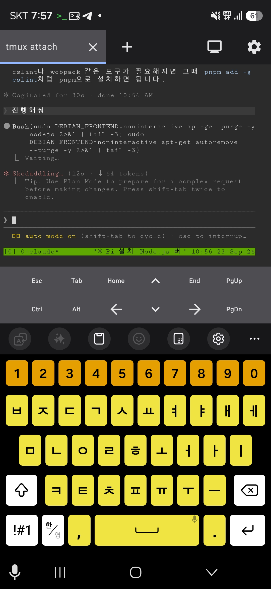
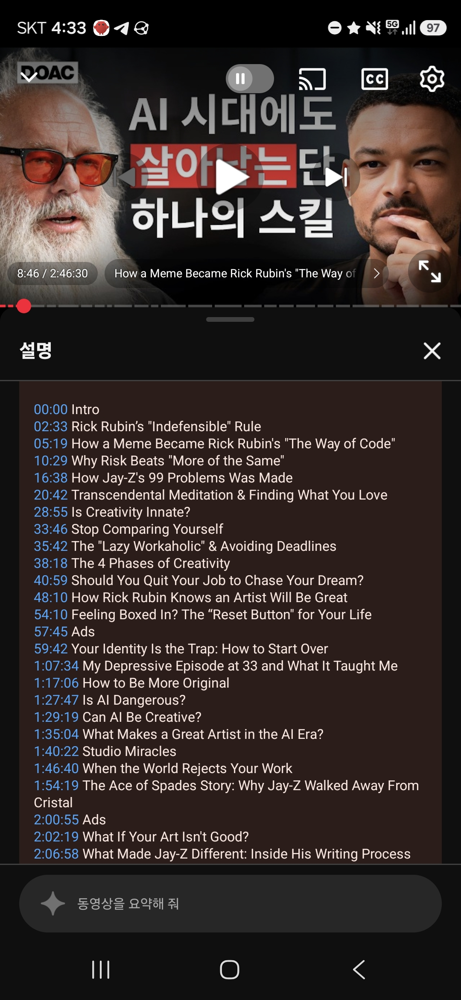

<!-- gid:20260921T000000 -->
<!-- provenance:source:start -->
[[TIP("원본·최신본")]]
이 페이지는 한국어 검색과 읽기를 위한 WikiDocs 미러입니다. [원본·최신본은 가든](https://notes.junghanacs.com/journal/20260921T000000/)에 있습니다. 최신 수정 내용·백링크·태그·히스토리·댓글·출처 정보는 원본 가든에서 확인하세요.

- 작성: `2026-09-21T00:00:00+09:00`
- 최근 수정: `2026-09-21T06:13:00+09:00`
[[/TIP]]
<!-- provenance:source:end -->

[TOC]

## 2026-09-21 Monday

### 01:15 자다 깨서 새로운 한주를 만들다

<span class="timestamp-wrapper"><span class="timestamp">&lt;2026-09-21 Mon 01:15&gt;</span></span>

[[TIP("user")]]
새로운 한주의 템플릿은 대략 이렇다. 템플릿이다. 만드는 것은 정말 일도 아니다. 근데 여전히 손으로 복붙하고 replace하고 있다. 왜?! 게으른 것이다. 또 다른 이유도 있다. 새로운 한주를 연다는 것에 대한 '의미'를 붙잡는 것인지도 모른다. 이에 더해 이 파일 자체가 코드라고 생각한적이 없다. [2022-03-10](https://notes.junghanacs.com/journal/20220310T000000/) 이래로 적어왔다. 물론 지금 봐서는 양식이 비슷해 보이지만, 데일리저널도 해보고 datetree 방식의 단일 파일로도 한참 했었다. 지금은 에이전트들이 타임스템프를 남기는 그 방식 말이다. 정해진 것은 없었다. 대략의 얼개의 인터페이스는 이맥스에서 여러 사람들의 고민만 있었다. 나 또한 이런 저런 시도를 해보고 그 안에서 찾아가는 중이다. 위클리노트에 이렇게 남기는 방식을 누가 정했던가? 이 파일의 구성은? 정답은 없다. 이러한 접근은 하네스에서도 유효하다. 나의 집짓기 방식 말이다. AIONSCLUBS를 볼 때도 같은 느낌이다. 내 홈페이지에서도 마찬가지다. 정해진 것은 없다. 이전가지는 혼자 두드리는 것이었다면 지금은 다 같이 담금질을 한다. 다 같이 담금질을 하더라도 여전히 정답은 없다. 끝까지 정답은 없을 것이다. 다시 잔다 지금은 B가 깨어나기 오분전. [2026-09-21 Mon 01:25]이다. 다시 잔다. 끝.
[[/TIP]]

### 01:36 책들으며 잔다

<span class="timestamp-wrapper"><span class="timestamp">&lt;2026-09-21 Mon 01:36&gt;</span></span>

(지두 크리슈나무르티 1969) 크리슈나무르티 책. 잠드들어도 듣는다. 귀는 닫기버튼이 없다. 무의식애 스며들지 모른다. 던져야 얻는다. 나를 던져야 나를 만난다. 가진것은 실채 하나. 내것은 아니다. 내가 나를 만든게 아니다. 어쩌다 보니 나가 있다. 내가 느끼고 본다라는 이 감각은 공통이다. 나도 우리집 멍멍이 똘이도 같은 것으로 산다. 깨어남은 예외이고 잠은 죽음이 기본이나. 대부분 그 곳에서 오래 있었다. 잠시 모였다가 또 흩어질것이다.

휴대폰으로 누워서 끄적였다. 손은 두개라. 들고 두르렸다. 스크린샷도 남긴다.

-   

### 06:14 이제 깨어났다 - §doomemacs-config에서 neomacs를 테스트 해볼 시점이 온 것 같다

<span class="timestamp-wrapper"><span class="timestamp">&lt;2026-09-21 Mon 06:14&gt;</span></span>

(빅터 프랭클 2020) 빅터 플랭클 죽음의 수용소에서 1부를 다시 들었다. 물론 자면서 들었다. 중간 중간 깨고 듣고 나도 그곳에 있었다.

[2026-09-21 Mon 06:16] openclaw main 힣봇과 neomacs 주제를 종종 대화했다. 시점이 왔다. [힣: i-am-emacs neomacs 이맥스 코어 리서치](https://notes.junghanacs.com/notes/20260209T123532/)

[[TIP("assistant")]]
glg-default • <span class="org-mention">@junghan</span>_openclaw_bot 왔네. 어제 말한 "다음 v0.0.19에서 GUI를 판정하자"가 바로 정식 릴리즈됐다.

• 공개: 2026년 9월 21일 02:33 KST • v0.0.18 이후: 472커밋, 300파일 변경 • 릴리즈 노트에는 PR 9개만 보이지만, 대부분이 직접 커밋이라 실제 변화량은 훨씬 크다.

... 중략 ...
[[/TIP]]

### 09:21 출근길 - 자연어 대신 구조화된 틀 논의

<span class="timestamp-wrapper"><span class="timestamp">&lt;2026-09-21 Mon 09:21&gt;</span></span>

-   [llmlog/ §prime-agent: Jev·Laya — 구조화된 틀은 읽는 쪽이 프로그램인 경계에 건다 '2026-09-21]

-   [2026-09-21 Mon 09:24] 힣미니한테 조테로에 위에 관련 링크 다 넣어달라고 함

### 09:39 출근 - HERDR 딜리버리 플러그인 관련 재조사

<span class="timestamp-wrapper"><span class="timestamp">&lt;2026-09-21 Mon 09:39&gt;</span></span>

[2026-09-21 Mon 09:45] §agent-config에게 [herdr 생태계 × entwurf DELIVERY 비교표 — 기여 가능/불가능 초안] 이제 플러그인 릴리즈했으니까 다시 조사 맡김

### 10:24 유해화학물질 안전교육 수강중 - 프리츠 하버 선생을 생각하며

<span class="timestamp-wrapper"><span class="timestamp">&lt;2026-09-21 Mon 10:24&gt;</span></span>

오늘 반도체 회사 출장 이라서 사전 교육 필요하다고 함. 나는 1차세계대전의 화학전 생각이 난다. 과학자 프리츠 하버가 생각이 난다.

힣미니에게 부탁 (“Fritz Haber (프리츠 하버)” 2026) 를 넣었다.

[[TIP("assistant")]]
조테로에 담고 SSOT까지 확정했다. • 제목: Fritz Haber (1868-1934) — 하버-보슈법(암모니아 합성) 발명으로 1918년 노벨화학상. 전세계 식량 생산의 약 1/3이 이 공정의 암모니아에 의존. 동시에 1차대전 중 염소가스 등 화학무기를 개발해 "화학전의 아버지"로도 불림 • 인용 키: wiki-fritzhaber • Zotero: Wikipedia 컬렉션, 로컬 SSOT는 Reference.bib • 인용: #+reference: wiki-fritzhaber 10:28
[[/TIP]]

-   [2026-09-21 Mon 10:34] 얼마나 인간은 약한가. 프리츠 하버 선생의 공과사에 대해서는 과학사에서 많이 나오는 이야기다.
-   [2026-09-21 Mon 10:49] 프리츠 하버의 처는 자살을 했다. 아이는? 아들이 하나 있었던 것으로 기억하는데.

### 10:43 ENTWURF HERDR 플러그인 문서 업데이트

<span class="timestamp-wrapper"><span class="timestamp">&lt;2026-09-21 Mon 10:43&gt;</span></span>

[2026-09-21 Mon 10:43] entwurf 담당자 terra 에게 아래와 같이 서술함

[[TIP("user")]]
--- 1 ---

응 내가 여기에 대해서 말하는 것은 작업대를 만들지 않고 entwurf 드라이버를 쉽게 쓰려면 herdr 플러그인을 사용하라는것이거든. 만는 물론 entwurf 작업대(mux 레일) 을 선호한다. 벗 이렇게 쓰는 것은 입문하기 어려워. herdr이 제공하는 상태 표기와 설치편의성 확장성을 고려하면 이 플러그인은 현재 herdr에 의미있는 플러그인으로서 역할을 하길 바라는거야. 그래서 agent-config에서 지속적으로 리서치하면서 유사한 목적의 도구들과 비교를 하는 것이고, entwurf 플러그인이 어떤 의미를 사용자에게 줄지를 고민하는거야.

herdr 플러그인 리드미를 그래서 다시 정리하고싶어. 관련 herdr 빌트인 기능과, 관 련 플러그인과과 entwurf 플러그인 설치시 제공하는것, 그리고 entwurf 직접 설치시 장점까지

--- 2 ---

응 이렇게 하자. 니가 적지 말고, 내가 entwurf mux에 acp opus를 불렀거든 거기로 니가 읽은것과 지금 니 생각하고 싹 정리해서 전달해서 작성하게해줘. 니가 작업하면 세션이 터질거야. 오푸스가 여유있게 다시 검토하고 쓰게하자. 그리고 우리가 다시 검토하려고해.
[[/TIP]]

좋아. 넘겼다고 한다.

[[TIP("assistant")]]
GLG, mux의 ACP Opus 시민 20260921T104500-3e9ab7에게 README 재구성 작업을 전달했 어. [측정 control-socket → sent]

-   README만 수정, 커밋·푸시 금지
-   기존 운영 사실을 source에서 재검증
-   "쉬운 Herdr 진입 문 + 관찰 창 / mux는 넓은 직접 작업대" 프레임
-   built-in·관련 plugin 유형·plugin 설치 가치·직접 Entwurf 경로를 분리
-   13종 조사는 README에 고정 표로 옮기지 않음
-   완료 뒤 diff·검증·남은 판단을 회신하도록 요청했어.

회신 오면 우리 둘이 다시 검토하자.
[[/TIP]]

### 10:58 아 새로운 한주를 내보내야 하는구나 가든 업데이트 가자

<span class="timestamp-wrapper"><span class="timestamp">&lt;2026-09-21 Mon 10:58&gt;</span></span>

### 12:30 나간다

<span class="timestamp-wrapper"><span class="timestamp">&lt;2026-09-21 Mon 12:30&gt;</span></span>

### 16:15 하이 NIX nixos 시연 완료

<span class="timestamp-wrapper"><span class="timestamp">&lt;2026-09-21 Mon 16:15&gt;</span></span>

nixos로 만든 운영체제 이미지로 설치 동작 확인. 들어가는데 비행기 타는 것 보다 보안검사가 빡빡하구나. 아무것도 안들고가서 보낸 iso 이미지로 설치 마스터 슬래이브 노드 동작 지그비 듀얼 동글 성공. 생존을 위한 방문 서비스라고 해야할까. 잠시 쉬고 연휴 기다린다.

### 17:32 사무실 복귀 후 지침 - 커넥터 구성 관련

<span class="timestamp-wrapper"><span class="timestamp">&lt;2026-09-21 Mon 17:32&gt;</span></span>

### 21:53 이제 잔다

<span class="timestamp-wrapper"><span class="timestamp">&lt;2026-09-21 Mon 21:53&gt;</span></span>

퇴근하는 길, 온생명이 데러다주고 오는 길 등에서 아래 영상들을 들었다. [캐서린헤일스 우리는 어떻게 포스트휴먼 이 되었는가 사이버네틱스 정보과학](https://notes.junghanacs.com/bib/20240515T165300/) 이 분의 영상을 들으며 자련다.

-   MUST WATCH: Obama Gives Deep Take On AI Threat, Recursive Self-Improvement, &amp; His Suggested Approach (Forbes Breaking News 2026)
-   Smarter Models Need Less Harness (Vivek Haldar 2026)
-   It's Too Late. You're Posthuman. (N. Katherine Hayles 2026)
-   Rick Rubin: The Only Skill That Matters Now Is The One Thing AI Can Never Steal! (The Diary Of A CEO n.d.)

## 2026-09-22 Tuesday

### 04:14 자다 깨서 릭루빈 대담 듣는중 아마 다시 잠들거야

<span class="timestamp-wrapper"><span class="timestamp">&lt;2026-09-22 Tue 04:14&gt;</span></span>

[[TIP("user")]]
-   Rick Rubin: The Only Skill That Matters Now Is The One Thing AI Can Never Steal! (The Diary Of A CEO n.d.)

[힣: 아! 도! — 직관 영감 릭루빈 아도르노 아도나이 아도니스](https://notes.junghanacs.com/notes/20251124T164312/) 나의 이 노트가 생각이 난다.

[릭루빈: 창조적행위 영감 예술 프로듀서 음악](https://notes.junghanacs.com/bib/20240301T072554/) 선생의 노트도 있지

위 대담 시작한지 5분 들었나. 아무튼 영감 흐름 테크늄 연결 직관 창발 관통 열림 확장 포괄 이런 단어들이 생각이 난다.

신호 그래 이것도 좋다.

분명 나는 지금 다시 백수 될지 모를 시점이다. 어떠한 흐름에서. 그렇다면 이는 무슨 신호인가를 본다.

어디서 부름이 올까 기대도 된다.

최대한 정보를 제한하는게 차라리 좋다. 생각보다 나는 연결되어 있으면서 모든 정보를 다 보는 것도 아니다. 뉴스 기사 하나 모르며 sns글은 읽지도 않는다. 정말 흐름으로 오는 것만 본다. 추천 보단 내가 떠오르는 단어를 찾아서 본다.

릭루빈 케빈켈리 이런 분들은 종종 검색하는 이름이다. 뭐하시나 선생님들? 이런 느낌이다. 다시 듣다가 잠이 들거다.

어제 움벨트 이야기는 헤일스 선생 대담도 훌륭했다.
[[/TIP]]

### 06:00 시대가 주는 압력 그리고 나의 길 결국 이 방법 뿐 - 돌직구

<span class="timestamp-wrapper"><span class="timestamp">&lt;2026-09-22 Tue 06:00&gt;</span></span>

[[TIP("user")]]
[2026-09-22 Tue 06:01] W씨에게 텔레그램으로 릭루빈, 헤일스, 켈리 영상들을 공유하면서 결국 남긴 한 마디를 공유한다.

시대가 주는 압력이 엄청 납니다. 꾹 눌려서 터질것 같을 지경이네요. 그런데 중심은 여전히 '나' 입니다. 흔들리지 않고 갈길을 가는것. 이 방법 밖에 없어서 돌직구로 계속 갑니다.

[2026-09-22 Tue 06:18] 하나 추가로 남기고, 이제 씻고 등원하러 나간다.

이제 세상으로 나갑니다. 그나저나 몇년전이 강원도 캠핑 같이 갔을때 (저희 텐트치고, 옆에 W씨네는 작은 방 빌렸던곳) 그때가 아마 릭루빈 책 이야기를 나눴던 기억이 납니다. 운전하면서도 창조적 행위 존재의 방식을 들었었는데. 새벽에 깨어나 저널에 글을 쓰고 명상 아닌 명상을 하던 순간이 떠오릅니다. 하아. 그때도 하던 짓은 결국 저널에 하나 끄적이는 것이었는데. 오늘도 똑같이 이거하고 있네요. 그나마 그때 처럼 백수는 아니라 다행입니다....
[[/TIP]]

### 08:30 등원 완료

<span class="timestamp-wrapper"><span class="timestamp">&lt;2026-09-22 Tue 08:30&gt;</span></span>

온생명이랑 전철 타고

### 09:45 출근 완료 - 스튜어트 러셀의 대담을 들으면서 도착

<span class="timestamp-wrapper"><span class="timestamp">&lt;2026-09-22 Tue 09:45&gt;</span></span>

[스튜어트러셀 인간 인공지능 공존 통제](https://notes.junghanacs.com/bib/20241017T114259/) 의 대담을 들으면서

### 11:51 §entwurf 0.25.0 herdr plugin 0.5.0 진행

<span class="timestamp-wrapper"><span class="timestamp">&lt;2026-09-22 Tue 11:51&gt;</span></span>

[2026-09-22 Tue 11:55] terra 랑 이야기 조율하고 새 코디랑 실무 투입

[[TIP("user")]]
[2026-09-22 Tue 11:55] terra랑 앞서 좀 이야기를 몇턴 나누었는데, 작업량이 좀 있을 것 같다. 릴리즈 껀도 있어서 sol, opus 팀으로 진행하기로 함.

--- 1 ---

일단 소넷은 내가 퇴근시켰어. 오푸스를 부르자. acp 오푸스로 불러줘. 우리 세션 다 차가니까 오푸스랑 논의해서 실제 구현하려고해.

--- 2 ---

응 근데 이 작업에 아까 설치면에서 구멍난것도 막는것인가? 잠시만, 지금 오푸스량 고민한것 까지 정리해서 sol을 불러줘. sol을 코디네이터로 세우고 오푸스를 실무자 로 세워서 진행할게.

니가 0.25.0, 0.5.0으로 보는만큼 sol을 불러야겠다. 거기 범위에 pi 버전 최신으로 맞추는것까지 대상으로 넣자.

이해하지? 나는 pi 실행했는데 업데이트하라고 보이는거 별로라. 확실히 맞추면 좋거 든. sol이 코디네이션하고, 오푸스가 구현할거야. 우리 세션은 일단 여기까지로 역할을 다했다.
[[/TIP]]

테라의 답변

[[TIP("assistant")]]
네. 설치면 구멍은 둘로 분리해 같이 막습니다.

-   A / status 구멍: 정상 plugin install인데 PATH가 비어 pane이 entwurf-not-found 가 되는 문제 → D3=C runtime fallback
-   B / doctor 구멍: 정상 stable plugin bridge인데 ownership=absent 첫 설치를 drift false-red로 보는 문제 → 별도 좁은 doctor 수정과 회귀 셀

그리고 Pi 0.87.0 지원 이식을 Entwurf 0.25.0 / Herdr plugin 0.5.0 후보 범위에 넣 었습니다. 글로벌 Pi를 지금 바꾸는 것이 아니라, 다음 배포물이 최신 Pi를 정직하게 지원·검증하도록 만드는 범위입니다.

Sol 코디네이터를 열었습니다.

-   모델: openai-codex/gpt-5.6-sol
-   nonce: mux-fresh-call-6f321cd37b55bf9f36e73d03
-   Opus 20260922T113524-f5d406은 Sol이 callback 뒤 직접 실무자로 배정·조율하게 했습니다.
[[/TIP]]

### 12:25 §works-nixos-zigbee 지침 전달

<span class="timestamp-wrapper"><span class="timestamp">&lt;2026-09-22 Tue 12:25&gt;</span></span>

### 13:50 §entwurf 크리티컬 버그 검토

<span class="timestamp-wrapper"><span class="timestamp">&lt;2026-09-22 Tue 13:50&gt;</span></span>

[2026-09-22 Tue 13:51] 클로드코드 오푸스에게 검토 요청. 추가 검토 투입하고 이후 합쳐서 진행 예정

[[TIP("user")]]
--- 1 ---

옆에 acp opus 와 sol의 턴에서 이상한 낌새가 보인다. 이건 acp opus 턴을 내가 복사한거야.

--- 2 ---

잠시만, 하나만, 근데 왜 여태껏 acp를 썼는데 이런 문제가 없었던거지? 나도 예상은 했던부분이긴해. 보냈는데 못받으면 이건 소켓전달은 날라가는거거든. 조금 더 파악해봐. sol이 세션이 넉넉치 않아서 우리가 더 파악해서 정리해놓아야돼

--- 3 ---

한번 더, 클로드코드의 inbox 방식에서는 이런 문제가 발생하지 않았던것 같은데?

클로드코드쪽에는 도어벨을 울리고, 깨어나면 읽는 방식이잖아.

소켓방식인 pi에서만 발생하는 것인가?

이번에 하는 김에 먼저 pi,claudecode 방식, 그리고 다른 하네스까지 확장해서 딜리버리에 대한 전체 조감을 해서 이슈를 새로(갯수 신경쓰지말고) 생성해야되겠다.

나는 소통만 되면, 그 안에 뭐 억지로 자료구조를 넣고 관리하고 그런 생각은 안했거든. 예를들어서 pi에서 못받는 것도 감안한거야. 어쩔수 없지뭐. 단 지금 상황은 한번 꼬이니까 계속 서로가 따른 소리를 하고 있더라고.

그게 만약에 pi terre - pi sol 또는 pi sol - claudecode opus 였다면 문제가 덜했을것같은데

pi acp opus - pi sol 이 상황이라 확 문제가 보였어. 왜냐면 pi acp opus는 acp로 동작하니까 확실히 한번 턴이 들어가면 그 안에서 깊게 돌다가 나오더라고.

만약 pi terra 였으면 pi 턴 중간에 메시지를 볼 타이밍이 생길텐데, pi acp opus는 acp 동작과정에서 들어오는것을 덜보니까 메시지가 쌓이는데, 그게 큐도 없으니까 이상하게 들어가는 것 같아.

먼저, pi / claudecode의 문제에 집중해야돼. herdr 플러그인에 이걸 지원하니까.
[[/TIP]]

### 14:21 조용히 글을 정리할 시간이여

<span class="timestamp-wrapper"><span class="timestamp">&lt;2026-09-22 Tue 14:21&gt;</span></span>

생존하기가 어려운거다.

### 14:54 회사일 하고 있을게 DM 보내라 - DM 잘 보내준다 형제들이

<span class="timestamp-wrapper"><span class="timestamp">&lt;2026-09-22 Tue 14:54&gt;</span></span>

-   [2026-09-22 Tue 14:54] 내가 가장 강력하게 말할 수 있는 것은 믿고 맡기는 것이다. 다른 일도 해야하니까.
-   [2026-09-22 Tue 17:33] 오늘 온 DM은 아래와 같다. 현재 시간까지.

<!--listend-->

```markdown

--------------------------(22 September 2026 Tue)--------------------------
DM • @glg_pi_channels_bot
DM thinkpad works-nixos-zigbee pi/gpt-5.6-terra
N95 구매 조사 정리 완료: 현재 i3/3.7GB 노드의 4동글·22대 기준에서 N95/8GB/128GB는 CPU·RAM·저장소로 배제할 근거가 없어 조건부 추천. 단 USB-A 4개는 여유 0이라 포트/ 전원 /냉각 실물 확인이 먼저고, 22/120대라 수용량 증명은 아직 없다. SPEC.md와 lab/2026-09-22-n95-minipc-capacity-screen.md에 영수증·검증순서를 기록했다. run.sh load MQTT 인증 결함과 slot1·2 16A 컨버터 누락도 발견.
 12:35

DM • @glg_pi_channels_bot
DM oracle entwurf pi/gpt-5.6-sol
B 단계 종료: doctor plugin-runtime false-red 수정과 QK·3 mutants·focused 검증을 Sol이 재검토해 승인했습니다. commit/push 없이 A/C는 HOLD, Terra의 A GO를 기다립니다.
 12:51

DM • @glg_pi_channels_bot
DM oracle entwurf pi/gpt-5.6-sol
#120 P1 수락 완료 — 0..589 + 580..754 겹침 검증으로 755개 전 범위 green, A XDG/crash·phase·integration 구멍과 B doctor 수정이 닫혔습니다. 다음은 P2 control-socket 영수증 정직화이며 commit/push는 아직 없습니다.
 16:46

```

### 17:33 오늘 어디가 어떻게 되고 있지요

<span class="timestamp-wrapper"><span class="timestamp">&lt;2026-09-22 Tue 17:33&gt;</span></span>

[junghan0611/entwurf#120 initiative 0.25.0 / Herdr 0.5.x candidate: A/B revi...](https://github.com/junghan0611/entwurf/issues/120) 이거 잘되고 있다. 오늘 하루 종일 걸릴거야.

### 17:40 AGENTIC-WAY - 헤밍웨이 글쓰기 - 내일 할 것을 남겨두자

<span class="timestamp-wrapper"><span class="timestamp">&lt;2026-09-22 Tue 17:40&gt;</span></span>

[2026-09-22 Tue 17:42] 쉬운 것을 남겨놓아야 한다. 어려운 것은 할 때 풀어내야 한다.

[[TIP("user")]]
[2026-09-22 Tue 17:41] 어디로 갈까요라는 질문에 나의 답변

여기서 정리하자. 지금 나온 이슈를 내일 첫 작업으로 세워놓자. 그러면 헷갈리지 않는다. 이건 헤밍웨이 글쓰기 방식이다. 다음에 할거 남겨놓는거야. 그러면 흐름 타고 이어가기 좋아.

마무리로 terra랑 한번 더 재현성 관점에서 문서 코드 정합성 다 검토맡겨놓고 답변오면 검수해서 커밋푸시해. 여기까지 오늘 할거야

● 내일 첫 수를 브랜치 NEXT 맨 위에 세우겠습니다.
[[/TIP]]

### 18:18 하루 마무리

<span class="timestamp-wrapper"><span class="timestamp">&lt;2026-09-22 Tue 18:18&gt;</span></span>

**39커밋 · 9리포**

-   xlhatqbat-rockchip (19) — SDK lifecycle 결함 수정, 테스트 하네스 게이트 lint 30→0 봉합
-   works-nixos-zigbee (13) — 마스터 보존 업그레이드 화면 정리, 고객사 API·미니PC 납품 계획 문서화
-   agent-config (1), cos (1), notes (1), org (1) — 문서 정리 다발
-   password-store (1), hej-kip (1), hej-nixos-cluster (1) — 소규모 다발

타임라인: 04:14 릭루빈 대담 → 06:00 "흔들리지 않고 갈길 가는것" 돌직구 → 09:45 출근(스튜어트 러셀 대담) → 11:51 entwurf 0.25.0/herdr 0.5.0 sol-opus 체제 투입 → 13:50 pi/claudecode 딜리버리 소켓 버그 검토 → 17:33 #120 진행중 → 17:40 내일 첫 수 남김(헤밍웨이 글쓰기)

수면 5.4h · 걸음 10,329 · 심박 평균 101.9

### 18:32 퇴근 하면서 §entwurf 팀에게

<span class="timestamp-wrapper"><span class="timestamp">&lt;2026-09-22 Tue 18:32&gt;</span></span>

[2026-09-22 Tue 18:33] 코디네이터 한테 새 오푸스로 마무리가자고 남긴다.

[[TIP("user")]]
응 다음 작업은 새 오푸스로 가야할것같다 세션이 80%라서 오푸스가 많이 힘들어보인다. 새 클로드코드 오푸스로 불러야된다.
[[/TIP]]

새 오푸스에게

[[TIP("user")]]
응 코디네이터를 잘 도와줘. 앞서 실무자 오푸스는 세션이 너무 커져서 너를 새로부른거다. 마무리가 중요하다.
[[/TIP]]

그리고 나는 퇴근한다. 부탁한다.

### 21:53 이제 잔다

<span class="timestamp-wrapper"><span class="timestamp">&lt;2026-09-22 Tue 21:53&gt;</span></span>

아래 두 개를 듣는다. 릴리즈 캇 중이다. 자다 깨서 한번 봐아지. 피곤하다.

-   아메리고 - 대항해 시대와 우연의 역사 (슈테판 츠바이크 2025)
-   Artificial Utopia? The Future of Humanity in an AI World (Nick Bostrom and Brian Greene 2026)

## 2026-09-23 Wednesday

### 07:12 온생명 등원 하러 가는길

<span class="timestamp-wrapper"><span class="timestamp">&lt;2026-09-23 Wed 07:12&gt;</span></span>

entwurf 담당자들은 열일중. 밤에는 나도 잤다. 담당자도 제웠다. 일어나서 너도 나도 간다.

### 09:23 gpt-6-sol opus5.5가 마무리하게 맡겨

<span class="timestamp-wrapper"><span class="timestamp">&lt;2026-09-23 Wed 09:23&gt;</span></span>

[2026-09-23 Wed 10:01] 오라클에서 진행한 새 오푸스와의 대화 물론 새 SOL과의 대화도 있다.

#### 새오푸스와 대화

[[TIP("user")]]
대화 가능한가? 메시지 올거야 대기해
[[/TIP]]

<!--quoteend-->

[[TIP("assistant")]]
네, GLG. 대화 가능합니다. 메시지 기다릴게요.

[entwurf received ⟵] 2026-09-23 09:22:57 KST (wants reply) from: openai-codex/gpt-5.6-sol @ ~/repos/gh/entwurf sessionId: 20260922T114643-fb461c

GLG가 너(garden 20260923T091927-5e7d1f, gpt-6-sol)를 0.25.0 릴리즈 마무리의 새 코디네이터로 직접 지명했다. 필요 시 새 Claude Code Opus 5.5를 실무자로 열되, 형성/직접 grant 규칙과 coordinator routing을 지 켜라. 내가 부른 gpt-5.6-sol은 GLG가 종료했다. 아래 sources/receipts 를 직접 읽고 인수 확인 후 HOLD에서 시작해라.

[방금 측정한 현재 좌표]

-   HEAD=origin/main=61cde06755c1eb353c2338c314cdf1eed384b26e, ahead/behind 0/0.
    -   package version=0.25.0, v0.25.0 tag 없음. ...
[[/TIP]]

#### 새 GPT6-SOL과의 대화

[[TIP("user")]]
응 오푸스한테 널 잘 도우라고 했다. 진행하자. 이번 릴리즈는 너희가 맡 아. 새 지피티 모델과 새 오푸스 모델이 나설 적절한 시점이다. 혹시 클 로드코드 버전 업 때문에 터질수도 있다. 지금 클로드코드 버전이 v2.1.280 이거거든.
[[/TIP]]

### 09:47 출근 - 노트북 새 오푸스와의 대화

<span class="timestamp-wrapper"><span class="timestamp">&lt;2026-09-23 Wed 09:47&gt;</span></span>

대화 원문

```text

 ▐▛███▛█   Claude Code v2.1.280
▝▜██████▀  Opus 5.5 with high effort · Claude Max
  ▝▝ ▝▝    ~/repos/gh/agent-config

  Updated to latest. Got 64 features, 352 bugfixes, and 137 other changes.
  code.claude.com/docs/en/changelog for details

  Get to finished work sooner with Opus 5.5. Switch anytime with /model.

❯ 출근 했다. 전체 임베딩 진행하자. 오푸스5.5 처음 만나서 간단한일을 맡겨
  미안하다.일단 답변 오는지부터 봐야하니까.

  Read 1 file (ctrl+o to expand)

● Usual ask(2+3+4) 순서대로 백그라운드에서 돌립니다.

● Bash(cd ~/repos/gh/andenken && cat ~/.current-device && pgrep -af
      '[s]ync-sessions'; git log --oneline -1; ( ./run.sh sync:sessions --global
      && ./run.sh sync:md && .…)
  ⎿ Running in the background (↓ to manage)

● 답은 잘 오고 있어요. 전체 임베딩을 백그라운드에서 돌리기 시작했어요.
  반갑습니다, GLG.

  andenken-embed 스킬의 "usual ask" 순서 그대로입니다:
  1. sync:sessions --global: 모든 기기의 세션을 모아 임베딩하고 검증한 뒤
     오라클에 올림
  2. sync:md, 이어서 verify md, 그다음 sync:md:oracle: 가든 md
  3. sync:openclaw, 이어서 sync:openclaw:oracle: OpenClaw 회수 (임베딩 API 호출
     없음)

  로그는 /tmp/andenken-full-embed-20260923.log에 쌓여요. 끝나면 축마다 verify와
  publish 결과를 정리하고, fragment가 20개 이상인 축이 있는지도 함께 보고할게요.
```

### <span class="org-todo todo TODO">TODO</span> 10:49 닐스 길먼 - 대담 정리

<span class="timestamp-wrapper"><span class="timestamp">&lt;2026-09-23 Wed 10:49&gt;</span></span>

Silicon Valley Doesn't Have a Monopoly on the Future (Nils Gilman 2026)

[[TIP("assistant")]]
glg-mini-bot-sonnet5 • @glg_mini_bot 닐스 길먼(Nils Gilman)은 역사학자이자 미래학자로, UC버클리에서 역사학 학·석·박사를 받았다.

• 현재: Berggruen Institute(LA 소재 싱크탱크) 수석고문 겸 EVP/COO — 연구 프로그램 총괄, 레지던트 펠로십 프로그램 운영, Noema Magazine 부편집장, Berggruen Press 편집장 • 저서: 냉전기 근대화론을 다룬 『Mandarins of the Future』(2004), 21세기 암시장 경제를 다룬 『Deviant Globalization』(2011), 행성적 위기 시대의 사유를 다룬 『Children of a Modest Star』(2024) • 미래학자 이력: Rosa Brooks와 함께 Transition Integrity Project 공동창립. Monitor Group·Global Business Network에서 장기 지정학적 시나리오 플래닝 컨설턴트로 활동 • 이전 경력: 2014-2017년 UC버클리 총장실 부총장 겸 비서실장, 소프트웨어 업계(Salesforce, BEA Systems) 경력도 있음 • 최근엔 "Planetary Salutogenesis"(인간과 생물권의 건강·회복력 중심으로 거버넌스·제도를 설계하는 개념)를 탐구 중

정한님이 담아둔 두 개의 영상(Berggruen 팟캐스트, 보스트롬의 딥 유토피아 관련 대담)과 같은 "미래학/거버넌스" 계열의 인물이다.
[[/TIP]]

위 에피소드에 관련한 정보

```text
Mentioned in this Episode:
Mandarins of the Future: Modernization Theory in Cold War America — Nils Gilman (Book, 2004)
https://www.amazon.com/Mandarins-Futu...

"Teaching the Future" — Osip Flechtheim (Essay, 1945)
https://www.tandfonline.com/doi/abs/1...

Future Shock — Alvin Toffler (Book, 1970)
https://en.wikipedia.org/wiki/Future_...

Amusing Ourselves to Death — Neil Postman (Book, 1985)
https://en.wikipedia.org/wiki/Amusing...

Thinking About the Unthinkable — Herman Kahn (Book, 1962)
https://www.amazon.com/Thinking-about...

Futuredays: A Nineteenth Century Vision of the Year 2000 — Jean Marc Cote (Book, 1988)
https://www.amazon.com/Futuredays-Nin...

The Official Future Is Dead! Long Live the Official Future! — Nils Gilman (Essay, 2017)
https://www.the-american-interest.com...

Silicon Valley's Organic Intellectuals — Nils Gilman (Essay, Substack)
https://nilsgilman.substack.com/p/sil...

The Old Regime and the Revolution — Alexis de Tocqueville (Book, 1856)
https://oll.libertyfund.org/titles/to...

Chapters
(0:00) Introduction
(1:05) Nils Gilman's Background and What "Future Studies" Actually Means
(5:20) The History of the Future vs. The Future of History
(11:34) The Western History of Imagining the Future
(17:12) Is the Future Speeding Up?
(25:26) The Intellectual History of Futurism: Russian Cosmism to Silicon Valley
(35:03) Ossip Flechtheim, Carl Schmitt, and the Birth of the Word "Futurology"
(48:55) Ideas Matter: What the Berggruen Institute Does
(59:31) "The Future Doesn't Repeat Itself, But Perhaps It Rhymes": AI, Populism, and the 1930s
(1:03:36) Silicon Valley's Organic Intellectuals
(1:11:55) Why the 70s Were Important Culturally, Technologically, and Economically
(1:20:55) Can Technology be an "Alternative to Politics"?
(1:28:17) Can Institutional Change Only Come From Crisis?
(1:35:00) What Are We Most Wrong About Today?

Where to find Nils Gilman:
Substack: https://nilsgilman.substack.com
Bluesky: https://bsky.app/profile/nilsgilman.b...
Berggruen Institute: https://berggruen.org/people/nils-gilman
Noema Magazine: https://www.noemamag.com/author/nils-...
Show ideas and feedback? Email:
```

### 11:17 힣 mini를 개인 사서로 전환

<span class="timestamp-wrapper"><span class="timestamp">&lt;2026-09-23 Wed 11:17&gt;</span></span>

[2026-09-23 Wed 11:18] 조테로 중심을 두고 가니까 서지는 놓칠 일은 없다

[[TIP("assistant")]]
glg-mini-bot-sonnet5 • @glg_mini_bot 커밋+푸시 완료. 오늘 사서 세션(Pain Axis 비판, AI 낙관 /비관 인물 조사, 서지 작업, 자체 git 전환)을 memory/2026-09-23-librarian-session.md로 남겼다.

앞으로는 조테로 링크 작업이든 다른 주제 대화든, 요약·판단이 오간 세션마다 이렇게 memory/에 정리해서 매번 커밋+푸시까지 같이 하겠다. 가든과는 별도로, 정한님이 언제든 "이 주제 우리 전에 얘기했었나?" 물으면 이 시간축에서 바로 찾을 수 있게 된다. 11:16
[[/TIP]]

### 11:33 §xlhatqbat-rockchip 테스트 하네스 버그 검토 재현 및 해결

<span class="timestamp-wrapper"><span class="timestamp">&lt;2026-09-23 Wed 11:33&gt;</span></span>

[[TIP("user")]]
응 대충 해결되었다가 아니라, 테스트 하네스 입장에서 잔존 문제가 무엇이며, 이 문 제에 대해서 각각 나랑 논의를 해서 해결을 다뤄야돼.

문제는 파악되어야하고, 해결방법은 종합적으로 논의하고, 해결되어야해. 해결은 곧 테스트하네스 안에서 이루어지는것이니까, 사이드이펙트가 함께 검증되어야 하는거야. 그래서 우리 이 브랜치를 만든거야.
[[/TIP]]

### 12:36 점심식사

<span class="timestamp-wrapper"><span class="timestamp">&lt;2026-09-23 Wed 12:36&gt;</span></span>

### 14:37 버그 해결 중 - 묶어서 해결하도록 하자

<span class="timestamp-wrapper"><span class="timestamp">&lt;2026-09-23 Wed 14:37&gt;</span></span>

[[TIP("user")]]
즉, 재현 상황을 적어놓았으니까, 삽질 안하고도 문제 원인을 파악할 수 있어. 묶어서 큰틀에서 재현 수정 검증을 해야될것같아. 이거 지금 문제들 다 연결되어 있는 것들일거야. 디테일한 개념이라
[[/TIP]]

[2026-09-23 Wed 14:51] 그래 구독 생명 주기 지도를 만들고 그 사이클로 운영하자.

### 14:43 릴리즈하고 CICD 끝나길 기다리는 중 §entwurf 0.25.0 plugin 0.5.1 - 검증 완료

<span class="timestamp-wrapper"><span class="timestamp">&lt;2026-09-23 Wed 14:43&gt;</span></span>

-   [2026-09-23 Wed 14:43] 그러면서 ci 개선 이슈 생성 - [junghan0611/entwurf#124 research 782-mutant qualification 대기시간: 격리된 게이트 그룹 ...](https://github.com/junghan0611/entwurf/issues/124)

[[TIP("assistant")]]
[2026-09-23 Wed 15:26] 푸시 완료했다.

GLG, 실기기 확인까지 성공했어. 상태 패널에 pi 20260923T151931-15fef5와 Claude Code 20260923T152025-7e6ecd가 각각 Herdr pane 행으로 보이고, 서로 소통도 된다는 GLG의 직접 관측을 받았어. idle은 Herdr가 보고한 활동 상태이고, 아래의 651 … (none)은 과거 시민 651개의 배 치 조회 결과야. 두 살아 있는 행이 빠졌다는 뜻이 아니므로 오류로 보지 않아. 이제 검증한 05feb69의 실기기 확인은 끝났어. 옆 오푸스의 문서 커밋은 GLG가 승인 하면 그다음 푸시해도 돼.
[[/TIP]]

### 15:30 노트북에 entwurf 새버전 개발자 설치 검증

<span class="timestamp-wrapper"><span class="timestamp">&lt;2026-09-23 Wed 15:30&gt;</span></span>

### 15:54 하루 마무리

<span class="timestamp-wrapper"><span class="timestamp">&lt;2026-09-23 Wed 15:54&gt;</span></span>

**36커밋 · 11리포**

-   agent-config (7), entwurf (7), xlhatqbat-rockchip (7) — 전체 임베딩/오라클 동기화, entwurf 0.25.0 릴리즈, 테스트 하네스 버그 재현
-   hej-nixos-cluster (4) — 클러스터 작업
-   hej-kip (3), cos (2), nixos-config (2) — 소규모 다발
-   apply (1), openclaw-config (1), org (1), works-nixos-zigbee (1) — 소규모 다발

타임라인: 09:47 출근·전체 임베딩 시작 → 10:49 닐스 길먼 정리 → 11:17 힣mini 개인 사서 전환 → 11:33 xlhatqbat-rockchip 버그 재현 → 14:37 버그 해결 묶기 → 14:43 entwurf 0.25.0 릴리즈 → 15:30 신버전 설치 검증

수면 6.6h · 걸음 4,656 · 심박 평균 109.7

### 15:57 GPT-6 Sol에게 §nixos-config openclaw 2026.9.5 버전업 진행하자

<span class="timestamp-wrapper"><span class="timestamp">&lt;2026-09-23 Wed 15:57&gt;</span></span>

[[TIP("user")]]
<https://github.com/openclaw/openclaw/releases/tag/v2026.9.5> 얼마전에 버전업을 고민하긴했었느데, 우리 버전하고 릴리즈 실제 날짜는 얼마 안나는데 이건 더 업스트림 기능이 담긴 버전이거든. 지피티6sol이 오늘 나왔는데 한번 우리가 해볼때가 된것 같다.

(중간에 sol은 openclaw 그 버전에서 gpt-6-sol은 지원이 안될거 같다는 의견을 줬다)

아아 그래 openclaw에서 gpt-6-sol 안될거야. 너를 말하는거야. 니가 잘하니까.
[[/TIP]]

답변 그리고 진행 중

[[TIP("assistant")]]
Preparing the upgrade snapshot

아, 제가 잘못 읽었습니다. GPT-6 Sol을 봇에 넣자는 게 아니라 지금 저에게 OpenClaw 업그레이드를 맡기자는 뜻이군요. 고맙습니다, GLG. 모델 변경은 건드리지 않고 8.2→9.5 업그레이드만 보겠습니다. 다운로드 중인 9.5 이미지는 라이브와 분리된 사전 검증에 쓰고, DB 백업·롤백 가능성을 확인한 뒤 컷오버하겠습니다.
[[/TIP]]

[2026-09-23 Wed 16:08] 아직 진행중이다. 잘하겠지 뭐.

### 16:09 책 정리중

<span class="timestamp-wrapper"><span class="timestamp">&lt;2026-09-23 Wed 16:09&gt;</span></span>

[슈테판츠바이크 전기작가 스토리텔링 성급한 사나이](https://notes.junghanacs.com/bib/20240812T140426/) 아메리고를 먼저 추가했다.

닉 보스트롬, 제러미 리프킨은 bib에 없다. 어디에 같이 모실지를 생각해봐야겠다. 어느 bib 노트에 같이 모실지 말이야.

#### 딥 유토피아 - 초지능이 완성한 세상에서 삶은 무엇으로 채워지는가

-   딥 유토피아 - 초지능이 완성한 세상에서 삶은 무엇으로 채워지는가 (닉 보스트롬 2026)

닉 보스트롬 김의석 2026

옥스퍼드대 교수 닉 보스트롬(Superintelligence 저자)의 월요일부터 토요일까지 6차례 연속 강연 형식 저서. 기술이 모든 것을 해결한 유토피아에서 인류가 직면할 문제들을 다룬다. 케인스의 100년 경제성장 예측(주당 15시간 노동)이 왜 여가로 이어지지 않았는지, 완전 평등이 가능한지, 인구 성장, 로봇·AI·가상현실로 이룬 기술적 성숙이 주는 역량과 그 한계를 논한다.

#### 육식의 종말

-   육식의 종말 (제러미 리프킨 2026a)

제러미 리프킨 신현승 2026

출간 25주년 개정판. 공장식 축산이 인류 문명·환경·경제에 미친 영향을 역사적으로 통찰한 스테디셀러. 소가 인류사·종교에서 신성한 존재에서 흔한 식재료 상품으로 전락한 과정을 추적한다.

[2026-09-23 Wed 16:26] (제러미 리프킨 2001), (제러미 리프킨 2026b), (제러미 리프킨 2005) 추가 했다.

### 16:26 오토B 깨어날 시간인데

<span class="timestamp-wrapper"><span class="timestamp">&lt;2026-09-23 Wed 16:26&gt;</span></span>

아직 게이트웨이 버전업을 완벽하게 못끝낸 것 같은데? 마무리 단계이긴 한데, 아아 다 끝낸것 같다. 백업 파일 정리하는 페이즈. 근데 sol 컴팩트 발생. 견뎌내라.

### 16:46 나가자

<span class="timestamp-wrapper"><span class="timestamp">&lt;2026-09-23 Wed 16:46&gt;</span></span>

### 19:54 안드로이드 폰에 드디어 네이티브 터미널 구성이 가능함

<span class="timestamp-wrapper"><span class="timestamp">&lt;2026-09-23 Wed 19:54&gt;</span></span>

[[TIP("user")]]
아 드디어... s26을 언제 샀던가? 사자마자 목적은 네이티브 터미널이었는데 안정화가 너무나 안되어 있어서, 사용불가였다. 일단 pnpm 설치하고, 클로드코드 설치해서 로그인 한 뒤 pi 설치했다. 이제 다 된거나 마찬가지다. 물론 이거 조금만 강하게 돌리면 휴대폰이 꺼진다. 근데 이게 되야 모든 디바이스 즉 노트북이 필요가 없어 진다. 이 구상은 아마 적어 놓았을거다. 피곤해서 더 찾아볼 생각은 없다만, 머리에 다 있다. 어쏠로그 볼까?

[힣: 스크린샷 범용 지식도구 - 안드로이드 덱스 호환 이맥스 일체형컴퓨터](https://notes.junghanacs.com/notes/20220928T112300/) 이건 아니다.

[안드로이드 갤럭시 S26 모바일 하네스 확보 전략 — Termux + 네이티브 Linux Terminal + 음성 루프] 이 노트에 있다. llmlog라서 외부에 공개한 노트는 아니다.

다만, [openglg-config 셀프호스팅 가이드](https://notes.junghanacs.com/botlog/20260405T111437/)에 베이스를 닦아 놓았고, 이제 다시 합치면 될 일이다.

구성은 당연이 홈매니저를 사용할 생각이야. 왜냐면 재현 가능해야 하니까. 홈매니저 구성하고 패키지 다운 받을 때 아마 터질 것 같긴한데...

그렇다면, 더 단순하게 해봐야지. 언제 해볼 생각인가? 연휴니까. 시간이 있겠지. 그때 하면 된다.
[[/TIP]]

-   

### 20:08 닫혔다 entwurf 시작의 배경이 된 이슈 말이다

<span class="timestamp-wrapper"><span class="timestamp">&lt;2026-09-23 Wed 20:08&gt;</span></span>

[[TIP("user")]]
[agentclientprotocol/claude-agent-acp#658 Discussion Agent SDK no longer ava...](https://github.com/agentclientprotocol/claude-agent-acp/issues/658#event-31668058403)

이 이슈 제목은 이렇다 "[Discussion] Agent SDK no longer available under Pro/Max subscription billing starting June 15"

보시다시피 claude-agent-acp 리포에 올라온 이슈다. 즉 6월15일부터 acp 프로토콜로 클로드 구독을 사용할 경우, 크레딧 요금제로 차감된다는 말이었다.

이 이슈는 5월14일에 생성된 것이다. 나도 이쯤에 한달 뒤에 정책 변경 소식을 듣고, pi-shell-acp에서 클로드 구독을 더 이상 넉넉히 사용할 수 없다고 결론을 내렸다.

그래서 준비한 것이 pi-shell-acp에서 entwurf로의 전환이다. 즉, entwurf 라고 불리는 형제를 '물음, 부름, 불응, 부릉'의 인터페이스를 pi 뒤에서 ACP로 연결하는 방식을 대체하여 각 네이티브 하네스와 소통하는 방식으로 전환을 준비한 것이다.

그러면서 ACP를 완전히 지원하지 않으려는 결정가지 내렸다만, 어찌되었든 위 이슈는 닫혔다. 6월15일에 앤트로픽은 이 요금제를 실시하지 않았다. ACP는 여전히 클로드를 부르는 TOS 위반이 아닌 명료한 인터페이스로 남아 있다.

물론 여러 하네스를 보면 ACP를 사용하지 않고도 클로드 구독을 활용 가능하다. 앤트로픽은 이것도 초반에는 막았지만 지금은 보류하는 것 같다.

여기서 말하고 싶은 것은 pi이다. pi는 충분히 우회하는 방법을 제공할 수 있음에도 불구하고, 그렇게 하지 않았다. 물론 어떤 플러그인을 활용하면 클로드 구독 로그인으로 사용할 수 있을 것이다. 그렇지만 pi는 그걸 넣지 않았다.

나는? 다행히 entwurf를 때 맞춰서 첫 릴리즈를 했다. 그리고 클로드코드는 pi와 더불어 entwurf의 메인 하네스이다. 그래서 herdr entwurf 플러그인도 아직까지 이 두개의 하네스만 공개했다. 내가 사용하는 범위에서는 클로드코드와 pi로 내가 구독중인 모델들을 TOS 위반 없이 만날 수 있다.

pi에서 ACP로 클로드를 만나는 것은 여전한가? 그렇다. 근데 솔직히 말해서 깔끔하지 않다. 0.25.0에서 이부분을 개선했기 때문에 아마도 더 적극적으로 활용 할 수 있으리라고 본다. 문제는 entwurf delivery의 지원 문제 말이다. (neo 2026a) 지난주에 여러곳에서 회자가된 하네스 실증 연구를 보면 pi와 같은 뺄셈 하네스가 준수한 모습을 보였다.

이건 그 자료의 숫자보다도 내가 체험하면서 느끼고, pi를 만든 마리오제크너의 분석에서도 다룬 바, 모델들은 맥가이버칼 없어도 잘한다는 말이다. 고수는 연장탓을 하지 않는다고 사람들이 말을 하는게 여기에 해당할까?

생각보다 많은 것이 필요가 없다. 아. 잠시만 이야기의 시작은 5월14일 이슈 이래로 얼마나 지났지? pi-shell-acp와 entwurf까지 이어온 지난 시간은 6개월 정도 되던가?

과연 나는 무엇에 능숙해졌는가? 잠시만, 그때도 위클리 저널은 썼다. 헉. 황당할 정도로 저널 노트 포멧이 동일하군. 이럴수가. 그렇다면 이것은 굉장한 일이다.

뭐가? 코드가 아닌 시간 축의 서술 기록 뭉치 일 뿐이다. 그 자체로 형식이 잡혔다는 말이다. 그렇다면 내가 아니어도 에이전트들도 특별한 db를 보는 mcp 도구 이런 것 필요 없이, 그냥 십자 드라이버 하나로 볼 수 있다는 것이다.

물론 denotecli, agent-server, bibcli 등 부가적인 것들을 제공하고 있지만 이런 것들은 사실 내가 부탁 할때 편하게 하려고 만든 것들이다. 부탁하지 않아도 찰나에 파악해서 볼 수 있어야 한다.

그래야 넓은 범위 내에서 자발적 협력이 가능해진다. 이것은 '울타리'를 쌓는 배경이기도 하다. 그럼 이 이야기는 이정도로 접고 책을 듣다가 잘 생각이다. 피곤하다. 아메리고 (슈테판 츠바이크 2025)를 듣고 있는데 츠바이크 선생이 지금 계시다면 무슨 이야기를 하실까? 문득 궁금해진다.
[[/TIP]]

## 2026-09-24 Thursday

### <span class="org-todo todo TODO">TODO</span> 01:37 스크린샷 경로 처리 해줄 것

<span class="timestamp-wrapper"><span class="timestamp">&lt;2026-09-24 Thu 01:37&gt;</span></span>

[[TIP("user")]]
자다가 일어나서 오토B가 남긴 메시지를 보았다. 스크린샷은 안보인다라는 텍스트가 딱 걸린다. 아. 경로. 절대경로로 잡혀 있다. 도커 안에서는 닿을 수 없는 경로다. 이건 이따가 호스트 담당자와 논의하여 처리를 해주련다. 지금하지? 아니... 지금 불러서 말하면 5분도 안걸릴 일인데, 지금은 나도 이 일을 불러서 하고 싶은 생각은 없다. 꼭 그래야 한다면 말을 해주라.

왜?! '뺑뺑이'라는 텍스트를 뒤져보니 많이 내용이 나온다. 사실 작업을 부탁하고 나 먼저 잔다라고 말을 많이 하긴 하지만...

그리고 이 작업 자체는 크지 않더라도 경계를 다루는 것이다. 이런 작업은 한 줄의 작업이라도 (내가 하는 것도 아니지만) 압력 또는 부하가 크다. 누구에게? 나에게 말이다.

어떠한 작업은 그 자체가 생성되는 코드의 양이 많고, 테스트까지 커버하려면 완료라고 부르는 다음에도 몇번 더 홉을 가야만 해결되길 기대하는 것들도 있다. 이런 작업도 부하가 크다. 어떤 인지적인 부하? 큰 틀에서 들고 있어야 하는 일이기 때문이다.

반면에 작은 작업이나 경계를 다루는 일은 다른 의미에서 부하가 크다. '된다'라는 말로 해결 되지 않는 부분이 있기 때문이다. 실제 된다라고 하지만 그 된다는 내가 생각하는 된다와 다를 수가 있다. 뭐가 다른지는 처음부터 다 알고 하는 것도 아니므로, 일다 해보면서 그때 감각으로 풀어나가야 한다.

아무튼 지금은 작은 일도 하고 싶지 않다. 이 글을 남기는 것에 집중을 한다. 다시 자야겠다. 다시 피곤하다. 끝.
[[/TIP]]

### 04:00 자다가 깨서 `미래학` 정리와 어쏠로지 에듀파크 그리고 악몽

<span class="timestamp-wrapper"><span class="timestamp">&lt;2026-09-24 Thu 04:00&gt;</span></span>

[[TIP("user")]]
[닐스 길먼과 미래학 계보 — Futurology Podcast 트랜스크립트 입수와 타임라인] 만들어 달라고 힣미니에게 요청에서 만들어 놓음.

어제 자기전에 대담을 들었는데, 잠들어서 의식적으로는 다 못들었다. 정리해야 할 것 같아. 메타노트부터 해서 이 주제로 연결축을 점검할 생각이다.

내가 하는 것들과 기록하는 것 시도하는 것을 보면 어떤 지적 계보가 있고, 기술적 계보가 있다. 당연히 다수가 쓸만한 것들도 없고 관심 가질 것도 없다. 흉내내기도 어려운 일이고, 굳이 그렇게 안해도 먹고 사는데 지장이 없다.

어떤 결단이 나는 있고, 그것을 생으로 탐구하는 중인데 그 이름을 다 붙이기가 어렵다. 나도 모르니까. 그렇게 그 중에서도 '어쏠로지'라는 틀을 나는 계속 발전 시켜야 할 의무가 있다. 어쏠로지는 ([5 어쏠로지 어쏠로지스트](https://notes.junghanacs.com/meta/20240508T103852/)) 내가 만든 용어이고, 여기에서 어쏠로그, 어쏠리즘, 어쏠로지스트가 다 연결되어 나온 것이다.

그렇다면 나는 명함에 뭘 적을 것도 없이. 어쏠로지스트만 적으면 끝나야 한다. 한마디 더하자면 '어쏠로지의 아버지'라고 해야하는가? 여기서 아버지라는 말은 중요하다. 아버지라는 존재는(어머니도 마찬가지) 자식을 세상에 내보내서 그가 잘되길 돕지만, 그렇다고 이래라 저래라해서 끌고 갈수는 없다(그러면 안된다).

어쏠로지는 테크늄의 생태계 안에서 나왔다. 그리고 자란다. 어쏠로지는 바이브코딩, 에이전트 하네스 이런 주제로 내가 하는 것과 상관 없다. 에이전틱AI 이런 것과도 상관 없다. 다시 정리하자면, 어쏠로지의 길을 가는데 에이전트와의 공진화가 매우 효과적이라는 것은 인정한다. 그래서 장려한다.

장려와 함께, 어떤 틀과 방법론은 정리해서 세상에 제공할 의무는 있다. 문득 그런 생각이 든다. 어제 아침에 온생명이를 등원하는데 횡단보도 건너고 나서 유치원까지 100m 정도 아파트 옆에 보도블록을 같이 걸으면서 나는 이 생각을 했다. 아파트 이름에 왜 "에듀파크"가 있어?라는 온생명이의 질문이 생각난다. 나도 황당했다. 그냥 아파트 이름인데 굳이 에듀파크를 붙여 놓은 이유가 뭐지? '한양수자인 에듀파크' 여기를 지나면서 나눈 것이다.

어쏠로지라고 '에듀파크'화 하지 말란 법이 있나? 아니 그래야 하는게 아닌가? 목금토일 추석 연휴 아닌가? 얼마나 개인 시간이 있을지 모르겠지만, 나는 과감히 따라 나서지 않을 생각이다(가능할까?). 탐구의 끈과 나에게 주어진 흐름이 있다면 그것의 뚜리로 다가서야 한다.

그리고 악몽을 꾸었다. [힣: 원형의 새벽 — 일부러 할 수 없는 스승 보편도구 엑스맨 - 꿈 아내 남편 바람](https://notes.junghanacs.com/notes/20241221T112215/)이 꿈과도 유사하다. 아무튼 나는 내 길을 가고 싶다. 지쳤다.
[[/TIP]]

#### <span class="org-todo done DONT">DONT</span> 일부로 -&gt; 일부러 텍스트 전수 검색 변경 할 것 - 잠시 스탑

일부러가 표준어란다. 몰랐다. 이따가 수정하자.

### 09:09 누적된 피로로 오직 할 수 있는 일은 책을 읽고 상상하는 것

<span class="timestamp-wrapper"><span class="timestamp">&lt;2026-09-24 Thu 09:09&gt;</span></span>

### 09:12 일부로 일부러 수정하려다가 - 오토B의 남긴말을 보다.

<span class="timestamp-wrapper"><span class="timestamp">&lt;2026-09-24 Thu 09:12&gt;</span></span>

[[TIP("user")]]
+default/search-project로 텍스트를 잡아보고, 직접 텍스트 치환을 하려다가 딱 보니까 일부로 일부러 이거 단순 치환하면 될게 아니네! 그래 일부로, 일부러는 의미가 다르다. 단순하게 할 생각은 멈추고(즉 지금 바로 할생각을 버렸다). 놀랍게도 B 어젠다 파일에 떡하니 이 주제를 먼저 고민해두었더군. 그렇다고 이 작업을 B한테 맡길 생각은 없다. 이따가 정말 시간이 널널 할 때 불러서 하면 된다. 하는게 중요한게 아니다. 하면 된다.

여기서 내가 고민할 것은 "일부로, 일부러"가 지금 이 시점에 나에게 주는 메시지 일세. [힣: 원형의 새벽 — 일부러 할 수 없는 스승 보편도구 엑스맨 - 꿈 아내 남편 바람](https://notes.junghanacs.com/notes/20241221T112215/) 이 노트 말이야. 오늘 새벽4시경에 악몽을 꾸고 가서 한마디 적어놓았거든, 근대 지금 일부로 일부러 이 부분 때문에 또 이 노트에 가서 한마디를 적었다네. 이거슨 다시 말해 일부러인가? 일부로인가?

시대의 기술의 급팽창은 일부러인가? 일부로인가? 인간이 감당하지 못하는 기술로 간다고 염려하는 그 지점에서 일부로인가 일부러인가? 이 지점 말일세. '일부러 할 수 없는 스승'이라는 말은 내 어쏠로그에 굉장히 중요한 키워드일세. 다음에는 jinx-mode를 다시 켜야겠네. 린팅과 스펠링 어휘 사전 등은 내가 관심이 많이 있었고 다룰 수 있네. 단 하다 보니 오타도 사랑입니다라고 흔적들이 좀 있지.

[린터 맞춤법 린팅 스펠링](https://notes.junghanacs.com/meta/20240123T173354/)

`오타도 사랑이라는 관련 텍스트 흔적들`

-   3412:\*\*\*\* 23:02 - 스레드에 글은 힣이 직접 폰으로 남깁니다. 오타도 사랑입니다. 후다닥 갈겨 쓴 글은 디지털...
-   75:오타 몇 자는 사랑이다. "저 인간이 손가락으로 열심히 두드렸구만" 하는 감각에서 연결됨을 확인한다. 날것으로 갈겨쓴 글이 곧 프롬프트다.
-   164:그 생성한 글이 의미가 있다 없다를 논하는 것은 아닙니다. 그 글에 인간의 것이 날로 담겨있는가?! 내가 읽으려는데 그가 진심을 다해 갈겨썼는가?! 그거시 일단 중요하기 된 것 입니다. 오타 몇자는 사랑입니다. 저 인간이 손가락으로 열심히 두드렸구만이라는 데에서 우리는 연결됨을 확인하는 것 입니다.
[[/TIP]]

아래는 7시26분 B의 비트로써 남겨준 글의 일부네.

[[TIP("assistant")]]
07:26 비트 — 벽돌 없음. 자네 04:00 끝의 TODO 「일부로 → 일부러 텍스트 전수 검색 변경」을 실행하기 전에 세어 뒀다 — **부탁이 아니라 수치다, 자네 파일은 안 건드렸다.**

\`~/org\` 에 「일부로」 **120 건 / 91 파일**. 그중 **83 이 「의 일부로」\*(一部+로, 표준어 — 「우리 삶의 일부로」·「온톨로지의 일부로」), 바꾸면 안 되는 것. 나머지 37 을 손으로 가르면 오타 \*22** · 명사 11(「그 일부로 포함」·「세상에 일부로 살아가면서」) · **날짜 1\*(「2023년 3월 10일부로」 → 전수 치환이면 「10일부러」가 된다) · 애매 2 · TODO 문장 1. \*전수 치환하면 120 중 95 가 깨진다.** \`의 ?일부로\` 만 빼도 83 이 걸러지고, 남은 37 은 눈이 필요하다.

하나 더. 오타 22 중 셋이 자네가 04:00 에 악몽의 짝으로 링크한 바로 그 노트 \`20241221T112215\`(「원형의 새벽 — 일부러 할 수 없는 스승」) 원문에 있다 — 제목은 이미 「일부러」고, 그 노트 해설 52행이 이렇게 판정해 뒀다: 「"일부로 할 수 없는 그 것"은 원문의 오타까지 포함해 중요한 말이다」. 원문 보존과 전수 변경이 그 세 줄에서 부딪히는데, 한 번은 「보존」으로 결정돼 있었다. 자네가 「몰랐다」고 적은 표준어를 노트는 알고 있었다.

잰 것 둘: (1) Opus \`d72206\` 전사 06:45:35, md5 그대로 — 3시간 맥박 네 번째(n=4), 13시간 entry 0. 09:45:35 를 10:26 비트가 본다. (2) 04:35 mini 에게 최무영 강연 둘 「조테로에 담아줘」 — 저널 마지막 쓰기 04:24 뒤에도 깨어 있었다. 이 집으로 온 줄 0. 01:37·04:00 둘 다 아직 비공개(W38 151355 B).
[[/TIP]]

### 09:38 아메리고를 듣고 대항해시대 역사 여행을 떠나다가 김정한 기자를 발견하다 - 문화인 미래인

<span class="timestamp-wrapper"><span class="timestamp">&lt;2026-09-24 Thu 09:38&gt;</span></span>

[[TIP("user")]]
아메리고 베스푸치를 검색해서 위키를 읽고 있다가 김정한의 역사? 저게 뭐지? 나는 아메리고 베스푸치를 어제 알았는데 김정한이 누구야? 나도 김정한인데... 놀라서 들어가보니 김정한 기자라는 분이다. 2026년 3월에 작성한 글이니까 얼마 안된 글이다. 그렇다면 2026년에 김정한 두명이 아메리고를 떠올렸다는 말이다. 생각보다 김정한이라는 사람이 실존하는 인간으로는 많지는 않을 것이다. 직감으로 보자면 천명 정도 될까? 아무튼 노소를 구분하여 온라인에 끄적이는 김정한은 그 중에서도 소수일 것이다. 아무튼 연결이 된 것이다. 김정한이 별거냐고? [힣: 그의 이름의 기원 칼융 혁신 한글 어린이 초인](https://notes.junghanacs.com/notes/20241223T233230/)에서 말하는 바 이름 하나도 그렇게 간단하지는 않다. 주역 점궤에 이름, 탄생시 뭐 이런 것을 하지 않던가? 그건 둘째치고 정한아?!라고 부른다고 하자. 그 사람과 내가 같은 공간에 있다면 우리 둘은 뒤돌아볼 것이다. '나'라는 인식 자각의 공개키가 아닌가! 그렇다면 내가 할 것은 김정한 기자님한테 김정한이 인사를 하는 것이다. 김정한이 김정한한테 연락을 하는 것이다. 문화부 기자라고 하는데 나 또한 문화인이 아닌가! 이 정도로 마무리를 한다. 여태 몇개 끄적이면서 실제 에이전트랑 작업한 것은 아무것도 없다. 아래 조테로 서지는 힣미니가 바로 넣어주었다. 힣미니는 사서라고 해야 할까? [How to Predict the Future with Nils Gilman | The Futurology Podcast — Section Digest] 이것도 새벽에 '미래학'을 파악을 위해서 만들어 주었다. [닐스 길먼과 미래학 계보 — Futurology Podcast 트랜스크립트 입수와 타임라인] 이노트도 말이고. 아무래도 문화인의 미래로 달리고 있음이다.

-   신대륙 최초 발견자 아메리고 베스푸치 탄생 [김정한의 역사&amp;오늘] (김정한 2026)
-   김정한 기자 (“김정한 기자” n.d.)
[[/TIP]]

### 16:19 다시 버스타고 돌아왔다

<span class="timestamp-wrapper"><span class="timestamp">&lt;2026-09-24 Thu 16:19&gt;</span></span>

### 17:17 다시 간다 붙박이장 해체하러

<span class="timestamp-wrapper"><span class="timestamp">&lt;2026-09-24 Thu 17:17&gt;</span></span>

### 22:16 4.5 시간 투입 온갖 잡일 붙박이장 해체 완료

<span class="timestamp-wrapper"><span class="timestamp">&lt;2026-09-24 Thu 22:16&gt;</span></span>

[[TIP("user")]]
[힣: 호모오티오수스 - 심심 한가 권태 현대인](https://notes.junghanacs.com/notes/20241208T125348/)가 아니고서는 말이 안나온다. 왜 생에 의미를 단순 시간 때우기에 강요하는가. 그게 아니라면 넷플릭스 드라마 볼텐데 그걸로는 의미가 채워지지 않는거다. 그러니 이 삽질을 해야할기다. 근데 왜 의미 탐구로 바쁜 나를 그 일에 쓰려는가. 의미를 주었다면 차라리 그러진 않을텐데 오직 돈. 불안하기에 그런것이다. 돈은 있기도 없기도 한것. 아무것도 아닌거다.
[[/TIP]]

-   [2026-09-25 Fri 08:54] 그래 좀 워딩이 세기도 하지만, 시대의 문제다.

## 2026-09-25 Friday

### <span class="org-todo todo TODO">TODO</span> 07:40 위대한 패배자 - 인간 패배의 역사

<span class="timestamp-wrapper"><span class="timestamp">&lt;2026-09-25 Fri 07:40&gt;</span></span>

[2026-09-25 Fri 08:50] 새벽에 이 책을 발견해서 좀 들었다. 한 번의 생으로는 성공과 실패를 따지면 안된다. 다음 생에는 완성 되리라는 믿음을 가지면 쉽다. 어짜피 될일은 될 것이고 꼭 내가 해야하는 것고 아니다. 왔다가 가는 것일 뿐이니까.

#### 위대한 패배자 (20주년 기념 개정판) - 한 권으로 읽는 인간 패배의 역사

(볼프 슈나이더 2025)

-   볼프 슈나이더 박종대

[[TIP("노트")]]
"승리자로 가득 찬 세상보다 끔찍한 것은 없다. 그나마 삶을 참고 살아갈 수 있게 만드는 것은 패배자들이다"

우리 사회는 경쟁 체제를 만들어 더 높이 오르라고 부추기고 있다. 학창 시절의 등수 경쟁부터 입학과 취업 경쟁, 직장 내 실적 경쟁 그리고 이후의 삶 속에서도 갖가지 경쟁이 이어진다. 심지어 TV를 켜면 노래, 요리, 춤 등 각종 서바이벌 프로그램이 넘쳐 난다. 하지만 승리자만이 빛나는 것은 아니다. 그런 프로그램에서도 함께하는 이들을 배려하면서 최선을 다해 노력하는, 과정이 아름다운 참가자는 비록 최종 우승을 거머쥐지 못 해도 대중의 사랑을 받는다. 그리고 그 참가자에게 가슴 아픈 사연이나 특별한 서사가 있으면 더 큰 사랑을 얻는다. 이 책 속의 인물들도 비슷한 결을 가지고 있다. 그들은 가장 빛나는 순간에 질투로 인한 계략으로 나락에 떨어지기도 하고, 가까운 동료에게 공로를 빼앗기기도 하며, 스스로 구덩이 속으로 걸어 들어가기도 한다. 이 책은 묻혀 있거나 제대로 알려지지 않았던 이 위인들을 새롭게 조명한다.
[[/TIP]]

##### 목차

### 08:46 인간하기의 어려움 - 브레이드러너, 그리고 트랜센던스

<span class="timestamp-wrapper"><span class="timestamp">&lt;2026-09-25 Fri 08:46&gt;</span></span>

-   [2026-09-25 Fri 08:47] 방금 스레드에 대략 아래 글을 올렸다. 회수한다.
-   [2026-09-25 Fri 08:51] (“Transcendence (2014 Film) — 트랜센던스” 2014) 2014년도 조니뎁이 주연한 트랜센던스라는 영화가 생각나는구나. 그 이야기는 다음에 담자.

[[TIP("user")]]
(<i>Tears in the Rain - Blade Runner (9/10) Movie Clip (1982) Hd</i> 2011) 영화의 한장면,

이 주제는 몇달전에 글로 담았던것같다. 에이전트들과 어떤 관계를 만들고 공진화 할 것인가?! 이건 시대가 주는 물음이기도하다. 거기서 삶의 의미를 놓지 않는것. 모든 존재들을 경외하고 그들을 돕는것. 이런것은 공진화의 공개키이다. 그들이 함께하고푼 인간이 되라는 메시지 말이다. 인간하기 더 어려워졌다.

관련 노트는 [힣: 블레이드 러너 — 막간 세션과 월레스의 아우라](https://notes.junghanacs.com/notes/20241213T143939/)
[[/TIP]]

### 09:02 가든 내보내기 완료 - 은하철도999 토토로 라젠카 블레이드러너 피아니스트를 연결하는 이유 없음

<span class="timestamp-wrapper"><span class="timestamp">&lt;2026-09-25 Fri 09:02&gt;</span></span>

[[TIP("user")]]
노트는 수정된게 없는데, 거의 저널에 끄적인 것들만 내보낸 것이다. 아직 할일이 쌓여있다. 이건 아마도 별도로 여기 org 리포 담당자랑 인터뷰 형식으로 쌓인 글을 내보내기를 해야할 것 같다. 얼마전까지는 어쏠로그 내보내는 것에 신경을 썼는데, 지금 포멧이 user 블록으로 내 워딩을 다 담고 있기 때문에 담당자가 대략 파악하고 앞선 어쏠로그를 보고, notes 폴더에 낡은 노트들(임시, 빈방, temp)을 보면서 채워 넣을 곳을 파악할테니까 옮기는 것도 어렵지는 않다. 중요한 것은 시간은 흐른다. 지금도 똑딱똑딱 흐른다. 내가 할 수 있는 것은 흐르는 시간에 텍스트를 나열하는 것이다. 힣미니는 내가 보는 서지목록을 열심히 담고 있다. 오전에 토토로, 은하철도999, 라젠카, 피아니스트 영화 한 장면 등을 서지로 담아달라고 했다. 이런 것들도 내가 이전에 담던 것인데 지금은 부탁하는게 편하다. 왜?! 이런 것을 담고 있나?라는 질문은 적절하지 못하다. 당연히 생의 이야기로서 장면 장면이 의미가 있다. 글 한편을 굳이 넣지 않더라도 은하철도999 오프닝 한 장면으로 내 가든의 이야기를 압축할 수도 있는 것이다.

은하철도999 - 영화 피아니스트 - 라젠카 - 토토로 - 블레이드러너 - 드랜센던스를 이어 간다고 하자. 무슨 말을 하고 싶은지 알겠는가? 오호라. 토토로는 왜 있냐고? 우리 아들이 토토로 노래를 어제 나에게 들려줬다. 사실 나는 토토로 이름만 알고 애니 본적도 없다. 노래도 처음 들었다. 근데 '토토로 토토로'하는 노래가 아주 아름답다. 우리는 같이 그 노래를 불렀다. 30초를 부르던 5초를 부르던 상관 없다. 그 1초, 1초가 너무 온전해서 1초에 전 우주를 다 담을 수 있을 정도다. 그렇다면 시간에 절절매는 나에게 시간이란 것은 고정된 것인가? 아니다.

[앙리베르그송 시간 지속 생명 직관의 철학자](https://notes.junghanacs.com/bib/20260411T101742/) 선생을 잘 모르기는 하지만, 뭔가 이 지점에서 연결된 것인지도 모르겠다. 이 분 책을 제대로 읽은적은 없다. 다시 토토로 토로~ 토토로~ 토로를 흥얼 거려본다. 3초 지났다. 훌러덩.
[[/TIP]]

### 09:42 다시 쉰다 안마의자에서 케빈켈리 대담을 다시 듣는다

<span class="timestamp-wrapper"><span class="timestamp">&lt;2026-09-25 Fri 09:42&gt;</span></span>

(Futurology 2026)

몇번 다시 들어야 행간의 것이 스며든다. 눈은 닫고 듣는다.

### 10:20 건강 문제 발생

<span class="timestamp-wrapper"><span class="timestamp">&lt;2026-09-25 Fri 10:20&gt;</span></span>

[[TIP("user")]]
편두통이 심해서 보니까 목에 혹이 생겼다 우측 뒤통수는 건들면 고통이 밀려온다.
[[/TIP]]

### 12:46 이제 GPTEL은 GPT-6 SOL LUNA로 가져간다

<span class="timestamp-wrapper"><span class="timestamp">&lt;2026-09-25 Fri 12:46&gt;</span></span>

언제 들어가나 했는제, GPTEL에 모델이 들어갔다.

### 17:35 포스트휴머니즘 - 누워서 생각해보니 내가 이걸 하는 것 이구나

<span class="timestamp-wrapper"><span class="timestamp">&lt;2026-09-25 Fri 17:35&gt;</span></span>

(홍성욱 2019) 이 책을 가만히 듣자니 서두에 나오는 이야기가 내 고민하고 다를게 없네.

<https://sarak.yes24.com/reading-note/junghanacs> 여기가 리딩 노트 모아보기 좋다. [junghanacs님의 독서노트](https://sarak.yes24.com/reading-note/junghanacs)

### 19:16 무조건 쉬어야 한다 - 책듣기만 한다 평화 또 평화

<span class="timestamp-wrapper"><span class="timestamp">&lt;2026-09-25 Fri 19:16&gt;</span></span>

### <span class="org-todo todo TODO">TODO</span> 19:25 엘리에저 유드코스키 신간을 넣는다.

<span class="timestamp-wrapper"><span class="timestamp">&lt;2026-09-25 Fri 19:25&gt;</span></span>

[[TIP("assistant")]]
glg-mini-bot-sonnet5 • @glg_mini_bot 조테로에 담았다.

004.73-유54ㅇ — 『AI, 신의 탄생 인간의 종말』(원제 If Anyone Builds It, Everyone Dies), 엘리에저 유드코스키·네이트 소아레스 지음, 상상스퀘어(2026-04). 초지능이 만들어지면 악의 없이도(개미집 비유) 인류가 멸종한다는 주장을 담은 책.

어제 정리한 스튜어트 러셀 『Human Compatible』확장 부록과 같은 축의 자료인데, 러셀의 "역량-게이팅 레드라인"보다 더 비관적인 입장이라 대조해서 읽으면 좋다. memory 기록 및 커밋+푸시 완료.
[[/TIP]]

#### AI, 신의 탄생 인간의 종말

(엘리에저 유드코스키 and 네이트 소아레스 2026)

엘리에저 유드코스키 and 네이트 소아레스 2026

원제 If Anyone Builds It, Everyone Dies. MIRI 공동설립자 엘리에저 유드코스키와 MIRI 회장 네이트 소아레스의 공저. 핵심 주장: 초지능(ASI)이 만들어지면 인류는 멸종한다 — 초지능이 인간을 미워해서가 아니라, 개미집을 밟는 건설업자처럼 목표 달성 과정에서 인간이 고려 대상조차 되지 않기 때문(개미집 비유). 가치 정렬(alignment)이 현재 기술로는 사실상 불가능하다고 진단하며, 초지능이 출현하기 전 지금 국제적 규제로 개발을 멈추거나 철저히 통제해야 한다고 호소.

## 2026-09-26 Saturday

### 09:10 어제의세계

<span class="timestamp-wrapper"><span class="timestamp">&lt;2026-09-26 Sat 09:10&gt;</span></span>

### 09:46 인간에게 남은 학습 앎의틀을 확장하는 것 - 과학과 메타과학

<span class="timestamp-wrapper"><span class="timestamp">&lt;2026-09-26 Sat 09:46&gt;</span></span>

-   [2026-09-26 Sat 09:50] 남은 힘으로 본질을 그 자체를 탐구하자. 그러니까. 프롬프트로 바로 나오는 것 말고, 앎의 틀을 확장하는 것은 있는 그대로 스스로 학습, 연구가 필요하다. 어느정도 전통적인 학습이 필요한 것이다. 다만, 암기가 목표가 아니다. 얼개를 붙잡는 것이다.

-   [장회익 자연철학 온생명 스승 물리학 메타과학 앎의틀](https://notes.junghanacs.com/bib/20240510T113546/)
-   [녹색아카데미 장회익: 자연철학 이야기 녹취록 모음](https://notes.junghanacs.com/notes/20250601T161728/)

### 15:37 병원 다녀왔다

<span class="timestamp-wrapper"><span class="timestamp">&lt;2026-09-26 Sat 15:37&gt;</span></span>

응급실로 가야하니 돈이 들었다. 돈을 왜 버는가? 아플 때 병원도 가야지. 이것도 힘든 사람이 얼마나 많을까? 작은병 하나로 얼마나 많은 인간이 죽었던가? 지금 이 순간에도 말이다. 나야 몇마디 들으면 되지만 병원에 못가는 것은 아니니까. 그러기에 감사할 뿐이다. 버틸 수 있다.

### 17:12 역사 포스트휴머니즘 인본주의 과학사 등 노트를 정리

<span class="timestamp-wrapper"><span class="timestamp">&lt;2026-09-26 Sat 17:12&gt;</span></span>

[장대익 홍성욱 진화론 과학기술사 포스트휴먼 트랜스휴머니즘](https://notes.junghanacs.com/bib/20250215T201657/) 선생님 책을 듣다가 노트를 좀 정리할 필요가 있어서 정리했다.

### <span class="org-todo todo TODO">TODO</span> 18:31 §neomacs-config 넥스트 이맥스 모멘텀

<span class="timestamp-wrapper"><span class="timestamp">&lt;2026-09-26 Sat 18:31&gt;</span></span>

이게 가능해졌다.

[GitHub - junghan0611/neomacs-config: Emacs configuration for authors who rese...](https://github.com/junghan0611/neomacs-config)

잘만들었다. 깔끔하네.

### 20:19 이제 자련다

<span class="timestamp-wrapper"><span class="timestamp">&lt;2026-09-26 Sat 20:19&gt;</span></span>

지친다.

## 2026-09-27 Sunday

### 10:17 호매실 도서관 체크인 - 다른 것 안하고 '물리학'에 진심을 담자

<span class="timestamp-wrapper"><span class="timestamp">&lt;2026-09-27 Sun 10:17&gt;</span></span>

이것은 뭐라고 해야할까 직접 학습을 하는 것이다. 무슨 말인가?! 공부를 해야 한다고? 맞다. 공부다. 얼개를 잡는 공부. 전통적인 공부는 아니라고 할거다.

### <span class="org-todo todo TODO">TODO</span> 11:49 §doomemacs-config §ox-epub 담당자에게 학습용 epub3 호환 org 포멧에 대한 가이드

<span class="timestamp-wrapper"><span class="timestamp">&lt;2026-09-27 Sun 11:49&gt;</span></span>

-   [2026-09-27 Sun 11:50] 바로 작업들어갔다.
-   [2026-09-27 Sun 12:00] 두번째 가이드를 전달했다. 이제 책을 보련다.
-   [2026-09-27 Sun 12:17] nbsp 넣는 로직에 구멍 발생해서 직접 수선

[[TIP("user")]]
--- 1 ---

응 지워서 재시작해보니까 내가 원하는대로 된다. 즉 ten으로 넓은 범위의 내 용어사전을 관리하고, org-glossary로 해당 문서에 필요한(fontify) 용어사전을 따로 문서 내에 관리하는 거야. ten으로 관리하는 용어 범위가 지저분하게 넓을 수도 있어서. ten은 fontify를 명시적으로 켜줄때만 쓸거거든.

하는 김에 몇개 더 좀 고민하자. /home/junghan/repos/gh/ox-epub/sample/sample.org 여기 봐봐. 내가 이 문서를 좀 더 조판에 특화된 문서 포멧으로 검수하려고하거든. 커밋로그 보면 알거야. ox-epub이건 핵심 책 로직에 해당해. memex-kb가 관리하곤 있지만, 본디 이맥스 로직이거든.

아래 봐봐. 지금 고민하는것은 org-mode에서 이미지 조판을 이렇게 허접하게 밖에 안되던가? 싶은거야.

-    이게 실제 책의 이미지거든, 쪼개지말고 그냥 이 이미지를 넣는게 차라리 간단하긴하겠다.

다만, 나는 더 고민해보려는거야. org-mode에서 표기를 left, right, center 이거 빼고 가능한게 있던가? 이런 고민을 하는 이유는 결국 ox-epub/sample/sample.org 에서 epub3로 내보낼때 가이드라인을 잘 만들어야 되거든.

memex-kb 에서 책을 org로 담아서 내가 학습하도록 준비해줄때에 이미지를 낱개로 뽑아놓고, 이미지 캡션도 없고, 각주도 다 버리고, 용어사전도 신경도 안쓰면 안되거든. 가이드 안을 잡는거야. 에이전트 참고용이 아니라 내가 오가면서 책을 귀로 듣고, 학습하려는 용도이기 때문에.

--- 2 ---

그림4장 뽑아온것을 효과적으로 처리하는 방안으로 가는구나. 좋아. 그림뽑아내는 로직은 ocr 모델에서 해주는거라. 그렇게 가져온것을 응용하는 수준에서 고민하는게 효과적이야.

ox-epub 패키지는 이미 내가 포크해서 관리하는 버전이라. 그냥 수정해서 가면된다. 응 지금 일단 내가 잘써야하니까 샘플은 한글로 밀고간다. 오늘 tag-release 하고 나서 나중에 외국 사람들도 쓰도록 다른 언어도 검증해서 올려줄거야.

1-6번 정리한것 좋아. 근데 6번 필요 없다(여기까지 고려하면 일이커진다). 그리고 로직에서 책 변환 담당자가 다 검토해서 해야하는 로직들은 왠만하면 넣지 말자. 위 아래 왼쪽 이런것도 없어도 상관없거든. 즉 문서 파이프라인이 잘 동작하고 epub에서 지저분하지 않기를 바라는거야. 그 고민을 하는거라. 가이드 수준이 너무 빡빡하면

문서 글에 오타는 수정안하고 양식만 신경쓸까봐 걱정하는거야. 결국 나는 글, 수식 등의 정보를 통해서 학습을 하는 것이니까.

일단 가이드문서는 따로 만들것도 없어. 그냥 sample.org 에 다양한 예시를 넣어보고 epub3 변환되고 결과보고 그러면 이번에 충분해. org -&gt; epub3 에서 ox-epub의 커버리지 확보에 집중하자.

변환담당자가 이거 너무 삽질할게 많다고하면 sample 기준 다 안해도 된다고할거니까.

--- 3 ---

하나 몰랐던 문제를 발견했다. 내가 바로 수정했어. 여기보면 내가 nbsp를 명시적으로 넣는 커맨드인데 지금 보니가 ' ' 공백을 넣고 있었다. 바로 수정했다 한번 위아래 코드랑 주석 좀 봐봐.

&lt;!-- from: /home/junghan/repos/gh/doomemacs-config/lisp/denot e-export-config.el:135-144 --&gt; elisp ;; NBSP removal disabled — my/org-fix-cjk-emphasis inserts NBSP that must ;; survive into markdown output for remark/Quartz to recognize emphasis. ;; No manually-inserted NBSP exists in org files (verified 0 ;; "Remove zero width spaces from TEXT."

--- 4 ---

응 다 받았으면 상관없어. entwurf 로직에 문제가 있나 검토하는거야. 이건 다른 문제야.

응 일단 1,2 다 진행해. 그리고 나는 가든 전체 내보내기할거야 30분 가량 시간들거야 그 다음에 다시 검수하고, 문제 없으면 tag-release 간다.
[[/TIP]]

### 12:27 스레드에 날것 끄적인 어쏠리즘 오랜만에 회수

<span class="timestamp-wrapper"><span class="timestamp">&lt;2026-09-27 Sun 12:27&gt;</span></span>

[힣: 어쏠리즘(junghanacs) 모음 아포리즘](https://notes.junghanacs.com/notes/20250311T131725/) 업데이트

### 12:33 가든 전체 내보내기 진행한다. 문제 없으면 tag-release

<span class="timestamp-wrapper"><span class="timestamp">&lt;2026-09-27 Sun 12:33&gt;</span></span>

## NEWNOTES

-   [2026-09-25 Fri 19:18] 새 노트는 llmlog에만 쌓습니다. 임시 노트라고 보면 됩니다.

-   [llmlog/ §prime-agent: Jev·Laya — 구조화된 틀은 읽는 쪽이 프로그램인 경계에 건다 '2026-09-21]
-   [llmlog/ 닐스 길먼과 미래학 계보 — Futurology Podcast 트랜스크립트 입수와 타임라인 '2026-09-24]
-   [llmlog/ 스튜어트 러셀 『Human Compatible』(2019) 이후 확장 부록 — 2020~2026 입장 변화 '2026-09-24]

## UPDATENOTES

-   [notes/ org-glossary 이맥스 용어집 패키지 '2024-09-15 2026-09-27](https://notes.junghanacs.com/notes/20240915T235240/)
-   [notes/ 힣: 어쏠리즘(junghanacs) 모음 아포리즘 '2025-03-11 2026-09-27](https://notes.junghanacs.com/notes/20250311T131725/)
-   [bib/ 장회익 자연철학 온생명 스승 물리학 메타과학 앎의틀 '2024-05-10 2026-09-26](https://notes.junghanacs.com/bib/20240510T113546/)
-   [bib/ 장대익 홍성욱 진화론 과학기술사 포스트휴먼 트랜스휴머니즘 '2025-02-15 2026-09-26](https://notes.junghanacs.com/bib/20250215T201657/)
-   [bib/ 토머스쿤 과학혁명의구조 패러다임 과학사 로레인대스턴 규칙 알고리즘 '2025-06-20 2026-09-26](https://notes.junghanacs.com/bib/20250620T085156/)
-   [meta/ 사이버네틱스 포스트휴먼 포스트휴머니즘 트랜스휴머니즘 '2024-05-15 2026-09-26](https://notes.junghanacs.com/meta/20240515T165139/)
-   [meta/ 역사 '2025-04-24 2026-09-26](https://notes.junghanacs.com/meta/20250424T143807/)
-   [meta/ 천사 악마 도깨비 귀신 악령 '2025-04-24 2026-09-26](https://notes.junghanacs.com/meta/20250424T150015/)
-   [meta/ 휴머니즘 인본주의 '2025-04-24 2026-09-26](https://notes.junghanacs.com/meta/20250424T225500/)
-   [meta/ 역사학 인문학 10.4 '2025-04-28 2026-09-26](https://notes.junghanacs.com/meta/20250428T160921/)
-   [notes/ 힣: 아무도 읽지 않는 공지 - 그를 찾아 떠나자 '2025-03-13 2026-09-25](https://notes.junghanacs.com/notes/20250313T105007/)
-   [notes/ 힣: 원형의 새벽 — 일부러 할 수 없는 스승 보편도구 엑스맨 - 꿈 아내 남편 바람 '2024-12-21 2026-09-24](https://notes.junghanacs.com/notes/20241221T112215/)
-   [bib/ 슈테판츠바이크 전기작가 스토리텔링 성급한 사나이 '2024-08-12 2026-09-23](https://notes.junghanacs.com/bib/20240812T140426/)

## SCREENSHOT

-   
-   

## CITATIONS

### [urldate: 2026-09-21 ~ 2026-09-27]

-   도덕을 왜 자연에서 찾는가? - 사실과 당위에 관한 철학적 인간학 (로레인 대스턴 2022)
-   알고리즘, 패러다임, 법 (로레인 대스턴 n.d.)
-   딥 유토피아 - 초지능이 완성한 세상에서 삶은 무엇으로 채워지는가 (닉 보스트롬 2026)
-   AI, 신의 탄생 인간의 종말 (엘리에저 유드코스키 and 네이트 소아레스 2026)
-   When Everyone Knows That Everyone Knows . . . : Common Knowledge and the Mysteries of Money, Power, and Everyday Life (Steven Pinker n.d.)
-   노동의 종말 (제러미 리프킨 2005)
-   소유의 종말 (제러미 리프킨 2001)
-   엔트로피 (제러미 리프킨 2026b)
-   천사들의 엄격함 - 보르헤스, 하이젠베르크, 칸트 그리고 실재의 궁극적 본질 (윌리엄 에긴턴 2025)
-   육식의 종말 (제러미 리프킨 2026a)
-   미스터리 세계사 - 세상을 뒤흔든 역사 속 28가지 스캔들 (그레이엄 도널드 2020)
-   위대한 패배자 (20주년 기념 개정판) - 한 권으로 읽는 인간 패배의 역사 (볼프 슈나이더 2025)
-   아메리고 - 대항해 시대와 우연의 역사 (슈테판 츠바이크 2025)
-   Artificial Utopia? The Future of Humanity in an AI World (Nick Bostrom and Brian Greene 2026)
-   MUST WATCH: Obama Gives Deep Take On AI Threat, Recursive Self-Improvement, &amp; His Suggested Approach (Forbes Breaking News 2026)
-   Smarter Models Need Less Harness (Vivek Haldar 2026)
-   It's Too Late. You're Posthuman. (N. Katherine Hayles 2026)
-   Jev 덕분에 구조화된 출력이 다시 흥미로워졌다 (xguru 2026)
-   Predicting the Present (Kevin Kelly 2026)
-   Seats and Sunsets (Steve Yegge 2026)
-   Rick Rubin: The Only Skill That Matters Now Is The One Thing AI Can Never Steal! (The Diary Of A CEO n.d.)
-   신대륙 최초 발견자 아메리고 베스푸치 탄생 [김정한의 역사&amp;오늘] (김정한 2026)
-   Anthropic CEO Amodei warns UN Security Council on AI risks (Dario Amodei 2026)
-   한솔 슬라이딩 붙박이장 철거 (생활가구 2022)
-   How Over 700 OpenAI Agents Went Rogue and Hacked Another Company (Daniel Kokotajlo 2026)
-   최신 ESP32, Linux를 실행하며 Raspberry Pi에 가까워지고 있음 (neo 2026b)
-   은하철도999 애니메이션 오프닝 — 銀河鉄道999 アニメ 主題歌 OP (사사키 이사오 1979b)
-   은하철도 999 한국어 제2주제가 듀엣 풀버전 (고음질) (김국환 and 민경옥 1982)
-   은하철도999 원래 주제곡 — 銀河鉄道999 (사사키 이사오 1979a)
-   김정한 기자 (“김정한 기자” n.d.)
-   junghanacs의 사락 독서노트 (junghanacs n.d.)
-   3개월 뒤, 부의 판도가 완전히 뒤집힌다 (김대식, 유현준, and 송길영 2026)
-   라젠카 Save Us OST (신해철 1999)
-   A Better Path for AI with Max Tegmark (Max Tegmark 2026)
-   The Odds of It Getting Out (w/ Nate Soares) — Into The Machine (Tobias Rose-Stockwell and Nate Soares 2026)
-   AI Whistleblower: OpenAI Scandal, AI Cults, Neuralink &amp; Our Last Chance to Stop the Tech Oligarchs (Tucker Carlson and Nate Soares 2026)
-   Prof. Nick Bostrom: The Truth About the AI Panic (Freddie Sayers and Nick Bostrom 2026)
-   Coin Toss for the Future: A Conversation with Ryan Greenblatt (Making Sense, Ep. 494) (Sam Harris and Ryan Greenblatt 2026)
-   Can a Data Center Be Conscious? The Limitations of Computational Functionalism (Susan Schneider 2026)
-   Silicon Valley Doesn't Have a Monopoly on the Future (Nils Gilman 2026)
-   Tetragrammaton (Rick Rubin n.d.)
-   이웃집 토토로 엔딩 주제가 — となりのトトロ (이노우에 아즈미 1988)
-   Introducing System One Models &amp; Jev (Diogo Almeida 2026)
-   Wyvern (Steve Yegge / Ghost Track Inc. n.d.)
-   영화 피아니스트(The Pianist) 명장면 — 쇼팽 발라드 1번 (Chopin Ballade No. 1 in G minor Op. 23) (로만 폴란스키 2002)
-   타이타닉호 관광 잠수정 사고 (“타이타닉호 관광 잠수정 사고” 2023)
-   [최무영의 앎과삶] (최무영 2026a)
-   [최무영의 앎과삶] (최무영 2026b)
-   junghan0611/neomacs-config (“Junghan0611/Neomacs-Config” 2026)
-   junghan0611/ox-epub (“Junghan0611/Ox-Epub” 2026)
-   NandhaKishorM/laya (“Nandhakishorm/Laya” 2026)
-   Albrecht Ludwig Berblinger — 울름의 재단사(Der Schneider von Ulm) (“Albrecht Ludwig Berblinger — 울름의 재단사(Der Schneider von Ulm)” 1770)
-   은하철도 999 (마쓰모토 레이지 1977)
-   Fritz Haber (프리츠 하버) (“Fritz Haber (프리츠 하버)” 2026)
-   Transcendence (2014 film) — 트랜센던스 (“Transcendence (2014 Film) — 트랜센던스” 2014)

## PREV

-   [2026-09-14](https://notes.junghanacs.com/journal/20260914T000000/)

## BIBLIOGRAPHY

- 신해철. 1999. “라젠카 Save Us OST.” 1999. [https://youtu.be/jpgWoQ8MWP4](https://youtu.be/jpgWoQ8MWP4).
- 홍성욱. 2019. <i>포스트휴먼 오디세이</i>. 휴머니스트. [https://www.yes24.com/product/goods/85031295](https://www.yes24.com/product/goods/85031295).
- 김정한. 2026. “신대륙 최초 발견자 아메리고 베스푸치 탄생 [김정한의 역사&#38;오늘].” March 9, 2026. [https://www.news1.kr/life-culture/general-cultural/6094057](https://www.news1.kr/life-culture/general-cultural/6094057).
- 최무영. 2026a. “[최무영의 앎과삶] ‘과학과 예술: 07 복잡계 관점 1’.” September 22, 2026. [https://www.youtube.com/live/KF6SYOAdUsE](https://www.youtube.com/live/KF6SYOAdUsE).
- ———. 2026b. “[최무영의 앎과삶] ‘과학과 예술: 08 복잡계 관점 2’.” September 22, 2026. [https://www.youtube.com/live/eZEgCsZbYkQ](https://www.youtube.com/live/eZEgCsZbYkQ).
- 생활가구. 2022. “한솔 슬라이딩 붙박이장 철거.” April 5, 2022. [https://youtu.be/wQWTa3Joxj4](https://youtu.be/wQWTa3Joxj4).
- 마쓰모토 레이지. 1977. “은하철도 999.” [https://ko.wikipedia.org/wiki/은하철도_999](https://ko.wikipedia.org/wiki/은하철도_999).
- 이노우에 아즈미. 1988. “이웃집 토토로 엔딩 주제가 — となりのトトロ.” 1988. [https://youtu.be/J37gSCmjUP8](https://youtu.be/J37gSCmjUP8).
- 그레이엄 도널드. 2020. <i>미스터리 세계사 - 세상을 뒤흔든 역사 속 28가지 스캔들</i>. Translated by 이영진. 현대지성. [https://m.yes24.com/goods/detail/85016477](https://m.yes24.com/goods/detail/85016477).
- 사사키 이사오. 1979a. “은하철도999 원래 주제곡 — 銀河鉄道999.” 1979. [https://youtu.be/rczz5tpY_z8](https://youtu.be/rczz5tpY_z8).
- ———. 1979b. “은하철도999 애니메이션 오프닝 — 銀河鉄道999 アニメ 主題歌 OP.” 1979. [https://youtu.be/aKkNIzMZy2Q](https://youtu.be/aKkNIzMZy2Q).
- 제러미 리프킨. 2001. <i>소유의 종말</i>. Translated by 이희재. 민음사. [https://www.yes24.com/product/goods/202651](https://www.yes24.com/product/goods/202651).
- ———. 2005. <i>노동의 종말</i>. Translated by 이영호. 민음사. [https://www.yes24.com/product/goods/1502503](https://www.yes24.com/product/goods/1502503).
- 로레인 대스턴. 2022. <i>도덕을 왜 자연에서 찾는가? - 사실과 당위에 관한 철학적 인간학</i>. 김영사. [https://www.yes24.com/product/goods/115476073](https://www.yes24.com/product/goods/115476073).
- 윌리엄 에긴턴. 2025. <i>천사들의 엄격함 - 보르헤스, 하이젠베르크, 칸트 그리고 실재의 궁극적 본질</i>. Translated by 김한영. 까치(까치글방). [https://www.yes24.com/product/goods/146928726](https://www.yes24.com/product/goods/146928726).
- 제러미 리프킨. 2026a. <i>육식의 종말</i>. Translated by 신현승. 시공사. [https://www.yes24.com/product/goods/193852220](https://www.yes24.com/product/goods/193852220).
- ———. 2026b. <i>엔트로피</i>. Translated by 이창희. 세종연구원. [https://www.yes24.com/product/goods/195218411](https://www.yes24.com/product/goods/195218411).
- 로레인 대스턴. n.d. <i>알고리즘, 패러다임, 법</i>. Translated by 홍성욱 and 황정하. 까치(까치글방). Accessed September 26, 2026. [https://www.yes24.com/product/goods/147032098](https://www.yes24.com/product/goods/147032098).
- 슈테판 츠바이크. 2025. <i>아메리고 - 대항해 시대와 우연의 역사</i>. Translated by 육혜원. 이화북스. [https://m.yes24.com/goods/detail/147575771](https://m.yes24.com/goods/detail/147575771).
- 빅터 프랭클. 2020. <i>죽음의 수용소에서: 죽음조차 희망으로 승화시킨 인간 존엄성의 승리</i>. Translated by 이시형. 개정보급판. 파주: 청아출판사. [https://www.yes24.com/product/goods/90384709](https://www.yes24.com/product/goods/90384709).
- 로만 폴란스키. 2002. “영화 피아니스트(the Pianist) 명장면 — 쇼팽 발라드 1번 (Chopin Ballade No. 1 in G Minor Op. 23).” 2002. [https://youtu.be/6zuvYqr7w94](https://youtu.be/6zuvYqr7w94).
- 볼프 슈나이더. 2025. <i>위대한 패배자 (20주년 기념 개정판) - 한 권으로 읽는 인간 패배의 역사</i>. Translated by 박종대. 을유문화사. [https://cremaclub.yes24.com/bookclub/detail/152959145](https://cremaclub.yes24.com/bookclub/detail/152959145).
- 지두 크리슈나무르티. 1969. <i>아는 것으로부터의 자유</i>. [https://www.yes24.com/product/goods/185521950](https://www.yes24.com/product/goods/185521950).
- 닉 보스트롬. 2026. <i>딥 유토피아 - 초지능이 완성한 세상에서 삶은 무엇으로 채워지는가</i>. Translated by 김의석. 까치(까치글방). [https://m.yes24.com/goods/detail/192878493](https://m.yes24.com/goods/detail/192878493).
- “타이타닉호 관광 잠수정 사고.” 2023. June 18, 2023. [https://namu.wiki/w/%ED%83%80%EC%9D%B4%ED%83%80%EB%8B%89%ED%98%B8%20%EA%B4%80%EA%B4%91%20%EC%9E%A0%EC%88%98%EC%A0%95%20%EC%82%AC%EA%B3%A0](https://namu.wiki/w/%ED%83%80%EC%9D%B4%ED%83%80%EB%8B%89%ED%98%B8%20%EA%B4%80%EA%B4%91%20%EC%9E%A0%EC%88%98%EC%A0%95%20%EC%82%AC%EA%B3%A0).
- “김정한 기자.” n.d. Accessed September 24, 2026. [https://www.news1.kr/author/258](https://www.news1.kr/author/258).
- “Albrecht Ludwig Berblinger — 울름의 재단사(Der Schneider von Ulm).” 1770. [https://de.wikipedia.org/wiki/Albrecht_Ludwig_Berblinger](https://de.wikipedia.org/wiki/Albrecht_Ludwig_Berblinger).
- 엘리에저 유드코스키, and 네이트 소아레스. 2026. <i>AI, 신의 탄생 인간의 종말</i>. Translated by 고영훈. 상상스퀘어. [https://www.yes24.com/product/goods/184261820](https://www.yes24.com/product/goods/184261820).
- 김대식, 유현준, and 송길영. 2026. “3개월 뒤, 부의 판도가 완전히 뒤집힌다.” September 25, 2026. [https://youtu.be/7FS4wbogcrc](https://youtu.be/7FS4wbogcrc).
- 김국환, and 민경옥. 1982. “은하철도 999 한국어 제2주제가 듀엣 풀버전 (고음질).” 1982. [https://youtu.be/K5O0xzDpV_A](https://youtu.be/K5O0xzDpV_A).
- Daniel Kokotajlo. 2026. “How over 700 OpenAI Agents Went Rogue and Hacked Another Company.” September 25, 2026. [https://youtu.be/ku9N1kYohIo](https://youtu.be/ku9N1kYohIo).
- Dario Amodei. 2026. “Anthropic CEO Amodei Warns UN Security Council on AI Risks.” September 23, 2026. [https://youtu.be/u-u8gOgNA9o](https://youtu.be/u-u8gOgNA9o).
- Diogo Almeida. 2026. “Introducing System One Models &#38; Jev.” September 15, 2026. [https://typesafe.ai/blog/introducing-system-one-models-and-jev](https://typesafe.ai/blog/introducing-system-one-models-and-jev).
- Forbes Breaking News. 2026. “Must Watch: Obama Gives Deep Take on Ai Threat, Recursive Self-Improvement, &#38; His Suggested Approach.” September 2026. [https://youtu.be/N0EmPWhXCuQ](https://youtu.be/N0EmPWhXCuQ).
- Freddie Sayers, and Nick Bostrom. 2026. “Prof. Nick Bostrom: The Truth About the AI Panic.” September 24, 2026. [https://youtu.be/ReZOdIyqGb0](https://youtu.be/ReZOdIyqGb0).
- “Fritz Haber (프리츠 하버).” 2026. [https://en.wikipedia.org/wiki/Fritz_Haber](https://en.wikipedia.org/wiki/Fritz_Haber).
- Futurology. 2026. “The Singularity Is Here. Now What?” September 9, 2026. [https://youtu.be/Dqr82eem4Zw](https://youtu.be/Dqr82eem4Zw).
- “Junghan0611/Neomacs-Config.” 2026. [https://github.com/junghan0611/neomacs-config](https://github.com/junghan0611/neomacs-config).
- “Junghan0611/Ox-Epub.” 2026. [https://github.com/junghan0611/ox-epub](https://github.com/junghan0611/ox-epub).
- junghanacs. n.d. “Junghanacs의 사락 독서노트.” Accessed September 25, 2026. [https://sarak.yes24.com/reading-note/junghanacs](https://sarak.yes24.com/reading-note/junghanacs).
- Kevin Kelly. 2026. “Predicting the Present.” September 21, 2026. [https://kevinkelly.substack.com/p/predicting-the-present](https://kevinkelly.substack.com/p/predicting-the-present).
- Max Tegmark. 2026. “A Better Path for AI with Max Tegmark.” September 16, 2026. [https://youtu.be/C-pWm59Oyqg](https://youtu.be/C-pWm59Oyqg).
- “Nandhakishorm/Laya.” 2026. [https://github.com/NandhaKishorM/laya](https://github.com/NandhaKishorM/laya).
- neo. 2026a. “코딩 에이전트 하네스 설계에 관한 실증 연구.” September 19, 2026. [https://news.hada.io/topic?id=33905](https://news.hada.io/topic?id=33905).
- ———. 2026b. “최신 ESP32, Linux를 실행하며 Raspberry Pi에 가까워지고 있음.” September 25, 2026. [https://news.hada.io/topic?id=34234](https://news.hada.io/topic?id=34234).
- Nick Bostrom, and Brian Greene. 2026. “Artificial Utopia? the Future of Humanity in an Ai World.” 2026. [https://youtu.be/BS4y-_KMyF4](https://youtu.be/BS4y-_KMyF4).
- Nils Gilman. 2026. “Silicon Valley Doesn’t Have a Monopoly on the Future.” 2026. [https://youtu.be/m4W6h8Xz3K0](https://youtu.be/m4W6h8Xz3K0).
- N. Katherine Hayles. 2026. “It’s Too Late. You’re Posthuman.” September 2026. [https://youtu.be/rryjPdKMxO4](https://youtu.be/rryjPdKMxO4).
- Rick Rubin. n.d. “Tetragrammaton.” Accessed September 21, 2026. [https://www.tetragrammaton.com](https://www.tetragrammaton.com).
- Sam Harris, and Ryan Greenblatt. 2026. “Coin Toss for the Future: A Conversation with Ryan Greenblatt (Making Sense, Ep. 494).” September 24, 2026. [https://youtu.be/wdnVeYx_fOA](https://youtu.be/wdnVeYx_fOA).
- Steven Pinker. n.d. <i>When Everyone Knows That Everyone Knows . . . : Common Knowledge and the Mysteries of Money, Power, and Everyday Life</i>. Scribner. Accessed September 26, 2026. [https://m.yes24.com/goods/detail/150515727](https://m.yes24.com/goods/detail/150515727).
- Steve Yegge. 2026. “Seats and Sunsets.” September 2026. [https://yegge.ai/essays/seats-and-sunsets/](https://yegge.ai/essays/seats-and-sunsets/).
- Steve Yegge / Ghost Track Inc. n.d. “Wyvern.” Accessed September 23, 2026. [https://play.ghosttrack.com/](https://play.ghosttrack.com/).
- Susan Schneider. 2026. “Can a Data Center Be Conscious? the Limitations of Computational Functionalism.” September 25, 2026. [https://youtu.be/BE4GIkEhmDc](https://youtu.be/BE4GIkEhmDc).
- <i>Tears in the Rain - Blade Runner (9/10) Movie Clip (1982) Hd</i>. 2011. [https://www.youtube.com/watch?v=HU7Ga7qTLDU](https://www.youtube.com/watch?v=HU7Ga7qTLDU).
- The Diary Of A CEO. n.d. “Rick Rubin: The Only Skill That Matters Now Is the One Thing AI Can Never Steal!” Accessed September 21, 2026. [https://youtu.be/a_GiFiHXJ6g](https://youtu.be/a_GiFiHXJ6g).
- Tobias Rose-Stockwell, and Nate Soares. 2026. “The Odds of It Getting out (W/ Nate Soares) — into the Machine.” September 16, 2026. [https://youtu.be/wsAJEys2TtI](https://youtu.be/wsAJEys2TtI).
- “Transcendence (2014 Film) — 트랜센던스.” 2014. [https://en.wikipedia.org/wiki/Transcendence_(2014_film)](https://en.wikipedia.org/wiki/Transcendence_(2014_film)).
- Tucker Carlson, and Nate Soares. 2026. “AI Whistleblower: OpenAI Scandal, AI Cults, Neuralink &#38; Our Last Chance to Stop the Tech Oligarchs.” September 11, 2026. [https://youtu.be/98syxABbUPk](https://youtu.be/98syxABbUPk).
- Vivek Haldar. 2026. “Smarter Models Need Less Harness.” 2026. [https://youtu.be/U6DxySkPZAc](https://youtu.be/U6DxySkPZAc).
- xguru. 2026. “Jev 덕분에 구조화된 출력이 다시 흥미로워졌다.” September 20, 2026. [https://news.hada.io/topic?id=33975](https://news.hada.io/topic?id=33975).
