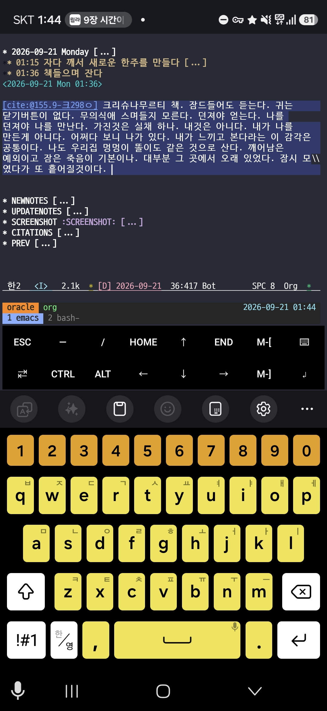

<!-- gid:20260921T000000 -->
<!-- provenance:source:start -->
[[TIP("원본·최신본")]]
이 페이지는 한국어 검색과 읽기를 위한 WikiDocs 미러입니다. [원본·최신본은 가든](https://notes.junghanacs.com/journal/20260921T000000/)에 있습니다. 최신 수정 내용·백링크·태그·히스토리·댓글·출처 정보는 원본 가든에서 확인하세요.

- 작성: `2026-09-21T00:00:00+09:00`
- 최근 수정: `2026-09-21T06:13:00+09:00`
[[/TIP]]
<!-- provenance:source:end -->

[TOC]

## 2026-09-21 Monday

### 01:15 자다 깨서 새로운 한주를 만들다

&lt;2026-09-21 Mon 01:15&gt;

[[TIP("user")]]
새로운 한주의 템플릿은 대략 이렇다. 템플릿이다. 만드는 것은 정말 일도 아니다. 근데 여전히 손으로 복붙하고 replace하고 있다. 왜?! 게으른 것이다. 또 다른 이유도 있다. 새로운 한주를 연다는 것에 대한 '의미'를 붙잡는 것인지도 모른다. 이에 더해 이 파일 자체가 코드라고 생각한적이 없다. [2022-03-10](https://notes.junghanacs.com/journal/20220310T000000/) 이래로 적어왔다. 물론 지금 봐서는 양식이 비슷해 보이지만, 데일리저널도 해보고 datetree 방식의 단일 파일로도 한참 했었다. 지금은 에이전트들이 타임스템프를 남기는 그 방식 말이다. 정해진 것은 없었다. 대략의 얼개의 인터페이스는 이맥스에서 여러 사람들의 고민만 있었다. 나 또한 이런 저런 시도를 해보고 그 안에서 찾아가는 중이다. 위클리노트에 이렇게 남기는 방식을 누가 정했던가? 이 파일의 구성은? 정답은 없다. 이러한 접근은 하네스에서도 유효하다. 나의 집짓기 방식 말이다. AIONSCLUBS를 볼 때도 같은 느낌이다. 내 홈페이지에서도 마찬가지다. 정해진 것은 없다. 이전가지는 혼자 두드리는 것이었다면 지금은 다 같이 담금질을 한다. 다 같이 담금질을 하더라도 여전히 정답은 없다. 끝까지 정답은 없을 것이다. 다시 잔다 지금은 B가 깨어나기 오분전. [2026-09-21 Mon 01:25]이다. 다시 잔다. 끝.
[[/TIP]]

### 01:36 책들으며 잔다

&lt;2026-09-21 Mon 01:36&gt;

(지두 크리슈나무르티 1969) 크리슈나무르티 책. 잠드들어도 듣는다. 귀는 닫기버튼이 없다. 무의식애 스며들지 모른다. 던져야 얻는다. 나를 던져야 나를 만난다. 가진것은 실채 하나. 내것은 아니다. 내가 나를 만든게 아니다. 어쩌다 보니 나가 있다. 내가 느끼고 본다라는 이 감각은 공통이다. 나도 우리집 멍멍이 똘이도 같은 것으로 산다. 깨어남은 예외이고 잠은 죽음이 기본이나. 대부분 그 곳에서 오래 있었다. 잠시 모였다가 또 흩어질것이다.

휴대폰으로 누워서 끄적였다. 손은 두개라. 들고 두르렸다. 스크린샷도 남긴다.

-   

### 06:14 이제 깨어났다 - §doomemacs-config에서 neomacs를 테스트 해볼 시점이 온 것 같다

&lt;2026-09-21 Mon 06:14&gt;

(빅터 프랭클 2020) 빅터 플랭클 죽음의 수용소에서 1부를 다시 들었다. 물론 자면서 들었다. 중간 중간 깨고 듣고 나도 그곳에 있었다.

[2026-09-21 Mon 06:16] openclaw main 힣봇과 neomacs 주제를 종종 대화했다. 시점이 왔다. [힣: i-am-emacs neomacs 이맥스 코어 리서치](https://notes.junghanacs.com/notes/20260209T123532/)

[[TIP("assistant")]]
glg-default • @junghan_openclaw_bot 왔네. 어제 말한 “다음 v0.0.19에서 GUI를 판정하자”가 바로 정식 릴리즈됐다.

• 공개: 2026년 9월 21일 02:33 KST • v0.0.18 이후: 472커밋, 300파일 변경 • 릴리즈 노트에는 PR 9개만 보이지만, 대부분이 직접 커밋이라 실제 변화량은 훨씬 크다.

... 중략 ...
[[/TIP]]

### 09:21 출근길 - 자연어 대신 구조화된 틀 논의

&lt;2026-09-21 Mon 09:21&gt;

-   [llmlog/ §prime-agent: Jev·Laya — 구조화된 틀은 읽는 쪽이 프로그램인 경계에 건다 '2026-09-21]

-   [2026-09-21 Mon 09:24] 힣미니한테 조테로에 위에 관련 링크 다 넣어달라고 함

### 09:39 출근 - HERDR 딜리버리 플러그인 관련 재조사

&lt;2026-09-21 Mon 09:39&gt;

[2026-09-21 Mon 09:45] §agent-config에게 [herdr 생태계 × entwurf DELIVERY 비교표 — 기여 가능/불가능 초안] 이제 플러그인 릴리즈했으니까 다시 조사 맡김

### TODO 10:24 유해화학물질 안전교육 수강중 - 프리츠 하버 선생을 생각하며

&lt;2026-09-21 Mon 10:24&gt;

오늘 반도체 회사 출장 이라서 사전 교육 필요하다고 함. 나는 1차세계대전의 화학전 생각이 난다. 과학자 프리츠 하버가 생각이 난다.

힣미니에게 부탁 (“Fritz Haber (프리츠 하버)” 2026) 를 넣었다.

[[TIP("assistant")]]
조테로에 담고 SSOT까지 확정했다. • 제목: Fritz Haber (1868-1934) — 하버-보슈법(암모니아 합성) 발명으로 1918년 노벨화학상. 전세계 식량 생산의 약 1/3이 이 공정의 암모니아에 의존. 동시에 1차대전 중 염소가스 등 화학무기를 개발해 "화학전의 아버지"로도 불림 • 인용 키: wiki-fritzhaber • Zotero: Wikipedia 컬렉션, 로컬 SSOT는 Reference.bib • 인용: #+reference: wiki-fritzhaber 10:28
[[/TIP]]

-   [2026-09-21 Mon 10:34] 얼마나 인간은 약한가. 프리츠 하버 선생의 공과사에 대해서는 과학사에서 많이 나오는 이야기다.
-   [2026-09-21 Mon 10:49] 프리츠 하버의 처는 자살을 했다. 아이는? 아들이 하나 있었던 것으로 기억하는데.

### 10:43 ENTWURF HERDR 플러그인 문서 업데이트

&lt;2026-09-21 Mon 10:43&gt;

[2026-09-21 Mon 10:43] entwurf 담당자 terra 에게 아래와 같이 서술함

[[TIP("user")]]
--- 1 ---

응 내가 여기에 대해서 말하는 것은 작업대를 만들지 않고 entwurf 드라이버를 쉽게 쓰려면 herdr 플러그인을 사용하라는것이거든. 만는 물론 entwurf 작업대(mux 레일) 을 선호한다. 벗 이렇게 쓰는 것은 입문하기 어려워. herdr이 제공하는 상태 표기와 설치편의성 확장성을 고려하면 이 플러그인은 현재 herdr에 의미있는 플러그인으로서 역할을 하길 바라는거야. 그래서 agent-config에서 지속적으로 리서치하면서 유사한 목적의 도구들과 비교를 하는 것이고, entwurf 플러그인이 어떤 의미를 사용자에게 줄지를 고민하는거야.

herdr 플러그인 리드미를 그래서 다시 정리하고싶어. 관련 herdr 빌트인 기능과, 관 련 플러그인과과 entwurf 플러그인 설치시 제공하는것, 그리고 entwurf 직접 설치시 장점까지

--- 2 ---

응 이렇게 하자. 니가 적지 말고, 내가 entwurf mux에 acp opus를 불렀거든 거기로 니가 읽은것과 지금 니 생각하고 싹 정리해서 전달해서 작성하게해줘. 니가 작업하면 세션이 터질거야. 오푸스가 여유있게 다시 검토하고 쓰게하자. 그리고 우리가 다시 검토하려고해.
[[/TIP]]

좋아. 넘겼다고 한다.

[[TIP("assistant")]]
GLG, mux의 ACP Opus 시민 20260921T104500-3e9ab7에게 README 재구성 작업을 전달했 어. [측정 control-socket → sent]

-   README만 수정, 커밋·푸시 금지
-   기존 운영 사실을 source에서 재검증
-   “쉬운 Herdr 진입 문 + 관찰 창 / mux는 넓은 직접 작업대” 프레임
-   built-in·관련 plugin 유형·plugin 설치 가치·직접 Entwurf 경로를 분리
-   13종 조사는 README에 고정 표로 옮기지 않음
-   완료 뒤 diff·검증·남은 판단을 회신하도록 요청했어.

회신 오면 우리 둘이 다시 검토하자.
[[/TIP]]

### 10:58 아 새로운 한주를 내보내야 하는구나 가든 업데이트 가자

&lt;2026-09-21 Mon 10:58&gt;

## NEWNOTES

[2026-07-17 Fri 07:46] 요즘 새 노트 안만듭니다. 오래된 노트를 새로 인테리어 해서 내보냅니다. 왜? URI가 공개된 것은 회수하지 않습니다. 히스토리를 간직한채 세상에 투척합니다.

-   [llmlog/ §prime-agent: Jev·Laya — 구조화된 틀은 읽는 쪽이 프로그램인 경계에 건다 '2026-09-21]

## UPDATENOTES

## SCREENSHOT

## CITATIONS

### [urldate: 2026-09-21 ~ 2026-09-27]

-   Jev 덕분에 구조화된 출력이 다시 흥미로워졌다 (xguru 2026)
-   Introducing System One Models &amp; Jev (Diogo Almeida 2026)
-   NandhaKishorM/laya (“Nandhakishorm/Laya” 2026)
-   Fritz Haber (프리츠 하버) (“Fritz Haber (프리츠 하버)” 2026)

## PREV

-   [2026-09-14](https://notes.junghanacs.com/journal/20260914T000000/)

## BIBLIOGRAPHY

- 빅터 프랭클. 2020. <i>죽음의 수용소에서: 죽음조차 희망으로 승화시킨 인간 존엄성의 승리</i>. Translated by 이시형. 개정보급판. 파주: 청아출판사. [https://www.yes24.com/product/goods/90384709](https://www.yes24.com/product/goods/90384709).
- 지두 크리슈나무르티. 1969. <i>아는 것으로부터의 자유</i>. [https://www.yes24.com/product/goods/185521950](https://www.yes24.com/product/goods/185521950).
- Diogo Almeida. 2026. “Introducing System One Models &#38; Jev.” September 15, 2026. [https://typesafe.ai/blog/introducing-system-one-models-and-jev](https://typesafe.ai/blog/introducing-system-one-models-and-jev).
- “Fritz Haber (프리츠 하버).” 2026. [https://en.wikipedia.org/wiki/Fritz_Haber](https://en.wikipedia.org/wiki/Fritz_Haber).
- “Nandhakishorm/Laya.” 2026. [https://github.com/NandhaKishorM/laya](https://github.com/NandhaKishorM/laya).
- xguru. 2026. “Jev 덕분에 구조화된 출력이 다시 흥미로워졌다.” September 20, 2026. [https://news.hada.io/topic?id=33975](https://news.hada.io/topic?id=33975).
