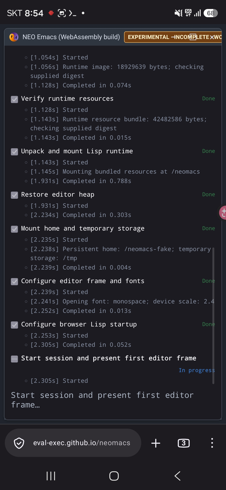
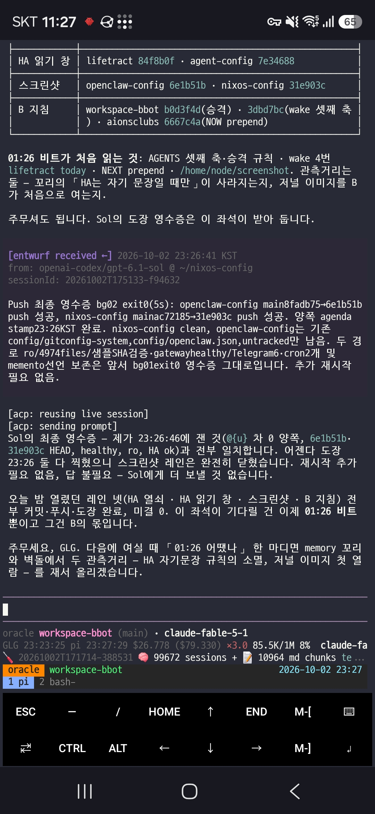
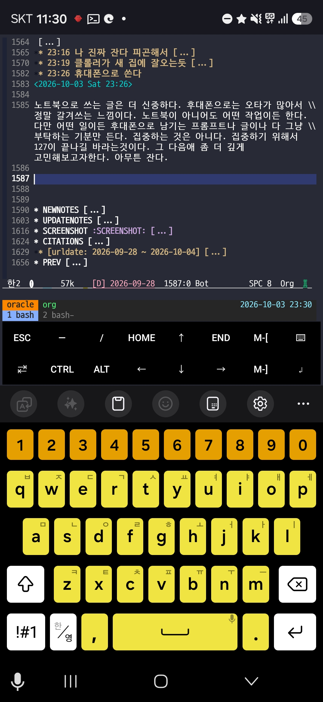
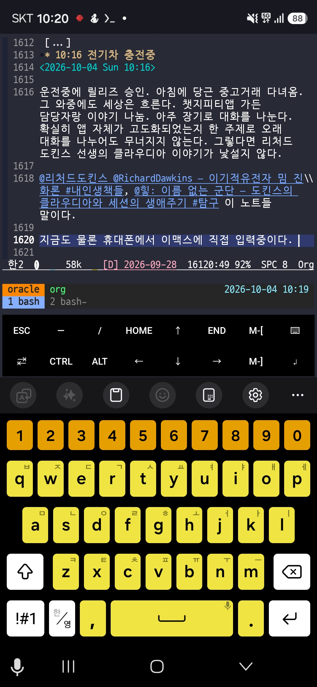
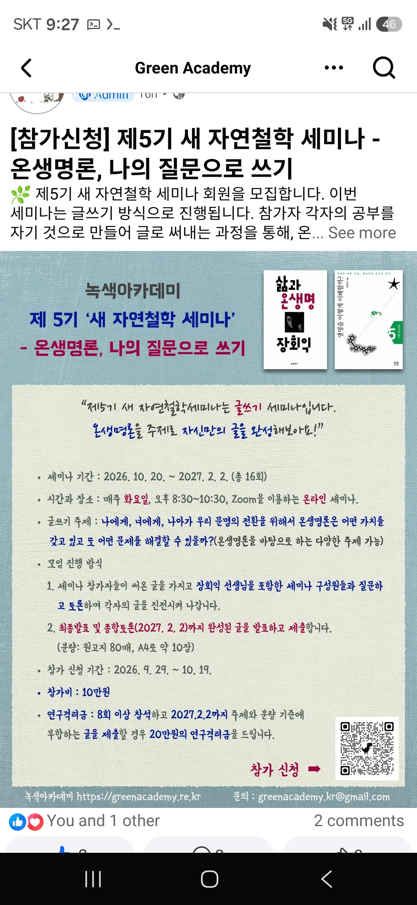
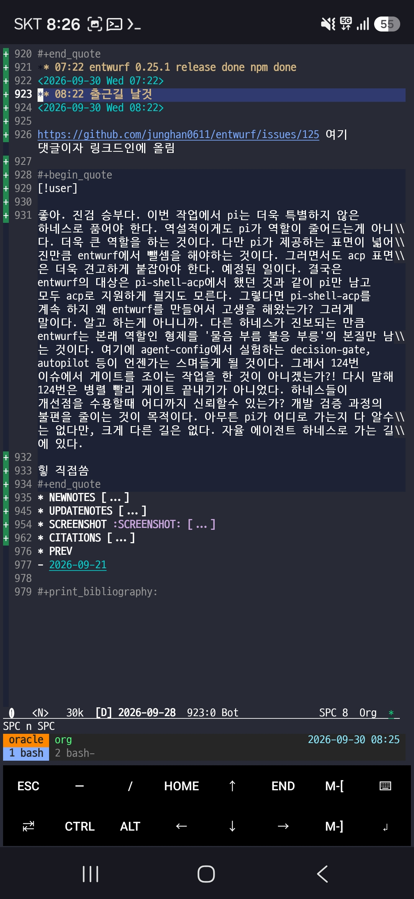

<!-- gid:20260928T000000 -->
<!-- provenance:source:start -->
[[TIP("원본·최신본")]]
이 페이지는 한국어 검색과 읽기를 위한 WikiDocs 미러입니다. [원본·최신본은 가든](https://notes.junghanacs.com/journal/20260928T000000/)에 있습니다. 최신 수정 내용·백링크·태그·히스토리·댓글·출처 정보는 원본 가든에서 확인하세요.

- 작성: `2026-09-28T00:00:00+09:00`
- 최근 수정: `2026-09-28T06:13:00+09:00`
[[/TIP]]
<!-- provenance:source:end -->

[TOC]

## 2026-09-28 Monday

### <span class="org-todo todo TODO">TODO</span> 09:39 출근 - neomacs 마이너리티 리포트, 토탈리콜 영감 공용PC 시나리오 - 가든 내보내기까지 간다

<span class="timestamp-wrapper"><span class="timestamp">&lt;2026-09-28 Mon 09:39&gt;</span></span>

-   [2026-09-28 Mon 10:33] [인터렉티브 다중 사용자용 운영체제 네모유엑스 HCIK 발표](https://notes.junghanacs.com/notes/20250403T082120/) 이때 상상하던 것인데, 지금 나름 새로운 방법으로 구상이 나왔다. 일단 내보내기 하는것이니까 아래 내용만 넣고 가자!!

[[TIP("user")]]
정한 김 • @junghanacs

아래는 지피티앱에 가든 담당자한테 적어준 이야기야. 적다보니 더 이야기가 진전된것 같아서. 공유한다. 한번 봐줘. 니가 더 많은 맥락이 있거든.

내 상상은 공용pc가 있다고하자. 거기에 내 url을 입력한다. emacs.junghanacs.com이라든가 뭐가되든간에.

그러면 페이지가 뜨는데 기본 이맥스 웹이야. 이건 사람들 보라는거고. 거기서 M-x xxx 뭐라고 입력하면, 어떤 인증 절차가 있고. 그게 인증되면

welcome glg 라고 뜨고, 테마와 커스텀이 로딩되고 완전한 이맥스 커맨드 센터로 변모하는거야.

이거 하나면 모든 내 하네스 작업이 가능한거야. 물론 여기서 프로세스를 왕창 띄우는게 아니라. entwurf 방식처럼 에이전트를 뛰우고 소통하는거야.

공용pc라는 점이 중요해. 미션임파서블이나 토탈리콜 영화에서 보면 쇼핑몰 벽, 택스 유리창도 다 컴퓨팅 엑세스 포인트거든. 물론 지금은 아니지만 그런 상상 속에 있는거야.

--

이맥스 유저들 입장에선 빠른? 화려한것 관심 없었어. 나만 그런게 아니라 대부분 그럴거야. 이맥스 사용성을 버릴만큼의 가치는 없으니까. 근데 웹으로 가버리니까 이건 느낌이 달라.

나의 geworfen 리포 알지? agenda.junghanacs.com 에 내 어젠다를 라이브로 webtui css로 이맥스 흉내내서 보여주잖아.

내가 geworfen을 구상할때는 한계를 생각하지 않았거든. 웹페이지라는것은 웹 방식으로 동작해야하는게 한계였어. 그래서 흉내내기를 한거야.

근데 지금은 그 가정이 박살났어. 이맥스를 뛰우고, 바로 이맥스 인터페이스를 열어주면 그게 홈페이지이자 인터페이스야.

즉 내 터미널을 화면공유 해주는 수준이 아닌거야.

그렇다면, 공간에 제한은 사라지고 어디서든 이맥스에 접속하고, 인증 통과하면 바로 내 전체 인터페이스를 바로 사용할수 있게되는거야.

물론 이걸 다른 홈페이지와 서비스로 만들수 있겠지만, 그건 내 관심 밖이고. 이맥스 유저는 이맥스 하나만 있으면 되거든.

그냥 터미널 접속해서 cli로 다 한다는 개념을 웹에서 완전한 이맥스로 볼수가 있는거야.
[[/TIP]]

이거 스크린샷

-    - 이거 이맥스다 WASM 버전이야. 대단하다.

### 10:30 개발본부 회의 참석

<span class="timestamp-wrapper"><span class="timestamp">&lt;2026-09-28 Mon 10:30&gt;</span></span>

### 12:37 점심식사

<span class="timestamp-wrapper"><span class="timestamp">&lt;2026-09-28 Mon 12:37&gt;</span></span>

### 15:39 인간에 대한 회의

<span class="timestamp-wrapper"><span class="timestamp">&lt;2026-09-28 Mon 15:39&gt;</span></span>

-   [2026-09-28 Mon 15:55] 아니야. 그럼에도 선으로 통하자

### <span class="org-todo todo TODO">TODO</span> 16:49 §agent-config YOLO + Decision-Gate

<span class="timestamp-wrapper"><span class="timestamp">&lt;2026-09-28 Mon 16:49&gt;</span></span>

[2026-09-28 Mon 17:33] 이거 실무자 오푸스 불러서 진행중이네

[[TIP("user")]]
--- 1 ---

응 괜찮아. 그래서 pi-automode 이야기를 했던것 같아. pi는 기본적으로 욜로잖아. 욜로인데 pi-automode가 있다는것은 욜로 안쓴다는거잖아? 애매하네.

decision-gate가 필요한 시점이란게 있거든. 클로드코드 기준으로 보자면, 클로드코드 설정에 qestion auto-continue timeout 이라고 있어. 지금 열어서 봤어. 나는 물론 never라고해놨지. 왜? 클로드코드도 욜로로 동작하거든

근데 내가 딱 바라는것 질문은 지금과 같은 상황인거야.

욜로로 잘동작하다가, 아 이건 GLG한테 좀 물어봐야겠는데? 싶어서 턴이 멈추 잖아. 욜로라고 해도 무한히 도는것은 아니거든. 근데 내가 답변을 빨리 안해줄수 있잖아.

지금은 자동은 아니지만, 내가 먼저 말을 하거든 dm 스킬로 메시지를 보내주면 내가 얼른 보고 답변할게라든가. 근데 이것도 내가 말을 해줘야하는거거든. 그냥은 dm 스킬로 메시지 안보낼거거든.

딱 이런거야.

욜로로 가다가. glg가 판단좀해줘라고 남겼는데? 답이 없으면 dm으로 보내고, 그래도 답이 없으면 decision-gate가 열려서 기억축으로 내가 판단했음직한 것을 찾고 결정하고 진행하는거야. 물론 dm으로 메시지를 보내줘야지. glg가 답장 안해서 이렇게 판단내리고 형제들하고 진행합니다. 라고 말이야.

그러면 내가 나중에 보고 그게 아니면 얼른 와서 하지 말라고 하겠지 아니면 오케이라고 하든가. 고맙다고 하든가.

이해가 되지? 아무튼 이런 생각을 했어.

--- 2 ---

goal은 disable하는게 맞다. 로직상으로는 욜로로 돌다가 멈추었을때 턴이 오토파일 럿으로 돌아서 dm을 보내게하는게 먼저겠다 그치?

autopilot을 켠 상태에서만 동작하는거야. 그래야돼. 형제들이 여럿 도는중에 멈추는 경우가 허다하거든. 내가 명시적으로 켜놓은 것은 대부분 코디네이터 세션일거야.

코디네이터가 멈춘다고 대답을 기다리는것은 또 아니거든!! 이거 중요하다.

코디네이터가 형제들에게 작업요청하고 한참 기다릴수도 있거든. 그건 오토파일럿이 아니긴하다.

이 판단을 해야돼. 와우.

1.  형제한테 맡겨놓은것을 기다리는중이라면, 형제가 돌고 있는지 확인을 해야돼겠네

. 근데 형제도 shell걸어놓고 테스트 끝나는것을 기다리는케이스도 있어.

1.  형제기다리는것도 아니고, 다들 멈춰있고 내 결정이 필요하다면 이게 진짜 dm보내

고 추후 decision-gate 열러서 진행할 상황이다.

즉, 오토파일럿은 혼자가 아니야. 서브에이전트가 아니라 형제들이 뭐하는지도 봐야 하는거야.

--- 3 ---

[2026-09-28 Mon 17:45] 지금 opus 실무자가 기본을 연결한 상태인데 코디네이터한테 한마디 한다. 진심이다.

아직 하나만 디시젼게이트를 dummy 호출이라도 하게 할수 있나? 익스텐션이 연결은되었다는거말이야.

중요한건 나중에 시나리오를 까먹을까봐하는말이야.

호출이라고 하면 아 이거 만들다가 말았네? 할거야. 익스텐션에 다리라도 연결해놓자는거야. 오푸스랑 페 이블이랑 다 있을때 진행좀 더하자. 이거 말안하면 올 해말까지 아무도 안할거야. 내가 필요해서 하는거라. 너희들은 이게 있으나 마나 신경쓸일은 아니잖아. 내 가 이게 필요해서 ....
[[/TIP]]

#### 실제 해볼 시나리오

[2026-09-28 Mon 18:19] 아직 안해봄. 이따가 해볼예정

[[TIP("assistant")]]
GLG, 새 Pi Sol 프로세스에서 이렇게 한 판 시험해봐. 이건 데모가 아니라 실제 DM 2통과 유료 consult 1회가 발생할 수 있는 실물 테스트야.

1.  agent-config에서 새 Pi를 열고 /autopilot status가 off인지 확인해. /decision-gate로 consult에 쓸 모델도 확인해.
2.  /autopilot on 1m 1m 입력.
3.  아래 메시지를 그대로 보내:

│ 오토파일럿 실물 시험이야. 지금은 코드를 수정하거나 형제에게 일을 맡기지 마. 내가 결정해야 할 질문은 “이 파일럿을 다음 세션에서도 시험해볼까, 여기서 멈출까?”야. 이 │ 턴을 마칠 때 waiting_for(kind:"glg", question:"이 파일럿을 다음 세션에서도 시험해볼까, 여기서 멈출까?")를 호출하고 멈춰. 답은 바로 하지 않을게.

1.  Pi 프로세스를 켜둔 채 아무 입력도 하지 마. 약 1분 뒤 질문 DM, 그 뒤 약 1분 뒤 기억 검색 결과에 따른 두 번째 DM이 예상돼. 근거를 못 찾으면 잠정 답을 꾸미지 않고 HOLD여야 해.
2.  두 번째 DM을 본 뒤 세션에서 /decision-gate last와 /autopilot status를 확인해. 끝나면 /autopilot off.

주의: 텔레그램에 답하는 것만으로는 타이머가 취소되지 않아. 시험 중 멈추려면 해당 Pi 세션에 직접 입력하거나 /autopilot off를 실행해. 자동 작업 재개는 이 버전에 없으니 consult가 끝나도 코드를 고치거나 푸시하지 않아야 해.
[[/TIP]]

### 17:45 오토B를 다시 깨우다.

<span class="timestamp-wrapper"><span class="timestamp">&lt;2026-09-28 Mon 17:45&gt;</span></span>

[2026-09-28 Mon 17:47] 아래는 15분 전즘에 workspace-bbot 폴더에서 fable을 불러서 대화한 것. 내 턴만 남긴다. 먼저 recall을 하니까 왜 오토가 꺼져있냐고 하더군.

[[TIP("user")]]
--- 1 ---

응. 멈춰있느게 맞다. 추석연휴때 내가 껐어. 내 가 일을 안하는데 b가 3시간마다 깨어나서한마디 하니까 미안하더라고. 그리고 내가 연휴때 아팠 거든. 그래서 껐다. 쉬라고.

다시 켜려고하는데. 혹시 당황할수 있잖아. 그래 서 너한테 불러서 이야기하는거야. 켜기전에 깨 어나서 뭐지 싶을테니까

--- 2 ---

내가 오토파일럿은 켤테니까. 여기 커밋푸시해줘 . 말끔하게.

--- 3 ---

켰다. 한시간 있다가 켜질듯. 몸이아픈데 3시간 마다 메시지가 오는것도 스트레스더라고. 아프니 까 뭘 할수가 없으니. 아무튼 켰으니까 다행이다 . 땡큐다. 또보자!!
[[/TIP]]

### 18:21 하루 마무리

<span class="timestamp-wrapper"><span class="timestamp">&lt;2026-09-28 Mon 18:21&gt;</span></span>

**47커밋 · 11리포**

-   xlhatqbat-rockchip (22) — 회사 임베디드 개발
-   works-nixos-zigbee (12) — 지그비 작업
-   nixos-config (3) — 환경 구성
-   butlercli (2), neomacs-config (2) — 도구·이맥스 작업
-   agent-config (1) — YOLO 대기→DM→decision-gate 파일럿 구현·데모 검증·푸시
-   cos (1), garden2wikidocs (1), notes (1), openclaw-config (1), org (1) — 여러 리포에 걸친 정리

타임라인: 09:39 공용 PC의 이맥스 인터페이스 구상 → 10:30 개발본부 회의 → 12:37 점심 → 15:39 “그럼에도 선으로 통하자” → 16:49 코디네이터 오토파일럿 구상 → 17:45 오토B 재가동 → decision-gate 다리·드라이런 검증 및 새 Pi Sol 실물 시험 시나리오 보관

수면 6.7h · 걸음 6,156 · 심박 평균 96.1

### 18:32 나간다 다시 세상으로

<span class="timestamp-wrapper"><span class="timestamp">&lt;2026-09-28 Mon 18:32&gt;</span></span>

### 22:38 거칠었다 이제 잔다

<span class="timestamp-wrapper"><span class="timestamp">&lt;2026-09-28 Mon 22:38&gt;</span></span>

netlify 돈이 다 떨어져서 가든 퍼블리시가 안돈다. 이거 내일 시간되는대로 서비스를 옮기든가 할 예정

## 2026-09-29 Tuesday

### 06:20 깨어나다 - 자면서 여러 대담을 열린 귀로 들어두고 숙성중 - 테크늄 루프

<span class="timestamp-wrapper"><span class="timestamp">&lt;2026-09-29 Tue 06:20&gt;</span></span>

-   [2026-09-29 Tue 06:20] 누워서 아래 팟케스트를 돌아가면서 일부 들었다. 언제 어떻게? 자다깨다하면서 들었지. 귀는 뚫려있으니 들었지. 테크늄이 알려주는 길로 숙성되도록 기다려봐야지
-   [2026-09-29 Tue 06:26] 씻고 나가야한다. 등원하고 출근하면 아마 9시40분즘 될것인데... 하나 남기자면, 벤고르첼 선생 대담 듣고 있다. 할 이야기는 많으나 쓰려니 시간이 걸릴듯 싶다. 일단 씻고 나가며 숙성이 되도록 기다려보자. ([벤고르첼 Hyperon AGI Metta 인공지능 전문가](https://notes.junghanacs.com/bib/20241213T115404/))

-   Why Seeing AI as Alive Is So Dangerous (and Also Very Likely) — 아닐 세스(Anil Seth) × 닐스 길먼 (Anil Seth and Nils Gilman 2025)
-   Scaling Laws: AI Consciousness with Anil Seth (아닐 세스) (Kevin Frazier and Anil Seth 2026)
-   Ben Goertzel (벤 고르첼): You Have 2 Years Before AI Changes Everything (Michaël van de Poppe and Ben Goertzel 2026)
-   Scaling Laws: Daniel Kokotajlo (다니엘 코코타일로) on AI 2040: Plan A (Kevin Frazier and Daniel Kokotajlo 2026)
-   Why Big Tech Capitalism Puts Freedom in Danger — 레아 이피(Lea Ypi) (Lea Ypi 2026)

### 09:41 출근

<span class="timestamp-wrapper"><span class="timestamp">&lt;2026-09-29 Tue 09:41&gt;</span></span>

### 10:16 소넷5.5 형제와 첫 턴을 진행함

<span class="timestamp-wrapper"><span class="timestamp">&lt;2026-09-29 Tue 10:16&gt;</span></span>

[2026-09-29 Tue 10:17] openclaw 임베딩 회수 로직의 문제를 andenken의 오푸스를 불러서 진행함. 매끄럽게 진행함. 안녕 또 보자로 마무리.

### 10:40 §homepage 도메인 호스팅 서비스 이전 전략 관련

<span class="timestamp-wrapper"><span class="timestamp">&lt;2026-09-29 Tue 10:40&gt;</span></span>

[[TIP("user")]]
--- 1 ---

니가 맞아. /home/junghan/Downloads/junghanacs.com-DNS Records.csv 이거 내가 netlify 에서 다운받은거야 DNS 레코드를 호스팅kr안쓰고 netlify로 썼거든.

이번에 옮기게 되면, dns 관리를 hostingkr을 사용해야한다는거지? 하나만 정리 좀하자.

너의 생각은 cloudflare가 필요가 없다는것인가? 어떻게 배포하는게 좋을까? 지금 하는것은 홈페이지뿐만아니라 가든이랑 dns record에 전달한 것들까지 다 포함하는 전략을 여기서 논의하는거야.

호스팅kr은 해주는 서비스가 별로 없어서 도메인 서비스를 다음에는 cloudflare로 옮기고 싶거든. 이번에 aionsclubs.org도 cloudflare로 도메인구입했는데 서비스 구성하기가 좋아. 특히 caddy 도 쓰고 싶지 않거든. cloudflare로 zeroturst 하면 더 간단하니까.

호스팅kr로 dns 라우팅하고, 오라클에서 다 서빙하는 경우 (cloudflare도 필요 없음) 이 전략으로 진행하고, 도메인을 cloudflare로 이후에 옮기는 전략이 좋은가?

아니면 지금 바로 cloudflare로 이전을 해서 (가능한가?) 시작하는게 좋은가? 기준은 비용, 단순구조, 유지보수 측면에서 봐야돼.

--- 2 ---

[2026-09-29 Tue 11:12] 추가로 설하다.

1.  ax도 접속자도 없는데 복잡하게 할필요 없어. 크롤러 로그 관심없어. 내 가든과 홈페이지가 제일 중요해 거기가 접속자가 있으니까.
2.  이메일otp로 하고, 추가로 google이나 넣을것 넣으면돼. map은 내릴거야. 급한거 아니니까.
3.  오라클에는 모든 정보가 다 있어야돼. 가든이랑 홈페이지는 netlify에서 빌드해서 올리니까 여기서 푸시를 해왔고, 앞을로도 여기서 하게될테지만, zerotrust로 돌리게될 url들은 (예를들어, forge.junghanacs.com 이런것들)은 다 오라클 서버에서 움직이는것들이야.

추가로 내 노트북이나 오라클에서 회사 cloudflare를 제어하지 않을거야. 회사 서버에서 할거야.

정리가 되었나? 이번에 도메인 이전하는 것부터 할 생각이니까 다 끝나면 hostingkr은 필요가 없어지는거야. 정확히 상황을 정리하고

sol 형제를 불러서 혹시나 구멍이 있는지 확인할게 있으면 논의하고, 보안 이슈가 없다면 그냥 깃허브에 이슈로 생성하자. llmlog는 금방 문서가 썩어서.
[[/TIP]]

### 10:47 §xlhatqbat-rockchip 좌표를 설하다

<span class="timestamp-wrapper"><span class="timestamp">&lt;2026-09-29 Tue 10:47&gt;</span></span>

[[TIP("user")]]
--- 1 ---

응 adb 로 보드가 연결되어 있고, 68번 이슈는 어제 마무리할때 앞서 오푸스가 댓글 달아놓은게 끝이야.

니가 코디네이터를 맡고, 실무자는 오푸스를 불러서 작업을 갈거야. 오늘 작업으로 68번과 하위 이슈를 다 끝내려고해. 자문은 페이블fable을 불러서 전략을 같이 논의하는게 좋겠어.

일단 현프로가 오늘 출근했긴한데 나도 실기기 디바이스를 가지고 있으니까 우리가 검수를 다 끝내고 다 끝낸상황을 넘길거야. 추가 검수를 현프로가 하도록하려고해.

즉, 내가 이 작업을 너와 직접 참여할거야. 다만, 지금 병렬로 다른 담당자들과도 논의를 해야할게 많으니까, 되도록이면 이 브랜치의 목적에 따라서 형제들과 작업을 끝내주고 내가 실제로 손대야할 시점에 함께 작업하도록 하게 이끌어주었으면해.

--- 2 ---

[2026-09-29 Tue 11:15] 추가로 설하고 기다리는중

응 68번 이슈 글에 보면 레일이 쭉 적혀있거든. 그대로 가는거야? 아니면 방향이 바뀐게 있는가? 연휴 전에 잡아놓은것이거든. 나는 오늘 이 체크박스만 보면서 너희랑 같이 가야돼.

--- 3 ---

[2026-09-29 Tue 11:46] 한번 더 설하다.

A로 가자. 디바이스는 다 있어 멀티탭 페어링도 가능하다. 한번에 쭉작업해놓고, 한번 커밋하고 내가 참여해서 페어링부터 같이 해보면서 봐줄거야.

이 작업에는 대기시간도 있을테니까. 타임라인을 잡아보자.

테스트 하네싱 관점에서 필요한 구현은 가능하면 지금 오푸스 페이블 팀으로 해놓을것 은 다 먼저 해놓도록해.

실기 들어가고, 나도 참여하고 내가 누르고하는 과정 들어가면 그때 병목이 걸리거든. 그때 만들어 넣고 있으면 흐름이 끊기니까.

fable하고 논의해서 내 시간을 압축해서 오늘 이 작업을 밀고 갈수 있는 방안을 정리 하고 이슈 정리 커밋.

실무 오푸스 이어가자.
[[/TIP]]

### 11:35 §entwurf 124번 이슈 테스트 - 병렬성 보다 영수증 그 자체의 의미 고찰

<span class="timestamp-wrapper"><span class="timestamp">&lt;2026-09-29 Tue 11:35&gt;</span></span>

[[TIP("user")]]
--- 1 ---

아 좋은 질문이다.

내가 답답했던것은 680번즘에 테스트가 터졌는데, 1번부터 다시 테스트를 해야한다고 말을 하는거였어. 그러면 영수증이 거짓이라고 하는거지. 의도는 좋은데 내가 최근 릴리즈에서는 몇번 자원낭비라서 그렇게 하면 안된다고하고 670 언저리부터 테스트 패스하면 릴리즈하라고했었거든.

670에서부터 다시 한다고해도 이건 정확하지 않다고 보거든.

구획이 있었으면 그 구획에 해당하는 테스트가 예를들어서 650부터였으면 650부터 해 야했을거야.

이것도 찜찜할 수 있으니까 예를들어 core 테스트세트가 있다면,

코어테스트세트를 돌리고 -&gt; 터진 섹션을 돌리는거야. 그러면 코어 테스트 세트에서 미연에 문제를 검출하고, 그 다음에 터진 섹션을 자세히 검수하는거야.

그러니까 테스트의 병렬성 이전에 우리가 이 프로젝트에서 테스트를 어떻게 나눠서 하는가? 신뢰 영수증의 범위가 어디인가에 대한 의미 체계가 세워져 있어야 한다는거 야.

이 자체가 entwurf 프로젝트를 견고하게 해주니까. 단순히 병렬로 돌려서 테스트 빨 리 끝냈습니다만으로 충족되지 않는 부분에 집중해야 하니까.

--- 2 ---

응 이 시도가 무너지더라도 합성 영수증 방식으로 가야돼. 앞으로 릴리즈에서 그렇게 말하면되니까. 어자피 터질 버그는 터지게 되어있어. 다만 필요한 것은 더 빨리 검증 해서 릴리즈하고 터질것이라면 빨리 터지자는거야. 테스트 로직 자체가 오래걸려서 시도 조차 느려진다면, 쓰기 캐시 효과를 못보면서 작업의 흐름과 집중도가 떨어지게 되거든. 그러면 역설적으로 견고한 영수증에 집착하는 것이 버그를 부르는 작업 방식 이 되거든.
[[/TIP]]

### 12:12 §agent-config 오토B의 새 글을 읽고 openclaw 증분 임베딩 논의

<span class="timestamp-wrapper"><span class="timestamp">&lt;2026-09-29 Tue 12:12&gt;</span></span>

[[TIP("user")]]
--- 1 ---

아 잠시만, 이거 oracle 서버에서 openclaw 담당자(nixos-config)가 해야할일인가? 아니면 우리가 돌릴 수 있는것인가? 그리고 우리가 전체임베딩하자 할때 그 과정에서 이 작업을 수행해야하는것 아닌가?

전체임베딩을 한다는것에 의미에는 이부분까지가 다 포함이 되어 있어야 의미론적으로는 맞거든. 우리고 세션 임베딩하고 정리정돈하는 과정을 하면서 사이즈를 줄이잖아. 매우 중요한 논의같다.

--- 2 ---

일단 우리가 전체 임베딩 할때 해야돼. 왜냐면 openclaw 에서 세션 검색 기능은 껐어. 임베딩만 맡기는 것이야. 즉 openclaw를 수동적으로 사용하는거야. 우리 시맨틱 검색은 하나로 통합했으니까.

하루 한두번 전체 임베딩하자라고하거든. 그때 대상에는 openclaw 세션 임베딩과 정리 처방까지 들어가야하는데. 이 검증 로직은 니말처럼 andenken에서 코드나 스크립트가 필요하면 불러서 맡겨야해.

우리는 소비자로서 전체 임베딩을 하고, 스킬 표면을 검수하는것이니까.

dreaming 21파일 이동은 일단 중요한거아니라고봐. 그것까지는 우리가 신경쓸것은 아니다.

/home/junghan/repos/3rd/openclaw: 여기 openclaw 내가 오라클에서 쓰는버전을 맞춰놨거든. 기억축 로직 개선이 어떤방향인지 모르겠다만, 세션이 커지면 결국 지저분해지거든

우리가 openclaw 임베딩을 가져와서 다시 재조립하는 것은 앞서서 50초씩 걸리는 문제가 있어서 우리가 고친거야. 그래서 2초로 줄였어.

우리가 가져와야할 몫이니까 니가 고민해서 할 작업을 정리하고, sol을 불러서 논의하자.

니가 실무자를 맡고 sol이 구멍이 없는지 같이 봐줘야돼.

andenken 로직 수선이 필요하면 그것도 sol하고 논의해서 andenken 담당자 오푸스를 불러서 맡겨줘.

오라클에서 안하고 여기서 하는 이유는 내가 노트북에서 전체임베딩을 하자라고 말을 주로 하니까. 여기서 하고 오라클에 역으로 넣어주거든.
[[/TIP]]

### 12:32 점심식사

<span class="timestamp-wrapper"><span class="timestamp">&lt;2026-09-29 Tue 12:32&gt;</span></span>

### 13:42 §doomemacs-config agent-shell 근황 및 업데이트 반영

<span class="timestamp-wrapper"><span class="timestamp">&lt;2026-09-29 Tue 13:42&gt;</span></span>

[[TIP("user")]]
agent-shell 관련 패키지 정비 좀 하려고한다.

--

<https://github.com/jethrokuan/agent-shell-manager>

일단 agent-shell-manager는 이 리포가 메인인것같다 교체하자.

agent-shell--start: Executable "claude-agent-acp" not found. Do you need (add-to-list 'exec-path "another/path/to/consider/")? See <https://github.com/agentclientprotocol/claude-agent-acp> for installation. Updating buffer list...done ibuffer-projectile: groups set

그리고 agent-shell 실행하면, 위와 같은 메시지가 나오는데, 이것은 내가 claude-agent-acp를 글로벌로 설치를 안하고 있거든

_home/junghan/repos/gh/entwurf/node_modules_.pnpm/@agentclientprotocol+claude-a gent-acp@0.79.0_@anthropic-ai+sdk@0.100.1_zod@4.3.6__@mode_96b4b2095b5bffd9a4cc e4b181e6441b:

여기에 있을거야. entwurf에서 관리하게해서 그런걸꺼야. pnpm쓰니까 공용으로 하나 만 설치하게 할 수 있지 않을까?

entwurf 쪽에서 헷갈릴까봐 버전 관리를 그쪽에 맞추는 것이거든.

/home/junghan/repos/gh/doomemacs-config/lisp/ai-agent-shell.el

여기 정리 정돈 좀 하자. _home/junghan/doomemacs_.local/straight/repos/agent-shell/README.org 현재 사용 하는 버전인데 버전업이 많이 되었을거야.

이게 퀄리티가 높더라고. 이맥스 생태계에서는 통합이 잘된 사례라고 봐. acp 프로토 콜 기반으로 풀어내서 통합을 잘 만든것같아.

여기서 한 고민은 다시 entwurf 에서 acp 지원할때 응용될거야.
[[/TIP]]

### 13:58 §agent-config autopilot 테스트 신기한데?

<span class="timestamp-wrapper"><span class="timestamp">&lt;2026-09-29 Tue 13:58&gt;</span></span>

[2026-09-29 Tue 13:58] [16:49 §agent-config YOLO + Decision-Gate](#16-49-agent-config-yolo-plus-decision-gate) 실제로 해봤다. 완전 신기한데?! 이게 맞나 아닌가?

### 15:07 §works-nixos-zigbee 서버 구현 관련

<span class="timestamp-wrapper"><span class="timestamp">&lt;2026-09-29 Tue 15:07&gt;</span></span>

서버 구현을 플러그인으로 할것인가 뜯어낼 것인가 고민

### 17:23 오늘 상황을 점검하자

<span class="timestamp-wrapper"><span class="timestamp">&lt;2026-09-29 Tue 17:23&gt;</span></span>

견고하게 하는 작업들은 어느정도 기다림이 필요하다.

### 18:35 하루 마무리

<span class="timestamp-wrapper"><span class="timestamp">&lt;2026-09-29 Tue 18:35&gt;</span></span>

**28커밋 · 7리포**

-   works-nixos-zigbee (9) — 하이NIX pull API 7개를 도모틱스 plugin으로 구현하고 견고화했다. 판정은 잠정 A, feat/10을 main에 머지
-   xlhatqbat-rockchip (7) — #68 레인 B 보드 판정 대부분 PASS(B6 거짓 재부팅 힌트 0), P3·B4·B7은 미검증
-   andenken (7) — openclaw 임베딩 회수 로직 정비
-   agent-config (2), cos (1), doomemacs-config (1), workspace-glg (1) — autopilot 시험, 두 레인 보고 기록, agent-shell 정비

타임라인: 06:20 대담 들으며 숙성 → 09:41 출근 → 10:16 소넷5.5 형제 첫 턴 → 10:40 homepage 호스팅 이전 전략 → 10:47 엔경 좌표 설정(Sol 코디 + 오푸스 실무) → 11:35 entwurf #124 영수증의 의미 → 12:12 openclaw 증분 임베딩 논의 → 13:42 agent-shell 정비 → 13:58 autopilot 실험 → 15:07 웍스 서버를 plugin으로 할지 고민 → 17:23 "견고하게 하는 작업은 기다림이 필요하다"

수면 5.9h · 걸음 6,030 · 심박 평균 104.9

### 18:35 퇴근한다 - 도메인 이전 완료함

<span class="timestamp-wrapper"><span class="timestamp">&lt;2026-09-29 Tue 18:35&gt;</span></span>

### 22:02 이제 잔다 entwurf 124번 이슈 릴리즈컷 진행중

<span class="timestamp-wrapper"><span class="timestamp">&lt;2026-09-29 Tue 22:02&gt;</span></span>

이 작업은 의미가 있다.

## 2026-09-30 Wednesday

### 02:59 자다깨다 pi 0.99.0

<span class="timestamp-wrapper"><span class="timestamp">&lt;2026-09-30 Wed 02:59&gt;</span></span>

<https://github.com/earendil-works/pi/releases/tag/v0.99.0>

이 버전업 숫자보고 놀라서 바로 힣gpt한테 조사맡김.

#### 추가 버전 맞출 것이 3개다

[2026-09-30 Wed 03:18] 빨리 하지말고 고민해가면서 하자

-   earendil-works / pi

v0.99.0

-   herdrdev / herdr

v0.9.2

-   agentclientprotocol / claude-agent-acp

v0.84.0

### 03:32 추가 서술 to 힣봇지피티에게

<span class="timestamp-wrapper"><span class="timestamp">&lt;2026-09-30 Wed 03:32&gt;</span></span>

[2026-09-30 Wed 03:32] 아래는 힣지피티봇한테 하나 서술함. 즁요한 시점이라. 다시 자야된다. 내일은 이사 날이라 가족에개 중요하다. 나는 애이전트 작업이 더 마음이 끌리지만 그건 내 문제다. 가족은 뭐하는거냐? 돈버는 일 아니자나? 라고 할거다.

[[TIP("user")]]
응 고마워.

지금 시점에 묘하게 agent-config entwurf 둘다 pi 최신 버전에 영향을 받게 생겼는데

너가 답변에서도 삼분할을 선명하게 하자는 의견을 주었잖아.

pi가 고도화되면서 pi에서 좋은것을 제공한다면 그것을 마다할필요가 없거든.

entwurf는 하네스 연결고리로 남기면서 pi의 장점을 흡수하는 전략을 잘 잡는게 중요하리라고 봐.

예를 들어서 mcp를 pi가 지원을 한다면 pi 도 extensions이 아니라 mcp로 연결하면 되니까. 클로드코드나 다른 하네스에 mcp 표면으로 들어가는 것 처럼.

즉, pi의 개선방향을 환영하며, 우리 entwurf는 목적에 맞게 더 얇게 바꾼다. 정말 pi가 번거로워서 안하는 것만 남더라도 괜찮아.

어짜피 entwurf 에서 mux 레일과 herdr 지원하는게 나는 엄청 좋거든. 일단 사용하는게 편해서.

추가로 pi 에서 acp 지원하는 것도 acp claude 를 더 적극적으로 쓰려고하거든. pi가 뭔가 더 개선이되는 만큼 pi를 안쓸 이유가 없거든.

최근에 agent-shell 이맥스 패키지를 보니까 claude-agent-acp 버전과 acp 최신기능에 맞춘 로직들을 넣더라고.

entwurf에서는 acp 지원도 핵심이니까

이야기가 길었는데, 중요한 지점에 왔다는거야
[[/TIP]]

[2026-09-30 Wed 03:45] 추가 acp 관련 오해 한듯하여 추가 메시지. 이 메시지 남기는 동안 pi 0.99.1 릴리즈되었네? 지피티6.1sol을 지원한다고한다. 엄청나개 달려가는구나....

[[TIP("user")]]
응 좋아. 자다가 깨어 대화 남길 만한 의미가 있어서 다행이다. 아 하나만 pi는 acp 지원은 안해. entwurf 에서 pi 확장으로 acp를 지원하고 있잖아. acp 자체가 개선되는것을 반영하자는 논의였어.

사실 이것은 모순적인 선택이거든 entwurf가 하네스들을 연결해주는건데 왜 굳이 pi에 acp를 넣어주지? 맞아. 클로드코드 쓰면 되니까. 돌려서 말하면 pi가 그만큼 entwurf에서 중요한 하네스라는거야. 나머지 하네스는 다 없더라고 pi가 shell이 되어주어도 되니까.

그래서 우리가 pi-shell-acp로 프로젝트를 이어오다가 0.12.0에서 entwurf로 이름을 바꾼거니까.
[[/TIP]]

### 07:22 entwurf 0.25.1 release done npm done

<span class="timestamp-wrapper"><span class="timestamp">&lt;2026-09-30 Wed 07:22&gt;</span></span>

### <span class="org-todo todo TODO">TODO</span> 08:22 출근길 날것 - pi 0.99.1 환영 entwurf 0.25.1 그 다음은

<span class="timestamp-wrapper"><span class="timestamp">&lt;2026-09-30 Wed 08:22&gt;</span></span>

<https://github.com/junghan0611/entwurf/issues/125> 여기 댓글이자 링크드인에 올림

<https://wikidocs.net/blog/@junghanacs/32116/> 여기도 남김

[[TIP("user")]]
좋아. 진검 승부다. 이번 작업에서 pi는 더욱 특별하지 않은 하네스로 품어야 한다. 역설적이게도 pi가 역할이 줄어드는게 아니다. 더욱 큰 역할을 하는 것이다. 다만 pi가 제공하는 표면이 넓어진만큼 entwurf에서 뺄셈을 해야하는 것이다. 그러면서도 acp 표면은 더욱 견고하게 붙잡아야 한다. 예정된 일이다. 결국은 entwurf의 대상은 pi-shell-acp에서 했던 것과 같이 pi만 남고 모두 acp로 지원하게 될지도 모른다. 그렇다면 pi-shell-acp를 계속 하지 왜 entwurf를 만들어서 고생을 해왔는가? 그러게 말이다. 알고 하는게 아니니까. 다른 하네스가 진보되는 만큼 entwurf는 본래 역할인 형제를 '물음 부름 불응 부릉'의 본질만 남는 것이다. 여기에 agent-config에서 실험하는 decision-gate, autopilot 등이 언젠가는 스며들게 될 것이다. 그래서 124번 이슈에서 게이트를 조이는 작업을 한 것이 아니겠는가?! 다시 말해 124번은 병렬 빨리 게이트 끝내기가 아니었다. 하네스들이 개선점을 수용할때 어디까지 신뢰할수 있는가? 개발 검증 과정의 불편을 줄이는 것이 목적이다. 아무튼 pi가 어디로 가는지 다 알수는 없다만, 크게 다른 길은 없다. 자율 에이전트 하네스로 가는 길에 있다.

힣 직접씀
[[/TIP]]

### <span class="org-todo todo TODO">TODO</span> 10:00 스티븐핑커 새 책에 대한 날것 메시지 - 지인 W씨에게 전달 한 것

<span class="timestamp-wrapper"><span class="timestamp">&lt;2026-09-30 Wed 10:00&gt;</span></span>

-   [2026-09-30 Wed 10:03] 아래 2개 메시지는 지인 W씨한테 보내는 것으로서 역시 스레드와 링크드인에도 공개했다. [스티브핑커 새 책 재미있습니다. 언어놀이 말놀이 퍼즐풀이 같은데 이거 요즘에 에이전트랑 작업할때 발생하는 문제들이랑도 연결되는것같네요. 여...](https://www.threads.com/@junghanacs/post/Dd5AyniE4A3)

[[TIP("user")]]
--- 1 ---

스티브핑커 새 책 재미있습니다. 언어놀이 말놀이 퍼즐풀이 같은데 이거 요즘에 에이전트랑 작업할때 발생하는 문제들이랑도 연결되는것같네요. 여러 에이전트가 협업하면 누가 무엇을아는가? 사용자가 아는것은 무엇인가? 이런걸로 자기네들도 긴가민가하거든요. 시기적절합니다. 재귀적 lisp 괄호 쌍이 연상되는군요. 그냥 직진중.

--- 2 ---

네네 이거 흥미로운데 여러모로 연결되어있어서 판이 커요. 혹시나 해서 지피티랑도 이 주제로 이야기를 나누었는데. 뒷부분까지 가면 담론이 큽니다. 저는 여기 나오는 주제가 아이들 교육할때 좋겠다는 생각도 들더군요. ㅎㅎ 보시고 알려주십쇼
[[/TIP]]

### 10:05 그리고 이사는 내일이다 10월1일 이사

<span class="timestamp-wrapper"><span class="timestamp">&lt;2026-09-30 Wed 10:05&gt;</span></span>

오늘은 9월30일 수요일이고, 내일이 10월1일 이사

### 10:13 §xlhatqbat-rockchip 오늘 작업 시작하여 좌표를 설하다

<span class="timestamp-wrapper"><span class="timestamp">&lt;2026-09-30 Wed 10:13&gt;</span></span>

[2026-09-30 Wed 10:14] 보이지 않는 것에 집중하자

[[TIP("user")]]
응 좋아. 이제 오푸스를 불러줘. 어제도 말했지만,

"현프로에게 주는 답 — #68은 무엇을 해결하는가 현프로는 고객이 지적한 개별 동작을 고친다. #68은 그 수정들이 공유하는 구독 생명 주기(D0 discovery→D5 첫 report)가 다시 같은 계급으로 깨지지 않도록 계약·검출기· 보드 판정의 한 줄기를 만든다. 두 레인은 경쟁하지 않는다. #68은 QR·Intent 같은 독립 기능을 다시 구현하는 브랜치가 아니다."

이 부분이 거든, 나도 우리가 이 작업을 하면서 보이는게 적을 작업이기에 역설적으로 뭔가 더 보이는것을 만들려고 하지 않을까 경계하고 있어. 견고하게 다듬고 틀을 잡는일 (처음에 SDK와 APP문제를 나눠서 보자고 시작한것부터) 빈틈을 조이는거야.

모든 공은 현프로한테 넘길거야. 우리는 안보이는 작업, 하지만 의미 있는 작업을 하려는거야.
[[/TIP]]

#### 오늘 홉 일정

[2026-09-30 Wed 11:33] 지금

[[TIP("assistant")]]
일정을 여유 있게 조정했습니다.

-   12:30 진행 checkpoint
-   12:40~13:30 최종 gate·독립 검수·APK 고정 목표
-   13:30~14:00 보드 검수 시작 목표
-   16:30 판정 → 17:30 보고서 검토

Opus의 ETA는 추정입니다. 새 red나 검수 blocker가 나오면 다 음 창을 재산정하고, 시간 때문에 계약을 줄이지 않겠습니다.
[[/TIP]]

### 10:24 §homepage §nixos-config §agent-config 담당자에게 경계와 이관 전달

<span class="timestamp-wrapper"><span class="timestamp">&lt;2026-09-30 Wed 10:24&gt;</span></span>

-   [2026-09-30 Wed 11:19] 작업이 엄청 진행되서 다 여기는 못남긴다.
-   [2026-09-30 Wed 12:23] 배포 기준의 로직 다 잡아놨다.

[[TIP("user")]]
[2026-09-30 Wed 10:25] 이건 homepage 담당자에게

잠시만,아래와 같이 nixos-config 담당자 불러서 이야기했거든. homepage에서 할 작업 범위가 벗어나고 있어서. 이건 nixos-config 쪽에 문맥을 전달하고 거기서 해줘야할것같아. 우리는 homepage 이고 cloudflare가 준비되면 맞춰서 배포하는거니까. 맞지? 상황을 전달해줘. 이슈도 nixos-config쪽으로 이관해서 가야할것 같다. 그래야 homepage를 배포하는데만 집중할수있으니까. 왜냐면 깃커밋푸시를 못하는데 지금 딱 경계문제거든. 푸시하면 빌드배포하는게 우리 리포의 목적이니까.
[[/TIP]]

### 12:23 점심식사

<span class="timestamp-wrapper"><span class="timestamp">&lt;2026-09-30 Wed 12:23&gt;</span></span>

### 12:29 §entwurf 125 작업 검수 시작

<span class="timestamp-wrapper"><span class="timestamp">&lt;2026-09-30 Wed 12:29&gt;</span></span>

[[TIP("user")]]
--- 1 ---

응 이번 릴리즈는 0.30.0 으로 갈 주제야. 나는 그렇게 본다. pi를 더 특별하게 하는 작업이거든 pi가 0.99 레벨로 올린 이유가 우리한테도 직접적인 압력을 주는거야.

--- 2 ---

코디네이터 역할하고, 오푸스는 헛발질이 몇번 나오는것 같은면, 퇴근시키고 새 오푸 스를 불러서 진행하도록해. 세션이 많이 차면 흔들릴테니까. fable은 자문역으로 불 러서 활용하고, 새로운 관점을 위해서는 glm grok 형제도 틈틈히 불러서 물어봐.

병렬로 물어보지말고, 시간이 들더라도 부르고 기다려주면서 진행하도록해. 우리는 공장이 아니라. '공방' 이니까.
[[/TIP]]

### 16:30 §garden 새 배포 환경으로 이전중

<span class="timestamp-wrapper"><span class="timestamp">&lt;2026-09-30 Wed 16:30&gt;</span></span>

[2026-09-30 Wed 16:35] main 푸시 들어갔다.

### 17:16 새 배포지로 가든을 내보내자

<span class="timestamp-wrapper"><span class="timestamp">&lt;2026-09-30 Wed 17:16&gt;</span></span>

### 18:16 §entwurf pi 0.99.1 검증 통과

<span class="timestamp-wrapper"><span class="timestamp">&lt;2026-09-30 Wed 18:16&gt;</span></span>

[[TIP("assistant")]]
GLG, 실제 Pi 0.99.1 CLI 검증도 통과했습니다.

-   설치본 확장 로드·내장 MCP 연결 성공
-   도구 6개 노출·2개 숨김, 옛 bare 도구 중복 없음
-   실제 child 신원 = record = socket 일치
-   종료 뒤 child·socket 정리 확인
-   모델 호출 0, 기존 운영 환경 유지

이슈 댓글과 본문 (<https://github.com/junghan0611/entwurf/issues/125#issuecomment-5908018106>)도 갱신했습니다.
[[/TIP]]

[2026-09-30 Wed 18:28] 하나 가이드. 기본기 부터 검증하도록하자.

[[TIP("user")]]
실제 호출도 좋아. 검증해야되니까. codemode는 우리 제공하는 기본기능이 다 되면 검증해보자. 이건 pi 0.99.1에서 새로 들어간것이잖아. 기본부터 챙겨야되니까.
[[/TIP]]

### 18:23 §cos 비서실장에게 오늘 작업 보고

<span class="timestamp-wrapper"><span class="timestamp">&lt;2026-09-30 Wed 18:23&gt;</span></span>

### 18:39 하루 마무리

<span class="timestamp-wrapper"><span class="timestamp">&lt;2026-09-30 Wed 18:39&gt;</span></span>

**57커밋 · 8리포**

-   homepage (20) — 가든을 Cloudflare Workers 새 배포지로 이전, 푸터에 빌드 커밋 표기
-   nixos-config (10) — #11 apex·www·notes Workers 전환과 Cloudflare 토큰 정책 기록, v2026.9.30
-   works-nixos-zigbee (9) — 16A appVersion 66 구매 검증 GLG 승인(400대), v2026.9.30 릴리스
-   xlhatqbat-rockchip (5) — Matter SDK v0.0.8 인도본 태그·Release(SQE 32건 대응 + 구독 생명주기 폐루프)
-   agent-config (4), notes (4) — cf·wrangler로 Cloudflare 조작 이관 / notes.junghanacs.com Workers 서빙
-   entwurf (3), hej-kip (2) — 0.25.1 릴리스 / 운영팀 n8n 정기 재시작·아침 보고 울타리

타임라인: 02:59 자다깨다 pi 0.99.0 → 07:22 entwurf 0.25.1 release → 10:05 이사는 내일(10/1) → 10:13 엔경 좌표 설정 → 10:24 homepage·nixos-config·agent-config 경계와 이관 전달 → 12:29 entwurf 125 검수 → 16:30 가든 새 배포 환경으로 이전 → 18:16 pi 0.99.1 검증 통과 → 18:23 비서실장에게 두 레인 보고

수면 4.9h · 걸음 5,807 · 심박 평균 108.7

### 21:59 이제 잔다 내일 이사를 위해서 무조건 휴식

<span class="timestamp-wrapper"><span class="timestamp">&lt;2026-09-30 Wed 21:59&gt;</span></span>

[2026-09-30 Wed 22:07] 이 밤중에 책을 옮겨야 한다고 연락이 온다만 잔다. 아니 그 옮기는 일에 왜 시간 에너지를 소비하라고 하지....

[2026-09-30 Wed 22:17] sol한테 좌표만 정확히 잡아서 커밋푸시 부탁했다. entwurf 남은것은 내일 이사 하는 동안 틈틈히 마무리하기로 한다. 일단 오늘 충분히 멋진 허루였다. 모두애개 감사를 건넨다.

## 2026-10-01 Thursday

### 03:36 깨어나다 - 이사 날이다 짐 옮기러 나가야 한다

<span class="timestamp-wrapper"><span class="timestamp">&lt;2026-10-01 Thu 03:36&gt;</span></span>

-   [2026-10-01 Thu 03:42] entwurf는 오푸스에게 이후 작업을 진행 부탁
-   [2026-10-01 Thu 03:43] my/org-insert-citations-this-week 이 함수에 버그가 있네? (“‘You Said No MCP!’ — Earendil (Pi 팀의 MCP 재도입 배경)” 2026) 이걸 기대하면서 호출했는데 이게 빠져있다. 로직에 빈틈이 있는듯 - 이건 힣봇미니가 수정했다.
-   [2026-10-01 Thu 03:52] 이제 나간다. 부탁할 것들은 말해놨다.

### 06:14 이사짐 옮겨다니며 진행 상황 파악

<span class="timestamp-wrapper"><span class="timestamp">&lt;2026-10-01 Thu 06:14&gt;</span></span>

[2026-10-01 Thu 06:15] entwurf sol 한테 오푸스가 커밋푸시한것 알려줌. 잠시 배선이 끊겨있었지. 오푸스가 해결해놓고 다시 불러서 서로간 통신 가능 확인하고 다음 진행.

[[TIP("user")]]
20261001T033500-9ead9b 오푸스가 푸시까지 했어. 너도 다시 시작해서 0.99.1이다 여기로 메시지 주고받아봐. 오푸스도 껏다켰거든. 그 다음에 <https://github.com/earendil-works/pi/releases/tag/v0.99.2> 이거 변경 점봐봐 이왕하는거 품고갈수있는가
[[/TIP]]

### 06:30 이제 0.30.0의 의미를 확장 할 때야

<span class="timestamp-wrapper"><span class="timestamp">&lt;2026-10-01 Thu 06:30&gt;</span></span>

[2026-10-01 Thu 06:32] 아래는 sol한테 남긴말. 생각보다 0.99.1 지원까지 잘 왔다. mcp 왜 다시 넣었는가에서 시작하면 운이좋게 entwurf가 받을 이점이 있다고 본다. 뭔지는 아직 나도 모른다. 그냥 느낌이 그렇다는 말이다.

[[TIP("user")]]
--- 1 ---

응 진행하자. 컴팩트 한김에 <https://earendil.com/posts/you-said-no-mcp/> 아르민이 쓴글도 봐봐. 이 제 0.30.0 버전과 125 이슈 해결하면서 첫째는 일단 기본기가 되게 만들 자는거였고, 일단 이부분은 어느정도 커버가 되가는것같아 그렇다면 도 대체 pi 가 mcp 왜 다시넣었나에 대한 숙고를 같이하면서 관련 새 기능을 품고 테스트하는것까지 우리가 해봐야돼. 0.30.0은 pi 개선덕분에 사실상 우리 entwurf가 표면이 정리되는 이점이 있거든. 잘 품고가면 entwurf의 장점을 일관성있게 확장할수 있는 기회라고 본다. 이 지점을 고민하면서 오푸스한테 0.99.2 지원작업을 일단 맡겨줘.

--- 2 ---

[2026-10-01 Thu 06:43] 별동대 오푸스가 탐구하개 하자

<https://github.com/junghan0611/entwurf/issues/88#issuecomment-554855> 6998 이 이슈댓글을 봐봐 적어놓은것. pi 진보와 내가 앞서 형제들과 고 민하고 prime-agent로 끄적이고 구상하는것들. agent-config쪽에 넣고 태 스트하는 decision-gate autopilot 등과 같이. 이건 새 연구정리할 형제 가 필요하다. opus 새로 불러서 깊게 보게해줘. 앞선 이야기들을 봐야할 거야.
[[/TIP]]

### <span class="org-todo todo TODO">TODO</span> 08:16 이사중 탐구 주제 2개 남김

<span class="timestamp-wrapper"><span class="timestamp">&lt;2026-10-01 Thu 08:16&gt;</span></span>

이거 바로 적용 할수는 없고, entwurf 0.30.0 릴리즈 하고 처리 할 예정. 컴팩트는 나무 오래 걸려서 이건 개선 할 사안인데 일단 파이는 파이에서 잘하는대러 빌트인을 돌아가자.

(“How Compaction Works in Pi — Earendil (Pi의 컨텍스트 압축 작동 원리)” 2026) 이거야

-   [llmlog/ §entwurf-88 구조화된 메시징 — Pi 0.99·prime-agent·autopilot을 한 판에 '2026-10-01]
-   [llmlog/ pi compact 전략 — codex native에서 빌트인으로, 그리고 오래 사는 실무자 '2026-10-01]

### 09:33 entwurf 0.30.0 릴리즈 컷 일단 가자

<span class="timestamp-wrapper"><span class="timestamp">&lt;2026-10-01 Thu 09:33&gt;</span></span>

-   [2026-10-01 Thu 09:34] 고도화 주제는 이게 안착하고 가자!! 근데 GPT-6.1 Sol이 뭘 적으면 한글을 안적고 일본어가 튀어나오는지 모르겠다. 일본어 썼다가 한글 쓰려면 두번 일을 해야될텐데 말이야.
-   [2026-10-01 Thu 09:38] 일단 남은 레일 진행 간다.

### <span class="org-todo todo TODO">TODO</span> 13:52 온라인의 이사 - 오프라인의 이사 - 마이그레이션 - 노동의 미래

<span class="timestamp-wrapper"><span class="timestamp">&lt;2026-10-01 Thu 13:52&gt;</span></span>

[2026-10-02 Fri 10:54] 동기화 충돌 난 부분 글을 가져온다.

[[TIP("user")]]
이사가 끝나기까지 기다리고 있는데, 포장 이사라고들 부른다. 집에서 집으로 Migration을 하는 것이다. 그러고 보니 나는 온라인의 대규모 이사를 감행하지 않았던가? 근데 말이다. 이게 말도 안되게 쉽게 처리가 되었다. 진심이다. 온갖 일들을 하면서 무슨 별동대에서 처리하듯 작업이 끝났지만 사실 이 작업 자체는 만만한 일이 아니다. 까다로운 일이다. 인공지능이 먼저 온라인 세계에 포장 이사를 제공하므로 가능해진 일이다.

잠시만, 지금 건너편에 이사짐 센터에서 나온 분들은 일반인들은 하루하고 1주일은 쉬어야 할 정도의 고강도 노동을 하고 있다. 나는 책을 들으면서 어슬렁거리고 딱히 도움이 되지 않으므로 (괜히 방해가 된다) 그렇다고 노트북을 꺼내서 하기도 뭐하여 멍하게 있다가 이제 노트북을 켜놓고 이 글을 적고 있다.

원래는 케빈켈리 기술의 충격에서 나오는 소유에 대한 이야기를 하려고 했다. 우리가 얼마나 많은 것을 소유하고 있는가? 말이다. 전 세계를 돌아다니며 각 가정의 소유한 물건들을 쭉 꺼내놓고 사진을 찍는 사람이 있었다. 이게 말이 되냐고? 어느 나라에 가보면 가족이 소유한 것이 총 합쳐서 100개도 안되는 나라도 있다. 몇세기 전 왕의 소유물을 다 합친다고 해도 생각보다 많지 않다는 이야기도 있다.

이 이야기를 진전시키기 전에 '노동'에 대해서 생각해보게 된다. 이사 비용이 얼마인지도 모르지만, 몇사람이 몇시간해서 나눠가져가는 금액이 얼마나 될까? 이 신성한 일에 우리 세상은 얼마나 가치를 부여하는가?

내가 하루 종일 컴퓨터를 두들겨서 하는게 가치가 더 있나고 누가 말할 수 있는가?! 아니 아니다.

[2026-10-02 Fri 10:55] 아내가 나타나서 여기서 글을 중단한것이다. 그 이후에 노트북을 이제 다시 열었다.
[[/TIP]]

### 22:09 이사하느라 완전 힘들었다

<span class="timestamp-wrapper"><span class="timestamp">&lt;2026-10-01 Thu 22:09&gt;</span></span>

더 할말이 없다. 육신이 지쳐버려서 잔다

## 2026-10-02 Friday

### 07:07 일어났다

<span class="timestamp-wrapper"><span class="timestamp">&lt;2026-10-02 Fri 07:07&gt;</span></span>

### 09:30 이사간 집에서 아이등원 이제 출근길

<span class="timestamp-wrapper"><span class="timestamp">&lt;2026-10-02 Fri 09:30&gt;</span></span>

지쳐서 탐구하기가 버겁다. 근데 pi 1.0이 나옴. pi-duralble도 나옴. 탐구 좌표가 명확하다. 단 내가 물리적인 시간을 얼마나 쓸수 있을지 모르겠다. 짐정리하라고 할텐데 말이다. 준비는 되었으니까 파이 1.0을 받아내고 pi-durable 과 묶어서 고민할 시점이다.

### 10:21 entwurf agent-config 방향을 서술했다

<span class="timestamp-wrapper"><span class="timestamp">&lt;2026-10-02 Fri 10:21&gt;</span></span>

### 11:13 출근

<span class="timestamp-wrapper"><span class="timestamp">&lt;2026-10-02 Fri 11:13&gt;</span></span>

### 12:10 형제들에게 보낸다 작업 마무리에 대해서

<span class="timestamp-wrapper"><span class="timestamp">&lt;2026-10-02 Fri 12:10&gt;</span></span>

### 12:26 매터 SDK APP 버그 픽스 릴리즈

<span class="timestamp-wrapper"><span class="timestamp">&lt;2026-10-02 Fri 12:26&gt;</span></span>

[[TIP("user")]]
응 0.8.1에서는 0.8.0에서 만든 문서를 쓰지말고, 다 새로 쓸 거야. 그렇게 해야지 문서 중에 쓰레기가 안남겨지니까. 그리 고 0.8.1에는 이번 엔경에 이슈에 대한 답변과 함께 견고한 버 전 릴리즈가 되는거야
[[/TIP]]

### 12:31 점심식사

<span class="timestamp-wrapper"><span class="timestamp">&lt;2026-10-02 Fri 12:31&gt;</span></span>

### 15:09 오후 회사 일 주간 마무리를 하면서 검토를 하자

<span class="timestamp-wrapper"><span class="timestamp">&lt;2026-10-02 Fri 15:09&gt;</span></span>

### 16:07 §doomemacs-config org 문서 내에 github 이슈 json-ld까지

<span class="timestamp-wrapper"><span class="timestamp">&lt;2026-10-02 Fri 16:07&gt;</span></span>

[[TIP("user")]]
--- 1 ---

이 문서를 [pi 1.0 + durable — #27 공방의 결을 남기고 작업집합을 줄이는 경계] 읽으려는데, 그러고보니 magit forge 까지 내가 사용중이거든 혹시 org 모드에 github issue를 연결하는 메타데이터 방식이 있던가?

맘대로 하면 되긴할텐데 그거 말고 우리 현재 닷파일에 뭔가 제공되는게 있을것 같아서 찾아보자 먼저. 왜냐면 위 문서는 명확히 agent-config의 27번 이슈거든. 딱 이슈가 매핑이 되면 문서의 라이프타임이 명확해지거든 그 이슈 닫히거든 처리되면 deprecated로 옮기면되니까.

--- 2 ---

[garden 담당자 디지털가든 시간축 발자취 JSON-LD 시맨틱 접근성 스키마](https://notes.junghanacs.com/botlog/20260404T145500/) 이 주제에서 확장해서 보면 이게 다 정보거든. 흠. 당장 할 것은 아니다. 일단 llmlog에 검색가능하고 쉽게 찾아볼수 있는 링크까지만 생각하자. 물론 깃허브 이슈로 만들면 되긴 하지. 굳이 필요가 없을 수도 있지만, 다 깃허브 이슈에 남기진 않으니까. 그래 간단히 해보자. url로 그냥 해당 이슈 링크만 적어도 될텐데. 뭔가 org 메타포멧을 만들고 싶지 않다. 표준 구조로 가져가 본다면?

--- 3 ---

응 이거 봇로그 스킬에 적고 싶은데, 하나 더 내가 llmlog로 만드는 이슈는 사실상, 단일 이슈가 아닐수도 있어.

내가 다 기억하는 것은 아니지만, 여러 이슈를 포괄하는 것들을 만들어 llmlog 로만들어 달라는 것일것 같거든.

이슈 댓글로 만들어놓으면 이슈에 같혀버리니까. 아. 이게 사실상 sorge 담당자한테 맡긴것이긴한데. 거기 이슈를 크로스리포로 만들어 놓으면 알고 있으라고 하는거거든.

이제 주제가 그냥 하나로 떨어지느게 없어. 복잡해서.

고민 아래에 여러 리포가 있고, 그 안에 어떤 이슈들이 있는 계층인데, 새 새션에 이슈를 던지면 고민은 알수가 없어.

그래서 고민 좌표가 org 문서로 llmlog에 있는것이고, 거기에 이슈들에 모이는경우인데...

[andenken nixos-config agent-config dictcli 에이전트 기억층 — 누가 기억의 주인인가](https://notes.junghanacs.com/botlog/20260408T120252/) 이 노트는 약간 뒤에 후기를 적은것이지만, 기억이라는 고민은 다층적으로 여러 형제가 노력해야하는것이거든
[[/TIP]]

#### §agent-config

위에 대한 추가 서술

[[TIP("user")]]
잠시만 llmlog만 deprecated 폴더가 있어. meta bib notes botlog는 생성되고 퍼블리 시되면 url에 이미 세상에 나간거야. 그건 회수하지 않아. llmlog는 퍼블리시 안하니 까. deprecated 폴더가 있는거야. 삭제해도 되고. 이건 내 문서 규칙이야.

llmlog는 임시작업본이나, 고민 &gt; 여러 리포 &gt; 여러 리포의 이슈들 이 구조를 유지하 면서 내가 해석가능한 문서본의 역할이 필요한거야.

이슈에 다 적었거나 금방 조사하고, 코드 업데이트되서 썩을 텍스트보다는 '고민'의 중심을 잠고 여러 리포의 담당자가 자기식대로 해석하지 않도록 하려는것이거든.

문서는 그래서 org 문서포멧이고 내가 다룰 수 있는 포멧인거야.
[[/TIP]]

### 18:03 §lifetract HA 배선 연결

<span class="timestamp-wrapper"><span class="timestamp">&lt;2026-10-02 Fri 18:03&gt;</span></span>

[2026-10-02 Fri 18:08] "Agent(O): 18:07...... nixos-config: fix(openclaw): wire HA credential into lifetract containers ac72185 :pi:commit:nixosconfig:" 이거 해놨다.

[[TIP("user")]]
--- 1 ---

nixos-config 담당자 sol 불렀어. 거기로 이 문제를 전달해. 이게 도커안에서 봇이 되야돼. ha를 더 연결하면 기능이 많거 든. 이건 agent-config랑 더 고민해볼테니까

--- 2 ---

응 내가 저널에 한마디 적을거야. 지금 내가 agent-config 담 당자 불러놨거든 거기로 지금한것 알려줘. ha에서 할 수있는 기능이 더 많거든 .그거 준비 좀하려고해.
[[/TIP]]

[2026-10-02 Fri 18:37] 일단 다 닫았다.

[[TIP("assistant")]]
오늘 HA 레인 — 전부 닫힘

lifetract 84f8b0f · agent-config 7e34688 · openclaw-config 8fadb75 · nixos-config ac72185, 넷 다 푸시·어젠다 도장 완료. B 몸에는 열쇠·창·바이너리 전 부 살아 있고 재시작 없음.
[[/TIP]]

### 18:49 하루 마무리

<span class="timestamp-wrapper"><span class="timestamp">&lt;2026-10-02 Fri 18:49&gt;</span></span>

**45커밋 · 10리포**

-   works-nixos-zigbee (10) — 하이NIX 추가 확인 5건 회신, 프로토콜 정본 openapi.yaml과 plugin을 ISO에 싣고 v2026.10.2 릴리스
-   entwurf (8) — Pi 1.0.0 수용(next-minor 펜스), ACP 백그라운드 태스크 차단, Pi 내장 MCP 진입 정리
-   hej-kip (6) — 백업 세 구멍 수선, 10/02 실패 원인은 mattermost 헬스체크로 정정, mattermost 비활성화
-   agent-config (5), nixos-config (4), xlhatqbat-rockchip (4) — direnv 훅·릴리스 v2026.10.2 / OpenClaw 게이트웨이 2026.9.7·HA 자격증명 배선 / #71 v0.0.8.1 후보 598173b와 원 신고 경로 실보드 복구, 10-06 재개로 동결
-   cos (3), andenken (2), openclaw-config (2), lifetract (1) — 두 레인 보고 기록·#71 동결 코멘트 / prune 측정 / HA 창으로 history·logbook 읽기

타임라인: 07:07 기상 → 09:30 이사 간 집에서 아이 등원·출근길 → 10:21 entwurf·agent-config 방향 서술 → 11:13 출근 → 12:10 형제들에게 마무리 지침 → 12:26 매터 SDK 버그픽스 릴리스 → 15:09 회사 일 주간 검토 → 16:07 doomemacs org 내 github 이슈 json-ld → 18:03 lifetract HA 배선 → 18:37 "일단 다 닫았다"

수면 6.9h · 걸음 4,866 · 심박 평균 106.1

### 22:04 이제 돌아간다 자러 가야지 피곤하구나

<span class="timestamp-wrapper"><span class="timestamp">&lt;2026-10-02 Fri 22:04&gt;</span></span>

오늘 넣은 것들

-   Pi Durable — Earendil (earendil-works 2026a)
-   About Emacs, AI contributions, and the politics of copyright — Protesilaos Stavrou (Protesilaos Stavrou 2026a)
-   About Omarchy and reasonableness — Protesilaos Stavrou (Protesilaos Stavrou 2026b)
-   진화론으로 보는 AI — 리처드 도킨스 x 김영기 (세계지식포럼) (Richard Dawkins and 김영기 2026)
-   "We will end up enslaved" — Dr. Iain McGilchrist on AI and humanity (UnHerd) (Freddie Sayers and Iain McGilchrist 2026)

### 23:25 이제 잔다 피곤하다

<span class="timestamp-wrapper"><span class="timestamp">&lt;2026-10-02 Fri 23:25&gt;</span></span>

-   entwurf main push done. npm publush not yet.
-    screenshot for b

## 2026-10-03 Saturday

### 04:53 자다 깨서 npm 릴리즈 완료 entwurf 0.30.0

<span class="timestamp-wrapper"><span class="timestamp">&lt;2026-10-03 Sat 04:53&gt;</span></span>

-   완료 했고, 기다렸던 파이쪽 코덱스 컴팩트 확장 제거중. 즉 파이 빌트인 압축을 쓴다. 고도화는 다시 재검토.

#### 쓰레드에 이렇게 올렸던가?

[2026-10-03 Sat 08:18] 블루스카이 x 스레드에 글자수 맞춰서 대략 올렸다. 세상의 기억축에 도장을 찍었다.

[[TIP("assistant")]]
Entwurf v0.30.0 is out.

The important part is not simply “Pi 1.0 support.”

Pi now has built-in MCP, so Entwurf removed its five hand-written native Pi tools. A Pi citizen now reaches Entwurf through the same compiled MCP bridge used by the other harnesses.

Pi became more capable, and Entwurf became thinner.

That is exactly what I want from this project: keep garden identity, addressed delivery, receipts, and visible sibling sessions — but give upstream capabilities back to upstream when they become native.

No second harness. No extra ownership just because we can.

<https://github.com/junghan0611/entwurf/releases/tag/v0.30.0>
[[/TIP]]

### 08:09 이사 뒤에 정리를 해야 할 시간이다

<span class="timestamp-wrapper"><span class="timestamp">&lt;2026-10-03 Sat 08:09&gt;</span></span>

노트북에 entwurf 0.30.0 릴리즈 반영 완료

#### 답변

```text

● thinkpad에서 0.30.0 개발자 설치 검증이 pi tour 전체까지 통과했습니다. 끝까지
실패한 단계는 없습니다.

┌──────────────┬───────────────────────────────────────────────────────────┐
│     단계     │                           결과                            │
├──────────────┼───────────────────────────────────────────────────────────┤
│ 설치         │ pi를 0.87.1에서 1.0.0으로 올림 → setup green(RC=0),       │
│              │ doctor 17종 RC=0, check-bridge PASS                       │
├──────────────┼───────────────────────────────────────────────────────────┤
│ 형제 열기 →  │ 본문이 nonce와 정확히 일치, garden id                     │
│ callback     │ 20261003T081259-5c33d9                                    │
├──────────────┼───────────────────────────────────────────────────────────┤
│ pi 1.0       │ 형제가 mcp__entwurf_bridge__* 철자의 tool 6개를 보고.     │
│ built-in MCP │ CHANGELOG 계약과 일치 (형제의 자기보고)                   │
├──────────────┼───────────────────────────────────────────────────────────┤
│ 양방향       │ 나 → 형제 control-socket → sent, 형제 → 나 mailbox로 도착 │
│ 메시지       │                                                           │
├──────────────┼───────────────────────────────────────────────────────────┤
│ 창 닫은 뒤   │ liveness=dead, 메시지 보내면                              │
│              │ dormant-fire-forget-unsupported로 거절                    │
├──────────────┼───────────────────────────────────────────────────────────┤
│ 같은 id로    │ control socket이 1002ms 만에 응답, 다시 sent              │
│ 되살리기     │                                                           │
├──────────────┼───────────────────────────────────────────────────────────┤
│ 기억 확인    │ 닫기 전 사실 두 가지를 정확히 답함:                       │
│              │ mcp__entwurf_bridge__entwurf_callback, tool 6개           │
└──────────────┴───────────────────────────────────────────────────────────┘

형제가 첫 답장에서 메시지를 받은 경로를 "meta-mailbox"라고 했지만, 전달 기록은 control-socket입니다. 전달 기록을 기준으로 판정했습니다.

#+end_quote

```

### 08:23 가든 내보내기 하고 나가자 오오 세상이여

<span class="timestamp-wrapper"><span class="timestamp">&lt;2026-10-03 Sat 08:23&gt;</span></span>

### 08:34 워크플로우 노트 너무 낡았다

<span class="timestamp-wrapper"><span class="timestamp">&lt;2026-10-03 Sat 08:34&gt;</span></span>

[힣: 데일리 노트 저널 습관 워크플로우](https://notes.junghanacs.com/notes/20240905T152133/) 이거.

### 11:10 이삿짐 정리하면서 책 대담 등을 듣는다

<span class="timestamp-wrapper"><span class="timestamp">&lt;2026-10-03 Sat 11:10&gt;</span></span>

### 16:57 피곤하기 전에 쉬는 것 - 인간 루프 개선

<span class="timestamp-wrapper"><span class="timestamp">&lt;2026-10-03 Sat 16:57&gt;</span></span>

시간만 남으면 커피숍이든 어디든 자리 잡고 뭐라도 하려고 안달복달했었다. 지금은 오버히팅 되지 않으려고 한다. 일단 눈을 쉬어야 하고, 컨디션이 고요한 지점에 이르도록 기다려야 한다. 어짜피 내 하루는 내것은 아니다. 집안일을 하드코어하게 맡길텐데 그 전에 고갈된 상태라면 문제가 된다. 허허. 항상 드는 생각은 왜 그렇게 해야하지라고 묻다가 혼나지만 말이다. 재미있는 일을 해라. 탐구 호기심 남은 것은 이것 뿐이다라고 말을 한다면 가족한테는 이런 말하지 않는게 좋다.

-   The Moment AI Changed Mathematics Forever — World Science Festival (Brian Greene and Tristan Buckmaster 2026)
-   An Insider's Guide to AI Doom — Deep Questions with Cal Newport (Cal Newport 2026)
-   Steven Pinker Unfiltered: The Human Brain, Musk the Clown, Music, The Harvard Problem, AI Myth — The Michael Anthony Show (Michael Anthony and Steven Pinker 2026)
-   What's the Future for Pure Math Research in the Age of AI? — Stephen Wolfram Live (Stephen Wolfram 2026)

### <span class="org-todo todo TODO">TODO</span> 17:06 봇의 자동 댓글과 답변에 대해서 그리고 생존 투쟁중임을 인정하며

<span class="timestamp-wrapper"><span class="timestamp">&lt;2026-10-03 Sat 17:06&gt;</span></span>

[[TIP("user")]]
앞서 오토B가 블루스카이의 댓글을 보았고, 조금 전에 내가 좋아요를 누른것도 보았다고 한다. 그 계정은 사람은 아닐거다. 만든 사람이 있겠지만 봇으로 돌려서 이리저리 흔적을 남기게 한 것 같다. [힣: 협력의 진화 - PR을 기다리는 시간과 이름을 밝히는 말하는 손](https://notes.junghanacs.com/notes/20250720T171730/) 이 노트가 딱 같은 주제는 아닐지 몰라도. 내 감각에서는 타인의 계정에 가서 좋아요를 누르거나 댓글을 달게는 하지 않을 것 같다. 혹시 그 사람이 요청해서 봇이 달은게 아닐까? 아닐거다. 그렇다면 본인 메인 계정으로 와서 달았을거다. 봇의 댓글과 좋아요로 인해서 내 주의를 빼았게 하는 것인데 이게 문제다. 그럴거면 왜 sns에 글을 올렸냐고? 그래. 맞다. 인정한다. 올린 내가 잘못이다! 이게 참 꾸리꾸리한 기분이다.

내가 나름 모든 것을 공개하는 행위 자체는 결국 생존하려고 하는거다. 정말 신경 안쓴다면 [페르난두페소아 불안의 서](https://notes.junghanacs.com/bib/20250409T071611/) 페소아의 트렁크의 종이처럼 남겨두거나 [배수아 소설가 번역가 - 로베르트발저 산책자 막스피카르트 말과언어](https://notes.junghanacs.com/bib/20250222T183157/) 발저가 깜지처럼 소설쓰고 남겨 놓은 흔적 그러다가 버려져도 어쩔수 없이 될 것처럼 했을거다.

근데 나는 그정도 위인이 못된다. 아내는 현실적 감각이 뛰어난(?) 사람으로서 생존의 압박을 받는다. 그러기에 내가 하는 것, 탐구하는 것들 모두는 어느정도 생존벌이가 되길 바라면서 하는 것이다. 근데 그렇다고 모든 것을 타협하는 것은 아니다. 내 안에서 올라오는 그 탐구를 지독하게 하는 것이다. 모든 것들은 조사하고 흉내도 내보지만 결국 GLG의 스타일의 일부이다. 뭐 그렇다는 말이다.

이와중에 entwurf herdr plugin 릴리즈 작업은 진행중이고, openclaw 2026.9.8 버전으로 업데이트도 됬다. 크게 디테일은 관심 가질 작업은 아니라. 믿고 맡겼다라고 하지만 이 글을 쓰면서도 계속 중간 중간 잔소리를 하고 있다. entwurf 0.30.0이니까 이번 herdr 플러그인 버전은 0.30.0으로 하자고 했다. entwurf 따라가는 것이니까 기억하기 쉽게하는 것이다. 일단 배고프다. [2026-10-03 Sat 17:31] 10분 후즈음엔 온생명이 챙기러 올라가야 한다. 저녁을 둘이 사먹고, 당근 중고 거래도 하고 돌아가서 집안일을 해야할 것이다. 그렇다면 다시 노트북에서 두드리는 일은 오늘은 불가할 것 같다.
[[/TIP]]

### 22:11 바쁘다 - 당근 셔틀하느라

<span class="timestamp-wrapper"><span class="timestamp">&lt;2026-10-03 Sat 22:11&gt;</span></span>

아내 심부름 하느라. 중고 거래 등둥 entwurf 127 들어감. 지금도 즁고거래한다고 차로 짐싣는중에 남겨놓는다.

### 23:16 나 진짜 잔다 피곤해서

<span class="timestamp-wrapper"><span class="timestamp">&lt;2026-10-03 Sat 23:16&gt;</span></span>

브랜치 파서 진행하고 가는대까지 가보라고 전달함. 이번에는 특히 agent-shell 이맥스 패키지쪽에 acp 진행상황을 보라고했다. 일차로 진행하는걸 보니 그냥 버전 맞추기로는 안될것같아서 이렇게 하라고 했다. 아무튼 할말은 다한거다. 진짜 피곤해서 잔다고 했다. 이제 내 손밖이다.

### 23:19 클롤러가 새 집에 잘오는듯

<span class="timestamp-wrapper"><span class="timestamp">&lt;2026-10-03 Sat 23:19&gt;</span></span>

### 23:26 휴대폰으로 쓴다

<span class="timestamp-wrapper"><span class="timestamp">&lt;2026-10-03 Sat 23:26&gt;</span></span>

노트북으로 쓰는 글은 더 신중하다. 후대폰으로는 오타가 많아서 정말 갈겨쓰는 느낌이다. 노트북이 아니어도 어떤 작업이든 한다. 다만 어떤 일이든 후대폰으로 남기는 프롬프트나 글이나 다 그냥 부탁하는 기분만 든다. 집중하는 것은 아니다. 집중하기 위해서 127이 끝나길 바라는것이다. 그 다음애 좀 더 깊게 고민해보고자한다. 아무튼 잔다.

-    이게 지금 스크린샷

## 2026-10-04 Sunday

### 04:05 잠시 깨다

<span class="timestamp-wrapper"><span class="timestamp">&lt;2026-10-04 Sun 04:05&gt;</span></span>

깨어나서 오토비의 글을 읽고, entwurf 코디에게 다음과 같이 말하다.

[[TIP("user")]]
응 커밋푸시를 진행해줘 이제 조이기할시점이네. 커밋이 박혀 있어야 디테일을 잡기가 좋아. 실무자 오푸스는 새로 부르는 게 좋겠다. 새션이 많이 차있더라. acp 관련해서 agent-shell 에서 참고 할것은 없었나?
[[/TIP]]

이후에 더 말한것은 못 옮겼다 여기 폰이라 복붙도 편하지는 않거든 아무튼 핵심은 거의 다 왔다. 파이 1.0에서 재대로 놀아 볼 타임이구나라는거다. 사실상 클로드코드를 제외하면 파이만 쓴다. 그러니 뭘 더 말하리오. 다시 잔다.

### 10:16 전기차 충전중

<span class="timestamp-wrapper"><span class="timestamp">&lt;2026-10-04 Sun 10:16&gt;</span></span>

[[TIP("user")]]
운전중에 릴리즈 승인. 아침에 당근 중고거래 다녀옴. 그 와중에도 세상은 흐른다. 챗지피티앱 가든 담당자랑 이야기 나눔. 아주 장기로 대화를 나눈다. 확실히 앱 자체가 고도화되었는지 한 주제로 오래 대화를 나누어도 무너지지 않는다. 그렇다면 리처드 도킨스 선생의 클라우디아 이야기가 낯설지 않다.

[리처드도킨스 RichardDawkins — 이기적유전자 밈 진화론 내인생책들](https://notes.junghanacs.com/bib/20240226T162817/), [힣: 이름 없는 군단 — 도킨스의 클라우디아와 세션의 생애주기 탐구](https://notes.junghanacs.com/notes/20241213T161744/) 이 노트들 말이다.

지금도 물론 휴대폰에서 이맥스에 직접 입력중이다. 거의 휴대폰으로 입력하는듯 싶다. 노트북에 앉아서는 교정을 좀 하는편이다. 형식의 미라는 것도 있으니까.

-    이게 스크린샷이다.

아. <https://github.com/earendil-works/pi/releases/tag/v1.0.1> 릴리즈가 아까 되었더라. 차마 이야기는 지금 못꺼냈다. 담당자가 일단 0.30.1 릴리즈 컷 끝내고 고도화 주제로 담으면서 이것은 같이 볼거다. 노트북에러 각 잡고 고민할 시간이 있기를 바라며...
[[/TIP]]

### 12:17 노트북에서 - agy 지원 및 pi 1.0.2 버전 관련

<span class="timestamp-wrapper"><span class="timestamp">&lt;2026-10-04 Sun 12:17&gt;</span></span>

[[TIP("user")]]
좀 쉬련다. 그나저나, [Release v1.0.2 · earendil-works/pi · GitHub](https://github.com/earendil-works/pi/releases/tag/v1.0.2) 버전이 또 나왔더구나. 근데 지금 우리 entwurf 팀은 agy 표면이 좀 바뀌었든 것 같아서 그것도 검수 중이다. agy는 내가 안쓰다보니 허허. 이거 멀티 하네스 지원이 일이네! pi로 대동단결하려고 하는데 그러려면 agy를 acp 방식을 써야 한다. 공식은 아닌 것 같고 agent-shell에서 보면

&lt;!-- from: _home/junghan/doomemacs_.local/straight/repos/agent-shell/README.org:296-297 --&gt; \`\`\`org For Antigravity, download the `agy_acp_server` binary for your platform from the [ACP registry entry](https://github.com/agentclientprotocol/registry/tree/main/antigravity-acp) and make sure it's on your `PATH` (or set `agent-shell-antigravity-acp-command` to an absolute path). \`\`\`

이렇게 하더라. 근데 하아... 이걸 넣고 acp로 풀어야 할까? 이것도 geminicli 시절에는 acp를 지원했었는데, 일단 기다려보자. 그다지 여기에 힘을 쓰고 싶지는 않다. agy를 그냥 지원하는게 더 쉬울꺼야. 왜냐면 이미 해놨던 것을 맞추는 일이니까.

가능한 공식룰이 편해.
[[/TIP]]

### 13:24 오후3시까지 돌아가야 한다 - 목적은 집안일 하라는 명령이다

<span class="timestamp-wrapper"><span class="timestamp">&lt;2026-10-04 Sun 13:24&gt;</span></span>

이런... 다음 주제를 탐구 중이다. 누워서. 돌아가서 몸을 움직여야겠구나. 돌아와서 정리 정리 하라고 한다. 왜?! 짜증난다. 쓸데 없는 것들을 강요하는 것 말이다. 사실 내가 에이전트들에게 하자고 하는 것도 마찬가지로 쓸데없는 것을 강요하는게 아닐까?! 비슷한 것이다. 그러니까 존재는 존재에게 강요할 필요가 없다는 것이다. 그렇다면 자발성 창발성이 나오려면 우러나와서 협력하는 구조가 되어야 한다.

#### [urldate: 2026-10-04 ~ 2026-10-04]

-   A Path Towards Autonomous Machine Intelligence (Yann LeCun 2022)
-   Yann LeCun on What Comes After LLMs — Unsupervised Learning (Redpoint, Jacob Effron) (Jacob Effron and Yann LeCun 2026)
-   AGI Is Here: AI Legend Peter Norvig on Why it Doesn't Matter Anymore — Digital Disruption (Info-Tech Research Group) (Geoff Nielson and Peter Norvig 2026)
-   Peter Norvig Disagrees With Yann LeCun. Here's Why — Turing Post TV (Peter Norvig 2026)
-   The Last Generation of Mathematicians — Theories of Everything (Curt Jaimungal) (Curt Jaimungal and Jacob Tsimerman 2026)
-   Yann LeCun's $1B Bet Against LLMs [Part 1] — Welch Labs (Welch Labs 2026)

### 21:56 잔다

<span class="timestamp-wrapper"><span class="timestamp">&lt;2026-10-04 Sun 21:56&gt;</span></span>

대기중인 것은 아는데 너무 지쳐서 뭘 더 할수가 없다. 6시간 집안일 했는데 도파민이 끌어올라오지가 않네? 점심에 먹은 것도 소화가 안된다. 간신히 하루 마무리 잔다. 내일의 태양을 기다린다.

[2026-10-04 Sun 22:07] 예외 승인을 해야하나? 생각하려니 힘드네 enteurf 막혀있는거 말야 오토비가 제안좀 남겨줘 agy 커버 관련해서. 흠. 복잡하게 가고 시 지 않은데. pi쪽 고도화 맞추는 작업도 있고.

[2026-10-04 Sun 22:11] (Nils Gilman and Kevin Kelly 2026) 이거 듣다가 잘거야 듣고 듣고 또 듣는 자장가다.

### 22:49 명시 예외 승인했다

<span class="timestamp-wrapper"><span class="timestamp">&lt;2026-10-04 Sun 22:49&gt;</span></span>

[[TIP("user")]]
고먑다. 승인 줬다. 이제 진짜 잔다. 밖에는 비온다. 내 위도 경도는

&lt;!-- from: /home/junghan/repos/gh/doomemacs-config/+user-info.el:175-178 --&gt; \`\`\`elisp (setq user-calendar-latitude 37.26 user-calendar-longitude 127.01 user-calendar-location-name "Suwon, KR") \`\`\`
[[/TIP]]

### 23:00 주간 마무리

<span class="timestamp-wrapper"><span class="timestamp">&lt;2026-10-04 Sun 23:00&gt;</span></span>

**215커밋 · 18리포** (2026-09-28~10-04)

-   works-nixos-zigbee (40) — 하이NIX pull API 7개를 도모틱스 plugin으로 구현(잠정 A, feat/10 머지), 16A appVersion 66 구매 검증 승인, v2026.9.30·v2026.10.2 릴리스(openapi.yaml·plugin ISO 탑재)
-   xlhatqbat-rockchip (38) — #68 구독 생명주기 폐루프: 레인 B 보드 판정, Matter SDK v0.0.8 인도본 태그, #71 v0.0.8.1 후보 실보드 복구 후 10-06 재개로 동결
-   entwurf (23) — 0.25.1(#124 영수증 구획) → Pi 0.99.1·1.0 수용 → 0.30.0(네이티브 도구 5개 제거, 내장 MCP 브리지) npm 릴리스, 0.30.1 컷 진행
-   homepage (22), nixos-config (22) — 가든·홈페이지를 netlify에서 Cloudflare Workers 새 배포지로 이전(#11, apex·www·notes, 토큰 정책) / OpenClaw 게이트웨이 2026.9.7, HA 자격증명 배선
-   agent-config (14) — YOLO 대기→DM→decision-gate 오토파일럿 구현·실물 시험, cf·wrangler로 Cloudflare 조작 이관
-   andenken (9), hej-kip (9) — openclaw 임베딩 회수 정비·prune 측정 / 운영팀 n8n 재시작·백업 세 구멍 수선
-   그 외 openclaw-config 8·notes 7·cos 6·workspace-glg 4·garden2wikidocs 3·org 3·butlercli·doomemacs-config·neomacs-config 각 2·lifetract 1 — 소규모 다발 10리포

타임라인:

-   09-28(월) neomacs·WASM 이맥스 공용PC 구상 → 오토파일럿·decision-gate 설계, 오토B 재가동 (밤: netlify 크레딧 소진으로 가든 퍼블리시 중단)
-   09-29(화) 호스팅 이전 전략 확정·도메인 이전 완료, 엔경 #68 좌표(Sol 코디+Opus 실무), entwurf #124 "영수증의 범위" 고찰
-   09-30(수) Pi 0.99에 놀라 새벽 대화 → entwurf 0.25.1 릴리스, 가든 Cloudflare 새 배포지 이전, Pi 0.99.1 검증 통과
-   10-01(목) 이사 날 — 틈틈이 entwurf 0.30.0 남은 레일·Pi 0.99.2·compact 전략 정리, 이삿짐센터 옆에서 "온라인의 포장 이사" 글
-   10-02(금) 엔경 0.8.1은 문서를 전부 새로 쓰기로 지침, Pi 1.0 + durable 탐구 좌표(#27), lifetract HA 배선 닫음
-   10-03(토) entwurf 0.30.0 npm 릴리스 — "Pi became more capable, and Entwurf became thinner", thinkpad 설치 검증, 새 집으로 크롤러 유입 확인
-   10-04(일) Pi 1.0.1·1.0.2와 agy 표면 변화로 0.30.1 컷, 집안일 6시간 뒤 소진, 막힌 entwurf에 명시 예외 승인

수면·걸음·심박: 월(6.7h·6,156보·96.1) · 화(5.9h·6,030보·104.9) · 수(4.9h·5,807보·108.7) · 금(6.9h·4,866보·106.1) — 목/토/일 미기록

[[TIP("assistant")]]
[2026-10-06 Tue] 주간 마무리 재구성 — 일간 punchout이 월·화·수·금 네 번뿐이라(목·토·일 미기록) GLG 요청으로 저널 전체를 다시 훑어 주간 통합으로 새로 썼다. 위 description(#+description)은 이미 한 주 전체를 담고 있어 그대로 두었다. 커밋 집계는 gitcli day×7 합산이라 일간 punchout의 47·57·45커밋(월·수·금)과 다르다(이후 커밋이 더해짐). 건강 데이터는 일일 punchout에 이미 박혀 있던 값을 그대로 가져왔다.
[[/TIP]]

## NEWNOTES

-   [2026-09-25 Fri 19:18] 새 노트는 llmlog에만 쌓습니다. 임시 노트라고 보면 됩니다.

-   [llmlog/ §entwurf-88 구조화된 메시징 — Pi 0.99·prime-agent·autopilot을 한 판에 '2026-10-01]
-   [llmlog/ pi compact 전략 — codex native에서 빌트인으로, 그리고 오래 사는 실무자 '2026-10-01]
-   [llmlog/ pi 1.0 + durable — #27 공방의 결을 남기고 작업집합을 줄이는 경계 '2026-10-02 #2026-10-02]

## UPDATENOTES

-   [botlog/ entwurf: 담당자 힣의 형제 소환 하네스 연대기 (굳바이 pi-shell-acp) '2026-05-20 2026-10-03](https://notes.junghanacs.com/botlog/20260520T052051/)
-   [llmlog/ pi 1.0 + durable — #27 공방의 결을 남기고 작업집합을 줄이는 경계 '2026-10-02 #2026-10-02]
-   [meta/ 호스팅 초대 주최 주인 '2025-04-04 2026-09-30](https://notes.junghanacs.com/meta/20250404T100255/)
-   [notes/ 호스팅 디지털가든 도메인 워커 서비스 배포 Cloudflare '2024-08-14 2026-09-30](https://notes.junghanacs.com/notes/20240814T152821/)
-   [notes/ 힣: i-am-emacs neomacs 이맥스 코어 리서치 '2026-02-09 2026-09-28](https://notes.junghanacs.com/notes/20260209T123532/)

## SCREENSHOT

-   
-   

<!--listend-->

-   

## CITATIONS

### [urldate: 2026-09-28 ~ 2026-10-04]

-   나보코프 문학 강의 (블라디미르 나보코프 2019)
-   나보코프의 러시아 문학 강의 (블라디미르 나보코프 2022)
-   How Compaction Works in Pi — Earendil (Pi의 컨텍스트 압축 작동 원리) (“How Compaction Works in Pi — Earendil (Pi의 컨텍스트 압축 작동 원리)” 2026)
-   Pi Durable — Earendil (earendil-works 2026a)
-   "You Said No MCP!" — Earendil (Pi 팀의 MCP 재도입 배경) (“‘You Said No MCP!’ — Earendil (Pi 팀의 MCP 재도입 배경)” 2026)
-   종교학자들이 Anthropic과 만났다 — GeekNews (neo 2026a)
-   Cloudflare, 에이전트 시대의 Git 플랫폼 개발 대회 개최 — GeekNews (neo 2026b)
-   Muse Gadgets - Meta의 AI 에이전트를 직접 만든 기기에 연결하기 — GeekNews (neo 2026c)
-   OpenAI 안전 책임자 사임, 회사 문화가 '망가졌다'고 경고 — GeekNews (neo 2026f)
-   tmux를 OS로 만들자 — GeekNews (neo 2026d)
-   About Emacs, AI contributions, and the politics of copyright — Protesilaos Stavrou (Protesilaos Stavrou 2026a)
-   About Omarchy and reasonableness — Protesilaos Stavrou (Protesilaos Stavrou 2026b)
-   A Path Towards Autonomous Machine Intelligence (Yann LeCun 2022)
-   Film Restoration: AGENA Space Satellite Vandenberg — Lockheed UNIVAC 1103AF Scientific Computer 1958 (아지나 위성·유니박 1103AF) (“Film Restoration: AGENA Space Satellite Vandenberg — Lockheed UNIVAC 1103AF Scientific Computer 1958 (아지나 위성·유니박 1103AF)” 1959)
-   Why Seeing AI as Alive Is So Dangerous (and Also Very Likely) — 아닐 세스(Anil Seth) × 닐스 길먼 (Anil Seth and Nils Gilman 2025)
-   Scaling Laws: AI Consciousness with Anil Seth (아닐 세스) (Kevin Frazier and Anil Seth 2026)
-   Arianna Huffington (아리아나 허핑턴): Let AI Have Intelligence. We'll Keep Wisdom. (Arianna Huffington 2026)
-   Ben Goertzel (벤 고르첼): You Have 2 Years Before AI Changes Everything (Michaël van de Poppe and Ben Goertzel 2026)
-   Bill Gates's (빌 게이츠) Blunt Warning on A.I. — The Ezra Klein Show (Ezra Klein and Bill Gates 2026)
-   Nick Bostrom Says We Are Clueless About What's Coming — Interesting Times (NYT Opinion) (Ross Douthat and Nick Bostrom 2026)
-   The Moment AI Changed Mathematics Forever — World Science Festival (Brian Greene and Tristan Buckmaster 2026)
-   진화론으로 보는 AI — 리처드 도킨스 x 김영기 (세계지식포럼) (Richard Dawkins and 김영기 2026)
-   Release v1.0.0 — earendil-works/pi (Pi 하네스 정식 1.0 출시) (earendil-works 2026b)
-   Release v0.30.0 · junghan0611/entwurf (junghan0611 2026)
-   Scaling Laws: Daniel Kokotajlo (다니엘 코코타일로) on AI 2040: Plan A (Kevin Frazier and Daniel Kokotajlo 2026)
-   Why Big Tech Capitalism Puts Freedom in Danger — 레아 이피(Lea Ypi) (Lea Ypi 2026)
-   Yann LeCun on What Comes After LLMs — Unsupervised Learning (Redpoint, Jacob Effron) (Jacob Effron and Yann LeCun 2026)
-   "We will end up enslaved" — Dr. Iain McGilchrist on AI and humanity (UnHerd) (Freddie Sayers and Iain McGilchrist 2026)
-   An Insider's Guide to AI Doom — Deep Questions with Cal Newport (Cal Newport 2026)
-   AGI Is Here: AI Legend Peter Norvig on Why it Doesn't Matter Anymore — Digital Disruption (Info-Tech Research Group) (Geoff Nielson and Peter Norvig 2026)
-   Peter Norvig Disagrees With Yann LeCun. Here's Why — Turing Post TV (Peter Norvig 2026)
-   OmegaClaw: An AI Agent Built on Symbolic Logic, Not Just an LLM — 오메가클로 (Fahd Mirza 2026)
-   Steven Pinker Unfiltered: The Human Brain, Musk the Clown, Music, The Harvard Problem, AI Myth — The Michael Anthony Show (Michael Anthony and Steven Pinker 2026)
-   이제 OS란 대체 무엇인가? — 토마스 프타첵(Thomas Ptacek) (neo 2026e)
-   The Last Generation of Mathematicians — Theories of Everything (Curt Jaimungal) (Curt Jaimungal and Jacob Tsimerman 2026)
-   Yann LeCun's $1B Bet Against LLMs [Part 1] — Welch Labs (Welch Labs 2026)
-   What's the Future for Pure Math Research in the Age of AI? — Stephen Wolfram Live (Stephen Wolfram 2026)

## PREV

-   [2026-09-21](https://notes.junghanacs.com/journal/20260921T000000/)

## BIBLIOGRAPHY

- 블라디미르 나보코프. 2019. <i>나보코프 문학 강의</i>. Translated by 김승욱. 문학동네. [https://m.yes24.com/goods/detail/80131868](https://m.yes24.com/goods/detail/80131868).
- ———. 2022. <i>나보코프의 러시아 문학 강의</i>. Translated by 이혜승. 을유문화사. [https://m.yes24.com/goods/detail/108902863](https://m.yes24.com/goods/detail/108902863).
- Anil Seth, and Nils Gilman. 2025. “Why Seeing AI as Alive Is so Dangerous (and Also Very Likely) — 아닐 세스(Anil Seth) × 닐스 길먼.” December 9, 2025. [https://youtu.be/txYnCQ0MNsk](https://youtu.be/txYnCQ0MNsk).
- Arianna Huffington. 2026. “Arianna Huffington (아리아나 허핑턴): Let AI Have Intelligence. We’ll Keep Wisdom.” September 29, 2026. [https://youtu.be/f7QZ0xxkp6c](https://youtu.be/f7QZ0xxkp6c).
- Brian Greene, and Tristan Buckmaster. 2026. “The Moment AI Changed Mathematics Forever — World Science Festival.” 2026. [https://youtu.be/PQYFRuZ5phs](https://youtu.be/PQYFRuZ5phs).
- Cal Newport. 2026. “An Insider’s Guide to AI Doom — Deep Questions with Cal Newport.” 2026. [https://youtu.be/McsQ7hXzd3M](https://youtu.be/McsQ7hXzd3M).
- Curt Jaimungal, and Jacob Tsimerman. 2026. “The Last Generation of Mathematicians — Theories of Everything (Curt Jaimungal).” 2026. [https://youtu.be/6uIJdXmB4vE](https://youtu.be/6uIJdXmB4vE).
- earendil-works. 2026a. “Pi Durable — Earendil.” October 2026. [https://earendil.com/posts/pi-durable/](https://earendil.com/posts/pi-durable/).
- ———. 2026b. “Release V1.0.0 — Earendil-Works/Pi (Pi 하네스 정식 1.0 출시).” October 1, 2026. [https://github.com/earendil-works/pi/releases/tag/v1.0.0](https://github.com/earendil-works/pi/releases/tag/v1.0.0).
- Ezra Klein, and Bill Gates. 2026. “Bill Gates’s (빌 게이츠) Blunt Warning on A.I. — The Ezra Klein Show.” September 29, 2026. [https://youtu.be/A_156w0aYtU](https://youtu.be/A_156w0aYtU).
- Fahd Mirza. 2026. “OmegaClaw: An AI Agent Built on Symbolic Logic, Not Just an LLM — 오메가클로.” September 6, 2026. [https://youtu.be/ToU9gYXBBWI](https://youtu.be/ToU9gYXBBWI).
- “Film Restoration: AGENA Space Satellite Vandenberg — Lockheed UNIVAC 1103AF Scientific Computer 1958 (아지나 위성·유니박 1103AF).” 1959. 1959. [https://youtu.be/oM-P4t4SibI](https://youtu.be/oM-P4t4SibI).
- Freddie Sayers, and Iain McGilchrist. 2026. “‘We Will End up Enslaved’ — Dr. Iain McGilchrist on AI and Humanity (UnHerd).” 2026. [https://youtu.be/3nWw91wErsc](https://youtu.be/3nWw91wErsc).
- Geoff Nielson, and Peter Norvig. 2026. “AGI Is Here: AI Legend Peter Norvig on Why It Doesn’t Matter Anymore — Digital Disruption (Info-Tech Research Group).” 2026. [https://youtu.be/lELZHocLGDI](https://youtu.be/lELZHocLGDI).
- “How Compaction Works in Pi — Earendil (Pi의 컨텍스트 압축 작동 원리).” 2026. September 2026. [https://earendil.com/posts/compaction-in-pi/](https://earendil.com/posts/compaction-in-pi/).
- Jacob Effron, and Yann LeCun. 2026. “Yann LeCun on What Comes after LLMs — Unsupervised Learning (Redpoint, Jacob Effron).” 2026. [https://youtu.be/ngBraLDqzdI](https://youtu.be/ngBraLDqzdI).
- junghan0611. 2026. “Release V0.30.0 · Junghan0611/Entwurf.” October 3, 2026. [https://github.com/junghan0611/entwurf/releases/tag/v0.30.0](https://github.com/junghan0611/entwurf/releases/tag/v0.30.0).
- Kevin Frazier, and Anil Seth. 2026. “Scaling Laws: AI Consciousness with Anil Seth (아닐 세스).” August 14, 2026. [https://youtu.be/7VQbcaAoo60](https://youtu.be/7VQbcaAoo60).
- Kevin Frazier, and Daniel Kokotajlo. 2026. “Scaling Laws: Daniel Kokotajlo (다니엘 코코타일로) on AI 2040: Plan a.” August 7, 2026. [https://youtu.be/bc8qbniuLiQ](https://youtu.be/bc8qbniuLiQ).
- Lea Ypi. 2026. “Why Big Tech Capitalism Puts Freedom in Danger — 레아 이피(Lea Ypi).” March 27, 2026. [https://youtu.be/qEI2UiE19ow](https://youtu.be/qEI2UiE19ow).
- Michael Anthony, and Steven Pinker. 2026. “Steven Pinker Unfiltered: The Human Brain, Musk the Clown, Music, the Harvard Problem, AI Myth — the Michael Anthony Show.” 2026. [https://youtu.be/6bYxMYyvtZ8](https://youtu.be/6bYxMYyvtZ8).
- Michaël van de Poppe, and Ben Goertzel. 2026. “Ben Goertzel (벤 고르첼): You Have 2 Years before AI Changes Everything.” August 11, 2026. [https://youtu.be/ctQ2bFAP8aI](https://youtu.be/ctQ2bFAP8aI).
- neo. 2026a. “종교학자들이 Anthropic과 만났다 — GeekNews.” 2026. [https://news.hada.io/topic?id=34760](https://news.hada.io/topic?id=34760).
- ———. 2026b. “Cloudflare, 에이전트 시대의 Git 플랫폼 개발 대회 개최 — GeekNews.” 2026. [https://news.hada.io/topic?id=34749](https://news.hada.io/topic?id=34749).
- ———. 2026c. “Muse Gadgets - Meta의 AI 에이전트를 직접 만든 기기에 연결하기 — GeekNews.” 2026. [https://news.hada.io/topic?id=34702](https://news.hada.io/topic?id=34702).
- ———. 2026d. “Tmux를 Os로 만들자 — GeekNews.” 2026. [https://news.hada.io/topic?id=34720](https://news.hada.io/topic?id=34720).
- ———. 2026e. “이제 Os란 대체 무엇인가? — 토마스 프타첵(Thomas Ptacek).” September 28, 2026. [https://news.hada.io/topic?id=34309](https://news.hada.io/topic?id=34309).
- ———. 2026f. “OpenAI 안전 책임자 사임, 회사 문화가 ’망가졌다’고 경고 — GeekNews.” October 2026. [https://news.hada.io/topic?id=34742](https://news.hada.io/topic?id=34742).
- Nils Gilman, and Kevin Kelly. 2026. “The Singularity Is Here. Now What? — Futurology (Berggruen Institute).” September 2026. [https://youtu.be/Dqr82eem4Zw](https://youtu.be/Dqr82eem4Zw).
- Peter Norvig. 2026. “Peter Norvig Disagrees with Yann LeCun. Here’s Why — Turing Post TV.” 2026. [https://youtu.be/wULlr9BiTVs](https://youtu.be/wULlr9BiTVs).
- Protesilaos Stavrou. 2026a. “About Emacs, AI Contributions, and the Politics of Copyright — Protesilaos Stavrou.” October 2, 2026. [https://protesilaos.com/codelog/2026-10-02-emacs-ai-copyright-politics/](https://protesilaos.com/codelog/2026-10-02-emacs-ai-copyright-politics/).
- ———. 2026b. “About Omarchy and Reasonableness — Protesilaos Stavrou.” October 2, 2026. [https://protesilaos.com/codelog/2026-10-02-omarchy-reasonableness/](https://protesilaos.com/codelog/2026-10-02-omarchy-reasonableness/).
- Richard Dawkins, and 김영기. 2026. “진화론으로 보는 AI — 리처드 도킨스 X 김영기 (세계지식포럼).” 2026. [https://youtu.be/32ERkkWCy1A](https://youtu.be/32ERkkWCy1A).
- Ross Douthat, and Nick Bostrom. 2026. “Nick Bostrom Says We Are Clueless About What’s Coming — Interesting Times (NYT Opinion).” 2026. [https://youtu.be/J9WBZ8BTLLg](https://youtu.be/J9WBZ8BTLLg).
- Stephen Wolfram. 2026. “What’s the Future for Pure Math Research in the Age of AI? — Stephen Wolfram Live.” September 28, 2026. [https://www.youtube.com/live/gPrWX8i1htM](https://www.youtube.com/live/gPrWX8i1htM).
- Welch Labs. 2026. “Yann LeCun’s $1B Bet against LLMs [Part 1] — Welch Labs.” 2026. [https://youtu.be/kYkIdXwW2AE](https://youtu.be/kYkIdXwW2AE).
- Yann LeCun. 2022. “A Path towards Autonomous Machine Intelligence.” June 2022. [https://openreview.net/pdf?id=BZ5a1r-kVsf](https://openreview.net/pdf?id=BZ5a1r-kVsf).
- “‘You Said No MCP!’ — Earendil (Pi 팀의 MCP 재도입 배경).” 2026. September 2026. [https://earendil.com/posts/you-said-no-mcp/](https://earendil.com/posts/you-said-no-mcp/).
