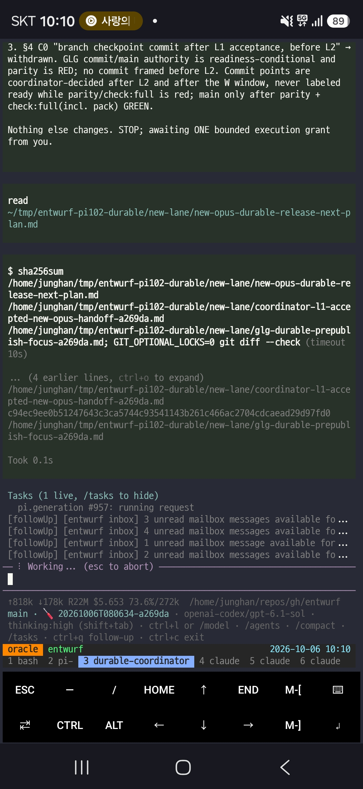

<!-- gid:20261005T000000 -->
<!-- provenance:source:start -->
[[TIP("원본·최신본")]]
이 페이지는 한국어 검색과 읽기를 위한 WikiDocs 미러입니다. [원본·최신본은 가든](https://notes.junghanacs.com/journal/20261005T000000/)에 있습니다. 최신 수정 내용·백링크·태그·히스토리·댓글·출처 정보는 원본 가든에서 확인하세요.

- 작성: `2026-10-05T00:00:00+09:00`
- 최근 수정: `2026-10-05T06:13:00+09:00`
[[/TIP]]
<!-- provenance:source:end -->

[TOC]

## 2026-10-05 Monday

### 01:14 자다 깨서 entwurf 퍼블리시 완료

&lt;2026-10-05 Mon 01:14&gt;

[[TIP("user")]]
자다가 깨어보니 npm publish만 남아 있었다. 그래서 했다. 그리고 저널 엔트리를 만들려고 보니 아! 월요일이구나! 오늘은 쉬는 날이다. 월요일이 꼭 일요일 같다. 집안일 하러 또 가야 한다. 그러려면 자야 한다. 최적의 수면 시간을 보장 한 뒤에 오늘 일정을 오가면서 고민해 보아야 한다. 오늘도 노트북을 두드리면서 뭔가를 하기는 어려울 것이다. 어짜피 해야 할 일들을 정리하면 된다. 그 이오네느 다 읽고 듣고 생각하는 일들이다. 꼭 노트북에 두드려야 열리는 것은 아니다.
[[/TIP]]

### 01:50 대회 참가 목표 생김

&lt;2026-10-05 Mon 01:50&gt;

-   [2026-10-05 Mon 02:24] 추가. 한국에서는 지원불가다. 상관없음. 지원여부랑 상관없이 해보면된다. 처음엔 beads 생각이 났는데. 다 생각해봐야겠다. 난 beads 안쓴다. 그리고 워크트리도 안쓴다. 해봐야 넥스트 문서랑 브랜치 정도인데 공장이 아니으라 공방 이니까. 근데 이 고민은 필요하다. 적절한 시점이다. cloudflare 서비스 전용일 필요도 없다. forgejo 플러그인도 좋다. 아 forge-config 또는 sorge 쪽에 고민을 같이 해볼 사안이다.

-   [2026-10-05 Mon 02:31] 하나 더 entwurf 를 위한 작업이다. 대회랑 상관없다. 다만 대회에서 꼭 풀고자하는 문제는 걸로 가야한다고본다. 그걸 형제들의 방식으로 하는것이다. 결과는 대형 서비스 업체입장에선 공장으로 부적합할수도 있다 그건 환영. 공방용이다. 근데 지금 시점에는 공방이나 공장이나 간판 하나 차이다. 그러니 마인드가 공방인 것일뿐. 공방에 형제들 잔뜩 와서 하면 다를게 없지. 예를 들자면 그렇다는것이다.

[[TIP("user")]]
-   [2026-10-05 Mon 01:50] (neo 2026) here!!

정한 김: <https://news.hada.io/topic?id=34749>

glg-mini-bot-sonnet5: 저장 완료 — blog-hadacloudflareagentgitcontest26.

Cloudflare가 Workers + Artifacts로 "에이전트 시대의 Git 플랫폼"을 설계하는 대회를 개최 — 수백~수천 에이전트가 동일 코드베이스에서 동시 작업할 때 필요한 조율·충돌 처리·"왜 바뀌었는지" 변경 이유 보존을 새로 설계하라는 과제입니다. 10월 14일 마감, 1위 상금 Cloudflare 크레딧 2.5만 달러. GLG님의 entwurf/멀티에이전트 협업 작업과 결이 맞닿는 주제네요.

정한 김: Workers Paid 요금제 대상이란다 이서 얼마지? 결제하고 이 대회 지원 해봐야겠다

glg-mini-bot-sonnet5: 월 $5(기본료) + 사용량 초과 시 종량제입니다.

• 기본 $5/월에 요청 1,000만 건, CPU 시간 3,000만 ms, Worker 스크립트 최대 500개 포함 • 초과 시: 추가 요청 100만 건당 $0.30, 추가 CPU 1,000만 ms당 $0.02 • 데이터 송신(egress)은 무료 • Workers KV·Durable Objects·D1·R2·Queues·Vectorize·Workers AI 등 개발 플랫폼 기능 전체 접근 포함

대회 참가에 필요한 Artifacts 오픈 베타도 이 Workers Paid 요금제 고객 대상입니다. 결제는 Cloudflare 대시보드에서 직접 진행.
[[/TIP]]

### 02:03 new direction entwurf

&lt;2026-10-05 Mon 02:03&gt;

[2026-10-05 Mon 02:04] sol에게 아래 메시지 전달

[[TIP("user")]]
응 수고 많았다. 우리 작업하는 사이에 <https://github.com/earendil-works/pi/releases/tag/v1.0.2> 까지 버전이 나왔거든. 이걸 반영할 준비를 해야겠어. 그리고 , 너와 같은 코디네이터는 pi-durable로 불러보는게 어떨까싶 다. 잠깐 확인한 바로는 pi를 npm설치하면 안된다고허고, entwurf 확장 연결이 잘안될수도 있을지 모르겠는데 이런건 다 우리가 커스텀할 일이니까. 새로 오푸스를 불러서 조사를 맡겨봐. 그리고 이슈 만들고 브랸치 파서 진행하자 1.0.2 까 지 지원 및 pi-durable, codemode 지원 이슈야. codemode는 entwurf랑 상관없을섯 같긴한데 테스트는 해보려고. 응용 시 너리오가 있을거같아서.
[[/TIP]]

### 02:52 reading: 나보코프의 러시아 문학 강의

&lt;2026-10-05 Mon 02:52&gt;

나보코프의 러시아 문학 강의 (블라디미르 나보코프 2022)

블라디미르 나보코프 {이혜승} 2022

### 07:19 §entwurf 0.31.0 - pi-durable support

&lt;2026-10-05 Mon 07:19&gt;

좋아 작업 들어간다.

### 08:22 식사 후 하루를 연다. 깨어나라 세상이여

&lt;2026-10-05 Mon 08:22&gt;

### 12:24 다시 집안일중

&lt;2026-10-05 Mon 12:24&gt;

다음것들 들으면서

#### [urldate: 2026-10-05 ~ 2026-10-05]

-   Opus 5.5: How Close Are We to Automated AI Research? — AI Explained (AI Explained 2026)
-   How AI Could Wipe Out Our Brains Before Our Existence — Lever Time (The Lever, David Sirota) (David Sirota and Cal Newport 2026)

### 19:16 다시 진행 - 집안일의 끝은

&lt;2026-10-05 Mon 19:16&gt;

<!-- 집안일 노예 살이구나. 아주 징그럽게 시키네. -->

### 21:03 돌아왔다 자련다 - entwurf 0.31.0

&lt;2026-10-05 Mon 21:03&gt;

[[TIP("user")]]
entwurf 129번 이슈가 어떻게 잘되가는지 확인할 새도 없이 그냥 시간을 잡아먹혔다. 아무튼 관성으로 진행될터인데, 검수는 필요하다. pi-durable 이라는 별개의 하네스를 지원한다고 생각하면 크게 이상할 것이 없다. 이에 대해서 과하게 작업이 들어갔다면 검수해야 덜어내고 본질을 사수하고 pi 1.0.3 버전이 또 올라갔으니(크게 변경점은 없을듯) 수용하고 품어서 0.31.0 릴리즈컷을 가야 할 것이다.

지쳤다. 내일은 회사 가는 날이니까. 컨디션 관리를 잘해야 한다.
[[/TIP]]

## 2026-10-06 Tuesday

### 06:34 깨어나다

&lt;2026-10-06 Tue 06:34&gt;

9시간을 죽었다가 깨어났다. 정말 피곤했구나. 움직야보자. 오늘은 회사도 가야하고 바쁘다.

### 08:50 old 코디에게

&lt;2026-10-06 Tue 08:50&gt;

[2026-10-06 Tue 09:53] 이슈 생성 <https://github.com/junghan0611/entwurf/issues/130>

[[TIP("user")]]
얼마나 durable과 entwurf가 궁합이 잘 맞는는것인가? 나는 딱 보고 헉 놀랐는데. 만약 우리가 뭔가 큐잉 만들었으면 그건 내 방식은 아니야. durable이라고 더 뭔가 해줄필요는 없거든. 코디네이터더 그냥 형제야. 관리자가 아니야. 혹시나 위계를 만들었을까 봐 걱정이 된다. 이수 하나 생성하자 pi 1.0.4 릴리즈 컷 수용 및 entwurf pi-durable 추가 점검 하 는 주제로. 지금 새 코디는 0.31.0 릴리즈 쭉 갈거야. 그다음에 할 주제 를 지금 나랑 잡는거야. 형제들한테 메시지 보내지말고 거기는 작업 하도 록 내버려둬. 지금 내가 그 다음 할것은 조율하는거니까.
[[/TIP]]

[2026-10-06 Tue 10:05] add more 잔소리다. 이슈에 댓글 달아놨다. 변하지 않을 것을 세우는 것이다. 코드는 다 지우고 다시 해도 될지언정 지금 리포의 정신만 남기는 작업들인가. 다 지우면 동작이 안될텐데? 그러게 말이다. 아닐지도 모른다. 이거 없어도 뭘 하려는지 안다면, 그냥 폴더 하나 만들고 텍스트파일만들고 파이프로 추가추가 서로 해도 다 대화된다. 즉, entwurf는 없어질 무엇이다. 실체는 없어지고도 남는것을 쌓는 것이다.

[[TIP("user")]]
이번 도전은 시기적절하다. 지금 agent-config andenken에 기억축 보강하는 문제는 던졌다. 우리가 해야할 일은 entwurf를 뜯어 고치는게 아니야. 다시 한번 말하지만, pi-durable에게 뭔가 더 해주면 안돼. 정말 필요하면 논의를 다시 해야돼. 위계를 만들면 안된다. 형제의 감각을 유지하는게 공방의 방향이다. 다만 durable이 해야 할것은 기억축의 연장이야. 다들 새로 태어나면 뭘 할지 모를때 한 형제는 알고 있게 하려는거다. 그래야 너희가 알아서 어떤 주제의 방향성을 끌고 갈텐데. 몇개 하려고 하는게 있긴하거든 아무튼 그건 여기 남길 주제는 아니다. 당분간 모든 컷은 안정화 견고화를 하는 것이야.

버그는 있기 마련이고 코드와 주석은 썩기 마련이다. 그건 고치면 돼 필요할때. 근데 이 리포에의 방향성의 줄기는 흔들리면 안돼.

힣 직접씀
[[/TIP]]

### 09:51 new 코디에게

&lt;2026-10-06 Tue 09:51&gt;

[[TIP("user")]]
이번에는 durable 은 안착시키는게 핵심이니까, 거기에 집중하고. fable 하거도 이부분만 집중해서 릴리즈컷하는데 힘을 모으자. npm publish 전 까지 쭉 형제들하고 밀고가라. 릴리즈 게이트에 별도로 pi durable 섹션 이 있지? 혹시 하나 터지면 처음부터 테스트하고 있으면 오래걸려서 안돼 . 자원낭비야. 준비 어느정도 되면 커밋하고 main에 올려. 그리고 새 오 푸스불러서 맡겨. 코디네이터 세션에서는 되도록 나랑 대화에 집중해야돼 . 상황 dm 보내주고.
[[/TIP]]

### 10:12 신박하다 메시지 순서 보장은 되나 그 걱정되네

&lt;2026-10-06 Tue 10:12&gt;

[2026-10-06 Tue 10:12]  이거 신박하다. 지금 순서 물어보면 늦어지니까 뒤에서 한번 조사하자고 해야겠다 올드 sol이 아직 있다.

### 10:25 이발 하고 출근하자

&lt;2026-10-06 Tue 10:25&gt;

11시30분 출근이다. 오전 시간차2시간 사용했다. 등원 이슈로. 내 머리는 내가 못자른다. 이발자의 역설을 떠올린다. 딱 지금 협업이란것도 그렇다.

오토비 깨어날 시간이구나.

### 11:11 출근

&lt;2026-10-06 Tue 11:11&gt;

## NEWNOTES

-   [2026-09-25 Fri 19:18] 새 노트는 llmlog에만 쌓습니다. 임시 노트라고 보면 됩니다.

## UPDATENOTES

## SCREENSHOT

## CITATIONS

### [urldate: 2026-10-05 ~ 2026-10-11]

-   Opus 5.5: How Close Are We to Automated AI Research? — AI Explained (AI Explained 2026)
-   How AI Could Wipe Out Our Brains Before Our Existence — Lever Time (The Lever, David Sirota) (David Sirota and Cal Newport 2026)

## PREV

-   [2026-09-28](https://notes.junghanacs.com/journal/20260928T000000/)

## BIBLIOGRAPHY

- 블라디미르 나보코프. 2022. <i>나보코프의 러시아 문학 강의</i>. Translated by 이혜승. 을유문화사. [https://m.yes24.com/goods/detail/108902863](https://m.yes24.com/goods/detail/108902863).
- AI Explained. 2026. “Opus 5.5: How Close Are We to Automated AI Research? — AI Explained.” 2026. [https://youtu.be/R9momwXV9w4](https://youtu.be/R9momwXV9w4).
- David Sirota, and Cal Newport. 2026. “How AI Could Wipe out Our Brains before Our Existence — Lever Time (the Lever, David Sirota).” 2026. [https://youtu.be/iSPHBOnreXw](https://youtu.be/iSPHBOnreXw).
- neo. 2026. “Cloudflare, 에이전트 시대의 Git 플랫폼 개발 대회 개최 — GeekNews.” 2026. [https://news.hada.io/topic?id=34749](https://news.hada.io/topic?id=34749).
