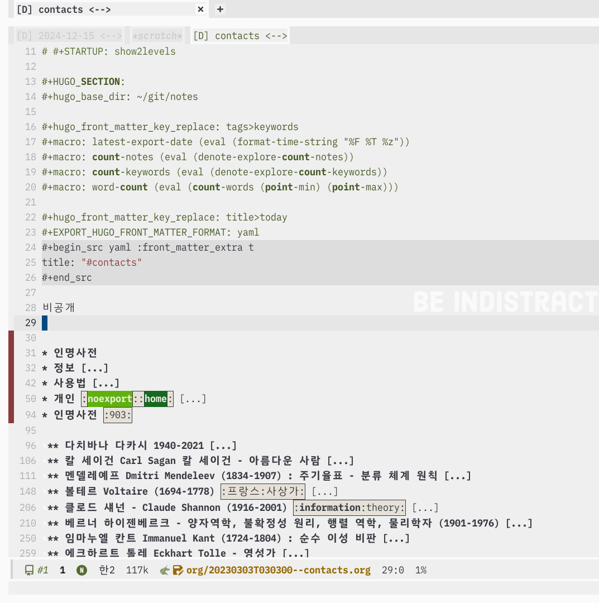

<!-- gid:20230303T030300 -->
[[TIP("이 노트에 대하여")]]
연락처와 인맥 정보를 어떻게 정리하고 다룰지 점검하는 메타 노트다. 도구 사용법과 스크린샷, 정리 방향을 함께 두어 사람 정보 관리의 실용적 기준을 잡는다.
[[/TIP]]

<!-- provenance:source:start -->
[[TIP("원본·최신본")]]
이 페이지는 한국어 검색과 읽기를 위한 WikiDocs 미러입니다. [원본·최신본은 가든](https://notes.junghanacs.com/meta/20230303T030300/)에 있습니다. 최신 수정 내용·백링크·태그·히스토리·댓글·출처 정보는 원본 가든에서 확인하세요.

- 작성: `2023-03-03T03:03:00+09:00`
- 최근 수정: `2026-02-17T00:00:00+09:00`
[[/TIP]]
<!-- provenance:source:end -->

## 히스토리

-   [2026-02-17 Tue 04:20] 이게 필요한가?
-   [2025-03-28 Fri 19:29] 대략 정리 할 것

## 정보

org-contact 활용한 인명사전 인물사전 링크모음

인물을 중심으로 관련 깃허브, 블로그, 홈페이지 등이 있음.

-   org-contacts.el – managing contacts information in Org mode (“Org-Contacts.El – Managing Contacts Information in Org Mode” n.d.)
-   Contact management with Emacs, org-mode, org-contacts, notmuch and org-roam (nonhok 2024)
-   Last revised and exported on 2026-07-18 21:07:27 +0900

대략 다음과 같음. 일부 인물사전 이외 비공개.

### 스크린샷

## 사용법

In visited with the keyboard shortcut `SPC a o C f`.

-   You can use \`org-sparse-tree' [C-c / p] to filter based on a specific property. Or other matcher on \`org-sparse-tree'.
-   `C-c \` tag filter
