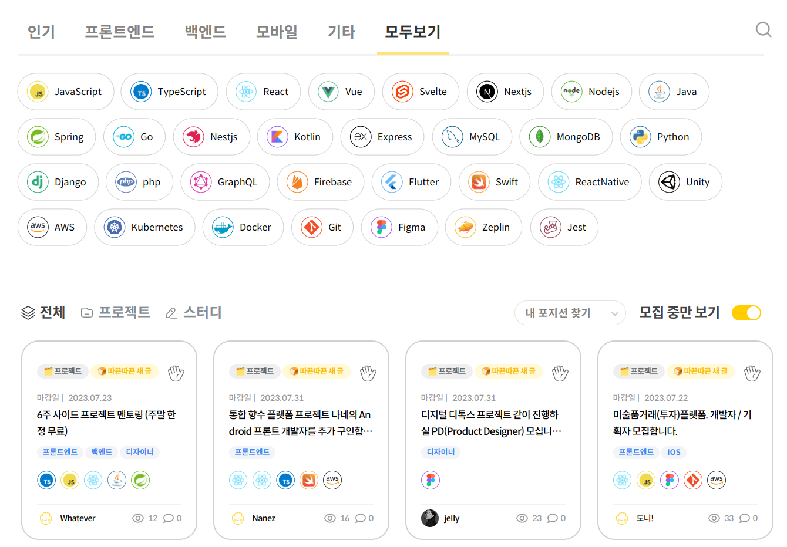

<!-- gid:20230721T225100 -->
[[TIP("이 노트에 대하여")]] 커뮤니티와 모임, 공동체, 포럼을 둘러싼 장면과 연결 지점을 모아 둔다. 온오프라인 모임과 스터디, 관련 플랫폼과 링크를 함께 엮어 참여와 관찰의 접점을 넓힌다. [[/TIP]] 히스토리 - [2023-07-21 Fri 22:51] 공동체 모임 커뮤니티 관련 사이트 온오프믹스 이벤터스 독서모임 개발자 스터디 KEYWORDS: 커뮤니티 community 포럼 forum 공동체 스터디 모임 - [bib/ 녹색아카데미: 공부모임 자연철학 앎의틀 '2024-05-29 2025-06-01](https://wikidocs.net/381953)
-   [bib/ 서강올빼미 철학 커뮤니티 포럼 '2024-06-18 2025-06-01](https://wikidocs.net/381982)
-   [bib/ 코랩: 주피터 노트북 플랫폼 커뮤니티 '2025-01-25 2025-01-25](https://wikidocs.net/382249)
-   [bib/ 굿리즈 스토리그래프 사락: 도서 정보 목록 리뷰 커뮤니티 '2025-03-09 2025-03-09](https://wikidocs.net/382301)
-   [bib/ 기계인간 johngrib '2025-03-20 2025-03-20](https://wikidocs.net/382308)
-   [bib/ 경기문화재단 GyeonggiCulturalFoundation 경기예술인지원센터 '2025-04-18 2026-04-20](https://wikidocs.net/382396)
-   [bib/ 캐글(kaggle) 허깅페이스(huggingface) 데이터과학 머신러닝 커뮤니티 플랫폼 '2025-05-09 2025-05-09](https://wikidocs.net/382428)
-   [bib/ 독립창작자 창조 개인 '2025-06-07 2025-06-07](https://wikidocs.net/382478)
-   [bib/ 알폰소링기스 아무것도 공유하지 않은 자들의 공동체 '2025-06-30 2025-06-30](https://wikidocs.net/382489)
-   [bib/ IoT 플랫폼: Thingsboard 대시보드 풀스택 오픈소스 '2025-07-01 2025-07-01](https://wikidocs.net/382492)
-   [notes/ 커뮤니티 이맥스 - 중국 일본 한국 '2023-06-25 2025-05-27](https://wikidocs.net/381076)
-   [notes/ 힣: 모두가 생산자 작은 소통 공간 커뮤니티 '2024-09-22 2025-02-15](https://wikidocs.net/381327)
-   [notes/ 모음 커뮤니티 모임: 공부 지식 학습 독서 '2024-10-10 2025-06-17](https://wikidocs.net/381351)
-   [notes/ 오픈소스 번역 공동체 translatewiki '2024-10-29](https://wikidocs.net/381366)
-   [notes/ Scicloj 클로저 데이터과학 커뮤니티 '2025-01-22 2025-04-03](https://wikidocs.net/381490)
-   [notes/ 커뮤니티: 랍스터스 lobste.rs vs 레딧 reddit '2025-01-31 2025-01-31](https://wikidocs.net/381499)
-   [notes/ 커뮤니티: 클리앙 clien 리눅서당 '2025-02-03 2025-06-24](https://wikidocs.net/381503)
-   [notes/ 텍스트 힙스터 - 지식 유희자를 위한 놀이터 '2025-02-23 2025-02-23](https://wikidocs.net/381550)
-   [notes/ 힣: 사락 독서 모임 - 책과 삶 '2025-04-09 2025-04-09](https://wikidocs.net/381666)
-   [notes/ 조테로: 온라인 공유그룹 공유라이브러리 '2025-04-09 2025-04-09](https://wikidocs.net/381668)
-   [notes/ 힣: 느린 창조도구 커뮤니티 인간 계층 분화 불완전함 테크노퓨달리즘 봉건 '2025-05-29 2026-07-08](https://wikidocs.net/381731)
-   [notes/ 니치 작은 커뮤니티 운영 활성화 본파이어 블로그롤 인디웹 '2025-06-01 2026-02-16](https://wikidocs.net/381739)
-   [notes/ Anthropic skill-creator 분석 및 Awesome Claude Skills 커뮤니티 현황 '2025-10-21 2025-10-21](https://wikidocs.net/381799)

## 2023 관련링크

[2023-07-21 Fri 22:51] 정리를 해야 할 듯

### 온오프믹스

[2023-07-21 Fri 22:51] <https://www.onoffmix.com/>

### 이벤터스 event-us

[2023-07-22 Sat 17:11] <https://event-us.kr/>

린치핀 클라쓰 <https://event-us.kr/linchpinclass/event/66244>

### 아그레아블 독서모임

[2023-07-22 Sat 17:09] <https://agreablebook.com/>

### 훌라 : 개발자 스터디

[2023-07-22 Sat 17:09] <https://holaworld.io/>

### 문토 : 관심사 기반

[2023-07-22 Sat 17:09] <https://www.munto.kr/>

### 개발자: 글쓰는 또라이 - 글또

[2024-05-15 Wed 11:53]

변성윤님이 운영. 현재 9기 모집.

### DONE 캣츠랩

(“캣츠랩 - 설동준” n.d.)

캣츠랩이 하는 일들 강좌 | 세미나 | 콜로키움

여름과 겨울 방학 기간 동안에는 집중 강좌를, 학기 중에는 세미나를 개설하고, 수시로 콜로키움을 개최합니다. 연구 활동 캣츠랩은 다양한 분야에서 활동하고 있는 연구자 및 예술가들과 함께 공동연구를 진행할 많은 기회를 만들고자 합니다. 공간 대여 캣츠랩 연구원들의 연구 시간 외에는 외부 연구자 및 일반인들의 학술회의

### connpass 국외 일본

[2023-07-17 Mon 12:26] <https://connpass.com/>

모임 관리 사이트 일본
