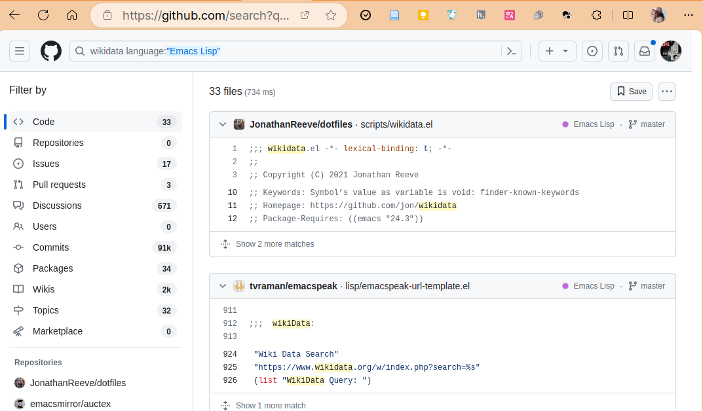
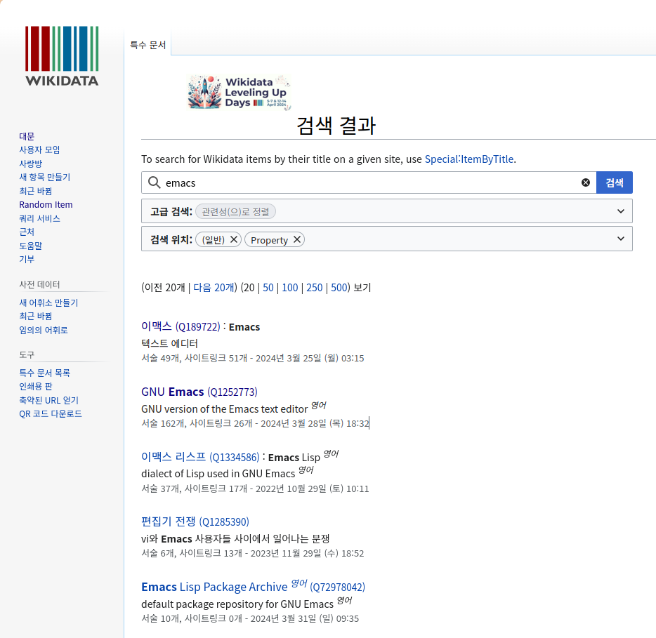
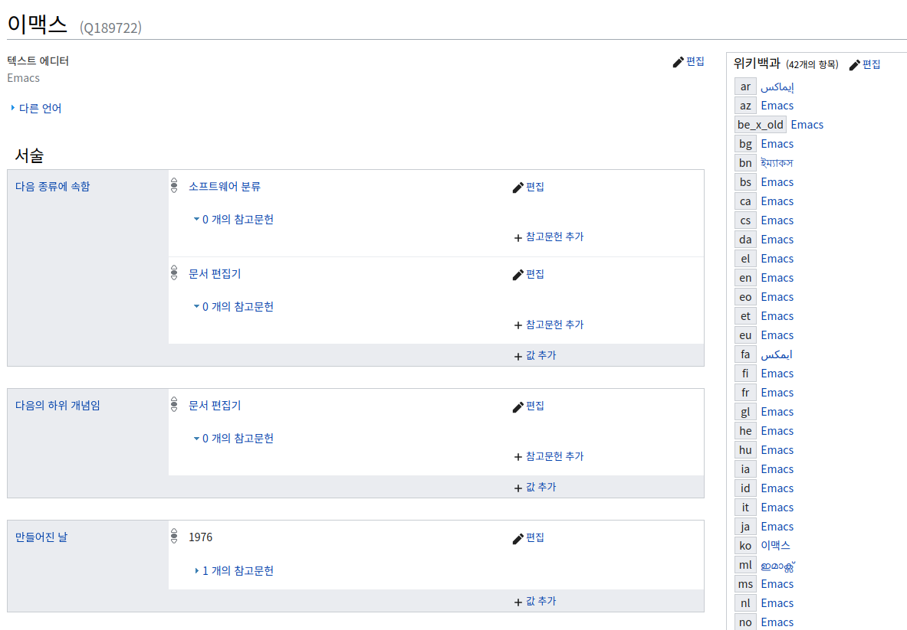
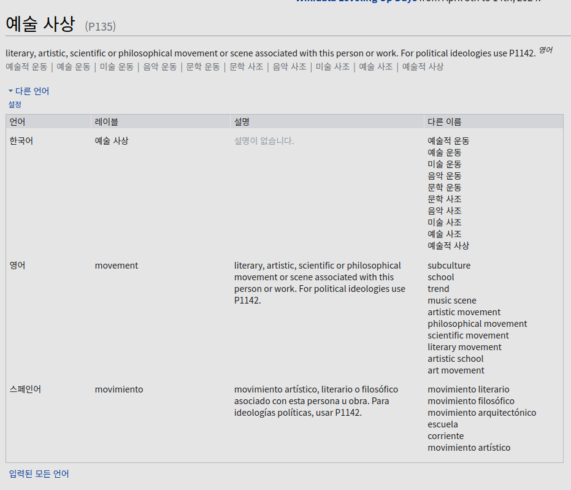

<!-- gid:20240517T165232 -->
[TOC]

[[TIP("이 노트에 대하여")]] 위키피디아는 사람이 읽는 설명을, 위키데이터는 기계가 다루기 쉬운 구조화 사실을 축적한다. 둘은 분리된 프로젝트이면서도 서로를 보완하는 거대한 공공 지식 기반이다. 인용, 식별자, 연결 데이터의 관점에서 볼수록 이 조합의 힘이 더 잘 드러난다. [[/TIP]] Wikipedia, the free encyclopedia 위키피디아 히스토리 - [2025-06-13 Fri 06:04] 위키피디아 위키데이터 합쳐 관련메타 - 데이터 - 백과사전 BIBLIOGRAPHY English Wikipedia The English Wikipedia is the primary English-language edition of Wikipedia, an online encyclopedia. It was created by Jimmy Wales and Larry Sanger on 15 January 2001, as Wikipedia's first edition. English Wikipedia is hosted alongside other language editions by the Wikimedia Foundation, an American nonprofit organization. Wikipedia Wikipedia is a free content online encyclopedia written and maintained by a community of volunteers, known as Wikipedians, through open collaboration and the use of the wiki-based editing system MediaWiki. Wikipedia is the largest and most-read reference work in history. It is consistently ranked as one of the ten most popular websites in the world, and as of 2024 is ranked the fifth most visited website on the Internet by Semrush, and second by Ahrefs. Founded by Jimmy Wales and Larry Sanger on January 15, 2001, Wikipedia is hosted by the Wikimedia Foundation, an American nonprofit organization that employs a staff of over 700 people. Initially only available in English, editions in other languages have been developed. Wikipedia's editions, when combined, comprise more than 62 million articles, attracting around 2 billion unique device visits per month and more than 14 million edits per month (about 5.2 edits per second on average) as of November 2023. Roughly 26% of Wikipedia's traffic is from the United States, followed by Japan at 5.9%, the United Kingdom at 5.4%, Germany at 5%, Russia at 4.8%, and the remaining 54% split among other countries, according to data provided by Similarweb. Wikipedia has been praised for its enablement of the democratization of knowledge, extent of coverage, unique structure, and culture. It has been criticized for exhibiting systemic bias, particularly gender bias against women and geographical bias against the Global South (Eurocentrism). While the reliability of Wikipedia was frequently criticized in the 2000s, it has improved over time, receiving greater praise from the late 2010s onward while becoming an important fact-checking site. Wikipedia has been censored by some national governments, ranging from specific pages to the entire site. Articles on breaking news are often accessed as sources for frequently updated information about those events. Wikipedia는 위키피디언으로 알려진 자원봉사자 커뮤니티가 공개 협업과 위키 기반 편집 시스템인 미디어위키를 사용하여 작성하고 관리하는 무료 콘텐츠 온라인 백과사전입니다. Wikipedia는 역사상 가장 크고 가장 많이 읽힌 참고 문헌입니다. 세계에서 가장 인기 있는 10대 웹사이트 중 하나로 꾸준히 선정되고 있으며, 2024년 현재 인터넷에서 가장 많이 방문한 웹사이트 5위는 Semrush가, 2위는 Ahrefs가 차지했습니다. 2001년 1월 15일 지미 웨일즈와 래리 생거가 설립한 위키백과는 700명 이상의 직원을 고용하고 있는 미국의 비영리 단체인 위키미디어 재단에서 운영하고 있습니다. 처음에는 영어로만 제공되었지만 다른 언어로 된 버전도 개발되었습니다. Wikipedia의 모든 에디션을 합치면 6200만 개 이상의 문서로 구성되어 있으며, 2023년 11월 기준으로 매월 약 20억 건의 고유 기기 방문과 월 1400만 건 이상의 편집(초당 평균 약 5.2건의 편집)이 이루어지고 있습니다. Similarweb에서 제공하는 데이터에 따르면 Wikipedia 트래픽의 약 26%는 미국에서 발생하며, 일본 5.9%, 영국 5.4%, 독일 5%, 러시아 4.8%, 나머지 54%는 기타 국가가 차지하고 있습니다. 위키백과는 지식의 민주화, 범위, 독특한 구조 및 문화로 인해 많은 찬사를 받아왔습니다. 하지만 여성에 대한 성 편견, 글로벌 남부에 대한 지리적 편견(유럽 중심주의) 등 구조적 편견을 드러낸다는 비판을 받기도 했습니다. 2000년대에는 위키백과의 신뢰성이 자주 비판을 받았지만, 시간이 지나면서 개선되어 2010년대 후반부터는 중요한 사실 확인 사이트로 자리 잡으면서 더 큰 찬사를 받고 있습니다. 위키피디아는 일부 국가 정부에 의해 특정 페이지부터 사이트 전체에 이르기까지 검열을 받기도 했습니다. 뉴스 속보에 관한 기사는 해당 사건에 대해 자주 업데이트되는 정보의 출처로 자주 액세스됩니다. KEYWORDS - [bib/ 피터버크 지식의사회사 폴리매스 '2024-05-23 2025-04-22](https://wikidocs.net/381949)
-   [bib/ 위키데이터: 스콜리아 - 인포그래픽 서비스 '2024-09-08](https://wikidocs.net/382077)
-   [bib/ GwernBranwen Gwern 위키 블로그 디지털가든 구루 장인 '2025-03-08 2025-03-08](https://wikidocs.net/382300)
-   [bib/ 장경식 브리태니커 백과사전 '2025-04-16 2025-04-16](https://wikidocs.net/382391)
-   [notes/ 오그롬: 제텔카스텐 에버그린 활용법 위키데이터 '2022-09-06 2025-02-19](https://wikidocs.net/381025)
-   [notes/ 이맥스 RDF 위키데이터 '2024-03-15](https://wikidocs.net/381196)
-   [notes/ 위키백과: 온라인 백과사전 활용법 '2024-04-03 2025-04-16](https://wikidocs.net/381207)
-   [notes/ 오프라인 위키백과 키윅스 교육 사전 '2024-04-13 2025-06-10](https://wikidocs.net/381212)
-   [notes/ 힣: memex-kb 힣의 범용 지식베이스 변환 시스템 '2025-10-30 2026-02-12](https://wikidocs.net/381806)

## Related-Notes

## BIBLIOGRAPHY

[Wikipedia, the free encyclopedia 위키피디아](https://wikidocs.net/380575)

## Samuel Morse 사무엘 모스

[2024-01-02 Tue 13:31]

<https://en.wikipedia.org/wiki/Samuel_Morse>

Samuel Finley Breese Morse (April 27, 1791 – April 2, 1872) was an American inventor and painter. After having established his reputation as a portrait painter, in his middle age Morse contributed to the invention of a single-wire telegraph system based on European telegraphs. He was a co-developer of Morse code in 1837 and helped to develop the commercial use of telegraphy.rse

사무엘 핀리 브리즈 모스(1791년 4월 27일 - 1872년 4월 2일)는 미국의 발명가이자 화가입니다. 초상화 화가로서 명성을 쌓은 모스는 중년에 유럽 전신을 기반으로 한 단선 전신 시스템을 발명하는 데 기여했습니다. 그는 1837년 모스 부호의 공동 개발자로 텔레그래피의 상업적 사용을 개발하는 데 도움을 주었습니다

-   [새뮤얼 모스 - ko.wikipedia.org](https://ko.wikipedia.org/wiki/%EC%83%88%EB%AE%A4%EC%96%BC_%EB%AA%A8%EC%8A%A4)
-   [Samuel Finley Breese Morse - Wikidata - wikidata.org](https://www.wikidata.org/wiki/Q75698)
-   [글로벌 세계 대백과사전 - 위키문헌, 우리 모두의 도서관 - ko.wikisource.org](https://ko.wikisource.org/wiki/%EA%B8%80%EB%A1%9C%EB%B2%8C_%EC%84%B8%EA%B3%84_%EB%8C%80%EB%B0%B1%EA%B3%BC%EC%82%AC%EC%A0%84)
    -   글로벌 세계 대백과사전은 다음 커뮤니케이션(현 카카오)에서 저작권을 확보하여 지식공유 프로젝트의 일환으로 위키미디어재단에 기증한 백과사전이다. GFDL과 CC-BY-SA 3.0을 따른다.

## install wcite

[wcite - wikicite.org](http://wikicite.org/wcite/)

```text
sudo npm install -g wcite
```

아래와 같이 활용.

```text
➜ wcite Q55239420
Q55239420: Shelley, M. (1818). Frankenstein (1st ed.). (Original work published 1818)
```

## <span class="org-todo todo TODO">TODO</span> wcite + zotero

가능한가?

## wikit and googler

텍스트 검색 관련

```text
sudo npm install wikit -g

sudo apt-get install googler
```

Emacs 패키지 - 구글러와 연동

<https://github.com/smythp/googler-mode>

## 깃허브

깃허브에서 활용하려면?! 코드 검색을 효과적으로 하라. 그게 시작이다. 다 줍줍한다.



## 위키데이터의 예 : Emacs

### 검색 결과

<https://www.wikidata.org/w/index.php?go=%EB%B3%B4%EA%B8%B0&search=emacs&search=emacs&title=Special%3ASearch&ns0=1&ns120=1>



### Emacs Q189722

하나의 아이디로 다 연결되어 있다.

<https://www.wikidata.org/wiki/Q189722>



### 프로퍼티

P135 예술 사상 분류법이다.



## 조나단 리브 박사

구글 코드 검색으로 알게 됨. 엄청난 내공의 교수.

[Notetaking In Semantic Triples - jonreeve.com](https://jonreeve.com/2021/05/notetaking-in-semantic-triples/) [My Notetaking System - jonreeve.com](https://jonreeve.com/2020/12/my-notetaking-system/)

### 공개 강의 : Computational Literary Analysis

> Course materials for Introduction to Computational Literary Analysis, taught at UC Berkeley in Summer 2018, 2019, and 2020, at Columbia University in Fall 2020, and again at UC Berkeley in Summer 2021 and 2022.

[Jonathan Reeve - youtube.com](https://www.youtube.com/@jonathanreeve4729/featured)

[JonathanReeve/course-computational-literary-analysis - github.com](https://github.com/JonathanReeve/course-computational-literary-analysis)

[Introduction to Computational Literary Analysis, Summer 2022 - icla20-](https://icla2022.jonreeve.com/)

## [노트 인용 시스템](https://wikidocs.net/381213) 노트 생성 함
