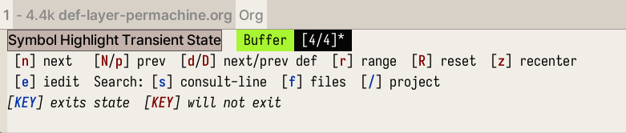

<!-- gid:20240927T143312 -->
[TOC]

[[TIP("이 노트에 대하여")]]
이블은 이맥스 안에서 빔의 모달 편집 감각을 구현하는 핵심 층으로 다뤄진다. 키바인딩과 조작 습관, 확장 가능한 레이어 구조를 함께 보며 편집 방식이 작업 리듬을 어떻게 바꾸는지 잇는다.
[[/TIP]]

## 히스토리

-   [2025-04-23 Wed 14:27] emacs-evil 이라고 이름을 하는게 좋을것 같아.
-   [2025-03-21 Fri 06:46] 깊다 깊어. 숨은그림찾기 보물찾기 아닌가
-   [2023-10-04 Wed 15:12] 코딩을 하다 보니 필요한 키를 알게 된다. 그래서 자연스럽게

여기게 집중하게 된다. 놀라운 일이다.

-   [2023-09-09 Sat 12:35] 간단하게 정리할 수 없는 내용이다. 근데 해야 한다. 그래서 일단

씨앗을 심었다. 거둘 수는 없다. 가야 한다. 텍스트 마스터로서 자유를 얻으려면 일단 편집 모드를 이해해야 한다. 이맥스에서 제공하는 편집 모드를 섞어 쓰는 것도 좋지만 EVIL 은 경험을 해야 한다.

## emacs-evil/evil

(“Emacs-Evil/Evil” 2025) The extensible vi layer for Emacs.

## 관련메타

-   [편집](https://wikidocs.net/380794)
-   [키바인딩](https://wikidocs.net/380645)
-   [빔 네오빔 vim $neovim](https://wikidocs.net/380508)

## BIBLIOGRAPHY

  “Emacs-Evil/Evil.” 2025. [https://github.com/emacs-evil/evil](https://github.com/emacs-evil/evil).

## KEYWORDS

-   [bib/ 하워드아브람스 HowardAbrams 구루 리터레이트 이맥스 - hamacs '2025-02-20 2025-02-20](https://wikidocs.net/382285)
-   [notes/ 모음: 이블 편집 '2023-06-15 2025-03-21](https://wikidocs.net/381067)
-   [notes/ 이블 이맥스 키바인딩 편집: 튜토리얼 evil-tutor '2024-01-31 2025-06-04](https://wikidocs.net/381182)
-   [notes/ wandersoncferreira evil-dot-doom 둠이맥스 이블 튜토리얼 '2024-01-31 2025-03-11](https://wikidocs.net/381184)
-   [notes/ meow 모달 편집 '2024-05-02](https://wikidocs.net/381216)
-   [notes/ jump-out-of-pairs 괄호 개행 이맥스 편집 '2024-07-04 2025-06-07](https://wikidocs.net/381256)
-   [notes/ 이블: 빔골프 키보드 게임 챌린지 '2024-07-04](https://wikidocs.net/381263)
-   [notes/ 정규표현식: 정규식 검색 일부 텍스트 변경 '2024-09-15 2025-04-01](https://wikidocs.net/381311)
-   [notes/ 이블: 치트시트 '2024-09-27](https://wikidocs.net/381335)
-   [notes/ 이맥스 멀티커서 evil-mc evil-multiedit '2024-09-27 2025-03-05](https://wikidocs.net/381336)
-   [notes/ evil-owl 이맥스 레지스터 마크 관리 '2025-03-20 2025-03-20](https://wikidocs.net/381604)
-   [notes/ 코지 이맥스 매뉴얼 클로저 이블 - emacs clojure evil ide '2025-03-21 2025-03-21](https://wikidocs.net/381607)
-   [notes/ 코드폴딩 vimish-fold ts-fold hideshow - 둠이맥스 모듈 '2025-03-23 2025-03-23](https://wikidocs.net/381612)
-   [notes/ emacs-evil: evil-collection '2025-04-23 2025-04-23](https://wikidocs.net/381695)

## 핵심교본 [둠이맥스: 이블 편집 튜토리얼](https://wikidocs.net/381184)

바꾸지 말고 기본 설정으로 커버하면 좋다.

## '\*' '#' <span class="org-hashtag">#심볼</span> Symbol Transient State

[2023-05-13 Sat 16:40]

-   EVIl 관련 훈련을 좀 했어야 되는데 이제 알았네. 된장.

그리고 Spacemacs 에서 제공하는 Transient State 는 다 이유가 있다. 필요해서 있는 것이다. compleseus 레이어에 가면 수정하면 된다. 여기서 project 가 projectile 에 연결되어 있다. 수정 바람.



## [SpaceVim 설치하며 -- VSpaceCode and Spacemacs 비교](https://wikidocs.net/381606)

## Evil Tips Examples

| Key  | For                                   | Used       |
|------|---------------------------------------|------------|
| vip  | evil-inner-passage                    | Very Often |
| vis  | evil-inner-sentence                   | Very Often |
| gqap | format passage                        | Very Often |
| gqas | format sentence                       | Often      |
| ci   | replace everything within parens      | Sometimes  |
| dt;  | deleting everything until a semicolon | Rare       |
| cif  | evil-cp-inner-form                    | Rare       |

### cif

`cif` 이게 뭔가? :: evil-cp-inner-form 함수를 호출한다. 즉 괄호 안에 폼을 잘라내기 한다. 아래 리스트가 있다. 아! 이 함수는 evil-cleverparens-text-objects 기능의 일부이다. 이게 될까?

## [2023-12-14 Thu 09:32] vip vis 등 모르는 세계가 있음을 알다.

-   [Review of evil-mode for emacs. Evil-mode, the extensible vi layer for-](https://medium.com/@andrewhyatt/review-of-evil-mode-for-emacs-16ab071d292#id_token=eyJhbGciOiJSUzI1NiIsImtpZCI6IjBhZDFmZWM3ODUwNGY0NDdiYWU2NWJjZjVhZmFlZGI2NWVlYzllODEiLCJ0eXAiOiJKV1QifQ.eyJpc3MiOiJodHRwczovL2FjY291bnRzLmdvb2dsZS5jb20iLCJhenAiOiIyMTYyOTYwMzU4MzQtazFrNnFlMDYwczJ0cDJhMmphbTRsamRjbXMwMHN0dGcuYXBwcy5nb29nbGV1c2VyY29udGVudC5jb20iLCJhdWQiOiIyMTYyOTYwMzU4MzQtazFrNnFlMDYwczJ0cDJhMmphbTRsamRjbXMwMHN0dGcuYXBwcy5nb29nbGV1c2VyY29udGVudC5jb20iLCJzdWIiOiIxMTUyNjI4NTQ2OTkyMDkzNTkzMjkiLCJlbWFpbCI6Imd0Z2tqaEBnbWFpbC5jb20iLCJlbWFpbF92ZXJpZmllZCI6dHJ1ZSwibmJmIjoxNzAyNTEyMDQzLCJuYW1lIjoiSnVuZ2hhbiBLaW0iLCJwaWN0dXJlIjoiaHR0cHM6Ly9saDMuZ29vZ2xldXNlcmNvbnRlbnQuY29tL2EvQUNnOG9jSkJTV2ZyYTB4N3FJMm5HSDRkdVBrQzdMd2p4R2NGMlF1a0lRckx0aFRJVVVtZT1zOTYtYyIsImdpdmVuX25hbWUiOiJKdW5naGFuIiwiZmFtaWx5X25hbWUiOiJLaW0iLCJsb2NhbGUiOiJrbyIsImlhdCI6MTcwMjUxMjM0MywiZXhwIjoxNzAyNTE1OTQzLCJqdGkiOiIxNmM5ZDY1YjAxOGU2NGViZDNlZmFmMzlhMWRjZjdlYWVhNWE3ZTFmIn0.UP3duPh1Ye-to_4CfHSTW4z0zfGELtMPKWBRLo1fRxPFuFNPQrm66EPXsEJYAvcBfjc7abWmJFX0fd94vl-N7MYQOgNvexbT_6KxgOy4Nx3d72jRbmFOUFXj7BqSGIia0Ph_i61myXACz0DGGMezFAGbFv_-jpN3uiztDhoBeWJJd5bkaOiD0v_w4lbIT1mOCjWc26jjntVUBPAz2mKKS-qeiWVku7VpHQqbYJ0uQZwuJCcuk3-0dVzSKg8YFWxVyYv1YtgIPHPB9bvm63scVWbKTwqVnahhL2I3aPNsM1SiO1jyx2nzFtyw5gKFSPUPaVm22uWKXEh1GfBvOf5buA)
-   [My emacs clojure journey Ep 1 - Corgi &amp; evil-mode - YouTube](https://youtu.be/5q4UmX45ZlM)

## evil-surround

[2023-10-04 Wed 12:35] 이걸 드디어 사용한다. 왜?!

## evil-textobj-line 텍스트 오브젝트

[2023-12-14 Thu 15:59]

-   VIM <https://nolboo.kim/blog/2016/10/13/vim-text-objects-definitive-guide/>
    -   VIM 에서 편집을 효과적으로 하려면, 단순히 문자를 넘어서 단어, 문장, 문단을 편집해야 한다.VIM 에서 이런 하이레벨의 컨텍스트를 텍스트 개체라고 한다.
    -   VIM 에는 일반 텍스트 개체와 프로그래밍 언어를 위한 텍스트 개체가 있다. 텍스트 개체를 배우면 VIM 편집이 완전히 새로운 단계의 정확도와 속도를 가지게 된다.

## Spacemacs Focus Document

[2023-02-25 Sat 17:16]

여기 문서도 좋다.

/home/junghan/sync/man/dotsamples/spacemacs/ghasak-dot-spacemacs/docs/emacs_tips_tricks/multi_cursor.md:

### Evil for Viim Style Editing

[Evil for Vim Style Editing - Practicalli Spacemacs](https://practical.li/spacemacs/spacemacs-basics/evil/)

## 2022 evil-emacs forward backward keybinding

[2023-06-17 Sat 13:43]

### 알아야 할 키 바인딩

`M-x` 영원하라 메타엑스! `M-m` SPC 와 같음. 스페이스맥스 root 라고 함. `M-RET` 마이너모드 명령셋 노멀 모드에서 `,` 과 같음. `C-g` keyboard-quit :: 이걸 몰랐었다. 실행 취소!!

### evil emacs 를 잘 사용하기 위한 핵심은?

내 생각에는 evil mode 와 상관 없이 원하는 작업을 실행할 수 있는 이맥스 고유의 키 바인딩이라고 생각한다.

vim 에서 편집 모드로 진입하면 메타 키 조합이 아니라면 할 수 있는 일은 텍스트 입력이다. vim 도 제대로 써보지 않은 이유는 모드 전환이 귀찮아서다.

이맥스를 제대로 써보려고 하는데... 그렇다고 이맥스 입력 방식을 공부하기는 싫고... 선택 옵션은 EVIL 이다. 스페이스맥스는 여기에 충실한 이맥스이고 만족스럽다.

이동 _삭제_ 추가 : 캐릭터, 워드, 라인 검색 undo/redo

등. 일관성 있는 방식이 필요하다.

`C-r` undo-fu only redo `$` end `0` home

-   insert 모드 방향키 대신 사용하도록 세팅

`C-h j k l` `C-S backspace` kill line `C-w` evil-delete-backward-word `C-_` undo-region `C-u` undo-fu undo `C-r` undo-fu redo `C-$` end `C-0` home `M-h` delete-backward-char `M-l` delete-forward-char

adslfjaldksjflk ds asdlkk

;; 편집 모드 시, 단어 단위로 지우려면 C-w 를 쓰면 된다 ;; char 를 지우려면 backspace 를 누르면 된다. 이게 불편하다. 추가하자.

alsdkfjlkdsf

`w` evil forward word : 이동|단어 `b` evil backward word 이동|단어

-   all mode

`M-DEL` backword-kill-word 커서 이전 워드 단위로 삭제 `M-d` kill-word `M-f` forward word `M-b` backward word

내가 추가한 키 바인딩의 일부이다. 목적은 방향키를 최소한으로 줄이고 일관성 있게 모드 변환을 최소화 하면서 글을 쓸 수 있게 만드는 것이다. 예를 들어 편집 모드에서 쓰다가 노멀 모드로 바꾸고... 이 작업이 매우 번거롭다. 최소한의 기능은 편집 모드에서도 가능해야 한다. 특히 일반적인 편집 기능의 경우.

다행인 것은 이맥스는 에빌 모드만 지원하는게 아니라는 것이다. 물론 스페이스맥스 에빌 모드 환경에서는 기존 이맥스 키 바인딩과 다른 부분이 많아서 막 넣을 수가 없다.

그럼에도 함수는 여전히 있기에 적당히 맞춰 넣어주면 편집, 이동이 무난하게 가능하다.

evil-escape 도 `,.` 으로 매핑해 놓았는데 괜찮다. ESC 를 누르는 것 보다 따닥 누르는게 편할 때가 있다. 예를 들어!! 편집 모드에서 마이너모드 명령을 입력하고 싶을 때 , . , 을 따다닥 눌르면 가능했다.

근데.... `M-RET` 을 누르면 모드에 상관 없이 마이너모드 명령어를 쓸 수 있다. 그럼에도 evil-escape 는 쓸만하다. 괜히 있는게 아니다. 아! 원래 매핑은 fd 에 되어 있다. 한글 입력 중에는 ㄹㅇ이 입력되니까... 영문으로 바꾸고 해야 한다는 말이다. 그러기에 , . 을 사용하는 것이다. 물론 더 좋은 키 매핑이 있을 수도 있다. 큰 고민한 것은 아니니까.

```nil
(evil-define-key '(normal insert visual) org-mode-map (kbd "C-c h") 'org-insert-heading)
(evil-define-key '(normal insert visual) org-mode-map (kbd "C-c s") 'org-insert-subheading)

;; 헤딩 이동을 편하게 하자
(define-key org-mode-map (kbd "C-n") 'org-next-visible-heading)
(define-key org-mode-map (kbd "C-p") 'org-previous-visible-heading)

;; 편집 모드에서 방향키를 커버하는 방법
;; evil-mode 에서 기존 키 바인딩 C-k 를 제거한다.
;; 나머지 키는 큰 문제 없어서 그냥 둔다.
(keymap-unset-key [C-k] "evil-mode")

;; insert 모드에서 방향키로 쓰도록 세팅한다. evil-xxx-line 대신
;; 이맥스 기본 이동으로 세팅 했다.
(evil-define-key '(insert) org-mode-map (kbd "C-h") 'left-char)
(evil-define-key '(insert) org-mode-map (kbd "C-l") 'right-char)
(evil-define-key '(insert) org-mode-map (kbd "C-j") 'next-line)
(evil-define-key '(insert) org-mode-map (kbd "C-k") 'previous-line)

;; 이상하게 기존 키 바인딩이 안지워진다. 이건 나중에 다시 하자.
;; (define-key org-mode-map (kbd "M-h") nil)
;; (define-key org-mode-map (kbd "M-l>") nil)
;; (keymap-unset-key [M-h] "evil-mode")
;; (keymap-unset-key [M-l] "evil-mode")
;; (evil-define-key '(insert) org-mode-map (kbd "M-h") 'delete-backward-char)
;; (evil-define-key '(insert) org-mode-map (kbd "M-l") 'delete-forward-char)

(evil-define-key '(insert) org-mode-map (kbd "C-u") 'undo-fu-only-undo)
(evil-define-key '(insert) org-mode-map (kbd "C-r") 'undo-fu-only-redo)

(evil-define-key '(insert) org-mode-map (kbd "C-0") 'org-begginng-of-line)
(evil-define-key '(insert) org-mode-map (kbd "C-4") 'org-end-of-line)

```

### 이미지 없이 embark 로 복사하는 방법을 찾자.

이 방법이 있으면 정말 이맥스를 거의 문서화 하고 설명하는데 유리해진다.

## vim keybindings

translate:: VIM 핵심 키맵 alias:: project:: url:: person:: progress:: [BROKEN LINK: write],<br /> create-at:: [BROKEN LINK: 2022-07-06] week-at:: #2022-W27 editcount:: 2

### 입력모드 i 를 넘어서자.

-   `i` : 커서 앞
-   `a` : 커서 뒤
-   `I` : 줄 앞 -- i + Home
-   `A` : 줄 끝
-   `o` : 빈줄 넣고 입력
-   `r` : 한글자 수정
-   `R` : 수정 모드

<!--listend-->

-   \*\* 명령모드에서 방향키를 넘어서자.
    
    :CUSTOM_ID: 명령모드에서-방향키를-넘어서자.
    
    -   **\*** 단어 단위 이동
        
        :CUSTOM_ID: 단어-단위-이동
        
        -   `w` : Next word
        -   `b` : previous word
    
    -   **\*** 문자 단위 이동
        
        :CUSTOM_ID: 문자-단위-이동
        
        -   `h j k l` : arrow keys
    
    -   **\*** 문단 단위 이동
        
        :CUSTOM_ID: 문단-단위-이동
        
        -   `{` : 문단 시작으로
        -   `}` : 문단 끝으로
    
    -   **\*** 화면 내에서 이동
        
        :CUSTOM_ID: 화면-내에서-이동
        
        -   `H` : 화면 맨 위로
        -   `L` : 화면 맨 아래로
        -   `M` : 화면 가운대로
    
    -   **\*** 페이지 단위 이동
        
        :CUSTOM_ID: 페이지-단위-이동
        
        -   `ctrl u` : 반 페이지 위로
        -   `ctrl d` : 반 페이지 아래로

-   \*\* 복붙은 v 보다 V 를 쓰자
    
    :CUSTOM_ID: 복붙은-v 보다-v 를-쓰자
    
    -   `v` : 선택 모드
    -   `V` : 줄 단위 선택 모드
    -   `x` : 오려두기
    -   `d` : 삭제
    -   `p` : 붙여넣기

## Move and Kill Editing Keybindings in Emacs

### Hungry Delete with `S-<backspace> S-<DEL>`

[2023-10-05 Thu 06:50] 이게 완벽한 조합이었다. 반영했다.

### spacemacs.org 참고

[2023-09-07 Thu 18:48] _home/junghan_.spacemacs.d/dot-org/spacemacs.org

### jh-editing 참고

[2023-09-07 Thu 18:48] _home/junghan_.spacemacs.d/dot-org/jh-editing.org

## iedit

[2023-10-04 Wed 12:28] 빌트인 아님. 그러나 중요.

iedit - edit multiple regions simultaneously

### evil-iedit-state

[2023-09-09 Sat 16:51] 이걸로 못할게 없다.

먼저 rg-menu 로 regex 검색을 한다음에 wgrep 으로 잡고

v 눌러서 visual block 으로 잡고 SPC s e 하면 파란색이 잡힌다. insert 모드로 변경해서 수정하면 된다.

<https://github.com/syl20bnr/evil-iedit-state>

### TEMP auto-highlight-symbol and evil-visualstar

[2023-09-10 Sun 08:25]

스페이스맥스에 설치 되어 있는 두 패키지를 보라. 장단점이 명확하다.

"evil-visualstar" 는 기본은 꺼져 있다. 켜주라.

왜 켜줘야 하는가? 비주얼 모드로 선택한 텍스트만 다룰 수 있으니까. 이게 없다면 그냥 타이핑 하면 된다. 아니면 ripgrep 도 된다. 필요 없다면 지우고. 되도록 타이핑 안하면 편하지 않는가? 지금 이것도 입력하려면 힘들텐데

## evil-snipe

[2024-01-30 Tue 05:30]

### Description

This layer adds various replacements for vim's default search functions.

-   Alternative implementation of vim's default search operations.
-   Replacement of evil-surround with a two-character search.
-   Support for alternative scopes for default search operations.
-   Support for alternative motions based on configurable regexps.

### Install

#### Layer

To use this configuration layer, add it to your `~/.spacemacs`. You will need to add `evil-snipe` to the existing `dotspacemacs-configuration-layers` list in this file.

#### Improved f and t search behavior

With evil-snipe you can define your own search scope for `f` and `t` searches which means that you won't have to jump to the correct line before searching with `f` / `t` / `F` / `T`. And after you have found a match, you can just press `f` or `t` again afterwards to continue the search. No need to use `;` / ~​,​~.

이블스닙을 사용하면 `f` 및 `t` 검색에 대한 검색 범위를 직접 정의할 수 있으므로 `f` / `t` / `F` / `T` 로 검색하기 전에 올바른 줄로 이동하지 않아도 됩니다. 일치하는 항목을 찾은 후에는 `에프` 또는 `티` 를 다시 눌러 검색을 계속할 수 있습니다. 를 사용할 필요 없이 `;` / `,` 를 누르면 됩니다.

This alternate behavior is disabled by default, to enable it set the layer variable `evil-snipe-enable-alternate-f-and-t-behaviors` to `t`:

```emacs-lisp
(setq-default dotspacemacs-configuration-layers
  '((evil-snipe :variables evil-snipe-enable-alternate-f-and-t-behaviors t)))
```

#### Two-character search with s

With the `s~/~S` keys you can do a simple search like `f~/~t`, but instead of searching for one character, you search for two. This makes the search a lot more precise than regular `f~/~t` searches. While you can search forward or backwards in the buffer with `/` and `?`, `s` / `S` are much easier to reach, don't require you to press enter and they are precise enough for many common purposes.

S~/~S~ 키를 사용하면 `f~/~t` 와 같은 간단한 검색을 수행할 수 있지만, 한 문자를 검색하는 대신 두 문자를 검색합니다. 따라서 일반 `f~/~t` 검색보다 훨씬 더 정확하게 검색할 수 있습니다. 버퍼에서 `/` 및 `?` 로 앞뒤로 검색할 수 있지만, `s` / `S` 는 훨씬 더 쉽게 찾을 수 있고, 엔터키를 누를 필요가 없으며, 많은 일반적인 용도로 충분히 정확합니다.

#### More scopes

Evil-snipe also adds several scope options for searches (set `evil-snipe-scope` and `evil-snipe-repeat-scope` to one of these, the default value is `buffer`):

| Value         | Description                                                              |
|---------------|--------------------------------------------------------------------------|
| buffer        | search in the rest of the buffer after the cursor (`vim-sneak` behavior) |
| line          | search in the current line after the cursor (`vim-seek` behavior)        |
| visible       | search in the rest of the visible buffer only                            |
| whole-line    | same as `line`, but highlight matches on either side of cursor           |
| whole-buffer  | same as `buffer`, but highlight **all** matches in buffer                |
| whole-visible | same as `visible`, but highlight **all** visible matches in buffer       |

If you do not want to replace the regular `f` / `F` / `t` / `T` behavior, just remove this line from `evil-snipe/packages.el`: `(evil-snipe-replace-evil)`

#### Symbol groups

With symbol groups you can let a character stand for a regex, for example a group of characters. By adding a pair of `(CHAR REGEX)` to the list `evil-snipe-aliases` you can search for a regex very simply:

-   Here we set the `[` character to mean `all characters [({` **in all modes** so a search with `sa[` would find `a[`, `a{` or `a(`.
    ```emacs-lisp
    ;; Alias [ and ] to all types of brackets
    (push '(?\[ "[[{(]") evil-snipe-aliases)
    (push '(?\] "[]})]") evil-snipe-aliases)
    ```

-   Here we set the char `:` to mean "a regex matching python function definitions" (but only in python-mode), so by searching with `f:fff` you can quickly cycle through all function definitions in a buffer!
    ```emacs-lisp
    ;; For python style functions
    (add-hook 'python-mode-hook
              (lambda ()
                (make-variable-buffer-local 'evil-snipe-aliases)
                (push '(?: "def .+:") evil-snipe-aliases)))
    ```

### Key bindings

| Key binding | Description                                                                             |
|-------------|-----------------------------------------------------------------------------------------|
| `f`         | search forward for the next entered character and set the cursor to it's position       |
| `F`         | search backward for the next entered character and set the cursor to it's position      |
| `t`         | search forward for the next entered character and set the cursor before it's position   |
| `T`         | search backward for the next entered character and set the cursor before it's position  |
| `s`         | search forward for the next entered two characters and set the cursor to it's position  |
| `S`         | search backward for the next entered two characters and set the cursor to it's position |

## <span class="org-hashtag">#관련노트</span>

### 코지 이맥스 클로저 개발 환경

[코지 이맥스 매뉴얼 클로저 이블 - emacs clojure evil ide](https://wikidocs.net/381607)

### 하워드 아저씨 ha-evil.org 훌륭함

[하워드아브람스 HowardAbrams 구루 리터레이트 이맥스 - hamacs](https://wikidocs.net/382285)

vanilla/hamacs-evil/ha-evil.org

신기한 조합이 많네. 그러나 일단 둠이맥스 바인딩을 사용해라

## 아카이빙

[2024-01-31 Wed 15:24]

### 2023 전반적인 개선 검토 필요 by Injae

[2023-09-10 Sun 08:14]

이렇게 많다. 좋은 것은 써라. 아래 인제님 보니 용법이 있더라.

evil-anzu evil-args evil-collection evil-escape evil-exchange evil-iedit-state evil-indent-plus evil-lion evil-nerd-commenter evil-matchit evil-numbers evil-surround evil-textobj-line evil-unimpaired evil-visual-mark-mode evil-visualstar evil-tutor evil-lisp-state evil-cleverparens

/home/junghan/sync/man/dotsamples/korean/injae-dotfiles/module/+evil.el

전반적으로 에빌 시스템을 검토할 필요가 있다. 안쓰는게 너무 많다. 몰라서 그렇다. 기능을 추가하지 마라! Spacemacs 기본으로 가야 된다.

```elisp

    (evil-want-C-u-scroll t)
    (evil-symbol-word-search t)
    (evil-want-minibuffer t)
    (define-key evil-normal-state-map (kbd "q") 'nil) ; evil macro disable
    (define-key evil-visual-state-map (kbd "R") 'evil-visual-exchange-corners)
    (setq-default evil-kill-on-visual-paste nil)
    ;; visual mode 'p' command update clipboard problem fix

;; (global-evil-visualstar-mode t) 없는 것과 있는 것의 차이는?

;;;; string-infraction
;; (use-package evil-string-inflection
;; :config (define-key evil-normal-state-map "gR" 'evil-operator-string-inflection)
;; )

;;;; indent-plus

;;;; evil-surround
; @call-function
; visual mode S- or gS-
; normal mode ys- or yS-
; change surround cs-
; delete surround ds-
; @select area
; call-functionu- - ;현재부터 단어 끝까지
; {call-function}-i- ;현재 단어
; {call-function}-s- ;현재 줄
; @wrap function
; {select-area}-w
; ${target}( 바꾸고싶은거 ), ${change}(바뀔거)
; 감싸기:     => y-s-i-w-${change}( "(", "{", "[")
; 전부 감싸기 => y-s-s-${change}
; 바꾸기: => c-s-${target}( "(", "{", "["), ${change}
; 벗기기: => d-s-${target}( "(", "{", "[")

```
