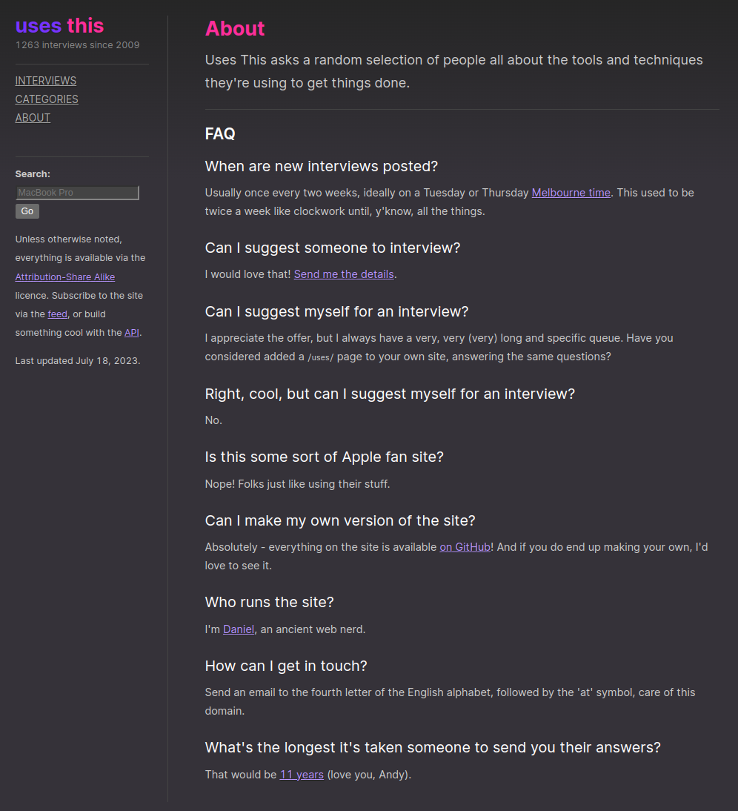

<!-- gid:20241009T121656 -->
[TOC]

[[TIP("이 노트에 대하여")]] Uses This는 사람들이 어떤 도구로 일을 해내는지 묻는 너디한 인터뷰 아카이브다. 창작자와 개발자의 작업 환경을 들여다보며 도구 선택의 취향과 실용을 함께 읽는다. [[/TIP]] 히스토리 - [2025-06-24 Tue 16:50] 수정 - [2024-10-09 Wed 12:16] nerdy 라는 말이 있지만 포지셔닝을 잘 해야 한다. 디자인 세계도 있고 어려운 부분이 있다. 관련메타 - [ 도구](https://wikidocs.net/380778)

## BIBLIOGRAPHY

  Daniel Bogan. 2024. “Uses This: Interviews.” June 12, 2024. [https://usesthis.com/interviews/](https://usesthis.com/interviews/).

## KEYWORDS

-   [notes/ 번역기: ImmersiveTranslate '2023-09-13 2025-04-21](https://wikidocs.net/381126)
-   [notes/ 크롬북: 휴대용 교육 디바이스 - 노트북 이맥스 '2023-11-07 2025-06-01](https://wikidocs.net/381151)
-   [notes/ 트랙볼 마우스 - 로지텍 MX ERGO '2024-05-30 2025-06-04](https://wikidocs.net/381233)
-   [notes/ 힣: 그의도구들 '2024-12-03 2026-03-22](https://wikidocs.net/381393)
-   [notes/ 커브드 모니터 추억 '2024-12-31 2025-05-21](https://wikidocs.net/381483)
-   [notes/ 클로드데스크톱: 워크플로우 제약 패턴 프롬프트 아티팩트 '2025-07-21 2025-07-21](https://wikidocs.net/381781)
-   [notes/ 힣: 키보드 인터페이스 - 한고무무 키크론 엘리스 인체공학 택타일(tactile) 스위치 '2025-11-30 2026-06-16](https://wikidocs.net/381834)

-   [콜로폰판권](https://wikidocs.net/380833)

## 2023 usethis : a nerdy little interview website

(Daniel Bogan 2024) Daniel Bogan 2024

[2023-07-24 Mon 16:04]

Uses This is a nerdy little interview website, asking people what they use to get the job done. <https://usesthis.com/>

아 주목할 것이 있다. API 를 제공한다. <https://usesthis.com/api/>

