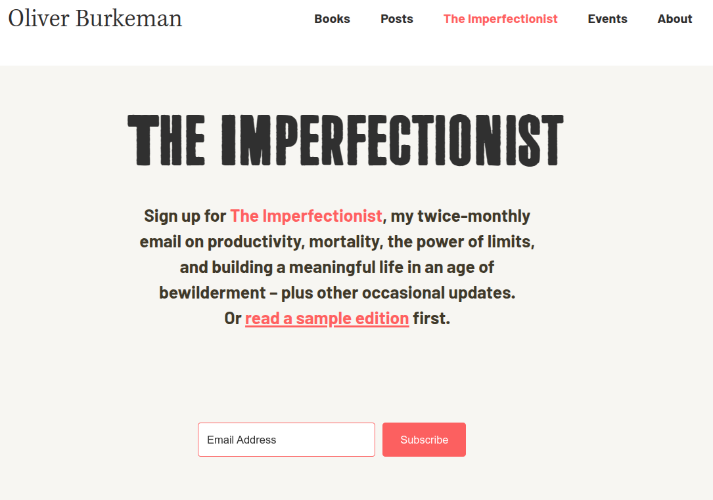

<!-- gid:20241024T134108 -->
[TOC]

[[TIP("이 노트에 대하여")]] 불완전주의자는 모든 것을 완벽히 관리하려는 강박에서 한 걸음 물러나는 태도와 닿아 있다. 올리버 버크먼의 뉴스레터를 매개로 시간감각과 계획 습관을 다시 본다. [[/TIP]] KEYWORDS - [bib/ 올리버버크먼 4000주 불완전주의 삶의유한함 받아들임 '2024-10-22 2025-05-23](https://notes.junghanacs.com/bib/20241022T145747/)
-   [bib/ 시몬윌리슨 SimonWillison - Datasette '2025-03-27 2025-03-27](https://notes.junghanacs.com/bib/20250327T071914/)
-   [notes/ 힣: 모두가 생산자 작은 소통 공간 커뮤니티 '2024-09-22 2025-02-15](https://notes.junghanacs.com/notes/20240922T103151/)
-   [notes/ 힣: 어쏠로지스트 뉴스레터 '2024-10-24 2025-03-06](https://notes.junghanacs.com/notes/20241024T134557/)
-   [notes/ 힣: 디지털가든 — 불완전함에서 창조가 나오는 곳 '2025-03-14 2026-06-25](https://notes.junghanacs.com/notes/20250314T152111/)
-   [notes/ 힣: 느린 창조도구 커뮤니티 인간 계층 분화 불완전함 테크노퓨달리즘 봉건 '2025-05-29 2026-07-08](https://notes.junghanacs.com/notes/20250529T114735/)

## BIBLIOGRAPHY

  올리버 버크먼. n.d. “There’s No Such Thing as a Fresh Start.” Accessed March 6, 2025. [https://www.oliverburkeman.com/freshstart](https://www.oliverburkeman.com/freshstart).

## 관련노트

-   [올리버 버크먼 영국 저널리스트 시간관리 마인드셋](https://notes.junghanacs.com/bib/20241022T145747/)
-   [계획](https://notes.junghanacs.com/meta/20241202T133400/)
-   [뉴스레터](https://notes.junghanacs.com/meta/20231223T072758/) 양식으로 좋다.
-   [어쏠로지스트: 뉴스레터](https://notes.junghanacs.com/notes/20241024T134557/)

## 불완전주의자 - 뉴스레터 신청

[The Imperfectionist | Oliver Burkeman - oliverburkeman.com](https://www.oliverburkeman.com/the-imperfectionist)

authologist

The Imperfectionist 불완전주의자

Sign up for The Imperfectionist, my twice-monthly email on productivity, mortality, the power of limits, and building a meaningful life in an age of bewilderment – plus other occasional updates.

Or read a sample edition first.

생산성, 죽음, 한계의 힘, 혼란의 시대에 의미 있는 삶을 구축하는 방법 등에 대해 한 달에 두 번씩 보내드리는 이메일인 '불완전주의자'에 가입하고 가끔씩 업데이트되는 다른 소식도 받아보세요.

### 스크린샷

## There’s no such thing as a fresh start

(올리버 버크먼 n.d.)

There's no such thing as a fresh start 새로운 시작이란 있을 수 없습니다.

I've been finishing up the edits for my book, which makes this an obvious moment to pause for breath and regroup, work-wise – time to organize my various projects, tame my out-of-control inbox, sort out the jumble of files on my Mac desktop, and draw up some schedules in my fancy notebook like the pitiful productivity geek I am.

저는 책 편집을 마무리하고 있습니다, 업무적으로는 여러 프로젝트를 정리하고, 통제 불능의 받은 편지함을 정리하고, Mac 데스크톱의 어지러운 파일을 정리하고, 생산성 괴짜처럼 멋진 노트북에 일정표를 작성하는 등 잠시 숨을 고르고 다시 정리하는 시간을 가졌어요.

The big lure of all such moments – as you'll know if you have a similar weakness for time management systems, decluttering initiatives and suchlike – is the promise of making a fresh start. The unspoken hope is that you won't just change a few things for the better, but make a total break with the past. You'll reboot your life, leave disorganization and procrastination behind you once and for all, and do everything differently from now on.

시간 관리 시스템, 정리 정돈 계획 등에 약점이 있는 분이라면 아시겠지만, 이러한 모든 순간이 주는 가장 큰 유혹은 새 출발에 대한 약속입니다. 무언의 희망은 단순히 몇 가지를 더 나은 방향으로 바꾸는 것이 아니라 과거와 완전히 단절하는 것입니다. 삶을 재부팅하고, 무질서와 미루는 습관을 완전히 버리고 지금부터 모든 일을 다르게 해보자는 것입니다.

As you're presumably aware, this is a terrible mindset for actually making lasting changes. What you need, instead, are tiny goals and a commitment to incremental progress ("small wins"), plus a willingness to encounter failure after failure as you stumble toward improvement. To put it another way: fresh-startism is a form of perfectionism, and as with all forms of perfectionism, the solution is to stop being such a perfectionist – to resign yourself to the fact that things probably won't unfold as flawlessly as you'd hoped.

아시다시피, 이러한 사고방식은 실제로 지속적인 변화를 이끌어내기에는 끔찍한 사고방식입니다. 대신 필요한 것은 작은 목표와 점진적인 발전("작은 승리")에 대한 헌신, 그리고 개선을 향해 나아가는 과정에서 실패를 기꺼이 받아들이는 마음가짐입니다. 다시 말해, 새로 시작하기주의는 완벽주의의 한 형태이며, 모든 형태의 완벽주의가 그렇듯이 해결책은 완벽주의자가 되지 않는 것, 즉 원하는 대로 일이 완벽하게 전개되지 않을 수도 있다는 사실을 인정하는 것입니다.

This much (as a recovering perfectionist) I've understood for years. But I've only more recently grasped the deeper point here, which isn't simply that fresh starts don't work as intended, but that there never are any fresh starts in the first place. Contrary to self-help cliché, the thing we perfectionists need to learn isn't that we're probably going to experience failure. It's that we've already failed, totally and irredeemably.

이 정도는 (회복 중인 완벽주의자로서) 수년 동안 이해해 왔습니다. 하지만 최근에야 더 깊은 요점을 깨달았는데, 그것은 단순히 새 출발이 의도대로 되지 않는다는 것이 아니라 애초에 새 출발이란 존재하지 않는다는 것입니다. 완벽주의자들이 배워야 할 것은 자기 계발서의 진부한 표현과는 달리 실패를 경험하게 될 것이라는 사실이 아닙니다. 우리는 이미 완전히, 그리고 돌이킬 수 없을 정도로 실패했다는 사실입니다.

This is liable to sound incredibly depressing, but since it's actually fantastic news, I hope you'll allow me to elaborate.

엄청나게 우울하게 들릴 수도 있겠지만, 사실 환상적인 소식이니 자세히 설명해드리겠습니다.

You have already failed 이미 실패했습니다.

Behind our more strenuous attempts at personal change, there's almost always the desire for a feeling of control. We want to lever ourselves into a position of dominance over our lives, so that we might finally feel secure and in charge, and no longer so vulnerable to events. But whichever way you look at it, this kind of control is an illusion. It implies the ability to somehow stand back from or get outside of your life – which you never can, obviously, because you just are your life.

개인적인 변화를 위한 노력의 이면에는 거의 항상 통제감을 얻고자 하는 욕구가 숨어 있습니다. 우리는 자신의 삶을 지배할 수 있는 위치에 올라서서 마침내 안정감과 책임감을 느끼고 더 이상 사건에 휘둘리지 않기를 원합니다. 하지만 어느 쪽에서 보든 이런 종류의 통제는 환상입니다. 그것은 어떻게든 자신의 삶에서 물러나거나 삶에서 벗어날 수 있는 능력을 의미하는데, 이는 분명히 자신의 삶이기 때문에 결코 불가능합니다.

What this means, for one thing, is that the perfectionist's fantasy of reaching her deathbed with a perfect record of accomplishments under her belt isn't just extremely unlikely, but doomed from the start, because (to mix metaphors) the years she's already lived are water under the bridge. All the time you've already wasted, the people you've disappointed, the opportunities you failed to seize – it's all already happened, and can never be undone.

우선, 완벽주의자가 완벽한 업적을 남긴 채 임종에 이른다는 환상은 극히 희박할 뿐만 아니라, 이미 살아온 세월이 다리 밑의 물이기 때문에 처음부터 운명적이라는 뜻입니다(비유를 섞자면). 이미 낭비한 시간, 실망시킨 사람들, 포착하지 못한 기회 등 모든 것은 이미 일어난 일이며 결코 되돌릴 수 없습니다.

It also means that the person attempting to leave the past behind, by making a fresh start, is one who's been completely shaped by that past. The self you're seeking to transform is the same one that's doing the transforming – so you're like Baron Munchausen, trying to pull himself out of the swamp by yanking on his own hair. You can never start life afresh, because you're hopelessly stuck in this life; there's no breaking through to another one in which everything's different and better.

또한 과거를 뒤로하고 새 출발을 시도하는 사람은 과거에 의해 완전히 형성된 사람이라는 의미이기도 합니다. 여러분이 변화시키려는 자아와 변화시키고자 하는 자아가 동일하기 때문에, 여러분은 마치 자신의 머리카락을 잡아당겨 늪에서 빠져나오려는 뮌하우젠 남작과 같은 존재입니다. 이 삶에 절망적으로 갇혀 있기 때문에 모든 것이 다르고 더 나은 다른 삶으로 돌파할 수 없기 때문에 결코 새롭게 삶을 시작할 수 없습니다.

The reason this is so liberating, for anyone with even a hint of perfectionism, is that it means you get to give up on the exhausting struggle to take charge of your life, so as to steer it in a new direction. You get to abandon all hope of one day finding the perfect time management system – or perfect relationship, job, neighborhood, etcetera – and relax back into the inescapable chaos and muddle of the one you have.

완벽주의 성향이 조금이라도 있는 사람이라면 이 방법이 자유로울 수 있는 이유는 자신의 삶을 주도적으로 이끌기 위한 지친 투쟁을 포기하고 새로운 방향으로 나아갈 수 있기 때문입니다. 언젠가 완벽한 시간 관리 시스템이나 완벽한 인간관계, 직장, 이웃 등을 찾을 수 있다는 희망을 모두 버리고 피할 수 없는 혼돈과 혼돈 속에 다시 편안히 안주할 수 있다는 뜻입니다.

And then – once you're facing your real situation, not fixating on a fantasy alternative – you suddenly find yourself able to start making a few concrete improvements, here and now, unburdened by any need for those improvements to usher in a golden age of perfection. This, in my experience, is the only way personal change ever really happens: by first seeing that it's always a matter of rebuilding the ship mid-ocean, making adjustments to a life you can't ever take back to port or trade for another.

그리고 환상의 대안에 집착하지 않고 현실의 상황을 직시하게 되면, 완벽의 황금기를 맞이하기 위한 개선의 필요성에 대한 부담 없이 지금 여기에서 몇 가지 구체적인 개선을 시작할 수 있게 됩니다. 제 경험에 비추어 볼 때, 이것이 바로 개인적인 변화가 실제로 일어나는 유일한 방법입니다. 즉, 다시는 항구로 돌아갈 수 없는 삶을 조정하거나 다른 삶과 바꿀 수 없는 바다 한가운데 배를 재건하는 일이라는 것을 먼저 깨달아야만 합니다.

The American Zen teacher John Tarrant says, "freedom, waking up and fearlessness come down to the simplicity of 'Wait a minute, what if this is it?'" When I hear such exhortations to live in the moment, the fresh-start addict in me is quite capable of turning them into perfectionistic plans, too: "From tomorrow morning, I'll meditate every single day, and become the kind of person who lives in the moment!" But Tarrant's point isn't that you should live in the moment tomorrow. It's that this is it, right now, with all its odious imperfections – the tasks that remain unaddressed, the messes that haven't been cleared up, the enormous personality flaws that still haven't been corrected. And it's the only place I can ever hope to get anything meaningful done.

미국의 선(禪) 스승인 존 태런트(John Tarrant)는 "자유와 깨어남, 두려움 없는 삶은 '잠깐만, 이게 아니면 어떨까'라는 단순함에서 나온다"고 말합니다. 순간을 살라는 이런 권고를 들으면, 제 안의 새출발 중독자는 완벽주의적인 계획으로 바꾸어버릴 수 있습니다: "내일 아침부터 매일 명상을 하며 순간에 집중하는 사람이 되겠다!"라고요. 하지만 태런트의 요점은 내일 그 순간에 살아야 한다는 것이 아닙니다. 해결되지 않은 과제, 정리되지 않은 지저분함, 아직 고쳐지지 않은 엄청난 성격적 결함 등 모든 끔찍한 불완전함이 있는 지금 이 순간이 바로 지금이라는 것입니다. 그리고 제가 의미 있는 일을 해낼 수 있는 유일한 곳이기도 합니다.

To receive posts as soon as they're available, subscribe to my email The Imperfectionist.

새 글이 올라오는 즉시 받아보려면 내 이메일 The Imperfectionist를 구독하세요.
